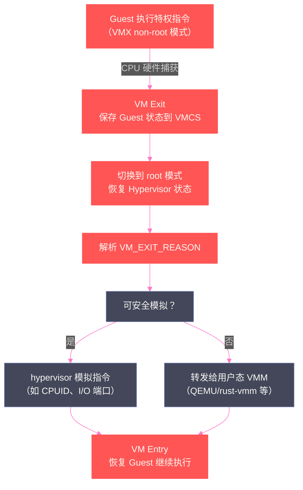
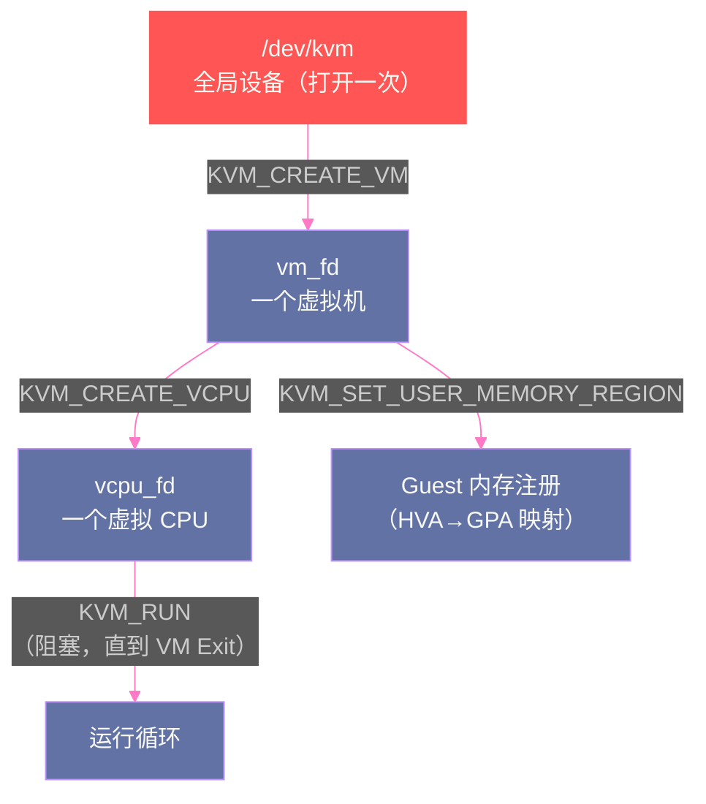
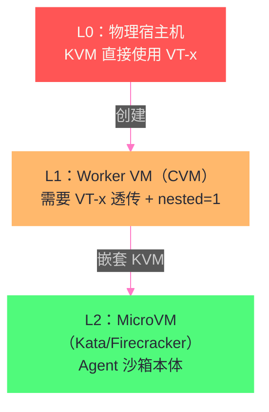

# 04 KVM 与硬件虚拟化——MicroVM 隔离的硬件基石

**摘要：**

[[隔离原语/03 隔离边界的光谱——从共享内核到 MicroVM 的四档技术路线|第 03 篇]] 把硬件虚拟化列为隔离光谱的最高档，并给出了 Kata/Firecracker 的宏观对比。本文回答一个更深的问题：**"硬件级隔离"到底强在哪里、由什么机制强制实施？** 答案藏在 CPU 与内存虚拟化的硬件机制中：CPU 虚拟化由处理器内置的 VMX（Intel VT-x）状态机强制执行——虚拟机陷入（VM Exit）与恢复（VM Entry）由硬件裁决，不可信负载的任何"越权"动作都会在硬件层面被拦下；内存虚拟化由 EPT（Extended Page Tables）的两级地址转换强制执行——Guest 的物理地址映射由 hypervisor 独占维护，Guest 无法构造指向宿主机内存的映射。文章深入 KVM 的三级 fd 架构（kvm_fd/vm_fd/vcpu_fd）与 ioctl 生命周期，剖析嵌套虚拟化（L0/L1/L2）的退出分类机制与生产门禁，并完整记录素材中 CVM 嵌套虚拟化的真实验证过程（VT-x 透传、kvm_intel 加载、nested=1 配置）与"能加载不等于可用"的工程教训。核心认知：**MicroVM 的隔离强度不来自"软件写得好"，而来自"CPU 硬件状态机 + EPT 页表"的结构性强制——这正是它区别于 gVisor（用户态软件）与 runc（原语组合）的本质**。

---

## 第 1 章 为什么硬件虚拟化是"硬件级"隔离

### 1.1 软件隔离的天花板

回顾前两篇的结论：runc 的隔离依赖内核原语（namespace/cgroups/seccomp/capabilities），gVisor 的隔离依赖用户态软件（Sentry 拦截 syscall）。这两者的共同特征是——**隔离的"裁决者"与"被隔离者"在同一层软件生态中**：

- runc 场景：被隔离的代码与隔离机制（内核）共享同一内核，攻击目标是内核漏洞；
- gVisor 场景：被隔离的代码与隔离机制（Sentry）通过 syscall 接口交互，攻击目标是 Sentry 的逻辑漏洞。

硬件虚拟化把裁决者换成了**处理器本身**：CPU 提供了一套虚拟机执行模式（VMX root / VMX non-root），不可信负载运行在 non-root 模式中，**任何试图执行特权操作、访问 hypervisor 内存、篡改中断的行为，都会被 CPU 硬件捕获（VM Exit）并交给 hypervisor 处理**。攻击者要逃逸，必须先找到"硬件虚拟化层"的漏洞——这个攻击面比任何用户态程序都小、比任何内核模块都难利用。

> [!info] 核心概念：信任边界的三次外移
> 隔离信任边界的三次外移，对应三种不同的"裁决者"：runc 的裁决者是**内核代码**（漏洞多、攻击面大）；gVisor 的裁决者是**用户态软件 Sentry**（Go 内存安全缩小了攻击面，但仍是软件）；KVM/MicroVM 的裁决者是**CPU 硬件状态机**（固化的电路逻辑，没有"内存安全 bug"这个概念）。理解这个递进关系，就理解了为什么"硬件级隔离"是隔离光谱的最高档——**它把隔离从"代码问题"变成了"硬件问题"**。

### 1.2 虚拟化的历史背景：为什么需要硬件支持

在 Intel VT-x（2005）与 AMD-V（2006）出现之前，x86 虚拟化依赖"二进制翻译"（Binary Translation）——VMM（如 VMware Workstation 的早期版本）在软件层面扫描并改写 Guest 的特权指令，让它们"看起来"在虚拟环境下安全执行。这条路有两个致命问题：

**问题一：性能损耗**。每条特权指令都要经过翻译/模拟路径，性能开销动辄 20-30%，且无法对性能做预测。

**问题二：完整性风险**。翻译器必须穷举所有特权指令模式——任何漏网的特权指令都可能让 Guest 直接操作硬件，虚拟化边界形同虚设。

硬件虚拟化扩展的引入把这两个问题一起解决：CPU 增加"VMX non-root 模式"——Guest 的特权指令在 non-root 模式下执行**不直接操作硬件**，而是触发 VM Exit 交给 hypervisor 裁决。**硬件不再区分"哪条指令是特权的"，而是强制"non-root 模式下所有特权操作都先经过 hypervisor"**——这是结构性的强制，不依赖软件枚举的完备性。

### 1.3 一个直觉模型：虚拟机是"被硬件看管的进程"

理解 KVM 最直觉的模型是：**虚拟机（VM）在宿主机上只是一个普通进程，但 CPU 硬件给了这个进程一个特殊的"身份标记"（VMCS，Virtual Machine Control Structure）**。普通进程执行特权指令时，内核会检查权限并代为执行；VM 进程（在 non-root 模式）执行特权指令时，CPU 不检查权限，而是直接暂停该进程（VM Exit），唤醒 hypervisor 来处理——**hypervisor 拥有绝对的裁决权，且这个权力由 CPU 电路保证，不依赖任何软件约定**。

```
普通进程：  特权指令 → 内核（检查权限 → 执行/拒绝）
VM 进程：   特权指令 → CPU 硬件 → VM Exit → hypervisor（裁决 → 恢复 VM）
                                     ↑
                          这个跳转由 CPU 电路强制执行，
                          Guest 无法跳过、无法伪造、无法篡改
```

这个模型解释了硬件虚拟化与软件隔离的本质差异：**软件隔离的强度取决于"代码写得有多好"，硬件虚拟化的强度取决于"CPU 设计得有多对"**——后者经过数十年安全审计，攻击面是数量级意义上的小。

### 1.4 硬件虚拟化的四个支柱

完整的硬件虚拟化不是"CPU 一个点"，而是四个硬件支柱的协同。理解全部四根支柱，才能评估"MicroVM 到底隔离了什么"：

| 支柱 | 硬件机制 | 隔离的内容 |
| :--- | :--- | :--- |
| **CPU 虚拟化** | VMX/AMD-V（VM Entry/Exit 状态机） | 特权指令、模式切换、指令执行 |
| **内存虚拟化** | EPT/NPT（两级页表） | 地址空间、内存访问、DMA 目标 |
| **中断虚拟化** | APICv/vAPIC、posted interrupts | 中断注入、设备中断路由 |
| **I/O 虚拟化** | IOMMU（VT-d/AMD-Vi）、virtio | 设备直通、DMA 隔离 |

四个支柱中，**IOMMU 是常被忽略却极其关键的一根**：没有 IOMMU，直通设备（GPU/网卡）的 DMA 可以直接读写宿主机物理内存——设备级绕过 EPT 的路径存在。MicroVM 方案默认不使用设备直通（极简设备模型），也就天然规避了大部分 IOMMU 需求；但 Kata 的 GPU 直通场景（QEMU hypervisor）必须同时启用 IOMMU 才能保证 DMA 隔离。**评估一个虚拟化方案的隔离强度时，四根支柱要逐一过问**——只问"有没有 VMX"是远远不够的。

---

## 第 2 章 CPU 虚拟化：VMX 状态机与 VM Exit

### 2.1 VMX root 与 non-root：两个世界

Intel VMX（Virtual Machine Extensions）定义了两种操作模式：

| 模式 | 运行者 | 权限 | 触发条件 |
| :--- | :--- | :--- | :--- |
| **VMX root 模式** | hypervisor（KVM/QEMU/VMM） | 完全特权 | 正常的内核/用户态切换 |
| **VMX non-root 模式** | Guest（虚拟机内的内核+用户态） | 受限 | 由 VM Entry 进入 |

**关键点：non-root 模式下的"特权"是假象**。Guest 内核以为自己在 ring 0 执行特权指令（它看到的 CR3、IDTR 等都是虚拟的），但实际上任何特权操作（写 CR3、开中断、执行特权指令）都会触发 VM Exit——**Guest 永远无法直接操作真实硬件**。

### 2.2 VMCS：虚拟机的"身份证"

每个 vCPU 关联一个 VMCS（Virtual Machine Control Structure）——一个由 hypervisor 维护的数据结构，记录：

- **Guest 状态**：Guest 的寄存器、CR3、IDTR、LDTR 等（VM Entry 时恢复）；
- **Host 状态**：hypervisor 的寄存器上下文（VM Exit 时恢复）；
- **VM 执行控制**：哪些指令/事件触发 VM Exit（如"EPT 违规"、"CPUID 指令"）；
- **VM Exit 原因**：本次退出是为什么（如"访问了未映射的 Guest 物理地址"）。

VMCS 的操作指令（VMPTRLD/VMCLEAR/VMREAD/VMWRITE）本身也是特权指令——**只有 hypervisor 能读写 VMCS**。Guest 无法修改自己的"身份证"，也就无法篡改"哪些操作会触发 VM Exit"的规则。

### 2.3 VM Exit 的完整流程

当 Guest 触发退出条件时，CPU 硬件执行以下序列（无需软件参与）：

1. 保存 Guest 状态到 VMCS；
2. 从 VMCS 恢复 Host 状态；
3. 切换到 root 模式；
4. 跳转到 hypervisor 注册的 VM Exit 处理入口；
5. hypervisor 解析 VM Exit 原因（`VM_EXIT_REASON` 字段），决定如何处理（模拟指令、转发给用户态 QEMU、或直接恢复执行）。



**"模拟"与"转发"的分工**：KVM 内核模块处理高频、简单的退出（如 CPUID、CR 访问、EPT 违规），用户态 VMM（QEMU/Firecracker 等）处理低频、复杂的设备模拟（如 virtio 设备 I/O）。这个分工是性能的关键——**高频路径留在内核，低频路径才出内核**。

### 2.4 为什么 VM Exit 是安全的（而非缓慢的）

一个常见疑问："VM Exit 让每条特权指令都退出一次，性能怎么受得了？"答案在于**执行控制位的精细粒度**：VMCS 的"VM-execution controls"允许 hypervisor 声明"哪些事件不触发退出"——例如：

- **不退出**：普通算术指令、内存访问（除非 EPT 违规）、无特权指令——这些在 non-root 模式直接执行，零开销；
- **退出**：特权指令（CR3 写入等）、敏感指令（INVEPT 等）、中断/异常（按配置）、EPT 违规。

因此 VM Exit 只发生在"真正需要 hypervisor 介入"的时刻——Guest 的绝大多数指令（包括用户态代码）在 non-root 模式以原生速度执行。**这正是"硬件虚拟化接近原生性能"的结构性原因**：不是虚拟化没有开销，而是开销被硬件精确地限制在"必须介入"的路径上。

---

## 第 3 章 内存虚拟化：EPT 的两级地址转换

### 3.1 影子页表的时代：软件维护的脆弱

在 EPT（Extended Page Tables，Intel 2008 引入）之前，内存虚拟化依赖"影子页表"（Shadow Page Table）：hypervisor 为 Guest 的每个页表维护一份"影子"，把 Guest 虚拟地址直接映射到宿主机物理地址（跳过 Guest 物理地址这一层）。问题：

**性能**：Guest 每次修改页表（mmap/munmap 频繁发生），hypervisor 都要同步重建影子页表——TLB 刷新频繁，性能损耗显著。

**安全**：影子页表由 hypervisor 软件维护——如果同步逻辑有漏洞，Guest 可能获得"直通"映射（Guest 虚拟地址直接映射到宿主机物理地址），**绕过隔离**。影子页表时代的内存隔离强度取决于"hypervisor 软件的正确性"——这是软件隔离，不是硬件隔离。

### 3.2 EPT：第二级页表，硬件强制执行

EPT 的思路极其优雅：**不替换 Guest 的页表，而是在旁边增加"第二级"地址转换**。

```
Guest 虚拟地址 → (Guest 页表, 由 Guest 自己管理) → Guest 物理地址
                                                 ↓
                    (EPT, 由 hypervisor 独占管理) → 宿主机物理地址
```

关键特性：

| 特性 | 含义 |
| :--- | :--- |
| **两级转换** | Guest 虚拟地址先经 Guest 页表转成 Guest 物理地址（GPA），再经 EPT 转成宿主机物理地址（HPA） |
| **独占管理** | EPT 页表只由 hypervisor 维护——Guest 没有写 EPT 的指令路径 |
| **硬件执行** | 地址转换由 CPU 内存管理单元（MMU）硬件完成——Guest 无法跳过 |
| **权限控制** | EPT 条目带读写执行权限位——hypervisor 可以把 Guest 内存设为只读/不可执行 |

**安全意义**：Guest 物理地址空间是"虚拟的"——Guest 以为自己在访问 0x1000，实际映射到宿主机的哪块物理内存完全由 EPT 决定。**Guest 没有任何机制构造"指向宿主机内核内存"的映射，因为地址转换的最后一跳（GPA→HPA）在硬件层面由 hypervisor 独占控制**。这就是"内存级隔离"的完整含义。

### 3.3 EPT 违规与缺页处理

Guest 访问未映射的 Guest 物理地址时，CPU 产生 **EPT Violation**（VM Exit 原因之一），hypervisor 检查后决定：

- Guest 页表尚未建立映射 → 返回缺页错误给 Guest（Guest 自行处理，与正常缺页无异）；
- Guest 访问了"存在但被 EPT 标为不可访问"的内存 → hypervisor 可以记录/审计/拒绝——**这是沙箱实现"内存访问控制"的硬件钩子**。

对 Agent 沙箱的实际意义：CubeSandbox/Firecracker 类平台可以在 EPT 层实现"Guest 只能访问自己被分配的内存范围"的硬保证——即使沙箱内代码完全失控（被注入、被攻破），也无法读取相邻沙箱或宿主机内存。**这是 MicroVM 多租户安全的物理基础**。

### 3.4 性能特征：为什么 EPT 比影子页表快

| 维度 | 影子页表 | EPT |
| :--- | :--- | :--- |
| 地址转换 | 单级（Guest VA→HPA），软件维护 | 两级（Guest VA→GPA→HPA），硬件维护 |
| Guest 页表修改 | 触发 hypervisor 同步（软件开销） | 无需同步（硬件自动走两级转换） |
| TLB 行为 | 共享 TLB，频繁失效 | 专用 TLB（EPTP 切换），命中率高 |
| 内存开销 | 每个 Guest 进程一份影子页表 | 每个 VM 一份 EPT（可按需分配） |

代价：两级转换让"每次地址翻译"多一次内存查找——但 CPU 用 EPT 专用缓存（EPT TLB）与页表遍历缓存（PML4/PDP 缓存）消化了大部分开销。**实测中 EPT 的内存密集负载比影子页表快 10-40%**（SPEC 类基准），这是 MicroVM 能承担"每沙箱一个 VM"的硬件前提。

### 3.5 中断虚拟化：设备中断的隔离路径

中断是虚拟化中"看不见但离不开"的支柱——Guest 的设备（virtio-net 等）产生中断时，中断不能直接打到 Guest 的 IDT（中断描述符表），否则 Guest 可以伪造中断向量。现代中断虚拟化（APICv / posted interrupts）的路径：

```
物理设备中断 → IOMMU/中断控制器 → hypervisor 检查（目标 vCPU 是否合法）
             → posted interrupt（直接把中断"投递"到目标 vCPU 的虚拟 APIC）
             → VM Entry 时 Guest 看到中断
```

**安全要点**：中断注入的目标 vCPU、向量号、优先级都由 hypervisor 控制——Guest 无法伪造"来自设备"的中断（伪造的写操作会触发 VM Exit）。**posted interrupts 的优化意义**：合法的设备中断不需要先 VM Exit 再注入，而是在下次 VM Entry 时自动呈现——减少了中断路径的退出次数。对沙箱性能的意义：网络密集负载（virtio-net 中断频繁）在这条路径上获得接近原生的中断延迟。

---

## 第 4 章 KVM 架构：三级 fd 与 ioctl 生命周期

### 4.1 /dev/kvm 与三级 fd

KVM（Kernel-based Virtual Machine）是 Linux 内核的虚拟化模块——它把 CPU/内存虚拟化能力封装为字符设备接口，用户态 VMM 通过 ioctl 系统调用使用。KVM 的 API 设计是三级 fd 体系：



| fd | 创建方式 | 职责 | 关键 ioctl |
| :--- | :--- | :--- | :--- |
| **kvm_fd** | `open("/dev/kvm")` | 全局能力查询与 VM 创建 | `KVM_GET_API_VERSION`、`KVM_CREATE_VM` |
| **vm_fd** | `KVM_CREATE_VM` | 虚拟机资源（内存/设备/中断） | `KVM_SET_USER_MEMORY_REGION`、`KVM_CREATE_VCPU` |
| **vcpu_fd** | `KVM_CREATE_VCPU` | 单个 vCPU 的执行 | `KVM_SET_REGS`、`KVM_SET_SREGS`、`KVM_RUN` |

**KVM_RUN 是核心**：VMM 对每个 vCPU 调用 `KVM_RUN` 后，该 ioctl **阻塞直到下一次 VM Exit**——返回时 `run` 结构体中携带退出原因（`kvm_run.exit_reason`）。VMM 处理退出后再次调用 `KVM_RUN`。整个虚拟机的"运行"就是 VMM 围绕 `KVM_RUN` 的循环。

### 4.2 一个 VM 的完整生命周期

以 Firecracker 类 MicroVM 为例，从创建到运行的内核路径：

```c
// 伪代码：MicroVM 创建的最小骨架
int kvm_fd = open("/dev/kvm", O_RDWR);              // 1. 打开 KVM 设备
int vm_fd  = ioctl(kvm_fd, KVM_CREATE_VM, 0);        // 2. 创建 VM
ioctl(vm_fd, KVM_SET_USER_MEMORY_REGION, &region);   // 3. 注册 Guest 内存（HVA↔GPA）
int vcpu_fd = ioctl(vm_fd, KVM_CREATE_VCPU, 0);      // 4. 创建 vCPU
ioctl(vcpu_fd, KVM_SET_SREGS, &sregs);               // 5. 设置 Guest 初始状态（入口 RIP 等）
while (true) {
    ioctl(vcpu_fd, KVM_RUN, 0);                      // 6. 运行 vCPU（阻塞到 VM Exit）
    handle_exit(&run);                               // 7. 处理退出（设备模拟/转发）
}
```

**注意第 3 步**：`KVM_SET_USER_MEMORY_REGION` 是内存隔离的契约点——VMM 声明"哪些宿主机用户态内存区间映射为 Guest 的哪些物理地址"。**未经注册的内存区间，Guest 无论如何都无法访问**——这是 EPT 隔离的 API 侧表达。

### 4.3 vCPU 与线程：KVM 的线程模型

一个细节容易让人困惑：**vCPU 不是内核线程，也不是特殊实体——每个 vCPU_fd 的 `KVM_RUN` 调用由一个普通的用户态线程执行**。这意味着：

- vCPU 的调度（哪个物理核跑哪个 vCPU）由宿主机 CFS 调度器决定——VMM 可以通过 CPU affinity 固定 vCPU 到物理核（MicroVM 平台常用）；
- `KVM_RUN` 阻塞期间，该线程不占 CPU——等待 VM Exit 时 vCPU 是"空闲"的；
- **多 vCPU 的 VM 对应多个用户态线程**——VMM 的线程数 = vCPU 数 + 辅助线程（I/O 事件循环等）。

对 MicroVM 场景的含义：单 vCPU 的 MicroVM（Agent 沙箱常见配置）在宿主机上就是一个线程——**资源模型的粒度与容器几乎一致**（一个沙箱 ≈ 一个进程 + 若干辅助进程），这解释了为什么 MicroVM 方案可以做到"每沙箱一个 VM"的密度：VM 的宿主侧成本主要是内存（Guest 内核 + 页表），而非 CPU 线程开销。

### 4.4 KVM 与 QEMU/Firecracker 的分工

KVM 是内核模块（负责 CPU/内存虚拟化），QEMU/Firecracker 是用户态 VMM（负责设备模拟与固件加载）。分工边界：

| 层 | 组件 | 职责 |
| :--- | :--- | :--- |
| **内核** | KVM 模块 | VMX 管理、EPT 维护、VM Exit 处理、中断注入 |
| **用户态** | QEMU / Firecracker / Cloud Hypervisor | 固件/引导加载、virtio 设备模拟、I/O 转发、速率限制 |

对 MicroVM 场景，用户态 VMM 越薄越好——Firecracker 只保留 6 个设备，就是要把"用户态攻击面"压缩到最小（[[隔离原语/05 VMM 解剖——Firecracker、Cloud Hypervisor 与 Kata 的虚拟机监视器家族|第 05 篇]] 详述）。

> [!note] 设计哲学：内核做"最小可信计算基"
> KVM 的设计哲学是"内核只做不可不做的事"：CPU 虚拟化（VMCS 管理）与内存虚拟化（EPT）必须在内核（硬件接口最近处），设备模拟全部推到用户态。这样设计的结果是：**内核侧的可信计算基（TCB）极小**（KVM 模块数万行），用户态 VMM 即使被攻破（如 QEMU 的 virtio 漏洞），攻击者得到的也只是"用户态进程权限"而非内核权限。MicroVM 方案把这条哲学推到极致——用户态 VMM 也被 jailer 沙箱化。

---

## 第 5 章 嵌套虚拟化：L0/L1/L2 与生产门禁

### 5.1 什么是嵌套虚拟化

嵌套虚拟化（Nested Virtualization）指**在虚拟机里再跑虚拟机**：宿主机（L0）上运行 Worker VM（L1），L1 内部再创建 MicroVM（L2）——Agent 沙箱的 Kata/Firecracker 场景正是这个结构：



**关键事实：多出来的 L1 才是门禁**。裸金属（物理机）上跑 Kata 不需要嵌套（L0 直接提供 VT-x）；但在云 VM（CVM）上跑 Kata，L1 必须把 VT-x 透传给 L2 使用——**L1 的虚拟化能力（是否透传 VT-x、是否开启 nested、性能损耗多少）决定了整个方案是否可行**。

### 5.2 嵌套虚拟化的退出分类：L1 不拦截的由 L0 直处理

嵌套虚拟化的核心机制是**退出分类**：L2 的 VM Exit 首先由谁处理？现代实现（Intel VMCS shadowing / AMD nested page tables）的策略是：

- **L1 配置了拦截的事件**：L2 的 VM Exit 由 L1 处理（L1 是 L2 的"直接 hypervisor"）；
- **L1 未配置拦截的事件**：L2 的 VM Exit 直接由 L0 处理——**L0 是最终的硬件裁决者**。

素材调研（Phase1-04）明确记录了这个机制："嵌套虚拟化按退出类型分化——L1 不拦截的退出由 L0 直处理"。这个分化的安全含义：**即使 L1（Worker VM）被攻破，L2 的硬件隔离仍由 L0 兜底**——嵌套不是"隔离的稀释"，而是"隔离的叠加"，只是多了一层性能损耗。

### 5.3 嵌套虚拟化的性能代价

嵌套的性能损耗来自两个层面：

**VM Exit 的串联处理**：L2 的退出可能需要 L1 与 L0 两级处理（取决于拦截配置）——路径变长，延迟叠加。

**EPT 的两级嵌套**：L0 维护 L1 的 EPT，L1 维护 L2 的 EPT——L2 的地址转换变成三级（L2 GPA→L1 GPA→L0 HPA），TLB 命中率下降，缺页路径更长。

**实测量级**：素材 PoC 中，Kata 在裸金属的启动 p50 为 4.0s；嵌套场景（CVM）的真实性能尚未过门禁（Phase5-03 明确"嵌套 Kata 未过门禁前只做灰度"）——**嵌套的损耗数字必须在同型节点上实测，不能从裸金属数据外推**。这是素材反复强调的方法论：**性能数据必须绑定测量场景**（[[工程实践/12 沙箱性能工程——Runtime 基准与 WarmPool 容量管理|第 12 篇]]）。

### 5.4 嵌套虚拟化的生产门禁：素材中的四道关卡

素材 Phase5-03 把"Kata 上 CVM 嵌套"的生产放行条件定义为四道关卡，这是全文最值得抄录的清单之一：

| 门禁 | 内容 | 为什么需要 |
| :--- | :--- | :--- |
| **厂商书面确认** | 云厂商书面确认该机型支持 VT-x 透传与嵌套虚拟化 | 云平台的虚拟化策略可能随时变化（超卖、热迁移、新机型缺透传）——口头承诺不构成运维依据 |
| **性能对照** | 嵌套 vs 裸金属的同型节点性能对照数据 | 嵌套损耗不能外推——必须"同型节点"实测 |
| **运维事件** | 该机型在目标时间段内的虚拟化相关运维事件记录 | 透传/Nested 参数在平台维护中可能被重置 |
| **24-72 小时稳定性** | 连续 24-72 小时的高负载稳定性观察 | 暴露间歇性问题（如特定负载下的 EPT 异常） |

**门禁背后的工程逻辑**：嵌套虚拟化不是一个"配置开关"，而是"云平台底层虚拟化策略的暴露面"——**L1 的虚拟化能力由云平台控制，不在你手里**。素材作者给出的兜底方案也值得注意："未过门禁前只做灰度，兜底是 RHEL 9 裸金属 Worker"——**生产路径永远有一条不依赖云平台虚拟化策略的退路**。

### 5.5 嵌套过不了门禁怎么办：三条退路

嵌套门禁不通过（或云平台明确不支持嵌套）时，Kata/MicroVM 仍有三条退路，素材作者按优先级排列：

**退路一：裸金属 Worker 节点**。在物理机上直接跑 Kata——不经过 L1，VT-x 由 L0 直接提供，无嵌套损耗。这是素材作者明确的首选兜底（"兜底是 RHEL 9 裸金属 Worker"）。代价：需要采购/调配物理机，失去云 VM 的弹性。

**退路二：gVisor 替代**。威胁等级允许时，用 gVisor（第三档）替代 Kata（第四档）——不需要任何虚拟化硬件，CVM 里直接用 systrap platform（[[隔离原语/03 隔离边界的光谱——从共享内核到 MicroVM 的四档技术路线|第 03 篇]] 的门禁二）。代价：隔离强度降一档。

**退路三：混合拓扑**。控制面/普通负载在云 VM，高安全负载调度到专门的裸金属池——通过节点标签与 RuntimeClass 调度分离（素材生产方案的"Worker 节点物理故障域分布"正是这个思路）。代价：运维复杂度上升。

**选择逻辑**：先确认"高安全负载的规模与频次"——规模小选退路一（最省心），规模大且威胁等级中选退路二（最省钱），两者都需要时选退路三。**不要让"云平台不支持嵌套"成为整个沙箱项目的阻塞点**——换一条路即可。

---

## 第 6 章 实测验证：CVM 嵌套虚拟化的真实记录

### 6.1 素材中的验证过程

素材 Phase1-04 记录了作者在公司 CVM（云虚拟机）上验证嵌套虚拟化能力的完整过程。验证目标是回答三个问题：CVM 是否透传了 VT-x？KVM 模块能否加载？嵌套虚拟化是否开启？

**第一步：检查 CPU 虚拟化标志**。在 CVM 内执行 `grep -E "vmx|svm" /proc/cpuinfo`，确认 CPU 暴露了 VMX 标志——**这证明宿主平台透传了 VT-x**（若未透传，Guest 内看不到 vmx 标志）。作者在 ht100040.venus 上验证通过。

**第二步：加载 KVM 模块**。`modprobe kvm_intel`（Intel 平台）——模块加载成功说明内核认可 CPU 的虚拟化能力。作者验证通过。

**第三步：检查嵌套开关**。读取 `/sys/module/kvm_intel/parameters/nested`，确认值为 `1`（开启嵌套）或 `Y`。作者验证通过，nested=1。

**验证结论**：CVM 的嵌套虚拟化配置闸门通过——"真实 MicroVM 生命周期和性能仍需 PoC 实测"（素材原话）。**注意这个结论的克制**：配置闸门通过 ≠ 生产可用——后面还有性能对照、稳定性观察等四道关卡（5.4）。

### 6.2 验证清单：任何嵌套场景的可复制步骤

把素材的验证过程整理为可复制清单：

```bash
# 1. 确认 CPU 虚拟化标志（vt-x 透传）
grep -E "vmx|svm" /proc/cpuinfo | head -1

# 2. 确认内核虚拟化支持
ls /dev/kvm

# 3. 加载 KVM 模块并确认 nested 参数
modprobe kvm_intel
cat /sys/module/kvm_intel/parameters/nested   # 期望 1 或 Y

# 4. 创建测试 VM 并确认 VMX 在 Guest 内可见
# （在测试 VM 内重复第 1 步）

# 5. 最小化 Kata/MicroVM 冒烟：创建、启动、执行、销毁
```

### 6.3 "能加载 kvm_intel"不等于"嵌套可用"

素材记录中有一个重要的工程教训：**`modprobe kvm_intel` 成功只证明"当前节点"具备虚拟化能力，不证明"嵌套可用"**。原因：

- 云平台的嵌套支持可能随宿主机的超卖状态、CPU 型号、内核版本变化——**今天可用不代表明天可用**（这正是"厂商书面确认"门禁存在的理由）；
- 某些云平台"透传了 vmx 标志但关闭了 VMCS shadowing"——Guest 能看到 VT-x、KVM 能加载，但嵌套虚拟化的性能或正确性不达标；
- 嵌套的性能损耗与负载类型强相关（I/O 密集 vs CPU 密集差异显著）——**配置验证无法替代负载验证**。

**工程含义**：嵌套虚拟化的验收必须是"配置验证 + 性能对照 + 稳定性观察"的组合，任何单一检查都不能作为放行依据。

### 6.4 配置验证之后的真实战场：MicroVM 生命周期 PoC

素材作者在配置闸门通过后，明确把下一步定义为"真实 MicroVM 生命周期和性能仍需 PoC 实测"——这句话背后是一份完整的 PoC 清单，可以视为嵌套验证的"第二阶段"：

| 验证项 | 内容 | 对应风险 |
| :--- | :--- | :--- |
| **创建生命周期** | MicroVM 创建→运行→销毁全流程（含失败路径） | 嵌套下 VM 创建可能间歇性失败 |
| **性能对照** | 同负载下裸金属 vs 嵌套的启动/内存/负载数据 | 嵌套损耗的量化 |
| **并发密度** | 单节点可同时运行的 MicroVM 数量 | 嵌套下 EPT 内存开销放大 |
| **稳定性** | 24-72 小时高负载观察 | 间歇性故障（嵌套特有） |
| **故障恢复** | 节点重启/宿主机维护后的 MicroVM 恢复 | 平台维护对嵌套配置的影响 |

**为什么这份清单重要**：配置验证回答"能不能用"，PoC 回答"好不好用、稳不稳"——素材的生产化路线（[[生产化/15 生产化深水区——十个盲区与行业共识|第 15 篇]] 的 T0-T7 与 P0-P6）把这份清单嵌入了灰度门禁，任何一项不过都阻止 Kata Profile 的流量切换。

---

## 第 7 章 KVM 与 MicroVM 家族：谁在用、怎么用

### 7.1 三个典型用户对 KVM 的不同使用方式

| 方案 | KVM 使用方式 | 用户态 VMM | 特点 |
| :--- | :--- | :--- | :--- |
| **Firecracker** | 直接 KVM API | 自研极简 VMM（Rust） | 最小设备模型，每秒 150 VM |
| **Kata Containers（QEMU 路线）** | KVM API | QEMU | 全功能设备模型，支持 GPU/TDX |
| **CubeSandbox** | KVM API | CubeHypervisor（自研） | 与 containerd-shim 同进程（Dragonball 路线） |

三者共享同一个硬件底座（KVM + EPT），差异全在用户态 VMM 的设备模型与产品形态——**这印证了第 4 章的设计哲学：内核侧的可信计算基极小且统一，竞争发生在用户态**。

### 7.2 为什么 MicroVM 方案都选 KVM 而非其他

一个自然的问题：为什么 MicroVM 全部建立在 KVM 上，而不是用户态虚拟化（如 QEMU 的 TCG 模式）或 VMware/KVM 之外的 hypervisor？答案：

1. **KVM 是 Linux 内核的一部分**——与容器生态（Kubernetes/containerd）同栈，部署无需额外 hypervisor 层；
2. **性能接近原生**——EPT + VMX 的硬件路径让"每沙箱一个 VM"在成本上可接受；
3. **API 稳定且简单**——三级 fd 的设计让自研 VMM（Firecracker/CubeHypervisor）的门槛降到"一个 Rust/C 项目"的量级；
4. **硬件加速统一**——Intel/AMD/ARM 都通过 KVM 抽象暴露，VMM 无需为每个平台写单独驱动。

**反例**：需要嵌套虚拟化的云 VM 场景、无 VT-x 的旧硬件——这些场景 KVM 不可用，只能退回 gVisor（用户态）或 runc（原语组合），这正是 [[隔离原语/03 隔离边界的光谱——从共享内核到 MicroVM 的四档技术路线|第 03 篇]] 光谱的现实意义：**不是所有环境都能上第四档，选型必须先验证环境能力**。

### 7.3 KVM 与容器生态的共存：同节点双栈

一个常见的部署问题是："Kata 节点和普通容器节点能混用吗？"答案是可以，且素材的测试集群正是这么规划的——同一个 Kubernetes 节点上同时存在默认 runc 运行时与 Kata 运行时：

```yaml
# containerd config.toml 中的运行时注册（同一节点双栈）
[plugins."io.containerd.grpc.v1.cri".containerd.runtimes.runc]
  runtime_type = "io.containerd.runc.v2"

[plugins."io.containerd.grpc.v1.cri".containerd.runtimes.kata]
  runtime_type = "io.containerd.kata.v2"
  privileged_without_host_devices = true
```

**双栈的前提**：节点必须同时具备 KVM 能力（/dev/kvm 存在）与容器运行条件——这正是"KVM 模块在容器节点上常见"的原因。**双栈的调度保障**：通过 RuntimeClass 的 `scheduling.nodeSelector` 把 Kata Pod 与 runc Pod 分离到不同节点池（如果担心混合负载的相互影响），或允许同节点混跑（如果资源充足）——素材生产方案选择"三 Profile 独立节点池"的保守路线，测试集群则同节点混跑以节约资源。

**双栈的运维注意**：`/dev/kvm` 的设备权限（容器运行时需要把 KVM 设备注入 Kata Pod 的 VM 进程）、节点内核版本（KVM 模块与内核绑定）、cgroup 层级（Kata VM 进程的 cgroup 归属）——每一项都是混跑时的排障入口。

### 7.4 KVM 排障速查

KVM 相关故障是 MicroVM 沙箱平台最常见的"环境类"问题，按症状给出排查路径：

| 症状 | 可能原因 | 排查命令 |
| :--- | :--- | :--- |
| `/dev/kvm` 不存在 | 内核未加载 kvm 模块 / CPU 无 VT-x / 云平台未透传 | `modprobe kvm_intel`、`grep vmx /proc/cpuinfo` |
| `KVM_CREATE_VM` 失败（EINVAL） | CPU 不支持 VMX 或 BIOS 未开启虚拟化 | `dmesg \| grep -i kvm`、检查 BIOS 设置 |
| Kata Pod 一直 Pending | RuntimeClass 调度器未匹配节点（无节点标签） | `kubectl describe pod` 查调度失败原因 |
| VM 创建慢/超时 | 嵌套虚拟化损耗 / 镜像拉取慢 / 节点过载 | 对比裸金属性能、查镜像大小 |
| Guest 内性能异常 | 嵌套场景用了错误 platform | 确认 `nested=1`、检查 hypervisor 类型 |
| 节点重启后 Kata 不可用 | kvm 模块未随开机加载 / 云平台重置透传 | `systemctl status kvm`、重新验证嵌套配置 |

**排障纪律**（素材经验）：**任何"昨天还能用、今天不能用"的 KVM 故障，先怀疑环境变更（云平台维护、内核升级、模块未加载），再怀疑配置**——嵌套虚拟化尤其如此，因为 L1 的虚拟化能力不在你手里。

---

## 第 8 章 总结与下一篇导读

### 8.1 本文核心要点

1. **硬件虚拟化把隔离从"代码问题"变成"硬件问题"**：VMX 状态机与 EPT 页表由 CPU 电路强制执行，攻击面远小于任何软件隔离
2. **VM Exit 是安全与性能的统一**：只有需要 hypervisor 介入的事件才退出，普通指令在 non-root 模式原生速度执行
3. **EPT 是内存隔离的硬件保证**：Guest 物理地址→宿主机物理地址的最后一跳由 hypervisor 独占，Guest 无法构造指向宿主内存的映射
4. **KVM 三级 fd 是 MicroVM 的 API 底座**：kvm_fd→vm_fd→vcpu_fd，`KVM_RUN` 阻塞循环是虚拟机的运行本质
5. **嵌套虚拟化的退出分类**：L1 不拦截的退出由 L0 直处理——嵌套是隔离的叠加，不是稀释，但性能损耗必须实测
6. **嵌套生产门禁四道关卡**：厂商书面确认、性能对照、运维事件、24-72 小时稳定性——"配置通过"不等于"生产可用"
7. **CVM 验证的教训**：`modprobe kvm_intel` 成功只证明当前节点可用，不证明嵌套可用——验收必须是组合验证

### 8.2 术语速查

| 术语 | 口径 |
| :--- | :--- |
| **VMX root / non-root** | Intel VT-x 的两种操作模式：hypervisor 在 root，Guest 在 non-root |
| **VM Exit / VM Entry** | Guest 触发硬件捕获离开（/重新进入）non-root 模式的事件 |
| **VMCS** | 每个 vCPU 的虚拟化控制结构，记录 Guest/Host 状态与退出规则 |
| **EPT** | 扩展页表，Guest 物理地址→宿主机物理地址的第二级转换（hypervisor 独占） |
| **GPA / HPA** | Guest 物理地址 / 宿主机物理地址 |
| **KVM_RUN** | 阻塞式 ioctl：运行 vCPU 直到下一次 VM Exit |
| **L0 / L1 / L2** | 物理宿主机 / Worker VM / MicroVM（嵌套层级） |
| **嵌套虚拟化** | 在 VM 内再运行虚拟化（L1 内创建 L2），依赖 VT-x 透传与 nested 开关 |
| **posted interrupt** | 硬件直接投递中断到目标 vCPU 的机制，减少中断路径 VM Exit |

### 8.3 下一篇导读

本文讲透了 KVM 硬件底座，但"VMM"这个用户态角色还没有展开：**Firecracker 为什么只做 6 个设备？Kata 为什么支持 5 种 hypervisor？rust-vmm 与 CubeHypervisor 是什么关系？** 下一篇 [[隔离原语/05 VMM 解剖——Firecracker、Cloud Hypervisor 与 Kata 的虚拟机监视器家族|05 VMM 解剖]] 将沿着"极简↔全功能"的光谱拆解 VMM 家族，回答"虚拟机监视器本身如何设计才安全"。

> [!info] 专栏导航
> 本文是 [[../00 专栏导览|Agent 沙箱技术专栏]] 的第 04 篇。前 3 篇建立了威胁模型（01）、隔离原语（02）与四档光谱（03）；本文深入第四档的硬件机制；下一篇完成 VMM 家族解剖后，隔离技术主线（01-05）收官，第 06 篇起进入平台层。

---

## 参考文献

1. Intel. "Intel 64 and IA-32 Architectures Software Developer's Manual, Vol. 3C: System Programming Guide (VMX)."
2. KVM 官方文档. https://www.kernel.org/doc/html/latest/virt/kvm/api.html
3. Agache et al. "Firecracker: Lightweight Virtualization for Serverless Applications." NSDI 2020.
4. 素材调研. Phase1-04 KVM 与硬件虚拟化基础、Phase5-03 Kata 与嵌套虚拟化、Phase5-10 从测试集群到生产
5. 素材验证记录. CVM ht100040.venus 嵌套虚拟化配置闸门验证
