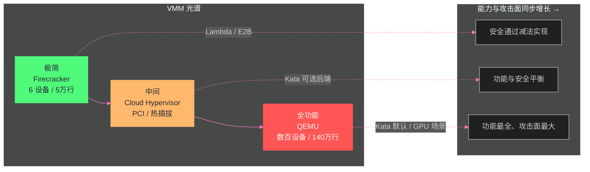
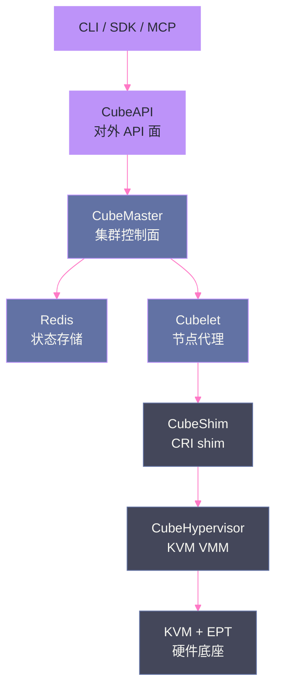

# 05 VMM 解剖——Firecracker、Cloud Hypervisor 与 Kata 的虚拟机监视器家族

**摘要：**

[[隔离原语/04 KVM 与硬件虚拟化——MicroVM 隔离的硬件基石|第 04 篇]] 讲透了硬件底座（VMX/EPT/KVM 三级 fd），但"谁在用户态把 KVM 变成一台可用的虚拟机"还没有回答——这个角色是 **VMM（Virtual Machine Monitor，虚拟机监视器）**。本文解剖 VMM 家族：从 Firecracker 的"极致减法"（仅 6 个仿真设备、无 BIOS/PCI/USB、jailer 进程降权、token bucket 限流，支撑 AWS Lambda/Fargate 每月数万亿请求），到 rust-vmm 的"组件化乐高"（不是产品而是组件库），到 Cloud Hypervisor 的"中间路线"（PCI/GPU 直通、热插拔、live migration），再到 Kata 的"五 hypervisor 可插拔策略"（QEMU 默认且独占 GPU/TDX/SEV-SNP 能力、Dragonball 与 containerd-shim 同进程主打并发密度），最后拆解 CubeSandbox——从 VMM 到完整 Sandbox 产品的形态（CubeAPI/CubeMaster/Cubelet/CubeShim/CubeHypervisor 六组件）。核心认知：**VMM 构成"极简↔全功能"光谱，选型不是比功能多少，而是比"设备模型与威胁模型的匹配度"——每个你模拟的设备都是一个攻击面，每个你不模拟的设备都是一个不可用能力**；同时，VMM 只是沙箱的"第 4 层"组件，CubeSandbox 的教训表明：**没有控制面与协议层的 VMM，只是半成品**。

---

## 第 1 章 VMM 是什么：虚拟机监视器的职责

### 1.1 VMM 的四个职责

VMM（Virtual Machine Monitor）是运行在宿主机用户态、负责"把 KVM 的硬件虚拟化能力变成一台可用虚拟机"的软件。它的职责可以归纳为四类：

| 职责 | 内容 | 代表实现 |
| :--- | :--- | :--- |
| **CPU 虚拟化编排** | 创建 vCPU、设置 Guest 初始状态、处理 VM Exit | 所有 VMM |
| **内存编排** | 注册 Guest 内存区域、维护 EPT 映射 | 所有 VMM |
| **设备模拟** | 模拟 virtio 设备（网络/块/串口等），处理 Guest I/O | QEMU（数百设备）/ Firecracker（6 设备） |
| **生命周期管理** | 引导加载、启动/暂停/恢复、配置接口 | Firecracker API / QEMU QMP / Kata shimv2 |

**关键认知**：VMM 是"用户态软件"——它的代码质量、设备模型大小、特权配置，直接决定了虚拟化边界的安全性。VMM 被攻破意味着攻击者获得"宿主机用户态进程权限"（比内核权限低，但仍可能读取其他 VM 的共享内存或利用更多漏洞）。

### 1.2 "极简↔全功能"光谱

VMM 的设计空间是一条光谱：一端是 QEMU 式的全功能（数百种设备、固件支持、live migration、GPU 直通），另一端是 Firecracker 式的极简（6 个设备、无固件、无热插拔）。光谱上的位置由两个问题决定：

1. **威胁模型**：VMM 的代码量直接决定攻击面——"每个你不模拟的设备就是一个你不交付的 CVE"（Firecracker 设计哲学）；
2. **功能需求**：GPU 直通需要 PCI 支持，Windows Guest 需要完整 ACPI/固件栈——功能需求越复杂，极简越不可行。



### 1.3 VMM、CRI shim 与容器运行时的边界

VMM 常与另外两个概念混淆——CRI shim 与容器运行时（runc 类）。三者的边界需要厘清：

| 组件 | 位置 | 职责 | 例子 |
| :--- | :--- | :--- | :--- |
| **容器运行时** | 宿主进程管理 | 把 OCI bundle 变成进程（namespace/cgroup） | runc、runsc |
| **CRI shim** | containerd 插件 | 把 CRI 请求翻译为运行时调用，管理容器生命周期 | containerd-shim-runc-v2、containerd-shim-kata-v2 |
| **VMM** | 虚拟机管理 | 创建/运行/模拟虚拟机（KVM 之上） | Firecracker、QEMU、Cloud Hypervisor |

**Kata 的特殊性**：Kata 的 shim（shimv2）同时承担"shim 翻译"与"VMM 调度"——它调用 hypervisor 创建 VM，Guest 内的 Kata agent 再拉起容器进程。**"容器→VM"的映射发生在 shim 层，VMM 只是 shim 的下游**。理解这个边界，才能正确阅读 Kata 的部署配置：containerd 注册的是 shim 插件（runtime_type = io.containerd.kata.v2），hypervisor（QEMU/Dragonball）是 shim 的配置项。

**对排障的意义**：沙箱创建失败时，先定位失败在哪一层——CRI 层（containerd 日志）、shim 层（shim 日志）、VMM 层（hypervisor 日志）——三层日志的排查顺序是 Kata 类方案的标配排障路径。

### 1.4 为什么 VMM 的设计决定沙箱安全

对 Agent 沙箱场景，VMM 层是"最后一层防线"的关键组成部分：沙箱内代码 → Guest 内核 → hypervisor（KVM）→ VMM 设备模拟。攻击链的每一跳都可能是逃逸点：

```
沙箱内代码（被攻破）
  → Guest 内核漏洞（Kata 用精简内核缩小此面）
  → KVM/hypervisor 漏洞（硬件层，面最小）
  → VMM 设备模拟漏洞（用户态软件，面取决于设备模型大小）
  → 宿主机
```

**VMM 在链条中的位置**：KVM 漏洞（硬件层）极难利用且稀少；VMM 设备模拟是用户态代码——历史上 QEMU 的 virtio 系列漏洞是虚拟化逃逸的最常见入口。**因此"选择多小的设备模型"不是性能问题，而是安全预算问题**——这正是 Firecracker 极简哲学的立足点，也是 Kata 允许你选择"轻 hypervisor"的原因。

---

## 第 2 章 Firecracker：极致减法的 MicroVM

### 2.1 从 AWS Lambda 的需求出发

Firecracker 的设计不是学术研究——它直接来自 AWS Lambda 和 Fargate 的生产需求。AWS 在 2018 年的 NSDI 论文中明确阐述了设计动机：

> "We built Firecracker because we didn't want to choose between hypervisor-based virtualization (and the potentially unacceptable overhead related to it), and Linux containers (and the related compatibility vs. security tradeoffs)."

AWS 需要一种隔离方案，同时满足三个看似矛盾的目标：

- **VM 级隔离强度**——Lambda 上运行着不同客户的代码，必须保证隔离；
- **容器级启动速度**——Serverless 函数需要毫秒级到秒级启动；
- **极低资源开销**——单台服务器上运行数千个函数实例。

传统 VM（QEMU/KVM）满足第一条但不满足第二、三条——QEMU 有 140 万行代码，启动一个完整 VM 需要数秒，内存开销数百 MB。传统容器满足第二、三条但不满足第一条——共享内核的隔离不够。Firecracker 的解决方案是"保留 KVM，完全替换 QEMU"——用 Rust 从零构建一个极简的 VMM，只保留 Serverless 场景需要的最小功能。

### 2.2 极简设备模型——6 个设备就够了

Firecracker 的核心设计决策是**极简设备模型**——只模拟 6 个设备：

| 设备 | 用途 | 为什么需要 |
| :--- | :--- | :--- |
| **virtio-net** | 虚拟网络 | 函数需要网络访问 |
| **virtio-block** | 虚拟块设备 | 函数需要读写存储 |
| **virtio-vsock** | VM-宿主机通信 | Agent 通信通道 |
| **virtio-balloon** | 内存气球 | 动态内存回收 |
| **serial console** | 串口控制台 | 调试和日志输出 |
| **minimal keyboard controller** | 最小键盘控制器 | 重启控制 |

**不模拟的设备**（及其不模拟的原因）：

- **无 BIOS/UEFI**——Firecracker 直接加载内核镜像，不需要固件引导。这消除了固件中的潜在漏洞（BIOS/UEFI 是历史悠久的大规模代码库，漏洞众多）；
- **无 PCI 总线**——使用 MMIO（Memory-Mapped I/O）而非 PCI 总线。PCI 总线支持设备热插拔和复杂配置，但也增加了大量模拟代码和攻击面；
- **无 USB、无图形/GPU、无声卡**——Serverless 函数不需要这些设备。

> [!info] 核心概念：每个你不模拟的设备就是一个你不交付的 CVE
> Firecracker 的设计哲学可以概括为"每个你不模拟的设备就是一个你不交付的 CVE"——减少模拟的设备数量，就直接减少了 VMM 的代码量和攻击面。QEMU 支持数百种设备，每种设备都有潜在的漏洞——Firecracker 只支持 6 种，将攻击面缩小了数量级。这不是"偷懒"——这是"安全通过减法实现"的工程哲学。在安全工程中，"代码量"与"漏洞数量"正相关——减少代码量是最有效的安全措施之一。Firecracker 的整个 VMM 代码量约 5 万行 Rust——相比 QEMU 的 140 万行 C，代码量减少了 28 倍，这直接对应了攻击面的显著缩小。

### 2.3 性能数据（官方规格）

Firecracker 的性能规格由集成测试强制保证——每次 PR 和主分支合并都会运行性能测试：

| 指标 | 规格 | 测试条件 |
| :--- | :--- | :--- |
| VMM 启动时间 | ≤ 8 CPU ms（到 API socket 可用） | 典型 12ms，范围 6-60ms |
| MicroVM 启动时间 | ≤ 125ms（到 /sbin/init） | 1 vCPU, 128MB RAM, 串口禁用, 精简内核 |
| 内存开销 | ≤ 5 MiB per microVM | 1 vCPU, 128MB RAM |
| 创建速率 | 150 microVMs/秒/主机 | 36 核主机上 180/秒 |
| CPU 性能 | > 95% 裸机性能 | compute-only 工作负载 |

**这些数字的含义**：

- **~125ms 启动**：从 API 调用到 Guest Linux 的 `/sbin/init` 开始执行——用户空间代码可以在 125ms 内开始运行。这比传统 VM（数秒）快一个数量级。对 Agent 沙箱：125ms 的冷启动配合预热池（[[平台与协议/09 OpenSandbox 编排面——BatchSandbox、WarmPool 与快照|第 09 篇]]），可以做到"用户无感"的沙箱交付；
- **<5MB 内存开销**：Firecracker VMM 自身的内存开销（不包括 Guest OS）。在 64GB 内存的主机上，理论上可以运行 12000+ 个 Firecracker VMM 进程——实际受限于 Guest OS 的内存需求；
- **150 microVMs/秒**：创建速率——每秒可以启动 150 个新 MicroVM。**这个"每秒创建速率"是比"单次启动时间"更重要的容量指标**：它决定了平台在流量突增时的扩容速度上限。

### 2.4 三线程架构

每个 Firecracker 进程封装一个且仅一个 MicroVM，运行三个类型的线程：

**API 线程**：负责 Firecracker 的 API 服务器和相关控制平面——接收配置 MicroVM 的 RESTful API 请求（设置 vCPU 数量、配置网络接口、启动机器）。API 线程永远不在虚拟机的"快路径"（fast path）上——它只在配置和控制时活跃，不参与运行时的系统调用处理。

**VMM 线程**：暴露机器模型、最小遗留设备模型、MMDS（MicroVM Metadata Service）和 virtio 设备模拟——包括 I/O rate limiting。当 Guest 发起 virtio-net 或 virtio-block 操作时，VMM 线程处理这些操作。

**vCPU 线程**（一个或多个）：通过 KVM 创建，运行 `KVM_RUN` 主循环——每个 Guest CPU 核对应一个 vCPU 线程。它们是 Guest 代码实际运行的"载体"。

这种线程模型的分离确保了"控制平面"（API 线程）和"数据平面"（VMM + vCPU 线程）的解耦——API 线程的处理延迟不影响 Guest 的运行时性能。**对沙箱平台的意义**：控制面与数据面分离是沙箱架构的通用原则（[[平台与协议/07 OpenSandbox 架构深度解析——协议优先与六责任面|OpenSandbox 六责任面]] 的同一哲学），Firecracker 在线程级别就实现了它。

### 2.5 jailer：VMM 自身的沙箱

Firecracker 进程本身需要一定的特权来操作 KVM——但如果 Firecracker 进程被攻破（VMM 漏洞导致逃逸），攻击者可能利用 Firecracker 进程的权限影响宿主机。jailer 的职责是**在启动 Firecracker 之前，把 Firecracker 进程的权限降到最低**：

1. **创建 namespace**：jailer 为 Firecracker 进程创建新的 mount/pid/net/user namespace——隔离 Firecracker 的视图；
2. **chroot**：把 Firecracker 进程的根目录改为一个专用目录——限制文件系统访问；
3. **drop capabilities**：移除所有不必要的 capabilities——只保留 KVM 操作需要的最小权限；
4. **设置 seccomp 过滤器**：安装 seccomp-bpf——限制 Firecracker 进程能调用的系统调用；
5. **切换用户**：切换为非 root 用户——进一步降低权限；
6. **启动 Firecracker**：在上述所有安全措施就位后，execve Firecracker 二进制。

> [!note] 设计哲学：管理隔离边界的人，自己也住在边界之内
> jailer 的设计哲学值得每个沙箱平台借鉴：**VMM 是"制造隔离边界"的组件，但它自己也要被隔离**。这个"元隔离"思想在 Agent 沙箱平台中处处可见：OpenSandbox 的 execd 与 egress 是沙箱内的守护进程（[[平台与协议/08 OpenSandbox 数据面——execd 与 egress 的盒内世界|第 08 篇]]）、Server 控制面跑在独立 Pod 中、平台自身的凭据最小化。**隔离不是"给别人的"，而是"给自己的"**——任何管理边界的组件，如果自己不受边界约束，它就是边界的薄弱点。

### 2.6 rate limiter：设备层的资源控制

Firecracker 在 virtio 设备层内置了 token bucket 限流器（网络与块设备都支持）——每个 MicroVM 的 I/O 速率在 VMM 层即可控制，不需要外部流量整形工具。对 Agent 沙箱平台的意义：**资源爆炸半径的控制下探到了设备层**——即使沙箱内代码疯狂读写，也不会拖垮宿主机的存储与网络路径。素材 PoC 中"沙箱残留 0"与"资源限制"的验收项，在 Firecracker 路线中由设备层限流提供了硬保证。

### 2.7 RESTful API 与"配置→启动→不可变"

Firecracker 通过 RESTful API 控制 MicroVM 生命周期——API 使用 OpenAPI 规范定义，支持机器配置（vCPU/内存）、驱动器配置、网络接口配置、启动/暂停等操作。

两个安全特性值得注意：

**API socket 是唯一控制接口**：没有其他方式可以配置或控制 MicroVM。jailer 确保 API socket 的文件权限只允许特定的控制进程访问——即使 MicroVM 内的攻击者逃逸到了 Firecracker 进程，也无法通过 API socket 发送控制请求。

**配置→启动→不可变**：一旦 MicroVM 启动（`InstanceStart` API 调用），大部分配置变为不可变——不能在运行中添加新设备、改变 vCPU 数量或修改网络配置。这减少了"运行时配置篡改"的攻击面。

### 2.8 生产规模验证：Lambda 与 Fargate

Firecracker 的设计不是理论推演——它在 AWS Lambda 的生产环境中经过了极端规模的验证。根据 NSDI 2020 论文的数据，Firecracker 在 Lambda 中"powers millions of workloads and trillions of requests per month"——支撑每月数百万工作负载和数万亿次请求。

**从 Lambda 到 Fargate**：AWS Fargate（无服务器容器平台）也使用 Firecracker 作为底层隔离——每个 Fargate task 在一个 Firecracker MicroVM 中运行。这对 Agent 沙箱有直接的参考意义：**Firecracker 的 MicroVM 模型不仅适合"秒级函数"，也适合"分钟到小时级的 Agent 任务"**——Fargate 验证了长生命周期负载在 Firecracker 上的可行性。

### 2.9 Firecracker 的边界与反例

减法哲学的代价是功能受限——Firecracker 不适合的场景需要明确识别，否则选型会撞墙：

**反例一：需要 GPU 的工作负载**。Firecracker 无 PCI 直通，Guest 无法访问 GPU——Agent 沙箱需要本地推理/训练时，Firecracker 路线直接出局（E2B 的 GPU 能力也正因此长期缺席，直到接入其他后端）。

**反例二：需要 live migration 的场景**。Firecracker 不支持在线迁移——节点维护意味着沙箱销毁重建。对"会话必须连续"的 Agent 场景，需要评估"重建会话"的成本是否可接受（状态外置后重建通常可接受，[[生产化/13 Agent 状态与存储——六类状态的正确拆分|第 13 篇]] 的状态拆分正是为此设计）。

**反例三：Windows Guest 或复杂设备拓扑**。无 BIOS/ACPI 栈决定了它只能跑精简 Linux——需要 Windows/复杂固件的场景请用 QEMU 路线。

**反例四：需要热插拔容量的场景**。内存/CPU 热插拔不支持——规格必须在启动前定死。对"沙箱规格随任务动态调整"的需求，Firecracker 不满足。

**选择框架**：先列功能需求清单（GPU？迁移？Windows？热插拔？），命中任何一项就走 Cloud Hypervisor 或 QEMU 路线——**Firecracker 是"极简场景的最优解"，不是"所有场景的解"**。

---

## 第 3 章 rust-vmm：VMM 的乐高积木

### 3.1 rust-vmm 是什么：不是产品，是组件库

素材调研（Phase1-05）给 rust-vmm 的定位是"乐高积木不是产品"——这是一个精确的比喻。rust-vmm（https://github.com/rust-vmm）是 Cloud Native Computing Foundation 托管的项目集合，提供构建 VMM 的 Rust 组件库：

| 组件 | 功能 | 使用方 |
| :--- | :--- | :--- |
| **vm-superio** | 串口/键盘等基础设备模拟 | Firecracker、Cloud Hypervisor |
| **virtio-queue / virtio-device** | virtio 队列与设备框架 | Firecracker、Cloud Hypervisor |
| **vmm-sys-util** | 系统调用与 fd 工具 | 所有 rust-vmm 成员 |
| **kvm-bindings / kvm-ioctls** | KVM API 的 Rust 绑定 | Firecracker、Cloud Hypervisor |
| **linux-loader** | Guest 内核镜像加载 | Firecracker、Cloud Hypervisor |
| **vhost 系列** | vhost 后端支持 | Cloud Hypervisor |

**"乐高积木"的含义**：每个组件解决一个明确问题、有清晰的接口边界、可独立测试——VMM 开发者像搭积木一样组合组件，而不是从零写。这大幅降低了"自研 VMM"的门槛——**CubeSandbox 的 CubeHypervisor 能由企业自研，rust-vmm 生态是重要前提**。

### 3.2 生态成员与组件复用

| 项目 | 基于 rust-vmm | 定位 |
| :--- | :--- | :--- |
| **Firecracker** | 是（早期版本） | 极简 MicroVM（现已部分自研组件） |
| **Cloud Hypervisor** | 是（深度复用） | 全功能 Rust VMM |
| **Dragonball** | 是（部分复用） | 蚂蚁开源的轻量 VMM，与 containerd-shim 同进程 |
| **StratoVirt** | 是（深度复用） | openEuler 社区的轻量 VMM |

**rust-vmm 对 Agent 沙箱行业的意义**：它把"VMM 研发"从"国家级工程"变成了"企业级工程"——安全关键组件（KVM 绑定、virtio 框架）经过多家头部企业（AWS/蚂蚁/Huawei/Intel）的共同维护与审计，比单企业闭源自研更可靠。**选型启示：评估自研 VMM 方案时，先看它是否基于 rust-vmm——不是基于 rust-vmm 的自研 VMM，代码质量与审计深度需要额外怀疑**。

### 3.3 rust-vmm 的安全价值：内存安全语言与共享审计

rust-vmm 生态的安全价值来自两个叠加因素：

**因素一：Rust 的内存安全**。VMM 处理来自 Guest 的不可信 I/O（virtio 描述符、MMIO 请求、中断）——这些输入直接决定"设备模拟代码"的行为。C 语言 VMM（QEMU）的内存安全漏洞（缓冲区溢出、use-after-free）是虚拟化逃逸的主流路径；Rust 的所有权模型在编译期消除整类漏洞——**"用 Rust 写 VMM"把逃逸漏洞的类别从"常见"压缩到"逻辑类"**。这也是 Firecracker/Cloud Hypervisor/Dragonball/StratoVirt 不约而同选择 Rust 的结构性原因。

**因素二：共享审计的规模效应**。rust-vmm 的组件（kvm-ioctls、virtio-queue 等）被多个生产级 VMM 复用——**同一份代码被多家企业审计、被多种负载压测、被多个 CVE 流程打磨**。单点组件的缺陷会在生态内被更快发现、更快修复。对比闭源自研 VMM：代码只被自己的团队看到，漏洞可能潜伏多年。

**对评估者的操作建议**：评估沙箱平台的 VMM 底座时，检查三件事——是否 Rust 实现（内存安全）、是否基于 rust-vmm（共享审计）、是否有公开的漏洞响应记录（如 GitHub Security Advisory）——三件全过才值得信任，任何一件缺失都要在安全评审中标记风险。

---

## 第 4 章 Cloud Hypervisor：中间路线

### 4.1 定位：同一技术栈上的"足够精简但功能完整"

Cloud Hypervisor 由 Intel 主导、基于 rust-vmm 构建，与 Firecracker 共享大量组件，但走了一条不同的路线：**不做"极致减法"，而是做"可控的全功能"**。

| 维度 | Firecracker | Cloud Hypervisor |
| :--- | :--- | :--- |
| **设备模型** | 6 个（MMIO） | PCI 总线 + 全 virtio 设备集 |
| **GPU 直通** | 不支持 | 支持（VFIO） |
| **热插拔** | 不支持 | 支持（CPU/内存/设备） |
| **live migration** | 不支持 | 支持 |
| **Windows Guest** | 不支持 | 支持（完整 ACPI/固件栈） |
| **目标场景** | 短生命周期 serverless | 长生命周期有状态 VM |
| **代码规模** | ~5 万行 | ~15 万行 |

### 4.2 为什么需要中间路线

Firecracker 的减法哲学在"短生命周期、单一 Linux 负载"场景下完美成立，但有两个场景它覆盖不了：

**场景一：GPU/高性能设备**。Agent 沙箱需要 GPU（推理/训练）时，Firecracker 无 PCI 直通能力——Cloud Hypervisor 的 VFIO 直通是替代方案（Kata 的 QEMU 路线同样支持）。

**场景二：长生命周期与迁移**。企业级 Agent 沙箱可能需要"会话迁移到另一节点"（节点维护）——Firecracker 不支持 live migration，Cloud Hypervisor 支持。

**代价**：PCI 总线、热插拔、迁移机制都是攻击面与复杂度——Cloud Hypervisor 的 15 万行代码是 Firecracker 的 3 倍。**中间路线的存在意义是：把"安全预算"与"功能需求"的平衡点往前移一格，让不需要极简、又不想背 QEMU 包袱的场景有一个选择**。

---

## 第 5 章 Kata Containers 的五 hypervisor 策略

### 5.1 为什么 Kata 支持多 hypervisor

Kata Containers 的定位是"VM 容器的标准层"——它把"容器如何映射到 VM"标准化，但**底层 hypervisor 是可插拔的**。这个设计的动机：

1. **性能诉求不同**：QEMU 全功能但重；Dragonball 轻但功能少——不同部署场景需要不同重量级；
2. **安全审计不同**：某些组织对特定 hypervisor 有审计要求；
3. **硬件平台不同**：ARM、RISC-V 等平台对 hypervisor 的支持度不同。

### 5.2 五种 hypervisor 拆解

| hypervisor | 语言 | 特点 | Kata 中的角色 |
| :--- | :--- | :--- | :--- |
| **QEMU** | C | 全功能、生态最成熟 | 默认后端，GPU/TDX/SEV-SNP 唯一支持 |
| **Cloud Hypervisor** | Rust | 中间路线、PCI/迁移 | 轻量替代（无 GPU 需求时） |
| **Firecracker** | Rust | 极简、最高密度 | 极致密度场景 |
| **Dragonball** | Rust | 与 containerd-shim 同进程 | 并发启动密度优先 |
| **StratoVirt** | Rust | openEuler 社区 | 国产化/信创场景 |

**关键事实（素材 Phase1-05 记录）**：**GPU、TDX、SEV-SNP 等高级特性目前仅 QEMU hypervisor 支持**——如果 Agent 沙箱需要 GPU 直通或机密计算，Kata 的选型实际上被锁定在 QEMU 上。**这意味着"Kata 是轻量虚拟化"的印象在高级特性场景下不成立——重量级需求会把你拖回 QEMU 的重量级实现**。

### 5.3 Dragonball：与 containerd-shim 同进程的设计

Dragonball（蚂蚁开源）是五 hypervisor 中最特殊的一个——它的设计目标是**并发启动密度**：VMM 与 containerd-shim 运行在同一个进程内，省去 shim↔VMM 的进程间通信路径。

```
传统 Kata（QEMU 路线）：
containerd → shim 进程 → QEMU 进程（VMM）
                     ↑ 两个进程，IPC 路径长

Dragonball 路线：
containerd → shim 进程（内含 VMM 逻辑）
                     ↑ 一个进程，无 IPC
```

**对 Agent 沙箱的意义**：每少一个进程，每少一段 IPC，启动路径就短一截、故障点就少一个。Dragonball 的"进程内 VMM"是"高并发沙箱创建"场景的重要工程手段——这与 WarmPool 的"提前创建"思路互补：Dragonball 优化"创建本身的速度"，WarmPool 优化"创建的需求频率"。

### 5.4 如何观察"沙箱真的跑在 VM 里"：VMM 层的证据链

[[隔离原语/02 Linux 隔离原语——namespace、cgroups、seccomp 与 capabilities 的安全地基|第 02 篇]] 讲过隔离证据链的通用方法，VMM 层有自己专属的证据——宿主机上可以直接看到"虚拟机的存在痕迹"：

```bash
# 证据 1：hypervisor 进程（QEMU/Cloud Hypervisor/Firecracker）
ps aux | grep -E "qemu|cloud-hypervisor|firecracker"

# 证据 2：KVM 设备与 vCPU 线程（每个 vCPU 一个线程，名字含 vcpu）
ls /dev/kvm
ps -T -p <hypervisor_pid> | grep vcpu

# 证据 3：Guest 内核与宿主内核的差异（在沙箱内执行）
uname -r    # 沙箱内：精简 Kata 内核（如 6.x-kata）
uname -r    # 宿主机：发行版内核（如 5.14.0-570.el9）

# 证据 4：KVM 统计（可选，需权限）
cat /sys/kernel/debug/kvm/* 2>/dev/null | head
```

素材 PoC 的 Kata 隔离证据链正是这套组合：Guest 内核版本不同（证明独立内核）、QEMU 进程存在（证明 VM 层）、RuntimeClass 注入正确（证明声明与事实一致）。**任何一层证据缺失，都要先假设"沙箱没跑在预期的隔离级别"再继续排查**——这是把"配置声明"变成"运行事实"的唯一方法。

---

## 第 6 章 CubeSandbox：从 VMM 到完整产品

### 6.1 产品定位：KVM MicroVM 之上的完整 Sandbox 产品

CubeSandbox（素材 Phase1-06 专题拆解）是 Cube 开源的 Agent 沙箱产品——**它不只是一个 VMM，而是"KVM MicroVM 之上的完整 Sandbox 产品"**。这个定位在 VMM 家族中独树一帜：Firecracker/Kata 都停留在"运行时"层，CubeSandbox 向上做到了产品层。

### 6.2 六组件拆解

| 组件 | 职责 | 类比 |
| :--- | :--- | :--- |
| **CubeAPI** | 对外 API 面（生命周期/执行接口） | OpenSandbox Server 的 API 层 |
| **CubeMaster** | 集群控制面（调度、状态管理） | OpenSandbox Controller |
| **Redis** | 状态存储（沙箱元数据） | OpenSandbox 的 SQLite/CR 状态 |
| **Cubelet** | 节点代理（管理本机沙箱） | Kubelet 的沙箱版 |
| **CubeShim** | CRI shim（容器↔VM 翻译） | Kata shim 同类 |
| **CubeHypervisor** | 自研 VMM（基于 KVM/rust-vmm） | Firecracker 同类 |



**对照六层模型**（[[平台与协议/06 Agent 沙箱平台分层——六层模型与三条产品路线|第 06 篇]]）：CubeSandbox 覆盖第 4 层（隔离运行时，CubeHypervisor）与第 6 层（API/协议，CubeAPI），第 1-2 层（控制面/编排）部分覆盖（CubeMaster 但 K8s 集成标注 preview），第 3 层（执行层）与第 5 层（Agent 适配）缺失或薄弱。

### 6.3 限制与教训：素材中的两个关键发现

**限制一：K8s 部署仍标注 preview**。CubeSandbox 的 Kubernetes 集成尚不稳定——企业要在 K8s 上大规模使用需要等待成熟。这个状态与 OpenSandbox 的"K8s 原生"形成鲜明对比（[[平台与协议/07 OpenSandbox 架构深度解析——协议优先与六责任面|第 07 篇]]）。

**限制二：PVM（Protected VM）需要更换 host kernel 并重启**。启用 PVM（受保护虚拟机，类似机密计算）需要宿主机更换内核并重启——**运维上这是"停机变更"，不是"在线开关"**。这个细节暴露了产品成熟度的边界：安全特性的启用路径还很原始。

**教训**：CubeSandbox 是"从 VMM 向上做产品"的典型——技术底座（CubeHypervisor）扎实，但产品层（控制面、K8s 集成、执行层）尚未闭环。**这验证了本专栏的核心判断：沙箱是系统能力，VMM 只是其中一层——单点技术再强，产品层缺位就是半成品**。

### 6.4 适用场景判断：什么时候选 CubeSandbox 路线

基于素材的评估，CubeSandbox 路线的适用场景可以归纳为三类"值得选"与两类"不要选"：

**值得选**：
1. **极致隔离 + 数据主权要求**：需要"自研 VMM"级别的可控性（代码在自己手里、供应链自己管），且团队有 Rust 工程能力；
2. **与 Cube 生态绑定**：已在 Cube 技术栈上投资（Cube 集群、Cube 运维体系），沙箱能力是生态的自然延伸；
3. **GPU/高性能场景的 KVM 路线**：需要 MicroVM + 高性能 I/O，且可以接受产品层（K8s 集成 preview）的不成熟。

**不要选**：
1. **平台完整性优先**：需要"开箱即用的生命周期/协议/MCP/多租户"——OpenSandbox 类平台覆盖更全；
2. **K8s 深度集成优先**：需要 CRD/Controller/RuntimeClass 原生工作流——CubeSandbox 的 K8s 集成仍 preview。

**判断口诀**：**"要技术选 Cube，要平台选 OpenSandbox；要两者兼得，先评估自研成本"**。

### 6.5 与 OpenSandbox 的定位差异

| 维度 | CubeSandbox | OpenSandbox |
| :--- | :--- | :--- |
| **技术路线** | 自研 VMM（KVM/rust-vmm） | 协议优先、运行时可插拔（runc/gVisor/Kata） |
| **覆盖层** | 第 4 层 + 第 6 层（部分） | 第 1/2/3/6 层（运行时可插拔） |
| **K8s 集成** | preview | 原生（BatchSandbox CRD） |
| **生态** | 闭源为主 | 开源（CNCF Landscape） |
| **适用** | 需要极致隔离 + 自研可控 | 需要平台完整性与生态 |

素材的选型结论是"OpenSandbox 为主候选，CubeSandbox 为隔离运行时/条件式候选"——**不是因为 CubeSandbox 技术差，而是因为覆盖层不同**：OpenSandbox 覆盖平台层（第 1/2/3/6 层），CubeSandbox 的价值集中在隔离层（第 4 层），两者互补多于竞争。

---

## 第 7 章 VMM 选型与安全评估

### 7.1 评估维度

选择 VMM（或评估使用某 VMM 的沙箱平台）时，建议按五个维度打分：

| 维度 | 评估问题 | 权重建议 |
| :--- | :--- | :--- |
| **设备模型与攻击面** | 模拟了多少设备？代码量多少？漏洞披露历史？ | 高 |
| **性能特征** | 启动时间、内存开销、创建速率是否满足场景？ | 高 |
| **功能覆盖** | GPU/迁移/热插拔/机密计算是否在路线图内？ | 中（按需） |
| **生态与审计** | 是否基于 rust-vmm？开源还是闭源？社区活跃度？ | 中 |
| **产品层配套** | 有没有控制面/协议层？K8s 集成成熟度？ | 高（沙箱场景） |

### 7.2 VMM 家族对照表

| 维度 | Firecracker | Cloud Hypervisor | Kata（QEMU 路线） | Dragonball | CubeHypervisor |
| :--- | :--- | :--- | :--- | :--- | :--- |
| **设备模型** | 6 个（极简） | 全 virtio + PCI | 全功能 | 精简 | 精简（自研） |
| **代码规模** | ~5 万行 | ~15 万行 | QEMU 140 万行 | 较小 | 未公开 |
| **GPU/机密计算** | 不支持 | GPU 支持 | GPU/TDX/SEV-SNP | 不支持 | PVM（需换内核） |
| **K8s 集成** | 需自研 shim | 需自研 shim | 原生（shimv2） | 原生（同进程 shim） | preview |
| **典型用户** | AWS Lambda/E2B | Intel/云厂商 | 企业强隔离 | 蚂蚁 | Cube 生态 |

### 7.3 评估的最终视角：VMM 之上是什么

最后一节回到本专栏的主线：**VMM 是沙箱的第 4 层组件，评估任何 VMM 时都要问"它之上是什么"**：

- Firecracker 之上是 E2B 的完整平台（控制面/协议/模板）——**VMM 的极简由平台补全**；
- Kata 之上是 Kubernetes 的 RuntimeClass 生态——**VMM 的标准化由 K8s 补全**；
- CubeHypervisor 之上是 CubeSandbox 的产品层——**但产品层尚未闭环（preview）**；
- 而 OpenSandbox 的路线是"平台优先、运行时可插拔"——**先定义协议，再选择 VMM**（第 07 篇详述）。

**这个视角的结论**：不要因为"某个 VMM 技术先进"就选择它——先确定你的平台层（控制面/协议/编排）怎么建，再让 VMM 适配平台。**VMM 选型是平台选型的下游，不是上游**。

### 7.4 一句话选型总结

把本章的评估框架压缩成四句话，供实际决策时对照：

- **Firecracker**：短生命周期、无 GPU/迁移需求、追求极致密度与最小攻击面——"减法换安全"；
- **Cloud Hypervisor**：需要 PCI/迁移/热插拔、但不想背 QEMU 包袱——"中间路线"；
- **Kata（QEMU）**：K8s 原生、可能扩展 GPU/机密计算、接受重量级——"标准层的全能选手"；
- **自研 VMM（CubeHypervisor 路线）**：数据主权 + 工程能力都具备——"最贵但最可控"。

**最后提醒**：VMM 选型决定"隔离的下限"，平台层（控制面/协议/编排）决定"产品的上限"——**不要用下限的决策代替上限的思考**。下一章开始，进入平台层。

---

## 第 8 章 总结与下一篇导读

### 8.1 本文核心要点

1. **VMM 是"把 KVM 变成可用虚拟机"的用户态软件**——设备模型大小直接决定攻击面与功能上限
2. **VMM 光谱：极简↔全功能**——Firecracker（6 设备/5 万行）→ Cloud Hypervisor（PCI/迁移/15 万行）→ QEMU（数百设备/140 万行），能力与攻击面同步增长
3. **Firecracker 的减法哲学**："每个你不模拟的设备就是一个你不交付的 CVE"——125ms/5MiB/150 每秒的性能由减法带来，Lambda/Fargate 的万亿级请求验证了它的生产可靠性
4. **jailer 的元隔离思想**：制造隔离边界的 VMM 自己也住在边界之内——管理边界者必须被边界约束
5. **rust-vmm 是"乐高积木不是产品"**——它把 VMM 研发门槛从"国家级"降到"企业级"，评估自研 VMM 先看是否基于 rust-vmm
6. **Kata 五 hypervisor 可插拔**——但 GPU/TDX/SEV-SNP 仅 QEMU 支持，重量级需求会把你拖回重量级实现
7. **CubeSandbox 的教训**：VMM 之上缺产品层就是半成品——沙箱是系统能力，不是单点技术

### 8.2 术语速查

| 术语 | 口径 |
| :--- | :--- |
| **VMM** | 虚拟机监视器，用户态把 KVM 能力变成可用虚拟机的软件 |
| **设备模型** | VMM 模拟的设备集合（virtio-net/block 等），决定攻击面与功能 |
| **jailer** | Firecracker 的安全启动器，先降权再启动 VMM |
| **rust-vmm** | VMM 组件库集合（乐高积木），不是产品 |
| **Dragonball** | 与 containerd-shim 同进程的轻量 VMM（蚂蚁） |
| **MMDS** | Firecracker 的 MicroVM Metadata Service（Guest 元数据通道） |
| **PVM** | Protected VM，机密计算形态（CubeSandbox 需换内核启用） |
| **VFIO** | 用户态设备直通框架（GPU 直通的基础） |

### 8.3 下一篇导读

隔离技术主线（01-05）到此收官：威胁模型 → 隔离原语 → 四档光谱 → 硬件底座 → VMM 家族，**"隔离运行时"层已经完整**。从下一篇开始进入平台层：[[平台与协议/06 Agent 沙箱平台分层——六层模型与三条产品路线|06 Agent 沙箱平台分层]] 将把视角从"边界画在哪"切换到"平台怎么建"——六层模型的职责边界、E2B/SIG/OpenSandbox 三条产品路线的完整对比，以及"为什么选型是分层覆盖矩阵问题"。

> [!info] 专栏导航
> 本文是 [[../00 专栏导览|Agent 沙箱技术专栏]] 的第 05 篇，隔离技术主线收官。前 4 篇：威胁模型（01）、隔离原语（02）、四档光谱（03）、KVM 硬件底座（04）；本文完成 VMM 家族解剖。第 06-09 篇进入平台与协议层。

---

## 参考文献

1. Agache et al. "Firecracker: Lightweight Virtualization for Serverless Applications." NSDI 2020.
2. Firecracker 官方文档. https://firecracker-microvm.github.io/
3. rust-vmm 项目. https://github.com/rust-vmm
4. Cloud Hypervisor 官方文档. https://www.cloudhypervisor.org/
5. Kata Containers 官方文档. https://katacontainers.io/
6. 素材调研. Phase1-05 VMM 解剖、Phase1-06 CubeSandbox 专题拆解
