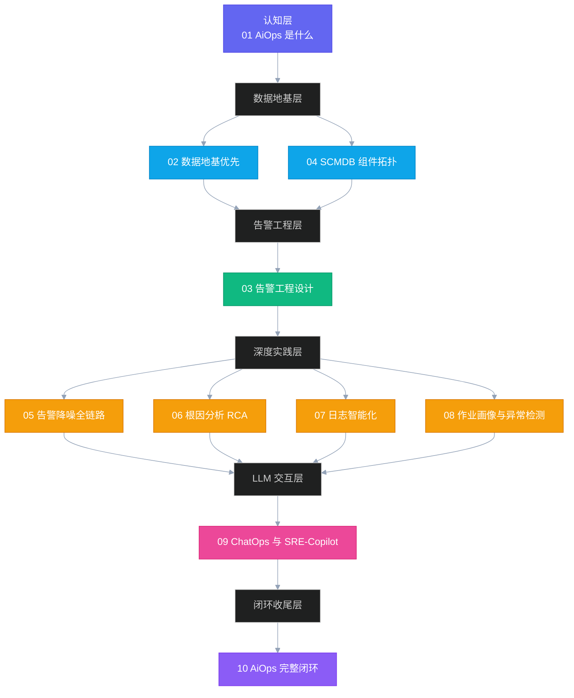

# 专栏导览：大数据集群 SRE 的 AiOps 工程实践

> [!info] 写在前面
> 这是一个写给自己、也写给同类人的专栏。本人是一名大数据基础设施 SRE，日常与 HDFS、YARN、Hive、Spark、Flink、Kafka 为伴，深知大数据集群运维与微服务运维在本质上有多大的差异——没有 HTTP Trace，没有 Pod 驱逐，有的是小时级批处理作业、静态 YARN 队列、NameNode GC 风暴、DataNode 磁盘坏道、Kerberos 票据过期。
>
> 市面上大量 AiOps 文章都在讲微服务、云原生，但大数据集群的 AiOps 工程落地资料极度匮乏。这个专栏试图填补这块空白：**以 AiOps 最佳实践与链路闭环为主线，以指引如何在大数据集群 SRE 的现有基础上落地 AiOps 为副线。**

---

## 专栏定位

| 维度 | 说明 |
|------|------|
| **核心受众** | 大数据 SRE / 平台工程师 / 对 AiOps 落地感兴趣的工程师 |
| **主线目标** | 介绍 AiOps 最佳实践、普适方法论与链路闭环设计 |
| **副线目标** | 以大数据集群（HDFS/YARN/Hive/Spark/Flink/Kafka）为背景，指引已有基础的团队如何落地 |
| **技术深度** | 方法论 + 算法原理 + 工程实践，不写 PPT 方案，只讲落地细节 |
| **写作风格** | 极客时间专栏风格，克制严谨，信息密度极高 |

---

## 专栏结构（10 篇）

---

## 各篇摘要

### [[01 AiOps 是什么：从救火到防火的运维范式革命]]
**认知奠基篇**。从"凌晨两点的告警轰炸"出发，剖析传统运维的三大天花板，系统讲解 AiOps 的定义、演进史（工具化→自动化→智能化）、与 [[DevOps]] / [[SRE]] 的关系、三层能力框架（感知层/决策层/执行层），重点阐明大数据集群 AiOps 与微服务 AiOps 的本质差异。

### [[02 数据地基优先：为什么垃圾进垃圾出是 AiOps 最大的坑]]
**数据工程篇**。分析可观测三支柱（[[Metrics]] / [[Logs]] / [[Traces]]）在大数据集群中的适配策略，深度解析 [[Loki]] 日志流水线设计、[[Prometheus Exporter]] 采集质量治理、[[Drain3]] 日志模板化算法原理，以及 SCMDB 服务拓扑的必要性与最简 MVP 方案。

### [[03 告警工程：从告警风暴到1条主事件的设计哲学]]
**告警体系篇**。告警生命周期全解析：从 Zabbix/Ambari 静态阈值时代，到 [[Foxeye]] 动态告警体系，再到 AiOps 语境下的告警极简主义。深度讲解聚合降噪三维度（时间窗口 + 拓扑依赖 + 相似模式）、变更关联分析原理、"告警压缩率 70%+" 的实现路径。

### [[04 组件依赖拓扑：SCMDB 是大数据集群 AiOps 的骨架]]
**拓扑建模篇**。为什么大数据集群没有 HTTP Trace 却必须有拓扑？深度对比 CMDB 与 SCMDB 的差异，给出 HDFS/YARN/Hive/Spark/Flink/Kafka 完整依赖关系建模方案，阐明如何用拓扑做因果推断，以及图谱与关系数据库的取舍决策。

### [[05 智能告警降噪：工程落地全链路解析]]
**工程实践篇**。完整描述从 Webhook 入口到企业微信推送的告警聚合降噪流水线，结合 eino Multi-Agent 的工具设计，讲解误报率控制策略、SLA 保障机制、线上工程踩坑复盘。

### [[06 根因分析 RCA：传统算法与 LLM 融合的应用架构]]
**RCA 核心篇**。拆解 RCA 从学术研究到工程落地的鸿沟，系统讲解传统算法体系（RCSF 频繁项集挖掘 / Isolation Forest / 变点检测 / 贝叶斯因果推断），分析 LLM 介入 RCA 的合理边界，给出"传统算法粗筛 + CoT 推理 + RAG 知识检索"的 LLM 增强架构。

### [[07 日志智能化：Drain3 模板化与异常检测的工程实践]]
**日志篇**。分三个层次拆解日志异常检测：原始日志 → 模板化（Drain3 算法原理） → 异常检测（计数时间窗口极简方案 vs 向量距离 vs 分类模型），给出接入 [[Foxeye]] 告警的工程路径，以及日志质量标签体系设计。

### [[08 作业画像与异常检测：Spark 和 Flink 的 AiOps 专属能力]]
**作业运维篇**。大数据集群 AiOps 的核心差异化能力——作业生命周期管理。剖析 [[Spark]] 作业画像系统的指标维度设计、P90 动态基线的统计学原理，以及 OOM / 数据倾斜 / GC 风暴 / Stage 长尾的异常检测实现，兼论 [[Flink]] 作业的差异性处理。

### [[09 ChatOps 与 SRE-Copilot：LLM 驱动的运维交互新范式]]
**LLM 应用篇**。从 SRE 与 ChatOps 的关系切入，分析 LLM-as-Tool-Router 架构的核心设计决策，讲解如何将 [[Foxeye]] / [[Loki]] / [[VictoriaMetrics]] API 封装为 LLM 可调用工具，SRE-Copilot 的实际工程架构，以及内网 LLM 部署与数据隐私的硬性约束。

### [[10 AiOps 闭环：从感知到自愈的完整链路设计]]
**闭环总结篇**。绘制完整闭环全景图（感知→决策→执行→复盘→知识库回流），建立 L0/L1/L2/L3 自动处置风险分级体系，给出预测性运维的实现路径与评估框架，最终以 AiOps 成熟度模型（含 Phase 0-3 的 KPI 体系）作为整个专栏的收尾。

---

## 阅读建议

> [!tip] 如何阅读这个专栏
> - **如果你是 AiOps 入门者**：从 01 开始顺序阅读，01-04 是认知与数据地基，建议先把这四篇读完再看后续实践篇
> - **如果你是已有可观测体系的 SRE**：直接跳到 03-05 看告警工程部分，这是 AiOps 最高 ROI 的起点
> - **如果你想引入 LLM**：先看 06，理解 RCA 的传统算法基础，再看 09，避免走弯路
> - **如果你需要向管理层汇报**：直接读 00（本篇）和 10，后者有完整的成熟度模型与 KPI 体系

---

## 技术栈参考（本专栏所有实践基于此）

| 层次 | 技术组件 |
|------|---------|
| 指标采集 | [[Prometheus]] + [[Hadoop Exporter]] + [[Kafka JMX Exporter]] |
| 指标存储 | [[VictoriaMetrics]] |
| 日志采集 | [[Grafana Alloy]] |
| 日志存储与查询 | [[Loki]] |
| 告警平台 | [[Foxeye]] |
| Agent 框架 | [[eino]] (Go, CloudWeGo) |
| LLM 服务 | 内网私有化部署（DeepSeek/Qwen） |
| 向量检索 | [[Milvus]] |
| 大数据集群 | [[Hadoop YARN]] / [[HDFS]] / [[HiveServer2]] / [[Spark]] / [[Flink]] / [[Kafka]] |
| 集群管理 | [[Ambari]] |
| 安全认证 | [[Kerberos]] / [[Knox]] |
