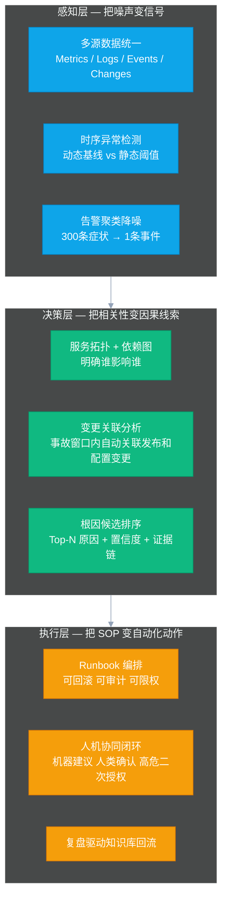
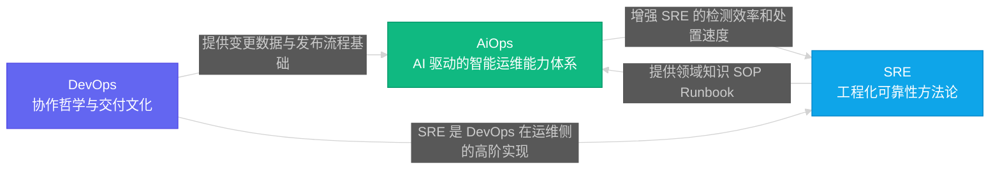

# 01 AiOps 是什么：从救火到防火的运维范式革命

## 摘要

本文是「大数据集群 SRE 的 AiOps 工程实践」专栏的开篇认知奠基篇。文章从一个真实的告警轰炸场景出发，剖析传统运维面临的三大结构性困境，系统定义 AiOps 的本质含义与内涵边界，梳理运维范式从工具化到自动化再到智能化的三代演进历史，厘清 AiOps 与 DevOps、SRE 的关系，深度解析 AiOps 三层能力框架（感知层/决策层/执行层），并重点阐明大数据集群 AiOps 与互联网微服务 AiOps 的本质差异。读完本篇，你将建立起一个完整、清醒、不被厂商 PPT 迷惑的 AiOps 认知体系。

---

## 第 1 章 那个凌晨两点的告警群

开始讲技术之前，先还原一个任何 SRE 都不陌生的场景。

凌晨两点，你的手机响了。打开企业微信，值班告警群里已经刷了三百多条消息。DataNode 磁盘 IO 告警、YARN ResourceManager 心跳超时、NameNode RPC 队列积压、HiveServer2 连接池耗尽、Spark 作业失败率飙升、Kafka 消费延迟暴增——每一条都像在独立地喊："快来看我！快来救我！"

你迷迷糊糊地开始逐条排查。十分钟过去了，你还没弄清楚这 300 条告警之间有没有因果关系。二十分钟过去了，你怀疑是某个 DataNode 的磁盘故障触发了连锁反应，但不确定。三十分钟后，你终于追溯到根因：某台物理机的一块磁盘出现了大量坏块，导致该磁盘上的三个 DataNode 副本写入失败，HDFS 的副本冗余度下降触发了告警，同时 NameNode 的 Block Report 处理队列积压，导致 RPC 处理能力下降，依赖 HDFS 的 HiveServer2 查询开始大量超时，进而引发了下游 Spark 批处理作业的连续失败。

这是一个典型的**因果链式故障**，根本原因只有一个：磁盘坏块。但你的告警系统给你推送了三百多条"独立"的症状告警。

这个场景里暴露的问题，不是"告警不够多"——告警已经多到让你认知过载了。真正的问题是：

1. **告警没有因果关系**：每个告警都在独立描述一个症状，没有系统能告诉你"这 300 条告警，其实是同一个磁盘故障在不同层面的体现"。
2. **排查没有路径向导**：你只能凭经验逐条排查，每次故障都像是第一次遭遇，团队的集体知识积累在告警群的洪流中反复淹没。
3. **处置没有自动化**：哪怕你早就知道"DataNode 磁盘故障 → 触发副本迁移 → 通知存储团队"这个 SOP，你也只能手动一步步执行。

这三个问题，正是 AiOps 要解决的本质问题。

---

## 第 2 章 传统运维的三代困境

要理解 AiOps 是什么，必须先理解它要解决的是什么时代背景下的问题。

### 2.1 第一代：工具化运维的极限

2010 年代初期，大多数互联网公司运维的核心工作，是搭建和维护各类监控工具：[[Zabbix]]、Nagios、Ganglia、后来是 [[Prometheus]]、Grafana。这个时代的运维哲学可以用一句话概括：**"能监控到，就能处理。"**

工具化运维解决了"不知道发生了什么"的问题。在这之前，服务器挂了是靠用户投诉才知道的；有了 Zabbix 之后，至少 CPU 打到 95% 会有告警了。

但工具化运维有一个内在的天花板：**它的认知能力是静态的，是人工预设的**。每一条告警规则背后，都是工程师事先写好的 if 语句：`if cpu > 90% then alert`。规则的质量上限，取决于写规则的人的经验深度。

随着系统规模的增长，这个天花板开始显现。一个有 300 个服务的大数据集群，可能有 3000+ 条告警规则。告警规则越多，误报越多；规则越严格，漏报越多。人工设定的阈值，在业务高峰期经常误告，在业务低谷期又经常漏测。工程师开始麻木，开始"告警疲劳"（Alert Fatigue）——他们不是不在意告警，而是每天被几百条无效告警轰炸，认知资源被消耗殆尽，等真正重要的告警来了，反应也慢了。

> [!warning] 告警疲劳是高危状态
> 告警疲劳不是"态度问题"，而是一个工程问题的系统性后果。当团队成员开始习惯性地忽视告警时，组织已经处于高度危险的状态——下一次重大故障的 MTTD（平均发现时间）将会急剧延长。

### 2.2 第二代：自动化运维的瓶颈

2010 年代中期，行业开始流行另一套理念：让机器代替人做重复性的操作。这就是以 Ansible、SaltStack、Chef/Puppet 为代表的自动化运维时代，以及以 [[Kubernetes]] 为核心的云原生基础设施自动化浪潮。

自动化运维解决了很多重复性体力劳动：批量部署、配置管理、服务重启、滚动发布。一个原来需要一个人花一天手工操作的集群升级任务，现在可以写成 Playbook 自动执行。

但自动化运维同样有一个内在的瓶颈：**它的决策逻辑是确定性的，是人工穷举的**。Playbook 只能处理你预先想到的情况，面对意外情况只能停止或报错。自动化的边界，是人类智慧的边界。

更根本的问题是，传统自动化压根儿无法应对**复杂的故障场景**。一个分布式大数据集群发生故障，其根因可能是多个因素交织在一起的：磁盘坏块 + 网络抖动 + 前一天的配置变更 + 当天特别大的批处理作业。这种"复合型故障"是无法预先穷举规则的。

### 2.3 第三代：智能化运维的机遇

智能化运维，即 AiOps，是在前两代运维工具积累了海量历史数据，以及机器学习、大语言模型技术成熟的背景下应运而生的第三代范式。

它的核心转变有三个维度：

| 维度 | 工具化运维 | 自动化运维 | 智能化运维（AiOps） |
|------|-----------|-----------|---------------------|
| **感知能力** | 静态阈值规则 | 静态阈值 + 脚本探活 | 动态基线 + 多维异常检测 |
| **决策能力** | 人工判断 | 人工编写的决策树 | 机器学习 + 因果推理 + LLM 辅助 |
| **执行能力** | 人工操作 | 预定义 Playbook | 动态 Runbook + 风险感知执行 |
| **知识积累** | 散落在个人经验中 | 部分固化在脚本里 | 结构化知识库 + 持续学习 |
| **适应能力** | 无法自适应 | 人工更新规则 | 数据驱动自我优化 |

---

## 第 3 章 AiOps 是什么：一个严谨的定义

在业界，AiOps 这个词已经被过度消费。厂商的 PPT 里，任何加了点机器学习的运维工具都敢叫 AiOps。要建立清醒的认知，必须对这个概念做一个严谨的边界界定。

### 3.1 原始定义

AiOps 这个词由 Gartner 在 2016 年提出，最初全称是"Algorithmic IT Operations"（算法驱动的 IT 运维），后来演变为"Artificial Intelligence for IT Operations"（面向 IT 运维的人工智能）。

Gartner 的官方定义是：**AiOps 是将大数据、机器学习和其他人工智能技术应用于提升 IT 运营功能，包括可用性和性能监控、事件关联分析和 IT 服务管理。**

但这个定义高度抽象，对工程师的实际指导价值有限。让我们从工程视角给出一个更有操作意义的定义。

> [!info] AiOps 的工程定义
> AiOps 是一套以数据为驱动、以算法为决策核心的运维能力体系，它的核心目标是：
> 1. **感知**：从海量、多源、嘈杂的运维数据（指标、日志、链路、变更、事件）中，自动识别出真正值得关注的异常信号；
> 2. **决策**：基于历史知识、拓扑结构和实时数据，推断故障的根本原因，并给出可解释的证据链；
> 3. **执行**：将 SOP 知识转化为可编排、可审计、可回滚的自动化动作，在人机协同的框架下完成故障处置。

注意这个定义里的一个关键词：**人机协同**。AiOps 不是"无人值守自动化"——至少在目前的技术成熟度下，不是。它是让机器承担"搜索空间缩小""模式识别""重复操作执行"这些工作，把"最终判断""高风险决策""架构优化"留给人类。

把 AiOps 当成"无需人力的自动化运维"是最危险的误解，没有之一。

### 3.2 AiOps 不是什么

理解一个概念，有时候需要先排除掉它不是什么。

**AiOps 不是一个产品**。不存在"装上这个软件你就有了 AiOps"的好事。AiOps 是一种能力体系，需要数据底座、算法模型、自动化执行、知识库的协同建设。

**AiOps 不是更聪明的监控**。Grafana 的告警规则做得再精细，也只是工具化运维做得好，不是 AiOps。AiOps 的核心是**跨数据源的关联推理**，是把本来孤立的信号串联成因果链的能力。

**AiOps 不等于 LLM**。这是 2024-2026 年出现的新误区。把 [[ChatGPT]] 接进去，能回答"NameNode 是做什么的"——这不是 AiOps。LLM 只是 AiOps 能力体系中的一个增强模块，负责自然语言交互和基于知识库的推理辅助，不是全部。

**AiOps 不是替代人**。这个在前文已经提到了，但值得反复强调。任何试图通过"告诉管理层 AiOps 可以减少人力"来推动项目的做法，都在给项目埋雷——因为真正的 AiOps 落地早期，往往会短暂增加工程师的工作量，因为他们需要建设数据基础设施、标注训练数据、调试模型。

---

## 第 4 章 AiOps 三层能力框架：感知、决策、执行

真正能在生产环境扛住压力的 AiOps 体系，一定不是单点能力，而是三层架构的协同。这三层分别是**感知层、决策层、执行层**，它们之间不是并列关系，而是严格的依赖关系：上一层的质量决定下一层的上限。

### 4.1 感知层：把噪声变信号

感知层是 AiOps 的数据入口，也是整个体系中最容易被忽视却最关键的层次。大多数团队在遇到 AiOps 落地瓶颈时，问题根源几乎无一例外地出现在感知层：数据质量不达标、数据来源不统一、告警信号太嘈杂。

感知层要处理的核心问题，不是"能不能检测到异常"，而是"能不能从海量嘈杂信号中识别出真正值得关注的异常"。这两者之间有巨大的差距。

感知层的核心能力有三个：

**多源数据统一**：将来自不同系统的数据统一格式、统一时间戳、统一命名空间。对于大数据集群来说，数据来源包括：[[Prometheus]] 采集的 JMX 指标（HDFS/YARN/HiveServer2/Kafka）、[[Loki]] 收集的日志（NameNode/DataNode/ResourceManager/NodeManager/SparkDriver/Executor）、[[Ambari]] 的配置变更记录、[[Foxeye]] 已有的告警事件，以及 [[Spark]] 作业调度事件。这些数据如果无法在一个统一的上下文中关联，任何后续的智能分析都是空中楼阁。

**时序异常检测**：从"静态阈值"升级到"动态基线"。静态阈值的问题在于对业务模式无感：白天高峰期 CPU 85% 可能正常，凌晨低谷期 CPU 35% 可能就是问题信号（批处理作业异常停止）。动态基线通过机器学习（如 [[Isolation Forest]]、[[Prophet]] 时序预测）从历史数据中学习正常模式，对偏离模式的行为打分告警，而不是跟固定阈值比较。

**告警聚类降噪**：这是感知层的皇冠能力。它需要将数百条"症状告警"按照时间窗口、拓扑关系、相似模式这三个维度进行聚合，最终给值班人员呈现的不是告警列表，而是"事件摘要卡片"——这张卡片说的是：一个 DataNode 磁盘故障事件，影响范围是 3 个 DataNode，可能根因是磁盘硬件故障，关联 12 条衍生告警已被收敛。

### 4.2 决策层：把相关性变因果线索

感知层解决了"什么出了问题"，决策层解决的是"为什么出问题"和"出问题的链路是什么"。

这里有一个非常重要的认知边界需要划清：**决策层的目标不是给出 100% 确定的根因结论，而是尽可能缩小工程师需要排查的搜索空间。**

一个工程师在没有任何辅助工具的情况下，面对一个 300 个组件的大数据集群故障，他的搜索空间是：300 个组件 × 每个组件若干指标维度 × 时间轴上的变化 = 极度复杂（这也是"凌晨两点排查三十分钟"故事的本质）。

决策层的核心价值，是让这个搜索空间从"300 个组件"缩小到"Top-3 个可能的根因节点"。即使准确率只有 60%（这在工程实践中其实已经很优秀），每次故障工程师的平均排查时间也会大幅缩短，因为他们只需要验证 3 个假设而不是排查 300 个组件。

决策层依赖三大核心能力：

**服务拓扑与依赖图**：这是决策层的骨架，后续将在[[04 组件依赖拓扑：SCMDB 是大数据集群 AiOps 的骨架]]中深度展开。没有拓扑，告警聚合只能靠时间窗口（两个告警在 5 分钟内出现就认为相关），这会产生大量伪关联和漏关联。有了拓扑，才能做因果推断：NameNode RPC 队列积压→HiveServer2 查询超时，这是因果关系，不是巧合。

**变更关联分析**：大数据集群运维中，70% 的重大故障直接或间接与变更有关（这个数据来自业界多家公司的事后分析，小红书、美团的 AiOps 实践报告中都有提及）。变更关联分析在故障时间窗口（通常是前 30 分钟到前 2 小时）内，自动关联 [[Ambari]] 的配置变更记录、集群扩缩容操作、作业参数修改，并按时间距离排序，把最接近故障时刻的变更排在最前面。

**根因候选排序**：综合拓扑传播路径分析、异常指标聚合、变更关联等多路信号，输出 Top-N（通常 Top-3 到 Top-5）的根因候选，每个候选配上置信度分数和具体的证据链（哪些指标异常、是什么模式的异常、与什么变更相关）。工程师拿到这张"根因候选卡"，就可以有的放矢地进行验证，而不是漫无目的地排查。

### 4.3 执行层：把 SOP 变自动化动作

执行层是 AiOps 三层架构中最具争议的一层，也是大多数团队最保守、落地最慢的一层。

保守是对的。执行层意味着机器会对生产系统做出实际改变，一旦出错，后果可能比不自动化更严重。正因如此，执行层的设计必须遵循一个核心原则：**渐进式授权，可控可回滚**。

> [!note] 自动化执行的风险分级原则
> 生产运维中的自动化执行，必须按照风险等级分层授权：
> - **L0（完全自动，无需确认）**：发送通知、生成报告、查询状态、触发 Runbook 只读步骤
> - **L1（一键确认）**：重启某个无状态服务实例、短时间调整 YARN 队列参数（可回滚）
> - **L2（人工审批流程）**：NameNode HA 主备切换、DataNode 副本迁移
> - **L3（绝对禁止自动化）**：数据删除、跨集群迁移、核心组件版本升级

执行层的另一个关键设计是**复盘驱动的知识库回流**：每一次自动化执行，无论成功还是失败，都应该生成结构化的执行日志，供工程师事后审阅；工程师的修正和补充，应该回流到知识库，用于优化下一次的决策质量。这就形成了"执行→复盘→知识库→更好的决策→更好的执行"的正向飞轮。

---

## 第 5 章 AiOps 与 DevOps、SRE 的关系

"AiOps"、"DevOps"、"SRE"这三个术语经常被混用，但它们描述的是完全不同维度的概念，理解它们之间的关系，有助于在组织内部准确定位 AiOps 的角色。

### 5.1 DevOps：协作哲学与交付文化

DevOps 是一种**组织文化和协作哲学**，它的核心主张是：开发（Development）和运维（Operations）不应该是两个对立的部门，而应该共同为产品的持续交付和稳定性负责。

DevOps 的产物是一套流程和实践：CI/CD、蓝绿发布、灰度发布、配置管理即代码（IaC）、故障后的无指责文化（Blameless Post-mortem）。

DevOps 是 AiOps 的基础，但不是 AiOps 的充分条件。一个没有良好 DevOps 能力的组织（发布流程混乱、没有变更记录、没有 CI/CD），是无法落地 AiOps 的——因为 AiOps 的决策层依赖变更数据，而没有 DevOps 就没有可靠的变更记录。

### 5.2 SRE：工程化的可靠性文化

[[SRE]]（Site Reliability Engineering）是 Google 提出的一种岗位模式和工程实践框架：把软件工程方法论应用到运维领域，用代码和系统替代重复的运维操作，用 SLO（服务等级目标）量化可靠性诉求，用错误预算（Error Budget）在稳定性和创新速度之间取得平衡。

SRE 比 DevOps 更聚焦在运维质量的工程化方面。它的核心资产是：SLO 定义与追踪、Runbook 文档、故障复盘（Post-mortem）体系、自动化水平的持续提升。

AiOps 与 SRE 的关系最为紧密：**AiOps 是 SRE 能力的 AI 增强版本**。SRE 已经在做的事情（制定 SOP、写 Runbook、持续提升自动化水平），AiOps 通过机器学习、LLM 等技术把这些事情做得更好、更快、更智能。SRE 工程师是 AiOps 体系中最重要的人力资产——他们提供的领域知识（什么是异常、什么是正确的处置方式），是训练和优化 AiOps 算法的核心输入。

### 5.3 三者的关系图

三者的定位可以这样理解：
- **DevOps** 解决的是"快速、安全地交付"的组织协作问题
- **SRE** 解决的是"如何用工程化手段保障可靠性"的方法论问题
- **AiOps** 解决的是"如何从复杂运维数据中提取智能"的技术能力问题

三者并不互相替代，而是层层递进、协同增效。在一个成熟的技术组织中，DevOps 是文化，SRE 是方法，AiOps 是工具——缺少任何一层，另外两层的效果都会大打折扣。

---

## 第 6 章 大数据集群 AiOps vs 微服务 AiOps：一个被严重忽视的根本差异

这是本专栏最想强调的一个核心观点，也是大多数 AiOps 文章闭口不谈的地方。

当你看国内外各大互联网公司（小红书、腾讯、美团、Uber、Netflix）的 AiOps 实践分享，你会发现几乎所有的架构设计都建立在一个共同的假设上：**服务之间通过 HTTP/RPC 调用，存在完整的分布式链路追踪（[[OpenTelemetry]] / Jaeger / Zipkin）**。

这个假设对微服务架构完全成立——小红书的一个查看笔记请求，可以通过 Trace ID 串联起从 API Gateway 经过数十个微服务最终到 MySQL 的完整调用链路，每一个节点的延迟、错误率都有精确的量化数据。

但这个假设对大数据集群基础设施来说**完全不成立**：

| 差异维度 | 互联网微服务 AiOps | 大数据集群 AiOps |
|---------|-------------------|-----------------|
| **拓扑基础** | HTTP/RPC 调用链 Trace（完整、实时） | 无 HTTP Trace，依赖手工建模的组件依赖关系图（SCMDB） |
| **故障单元** | 微服务实例 (Pod) | 集群组件（NameNode/DataNode/RM/NM）+ 批处理作业（Spark/Flink Job） |
| **故障时间尺度** | 毫秒级请求超时 | 分钟级组件故障 + 小时级作业失败 |
| **故障类型** | HTTP 超时、服务 OOM、依赖服务抖动 | NameNode GC 风暴、DataNode 磁盘坏道、YARN 队列饱和、Spark OOM/数据倾斜 |
| **状态特征** | 无状态 HTTP 请求 | 有状态批处理作业（运行时间分钟到小时级） |
| **故障传播方式** | 请求级别的超时和重试 | 组件依赖的连锁反应（HDFS→YARN→HiveServer2） |
| **变更来源** | 代码发布、容器重启 | Ambari 配置变更、集群扩缩容、参数调整 |
| **资源调度** | K8s 弹性调度（Pod 级） | YARN 静态队列分配（队列级） |

这张表的每一行差异，都意味着照搬微服务 AiOps 方案会遭遇的工程陷阱。

以"拓扑基础"为例：微服务 AiOps 的根因分析，核心是沿着 Trace 调用链路做故障传播分析——哪个服务开始出现错误，错误如何沿调用链路向上传播，最终找到最早出现异常的节点就是根因。这套逻辑在有完整 Trace 覆盖的微服务架构里非常有效，小红书的实践显示 Trace 场景准确率可以做到 80%+。

但大数据集群根本没有 HTTP Trace！NameNode 与 DataNode 之间的通信走的是 Hadoop RPC，不是 HTTP，也没有 Trace ID 概念。ResourceManager 与 NodeManager 之间的心跳协议同样如此。你没有办法像微服务那样"从 Trace 链路上找到最早出现错误的节点"。

所以大数据集群的 AiOps 必须走另一条路：**预先建模组件依赖关系（SCMDB，即大数据集群版的 CMDB），然后基于这个依赖图做因果推断**。这条路效率较低（依赖图需要手工维护），灵活性也较低（新增依赖关系需要手工更新），但这是目前大数据集群场景下最可行的技术路径。

> [!warning] 照搬微服务方案的风险
> 如果一个大数据集群运维团队直接引入面向微服务设计的 AiOps 平台（如基于 Jaeger Trace 做根因分析的商业产品），几乎必然会遭遇以下结果：平台部署成功，但核心的根因分析功能因为没有 Trace 数据而完全失效，最终沦为一个昂贵的指标监控看板。

"作业生命周期管理"差异同样值得深入理解。微服务的请求是无状态的、毫秒级的——一个 HTTP 请求要么成功，要么失败，没有中间状态。但一个 Spark 批处理作业可以运行 1 小时 42 分钟，在这段时间里，它可能经历多个 Stage、数千个 Task、N 次 GC 暂停。这种有状态的、长时间运行的"作业"的异常检测，需要完全不同的技术手段：基于历史执行画像的动态基线（这个作业通常在 2 小时内完成，今天已经跑了 4 小时，触发长尾异常告警），而不是简单的"成功/失败"二分类。

这正是本专栏将在[[08 作业画像与异常检测：Spark 和 Flink 的 AiOps 专属能力]]中深度展开的能力——**作业生命周期管理，是大数据集群 SRE 在 AiOps 领域的核心差异化优势，也是团队领域知识最密集的地方**。

---

## 第 7 章 AiOps 的三个常见误区

明确了 AiOps 是什么、不是什么、以及大数据场景的特殊性之后，还有三个在具体落地中极其常见的误区需要提前规避。

### 7.1 误区一：把"模型准确率"当北极星指标

很多 AiOps 项目在 PoC（概念验证）阶段会以模型准确率为核心指标：根因分析准确率 85%、异常检测 F1 Score 0.92……数字漂亮，汇报也很好看。

但这些指标进入生产环境后往往会立即翻车，原因很简单：**运维的核心指标不是模型分数，而是业务恢复效率**。更实用的北极星指标应该是：

- **MTTD（平均发现时间）**：从故障发生到团队意识到故障，下降了多少？
- **MTTR（平均恢复时间）**：从发现故障到完成恢复，下降了多少？
- **告警压缩率**：有效告警（真正需要关注的事件）占总告警的比例，是否可持续保持在 80%+ 水平？
- **误报率**：被告警打扰但实际上没有问题的比例，是否在值班团队可接受的范围内？

告警压缩率和误报率之间存在天然的张力——告警压缩得越激进，漏掉真实故障的风险越高；误报容忍度越低，压缩效果越差。AiOps 工程师的核心工作之一，就是在这两者之间找到适合本团队的平衡点。

### 7.2 误区二：先上 LLM，再补数据

这是 2024 年以来最流行的错误方式。很多团队一看到 LLM 的强大，就迫不及待地把 ChatGPT 接进告警系统，让 LLM 分析告警然后输出根因分析报告。

结果几乎无一例外：LLM 能产出看起来头头是道的根因分析，但因为它根本不了解你的集群架构、组件依赖关系、历史故障模式，输出的结论往往是对通用知识的泛化，而不是真正基于当前上下文的精准诊断。

正确的顺序是：**先建数据底座，再做传统算法，再接 LLM 增强**。

传统算法（基于规则的聚合、基于统计的异常检测）稳定、可解释、低风险，适合在数据底座建好之后快速验证 AiOps 的基础价值。当传统算法跑稳了，有了准确率基准，再接入 LLM 做精排和自然语言生成，效果才能真正显现。跳过传统算法阶段直接上 LLM，是在不稳定的数据基础上增加 LLM 的不确定性，两个不确定叠加，结果几乎必然是混乱。

### 7.3 误区三：大而全的平台主义

AiOps 落地初期，经常有工程师或管理者的野心很大：要做一个能覆盖所有集群、所有故障类型、所有处置动作的"全能 AiOps 平台"。这种平台式思维在初期几乎必然带来一个后果：项目工期无限延长，最终因为"道路太长"而失去动力。

AiOps 落地最成功的方法，是"高频、高痛、好量化"的场景优先原则：选一个让团队最头疼的问题，深度解决它，产出可量化的效果（告警减少了 60%，某类故障的 MTTR 从 45 分钟降到 12 分钟），建立组织信心，再循环扩展到下一个场景。

对于大数据集群 SRE 团队，最推荐的切入顺序是：

1. **告警聚合降噪**（ROI 最高，数据依赖门槛最低，效果最直观）
2. **Spark/Flink 作业异常检测**（领域知识积累最扎实，数据已有基础）
3. **故障根因分析**（数据依赖最重，算法最复杂，放在第三步）
4. **ChatOps 问答**（基础能力成熟后自然引入 LLM，水到渠成）

---

## 第 8 章 大数据集群 AiOps 的现实起点

本专栏的写作背景，是一个正在落地 AiOps 的大数据集群 SRE 团队。现实的基础设施状态是：

- ✅ **指标体系**：[[Prometheus]] + 各类 Exporter（Hadoop/Kafka/Spark JMX），[[VictoriaMetrics]] 存储，基本可用，数据质量有待提升
- ✅ **告警平台**：[[Foxeye]] 告警系统已在建设，Ambari 原生告警正在迁移
- ⚠️ **日志体系**：[[Loki]] 流水线建设中，全量覆盖尚未完成，日志模板化尚未实施
- ⚠️ **服务拓扑**：SCMDB 设计中但尚未落地，组件依赖关系暂时靠文档维护
- ✅ **工程能力**：Go + [[eino]] Multi-Agent 框架已在告警迁移系统中验证可行
- ❌ **故障知识库**：尚未结构化沉淀

这个现状意味着什么？意味着这个团队正处于 **Phase 0（数据地基建设）** 阶段——AiOps 的任何智能化功能，都需要等待数据底座的成熟才能构建其上。

这不是坏事。恰恰相反，**知道自己在哪个阶段，是少走弯路的第一步**。很多团队的 AiOps 项目失败，正是因为在数据底座尚未就绪的情况下，就急于建设决策层和执行层，结果建在沙滩上的系统很快就崩塌了。

后续专栏中的所有技术讨论，都会立足这个现实起点，从"当下能做什么"的视角展开，而不是给一个完美状态下的理想方案。这是这个专栏区别于大多数 AiOps 文章的地方：**我们不是在卖概念，我们是在解决真实存在的工程问题。**

---

## 第 9 章 小结与下一篇预告

本篇是专栏的认知奠基篇，我们覆盖了以下核心内容：

1. **问题起点**：从凌晨两点的告警群还原 AiOps 所要解决的本质问题
2. **历史演进**：工具化 → 自动化 → 智能化的三代运维范式
3. **概念定义**：AiOps 的严谨工程定义，以及它不是什么
4. **三层框架**：感知层、决策层、执行层的协同机制
5. **生态关系**：DevOps / SRE / AiOps 三者的关系与边界
6. **本质差异**：大数据集群 AiOps 与微服务 AiOps 的 8 个维度差异
7. **常见误区**：把模型准确率当北极星、先上 LLM 再补数据、大而全平台主义
8. **现实起点**：当前团队的基础设施现状与所处阶段

建立了这些认知之后，下一篇[[02 数据地基优先：为什么垃圾进垃圾出是 AiOps 最大的坑]]将进入第一个工程实践主题：**数据底座建设**。我们将深度拆解 Metrics / Logs / Traces 三支柱在大数据集群中的具体实现，重点讲解 Loki 日志流水线设计、Drain3 日志模板化算法原理，以及 Exporter 采集质量治理的关键指标和方法。

> [!note] 延伸阅读
> - [[AiOps可行性分析报告]]：本专栏作者对当前团队基础设施的完整评估报告
> - [[AiOps项目需求分析与设计]]：SRE-Copilot 项目的工程设计文档
> - 业界参考：小红书《AIOps在小红书的探索与实践》、腾讯音乐智能告警实践

---

*本文是「大数据集群 SRE 的 AiOps 工程实践」专栏第一篇。下一篇：[[02 数据地基优先：为什么垃圾进垃圾出是 AiOps 最大的坑]]*
