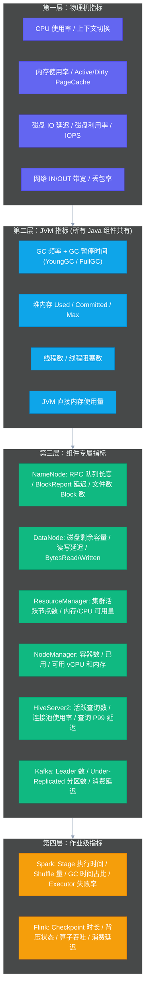
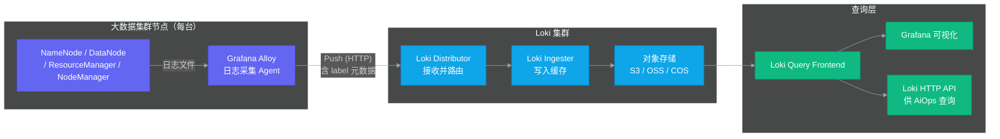
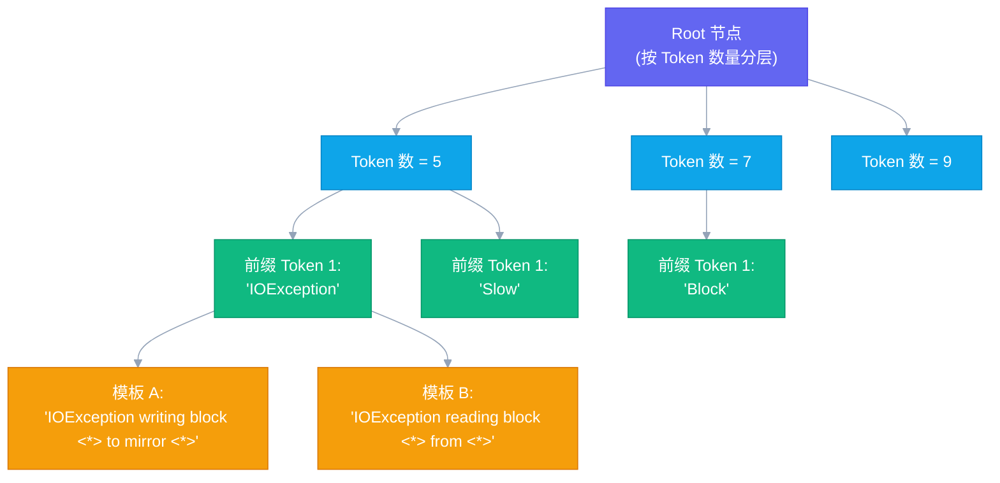

# 02 数据地基优先：为什么垃圾进垃圾出是 AiOps 最大的坑

## 摘要

本文是专栏第二篇，聚焦 AiOps 落地最关键的前置条件：数据底座建设。文章从"Garbage In, Garbage Out"这一铁律出发，系统拆解可观测三支柱（Metrics / Logs / Traces）在大数据集群场景中的适配策略与工程实现。重点深度解析：Prometheus Exporter 采集质量治理的核心指标与调优方法，[[Loki]] 日志流水线在大数据集群中的完整设计（从 [[Grafana Alloy]] 采集到日志标签体系），[[Drain3]] 日志模板化算法的数学原理与工程落地，以及服务拓扑数据（SCMDB）对 AiOps 决策层的根本性支撑。本文的核心主张：在任何智能化分析模块上线之前，先把数据质量治理做到位，是一切 AiOps 投资的最高性价比保障。

---

## 第 1 章 Garbage In, Garbage Out：数据质量为什么是 AiOps 的生死线

在 AiOps 落地实践中，有一个定律被反反复复验证：**数据质量问题，是 90% 的 AiOps 项目失败或跑偏的根本原因，而大多数团队都低估了它的严重性。**

这个定律有一个简洁有力的表达：**Garbage In, Garbage Out**（垃圾进，垃圾出）。机器学习算法再精妙，也无法从低质量数据中提炼出高质量的洞察。LLM 的推理能力再强，在面对标签混乱、字段缺失、时间戳不对齐的日志数据时，输出的也只会是语言流畅但事实错误的"自信胡说"。

什么叫"低质量数据"？在大数据集群运维场景中，低质量数据的典型表现是：

**指标维度**：Exporter 采集延迟不稳定（有时 10s，有时 120s），某些关键指标因为 JMX 连接超时而长时间断点（缺失率 5%），指标命名不规范（`hadoop_namenode_gc_time` 和 `namenode.gc.time.ms` 并存），不同集群间同名指标含义不同。

**日志维度**：日志文件路径和命名不统一，关键组件（NameNode/ResourceManager）的日志没有结构化标签（无法快速过滤出特定 `job_id` 的日志），日志级别滥用（大量 INFO 日志中夹杂着真正重要的 WARN/ERROR），日志采集管道不稳定（Kafka 积压时日志丢失）。

**变更维度**：Ambari 配置变更有记录，但字段不统一（有的记录变更组件，有的不记录），手工操作没有写入变更台账，扩缩容操作由不同系统触发但没有统一汇聚点。

当你用这样的数据训练异常检测模型，结果一定是：大量的误报（Exporter 采集延迟导致的"指标突降"被误判为组件故障），大量的漏报（关键故障发生时恰好是 Exporter 空白窗口），以及根因分析的严重失准（日志中找不到关键错误，因为没有 `job_id` 标签，无法和告警事件关联）。

这些问题的根本解决方案，不是调优算法参数，而是**在数据入口处治理数据质量**。

> [!warning] 一个残酷的现实
> 绝大多数大数据集群 SRE 团队在启动 AiOps 项目之前，可观测数据的实际质量都无法达到 AiOps 算法的最低要求。这不是批评，而是现实——因为可观测建设本身就是一个长期的专项投入，很少有团队在没有明确目标驱动的情况下把数据质量打磨到 AiOps 就绪的水平。承认这个现实，并把数据治理作为 AiOps Phase 0 的核心任务，是正确的工程决策。

---

## 第 2 章 可观测三支柱在大数据集群中的适配

可观测性（Observability）的三支柱是 Metrics、Logs、Traces。在云原生和微服务领域，这三个维度的定义和工具链已经非常成熟；但在大数据集群场景中，每个维度都需要针对性的适配和特殊处理。

### 2.1 为什么大数据集群没有 Traces（链路追踪）

先说最容易引起误解的 Traces。

在微服务架构中，Traces 是指分布式链路追踪——每一个 HTTP 请求都携带一个唯一的 Trace ID，请求流经各个服务时，每个服务都记录自己的处理时间和调用关系，最终形成一棵完整的调用树。这使得故障定位变得非常直观：沿着 Trace 树找到最早出现异常的节点，就是根因。

大数据集群的内部通信完全不走 HTTP。NameNode 与 DataNode 之间用的是 [[Hadoop RPC]]（基于 Protocol Buffers 的自定义二进制协议），ResourceManager 与 NodeManager 之间用的是 YARN 的 Heartbeat 协议，HiveServer2 接受用户的 JDBC 连接后内部走 Thrift 协议。这些协议都没有原生的 Trace ID 概念，也没有成熟的 OpenTelemetry instrumentation。

这意味着，大数据集群的 AiOps 必须放弃"基于 Trace 的根因分析"这条在微服务中最有效的路径，转而依赖**手工建模的组件依赖关系图（SCMDB）+ 多维指标关联分析**来还原故障传播路径。这个话题将在[[04 组件依赖拓扑：SCMDB 是大数据集群 AiOps 的骨架]]中深度展开。

有一个例外值得提及：**Spark/Flink 作业的内部执行 DAG**，可以视为一种特殊形式的"Trace"——Spark 的 History Server 记录了作业的 Stage 依赖关系和每个 Task 的执行时间。这份数据对于作业异常检测（长尾 Stage、数据倾斜 Task）非常有价值，是[[08 作业画像与异常检测：Spark 和 Flink 的 AiOps 专属能力]]的重要数据来源之一。

### 2.2 Metrics：大数据集群指标体系的完整结构

Metrics 是大数据集群 AiOps 中数据质量最容易量化、治理效果最直接的维度。

大数据集群的指标体系分为四个层次：



这四个层次中，第一层和第二层是各个 Exporter 都会采集的通用指标，第三层是各个大数据组件通过 [[JMX Exporter]] 暴露的专属指标，第四层是从 [[Spark History Server]] / [[Flink REST API]] 获取的作业运行时数据。

**哪些是 AiOps 最关键的指标？**

不是所有指标都对 AiOps 同等重要。从根因分析的视角，以下指标具有最高的"信号密度"（即出现异常时最有可能指向真实故障的指标）：

| 指标 | 组件 | 为什么重要 |
|------|------|---------|
| `NameNode_RPC_callQueueLen` | NameNode | 超过阈值意味着所有 HDFS 操作都将开始积压，是 NameNode 过载的最早信号 |
| `NameNode_GC_timeMillis` | NameNode | Full GC 时 NameNode 完全停止服务，是级联故障的主要触发源 |
| `DataNode_DataNodeDiskMetrics_diskIoTime` | DataNode | 磁盘 IO 饱和的直接指标，坏盘的最早信号往往在 IO 延迟 |
| `yarn_resourcemanager_activeNodes` | ResourceManager | 活跃节点数骤降意味着 NodeManager 大规模失联 |
| `kafka_server_BrokerTopicMetrics_UnderReplicatedPartitions` | Kafka | 非零意味着副本同步中断，是 Broker 过载或 Leader 选举风暴的信号 |
| `spark_executor_failed` | Spark Executor | Executor 失败率上升是 OOM 或 NodeManager 故障的下游表现 |

### 2.3 Logs：大数据集群日志体系的挑战

日志是大数据集群 AiOps 中**最有价值但最难处理**的数据维度。

为什么最有价值？因为所有故障的根因信息，最终都会以某种形式出现在日志中：NameNode 的 GC 暂停有完整的 GC 日志，DataNode 的磁盘错误有 `IOException` 堆栈，Spark Executor 的 OOM 有明确的 `OutOfMemoryError`。指标只能告诉你"某个值异常了"，日志才能告诉你"为什么异常"。

为什么最难处理？大数据集群的日志有以下四个特点让它成为工程上的老大难：

**高噪声**：一个有 500 个节点的大数据集群，正常运行时每天产生的日志量轻松超过 TB 级别。其中 99.9% 以上是 INFO 级别的正常运行日志（心跳、Block Report、定期快照……），真正需要关注的 ERROR/WARN 埋藏在这片海洋里。

**半结构化**：Hadoop/Spark 的日志格式虽然有固定的时间戳+级别+类名前缀，但消息体是完全自由格式的文本。同一类问题（如 DataNode 磁盘 IO 错误）在不同版本、不同配置下可能产生不同格式的日志行。

**高频变化**：每次升级 Hadoop/Spark/Flink 版本，日志格式可能发生变化，之前训练的日志解析规则可能失效。

**关联难度大**：一个 Spark 作业的日志分散在 Driver 节点和多个 Executor 节点的多个文件里，按 `job_id` 关联在没有统一采集标签的情况下几乎不可能。

---

## 第 3 章 Loki 日志流水线：大数据集群的工程实现

[[Loki]] 是 Grafana Labs 开源的分布式日志聚合系统，它的设计哲学与 [[Prometheus]] 高度一致：**用标签（Labels）而不是全文索引来组织日志，低存储成本，高查询效率**。这个设计非常适合大数据集群场景——我们不需要对每一行日志都做全文索引（那样成本太高），我们需要的是按 `component`、`hostname`、`cluster`、`log_level` 这些维度快速过滤。

### 3.1 整体架构



### 3.2 标签体系：AiOps 的关键设计决策

在 Loki 中，标签（Labels）是流（Stream）的唯一标识。不同标签组合代表不同的日志流，查询时通过标签过滤日志。

对于大数据集群，**标签体系的设计直接决定了 AiOps 后续能做什么**。如果标签设计得不合理，很多关联分析将无法实现。

推荐的大数据集群 Loki 标签体系如下：

| 标签名 | 值示例 | 说明 |
|--------|--------|------|
| `cluster` | `prod-bigdata-01` | 集群标识，支持多集群部署 |
| `component` | `namenode` / `datanode` / `resourcemanager` | 大数据组件类型，用于按组件过滤 |
| `hostname` | `nn001.prod.example.com` | 主机名，用于定位到具体节点 |
| `log_level` | `ERROR` / `WARN` / `INFO` | 日志级别，用于快速过滤噪声 |
| `job_id` | `application_1234567890_0001` | YARN Application ID，用于关联作业日志 |
| `service_group` | `hdfs` / `yarn` / `hive` / `spark` | 服务组，用于按功能域聚合 |

> [!warning] 标签基数（Cardinality）陷阱
> Loki 的性能与标签基数强相关——标签值的唯一组合数越多，Loki 需要管理的流越多，性能越差。千万不要把高基数字段（如 `task_id`、`timestamp`、精确的 `ip:port`）放进标签。保持每台机器的流数量在 10-50 个，是合理的设计范围。

### 3.3 Grafana Alloy 配置要点

[[Grafana Alloy]] 是 Grafana Labs 的下一代遥测数据采集器（原 Grafana Agent Flow 的继任者），在 2024 年之后成为推荐的日志采集方案。

以 NameNode 日志采集为例，Alloy 配置的核心逻辑包括：

**文件发现**：通过 `local.file_match` 组件扫描 NameNode 的日志目录，匹配 `hadoop-hdfs-namenode-*.log*` 格式的文件，支持日志轮转后自动切换到新文件。

**多行日志处理**：Java 日志中的异常堆栈（Stack Trace）是多行的，必须配置多行合并规则，将属于同一个日志条目的多行合并成单行推送到 Loki，否则 Loki 会把每行堆栈都当成独立的日志条目，导致异常信息碎片化，无法用于根因分析。

**标签注入**：在 Alloy 的 pipeline 中注入静态标签（`cluster`、`component`、`hostname`）和从日志行内容提取的动态标签（`log_level` 从日志前缀提取，`job_id` 从日志行中的 Application ID 提取）。

```
// Alloy 伪配置示例（展示核心逻辑，非完整可运行配置）
// 1. 文件发现
local.file_match "namenode_logs" {
  path_targets = [{"__path__" = "/var/log/hadoop/hdfs/hadoop-hdfs-namenode-*.log*"}]
}

// 2. 日志读取 + 多行合并（Java 堆栈）
loki.source.file "namenode" {
  targets    = local.file_match.namenode_logs.targets
  forward_to = [loki.process.namenode_pipeline.receiver]
  // 多行合并：以时间戳开头的行视为新日志条目的开始
  decompression { enabled = true }
}

// 3. 处理 pipeline：标签提取 + 级别过滤
loki.process "namenode_pipeline" {
  // 从日志行提取 log_level
  stage.regex { expression = "^\\d{4}-\\d{2}-\\d{2} \\d{2}:\\d{2}:\\d{2},\\d+ (?P<log_level>\\w+)" }
  stage.labels { values = { log_level = "" } }
  // 注入静态标签
  stage.static_labels { values = { cluster = "prod-bigdata-01", component = "namenode" } }
  // 注入 hostname（从环境变量）
  stage.env { values = { hostname = "HOSTNAME" } }
  stage.labels { values = { hostname = "" } }
  forward_to = [loki.write.default.receiver]
}
```

---

## 第 4 章 Drain3：日志模板化的算法原理与工程实践

解决了日志的采集和存储问题之后，下一个关键问题是：如何从海量半结构化日志中提取有效的异常信号？

这里涉及一个重要的中间处理步骤：**日志模板化（Log Parsing / Log Templating）**。

### 4.1 为什么需要日志模板化

想象 DataNode 产生的以下几行日志：

```
2026-01-15 03:12:01,234 ERROR ... IOException writing block blk_1073741825 to mirror 10.2.130.160:50010
2026-01-15 03:12:03,891 ERROR ... IOException writing block blk_1073741842 to mirror 10.2.130.161:50010
2026-01-15 03:12:05,112 ERROR ... IOException writing block blk_1073741867 to mirror 10.2.130.165:50010
```

从语义上，这三行日志描述的是**同一类问题**：DataNode 写入副本时发生 IOException。它们之间的差异只是 block ID 和目标 IP 不同。

如果我们把每一行日志都当成独立的异常信息，那么在 300 个 DataNode 的集群里，一次磁盘故障可能产生数万条"不同的"日志行，爆炸式的异常数量让任何分析算法都无从下手。

日志模板化解决的正是这个问题：把具有相同语义结构的日志行归并到同一个**模板**下，将变化的部分（block ID、IP 地址、时间戳）识别为参数（wildcards），只保留不变的结构性部分。上述三行日志模板化后得到：

```
IOException writing block <*> to mirror <*>
```

这样，原来的数万条日志行，变成了这一个模板的 N 次实例化，后续的异常检测就简单得多了：统计这个模板在单位时间内的出现频率，偏离历史基线就触发告警。

### 4.2 Drain3 算法：前缀树 + 相似度匹配

[[Drain3]] 是目前工业界应用最广泛的日志模板化算法，由 IBM 研究院（Liu Wei 等人）在论文《Drain: An Online Log Parsing Approach with Fixed Depth Tree》中提出，Drain3 是其 Python 实现的第三代版本。

Drain 的核心数据结构是一棵**固定深度的前缀树（Fixed-depth Prefix Tree）**：



当一条新日志进来时，Drain 的处理流程如下：

**第一步：按 Token 数量路由**。将日志行按空格分词，根据 token 数量找到对应的第一层子树。Token 数量相同的日志行才有可能属于同一个模板（长度差异大的日志不会被错误地归并）。

**第二步：按前缀 Token 路由**。在同一 token 数量的子树中，按 token 的前缀逐层路由。Drain 的一个关键假设是：日志行开头的固定 token（如 `IOException`、`Slow`、`Block`）通常不会是变量，它们是区分不同日志类型的关键标识。

**第三步：相似度计算**。到达叶子节点的模板候选列表后，对新日志行与每个候选模板计算相似度（simSeq）：匹配的 token 数量 / 总 token 数量。如果最高相似度超过阈值（通常 0.5），则将该日志行归入对应模板；如果没有超过阈值，则创建新模板。

**第四步：模板更新**。将新日志行和已有模板比较时，对不匹配的位置，用 `<*>` 替换（即该位置是变化的参数）。

Drain 的关键优点是：**在线处理（Online Processing）**，不需要批量处理历史数据，每条日志都实时归类，适合流式日志处理场景；**时间复杂度接近 O(1)**，树的深度固定（通常 4 层），查找效率极高。

### 4.3 Drain3 在大数据集群日志中的标定

Drain3 需要针对不同的日志格式进行配置。对于大数据集群日志，关键配置参数包括：

**日志预处理规则（Masking）**：在 Drain 解析之前，先用正则表达式将已知的变量替换为占位符，减少算法的模板爆炸问题。常用的 Masking 规则包括：
- IP 地址：`\d+\.\d+\.\d+\.\d+(:\d+)?` → `<IP>`
- Block ID：`blk_-?\d+` → `<BLK>`
- Application ID：`application_\d+_\d+` → `<APPID>`
- 时间戳：`\d{4}-\d{2}-\d{2}T\d{2}:\d{2}:\d{2}` → `<TIME>`

**相似度阈值（Similarity Threshold）**：这个参数需要根据日志样本调整。对于 Hadoop/Spark 这类格式相对规范的日志，0.4-0.6 通常是合适的范围；对于应用层日志（如 HiveServer2 的 SQL 执行日志），由于 SQL 语句的高变异性，可能需要调高到 0.7-0.8。

**最大 Cluster 数量（Max Clusters）**：防止模板无限增长。对于大数据集群日志，通常 500-2000 个模板就能覆盖 90%+ 的日志类型。

---

## 第 5 章 Exporter 采集质量治理

[[Prometheus Exporter]] 是大数据集群指标采集的核心组件。从 AiOps 的视角，Exporter 采集质量有三个关键维度需要持续治理。

### 5.1 采集延迟与稳定性

AiOps 的异常检测算法通常假设指标是以固定频率采集的（如每 30 秒一个 sample）。如果采集延迟不稳定（有时 15s，有时 90s，有时因为 JMX 超时而跳过），算法就会把"采集间隔变化"误判为"指标突变"。

对于 Hadoop JMX Exporter，采集延迟不稳定最常见的原因是 JMX 端口的 GC 影响：当 NameNode 发生 Full GC 时，JMX 查询会超时，导致该轮次的采集失败。这个问题的缓解方案是：在 Exporter 侧设置合理的超时时间（建议 10-20s），并在 [[VictoriaMetrics]] / [[Prometheus]] 侧配置 `staleness` 处理，将缺失的采集 point 标记为 NaN 而不是直接用上一个 sample 填充（flatline 填充会导致后续的 rate 计算严重失真）。

**关键治理指标**：
- `scrape_duration_seconds`：每个 Exporter 的采集耗时，P99 应 < 5s
- `up`：Exporter 是否在线，持续 = 0 超过 2 分钟需要告警
- `scrape_samples_scraped`：每次采集到的 sample 数量，骤降说明 JMX 暴露有问题

### 5.2 指标命名规范

指标命名混乱是大数据集群指标体系的常见问题，尤其是在多个版本的 Exporter 共存的环境下。

规范的指标命名应该遵循 Prometheus 命名约定：
- 格式：`{subsystem}_{component}_{metric_name}_{unit}`
- 例子：`hadoop_namenode_fsimage_last_loaded_timestamp_seconds`

如果同一类指标在不同版本的 Exporter 中有不同的名称（`namenode_gc_time` vs `hadoop_namenode_jvm_gctime`），需要在 VictoriaMetrics 的 recording rules 或 relabeling 配置中做统一映射，确保下游 AiOps 算法消费的是统一命名空间的指标。

### 5.3 关键指标缺失率监控

对于 AiOps 最依赖的核心指标，应该设置"缺失率告警"：如果某个关键指标在过去 5 分钟内的有效 sample 数量低于预期（比如 30s 采集间隔，5 分钟内应该有 10 个 sample，如果少于 8 个就告警），则触发采集质量告警。

这一机制的目的不是为了替代其他告警，而是用于**在 AiOps 算法产生异常结果时，快速判断是真实的集群异常还是采集质量问题**——这是 AiOps 可解释性的重要组成部分。

---

## 第 6 章 变更数据：被严重低估的第四个数据源

在可观测三支柱（Metrics / Logs / Traces）之外，还有一个对大数据集群 AiOps 极其重要的数据源被大多数文章忽略：**变更数据（Change Events）**。

业界统计数据表明，大型数据基础设施的重大故障中，有 60-70% 直接或间接与变更操作相关。变更包括：Ambari 配置参数修改、集群扩缩容（新增/下线 DataNode/NodeManager）、组件升级、Kafka 分区扩展、YARN 队列参数调整、Spark/Flink 作业参数修改。

变更数据在 AiOps 中扮演两个角色：

**角色一：根因分析的关键线索**。当故障发生时，第一个检查的假设应该是"最近有没有做过变更"。如果故障时间与某个变更时间高度吻合（比如配置变更 10 分钟后 HiveServer2 开始大量告警），这个变更就是强烈的根因候选。

**角色二：告警降噪的上下文**。某些情况下的指标抖动不是故障，而是正常的变更行为（比如集群扩容时 DataNode 数量变化会触发 Block 重分配，这段时间内的 IO 指标波动是正常的）。如果 AiOps 系统知道当前有扩容操作，它就可以将相关的告警标记为"变更相关，低优先级"，而不是产生误报。

对于 [[Ambari]] 管理的集群，变更数据可以通过 Ambari 的审计日志 API 获取。但 Ambari 审计日志的结构化程度不高（很多信息藏在 JSON 字符串里），需要做一层 ETL，提取出变更类型、变更组件、变更时间、操作人等关键字段，写入一个结构化的变更台账数据库，供 AiOps 的决策层查询。

---

## 第 7 章 数据地基的就绪标准

在启动 AiOps 任何智能化分析模块之前，需要对数据底座做一次全面的就绪评估。以下是一套最低可用标准（Minimum Viable Data Platform）：

| 维度 | 就绪标准 | 验证方法 |
|------|---------|---------|
| **指标覆盖率** | 核心组件（NameNode × 2、DataNode 全量、RM × 2、NM 全量、HiveServer2、主要 Kafka Broker）的 JMX Exporter 全部在线 | `up{job=~"hadoop.*"} == 0` 查询应为空 |
| **指标采集稳定性** | 核心指标缺失率 < 1%，P99 采集延迟 < 5s | 对 `scrape_duration_seconds` 做 P99 查询 |
| **日志覆盖率** | NameNode / ResourceManager / DataNode / NodeManager 的 ERROR+WARN 日志全量进 Loki | 抽样验证 10 台节点 |
| **日志标签体系** | 每条日志都携带 `cluster`、`component`、`hostname`、`log_level` 四个必填标签 | LogQL 查询验证标签完整性 |
| **变更数据** | Ambari 配置变更可通过 API 查询，延迟 < 5 分钟 | 手动执行一次配置变更，验证 API 记录 |
| **指标命名统一** | 同一类指标在所有集群中使用相同命名，无冗余别名 | 指标名称 cardinality 分析 |
| **时间同步** | 所有节点的 NTP 同步偏差 < 100ms | `chronyc tracking` 批量检查 |

> [!tip] Phase 0 的正确姿势
> 不要因为数据底座还不完善就推迟启动 AiOps 工作。"数据底座建设"和"AiOps 项目规划"可以并行进行——规划阶段不需要完整的数据，但到了决策层和执行层开发时，数据底座必须达到上述就绪标准。这意味着 Phase 0 的工作至少需要 2-3 个月，要在项目计划中给予足够的时间。

---

## 第 8 章 小结与下一篇预告

本篇的核心结论可以浓缩成一句话：**在 AiOps 的资源投入分配上，60% 的精力放在数据质量治理，30% 放在算法和系统建设，10% 放在 UI 和呈现——这才是符合 ROI 原则的正确分配。**

大多数 AiOps 项目的实际分配恰恰相反：把大量资源投入到算法模型和炫酷仪表盘，在数据质量上投入严重不足，最终在生产环境里碰壁。

我们覆盖了：
1. **为什么数据质量是 AiOps 的生死线**（Garbage In, Garbage Out 铁律）
2. **Traces 在大数据集群中的特殊处理**（无 HTTP Trace，用 SCMDB 替代）
3. **Metrics 四层体系**（物理机 / JVM / 组件专属 / 作业级）
4. **Loki 日志流水线完整设计**（Alloy 采集 + 标签体系 + 多行合并）
5. **Drain3 算法原理**（前缀树 + 相似度匹配 + Masking 预处理）
6. **Exporter 采集质量治理**（延迟稳定性 / 命名规范 / 缺失率监控）
7. **变更数据的重要性**（被低估的第四个数据源）
8. **数据地基就绪标准**（可操作的 Checklist）

下一篇[[03 告警工程：从告警风暴到1条主事件的设计哲学]]将进入 AiOps 价值交付最快的领域：告警体系设计。我们将深度解析告警聚合降噪从原理到实现的完整路径，这是数据底座就绪后第一个可以产生可见价值的 AiOps 能力。

*本文是「大数据集群 SRE 的 AiOps 工程实践」专栏第二篇。上一篇：[[01 AiOps 是什么：从救火到防火的运维范式革命]] | 下一篇：[[03 告警工程：从告警风暴到1条主事件的设计哲学]]*
