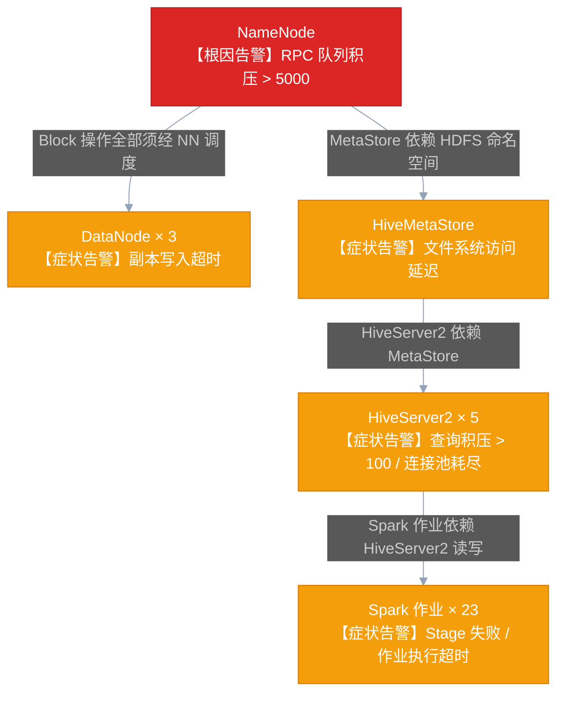

# 03 告警工程：从告警风暴到1条主事件的设计哲学

## 摘要

本文是专栏第三篇，聚焦 AiOps 价值交付最快的领域：告警工程。文章从告警体系的演进史切入，系统阐明"告警风暴"产生的根本原因，深度拆解告警聚合降噪的三个核心维度（时间窗口 + 组件拓扑依赖 + 相似模式），分析静态阈值与动态基线的本质差异与选型逻辑，讲解变更关联分析的工程实现，以及告警压缩率 70%+ 的现实实现路径。本文的核心主张：AiOps 对告警体系的第一个贡献，不是让告警更多更全，而是让值班工程师接收到的是"事件"而非"症状"——一个有完整上下文的主事件，远比三百条独立的症状告警更有价值。

---

## 第 1 章 告警体系的演进：从"尽量多报"到"只报关键"

### 1.1 第一阶段：阈值告警时代（2010-2018）

大数据集群告警体系的第一代范式，是以 [[Zabbix]] / Nagios / [[Ambari]] 原生告警为代表的**阈值告警系统**。它的核心逻辑极其简单：如果某个指标超过了某个预设值，就发送一条告警。`if cpu > 90% then alert`。

这个时代的告警哲学可以概括为：**"宁可有一千条误报，不能漏掉一条真报"**。不确定的情况下就配告警，结果是告警规则越来越多，告警数量越来越大，但工程师处理告警的效率却越来越低。这里面存在一个根本性的悖论：**告警越多，每条告警的关注度就越低；到了某个临界点，告警不再是有效的信号，而是背景噪声。**

Ambari 管理的大型大数据集群，原生告警规则轻松超过 300 条。每次大规模故障，几十条到几百条告警同时触发，全部发送到值班群——工程师面对的不是"有一个故障需要处理"，而是"有三百件紧急的事情需要处理"，认知负荷直接打满。

### 1.2 第二阶段：多维监控时代（2018-2022）

随着 [[Prometheus]] + Grafana 生态的成熟，告警体系有了一次升级：从单维度阈值告警，变成了基于 PromQL 的多维度告警表达式，以及基于 Prometheus Alertmanager 的路由与聚合机制。

Alertmanager 引入了几个重要的概念：**分组（Grouping）**——将同一时间窗口内相同标签的告警合并；**静默（Silencing）**——在维护窗口期间批量屏蔽告警；**路由（Routing）**——按告警标签将不同告警发送给不同的接收人。

这是一个明显的进步，但仍然停留在"症状告警"层面。Alertmanager 的分组是基于标签的简单聚合（比如把所有 NameNode 的告警发给 HDFS 小组），但它无法做到"理解告警之间的因果关系"——它不知道 HiveServer2 的查询超时告警是 NameNode GC 的下游症状，因此这两个告警会分别发出，而不是被合并成一个"根因：NameNode GC，下游影响：HiveServer2 查询超时"的主事件。

### 1.3 第三阶段：AiOps 告警时代（2022-至今）

AiOps 告警的核心目标转变，是把关注点从"告警数量"转移到"事件质量"。它不再关心"所有的指标异常都被检测到了吗"，而是关心"当业务真正出了问题时，值班工程师能在最短的时间内理解发生了什么，并知道应该做什么"。

这里面有一个关键的认知升级：**告警的价值不是"告诉你出了问题"，而是"告诉你出了什么问题、影响了什么、可能是什么原因"。** 前者任何监控系统都能做，后者需要 AiOps 的能力。

这个目标导向下，AiOps 告警体系的核心输出不是告警列表，而是**主事件卡片（Incident Card）**：

> **事件摘要**：HDFS 写入故障，影响 3 个 DataNode 上的副本写入
> **影响范围**：下游 HiveServer2 执行中的 47 个查询开始超时，预计影响数仓 ETL 批处理作业
> **可能根因**：`dn-003.prod.bigdata.com` 磁盘 `/data/disk3` SMART 预警，IO 延迟从基线 2ms 上升至 340ms
> **关联变更**：昨日 23:30 该节点进行了磁盘配额调整（Ambari 配置变更 #23891）
> **推荐动作**：检查 `dn-003` 磁盘健康状态；触发 HDFS 副本重均衡；通知存储团队
> **已收敛告警**：327 条相关症状告警已聚合到本事件

---

## 第 2 章 告警聚合降噪的三个核心维度

从"症状告警"升级到"主事件"，核心技术是**告警聚合降噪**。告警聚合降噪的本质，是识别多条独立告警之间的关联性，将相关告警归并为一个事件，并提炼出这个事件的关键信息。

关联性有三个维度：时间维度、空间（拓扑）维度、语义维度。

### 2.1 时间维度：时间窗口聚合

最简单的聚合方式：在一个时间窗口内（通常 5-15 分钟）发生的所有告警，如果来自同一个集群/服务组，则归并为一个事件。

这个方法简单高效，但有明显的局限性：
- **误合并**：时间窗口内两个不相关的告警（比如同时发生的磁盘告警和 Kerberos 票据过期），会被错误地认为是同一个事件
- **跨窗口的漏合并**：一个故障从触发到完全扩散可能需要 20 分钟，超出时间窗口的告警就无法归并到同一个事件

尽管如此，时间窗口聚合作为第一道粗筛，仍然有其价值：它能把短时间内的大量重复告警（同一个组件在 5 分钟内反复触发的同一条规则）压缩为单条。

### 2.2 空间（拓扑）维度：组件依赖聚合

这是三个维度中工程价值最高、也最依赖前置条件（SCMDB）的一个维度。

基于组件依赖图的聚合逻辑是：当多个组件同时出现告警时，沿着组件依赖图追溯，如果告警组件之间存在上下游依赖关系，则将下游组件的告警标记为"衍生告警"，归并到上游根因组件的主事件中。

以大数据集群为例：



在这个场景里，只有 NameNode 的告警是真正的根因告警，DataNode、HiveMetaStore、HiveServer2、Spark 作业的告警都是衍生症状。如果按拓扑聚合，工程师接收到的应该是：

> **1 条主事件**：NameNode RPC 队列积压（根因），影响下游 3 个 DataNode + 5 个 HiveServer2 + 23 个 Spark 作业（已收敛 327 条衍生告警）

而不是 328 条独立的告警。

这就是基于拓扑依赖的聚合的威力：它把"多个症状"收敛成"一个根因"，直接将告警数量从 328 压缩到 1，压缩率 99.7%。

### 2.3 语义维度：相似模式聚合

时间窗口和拓扑聚合解决了"已知关系"的聚合问题，但有些告警之间的关联关系在 SCMDB 中没有建模（比如两个来自不同业务线、没有直接依赖关系的 Spark 作业，同时出现类似的 OOM 告警，可能都是因为 YARN 队列水位过高，但这个关联关系不在组件依赖图里）。

语义维度的聚合，通过计算告警的语义相似度（告警名称、告警标签的文本相似度，或者从历史数据中学习的告警共现概率）来识别这类关联。这是三个维度中算法复杂度最高的一个，通常在 Phase 2 阶段才引入，Phase 1 先用前两个维度的聚合作为基础。

---

## 第 3 章 静态阈值 vs 动态基线：两种告警感知模式的本质差异

### 3.1 静态阈值的天花板

静态阈值的设置本质上是一个人工经验的外化：运维工程师根据自己对系统的了解，判断"什么水平是异常的"，然后把这个判断写成一条规则。这个过程有一个根本性的问题：**系统的正常行为不是固定的，它随时间、业务周期、访问模式而变化。**

以 NameNode 的 RPC 队列长度为例。一个大型生产集群，工作日白天高峰期的 RPC 队列长度可能正常在 1000-2000，这时候值班工程师看到队列长度 800 并不会紧张；而凌晨 3 点的基线则可能是 50-200，这时候如果队列长度突然到 500，就很可能是异常信号（可能有一个批处理作业使用了不当的参数，在凌晨发起了大量的 HDFS 小文件操作）。

如果用静态阈值，你要么把阈值设得很高（比如 3000），能覆盖白天高峰，但会漏掉凌晨的异常；要么设得很低（比如 300），能检测凌晨的异常，但白天会产生大量误报。

这个问题在所有具有**周期性规律**的大数据集群指标中普遍存在：YARN 队列使用率（工作日高峰 vs 周末低谷）、DataNode IO 吞吐（批处理作业运行时 vs 空档期）、Kafka 消费延迟（实时业务流量高峰 vs 夜间）。

### 3.2 动态基线的核心原理

动态基线的思路是：不要固定阈值，而是从历史数据中学习"正常"的范围，然后检测"偏离正常范围"的行为。

最常用的动态基线构建方法有三种：

**方法一：滑动窗口统计基线**
计算过去 N 周同一时间段的均值（Mean）和标准差（Std），以 Mean ± k×Std 作为正常范围（通常 k=3，对应 99.7% 置信区间）。这种方法实现简单，适合有明显周期性规律的指标（如 YARN 队列使用率）。

局限：对于具有趋势性（长期增长）或异方差性（不同时间段波动幅度不同）的指标，固定 k 值的效果不好。

**方法二：Prophet 时序分解**
Facebook 开源的 [[Prophet]] 算法将时序数据分解为趋势项（Trend）、季节性项（Seasonality，包括日周期和周周期）和残差项（Residual）。正常范围由前两项决定，残差超过一定阈值则触发异常。

Prophet 特别适合 NameNode 的文件数增长趋势（长期上升 + 工作日/节假日周期），以及 YARN 队列使用率（明显的日周期规律）。

**方法三：Isolation Forest**
适合没有明显周期规律的高维指标异常检测。Isolation Forest 通过随机分区树的方式，计算每个数据点的"隔离难度"——越容易被隔离的点（需要的分区次数越少），越可能是异常点。

Isolation Forest 适合 DataNode 磁盘 IO 延迟（正常时稳定，坏盘 I时 IO 延迟会突然跳变，没有明显周期规律）和 NameNode GC 暂停时间（GC 风暴突然出现，没有周期性）。

> [!note] 动态基线的工程取舍
> 动态基线并非在所有场景下都优于静态阈值。对于"绝对不能超过某个值"的硬性约束（比如 DataNode 磁盘剩余容量低于 10%），静态阈值反而更合适，因为这个约束与业务周期无关。实际的告警体系往往是静态阈值（硬约束）+ 动态基线（行为异常检测）的组合使用。

---

## 第 4 章 变更关联分析：告警降噪的关键上下文

### 4.1 为什么告警必须关联变更

想象以下两个场景：

**场景 A**：凌晨三点，HiveServer2 告警，50 个查询开始超时。没有任何最近的变更记录。→ 这大概率是真实故障，需要紧急响应。

**场景 B**：下午两点，HiveServer2 告警，50 个查询开始超时。30 分钟前有一条 Ambari 变更记录：`HiveServer2 hive.server2.thrift.max.worker.threads` 从 500 改为 200。→ 这很可能是配置变更引起的，应该第一时间检查该配置变更的影响，而不是漫无目的地排查。

在第二个场景中，如果告警系统能自动把"HiveServer2 超时告警"与"刚刚的 HiveServer2 线程数配置变更"关联起来，并在告警通知中显示"关联到变更 #23891：hive.server2.thrift.max.worker.threads 从 500 改为 200（30分钟前）"，值班工程师的排查时间会从"20 分钟盲目排查"缩短到"5 分钟定向验证"。

### 4.2 变更关联分析的工程实现

变更关联分析的核心思路：当一条告警触发时，查询固定时间窗口内（通常是告警时刻前 30 分钟到前 2 小时）的所有变更记录，按以下维度筛选相关变更：

**组件相关性**：变更的目标组件与告警的来源组件相同（或有依赖关系）。例如，HiveServer2 告警应该关联 HiveServer2 的变更；鉴于 SCMDB 中 HiveServer2 依赖 NameNode，也应该关联 NameNode 相关的变更。

**时间接近度**：变更与告警时刻的时间差越小，相关性越高。通常按时间差线性打分：30 分钟内的变更得分最高，2 小时外的变更降低权重。

**变更类型权重**：不同类型的变更对服务的影响程度不同。配置变更（直接影响进程行为，得分最高）> 扩缩容操作（影响资源分配，中等）> 版本升级（影响最大但通常有计划，可以单独标注）。

满足上述条件的变更记录，按综合得分排序后，最多取 Top-3 显示在告警卡片的"关联变更"区域。

### 4.3 Ambari 变更数据的获取与结构化

[[Ambari]] 提供了完整的 REST API 用于查询变更历史（Operations 和 Config Track）：

```
GET /api/v1/clusters/{cluster_name}/requests?fields=Requests/operation_level,Requests/end_time,Requests/start_time,Requests/request_context,Requests/status
```

但原始数据的结构化程度不足以直接用于关联分析，需要提取以下关键字段并写入结构化存储：

| 字段 | 说明 | 示例 |
|------|------|------|
| `change_id` | 变更唯一标识 | `AMB-#23891` |
| `change_type` | 变更类型 | `CONFIG_CHANGE` / `SERVICE_RESTART` / `SCALE_OUT` |
| `target_service` | 变更的服务 | `HIVE` / `HDFS` / `YARN` |
| `target_host` | 变更的主机（如适用） | `dn-003.prod.bigdata.com` |
| `start_time` | 变更开始时间 | `2026-01-15T14:23:45Z` |
| `end_time` | 变更结束时间 | `2026-01-15T14:25:12Z` |
| `operator` | 操作人 | `admin@company.com` |
| `change_detail` | 变更内容摘要（JSON） | `{"key": "...", "old": "...", "new": "..."}` |

---

## 第 5 章 Foxeye 告警平台：从 Ambari 到 AiOps 就绪的迁移

### 5.1 为什么要迁移告警平台

[[Foxeye]] 是基于 [[Prometheus Alertmanager]] 二次开发的内部告警平台（或类似商业产品），相对于 Ambari 原生告警，它具备以下关键优势：

**数据源丰富**：Ambari 的原生告警只能消费 Ambari 自己管理的检查结果，无法消费 Prometheus 指标和 Loki 日志。Foxeye 可以同时接入 [[VictoriaMetrics]] 的指标查询和 Loki 的日志查询，实现全数据源统一告警管理。

**告警即代码（Alerting-as-Code）**：Foxeye 支持将告警规则以代码形式管理（YAML 配置），可以做版本控制、Code Review、自动化测试，摆脱了 Ambari 告警"点击配置、难以追踪"的窘境。

**Webhook 集成能力**：Foxeye 的告警可以通过 Webhook 推送到任意下游系统（企业微信、钉钉、AiOps 聚合服务），是接入 AiOps 聚合降噪流水线的必要条件。

### 5.2 告警迁移的双跑验证策略

告警迁移不是一次性工作，而是一个需要仔细设计的渐进过程。核心风险是：Ambari 原生告警与 Foxeye 告警规则的语义可能存在差异，直接切换可能导致漏报或误报。

最稳健的策略是**双跑验证（Dual-Run）**：

1. **并行运行期**：Ambari 告警和 Foxeye 告警同时运行，两者都产生告警，但只有 Ambari 告警发送到值班群，Foxeye 告警发送到一个单独的观察群
2. **统计对比**：持续统计两个系统在同一时间段内的告警数量和触发时机，识别差异点
3. **差异分析与修正**：对于 Foxeye 多报的告警（假阳性），调整阈值或添加过滤条件；对于 Foxeye 漏报的告警（假阴性），补充规则
4. **灰度切换**：当双跑对比的符合率超过 95%，且连续 2 周没有漏掉重大故障，开始逐步将值班群的告警来源切换到 Foxeye

### 5.3 告警规则的清洗与瘦身

在迁移过程中，最重要的操作是**告警规则清洗**：识别并删除"从不触发价值动作"的告警规则。

判断一条告警规则是否有价值的方法：
- 在过去 90 天内，这条告警触发了多少次？
- 每次触发后，值班工程师做了什么操作？（什么都没做，说明是误报；有实际操作，说明有价值）
- 如果删掉这条规则，有没有其他规则能覆盖同样的故障场景？

通常，一个有 300 条告警规则的 Ambari 集群，经过清洗后能剩下 80-100 条真正有价值的规则，其余的要么是从来不触发的僵尸规则，要么是高度重复的冗余规则。

> [!warning] 告警瘦身的心理挑战
> 删除告警规则往往会遭遇心理阻力：工程师担心"万一删了这条告警，之后就漏掉某个故障"。这种担心是合理的，但更大的风险是"因为告警太多而失去对所有告警的关注"。告警清洗需要数据支撑（过去 N 天的触发历史和处理记录），数据说话比经验判断更有说服力。

---

## 第 6 章 告警压缩率 70%+ 的工程路径

"告警压缩率 70%+"是一个经常被引用的 AiOps 目标数字（来自腾讯音乐、美团等公司的实践报告）。这个数字意味着：原来产生 1000 条症状告警的场景，经过聚合降噪后，值班工程师最终接收到少于 300 条主事件。

这个目标的实现路径，是三层压缩的叠加：

**第一层：重复告警压缩**（通常可以压缩 40-50%）

同一个告警规则在 5 分钟内重复触发，只保留第一条，后续的"Recovery → Firing → Recovery → Firing"循环被压缩为"持续触发"状态。这一层不需要拓扑或机器学习，Alertmanager 的 `group_wait` 和 `repeat_interval` 配置即可实现。

**第二层：拓扑聚合压缩**（通常可以再压缩 30-40%）

基于 SCMDB 组件依赖图，将下游衍生告警归并到根因告警。这一层需要 SCMDB 数据，是大数据集群 AiOps 的重点建设内容。

**第三层：变更抑制**（额外减少 10-20%）

在已知变更窗口内（比如计划内的集群扩容期间），自动静默与变更预期行为一致的告警。需要变更台账数据支撑。

三层叠加，理论上可以实现 70-80% 的压缩率。实际工程中，第二层的效果最依赖 SCMDB 的完整性——SCMDB 存在遗漏的依赖关系时，相关的衍生告警无法被识别，会继续作为独立告警发出。这也是 SCMDB 建设质量对 AiOps 告警体系有如此关键影响的原因。

---

## 第 7 章 告警体系的 KPI 体系

告警体系的质量需要可量化的 KPI 来衡量，否则优化工作缺乏方向和基准。推荐关注以下指标：

| KPI | 定义 | 目标值 | 测量方法 |
|-----|------|--------|---------|
| **告警压缩率** | （原始告警数 - 主事件数）/ 原始告警数 | ≥ 70% | 统计每周的告警总量和主事件总量对比 |
| **告警误报率** | 触发了但值班工程师判断无需处理的告警比例 | ≤ 10% | 要求值班工程师标注每条主事件的处理结果 |
| **MTTD（告警发现时间）** | 故障发生到告警触发的时间差 | < 2 分钟 | 通过人工注入故障（混沌工程）测量 |
| **告警覆盖率** | 生产故障中，有对应告警的比例 | ≥ 95% | 对每次故障复盘时检查告警记录 |
| **告警丢失率** | 告警系统的告警丢失比例 | < 0.1% | 对告警管道做端到端的 probe 测试 |

其中，**告警误报率**和**MTTD** 是最值得重点关注的：误报率高说明聚合降噪效果不足，MTTD 高说明感知层的检测延迟需要优化。

---

## 第 8 章 小结与下一篇预告

告警工程的设计哲学总结：**告警的目的从来不是"完整记录所有发生了什么"，而是"在正确的时间，把正确的信息，发给正确的人，让他们知道需要做什么"。** 符合这个目标的告警体系，往往是"更少，但更准"的——100 条精准的主事件，远比 3000 条冗余的症状告警更有价值。

本篇我们覆盖了：
1. **告警体系三代演进**（阈值时代 / 多维监控时代 / AiOps 时代）
2. **聚合降噪三维度**（时间窗口 + 拓扑依赖 + 语义相似）
3. **主事件卡片设计**（从症状到事件的信息结构转变）
4. **静态阈值 vs 动态基线**（原理差异与选型逻辑）
5. **变更关联分析**（原理、API 实现、数据结构化）
6. **Foxeye 迁移策略**（双跑验证、告警瘦身）
7. **压缩率 70%+ 的三层路径**（重复压缩 + 拓扑聚合 + 变更抑制）
8. **告警体系 KPI 体系**（5 个关键量化指标）

下一篇[[04 组件依赖拓扑：SCMDB 是大数据集群 AiOps 的骨架]]将深度解剖 SCMDB 的设计：为什么大数据集群必须自建组件依赖图，如何从零设计一个大数据 SCMDB 的数据模型，以及如何把它对接到告警聚合和根因分析流水线。

*上一篇：[[02 数据地基优先：为什么垃圾进垃圾出是 AiOps 最大的坑]] | 下一篇：[[04 组件依赖拓扑：SCMDB 是大数据集群 AiOps 的骨架]]*
