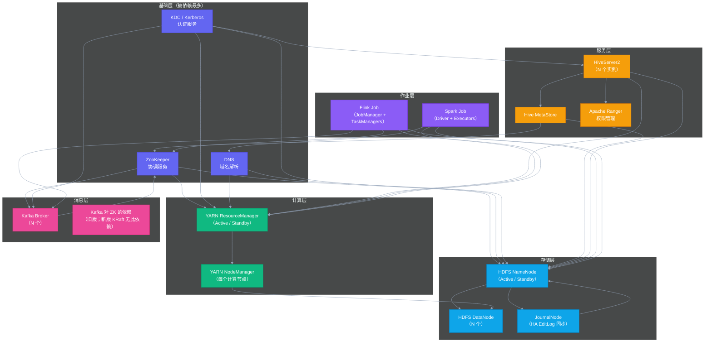

# 04 组件依赖拓扑：SCMDB 是大数据集群 AiOps 的骨架

## 摘要

本文是专栏第四篇，聚焦大数据集群 AiOps 的"骨架"：组件依赖拓扑数据库（SCMDB，即大数据集群语境下的 CMDB）。文章从"为什么大数据集群的拓扑数据不能照搬微服务 CMDB"切入，深度分析两类系统在拓扑建模上的核心差异，给出一个覆盖 HDFS / YARN / Hive / Spark / Flink / Kafka / ZooKeeper / Kerberos 的完整依赖关系建模方案，讨论图数据库 vs 关系型数据库的技术选型逻辑，讲解如何把 SCMDB 对接到告警聚合流水线和根因分析引擎，最后给出一个可落地的 SCMDB MVP 实现路径。核心主张：没有 SCMDB，AiOps 的告警聚合只能靠时间窗口蒙，根因分析只能靠人工排查——SCMDB 是大数据集群 AiOps 实现"从相关性到因果性"这一关键跨越的基础设施。

---

## 第 1 章 为什么大数据集群需要自己的拓扑数据库

### 1.1 微服务 CMDB：为什么不能直接用

在微服务架构中，服务发现和依赖关系管理已经有了相对成熟的解决方案：Kubernetes Service Mesh（Istio/Linkerd）可以自动追踪服务间的 HTTP 调用关系，APM 系统（SkyWalking、Datadog APM）可以从 Trace 数据中自动构建服务依赖图，CMDB 则负责记录这些服务的配置信息（哪个版本、跑在哪些 Pod 上、依赖哪些中间件）。

这套体系能自动发现依赖关系，因为微服务之间的调用是可观测的 HTTP 请求——每一次调用都有 Trace ID，只要分析 Trace 数据就能知道"A 调用了 B，B 调用了 C"。

大数据集群的内部情况完全不同：

- NameNode 与 DataNode 之间通过 [[Hadoop RPC]] 通信，没有 HTTP，没有 Trace
- ResourceManager 通过心跳协议管理 NodeManager，同样没有 Trace 可观测
- Spark Driver 通过 Spark 自有的 BlockManager 协议与 Executor 通信
- HiveServer2 通过 JDBC 接受用户请求，通过 Thrift 与 HiveMetaStore 交互，通过 HDFS API 读写数据

这些通信协议都不在传统 APM 系统的 Trace 覆盖范围内。自动发现拓扑关系的技术路径在大数据集群里**根本走不通**。

> [!note] 为什么叫 SCMDB
> 本文使用 SCMDB（Service Configuration Management Database for Big Data Clusters）这个命名，而不是直接叫 CMDB，是为了强调它与传统 IT CMDB 的差异：大数据集群的 SCMDB 不关注物理资产（服务器、网络设备），而是聚焦于大数据**组件之间的逻辑依赖关系**。这是 AiOps 决策层需要的核心数据，而不是 IT 资产管理系统需要的数据。

### 1.2 拓扑数据对 AiOps 的具体价值

如果没有 SCMDB，AiOps 的能力边界是：
- **告警聚合**：只能用时间窗口聚合（同一时间段内的告警归为一组），无法做因果聚合（把 HiveServer2 的告警识别为 NameNode 故障的衍生症状）
- **根因分析**：只能靠人工经验判断"NameNode GC → HiveServer2 超时"的关联，无法自动化推断
- **影响范围评估**：无法快速回答"NameNode 发生故障，哪些下游业务会受影响"

有了 SCMDB，AiOps 的能力升级为：
- **因果告警聚合**：沿依赖图反向追溯，将所有下游衍生告警归并到根因节点的主事件
- **自动化根因定位**：沿依赖图正向追踪故障传播路径，找到最早出现异常的节点
- **影响面快速评估**：给定一个故障组件，立即查出所有直接依赖和间接依赖的下游组件，评估业务影响

---

## 第 2 章 大数据集群组件依赖关系的完整建模

### 2.1 完整依赖关系图



### 2.2 依赖关系的类型分类

在 SCMDB 中，组件之间的依赖关系不是单一类型的，需要按依赖性质进行分类。不同类型的依赖关系，对告警聚合和根因分析的影响程度不同：

| 依赖类型 | 说明 | 故障传播方式 | 聚合权重 |
|---------|------|------------|---------|
| **强依赖（Hard Dependency）** | 上游故障会立即导致下游不可用 | 瞬时全量影响 | 最高 |
| **弱依赖（Soft Dependency）** | 上游故障会降低下游性能，但不会立即导致不可用 | 渐进式降级 | 中等 |
| **HA 依赖（HA Pair Dependency）** | 主备切换关系，单点故障可自动切换 | 切换期间的短暂中断 | 低（可自愈） |
| **负载依赖（Load Dependency）** | 上游工作量变化影响下游 | 间接、延迟性影响 | 低 |

以 HiveServer2 对 NameNode 的依赖为例：这是**强依赖**。NameNode 如果完全不可用（比如 Active NameNode  宕机且 Standby 没有及时接管），HiveServer2 的所有查询会立即全部失败，没有任何降级空间。

相比之下，Spark 作业对 HiveServer2 的依赖是**弱依赖**：HiveServer2 性能下降会导致 Spark 作业读取 Hive 表的速度变慢，作业运行时间延长，但通常不会立即导致作业失败（Spark 有内置的重试机制和超时配置）。

这种分类对告警聚合非常重要：**强依赖关系的向上传播才应该触发根因聚合**——HiveServer2 的告警因为 NameNode 故障被聚合到 NameNode 主事件是合理的；Spark 作业慢因为 HiveServer2 性能下降而被聚合则可能引入太多噪声。

### 2.3 组件实例级别的建模

依赖关系不仅要建模到**组件类型**（NameNode 依赖 ZooKeeper），还要建模到**组件实例**（`nn-001.prod.bigdata.com` 使用 ZooKeeper 集群 `zk-cluster-01`）。

为什么？因为大型大数据集群往往是多集群架构：生产环境可能有一个主集群（`prod-bigdata-01`）和一个离线集群（`offline-bigdata-01`），它们可能共享同一个 ZooKeeper 集群，也可能使用独立的 ZooKeeper 集群；不同的 HiveServer2 实例可能对应不同的租户隔离方案。

没有实例级别的建模，当 `zk-cluster-01` 发生问题时，无法准确评估哪些集群受影响、哪些不受影响。

---

## 第 3 章 SCMDB 的数据模型设计

### 3.1 核心实体

SCMDB 的数据模型围绕四个核心实体展开：

**组件类型（ComponentType）**：大数据生态中的组件定义，如 `HDFS_NAMENODE`、`YARN_RESOURCEMANAGER`、`KAFKA_BROKER` 等。这是静态的元数据，变化频率极低。

**组件实例（ComponentInstance）**：运行在具体物理机或虚拟机上的组件实例，如 `nn-001.prod.bigdata.com:HDFS_NAMENODE`。包含实例的状态（Active/Standby/Running/Down）、IP 地址、所属集群、关联的 Prometheus Exporter endpoint 等信息。

**依赖关系（Dependency）**：两个组件实例（或组件类型）之间的依赖关系，包含依赖类型（Strong/Soft/HA/Load）和依赖方向（从属组件 → 被依赖组件）。

**集群（Cluster）**：组件实例的聚合单位，代表一个逻辑上独立的大数据集群。所有的影响范围评估和跨组件关联分析，都以 cluster 为边界。

### 3.2 关系型数据库 vs 图数据库的选型

SCMDB 的数据本质上是一个图（节点是组件实例，边是依赖关系）。用图数据库（如 [[Neo4j]] / JanusGraph）存储图数据是最自然的选择，但在 AiOps Phase 1 阶段，引入图数据库会带来运维复杂性和学习成本。

对于大多数大数据集群 SRE 团队，**Phase 1 用关系型数据库（PostgreSQL / MySQL）存储 SCMDB 是更实际的选择**，理由如下：

1. **图的规模不大**：一个大数据集群的组件实例数通常在 50-500 之间，边的数量在 100-1000 之间。这个规模完全在关系型数据库的处理能力范围内，用 JOIN 查询就能完成依赖图遍历，不需要图数据库的图查询语言（Cypher/Gremlin）

2. **运维熟悉度**：团队对 MySQL/PostgreSQL 更熟悉，减少引入新技术的风险

3. **扩展时机**：当集群数量超过 10 个、组件实例数超过 5000、需要做多跳依赖查询（超过 5 跳）时，才是迁移到图数据库的合适时机

关系型数据库中的核心表结构：

```sql
-- 组件实例表
CREATE TABLE component_instance (
    id              BIGINT PRIMARY KEY AUTO_INCREMENT,
    cluster_id      BIGINT NOT NULL,         -- 所属集群
    component_type  VARCHAR(64) NOT NULL,    -- 组件类型（枚举）
    hostname        VARCHAR(256) NOT NULL,   -- 主机名
    status          VARCHAR(16) DEFAULT 'RUNNING', -- 状态
    exporter_url    VARCHAR(512),            -- Prometheus Exporter URL
    ha_role         VARCHAR(16),             -- 'ACTIVE' / 'STANDBY' / NULL
    labels          JSON,                    -- 额外标签（如 rack_id、az 等）
    updated_at      DATETIME NOT NULL
);

-- 依赖关系表
CREATE TABLE component_dependency (
    id              BIGINT PRIMARY KEY AUTO_INCREMENT,
    cluster_id      BIGINT NOT NULL,
    source_id       BIGINT NOT NULL,         -- 依赖方（FROM）
    target_id       BIGINT NOT NULL,         -- 被依赖方（TO）
    dep_type        VARCHAR(16) NOT NULL,    -- STRONG / SOFT / HA / LOAD
    verified        BOOLEAN DEFAULT FALSE,   -- 是否已人工验证
    note            TEXT,                    -- 备注（依赖的具体原因）
    created_at      DATETIME NOT NULL
);

-- 集群表
CREATE TABLE cluster (
    id              BIGINT PRIMARY KEY AUTO_INCREMENT,
    name            VARCHAR(64) NOT NULL UNIQUE,  -- 集群名称
    env             VARCHAR(16) NOT NULL,     -- PROD / STAGING / DEV
    ambari_url      VARCHAR(256),            -- Ambari API 地址
    updated_at      DATETIME NOT NULL
);
```

### 3.3 SCMDB 的数据维护策略

SCMDB 的最大挑战不是设计，而是**保持数据的准确性和时效性**。一个集群的依赖关系会随着版本升级、架构调整、组件扩缩容而变化，如果 SCMDB 与实际状态长期不同步，基于 SCMDB 的 AiOps 分析就会产生错误的结论。

推荐的维护策略是：

**自动发现 + 人工确认的混合模式**：
- 物理机实例（ComponentInstance）的增减可以通过 Ambari API 自动同步（Ambari 有集群节点列表和组件分配信息）
- 实例状态（Active/Standby/Running/Down）可以从 [[ZooKeeper]] 的 NameNode HA 选举节点、ResourceManager HA 节点实时读取
- 依赖关系（Dependency）**必须人工建模和验证**——这是一次性的工作量，但此后只需要在架构变更时更新

**变更事件触发更新**：当 [[Ambari]] 的变更 API 检测到集群拓扑变化（新增节点、下线节点、服务迁移），自动触发一个"SCMDB 更新提醒"，让 SRE 确认依赖关系是否需要同步更新。

**定期一致性校验**：每周运行一个脚本，对比 SCMDB 中记录的组件实例列表与 Ambari API 返回的实际集群状态，找出差异并发出提醒。

---

## 第 4 章 SCMDB 在 AiOps 流水线中的使用

### 4.1 告警聚合中的 SCMDB 查询

当一条告警触发时（例如：`HiveServer2_ConnectionPool_UsageRate > 90%`，告警主机：`hs2-001.prod.bigdata.com`），告警聚合服务的 SCMDB 查询流程如下：

```
第一步：通过主机名找到对应的组件实例
  SELECT * FROM component_instance WHERE hostname = 'hs2-001.prod.bigdata.com'
  → 得到：component_type = HIVE_SERVER2, cluster_id = 1

第二步：查询该实例的所有上游依赖（它依赖谁）
  SELECT ci.* FROM component_dependency cd
  JOIN component_instance ci ON cd.target_id = ci.id
  WHERE cd.source_id = {hs2_instance_id} AND cd.dep_type = 'STRONG'
  → 得到：HiveMetaStore + NameNode + YARN_RM

第三步：在这些上游组件中，查询过去 10 分钟内是否有触发的告警
  → 发现：NameNode 在 3 分钟前触发了 RPC 队列积压告警

第四步：判定：HiveServer2 的告警是 NameNode 告警的下游衍生症状
  → 将 HiveServer2 告警标记为 DERIVED，聚合到 NameNode 主事件
```

这个查询流程的时间性能要求极高：告警聚合必须在毫秒级完成，否则会拖慢告警推送。对于 Phase 1 规模的 SCMDB（几百个实例、几千条依赖关系），关系型数据库 + 合理的索引可以轻松满足这个要求。

### 4.2 根因分析中的拓扑遍历

根因分析使用 SCMDB 的方式是**反向拓扑遍历**：从发生告警的组件开始，沿着"被谁依赖"这个关系向上追溯，找到依赖链的最上端节点（即最有可能是根因的节点）。

以上文的场景为例：
```
HiveServer2（有告警）
  ↑ 强依赖 NameNode（有告警）
      ↑ 没有强依赖上游组件也有告警
  → 根因候选：NameNode
```

在实际场景中，拓扑遍历会更复杂：
- 同一级可能有多个上游节点同时有告警
- 需要结合告警触发时间（先触发的更可能是根因）和告警严重程度（ERROR > WARN > INFO），对根因候选进行排序
- 某些路径可能存在环（虽然理论上不应该，但 SCMDB 数据错误时可能发生），需要处理循环引用

这个算法的完整实现将在[[06 根因分析 RCA：传统算法与 LLM 融合的应用架构]]中详细展开。

---

## 第 5 章 SCMDB MVP 快速落地路径

理解了 SCMDB 的价值和设计之后，最重要的问题是：**如何在最短时间内建立一个够用的 SCMDB**，而不是陷入"SCMDB 设计完美主义"，结果建了一年还没有用起来。

### 5.1 最小化 MVP 范围

不要试图一次性建立所有组件的完整依赖关系。优先建立**最关键路径**上的依赖关系：

**第一优先级**（影响告警聚合效果最大的依赖）：

| 依赖关系 | 类型 | 优先级原因 |
|---------|------|---------|
| ZooKeeper → NameNode | STRONG | ZK 故障直接导致 NN HA 选举失败 |
| NameNode → DataNode | STRONG | NN 故障导致所有 DataNode 不可用 |
| NameNode → HiveServer2 | STRONG | 最常见的故障传播路径 |
| NameNode → HiveMetaStore | STRONG | MetaStore 依赖 HDFS 命名空间 |
| YARN RM → NodeManager | STRONG | RM 故障导致 NM 失联 |
| HiveServer2 → Spark Job | SOFT | Spark 读 Hive 表 |

这 6 个依赖关系覆盖了大数据集群中 80% 以上的告警聚合场景。以这 6 个为起点，SCMDB 就可以开始发挥价值。

### 5.2 用 Ambari API 快速导入实例数据

Ambari 的 REST API 可以快速导出所有集群节点和组件分配信息：

```bash
# 获取所有主机
curl -s "http://ambari-server:8080/api/v1/clusters/{cluster_name}/hosts" -u admin:password \
  | jq '.items[].Hosts | {hostname: .host_name, ip: .ip, status: .host_status}'

# 获取主机上运行的组件
curl -s "http://ambari-server:8080/api/v1/clusters/{cluster_name}/hosts/{hostname}/host_components" -u admin:password \
  | jq '.items[].HostRoles | {component: .component_name, state: .state}'
```

用一个简单的 Go/Python 脚本调用这两个 API，就可以在 5 分钟内完成 ComponentInstance 表的初始数据填充，覆盖所有 Ambari 管理的组件实例。

之后，手工补充 Dependency 表的依赖关系（用上面第一优先级的 6 个依赖作为起点），SCMDB MVP 就可以上线。

---

## 第 6 章 小结与下一篇预告

本篇的核心结论：**SCMDB 是大数据集群 AiOps 决策层的骨架，优先级高于任何复杂算法模型的引入**。一个简单的 SCMDB MVP（6 个核心依赖关系 + 关系型数据库实现）对 AiOps 告警聚合效果的提升，远超一个没有 SCMDB 支撑的复杂机器学习根因分析模型。

本篇覆盖了：
1. **为什么需要 SCMDB**（微服务 CMDB 无法复用；拓扑数据对 AiOps 的具体价值）
2. **完整组件依赖关系图**（HDFS/YARN/Hive/Spark/Flink/Kafka 的完整依赖建模）
3. **依赖类型分类**（Strong/Soft/HA/Load，对告警聚合权重的影响）
4. **实例级建模**（为什么要建到 hostname 级别）
5. **数据库选型**（Phase 1 用关系型数据库，条件满足后迁移图数据库）
6. **数据维护策略**（自动发现 + 人工确认 + 变更触发更新）
7. **在 AiOps 流水线中的使用**（告警聚合查询流程、根因分析拓扑遍历）
8. **MVP 快速落地路径**（6 个优先依赖 + Ambari API 导入）

下一篇[[05 智能告警降噪：工程落地全链路解析]]将把前三篇（数据地基 + 告警工程 + SCMDB）的能力组合起来，展示一个完整的告警聚合降噪流水线的工程实现——从 Foxeye Webhook 触发，到查询 SCMDB，到关联变更，到推送主事件卡片的完整代码级设计。

*上一篇：[[03 告警工程：从告警风暴到1条主事件的设计哲学]] | 下一篇：[[05 智能告警降噪：工程落地全链路解析]]*
