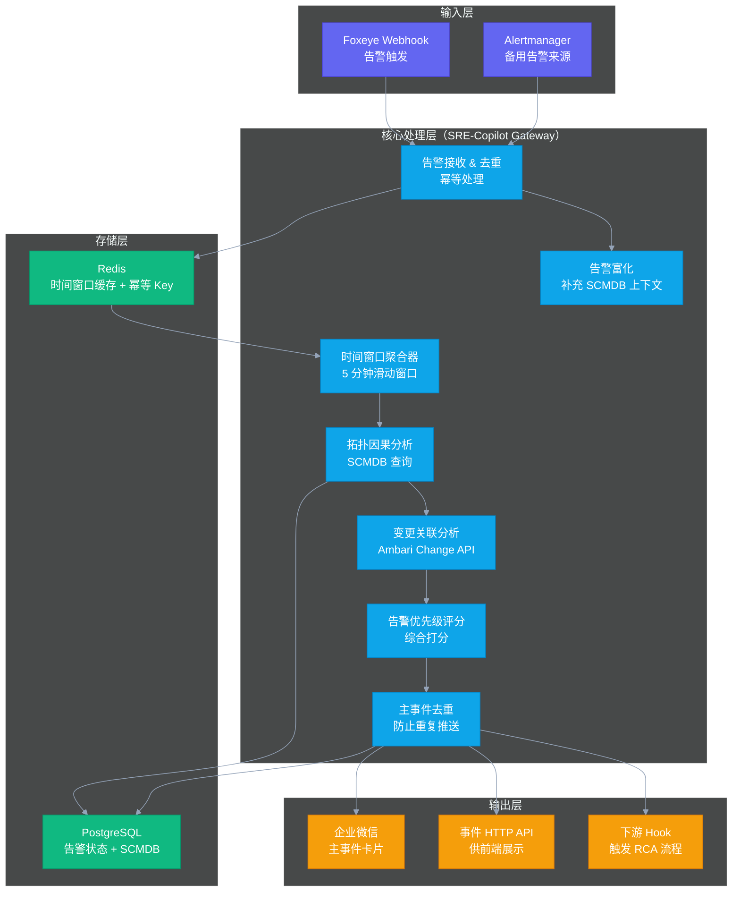

# 05 智能告警降噪：工程落地全链路解析

## 摘要

本文是专栏第五篇，聚焦告警聚合降噪的工程落地层面，将前几篇积累的理论方法（数据地基 + SCMDB + 告警设计哲学）组合成一个可真正运行的系统。文章完整描述从 [[Foxeye]] Webhook 入口到企业微信主事件卡片推送的整条告警聚合流水线，讲解基于 [[eino]] Multi-Agent 框架的工程实现方案，深度分析误报率控制与告警抑制策略，并复盘在实际生产中遇到的关键工程陷阱。本文是专栏中工程实践密度最高的一篇，覆盖数据流、控制流、边界条件和错误处理的完整设计。

---

## 第 1 章 系统全景：告警聚合降噪流水线

### 1.1 系统架构图



### 1.2 数据流说明

一条告警从触发到推送，经过以下关键步骤：

1. **告警接收（Recv）**：Foxeye 通过 Webhook POST 告警 JSON 到 SRE-Copilot Gateway 的 `/api/v1/alerts/ingest` 接口。Gateway 立即返回 200（保证 Foxeye 的发送性能），异步处理告警数据。幂等处理基于 Redis：每条告警生成一个唯一 Key（规则名 + 告警标签 hash），在 Redis 中检查是否已处理过（TTL 5 分钟），防止 Foxeye 重发导致的重复处理。

2. **告警富化（Enrich）**：从 PostgreSQL 的 SCMDB 中查询该告警来源组件的完整信息（所属集群、组件类型、HA 角色、Exporter URL 等），将这些上下文信息附加到告警数据结构中，供后续步骤使用。

3. **时间窗口聚合（Window）**：在 Redis 中维护一个 5 分钟的滑动时间窗口缓存，同一集群同一服务组的告警在窗口内聚合为候选事件组。

4. **拓扑因果分析（Topo）**：调用 SCMDB，查询候选事件组中每条告警的上游强依赖组件，判断是否有上游组件也在 5 分钟内有告警触发。如果有，则将当前告警标记为 DERIVED（衍生告警），关联到上游的根因告警。

5. **变更关联分析（Change）**：对根因告警（DERIVED 以外的告警），查询过去 30 分钟到 2 小时内的 Ambari 变更记录，按组件相关性和时间接近度排序，选出 Top-3 关联变更。

6. **告警评分（Score）**：综合以下因素对主事件进行优先级打分：告警严重程度（ERROR > WARN）、影响组件数量、下游衍生告警数量、是否有关联变更（有变更则置信度提高）。

7. **推送输出（Output）**：将主事件卡片发送到企业微信对应告警群，同时写入 PostgreSQL 供 Web 界面展示，并向下游 RCA 服务发送 Webhook（如果有）。

---

## 第 2 章 关键数据结构设计

### 2.1 告警数据结构

```go
// AlertEvent 代表一条从 Foxeye 接收到的原始告警
type AlertEvent struct {
    // 来自 Foxeye 的字段
    AlertName    string            `json:"alertname"`      // 告警规则名
    Status       string            `json:"status"`         // firing / resolved
    Severity     string            `json:"severity"`       // critical / warning / info
    Labels       map[string]string `json:"labels"`         // 所有标签
    Annotations  map[string]string `json:"annotations"`    // 告警描述文字
    StartsAt     time.Time         `json:"startsAt"`       // 告警开始时间
    GeneratorURL string            `json:"generatorURL"`   // Prometheus 查询链接

    // 富化后补充的字段（来自 SCMDB）
    ClusterID     int64   `json:"-"`
    ComponentType string  `json:"-"`             // HDFS_NAMENODE / YARN_RM 等
    Hostname      string  `json:"-"`
    HARole        string  `json:"-"`             // ACTIVE / STANDBY
}

// Incident 代表一个聚合后的主事件
type Incident struct {
    ID              string         `json:"id"`              // 唯一事件 ID
    ClusterID       int64          `json:"cluster_id"`
    Status          string         `json:"status"`          // OPEN / RESOLVED
    RootCause       *AlertEvent    `json:"root_cause"`      // 根因告警
    DerivedAlerts   []*AlertEvent  `json:"derived_alerts"`  // 衍生告警列表
    RelatedChanges  []*ChangeEvent `json:"related_changes"` // 关联变更
    Priority        int            `json:"priority"`        // 综合优先级分数
    ImpactScope     []string       `json:"impact_scope"`    // 影响的组件列表
    CreatedAt       time.Time      `json:"created_at"`
    UpdatedAt       time.Time      `json:"updated_at"`
    ResolvedAt      *time.Time     `json:"resolved_at,omitempty"`
}

// ChangeEvent 代表一条变更记录
type ChangeEvent struct {
    ChangeID      string    `json:"change_id"`
    ChangeType    string    `json:"change_type"`  // CONFIG_CHANGE / SCALE / RESTART
    TargetService string    `json:"target_service"`
    TargetHost    string    `json:"target_host"`
    StartTime     time.Time `json:"start_time"`
    TimeDelta     float64   `json:"time_delta_minutes"` // 距告警时刻的分钟数
    Score         float64   `json:"relevance_score"`    // 相关性综合得分
}
```

### 2.2 SCMDB 查询接口封装

```go
// SCMDBClient 提供 SCMDB 的查询接口
type SCMDBClient interface {
    // GetInstanceByHostname 根据主机名查询组件实例
    GetInstanceByHostname(ctx context.Context, hostname string) (*ComponentInstance, error)

    // GetUpstreamDependencies 查询指定实例的所有强依赖上游实例
    GetUpstreamDependencies(ctx context.Context, instanceID int64, depTypes []string) ([]*ComponentInstance, error)

    // GetDownstreamImpact 查询受指定实例故障影响的所有下游实例（BFS 遍历）
    GetDownstreamImpact(ctx context.Context, instanceID int64, maxDepth int) ([]*ComponentInstance, error)
}

// GetUpstreamDependencies 的 SQL 实现（关键逻辑）
// SELECT ci.* FROM component_dependency cd
// JOIN component_instance ci ON cd.target_id = ci.id
// WHERE cd.source_id = $1 AND cd.dep_type = ANY($2) AND ci.status != 'DOWN'
```

---

## 第 3 章 eino Multi-Agent 在告警聚合中的应用

[[eino]] 是 CloudWeGo 团队开发的 Go 语言 AI Agent 框架，与 LangChain 的定位类似，但在 Go 生态中是最成熟的选择。本专栏作者的团队已经在告警迁移系统中验证了 eino 的可行性。

在告警聚合降噪系统中，eino 的引入场景相对有限——因为告警聚合的大部分逻辑是确定性规则（拓扑依赖、时间窗口），不需要 LLM 参与。eino 的价值在以下两个环节体现：

### 3.1 告警摘要生成

主事件卡片推送给工程师的"摘要文本"，需要将结构化的告警数据转化为自然语言描述。这是 LLM 擅长的任务，通过 eino 封装 LLM 调用来实现：

```go
// 告警摘要生成的 Prompt 模板（伪代码）
const summaryPromptTemplate = `
你是一名大数据集群 SRE，请根据以下结构化告警信息，
生成一段 2-3 句话的事件摘要，要求：客观、精确、信息密度高，
不要使用"严重"、"紧急"等感情色彩词汇。

根因告警：{{.RootCause.AlertName}} 来源：{{.RootCause.Hostname}}
衍生告警数量：{{len .DerivedAlerts}} 条
影响范围：{{join .ImpactScope "、"}}
关联变更：{{if .RelatedChanges}}{{index .RelatedChanges 0}.TargetService}} 于 {{index .RelatedChanges 0}.StartTime}} 发生 {{index .RelatedChanges 0}.ChangeType}}{{else}}无关联变更{{end}}

输出格式：直接输出摘要文本，不要加任何前缀。
`
```

### 3.2 根因推断辅助（Phase 2 能力）

在传统规则（拓扑遍历）给出 Top-3 根因候选之后，LLM 可以作为"精排器"：给定候选列表和各自的证据，LLM 基于 SRE 领域知识对候选进行排序，并生成可解释的推断说明。

这个能力将在[[06 根因分析 RCA：传统算法与 LLM 融合的应用架构]]中详细讲解。这里只指出：在 Phase 1 阶段，告警聚合降噪系统不应该依赖 LLM 做核心决策——LLM 的调用有延迟（通常 1-5 秒），而告警聚合有实时性要求；LLM 的推理有不确定性，而告警聚合需要可追溯的确定性逻辑。

---

## 第 4 章 误报率控制：工程上最难的问题

### 4.1 误报的两种类型

在告警聚合降噪系统中，"误报"有两种不同的含义，需要分别控制：

**类型一：原始告警的误报**（原始告警规则产生了假阳性）
这类误报来源于告警规则本身的阈值设置不合理，或者动态基线算法对正常业务波动的误判。解决方案是优化告警规则（调高阈值 / 改用动态基线），这是数据地基和告警工程章节的内容。

**类型二：聚合判断的误报**（聚合引擎错误地将两个无关告警归并为一个主事件）
这类误报来源于 SCMDB 数据不准确（两个组件实际上没有依赖关系，但 SCMDB 里错误地记录了依赖），或者时间窗口设置过宽导致不相关的告警被错误聚合。

### 4.2 误报控制策略

**SCMDB 数据质量保障**：这是减少第二类误报的根本方法。每条依赖关系在录入时必须标注 `verified = true/false`，只有 `verified = true` 的依赖关系才用于生产环境的告警聚合。对于不确定的依赖关系，标注为 `verified = false`，先不用于自动聚合，只在诊断报告中作为参考信息显示。

**告警聚合置信度阈值**：不是所有满足拓扑条件的告警都强制聚合，而是给每个聚合决策打一个置信度分数。置信度低于阈值（比如 0.7）的告警，不自动聚合，而是以"相关告警（可能有关）"的形式显示在主事件卡片的附加信息区域，供工程师参考。

**工程师反馈机制**：在主事件卡片中提供快捷反馈按钮（"这个聚合正确" / "这两个告警无关"）。收到反馈后，系统记录案例，供后续优化聚合规则使用。

### 4.3 告警抑制：主动降噪的补充手段

除了聚合降噪，**告警抑制（Alert Inhibition）**是另一个减少告警噪声的手段：当某个高严重级别的告警触发时，自动抑制（静默）一批相关的低严重级别告警，防止它们占用值班工程师的注意力。

典型的抑制规则：
- 当 NameNode 触发 `CRITICAL` 级别告警时，抑制所有依赖 NameNode 的组件的 `WARNING` 级别告警（因为这些 WARNING 很可能是 NameNode 故障的直接后果，在 NameNode 恢复前无论如何都无法修复）
- 当集群处于计划内维护窗口时，抑制所有非 `CRITICAL` 级别的告警

---

## 第 5 章 主事件卡片：工程师视角的信息架构

推送给企业微信的主事件卡片是告警聚合系统的最终输出界面。卡片的信息架构设计直接影响工程师的处置效率，值得认真设计。

推荐的主事件卡片结构（以企业微信 Markdown 消息格式为例）：

```
🔴 【P1 告警事件】HDFS 写入故障 - prod-bigdata-01
━━━━━━━━━━━━━━━━━━━━━━━━━━
**事件摘要**
DataNode `dn-003.prod.bigdata.com` 磁盘 /data/disk3 出现 IO 高延迟（当前 340ms，基线 2ms），导致 HDFS 副本写入失败，影响下游 HiveServer2 和 47 个正在运行的 Spark 作业。

**根因告警**
▸ `DataNode_DiskIOLatency > 100ms` — dn-003.prod.bigdata.com（触发时间：14:23:15）

**影响组件（4 个）**
▸ HDFS DataNode × 1 （副本写入失败）
▸ HiveServer2 × 5 （查询积压中）
▸ Spark 作业 × 47 （Stage 失败 / 等待重试）

**已收敛告警**
▸ 327 条相关症状告警已聚合到本事件

**关联变更**
▸ [#23891] dn-003 磁盘配额调整 — 昨日 23:30（13.5 小时前）by admin@company.com

**推荐动作**
1. 检查 dn-003 磁盘 SMART 状态：`smartctl -a /dev/sdc`
2. 查看 DataNode 日志：[Grafana Loki 链接](https://grafana.prod/...)
3. 如确认坏盘：触发 HDFS 副本迁移流程（Runbook #R-045）

**处置**   [✅ 认领] [🔕 静默 1h] [❌ 标记无效]
```

这个信息架构遵循"从高层到底层、从结论到证据"的阅读顺序：工程师先看到"发生了什么"，然后是"影响了什么"，再是"可能是什么原因和关联变更"，最后是"推荐做什么"。这个顺序让工程师在大脑刚从睡眠中唤醒时，也能在 30 秒内建立完整的事件上下文。

---

## 第 6 章 SLA 保障：告警流水线的可靠性设计

告警聚合流水线本身必须高度可靠——如果聚合服务宕机，告警无法送达，后果比不聚合更严重。

### 6.1 关键可靠性指标

- **端到端延迟（E2E Latency）**：从 Foxeye Webhook 触发到企业微信收到消息的时间，要求 P99 < 30 秒
- **消息丢失率**：告警入队后丢失的比例，要求 < 0.1%
- **服务可用率**：聚合服务自身的可用率，要求 > 99.9%

### 6.2 可靠性设计要点

**异步处理 + 消息队列**：Foxeye Webhook 接收到告警后，立即写入本地消息队列（可以用 Redis 的 List 或 Stream 实现），然后立即返回 HTTP 200。聚合处理是异步的，即使聚合逻辑有延迟，也不会阻塞 Foxeye 的告警发送。

**告警状态持久化**：每条告警的处理状态（已接收、聚合中、已推送）必须持久化到 PostgreSQL，而不仅仅放在内存中。这样在服务重启后，可以从 PostgreSQL 恢复处理状态，防止因为服务重启导致的告警丢失。

**Fallback 策略**：当 SCMDB 查询超时（通常设置 500ms 超时）时，降级为简单的时间窗口聚合，而不是让告警积压。这保证了即使 SCMDB 数据库不可用，基础的去重降噪功能仍然工作。

**告警监控自监控**：告警聚合服务必须监控自己的健康状态，包括：消息队列积压深度（积压超过 1000 条说明处理能力不足）、E2E 延迟（P99 超过 60 秒触发告警）、SCMDB 查询成功率（低于 99% 触发告警）。

---

## 第 7 章 工程踩坑复盘

### 7.1 坑一：时间窗口设得太宽

最初将时间窗口设为 15 分钟，结果两个完全不相关的告警（一个是凌晨 3:00 的 DataNode 磁盘告警，一个是凌晨 3:08 的 Kafka 消费延迟告警）被错误聚合为同一个事件。调整为 5 分钟滑动窗口后，误聚合率显著下降。

**教训**：时间窗口不是越宽越好——宽窗口提高了聚合率，但也提高了误聚合率。5 分钟是一个经过实践检验的平衡点。

### 7.2 坑二：SCMDB 依赖过时导致误聚合

某次集群架构调整后，一个 DataNode 从生产集群迁移到了测试集群，但 SCMDB 没有及时更新，导致测试集群 DataNode 的告警被错误聚合到生产集群的 NameNode 主事件里。

**教训**：SCMDB 的时效性是告警聚合质量的关键。必须建立 SCMDB 与 Ambari 的自动同步机制，而不是完全依赖人工维护。

### 7.3 坑三：企业微信消息频率限制

在一次大型故障中，短时间内产生了大量主事件，导致企业微信 Bot 触发频率限制（每分钟最多发送 20 条消息），部分告警消息出现了 5-10 分钟的延迟。

**教训**：输出层必须做速率限制（Rate Limiting）和消息合并（Message Batching）——同一个 1 分钟窗口内的多条主事件，合并成一条消息发送。同时为企业微信接口实现指数退避重试（Exponential Backoff）。

---

## 第 8 章 小结与下一篇预告

本篇是专栏迄今工程密度最高的一篇，覆盖了一个生产可用的告警聚合降噪系统从输入到输出的完整设计：
1. **系统全景架构**（7 个核心处理节点 + 完整数据流）
2. **关键数据结构**（AlertEvent / Incident / ChangeEvent 设计）
3. **eino 的应用边界**（Phase 1 只用于摘要生成，核心决策仍是确定性规则）
4. **误报率控制**（SCMDB 数据质量 + 置信度阈值 + 工程师反馈机制）
5. **主事件卡片信息架构**（从结论到证据的信息排列）
6. **SLA 保障设计**（异步处理 + 持久化 + Fallback + 自监控）
7. **工程踩坑复盘**（时间窗口、SCMDB 时效性、消息限频三大坑）

下一篇[[06 根因分析 RCA：传统算法与 LLM 融合的应用架构]]将把能力从"告警聚合（知道发生了什么）"升维到"根因分析（知道为什么发生）"，这是 AiOps 能力体系中最复杂、也最有技术深度的一个模块。

*上一篇：[[04 组件依赖拓扑：SCMDB 是大数据集群 AiOps 的骨架]] | 下一篇：[[06 根因分析 RCA：传统算法与 LLM 融合的应用架构]]*
