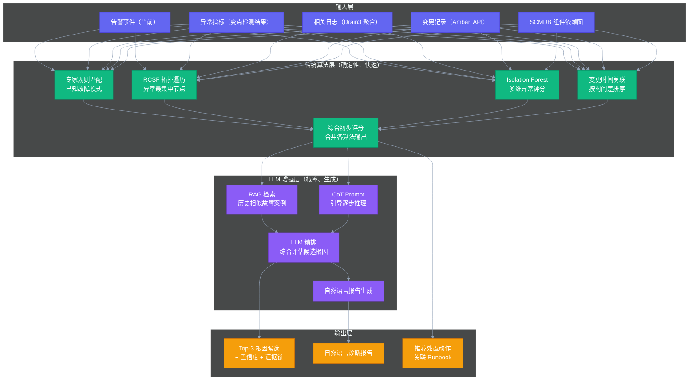

# 06 根因分析 RCA：传统算法与 LLM 融合的应用架构

## 摘要

本文是专栏第六篇，深度解析 AiOps 中最具技术挑战性的能力：根因分析（Root Cause Analysis，RCA）。文章从 RCA 的本质定义和工程边界切入，系统梳理传统 RCA 算法体系（图论方法 RCSF / 统计方法 Isolation Forest / 时序方法变点检测 / 因果推断方法），分析每类算法在大数据集群场景下的适用性和局限性，深度讨论 LLM 介入 RCA 的合理边界（精排器而非决策者）以及"传统算法粗筛 + CoT 推理 + RAG 历史案例检索"的融合架构设计，给出一个工程上可落地的 RCA 流水线设计。本文的核心主张：RCA 不是"用最先进的模型就能解决"的问题，而是"领域知识 + 数据质量 + 算法选择 + 工程约束"的综合工程问题；先把传统算法做扎实，LLM 才能真正发挥增强效果。

---

## 第 1 章 RCA 的本质定义与工程边界

### 1.1 什么是 RCA

根因分析（Root Cause Analysis）在字面意思上很简单：找到问题的根本原因。但在大型分布式系统的运维场景中，这个问题的复杂性被严重低估。

在一个有 500 个组件的大数据集群中，一次故障事件可能同时伴随着：300 条告警、50 个可能相关的指标异常、10 个最近的配置变更、若干个可疑的日志错误。如果没有系统性的分析框架，工程师的"排查"往往是靠直觉和经验在这片信息海洋中寻找线索，效率极低。

RCA 系统的目标是将这个"海量信息 → 人工经验 → 结论"的过程，转化为"海量信息 → 系统算法 → Top-N 根因候选 + 证据链 → 工程师验证 → 确认结论"的过程。

这里有两个关键词需要强调：

**Top-N（不是 Top-1）**：生产环境的 RCA 不是考试出题有标准答案，而是在不确定性中寻找最可能的解释。给出 Top-3 到 Top-5 的候选根因 + 每个候选的置信度分数 + 支撑证据，是比强行给出一个"答案"更诚实、也更实用的输出格式。

**证据链（而不是黑盒结论）**：每一个根因候选，系统必须给出它为什么排在这个位置的理由——哪些指标在什么时间出现了什么异常、与哪个变更有时间关联。没有证据链的 RCA 结论，工程师无法验证，也无法信任，最终会弃用。

### 1.2 RCA 的难点：学术界 vs 工业界的鸿沟

关于 RCA 的学术研究非常丰富，但业界落地的实际效果往往跟论文数字有很大差距。这个鸿沟的主要来源是：

**数据分布差异**：学术研究使用的数据集（如 Alibaba Cluster Traces、Google Borg Traces）与特定公司的实际集群数据在统计特征上有显著差异。在公开数据集上准确率 90% 的算法，在私有集群上可能落到 40%。

**故障类型的长尾分布**：大数据集群的故障类型遵循帕累托法则（80% 的故障来自 20% 的故障模式）。对于头部 20% 的故障，很多算法都能做到较高准确率；对于尾部 80% 的罕见故障，算法往往束手无策。而故障复盘最有价值的，往往恰恰是那些罕见的、没有先例的故障类型。

**标签数据稀缺**：监督学习方法需要大量已标注的"告警 X + 根因 Y = 关联"的训练样本。大数据集群的故障复盘数据往往是非结构化的文档，不是可直接用于训练的标注数据。

**系统动态变化**：大数据集群不是静态的——每次版本升级、配置变更、集群扩展，都可能改变故障模式的分布。在旧数据上训练的模型，在集群大改动后可能迅速失效。

正因如此，业界最有效的 RCA 实践，往往不是依赖单一的机器学习模型，而是**领域专家规则（覆盖已知故障模式）+ 统计异常检测（发现偏离基线的异常指标）+ 图论方法（沿拓扑传播路径溯源）+ LLM 精排（综合推理和自然语言生成）**的组合方案。

---

## 第 2 章 传统 RCA 算法体系

### 2.1 图论方法：RCSF（频繁项集挖掘）

RCSF（Random Call-context Subgraph Filtering）是由微软等学术机构提出的基于告警调用路径的根因定位算法。其核心思想是：**在组件依赖图上，出现异常最集中的区域，最有可能包含根因节点。**

RCSF 的执行步骤：

1. 从最终用户感知到异常的组件（"症状节点"）出发，在依赖图上生成从症状节点到各个可能根因节点的所有调用路径
2. 将这些路径表示为路径序列（如：[HiveServer2, NameNode, ZooKeeper]）
3. 使用频繁项集挖掘（Apriori / FP-Growth）找出在所有路径中出现频率最高的节点集合
4. 出现频率最高的节点，就是最有可能的根因

RCSF 的优点：纯图论方法，不需要训练数据；可解释性强（能给出每个根因候选的"支持路径"作为证据）。

RCSF 的局限：路径搜索的复杂度随着图规模的增加而急剧上升；对于拓扑中心节点（如 ZooKeeper，几乎所有组件都依赖）有过度偏置，容易将它排在根因候选最前面，即使 ZooKeeper 本身没有任何异常指标。

在大数据集群的实际应用中，RCSF 是一个好的**初步排序**工具，但必须结合专家规则进行后处理（重排序），防止拓扑中心节点带来的偏置。

### 2.2 统计方法：Isolation Forest 多维异常检测

[[Isolation Forest]] 是一种基于随机分区的无监督异常检测算法，特别适合高维数据中的异常点检测。其核心直觉是：**异常点在特征空间中是"孤立"的——需要很少的随机分区就能把它与正常点分开；正常点则需要更多的分区才能被孤立。**

在 RCA 场景中，Isolation Forest 的使用方式是：

1. 对每个组件实例，收集其所有指标在故障时间窗口内的值，形成一个高维特征向量
2. 用 Isolation Forest 对这些特征向量计算异常分数（Anomaly Score），分数越高越不寻常
3. 异常分数高于阈值的组件实例，成为根因候选

Isolation Forest 的优点：训练速度快，推理速度快；不需要事先标注异常类型；对高维数据（多个指标同时检测）处理能力强。

局限：Isolation Forest 只能说"这个组件的指标组合是异常的"，但不能解释"哪个指标为什么异常"。需要后置的特征重要性分析来提供解释。

对于大数据集群，Isolation Forest 最适合**检测组件状态的整体异常**（多个指标同时偏离基线），而不是单指标的异常检测（单指标用阈值或动态基线更高效）。

### 2.3 时序方法：变点检测（Change Point Detection）

变点检测是识别时间序列中"分布发生显著变化的时刻"的一类算法。在 RCA 中，它用于回答：**"这个指标是从什么时候开始异常的？"**

确定异常开始时间（Change Point）对根因分析非常关键：

- 如果多个组件的指标都发生了变化，**最早出现变点的组件**最有可能是根因（故障从根因组件向下游传播，有时间延迟）
- Change Point 时刻与变更记录的时间对比，可以判断故障是否由变更触发

常用的变点检测算法：
- **PELT（Pruned Exact Linear Time）**：精度高，适合批量处理，用于事后分析
- **BOCPD（Bayesian Online Change Point Detection）**：在线算法，适合实时检测，但计算成本较高
- **SR（Spectral Residual）**：来自 MSRA 的论文，将时序做频域变换后检测突变，对趋势性时序特别有效（正如小红书论文中所描述）

在大数据集群的实时 RCA 场景中，推荐使用 SR + Isolation Forest 的组合：SR 负责检测单个指标的变点时刻，Isolation Forest 负责在变点时刻附近对多个组件的多维指标进行异常程度排序。

### 2.4 因果推断与专家规则

对于大数据集群 SRE 而言，**专家规则（Expert Rules）**是 RCA 体系中成本最低、可靠性最高的组成部分。

大数据集群的常见故障模式是有限的且已知的，可以被编码为规则：

```yaml
rules:
  - name: NameNode Full GC 风暴
    conditions:
      - metric: hadoop_namenode_jvm_gctime
        condition: "> 5000"  # GC 时间占比超过 5 秒/分钟
      - metric: hadoop_namenode_rpc_callQueueLen
        condition: "> 3000"  # RPC 队列积压
    root_cause: NameNode Full GC
    action: "检查 NameNode 堆内存配置，考虑增加 -Xmx 参数"
    runbook: "R-012"

  - name: DataNode 磁盘坏道
    conditions:
      - metric: datanode_disk_io_latency_ms
        condition: "> 100"  # 正常基线通常 < 5ms
      - log_pattern: "IOException.*disk.*read error"
    root_cause: DataNode 硬盘故障
    action: "运行 smartctl 检查磁盘 SMART 状态，触发 HDFS 副本迁移"
    runbook: "R-033"

  - name: ZooKeeper Leader 选举风暴
    conditions:
      - metric: zookeeper_quorum_size
        condition: "< 3"  # 法定人数不足
      - metric: zookeeper_outstanding_requests
        condition: "> 1000"  # 请求积压
    root_cause: ZooKeeper Leader 选举
    action: "检查 ZooKeeper 网络连通性，检查 JVM 堆内存"
    runbook: "R-007"
```

专家规则的优点：完全可解释，零训练数据需求，对已知故障模式准确率接近 100%，工程师可以读懂和调试。

专家规则的局限：只能覆盖已知故障，无法应对从未见过的故障模式；规则库需要持续维护（随着集群架构变化），维护成本随规则数量线性增长。

> [!note] 专家规则与机器学习的最佳分工
> 专家规则负责高频已知故障（覆盖 70-80% 的故障类型），机器学习算法负责低频未知故障（覆盖剩余 20-30%）。两者互补，而不是相互替代。先把专家规则做全做准，再引入机器学习处理规则覆盖不到的情况。

---

## 第 3 章 LLM 在 RCA 中的合理边界

### 3.1 LLM 的能力与局限

LLM 在 RCA 中有几个真实的能力优势：

**综合推理**：能够同时考虑来自不同来源的多种信息（告警数据、日志摘要、变更记录、拓扑关系），做出整体性的推断，而不是只看单一维度。

**自然语言生成**：能够将结构化的分析结果转化为可读性高的自然语言报告，省去工程师从数据到文字的转换成本。

**隐式知识调用**：LLM 在训练数据中见过大量的技术文档（Hadoop 文档、Spark 文档、优化指南），能够根据上下文调用相关的领域知识。

但 LLM 也有几个在 RCA 场景中必须重视的局限：

**幻觉（Hallucination）**：LLM 可能生成听起来合理但事实上错误的根因分析。在运维场景中，一个令人信服但错误的根因分析，可能让工程师往错误的方向排查，比没有分析更糟糕。

**缺乏实时数据访问**：LLM 不知道你的集群当前的真实状态（必须通过 Tool Call 主动查询），如果 Tool Call 设计不完善，LLM 会依赖其训练期截止时间的知识，产生与实际情况脱节的分析。

**推理的不可重复性**：相同的输入，LLM 可能在不同的请求中给出不同的输出（受 temperature 影响），这在需要一致性和可审计性的运维场景中是一个设计隐患。

### 3.2 "传统算法粗筛 + LLM 精排"架构

基于上述分析，推荐的 RCA 架构是：**用传统算法做粗筛，得到 Top-N 候选和证据链；再用 LLM 基于候选和证据链做精排，同时生成自然语言报告。**



### 3.3 RAG 历史案例检索：让 LLM 了解你的集群

RAG（Retrieval-Augmented Generation，检索增强生成）是让 LLM 在回答问题时，先从知识库中检索相关内容，再基于检索结果生成回答。在 RCA 场景中，知识库是**结构化的历史故障案例（Post-mortem）**。

每次故障复盘后，将以下信息结构化存储并向量化：

```yaml
incident:
  id: "INC-2026-0312"
  trigger_time: "2026-03-12T14:23:00Z"
  cluster: "prod-bigdata-01"
  root_cause_type: "NameNode Full GC"
  root_cause_component: "HDFS_NAMENODE"
  affected_components: ["HiveServer2", "Spark (47 jobs)"]
  key_signals:
    - metric: "hadoop_namenode_jvm_gctime > 5000ms"
    - log: "GC pause of 8.3 seconds"
    - change: "None"
  resolution: "增加 NameNode -Xmx 从 32G 到 64G；添加 GC 日志滚动配置"
  duration_minutes: 35
  mttr_minutes: 18  # 从根因确认到恢复
  summary: "周三下午 NameNode Full GC 风暴，触发 RPC 队列积压，下游 HiveServer2 和 Spark 作业大量超时..."
```

将 summary 字段向量化后存入 [[Milvus]]，当新的 RCA 请求来时，用当前故障的特征（告警名称、异常指标、组件名称）做相似度检索，取 Top-5 历史案例作为 LLM 的 Context。

这样，LLM 在生成根因分析时，会参考"两个月前发生过类似的 NameNode GC 问题，那次的根因是堆内存不足，解决方案是增加 -Xmx"，使 LLM 的推理更贴近实际集群情况，减少通用知识带来的偏差。

### 3.4 CoT Prompt 设计：引导 LLM 的推理路径

链式思考（Chain-of-Thought，CoT）是让 LLM 在给出最终答案之前，先输出中间推理步骤的技术。研究表明，CoT 能显著提高 LLM 在复杂推理任务上的准确率。

在 RCA 场景中，CoT Prompt 的关键是要让 LLM 按照 SRE 的排查思路逐步推理，而不是跳过中间步骤直接给结论：

```
你是一名资深大数据集群 SRE，请基于以下信息进行故障根因分析：

【故障信息】
- 触发时间：{{trigger_time}}
- 主要告警：{{root_alert}}
- 异常指标：{{anomaly_metrics}}
- 相关日志：{{log_samples}}
- 近期变更：{{changes}}

【预选候选根因（来自传统算法）】
{{top_n_candidates}}

【历史相似案例】
{{rag_results}}

请按以下步骤逐步思考：
1. 分析告警的时间序列：哪个组件最先出现异常？
2. 对照 SCMDB 拓扑：异常是沿依赖关系传播的吗？
3. 检查变更关联：异常开始时间与哪个变更最接近？
4. 对照历史案例：当前告警模式与哪个历史案例最相似？
5. 综合以上，排序候选根因（给出置信度 0-100）和理由。

要求：
- 每个推理步骤必须基于提供的数据，不要假设或编造数据
- 如果某个候选根因没有足够的证据支持，需要降低置信度并说明
- 最终输出格式：JSON，包含 top_causes (list of {component, confidence, evidence}) 和 summary (string)
```

### 3.5 为什么不让 LLM 直接做 RCA 决策

可能有人会问：既然 LLM 这么强大，为什么不直接让 LLM 做 RCA，而要先走传统算法？

原因有三：

**速度**：传统算法是确定性计算，毫秒级完成；LLM 调用有网络延迟，通常 2-10 秒。在告警触发后，运维人员通常希望在 30 秒内看到初步的根因分析。如果全靠 LLM，响应时间无法保证。

**可靠性**：传统算法不会"宕机"（只要数据库在线就能运行）；LLM 服务有可用性风险（内网 LLM 服务出现问题时，RCA 系统不能因此完全失效）。传统算法作为 Fallback，保证了最基础的 RCA 能力始终可用。

**可解释性**：传统算法的每一步计算都是可追溯的（"这个组件的变点在 14:23:15，而变更 #23891 在 14:20:00，时间差 3 分 15 秒，得分最高"）；LLM 的推理过程在 CoT 模式下虽然有一定透明度，但不如确定性算法那样完全可追溯。对于会影响生产操作的 RCA 结论，可追溯性非常关键。

---

## 第 4 章 RCA 的验收与准确率评估体系

RCA 系统上线后，必须有系统性的准确率评估机制，否则无法持续优化。

### 4.1 准确率定义：AC@K

学术界使用 **AC@K（Accuracy at K）**来评估根因分析的准确率：在系统给出的 Top-K 候选根因中，真实根因是否出现。

计算方式：
```
AC@K = (真实根因出现在 Top-K 候选中的故障数量) / (总故障数量)
```

工业界的经验数字（来自小红书等公司的实践报告）：
- Phase 1（规则为主）的 AC@5 通常在 60-70%
- Phase 2（引入 LLM）的 AC@5 可以提升到 75-85%
- AC@1（唯一候选就是真实根因）的初期目标通常是 40-50%

### 4.2 持续评估机制

每次故障复盘后，SRE 需要标注"RCA 系统的输出是否有帮助"以及"真实根因是什么"。标注数据自动回流到评估数据库，定期运行评估脚本更新 AC@K 数字。

当 AC@K 在连续 4 周的数据中下降超过 5%，触发 RCA 模型的审查和优化流程——通常意味着集群架构有重大变化，SCMDB 或专家规则需要更新。

---

## 第 5 章 小结与下一篇预告

RCA 是 AiOps 中最难的问题，也是价值最高的能力。本篇的核心方法论是**分层建设、先稳健后智能**：先用专家规则覆盖已知故障（确定性高、可解释），再用统计方法覆盖异常模式（数据驱动），最后用 LLM 做精排和报告生成（提升体验和覆盖边界情况）。

本篇覆盖了：
1. **RCA 的本质与工程边界**（Top-N + 证据链的正确范式）
2. **学术界 vs 工业界的鸿沟**（为什么论文数字不等于生产效果）
3. **RCSF 频繁项集挖掘**（原理 + 局限 + 适用场景）
4. **Isolation Forest 多维异常检测**（高维指标的整体异常评分）
5. **变点检测（SR/PELT/BOCPD）**（确定异常时刻，对齐变更时间）
6. **专家规则体系**（高性价比的已知故障覆盖方案）
7. **LLM 的合理边界**（精排器而非决策者）
8. **传统算法 + LLM 融合架构**（完整流水线设计）
9. **RAG 历史案例检索**（让 LLM 了解你的集群）
10. **CoT Prompt 设计**（引导推理路径）
11. **AC@K 准确率评估体系**

下一篇[[07 日志智能化：Drain3 模板化与异常检测的工程实践]]将聚焦日志这个数据维度的完整智能化路径，从模板化到异常检测、从告警规则设计到接入 Foxeye 的完整工程实现。

*上一篇：[[05 智能告警降噪：工程落地全链路解析]] | 下一篇：[[07 日志智能化：Drain3 模板化与异常检测的工程实践]]*
