# 08 作业画像与异常检测：Spark 和 Flink 的 AiOps 专属能力

## 摘要

本文是专栏第八篇，聚焦大数据集群 AiOps 最具差异化的技术领域：作业生命周期管理。文章从大数据作业与微服务请求的本质差异切入，系统设计 Spark 作业画像系统的指标维度体系，深度解析 P90 动态基线算法（同类作业历史执行数据的统计建模），讲解 OOM / 数据倾斜 / GC 风暴 / Stage 长尾四类典型异常的检测实现，并延伸讨论 Flink 流处理作业的特殊性（背压、Checkpoint 延迟、消费延迟的动态基线）。本文的核心主张：大数据集群 SRE 在 AiOps 领域的核心竞争力，不是告警降噪（通用能力），而是深刻理解 Spark/Flink 作业执行模型并将这种理解转化为可量化、可检测的异常信号——这是任何通用 AiOps 平台都替代不了的领域知识壁垒。

---

## 第 1 章 为什么作业画像是大数据集群 AiOps 的差异化能力

### 1.1 大数据作业与 HTTP 请求的本质差异

在微服务 AiOps 的世界里，"请求"是基本分析单元：一个 HTTP 请求要么成功（2xx）要么失败（4xx/5xx），持续时间是毫秒级，状态是无状态的。异常检测的核心就是：**错误率是否上升、延迟是否增加**。

大数据集群的基本分析单元是"作业（Job）"，它的特征与 HTTP 请求几乎截然相反：

| 维度 | HTTP 请求 | 大数据作业 |
|------|---------|---------|
| **持续时间** | 毫秒 ~ 秒级 | 分钟 ~ 小时级（ETL 作业常见 30 分钟到 4 小时） |
| **状态复杂性** | 无状态（成功/失败） | 有状态（提交→调度→运行→Stage 执行→完成/失败） |
| **内部结构** | 单一请求-响应 | DAG（有向无环图）+ Stage + Task，有内部并发和依赖 |
| **资源消耗** | 单次峰值资源消耗小 | 可能独占集群 40% 的计算资源（vCPU + 内存） |
| **失败语义** | 失败即失败，重试也是独立请求 | 失败可以有部分重试（Task 级重试，不是 Job 级重试） |
| **异常表现** | 错误率 / P99 延迟上升 | 执行时长超出历史基线 / Stage 长尾 / GC 异常 / 数据倾斜 |

这些差异决定了：**你不能用监控微服务请求的思路去监控大数据作业。** 为大数据作业建立专属的异常检测体系，是大数据集群 SRE 在 AiOps 领域的核心能力。

### 1.2 作业画像的概念与价值

**作业画像（Job Profile）**的含义是：以历史执行数据为素材，为每一类作业（按作业名称/作业模板分类）建立一个"正常行为基线"的多维度描述。有了这个基线，当新的执行出现偏离时，就能量化地发现"这次运行比历史上同类作业慢了 2.3 倍"或"这次作业的 Shuffle 量是历史中位数的 8 倍，强烈怀疑数据倾斜"。

作业画像的价值体现在三个层面：

**运维效率提升**：作业长尾（运行超时）是大数据 SRE 最常见的告警类型之一。有了作业画像，当一个作业运行时间超过历史 P95 基线时，系统提前预警（而不是等到 SLA 超时才发现），给工程师争取到提前干预的时间窗口。

**问题定位加速**：作业画像提供了多维度的健康分数，工程师不需要一个指标一个指标地翻，直接看画像的"数据倾斜分"和"GC 异常分"就能快速定位是哪类问题。

**容量规划辅助**：作业画像的历史数据可以帮助容量规划：哪类作业的资源占用正在长期增长（数据量增长导致），需要调整 YARN 队列配置；哪类作业的资源申请远超实际使用，可以优化参数节省资源。

---

## 第 2 章 Spark 作业画像系统设计

### 2.1 数据来源

Spark 作业画像系统的数据来源有三个：

**Spark History Server REST API**：Spark 提供了完整的历史作业数据 API，包括：
- `/api/v1/applications`：所有已完成的作业列表（状态、开始时间、结束时间）
- `/api/v1/applications/{appId}/stages`：每个 Stage 的执行数据（任务数、成功/失败数、总时间、GC 时间、Shuffle 读写量）
- `/api/v1/applications/{appId}/executors`：每个 Executor 的资源使用情况（内存使用、GC 时间、任务数、失败数）

**YARN ResourceManager API**：
- 作业的 YARN Application 信息（Application ID、队列、申请的 vCPU 和内存、实际使用的 vCPU 和内存）
- 作业的 Container 日志 URL（用于快速跳转到 Driver 和 Executor 日志）

**[[Prometheus]] / [[VictoriaMetrics]] JMX 指标**（实时监控，弥补 History Server 只有历史数据的局限）：
- `spark_executor_jvm_memory_used_bytes`：Executor JVM 内存实时使用量
- `spark_executor_jvm_gc_time_millis`：GC 时间（判断 GC 风暴用）
- `spark_sql_streaming_batchDuration`：Spark Structured Streaming 的 Batch 执行时长

### 2.2 作业画像的多维指标体系

```mermaid
%%{init: {'theme': 'dark', 'themeVariables': {'primaryColor': '#6366f1', 'lineColor': '#94a3b8'}}}%%
graph TD
    Profile["Spark 作业画像"]

    Profile --> T1["⏱ 时间维度"]
    Profile --> T2["💾 资源维度"]
    Profile --> T3["🔀 Shuffle 维度"]
    Profile --> T4["☕ JVM 维度"]
    Profile --> T5["📊 Task 分布维度"]

    T1 --> T1A["作业总执行时长</br>（P25/P50/P75/P90/P95）"]
    T1 --> T1B["各 Stage 执行时长</br>及占总时长比例"]
    T1 --> T1C["调度等待时长</br>（提交到 Executor 启动）"]

    T2 --> T2A["Driver 内存 Peak 使用量"]
    T2 --> T2B["Executor 内存 Peak 使用量</br>（Max / Avg / P90）"]
    T2 --> T2C["申请 vCPU vs 实际使用比"]

    T3 --> T3A["总 Shuffle 写入量（Bytes）"]
    T3 --> T3B["总 Shuffle 读取量（Bytes）"]
    T3 --> T3C["Shuffle Spill 到磁盘量"]

    T4 --> T4A["GC 时间占作业时长比例"]
    T4 --> T4B["Young GC 次数 + 平均暂停时间"]
    T4 --> T4C["Full GC 次数（应 = 0）"]

    T5 --> T5A["Task 执行时间分布</br>（识别长尾 Task）"]
    T5 --> T5B["Task 失败次数"]
    T5 --> T5C["数据读取量 per Task"]

    classDef root fill:#6366f1,stroke:#4f46e5,color:#fff
    classDef dim fill:#0ea5e9,stroke:#0284c7,color:#fff
    classDef metric fill:#10b981,stroke:#059669,color:#fff

    class Profile root
    class T1,T2,T3,T4,T5 dim
    class T1A,T1B,T1C,T2A,T2B,T2C,T3A,T3B,T3C,T4A,T4B,T4C,T5A,T5B,T5C metric
```



### 2.3 作业分类：相似作业的识别

作业画像的前提是"同类作业"的定义。同一个作业在不同时间的执行，输入数据量可能差异很大，不能简单地把所有名为 `daily_etl_job` 的作业都混在一起建基线。

推荐的分类维度是**作业名称（Job Name）+ 输入数据量分桶（Bucket）**：
- 按历史执行的输入数据量，分成若干桶（如：< 10GB / 10-50GB / 50-200GB / > 200GB）
- 每个（作业名称, 数据量桶）的组合，作为独立的画像实体
- 新到来的作业执行，先判断数据量属于哪个桶，然后与该桶的历史基线对比

这样的分类，可以有效区分"数据量增长导致的正常变慢"和"同等数据量下的异常变慢"。

---

## 第 3 章 P90 动态基线：作业执行时长的异常检测

### 3.1 为什么用 P90 而不是平均值

大数据作业的执行时长分布通常是**右偏的（Right-Skewed）**：大多数执行在正常时间范围内，偶有几次因为集群负载高或偶发 Task 失败重试而明显偏长。这种分布下，**平均值会被少数偏长的执行拉高**，不能准确代表"正常情况下应该是多长时间"。

P90（90th Percentile，第 90 百分位数）的含义是：在历史执行中，有 90% 的执行在 P90 时间内完成。用 P90 作为基线的告警逻辑是：如果当前执行已经超过了历史 P90 时间仍未完成，则很可能存在异常（因为在正常情况下，只有 10% 的执行会超过这个时间）。

为什么不用 P95 或 P99？在实际工程中，P90 是告警敏感性和误报率之间的一个较好平衡点。P95 / P99 过于宽松，可能错过早期异常；P50/P75 过于严格，会产生大量误报。可以根据作业 SLA 的严格程度调整：SLA 紧的关键作业用 P85，SLA 宽松的离线作业用 P95。

### 3.2 动态基线的计算实现

```python
import numpy as np
from datetime import datetime, timedelta
from typing import List, Tuple

class JobDurationBaseline:
    def __init__(self, db_cursor):
        self.db = db_cursor

    def compute_baseline(
        self,
        job_name: str,
        data_size_bucket: str,  # 如 "10-50GB"
        lookback_days: int = 30,
        percentiles: List[int] = [50, 75, 90, 95]
    ) -> dict:
        """
        计算指定作业类型的历史执行时长百分位基线

        排除策略：
        - 明确失败结束的执行（FAILED 状态）——失败执行的时长不代表正常完成时长
        - 异常短的执行（< P10）——可能是测试运行或者早期快速失败
        """
        # 查询近 N 天内，同类作业成功执行的时长（秒）
        self.db.execute("""
            SELECT duration_seconds
            FROM spark_job_executions
            WHERE job_name = %s
              AND data_size_bucket = %s
              AND status = 'SUCCEEDED'
              AND end_time >= NOW() - INTERVAL %s DAY
              AND duration_seconds IS NOT NULL
            ORDER BY end_time DESC
            LIMIT 500  -- 最多取 500 条，防止过早的历史数据影响基线
        """, (job_name, data_size_bucket, lookback_days))

        durations = [row[0] for row in self.db.fetchall()]

        if len(durations) < 10:
            # 历史数据不足，无法建立可靠基线
            return {"status": "insufficient_data", "sample_count": len(durations)}

        durations_arr = np.array(durations)

        result = {
            "status": "ok",
            "sample_count": len(durations),
            "job_name": job_name,
            "data_size_bucket": data_size_bucket,
            "computed_at": datetime.utcnow().isoformat(),
        }

        for p in percentiles:
            result[f"p{p}_seconds"] = float(np.percentile(durations_arr, p))

        # 计算 IQR（四分位距），用于识别异常值
        q25, q75 = np.percentile(durations_arr, [25, 75])
        result["iqr_seconds"] = float(q75 - q25)

        # 计算告警阈值（P90 × 1.2，给 20% 的缓冲）
        result["alert_threshold_seconds"] = result["p90_seconds"] * 1.2

        return result

    def check_running_job(
        self,
        job_name: str,
        data_size_bucket: str,
        current_runtime_seconds: float
    ) -> Tuple[bool, str]:
        """
        检查正在运行的作业是否超时

        返回：(is_anomaly: bool, reason: str)
        """
        baseline = self.compute_baseline(job_name, data_size_bucket)

        if baseline["status"] == "insufficient_data":
            return False, f"历史数据不足（{baseline['sample_count']} 条），无法判断"

        threshold = baseline["alert_threshold_seconds"]
        p90 = baseline["p90_seconds"]

        if current_runtime_seconds > threshold:
            excess_ratio = current_runtime_seconds / p90
            return True, (
                f"作业运行时长 {current_runtime_seconds/60:.1f} 分钟，"
                f"超出历史 P90 基线（{p90/60:.1f} 分钟）的 {excess_ratio:.1f} 倍"
            )

        return False, "运行时长在正常范围内"
```

### 3.3 基线的定期更新策略

作业画像基线不是一次性计算的，需要定期更新以反映最新的系统状态：

- **日常更新**：每天凌晨更新所有活跃作业的基线（基于最新 30 天数据）
- **触发式更新**：当集群发生重大配置变更时（增加 NodeManager、YARN 队列扩容），重新计算所有基线（因为整体资源增加会使所有作业基线时长下降）
- **版本迁移**：当 Spark 版本升级时，新版本的执行性能可能与旧版本不同，需要以升级时间为界限，只用升级后的数据建基线（使用 lookback_days 参数控制）

---

## 第 4 章 四类典型 Spark 作业异常的检测

### 4.1 OOM（内存溢出）检测

Spark 作业 OOM 的典型表现：Executor 因 `java.lang.OutOfMemoryError` 退出，YARN 将其标记为 KILLED，作业开始 Executor 失败重试，最终可能整体失败或运行时间大幅延长。

OOM 的检测依赖两个信号的组合：

**信号 1（指标）**：`spark_executor_jvm_memory_used_bytes` 在 Executor 退出前接近 `-Xmx` 配置值，Heap Used / Heap Max > 0.95。

**信号 2（日志）**：Drain3 检测到 `OutOfMemoryError` 或 `GC overhead limit exceeded` 模板出现频次突增。

告警规则逻辑（伪代码）：
```
IF (executor_failed_count[作业X] > 2)
   AND (log:template:OOM_exceptions:count[作业X, 5m] > 3)
THEN
   alert("作业 X 可能发生 OOM，建议检查内存配置或数据分区")
```

### 4.2 数据倾斜（Data Skew）检测

数据倾斜是 Spark 作业性能问题的头号杀手，表现为少数 Task 处理了绝大多数的数据量，导致 Stage 整体时长被这几个 Task 拖长（因为 Stage 必须等待所有 Task 完成才能进入下一个 Stage）。

数据倾斜的检测指标：**Task 执行时间的偏斜度（Skewness）**

在作业画像体系中，对每个 Stage 的所有 Task 执行时间计算分布统计：

```python
def detect_data_skew(stage_task_durations: List[float], threshold: float = 5.0) -> dict:
    """
    检测 Stage 内的数据倾斜

    threshold: 最长 Task / P50 Task 时长比值，超过此阈值认为存在倾斜
    """
    if len(stage_task_durations) < 10:
        return {"is_skewed": False, "reason": "Task 数量不足，无法判断"}

    arr = np.array(stage_task_durations)
    p50 = np.percentile(arr, 50)
    p99 = np.percentile(arr, 99)
    max_duration = np.max(arr)

    if p50 == 0:
        return {"is_skewed": False, "reason": "P50 为 0，数据异常"}

    skew_ratio = max_duration / p50
    p99_ratio = p99 / p50

    is_skewed = skew_ratio > threshold
    return {
        "is_skewed": is_skewed,
        "skew_ratio": round(skew_ratio, 2),   # 最长 Task / P50 Task
        "p99_ratio": round(p99_ratio, 2),     # P99 Task / P50 Task
        "p50_seconds": round(p50, 1),
        "max_seconds": round(max_duration, 1),
        "recommendation": (
            "建议检查数据分区分布（可能存在 Key 倾斜），"
            "考虑使用 salting 或 repartition 优化"
        ) if is_skewed else "分布正常"
    }
```

自动化数据倾斜诊断报告示例（LLM 生成）：
> **Stage 7 数据倾斜诊断**：Stage 7 包含 200 个 Task，P50 执行时间 45 秒，但最长的 3 个 Task 分别耗时 380 秒、351 秒、329 秒（偏斜比 8.4x）。结合 Shuffle 读取量分析，这 3 个 Task 的数据读取量分别是 P50 的 12-15 倍，强烈建议检查 Group By 或 Join Key 的数据分布，考虑加入 KEY 扰动（Salting）处理。

### 4.3 GC 风暴（GC Storm）检测

GC 风暴是指 Spark Executor 的 JVM GC 频繁且耗时极长，导致 Executor 花在 GC 上的时间远超花在实际计算上的时间，作业整体性能严重下降。

检测指标：**GC 时间占比 = 总 GC 时间 / 作业总执行时间**

从 Spark History Server 获取：
```
gc_ratio = sum(executor.totalGCTime) / job.duration
```

告警阈值：
- `gc_ratio > 20%`（Warning）：GC 压力较高，建议检查内存压力
- `gc_ratio > 40%`（Critical）：GC 风暴，作业性能严重受损，可能即将 OOM

同时检查 Full GC 次数：**Full GC 次数 > 0** 本身就应该触发 Warning（对于生产 Spark 作业，Full GC 意味着 Heap 已经接近上限，是强内存压力信号）。

### 4.4 Stage 长尾（Straggler）检测

除了数据倾斜导致的长尾，还有一类长尾来自于**外部因素**：某个 Executor 所在节点的磁盘 IO 性能突然下降，或者 Shuffle 拉取时某个 DataNode 超时，导致个别 Task 执行时间远超同 Stage 的其他 Task。

Stage 长尾的检测与数据倾斜使用相同的偏斜比公式，但要区分两者：
- 数据倾斜通常表现为同一个或少数几个 Task 处理的**数据量**异常多（`inputRecords` 或 `shuffleReadBytes` 异常大）
- 基础设施长尾通常表现为 Task 处理的数据量正常，但**等待时间**（Task 调度延迟、Shuffle 拉取延迟）异常长

```python
def classify_straggler(slow_task: dict, median_task: dict) -> str:
    """
    区分数据倾斜 vs 基础设施长尾
    """
    data_ratio = slow_task["shuffle_read_bytes"] / max(median_task["shuffle_read_bytes"], 1)
    time_ratio = slow_task["duration_ms"] / max(median_task["duration_ms"], 1)

    if data_ratio > 5:
        return "DATA_SKEW"  # 数据量是中位数的 5 倍以上 → 数据倾斜
    elif time_ratio > 5 and data_ratio < 2:
        return "INFRA_STRAGGLER"  # 时间长但数据量正常 → 基础设施问题
    else:
        return "UNKNOWN"
```

---

## 第 5 章 Flink 流处理作业的异常检测

相比 Spark 批处理，Flink 流处理作业的异常检测有以下几个关键不同点：

### 5.1 背压（Backpressure）

背压是 Flink 特有的概念：当下游算子（Operator）的处理速度跟不上上游的产出速度时，上游的缓冲区会被填满，导致上游被迫减速，最终影响整个 Pipeline 的吞吐量。

背压的 AiOps 检测：Flink REST API 提供了每个 Operator 的背压状态（`backPressureLevel`：`ok / low / high`）。当关键算子出现 `high` 级别的背压时，应该触发告警，并同时查询：
1. 该算子的下游算子的处理吞吐（是否下游成了瓶颈？）
2. 该算子所在 TaskManager 的资源使用情况（是否是资源不足导致处理能力下降？）

### 5.2 Checkpoint 延迟

Flink 使用 Checkpoint 机制保障 Exactly-Once 语义，Checkpoint 必须在超时时间（通常配置 10-30 分钟）内完成，否则会触发作业失败重启。

Checkpoint 延迟的异常检测：
- `last_checkpoint_duration > 配置的 checkpoint_timeout × 0.8`（Warning）：Checkpoint 时间接近超时，存在触发失败的风险
- `checkpoint_failure_count > 0 in 30m`（Critical）：Checkpoint 已经开始失败

Checkpoint 延迟的根因通常是：算子 State 过大（历史数据积累）、TaskManager 频繁 GC、磁盘 IO 瓶颈（State Backend 写入慢）。这些都可以从对应的指标中找到辅助证据。

### 5.3 消费延迟（Consumer Lag）

连接 Kafka 的 Flink 作业，消费延迟（Consumer Lag，即 Kafka 消息的 Produce 时间与 Flink 消费时间的差值）是衡量作业是否健康的核心指标。

消费延迟的动态基线建设有其特殊性：Flink 作业的消费延迟有正常的周期性波动（业务流量高峰时延迟增大属正常），需要建立**时段级别**的基线（工作日白天高峰的 P90 延迟、夜间低谷的 P90 延迟分开建模），而不是一个全局基线。

---

## 第 6 章 作业画像数据的工程存储方案

### 6.1 存储分层

| 层次 | 数据类型 | 存储介质 | 保留周期 |
|------|---------|---------|---------|
| **实时作业状态** | 正在运行的作业的当前状态（进度、已用时间） | Redis | 24 小时 |
| **作业执行快照** | 每次作业执行的汇总数据（基线计算用） | [[Doris]] / PostgreSQL | 180 天 |
| **作业画像基线** | 按（作业名, 数据量桶）的百分位基线 | PostgreSQL | 持久化（每日更新） |
| **Stage 级别明细** | 每个 Stage 的 Task 分布数据（倾斜检测用） | Parquet / Doris | 30 天 |

### 6.2 从 Spark History Server 采集数据的工程细节

Spark History Server 的 REST API 访问有以下工程注意事项：

- **API 速率限制**：History Server 并发请求会影响 History Server 自身的性能，建议限制采集并发数（`max_concurrent_requests = 5`），设置合理的请求间隔（500ms）
- **数据量控制**：Stage 级别的 Task 明细数据量巨大（大作业可能有数万个 Task），不要全量采集，只采样关键 Stage（时长最长的 Top-5 Stage）的 Task 数据
- **增量采集**：基于 `endTime` 字段做增量采集，每次只拉取上次采集时间之后完成的作业，避免全量扫描

---

## 第 7 章 小结与下一篇预告

本篇是专栏中"大数据集群专属视角"最浓厚的一篇，覆盖了在通用 AiOps 资料中几乎找不到的大数据作业异常检测技术：

1. **大数据作业 vs HTTP 请求的本质差异**（7 个维度对比，建立认知框架）
2. **作业画像设计**（5 个维度的指标体系 + 数据来源）
3. **作业分类与分桶**（同类作业的正确定义）
4. **P90 动态基线算法**（带完整 Python 实现）
5. **四类典型 Spark 异常检测**：
   - OOM：双信号（指标 + 日志）联合检测
   - 数据倾斜：偏斜比计算 + 数据量验证
   - GC 风暴：GC 时间占比 + Full GC 次数
   - Stage 长尾：数据倾斜 vs 基础设施长尾的分类
6. **Flink 专属检测**：背压 / Checkpoint 延迟 / 消费延迟动态基线
7. **存储方案**：分层存储 + History Server 采集工程细节

下一篇[[09 ChatOps 与 SRE-Copilot：LLM 驱动的运维交互新范式]]将把视角从"后台数据处理"转向"人机交互"，讲解如何用 LLM 构建一个真正能帮 SRE 解决问题的 ChatOps 系统，以及如何在保障数据安全的前提下将大数据集群的查询能力封装为 LLM 可用的工具。

*上一篇：[[07 日志智能化：Drain3 模板化与异常检测的工程实践]] | 下一篇：[[09 ChatOps 与 SRE-Copilot：LLM 驱动的运维交互新范式]]*
