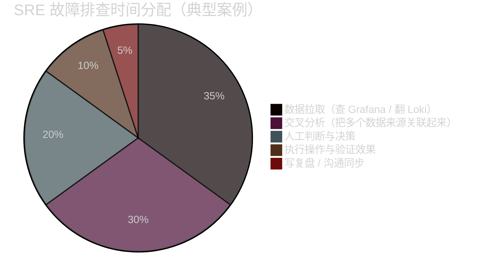
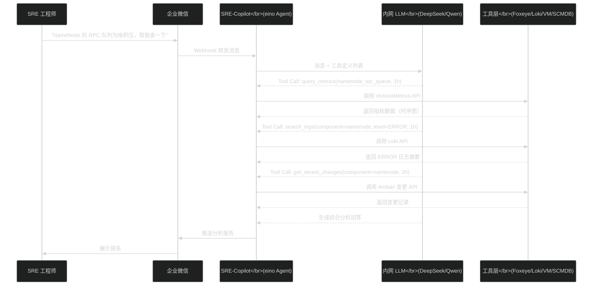

# 09 ChatOps 与 SRE-Copilot：LLM 驱动的运维交互新范式

## 摘要

本文是专栏第九篇，聚焦大数据集群 AiOps 的人机交互层：以 [[eino]] Multi-Agent 框架为核心，构建一个真正能帮助 SRE 解决问题的 LLM 驱动 ChatOps 系统（SRE-Copilot）。文章从 ChatOps 的本质和价值切入，深度解析 LLM-as-Tool-Router 架构中的核心设计决策，讲解如何将 [[Foxeye]] / [[Loki]] / [[VictoriaMetrics]] / [[SCMDB]] 等大数据集群运维工具封装为 LLM 可调用的 Tool，分析内网私有化 LLM 部署的技术选型与数据隐私约束，并展示 SRE-Copilot 在实际故障排查中的交互示例。本文的核心主张：ChatOps 的价值不是"让工程师用聊天界面替代命令行"，而是让 LLM 承担"数据拉取 + 交叉分析 + 自然语言总结"这三件最耗时的事，把工程师的精力解放出来专注于决策和判断。

---

## 第 1 章 ChatOps 的本质：不是更酷的界面，是认知增强

### 1.1 ChatOps 的演进

ChatOps 这个词最早由 GitHub 工程团队提出，指"通过聊天界面（Slack/Teams/企业微信）来触发运维操作"。早期的 ChatOps 是字符命令触发脚本的形式：在 Slack 里输入 `/deploy service-a v1.2.3`，机器人接收命令并执行对应的部署脚本。

这个形式的 ChatOps 有一定价值（操作可见、可审计，团队成员都能看到谁在做什么操作），但本质上只是"把命令行放到了聊天界面里"，没有改变运维的认知负担。

LLM 出现之后，ChatOps 有了质的变化：你不需要知道具体的命令格式，用自然语言描述你的问题（"帮我查下 NameNode 过去一小时的 GC 情况，看看是不是 GC 风暴导致了 RPC 积压"），LLM 理解你的意图，自动调用相关工具（查询 Loki 日志 + VictoriaMetrics 指标），把结果综合分析后用自然语言回答你。

这才是 LLM 时代 ChatOps 的真正价值：**认知增强而不是界面替换**。工程师减少的不是打字时间，而是"知道该查什么、怎么查、查完怎么关联分析"的认知负担。

### 1.2 SRE 的时间分配 vs ChatOps 的价值锚点

一个典型 SRE 在故障排查中的时间是怎么花费的？



前两项（数据拉取 + 交叉分析）合计占用了 65% 的时间，但这两项都是**机械性、可被 LLM 替代**的工作。SRE 真正不可替代的是"人工判断与决策"——知道该相信哪个数据、该选哪个操作、该如何权衡风险。

SRE-Copilot 的价值锚点就在这里：**自动化那 65% 的数据拉取和交叉分析，把 SRE 的精力集中到那 20% 的关键判断上**。当处于凌晨 3 点的告警中时，这种解放意义更加实质。

---

## 第 2 章 LLM-as-Tool-Router 架构设计

### 2.1 核心架构模式

现代 LLM 的 Function Calling（也叫 Tool Use）能力，是 ChatOps 系统的技术基础。LLM 接受自然语言输入后，能够识别"这个问题需要调用哪个工具（Function）、带什么参数"，执行工具调用，然后基于工具返回的数据生成最终回答。

这个模式被称为 **LLM-as-Tool-Router**：LLM 扮演路由器的角色，根据用户意图选择合适的工具，组合调用，综合输出。



### 2.2 eino Multi-Agent 框架选型理由

[[eino]] 是 CloudWeGo（字节跳动开源）团队开发的 Go 语言 AI 应用框架，类似于 Python 生态中的 LangChain，但更适合需要高并发、低延迟的运维场景。

选择 eino 而不是 LangChain 的核心原因：

**Go 生态一致性**：SRE-Copilot 的其他模块（告警聚合服务、SCMDB 查询服务）都是 Go 实现，用同一语言构建整个系统可以减少跨语言调用的复杂性，共享代码结构和配置管理。

**性能**：Go 的并发模型（goroutine）使得多工具并发调用非常自然（例如同时查 Loki 日志和 VictoriaMetrics 指标，不需要顺序等待），整体响应延迟比 Python 实现低。

**eino 的关键能力**：
- **Graph-based 工作流**：将 Agent 的执行流程定义为有向图，每个节点是一个 LLM 调用或工具调用，支持分支、循环、并行执行
- **Tool 注册机制**：提供统一的工具注册和调用接口，工具的 JSON Schema 自动从 Go struct 生成
- **流式输出（Streaming）**：支持 LLM 流式输出（token by token），使用户在 LLM 推理过程中就能看到部分结果，而不是等待全部完成

---

## 第 3 章 工具封装：把运维系统变成 LLM 可调用的 API

ChatOps 系统的工具层是 SRE-Copilot 的"眼睛和手"——LLM 能看到什么数据、能执行什么操作，完全由工具层决定。工具层设计的质量，直接决定 SRE-Copilot 的能力边界。

### 3.1 工具设计原则

**原子性（Atomicity）**：每个工具只做一件事，不要试图把太多功能塞进一个工具。好的工具粒度例子：`query_namenode_rpc_metrics(hostname, time_range)` 和 `search_namenode_logs(hostname, level, keywords, time_range)` 是两个独立工具，而不是一个"查询 NameNode 所有信息"的大工具。原子工具更预测、更容易测试、LLM 的调用决策也更准确。

**参数明确性**：工具的参数名和描述必须对 LLM 足够友好——LLM 是通过参数的名称和描述来决定填什么值的。参数名 `hostname` 比 `h` 有意义，参数描述 `指标查询的时间范围，格式如 '1h'/'30m'/'2h'，最长支持 7d` 比 `time_range: string` 有用得多。

**返回结构化**：工具返回的数据必须是结构化的、Token 高效的——LLM 处理 Token 是有成本的，返回 10 万行原始日志和返回"过去 1 小时有 847 条 IOException 日志，模板为 IOException writing block <BLK> to mirror <IP>"对 LLM 的决策价值一样，但 Token 消耗差了几百倍。工具必须在返回前做数据聚合和摘要。

**只读优先**：Chat 界面的操作必须遵循"先只读后写操作"原则。查询类工具（查指标、查日志、查告警、查 SCMDB）应该默认不需要任何授权；写操作类工具（重启服务、修改配置、触发副本迁移）必须经过明确的权限检查，并在执行前向用户显示操作摘要要求确认。

### 3.2 核心工具清单

| 工具名 | 数据来源 | 返回内容 | 典型使用场景 |
|--------|---------|---------|------------|
| `query_cluster_metrics` | VictoriaMetrics API | 指定指标的时序数据 + 统计摘要 | "查过去 2 小时 NameNode RPC 队列趋势" |
| `search_component_logs` | Loki API | 过滤后的日志摘要（按模板分组计数） | "有没有 DataNode 报过 IOException" |
| `get_active_alerts` | Foxeye API | 当前活跃告警列表 + 严重级别 | "现在集群有哪些告警" |
| `get_incident_detail` | SRE-Copilot DB | 主事件的完整信息（根因 + 衍生 + 变更） | "INC-0089 这个事件是什么情况" |
| `query_job_profile` | Spark History Server | 指定作业的画像基线和当前执行对比 | "daily_hive_etl 今天跑了多久，正常吗" |
| `get_component_topology` | SCMDB | 指定组件的上下游依赖关系 | "HiveServer2 依赖哪些组件" |
| `get_recent_changes` | Ambari Change API | 最近 N 小时内的配置变更记录 | "两小时内有没有变更操作" |
| `run_ssh_command` | SSH + 安全校验 | 命令执行结果（受权限控制） | "帮我在 dn-003 跑 smartctl 检查磁盘" |
| `trigger_hdfs_rebalance` | HDFS HTTP API | 操作触发结果（需人工确认） | "触发 HDFS 副本重均衡" |

### 3.3 关键工具实现：`search_component_logs`

以最频繁被使用的日志查询工具为例，讲解工具封装的关键设计：

```go
// SearchComponentLogsInput 日志查询工具的参数定义
// eino 会自动将这个 struct 转换为 JSON Schema，提供给 LLM 理解
type SearchComponentLogsInput struct {
    // Component 要查询的组件类型
    // 可选值: namenode, datanode, resourcemanager, nodemanager, hiveserver2, kafka_broker
    Component string `json:"component" jsonschema:"description=要查询的大数据组件类型,enum=namenode,enum=datanode,enum=resourcemanager,enum=nodemanager,enum=hiveserver2,enum=kafka_broker"`

    // Hostname 可选的主机名过滤，不填则查所有节点
    Hostname string `json:"hostname,omitempty" jsonschema:"description=可选，过滤特定主机名的日志，如 dn-003.prod.bigdata.com"`

    // Level 日志级别过滤
    Level string `json:"level" jsonschema:"description=日志级别,enum=ERROR,enum=WARN,enum=INFO,default=ERROR"`

    // Keywords 关键词过滤（可选）
    Keywords []string `json:"keywords,omitempty" jsonschema:"description=可选的关键词过滤列表，如 IOException、OutOfMemoryError"`

    // TimeRange 时间范围
    TimeRange string `json:"time_range" jsonschema:"description=查询的时间范围，格式如 1h、30m、2h，最长支持 7d"`

    // MaxTemplates 最多返回的日志模板数量（防止返回太多）
    MaxTemplates int `json:"max_templates,omitempty" jsonschema:"description=最多返回的日志模板数量，默认 10，最大 50"`
}

// SearchComponentLogsOutput 查询结果
type SearchComponentLogsOutput struct {
    TotalCount    int            `json:"total_count"`    // 符合条件的总日志条数
    TopTemplates  []TemplateItem `json:"top_templates"`  // 按频率排序的 Top N 模板
    TimeRange     string         `json:"time_range"`
    QuerySummary  string         `json:"query_summary"`  // 给 LLM 的自然语言摘要
}

type TemplateItem struct {
    TemplateID   int    `json:"template_id"`
    TemplateStr  string `json:"template_str"`  // Drain3 模板字符串
    Count        int    `json:"count"`          // 在时间窗口内的出现次数
    FirstSeen    string `json:"first_seen"`     // 最早出现时间
    LastSeen     string `json:"last_seen"`      // 最近出现时间
    Severity     string `json:"severity"`        // ERROR / WARN
}

// SearchComponentLogs 工具的执行函数
func SearchComponentLogs(ctx context.Context, input *SearchComponentLogsInput) (*SearchComponentLogsOutput, error) {
    // 1. 构建 Loki LogQL 查询
    logql := buildLogQL(input)  // 根据 input 参数构建 LogQL

    // 2. 调用 Loki HTTP API
    rawLogs, err := lokiClient.QueryRange(ctx, logql, input.TimeRange)
    if err != nil {
        return nil, fmt.Errorf("Loki 查询失败: %w", err)
    }

    // 3. 对日志行进行 Drain3 模板归类（在线查询模式）
    templateCounts := make(map[int]*TemplateItem)
    for _, log := range rawLogs {
        templateID := templateMiner.GetTemplateID(log.Message)
        if item, ok := templateCounts[templateID]; ok {
            item.Count++
            item.LastSeen = log.Timestamp
        } else {
            templateCounts[templateID] = &TemplateItem{
                TemplateID:  templateID,
                TemplateStr: templateMiner.GetTemplate(templateID),
                Count:       1,
                FirstSeen:   log.Timestamp,
                LastSeen:    log.Timestamp,
                Severity:    log.Level,
            }
        }
    }

    // 4. 按频率排序，取 Top N
    topN := sortAndLimit(templateCounts, input.MaxTemplates)

    // 5. 生成给 LLM 的自然语言摘要（减少 LLM 处理结构化 JSON 的认知成本）
    summary := generateLogSummary(len(rawLogs), topN, input)

    return &SearchComponentLogsOutput{
        TotalCount:   len(rawLogs),
        TopTemplates: topN,
        TimeRange:    input.TimeRange,
        QuerySummary: summary,
    }, nil
}
```

---

## 第 4 章 内网 LLM 部署：数据隐私的硬性约束

### 4.1 为什么必须内网部署

大数据集群运维数据具有极高的敏感性：集群架构拓扑（哪些主机运行哪些组件）、历史故障数据（可能包含业务影响信息）、日志内容（可能包含用户数据的痕迹）。

这些数据**绝对不能发送到公网 LLM API（OpenAI/Claude/Gemini）**。主要原因：

- **数据合规**：数据处理合规要求（数据主权、不出境等）不允许将生产运维数据发送到境外服务器
- **商业机密**：集群架构和容量信息是核心商业资产，不应该被 LLM 提供商用于训练
- **安全风险**：生产系统的告警数据可能暴露安全漏洞信息

因此，SRE-Copilot 的 LLM 必须是**内网私有化部署**的模型。

### 4.2 内网 LLM 的技术选型

截至 2026 年，可以在内网私有化部署的主流开源 LLM，按用途分类：

| 模型系列 | 推荐版本 | 适用场景 | 推理显存要求 |
|---------|---------|---------|-----------|
| **DeepSeek-R1** | R1-32B | 需要复杂推理（如 RCA 分析）的场景 | 约 64GB VRAM（A100 × 1） |
| **Qwen 2.5** | 72B-Instruct | 中文理解质量最优，工具调用能力强 | 约 80GB VRAM（A100 × 2） |
| **DeepSeek-V3** | V3-671B MoE | 最强能力，但推理成本高 | 需要多卡部署 |
| **Llama 3.3** | 70B-Instruct | 英文场景，工具调用能力强 | 约 80GB VRAM（A100 × 2） |
| **Qwen 2.5** | 7B-Instruct | 资源受限场景的折中（能力较弱） | 约 16GB VRAM（RTX 4090 × 1） |

对于大多数大数据集群 SRE 团队，**Qwen 2.5 72B + vLLM 推理框架**是 2026 年初期推荐的主流组合：
- Qwen 的中文理解能力在同量级模型中最优（中文运维场景的专业词汇理解更准确）
- vLLM 提供 OpenAI 兼容 API，可以直接替换 OpenAI SDK，代码改动最小
- 支持 Function Calling（工具调用），与 eino 框架兼容

### 4.3 LLM 推理服务的工程配置

使用 vLLM 部署 Qwen 2.5 72B 的关键配置：

```bash
# vLLM 服务启动（使用 Tensor Parallel，两张 A100 80GB）
python -m vllm.entrypoints.openai.api_server \
  --model /data/models/Qwen2.5-72B-Instruct \
  --served-model-name qwen2.5-72b \
  --tensor-parallel-size 2 \        # 两卡并行，每卡约 40GB VRAM
  --max-model-len 32768 \            # 最大 32K context 长度（支持长日志 + 指标数据）
  --gpu-memory-utilization 0.92 \   # 92% VRAM 用于模型，留 8% 给 KV Cache
  --max-num-seqs 32 \               # 最大并发请求数
  --host 0.0.0.0 --port 8000 \
  --api-key "内部 API KEY"          # 内网 API 鉴权（防止未授权访问）
```

> [!warning] 内网 LLM 的可靠性设计
> 内网 LLM 服务是 SRE-Copilot 的关键依赖，但 GPU 机器本身也可能出现故障（显存 ECC 错误、温度过高降频）。必须设计 Fallback 策略：当内网 LLM 不可用时，SRE-Copilot 降级为"工具直接调用模式"——仍然执行工具查询，但不做 LLM 综合分析，直接把原始数据返回给工程师。这保证了"工具层能力"不因 LLM 故障而消失。

---

## 第 5 章 SRE-Copilot 实际交互示例

### 5.1 场景一：故障排查加速

**工程师输入**：
> "NameNode RPC 队列积压，有告警了，帮我看看是什么原因"

**SRE-Copilot 执行过程**（后台，用户不可见）：
1. Tool Call: `get_active_alerts(component=namenode)` → 返回：2 条 CRITICAL 告警（RPC 队列 > 5000）
2. Tool Call: `query_cluster_metrics(metric=hadoop_namenode_rpc_callQueueLen, time_range=2h)` → 返回：过去 2 小时积压趋势（13:45 开始急剧上升）
3. Tool Call: `query_cluster_metrics(metric=hadoop_namenode_jvm_gctime, time_range=2h)` → 返回：GC 时间在 13:43 开始急剧增加（Full GC 出现！）
4. Tool Call: `search_component_logs(component=namenode, level=ERROR, time_range=2h)` → 返回：最多的模板是 `GC pause of <NUM> seconds for Throughput Collector`（出现 23 次），`RPC call <*> timed out`（出现 891 次）
5. Tool Call: `get_recent_changes(component=namenode, time_range=4h)` → 返回：无变更记录

**SRE-Copilot 输出**：
> **根因分析：NameNode Full GC 风暴（置信度 87%）**
>
> **现象链**：13:43 NameNode 开始出现 Full GC（从 GC 日志看，每分钟暂停时间超过 5 秒），导致 NameNode 实际可用处理时间减少，RPC 请求积压，从 13:45 开始触发 RPC 队列长度告警（当前 > 5000）。
>
> **GC 证据**：
> - 日志模板 `GC pause of <NUM> seconds` 在过去 2 小时出现 23 次，最长一次暂停 8.3 秒
> - VictoriaMetrics 显示 `hadoop_namenode_jvm_gctime` 在 13:43 从基线值 200ms/min 跳升至 5600ms/min
>
> **关联变更**：过去 4 小时无配置变更，可能是数据量增长导致 NameNode 堆内存压力增大（建议检查 NameNode 内存配置）。
>
> **推荐操作**：
> 1. 立即：检查 NameNode 当前 Heap 使用率：`jstat -gcutil <NameNode_PID> 1000 10`
> 2. 短期：考虑增加 NameNode `-Xmx`（当前配置需确认），参考 Runbook #R-012
> 3. 长期：检查 HDFS 文件数增长趋势，评估是否触发小文件数量限制
>
> 📊 [指标图表链接] | 📋 [NameNode 日志链接]

整个响应从用户发送消息到看到结果，端到端约 **12-18 秒**（5 次工具调用 × 平均 1.5s + LLM 推理 5-8s）。

### 5.2 场景二：作业诊断

**工程师输入**：
> "daily_hive_etl 今天跑了 3 小时了还没完，正常吗？帮我看看哪里出问题了"

**SRE-Copilot 输出**：
> **作业异常诊断：daily_hive_etl 执行超时**
>
> **基线对比**：根据过去 30 天同类作业（数据量 50-200GB 桶）的历史执行，P90 完成时间为 1 小时 42 分钟，当前已运行 3 小时 12 分钟（超出 P90 基线 1.88x），触发长尾异常阈值。
>
> **当前状态**：作业已完成 Stage 0-5，正卡在 Stage 6（Shuffle Stage）。Stage 6 共 500 个 Task，已完成 487 个，剩余 13 个 Task 已运行超过 45 分钟（正常 Task 的 P50 执行时间为 5.2 分钟），偏斜比 8.7x。
>
> **数据倾斜诊断**：13 个长尾 Task 的 Shuffle 读取量分别在 4.2-6.8GB，而其余 Task 的中位数为 0.45GB（约 10-15 倍数据量差异）。**强烈建议数据倾斜（Data Skew）为主因**。
>
> **推荐操作**：
> 1. 短期（不影响今日 SLA）：如 SLA 允许等待，作业可能在 40 分钟内自行完成（长尾 Task 在处理中）
> 2. 中期（避免明天再次发生）：检查作业的 Group By Key 的数据分布，考虑加盐（Salting）处理热点 Key
> 3. 参考：Runbook #R-078（Spark 数据倾斜处理指南）

---

## 第 6 章 安全设计：防止 SRE-Copilot 被滥用

### 6.1 权限分级

SRE-Copilot 的工具调用必须按照操作风险分级授权：

| 权限级别 | 操作类型 | 授权方式 |
|---------|---------|---------|
| **Level 0（自动）** | 只读查询（指标/日志/告警/SCMDB） | 无需任何确认，自动执行 |
| **Level 1（一键确认）** | 低风险写操作（查看 SSH 命令建议、触发只读的诊断脚本） | 在聊天界面点击确认按钮 |
| **Level 2（显式授权）** | 中风险操作（SSH 执行命令、触发 HDFS 副本迁移） | 必须输入明确的确认指令（如"确认执行"） |
| **Level 3（审批流）** | 高风险操作（修改集群配置、重启核心组件） | 需要第二个 SRE 在审批系统确认 |
| **Level 4（永远禁止）** | 数据删除、跨集群迁移 | SRE-Copilot 不提供此类工具 |

### 6.2 审计日志

所有 SRE-Copilot 的操作（包括查询操作）必须完整记录到审计日志：

```go
type CopilotAuditLog struct {
    SessionID   string    `json:"session_id"`   // 一次对话的唯一 ID
    UserID      string    `json:"user_id"`      // 操作人
    MessageID   string    `json:"message_id"`   // 用户消息 ID
    ToolName    string    `json:"tool_name"`    // 调用的工具名
    ToolInput   string    `json:"tool_input"`   // JSON 序列化的工具参数
    ToolOutput  string    `json:"tool_output"`  // JSON 序列化的工具返回（脱敏）
    StartTime   time.Time `json:"start_time"`
    Duration    int64     `json:"duration_ms"`
    IsWriteOp   bool      `json:"is_write_op"`  // 是否为写操作
    Confirmed   bool      `json:"confirmed"`    // 写操作是否经过用户确认
}
```

审计日志至少保留 180 天，供安全审查和事后分析使用。

---

## 第 7 章 小结与下一篇预告

本篇完整描述了一个生产可用的 LLM 驱动 ChatOps 系统的设计：

1. **ChatOps 的本质价值**（认知增强而非界面替换，解放 65% 的数据拉取和交叉分析时间）
2. **LLM-as-Tool-Router 架构**（完整 Sequence Diagram）
3. **eino 框架选型理由**（Go 生态 + 并发性能 + 工具注册机制）
4. **工具封装三原则**（原子性 + 参数明确性 + 返回结构化）
5. **核心工具清单**（9 个核心运维工具的完整设计）
6. **`search_component_logs` 工具实现**（完整 Go 代码）
7. **内网 LLM 部署**（选型对比 + vLLM 配置 + 可靠性 Fallback）
8. **实际交互示例**（故障排查 + 作业诊断两个完整案例）
9. **安全设计**（权限分级 + 审计日志）

下一篇[[10 AiOps 闭环：从感知到自愈的完整链路设计]]是专栏的收尾篇，将绘制 AiOps 完整闭环的全景图，建立 L0-L3 自动处置风险分级体系，给出预测性运维的实现路径，以及可以直接用于向管理层汇报的 AiOps 成熟度评估框架。

*上一篇：[[08 作业画像与异常检测：Spark 和 Flink 的 AiOps 专属能力]] | 下一篇：[[10 AiOps 闭环：从感知到自愈的完整链路设计]]*
