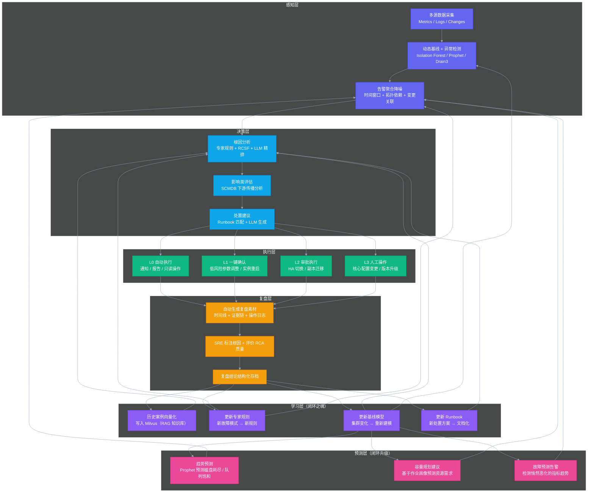
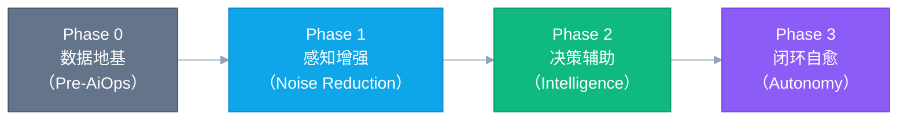
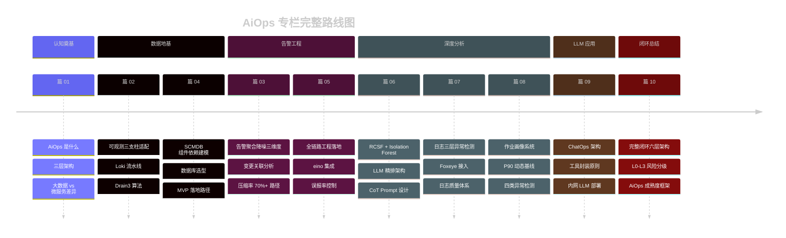

# 10 AiOps 闭环：从感知到自愈的完整链路设计

## 摘要

本文是专栏终篇，以"闭环"为核心主题，将前九篇所有技术模块整合成一个完整的系统视图。文章绘制从感知到自愈的完整闭环全景图，并深度解析"闭环"中最容易被忽视却最重要的两个环节：复盘驱动的知识库回流，以及预测性运维（从事后救火到事前预防）。同时建立 L0/L1/L2/L3 自动处置风险分级体系，给出大数据集群场景下可安全自动化的操作清单，以及一套可操作的 AiOps 成熟度评估框架（含 Phase 0-3 的核心 KPI 体系），帮助团队客观评估"我们现在处于哪个阶段、下一步该做什么"。本文的核心主张：**AiOps 不是一个有终点的项目，而是一个持续演进的能力飞轮——每次故障都是系统学习的机会，每次学习都让下一次故障更容易处理**。

---

## 第 1 章 闭环的全景视图

### 1.1 为什么"闭环"是 AiOps 的关键词

大多数关于 AiOps 的文章，都把重点放在"感知"（异常检测）、"决策"（根因分析）和"执行"（自动化处置）这三个环节，但忽视了一个让整个体系持续进化的关键机制：**从执行结果回流到知识库，更新感知模型和决策规则，让系统在每一次故障处置后都变得"更聪明"一点**。

没有这个回流机制，AiOps 只是一个固定能力的工具集。有了这个回流机制，AiOps 才成为一个**持续学习的能力飞轮**。

### 1.2 完整闭环架构



这个六层闭环架构与前九篇文章的对应关系：
- **感知层** → [[02 数据地基优先]] + [[03 告警工程]] + [[07 日志智能化]] + [[08 作业画像]]
- **决策层** → [[04 SCMDB]] + [[06 根因分析 RCA]]
- **执行层** → [[05 智能告警降噪]] + [[09 ChatOps]]（本篇第 2 章）
- **复盘层 + 学习层** → 本篇第 3 章（专栏首次深入讲解）
- **预测层** → 本篇第 4 章（专栏首次深入讲解）

---

## 第 2 章 自动处置的风险分级体系（L0-L3）

### 2.1 为什么需要严格的风险分级

自动处置（Automated Remediation）是 AiOps "执行层"的核心能力，也是最需要谨慎设计的部分。如果自动处置执行了错误的操作（对着错误的根因执行处置动作），可能把一个影响 10% 用户的故障，扩大成影响所有用户的灾难性故障。

典型的反面案例：一个 HiveServer2 连接池耗尽的告警，系统判断"连接池耗尽"，自动触发"重启 HiveServer2"恢复连接池。但实际根因是 NameNode GC 风暴导致所有 HDFS 操作阻塞，连接在等待 HDFS 响应时耗尽了连接池。重启 HiveServer2 不仅没有解决问题，反而：
1. 杀掉了所有正在执行的 Hive 查询（业务影响扩大）
2. 新启动的 HiveServer2 连接池立即又被耗尽（因为根因未解决）

这个例子说明，自动处置必须满足两个前提：**根因判断足够准确**，以及**处置操作的影响可控可回滚**。

### 2.2 L0-L3 分级定义与大数据集群示例

| 级别 | 风险定义 | 授权方式 | 大数据集群典型场景 |
|------|---------|---------|----------------|
| **L0** | 零风险信息操作 | 完全自动，无需任何确认 | 发送告警通知 / 生成事件报告 / 查询诊断信息 / 日志链接推送 |
| **L1** | 低风险，操作可立即回滚 | 自动执行，但实时通知 SRE | 调整 YARN 队列权重（有历史成功先例）/ 杀掉明显异常的 Spark 作业（已超时 3 倍以上）/ 触发 HDFS 副本再均衡（纯读）|
| **L2** | 中风险，操作需要确认 | SRE 点击确认，等待不超过 10 分钟 | NameNode HA 主备切换 / 重启某个 DataNode 上明确异常的服务 / 调整 HiveServer2 连接池上限 |
| **L3** | 高风险，需要多人审批 | 审批流，可能需要 30+ 分钟 | 修改 `hdfs-site.xml` 核心配置 / 下线一个 DataNode / 集群版本升级 / Kafka Topic 副本重分配 |

> [!caution] L4：永远不自动化
> 以下操作永远不允许自动触发，即使 AiOps 系统认为"确信无疑"：数据删除（HDFS 数据删除 / Kafka Topic 删除）、跨集群迁移、用户数据操作。这些操作的错误代价无法接受，必须由经验丰富的工程师在充分验证后手动执行。

### 2.3 大数据集群 L1 自动化操作的安全约束

对于 L1 级别的自动化操作，必须配置安全护栏（Safety Rails），防止在不适合的时机执行：

```yaml
# L1 自动化操作的安全约束配置（示例）
auto_actions:
  - name: kill_straggler_spark_job
    description: "自动杀掉运行时间超过 P95 基线 3 倍的 Spark 作业"
    level: L1
    safety_rails:
      # 护栏 1：只在检测到明确的作业异常信号时执行（不仅仅是超时）
      require_signals:
        - "executor_failed_count > 5"
        - "OR stage_skew_ratio > 10"
      # 护栏 2：业务高峰期保守模式（延长倍数阈值）
      business_hours_multiplier: 5  # 工作时间段需要超 P95 基线 5 倍才触发
      off_hours_multiplier: 3       # 非工作时间 3 倍触发
      # 护栏 3：同一时间窗口内，不连续自动杀超过 N 个作业
      max_kills_per_hour: 3
      # 护栏 4：关键 SLA 作业豁免
      exempt_job_patterns:
        - ".*_sla_critical_.*"
        - ".*_realtime_.*"

  - name: adjust_yarn_queue_weight
    description: "当某队列过载时自动临时调整队列权重"
    level: L1
    safety_rails:
      require_signals:
        - "yarn_queue_utilization > 95%"
      max_adjustment_percentage: 20  # 单次调整幅度不超过 20%
      auto_revert_minutes: 60        # 60 分钟后自动恢复原值（防止遗忘）
      exempt_queues:
        - "critical"
```

---

## 第 3 章 复盘驱动的知识库回流

### 3.1 为什么复盘是"闭环之魂"

在六层闭环架构中，"学习层"是让整个体系持续进化的引擎——但学习层的输入，来自于"复盘层"。没有高质量的复盘，学习层就没有高质量的训练数据，AiOps 的能力就无法提升。

传统的故障复盘往往是这样的：故障恢复后，写一份 Post-mortem 文档（通常格式混乱、详细程度不一、时间线不准确），在会议上讨论，然后……就没有然后了。文档存到 Confluence，再也没有人读。下次同类故障来临时，团队依然从零开始排查。

AiOps 语境下的复盘，必须是**结构化的、自动化辅助的、能够反哺系统的**。

### 3.2 自动生成复盘素材

当一个事件（Incident）被标记为 RESOLVED 时，SRE-Copilot 自动生成复盘素材草稿：

**自动生成内容**：
- **事件时间线**：从第一条告警触发，到最后一条告警恢复，所有关键事件（告警触发/恢复、工具调用、变更操作、工程师操作）按时间顺序排列
- **影响量化**：受影响的组件数量、影响持续时间、影响的作业数量（从作业画像数据获取）、MTTR 计算
- **告警质量评估**：这次故障中，哪些告警最先发现了问题（MTTD 最短）？哪些告警是噪声（触发后工程师没有执行任何操作）？
- **工具调用日志**：工程师在 SRE-Copilot 的完整查询历史，可以帮助还原"当时工程师在做什么分析"

**需要 SRE 补充的内容**：
- 最终确认的根因（AiOps 的 RCA 结论是否准确？如果不准确，正确的根因是什么？）
- 处置过程中的关键决策（为什么选择这个处置方案而不是另一个？）
- 预防措施（下次如何避免？）
- 对 AiOps 系统的改进建议（本次故障中 AiOps 哪里表现好 / 哪里表现差？）

### 3.3 复盘结论回流到各个学习子系统

SRE 完成标注后，复盘结论自动触发以下学习动作：

**回流到 RAG 知识库**：将本次故障案例（触发条件 + 根因 + 处置方案 + 恢复时间）向量化，写入 [[Milvus]]，供下次 RCA 的 RAG 检索使用。

**回流到专家规则**：如果这次故障暴露了一个之前规则库没有覆盖的故障模式，自动生成"新增规则建议卡"，推送给 SRE 确认后，添加到专家规则库。

**回流到基线模型**：如果本次故障是由集群架构变化（扩容、版本升级）导致正常 baseline 发生漂移，触发对应组件的基线重新建模。

**回流到 Runbook**：如果本次处置中，SRE 使用了一个 Runbook 中没有记录的操作步骤，自动生成"Runbook 更新建议"，由 SRE 审核后合并。

---

## 第 4 章 预测性运维：从事后救火到事前预防

### 4.1 预测性运维的三个能力维度

"预测性运维"是"事后分析"的上一个维度：不是等故障发生了再分析，而是在故障发生之前就发现趋势性风险，提前采取行动。

对于大数据集群，预测性运维有三个最有价值的实现维度：

**维度一：资源耗尽预测**

HDFS 磁盘容量、NameNode 内存（受文件数增长影响）、YARN 队列资源利用率，这些资源有明显的趋势性增长。使用 [[Prophet]] 对这些指标做时序预测，可以提前 7-14 天预测"按当前增长趋势，哪个资源会在什么时候耗尽"。

```python
from prophet import Prophet
import pandas as pd
from datetime import datetime, timedelta

def predict_hdfs_disk_exhaustion(
    df: pd.DataFrame,  # columns: ds (datetime), y (disk_used_tb)
    horizon_days: int = 14
) -> dict:
    """
    预测 HDFS 磁盘容量耗尽时间

    df: 过去 90 天的磁盘使用量时序数据（每日采样）
    """
    m = Prophet(
        yearly_seasonality=False,  # 大数据集群的磁盘增长通常没有年度季节性
        weekly_seasonality=True,   # 有工作日/周末的数据增量差异
        daily_seasonality=False,
        changepoint_prior_scale=0.05,  # 低弹性，避免过拟合短期波动
    )
    m.fit(df)

    future = m.make_future_dataframe(periods=horizon_days)
    forecast = m.predict(future)

    # 找到预测值首次超过容量上限（假设 90% 告警阈值）的日期
    capacity_limit_tb = get_cluster_total_capacity_tb() * 0.90
    future_data = forecast[forecast['ds'] > datetime.now()]
    crossing = future_data[future_data['yhat'] >= capacity_limit_tb]

    if crossing.empty:
        return {
            "will_exhaust_in_horizon": False,
            "forecast_14d_usage_tb": float(future_data['yhat'].iloc[-1]),
        }
    else:
        exhaustion_date = crossing['ds'].iloc[0]
        days_until = (exhaustion_date - datetime.now()).days
        return {
            "will_exhaust_in_horizon": True,
            "exhaustion_date": exhaustion_date.strftime("%Y-%m-%d"),
            "days_until_exhaustion": days_until,
            "current_usage_tb": float(df['y'].iloc[-1]),
            "recommendation": f"预计 {days_until} 天后 HDFS 磁盘使用率达到 90% 告警线，"
                            f"建议在 {(exhaustion_date - timedelta(days=7)).strftime('%m月%d日')} 前完成扩容"
        }
```

**维度二：作业 SLA 风险预测**

对于有明确 SLA 的批处理作业（比如"每天 T+1 日 8:00 前必须完成"），可以在作业运行中途预测"按当前进度，能否按时完成"，提前预警。

实现方式：基于作业画像的历史基线，结合作业当前的 DAG 进度（已完成的 Stage 数量、剩余 Stage 的预估执行时间），给出完成概率和预估完成时间。

**维度三：集群健康趋势预警**

某些指标的异常不是突变，而是渐进的恶化。比如：
- NameNode 的 GC 频率在过去两周间歇性增加（每次 GC 时间从 500ms 上升到 1500ms），但还没有到阈值
- DataNode 的磁盘 IO 延迟在过去一周缓慢上升（从 2ms 到 8ms），可能是磁盘开始老化

这类"悄然恶化"的趋势，静态阈值和点异常检测都无法发现，需要专门的趋势检测算法（如 Mann-Kendall 趋势检验），在趋势确立早期（还在正常范围内）就触发预警，给团队足够的提前干预时间。

### 4.2 预测性运维的工程约束

预测性运维有两个容易被忽视的工程约束：

**假阳性（False Positive）的心理成本**：如果预测性告警经常不准确（预测"明天磁盘会耗尽"，但实际上一周后都没有），工程师会开始忽视预测告警，整个预测体系就失去了意义。预测性告警的设计必须保守：宁可漏掉一部分风险，也不要产生大量误报，破坏工程师对系统的信任。

**行动闭环**：预测告警的价值在于"提前有时间做些什么"。如果预测告警触发了，但工程师收到通知后不知道该做什么，这个告警是没有价值的。每个预测告警必须配套"推荐操作"（容量扩展申请流程、参数调整建议），让工程师看到告警就知道下一步行动。

---

## 第 5 章 AiOps 成熟度评估框架

### 5.1 成熟度模型定义

基于前九篇的技术内容，以及业界实践经验，可以把大数据集群 AiOps 的成熟度划分为四个阶段：



### 5.2 各阶段详细描述与 KPI 体系

**Phase 0：数据地基（Pre-AiOps）**

| 维度 | 要求 |
|------|------|
| **核心能力** | 完整的可观测数据底座（Metrics + Logs + Changes），统一告警平台 |
| **SCMDB 状态** | MVP（6 个核心依赖建模，实例级别） |
| **告警体系** | 完成 Foxeye 迁移，完成告警瘦身（删除 50%+ 无效规则） |
| **当前我的团队状态** | ✅ 指标体系基本完成 / ⚠️ Loki 建设中 / ⚠️ SCMDB 设计中 |
| **关键 KPI** | 核心指标覆盖率 > 95% / 日志采集延迟 P99 < 30s / 告警平台可用性 > 99.9% |
| **典型耗时** | 2-4 个月 |

**Phase 1：感知增强（Noise Reduction）**

| 维度 | 要求 |
|------|------|
| **核心能力** | 告警聚合降噪（告警压缩率 > 60%），动态基线告警（核心指标），Drain3 日志模板化 |
| **SCMDB 状态** | 完整建模，覆盖所有生产集群 |
| **自动化能力** | L0 操作全自动，主事件卡片推送 |
| **关键 KPI** | 告警压缩率 > 60% / 误报率 < 15% / MTTD < 3 分钟 / 主事件 E2E 延迟 P99 < 30s |
| **典型耗时** | 3-5 个月（在 Phase 0 基础上） |

**Phase 2：决策辅助（Intelligence）**

| 维度 | 要求 |
|------|------|
| **核心能力** | 根因分析（AC@5 > 70%），SRE-Copilot ChatOps，作业画像异常检测，LLM 增强 |
| **知识库** | 历史故障案例库 > 50 条（RAG 可用），所有核心故障模式有专家规则覆盖 |
| **自动化能力** | L1 操作自动执行，L2 操作人工确认 |
| **关键 KPI** | 告警压缩率 > 75% / AC@5 > 70% / MTTR 相比 Phase 1 下降 30% / ChatOps 使用率（工程师主动使用频率） |
| **典型耗时** | 4-6 个月（在 Phase 1 基础上） |

**Phase 3：闭环自愈（Autonomy）**

| 维度 | 要求 |
|------|------|
| **核心能力** | 预测性运维（资源/SLA/趋势），复盘自动化，知识库持续回流，L1 操作成功率 > 90% |
| **闭环完整性** | 感知→决策→执行→复盘→学习全链路贯通 |
| **自动化能力** | L1 自动化覆盖率 > 80%，L2 审批时间 < 5 分钟 |
| **关键 KPI** | 告警压缩率 > 85% / MTTR 相比 Phase 0 下降 70% / 预测性告警提前发现比例 > 30% / 自动化处置成功率 > 85% / 值班工程师被凌晨告警唤醒次数下降 60%+ |
| **典型耗时** | 持续演进，无明确终点 |

### 5.3 快速自评方法

用以下 10 个问题评估你的团队当前处于哪个 Phase：

1. 所有关键集群组件是否都有 Prometheus Exporter，且指标缺失率 < 1%？（Phase 0）
2. 关键组件的 ERROR 日志是否全量进入了统一的 Loki？（Phase 0）
3. 是否有统一的告警平台（Foxeye 或同类），迁移率 > 95%？（Phase 0）
4. 是否建立了 SCMDB，覆盖核心组件依赖关系？（Phase 0 → Phase 1）
5. 每次故障，工程师接收到的是"主事件卡片"而不是"300 条独立告警"？（Phase 1）
6. 核心告警是否有动态基线（而不是纯静态阈值）？（Phase 1）
7. 是否有 RCA 功能，能在故障发生 5 分钟内给出根因候选？（Phase 2）
8. 工程师是否在使用 ChatOps 做日常诊断（而不是只在大型故障时才用）？（Phase 2）
9. 是否有作业画像系统，能主动发现 Spark/Flink 作业异常？（Phase 2）
10. 是否有预测性运维能力，每月能提前发现并解决至少 1 个潜在故障？（Phase 3）

回答"是"的数量：1-4 个 → Phase 0；5-7 个 → Phase 1；8-9 个 → Phase 2；10 个 → Phase 3。

---

## 第 6 章 团队能力建设：技术之外的关键因素

### 6.1 AiOps 对 SRE 技能栈的影响

AiOps 的落地会对 SRE 的技能栈提出新的要求，但这是"扩展"而非"替代"：

| 传统 SRE 技能（保留）| AiOps 时代新增技能 |
|---------------------|-----------------|
| 大数据集群运维经验（HDFS/YARN 原理） | 时序数据分析（异常检测算法基础） |
| SOP 编写与 Runbook 维护 | LLM Prompt 工程（如何让 LLM 输出准确有用） |
| 告警规则配置 | 机器学习基础（模型评估、防止过拟合） |
| 故障排查能力（不可替代） | 数据工程（Loki 流水线、Exporter 调优） |
| 系统架构理解 | Python/Go 编程能力（数据处理 + 算法实现） |

SRE 不需要成为机器学习专家，但需要能够"看懂"算法的输出，知道什么时候该信任系统的结论，什么时候应该质疑。

### 6.2 组织层面的关键支撑

AiOps 落地是一个跨团队的系统工程，需要以下组织层面的支撑：

**管理层支持**：Phase 0（数据地基）需要 2-4 个月的专项投入，期间没有明显的"可见成果"，需要管理层给予足够的时间窗口。用"MTTR 下降多少"和"凌晨告警减少多少"作为向管理层汇报的核心指标，而不是"我们有 AiOps 了"。

**数据/平台团队协同**：Loki 流水线的建设通常需要数据平台团队的配合（存储容量规划、Loki 集群运维），内网 LLM 的 GPU 资源需要 IT/数据中心团队支持，这些跨团队依赖需要提前对齐。

**业务方参与 SLA 定义**：作业画像和 SLA 预测需要和下游的业务方共同定义"什么是正常"和"SLA 的具体数字"。这个共识的建立需要业务方的参与，不能由 SRE 单方面定义。

---

## 第 7 章 专栏总结：AiOps 的终局不是无人值守

### 7.1 重申核心主张

在这个专栏的最后，值得重申一个贯穿始终的核心主张：**AiOps 的终局不是"无人值守的自动化运维"，而是"工程师把精力从消防员式的应急响应，转移到系统设计者式的架构演进"。**

在一个成熟的 AiOps 体系中，机器负责的是：
- 24×7 不间断地监控所有指标和日志
- 在毫秒内对异常模式做出响应
- 把 300 条症状告警收敛成 1 条有完整上下文的主事件
- 在历史知识库中快速检索相似案例
- 执行已被证明安全的低风险处置动作

工程师负责的是：
- 对复杂、模糊、高风险的故障做最终判断
- 持续优化 AiOps 系统本身（更新规则、改善模型、扩展知识库）
- 从宏观视角优化集群架构，减少故障发生的根本诱因
- 在重大变更前进行系统性的风险评估

这种分工让 SRE 从"每天被告警追着跑"变成"有时间和空间做真正有价值的事情"。

### 7.2 专栏完整路线图回顾



### 7.3 给当前团队的具体行动建议

基于专栏所描述的技术体系，以及你当前团队的实际状态，以下是最实际的阶段性行动建议：

**接下来 3 个月（Phase 0 收尾）**：
1. 完成 Loki 全量接入（NameNode + DataNode + RM + NM 全覆盖）
2. 完成 SCMDB MVP（6 个核心依赖，Ambari API 自动导入实例）
3. 完成 Foxeye 告警迁移，告警瘦身（目标：告警规则数量减少 50%）

**第 4-8 个月（Phase 1 建设）**：
4. 上线告警聚合降噪流水线（目标：告警压缩率 > 60%）
5. 为 NameNode / YARN 核心指标配置动态基线
6. 完成 Drain3 日志模板化，接入 Foxeye 日志告警

**第 9-14 个月（Phase 2 建设）**：
7. 上线专家规则 RCA（覆盖 Top 10 故障类型）
8. 建立 Spark 作业画像系统（P90 基线 + OOM / 数据倾斜检测）
9. 上线 SRE-Copilot MVP（3-5 个核心工具，内网 LLM 接入）

**持续演进（Phase 3）**：
10. 引入 Prophet 预测磁盘耗尽和 NameNode 内存压力
11. 建立结构化复盘流程，RAG 知识库积累
12. 逐步扩展 L1 自动化操作覆盖范围

---

## 第 8 章 写在最后

这个专栏写给一类特定的人：不满足于"看板式运维"（只盯着 Grafana 大屏），但也清楚地知道 AiOps 不是"买个软件就能解决问题"的工程师。

大数据集群 SRE 是一个需要同时具备深度领域知识（Hadoop 生态、JVM 调优、存储系统）和工程化思维（如何把经验沉淀成可量化、可自动化的系统）的角色。AiOps 是把这两种能力综合起来，产生乘数效应的最好场景。

没有任何人能在短时间内把 AiOps 从零做到终态，这是一个以年为单位演进的系统工程。但每一个小步骤——多覆盖一个 Exporter、多定义一条依赖关系、多沉淀一个历史案例——都在悄悄地改变团队的运维能力曲线。

从凌晨两点的告警群，到一张精准的主事件卡片；从盲目翻日志，到五秒内 LLM 给出根因候选；从故障复盘一次性报告，到知识库自动更新——这段距离，不是一步跳过去的，而是靠无数次的迭代走过来的。

希望这个专栏能成为你走这段路的参考地图，而不仅仅是一种美好的愿景描述。

> [!note] 延伸阅读
> - [[AiOps可行性分析报告]]：团队当前基础设施的完整评估
> - [[AiOps项目需求分析与设计]]：SRE-Copilot 工程设计文档
> - 业界参考：《AIOps在小红书的探索与实践》、《从告警风暴到自愈闭环：AIOps在真实生产中的落地路径》

---

*这是「大数据集群 SRE 的 AiOps 工程实践」专栏的最后一篇。感谢阅读。*

*上一篇：[[09 ChatOps 与 SRE-Copilot：LLM 驱动的运维交互新范式]]*
