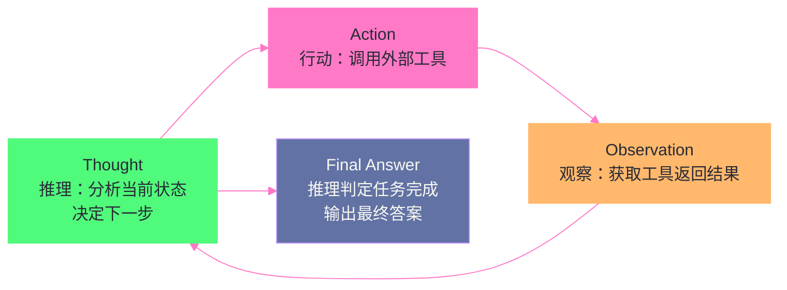
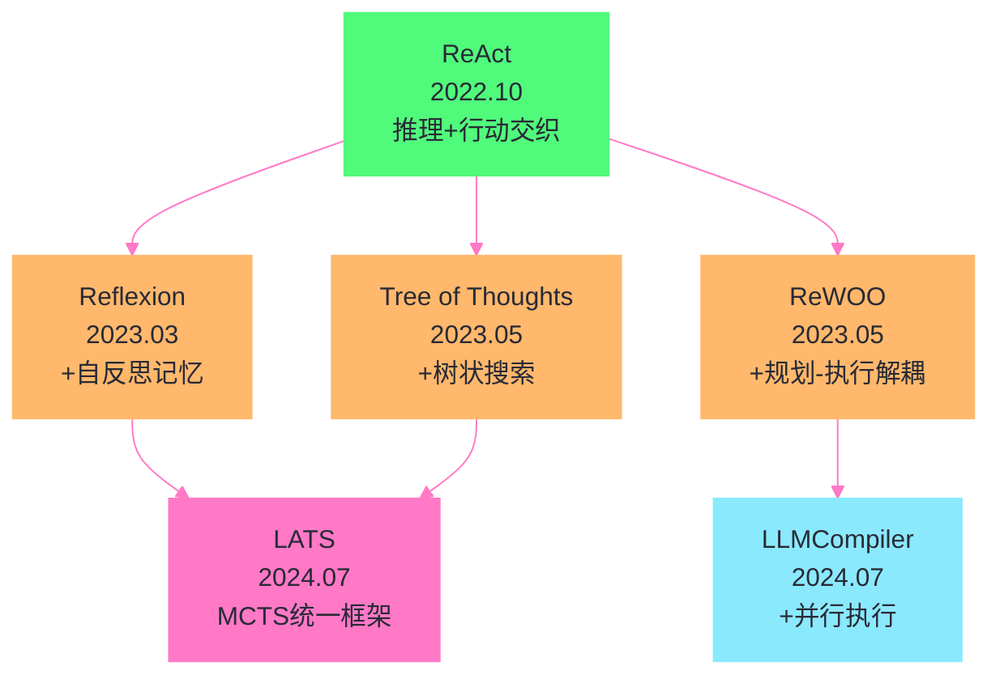
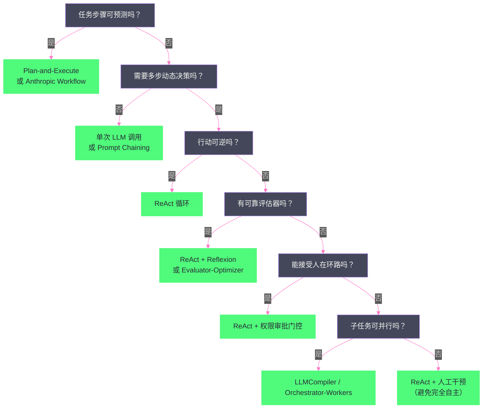

# 01 Agent 运行范式全景——从 ReAct 到 Production Agent 的演进

> [!abstract] 摘要
> 本文是"Coding Agent 运行范式与交互协议"专栏的开篇，目标是在读者脑中建立一张关于 AI Agent 运行范式的完整全景地图。文章从"Agent 和 Chatbot 的本质区别"切入，厘清为什么 LLM 单独不是 Agent、什么条件让一个 LLM 变成 Agent；然后以 ReAct（Reasoning + Acting）范式为锚点，系统梳理从 2022 年到 2025 年 Agent 范式的完整演进脉络：ReAct → Reflexion → Tree of Thoughts → ReWOO/Plan-and-Execute → LATS → LLMCompiler，每一种范式解决了前代的什么痛点、引入了什么新代价。最后落地到 2025 年的生产实践，剖析 LangGraph 1.0、CrewAI、AutoGPT Platform 三大主流框架各自选用了哪种范式、为什么这么选，以及 Anthropic 在"Building Effective Agents"中提出的 Workflow vs Agent 架构区分。核心认知：没有"最好的"Agent 范式，只有"最合适的"——任务的可分解性、对延迟的容忍度、token 成本约束，共同决定了你应该选用哪种范式。

---

## 第 1 章 什么是 Agent——从 Chatbot 到自主系统的跨越

### 1.1 LLM 单独不是 Agent

一个大型语言模型（LLM）本身，是一个"接收文本输入、产生文本输出"的函数。它没有记忆（每次调用独立）、没有行动能力（不能读写文件、不能执行命令、不能访问网络）、没有目标（不会主动决定下一步做什么）。把 GPT-4 或 Claude 放在一个聊天界面里，你得到的是一个 Chatbot——它能回答问题、生成文本，但它不会"做事"。

这个区分看似简单，但在 2023 年 AutoGPT 引爆全网时被大量混淆。很多人以为"让 GPT-4 自己跟自己对话循环"就是 Agent 了，结果发现生成的"自主任务"要么陷入空洞的自我对话，要么在第三四步就完全跑偏。问题的根源在于：**Agent 的核心不是"循环调用 LLM"，而是"LLM + 工具 + 循环 + 状态管理的有机组合"**。

### 1.2 Agent 的四个必要条件

要让一个 LLM 变成一个真正的 Agent，至少需要满足四个条件：

**条件一：推理能力（Reasoning）**。Agent 必须能够"思考"——分析当前状态、规划下一步行动、处理异常。这是 LLM 本身就具备的能力，通过 Chain-of-Thought（CoT）等提示技术可以激发出来。但单纯的推理不构成 Agent——一个只在脑子里想方案但不付诸行动的系统，最多是个顾问，不是执行者。

**条件二：行动能力（Acting）**。Agent 必须能够"做事"——调用外部工具、读写文件、执行命令、发起网络请求。这通过 Tool Use / Function Calling 实现，让 LLM 的输出不仅仅是文本，还可以是结构化的"行动指令"，由外部执行器（runtime）代为执行后将结果反馈给 LLM。

**条件三：循环控制（Loop）**。Agent 必须能够"持续运转"——不是一次性问答，而是在一个循环中不断"推理→行动→观察→再推理"，直到任务完成或主动终止。这个循环是 Agent 区别于单次 LLM 调用的本质特征。

**条件四：状态管理（State）**。Agent 必须能够"记住"——维护跨步骤的上下文状态，包括已完成的工作、待办的事项、中间结果、环境反馈。没有状态管理，Agent 每一步都从零开始，无法完成任何需要多步协作的复杂任务。

### 1.3 Anthropic 的定义：Workflow vs Agent

Anthropic 在 2024 年 12 月发布的"Building Effective Agents"一文中，给出了一个在工业界被广泛引用的架构区分：

> [!info] 核心概念：Workflow vs Agent
> **Workflows** are systems where LLMs and tools are orchestrated through predefined code paths.
> **Agents**, on the other hand, are systems where LLMs dynamically direct their own processes and tool usage, maintaining control over how they accomplish tasks.

这个区分的核心在于**控制流的归属**：在 Workflow 中，控制流由开发者预定义的代码路径决定——第几步调用哪个 LLM、第几步做什么检查、第几步合并结果，都是写死在代码里的；在 Agent 中，控制流由 LLM 自己决定——LLM 根据当前状态动态判断下一步做什么、调用什么工具、何时停止。

这个区分在工程实践中极其重要。Anthropic 在文中明确指出："最成功的实现不是使用复杂框架或专门库，而是使用简单、可组合的模式"。过度追求"完全自主的 Agent"往往导致不可控、不可调试、成本失控的系统；而在任务可预测的场景下，用 Workflow（预定义路径）反而更可靠、更经济。

> [!warning] 生产避坑：不要一上来就追求"完全自主 Agent"
> 很多团队在构建 Agent 系统时犯的第一个错误是：任务其实可以用一个简单的 Prompt Chaining Workflow 解决，却非要做成"LLM 自主决策下一步"的 Agent。结果是延迟翻倍、token 成本翻倍、调试困难，而任务完成质量并没有提升。正确做法是：从最简单的方案开始（甚至不要构建 Agent 系统），只在确实需要 LLM 动态决策时才引入 Agent 模式。

### 1.4 Agent 的五个层级

根据上述条件满足的程度，可以将"agentic 系统"分为五个层级，复杂度递增：

| 层级 | 名称 | 推理 | 行动 | 循环 | 状态 | 典型代表 |
| :--- | :--- | :---: | :---: | :---: | :---: | :--- |
| L0 | 单次 LLM 调用 | ✓ | ✗ | ✗ | ✗ | ChatGPT 问答 |
| L1 | LLM + 检索（RAG） | ✓ | ✓（检索） | ✗ | ✗ | 带知识库的问答 |
| L2 | Prompt Chaining | ✓ | ✓ | 固定路径 | 有限 | 多步文本处理流水线 |
| L3 | Workflow（预定义编排） | ✓ | ✓ | 条件分支 | 有 | Anthropic 的五种 Workflow 模式 |
| L4 | Agent（自主循环） | ✓ | ✓ | LLM 动态控制 | 有 | ReAct、Claude Code、Devin |

本专栏关注的"Coding/Terminal Agent"主要处于 L4 层级——LLM 自主决定读写哪些文件、执行哪些命令、何时提交代码。但实际生产系统往往是 L3 和 L4 的混合：在可预测的步骤上用 Workflow 保证可靠性，在需要动态决策的步骤上用 Agent 保证灵活性。

---

## 第 2 章 ReAct——一切范式的起点

### 2.1 ReAct 解决了什么问题

在 ReAct 出现之前，LLM 的"推理"和"行动"是分离的。Chain-of-Thought（CoT） prompting 让 LLM 展示推理过程来提升答案质量，但这种推理是"闭门造车"——LLM 只能基于自己预训练时学到的知识推理，无法在推理过程中获取新的外部信息。另一方面，早期的工具增强 LLM（如 WebGPT）可以让 LLM 调用外部工具，但调用逻辑是粗粒度的——先调工具拿数据，再基于数据生成回答，缺乏"推理过程中发现信息不足时主动调工具补充"的能力。

ReAct（Reasoning + Acting）的核心洞察是：**推理和行动应该交织进行，而不是分离执行**。LLM 在推理过程中可以随时"暂停"，调用外部工具获取信息（行动），拿到结果后继续推理。这种交织让 LLM 能够：

- **在推理中发现信息缺口时主动补充**：而不是一开始就猜测所有信息
- **根据外部反馈调整推理方向**：而不是固执地按预设路径走
- **生成人类可理解的任务解决轨迹**：每一步都有"为什么这么做"的推理记录

### 2.2 ReAct 的循环结构

ReAct 的运行循环可以概括为四个不断重复的步骤：



**Thought（推理）**：LLM 用自然语言"自言自语"，分析当前已有什么信息、还缺什么、下一步应该做什么。这是 ReAct 区别于纯工具调用的关键——每一步行动前都有明确的推理过程。

**Action（行动）**：LLM 输出一个结构化的行动指令，指定要调用哪个工具、传什么参数。行动指令由外部执行器（runtime）解析并执行。

**Observation（观察）**：执行器将工具执行的结果反馈给 LLM，成为下一轮推理的输入。

**Final Answer（最终答案）**：当 LLM 在 Thought 阶段判定任务已完成时，不再输出 Action 而是输出最终答案，循环终止。

### 2.3 ReAct 的 Prompt 模板

ReAct 原始论文使用的 few-shot prompt 模板大致如下：

```
Question: [任务描述]
Thought 1: [推理第一步——分析任务，决定第一个行动]
Action 1: [工具调用，如 Search("xxx")]
Observation 1: [工具返回结果]
Thought 2: [基于观察结果继续推理]
Action 2: [下一个工具调用]
Observation 2: [工具返回结果]
...
Thought N: [推理判定任务完成]
Action N: Finish([最终答案])
```

这个模板通过 few-shot examples 让 LLM 学会"Thought-Action-Observation"的交替格式。值得注意的是，ReAct 论文发表时（2022 年 10 月），OpenAI 的 Function Calling 还不存在——LLM 的"Action"是通过让 LLM 生成特定格式的文本（如 `Search["query"]`）来实现的，由外部代码解析这个文本并执行对应工具。这种"用文本格式编码结构化行动"的方式，在 Function Calling 出现后被更可靠的 JSON Schema 方式取代，但 ReAct 的"Thought-Action-Observation 交替循环"这一核心思想至今未变。

### 2.4 ReAct 的实验结果

ReAct 论文在四个任务上验证了范式有效性：

| 任务 | 评价指标 | ReAct | CoT（纯推理） | 提升 |
| :--- | :--- | :---: | :---: | :--- |
| HotpotQA（多跳问答） | Exact Match | 35% | 34% | +1%（但减少幻觉） |
| Fever（事实验证） | Accuracy | 64% | 56% | +8% |
| ALFWorld（交互决策） | Success Rate | 71% | N/A（不能行动） | +34%（vs 模仿学习） |
| WebShop（网页购物） | Score | 57% | N/A | +10%（vs 强化学习） |

在 HotpotQA 上 ReAct 相比 CoT 提升不大，但关键价值在于**减少了幻觉**——通过调用 Wikipedia API 获取真实信息，ReAct 不会像 CoT 那样编造事实。在 ALFWorld 和 WebShop 这两个需要与环境交互的决策任务上，ReAct 的优势更为显著，因为它能真正"行动"（操作环境）而不只是"推理"。

> [!note] 设计哲学：ReAct 的真正贡献不是"循环"
> 很多人把 ReAct 简单理解为"让 LLM 在循环里调工具"，但这错过了一个更重要的贡献：**推理过程的显式化**。在 ReAct 之前，LLM 调工具的行为是"黑箱"的——你不知道它为什么选择调这个工具、为什么传这些参数。ReAct 通过强制每一步行动前都有 Thought 推理记录，让 Agent 的决策过程变得可审计、可调试。这种"可解释性"在生产环境中极其重要——当 Agent 做了错误决策时，你可以回溯它的 Thought 链找到出错的那一步。

---

## 第 3 章 ReAct 的演进——五种范式如何各自解决 ReAct 的痛点

ReAct 是所有后续 Agent 范式的共同祖先，但它并不完美。2023-2024 年间，研究者从不同角度针对 ReAct 的局限性提出了改进方案，形成了 Agent 范式的演进树。

### 3.1 ReAct 的三大痛点

**痛点一：缺乏自反思——失败后不会总结教训**。ReAct 在每次任务中独立运行，如果这次失败了，下次面对类似任务时不会利用上次的失败经验。这就像一个不会从错误中学习的学生——每次考试都从零开始。

**痛点二：缺乏前瞻规划——每步只看眼前**。ReAct 是"走一步看一步"的范式，每一步的决策只基于当前状态，不做长远规划。对于需要多步协调的复杂任务（如"先部署再测试再回滚"），这种短视行为容易导致走到死胡同。

**痛点三：token 消耗随步数平方增长**。ReAct 的每一轮推理都需要把之前所有轮次的 Thought-Action-Observation 重新放入 prompt。一个 8 步任务，第 8 步的 prompt 包含了前 7 步的全部记录。这意味着 token 消耗大约是 O(n²) 的增长——步数翻倍，token 消耗接近四倍。这在生产环境中是一个严重的成本问题。

### 3.2 Reflexion——给 ReAct 加上自反思记忆

Reflexion（Shinn et al., NeurIPS 2023）针对痛点一，在 ReAct 基础上增加了一个**自反思循环**。

核心思想：Agent 执行完一轮 ReAct 任务后，如果失败了，让 LLM 用自然语言"反思"失败原因——"我在第三步选择了错误的搜索关键词，导致后续找不到正确信息"——然后将这段反思文本存入**情景记忆缓冲区（episodic memory buffer）**。下一轮尝试类似任务时，把之前的反思作为额外上下文注入 prompt，让 Agent 避免重复犯错。

关键特征：
- **不更新模型权重**：Reflexion 的"学习"是通过语言反馈实现的，不需要梯度更新，不需要训练数据，只需要 LLM 自己生成反思文本
- **跨试验的记忆持久性**：反思记忆在多次试验间持久存在，实现了一种"轻量级的强化学习"
- **HumanEval 91% pass@1**：相比 GPT-4 基线的 80%，提升了 11 个百分点

> [!info] 核心概念：语言反馈即强化学习
> Reflexion 的论文标题是"Language Agents with Verbal Reinforcement Learning"——用语言反馈做强化学习。传统 RL 通过梯度更新策略网络来学习，Reflexion 通过在 prompt 中添加反思文本来学习。两种方式的共同点是"从失败中改进"，但 Reflexion 的代价极低——不需要训练、不需要 GPU、不需要标注数据，只需要一次额外的 LLM 调用来生成反思。代价是：反思质量依赖 LLM 自身的分析能力，如果 LLM 无法准确诊断失败原因，反思可能无效甚至误导。

**Reflexion 的局限**：依赖可靠的评估器来判断"是否失败"。在某些任务中（如开放式创意任务），很难自动判断成功/失败，导致反思循环无法触发。此外，反思记忆 buffer 的大小有限，过多的反思可能引入噪音。

### 3.3 Tree of Thoughts——给 ReAct 加上搜索树

Tree of Thoughts（ToT，Yao et al., NeurIPS 2023）针对痛点二，将 ReAct 的线性推理路径扩展为**树状搜索**。

核心思想：在每一步推理时，不只生成一个 Thought，而是生成 k 个候选 Thought（分支），然后用一个评估函数给每个候选打分，选择最优的继续扩展。如果走到死胡同，可以回溯到上一个分叉点尝试其他路径。这本质上是将经典搜索算法（DFS/BFS）引入 LLM 推理过程。

在 Game of 24（用四个数字通过加减乘除得到 24）任务上，ToT 达到了 74% 的成功率，而 CoT 只有 4%——70 个百分点的提升极其惊人。但代价同样惊人：ToT 的 token 消耗是 CoT 的 10-100 倍，因为它需要为每一步生成多个候选并逐一评估。

> [!warning] 生产避坑：ToT 在现代推理模型下基本过时
> ToT 论文发表时（2023 年 5 月），GPT-4 还没有专门的推理模式。2024-2025 年随着 OpenAI o1/o3、DeepSeek-R1 等推理模型（reasoning model）的出现，LLM 已经能在内部隐式地做"搜索"——通过更长的隐式 CoT 来探索多条路径，而不需要外部显式的树搜索框架。ToT 的核心价值（让 LLM 做搜索）被推理模型的内置能力部分取代了。在 2025 年的生产环境中，直接用推理模型 + ReAct 往往比 ToT 更经济、更简单。但 ToT 的思想（多路径探索 + 评估 + 回溯）对理解 Agent 范式的演进仍有重要价值。

### 3.4 ReWOO / Plan-and-Execute——给 ReAct 加上前置规划

ReWOO（Reasoning WithOut Observation，Xu et al., 2023）针对痛点三，提出了一个激进的改进：**把推理和观察彻底解耦**。

核心思想：ReAct 的每一轮推理都需要看到前一轮的 Observation，这是 token 平方增长的根源。ReWOO 的方案是——在任务开始时，LLM 一次性生成一个**完整的执行计划**（Plan），计划中用占位符引用前序步骤的结果（如 `#E1`、`#E2`），然后按计划依次执行工具调用，用实际结果替换占位符，最后由 LLM 汇总所有结果生成最终答案。

三个阶段：
1. **Planner**：LLM 一次性生成完整计划，包含所有工具调用和占位符
2. **Worker**：按计划依次执行工具调用，用实际结果替换占位符
3. **Solver**：LLM 读取完整的执行轨迹，生成最终答案

关键优势：Planner 生成计划时不需要看到任何 Observation，因此 prompt 中不需要包含历史 Observation，token 消耗大幅降低。ReWOO 论文报告在 HotpotQA 上实现了 **5 倍的 token 效率提升和 4% 的准确率提升**。

ReWOO 是 Plan-and-Execute 范式的典型代表。Anthropic 在"Building Effective Agents"中提到的 Orchestrator-Workers 模式，本质上也是一种 Plan-and-Execute：Orchestrator（规划器）分析任务并决定需要哪些子任务，Workers（执行器）各自执行分配的子任务。

> [!info] 核心概念：ReWOO 的占位符机制
> ReWOO 的精妙之处在于占位符。计划可能长这样：
> ```
> Plan:
> #E1 = Search("Paris population")
> #E2 = Search("Tokyo population")
> #E3 = Compare(#E1, #E2)
> ```
> Planner 生成这个计划时不需要知道 Paris 和 Tokyo 的实际人口数字——它只需要知道"先查巴黎、再查东京、然后比较"。Worker 执行时，`#E1` 被替换为"2.1M"，`#E2` 被替换为"13.9M"。Solver 读取替换后的完整轨迹，得出"东京人口大于巴黎"的最终答案。这种"先规划数据流、再填充数据"的思路，与经典编译器中"先生成 IR 再绑定地址"的设计一脉相承。

**Plan-and-Execute 的局限**：计划在任务开始时一次性生成，执行期间如果环境发生变化（如某个工具返回意外结果），原计划可能失效。ReAct 的优势恰恰在这里——它每一步都能根据最新的 Observation 调整方向。Plan-and-Execute 适合"任务结构可预测"的场景，不适合"执行过程中需要频繁调整方向"的场景。

### 3.5 LATS——统一推理、行动与规划

LATS（Language Agent Tree Search，Zhou et al., ICML 2024）是 ReAct 演进谱系中最"重量级"的范式，它将 ReAct（推理+行动）、Reflexion（自反思）和 ToT（树搜索）三种能力统一在一个框架中。

核心思想：将蒙特卡洛树搜索（MCTS）引入 Agent 的决策过程。Agent 不再走一条线性路径，而是在一棵搜索树上探索——每个节点是一次 ReAct 步骤，LLM 充当价值函数评估节点质量，用自反思指导探索方向，通过 MCTS 的选择-扩展-评估-回溯四步循环找到最优行动路径。

LATS 在 HumanEval 上用 GPT-4 达到了 **92.7% pass@1**（论文项目页甚至报告了 94.4%），在 WebShop 上用 GPT-3.5 达到了 75.9 分（媲美梯度微调方法）。这些数字在当时都是 SOTA。

但 LATS 的复杂度也是所有范式中最高的——它需要多次 LLM 调用来扩展节点、评估价值、生成反思，一个任务的 LLM 调用次数可能是 ReAct 的 10 倍以上。

> [!note] 设计哲学：LATS 在学术界与工业界的割裂
> LATS 在学术论文中表现优异，但在 2025 年的生产环境中几乎无人使用。原因很简单：LATS 的计算成本和延迟对生产系统来说不可接受。一个 Coding Agent 修改代码，用 ReAct 可能需要 5 次 LLM 调用，用 LATS 可能需要 50 次——用户不会为了"理论上更好的代码"等 10 倍的时间。LATS 的价值在于证明了"推理+行动+规划"的统一框架可以显著提升 Agent 性能，为未来的高效近似算法提供了上限参考。但作为工程方案，它更适合"离线任务质量优化"而非"在线实时交互"。

### 3.6 LLMCompiler——给 ReAct 加上并行执行

LLMCompiler（Kim et al., ICML 2024）从另一个角度解决 ReAct 的效率问题：不是减少推理次数，而是**让多个工具调用并行执行**。

核心思想：ReAct 的工具调用是严格串行的——调用工具 A，等结果，再调用工具 B。但如果工具 A 和 B 之间没有数据依赖，完全可以并行调用。LLMCompiler 借鉴经典编译器的思想，用三个组件实现并行：

1. **Function Calling Planner**：LLM 一次性生成一个 DAG（有向无环图）执行计划，图中的边表示数据依赖
2. **Task Fetching Unit**：调度器，按 DAG 拓扑序分发任务，无依赖的任务并行分发
3. **Executor**：并行执行多个工具调用

LLMCompiler 报告了相比 ReAct **3.7 倍的延迟加速、6.7 倍的成本节省和 9% 的准确率提升**。它本质上是 ReWOO/Plan-and-Execute 的"并行版"——不只是先规划再执行，还在执行阶段自动并行化无依赖的步骤。

### 3.7 范式演进全景对比

| 范式 | 提出时间 | 核心改进 | 解决的痛点 | 新引入的代价 | 适用场景 |
| :--- | :--- | :--- | :--- | :--- | :--- |
| **ReAct** | 2022.10 | 推理+行动交织 | LLM 无法在推理中获取外部信息 | token O(n²) 增长 | 动态实时任务 |
| **Reflexion** | 2023.03 | 自反思记忆 | 失败后不会总结教训 | 依赖可靠评估器 | 可重试任务 |
| **ToT** | 2023.05 | 树状搜索 | 缺乏前瞻规划 | 10-100x token | 组合搜索问题 |
| **ReWOO** | 2023.05 | 规划-执行解耦 | token 平方增长 | 计划不能动态调整 | 结构可预测任务 |
| **LATS** | 2024.07 | MCTS 统一框架 | 推理+行动+规划割裂 | 极高计算成本 | 离线质量优化 |
| **LLMCompiler** | 2024.07 | 并行函数调用 | 串行执行延迟高 | 需要识别依赖关系 | 多独立工具调用 |



---

## 第 4 章 Anthropic 的五种 Workflow 模式

在进入"生产框架如何选用范式"之前，需要先了解 Anthropic 在"Building Effective Agents"中提出的五种 Workflow 模式。这些模式不是"Agent 范式"（它们是预定义路径的 Workflow，不是 LLM 自主控制的 Agent），但它们是构建复杂 Agent 系统的基本积木——生产中的 Agent 往往是这些 Workflow 模式与 ReAct 循环的组合。

### 4.1 Prompt Chaining——串行流水线

将任务分解为一系列步骤，每一步的 LLM 调用处理上一步的输出。可以在中间步骤加入程序化检查门控，确保流程仍在正轨。

**适用场景**：任务可以干净地分解为固定子任务。如"生成营销文案 → 翻译成另一种语言"、"写文档大纲 → 检查大纲 → 基于大纲写正文"。

**本质**：这是最简单的 Workflow，没有工具调用，没有循环，只有 LLM 的串行链式调用。它是 Plan-and-Execute 的退化形式——计划是固定的，不需要 LLM 动态规划。

### 4.2 Routing——分类分发

对输入进行分类，路由到专门的后续处理流程。

**适用场景**：任务有明确分类，不同类别适合不同处理方式。如"客服查询路由：一般问题/退款请求/技术支持 → 不同 prompt 和工具"、"简单问题路由到 Haiku，复杂问题路由到 Sonnet"。

**本质**：这是 if-else 分支的 LLM 版——用一个 LLM 调用做分类，然后按分类结果走不同路径。

### 4.3 Parallelization——并行执行

让多个 LLM 同时处理任务，输出由程序聚合。两种变体：
- **Sectioning**：将任务拆成独立子任务并行运行
- **Voting**：同一任务运行多次，取多数票或综合结果

**适用场景**：子任务可并行化加速，或需要多视角提高置信度。如"一个 LLM 处理用户查询，另一个并行审查是否包含不当内容"、"多个 prompt 从不同角度审查代码漏洞"。

### 4.4 Orchestrator-Workers——动态分发

中央 LLM 动态分解任务、分派给 Worker LLM、汇总结果。

**适用场景**：子任务不可预先确定的复杂任务。如"代码变更涉及多少文件、每个文件改什么，取决于具体任务"。

**本质**：这就是 Plan-and-Execute 范式的 Workflow 化——Orchestrator 做规划，Workers 做执行。它与简单 Parallelization 的关键区别是灵活性：子任务不是预定义的，而是 Orchestrator 根据具体输入动态决定的。

### 4.5 Evaluator-Optimizer——评估迭代

一个 LLM 生成响应，另一个 LLM 评估并给出反馈，形成迭代循环。

**适用场景**：有明确评估标准、迭代可带来可衡量改进。如"文学翻译——翻译 LLM 可能遗漏细微差异，评估 LLM 提供改进反馈"。

**本质**：这是 Reflexion 的 Workflow 化——但 Reflexion 是跨试验的反思，Evaluator-Optimizer 是单次任务内的迭代精炼。

### 4.6 五种模式与 Agent 范式的关系

| Anthropic Workflow 模式 | 对应的 Agent 范式 | 控制流归属 |
| :--- | :--- | :--- |
| Prompt Chaining | Plan-and-Execute（退化版） | 预定义代码 |
| Routing | N/A（分类分发） | 预定义代码 |
| Parallelization | LLMCompiler（简化版） | 预定义代码 |
| Orchestrator-Workers | Plan-and-Execute | LLM 动态决策（仅规划阶段） |
| Evaluator-Optimizer | Reflexion（单任务版） | 预定义循环 |
| 真正的 Agent | ReAct + 上述模式的组合 | LLM 全程动态控制 |

> [!note] 设计哲学：从简单到复杂的递进
> Anthropic 的五种模式按复杂度递增排列：Prompt Chaining（最简单）→ Routing → Parallelization → Orchinator-Workers → Evaluator-Optimizer → Agent（最复杂）。这个递进不是"越复杂越好"，而是"需要时才升级"。很多生产场景下，Prompt Chaining 或 Routing 就够了，不需要 Orchestrator-Workers，更不需要完整的 Agent 循环。选择模式的决策树是：**任务能拆成固定步骤吗？→ 能：用 Prompt Chaining；不能：子任务可预测吗？→ 可预测：用 Orchestrator-Workers；不可预测：用 Agent。**

---

## 第 5 章 2025 年生产框架的范式选择

### 5.1 LangGraph 1.0——图执行模型的状态化 Agent

LangGraph 于 2025 年 10 月 22 日正式发布 1.0 GA 版本，成为"持久化 Agent 框架"领域的第一个稳定主版本。在 1.0 之前，LangGraph 已经在 Uber、LinkedIn、Klarna 等公司的生产环境中运行了一年多。

LangGraph 的核心抽象是**有向图（directed graph）**：
- **State**：在图中流动的类型化状态对象
- **Nodes**：节点，每个节点是一个函数，接收 State、返回更新后的 State
- **Edges**：边，定义节点间的转移，支持条件分支和循环

这个抽象极其通用——ReAct 循环可以表示为一个包含"推理节点"和"行动节点"的双节点循环图；Plan-and-Execute 可以表示为一个"规划节点"后接多个"执行节点"的 DAG；Reflexion 可以表示为在 ReAct 循环外加一层"反思节点"。

LangGraph 1.0 的关键生产特性：
- **Durable State**：Agent 执行状态自动持久化，服务器重启或长时任务中断后可以精确恢复
- **Built-in Persistence**：无需自定义数据库逻辑即可保存和恢复 Agent 工作流，支持多日审批流程和跨会话后台任务
- **Human-in-the-loop**：一等公民支持人工审查、修改或批准 Agent 操作
- **Graph-based Execution**：对混合确定性和 agentic 组件的复杂工作流提供细粒度控制

LangGraph 1.0 中 `create_react_agent` 预构建已被废弃，改为 LangChain v1 的 `create_agent` 函数（基于 LangGraph 运行时），这标志着从"ReAct 专用预构建"向"通用图编排"的演进——ReAct 不再是特殊范式，而是图模型的一种实例化。

> [!info] 核心概念：LangGraph 的图模型为什么重要
> 传统 Agent 框架（如早期的 LangChain Agent）把 Agent 实现为一个固定的 while 循环：`while not done: thought = llm(history); action = parse(thought); obs = execute(action); history.append(...)`。这种固定循环的问题在于：你无法在中间插入"程序化检查门控"、无法做条件分支、无法并行执行、无法持久化中间状态。LangGraph 用图模型替代固定循环——你可以画任意拓扑的图来编排 Agent 的行为，分支、循环、并行、持久化都是图的一等公民。这种灵活性让 LangGraph 成为"需要精细控制的生产 Agent"的首选框架。

### 5.2 CrewAI——角色驱动的多 Agent 协作

CrewAI 采用了与 LangGraph 完全不同的设计哲学——不提供图执行模型，而是用**团队隐喻**来组织多 Agent 协作。

核心概念：
- **Agent**：每个 Agent 有 `role`（角色，如"资深数据科学家"）、`goal`（目标）、`backstory`（背景故事），这些属性影响 LLM 的行为
- **Task**：每个 Task 有描述、预期输出、负责的 Agent
- **Crew**：多个 Agent + 多个 Task 组成一个 Crew，按顺序或并行执行

CrewAI 的范式本质上是 **Orchestrator-Workers 的角色化包装**——用户预先定义好"团队"的结构（谁做什么、按什么顺序），CrewAI 负责编排执行。它支持 `planning=True` 参数启用 Plan-and-Execute 变体（Agent 先生成计划再执行），但默认模式下更接近预定义的串行/并行 Workflow。

CrewAI 的定位很明确：**快速原型多 Agent 团队，最小化样板代码**。截至 2025 年，超过 10 万开发者通过社区课程获得 CrewAI 认证，月执行量超 1000 万次。

> [!warning] 生产避坑：CrewAI 的"多 Agent"可能只是多次 LLM 调用
> CrewAI 的角色定义（role/goal/backstory）会让每次 LLM 调用使用不同的 system prompt，给人"多个不同 Agent 在协作"的感觉。但如果所有 Agent 共用同一个 LLM 模型，它们之间的区别仅在于 prompt 不同——本质上是同一个 LLM 在扮演不同角色。这在很多场景下足够用（角色化 prompt 确实能引导 LLM 产出不同视角的内容），但不要误以为你在运行多个"独立的智能体"。真正的多 Agent 系统需要每个 Agent 有独立的工具集、独立的记忆、独立的决策边界——这正是 [[LLM/Agent开发技术/08 多 Agent 系统与 A2A 协议——协作、通信与特化|本专栏第八篇]] 讨论的主题。

### 5.3 AutoGPT Platform——从 CLI 实验到可视化平台

AutoGPT 是 2023 年 3 月引爆全网自主 Agent 热潮的项目——一个让 GPT-4 自主循环调用来完成目标的 CLI 脚本，以 175K GitHub Stars 的速度创造了历史记录。但早期的 AutoGPT CLI 存在严重问题：开放式循环导致 Agent 经常跑偏、无法预测、成本失控。

到 2025-2026 年，AutoGPT 已经从 CLI 脚本演进为**可视化平台**，包含四个界面：
- **AutoPilot**：用自然语言描述任务，自动转化为可运行的 Agent
- **Agents**：查看所有 Agent 的运行状态、成本、需要关注的操作
- **Marketplace**：从社区分享的预构建 Agent 开始，类似 WordPress 插件目录
- **Build**：拖拽式可视化工作流编辑器，连接 blocks 精确控制每一步

AutoGPT Platform 的核心是**基于 block 的 DAG 执行模型**——Agent 被定义为有向无环图，每个节点是一个 block（自包含的功能单元，有类型化的输入输出）。这本质上是 LLMCompiler 的产品化——自动识别哪些步骤可以并行、哪些有依赖关系需要串行。

AutoGPT 的演进路径揭示了一个重要趋势：**从"开放式自主循环"回归"结构化可控执行"**。早期 AutoGPT 让 LLM 完全自主决策下一步做什么，结果发现可控性和可预测性太差。新平台通过可视化 DAG 编辑器，让人类在"LLM 自主性"和"结构化控制"之间找到平衡。

### 5.4 三大框架的范式选择对比

| 维度 | LangGraph 1.0 | CrewAI | AutoGPT Platform |
| :--- | :--- | :--- | :--- |
| **底层范式** | 图执行模型（可实例化为任意范式） | Orchestrator-Workers（角色化） | DAG 并行执行（LLMCompiler 产品化） |
| **ReAct 支持** | `create_agent` 内置 ReAct 循环 | 可实现但非默认 | 非核心（偏向结构化工作流） |
| **Plan-and-Execute** | 图模型自然支持 | `planning=True` 参数 | DAG 编辑器本质就是 Plan |
| **并行执行** | 图中可定义并行节点 | 支持 Task 并行 | DAG 自动并行化 |
| **状态持久化** | Durable State（一等公民） | 有记忆但非核心 | 平台托管状态 |
| **Human-in-the-loop** | 一等公民支持 | 有但需自定义 | 通过审批 block 支持 |
| **适用场景** | 需要精细控制的复杂生产 Agent | 快速原型多角色协作 | 非开发者构建自动化工作流 |
| **控制粒度** | 最细（图节点级） | 中等（Agent/Task 级） | 最粗（Block 级，面向可视化） |
| **目标用户** | 工程师 | 工程师/快速原型者 | 非开发者/自动化爱好者 |

> [!note] 设计哲学：范式选择不是技术问题，是约束问题
> 三个框架的选择，本质上是三个约束的权衡：
> 1. **任务可分解性**：任务能预先拆成固定步骤吗？能 → AutoGPT 的 DAG；不能 → LangGraph 的动态图
> 2. **延迟容忍度**：用户能等多久？秒级 → 避免复杂 Agent 循环；分钟级 → 可以用 ReAct + Reflexion
> 3. **token 成本约束**：每次调用的预算是多少？紧张 → Plan-and-Execute/LLMCompiler；宽裕 → ReAct/LATS
>
> 没有框架是"万能的"——LangGraph 灵活但学习曲线陡峭，CrewAI 简单但控制粒度粗，AutoGPT Platform 易用但灵活性最低。选择哪个，取决于你的具体约束组合。

---

## 第 6 章 从范式到实践——Coding Agent 的特殊约束

### 6.1 Coding Agent 与通用 Agent 的差异

本专栏关注的是 Coding/Terminal Agent——Claude Code、Devin、OpenHands、Cursor 这类能读写文件、执行命令、操作 Git 的 Agent。它们在范式选择上有一些与通用 Agent（如客服 Agent、搜索 Agent）不同的特殊约束：

**约束一：行动的不可逆性**。通用 Agent 调一个搜索工具，结果不对再调一次就行——行动是可逆的。但 Coding Agent 执行了 `rm -rf /` 或 `git push --force`，后果不可逆。这意味着 Coding Agent 必须有更严格的权限控制和人在环路审批机制。本专栏第 12 篇将深入讨论这一主题。

**约束二：长时任务的上下文管理**。Coding Agent 可能需要连续工作数小时——读几十个文件、执行上百条命令、做多次代码修改。这么多操作产生的 Observation 会迅速撑爆 LLM 的上下文窗口。Context Engineering（本专栏第 6 篇）成为 Coding Agent 的核心技术挑战。

**约束三：工具接口设计的认知友好性**。Coding Agent 的工具接口（Tool Schema）需要为 LLM 的认知模式优化，而不是为人类优化。Devin 团队提出的 ACI（Agent Computer Interface）概念（本专栏第 8 篇）专门研究这个问题——同样的 LLM，用不同的工具接口设计，性能可以从接近零提升到 SOTA。

**约束四：沙箱隔离的安全需求**。Coding Agent 执行的代码可能来自用户、可能来自 LLM 生成、甚至可能来自被 Prompt Injection 污染的恶意指令。Agent 必须在隔离的沙箱中执行代码，防止逃逸危害宿主系统。这是姊妹专栏 [[云原生/Agent沙箱与隔离技术/00 专栏导览|Agent 沙箱与隔离技术]] 的主题。

### 6.2 Coding Agent 的范式选择

基于上述约束，2025 年的主流 Coding Agent 在范式选择上呈现出一些共性：

**Claude Code**：核心使用 ReAct 循环（Thought → Tool Call → Observation → Thought），但通过 Subagent 机制实现了类 Orchestrator-Workers 模式——主 Agent 可以委派子任务给拥有独立上下文窗口的 Subagent（本专栏第 7 篇详解）。

**Devin**：采用长时规划 + ReAct 执行的混合模式。Devin 会在任务开始时做详细的 Interactive Planning（规划阶段），然后进入 ReAct 循环执行（执行阶段），并在执行过程中根据反馈调整计划（本专栏第 8 篇详解）。

**OpenHands**：使用 Event Stream 架构记录所有 action 和 observation，Agent 的 `step(state) → action` 函数本质上是 ReAct 的单步执行。Runtime 是一个 per-session 的 Docker 沙箱（本专栏第 9 篇详解）。

**Cursor**：采用 Agent Swarm 架构——Planner agents（强模型）拆分目标并委派，Worker agents（快模型）执行具体任务。这本质上是 Orchestrator-Workers 的多层级联（本专栏第 10 篇详解）。

**Aider**：单进程 ReAct，但通过 Architect/Editor Pattern 实现了 Plan-and-Execute 的变体——主模型作为 Architect 生成高层规划，Editor 模型负责具体代码修改（本专栏第 9 篇详解）。

### 6.3 范式选择的决策树

基于上述实践，可以为 Coding Agent 的范式选择提炼一个决策树：



---

## 第 7 章 总结与专栏导读

### 7.1 全景回顾

从 ReAct 到 2025 年的生产 Agent，范式的演进呈现出清晰的逻辑主线：

1. **ReAct（2022）** 建立了"推理+行动交织"的基本范式，是所有后续工作的起点
2. **Reflexion（2023）** 给 ReAct 加上了跨试验的自反思记忆
3. **Tree of Thoughts（2023）** 给 ReAct 加上了树状搜索，但被推理模型部分取代
4. **ReWOO/Plan-and-Execute（2023）** 通过规划-执行解耦解决了 token 平方增长
5. **LATS（2024）** 统一了推理+行动+规划，但计算成本过高难以用于生产
6. **LLMCompiler（2024）** 给 ReAct 加上了并行执行
7. **生产框架（2025）** 将上述范式产品化：LangGraph 用图模型通用化、CrewAI 用角色化简化、AutoGPT 用可视化民主化

贯穿始终的一个核心认知：**没有"最好的"范式，只有"最合适的"权衡**。ReAct 的灵活性 vs Plan-and-Execute 的效率、Reflexion 的学习 vs ToT 的搜索、LATS 的质量 vs LLMCompiler 的速度——每一个选择都是在"灵活性、效率、质量、成本"四个维度间的取舍。

### 7.2 专栏后续导读

本篇建立了 Agent 范式的全景地图，后续文章将逐一深入各个主题：

- **第 2 篇** 将深入 ReAct 的内部机制——prompt 模板设计、循环控制、失败模式分析
- **第 3 篇** 将对比 OpenAI/Anthropic/Gemini 三家的 Function Calling 规范，理解 Tool Use 的工程化
- **第 4-5 篇** 将深入 MCP 协议——Agent 与工具的标准化连接
- **第 6 篇** 将讨论 Context Engineering——长时 Coding Agent 的上下文管理艺术
- **第 7-10 篇** 将逐一解构 Claude Code、Devin、OpenHands/Aider、Cursor 的架构
- **第 11-12 篇** 将讨论 Agent 与操作系统的交互接口和权限审批模型

> [!info] 专栏导航
> 本文是 [[00 专栏导览|Coding Agent 运行范式专栏]] 的第 1 篇。下一篇 [[02 ReAct 架构深度解析——Thought-Action-Observation 循环的本质]] 将深入 ReAct 的单步机制，剖析 Thought 如何引导 Action、Observation 如何反馈 Thought、循环何时终止、什么情况下会失败。理解了 ReAct 的内部细节，才能理解为什么 Claude Code、Devin 等 Coding Agent 都以 ReAct 为基础循环。

---

## 参考文献

1. Yao, S. et al. "ReAct: Synergizing Reasoning and Acting in Language Models." ICLR 2023. https://arxiv.org/abs/2210.03629
2. Shinn, N. et al. "Reflexion: Language Agents with Verbal Reinforcement Learning." NeurIPS 2023. https://arxiv.org/abs/2303.11366
3. Yao, S. et al. "Tree of Thoughts: Deliberate Problem Solving with Large Language Models." NeurIPS 2023. https://arxiv.org/abs/2305.10601
4. Xu, B. et al. "ReWOO: Decoupling Reasoning from Observations for Efficient Augmented Language Models." 2023. https://arxiv.org/abs/2305.18323
5. Zhou, A. et al. "Language Agent Tree Search Unifies Reasoning, Acting, and Planning in Language Models." ICML 2024. https://proceedings.mlr.press/v235/zhou24r.html
6. Kim, S. et al. "An LLM Compiler for Parallel Function Calling." ICML 2024. https://proceedings.mlr.press/v235/kim24y.html
7. Schluntz, E. & Zhang, B. "Building Effective Agents." Anthropic Engineering Blog, 2024-12-19. https://www.anthropic.com/engineering/building-effective-agents
8. LangChain. "LangChain and LangGraph Agent Frameworks Reach v1.0 Milestones." 2025-10-22. https://www.langchain.com/blog/langchain-langgraph-1dot0
9. CrewAI. GitHub Repository. https://github.com/crewaiinc/crewai
10. AutoGPT. GitHub Repository. https://github.com/Significant-Gravitas/AutoGPT

---

## 思考题

1. **如果一个 Coding Agent 的任务是"修复一个已知 bug"，你会选择 ReAct 还是 Plan-and-Execute？为什么？** 提示：考虑"修复 bug"的过程是否可预测——你能预先列出所有步骤吗？

2. **ReWOO 在 HotpotQA 上实现了 5 倍 token 效率提升，但为什么 2025 年的主流 Coding Agent（如 Claude Code）仍然使用 ReAct 而非 ReWOO？** 提示：考虑 Coding Agent 的执行过程中环境是否变化——文件修改后，后续步骤的依赖关系是否可能改变？

3. **Anthropic 说"最成功的实现使用简单、可组合的模式而非复杂框架"。但 LangGraph 1.0 是一个相当复杂的框架。这两者矛盾吗？** 提示：考虑"框架复杂"和"使用方式简单"是否可以共存——LangGraph 的图模型是否让"简单模式的组合"变得更容易？
