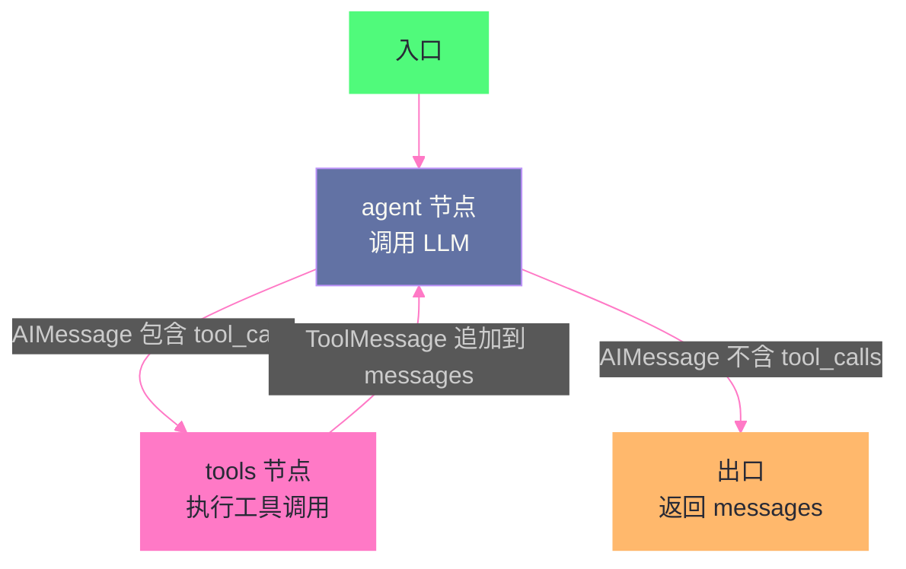

# 02 ReAct 架构深度解析——Thought-Action-Observation 循环的本质

> [!abstract] 摘要
> 上一篇 [[01 Agent 运行范式全景——从 ReAct 到 Production Agent 的演进]] 建立了 Agent 范式的全景地图，本文则放大焦距，深入 ReAct 循环的内部机制。ReAct 的"Thought → Action → Observation"三步循环看似简单，但在生产环境中隐藏着大量工程细节：prompt 模板如何设计才能让 LLM 稳定输出正确格式？循环何时终止——靠 stop sequence、靠 stop_reason、还是靠迭代上限？Action 从"自由文本解析"演变为"Function Calling JSON Schema"后，ReAct 的可靠性提升了多少？ Observation 太长如何毒化上下文导致推理漂移？无限循环、参数幻觉、工具误用三大失败模式的根因是什么、如何用拦截器防治？本文从 ReAct 原始论文的 prompt 设计出发，逐一拆解这些工程细节，最后落地到 Anthropic Claude API 的 tool use agentic loop 和 LangGraph `create_react_agent` 的生产实现，揭示"从论文到生产"之间那些不写在论文里但决定了系统能否上线的工程决策。

---

## 第 1 章 ReAct 的 Prompt 工程——让 LLM 学会"想一步做一步"

### 1.1 原始论文的 Prompt 模板

ReAct 论文（Yao et al., ICLR 2023）使用的 prompt 是 few-shot 格式——在 prompt 中提供几个手写的"Thought-Action-Observation"轨迹示例，让 LLM 通过 in-context learning 学会这种交替格式。

以 HotpotQA 任务为例，ReAct 的 prompt 结构如下：

```
Solve a question answering task with interleaving Thought, Action, Observation steps.
Thought can reason about the current situation, and Action can be three types:
(1) Search[entity], which searches the exact entity on Wikipedia and returns
    the first paragraph if it exists.
(2) Lookup[string], which finds the next sentence containing string.
(3) Finish[answer], which finishes the task with answer.

Question: What is the elevation range for the area that the eastern sector
of the Colorado orogeny extends into?
Thought 1: I need to search Colorado orogeny, find the area that the eastern
sector of the Colorado orogeny extends into, then find the elevation range
of the area.
Action 1: Search[Colorado orogeny]
Observation 1: The Colorado orogeny was an episode of mountain building in
Colorado and surrounding areas.
Thought 2: It does not mention the eastern sector. So I need to look up
eastern sector.
Action 2: Lookup[eastern sector]
Observation 2: The eastern sector extends into the High Plains and is called
the Central Plains orogeny.
Thought 3: The eastern sector of Colorado orogeny extends into the High Plains.
So I need to search High Plains and find its elevation range.
Action 3: Search[High Plains]
Observation 3: High Plains refers to one of two distinct land regions...
Thought 4: High Plains rise from around 1800 to 7000 feet. So the answer is
approximately 1800 to 7000 feet.
Action 4: Finish[approximately 1800 to 7000 feet]
```

这个 prompt 有几个关键设计决策值得逐一分析。

### 1.2 Thought 的六种功能

ReAct 论文中，few-shot 示例的 Thought 不是随意的"自言自语"，而是有意识地展示六种不同的推理功能：

| Thought 功能 | 示例 | 解决什么问题 |
| :--- | :--- | :--- |
| **问题分解** | "I need to search X, find Y, then find Z" | 将复杂问题拆成可执行的子步骤 |
| **信息提取** | "X was started in 1844" | 从 Observation 中提取关键事实 |
| **常识推理** | "X is not Y, so Z must instead be..." | 基于 Observation 做推断 |
| **算术推理** | "1844 < 1989" | 执行数值比较/计算 |
| **搜索重定向** | "Maybe I can search/look up X instead" | 发现当前方向走不通时转向 |
| **答案综合** | "...so the answer is X" | 汇总所有信息得出最终答案 |

这六种功能覆盖了一个完整推理循环所需的所有认知操作。在设计 ReAct 的 few-shot 示例时，**确保示例覆盖所有六种 Thought 功能**是 prompt 质量的关键——如果示例只展示了"问题分解"和"搜索"两种 Thought，LLM 在实际运行中可能不知道如何在 Observation 不符合预期时做"搜索重定向"，导致在死胡同里反复尝试同一搜索词。

> [!info] 核心概念：Thought 不是"解释"，是"推理"
> 很多开发者误解了 Thought 的作用——以为 Thought 是给人类看的"解释说明"。实际上，Thought 是 LLM 给自己的推理脚手架：它通过显式地写出推理过程，帮助自己在下一步做出更准确的决策。这和 Chain-of-Thought 的原理一致——显式推理比隐式推理更准确，因为 LLM 的自回归生成机制意味着每一步的输出都会影响下一步的生成。Thought 的存在让"推理"成为上下文的一部分，引导 LLM 生成更合理的 Action。如果去掉 Thought 直接让 LLM 输出 Action，准确率会显著下降——ReAct 论文的消融实验证实了这一点。

### 1.3 Action 的格式——从文本解析到 Function Calling

ReAct 论文发表时（2022 年 10 月），OpenAI 的 Function Calling 还不存在。Action 的格式是**自由文本**——LLM 生成 `Search[Colorado orogeny]` 这样的文本，外部代码用正则表达式或字符串解析提取工具名和参数。

```python
# ReAct 原始论文的 Action 解析方式（伪代码）
import re

def parse_action(text):
    """从 LLM 输出中解析 Action"""
    match = re.match(r'(\w+)\[(.+)\]', text)
    if match:
        tool_name = match.group(1)  # "Search"
        tool_arg = match.group(2)   # "Colorado orogeny"
        return tool_name, tool_arg
    return None, None
```

这种文本解析方式有三个问题：

**问题一：格式不稳定**。LLM 可能生成 `Search("Colorado orogeny")`（用引号而非方括号）、`search[Colorado orogeny]`（大小写不同）、甚至 `Action: Search Colorado orogeny`（格式完全偏离）。每一种偏差都需要写正则来兜底，解析逻辑越来越脆弱。

**问题二：参数幻觉**。LLM 可能生成 `Search[Mathematical definition of orogeny]`——工具名正确，但参数是一个 LLM 编造的、Wikipedia 中不存在的词条。这种"参数幻觉"比"工具名幻觉"更难检测，因为工具名可以对照预定义列表验证，参数却需要实际执行后才知道是否有效。

**问题三：多参数工具难以表达**。`Search[entity]` 只有一个参数，文本格式勉强够用。但如果一个工具需要三个参数（如 `create_event[title, start, end]`），用方括号文本格式表达就极其笨拙且容易出错。

2023 年 6 月 OpenAI 发布 Function Calling 后，这些问题被结构化的 JSON Schema 方案系统性解决。LLM 不再生成自由文本的 Action，而是生成一个结构化的 JSON 对象：

```json
{
  "tool_calls": [
    {
      "id": "call_abc123",
      "type": "function",
      "function": {
        "name": "search",
        "arguments": "{\"entity\": \"Colorado orogeny\"}"
      }
    }
  ]
}
```

这个 JSON 由 LLM 的训练保证格式正确（不需要正则解析），参数名和类型由 JSON Schema 约束（减少参数幻觉），多参数工具天然支持。Anthropic 的 tool_use 采用了类似的 content block 方案。

> [!warning] 生产避坑：Function Calling 不等于 ReAct
> 一个常见误解是"用了 Function Calling 就等于实现了 ReAct"。Function Calling 只解决了 Action 的格式化问题——它让 LLM 能可靠地输出结构化的工具调用请求。但 ReAct 的核心是"Thought → Action → Observation"的循环，Function Calling 只覆盖了"Action"这一环。你仍然需要：实现循环控制（何时继续、何时终止）、管理上下文（把 Observation 追加到历史中）、处理失败（工具调用失败后如何反馈给 LLM）。Function Calling 是 ReAct 的基础设施，不是 ReAct 的全部。

### 1.4 Stop Sequence——防止 LLM 自己编造 Observation

ReAct 原始实现中有一个精妙的工程细节：**stop sequence**。

当 LLM 生成到 `Action 1: Search[Colorado orogeny]` 时，如果不加干预，LLM 会继续生成 `Observation 1: ...`——它会自己编造一个假的 Observation！因为在 few-shot 示例中，Action 后面总是跟着 Observation，LLM 的自回归生成机制会"惯性地"继续这个模式。

解决方案是在 API 调用中设置 `stop=["\nObservation"]`——当 LLM 的输出中出现 "Observation" 这个词时，立即停止生成。这样 LLM 只会生成 Thought 和 Action，不会编造 Observation。真正的 Observation 由外部工具执行后注入。

```python
# ReAct 原始实现的 stop sequence
response = openai.Completion.create(
    model="text-davinci-003",
    prompt=prompt,
    stop=["\nObservation"],  # 关键：在 Observation 前停止
    temperature=0,
    max_tokens=100
)
```

LangChain 的经典 `create_react_agent` 至今仍保留了 `stop_sequence` 参数，默认值为 `True`（添加 `"Observation:"` 作为 stop token）。这个设计看似简单，但它揭示了一个 ReAct 实现中的根本张力：**LLM 生成的内容和外部执行的内容必须严格分离**，否则 LLM 会"幻觉"出从未真正执行过的工具结果。

> [!note] 设计哲学：Stop Sequence 是"格式纪律"的工程化
> Stop Sequence 的本质是一种"格式纪律"——强制 LLM 只生成它该生成的部分（Thought + Action），把 Observation 的生成权交给外部执行器。这种"职责分离"在 Function Calling 时代被 `stop_reason: "tool_use"` 机制更优雅地实现了——当 Claude 决定调用工具时，API 返回的 `stop_reason` 字段值为 `"tool_use"`，表示"Claude 想要调用工具，请执行后返回结果"。LLM 不会也无法在同一个响应中编造工具结果，因为 API 层面就切断了这个可能性。从 stop sequence 到 stop_reason，是从"字符串级截断"到"语义级控制"的演进。

---

## 第 2 章 循环控制——何时继续、何时终止

### 2.1 ReAct 循环的状态机模型

ReAct 的运行循环可以用一个状态机来精确描述：

```mermaid
%%{init: {'theme': 'dark', 'themeVariables': {'primaryColor': '#6272a4', 'primaryTextColor': '#f8f8f2', 'primaryBorderColor': '#bd93f9', 'lineColor': '#ff79c6', 'secondaryColor': '#44475a', 'tertiaryColor': '#282a36'}}}%%
graph TD
    S["START<br/>用户输入任务"] --> LLM["LLM 推理<br/>生成 Thought + Action"]
    LLM -->|"Action = Finish"| END["END<br/>输出最终答案"]
    LLM -->|"Action = Tool Call"| EXEC["执行工具<br/>获取 Observation"]
    EXEC --> APP["将 Observation 追加到上下文"]
    APP --> LLM
    LLM -->|"超过迭代上限"| ABORT["ABORT<br/>强制终止"]
    EXEC -->|"工具执行失败"| ERR["错误处理<br/>将错误信息作为 Observation"]
    ERR --> APP

    classDef start fill:#50fa7b,stroke:#50fa7b,color:#282a36
    classDef llm fill:#6272a4,stroke:#bd93f9,color:#f8f8f2
    classDef exec fill:#ff79c6,stroke:#ff79c6,color:#282a36
    classDef end fill:#ffb86c,stroke:#ffb86c,color:#282a36
    classDef error fill:#ff5555,stroke:#ff5555,color:#f8f8f2

    class S start
    class LLM llm
    class EXEC,APP exec
    class END,ABORT end
    class ERR error
```

这个状态机有三个出口：
1. **正常终止**：LLM 输出 `Finish[answer]`（或 `stop_reason: "end_turn"`），任务完成
2. **强制终止**：迭代次数超过上限，防止无限循环
3. **错误恢复**：工具执行失败，错误信息作为 Observation 反馈给 LLM，继续循环

### 2.2 终止条件的三层防线

生产环境的 ReAct 循环需要三层终止防线：

**第一层：语义终止（LLM 自主判断）**

LLM 在 Thought 阶段判断任务已完成，输出 Finish 而非 Action。在 Function Calling 时代，这对应 `stop_reason: "end_turn"`——LLM 不再请求调用任何工具，而是直接输出最终文本响应。

Anthropic Claude API 的 stop_reason 机制：

| stop_reason 值 | 含义 | ReAct 循环动作 |
| :--- | :--- | :--- |
| `end_turn` | LLM 自然结束响应 | **终止循环**，返回最终答案 |
| `tool_use` | LLM 请求调用工具 | 执行工具，将结果作为 Observation 返回，继续循环 |
| `max_tokens` | 达到 token 上限 | 需要特殊处理（继续生成或截断） |
| `stop_sequence` | 命中自定义停止序列 | 按业务逻辑处理 |
| `pause_turn` | 服务端工具循环达到限制 | 发送 assistant content 继续 |

**第二层：迭代上限（硬性兜底）**

LLM 可能陷入无限循环——反复调用同一个工具、在两个工具之间来回切换（A-B-A-B 模式）、或持续"探索"而不收敛到答案。设置最大迭代次数是最后的兜底。

```python
# 生产环境 ReAct 循环的迭代上限
MAX_ITERATIONS = 25  # 经验值：超过 25 步通常意味着任务失控

for i in range(MAX_ITERATIONS):
    response = llm_call(messages)
    if response.stop_reason == "end_turn":
        return response.content  # 正常终止
    if response.stop_reason == "tool_use":
        tool_result = execute_tool(response.tool_calls)
        messages.append({"role": "assistant", "content": response.content})
        messages.append({"role": "user", "content": tool_result})
    else:
        handle_special_stop_reason(response)

# 超过迭代上限，强制终止
return "Agent reached maximum iterations without completing the task."
```

> [!info] 核心概念：为什么上限通常是 10-25 步？
> 生产实践中，ReAct 的有效步数上限通常在 10-25 步之间。这不是任意设定的——它反映了两个约束的交汇点：一是 LLM 的上下文窗口限制（每步的 Thought+Action+Observation 都消耗 token，25 步可能消耗数万 token），二是推理漂移的累积效应（步数越多，早期指令在上下文中的"注意力权重"越低，LLM 越容易偏离原始目标）。NVIDIA NeMo Agent Toolkit 默认设置 `tool_call_max_retries=1`（工具调用最多重试 1 次），Solon AI 的 ReActAgent 默认 `maxTurns=10`。如果你的 Agent 经常需要超过 25 步才能完成任务，大概率是任务分解不够或工具设计有问题，而不是迭代上限太低。

**第三层：循环检测（模式匹配）**

即使迭代次数没超上限，Agent 也可能陷入"无效循环"——反复调用同一组工具而不取得进展。这需要循环检测拦截器。

Solon AI 框架的 `StopLoopInterceptor` 是一个典型实现：

```java
// Solon AI 的循环检测拦截器
// 在最近 windowSize 个 action 中，同一 action 最多出现 maxRepeatCount 次
new StopLoopInterceptor(2, 6)  // 6 步窗口内，同一 action 最多出现 2 次
```

这个拦截器维护一个滑动窗口，记录最近的 Action 序列。如果在窗口内同一 Action（相同工具名+相同参数）出现次数超过阈值，拦截器会中断循环并返回错误——而不是等 LLM 自己"想通"停下来。

### 2.3 Anthropic 的 Agentic Loop 实现

Anthropic 在 Claude API 文档中展示的 agentic loop 是 ReAct 在 Function Calling 时代的标准实现：

```python
# Anthropic 官方推荐的 agentic loop（简化版）
import anthropic

client = anthropic.Anthropic()

def run_agent(user_message, tools, tool_functions):
    messages = [{"role": "user", "content": user_message}]
    
    while True:
        response = client.messages.create(
            model="claude-sonnet-4-5",
            max_tokens=16000,
            tools=tools,
            messages=messages
        )
        
        # 关键：检查 stop_reason 决定是否继续
        if response.stop_reason == "end_turn":
            # LLM 不再请求工具，任务完成
            return response.content[-1].text
        
        if response.stop_reason == "tool_use":
            # LLM 请求调用工具，执行后将结果返回
            messages.append({"role": "assistant", "content": response.content})
            
            tool_results = []
            for content_block in response.content:
                if content_block.type == "tool_use":
                    # 执行工具
                    result = tool_functions[content_block.name](**content_block.input)
                    tool_results.append({
                        "type": "tool_result",
                        "tool_use_id": content_block.id,
                        "content": result
                    })
            
            messages.append({"role": "user", "content": tool_results})
        else:
            # 其他 stop_reason（max_tokens, pause_turn 等）需要特殊处理
            break
```

这个实现的精妙之处在于：**循环控制完全由 `stop_reason` 驱动**。不需要 stop sequence 的字符串截断，不需要解析 LLM 输出中的 "Finish" 关键词——API 层面就告诉你"LLM 是想调工具还是已经完成了"。这是 Function Calling 相比原始 ReAct 文本解析的根本性进步。

Anthropic 还提供了 SDK 层面的 Tool Runner，进一步封装了这个循环：

```python
# 使用 Anthropic SDK 的 Tool Runner（自动处理 agentic loop）
runner = client.beta.messages.tool_runner(
    model="claude-sonnet-4-5",
    max_tokens=16000,
    tools=[get_weather, search_web],
    messages=[{"role": "user", "content": "What's the weather in Paris?"}],
)

for message in runner:
    print(message)  # 每次迭代 yield 一个 assistant message
# 循环自动终止当 Claude 不再调用工具
```

Tool Runner 不是黑箱——它在每次迭代中 yield assistant message，允许开发者在工具执行前/后介入（human-in-the-loop 审批、错误拦截、结果修改），同时自动处理"调用 API → 检测 tool_use → 执行工具 → 返回 tool_result → 继续调用"的循环逻辑。

### 2.4 LangGraph 的 create_react_agent 实现

LangGraph 的 `create_react_agent` 用图模型实现了同样的循环，但提供了更细粒度的控制：



图结构极其简洁——只有两个节点：
- **agent 节点**：调用 LLM，生成 AIMessage
- **tools 节点**：执行 AIMessage 中的 tool_calls，生成 ToolMessage

边定义了转移逻辑：
- 如果 AIMessage 包含 `tool_calls` → 转移到 tools 节点
- 如果 AIMessage 不包含 `tool_calls` → 转移到出口（等价于 `stop_reason: "end_turn"`）
- tools 节点执行完毕后 → 回到 agent 节点

LangGraph 的图模型相比 Anthropic 的 while 循环，多了一个关键能力：**在图的任意位置插入检查点（checkpoint）**。这意味着 ReAct 循环的每一步都可以持久化——如果服务器在第三步和第四步之间重启，Agent 可以从第三步的检查点恢复，而不是从头开始。这是 LangGraph 1.0 "Durable State" 特性的基础。

> [!note] 设计哲学：从 while 循环到图模型
> Anthropic 的 agentic loop 是一个 `while True` 循环——简单直接，但在中间插入"人工审批"或"条件分支"需要侵入式修改循环逻辑。LangGraph 的图模型把循环拆成节点和边——"在 tools 节点前插入审批节点"只需添加一个节点和两条边，不需要修改现有逻辑。这种"可插拔性"是生产 Agent 系统的关键需求——你不可能在开发时就预见所有需要插入人工干预或额外检查的位置。图模型让这些插入点成为拓扑结构的一部分，而非代码中的 if-else 补丁。

---

## 第 3 章 Observation 的工程化——工具结果的反馈与治理

### 3.1 Observation 毒化上下文问题

ReAct 循环的每一步都会把 Observation（工具执行结果）追加到上下文中。随着步数增加，上下文中积累的 Observation 越来越多。如果单个 Observation 特别大（如一个文件的内容、一个 API 返回的大型 JSON），它会"毒化"上下文——占据大量 token，挤压 LLM 对原始任务指令和早期推理的注意力。

这个问题在生产环境中极为常见。一个 Coding Agent 执行 `cat large_file.log`，可能返回 50KB 的日志文本——这 50KB 会被原封不动地追加到上下文中，在后续每一步的 LLM 调用中都被重新发送。

> [!warning] 生产避坑：Observation 毒化是 ReAct 最隐蔽的故障源
> Observation 毒化的危害不是"浪费 token"——而是"降低推理质量"。当上下文中 80% 的 token 都是一个巨大的 Observation 时，LLM 的注意力机制会不自觉地聚焦在这个大块文本上，而忽略原始任务指令和早期 Thought 中的关键决策。表现症状包括：Agent 突然"忘记"自己在做什么、开始围绕 Observation 中的无关细节做推理、或者直接输出与任务无关的内容。这种退化是渐进的、不易察觉的——Agent 不会突然崩溃，而是逐步"走偏"。

### 3.2 Observation 治理的三种策略

**策略一：输出截断（Output Truncation）**

最直接的方案——限制单个 Observation 的最大长度。超出部分截断，并附加一个提示信息。

```python
MAX_OBSERVATION_LENGTH = 2000  # 字符数

def truncate_observation(result):
    if len(result) > MAX_OBSERVATION_LENGTH:
        return result[:MAX_OBSERVATION_LENGTH] + \
               f"\n... [truncated, total {len(result)} chars]"
    return result
```

Solon AI 框架的 `ToolSanitizerInterceptor` 就是这种策略的实现——在 Observation 进入上下文前，截断到指定长度。NVIDIA NeMo Agent Toolkit 也有类似的 `ToolSanitizerInterceptor`。

**策略二：结构化摘要（Structured Summary）**

不是简单截断，而是让 LLM（或一个独立的 LLM 调用）对 Observation 做摘要。例如，一个返回 1000 行 JSON 的 API 调用，可以先提取关键字段（status、error_code、data.summary），丢弃详细数据。

这种方式更智能但成本更高——每次 Observation 都需要一次额外的 LLM 调用来做摘要。在生产中，通常对"已知会返回大结果的工具"（如文件读取、数据库查询）做结构化摘要，对"结果天然较短的工具"（如时间查询、状态检查）直接使用原始结果。

**策略三：外部存储 + 按需加载（External Storage + Just-in-Time Loading）**

Anthropic 在 Claude Code 中采用的策略——Observation 不全部保留在上下文中，而是写入外部存储（文件系统），上下文中只保留一个轻量级的引用（文件路径）。当后续步骤需要引用这个 Observation 时，通过工具调用重新加载需要的部分。

这是 Context Engineering 的核心思想——本专栏第 6 篇将深入讨论。它的本质是：**不要把所有信息都塞进上下文窗口，而是维护一个"外部记忆"，只在需要时加载**。

### 3.3 错误作为 Observation

ReAct 循环中，工具执行失败不是终点——错误信息本身也是一种 Observation，反馈给 LLM 让它调整策略。

```python
def execute_tool_safely(tool_name, tool_args):
    try:
        result = tools[tool_name](**tool_args)
        return {"status": "success", "content": result}
    except Exception as e:
        # 错误信息作为 Observation 返回给 LLM
        return {"status": "error", "content": f"Tool '{tool_name}' failed: {str(e)}"}
```

关键设计决策：**错误信息应该多详细？**

- **过于简略**：`"Tool failed"` —— LLM 不知道失败原因，可能重复尝试同样的调用
- **过于详细**：完整的 Python traceback —— 占用大量 token，且大部分信息对 LLM 决策无用
- **恰到好处**：`"Tool 'search' failed with TimeoutError. The Wikipedia API did not respond within 30 seconds. Consider retrying with a simpler query or trying a different search term."` —— 告诉 LLM 失败类型 + 建议的替代方案

NVIDIA NeMo Agent Toolkit 的 `pass_tool_call_errors_to_agent` 参数（默认 `True`）控制是否将错误信息传回 Agent。设置为 `False` 时，工具错误会直接抛出异常终止循环——这在某些场景下是合理的（如安全敏感操作失败后不应让 Agent 继续尝试）。

> [!info] 核心概念：错误反馈是 ReAct 的自我修复机制
> ReAct 相比静态工具链的一个核心优势是"错误恢复"——如果第三步的工具调用失败了，LLM 可以在第四步的 Thought 中分析失败原因并选择替代方案。但这依赖于错误信息被正确地反馈为 Observation。如果你的工具实现吞掉了错误（返回空字符串而非错误信息），LLM 会认为调用成功了，基于空结果继续推理——这比明确的失败更危险，因为它导致了"沉默的错误传播"。

---

## 第 4 章 ReAct 的三大失败模式

### 4.1 失败模式一：无限循环

**症状**：Agent 反复调用同一组工具，不收敛到答案。常见模式：
- **自我循环**：连续 N 次调用完全相同的工具+参数
- **乒乓循环**：在两个工具之间来回切换（A → B → A → B → ...）
- **探索循环**：不断调用不同工具但不评估结果、不推进任务

**根因分析**：

根因一：**LLM 没有"收敛意识"**。如果 prompt 中没有明确指示"当任务完成后输出 Finish"，LLM 可能会认为"还有更多可以探索的"，持续调用工具而不终止。

根因二：**Observation 没有提供"终止信号"**。工具的返回结果应该包含足够的信息让 LLM 判断"任务已完成"或"需要继续"。如果一个搜索工具无论查询什么都返回"找到 5 条结果"，LLM 无法判断是否已经找到了所需信息。

根因三：**上下文丢失导致"忘记已经做过什么"**。随着步数增加，早期的 Thought 和 Observation 在上下文中的注意力权重降低，LLM 可能"忘记"自己已经搜索过同一个关键词，于是重复搜索。

**防治手段**：

| 拦截器 | 作用 | 实现示例 |
| :--- | :--- | :--- |
| StopLoopInterceptor | 滑动窗口内同一 Action 最多出现 N 次 | Solon AI: `(maxRepeatCount=2, windowSize=6)` |
| maxTurns | 硬性迭代上限 | Solon AI: `maxTurns=10`，LangGraph: `recursion_limit` |
| Action 日志 | 记录所有 Action 供 LLM 参考 | 在 prompt 中附加"已执行的操作列表" |
| 收敛提示 | 在 prompt 中强调终止条件 | "When you have enough information, call Finish immediately" |

### 4.2 失败模式二：参数幻觉

**症状**：LLM 调用了正确的工具，但传入了编造的参数。例如调用 `search[" Mathematical definition of orogeny"]`（Wikipedia 中不存在的词条），或调用 `create_event(title="Team Meeting", start="2025-13-45T25:00:00")`（无效的日期格式）。

**根因分析**：

根因一：**工具描述不够精确**。如果工具描述只说"search for an entity on Wikipedia"，LLM 可能会尝试搜索概念性描述而非具体实体名。好的工具描述应该是"契约"——明确说明输入应该是什么格式、什么范围、什么约束。

根因二：**上下文中缺乏参数来源**。LLM 生成参数时，理想情况是从 Observation 中提取信息（如"从搜索结果中看到了 Colorado orogeny，所以搜索这个词"）。但如果上下文太长或信息分散，LLM 可能"编造"一个看起来合理但实际不存在的参数。

根因三：**Schema 约束不够严格**。JSON Schema 可以定义参数类型和格式（如 `"format": "date-time"`），但不能定义语义约束（如"entity 必须是 Wikipedia 中存在的词条"）。Schema 层面的约束无法防止语义层面的幻觉。

**防治手段**：

- **工具描述写成契约**：不只说"做什么"，还要说"输入应该是什么、成功返回什么、失败返回什么、什么情况下不该调用"
- **参数验证 + 错误反馈**：工具执行前验证参数格式，格式不对时返回明确的错误 Observation（而非直接失败）
- **per-tool circuit breaker**：每个工具设置最大调用次数上限，超过后拒绝执行
- **结构化路由**：不让 LLM 在运行时选择工具名，而是在规划阶段确定工具调用计划，运行时只填充参数

> [!warning] 生产避坑：90% 的重试浪费来自参数幻觉
> Towards Data Science 的一篇分析报告指出，在一个生产 ReAct Agent 中，90.8% 的重试浪费在"永远不可能成功"的错误上——根因是让 LLM 在运行时选择工具名（`TOOLS.get(tool_name)`），幻觉一个不存在的工具名后，无论重试多少次都不可能成功。解决方案是将工具路由从"LLM 运行时选择"改为"代码确定性路由"——在规划阶段确定要调用哪个工具，运行时只让 LLM 填充参数。这种结构性修复将重试浪费从 90.8% 降到 0%，步数方差降低 3 倍。

### 4.3 失败模式三：推理漂移

**症状**：Agent 在前几步表现正常，但随着步数增加，推理质量逐渐下降——开始关注无关细节、偏离原始任务目标、或重复已经做过的推理。

**根因分析**：

根因一：**上下文退化（Context Degradation）**。随着上下文增长，原始任务指令在上下文中的"注意力权重"被稀释。Anthropic 的内部评估显示，在 100 轮对话后，Agent 对原始指令的遵循度显著下降。这不是 LLM "变笨了"，而是注意力机制的自然结果——上下文越大，每个 token 获得的注意力越分散。

根因二：**错误传播**。如果第三步的推理有误（如基于不完整的 Observation 做了错误假设），后续所有步骤都建立在这个错误假设之上。这种"错误传播"在长链推理中尤其严重——一个早期的小错误会在后续步骤中被放大。

根因三：**Observation 干扰**。大的 Observation 不仅占用 token，还可能引入与任务无关的信息，诱导 LLM 偏离正轨。例如，一个包含详细堆栈跟踪的错误日志，可能让 LLM 开始分析堆栈中的无关方法，而非解决原始问题。

**防治手段**：

- **定期重申任务**：在每 N 步后，在上下文中重新插入原始任务描述（"Reminder: your task is to..."）
- **上下文编辑**：使用 Anthropic 的 Context Editing 机制（`clear_tool_uses`、`clear_thinking`）定期清理旧的 Observation 和 Thought，只保留最近的几步
- **外部记忆**：将已完成的推理和中间结论写入外部存储，上下文中只保留摘要
- **限制步数**：硬性限制最大步数在 10-25 步内，超出后强制终止或让用户介入

### 4.4 失败模式对比

| 失败模式 | 检测难度 | 根因层级 | 防治手段 | 影响范围 |
| :--- | :---: | :--- | :--- | :--- |
| 无限循环 | 易（模式匹配） | 循环控制层 | 拦截器 + 迭代上限 | 延迟和成本失控 |
| 参数幻觉 | 中（需执行后发现） | 工具接口层 | 契约式描述 + 参数验证 | 静默错误传播 |
| 推理漂移 | 难（渐进退化） | 认知/上下文层 | 上下文编辑 + 外部记忆 | 任务质量退化 |

> [!note] 设计哲学：失败模式从"可检测"到"不可检测"的递进
> 三种失败模式的检测难度递增——无限循环可以通过 Action 序列的模式匹配轻松检测；参数幻觉需要在工具执行后才能发现（甚至可能永远不被发现）；推理漂移则是最隐蔽的——Agent 不会"出错"，只是"表现变差"，需要对比早期和晚期行为才能发现。这种递进意味着：越难检测的失败模式，越需要在设计阶段预防，而非在运行时检测。好的 ReAct 系统不是"能检测到失败"，而是"让失败难以发生"——通过工具描述契约、上下文管理策略、迭代上限设置，在架构层面消除大部分失败的可能性。

---

## 第 5 章 从原始 ReAct 到生产 ReAct——六个关键演进

### 5.1 演进对比

将原始 ReAct 论文（2022）与 2025 年生产环境中的 ReAct 实现对比，可以识别出六个关键演进：

| 维度 | 原始 ReAct（2022） | 生产 ReAct（2025） | 演进动机 |
| :--- | :--- | :--- | :--- |
| **Action 格式** | 自由文本 `Search[entity]` | JSON Schema / Function Calling | 格式不稳定、解析脆弱 |
| **循环控制** | stop sequence 字符串截断 | `stop_reason` 语义级控制 | 从字符串级到语义级 |
| **终止条件** | LLM 输出 `Finish[answer]` | `stop_reason: "end_turn"` + 迭代上限 | 防止无限循环 |
| **错误处理** | 工具失败 = 循环终止 | 错误作为 Observation 反馈 | 自我修复能力 |
| **Observation 治理** | 原始结果直接入上下文 | 截断 / 摘要 / 外部存储 | 防止上下文毒化 |
| **循环检测** | 无 | StopLoopInterceptor 等拦截器 | 防止无效循环 |

### 5.2 演进的本质：从"Prompt 工程"到"系统工程"

原始 ReAct 的核心创新在 Prompt 层面——通过 few-shot 示例教 LLM "Thought-Action-Observation" 的交替格式。这个创新是必要的，但不足以支撑生产系统。

生产 ReAct 的核心挑战在系统层面——如何可靠地解析 Action、如何控制循环、如何处理失败、如何管理上下文、如何防止退化。这些挑战不是通过"写更好的 prompt"解决的，而是通过系统架构（Function Calling、stop_reason、拦截器、上下文编辑）解决的。

> [!info] 核心概念：ReAct 的"冰山模型"
> ReAct 的 Prompt 设计是冰山尖角——它定义了 Agent 的行为范式，是可见的、可理解的。但支撑这个范式的系统基础设施是冰山水下部分——Action 解析、循环控制、错误处理、Observation 治理、上下文管理、循环检测——这些不写在论文里、不展示在 demo 中，但决定了系统能否在生产环境中稳定运行。理解 ReAct 不仅是理解"Thought-Action-Observation 循环"，更是理解支撑这个循环的整套系统工程。这也是为什么 Claude Code、Devin 等 Coding Agent 的代码量远超一个简单的 while 循环——大部分代码都在处理"循环之外"的工程问题。

---

## 第 6 章 总结与下一篇导读

### 6.1 本文核心要点

1. **ReAct 的 Prompt 设计**：Thought 不是"解释"而是"推理脚手架"，六种 Thought 功能（分解/提取/常识/算术/重定向/综合）需要被 few-shot 示例完整覆盖
2. **Action 格式演进**：从自由文本解析到 Function Calling JSON Schema，从"字符串级截断"到"语义级控制"，本质是从"Prompt 工程"到"系统工程"
3. **循环控制三层防线**：语义终止（stop_reason）→ 迭代上限（maxTurns）→ 循环检测（StopLoopInterceptor），从"可预测"到"不可预测"的递进防护
4. **Observation 治理**：输出截断、结构化摘要、外部存储+按需加载三种策略，核心目标是防止上下文毒化
5. **三大失败模式**：无限循环（易检测，拦截器防治）、参数幻觉（中检测，契约式描述防治）、推理漂移（难检测，上下文管理防治）
6. **生产 ReAct 的本质**：不是"更好的 prompt"，而是"系统级的工程基础设施"——Function Calling、stop_reason、拦截器、上下文编辑共同构成了 ReAct 的生产化基础

### 6.2 下一篇导读

本文深入了 ReAct 循环的内部机制，但 Action 的格式化——即 Tool Use / Function Calling——只是浅尝辄止。下一篇 [[03 Tool Use 与 Function Calling——三大厂商的标准化博弈]] 将系统对比 OpenAI、Anthropic、Gemini 三家的 Function Calling 规范，深入剖析 `tool_choice` 参数语义、并行工具调用、Tool Search 动态加载、Programmatic Tool Calling 等前沿特性，以及从 Function Calling 到 MCP 协议的演进动机。

> [!info] 专栏导航
> 本文是 [[00 专栏导览|Coding Agent 运行范式专栏]] 的第 2 篇。上一篇 [[01 Agent 运行范式全景——从 ReAct 到 Production Agent 的演进]] 建立了范式全景；本文深入了 ReAct 内部机制；下一篇将从 ReAct 的"Action 环节"出发，深入 Tool Use 的标准化博弈。

---

## 参考文献

1. Yao, S. et al. "ReAct: Synergizing Reasoning and Acting in Language Models." ICLR 2023. https://arxiv.org/abs/2210.03629
2. ReAct 原始代码仓库. https://github.com/ysymyth/ReAct
3. LangGraph `create_react_agent` 文档. https://reference.langchain.com/python/langgraph.prebuilt/chat_agent_executor/create_react_agent
4. Anthropic. "How tool use works." https://platform.claude.com/docs/en/agents-and-tools/tool-use/how-tool-use-works
5. Anthropic. "Handling stop reasons." https://platform.claude.com/docs/en/build-with-claude/handling-stop-reasons
6. Anthropic. "Build a tool using agent." https://platform.claude.com/docs/en/agents-and-tools/tool-use/build-a-tool-using-agent
7. NVIDIA NeMo Agent Toolkit. ReAct Agent 文档. https://github.com/NVIDIA/NeMo-Agent-Toolkit/blob/develop/docs/source/components/agents/react-agent/react-agent.md
8. Solon AI. "Production Interceptors for ReActAgent." https://dev.to/solonjava/production-interceptors-for-solon-reactagent-stop-loops-retry-tools-sanitize-observations-24m2
9. "Your ReAct Agent Is Wasting 90% of Its Retries." Towards Data Science. https://towardsdatascience.com/your-react-agent-is-wasting-90-of-its-retries-heres-how-to-stop-it/

---

## 思考题

1. **如果你在构建一个 Coding Agent，发现它在修改同一个文件时反复"修改→测试→回滚→再修改"陷入循环，你会用哪种拦截器来检测和中断这个循环？StopLoopInterceptor 的窗口大小和重复阈值应该如何设置？** 提示：考虑"修改→测试→回滚"是三个不同的 Action，还是同一模式的三个步骤。

2. **Anthropic 的 stop_reason 机制相比原始 ReAct 的 stop sequence，在"防止 LLM 编造 Observation"这个问题上有什么本质优势？** 提示：stop sequence 是在输出文本中做字符串匹配，stop_reason 是在 API 响应结构中做语义判断——两者在"LLM 能否绕过这个机制"层面有什么差异？

3. **一个 ReAct Agent 在第 15 步突然开始偏离任务，分析一个与任务无关的 Observation 细节。这最可能是哪种失败模式？你会如何防治？** 提示：区分"推理漂移"和"Observation 毒化"——前者是注意力分散，后者是上下文被大块文本占据。两者的防治手段不同。
