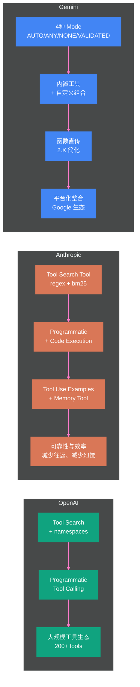

# 03 Tool Use 与 Function Calling——三大厂商的标准化博弈

> [!abstract] 摘要
> 上一篇 [[02 ReAct 架构深度解析——Thought-Action-Observation 循环的本质]] 揭示了 Action 从"自由文本解析"到"Function Calling JSON Schema"的演进如何系统性解决了 ReAct 的格式不稳定、参数幻觉和多参数表达问题。本文则放大焦距，系统对比 2025 年三大 LLM 厂商——OpenAI、Anthropic、Gemini——的 Function Calling 规范，揭示它们在工具定义格式、工具选择控制（tool_choice）、并行调用、动态加载（Tool Search）、编程化调用（Programmatic Tool Calling）上的设计差异与演进方向。三家规范在基础层面（"让 LLM 输出结构化的工具调用请求"）高度一致，但在高级特性上各走各路：OpenAI 用 `tool_search` + `defer_loading` + namespaces 解决"工具太多塞不进上下文"问题，Anthropic 用 Tool Search Tool（regex/bm25 两种匹配模式）+ Programmatic Tool Calling + Tool Use Examples 三件套应对同样的挑战，Gemini 则用 `function_declarations` + 四种 mode（AUTO/ANY/NONE/VALIDATED）+ 内置工具与自定义工具的组合机制走出了一条更"平台化"的路线。文章最后讨论从 Function Calling 到 MCP 协议的演进动机——为什么"每家厂商各搞一套"不可持续，以及 MCP 如何试图建立跨厂商的标准化连接。核心认知：Function Calling 是 Agent 与工具交互的"汇编语言"，MCP 是试图取代它的"高级语言"——但两者不是替代关系，而是叠加关系。

---

## 第 1 章 Function Calling 的本质——从"生成文本"到"生成指令"

### 1.1 没有 Function Calling 时的世界

在 Function Calling 出现之前（2023 年 6 月以前），让 LLM 调用外部工具的方式是"prompt 约定 + 文本解析"——在 prompt 中告诉 LLM "当你想调用搜索工具时，输出 `Search[query]`"，然后用正则表达式从 LLM 的输出中提取工具名和参数。

这种方式的核心问题在上一篇已经详细分析：格式不稳定、参数幻觉、多参数难以表达。但还有一个更深层的问题：**LLM 的训练目标与工具调用需求不匹配**。LLM 被训练为"生成自然语言文本"，而工具调用需要的是"生成结构化指令"——这是两种不同的输出分布。prompt 约定可以"诱导"LLM 生成类似结构化的输出，但无法从根本上改变其输出分布。

### 1.2 Function Calling 的核心机制

Function Calling（也叫 Tool Use、Tool Calling）的本质是：**在模型训练时就引入"工具调用"作为一种合法的输出类型，让 LLM 的输出分布天然包含结构化的工具调用格式**。

具体实现上，三大厂商的思路高度一致：

1. **开发者定义工具 Schema**：用 JSON Schema 描述每个工具的名称、描述、参数及其类型
2. **API 请求携带工具定义**：在 LLM 调用时，把工具 Schema 列表作为参数传入
3. **LLM 决定是否调用工具**：LLM 根据用户请求和工具描述，自主判断是否需要调用工具
4. **LLM 输出结构化工具调用**：如果决定调用，LLM 输出一个包含工具名和参数 JSON 的结构化对象
5. **开发者执行工具并返回结果**：开发者在自己的代码中执行工具，将结果通过特定的消息格式返回给 LLM
6. **LLM 基于结果继续推理**：LLM 将工具结果作为上下文，继续生成下一步响应

这个流程与 ReAct 的"Thought → Action → Observation"循环完全对应——Function Calling 优化的是"Action"这一环的格式化和可靠性。

> [!info] 核心概念：Function Calling 不是"执行工具"
> 一个常见的误解是"Function Calling 会自动执行工具"。实际上，**LLM 永远不会直接执行任何工具**——它只是生成一个"工具调用请求"（tool call request），告诉你"我想调用这个工具，参数是这样的"。工具的实际执行完全在开发者的代码中完成。Anthropic 文档明确指出："The model never executes anything on its own. It emits a structured request, your code runs the operation, and the result flows back into the conversation."这种设计确保了安全性——LLM 不能直接操作文件系统、数据库或网络，所有操作都经过开发者的代码执行层，开发者可以加入权限控制、日志审计、参数验证等安全措施。

### 1.3 为什么三大厂商的规范不同

Function Calling 的基础机制一致，但三大厂商在具体实现上各有设计选择。差异的根源在于三家的业务定位不同：

- **OpenAI**：平台化路线，追求"工具生态最大化"——一个 Agent 可能需要访问成百上千个工具，因此 OpenAI 率先推出 Tool Search 动态加载和 namespaces 组织机制
- **Anthropic**：安全与效率并重，追求"工具调用的可靠性和 token 效率"——Programmatic Tool Calling 让 LLM 在代码执行环境中批量调用工具，减少模型往返次数
- **Gemini**：Google 生态整合路线，追求"内置工具与自定义工具的无缝组合"——内置 Google Search、Code Execution 等工具与自定义 Function Calling 在同一框架下协作

---

## 第 2 章 OpenAI Function Calling 规范

### 2.1 工具定义格式

OpenAI 使用 `tools` 数组参数传递工具定义，每个工具是一个包含 `type` 和 `function` 字段的对象：

```json
{
  "type": "function",
  "function": {
    "name": "get_weather",
    "description": "Get current weather for a location",
    "parameters": {
      "type": "object",
      "properties": {
        "location": {
          "type": "string",
          "description": "City name, e.g. San Francisco"
        }
      },
      "required": ["location"]
    }
  }
}
```

`strict: true` 参数可以启用 Structured Outputs——保证 LLM 生成的参数严格遵循 Schema 定义，不会遗漏必填字段或生成类型不匹配的值。这对于需要可靠参数格式的生产系统至关重要。

### 2.2 tool_choice 参数语义

OpenAI 的 `tool_choice` 参数控制 LLM 的工具调用行为，提供四种模式：

| tool_choice 值 | 语义 | 适用场景 |
| :--- | :--- | :--- |
| `"auto"`（默认） | LLM 自主决定调用零个、一个或多个函数 | 大多数 Agent 场景 |
| `"required"` | LLM 必须调用至少一个函数 | 强制工具使用（如必须查询数据库才能回答） |
| `{"type": "function", "name": "xxx"}` | 强制调用指定的函数 | 路由式工作流（先分类再强制路由到特定工具） |
| `"none"` | 禁止调用任何函数 | 临时禁用工具调用而不移除工具定义 |

### 2.3 并行工具调用

OpenAI 在 2023 年 11 月 6 日及之后发布的模型支持并行函数调用——LLM 可以在一个响应中返回多个 `tool_calls`，这些调用之间没有数据依赖，可以并行执行。

```json
{
  "tool_calls": [
    {
      "id": "call_001",
      "function": { "name": "get_weather", "arguments": "{\"location\": \"San Francisco\"}" }
    },
    {
      "id": "call_002",
      "function": { "name": "get_weather", "arguments": "{\"location\": \"Tokyo\"}" }
    }
  ]
}
```

这个特性与 [[01 Agent 运行范式全景——从 ReAct 到 Production Agent 的演进|第一篇]]讨论的 LLMCompiler 范式呼应——LLM 自主识别哪些工具调用可以并行，减少了串行等待延迟。

### 2.4 Tool Search——动态工具加载

当 Agent 需要访问大量工具时（如统一集成了 CRM、ATS、HRIS、工单系统等多个 MCP Server，可能暴露 200+ 个工具），把所有工具定义塞进上下文会导致严重的 token 浪费。OpenAI 的 Tool Search 解决了这个问题：

**工作原理**：
1. 开发者在 `tools` 数组中添加 `{"type": "tool_search"}` 作为一个特殊的"元工具"
2. 将不常用的工具标记为 `defer_loading: true`——这些工具的完整 Schema 不会加载到上下文中
3. LLM 只看到 `tool_search` 元工具和非延迟加载的工具（最关键的几个）
4. 当 LLM 需要某个延迟工具时，先调用 `tool_search` 搜索相关工具
5. `tool_search` 返回匹配的工具定义，被注入到 LLM 的上下文中
6. LLM 现在可以调用新加载的工具

**namespaces 组织**：为了帮助 LLM 更好地搜索，OpenAI 引入了 namespaces 概念——将相关工具分组到一个命名空间下。LLM 搜索时先看到的是命名空间的名称和描述（而非其中每个工具的详细 Schema），这提供了"高层概览"，让 LLM 知道"哪组工具可能有用"，然后只加载那组工具中的相关成员。

```json
{
  "type": "namespace",
  "name": "crm_tools",
  "description": "Customer relationship management tools",
  "tools": [
    { "type": "function", "name": "create_contact", "defer_loading": true, ... },
    { "type": "function", "name": "search_contacts", "defer_loading": true, ... }
  ]
}
```

> [!note] 设计哲学：Tool Search 是"Just-in-Time Context"在工具层面的应用
> Tool Search 的设计思想与 Anthropic 的 Context Engineering 中的"Just-in-Time Context"原则完全一致——不要预加载所有可能用到的信息，而是在需要时按需加载。在工具层面，这意味着 LLM 的上下文中只保留"当前任务可能需要的工具"而非"所有可用工具"。OpenAI 的文档指出，Tool Search 设计为保持模型的缓存——新工具在上下文窗口末尾注入，不破坏已有内容的缓存命中。这种"缓存友好"的设计在实际使用中可以显著降低延迟和成本。

### 2.5 Programmatic Tool Calling

OpenAI 还支持 Programmatic Tool Calling——让 LLM 通过编写 JavaScript 代码来协调工具调用，而非逐个发起独立的工具调用请求。

```json
{
  "type": "function",
  "name": "check_budget_compliance",
  "allowed_callers": ["programmatic"]
}
```

标记了 `allowed_callers: ["programmatic"]` 的工具只能从 LLM 生成的代码中调用，不能从常规的 tool_calls 中直接调用。LLM 生成一段 JavaScript 代码，在代码执行环境中运行，代码中可以调用这些工具、处理返回结果、执行循环和条件判断——所有这些都在一次模型往返中完成，不需要多次 LLM 调用。

这解决了一个重要的效率问题：如果 Agent 需要检查 20 个员工的预算合规性，传统方式需要 20 次独立的 LLM 往返（每次调用一个查询工具），Programmatic Tool Calling 只需要 1 次——LLM 生成一段循环调用查询工具的代码，在代码执行环境中批量执行。

---

## 第 3 章 Anthropic Tool Use 规范

### 3.1 Content Block 架构

Anthropic 的 tool use 采用了一种独特的 **content block** 架构——LLM 的响应不是一个简单的文本字符串，而是一个由多个 content block 组成的数组，每个 block 可以是文本、工具调用或工具结果：

```json
{
  "role": "assistant",
  "content": [
    {
      "type": "text",
      "text": "Let me check the weather for you."
    },
    {
      "type": "tool_use",
      "id": "toolu_01abc",
      "name": "get_weather",
      "input": { "location": "San Francisco" }
    }
  ]
}
```

这种设计允许 LLM 在同一个响应中**交替输出文本和工具调用**——先说"让我查一下天气"，然后输出工具调用请求。文本和工具调用不是互斥的，而是可以交织在同一轮响应中。

工具结果通过 `tool_result` content block 返回：

```json
{
  "role": "user",
  "content": [
    {
      "type": "tool_result",
      "tool_use_id": "toolu_01abc",
      "content": "Sunny, 72°F"
    }
  ]
}
```

### 3.2 stop_reason 机制

Anthropic 的 ReAct 循环控制通过 `stop_reason` 字段实现（上一篇已详细介绍）：

- `stop_reason: "tool_use"` → LLM 请求调用工具，执行后继续循环
- `stop_reason: "end_turn"` → LLM 自然结束，任务完成

这个机制比 OpenAI 的 `finish_reason: "tool_calls"` 更语义化——`tool_use` 明确表示"LLM 想要使用工具"，而非"响应因为工具调用而停止"。

### 3.3 tool_choice 参数

Anthropic 的 `tool_choice` 语义与 OpenAI 类似但有细微差异：

| tool_choice 值 | 语义 | 对应 OpenAI |
| :--- | :--- | :--- |
| `{"type": "auto"}` | LLM 自主决定是否调用工具 | `"auto"` |
| `{"type": "any"}` | LLM 必须调用某个工具 | `"required"` |
| `{"type": "tool", "name": "xxx"}` | 强制调用指定工具 | `{"type": "function", "name": "xxx"}` |

### 3.4 Tool Search Tool——Anthropic 的动态加载方案

2025 年 11 月，Anthropic 发布了三件套高级工具特性，其中 Tool Search Tool 是对 OpenAI Tool Search 的直接回应：

**两种搜索模式**：
- `tool_search_tool_regex_20251119`：正则表达式匹配——基于工具名称和描述的关键词匹配
- `tool_search_tool_bm25_20251119`：BM25 算法匹配——基于词频-逆文档频率的语义匹配

**使用方式**：
1. 在 `tools` 数组中添加 Tool Search Tool 定义
2. 将其他工具标记为 `defer_loading: true`
3. LLM 初始上下文中只有 Tool Search Tool 和非延迟工具
4. LLM 需要更多工具时，调用 Tool Search Tool 进行搜索
5. API 返回 3-5 个最相关的工具定义，自动展开到 LLM 上下文中

Anthropic 还支持客户端侧的 Tool Search 实现——开发者可以用 embedding 向量自己做语义搜索，而非依赖服务端的 regex/bm25 匹配。Claude Cookbook 提供了完整的客户端 Tool Search 实现，使用 cosine similarity 在工具 embedding 向量之间做匹配。

### 3.5 Programmatic Tool Calling

Anthropic 的 Programmatic Tool Calling 与 OpenAI 的方案目标一致——让 LLM 在代码执行环境中批量调用工具，减少模型往返。但实现方式不同：

Anthropic 的方案要求同时启用 Code Execution Tool——LLM 生成代码在 Anthropic 提供的代码执行容器中运行，代码中可以调用标记为 Programmatic 的工具。中间数据（工具返回结果）在代码执行容器中处理，**不进入 LLM 的上下文窗口**——只有代码的最终输出返回给 LLM。

Anthropic 的数据表明，在 BrowseComp 和 DeepSearchQA 等多步搜索基准上，Programmatic Tool Calling 平均提升 11% 性能的同时减少了 24% 的输入 token 消耗。

> [!warning] 生产避坑：Programmatic Tool Calling 改变了安全模型
> 传统的 Function Calling 中，每个工具调用都是独立的、可审计的——你可以记录每次调用的工具名、参数、返回值，并在调用前做权限检查。Programmatic Tool Calling 把多个工具调用打包进一段代码中执行，审计粒度从"每次调用"变为"每段代码"。这意味着你无法在单个工具调用级别做审批——要么批准整段代码执行（包含其中所有工具调用），要么拒绝。对于需要细粒度权限控制的场景（如 Coding Agent 执行 bash 命令），Programmatic Tool Calling 可能不适合——你需要在每个 bash 命令级别做审批，而非批准一段"可能包含任意 bash 命令"的代码。本专栏第 12 篇将深入讨论权限审批模型与 Programmatic Tool Calling 的兼容性问题。

### 3.6 Tool Use Examples

Anthropic 的第三个高级特性是 Tool Use Examples——在工具定义中附加具体的使用示例，帮助 LLM 理解"这个工具应该怎么用"。

JSON Schema 定义了工具的"结构"（参数名、类型），但不传达"语义"（什么场景该用、参数应该长什么样）。Tool Use Examples 通过提供 `input_examples` 填补了这个空白：

```json
{
  "name": "search_database",
  "input_examples": [
    {
      "input": { "query": "active users in last 30 days" },
      "output": { "results": [...] }
    }
  ]
}
```

这类似于给 LLM 提供了工具的"few-shot 示例"——不是在 prompt 中，而是在工具定义中。这减少了格式错误和参数幻觉，因为 LLM 不再需要仅凭 Schema 推测正确用法，而是有具体示例可参考。

---

## 第 4 章 Gemini Function Calling 规范

### 4.1 function_declarations 格式

Gemini 使用 `tools[].function_declarations` 定义工具，格式与 OpenAI/Anthropic 类似但有命名差异：

```python
tools = [
    types.Tool(
        function_declarations=[
            types.FunctionDeclaration(
                name="get_weather",
                description="Get current weather for a location",
                parameters={
                    "type": "object",
                    "properties": {
                        "location": {"type": "string"}
                    },
                    "required": ["location"]
                }
            )
        ]
    )
]
```

### 4.2 四种 Function Calling Mode

Gemini 的 `tool_config.function_calling_config` 提供了四种模式，比 OpenAI/Anthropic 更细粒度：

| Mode | 语义 | 对应 OpenAI | 特殊行为 |
| :--- | :--- | :--- | :--- |
| `AUTO` | LLM 自主决定是否调用工具 | `"auto"` | 默认模式 |
| `ANY` | LLM 必须调用工具 | `"required"` | 可配合 `allowed_function_names` 限制可选工具 |
| `NONE` | 禁止调用工具 | `"none"` | 等价于不传工具定义 |
| `VALIDATED` | 确保 Schema 遵守 | N/A | 减少格式错误，配合内置工具使用 |

`VALIDATED` 是 Gemini 独有的——它约束 LLM 只能生成符合 Schema 的函数调用，减少格式错误。在只有 `function_declarations` 时它是非默认的，但在同时启用内置工具（如 Google Search）或 Structured Outputs 时，`VALIDATED` 成为默认模式。

### 4.3 allowed_function_names 精确控制

配合 `ANY` 模式，Gemini 的 `allowed_function_names` 可以精确限制 LLM 只能从指定的函数列表中选择：

```python
tool_config = types.ToolConfig(
    function_calling_config=types.FunctionCallingConfig(
        mode="ANY",
        allowed_function_names=["get_current_temperature"]
    )
)
```

这在 OpenAI 中需要通过 `tool_choice: {"type": "function", "name": "xxx"}` 实现（强制调用单个指定函数），但 Gemini 的 `allowed_function_names` 支持一个函数列表——LLM 必须调用其中一个，但不能调用列表外的函数。这提供了比 OpenAI 更灵活的"限定范围"控制。

### 4.4 内置工具与自定义工具的组合

Gemini 的独特优势是内置工具生态——Google Search、Code Execution、URL Context 等工具由 Google 托管执行，不需要开发者自己实现。2025 年 Gemini 支持了内置工具与自定义 Function Calling 的组合使用：

```python
response = client.models.generate_content(
    model="gemini-3.6-flash",
    contents="What is the northernmost city in the US? What's the weather there?",
    config=types.GenerateContentConfig(
        tools=[
            types.Tool(
                google_search=types.GoogleSearch(),          # 内置工具
                function_declarations=[get_weather]           # 自定义工具
            ),
        ],
        tool_config=types.ToolConfig(
            include_server_side_tool_invocations=True
        )
    )
)
```

这个例子中，LLM 可以先用 Google Search 查"美国最北的城市"，拿到答案后再调用自定义的 `get_weather` 函数查该城市的天气——内置工具和自定义工具在同一轮对话中协作。`include_server_side_tool_invocations=True` 让内置工具的执行结果也包含在响应中，保持完整的上下文链。

### 4.5 Gemini 2.X 简化

2025 年 4 月，Gemini 2.X 简化了 Function Calling 的使用——开发者不再需要手写 `function_declarations`，可以直接把 Python 函数传给模型，SDK 自动生成 Schema：

```python
def get_weather(location: str) -> str:
    """Get current weather for a location."""
    # implementation
    return f"Sunny, 72°F in {location}"

# 直接传函数，SDK 自动提取签名和 docstring 生成 Schema
response = client.models.generate_content(
    model="gemini-2.5-flash",
    contents="What's the weather in Paris?",
    config=types.GenerateContentConfig(tools=[get_weather])
)
```

这种"传函数而非传 Schema"的设计降低了使用门槛——函数签名就是 Schema，docstring 就是描述，类型注解就是参数类型。但代价是失去了对 Schema 的精细控制（如 enum 约束、format 约束等需要手写 Schema 才能表达）。

---

## 第 5 章 三大厂商横向对比

### 5.1 基础规范对比

| 维度 | OpenAI | Anthropic | Gemini |
| :--- | :--- | :--- | :--- |
| **工具定义参数** | `tools[].function` | `tools[]`（直接是工具对象） | `tools[].function_declarations` |
| **模型输出格式** | `tool_calls` 数组 | Content blocks（`tool_use` 类型） | `function_call` in parts |
| **结果返回格式** | `tool` role message | `tool_result` content block | `function_response` part |
| **停止原因字段** | `finish_reason: "tool_calls"` | `stop_reason: "tool_use"` | response parts 包含 function_call |
| **并行调用** | ✅ 多个 tool_calls | ✅ 多个 tool_use blocks | ✅ |
| **强制工具** | `tool_choice: {type, name}` | `tool_choice: {type: "tool", name}` | `mode: "ANY"` + `allowed_function_names` |
| **禁止工具** | `tool_choice: "none"` | N/A（不传 tools 即可） | `mode: "NONE"` |
| **Structured Outputs** | `strict: true` | Schema 本身即约束 | `mode: "VALIDATED"` |

### 5.2 高级特性对比

| 特性 | OpenAI | Anthropic | Gemini |
| :--- | :--- | :--- | :--- |
| **动态工具加载** | Tool Search + `defer_loading` + namespaces | Tool Search Tool（regex/bm25）+ `defer_loading` | N/A |
| **编程化调用** | Programmatic Tool Calling（JS 代码执行） | Programmatic Tool Calling（代码执行容器） | N/A |
| **工具使用示例** | N/A | Tool Use Examples（`input_examples`） | N/A |
| **内置工具** | Web Search、Code Interpreter、File Search | bash、text_editor、computer、memory、code_execution | Google Search、Code Execution、URL Context |
| **工具+内置组合** | 支持 | 支持（Anthropic-schema 工具与自定义工具统一执行模型） | 支持（`include_server_side_tool_invocations`） |
| **SDK Runner** | OpenAI Agents SDK | Tool Runner（beta，自动 agentic loop） | Google Gen AI SDK |

### 5.3 设计哲学差异



> [!note] 设计哲学：三家的"第一性原理"不同
> **OpenAI** 的第一性原理是"平台化"——当一个 Agent 需要访问整个 SaaS 生态的工具时，如何让 LLM 在数千个工具中高效找到正确的那个？Tool Search + namespaces 是对"工具规模"问题的回答。
>
> **Anthropic** 的第一性原理是"可靠性"——当一个 Agent 需要连续调用多个工具完成复杂任务时，如何减少模型往返、减少 token 消耗、减少参数幻觉？Programmatic Tool Calling + Tool Use Examples 是对"调用质量"问题的回答。
>
> **Gemini** 的第一性原理是"整合"——当用户已经在 Google 生态中（Google Search、Google Cloud、Workspace）时，如何让内置工具和自定义工具无缝协作？内置工具组合 + 函数直传简化是对"生态整合"问题的回答。
>
> 这三种第一性原理没有优劣之分——它们反映了三家公司的不同业务定位和用户群体。作为开发者，理解这些差异有助于在不同场景下选择最合适的平台。

---

## 第 6 章 从 Function Calling 到 MCP——为什么需要标准化

### 6.1 Function Calling 的碎片化问题

三大厂商的 Function Calling 规范虽然在基础层面一致（"让 LLM 输出结构化的工具调用请求"），但在具体格式上各不相同：

- OpenAI 用 `tools[].function` 定义工具，用 `tool_calls` 数组返回调用请求
- Anthropic 用 `content blocks` 中的 `tool_use` 类型，用 `tool_result` 返回结果
- Gemini 用 `function_declarations` 定义工具，用 `function_call` in parts 返回调用请求

这意味着如果你开发了一个 MCP Server 或工具集成，想让它在 OpenAI、Anthropic、Gemini 三个平台上都能用，你需要写三套适配代码——一套把工具定义转成 OpenAI 格式，一套转成 Anthropic 格式，一套转成 Gemini 格式。工具调用结果的返回也需要三套适配。

这种碎片化在工具数量少时还可以忍受，但当工具生态扩大到数十个、数百个时，适配成本就成了严重的负担。

### 6.2 MCP 的标准化愿景

MCP（Model Context Protocol）由 Anthropic 于 2024 年 11 月发布，目标是建立一套**跨厂商的标准化协议**——用统一的 JSON-RPC 2.0 消息格式定义工具、资源和提示模板，让一个 MCP Server 实现可以被任何支持 MCP 的 Host 应用使用，而不需要为每个 LLM 厂商写适配代码。

MCP 与 Function Calling 的关系不是"替代"而是"叠加"：

- **Function Calling** 是 LLM 与工具之间的"语言"——定义了 LLM 如何表达"我想调用这个工具"
- **MCP** 是应用与工具服务之间的"协议"——定义了工具如何被发现、描述、调用和返回

一个完整的技术栈是：LLM 用 Function Calling（OpenAI/Anthropic/Gemini 格式）表达工具调用意图 → Host 应用把调用意图翻译成 MCP 协议消息 → MCP Server 执行工具并返回结果 → Host 应用把结果翻译回 Function Calling 格式返回给 LLM。

### 6.3 从厂商适配到协议适配

没有 MCP 时：
```
LLM (OpenAI) → OpenAI 适配层 → 工具 A
LLM (OpenAI) → OpenAI 适配层 → 工具 B
LLM (Anthropic) → Anthropic 适配层 → 工具 A
LLM (Anthropic) → Anthropic 适配层 → 工具 B
```
M×N 问题：M 个 LLM 厂商 × N 个工具 = M×N 个适配需要写。

有 MCP 后：
```
LLM (OpenAI) → MCP Client → MCP Server → 工具 A
LLM (Anthropic) → MCP Client → MCP Server → 工具 A
LLM (Gemini) → MCP Client → MCP Server → 工具 A
```
M+N 问题：M 个 LLM 厂商各写一个 MCP Client + N 个工具各写一个 MCP Server = M+N 个适配。

> [!info] 核心概念：MCP 把"工具适配"从 M×N 降为 M+N
> 这是 MCP 最核心的工程价值。在 MCP 之前，让一个工具支持 3 个 LLM 平台需要写 3 套适配代码；10 个工具就是 30 套。MCP 之后，每个 LLM 平台写 1 个 MCP Client（共 3 个），每个工具写 1 个 MCP Server（共 10 个），总共 13 个适配而非 30 个。而且新增工具时只需要写 1 个 MCP Server，不需要改任何 LLM 平台的代码。这种"解耦"是标准化协议的核心价值——就像 HTTP 协议让 Web 服务器和浏览器解耦一样，MCP 让工具服务和 LLM 应用解耦。

### 6.4 OpenAI 和 Anthropic 对 MCP 的态度

2025 年，OpenAI 和 Anthropic 都在各自平台中集成了 MCP 支持：

- **OpenAI**：Responses API 支持直接配置 MCP Server 作为工具来源，`defer_loading: true` 可以用于 MCP Server 级别的延迟加载。OpenAI 文档推荐"使用 namespaces 或 MCP servers"作为 Tool Search 的最佳实践。
- **Anthropic**：Claude API 支持 MCP Server 配置，`defer_loading` 配合 `mcp-client-2025-11-20` beta header 可以延迟加载 MCP Server 中的工具。Anthropic 的 Tool Search Tool 可以搜索 MCP Server 暴露的工具。

这意味着 MCP 正在从"Anthropic 自己搞的标准"向"行业事实标准"演进——两大厂商都在自己的平台中原生支持 MCP，工具开发者只需要写一个 MCP Server 就可以在两个平台上使用。

> [!warning] 生产避坑：MCP Roots 不是安全边界
> MCP 规范中定义了 Roots 原语——Host 告诉 Server"允许访问的文件系统/URI 边界"。但 MCP 规范明确指出 Roots 是"协调机制而非强制边界"——Server 在 Host 无法直接管控的地方执行时，可能不遵守 Roots 约束。这意味着如果你把 MCP Server 部署在远程（非 stdio 本地进程），你不能仅依赖 Roots 来保证安全——还需要在 Server 实现中加入自己的访问控制逻辑。MCP 的安全模型将在本专栏第 4-5 篇深入讨论。

---

## 第 7 章 总结与下一篇导读

### 7.1 本文核心要点

1. **Function Calling 的本质**：在模型训练中引入"工具调用"作为合法输出类型，让 LLM 天然生成结构化指令而非靠 prompt 诱导
2. **三大厂商基础一致、高级分化**：基础机制（工具 Schema + LLM 决策 + 结构化输出）一致，但 OpenAI 追求工具规模（Tool Search + namespaces）、Anthropic 追求调用可靠性（Programmatic + Tool Use Examples）、Gemini 追求生态整合（内置工具组合）
3. **动态工具加载**：OpenAI 和 Anthropic 都推出了 Tool Search / defer_loading 机制，解决"工具太多塞不进上下文"的问题，是 Just-in-Time Context 原则在工具层面的应用
4. **Programmatic Tool Calling**：让 LLM 在代码执行环境中批量调用工具，减少模型往返和 token 消耗，但改变了安全模型（审计粒度从单次调用变为整段代码）
5. **MCP 的标准化价值**：把工具适配从 M×N 降为 M+N，让工具服务与 LLM 应用解耦——这是 MCP 最核心的工程价值

### 7.2 下一篇导读

本文讨论了 Function Calling 作为"Agent 与工具交互的汇编语言"的规范差异和标准化趋势。下一篇 [[04 MCP 协议深度解析——Agent 与工具的标准化连接]] 将深入 MCP 协议本身——JSON-RPC 2.0 基础、Host-Client-Server 三层架构、能力协商、三类 Server 原语（Tools/Resources/Prompts）、三类 Client 原语（Sampling/Roots/Elicitation）、传输层演进（stdio → HTTP+SSE → Streamable HTTP），揭示 MCP 如何在协议层面实现"一套 Server 适配所有 Host"的标准化愿景。

> [!info] 专栏导航
> 本文是 [[00 专栏导览|Coding Agent 运行范式专栏]] 的第 3 篇。上一篇 [[02 ReAct 架构深度解析——Thought-Action-Observation 循环的本质]] 深入了 ReAct 循环内部；本文从 ReAct 的"Action"环节出发，系统对比了三大厂商的 Function Calling 规范；下一篇将从 Function Calling 的标准化趋势出发，深入 MCP 协议的技术细节。

---

## 参考文献

1. OpenAI. "Function calling." https://developers.openai.com/api/docs/guides/function-calling
2. OpenAI. "Using tools." https://developers.openai.com/api/docs/guides/tools
3. OpenAI. "Tool search." https://developers.openai.com/api/docs/guides/tools-tool-search
4. Anthropic. "Introducing advanced tool use on the Claude Developer Platform." 2025-11-24. https://www.anthropic.com/engineering/advanced-tool-use
5. Anthropic. "How tool use works." https://platform.claude.com/docs/en/agents-and-tools/tool-use/how-tool-use-works
6. Anthropic. "Tool search tool." https://platform.claude.com/docs/en/agents-and-tools/tool-use/tool-search-tool
7. Anthropic. "Programmatic tool calling." https://platform.claude.com/docs/en/agents-and-tools/tool-use/programmatic-tool-calling
8. Google. "Function calling with the Gemini API." https://ai.google.dev/gemini-api/docs/generate-content/function-calling
9. Google. "Using tools with Gemini API." https://ai.google.dev/gemini-api/docs/tools
10. Google. "Combine built-in tools and function calling." https://ai.google.dev/gemini-api/docs/generate-content/tool-combination

---

## 思考题

1. **如果你的 Agent 需要同时访问 50 个工具（来自 5 个不同的 MCP Server），你会选择 OpenAI 的 Tool Search + namespaces 还是 Anthropic 的 Tool Search Tool（bm25）？为什么？** 提示：考虑两种方案的搜索精度、缓存友好度和延迟差异。

2. **Programmatic Tool Calling 在什么场景下不适用？** 提示：考虑安全审计粒度——如果你的 Agent 需要在每次 bash 命令执行前获得人工审批，Programmatic Tool Calling 的"批量执行"特性如何与"逐次审批"需求冲突？

3. **MCP 把工具适配从 M×N 降为 M+N，但引入了什么新的复杂性？** 提示：考虑协议层本身的开销——MCP Server 的生命周期管理、传输层选择（stdio vs HTTP）、能力协商、错误处理——这些在直接写 Function Calling 适配时不需要考虑。
