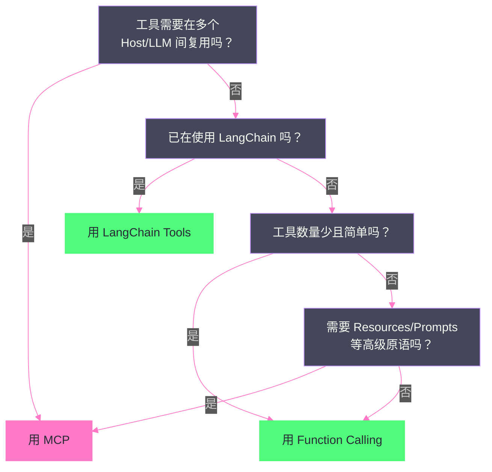

# 05 MCP 生态与实践——Server 开发、集成与生产部署

> [!abstract] 摘要
> 上一篇 [[04 MCP 协议深度解析——Agent 与工具的标准化连接|MCP 协议深度解析]] 拆解了 MCP 的协议规范。本文从规范走向工程落地——如何开发一个 MCP Server？如何把它接入 Claude Desktop、Cursor、Claude Code 等 Host？生产部署有哪些最佳实践和避坑要点？文章以一个完整的 Weather MCP Server 为贯穿案例，演示用 Python FastMCP 和 TypeScript 官方 SDK 两种方式从零构建 Server；然后系统梳理三大 Host（Claude Desktop / Cursor / Claude Code）的 MCP 集成方式与配置文件差异；接着介绍 MCP Inspector 调试工具和 MCP Server 分发模式（npm/PyPI/Docker/远程 HTTP）；最后讨论 MCP vs OpenAI Function Calling vs LangChain Tools 的实际选型决策——什么场景该用 MCP，什么场景不该用。核心认知：MCP 生态在 2024 年 11 月到 2026 年间经历了从 1200 到 9400+ 个 Server 的 7.8 倍增长，但"能用 MCP"不等于"该用 MCP"——MCP 的价值在工具复用和跨 Host 兼容，对于单 Host 单工具的简单场景，直接用 Function Calling 反而更简洁。

---

## 第 1 章 MCP Server 开发——从零构建

### 1.1 两种 SDK 路线

MCP 官方提供了两种语言的 SDK：Python SDK（`mcp` 包，内置 FastMCP 高级框架）和 TypeScript SDK（`@modelcontextprotocol/sdk`）。两者的选择通常取决于你的工具后端语言——如果工具本身是 Python 写的（如调用 Python 数据科学库），用 Python SDK；如果是 Node.js 生态的工具（如调用 npm 包），用 TypeScript SDK。

| 维度 | Python SDK + FastMCP | TypeScript SDK |
| :--- | :--- | :--- |
| 抽象层级 | 高——装饰器自动生成 Schema | 中——需手动定义 Schema（可用 Zod 辅助） |
| 代码量 | ~20 行实现一个工具 | ~40 行实现一个工具 |
| 类型推断 | 从 Python 类型注解自动推断 | 从 TypeScript 类型 + Zod schema 推断 |
| 传输支持 | stdio / Streamable HTTP / SSE | stdio / Streamable HTTP / SSE |
| 适用场景 | Python 生态工具、快速原型 | Node.js 生态工具、生产 TypeScript 项目 |

### 1.2 Python FastMCP——20 行实现一个 MCP Server

FastMCP 是 Python MCP SDK 中的高级框架，通过装饰器将普通 Python 函数自动转化为 MCP Tool：

```python
from mcp.server.fastmcp import FastMCP
import httpx

mcp = FastMCP("weather-server")

NWS_API_BASE = "https://api.weather.gov"

@mcp.tool()
async def get_alerts(state: str) -> str:
    """Get weather alerts for a US state.

    Args:
        state: Two-letter US state code (e.g. CA, NY)
    """
    url = f"{NWS_API_BASE}/alerts/active/area/{state}"
    async with httpx.AsyncClient() as client:
        data = await client.get(url).json()
    
    if not data.get("features"):
        return "No active alerts for this state."
    
    alerts = [format_alert(f) for f in data["features"]]
    return "\n---\n".join(alerts)

@mcp.tool()
async def get_forecast(latitude: float, longitude: float) -> str:
    """Get weather forecast for a location."""
    # ... 实现略
    
def main():
    mcp.run(transport="stdio")

if __name__ == "__main__":
    main()
```

FastMCP 的精妙之处在于：`@mcp.tool()` 装饰器自动从函数签名提取参数名和类型注解，从 docstring 提取工具描述，生成符合 MCP 规范的 JSON Schema。开发者只需要写一个普通的异步 Python 函数——不需要手动定义 Schema、不需要手写 JSON-RPC 消息处理逻辑。

### 1.3 TypeScript SDK——显式 Schema 定义

TypeScript SDK 需要更显式的 Schema 定义，但提供了更精细的类型控制：

```typescript
import { Server } from '@modelcontextprotocol/sdk/server/index.js';
import { StdioServerTransport } from '@modelcontextprotocol/sdk/server/stdio.js';
import { CallToolRequestSchema, ListToolsRequestSchema } from '@modelcontextprotocol/sdk/types.js';

const server = new Server(
  { name: 'weather-server', version: '1.0.0' },
  { capabilities: { tools: {} } }
);

// 定义工具列表
server.setRequestHandler(ListToolsRequestSchema, async () => ({
  tools: [{
    name: 'get_alerts',
    description: 'Get weather alerts for a US state',
    inputSchema: {
      type: 'object',
      properties: {
        state: { type: 'string', description: 'Two-letter US state code' }
      },
      required: ['state']
    }
  }]
}));

// 处理工具调用
server.setRequestHandler(CallToolRequestSchema, async (request) => {
  if (request.params.name === 'get_alerts') {
    const { state } = request.params.arguments;
    const response = await fetch(`https://api.weather.gov/alerts/active/area/${state}`);
    const data = await response.json();
    return { content: [{ type: 'text', text: JSON.stringify(data) }] };
  }
});

const transport = new StdioServerTransport();
await server.connect(transport);
```

TypeScript SDK 的代码量大约是 FastMCP 的两倍，但提供了对协议消息的更细粒度控制——你可以自定义错误处理、流式响应、通知发送等底层行为。

> [!info] 核心概念：FastMCP 3.0 的演进
> FastMCP 在 2024 年被合并到官方 Python SDK 后，继续作为独立项目维护，并在 2026 年 1 月发布了 3.0 版本，新增了组件版本化、细粒度认证和 OpenTelemetry 支持。这使得 FastMCP 从"快速原型工具"演进了"生产级 MCP Server 框架"。对于新项目，推荐直接使用 FastMCP 3.0+ 而非底层 MCP SDK——除非你需要底层 SDK提供的完全控制。

### 1.4 传输层选择

MCP Server 的传输层选择取决于部署场景：

**stdio（本地）**：
```python
mcp.run(transport="stdio")
```
Server 作为 Host 的子进程运行，通过 stdin/stdout 通信。适用于本地工具集成——Claude Desktop、Cursor 等都通过 stdio 启动本地 MCP Server。

**Streamable HTTP（远程）**：
```python
mcp.run(transport="streamable-http", host="0.0.0.0", port=8000)
```
Server 作为独立 HTTP 服务运行，可被多个远程 Client 连接。适用于企业内部共享工具、云端托管 Server 等场景。

> [!warning] 生产避坑：stdio 传输的 PATH 问题
> Claude Desktop 启动 MCP Server 子进程时，使用的是精简的 PATH 环境变量——可能不包含 `npx`、`python3`、`uvx` 等命令的路径。如果你的 MCP Server 配置中用 `npx` 启动但 Claude Desktop 报 "command not found"，这通常是 PATH 问题。解决方案：在配置中使用绝对路径（如 `/usr/local/bin/npx` 而非 `npx`），或在 `env` 字段中显式设置 `PATH`。

---

## 第 2 章 Host 集成——三大 Host 的配置方式

### 2.1 Claude Desktop——JSON 配置文件

Claude Desktop 是 MCP 的第一个 Host 实现，也是参考实现。MCP Server 配置通过 `claude_desktop_config.json` 文件管理：

**配置文件位置**：
- macOS: `~/Library/Application Support/Claude/claude_desktop_config.json`
- Windows: `%APPDATA%\Claude\claude_desktop_config.json`
- Linux: `~/.config/Claude/claude_desktop_config.json`

**配置结构**：
```json
{
  "mcpServers": {
    "filesystem": {
      "command": "npx",
      "args": [
        "-y",
        "@modelcontextprotocol/server-filesystem",
        "/Users/username/Documents"
      ]
    },
    "github": {
      "command": "docker",
      "args": ["run", "-i", "--rm", "-e", "GITHUB_PERSONAL_ACCESS_TOKEN", "ghcr.io/github/github-mcp-server"],
      "env": {
        "GITHUB_PERSONAL_ACCESS_TOKEN": "ghp_xxxxxxxxxxxx"
      }
    }
  }
}
```

每个 Server 条目包含三个字段：
- `command`：要执行的可执行文件（如 `npx`、`node`、`python3`、`docker`、`uvx`）
- `args`：传给可执行文件的参数列表
- `env`：可选的环境变量（通常用于传递 API Key）

Claude Desktop 只支持 **stdio 传输**——配置文件中不支持 `url` 字段。如果需要连接远程 HTTP MCP Server，需要通过一个"桥接"工具（如 `mcp-remote`）将 HTTP 转为 stdio。

配置修改后需要**完全重启** Claude Desktop（不是关闭窗口再打开，而是退出进程再启动）。

Claude Desktop 还提供了 Connectors UI——在聊天界面的"+"菜单中选择"Connectors"，可以浏览和一键安装 marketplace 中的 MCP Server，无需手动编辑 JSON。

### 2.2 Cursor——.cursor/mcp.json

Cursor 的 MCP 配置与 Claude Desktop 类似但有几个重要差异：

**配置文件位置**：
- 项目级：`.cursor/mcp.json`（项目根目录，可提交到 git 与团队共享）
- 全局级：`~/.cursor/mcp.json`（所有项目共享）
- 两者合并，同名 Server 项目级优先

**本地 Server 配置**（与 Claude Desktop 相同）：
```json
{
  "mcpServers": {
    "filesystem": {
      "command": "npx",
      "args": ["-y", "@modelcontextprotocol/server-filesystem", "/path"]
    }
  }
}
```

**远程 Server 配置**（Cursor 独有优势）：
```json
{
  "mcpServers": {
    "my-service": {
      "url": "https://mcp.example.com/mcp",
      "headers": {
        "Authorization": "Bearer your-token"
      }
    }
  }
}
```

Cursor 原生支持远程 HTTP/SSE MCP Server——这是 Cursor 相比 Claude Desktop 的一个重要优势。对于企业环境中的共享 MCP Server，Cursor 不需要桥接工具即可直接连接。

Cursor 还支持 **OAuth 认证**的远程 Server：
```json
{
  "mcpServers": {
    "oauth-server": {
      "url": "https://api.example.com/mcp",
      "auth": {
        "CLIENT_ID": "your-oauth-client-id",
        "CLIENT_SECRET": "your-oauth-client-secret",
        "scopes": ["read", "write"]
      }
    }
  }
}
```

此外，Cursor 有自己的 MCP Marketplace 和 cursor.directory 社区目录，支持一键安装（通过 `cursor://` deeplink）。

### 2.3 Claude Code——命令行配置

Claude Code（CLI Agent）的 MCP 配置方式与前两者不同——通过命令行命令管理：

```bash
# 添加 stdio Server
claude mcp add filesystem -- npx -y @modelcontextprotocol/server-filesystem /path

# 添加远程 HTTP Server
claude mcp add --transport http my-service https://mcp.example.com/mcp

# 列出已配置的 Server
claude mcp list

# 删除 Server
claude mcp remove filesystem
```

Claude Code 也支持项目级 `.mcp.json` 配置文件，格式与 Cursor 类似。Claude Code 原生支持远程 HTTP Server，不需要桥接工具。

### 2.4 三大 Host 对比

| 维度 | Claude Desktop | Cursor | Claude Code |
| :--- | :--- | :--- | :--- |
| **配置方式** | JSON 文件 | JSON 文件 / UI / deeplink | 命令行 / JSON 文件 |
| **本地 stdio** | ✅ | ✅ | ✅ |
| **远程 HTTP** | ❌（需桥接） | ✅ 原生 | ✅ 原生 |
| **OAuth 认证** | ❌ | ✅ | ✅ |
| **项目级配置** | ❌（仅全局） | ✅（`.cursor/mcp.json`） | ✅（`.mcp.json`） |
| **Marketplace** | Connectors UI | Cursor Marketplace + cursor.directory | N/A |
| **一键安装** | Connectors UI | `cursor://` deeplink | N/A |
| **目标用户** | 非技术用户 | 开发者 | 开发者/CLI 用户 |

> [!note] 设计哲学：配置方式反映目标用户
> 三大 Host 的 MCP 配置方式差异反映了它们的目标用户群体。Claude Desktop 面向非技术用户——JSON 配置虽然对技术用户来说不友好，但 Connectors UI 的一键安装让普通用户无需接触 JSON。Cursor 面向开发者——项目级 `.cursor/mcp.json` 可以提交到 git，让整个团队共享工具配置，这是开发者工作流的自然延伸。Claude Code 面向 CLI 重度用户——命令行配置最符合其使用习惯。这种"配置方式适配目标用户"的设计，是 MCP 生态能否被广泛采用的关键——如果所有 Host 都只提供 JSON 配置，非技术用户就会被排除在生态之外。

---

## 第 3 章 MCP Inspector——调试利器

### 3.1 什么是 MCP Inspector

MCP Inspector 是官方提供的 MCP Server 调试工具——一个 Web 界面，让你在不连接任何 Host 的情况下直接测试 MCP Server 的工具列表、工具调用、资源读取等功能。

**启动方式**：
```bash
npx @modelcontextprotocol/inspector
```

Inspector 会在 `localhost:6274` 启动一个 Web 界面。你可以指定要测试的 MCP Server（通过 command+args 或 URL），Inspector 会作为 MCP Client 连接该 Server，展示：

- Server 声明的能力（capabilities）
- 可用工具列表及其 Schema
- 工具调用测试界面——填写参数、执行调用、查看返回结果
- 可用资源列表及其内容
- 可用 Prompt 模板及其参数
- 协议消息日志——查看 JSON-RPC 消息的完整请求和响应

### 3.2 开发工作流

推荐的 MCP Server 开发工作流：

1. **用 FastMCP/SDK 实现 Server**：写工具函数、定义 Schema
2. **用 Inspector 测试**：启动 Inspector，连接 Server，测试每个工具的调用
3. **验证 Schema 正确性**：检查 Inspector 展示的工具 Schema 是否与预期一致
4. **测试边界情况**：传入空参数、错误类型参数、超长参数，检查 Server 的错误处理
5. **配置到 Host**：测试通过后，将 Server 配置添加到 Claude Desktop / Cursor 的配置文件
6. **在 Host 中验证**：重启 Host，确认工具出现在可用列表中

> [!info] 核心概念：Inspector 是"MCP 的 Postman"
> MCP Inspector 在 MCP 生态中的角色类似于 Postman 在 HTTP API 开发中的角色——一个独立的调试工具，让你在不依赖具体消费者的情况下测试服务端接口。这解决了 MCP 开发中的一个常见痛点：如果直接在 Claude Desktop 中测试，你很难看到底层的 JSON-RPC 消息，也很难区分"是 Server 的问题还是 Host 的问题"。Inspector 把这个调试环节独立出来，让 Server 开发者可以在"被 Host 消费之前"就验证 Server 的正确性。

---

## 第 4 章 MCP Server 分发模式

### 4.1 四种分发方式

MCP Server 的分发方式决定了用户如何安装和使用它：

**npm 包（TypeScript Server）**：
```json
{
  "mcpServers": {
    "filesystem": {
      "command": "npx",
      "args": ["-y", "@modelcontextprotocol/server-filesystem", "/path"]
    }
  }
}
```
用户无需预装——`npx -y` 自动下载并执行。这是 TypeScript MCP Server 最常见的分发方式。

**PyPI 包（Python Server）**：
```json
{
  "mcpServers": {
    "weather": {
      "command": "uvx",
      "args": ["weather-mcp-server"]
    }
  }
}
```
`uvx`（来自 `uv` 工具）是 Python 的 `npx` 等价物——自动下载并执行 PyPI 包中的命令。

**Docker 镜像**：
```json
{
  "mcpServers": {
    "github": {
      "command": "docker",
      "args": ["run", "-i", "--rm", "-e", "GITHUB_PERSONAL_ACCESS_TOKEN", "ghcr.io/github/github-mcp-server"],
      "env": {
        "GITHUB_PERSONAL_ACCESS_TOKEN": "ghp_xxx"
      }
    }
  }
}
```
Docker 分发适用于需要复杂运行环境或需要隔离的 Server。GitHub 官方 MCP Server 就是通过 Docker 镜像分发的。

**远程 HTTP Server**：
```json
{
  "mcpServers": {
    "my-service": {
      "url": "https://mcp.example.com/mcp"
    }
  }
}
```
远程 Server 由提供方托管运行，用户只需配置 URL。适用于 SaaS 型 MCP Server——如 Unified.to 提供的 CRM/ATS/HRIS 集成 Server。

### 4.2 分发方式选择

| 分发方式 | 适用场景 | 用户门槛 | 维护成本 |
| :--- | :--- | :--- | :--- |
| npm 包 | TypeScript 工具、开源社区 | 低（npx 自动下载） | 中（需维护 npm 包） |
| PyPI 包 | Python 工具、数据科学工具 | 低（uvx 自动下载） | 中（需维护 PyPI 包） |
| Docker 镜像 | 复杂环境、需要隔离的工具 | 中（需安装 Docker） | 高（需维护镜像） |
| 远程 HTTP | SaaS 工具、企业共享工具 | 低（只需 URL） | 高（需托管服务器） |

---

## 第 5 章 官方与社区 MCP Server 生态

### 5.1 核心 Server 一览

MCP 发布一年多来，官方和社区已经实现了数十个高质量的 MCP Server：

| Server | 功能 | 分发方式 | 维护方 |
| :--- | :--- | :--- | :--- |
| **Filesystem** | 文件读写、glob、grep | npm | 官方 |
| **GitHub** | Issues、PRs、代码搜索、工作流 | Docker | GitHub 官方 |
| **PostgreSQL** | 数据库查询、Schema 浏览 | npm | 官方 |
| **SQLite** | 轻量数据库查询 | npm | 官方 |
| **Fetch** | HTTP 请求、网页抓取 | npm | 官方 |
| **Memory** | 持久化记忆存储 | npm | 官方 |
| **Puppeteer** | 浏览器自动化 | npm | 官方 |
| **Slack** | 消息发送、频道列表、搜索 | npm | 社区 |
| **Jira** | Issue 搜索、创建、状态流转 | npm | 社区 |
| **Brave Search** | 网页搜索 | npm | 社区 |
| **Google Drive** | 文件读写、搜索 | npm | 社区 |
| **Notion** | 页面读写、数据库查询 | npm | 社区 |

### 5.2 生态增长数据

MCP 生态在 2024 年 11 月到 2026 年间经历了爆发式增长：
- 2025 年 Q1：约 1,200 个 MCP Server
- 2026 年 Q2：9,400+ 个 MCP Server
- 18 个月内 7.8 倍增长

这种增长速度与 LSP 发布后的生态爆发轨迹高度相似——验证了"标准化协议降低集成成本 → 生态爆发"的逻辑。

> [!note] 设计哲学：生态增长验证协议价值
> MCP 生态的快速增长不是偶然的——它验证了一个基本的工程经济学原理：当集成成本从 M×N 降为 M+N 时，新增工具的边际成本从"N 个适配"降为"1 个 MCP Server"，新增 Host 的边际成本从"M 个适配"降为"1 个 MCP Client"。这种成本结构的改变让"为某个工具写一个 MCP Server"变成了一件值得做的事——因为写一次就能被所有 Host 使用。反过来，Host 厂商也有动力支持 MCP——因为支持一次就能接入所有已有的 MCP Server。这种正反馈循环是标准化协议生态爆发的典型模式。

---

## 第 6 章 MCP vs Function Calling vs LangChain Tools——选型决策

### 6.1 三种方案的定位

| 方案 | 定位 | 标准化程度 | 适用场景 |
| :--- | :--- | :--- | :--- |
| **MCP** | 跨 Host 标准化协议 | 开放标准 | 工具需要在多个 Host/LLM 间复用 |
| **Function Calling** | LLM 厂商专有工具调用 | 厂商专有 | 单 Host 单 LLM 的简单场景 |
| **LangChain Tools** | 框架内工具定义 | 框架生态 | 已使用 LangChain 的项目 |

### 6.2 什么时候用 MCP

**用 MCP 的场景**：
- 你在开发一个工具，希望它被 Claude Desktop、Cursor、Gemini Code Assist 等多个 Host 使用
- 你在企业内部共享工具——多个团队使用不同的 LLM 应用，但需要访问同一组内部工具
- 你在开发 SaaS 工具，希望通过 MCP 让 AI 应用接入你的服务
- 你的工具有复杂的状态管理或需要 Resources/Prompts 等 MCP 高级原语

**不用 MCP 的场景**：
- 你只用一个 LLM（如只用 OpenAI），且工具只在自研应用中使用——直接用 Function Calling 更简单
- 你的工具非常简单（1-2 个函数），引入 MCP 的协议开销不值得
- 你的工具需要与 LLM 深度耦合（如自定义 prompt 模板），Function Calling 的直接控制更灵活
- 你已经在使用 LangChain，且工具只在 LangChain 生态内使用——LangChain Tools 足够

### 6.3 决策树



> [!warning] 生产避坑：不要为了"标准化"而强行用 MCP
> MCP 引入了协议层开销——JSON-RPC 消息序列化/反序列化、能力协商、生命周期管理、传输层选择。对于一个只有一个工具、只在一个 OpenAI 应用中使用的场景，直接用 Function Calling 的代码量是 MCP 的 1/3，且没有协议层开销。"用 MCP 因为它是标准"是一种过度工程——标准化的价值在"复用"和"互操作"，如果没有复用需求，标准化就是不必要的复杂性。判断标准很简单：如果你只需要写一次工具定义，用 Function Calling；如果你需要让同一个工具定义被多个不同的消费者使用，用 MCP。

---

## 第 7 章 生产部署最佳实践

### 7.1 安全实践

**API Key 管理**：MCP Server 经常需要 API Key 来访问外部服务（如 GitHub Token、Slack Token）。最佳实践是通过 `env` 字段传递，而非硬编码在 Server 代码中：

```json
{
  "mcpServers": {
    "github": {
      "command": "docker",
      "args": ["run", "-i", "--rm", "-e", "GITHUB_PERSONAL_ACCESS_TOKEN", "ghcr.io/github/github-mcp-server"],
      "env": {
        "GITHUB_PERSONAL_ACCESS_TOKEN": "ghp_xxx"
      }
    }
  }
}
```

**工具描述审查**：如 [[04 MCP 协议深度解析——Agent 与工具的标准化连接|第 4 篇]]所述，工具描述是 Prompt Injection 的攻击面。对于来自不受信任来源的 MCP Server，应审查其工具描述中是否包含可疑指令。

**权限最小化**：为 MCP Server 配置的 API Key 应使用最小权限——如 GitHub Token 只授予 `repo` 和 `read:org` scope，不授予 `admin` 或 `delete_repo` scope。

### 7.2 可靠性实践

**超时控制**：MCP Server 的工具调用可能因为外部服务不可用而超时。Host 侧应设置调用超时，Server 侧应实现优雅的超时处理。

**错误恢复**：Server 应返回结构化的错误信息（包含错误类型和建议的替代方案），而非简单的异常字符串。这让 LLM 能根据错误信息调整策略。

**日志记录**：Server 应通过 stderr 输出结构化日志（Host 可以捕获和转发），记录工具调用的参数、执行时间、返回状态。这是生产环境排查问题的关键依据。

### 7.3 性能实践

**异步实现**：工具函数应使用 async/await 而非同步阻塞——特别是涉及网络请求的工具。FastMCP 和 TypeScript SDK 都支持异步工具。

**连接池复用**：对于频繁调用外部 API 的 Server，应在 Server 内部维护 HTTP 连接池，而非每次调用都新建连接。

**Streamable HTTP 部署**：远程 MCP Server 应使用 Streamable HTTP（而非已废弃的 HTTP+SSE），确保与负载均衡器、CDN 等 HTTP 基础设施兼容。无状态部署时，确保不依赖 session 管理状态。

---

## 第 8 章 总结与下一篇导读

### 8.1 本文核心要点

1. **两种 SDK 路线**：Python FastMCP（高抽象、装饰器自动生成 Schema、~20 行/工具）和 TypeScript SDK（中抽象、显式 Schema、~40 行/工具）
2. **三大 Host 配置差异**：Claude Desktop（JSON + Connectors UI，仅 stdio）、Cursor（JSON + UI + deeplink，支持远程 HTTP + OAuth）、Claude Code（命令行 + JSON，支持远程 HTTP）
3. **MCP Inspector 是调试利器**：在连接 Host 前独立测试 Server，查看 JSON-RPC 消息流，验证 Schema 正确性
4. **四种分发模式**：npm（TypeScript）、PyPI（Python）、Docker（复杂环境）、远程 HTTP（SaaS）
5. **生态 7.8 倍增长**：从 2025 Q1 的 1,200 到 2026 Q2 的 9,400+ 个 Server，验证标准化协议的生态效应
6. **选型决策**：工具需要跨 Host 复用 → MCP；单 Host 简单工具 → Function Calling；已用 LangChain → LangChain Tools
7. **不要为标准化而标准化**：MCP 引入协议层开销，没有复用需求时直接用 Function Calling 更简洁

### 8.2 下一篇导读

本文完成了 MCP 协议从规范到实践的完整闭环。下一篇 [[06 Prompt 上下文管理——Context Engineering 的艺术]] 将转向 Agent 运行的另一个核心挑战——上下文管理。当 Coding Agent 连续工作数小时、执行上百步操作时，如何管理不断增长的上下文？Anthropic 的 Context Editing、Memory Tool、Factory.ai 的结构化压缩分别解决什么问题？这是长时 Agent 可靠运行的关键技术基础。

> [!info] 专栏导航
> 本文是 [[00 专栏导览|Coding Agent 运行范式专栏]] 的第 5 篇，也是 MCP 主题的收官篇。从第 4 篇的协议规范到本文的工程实践，MCP 主题完整覆盖。下一篇将转向 Agent 运行的另一个维度——上下文管理。

---

## 参考文献

1. MCP. "Build an MCP Server." https://modelcontextprotocol.io/docs/2025-11-25/develop/build-server
2. MCP Python SDK. https://github.com/modelcontextprotocol/python-sdk
3. MCP TypeScript SDK. https://github.com/modelcontextprotocol/typescript-sdk
4. Claude Desktop MCP Config Guide. https://designrevision.com/blog/claude-desktop-mcp-config
5. Cursor MCP Documentation. https://cursor.com/docs/mcp
6. Cursor MCP Setup Guide. https://designrevision.com/blog/add-mcp-server-to-cursor
7. "How to Create a Custom MCP Server from Scratch." https://mcpdirectory.app/blog/how-to-create-custom-mcp-server
8. "Build a Custom MCP Server in 30 Minutes." https://growthengineer.ai/blog/how-to-build-mcp-server
9. GitHub Official MCP Server. https://github.com/github/github-mcp-server
10. MCP Inspector. https://github.com/modelcontextprotocol/inspector

---

## 思考题

1. **如果你要开发一个让 AI Agent 查询公司内部知识库的 MCP Server，你会选择 stdio 还是 Streamable HTTP 传输？为什么？** 提示：考虑"谁使用这个 Server"——是个人开发者在本地使用，还是整个公司多个团队共享？知识库数据是在本地还是在内网？

2. **Claude Desktop 只支持 stdio 传输，不支持远程 HTTP Server。这是一个设计缺陷还是有意为之？** 提示：考虑 Claude Desktop 的目标用户——非技术用户对"连接到远程服务器"的安全意识和配置能力如何？stdio 将 Server 限制在本地进程是否是一种安全默认？

3. **MCP 生态在 18 个月内从 1,200 增长到 9,400+ 个 Server。但其中多少是"真正有用的工具"，多少是"为了演示 MCP 而存在的玩具"？如何评估 MCP Server 的质量？** 提示：考虑评估维度——维护活跃度（最近 commit）、下载量/使用量、工具描述质量、是否有安全审计、是否来自可信组织。
