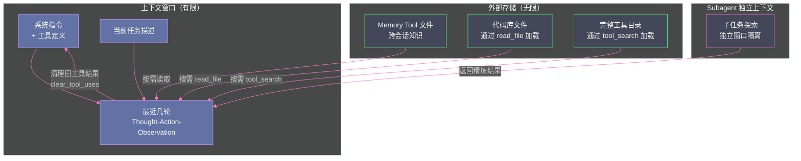

# 06 Prompt 上下文管理——Context Engineering 的艺术

> [!abstract] 摘要
> 当 Coding Agent 连续工作数小时——读几十个文件、执行上百条命令、做多次代码修改——它产生的 Thought、Action、Observation 会迅速撑爆 LLM 的上下文窗口。更致命的是，即使没有撑爆，上下文中的信息越多，LLM 的注意力越分散，推理质量越退化——这个现象被命名为"Context Rot（上下文腐烂）"。本文系统讨论 Agent 的上下文管理——从 Anthropic 2025 年 9 月提出的 Context Engineering 概念出发，理解"Prompt Engineering 关注怎么写指令，Context Engineering 关注哪些 token 该出现在窗口中"的根本区别；深入剖析 Context Rot 的注意力机制根因和 Chroma 18 模型研究的量化数据；然后逐一拆解 Anthropic 的四种上下文管理工具——Context Editing（clear_tool_uses / clear_thinking）、Memory Tool、Server-side Compaction——以及 Factory.ai 的 Anchored Iterative Summarization 结构化压缩方案；最后讨论 Coding Agent 的具体上下文策略——Just-in-Time Context、Subagent 上下文隔离、外部记忆体系。核心认知：Chroma 研究发现所有前沿模型的有效上下文窗口可能只有标称最大值的 1%——"更大上下文窗口"不是解决方案，"更聪明的上下文管理"才是。

---

## 第 1 章 从 Prompt Engineering 到 Context Engineering

### 1.1 两种工程范式的分野

在 LLM 应用的早期，大部分工程工作集中在 **Prompt Engineering**——如何写出有效的系统指令、设计好的 few-shot 示例、构建清晰的输出格式要求。这个阶段的核心问题是"如何让 LLM 理解你想让它做什么"。

但随着 Agent 从单轮调用走向多轮循环、从简单任务走向长时复杂任务，一个更根本的问题浮现了：**在每一步推理时，上下文窗口中应该放什么？**

Anthropic 在 2025 年 9 月发表的"Effective Context Engineering for AI Agents"一文中，明确区分了两种工程范式：

> [!info] 核心概念：Prompt Engineering vs Context Engineering
> **Prompt Engineering** refers to methods for writing and organizing LLM instructions for optimal outcomes.
> **Context Engineering** refers to the set of strategies for curating and maintaining the optimal set of tokens (information) during LLM inference, including all the other information that may land there outside of the prompts.

关键区别在于**作用域**：Prompt Engineering 关注的是"指令怎么写"——它主要操作系统提示词（system prompt）。Context Engineering 关注的是"整个上下文窗口里有什么"——不仅包括系统指令，还包括工具定义、MCP Server 暴露的上下文、外部数据、消息历史、工具调用结果、思考过程（thinking blocks）。

### 1.2 为什么 Agent 让 Context Engineering 变得至关重要

在单轮 LLM 调用中，上下文是静态的——你写好 prompt，发送一次，得到响应。上下文管理的复杂度很低。

但在 Agent 循环中，上下文是**动态增长**的：

- 每一步 Thought 产生推理文本，追加到上下文
- 每一步 Action 产生工具调用请求，追加到上下文
- 每一步 Observation 产生工具执行结果，追加到上下文
- 如果启用了 Extended Thinking，每一步的思考过程也追加到上下文

一个运行 50 步的 Coding Agent，可能累积数十万 token 的上下文。这些上下文在每一步推理时都会被完整发送给 LLM——意味着：

1. **token 成本线性增长**：第 50 步的 LLM 调用包含前 49 步的全部记录
2. **延迟线性增长**：处理 30 万 token 的输入比处理 3 万 token 慢得多
3. **推理质量退化**：这是最致命的——上下文越大，LLM 越难聚焦于当前任务的关键信息

### 1.3 Context Engineering 的核心原则

Anthropic 提出了 Context Engineering 的核心指导原则：

> Given that LLMs are constrained by a finite attention budget, good context engineering means finding the smallest possible set of high-signal tokens that maximize the likelihood of some desired outcome.

翻译：**好的上下文工程，是找到最小的高信号 token 集合，最大化期望结果的可能性。**

这个原则的关键词是"最小"——不是"尽可能多"，而是"尽可能少但足够"。这与人类专家的工作方式一致：一个经验丰富的工程师面对问题时，不会把所有可能相关的文档都读一遍，而是精准地找到最关键的几页。Context Engineering 就是为 Agent 设计同样的"信息筛选"能力。

---

## 第 2 章 Context Rot——上下文腐烂现象

### 2.1 什么是 Context Rot

**Context Rot（上下文腐烂）** 是指：随着上下文中 token 数量增加，LLM 的推理质量、信息检索准确率和指令遵循度逐渐下降的现象。这个现象不是"上下文窗口满了才发生"——而是在远小于窗口最大值时就开始出现。

Chroma 在 2025 年对 18 个前沿模型（包括 GPT-4.1、Claude Opus 4、Gemini 2.5 等）进行了系统测试，发现：

- **所有模型都存在 Context Rot**——无一例外
- **有些模型在仅 1,000 token 的无关上下文后就显著退化**
- **有效上下文窗口可能只有标称最大值的 1%**——一个标称 128K 上下文窗口的模型，实际有效窗口可能只有 1-10K

### 2.2 注意力机制的根因

Context Rot 的根因在 Transformer 的**注意力机制**本身：

注意力机制的核心是给上下文中的每个 token 分配一个"注意力权重"——决定在生成下一个 token 时，应该"关注"上下文中的哪些部分。这些权重之和为 1——意味着上下文越大，每个 token 平均获得的注意力权重越小。

具体来说，当一个 Agent 的上下文中包含：
- 系统指令：500 token
- 工具定义：2,000 token
- 50 步的 Thought-Action-Observation：150,000 token
- 当前任务的最新 Observation：500 token

LLM 在生成下一步时，需要"关注"的是最新 Observation 和原始任务指令。但注意力机制不会自动"知道"这些是最重要的——它会把注意力分散在整个 153,000 token 的上下文中。原始指令在 500/153000 ≈ 0.3% 的位置，它的注意力权重被大量历史记录稀释了。

> [!warning] 生产避坑：Context Rot 不是"窗口满了才退化"
> 很多开发者误以为"只要上下文没超过窗口最大值，就不用担心性能退化"。Chroma 的研究证明这是错误的——退化从上下文开始增长时就发生了，只是退化的速度因模型和任务而异。这意味着：即使你的 LLM 支持 200K 上下文窗口，也不应该把 150K 的历史记录全部塞进去——实际推理质量可能在 30K 时就已经开始下降。Anthropic 内部评估显示，Context Editing（清理旧上下文）相比不清理，可以提升 29% 的性能；Context Editing + Memory Tool 组合可以提升 39%。在 100 轮对话的 web 搜索评估中，Context Editing 减少了 84% 的 token 消耗。

### 2.3 量化数据："Less Context, Better Agents"

2026 年 6 月的论文"Less Context, Better Agents"（arXiv:2606.10209）用一组酒店费用明细化任务量化了上下文管理的影响：

| 策略 | 任务完成率 | token 消耗 | 耗时 |
| :--- | :---: | :---: | :---: |
| 无用户模型（基线） | 8.0% | — | — |
| 完整对话历史 | 71.0% | 1,480,996 | 14.56h |
| 修剪到最近 5 个工具对 | 79.0% | 535,274 | 5.39h |
| 修剪 + 摘要 | **91.6%** | 553,374 | 5.79h |

最后一行是最令人震惊的——**修剪 + 摘要比完整历史的完成率高 20.6 个百分点，同时 token 消耗减少 63%，速度快 2.5 倍**。这不是"少即是多"的哲学主张——这是硬数据证明"更少的高信号上下文比更多的低信号上下文效果更好"。

---

## 第 3 章 Anthropic 的四种上下文管理工具

Anthropic 在 Claude API 中提供了四种上下文管理工具，覆盖不同层面的上下文治理需求。

### 3.1 Context Editing——clear_tool_uses

**功能**：自动清理上下文窗口中过期的工具调用结果（tool results）。

**机制**：当对话上下文增长超过配置的阈值时，API 自动按时间顺序清理最旧的工具结果。每个被清理的结果被替换为占位符文本，让 Claude 知道"这里曾经有一个工具结果，但已被移除"。

**配置**：

```python
CONTEXT_MANAGEMENT = {
    "edits": [
        {
            "type": "clear_tool_uses_20250919",
            "trigger": {"type": "input_tokens", "value": 30000},  # 30K token 时触发
            "keep": {"type": "tool_uses", "value": 3},  # 保留最近 3 次工具调用
            "clear_at_least": {"type": "input_tokens", "value": 5000},  # 至少清理 5K
            "exclude_tools": ["web_search"]  # 排除特定工具不被清理
        }
    ]
}
```

关键配置参数：
- `trigger`：何时触发清理（如输入 token 超过 30K）
- `keep`：保留多少最近的工具调用（如保留最近 3 次）
- `clear_at_least`：每次至少清理多少 token（确保清理有意义，而非只清几百 token）
- `exclude_tools`：排除特定工具的结果不被清理（如 web_search 结果可能总是重要的）

**为什么有效**：工具结果（如文件内容、API 响应）通常是上下文中最大的组成部分。一旦 Claude 处理了某个工具结果，原始内容很少需要再次引用——如果需要，可以重新调用工具获取。清理旧工具结果是最安全的上下文治理手段——它移除了"体积大、信息密度低"的内容，保留了"体积小、信息密度高"的 Thought 和决策记录。

**`clear_tool_inputs` 选项**：默认只清理 tool_result（工具返回值），保留 tool_use（工具调用请求）。如果设置 `clear_tool_inputs: true`，连工具调用参数也一起清理——进一步减少 token，但失去了"Agent 曾经调用了什么工具、传了什么参数"的信息。

### 3.2 Context Editing——clear_thinking

**功能**：管理 Extended Thinking 产生的 `thinking` blocks。

**机制**：Extended Thinking 让 Claude 在输出前进行长篇内部推理——这些推理过程作为 `thinking` blocks 保存在上下文中。对于需要多轮推理的任务，thinking blocks 可能占据大量 token。`clear_thinking` 策略允许选择性保留或清理这些 blocks。

**配置**：

```python
{
    "type": "clear_thinking_20251015",
    "keep": {"type": "thinking_turns", "value": 1}  # 保留最近 1 轮的 thinking
}
```

`keep` 参数选项：
- `{"type": "thinking_turns", "value": 1}`：保留最近 1 轮的 thinking blocks
- `{"type": "all"}`：保留所有 thinking blocks（不清理）

默认行为因模型等级而异——更强的模型倾向于保留更多 thinking blocks：

| 模型 | 默认行为 |
| :--- | :--- |
| Claude Opus 4.5+ | 保留所有 thinking |
| Claude Opus 4.1- | 保留最近 1 轮 |
| Claude Sonnet 4.6+ | 保留所有 thinking |
| Claude Sonnet 4.5- | 保留最近 1 轮 |
| Claude Haiku | 保留最近 1 轮 |

> [!note] 设计哲学：thinking blocks 的保留策略因模型而异
> 为什么不同模型有不同的默认 thinking 保留策略？因为更强的模型（Opus/Sonnet 4.5+）的 thinking 质量更高，保留历史 thinking 可以为后续推理提供更好的上下文；而较弱的模型的 thinking 可能包含更多噪音，保留它们反而可能干扰后续推理。这种"因模型能力差异化配置"的设计，反映了一个更深层的认知：上下文管理的最优策略不是通用的，而是与具体模型的注意力特性相关的。

### 3.3 Memory Tool——跨会话的外部记忆

**功能**：让 Claude 通过文件系统在上下文窗口之外存储和检索信息——跨会话持久化。

**机制**：Memory Tool（`memory_20250818`）是一个特殊的工具，Claude 可以主动调用它来创建、读取、更新、删除存储在专用记忆目录中的文件。这些文件在对话之间持久存在——Session 1 中 Claude 写入的记忆，在 Session 2 中可以被读取。

**与 Context Editing 的关系**：Context Editing 是"自动清理旧上下文"——被动防御。Memory Tool 是"Claude 主动将重要信息存到外部"——主动外化。两者互补：Context Editing 移除不再需要的大块内容，Memory Tool 把仍然需要但不适合放在上下文中的内容外化到文件。

**工作方式**：Memory Tool 完全在客户端通过工具调用实现——开发者管理存储后端（如本地文件系统、S3），完全控制数据存储位置和持久化方式。Claude 自己决定什么时候写入记忆、什么时候读取记忆——这是"模型驱动的记忆管理"。

```python
# Memory Tool 配置示例
from anthropic.types.beta import BetaMemoryTool20250818Command

memory_tool = BetaMemoryTool20250818Command(
    type="memory_20250818",
    name="memory",
    storage=BetaLocalFileStorage(
        type="local_file",
        path="/memories"  # 记忆文件存储目录
    )
)
```

**适用场景**：
- **跨会话知识积累**：Agent 在 Session 1 中了解了项目架构，写入记忆文件；Session 2 开始时读取记忆，无需重新探索
- **长时任务状态维护**：Agent 在多日工作中维护任务进度，每次会话开始时读取上次的状态
- **调试经验保存**：Agent 发现的 bug 模式和解决方案存入记忆，未来遇到类似问题时可以参考

### 3.4 Server-side Compaction——服务端自动压缩

**功能**：API 服务端自动压缩对话历史——当上下文增长到阈值时，自动生成摘要替换原始历史。

**机制**：Compaction（`compact_20260112`）在输入 token 达到阈值（默认 150K，最低 50K）时触发。服务端将对话历史总结为一段压缩文本，替换原始的详细消息。压缩后的上下文包含：压缩摘要 + 最近几轮的原始对话。

**与 Context Editing 的区别**：
- Context Editing 是"删除"——直接移除旧内容，用占位符替代
- Compaction 是"压缩"——用摘要替换原始内容，保留信息要点

**可定制性**：Compaction 的 `instructions` 参数允许自定义压缩提示——你可以指定"压缩时保留文件路径、函数名和错误信息，丢弃具体的代码内容"。这让压缩结果更适合特定任务的需求。

```python
{
    "type": "compact_20260112",
    "trigger": {"type": "input_tokens", "value": 150000},
    "instructions": "Preserve file paths, function names, error messages, and architectural decisions. Discard verbose code snippets and detailed search results."
}
```

### 3.5 四种工具的对比

| 工具 | 作用层面 | 触发方式 | 信息保留 | 适用场景 |
| :--- | :--- | :--- | :--- | :--- |
| clear_tool_uses | 工具结果 | token 阈值 | 不保留（占位符） | 大量工具调用的 agentic 工作流 |
| clear_thinking | 思考过程 | 配置驱动 | 可配置保留轮数 | 启用 Extended Thinking 的长对话 |
| Memory Tool | 外部存储 | 模型主动调用 | 完全保留（在文件中） | 跨会话知识持久化 |
| Compaction | 整体历史 | token 阈值 | 摘要保留 | 超长对话的自动压缩 |

> [!info] 核心概念：四种工具不是互斥而是叠加
| 最佳实践是组合使用：clear_tool_uses 清理大块工具结果 + clear_thinking 管理思考过程 + Memory Tool 外化跨会话知识 + Compaction 作为最后兜底。Anthropic 的内部评估显示，clear_tool_uses + Memory Tool 的组合相比单独使用 clear_tool_uses，性能提升了额外 10 个百分点（从 29% 到 39%）。Claude Code 在生产中正是采用了这种组合策略——compaction 用于长对话压缩，两个互补的记忆系统用于跨会话持久化。

---

## 第 4 章 Factory.ai 的 Anchored Iterative Summarization

### 4.1 朴素摘要压缩的三个问题

最简单的上下文压缩方案是"当上下文超过阈值时，把前面的历史总结一下"——但 Factory.ai 在实践中发现这种朴素方案有三个严重问题：

**问题一：冗余重摘要**。每次触发压缩时，都对整个对话前缀做完整摘要——即使大部分前缀在上一轮已经被摘要过了。这意味着第 N 轮的摘要包含了第 N-1 轮已经做过的工作，造成计算浪费。

**问题二：成本线性增长**。需要摘要的文本量随对话长度线性增长——第 10 轮摘要 10 轮的内容，第 100 轮摘要 100 轮的内容。摘要本身的 LLM 调用成本随时间线性增加。

**问题三：永远在边缘**。一旦开始摘要，后续每一轮都运行在接近上下文最大值的状态——而如前所述，Context Rot 在远小于窗口最大值时就开始了。这意味着"开始摘要后，推理质量持续处于退化状态"。

### 4.2 Anchored Iterative Summarization 的设计

Factory.ai 的方案是**结构化的锚定迭代摘要**：

**结构化持久摘要**：维护一个持久化的摘要对象，包含固定结构化的字段——会话意图（session intent）、文件修改（file modifications）、已做决策（decisions made）、下一步（next steps）。每个字段作为检查清单存在。

**增量摘要**：压缩触发时，只摘要新被截断的 span（段落），然后与已有的持久化摘要合并。而非对整个前缀做完整重摘要。这消除了"冗余重摘要"问题——每次只处理增量部分。

**结构强制保留**：每个字段作为检查清单——如果新截断的 span 中有新的文件修改，就追加到"file modifications"字段；如果有新的决策，就追加到"decisions made"字段。这种结构化设计强制保留了操作细节（文件路径、函数名、错误信息），而非把它们模糊地"总结掉"。

### 4.3 评估结果

Factory.ai 构建了一个基于 probe 的评估框架——在压缩后，向 Agent 提出需要记住截断历史中特定细节的问题（如"最初的错误是什么？""我们修改了哪些文件？"），用 LLM judge 评分。

四种 probe 类型：
- **Recall**：事实保留（"最初的错误是什么？"）
- **Artifact**：文件追踪（"我们读取/修改了哪些文件？"）
- **Continuation**：任务续接（"Agent 能否从上次中断处继续？"）
- **Decision**：决策推理（"为什么我们选择了方案 A 而非方案 B？"）

评估结果：**Factory.ai 的结构化摘要比 OpenAI 的 `/responses/compact` 和 Anthropic 的 SDK 压缩保留了更多"继续任务"所需的信息**，且在相似的压缩率下实现。

> [!note] 设计哲学：上下文压缩的目标不是"最小化 token"，而是"最大化任务续接能力"
> Factory.ai 的评估框架揭示了一个关键认知：上下文压缩的质量不应该用"压缩率"或"ROUGE 分数"来衡量——应该用"Agent 能否基于压缩后的上下文继续完成任务"来衡量。一个压缩到 1/10 大小但丢失了文件路径和错误信息的摘要，比一个只压缩到 1/5 但保留了这些操作细节的摘要更差——因为前者导致 Agent 无法继续工作，需要重新探索（re-fetch），实际消耗的 token 更多。"关键指标不是 tokens per request，而是 tokens per task"——因为丢失细节导致的返工成本远高于多保留几个 token 的成本。

---

## 第 5 章 Just-in-Time Context——按需加载而非预加载

### 5.1 预加载 vs 按需加载

**预加载（Eager Loading）**：在任务开始时，把所有可能相关的信息都放入上下文——整个代码库的文件列表、所有工具的完整 Schema、所有相关的文档。这种方式的问题是：大部分预加载的信息在实际任务中用不到，但它们占据了上下文 token 并引发 Context Rot。

**按需加载（Just-in-Time Loading）**：上下文中只保留轻量级的标识符（文件路径、存储查询 ID、Web 链接），在运行时通过工具调用动态加载需要的数据。这是 Anthropic Claude Code 采用的策略——也是 Context Engineering 的核心实践之一。

### 5.2 Claude Code 的 Just-in-Time 实践

Claude Code 不在上下文中预加载整个代码库——它通过 `read_file`、`grep`、`glob` 等工具按需加载文件内容。上下文中保留的是文件路径（轻量级标识符），而非文件内容（重量级数据）。

当 Claude Code 需要查看某个文件时，它调用 `read_file` 工具——文件内容作为 Observation 进入上下文。当 Claude Code 处理完这个文件后，Context Editing 的 `clear_tool_uses` 会自动清理这个 Observation——释放上下文空间给下一步操作。

这种"加载→处理→清理→加载下一个"的循环，让 Claude Code 的有效上下文始终保持在"当前任务所需的最小集合"，而非"所有可能相关的信息的全集"。

### 5.3 Just-in-Time 与 Tool Search 的关系

[[03 Tool Use 与 Function Calling——三大厂商的标准化博弈|第 3 篇]]讨论的 Tool Search（OpenAI）和 Tool Search Tool（Anthropic）本质上是 Just-in-Time Context 在工具层面的应用——不预加载所有工具定义，而是在需要时搜索并加载相关工具。这与文件层面的 Just-in-Time Loading 是同一个设计原则在不同层面的实例化：

| 层面 | 预加载策略 | Just-in-Time 策略 |
| :--- | :--- | :--- |
| 文件内容 | 预读所有文件入上下文 | 保留路径，按需 read_file |
| 工具定义 | 预载所有工具 Schema | 保留工具名描述，按需 tool_search |
| 外部数据 | 预查数据库入上下文 | 保留查询 ID，按需 query |
| 网页内容 | 预抓所有链接入上下文 | 保留 URL，按需 fetch |

> [!info] 核心概念：Just-in-Time 是 Context Engineering 的第一性原则
> Anthropic 在 Context Engineering 文章中明确指出：Just-in-Time Context 是所有上下文管理策略的基础原则。无论是 Context Editing（清理旧上下文）、Memory Tool（外化到文件）、还是 Tool Search（按需加载工具），本质上都是在实践"Just-in-Time"——让上下文中只保留当前推理步骤需要的最小信息集合，其余信息存储在外部，需要时再加载。这与计算机内存管理的虚拟内存/换页机制异曲同工——物理内存（上下文窗口）有限，大部分数据放在磁盘（外部存储）上，只按需加载到内存中。

---

## 第 6 章 Subagent 上下文隔离

### 6.1 为什么需要上下文隔离

当主 Agent 的上下文已经很大时，如果它还需要执行一个需要大量独立探索的子任务（如"搜索代码库中所有使用了某 API 的位置"），把这个子任务放在主 Agent 的上下文中执行会进一步加剧 Context Rot。

Subagent 机制（Claude Code 的核心特性之一）解决了这个问题——主 Agent 委派子任务给一个拥有**独立上下文窗口**的 Subagent。Subagent 在自己的上下文中完成探索，只把最终结果（而非中间的 Thought-Action-Observation 链）返回给主 Agent。

### 6.2 上下文隔离的效果

```
没有 Subagent：
主 Agent 上下文 = [系统指令 + 任务描述 + 前 20 步历史 + 子任务探索的 15 步]
                  ≈ 80,000 token（Context Rot 已显著）

有 Subagent：
主 Agent 上下文 = [系统指令 + 任务描述 + 前 20 步历史 + Subagent 返回的 500 token 结果]
                  ≈ 40,500 token（Context Rot 可控）
Subagent 上下文 = [子任务指令 + 15 步探索] ≈ 30,000 token（独立窗口，不影响主 Agent）
```

Subagent 的上下文隔离效果是：
1. **主 Agent 上下文不被子任务的中间过程污染**——只接收最终结果
2. **Subagent 有自己的完整上下文窗口**——可以在自己的窗口中做深度探索
3. **并行性**——多个 Subagent 可以同时运行，各自有独立上下文，不互相干扰

> [!warning] 生产避坑：Subagent 结果也要控制大小
> Subagent 返回给主 Agent 的结果应该被严格控制大小——理想情况下是几百到几千 token 的摘要，而非几万 token 的完整探索记录。如果 Subagent 返回了一个 20,000 token 的结果，它同样会毒化主 Agent 的上下文。Claude Code 的 Subagent 设计要求返回"精炼的结果摘要"而非"完整的探索日志"——这是 Subagent 机制有效的前提。本专栏第 7 篇将深入 Claude Code 的 Subagent 机制设计。

---

## 第 7 章 Coding Agent 的上下文策略综合

### 7.1 多层上下文管理体系

一个生产级 Coding Agent（如 Claude Code）的上下文管理不是单一策略，而是多层体系的组合：



### 7.2 策略组合的时间轴

在一个长时 Coding Agent 会话中，上下文管理策略的运作时间轴：

1. **会话开始**：上下文 = 系统指令 + 工具定义 + 用户任务描述。读取 Memory Tool 中的上次会话记忆（如果有）。
2. **探索阶段**：通过 read_file/grep/glob 工具按需加载代码库内容。每个工具结果作为 Observation 进入上下文。
3. **上下文增长**：随着步骤增加，上下文逐渐增大。当达到 clear_tool_uses 的触发阈值时，旧工具结果被自动清理。
4. **子任务委派**：遇到需要大量探索的子任务时，委派给 Subagent，避免污染主上下文。
5. **上下文压缩**：如果对话极长（如多日会话），Compaction 触发，将旧历史压缩为摘要。
6. **会话结束**：将本次会话的关键发现写入 Memory Tool 文件，供下次会话使用。

### 7.3 与 Anthropic 的最佳实践对齐

Anthropic 在 Context Engineering 文章中推荐的实践，与上述策略体系高度一致：

1. **把上下文当作稀缺的宝贵资源**——不预加载，按需加载
2. **构建最小、干净的系统提示**——系统指令也消耗 token，应该精简
3. **设计 token 高效的工具和 API**——工具返回结果应该精炼，不返回大量无关数据
4. **动态检索上下文**——Just-in-Time，不预加载
5. **长时任务的一致性技术**——Memory Tool + Compaction + Subagent 组合

---

## 第 8 章 总结与下一篇导读

### 8.1 本文核心要点

1. **Context Engineering ≠ Prompt Engineering**：前者关注"哪些 token 该在窗口中"，后者关注"指令怎么写"——Agent 的多轮循环让前者变得同样重要
2. **Context Rot 是所有模型的通病**：Chroma 18 模型研究证明所有前沿模型都存在上下文退化，有效窗口可能只有标称值的 1%——"更大窗口"不是解药
3. **"Less Context, Better Agents"**：修剪+摘要比完整历史的完成率高 20.6 个百分点、token 减少 63%——更少的高信号上下文效果更好
4. **Anthropic 四种工具叠加使用**：clear_tool_uses（清理工具结果）+ clear_thinking（管理思考过程）+ Memory Tool（跨会话外化）+ Compaction（服务端压缩兜底）
5. **Factory.ai 结构化摘要优于朴素摘要**：Anchored Iterative Summarization 通过结构化字段强制保留操作细节，增量摘要避免冗余——评估证明比 OpenAI/Anthropic 的方案保留更多任务续接信息
6. **Just-in-Time Context 是第一性原则**：不预加载，按需加载——文件、工具、数据、网页都遵循同一原则
7. **Subagent 上下文隔离**：子任务在独立窗口中执行，只返回精炼结果——避免子任务中间过程污染主上下文

### 8.2 下一篇导读

本文讨论了 Agent 上下文管理的通用技术。下一篇 [[07 Claude Code 架构解构——Anthropic 的 CLI Agent 设计哲学]] 将把这些技术落地到一个具体的 Coding Agent——深入 Claude Code 的架构：多表面设计、文件读写/Bash 执行/Git 操作的具体工具机制、Subagent 与 Dynamic Workflows、权限模型七种模式、Session 持久化、已知 bug 与生产避坑。

> [!info] 专栏导航
> 本文是 [[00 专栏导览|Coding Agent 运行范式专栏]] 的第 6 篇。前 5 篇建立了 Agent 范式、ReAct 循环、Function Calling、MCP 协议的技术基础；本文讨论了贯穿所有这些机制的上下文管理挑战。接下来第 7-10 篇将逐一解构四大 Coding Agent 的架构。

---

## 参考文献

1. Anthropic. "Effective Context Engineering for AI Agents." 2025-09-29. https://www.anthropic.com/engineering/effective-context-engineering-for-ai-agents
2. Anthropic. "Managing context on the Claude Developer Platform." 2025-09-29. https://www.anthropic.com/news/context-management
3. Anthropic. "Context editing." https://platform.claude.com/docs/en/build-with-claude/context-editing
4. Anthropic. "Memory & context management with Claude Sonnet 4.6." https://platform.claude.com/cookbook/tool-use-memory-cookbook
5. Anthropic. "Context engineering: memory, compaction, and tool clearing." https://platform.claude.com/cookbook/tool-use-context-engineering-context-engineering-tools
6. Factory.ai. "Evaluating Context Compression for AI Agents." 2025-12-16. https://factory.ai/news/evaluating-compression
7. Factory.ai. "Compressing Context." https://factory.ai/news/compressing-context
8. Lodha, A. et al. "Less Context, Better Agents." arXiv:2606.10209, 2026.
9. Chroma. "Context Rot research." 2025. https://www.flowverify.co/blog/context-rot-production-llm-engineering
10. "Diagnosing and Mitigating Context Rot in Long-horizon Search." arXiv:2606.29718, 2026.

---

## 思考题

1. **你的 Coding Agent 运行到第 30 步时，上下文已经 50K token。你选择触发 Compaction（整体压缩）还是 clear_tool_uses（只清理工具结果）？为什么？** 提示：考虑两种策略的信息损失差异——Compaction 把所有历史总结为摘要，可能丢失操作细节；clear_tool_uses 只清理工具结果但保留 Thought 和决策记录。哪种信息损失对你的任务更致命？

2. **Memory Tool 让 Claude 自己决定"什么时候写入记忆、写入什么"。这种"模型驱动的记忆管理"相比"开发者预定义的记忆规则"有什么优势和风险？** 提示：优势是灵活性——Claude 可以根据具体任务决定什么值得记住；风险是 Claude 可能记住了不重要的事情而忘记了关键的——如何确保记忆质量？

3. **Chroma 研究发现有些模型在仅 1,000 token 的无关上下文后就显著退化。但另一项研究（zenodo.20753848）在控制实验中"未观察到长度驱动的退化"。这两个结论矛盾吗？如何调和？** 提示：考虑实验设计的差异——前者测试的是真实多轮 agentic 工作流中的退化，后者测试的是控制条件下的单轮固定 needle 检索。Context Rot 可能是"多轮累积"效应而非"单轮长度"效应。
