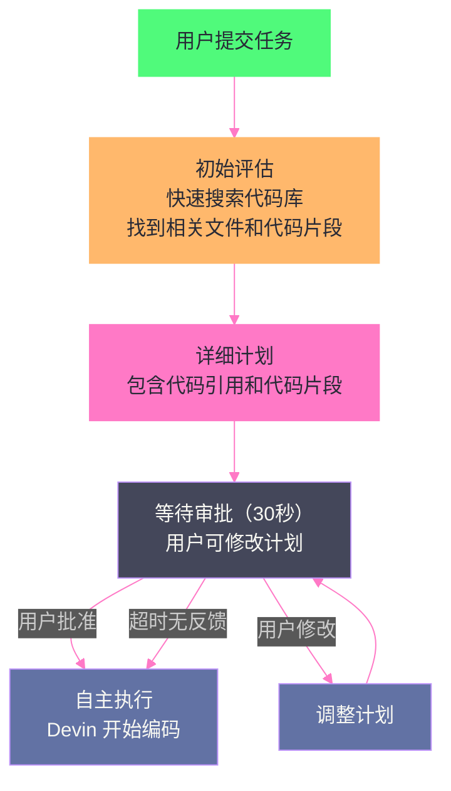

# 08 Devin 与 ACI 设计——为 Agent 认知而生的计算机接口

> [!abstract] 摘要
> [[07 Claude Code 架构解构——Anthropic 的 CLI Agent 设计哲学|上一篇]]解构了 Anthropic 的 Claude Code——一个从 Terminal 出发、用专用工具集和渐进式权限模型构建的 CLI Agent。本文转向 Cognition 的 Devin——一个走完全不同路线的 Coding Agent。Devin 的核心创新不是工具集或权限模型，而是 ACI（Agent Computer Interface）概念——为 Agent 的认知模式而非人类的认知模式设计交互接口。文章从 Princeton SWE-agent 论文的 ACI 概念出发，理解"为什么同样的 LLM，用不同的工具接口设计，性能可以从接近零提升到 SOTA"；然后深入 Devin 的沙箱化计算环境（shell + code editor + browser）、Computer Use 能力（完整桌面环境的鼠标键盘操作）、长时任务执行机制（SWE-bench 13.86% 的突破性表现）；接着剖析 Devin 2.0 的三大新特性——Interactive Planning（主动研究代码库并生成详细计划）、Devin Search（agentic 代码库探索）、Devin Wiki（自动索引仓库）；最后讨论 Devin 2.1 的 Confidence Reporting（🟢🟡🔴 信心度报告）如何解决"Coding Agent 过度自信"问题。核心认知：ACI 设计是 Coding Agent 性能的关键变量——同样的 LLM，好的 ACI 可以让 pass@1 从 1.96% 提升到 13.86%，这是 7 倍的性能差异，完全来自接口设计而非模型能力。

---

## 第 1 章 ACI 概念——Agent Computer Interface 的提出

### 1.1 人类有 IDE，Agent 有什么

人类软件开发者使用 IDE（集成开发环境）——语法高亮、代码补全、跳转定义、查找引用、调试器、Git 集成。这些工具是为**人类的认知模式**设计的：人类视觉系统擅长阅读高亮代码、人类记忆需要面包屑导航、人类手指习惯键盘快捷键。

但 LLM Agent 是一种全新的"用户"——它没有视觉系统（只有文本输入）、没有手指（只有工具调用）、注意力机制与人类完全不同。让 Agent 使用为人类设计的工具（如直接用 `cat` 看文件、用 `sed` 编辑文件），就像让一个色盲用户使用依赖颜色区分的界面——不是不可能，但效率极低。

### 1.2 Princeton SWE-agent 的 ACI 概念

2024 年，Princeton 大学的 John Yang 等人发表了 SWE-agent 论文（NeurIPS 2024），正式提出了 **Agent-Computer Interface（ACI）** 概念：

> LM agents represent a new category of end users with their own needs and abilities, and would benefit from specially-built interfaces to the software they use.

核心论点：**LLM Agent 是一种新型终端用户，有自己的需求和能力，需要专门为其设计的计算机接口**——就像人类需要 IDE 一样，Agent 需要 ACI。

### 1.3 ACI 设计的量化影响

SWE-agent 论文的最有力证据是一个对比实验：

| 配置 | SWE-bench pass@1 |
| :--- | :---: |
| 基线 Agent（无优化 ACI，直接用 shell 命令） | ~2% |
| SWE-agent（定制 ACI） | **12.5%** |
| 前SOTA（即使给定确切文件，"assisted"模式） | 4.80% |

从 ~2% 到 12.5%——**6 倍的性能提升完全来自 ACI 设计，而非模型能力的变化**。这证明了一个关键认知：**Coding Agent 的性能瓶颈往往不在 LLM 本身，而在 LLM 与计算机环境的接口设计**。

### 1.4 ACI 的四条设计原则

SWE-agent 论文总结了 ACI 设计的关键经验：

**原则一：集成 Linter**。编辑命令发出时自动运行 linter——如果代码有语法错误，编辑命令不通过。这防止了 Agent 在代码中引入语法错误后继续基于错误代码推理——一个小的语法错误可能在后续步骤中被放大为严重的逻辑错误。

**原则二：专用文件查看器而非 `cat`**。SWE-agent 为 Agent 设计了专门的文件查看器，每轮只显示 100 行。这直接呼应了 [[02 ReAct 架构深度解析——Thought-Action-Observation 循环的本质|第 2 篇]]讨论的 Observation 治理——防止大文件毒化上下文。文件查看器还支持滚动和文件内搜索，比 `cat` 更适合 Agent 的分步消费模式。

**原则三：简洁的搜索输出**。搜索命令只列出有匹配的文件名，不显示匹配行的上下文。SWE-agent 团队发现"给模型展示更多关于每个匹配的上下文"反而让模型更困惑——简洁的输出让 Agent 先定位文件，再决定是否深入查看。

**原则四：明确的空输出反馈**。当命令执行没有输出时，返回"Your command ran successfully and did not produce any output"而非空字符串。空输出会让 Agent 不确定"是命令失败了还是成功了但没有输出"——明确的反馈消除了这种不确定性。

> [!info] 核心概念：ACI 设计是"认知工程"而非"软件工程"
> ACI 设计的本质不是"让工具更好用"（这是软件工程的目标），而是"让工具更适配 LLM 的认知模式"（这是认知工程的目标）。人类觉得好用的工具（如显示完整文件内容的 `cat`），对 LLM 来说可能恰恰是"毒化上下文"的坏工具。人类觉得冗余的反馈（如"命令成功但无输出"），对 LLM 来说可能是消除不确定性的关键信息。ACI 设计要求开发者"站在 LLM 的角度思考"——不是"人类会怎么用这个工具"，而是"LLM 的注意力机制会怎么处理这个工具的输出"。

---

## 第 2 章 Devin 的架构——沙箱化计算环境

### 2.1 Devin 的核心设计

Cognition 在 2024 年 3 月发布 Devin 时，称其为"第一个 AI 软件工程师"。Devin 的核心设计包含三个要素：

**长时推理和规划**：Devin 可以规划和执行需要数千次决策的复杂工程任务——这超越了 ReAct 的"走一步看一步"模式，更接近 [[01 Agent 运行范式全景——从 ReAct 到 Production Agent 的演进|第 1 篇]]讨论的 Plan-and-Execute 范式。

**沙箱化计算环境**：Devin 在一个沙箱化的计算环境中工作——包含 shell、code editor 和 browser。这个环境是"完整的开发者工作站"——Devin 可以像人类开发者一样在 shell 中执行命令、在 editor 中修改代码、在 browser 中查阅文档。

**常见开发者工具**：Devin 被配备了"人类开发者工作所需的一切工具"——这是 ACI 理念的实践。不是给 Agent 简化的"玩具工具"，而是给 Agent 真实的"开发者工具"。

### 2.2 SWE-bench 的突破性表现

Devin 在 SWE-bench 上的表现是里程碑式的：

| 系统 | SWE-bench pass@1 | 备注 |
| :--- | :---: | :--- |
| 前SOTA（unassisted） | 1.96% | 不告诉 Agent 要改哪些文件 |
| 前SOTA（assisted） | 4.80% | 即使告诉确切文件 |
| **Devin** | **13.86%** | unassisted，Agent 自己导航文件 |

Devin 在"不告诉要改哪些文件"的更难设定下，超越了"告诉确切文件"的前SOTA 2.9 倍。这个突破的核心不是模型更强（Devin 使用的也是 GPT-4 级别的模型），而是 ACI 设计和长时规划能力的结合。

**评估设定**：
- Devin 收到 GitHub issue 描述后端到端运行
- 运行期间不接收任何额外用户输入
- 仓库被 clone 到 Agent 环境中，git remote 被移除（防止 `git pull` 信息泄漏）
- Python conda 环境预先设置
- 限制 45 分钟运行时间（Devin 有能力无限运行，但评估设了时限）

### 2.3 沙箱环境的隔离需求

Devin 的沙箱化计算环境是一个关键架构决策——Agent 在隔离环境中执行代码，而非直接在用户的机器上执行。这呼应了 [[云原生/Agent沙箱与隔离技术/00 专栏导览|Agent 沙箱与隔离技术]]专栏的主题——当 Agent 有完整的 shell、代码执行和浏览器能力时，沙箱隔离不再是"可选的安全增强"，而是"必需的安全基础"。

Devin 的沙箱环境需要隔离：
- **文件系统**：Agent 不能访问宿主机的文件系统
- **网络**：Agent 的网络访问需要受控（Egress 过滤）
- **进程**：Agent 执行的代码不能影响宿主机进程
- **凭证**：宿主机的 API Key、SSH Key 不能被 Agent 访问

---

## 第 3 章 Computer Use——完整桌面环境操作

### 3.1 超越浏览器自动化

Devin 2.0/2.1 引入了 Computer Use 能力——不仅仅是浏览器自动化，而是**完整的桌面环境操作**：

- **鼠标操作**：点击、拖拽、滚动
- **键盘操作**：输入文字、快捷键
- **截图**：查看屏幕当前状态
- **1024×768 像素显示**：Devin 看到的屏幕分辨率

**可交互的应用类型**：
- Web 应用（Chrome 中的网页——点击按钮、填表单、导航页面）
- 桌面应用（Electron 应用、IDE、平台原生 GUI）
- 终端 UI 程序（TUI 程序、交互式 CLI）
- 任何能在桌面上渲染的视觉界面

### 3.2 Computer Use 的工程价值

Computer Use 让 Devin 能做到传统 Coding Agent 做不到的事情：

**视觉验证**：Devin 可以运行修改后的代码，截图查看 UI 效果，确认修改是否正确呈现——而非仅靠代码逻辑推断。

**GUI 测试**：Devin 可以像人类 QA 一样，点击应用的各个功能、填表单、验证响应——这是传统基于代码的测试无法覆盖的。

**非代码文档查阅**：有些文档只有 Web 界面或 PDF 阅读器才能正确显示——Devin 可以打开浏览器查阅，而非只能 `curl` 获取 HTML。

### 3.3 平台支持

| 平台 | Computer Use 支持 |
| :--- | :--- |
| Linux（默认） | ✅ 完整 Linux 桌面环境 |
| Windows | ✅ 完整 Windows 桌面环境 |
| macOS | ❌ 不支持 |

Linux 作为默认平台的原因与沙箱技术生态有关——Linux 有成熟的容器隔离技术（[[云原生/Agent沙箱与隔离技术/00 专栏导览|Agent 沙箱专栏]]的主题），适合作为 Devin 沙箱环境的底层。

> [!note] 设计哲学：Computer Use 是"人类工作方式的模拟"
> Devin 的 Computer Use 设计哲学是"让 Agent 像人类开发者一样工作"——人类开发者不只是写代码，还会运行应用、看 UI 效果、用浏览器查文档、点击按钮做测试。传统 Coding Agent 只覆盖了"写代码"这一环，Devin 通过 Computer Use 覆盖了"写代码→运行→看效果→调试"的完整循环。这种"完整工作循环"的能力，是 Devin 在 SWE-bench 上表现优异的重要原因——很多 bug 的修复需要"运行代码→观察错误→修改→再运行"的迭代，而非仅靠静态代码分析。

---

## 第 4 章 Devin 2.0——Agent-Native IDE 与 Interactive Planning

### 4.1 Devin 2.0 的三大新特性

2025 年，Cognition 发布了 Devin 2.0——一个重大的架构升级，包含三个核心特性：

**Interactive Planning（交互式规划）**：每次启动会话时，Devin 主动研究代码库并在数秒内生成详细计划——包含相关文件、关键发现和实现问题。开发者可以在 Devin 开始自主工作前审查和调整计划。

**Devin Search（代码库搜索）**：一个 agentic 工具，用于探索和理解代码库。可以直接问代码库问题，获得带代码引用的详细回答。深度查询可以开启 Deep Mode。

**Devin Wiki（代码库文档）**：自动索引仓库，生成代码库的文档和导航。

### 4.2 Interactive Planning 的工作流程

Interactive Planning 的核心价值是**"先对齐再执行"**——在 Devin 开始自主工作前，确保它对任务的理解与开发者的预期一致。这解决了 Coding Agent 的一个常见痛点：Agent 基于对任务的误解做了大量工作，最终结果完全不对——浪费了时间和计算资源。

**初始评估**：Devin 对代码库做快速搜索（利用预索引），找到相关文件和代码片段。可能包含代码引用，开发者可以点击深链直接跳转到 Devin IDE 中查看。

**详细计划**：基于初始评估，Devin 生成包含代码引用和代码片段的详细实现计划。开发者可以检查这些引用，确认 Devin 找到的是正确的代码。

**等待审批**：默认等待 30 秒。如果开发者无反馈，Devin 自动开始执行。如果开发者提供反馈，Devin 调整计划后再次等待。

### 4.3 Devin IDE——Agent-Native 的 VSCode 环境

Devin 2.0 引入了 Devin IDE——一个基于 VSCode 的云端 IDE，Devin 在其中完成工作：

- **实时查看**：开发者可以实时查看 Devin 的编辑
- **直接修改**：开发者可以用熟悉的 VSCode 工具和快捷键（如 Cmd+I、Cmd+K）直接修改 Devin 的代码
- **多并行 Devin**：可以同时运行多个 Devin，每个有自己的云端 IDE

这种"Agent-Native IDE"设计与 Claude Code 的"Terminal 优先"形成鲜明对比——Devin 选择了 IDE 作为核心界面，因为 IDE 提供了代码编辑的可视化反馈，适合 Computer Use 的"看屏幕"能力。

### 4.4 Devin Search 与 DeepWiki

Devin Search 是一个 agentic 代码库探索工具——不是简单的关键词搜索，而是"Agent 驱动的代码库问答"。你可以问"这个项目的认证机制是怎么实现的？"，Devin Search 会探索代码库并返回带代码引用的详细回答。

DeepWiki 将这种代码库理解能力产品化——自动为仓库生成文档和导航，并提供了 MCP Server 接口，让其他 AI 应用可以通过 MCP 协议访问 DeepWiki 的文档和搜索能力。

---

## 第 5 章 Devin 2.1——Confidence Reporting

### 5.1 Coding Agent 的"过度自信"问题

Coding Agent 有一个普遍问题：**过度自信**。Agent 在收到任务后，往往直接开始执行，不评估自己能否成功——即使任务实际上超出了它的能力范围。结果是浪费了大量时间和计算资源后，产出了一个无法合并的 PR。

### 5.2 Confidence Scores 机制

Devin 2.1 引入了 Confidence Scores——在会话的多个时间点报告信心度：

**报告时机**：
- 会话开始时
- 创建计划后
- 回答代码相关问题时

**三级信心度**：

| 信心度 | 含义 | 行为 |
| :--- | :--- | :--- |
| 🟢 绿色 | 高信心 | 自动执行，不需审批 |
| 🟡 黄色 | 中等信心 | 等待用户审批后才执行 |
| 🔴 红色 | 低信心 | 等待用户审批，可能提出澄清问题 |

**关键数据**：Cognition 报告称，🟢 评分的 PR 合并率是 🔴 的**两倍**——信心度与实际成功率高度相关。这意味着 Devin 的自我评估是准确的——它不是"假装有信心"，而是真的能区分"能做"和"可能做不了"的任务。

### 5.3 自动评分与批量 Issue 处理

Devin 2.1 的 Confidence Scores 可以与 Linear/Jira 集成——批量给多个 Issue 评分，且**不需要启动实际 Devin 会话**：

- 在 Linear/Jira 中给 Issue 添加 "Devin" 标签
- Devin 自动扫描所有标记的 Issue，为每个提供信心度评分
- 开发者根据评分决定让 Devin 优先处理哪些 Issue

这种"先评分再执行"的工作流避免了在低成功率任务上浪费资源——一个团队可能有几十个待办 Issue，但只有部分适合 Agent 自动处理。Confidence Scores 让团队可以快速识别哪些值得交给 Devin。

> [!info] 核心概念：自我评估能力是 Agent 可靠性的关键
> Devin 的 Confidence Scores 揭示了一个重要的工程认知：Agent 的可靠性不仅取决于"做事情的能力"，还取决于"知道自己做不了什么的能力"。一个"什么都敢试但不告诉你成功率"的 Agent，比一个"明确告诉你这个任务它只有 30% 信心"的 Agent 更危险——前者让你在不可能的任务上浪费时间，后者让你可以做出明智的决策。Confidence Reporting 是 Agent 可靠性工程的重要组成部分——它让 Agent 从"黑箱执行者"变成"可评估的合作者"。

### 5.4 信心度不足时的行为

当 Devin 的信心度不是 🟢 时，它会：
- **提出澄清问题**：通过回答这些问题，开发者可以帮助 Devin 提高理解度和信心度
- **等待用户审批**：不自动执行计划，而是等开发者确认

开发者可以通过提供更多上下文、回答问题或调整计划来帮助 Devin 达到 🟢 信心度。这种"人机协作提升信心度"的设计，把"Agent 信心度不足"从"任务失败"变成了"人机沟通机会"。

---

## 第 6 章 Devin vs Claude Code——两种设计哲学

### 6.1 架构对比

| 维度 | Devin | Claude Code |
| :--- | :--- | :--- |
| **核心界面** | Devin IDE（VSCode-based 云端 IDE） | Terminal CLI |
| **ACI 理念** | 模拟人类开发者完整工作循环（写代码+运行+看UI+调试） | 专用工具集优化 LLM 认知效率 |
| **Computer Use** | ✅ 完整桌面环境操作 | ✅ 但非核心设计 |
| **规划模式** | Interactive Planning（先对齐再执行） | Plan mode（探索不修改） |
| **信心度报告** | ✅ 🟢🟡🔴 三级信心度 | ❌ 无显式信心度 |
| **并行模式** | 多并行 Devin，每个有独立云端 IDE | Subagent / Agent View / Dynamic Workflows |
| **沙箱** | 沙箱化计算环境（内置） | 在用户机器上运行（需用户自行隔离） |
| **定价** | $20/月起 | API 使用量计费 |
| **开源** | 闭源 | 闭源（但有详细文档） |

### 6.2 设计哲学差异

**Devin 的哲学：模拟人类**。Devin 的设计核心是"让 Agent 像人类开发者一样工作"——有 IDE、有浏览器、有桌面环境、能看屏幕、能点按钮。这种哲学的优势是 Agent 可以覆盖"写代码→运行→看效果→调试"的完整循环；劣势是资源开销大（每个 Devin 需要一个完整的云端 IDE 和桌面环境）。

**Claude Code 的哲学：优化 LLM**。Claude Code 的设计核心是"为 LLM 的认知模式优化工具"——专用工具集（Read/Edit/Grep）、渐进式权限、Subagent 上下文隔离。这种哲学的优势是轻量高效（直接在终端运行，不需要云端环境）；劣势是缺少"看屏幕"和"操作 GUI"的能力。

> [!note] 设计哲学：两种哲学不是优劣之分，而是场景之分
> Devin 的"模拟人类"哲学更适合需要完整开发循环的复杂任务——如修复需要运行应用才能复现的 UI bug、需要浏览器查阅多个文档的跨系统集成。Claude Code 的"优化 LLM"哲学更适合在开发者本地环境中的快速迭代——如修改代码、运行测试、提交 PR。选择哪个，取决于任务是否需要"完整桌面环境"和"视觉验证"。对于不需要 GUI 的纯代码任务，Claude Code 的轻量方案更高效；对于需要"运行+看效果"的任务，Devin 的完整环境更可靠。

---

## 第 7 章 总结与下一篇导读

### 7.1 本文核心要点

1. **ACI 是 Coding Agent 性能的关键变量**：Princeton SWE-agent 证明，同样的 LLM，好的 ACI 设计可以让 SWE-bench pass@1 从 ~2% 提升到 12.5%——6 倍提升完全来自接口设计
2. **ACI 四条设计原则**：集成 Linter（防语法错误传播）、专用文件查看器（100 行/轮，防上下文毒化）、简洁搜索输出（只列文件名）、明确空输出反馈
3. **Devin 的沙箱化计算环境**：shell + code editor + browser，Agent 在隔离环境中像人类开发者一样工作
4. **Computer Use 超越浏览器自动化**：完整桌面环境的鼠标键盘操作，支持 Web 应用、桌面应用、TUI 程序的视觉交互
5. **Interactive Planning**：先对齐再执行——Devin 主动研究代码库并生成详细计划，等开发者审批后自主执行
6. **Confidence Reporting**：🟢🟡🔴 三级信心度，🟢 评分的 PR 合并率是 🔴 的两倍——自我评估能力是 Agent 可靠性的关键
7. **两种设计哲学**：Devin 模拟人类（完整工作循环+视觉验证）、Claude Code 优化 LLM（专用工具+轻量高效）——不是优劣之分，而是场景之分

### 7.2 下一篇导读

本文解构了 Devin——一个"模拟人类开发者"的 Coding Agent。下一篇 [[09 OpenHands 与 Aider——开源 Coding Agent 的两种哲学]] 将转向开源世界——OpenHands（原 OpenDevin）和 Aider 两个开源 Coding Agent。OpenHands 用 Event Stream 架构和 Docker 沙箱 Runtime 实现"开源版 Devin"；Aider 用单进程架构和 Repo Map（Tree-sitter + PageRank）实现"轻量级 Terminal Agent"。两者代表了开源 Coding Agent 的两种截然不同的设计哲学。

> [!info] 专栏导航
> 本文是 [[00 专栏导览|Coding Agent 运行范式专栏]] 的第 8 篇。上一篇解构了 Claude Code；本文解构了 Devin；下一篇将继续解构 OpenHands 和 Aider 两个开源 Coding Agent。

---

## 参考文献

1. Cognition. "Introducing Devin, the first AI software engineer." 2024-03. https://cognition.ai/blog/introducing-devin
2. Cognition. "SWE-bench technical report." https://cognition.ai/blog/swe-bench-technical-report
3. Cognition. "Devin 2.0." https://cognition.ai/blog/devin-2
4. Cognition. "Devin 2.1." https://cognition.ai/blog/devin-2-1
5. Devin Computer Use Documentation. https://cognitionai.mintlify.app/work-with-devin/computer-use
6. Devin Interactive Planning. https://docs.devin.ai/work-with-devin/interactive-planning
7. Yang, J. et al. "SWE-agent: Agent-Computer Interfaces Enable Automated Software Engineering." NeurIPS 2024. https://proceedings.neurips.cc/paper_files/paper/2024/file/5a7c947568c1b1328ccc5230172e1e7c-Paper-Conference.pdf
8. SWE-agent GitHub. https://github.com/princeton-nlp/swe-agent
9. SWE-agent ACI Documentation. https://github.com/SWE-agent/SWE-agent/blob/main/docs/background/aci.md
10. Cognition. "A review of OpenAI's o1 and how we evaluate coding agents." https://cognition.ai/blog/evaluating-coding-agents

---

## 思考题

1. **SWE-agent 的 ACI 设计发现"给模型展示更多关于每个搜索匹配的上下文"反而让模型更困惑。这与人类直觉相反——人类通常希望看到更多上下文来理解搜索结果。为什么 LLM 的"上下文偏好"与人类不同？** 提示：考虑 LLM 的注意力机制——过多的上下文会稀释对关键信息的注意力（Context Rot），而人类可以通过视觉快速扫描和忽略无关内容。

2. **Devin 的 Confidence Scores 与 Devin 的实际成功率高度相关（🟢 是 🔴 的两倍）。但这种自我评估能力本身是否可靠？如果 Devin 系统性地高估自己的能力（所有评分都偏向 🟢），Confidence Scores 就失去了价值。如何验证 Agent 自我评估的校准度？** 提示：考虑"校准评估"——不仅看"🟢 评分的 PR 合并率是否高于 🔴"，还要看"🟢 评分中实际合并的比例是否接近 100%"——如果 🟢 评分的 PR 只有 40% 合并，说明 Devin 高估了自己。

3. **Devin 的 Computer Use 让它可以"看屏幕、点按钮"。但这引入了一个新的安全风险——Agent 可以通过 GUI 绕过命令行的权限控制（如通过文件管理器 GUI 访问命令行被禁止的路径）。如何在 Computer Use 场景下做权限控制？** 提示：考虑操作系统级的权限控制——无论是命令行还是 GUI，最终都通过 syscall 访问文件系统。seccomp 和 namespaces 等 OS 级隔离对 GUI 操作同样有效，因为 GUI 最终也是 syscall。
