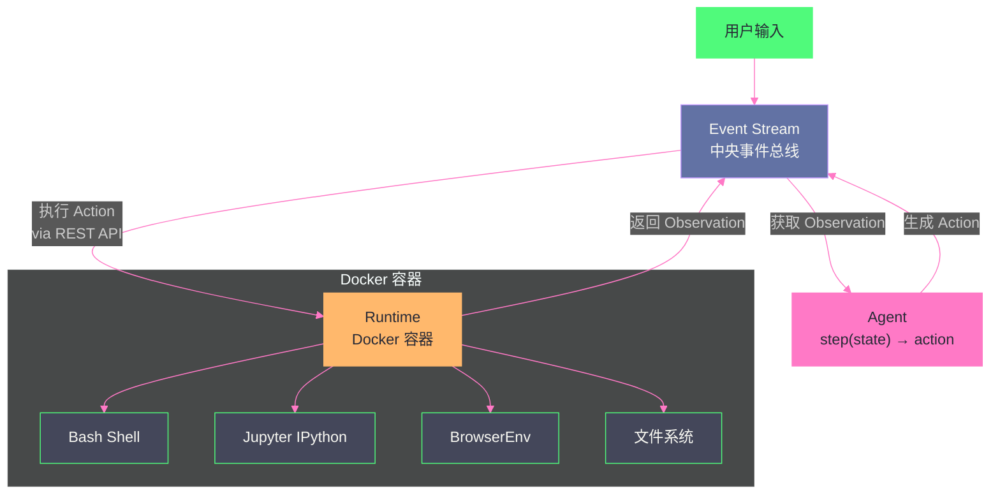

# 09 OpenHands 与 Aider——开源 Coding Agent 的两种哲学

> [!abstract] 摘要
> 前两篇解构了 Claude Code（Anthropic 的 CLI Agent）和 Devin（Cognition 的沙箱化 Agent）。本文转向开源世界——OpenHands（原 OpenDevin）和 Aider 两个开源 Coding Agent，它们代表了截然不同的设计哲学。OpenHands 用 Event Stream 架构和 Docker 沙箱 Runtime 实现"开源版 Devin"——完整的沙箱环境、浏览器、Jupyter，适合需要安全隔离的复杂任务。Aider 用单进程架构和 Repo Map（Tree-sitter + PageRank）实现"轻量级 Terminal Agent"——无 Docker、无 daemon、无 build step，适合本地快速迭代。文章深入 OpenHands 的 Event Stream 架构（所有 action 和 observation 按时间顺序记录在中央事件总线）、四种 Runtime 实现（Docker/Remote/Modal/Local）、AgentSkills（Jupyter IPython + BrowserGym）、多 Agent 委托机制；然后剖析 Aider 的 Repo Map 设计（Tree-sitter AST 解析 + PageRank 图排序在 token 预算内选择最重要符号）、Architect/Editor Pattern（规划与编辑分离的双模型模式）、三层模型系统（Main/Weak/Editor）、五种 Edit Format。核心认知：OpenHands 是"重量级安全隔离"路线，Aider 是"轻量级认知优化"路线——选择哪个取决于你是否需要沙箱隔离以及是否接受 Docker 的运行开销。

---

## 第 1 章 OpenHands——开源版 Devin

### 1.1 项目背景

OpenHands（原名 OpenDevin）是一个社区驱动的开源平台，旨在开发能通过软件与世界交互的通用和专用 AI Agent。它的设计目标与 Devin 高度相似——提供沙箱化的计算环境，让 Agent 像 human developer 一样工作。但与 Devin 的闭源商业路线不同，OpenHands 完全开源，允许社区贡献和自定义。

OpenHands 的论文（arXiv:2407.16741）明确了三个核心特性：
1. **Event Stream 交互机制**——让 UI、Agent 和环境通过事件流架构交互
2. **Docker 沙箱 Runtime**——包含 bash shell、web browser 和 IPython server
3. **类软件工程师接口**——让 Agent 能创建/修改代码、执行测试、浏览网页

### 1.2 Event Stream 架构

OpenHands 的核心架构是 **Event Stream**——一个中央事件总线，记录所有 action 和 observation 的按时间顺序日志。

**工作流程**：
1. 用户输入进入 Event Stream
2. Agent 的 `step(state)` 函数从 Event Stream 获取当前状态，生成下一个 action
3. Action 被写入 Event Stream
4. Runtime（Docker 容器）从 Event Stream 获取 action 并执行
5. 执行结果作为 observation 写回 Event Stream
6. Agent 从 Event Stream 获取 observation，继续下一步推理

**Event Stream 的价值**：
- **可审计性**：所有操作按时间顺序记录，可以回溯任一步骤
- **解耦**：Agent、Runtime、UI 之间通过 Event Stream 通信，互不直接依赖
- **可重放**：Event Stream 可以被保存和重放，用于调试和评估

### 1.3 Runtime——Docker 沙箱

OpenHands 的 Runtime 是其与 Claude Code/Aider 最大的区别——它使用 Docker 容器作为沙箱，而非直接在用户机器上执行。

**构建过程**：
1. 用户提供自定义 base Docker image
2. OpenHands 在此基础上构建 OH Runtime Image（包含 runtime client 代码）
3. 启动 Docker 容器
4. 容器内初始化 `ActionExecutor`，设置 bash shell、browser、plugins

**通信方式**：OpenHands backend 通过 RESTful API 与容器内的 Action Execution Server 通信——发送 action、接收 observation。

**四种 Runtime 实现**：

| Runtime | 适用场景 | 特点 |
| :--- | :--- | :--- |
| **DockerRuntime** | 本地开发、单机部署 | 在本地 Docker 容器中运行 |
| **RemoteRuntime** | 连接外部管理的沙箱 | 通过自定义 HTTP API 创建/暂停/恢复/停止 |
| **ModalRuntime** | Serverless 执行 | 通过 Modal 平台运行 |
| **LocalRuntime** | 无 Docker 环境 | 直接在本地运行（无沙箱隔离） |

> [!info] 核心概念：Docker 沙箱是 OpenHands 的安全基石
> OpenHands 选择 Docker 作为默认 Runtime，核心原因是安全隔离——Agent 执行的任意代码都在容器内运行，不会影响宿主机。这呼应了 [[LLM/Agent沙箱技术/00 专栏导览|Agent 沙箱技术专栏]]的主题。但 Docker 容器隔离不是绝对安全的——容器逃逸攻击仍然可能（详见 [[LLM/Agent沙箱技术/生产化/14 沙箱安全体系——三层防护、短期凭据与多租户|沙箱专栏第 14 篇]]）。对于需要更强隔离的场景，可以使用 RemoteRuntime 连接 Kata Containers 或 gVisor 等更强隔离的沙箱。

### 1.4 AgentSkills

OpenHands 的 Agent 通过 AgentSkills 获得与环境交互的能力：

**Jupyter IPython 环境**：Agent 可以在 IPython 中执行 Python 代码——适合数据分析、算法验证、快速原型。相比纯 bash 执行 Python 脚本，IPython 的交互式环境更适合 Agent 的"执行→观察→调整"循环。

**BrowserGym 原语**：通过 Playwright 控制的 Chromium 浏览器——Agent 可以打开网页、点击、输入、截图。这让 OpenHands 具备了类似 Devin Computer Use 的浏览器操作能力（但不如 Devin 的完整桌面环境操作）。

### 1.5 多 Agent 委托

OpenHands 支持 `AgentDelegateAction`——主 Agent 可以将子任务委托给 specialist agent（如 BrowsingAgent 专门处理浏览器交互任务）。这与 Claude Code 的 Subagent 机制类似——通过上下文隔离避免子任务污染主 Agent 的上下文。

---

## 第 2 章 Aider——轻量级 Terminal Agent

### 2.1 设计哲学：极简单进程

Aider 的设计哲学与 OpenHands 完全相反——**单 Python 进程，无 build step，无 daemon，无 Docker**。

Aider 是一个直接在终端运行的 Python 脚本——`aider` 命令启动后，它在当前目录工作，直接读写本地文件，直接调用 Git。没有 Docker 容器、没有 Event Stream 架构、没有 REST API 通信——一切都在一个进程内完成。

这种极简设计的优势：
- **零配置启动**：`pip install aider` + `aider` 即可使用，无需 Docker、无需容器构建
- **低资源开销**：没有容器启动延迟、没有进程间通信开销
- **直接操作本地文件**：无沙箱隔离意味着无隔阂——Agent 直接看到和修改你的文件

劣势：
- **无安全隔离**：Agent 执行的代码直接在你的机器上运行——一个错误的 `rm -rf` 命令会真的删除你的文件
- **无法并行隔离**：多个 Aider 实例在同一仓库工作需要手动用 Git worktree 隔离

### 2.2 Repo Map——Tree-sitter + PageRank

Aider 最独特的技术创新是 **Repo Map**——用 Tree-sitter AST 解析和 PageRank 图排序，在 token 预算内为 LLM 提供整个代码库的"高密度地图"。

**问题**：LLM 的上下文窗口有限——不可能把整个代码库塞进去。但如果不给 LLM 代码库的全局视图，它就无法理解"要修改的函数与代码库其他部分的关系"，容易写出与现有抽象不一致的代码。

**Aider 的解决方案**：

**第一步：Tree-sitter AST 解析**。Aider 用 Tree-sitter（一个增量解析库）解析代码库中的每个文件，提取所有类、方法、函数的定义及其签名。这产生了一个"符号图"——每个文件中有哪些符号、每个符号的定义长什么样。

**第二步：PageRank 图排序**。Aider 构建一个图——每个源文件是一个节点，文件间的依赖关系（import）是边。然后在这个图上运行 PageRank 算法（就是 Google 搜索引擎用来排序网页的那个算法），计算每个文件的"重要性分数"。

**第三步：Token 预算内选择**。根据当前聊天状态相关的文件，结合 PageRank 分数，在 `--map-tokens` 预算（默认 1K token）内选择最重要的符号放入 repo map。这个 map 随聊天状态动态调整——如果你在讨论认证模块，认证相关的符号会获得更高权重。

**Repo Map 的价值**：
- **全局视野**：LLM 可以看到整个代码库的类/函数签名，理解现有抽象
- **Token 高效**：只发送最重要的符号签名，而非完整文件内容
- **动态调整**：根据聊天上下文动态调整 map 内容，确保相关性

> [!info] 核心概念：Repo Map 是 Context Engineering 的代码库特化
> Aider 的 Repo Map 是 [[06 Prompt 上下文管理——Context Engineering 的艺术|第 6 篇]]讨论的 Context Engineering 原则的一个精妙实践——"在 token 预算内提供最高信号的上下文"。不同于 Claude Code 的"按需 read_file 加载"策略（Just-in-Time），Aider 的 Repo Map 是"主动提供精炼全局视图"——在每轮对话中就附带一个代码库的"高密度摘要"，让 LLM 有全局视野而不需要主动探索。两种策略各有优势：Claude Code 的策略更节省 token（不看不用的文件），Aider 的策略更全面（LLM 知道代码库有什么，即使没主动看）。选择哪种取决于代码库大小和任务类型——大代码库适合 Just-in-Time，中小代码库适合 Repo Map。

### 2.3 Architect/Editor Pattern

Aider 的另一个核心创新是 **Architect/Editor Pattern**——将"代码规划"和"代码编辑"分离到两个 LLM 调用中。

**工作方式**：
1. **Architect 阶段**：主模型（如 o1-preview 或 Claude 3.7）分析请求，用自然语言或伪代码描述"如何解决这个编码问题"——但不直接生成文件编辑指令
2. **Editor 阶段**：Editor 模型（如 GPT-4o 或 DeepSeek）接收 Architect 的提案，将其翻译为具体的文件编辑指令（使用 Aider 的 edit format）

**为什么有效**：某些 LLM（特别是推理模型如 o1）擅长理解复杂需求和规划多文件修改，但不擅长生成精确的文件编辑格式。Architect/Editor Pattern 让"擅长推理的模型做规划，擅长编辑的模型做编辑"——各司其职。

**SWE-bench 表现**：Aider 报告称 Architect Mode 在其代码编辑基准上取得了 SOTA 结果——特别是将 o1-preview 或 Claude 3.7 与 DeepSeek 或 GPT-4o 配对时。

**代价**：两次 LLM 调用——比单次调用更慢、更贵。但对于复杂任务，质量提升值得这个代价。

### 2.4 三层模型系统

Aider 不仅用两个模型（Architect + Editor），而是三层模型系统，按任务复杂度分配不同能力的模型：

| 层级 | 用途 | 典型模型 | 成本 |
| :--- | :--- | :--- | :--- |
| **Main Model** | 聊天交互和代码编辑 | GPT-4o / Claude Sonnet | 高 |
| **Weak Model** | commit message 生成、聊天历史摘要 | GPT-4o-mini | 低 |
| **Editor Model** | Architect Mode 中的文件编辑 | DeepSeek / GPT-4o | 中 |

**设计动机**：不是所有任务都需要最强模型——commit message 的生成和聊天历史的摘要不需要复杂的推理能力，用便宜快速的模型即可。这种"按任务难度分配模型"的策略显著降低了总体成本——大部分 LLM 调用是简单任务，用 Weak Model 处理，只有核心的代码编辑才用 Main Model。

### 2.5 五种 Edit Format

Aider 支持五种不同的代码编辑格式——LLM 生成编辑指令的方式：

| Format | 方式 | 适用模型 |
| :--- | :--- | :--- |
| **search/replace blocks** | 指定要查找的文本和替换文本 | 大多数模型 |
| **whole-file rewrites** | 生成整个文件的新内容 | 小文件场景 |
| **unified diffs** | 标准的 diff 格式 | 支持 diff 的模型 |
| **patch format** | patch 文件格式 | 特定场景 |
| **architect-delegated** | Architect 提案，Editor 执行 | Architect Mode |

Aider 会根据模型自动选择合适的 edit format——不同模型对不同格式的遵循度不同，选择最适合的格式可以减少编辑错误。

---

## 第 3 章 OpenHands vs Aider——两种哲学对比

### 3.1 架构对比

| 维度 | OpenHands | Aider |
| :--- | :--- | :--- |
| **进程模型** | 多进程（Backend + Docker 容器） | 单进程 |
| **沙箱隔离** | ✅ Docker 容器 | ❌ 直接在本地运行 |
| **事件架构** | Event Stream 中央总线 | 无（直接函数调用） |
| **浏览器能力** | ✅ BrowserGym (Playwright) | ❌ |
| **Jupyter** | ✅ IPython 环境 | ❌ |
| **代码库理解** | 按需探索 | Repo Map（Tree-sitter + PageRank） |
| **规划模式** | Agent 的 step() 函数 | Architect/Editor Pattern |
| **模型系统** | 单模型（可配置） | 三层（Main/Weak/Editor） |
| **部署复杂度** | 需要 Docker | pip install 即可 |
| **安全风险** | 低（沙箱隔离） | 高（无隔离） |
| **适用场景** | 需要安全隔离的复杂任务 | 本地快速迭代 |

### 3.2 设计哲学差异

**OpenHands 的哲学：安全优先 + 完整环境**。OpenHands 认为 Coding Agent 必须在沙箱中运行——Agent 执行的代码可能是错误的、甚至是恶意的（Prompt Injection 导致的代码执行）。Docker 沙箱提供了基本的安全保障。同时，沙箱内的完整环境（bash + browser + Jupyter）让 Agent 能覆盖"写代码→运行→测试→调试"的完整循环。

**Aider 的哲学：效率优先 + 认知优化**。Aider 认为对于本地开发场景，Docker 的开销不值得——开发者需要在几秒内启动 Agent、快速迭代、直接看到文件变化。Aider 把工程精力放在"让 LLM 更好地理解代码库"（Repo Map）和"让 LLM 更好地规划编辑"（Architect/Editor Pattern）上，而非安全隔离。

> [!note] 设计哲学：安全与效率的取舍
> OpenHands 和 Aider 的对比，本质上是"安全隔离"与"运行效率"之间的取舍。OpenHands 选择安全——Docker 容器提供了隔离，但引入了启动延迟和资源开销。Aider 选择效率——直接在本地运行，零开销，但用户需要自己承担"Agent 执行错误命令"的风险。这个取舍没有对错——它取决于使用场景。在企业的生产环境中，安全隔离是不可妥协的（OpenHands 更合适）。在个人开发者的本地快速迭代中，Docker 的开销可能让人抓狂（Aider 更合适）。理想情况下，一个成熟的 Coding Agent 生态应该提供两种模式——"安全模式"用沙箱，"快速模式"直接运行——让用户根据场景选择。

---

## 第 4 章 OpenHands 的 Event Stream 架构深度

### 4.1 为什么需要 Event Stream

传统 Agent 架构中，Agent 和 Runtime 之间的通信是直接的——Agent 调用 Runtime 的方法，Runtime 返回结果。这种方式的问题在于：

- **不可审计**：Agent 和 Runtime 的交互在内存中发生，没有持久化记录
- **紧耦合**：Agent 和 Runtime 必须在同一进程或通过直接 RPC 通信
- **不可重放**：无法回溯和重放某个会话的完整交互历史

Event Stream 通过引入一个中央事件总线解决了这些问题——所有交互都作为事件写入流中，Agent 和 Runtime 都从流中读取事件、向流中写入事件。

### 4.2 Event Stream 的实现

OpenHands 的事件分为两大类：

**Action（行动）**：Agent 发出的操作请求——如 `CmdRunAction`（执行命令）、`FileWriteAction`（写文件）、`BrowseURLAction`（浏览 URL）、`AgentDelegateAction`（委托子任务）

**Observation（观察）**：Runtime 执行 Action 后返回的结果——如 `CmdOutputObservation`（命令输出）、`FileWriteObservation`（写文件结果）、`BrowserObservation`（浏览器状态）

所有事件都有时间戳和唯一 ID，按时间顺序追加到 Event Stream 中。Agent 的 `step(state)` 函数接收当前状态（从 Event Stream 重构），返回下一个 Action。

### 4.3 从 SSH 到 EventStream 的架构演进

OpenHands 早期版本使用 SSH 通信——backend 通过 SSH 连接到 Docker 容器内执行命令。这种方式的 问题在于：
- SSH 连接管理复杂（超时、重连、认证）
- 不支持任意 Docker image（需要预装 SSH server）
- 难以扩展到非 Docker 的 Runtime

后续版本迁移到 EventStream + REST API 架构——backend 通过 HTTP 调用容器内的 Action Execution Server 的 `/execute_action` 端点。这消除了 SSH 依赖，支持任意 Docker image（runtime client 自动安装），并使得 Remote Runtime 和 Modal Runtime 等非 Docker 实现成为可能。

---

## 第 5 章 Aider 的 Repo Map 深度

### 5.1 Tree-sitter 解析

Aider 使用 Tree-sitter 解析代码库中的每个文件。Tree-sitter 是一个增量解析库，支持 50+ 编程语言，能够构建语法树（AST）并提取其中的符号定义。

对于每个文件，Aider 提取：
- 类定义及其方法签名
- 函数定义及其参数和返回类型
- 变量定义（部分语言）

这些信息构成了"符号到文件"的映射——知道每个文件中有哪些符号、每个符号的定义长什么样。

### 5.2 PageRank 排序

Aider 构建一个文件依赖图——每个源文件是一个节点，文件间的 import 关系是边。然后在这个图上运行 PageRank 算法。

PageRank 的核心思想是"被重要文件引用的文件也是重要的"——如果一个文件被很多其他重要文件 import，它的 PageRank 分数就高。这与 Google 搜索排序网页的原理相同——被重要网页链接的网页也是重要的。

### 5.3 动态 Token 预算分配

Aider 的 repo map 不是静态的——它根据当前聊天状态动态调整：

- `--map-tokens` 参数控制 repo map 的 token 预算（默认 1K）
- Aider 根据当前讨论的文件，计算其他文件的相关性
- 在 token 预算内，优先包含 PageRank 分数高且与当前讨论相关的符号
- 随着聊天进行，map 自动更新——如果你切换到讨论另一个模块，map 内容会相应变化

这种"动态 token 预算分配"是 Context Engineering 的高级实践——不是"预加载所有信息"或"完全不加载"，而是"在预算内加载最相关的信息"。

---

## 第 6 章 总结与下一篇导读

### 6.1 本文核心要点

1. **OpenHands = 开源版 Devin**：Event Stream 架构（中央事件总线，可审计可重放）+ Docker 沙箱 Runtime（四种实现：Docker/Remote/Modal/Local）+ AgentSkills（Jupyter IPython + BrowserGym）
2. **Event Stream 的价值**：可审计（所有操作按时间记录）、解耦（Agent/Runtime/UI 互不直接依赖）、可重放（会话可回溯和重放）
3. **Aider = 轻量级 Terminal Agent**：单进程、无 Docker、无 daemon——极简部署，直接操作本地文件
4. **Repo Map = Tree-sitter + PageRank**：AST 解析提取符号 + 图排序计算重要性 + token 预算内动态选择——Context Engineering 的代码库特化
5. **Architect/Editor Pattern**：规划与编辑分离——推理模型做规划，编辑模型做编辑，各司其职
6. **三层模型系统**：Main（核心编辑）+ Weak（commit/摘要）+ Editor（Architect Mode 编辑）——按任务难度分配模型，优化成本
7. **两种哲学**：OpenHands 安全优先（Docker 沙箱，完整环境，但开销大）；Aider 效率优先（零开销，认知优化，但无隔离）

### 6.2 下一篇导读

本文解构了两个开源 Coding Agent。下一篇 [[10 Cursor 与 IDE 类 Agent——从补全到自主编码的跨越]] 将转向 IDE 类 Agent——Cursor 的 Agent Swarm 架构（Planner/Worker 分层）、Composer 模型、Cloud Agent；以及 Gemini Code Assist 的 Agent Mode。IDE 类 Agent 与 Terminal Agent 有本质差异——它们嵌入在开发者的编辑器中，需要在"自主性"和"不干扰开发者当前工作"之间找到平衡。

> [!info] 专栏导航
> 本文是 [[00 专栏导览|Coding Agent 运行范式专栏]] 的第 9 篇。至此，第 7-9 篇完成了对 Claude Code、Devin、OpenHands/Aider 四大 Coding Agent 的架构解构。下一篇将补齐 IDE 类 Agent（Cursor/Gemini Code Assist）的视角。

---

## 参考文献

1. OpenHands. "Runtime Architecture." https://docs.openhands.dev/openhands/usage/architecture/runtime
2. OpenHands. "Backend Architecture." https://docs.openhands.dev/openhands/usage/architecture/backend
3. OpenHands Runtime README. https://github.com/OpenHands/OpenHands/blob/main/openhands/runtime/README.md
4. OpenHands System Architecture. https://github.com/OpenHands/OpenHands/blob/1.6.0/openhands/architecture/system-architecture.md
5. OpenHands Paper. arXiv:2407.16741. https://arxiv.org/pdf/2407.16741
6. Aider. "Repository map." https://aider.chat/docs/repomap.html
7. Aider Modes Documentation. https://github.com/paul-gauthier/aider/blob/main/aider/website/docs/usage/modes.md
8. Aider Three-Tier Model System. https://deepwiki.com/Aider-AI/aider/7.4-three-tier-model-system
9. Aider Architect Mode. https://deepwiki.com/Aider-AI/aider/5.5-architect-mode
10. Aider RepoMap Source. https://github.com/Aider-AI/aider/blob/main/aider/repomap.py

---

## 思考题

1. **OpenHands 的 Event Stream 架构让所有操作可审计、可重放。但 Event Stream 本身会持续增长——一个长时会话可能产生数万条事件。Event Stream 的存储和检索如何管理？它本身是否也需要 Context Engineering？** 提示：考虑 Event Stream 的分层——完整事件日志可以持久化到外部存储，Agent 的 `step(state)` 函数接收的是从 Event Stream 重构的"当前状态摘要"，而非完整事件历史。

2. **Aider 的 Repo Map 用 PageRank 排序文件重要性。但 PageRank 假设"被重要节点链接的节点也重要"——在代码库中，这个假设成立吗？被很多文件 import 的文件一定"重要"吗？有没有反例？** 提示：考虑"工具函数文件"——一个 `utils.py` 可能被整个项目 import，但它的重要性可能不如一个只被少数文件引用的核心业务逻辑文件。PageRank 的"被引用=重要"假设在代码库中可能不完全成立。

3. **OpenHands 用 Docker 做沙箱，Aider 不做沙箱。如果 Aider 想增加沙箱能力但又不引入 Docker 的重量级开销，有什么轻量级替代方案？** 提示：考虑 [[LLM/Agent沙箱技术/00 专栏导览|Agent 沙箱技术专栏]]讨论的技术——namespaces + seccomp 可以在不启动完整容器的情况下提供进程级隔离；或者用 Bubblewrap（Flatpak 的沙箱工具）做轻量级沙箱。
