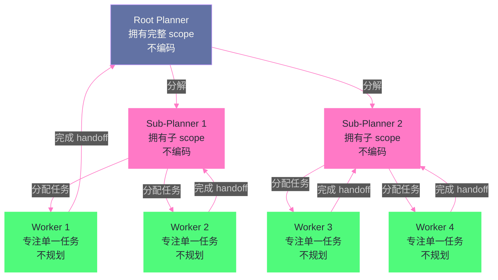

# 10 Cursor 与 IDE 类 Agent——从补全到自主编码的跨越

> [!abstract] 摘要
> 前三篇解构的 Claude Code、Devin、OpenHands/Aider 都是"独立 Agent"——它们有自己的界面（Terminal/IDE/沙箱），开发者专门为 Agent 工作打开它们。本文转向 IDE 类 Agent——Cursor 和 Gemini Code Assist——它们嵌入在开发者日常使用的 IDE 中，需要在"自主编码能力"和"不干扰开发者当前工作"之间找到平衡。文章深入 Cursor 的 Agent Swarm 架构（Planner/Worker 分层、树状递归分解、Judge 评估循环）、Composer 模型（RL 训练的 agentic coding model，4 倍速于同级模型）、Cloud Agent（隔离 VM 中的云端 Agent，支持多 repo 和 Computer Use）；然后剖析 Gemini Code Assist 的 Agent Mode（VS Code + IntelliJ 双 IDE 支持、内置工具 + MCP 集成、Plan 审批 + Checkpoint 回滚）；最后对比 IDE Agent 与 Terminal Agent 的设计差异——IDE Agent 的核心挑战是"在开发者编辑器的上下文中做 Agent，而非接管编辑器"。核心认知：Cursor 的 Agent Swarm 把任务分解为树状结构——Planner 永远不实现（上下文不填满低级细节），Worker 永远不规划（上下文全花在单一任务上）——这是 [[06 Prompt 上下文管理——Context Engineering 的艺术|Context Engineering]] 在多 Agent 协作层面的极致应用。

---

## 第 1 章 Cursor——从 Tab 补全到 Agent Swarm

### 1.1 Cursor 的演进路径

Cursor 的演进路径清晰地展示了"从补全到自主编码"的跨越：

1. **Cursor Tab**：自定义补全模型——预测开发者接下来要写什么
2. **Chat**：在 IDE 侧边栏与 AI 对话，询问代码相关问题
3. **Agent Mode**：AI 可以读写文件、执行命令、做多文件修改
4. **Composer**：自定义 agentic coding model——为 Agent 场景专门训练
5. **Cloud Agent**：在隔离 VM 中运行的云端 Agent
6. **Agent Swarm**：多 Agent 协作的大规模任务执行

这个演进路径的本质是**自动化程度的递增**——从"预测你接下来写什么"（补全），到"帮你写一段代码"（Chat），到"帮你修改多个文件"（Agent Mode），到"自主完成一个任务"（Composer + Cloud Agent），到"多个 Agent 协作完成大型项目"（Agent Swarm）。

### 1.2 Agent Swarm 架构

Cursor 的 Agent Swarm 是其在多 Agent 协作方向上的核心创新。设计灵感来自对任务结构的观察——"大型任务的描述天然呈树状结构，目标在根节点，递归分解为基本工作单元"。

**两种角色**：

**Planner Agents**：由最强模型驱动，分析目标、拆分子任务、委派给 Worker。Planner **不做任何编码**——它的上下文永远不会被低级实现细节填满，始终保持对全局目标的理解。

**Worker Agents**：由更快更便宜的模型驱动，接收任务并专注完成。Worker **不做任何规划**——它的上下文全部用于单一任务的实现，不需要理解全局目标。

**递归分解**：Planner 可以 spawn Sub-Planner，Sub-Planner 再 spawn 更多的 Sub-Planner 和 Worker。这种递归分解让 swarm 的形状"生长"以覆盖问题的轮廓——简单的部分只有少量 Worker，复杂的部分有多层 Sub-Planner 分解。

**Judge Agent**：在每个执行周期结束后，一个独立的 Judge Agent 评估"是否需要继续下一轮迭代"。这解决了"Agent 何时停止"的问题——不是靠 Agent 自己判断，而是靠独立的评估者。

> [!info] 核心概念：Agent Swarm 是 Context Engineering 的多 Agent 极致
> Cursor 的 Agent Swarm 设计是 [[06 Prompt 上下文管理——Context Engineering 的艺术|第 6 篇]]讨论的 Context Engineering 在多 Agent 协作层面的极致应用。核心洞察是：**当单个 Agent 承担完整任务时，它必须在上下文中同时维护"全局目标"和"实现细节"——这两者争夺有限的上下文空间，导致全局目标被细节淹没**。Agent Swarm 通过角色分离解决了这个问题——Planner 的上下文只有"全局目标 + 子任务列表"，Worker 的上下文只有"单一任务 + 实现细节"。每个 Agent 的上下文都是"高信号、低噪音"的——这正是 Context Engineering 追求的目标。

### 1.3 Composer——RL 训练的 Agentic Model

2025 年 10 月，Cursor 发布了 Composer——一个专门为 Agent 场景训练的 coding model：

**核心特性**：
- **前沿编码能力**：在 Cursor 的基准测试上达到前沿水平
- **4 倍速度**：生成速度是同级智能模型的 4 倍——大多数 turn 在 30 秒内完成
- **MoE 架构**：混合专家模型，支持长上下文生成和理解
- **RL 训练**：通过强化学习在真实软件开发环境中训练——训练时模型被给予生产级搜索和编辑工具，需要在大型代码库中解决多样化难题

**Auto Mode**：Composer 支持 Auto Mode——动态路由到最佳模型。简单部分用快速模型，复杂部分用智能模型，在速度和质量之间自动平衡。

**设计动机**：Cursor 在开发 Cursor Tab（补全模型）时发现，开发者想要"最智能但足够快"的模型——能让开发者保持在编码心流中。Composer 的目标是"快到可以交互使用，同时智能到能做真正的 Agent 工作"。

### 1.4 Cloud Agent——隔离 VM 中的云端 Agent

Cursor 的 Cloud Agent 把 Agent 执行从本地移到了云端：

**核心设计**：
- 在隔离的云端 VM 中运行——完整开发环境（clone 的 repo、安装的依赖、secrets、启动命令、网络访问）
- 可以 build、test、与修改后的软件交互
- 支持 Computer Use（控制桌面和浏览器）
- 支持 MCP Server
- 支持多 repo 环境——当一个任务跨 frontend、backend、infrastructure 等多个仓库时

**工作方式**：
1. Cloud Agent 从 GitHub/GitLab/Azure DevOps/Bitbucket clone repo
2. 在独立分支上工作
3. 完成后 push changes 到你的 repo

**环境配置**：Cloud Agent 的有效性高度依赖环境配置——"不设置开发环境就像不给工程师电脑"。Cursor 支持三种环境配置方式：
- **Agent-led setup**：Agent 自己探索并设置环境
- **Saved snapshot**：保存一个配置好的环境快照
- **Dockerfile**：用 `.cursor/environment.json` 中的 Dockerfile 定义环境

> [!note] 设计哲学：Cloud Agent 的"给 Agent 一台电脑"哲学
> Cursor 的 Cloud Agent 文档有一句精辟的话："An agent that can write code but can't run tests, query services, or reach APIs cannot close the loop on its work."——一个能写代码但不能运行测试、查询服务、访问 API 的 Agent，无法闭合工作循环。这与 Devin 的"完整开发者工作站"哲学一致——Agent 需要完整的开发环境来验证自己的工作，而非只写代码然后"希望它是对的"。Cloud Agent 把这个理念推向极致——不是给 Agent 访问你的本地环境，而是在云端给它一个专属于它的完整环境。

---

## 第 2 章 Gemini Code Assist Agent Mode

### 2.1 IDE 内嵌的 Pair Programmer

Gemini Code Assist 的 Agent Mode 于 2025 年 6 月发布，在 VS Code 和 IntelliJ IDE 中提供 agentic 编码体验。其定位是"AI pair programmer"——不是"代替你编码"，而是"与你协作编码"。

**核心能力**：
- 分析整个代码库（不仅当前打开的文件）
- 多文件编辑——一个请求编排跨代码库的所有修改
- 内置工具：grep、file read/write、terminal、Google Search
- MCP Server 集成——扩展 Agent 的工具能力
- Plan 审批——修改任何代码前，先展示详细计划等用户批准
- Checkpoint 回滚——如果接受了一系列修改后发现问题，可以回滚到检查点

### 2.2 Plan 审批与 Human-in-the-Loop

Gemini Code Assist 的 Agent Mode 强调"用户始终在控制中"——"Agent 从不盲目行动"。

**工作流程**：
1. 用户描述目标（如"重构购物车的 MVC 以显示折扣码"）
2. Agent 分析代码库，提出详细计划——列出要修改的文件和每个文件的变更摘要
3. 用户审查并批准/修改计划
4. Agent 执行修改
5. 用户可以通过 inline diff 可视化地查看每处修改
6. 如果有问题，可以回滚到 checkpoint

**批量工具调用审批**：支持批量审批工具调用和编辑——不是每次工具调用都单独确认，而是可以批量批准一组相关操作。

### 2.3 工具配置与控制

**coreTools / excludeTools**：用户可以配置 Agent 可用的工具集——`coreTools` 指定启用哪些内置工具，`excludeTools` 排除特定工具。

**MCP Server 配置**：在 VS Code 中通过 settings 配置 MCP Server，在 IntelliJ 中通过类似方式。配置后，Gemini Code Assist 自动决定何时使用 MCP Server 中的工具。

**上下文来源**：
- IDE 工作区文件
- 工具响应（grep、terminal、file read/write）
- Google Search 响应
- URL 内容
- 用户创建的 Markdown context files

### 2.4 VS Code vs IntelliJ 的差异

Gemini Code Assist 在两个 IDE 中的 Agent Mode 有细微差异：

| 维度 | VS Code | IntelliJ |
| :--- | :--- | :--- |
| **上下文来源** | IDE 工作区 + 工具响应 + Google Search + URL + context files | IDE 项目（含索引符号和符号使用）+ 工具响应 + IntelliJ VCS + MCP + context files |
| **符号索引** | 依赖工具 | 原生 IntelliJ 符号索引 |
| **VCS 集成** | 通过 terminal 工具 | 原生 IntelliJ 版本控制 |
| **MCP 配置** | settings.json | IDE 设置 |

IntelliJ 版本的优势是利用了 IntelliJ 的原生符号索引和 VCS 集成——对于 Java/Kotlin 等 JVM 语言项目，这些原生能力比通用工具更精确。

---

## 第 3 章 IDE Agent vs Terminal Agent——设计差异

### 3.1 嵌入式 vs 独立式

| 维度 | IDE Agent（Cursor/Gemini） | Terminal Agent（Claude Code/Aider） |
| :--- | :--- | :--- |
| **界面** | 嵌入在 IDE 中 | 独立 Terminal |
| **上下文** | IDE 工作区（打开的文件、光标位置、选中文本） | 命令行参数 + 文件系统 |
| **交互模式** | 聊天侧边栏 + inline diff | 命令行对话 |
| **开发者工作流** | 在 IDE 中编码时随时调用 | 切换到 Terminal 使用 |
| **修改展示** | IDE 内 inline diff 可视化 | Terminal 文本输出 |
| **并行性** | 一个 IDE 一个 Agent（Cloud Agent 除外） | 多 Terminal 多 Agent |

### 3.2 "不干扰"约束

IDE Agent 的核心设计约束是"不干扰开发者当前工作"——开发者可能正在编辑文件 A，Agent 在修改文件 B。如果 Agent 的修改突然出现在开发者正在编辑的文件中，会造成严重的体验混乱。

解决方案：
- **Inline diff**：修改以 diff 形式展示，开发者可以逐个接受/拒绝，而非直接覆盖
- **分离的编辑上下文**：Agent 的修改在独立的编辑上下文中进行，不直接影响开发者正在编辑的内容
- **Plan 审批**：修改前先展示计划，给开发者"知情同意"的机会

Terminal Agent 不需要面对这个问题——它工作在独立的 Terminal 中，不与开发者正在使用的 IDE 界面共享。

### 3.3 上下文优势

IDE Agent 相比 Terminal Agent 的一个独特优势是**丰富的上下文**：

- **打开的文件**：IDE 知道开发者当前打开了哪些文件——这些文件很可能与任务相关
- **光标位置**：开发者光标所在的函数/类——指示了开发者当前关注的代码
- **选中文本**：开发者选中的代码段——可能是想要修改或讨论的对象
- **符号索引**：IDE 的语言服务器提供了精确的符号定义和引用关系
- **Git 状态**：IDE 知道当前的分支、修改状态、暂存区

这些上下文让 IDE Agent 可以"更懂开发者当前在做什么"——而不需要开发者显式提供上下文。Terminal Agent 需要开发者用自然语言描述上下文（如"我在 auth.py 中修改登录逻辑"），而 IDE Agent 可以直接从 IDE 状态中获取。

> [!note] 设计哲学：IDE Agent 的"语境感知"优势
> IDE Agent 最大的优势不是"更强的能力"（在工具集和推理能力上，IDE Agent 和 Terminal Agent 差异不大），而是"更丰富的语境感知"。开发者在使用 IDE 时，IDE 持续收集了大量隐含上下文——打开了哪些文件、光标在哪里、选中了什么、最近的编辑历史。IDE Agent 可以利用这些隐含上下文，让开发者"不需要解释自己在做什么"——Agent 已经知道了。这种"低上下文声明成本"的体验优势，是 IDE Agent 在日常编码场景中比 Terminal Agent 更受欢迎的根本原因。

---

## 第 4 章 Cursor 的 Agent Swarm 演进史

### 4.1 第一代：平等协调

Cursor 的 Agent Swarm 第一代设计是"平等协调"——所有 Agent 地位平等，通过共享文件自我协调。每个 Agent 检查其他 Agent 在做什么、认领任务、更新状态。用锁机制防止两个 Agent 抢同一个任务。

**问题**：协调开销大——Agent 花大量时间"检查别人在做什么"而非"做事"。锁竞争导致效率低下。

### 4.2 第二代：Planner/Worker 分离

第二代引入了角色分离——Planner 持续探索代码库并创建任务，Worker 专注于完成分配的任务。引入了 Judge Agent 在每个周期结束后评估是否继续。

**改进**：解决了大部分协调问题——Worker 不需要知道全局状态，只管做分配的任务。

### 4.3 第三代：递归 Sub-Planner

第三代引入了递归 Sub-Planner——Root Planner 拥有完整 scope，可以 spawn Sub-Planner 分享窄 scope。Sub-Planner 可以再 spawn Sub-Planner，形成递归树。

**关键设计决策**：
1. Root Planner 拥有完整 scope，**不做编码**——它的上下文不填满低级细节
2. Sub-Planner 可以规划如何交付目标 + spawn tasks——**高度动态灵活**
3. Worker 只关注自己的任务——**不知道更大的系统**
4. Worker 在自己的 repo copy 上工作——**无冲突**
5. 完成后写一个 handoff summary——**系统提交给请求任务的 Planner**

### 4.4 模型选择的经验

Cursor 在长时自主任务中发现：
- **GPT-5.2 模型更适合长时自主工作**——遵循指令、保持专注、避免漂移、精确完整地实现
- **Opus 4.5 倾向于过早停止和走捷径**——快速交还控制权
- **不同模型擅长不同角色**——GPT-5.2 是比 GPT-5.1-Codex 更好的 Planner

这些发现验证了 [[08 Devin 与 ACI 设计——为 Agent 认知而生的计算机接口|第 8 篇]]讨论的观点——不同模型有不同的"行为风格"，选择模型时不仅看"智能程度"，还要看"自主工作时的行为特征"。

---

## 第 5 章 总结与下一篇导读

### 5.1 本文核心要点

1. **Cursor 演进路径**：Tab 补全 → Chat → Agent Mode → Composer → Cloud Agent → Agent Swarm——自动化程度递增
2. **Agent Swarm 的角色分离**：Planner 不实现（上下文不被细节填满），Worker 不规划（上下文全花在单一任务上）——Context Engineering 的多 Agent 极致
3. **递归 Sub-Planner**：树状递归分解，swarm 形状"生长"以覆盖问题轮廓
4. **Composer**：RL 训练的 agentic coding model，4 倍速于同级模型——"快到可以交互，智能到能做 Agent 工作"
5. **Cloud Agent**：隔离 VM 中的完整开发环境——"给 Agent 一台电脑"的哲学
6. **Gemini Code Assist Agent Mode**：IDE 内嵌 pair programmer，Plan 审批 + Checkpoint 回滚 + MCP 集成
7. **IDE Agent vs Terminal Agent**：IDE Agent 的核心优势是"语境感知"——利用 IDE 的隐含上下文（打开文件、光标、选中、符号索引）降低开发者的上下文声明成本
8. **"不干扰"约束**：IDE Agent 需要在"自主编码"和"不干扰开发者当前工作"之间平衡——inline diff 和 Plan 审批是核心解决方案

### 5.2 下一篇导读

至此，第 7-10 篇完成了对 Claude Code、Devin、OpenHands/Aider、Cursor/Gemini Code Assist 五大 Coding Agent 的架构解构。接下来第 11-12 篇将回到通用主题——第 11 篇 [[11 Agent 与操作系统的交互接口——Bash、文件与 Git 的工程化]] 深入 Agent 与 OS 交互的工程细节（Bash 超时/输出截断/两阶段终止、文件原子写入/大文件/文件锁、Git 工作流/Agentlocks），第 12 篇 [[12 Agent 权限与审批模型——人在环路的工程实践]] 讨论权限审批的工程化（HITL 模式、OpenAI/Cloudflare/Claude Code/Agentrail 的方案对比、MCP Elicitation）。

> [!info] 专栏导航
> 本文是 [[00 专栏导览|Coding Agent 运行范式专栏]] 的第 10 篇，也是 Coding Agent 架构解构系列的收官篇。前 10 篇完成了从 Agent 范式理论到 5 大 Coding Agent 实践的完整闭环。最后 2 篇将回到通用工程主题。

---

## 参考文献

1. Cursor. "Agent swarms and the new model economics." https://cursor.com/blog/agent-swarm-model-economics
2. Cursor. "Scaling long-running autonomous coding." https://cursor.com/blog/scaling-agents
3. Cursor. "Towards self-driving codebases." https://cursor.com/blog/self-driving-codebases
4. Cursor. "Composer: Building a fast frontier model with RL." https://cursor.com/blog/composer
5. Cursor Cloud Agent Documentation. https://cursor.com/docs/cloud-agent
6. Google. "Use the Gemini Code Assist agent mode." https://developers.google.com/gemini-code-assist/docs/use-agentic-chat-pair-programmer
7. Google. "Agent mode overview." https://developers.google.com/gemini-code-assist/docs/agent-mode
8. Google. "Gemini Code Assist's June 2025 updates." https://blog.google/innovation-and-ai/technology/developers-tools/gemini-code-assist-updates-july-2025/
9. Google. "What's new in Gemini Code Assist." https://developers.googleblog.com/en/new-in-gemini-code-assist/

---

## 思考题

1. **Cursor 的 Agent Swarm 把 Planner 和 Worker 的角色严格分离——Planner 不编码，Worker 不规划。这种"严格分离"是否过于刚性？如果一个 Worker 在执行中发现"原计划是错的"，它不能自己修改计划——这是否会导致错误的执行？** 提示：考虑 Worker 的 handoff 机制——Worker 完成后写 handoff summary 给 Planner，Planner 根据反馈决定是否调整计划。但这种"事后反馈"是否足够及时？

2. **IDE Agent 的"语境感知"（光标位置、选中文本、打开文件）让开发者不需要显式声明上下文。但这也有风险——如果开发者打开了不相关的文件，IDE Agent 可能被误导。如何平衡"利用隐含上下文"与"避免被无关上下文误导"？** 提示：考虑"上下文显式化"——Agent 在使用隐含上下文前，可以展示"我注意到了你打开了 X 文件、选中了 Y 代码，我假设这些与任务相关"，让开发者有机会确认或纠正。

3. **Cursor Cloud Agent 在隔离 VM 中运行，支持 Computer Use。这与 Devin 的沙箱化计算环境有什么异同？两者在安全模型上的关键差异是什么？** 提示：考虑两者的隔离技术——Devin 的沙箱技术细节未完全公开，Cursor Cloud Agent 明确使用"isolated VMs"。VM 级隔离相比 Docker 容器级隔离有哪些安全优势？
