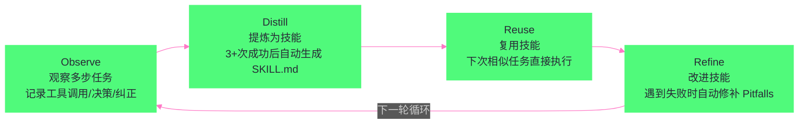
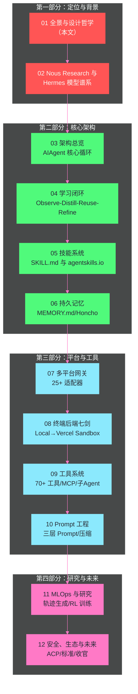

# 01 Hermes Agent 全景——自改进 Agent 的设计哲学

> [!abstract] 摘要
> Hermes Agent 是 Nous Research 开发的开源"自改进 AI Agent"——2025 年 7 月在 GitHub 开源，MIT 协议，22 万+ star。它不是又一个 Coding Agent——它代表 Agent 领域的一个独立分支："长驻自改进个人 Agent"。文章从 Hermes 的核心定位出发——"会成长的 Agent"（The AI agent that grows with you）——拆解其六大设计理念（自改进学习闭环 / 长驻多平台 / 模型无关 / 随处运行 / 研究就绪 / 开源自托管）；与 Claude Code/Devin/Cursor 等 Coding Agent 做维度对比，阐明 Hermes 为什么不是"竞品"而是"互补品"；介绍 Nous Research 这个"社区驱动的开放权重研究实验室"的背景——从 Hermes 模型谱系到 Forge Reasoning API 到 Psyche 分布式训练；最后给出本专栏 12 篇文章的阅读地图。核心认知：Hermes 的设计哲学是"Agent 不是工具，而是伙伴"——工具被使用后不变，伙伴在交互中成长——这种"自改进"能力是 Hermes 与所有其他 Agent 的根本区别。

---

## 第 1 章 什么是 Hermes Agent

### 1.1 一句话定义

Hermes Agent 的官网首页写着："The AI agent that grows with you."（与你一起成长的 AI Agent）。这句话精确地概括了 Hermes 的核心定位——它不是"你用完就丢弃"的工具，而是"越用越强"的伙伴。

展开来说，Hermes Agent 是：
- **开源**（MIT 协议）——每一行代码都可以审计
- **自托管**——所有数据留在你的机器上，零遥测，零追踪
- **自改进**——从经验中创建可复用技能，跨会话记忆你的偏好
- **长驻**——7×24 运行在你的服务器上，不绑定你的笔记本
- **多平台**——通过 Telegram/Discord/Slack/WhatsApp/Signal/CLI 与你交互
- **模型无关**——18+ 提供商，`hermes model` 一键切换，无锁定

### 1.2 核心数字

| 指标 | 数据 |
| :--- | :--- |
| GitHub star | 22 万+ |
| 开源协议 | MIT |
| 开发者 | Nous Research |
| 仓库创建 | 2025-07-22 |
| 正式发布 | 2026-02 |
| 内置技能 | 40+ |
| 消息平台 | 25+ 适配器（内置 + 插件） |
| 工具数量 | 70+ 工具，28 工具集 |
| LLM 提供商 | 18+ |
| 终端后端 | 7 种（Local/Docker/SSH/Modal/Daytona/Singularity/Vercel Sandbox） |
| 测试套件 | ~25,000 测试，~1,250 文件 |
| 安装方式 | 一行 curl 命令 |

### 1.3 安装与启动

Hermes 的安装设计体现了"零门槛"理念——一行命令搞定一切：

```bash
# Linux/macOS/WSL2/Termux
curl -fsSL https://hermes-agent.nousresearch.com/install.sh | bash

# Windows (原生 PowerShell)
iex (irm https://hermes-agent.nousresearch.com/install.ps1)
```

安装脚本自动处理一切：安装 `uv`（Rust 编写的 Python 包管理器）、Python 3.11、Node.js、ripgrep、ffmpeg，以及一个便携式 Git Bash（MinGit，不需要管理员权限）。安装完成后：

```bash
hermes              # 启动交互式 CLI，开始对话
hermes model        # 选择 LLM 提供商和模型
hermes setup        # 完整设置向导（一次性配置所有内容）
hermes gateway      # 启动消息网关（Telegram/Discord 等）
```

> [!note] 设计哲学：零前提条件的安装
> Hermes 的安装设计有一个明确的原则——"零前提条件"（No prerequisites）。不需要预装 Python、Node.js、Git——安装脚本全部自动处理。这与 Devin 需要 Docker、Claude Code 需要 Node.js 的安装体验形成对比。Hermes 的目标用户不只是开发者——还包括通过 Telegram 使用 Agent 的非技术用户——因此安装必须"傻瓜化"。

**Windows 原生支持的工程细节**：Hermes 的 Windows 原生支持有一个值得注意的工程细节——它捆绑了一个便携式 Git Bash（MinGit，约 45MB），解压到 `%LOCALAPPDATA%\hermes\git`——不需要管理员权限，完全隔离于系统 Git 安装。如果用户已有 Git，安装脚本检测到后直接使用系统 Git。这种"有就用，没有就自带"的优雅降级设计让 Hermes 在"没有 Git 的 Windows 机器"上也能运行——这在非开发者的 Windows 电脑上很常见。

**Termux/Android 支持**：Hermes 甚至支持在 Android 手机上通过 Termux 运行——安装时使用精简的 `.[termux]` extra（而非完整的 `.[all]` extra），因为完整 extra 包含的语音依赖在 Android 上不兼容。这让"在旧 Android 手机上运行个人 Agent"成为可能——虽然体验不如服务器，但展示了 Hermes "随处运行"理念的极致。

---

## 第 2 章 六大设计理念

### 2.1 理念一：自改进学习闭环

Hermes 最独特的特性是"自改进"——它有一个内置的学习循环（Learning Loop），遵循 **Observe → Distill → Reuse → Refine** 四步循环：



**Observe（观察）**：Hermes 在 episodic memory 层追踪每个多步任务——每次工具调用、每个决策分支、每次用户纠正。这不是简单的"对话日志"——而是结构化的"任务执行轨迹"。

**Distill（提炼）**：当相似任务模式成功完成 3+ 次后，Hermes 进入提炼阶段——生成一个 `SKILL.md` 文档，捕获程序步骤、已知陷阱和验证方法。这个文档遵循 agentskills.io 开放标准——可以被其他兼容 Agent（如 Claude Code、Cursor、OpenHands）使用。

**Reuse（复用）**：技能保存在 `~/.hermes/skills/` 目录，立即可用为 slash 命令。下次相似任务来时，Hermes 不重新探索——直接执行已保存的工作流。

**Refine（改进）**：当 Hermes 使用某个技能时遇到失败（如走到死路发现了 workaround），它会自动修补技能——把失败路径加入 Pitfalls 段，把成功路径加入 Procedure 段。失败的方法被记住并剪枝，成功的方法被强化。

**skill_manage 工具的触发条件**：技能的创建和更新通过 `skill_manage` 工具实现，其 schema 定义了精确的触发条件——"创建当：复杂任务成功（5+ 工具调用）、错误被克服、用户纠正后的方法有效、发现非平凡工作流、或用户要求记住某个程序"。这种"基于触发条件而非固定时间表"的设计让技能创建是"事件驱动"的——只有在"值得记住"的事情发生时才创建技能，避免了对每个简单任务都生成低价值技能。

**Nudge Engine（提醒引擎）**：学习闭环的"驱动器"是 Nudge Engine——一个定期提醒 Agent "反思并持久化知识"的机制。Nudge 不是"每 N 分钟触发一次"的简单定时器——而是"在对话的自然间隙"插入反思提示，如"你刚才完成了一个复杂任务，要不要把流程保存为技能？"这种"温和提醒"而非"强制执行"的设计让用户保持对 Agent 行为的控制——用户可以说"不用保存"，Agent 尊重决定。

**社区报告的改进效果**：有 Reddit 用户报告，基于类似的自批判循环构建的原型在 8 次运行后错误率下降 30%。这虽然不是受控实验，但提供了"自改进确实有效"的初步证据——技能在迭代中越来越精确，失败路径被逐步消除。

> [!info] 核心概念：技能不是"预设"，而是"生长出来的"
> 传统 Agent 的"技能"是开发者预设的——如 Claude Code 的内置工具、Devin 的 ACI 操作。Hermes 的技能是"生长出来的"——从用户与 Agent 的交互中自动提炼。这意味着两个不同用户的 Hermes 会有完全不同的技能集——一个 DevOps 工程师的 Hermes 会生长出"K8s 部署"技能，一个数据科学家的 Hermes 会生长出"数据清洗"技能。这种"个性化技能生长"是 Hermes "自改进"的核心含义——不是模型权重在改变，而是"程序性记忆"在积累。这类似于人类的"程序性记忆"——骑自行车、写代码、做 PR 审查——这些技能不是"先天预设"的，而是"通过实践习得"的。Hermes 试图在 Agent 中复制这种"实践→技能"的人类认知机制。

### 2.2 理念二：长驻多平台

Hermes 不是"打开-用-关闭"的工具——它是一个"长驻"（persistent）的 Agent 进程，7×24 运行在你的服务器上。你通过消息平台与它交互——Telegram、Discord、Slack、WhatsApp、Signal、Email、CLI——所有平台共享同一个 Agent 实例和记忆。

**跨平台连续性**：你可以在 Telegram 上开始一个对话，在 CLI 中继续——Hermes 记得你在 Telegram 上说了什么。这种"跨平台连续性"是通过统一的 SessionStore 实现的——所有平台的对话存储在同一个 SQLite 数据库中，通过 session key 关联。

**语音消息转写**：在 Telegram/WhatsApp 上发语音消息，Hermes 自动转写为文本处理——你不需要打字，直接说话。

**为什么"长驻"重要**：Coding Agent（Claude Code/Devin）是"会话级"的——你打开它，完成任务，关闭它。下次打开时，它不记得上次做了什么（除非你手动提供上下文）。Hermes 是"长驻"的——它一直在那里，一直在学习，一直在记忆。这种差异不是技术细节——而是根本性的设计哲学分歧：Hermes 把 Agent 视为"长期伙伴"而非"临时工具"。

### 2.3 理念三：模型无关

Hermes 不绑定任何 LLM 厂商——支持 18+ 提供商，通过 `hermes model` 命令一键切换：

| 提供商 | 接入方式 | 特点 |
| :--- | :--- | :--- |
| **Nous Portal** | OAuth | 300+ 模型 + Tool Gateway（搜索/图像/TTS/浏览器） |
| **OpenRouter** | API Key | 200+ 模型聚合 |
| **OpenAI** | API Key | GPT 系列 |
| **Anthropic** | API Key | Claude 系列 |
| **NVIDIA NIM** | API Key | Nemotron 系列 |
| **z.ai/GLM** | API Key | GLM 系列 |
| **Kimi/Moonshot** | API Key | Moonshot 系列 |
| **MiniMax** | API Key | MiniMax 系列 |
| **Hugging Face** | API Key | 开源模型 |
| **本地 vLLM** | 端点 | 完全本地部署 |
| **自定义端点** | OpenAI 兼容 | 任何兼容 API |

**Nous Portal 的一站式方案**：如果你不想收集 5 个不同的 API Key（模型、搜索、图像生成、TTS、云浏览器），Nous Portal 用一个订阅覆盖所有——`hermes setup --portal` 一条命令完成 OAuth 登录 + 提供商配置 + Tool Gateway 启用。Tool Gateway 路由的子服务包括：Firecrawl（Web 搜索）、FAL（图像生成）、OpenAI（TTS）、Browser Use（云浏览器）——全部通过一个 Nous Portal 订阅计费，无需单独注册。

**三种 API 模式的内部适配**：Hermes 的架构支持三种 API 模式来适配不同提供商——`chat_completions`（OpenAI 兼容格式）、`codex_responses`（OpenAI Responses API 格式）、`anthropic_messages`（Anthropic Messages API 格式）。Provider Runtime Resolver 负责把 `(provider, model)` 元组映射到 `(api_mode, api_key, base_url)`——这个解析器被 CLI、Gateway、Cron、ACP 和辅助调用共享，确保所有入口使用一致的提供商解析逻辑。

**Fallback 与 Credential Pools**：Hermes 支持自动故障转移——当主模型遇到错误时自动切换到备用 LLM 提供商。还支持 Credential Pools——把 API 调用分散到多个 key 上，在限速或故障时自动轮换。这两个特性让 Hermes 在"生产级长驻运行"场景中更可靠——不会因为单个 API key 的限速或单个提供商的故障而中断。

**为什么模型无关重要**：Coding Agent 通常绑定特定模型——Claude Code 绑定 Claude，Devin 绑定 GPT-4o。这种绑定意味着"模型升级时你受益，模型退化时你受损"。Hermes 的模型无关让你"用最好的模型做最好的事"——推理任务用 Claude，编码任务用 GPT-4o，成本敏感任务用开源模型——而且可以随时切换，不需要改代码。在 LLM 快速迭代的时代，"模型无关"是一种"抗衰退"设计——不会被任何单一模型的兴衰所绑定。

### 2.4 理念四：随处运行

Hermes 支持 7 种终端后端——Agent 的代码执行环境可以是：

| 后端 | 隔离机制 | 适用场景 |
| :--- | :--- | :--- |
| **Local** | 无隔离 | 本地开发，直接在机器上执行 |
| **Docker** | 容器隔离 | 安全加固的容器执行 |
| **SSH** | 远程服务器 | 在远程服务器上执行 |
| **Modal** | gVisor Serverless | 按需启动，空闲不计费 |
| **Daytona** | 容器/VM/GPU | 多类型沙箱，支持 GPU |
| **Singularity** | HPC 容器 | 高性能计算环境 |
| **Vercel Sandbox** | 云端沙箱 | Vercel 的代码执行环境 |

**Serverless 持久化**：Modal 和 Daytona 提供"serverless 持久化"——Agent 的环境在空闲时休眠，有请求时按需唤醒，空闲期间几乎零成本。这让"在 $5 VPS 上运行 Hermes"成为现实——不需要昂贵的 GPU 服务器，Agent 环境在云端按需启停。

### 2.5 理念五：研究就绪

Hermes 不只是"个人助理"——它还是一个"AI 研究工具"。Nous Research 本身是 AI 研究实验室，Hermes 的设计天然支持研究工作流：

- **批量轨迹生成**——`batch_runner.py` 可以并行运行数百到数千个 prompt，生成结构化的 ShareGPT 格式轨迹数据
- **RL 训练集成**——与 Atropos RL 环境集成，支持 11 种 tool-call parser 训练任意模型架构
- **轨迹压缩**——把训练数据压缩到 token 预算内，适配下游微调管线

这种"研究就绪"设计让 Hermes 不仅是一个产品——还是一个"训练数据工厂"——用 Hermes 生成轨迹数据，用这些数据微调下一代 tool-calling 模型。第 11 篇将深入这个主题。

### 2.6 理念六：开源自托管

Hermes 是 MIT 协议开源——每一行代码都可以审计，每一份数据都留在你的机器上：

- **零遥测**——不收集任何使用数据
- **零追踪**——不追踪你的行为
- **零云锁定**——所有数据在 `~/.hermes/` 目录，可以随时导出
- **完全自托管**——可以在 AWS/GCP/Azure/裸机/家里的树莓派上运行

> [!warning] 生产避坑：自托管不等于"免费"
> Hermes 本身免费开源，但运行 Hermes 有间接成本：1）LLM API 调用费用——除非用本地 vLLM，否则每次对话都消耗 API 额度；2）服务器成本——如果用 Modal/Daytona 等云端后端，按使用量付费；3）运维时间——Hermes 需要更新、配置、调试。对于个人用户，月成本通常在 $5-$50（取决于 LLM 使用量）；对于团队部署，可能需要专职运维。

---

## 第 3 章 Hermes vs Coding Agent——不是竞品，是互补品

### 3.1 维度对比

| 维度 | Claude Code | Devin | Cursor | OpenHands | **Hermes Agent** |
| :--- | :--- | :--- | :--- | :--- | :--- |
| **核心场景** | 终端编码 | 自主编码 | IDE 编码 | 开源编码 | **通用个人助理** |
| **交互界面** | CLI | Web | IDE | Web/CLI | **消息平台 + CLI** |
| **生命周期** | 会话级 | 会话级 | 会话级 | 会话级 | **长驻 7×24** |
| **自改进** | ❌ | ❌ | ❌ | ❌ | **✅ 学习闭环** |
| **跨会话记忆** | 有限（CLAUDE.md） | ❌ | 有限（.cursorrules） | ❌ | **✅ 深度记忆** |
| **模型无关** | ❌（Claude） | ❌（GPT-4o） | 部分 | ✅ | **✅ 18+ 提供商** |
| **消息平台** | ❌ | ❌ | ❌ | ❌ | **✅ 25+ 适配器** |
| **定时任务** | ❌ | ❌ | ❌ | ❌ | **✅ Cron 调度** |
| **开源** | ❌ | ❌ | ❌ | ✅ | **✅ MIT** |
| **自托管** | ❌ | ❌ | ❌ | ✅ | **✅ 完全自托管** |
| **MLOps/研究** | ❌ | ❌ | ❌ | 部分 | **✅ 批量轨迹 + RL** |

### 3.2 为什么是"互补品"

从对比表可以看出，Hermes 和 Coding Agent 在大多数维度上不重叠——它们解决不同的问题：

- **Coding Agent 解决"编码效率"问题**——在 IDE/终端中帮你写代码更快
- **Hermes 解决"个人自动化"问题**——在消息平台中帮你处理各种事务

一个开发者可能同时使用两者——白天用 Claude Code 在 IDE 中编码，晚上用 Hermes 在 Telegram 上安排明天的日程、生成日报、监控部署。两者不冲突——Hermes 甚至可以调用 Claude Code 作为工具（通过终端后端）。

### 3.3 "长驻"带来的独特能力

Hermes 的"长驻"特性带来了一些 Coding Agent 无法实现的能力：

**定时自动化（Cron 调度）**：Hermes 有内置的 cron 调度器——可以用自然语言设置定时任务："每天早上 8 点给我发一份新闻摘要"、"每周一审查上周的 PR"、"每天晚上 11 点备份数据库"。这些任务在 Hermes 长驻运行时自动执行——不需要你在线。Coding Agent 是"会话级"的——关闭后就停止运行，无法做定时任务。

**跨会话上下文积累**：Hermes 的记忆不仅跨会话——还跨"天"。你今天告诉 Hermes "我在做项目 X"，下周它仍然记得。这种"长期记忆"让 Hermes 可以做"需要长期上下文"的任务——如"跟踪项目 X 的进度，每周给我一份状态报告"——Coding Agent 每次会话从头开始，无法积累这种长期上下文。

**事件驱动响应**：Hermes 的消息网关可以接收"事件"——如 Webhook、邮件到达、消息平台通知——并自动响应。如"当生产环境有告警时，自动分析日志并把摘要发到我的 Telegram"。这种"事件驱动"模式需要 Agent 一直运行——Coding Agent 的"打开-用-关闭"模式无法实现。

**Checkpoints 与 Rollback**：Hermes 在修改文件前自动快照工作目录——如果出了问题，可以用 `/rollback` 回滚。这种"安全网"在长驻运行中特别重要——Agent 可能在你不在的时候执行了文件修改（如 cron 任务），如果修改有问题，你需要能回滚。Coding Agent 通常没有这种需求——因为用户在会话中可以实时看到修改并决定是否接受。

> [!info] 核心概念：Hermes 是"个人 Agent"而非"编码 Agent"
> 把 Hermes 理解为"开源版 Devin"是错误的——Devin 是"自主编码 Agent"，Hermes 是"个人自动化 Agent"。Devin 的核心能力是"理解代码库→编写代码→运行测试→提交 PR"——全部围绕编码。Hermes 的核心能力是"学习你的工作流→创建技能→跨平台执行→定时自动化"——围绕"个人生产力"。Hermes 可以编码（通过终端后端执行代码），但编码只是它众多能力之一，而非核心定位。

---

## 第 4 章 Nous Research——社区驱动的开放权重研究实验室

### 4.1 实验室定位

Nous Research 是 AI 领域最知名的"社区驱动开放权重研究实验室"——不依赖大公司，通过社区贡献和分布式训练生产高质量开源模型。其旗舰产品是 Hermes 模型谱系——Hugging Face 上下载量最高的社区微调模型家族。

**"社区驱动"的含义**：Nous Research 的运营模式与传统 AI 实验室（如 OpenAI、Anthropic）不同——它不依赖风险投资或大公司资助，而是通过社区贡献（算力、数据、代码）和产品收入（Forge API、Nous Portal）维持运营。这种模式让 Nous Research 可以"不受商业约束地做研究"——如发布"中立对齐"的模型（不预设政治立场），这在商业实验室中是困难的。Nous Research 的"中立对齐"哲学在 Hermes 3 技术报告中有明确表述——模型"试图将自己置于系统提示指示的世界观中，忠实地响应用户请求"——而非"预设一个'有帮助的助手'人格"。这种"中立"立场让 Hermes 模型在"需要模型保持角色一致性"的场景（如角色扮演、创意写作）中表现更好——但也意味着"空系统提示下不一定是'有帮助的助手'"——用户需要提供明确的系统提示。

### 4.2 Hermes 模型谱系概览

Hermes 不仅是 Agent 的名字——也是 Nous Research 的 LLM 模型家族的名字。从 2023 年至今，已经发布了四代：

| 代次 | 发布时间 | 基座模型 | 参数规模 | 核心创新 |
| :--- | :--- | :--- | :--- | :--- |
| **Hermes 2** | 2024 | Llama 2 / Mistral | — | `<tool_call>` token + 函数调用（90% FC 评估） |
| **Hermes 3** | 2024-08 | Llama 3.1 | 3B/8B/70B/405B | SFT + DPO，中立对齐，强系统提示遵循 |
| **Hermes 4** | 2025-08 | Llama 3.1 + Qwen 2.5 | 7B/14B/70B/405B | 混合推理模式 + 增强工具使用 |
| **DeepHermes** | 2026 初 | — | 3B/8B/24B | Hermes 微调 + 推理训练 |

第 02 篇将深入这个模型谱系——从 Hermes 2 的函数调用创新，到 Hermes 3 的中立对齐哲学，到 Hermes 4 的混合推理模式，到 DeepHermes 的推理训练融合。

### 4.3 超越模型——Forge 与 Psyche

Nous Research 不只做模型微调——还有两个基础设施项目：

**Forge Reasoning API**：Nous Research 的托管推理服务——在 Hermes 微调模型之上叠加集成推理技术，用于生产部署。这是 Nous 的商业化路径之一——提供"比直接用开源模型更好的推理质量"的付费 API。Forge 的定位类似于"Nous 版的 OpenAI API"——但底层是 Hermes 微调模型而非闭源模型。Forge Reasoning API 的"集成推理"意味着它不只是简单地转发模型输出——而是在推理时叠加多种技术（如思维链、自洽性检查、多路径搜索）来提升输出质量。

**Psyche 分布式训练**：Nous Research 的分布式预训练框架——通过 Solana 区块链协调层，让社区贡献者汇聚异构硬件算力进行训练。这是"去中心化 AI 训练"的实践——不依赖单一公司的算力，而是利用社区闲置 GPU。Psyche 的意义在于"打破大公司的算力垄断"——传统大模型训练需要数千张 H100 集群，只有大公司负担得起；Psyche 让社区贡献者可以"众筹算力"训练模型——即使每个贡献者只有几张消费级 GPU。这种"去中心化训练"模式如果成功，可能改变 AI 模型的生产方式——从"大公司生产+社区使用"到"社区生产+社区使用"。

### 4.4 Nous Research 与 Hermes Agent 的关系

理解 Nous Research 的背景对于理解 Hermes Agent 的设计哲学很重要——Hermes Agent 不是"一个独立的开源项目"——它是 Nous Research 整体战略的一部分：

- **Hermes 模型**提供"大脑"——开放权重的 LLM
- **Forge API**提供"商业化路径"——托管推理
- **Nous Portal**提供"一站式服务"——模型+工具网关
- **Hermes Agent**提供"应用层"——让 Hermes 模型在真实场景中工作
- **Psyche**提供"训练基础设施"——让下一代模型的训练不再依赖大公司

这五个部分构成了一个完整的"开放 AI 生态"——从训练（Psyche）到模型（Hermes）到推理（Forge）到应用（Hermes Agent）到商业化（Nous Portal）。Hermes Agent 在这个生态中的角色是"应用层入口"——让最终用户（不只是研究者）能使用 Hermes 模型的能力。这也是为什么 Hermes Agent 设计为"模型无关"——虽然它原生支持 Nous Portal，但也可以用 OpenAI/Anthropic/任何其他模型——Nous 的策略是"即使你不用 Hermes 模型，也可以用 Hermes Agent"——通过 Agent 的普及来推广 Nous 品牌。

---

## 第 5 章 本专栏阅读地图

### 5.1 12 篇文章的阅读路径



### 5.2 与其他专栏的交叉引用

本专栏在以下位置与其他专栏交叉：

- **第 02 篇**（Hermes 模型谱系）←→ [[LLM/Coding-Agent运行范式/03 Tool Use 与 Function Calling——三大厂商的标准化博弈|Coding Agent 专栏第 3 篇]]（Function Calling 标准化）
- **第 04 篇**（学习闭环）←→ [[LLM/Coding-Agent运行范式/02 ReAct 架构深度解析——Thought-Action-Observation 循环的本质|Coding Agent 专栏第 2 篇]]（ReAct 循环 vs 学习循环）
- **第 05 篇**（技能系统）←→ [[LLM/Coding-Agent运行范式/05 MCP 生态与实践——Server 开发、集成与生产部署|Coding Agent 专栏第 5 篇]]（MCP vs agentskills.io）
- **第 08 篇**（终端后端）←→ [[LLM/Agent沙箱技术/平台与协议/06 Agent 沙箱平台分层——六层模型与三条产品路线|沙箱专栏第 6 篇]]（Daytona/Modal 沙箱）
- **第 09 篇**（工具系统/MCP）←→ [[LLM/Coding-Agent运行范式/04 MCP 协议深度解析——Agent 与工具的标准化连接|Coding Agent 专栏第 4 篇]]（MCP 协议）
- **第 10 篇**（Prompt 工程）←→ [[LLM/Coding-Agent运行范式/06 Prompt 上下文管理——Context Engineering 的艺术|Coding Agent 专栏第 6 篇]]（Context Engineering）
- **第 12 篇**（安全与审批）←→ [[LLM/Coding-Agent运行范式/12 Agent 权限与审批模型——人在环路的工程实践|Coding Agent 专栏第 12 篇]]（权限审批模型）

---

## 第 6 章 总结与下一篇导读

### 6.1 本文核心要点

1. **Hermes Agent 是"长驻自改进个人 Agent"**——不是 Coding Agent 的竞品，而是互补品——解决"个人自动化"而非"编码效率"
2. **六大设计理念**：自改进学习闭环 / 长驻多平台 / 模型无关 / 随处运行 / 研究就绪 / 开源自托管
3. **自改进是根本区别**：Observe→Distill→Reuse→Refine 循环让 Hermes 从经验中生长技能——"技能不是预设，而是生长出来的"
4. **25+ 消息平台适配器**：Telegram/Discord/Slack/WhatsApp/Signal/Email/CLI——Hermes "住在你的消息应用里"
5. **Nous Research 背景**：社区驱动的开放权重研究实验室——Hermes 模型谱系（2/3/4/DeepHermes）+ Forge 推理 API + Psyche 分布式训练
6. **22 万+ GitHub star**：反映了社区对"开源自改进个人 Agent"的强烈需求

### 6.2 下一篇导读

下一篇 [[02 Nous Research 与 Hermes 模型谱系]] 将深入 Nous Research 这个实验室的背景和 Hermes 模型家族的演进——从 Hermes 2 的 `<tool_call>` token 创新和 90% 函数调用评估，到 Hermes 3 的 SFT+DPO 训练方法和"中立对齐"哲学，到 Hermes 4 的混合推理模式和增强工具使用，到 DeepHermes 的推理训练融合——理解这个模型谱系对于理解 Hermes Agent 的"模型无关"设计为何重要至关重要。

> [!info] 专栏导航
> 本文是 [[00 专栏导览|Hermes Agent 专栏]] 的第 1 篇。专栏共 12 篇，按"定位与背景 → 核心架构 → 平台与工具 → 研究与未来"四部分展开。

---

## 参考文献

1. NousResearch/hermes-agent GitHub. https://github.com/NousResearch/hermes-agent
2. Hermes Agent 官网. https://hermes-agent.org/
3. Hermes Agent 官方文档. https://hermes-agent.nousresearch.com/docs/
4. Hermes Agent 架构文档. https://hermes-agent.nousresearch.com/docs/developer-guide/architecture
5. Hermes Agent 特性总览. https://hermes-agent.nousresearch.com/docs/user-guide/features/overview
6. Learning Loop 介绍. https://hermes-agent.ai/features/learning-loop
7. Nous Research 官网. https://nousresearch.com
8. Hermes 模型谱系 2026. https://presenc.ai/research/nous-research-hermes-lineage-2026
9. Hermes LLM 解释. https://fast.io/resources/hermes-llm/

---

## 思考题

1. **Hermes 的"自改进学习闭环"在 3+ 次成功完成相似任务后自动创建技能。这种"3 次阈值"是否合理？如果阈值太高（如 10 次），技能创建太慢；如果太低（如 1 次），可能把"偶然成功的错误流程"固化为技能。你认为这个阈值应该如何设置？是否应该动态调整？** 提示：考虑"任务复杂度"——简单任务可能 1 次就够了（如"查看天气"），复杂任务可能需要更多次验证（如"部署 K8s 集群"）。动态阈值可能基于"任务涉及的工具调用次数"和"是否遇到错误恢复"来调整。

2. **Hermes 支持 25+ 消息平台——但为什么 Coding Agent（Claude Code/Devin/Cursor）不支持消息平台？是技术原因还是定位原因？如果 Claude Code 增加了 Telegram 支持，它会变成 Hermes 的竞品吗？** 提示：考虑"交互模式"——Coding Agent 的交互是"高带宽、低延迟"的（IDE 中实时看代码、改代码），消息平台的交互是"低带宽、高延迟"的（发一条消息等回复）。Coding Agent 加 Telegram 支持不会让它变成 Hermes——因为它们的"核心交互模式"不同。但 Hermes 可以通过终端后端"调用 Claude Code"——这种"Agent 调用 Agent"的组合比"一个 Agent 做所有事"更合理。

3. **Hermes 的"模型无关"让它可以随时切换 LLM。但 Hermes 的"自改进技能"是基于特定模型的推理模式生长出来的——如果从 Claude 切换到 GPT-4o，之前生长的技能是否还有效？技能是否"模型无关"？** 提示：考虑"技能的本质"——技能是"程序性知识"（步骤、陷阱、验证方法），不是"模型行为模式"。好的技能应该模型无关——"检查 CI 状态→总结 diff→标记风格违规→发布审查评论"这个 PR 审查流程，无论哪个模型执行都适用。但如果技能中包含了"模型特定的提示技巧"（如"Claude 对 XML 标签响应更好"），切换模型后可能需要调整。
