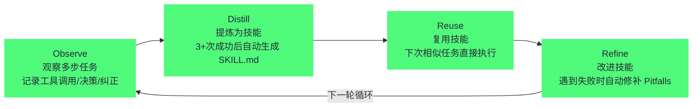
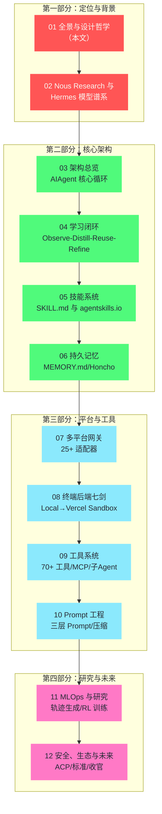

# 01 Hermes Agent 全景——自改进 Agent 的设计哲学

> [!abstract] 摘要
> Hermes Agent 是 Nous Research 开发的开源"自改进 AI Agent"——2025 年 7 月在 GitHub 开源，MIT 协议，22 万+ star。它不是又一个 Coding Agent——它代表 Agent 领域的一个独立分支："长驻自改进个人 Agent"。文章从 Hermes 的核心定位出发——"会成长的 Agent"（The AI agent that grows with you）——拆解其六大设计理念（自改进学习闭环 / 长驻多平台 / 模型无关 / 随处运行 / 研究就绪 / 开源自托管）；与 Claude Code/Devin/Cursor 等 Coding Agent 做维度对比，阐明 Hermes 为什么不是"竞品"而是"互补品"；介绍 Nous Research 这个"社区驱动的开放权重研究实验室"的背景——从 Hermes 模型谱系到 Forge Reasoning API 到 Psyche 分布式训练；最后给出本专栏 12 篇文章的阅读地图。核心认知：Hermes 的设计哲学是"Agent 不是工具，而是伙伴"——工具被使用后不变，伙伴在交互中成长——这种"自改进"能力是 Hermes 与所有其他 Agent 的根本区别。

---

## 第 1 章 什么是 Hermes Agent

### 1.1 一句话定义

Hermes Agent 的官网首页写着："The AI agent that grows with you."（与你一起成长的 AI Agent）。这句话精确地概括了 Hermes 的核心定位——它不是"你用完就丢弃"的工具，而是"越用越强"的伙伴。

值得玩味的是这句话里 "grows" 这个动词的选择。市面上绝大多数 Agent 产品的宣传语强调的是"能做什么"——能写代码、能订机票、能分析数据——能力清单式的表达，默认前提是"能力出厂即定，使用只是消耗"。而 "grows with you" 把主语换成了成长本身，并且加了一个容易被忽略的状语——"with you"。成长不是 Agent 单方面的事情，而是与用户共同发生的：你教它你的工作流，它把这些工作流沉淀为技能；你纠正它的错误，它把纠正记进陷阱清单。这种表述背后是一整套对"Agent 应该是什么"的不同回答——**工具被使用后保持不变，伙伴在交互中发生改变**。

展开来说，Hermes Agent 是：
- **开源**（MIT 协议）——每一行代码都可以审计
- **自托管**——所有数据留在你的机器上，零遥测，零追踪
- **自改进**——从经验中创建可复用技能，跨会话记忆你的偏好
- **长驻**——7×24 运行在你的服务器上，不绑定你的笔记本
- **多平台**——通过 Telegram/Discord/Slack/WhatsApp/Signal/CLI 与你交互
- **模型无关**——18+ 提供商，`hermes model` 一键切换，无锁定

这六个形容词不是营销词的堆砌——每一个都对应一个具体的技术决策，而且彼此之间存在依赖关系：因为自托管，所以数据可以放心地长期积累；因为长驻，所以经验有地方沉淀；因为经验有沉淀，所以自改进才有原料。反过来读也成立——如果任何一条不成立，其余几条的价值都会打折。譬如一个绑定云端的 Agent 即便有学习闭环，用户也会犹豫"我的工作流数据存在谁的服务器上"；一个会话级的 Agent 即便支持 25 个消息平台，也无法提供"跨平台连续性"——因为会话结束，状态就清零了。理解这种"理念之间的耦合"，比记住清单本身更重要。

### 1.2 核心数字

| 指标 | 数据 |
| :--- | :--- |
| GitHub star | 22 万+ |
| 开源协议 | MIT |
| 开发者 | Nous Research |
| 仓库创建 | 2025-07-22 |
| 正式发布 | 2026-02 |
| 内置技能 | 40+ |
| 消息平台 | 25+ 适配器（内置 + 插件） |
| 工具数量 | 70+ 工具，28 工具集 |
| LLM 提供商 | 18+ |
| 终端后端 | 7 种（Local/Docker/SSH/Modal/Daytona/Singularity/Vercel Sandbox） |
| 测试套件 | ~25,000 测试，~1,250 文件 |
| 安装方式 | 一行 curl 命令 |

这张表里有几个数字值得单独解读，因为它们透露的信息比字面更多。

**22 万+ star**：作为参照，2023 年引爆"自主 Agent"概念的 AutoGPT 在爆发期数周内积累了十几万 star，此后增速回落；Hermes 在 2025-07 创建仓库、2026-02 正式发布的时间线内达到 22 万+，说明市场对"长驻自改进个人 Agent"这个品类的需求是真实且持续的，而非又一轮概念炒作的昙花一现。当然，star 数衡量的是关注度而非生产使用率——这一点在后文评估 Hermes 的生态位时要保持清醒。

**~25,000 测试**：一个"个人 Agent"项目携带 25,000 个测试、1,250 个测试文件，这个比例在开源 Agent 项目中极为罕见。测试密度反映的是对"长驻可靠性"的重视——会话级工具的 bug 影响一次会话，长驻系统的 bug 会随时间累积。第 03 篇讨论架构时会回到这个话题。

**40+ 内置技能**：注意这是"出厂自带"的部分——Hermes 技能系统的真正价值在于用户自己的技能会在这 40 个之上持续生长。内置技能更像是"示范作品"，向用户展示 SKILL.md 的写法和能力边界。

### 1.3 安装与启动

Hermes 的安装设计体现了"零门槛"理念——一行命令搞定一切：

```bash
# Linux/macOS/WSL2/Termux
curl -fsSL https://hermes-agent.nousresearch.com/install.sh | bash

# Windows (原生 PowerShell)
iex (irm https://hermes-agent.nousresearch.com/install.ps1)
```

安装脚本自动处理一切：安装 `uv`（Rust 编写的 Python 包管理器）、Python 3.11、Node.js、ripgrep、ffmpeg，以及一个便携式 Git Bash（MinGit，不需要管理员权限）。安装完成后：

```bash
hermes              # 启动交互式 CLI，开始对话
hermes model        # 选择 LLM 提供商和模型
hermes setup        # 完整设置向导（一次性配置所有内容）
hermes gateway      # 启动消息网关（Telegram/Discord 等）
```

> [!note] 设计哲学：零前提条件的安装
> Hermes 的安装设计有一个明确的原则——"零前提条件"（No prerequisites）。不需要预装 Python、Node.js、Git——安装脚本全部自动处理。这与 Devin 需要 Docker、Claude Code 需要 Node.js 的安装体验形成对比。Hermes 的目标用户不只是开发者——还包括通过 Telegram 使用 Agent 的非技术用户——因此安装必须"傻瓜化"。

**Windows 原生支持的工程细节**：Hermes 的 Windows 原生支持有一个值得注意的工程细节——它捆绑了一个便携式 Git Bash（MinGit，约 45MB），解压到 `%LOCALAPPDATA%\hermes\git`——不需要管理员权限，完全隔离于系统 Git 安装。如果用户已有 Git，安装脚本检测到后直接使用系统 Git。这种"有就用，没有就自带"的优雅降级设计让 Hermes 在"没有 Git 的 Windows 机器"上也能运行——这在非开发者的 Windows 电脑上很常见。

**Termux/Android 支持**：Hermes 甚至支持在 Android 手机上通过 Termux 运行——安装时使用精简的 `.[termux]` extra（而非完整的 `.[all]` extra），因为完整 extra 包含的语音依赖在 Android 上不兼容。这让"在旧 Android 手机上运行个人 Agent"成为可能——虽然体验不如服务器，但展示了 Hermes "随处运行"理念的极致。

把三个平台的安装细节放在一起看，会发现它们指向同一个设计判断：**安装摩擦是个人 Agent 品类扩散的第一道瓶颈**。开发者可以容忍"先装 Docker"，但一个想让 Agent 帮忙记日程的普通用户不能——Hermes 在安装环节的每一分工程投入，都是在为"非开发者用户"修路。

"零前提条件"这个原则看似只是工程上的体贴，实则是一个战略选择。回看 Agent 工具的扩散路径：Claude Code、Devin、OpenHands 的第一批用户全部是开发者——因为他们能搞定 Node.js、Docker 这些前提条件。而"长驻个人 Agent"的目标用户画像是"想让生活自动化的人"——其中大量是非开发者。对这群人来说，"先装 Docker 再装 Agent"是一道劝退墙；"一条命令、五分钟用上"才是这个品类能够扩散的前提。安装体验的差异，本质上是目标用户画像的差异。

### 1.4 "长驻个人 Agent"这个品类从哪里来

要理解 Hermes 的定位，不妨把时间轴拉长，看看"个人 Agent"这个品类是如何一步步从对话产品中分化出来的——每一个阶段都解决了上一阶段的一个核心缺陷。

| 阶段 | 时间 | 形态 | 核心缺陷 |
| :--- | :--- | :--- | :--- |
| 会话级对话 | 2022-11 起 | ChatGPT 式问答 | 无行动能力，无记忆 |
| 自主 Agent 探索 | 2023 | AutoGPT 式"给目标自己跑" | 无限循环、成本失控、不可靠 |
| Coding Agent 成熟 | 2024-2025 | Claude Code/Devin/Cursor | 强但窄，绑定编码场景，会话级 |
| 长驻个人 Agent | 2025 起 | Hermes 等 | 品类初生，安全与可靠性待验证 |

2022 年 11 月 ChatGPT 上线，对话式 AI 进入大众视野，但它是纯粹的"问答机"——能说不能做，关掉窗口什么都不剩。2023 年，AutoGPT 把"给 LLM 一个目标，让它自己拆解执行"的思路推向大众，一度成为 GitHub 增速最快的项目，但很快暴露了根本问题：没有可靠记忆、没有成本控制、没有错误恢复，Agent 在循环中反复踩同一个坑，跑一夜烧掉几十美元 API 费却一事无成。这场热潮的退潮留下一个重要的教训——**自主性不等于可用性，没有记忆和反思机制的自主只是重复犯错**。

2024 年之后，行业注意力转向了更务实的 Coding Agent——把 Agent 的行动域收窄到"代码仓库"这个可验证的环境里，用测试和编译结果作为反馈信号，Claude Code、Devin、Cursor 在这条路上取得了实实在在的成功。但收窄是有代价的：这些工具绑定 IDE/终端交互、绑定编码场景、会话结束即归零——它们回答了"如何把一件事做好"，没有回答"如何长期陪伴一个人"。

Hermes 代表的"长驻个人 Agent"正是对后一个问题的回答。它吸收了 2023 年的教训（学习闭环提供记忆与反思）、借用了 2024 年的工程成果（工具调用、沙箱执行、MCP 生态），然后把交互界面从 IDE 搬到了消息平台——因为"个人助理"的生活场景发生在 Telegram 和 Discord 里，而不是终端里。理解这条演化线，就能理解 Hermes 的每一个设计决策都不是凭空而来——**它是三次浪潮的合流，而不是又一次从零开始的尝试**。

当然，"品类初生"也意味着这个阶段的问题同样真实：长驻进程的安全模型还在演进，自改进的失效场景（技能固化、技能漂移）没有银弹解法，非技术用户的自托管门槛依然存在。本专栏在后续篇章中会反复回到这些未解问题——评估一个年轻品类的代表作，既要看它回答了什么，也要看它还没回答什么。

---

## 第 2 章 六大设计理念

在逐一拆解之前需要先说明：这六个理念不是并列的清单，而是一个有结构的整体——自改进学习闭环是目的，长驻是让学习有时间的维度，多平台是让学习有数据的来源，模型无关是让学习成果不被单一厂商绑架，随处运行是让学习成果有安全的执行场所，开源自托管是让这一切建立在用户信任的地基上。下面按这个逻辑逐个展开。

### 2.1 理念一：自改进学习闭环

Hermes 最独特的特性是"自改进"——它有一个内置的学习循环（Learning Loop），遵循 **Observe → Distill → Reuse → Refine** 四步循环：



**Observe（观察）**：Hermes 在 episodic memory 层追踪每个多步任务——每次工具调用、每个决策分支、每次用户纠正。这不是简单的"对话日志"——而是结构化的"任务执行轨迹"。

**Distill（提炼）**：当相似任务模式成功完成 3+ 次后，Hermes 进入提炼阶段——生成一个 `SKILL.md` 文档，捕获程序步骤、已知陷阱和验证方法。这个文档遵循 agentskills.io 开放标准——可以被其他兼容 Agent（如 Claude Code、Cursor、OpenHands）使用。

**Reuse（复用）**：技能保存在 `~/.hermes/skills/` 目录，立即可用为 slash 命令。下次相似任务来时，Hermes 不重新探索——直接执行已保存的工作流。

**Refine（改进）**：当 Hermes 使用某个技能时遇到失败（如走到死路发现了 workaround），它会自动修补技能——把失败路径加入 Pitfalls 段，把成功路径加入 Procedure 段。失败的方法被记住并剪枝，成功的方法被强化。

**skill_manage 工具的触发条件**：技能的创建和更新通过 `skill_manage` 工具实现，其 schema 定义了精确的触发条件——"创建当：复杂任务成功（5+ 工具调用）、错误被克服、用户纠正后的方法有效、发现非平凡工作流、或用户要求记住某个程序"。这种"基于触发条件而非固定时间表"的设计让技能创建是"事件驱动"的——只有在"值得记住"的事情发生时才创建技能，避免了对每个简单任务都生成低价值技能。

**Nudge Engine（提醒引擎）**：学习闭环的"驱动器"是 Nudge Engine——一个定期提醒 Agent "反思并持久化知识"的机制。Nudge 不是"每 N 分钟触发一次"的简单定时器——而是"在对话的自然间隙"插入反思提示，如"你刚才完成了一个复杂任务，要不要把流程保存为技能？"这种"温和提醒"而非"强制执行"的设计让用户保持对 Agent 行为的控制——用户可以说"不用保存"，Agent 尊重决定。

**社区报告的改进效果**：有 Reddit 用户报告，基于类似的自批判循环构建的原型在 8 次运行后错误率下降 30%。这虽然不是受控实验，但提供了"自改进确实有效"的初步证据——技能在迭代中越来越精确，失败路径被逐步消除。

这个循环可以用一个生活化的比喻来理解——**老师傅带学徒**。学徒第一次安装货架，师傅在旁边盯着每一步：先找承重墙、用电钻前检查线管、膨胀螺栓要打多深。装了三五次之后，师傅不再盯着，学徒自己按流程走；某次打孔打到了线管，学徒把"先用电线探测仪扫一遍"写进自己的流程，下一次就不会再犯。Hermes 的 Observe 就是师傅在旁记录，Distill 是把"怎么做"写成操作手册，Reuse 是照手册施工，Refine 是把事故写进手册的"注意事项"一栏。比喻到这里需要立刻加上技术限定：老师傅的"肌肉记忆"长在神经里，而 Hermes 的"手册"长在文件系统里——`~/.hermes/skills/` 目录下的 SKILL.md 就是那本不断变厚的操作手册，模型权重从头到尾没有变过。

反过来看，如果没有这个学习闭环，会发生什么？答案是 2023 年 AutoGPT 已经演示过的困境：Agent 每次会话都从零开始探索，上周踩过的坑这周原样再踩一遍，用户被迫反复教同样的东西——"我们的部署脚本在 staging 目录"、"测试要用 pytest 而不是 unittest"。这种状态好比一个每天失忆的管家：他每天都很努力，但你每天都要重新交代一遍所有家规。会话级 Agent 的"金鱼记忆"不是小缺陷，而是"个人助理"这个定位的致命伤——**助理的价值恰恰在于"不用每次交代"**。

> [!warning] 边界与反例：自改进不是只赚不赔的买卖
> 学习闭环有三个已知的失效场景，评估 Hermes 时不能回避。其一，**错误技能固化**——如果某个流程"偶然成功"了 3 次（譬如恰好环境状态掩盖了步骤缺陷），一个有缺陷的技能就会被固化为标准操作，之后每次复用都在放大这个缺陷。其二，**技能漂移**——环境变了技能没变：目标服务器升级后，旧的部署技能可能从"省事"变成"事故源头"。其三，**技能噪音**——低质量技能积累过多后，会在技能检索时稀释高质量技能的可见性。Hermes 的应对是 Pitfalls 段的持续修补和 Nudge 的"用户确认"环节，但这些机制只能缓解而非消除问题——技能库需要用户像整理衣柜一样定期人工审视，这一点在当前版本中仍主要依赖用户自觉。

> [!info] 核心概念：技能不是"预设"，而是"生长出来的"
> 传统 Agent 的"技能"是开发者预设的——如 Claude Code 的内置工具、Devin 的 ACI 操作。Hermes 的技能是"生长出来的"——从用户与 Agent 的交互中自动提炼。这意味着两个不同用户的 Hermes 会有完全不同的技能集——一个 DevOps 工程师的 Hermes 会生长出"K8s 部署"技能，一个数据科学家的 Hermes 会生长出"数据清洗"技能。这种"个性化技能生长"是 Hermes "自改进"的核心含义——不是模型权重在改变，而是"程序性记忆"在积累。这类似于人类的"程序性记忆"——骑自行车、写代码、做 PR 审查——这些技能不是"先天预设"的，而是"通过实践习得"的。Hermes 试图在 Agent 中复制这种"实践→技能"的人类认知机制。

### 2.2 理念二：长驻多平台

Hermes 不是"打开-用-关闭"的工具——它是一个"长驻"（persistent）的 Agent 进程，7×24 运行在你的服务器上。你通过消息平台与它交互——Telegram、Discord、Slack、WhatsApp、Signal、Email、CLI——所有平台共享同一个 Agent 实例和记忆。

**跨平台连续性**：你可以在 Telegram 上开始一个对话，在 CLI 中继续——Hermes 记得你在 Telegram 上说了什么。这种"跨平台连续性"是通过统一的 SessionStore 实现的——所有平台的对话存储在同一个 SQLite 数据库中，通过 session key 关联。

**语音消息转写**：在 Telegram/WhatsApp 上发语音消息，Hermes 自动转写为文本处理——你不需要打字，直接说话。

**为什么"长驻"重要**：Coding Agent（Claude Code/Devin）是"会话级"的——你打开它，完成任务，关闭它。下次打开时，它不记得上次做了什么（除非你手动提供上下文）。Hermes 是"长驻"的——它一直在那里，一直在学习，一直在记忆。这种差异不是技术细节——而是根本性的设计哲学分歧：Hermes 把 Agent 视为"长期伙伴"而非"临时工具"。

用一个比喻来说：会话级 Agent 像上门维修工——你打电话预约，他来干活，干完走人，下次来对上次干过什么毫无印象；长驻 Agent 像住家管家——他知道你喜欢的咖啡、记得周三有例会、在你出差时照常照看房子。维修工模式的问题不在于单次服务质量，而在于**所有协作成本都发生在"重新建立上下文"上**——对于一次性任务这无所谓，对于"每天都要做的事"这就是持续摩擦。

不过长驻不是没有代价的，这些代价在架构上必须显式偿还。第一是**状态管理复杂度**——进程要处理崩溃恢复、会话并发、数据一致性，这些在"跑完即退"的工具里根本不存在。第二是 **bug 累积效应**——会话级工具的 bug 影响一次会话，长驻系统的 bug 会随时间复利：一个记忆写入的小缺陷，跑一个月就是一片被污染的记忆，而且"正常行为"的基线已经漂移，排查极其困难。第三是**攻击面扩大**——一个 7×24 在线、连接着 Telegram/Discord/SSH 的进程，暴露面远大于一个只在编码时打开的 CLI 工具，这就是为什么 Hermes 要设计 DM pairing 授权和命令审批机制（第 12 篇详述）。长驻的价值真实存在，但它是用工程复杂度换来的——天下没有免费的管家。

### 2.3 理念三：模型无关

Hermes 不绑定任何 LLM 厂商——支持 18+ 提供商，通过 `hermes model` 命令一键切换：

| 提供商 | 接入方式 | 特点 |
| :--- | :--- | :--- |
| **Nous Portal** | OAuth | 300+ 模型 + Tool Gateway（搜索/图像/TTS/浏览器） |
| **OpenRouter** | API Key | 200+ 模型聚合 |
| **OpenAI** | API Key | GPT 系列 |
| **Anthropic** | API Key | Claude 系列 |
| **NVIDIA NIM** | API Key | Nemotron 系列 |
| **z.ai/GLM** | API Key | GLM 系列 |
| **Kimi/Moonshot** | API Key | Moonshot 系列 |
| **MiniMax** | API Key | MiniMax 系列 |
| **Hugging Face** | API Key | 开源模型 |
| **本地 vLLM** | 端点 | 完全本地部署 |
| **自定义端点** | OpenAI 兼容 | 任何兼容 API |

**Nous Portal 的一站式方案**：如果你不想收集 5 个不同的 API Key（模型、搜索、图像生成、TTS、云浏览器），Nous Portal 用一个订阅覆盖所有——`hermes setup --portal` 一条命令完成 OAuth 登录 + 提供商配置 + Tool Gateway 启用。Tool Gateway 路由的子服务包括：Firecrawl（Web 搜索）、FAL（图像生成）、OpenAI（TTS）、Browser Use（云浏览器）——全部通过一个 Nous Portal 订阅计费，无需单独注册。

**三种 API 模式的内部适配**：Hermes 的架构支持三种 API 模式来适配不同提供商——`chat_completions`（OpenAI 兼容格式）、`codex_responses`（OpenAI Responses API 格式）、`anthropic_messages`（Anthropic Messages API 格式）。Provider Runtime Resolver 负责把 `(provider, model)` 元组映射到 `(api_mode, api_key, base_url)`——这个解析器被 CLI、Gateway、Cron、ACP 和辅助调用共享，确保所有入口使用一致的提供商解析逻辑。

**Fallback 与 Credential Pools**：Hermes 支持自动故障转移——当主模型遇到错误时自动切换到备用 LLM 提供商。还支持 Credential Pools——把 API 调用分散到多个 key 上，在限速或故障时自动轮换。这两个特性让 Hermes 在"生产级长驻运行"场景中更可靠——不会因为单个 API key 的限速或单个提供商的故障而中断。

**为什么模型无关重要**：Coding Agent 通常绑定特定模型——Claude Code 绑定 Claude，Devin 绑定 GPT-4o。这种绑定意味着"模型升级时你受益，模型退化时你受损"。Hermes 的模型无关让你"用最好的模型做最好的事"——推理任务用 Claude，编码任务用 GPT-4o，成本敏感任务用开源模型——而且可以随时切换，不需要改代码。在 LLM 快速迭代的时代，"模型无关"是一种"抗衰退"设计——不会被任何单一模型的兴衰所绑定。

这种"抗衰退"价值有真实的历史背书。2023 到 2024 年间，多家厂商发生过模型退役、降价重组、政策调整——绑定单一提供商的应用被迫在短时间内迁移，迁移成本包括格式适配、prompt 重调、行为回归测试。对一个会话级工具，这种迁移是一阵子的阵痛；对一个积累了大量技能和记忆的长驻 Agent，迁移还多一层风险——**沉淀的资产会不会在换模型后失效**。模型无关设计把"换大脑"变成一个运行时选项（`hermes model` 一条命令），而不是一次工程迁移。

打个比方，模型无关层就像电器上的标准化电源接口——电器可以年年换代，插座标准不动，换电器不需要重新布线。但这个比喻也有失真之处，需要立刻限定：电源接口只传电，不关心电器内部怎么工作；而不同 LLM 对 prompt 的偏好差异是真实存在的——同一个技能文档，Claude 可能对结构化 XML 标签响应更好，另一些模型可能偏好 Markdown 层级。所以 Hermes 的"模型无关"是**接口层的无关**，不是**行为层的无关**——切换模型后技能仍然可用，但执行质量可能有波动。这是所有"模型无关"架构的共同代价：为了不被任何一家绑定，就要接受"对每一家都不是最优适配"。

### 2.4 理念四：随处运行

Hermes 支持 7 种终端后端——Agent 的代码执行环境可以是：

| 后端 | 隔离机制 | 适用场景 |
| :--- | :--- | :--- |
| **Local** | 无隔离 | 本地开发，直接在机器上执行 |
| **Docker** | 容器隔离 | 安全加固的容器执行 |
| **SSH** | 远程服务器 | 在远程服务器上执行 |
| **Modal** | gVisor Serverless | 按需启动，空闲不计费 |
| **Daytona** | 容器/VM/GPU | 多类型沙箱，支持 GPU |
| **Singularity** | HPC 容器 | 高性能计算环境 |
| **Vercel Sandbox** | 云端沙箱 | Vercel 的代码执行环境 |

**Serverless 持久化**：Modal 和 Daytona 提供"serverless 持久化"——Agent 的环境在空闲时休眠，有请求时按需唤醒，空闲期间几乎零成本。这让"在 $5 VPS 上运行 Hermes"成为现实——不需要昂贵的 GPU 服务器，Agent 环境在云端按需启停。

这 7 个后端背后是一个经典的三角权衡——**隔离强度、成本、延迟**，三者不可能同时最优。Local 后端零成本零延迟，但 Agent 的每条命令都直接跑在你的机器上，隔离强度为零；Docker 提供容器隔离，成本依然很低，但容器逃逸风险始终存在（这正是 [[LLM/Agent沙箱技术/00 专栏导览|Agent 沙箱技术专栏]] 整个讨论的前提）；Modal/Daytona 这类 Serverless 沙箱用 gVisor 等机制提供接近 VM 的隔离，代价是冷启动延迟和按量计费。Hermes 把选择权交给用户而不是替用户做决定——因为"跑什么代码"只有用户自己清楚：让 Agent 帮自己写个人博客脚本，Local 足矣；让 Agent 处理从网上抓来的不可信数据，就该上沙箱。

这里有一个容易忽视的反例值得展开：**Local 后端 + 长驻 + 消息平台** 的组合是危险的。设想 Hermes 以 Local 模式跑在家里服务器上、连接着 Telegram——任何一个能给这个 Telegram 账号发消息的人（如果授权配置不当），都可能诱导 Agent 在你的机器上执行命令。会话级 Coding Agent 也有 Local 执行，但"用户坐在屏幕前实时看着"构成了天然的监督；长驻 Agent 的执行发生在你不在场的时候，监督缺位。所以"随处运行"的自由度必须与第 12 篇要讲的安全机制配套使用——**执行后端的选择本质上是一个安全决策，而不只是性能决策**。

### 2.5 理念五：研究就绪

Hermes 不只是"个人助理"——它还是一个"AI 研究工具"。Nous Research 本身是 AI 研究实验室，Hermes 的设计天然支持研究工作流：

- **批量轨迹生成**——`batch_runner.py` 可以并行运行数百到数千个 prompt，生成结构化的 ShareGPT 格式轨迹数据
- **RL 训练集成**——与 Atropos RL 环境集成，支持 11 种 tool-call parser 训练任意模型架构
- **轨迹压缩**——把训练数据压缩到 token 预算内，适配下游微调管线

这种"研究就绪"设计让 Hermes 不仅是一个产品——还是一个"训练数据工厂"——用 Hermes 生成轨迹数据，用这些数据微调下一代 tool-calling 模型。第 11 篇将深入这个主题。

把"研究就绪"放进六大理念里，能看到 Nous Research 的一盘更大的棋——**数据飞轮**。用户使用 Hermes Agent 完成真实任务，产生真实的多步工具调用轨迹；这些轨迹经过 ShareGPT 格式导出和压缩，成为微调原料；微调出的下一代模型（Hermes 谱系）又让 Agent 更强，吸引更多用户产生更多轨迹。对 OpenAI 这样的闭源实验室，这个飞轮的"数据"环节藏在黑箱里；对 Nous 这样的开放权重实验室，飞轮必须显式地建成基础设施——因为开放权重模型要在工具调用能力上与闭源巨头竞争，高质量轨迹数据是最稀缺的资源。第 11 篇会看到，`batch_runner`、Atropos 集成、11 种 tool-call parser 这些"研究特性"不是附属功能，而是这个飞轮的传动齿轮。

### 2.6 理念六：开源自托管

Hermes 是 MIT 协议开源——每一行代码都可以审计，每一份数据都留在你的机器上：

- **零遥测**——不收集任何使用数据
- **零追踪**——不追踪你的行为
- **零云锁定**——所有数据在 `~/.hermes/` 目录，可以随时导出
- **完全自托管**——可以在 AWS/GCP/Azure/裸机/家里的树莓派上运行

> [!warning] 生产避坑：自托管不等于"免费"
> Hermes 本身免费开源，但运行 Hermes 有间接成本：1）LLM API 调用费用——除非用本地 vLLM，否则每次对话都消耗 API 额度；2）服务器成本——如果用 Modal/Daytona 等云端后端，按使用量付费；3）运维时间——Hermes 需要更新、配置、调试。对于个人用户，月成本通常在 $5-$50（取决于 LLM 使用量）；对于团队部署，可能需要专职运维。

"零遥测"对个人 Agent 的意义，比对开发者工具大得多——原因在于经过 Agent 的数据性质不同。一个代码编辑器遥测收集的是"你用了哪个功能"；而一个长驻个人 Agent 的记忆库里躺着你的日程、项目细节、消息往来，甚至可能包括你让它代管的服务器凭证。这些数据一旦经由遥测外流，泄露的不是使用偏好，而是**你的数字生活本身**。所以"数据留在 `~/.hermes/`"不只是一个隐私承诺，而是整个信任架构的地基——用户之所以敢把生活交给 Agent，前提是确认这份"生活"物理上在自己手里。

当然，信任架构的另一面是责任转移。闭源托管服务由厂商负责安全补丁、备份、升级；自托管意味着这些全部回到用户肩上——Hermes 发了新版本你要自己升，服务器磁盘满了你要自己清，`~/.hermes/` 目录你要自己备份。上面 warning callout 里算的账很实在：对个人用户，$5-$50 的月成本里最容易被低估的是第三项"运维时间"。开源自托管是一种**用便利换主权**的交易——它适合的用户画像很明确：愿意为数据主权支付运维成本的"自己动手"型用户。如果你不愿意付这个成本，Hermes 的开源免费对你而言就不是优势——这是评估任何自托管产品时都必须先问自己的问题。

---

## 第 3 章 Hermes vs Coding Agent——不是竞品，是互补品

### 3.1 维度对比

做对比之前先立一个规矩：对比的目的是理解设计取舍，不是打分排名。下面这张表的每一行都值得问一句"为什么这一格是这个答案"——譬如为什么 Coding Agent 集体缺席"消息平台"和"定时任务"两行，为什么 Hermes 的"跨会话记忆"是深度而 Coding Agent 是有限——这些格子背后的原因，比格子本身的信息量大得多。

| 维度 | Claude Code | Devin | Cursor | OpenHands | **Hermes Agent** |
| :--- | :--- | :--- | :--- | :--- | :--- |
| **核心场景** | 终端编码 | 自主编码 | IDE 编码 | 开源编码 | **通用个人助理** |
| **交互界面** | CLI | Web | IDE | Web/CLI | **消息平台 + CLI** |
| **生命周期** | 会话级 | 会话级 | 会话级 | 会话级 | **长驻 7×24** |
| **自改进** | ❌ | ❌ | ❌ | ❌ | **✅ 学习闭环** |
| **跨会话记忆** | 有限（CLAUDE.md） | ❌ | 有限（.cursorrules） | ❌ | **✅ 深度记忆** |
| **模型无关** | ❌（Claude） | ❌（GPT-4o） | 部分 | ✅ | **✅ 18+ 提供商** |
| **消息平台** | ❌ | ❌ | ❌ | ❌ | **✅ 25+ 适配器** |
| **定时任务** | ❌ | ❌ | ❌ | ❌ | **✅ Cron 调度** |
| **开源** | ❌ | ❌ | ❌ | ✅ | **✅ MIT** |
| **自托管** | ❌ | ❌ | ❌ | ✅ | **✅ 完全自托管** |
| **MLOps/研究** | ❌ | ❌ | ❌ | 部分 | **✅ 批量轨迹 + RL** |

### 3.2 为什么是"互补品"

从对比表可以看出，Hermes 和 Coding Agent 在大多数维度上不重叠——它们解决不同的问题：

- **Coding Agent 解决"编码效率"问题**——在 IDE/终端中帮你写代码更快
- **Hermes 解决"个人自动化"问题**——在消息平台中帮你处理各种事务

一个开发者可能同时使用两者——白天用 Claude Code 在 IDE 中编码，晚上用 Hermes 在 Telegram 上安排明天的日程、生成日报、监控部署。两者不冲突——Hermes 甚至可以调用 Claude Code 作为工具（通过终端后端）。

值得进一步追问的是：为什么市场上会分化出这两个品类，而不是一个"全能 Agent"通吃？根本原因在于**交互模式决定了架构形态**。编码是"高带宽、低延迟"的交互——光标停在第几行、diff 是否接受、测试输出是什么，这些信息必须在亚秒级往返，所以 Coding Agent 必然长在 IDE/终端里；而"个人事务"是"低带宽、高延迟"的交互——"明早提醒我给客户回邮件"发出后不需要任何实时反馈，消息平台天然匹配这种节奏。把高带宽交互塞进消息平台（在 Telegram 里逐条确认 diff）或者把低带宽任务塞进 IDE（开一个 Cursor 会话就为了设个提醒），体验都会非常别扭——不是功能缺失，而是**媒介与任务的节律错配**。

做一个反事实思想实验就能看清这一点。假设 Claude Code 加上了 Telegram 支持——它会因此变成 Hermes 的竞品吗？不会。它的记忆机制（CLAUDE.md）、会话生命周期、审批模型都是围绕"开发者坐在终端前"设计的；把入口搬到 Telegram，得到的只是一个"能发消息的编码工具"，而不是"会成长的个人助理"——缺的不是渠道，是学习闭环、跨平台会话路由、cron 调度这一整套长驻基础设施。反过来，让 Hermes 挤进 IDE 与 Cursor 拼光标级响应，同样是以短击长。两个品类各自在自己的节律上演化，交叉点上的合作（Hermes 通过终端后端调用 Claude Code）比竞争更符合各自的架构禀赋——**Agent 调用 Agent 的组合，比一个 Agent 做所有事更合理**。

### 3.3 "长驻"带来的独特能力

Hermes 的"长驻"特性带来了一些 Coding Agent 无法实现的能力：

**定时自动化（Cron 调度）**：Hermes 有内置的 cron 调度器——可以用自然语言设置定时任务："每天早上 8 点给我发一份新闻摘要"、"每周一审查上周的 PR"、"每天晚上 11 点备份数据库"。这些任务在 Hermes 长驻运行时自动执行——不需要你在线。Coding Agent 是"会话级"的——关闭后就停止运行，无法做定时任务。

**跨会话上下文积累**：Hermes 的记忆不仅跨会话——还跨"天"。你今天告诉 Hermes "我在做项目 X"，下周它仍然记得。这种"长期记忆"让 Hermes 可以做"需要长期上下文"的任务——如"跟踪项目 X 的进度，每周给我一份状态报告"——Coding Agent 每次会话从头开始，无法积累这种长期上下文。

**事件驱动响应**：Hermes 的消息网关可以接收"事件"——如 Webhook、邮件到达、消息平台通知——并自动响应。如"当生产环境有告警时，自动分析日志并把摘要发到我的 Telegram"。这种"事件驱动"模式需要 Agent 一直运行——Coding Agent 的"打开-用-关闭"模式无法实现。

**Checkpoints 与 Rollback**：Hermes 在修改文件前自动快照工作目录——如果出了问题，可以用 `/rollback` 回滚。这种"安全网"在长驻运行中特别重要——Agent 可能在你不在的时候执行了文件修改（如 cron 任务），如果修改有问题，你需要能回滚。Coding Agent 通常没有这种需求——因为用户在会话中可以实时看到修改并决定是否接受。

这四项能力有一个共同的前提，值得点破：它们全部要求 Agent 在"用户不在场"的时刻依然可靠地运行和决策。定时任务发生在你睡觉时，事件响应发生在你开会时，cron 里的文件修改发生在你完全不知情时。这就把对 Agent 的要求从"用的时候好用"提升到了"不用的时候也值得信任"——快照回滚、命令审批、DM pairing 这些安全机制（第 12 篇展开）不是附加功能，而是"长驻"这个特性的必要配套。**没有安全网的自主性不是能力，是事故隐患**。

### 3.4 选型决策——什么时候用什么

对比的目的不是评出高下，而是给出可操作的选型依据。把日常任务按两个维度拆开——**是否需要长期上下文**、**交互节律是高带宽还是低带宽**——选择就变得相当清晰：

| 任务特征 | 更合适的选择 | 理由 |
| :--- | :--- | :--- |
| 写一个新功能、修一个 bug | Coding Agent | 高带宽交互，需要实时看 diff、跑测试 |
| 大规模重构、跨文件改动 | Coding Agent | 需要持续的在环监督与即时反馈 |
| 每天定时的报告、摘要、备份 | Hermes | 需要长驻进程与 cron 调度 |
| 消息平台上的随手委托 | Hermes | 低带宽交互，异步完成即可 |
| 需要记住偏好的重复性流程 | Hermes | 学习闭环把流程沉淀为技能 |
| 一次性的探索性分析 | 两者皆可 | 无长期上下文需求，看个人习惯 |
| 生产环境的敏感操作 | Coding Agent（在环）或 Hermes + 审批 | 关键在审批机制，而非产品本身 |

这张表里最值得展开的是最后一行。同样是"让 Agent 操作生产环境"，Coding Agent 的默认形态是人在环路——你盯着每一步，审批每一次执行；Hermes 的默认形态是异步执行——你发完消息就去干别的了。这不是说 Hermes 不能安全地操作生产环境，而是说**安全责任的配置方式完全不同**：用 Coding Agent 时安全来自"实时监督"，用 Hermes 时安全必须来自"事前配置"——allowlist、DM pairing、命令审批规则、沙箱后端，这些都要在你按下发送键之前就位。很多"Hermes 出事故"的案例，追根溯源不是 Agent 能力问题，而是把会话级工具的使用习惯（"出问题我随时打断"）带进了长驻场景。

另一个容易被选型讨论忽略的事实是：两个品类正在互相渗透。Coding Agent 在补记忆（CLAUDE.md、规则文件都是这个方向的尝试），Hermes 在补编码深度（终端后端可以直接驱动 Claude Code）。长期看，"会话级编码工具"和"长驻个人助理"的边界会逐渐模糊，但**交互节律的差异会长期存在**——就像手机和电脑共存了二十年，不是谁取代谁，而是各自守住自己的节律场景。选型的正确姿势不是"站队"，而是让每个任务流向与它节律匹配的工具。

> [!info] 核心概念：Hermes 是"个人 Agent"而非"编码 Agent"
> 把 Hermes 理解为"开源版 Devin"是错误的——Devin 是"自主编码 Agent"，Hermes 是"个人自动化 Agent"。Devin 的核心能力是"理解代码库→编写代码→运行测试→提交 PR"——全部围绕编码。Hermes 的核心能力是"学习你的工作流→创建技能→跨平台执行→定时自动化"——围绕"个人生产力"。Hermes 可以编码（通过终端后端执行代码），但编码只是它众多能力之一，而非核心定位。

---

## 第 4 章 Nous Research——社区驱动的开放权重研究实验室

### 4.1 实验室定位

Nous Research 是 AI 领域最知名的"社区驱动开放权重研究实验室"——不依赖大公司，通过社区贡献和分布式训练生产高质量开源模型。其旗舰产品是 Hermes 模型谱系——Hugging Face 上下载量最高的社区微调模型家族。

**"社区驱动"的含义**：Nous Research 的运营模式与传统 AI 实验室（如 OpenAI、Anthropic）不同——它不依赖风险投资或大公司资助，而是通过社区贡献（算力、数据、代码）和产品收入（Forge API、Nous Portal）维持运营。这种模式让 Nous Research 可以"不受商业约束地做研究"——如发布"中立对齐"的模型（不预设政治立场），这在商业实验室中是困难的。Nous Research 的"中立对齐"哲学在 Hermes 3 技术报告中有明确表述——模型"试图将自己置于系统提示指示的世界观中，忠实地响应用户请求"——而非"预设一个'有帮助的助手'人格"。这种"中立"立场让 Hermes 模型在"需要模型保持角色一致性"的场景（如角色扮演、创意写作）中表现更好——但也意味着"空系统提示下不一定是'有帮助的助手'"——用户需要提供明确的系统提示。

中立对齐这个选择值得用权衡的眼光看，因为它是一个典型的"有得必有失"。得的一面：角色一致性场景（角色扮演、创意写作、需要模型忠实执行系统提示的 Agent 任务）表现更好——对 Agent 而言这一点尤其重要，因为 Agent 的行为完全由系统提示和技能文档驱动，一个"自带人格滤镜"的模型反而会干扰技能的精确执行。失的一面：空系统提示下模型不承诺"有帮助"，普通用户开箱即用的体验不如对齐取向的商用模型；同时"中立"也意味着模型不会替用户拦截有争议的请求，安全责任更多落在部署侧。理解了这组权衡，就能理解为什么 Hermes Agent 的安全机制（审批、授权、沙箱）做得如此之重——**模型层让渡出去的安全责任，必须在应用层补回来**。

### 4.2 Hermes 模型谱系概览

Hermes 不仅是 Agent 的名字——也是 Nous Research 的 LLM 模型家族的名字。从 2023 年至今，已经发布了四代：

| 代次 | 发布时间 | 基座模型 | 参数规模 | 核心创新 |
| :--- | :--- | :--- | :--- | :--- |
| **Hermes 2** | 2024 | Llama 2 / Mistral | — | `<tool_call>` token + 函数调用（90% FC 评估） |
| **Hermes 3** | 2024-08 | Llama 3.1 | 3B/8B/70B/405B | SFT + DPO，中立对齐，强系统提示遵循 |
| **Hermes 4** | 2025-08 | Llama 3.1 + Qwen 2.5 | 7B/14B/70B/405B | 混合推理模式 + 增强工具使用 |
| **DeepHermes** | 2026 初 | — | 3B/8B/24B | Hermes 微调 + 推理训练 |

第 02 篇将深入这个模型谱系——从 Hermes 2 的函数调用创新，到 Hermes 3 的中立对齐哲学，到 Hermes 4 的混合推理模式，到 DeepHermes 的推理训练融合。

这里先点出一个与 Agent 直接相关的脉络：Hermes 模型谱系的每一代创新，几乎都服务于"让模型更好地当 Agent 的大脑"这个目标。Hermes 2 的 `<tool_call>` token 解决的是"模型如何可靠地发出结构化工具调用"；Hermes 3 的强系统提示遵循解决的是"Agent 的技能文档如何被忠实执行"；Hermes 4 的混合推理模式解决的是"简单任务不浪费推理 token、复杂任务深度思考"的成本与质量平衡。模型与 Agent 不是两个独立产品，而是同一套设计哲学在两个层面的落地。

顺着这个脉络还能看到一条时间上的默契：模型谱系的演进节奏与 Agent 的功能扩张相互咬合——先有能可靠调用工具的模型，才有值得构建的工具生态；先有强系统提示遵循的模型，技能文档这套"用自然语言写的程序"才有执行可靠性。这也是为什么评估 Hermes Agent 的能力上限时，不能只看 Agent 层的代码——**它的大脑在模型谱系那一侧，两边要放在一起看**。

### 4.3 超越模型——Forge 与 Psyche

Nous Research 不只做模型微调——还有两个基础设施项目：

**Forge Reasoning API**：Nous Research 的托管推理服务——在 Hermes 微调模型之上叠加集成推理技术，用于生产部署。这是 Nous 的商业化路径之一——提供"比直接用开源模型更好的推理质量"的付费 API。Forge 的定位类似于"Nous 版的 OpenAI API"——但底层是 Hermes 微调模型而非闭源模型。Forge Reasoning API 的"集成推理"意味着它不只是简单地转发模型输出——而是在推理时叠加多种技术（如思维链、自洽性检查、多路径搜索）来提升输出质量。

**Psyche 分布式训练**：Nous Research 的分布式预训练框架——通过 Solana 区块链协调层，让社区贡献者汇聚异构硬件算力进行训练。这是"去中心化 AI 训练"的实践——不依赖单一公司的算力，而是利用社区闲置 GPU。Psyche 的意义在于"打破大公司的算力垄断"——传统大模型训练需要数千张 H100 集群，只有大公司负担得起；Psyche 让社区贡献者可以"众筹算力"训练模型——即使每个贡献者只有几张消费级 GPU。这种"去中心化训练"模式如果成功，可能改变 AI 模型的生产方式——从"大公司生产+社区使用"到"社区生产+社区使用"。

这两个基础设施项目与 Hermes Agent 的关系是"远因"——日常使用 Hermes 时你感知不到它们的存在，但 Forge 决定了 Nous 的商业化能走多远，Psyche 决定了下一代 Hermes 模型用什么算力训练。看一个开源项目的长期生命力，不能只看仓库本身，还要看它背后的组织有没有可持续的燃料供给——Forge 和 Psyche 就是 Nous 的燃料库。

### 4.4 Nous Research 与 Hermes Agent 的关系

理解 Nous Research 的背景对于理解 Hermes Agent 的设计哲学很重要——Hermes Agent 不是"一个独立的开源项目"——它是 Nous Research 整体战略的一部分：

- **Hermes 模型**提供"大脑"——开放权重的 LLM
- **Forge API**提供"商业化路径"——托管推理
- **Nous Portal**提供"一站式服务"——模型+工具网关
- **Hermes Agent**提供"应用层"——让 Hermes 模型在真实场景中工作
- **Psyche**提供"训练基础设施"——让下一代模型的训练不再依赖大公司

这五个部分构成了一个完整的"开放 AI 生态"——从训练（Psyche）到模型（Hermes）到推理（Forge）到应用（Hermes Agent）到商业化（Nous Portal）。Hermes Agent 在这个生态中的角色是"应用层入口"——让最终用户（不只是研究者）能使用 Hermes 模型的能力。这也是为什么 Hermes Agent 设计为"模型无关"——虽然它原生支持 Nous Portal，但也可以用 OpenAI/Anthropic/任何其他模型——Nous 的策略是"即使你不用 Hermes 模型，也可以用 Hermes Agent"——通过 Agent 的普及来推广 Nous 品牌。

这个策略初看有些反直觉——自己家的 Agent 为什么不强制绑定自己家的模型？但放在生态竞争的角度就通了。Agent 市场的胜负手是**用户量和技能生态的积累速度**，模型市场才是商业化的收口处。如果 Hermes Agent 绑定 Hermes 模型，它就要在 Agent 市场上同时打两场仗——既要和 Claude Code 拼体验，又要和 GPT-4o 拼模型——两场都可能输。而"模型无关"让 Agent 层放下模型包袱专注扩张用户，用户进来后再通过 Nous Portal 这个"最方便的选项"自然转化——这是一种把"转化"交给产品体验而不是强制锁定的打法。当然，这个策略也有代价：如果用户始终用其他家的模型，Nous 在 Agent 层的投入就只赚到了品牌声量。生态策略从来都是一场关于"漏斗每一层转化率"的赌博，没有稳赢的解。

---

## 第 5 章 本专栏阅读地图

### 5.1 12 篇文章的阅读路径



### 5.2 与其他专栏的交叉引用

本专栏在以下位置与其他专栏交叉：

- **第 02 篇**（Hermes 模型谱系）←→ [[LLM/Coding-Agent运行范式/03 Tool Use 与 Function Calling——三大厂商的标准化博弈|Coding Agent 专栏第 3 篇]]（Function Calling 标准化）
- **第 04 篇**（学习闭环）←→ [[LLM/Coding-Agent运行范式/02 ReAct 架构深度解析——Thought-Action-Observation 循环的本质|Coding Agent 专栏第 2 篇]]（ReAct 循环 vs 学习循环）
- **第 05 篇**（技能系统）←→ [[LLM/Coding-Agent运行范式/05 MCP 生态与实践——Server 开发、集成与生产部署|Coding Agent 专栏第 5 篇]]（MCP vs agentskills.io）
- **第 08 篇**（终端后端）←→ [[LLM/Agent沙箱技术/平台与协议/06 Agent 沙箱平台分层——六层模型与三条产品路线|沙箱专栏第 6 篇]]（Daytona/Modal 沙箱）
- **第 09 篇**（工具系统/MCP）←→ [[LLM/Coding-Agent运行范式/04 MCP 协议深度解析——Agent 与工具的标准化连接|Coding Agent 专栏第 4 篇]]（MCP 协议）
- **第 10 篇**（Prompt 工程）←→ [[LLM/Coding-Agent运行范式/06 Prompt 上下文管理——Context Engineering 的艺术|Coding Agent 专栏第 6 篇]]（Context Engineering）
- **第 12 篇**（安全与审批）←→ [[LLM/Coding-Agent运行范式/12 Agent 权限与审批模型——人在环路的工程实践|Coding Agent 专栏第 12 篇]]（权限审批模型）

### 5.3 不同读者的最小阅读集

12 篇全部通读当然是最完整的路径，但不是每个读者都有这个时间预算。按阅读目的裁剪，最小阅读集可以这样取：

| 阅读目的 | 最小阅读集 | 理由 |
| :--- | :--- | :--- |
| 快速判断 Hermes 是什么、值不值得试 | 01 | 全景与定位一篇足够 |
| 理解 Hermes 最独特的创新 | 04 + 05 + 06 | 学习闭环、技能系统、持久记忆是"自改进"的三根支柱 |
| 动手部署和日常运维 | 03 + 07 + 08 | 架构、网关、终端后端是部署的三块基石 |
| 用 Hermes 做研究或数据生产 | 11 | MLOps 工具链集中在这篇 |
| 评估安全风险再决定是否上生产 | 08 + 12 | 执行隔离与应用层安全模型 |

需要提醒的是，"最小阅读集"跳过的篇章里往往埋着前后呼应的伏笔——譬如只读 04 不读 05，会知道技能"何时被创建"却不知道"创建出来的是什么"；只读 08 不读 12，会知道有哪些后端却不知道该怎么选。如果时间允许，第二部分（03-06）建议完整读——它是理解其余所有篇章的地基。

---

## 第 6 章 总结与下一篇导读

### 6.1 本文核心要点

1. **Hermes Agent 是"长驻自改进个人 Agent"**——不是 Coding Agent 的竞品，而是互补品——解决"个人自动化"而非"编码效率"
2. **六大设计理念**：自改进学习闭环 / 长驻多平台 / 模型无关 / 随处运行 / 研究就绪 / 开源自托管
3. **自改进是根本区别**：Observe→Distill→Reuse→Refine 循环让 Hermes 从经验中生长技能——"技能不是预设，而是生长出来的"
4. **25+ 消息平台适配器**：Telegram/Discord/Slack/WhatsApp/Signal/Email/CLI——Hermes "住在你的消息应用里"
5. **Nous Research 背景**：社区驱动的开放权重研究实验室——Hermes 模型谱系（2/3/4/DeepHermes）+ Forge 推理 API + Psyche 分布式训练
6. **22 万+ GitHub star**：反映了社区对"开源自改进个人 Agent"的强烈需求

行文至此，还需要补一层认知上的收束：这六大理念中的每一个，拆开看都是一组权衡而非一项优点。自改进换来个性化，代价是技能固化的风险；长驻换来自动化，代价是运维负担和攻击面；模型无关换来抗衰退，代价是对任何单一模型都不是最优适配；开源自托管换来数据主权，代价是把厂商该干的活接回自己肩上。Hermes 没有宣称这些代价不存在——它做的事情是把选择权交给用户：后端你选、模型你选、技能你确认。**有利有弊才需要决策，有取有舍才需要权衡**——评估 Hermes 是否适合自己，本质上就是逐项回答"这些代价我愿不愿意付"。

### 6.2 常见误区与澄清

围绕 Hermes 的讨论中有几个高频误解，值得在进入后续篇章前逐一澄清，因为它们会直接影响你对整个专栏的阅读预期。

| 误解 | 事实 |
| :--- | :--- |
| "Hermes 是开源版 Devin" | Devin 是自主编码 Agent，Hermes 是长驻个人助理——核心场景、交互模式、记忆机制全部不同 |
| "自改进 = 模型在自我训练" | 模型权重从头到尾不变，积累的是文件系统里的技能与记忆——"自改进"改的是程序性记忆，不是参数 |
| "22 万 star = 生产验证" | star 衡量关注度；生产可靠性要看测试覆盖、架构设计与你自己的场景匹配度 |
| "开源免费 = 零成本" | LLM API、服务器、运维时间都是真实成本，月成本通常 $5-$50 起 |
| "自改进后不需要维护技能" | 技能会固化、会漂移，技能库需要定期人工审视 |

第一个误解值得多说两句，因为它最容易导致错误的期待。把 Hermes 当"开源 Devin"用的用户，通常在第一周就会失望——让它独立完成一个大型编码任务，体验不如专门的 Coding Agent，因为 Hermes 的架构重心根本不在这里；反过来，用 Devin 设一个"每天早上汇总新闻"的定时任务则会发现无从下手，因为它根本没有"常驻"这个概念。工具的失望大多数不是质量问题的，而是**错位使用**的问题——这也是本专栏不惜篇幅做维度对比的原因。

第二个误解则关乎对"自改进"的合理预期。很多报道把 Hermes 的学习闭环描述成"Agent 会自我进化"，暗示模型在悄悄变聪明——这是误读。Hermes 的自改进发生在**模型之外**：SKILL.md 文件、MEMORY.md 记忆、Pitfalls 陷阱清单，全部是可读、可编辑、可删除的普通文件。这个设计其实是一个优点——它让"Agent 学到了什么"完全透明可审计，你可以打开 `~/.hermes/skills/` 目录逐个检查它生长出来的技能，发现不对就手动改掉。**可解释性和可控性，恰恰是"外置记忆"路线相对"权重内化"路线的核心优势**。

### 6.3 下一篇导读

下一篇 [[02 Nous Research 与 Hermes 模型谱系]] 将深入 Nous Research 这个实验室的背景和 Hermes 模型家族的演进——从 Hermes 2 的 `<tool_call>` token 创新和 90% 函数调用评估，到 Hermes 3 的 SFT+DPO 训练方法和"中立对齐"哲学，到 Hermes 4 的混合推理模式和增强工具使用，到 DeepHermes 的推理训练融合——理解这个模型谱系对于理解 Hermes Agent 的"模型无关"设计为何重要至关重要。

> [!info] 专栏导航
> 本文是 [[00 专栏导览|Hermes Agent 专栏]] 的第 1 篇。专栏共 12 篇，按"定位与背景 → 核心架构 → 平台与工具 → 研究与未来"四部分展开。

---

## 参考文献

1. NousResearch/hermes-agent GitHub. https://github.com/NousResearch/hermes-agent
2. Hermes Agent 官网. https://hermes-agent.org/
3. Hermes Agent 官方文档. https://hermes-agent.nousresearch.com/docs/
4. Hermes Agent 架构文档. https://hermes-agent.nousresearch.com/docs/developer-guide/architecture
5. Hermes Agent 特性总览. https://hermes-agent.nousresearch.com/docs/user-guide/features/overview
6. Learning Loop 介绍. https://hermes-agent.ai/features/learning-loop
7. Nous Research 官网. https://nousresearch.com
8. Hermes 模型谱系 2026. https://presenc.ai/research/nous-research-hermes-lineage-2026
9. Hermes LLM 解释. https://fast.io/resources/hermes-llm/

---

## 思考题

1. **Hermes 的"自改进学习闭环"在 3+ 次成功完成相似任务后自动创建技能。这种"3 次阈值"是否合理？如果阈值太高（如 10 次），技能创建太慢；如果太低（如 1 次），可能把"偶然成功的错误流程"固化为技能。你认为这个阈值应该如何设置？是否应该动态调整？** 提示：考虑"任务复杂度"——简单任务可能 1 次就够了（如"查看天气"），复杂任务可能需要更多次验证（如"部署 K8s 集群"）。动态阈值可能基于"任务涉及的工具调用次数"和"是否遇到错误恢复"来调整。

2. **Hermes 支持 25+ 消息平台——但为什么 Coding Agent（Claude Code/Devin/Cursor）不支持消息平台？是技术原因还是定位原因？如果 Claude Code 增加了 Telegram 支持，它会变成 Hermes 的竞品吗？** 提示：考虑"交互模式"——Coding Agent 的交互是"高带宽、低延迟"的（IDE 中实时看代码、改代码），消息平台的交互是"低带宽、高延迟"的（发一条消息等回复）。Coding Agent 加 Telegram 支持不会让它变成 Hermes——因为它们的"核心交互模式"不同。但 Hermes 可以通过终端后端"调用 Claude Code"——这种"Agent 调用 Agent"的组合比"一个 Agent 做所有事"更合理。

3. **Hermes 的"模型无关"让它可以随时切换 LLM。但 Hermes 的"自改进技能"是基于特定模型的推理模式生长出来的——如果从 Claude 切换到 GPT-4o，之前生长的技能是否还有效？技能是否"模型无关"？** 提示：考虑"技能的本质"——技能是"程序性知识"（步骤、陷阱、验证方法），不是"模型行为模式"。好的技能应该模型无关——"检查 CI 状态→总结 diff→标记风格违规→发布审查评论"这个 PR 审查流程，无论哪个模型执行都适用。但如果技能中包含了"模型特定的提示技巧"（如"Claude 对 XML 标签响应更好"），切换模型后可能需要调整。
