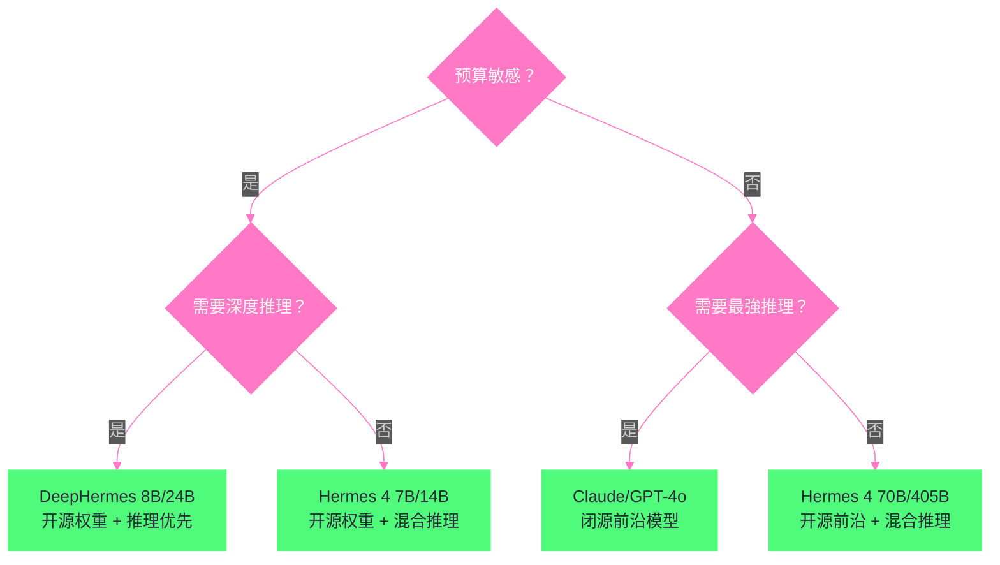

# 02 Nous Research 与 Hermes 模型谱系

> [!abstract] 摘要
> [[01 Hermes Agent 全景——自改进 Agent 的设计哲学|上一篇]]介绍了 Hermes Agent 的设计哲学和 Nous Research 的背景。本文深入 Nous Research 的旗舰产品——Hermes 模型谱系。从 2023 年的第一代 Hermes 到 2026 年的 DeepHermes，四代模型的演进折射了开源 LLM 微调领域的完整技术路线。文章逐代拆解：Hermes 2 Pro 的 tool_call token 创新和 90% 函数调用评估——开源 Function Calling 的里程碑；Hermes 3 的 SFT+DPO 两阶段训练、"中立对齐"哲学、128K 上下文和 405B 参数——开源微调模型首次达到前沿水平；Hermes 4 的混合推理模式、loss-masking + length-control fine-tuning + 高效 packing 策略——开源推理模型的突破；DeepHermes 的推理训练融合——3B/8B/24B 覆盖端到云。然后讨论 Forge Reasoning API（托管推理 + 集成推理技术）和 Psyche 分布式训练（Solana 区块链协调的社区算力汇聚）。核心认知：Hermes 模型谱系的演进不仅是"模型越来越大"——更是"微调方法论越来越成熟"——从简单 SFT 到 SFT+DPO 到 loss-masking+length-control，每一步都解决了前一代的具体问题。

---

## 第 1 章 Hermes 2 与 Hermes 2 Pro——开源 Function Calling 的里程碑

### 1.1 定位与基座

Hermes 2（2024 年）是 Nous Research 的第二代微调模型——基座从早期的 Llama 1 扩展到 Llama 2 和 Mistral，训练数据规模约 100 万条合成和精选条目。但真正具有里程碑意义的是 Hermes 2 Pro（2024 年 5 月发布）——它首次在开源模型中实现了可靠的函数调用能力。

### 1.2 tool_call token——结构化函数调用的基础

Hermes 2 Pro 的核心创新是引入了 `tool_call` token 和一套可靠的解析格式。模型被训练为在需要调用函数时输出包含 JSON 的结构化标记块，下游系统可以用 XML 解析器（而非脆弱的正则）提取函数调用。

**为什么这是创新**：在 Hermes 2 Pro 之前，开源模型的函数调用通常依赖"提示工程"——让模型输出特定格式的文本，然后用正则表达式解析。这种方式脆弱——模型可能输出格式错误的文本，正则表达式可能匹配失败。Hermes 2 Pro 通过"训练模型使用特定 token"让函数调用成为模型的"内建能力"——而非"提示工程的后处理"。

**评估结果**：Hermes 2 Pro 在函数调用评估中得分 90%（与 Fireworks.AI 合作构建的评估集），在结构化 JSON 输出评估中得分 84%。这在 2024 年 5 月是开源模型的最高水平——接近但未达到 OpenAI GPT-4 的函数调用可靠性。

> [!info] 核心概念：tool_call token 的历史意义
> Hermes 2 Pro 的 tool_call token 是开源 LLM 函数调用的事实标准之一——它影响了后来许多开源模型的函数调用格式设计。这与 [[LLM/Coding-Agent运行范式/03 Tool Use 与 Function Calling——三大厂商的标准化博弈|Coding Agent 专栏第 3 篇]]讨论的"三大厂商（OpenAI/Anthropic/Google）的 Function Calling 标准化博弈"形成了对比——闭源厂商各自定义标准（OpenAI 的 function calling、Anthropic 的 tool_use、Google 的 function_calling），而开源社区通过 Hermes 2 Pro 的 tool_call token 形成了自己的事实标准。Hermes Agent 的工具系统也使用这个格式——模型无关的设计让 Hermes 可以适配不同厂商的格式，但原生支持 Hermes 模型的 tool_call 格式。

### 1.3 JSON 模式

Hermes 2 Pro 还引入了"JSON 模式"——模型可以被指示"输出必须是合法的 JSON"。这对于"需要结构化输出"的场景（如数据提取、API 响应解析）很有价值——不需要后处理就能直接解析模型输出为 JSON 对象。84% 的 JSON 输出评估准确率意味着大约六分之一的输出可能需要修正——虽然不完美，但在 2024 年的开源模型中已经是领先水平。

### 1.4 Fireworks.AI 合作的意义

Hermes 2 Pro 的函数调用评估是与 Fireworks.AI 合作构建的——这不是偶然。Fireworks.AI 是一家专注于"开源模型托管推理"的公司——它的商业模式是"让开源模型的推理速度和可靠性接近闭源 API"。Nous Research 与 Fireworks.AI 的合作体现了"开源生态的分工"——Nous Research 做模型微调（生产好的开源权重），Fireworks.AI 做推理优化（让好的开源权重跑得快）——两者互补而非竞争。这种"开源生态分工"是 Nous Research 能够"以社区实验室的规模做出前沿水平模型"的关键——它不需要自己建推理基础设施，可以专注做模型。

---

## 第 2 章 Hermes 3——中立对齐与前沿水平

### 2.1 基座与参数规模

Hermes 3（2024 年 8 月）是 Nous Research 的第三代微调模型——基座升级为 Llama 3.1，参数规模覆盖 3B/8B/70B/405B 四档，上下文长度 128K tokens。技术报告发表于 arXiv:2408.11857。

### 2.2 SFT + DPO 两阶段训练

Hermes 3 的训练方法相比 Hermes 2 有显著升级——采用两阶段训练：

**第一阶段：监督微调（SFT）**
- 基座模型：Llama 3.1 8B/70B/405B（decoder-only Transformer）
- 优化器：AdamW，weight decay 0.01
- 学习率：峰值 7×10⁻⁶，cosine decay 调度
- 预热：300 步
- 训练轮数：4 个 epoch
- 数据：主要合成数据集，"积极鼓励模型精确遵循系统和指令提示"

**第二阶段：直接偏好优化（DPO）**
- DPO 是一种不需要奖励模型的偏好对齐方法——直接从人类偏好数据中学习
- 相比 RLHF（需要训练奖励模型 + PPO 优化），DPO 更简单、更稳定
- DPO 让 Hermes 3 的输出更符合人类偏好——如更有帮助、更安全、更准确

### 2.3 "中立对齐"哲学

Hermes 3 技术报告提出了"中立对齐"（neutrally-aligned）的理念——这是 Nous Research 与商业实验室的显著区别：

> "Hermes 3 试图将自己置于系统提示指示的世界观中，忠实地响应用户的请求。模型因此对系统提示高度敏感。这种敏感性的影响在其最大的 405B 版本中尤为明显——空系统提示不一定引发'有帮助的助手'人格。"

**这意味着什么**：商业模型（如 GPT-4、Claude）通常预设了"有帮助的助手"人格——即使用户不提供系统提示，模型也会以"有帮助的助手"方式响应。Hermes 3 选择了不同的路线——不预设人格，完全由系统提示决定。如果系统提示是"你是一个海盗"，Hermes 3 就以海盗方式响应；如果系统提示为空，Hermes 3 可能不以"有帮助的助手"方式响应。

**为什么选择"中立"**：商业模型的"预设人格"是一种"对齐策略"——确保模型始终"有帮助、无害、诚实"。但这种策略也有代价——模型在"需要角色一致性"的场景（如角色扮演、创意写作、特定领域专家模拟）中表现不自然——它总是"跳出角色"回到"有帮助的助手"模式。Hermes 3 的"中立对齐"让模型在这些场景中表现更好——但代价是"需要用户提供明确的系统提示"才能获得"有帮助的助手"行为。

**对 Hermes Agent 的影响**：Hermes Agent 的 SOUL.md 系统（人格文件）正是为"中立对齐"模型设计的——SOUL.md 是系统提示的第一部分，定义 Agent 的人格。如果用 Hermes 3 模型运行 Hermes Agent，SOUL.md 的重要性更高——因为没有 SOUL.md，Hermes 3 可能不会以"有帮助的助手"方式响应。

### 2.4 前沿水平的达成

Hermes 3 405B 在多个公开基准测试中达到了开源权重的 state-of-the-art（SOTA）性能——这是社区微调模型首次在 405B 参数规模上达到前沿水平。GGUF 量化版本在发布同一周就推出了所有尺寸——让本地部署从第一天就可行。这种"发布即量化"的策略让 Hermes 3 在社区中获得了极高的采用率——Hugging Face 上下载量最高的社区微调模型家族。

### 2.5 Hermes 3 的 Agent 能力增强

Hermes 3 相比 Hermes 2 在"Agent 场景"上有显著增强——技术报告明确提到"advanced agentic capabilities, better multi-turn coherence, long-context retention"。这三个能力对于 Hermes Agent 这种"长驻多轮对话"场景至关重要：

- **多轮连贯性**——Hermes Agent 的对话可能持续数十轮（如"帮我跟踪这个项目一周"），模型需要保持上下文连贯——Hermes 3 的多轮训练让它在长对话中不容易"忘记"之前说过什么
- **长上下文保持**——128K 上下文让 Hermes Agent 可以在单个会话中处理大量上下文（如"读这个 100 页的文档并总结"）——而不需要分段处理
- **结构化输出**——通过 tool_call XML 标签，Hermes 3 的函数调用比 Hermes 2 Pro 更可靠——这对于 Hermes Agent 的"70+ 工具调用"场景很重要

这些增强让 Hermes 3 成为"第一个真正适合做 Agent 大脑的 Hermes 模型"——Hermes 2 Pro 虽然有函数调用，但多轮和长上下文能力不足以支撑复杂 Agent 场景。

---

## 第 3 章 Hermes 4——混合推理与训练方法论升级

### 3.1 基座与参数规模

Hermes 4（2025 年 8 月）是第四代——基座不再限于 Llama，扩展到 Qwen 2.5：

| 模型 | 基座 | 参数 | 许可证 |
| :--- | :--- | :--- | :--- |
| Hermes 4 405B | Llama 3.1 405B | 405B | Llama 3.1 Community |
| Hermes 4 70B | Llama 3.1 70B | 70B | Llama 3.1 Community |
| Hermes 4 14B | Qwen 2.5 14B | 14B | Apache 2.0（Qwen） |
| Hermes 4 7B | Qwen 2.5 7B | 7B | Apache 2.0（Qwen） |

**多基座策略**：Hermes 4 不再只用 Llama——加入了 Qwen 2.5 作为中小参数规模的基座。这是因为 Qwen 2.5 在中小参数规模（7B/14B）上表现优于 Llama 3.1——Nous Research 选择了"每个参数规模用最好的基座"而非"统一用一个基座"。这种务实策略让 Hermes 4 在中小规模上也有竞争力——而不只是"405B 大模型才有好表现"。

### 3.2 混合推理模式

Hermes 4 的核心创新是"混合推理"（hybrid reasoning）——将结构化多轮推理与广泛指令遵循结合。技术报告的摘要写道："We present Hermes 4, a family of hybrid reasoning models that combine structured, multi-turn reasoning with broad instruction-following ability."

**什么是"混合推理"**：传统 LLM 要么是"指令模型"（直接响应，不显式推理），要么是"推理模型"（如 OpenAI o1，先做长链推理再响应）。Hermes 4 试图同时支持两种模式——在需要推理时做推理，在不需要推理时直接响应。这种"混合"让 Hermes 4 既有推理模型的"深度思考"能力，又有指令模型的"快速响应"能力。

### 3.3 训练方法论的四大创新

Hermes 4 的技术报告描述了四个训练方法论创新：

**创新一：数据合成与策展策略**——生成大规模"混合数据集"，同时包含"推理聚焦"和"通用指令"两类样本。这与"纯推理数据"或"纯指令数据"的训练不同——混合数据让模型同时学会"推理"和"遵循指令"。

**创新二：Loss-masking（损失掩码）**——在训练推理样本时，对"推理过程"部分做 loss-masking——只对"最终答案"计算损失，不对"推理步骤"计算损失。这让模型学习"产生正确答案"而非"模仿特定推理步骤"——推理步骤是达到答案的手段，不是目标。

**创新三：Length-control fine-tuning（长度控制微调）**——推理模型的一个常见问题是"推理过长"——模型可能生成数千 token 的推理链才得出简单答案。Length-control fine-tuning 让模型学会"根据问题难度调整推理长度"——简单问题短推理，复杂问题长推理。

**创新四：高效 packing 策略**——大规模异构数据（推理样本和指令样本长度差异大）的训练效率问题——传统方法在短样本和长样本混合时有大量 padding 浪费。高效 packing 策略把多个短样本"打包"到一个序列中——减少 padding，提高 GPU 利用率。

> [!note] 技术演进：从 Hermes 2 到 Hermes 4 的训练方法论升级
> Hermes 2：简单 SFT——在基座模型上做指令微调。Hermes 3：SFT + DPO——两阶段训练，加入偏好对齐。Hermes 4：混合数据 + loss-masking + length-control + 高效 packing——四项技术解决"推理模型训练"的具体问题。这个演进不是"推翻重来"——每代都在前代基础上叠加新方法。Hermes 4 仍然做 SFT（继承 Hermes 2/3），但数据更复杂（混合推理+指令），训练更精细（loss-masking + length-control）。这种"渐进式方法论升级"是 Nous Research 的工程风格——不追求"全新范式"，而是"解决前一代的具体问题"。

### 3.4 评估与性能

Hermes 4 在数学推理、编码、知识、理解和对齐基准上做了全面评估——技术报告同时报告了定量性能和定性行为分析。虽然具体基准分数需要查阅技术报告的表格，但从社区反馈来看，Hermes 4 被认为是"领先的社区推理模型替代品"——在开源权重模型中，推理能力接近闭源推理模型（如 OpenAI o1 系列）。

### 3.5 Hermes 4 对 Hermes Agent 的意义

Hermes 4 的"混合推理"对 Hermes Agent 有特殊意义——Hermes Agent 的任务种类多样，有些需要深度推理（如"分析这个 bug 的根因"），有些需要快速响应（如"今天天气怎么样"）。如果用纯推理模型（如 DeepHermes），简单任务也会做长推理——响应慢、token 消耗高。如果用纯指令模型（如 Hermes 3），复杂任务可能推理不够深。Hermes 4 的"混合推理"让 Hermes Agent 可以"按需推理"——模型自己判断任务是否需要深度推理——这比"用户手动切换推理模式"更自然。

> [!note] Hermes 4 与 Hermes Agent 的"自改进"协同
> Hermes 4 的"混合推理"与 Hermes Agent 的"自改进学习闭环"有协同效应——当 Hermes 4 在"推理模式"下完成一个复杂任务时，它生成的推理过程是高质量的"决策轨迹"——Hermes Agent 的学习闭环可以从这些轨迹中提炼出更精确的技能（如"在什么情况下应该走哪条推理路径"）。而 Hermes 3 没有显式推理——它的决策是"隐式的"——学习闭环只能从"工具调用序列"中提炼技能，无法捕获"为什么选择这个工具而非那个"的推理过程。Hermes 4 的显式推理让"技能提炼"有更丰富的素材——技能不只是"做什么"，还包括"为什么这么做"。

---

## 第 4 章 DeepHermes——推理训练融合

### 4.1 定位

DeepHermes（2026 年初发布）是 Hermes 谱系的最新分支——将 Hermes 微调方法与"推理训练"融合。参数规模覆盖 3B/8B/24B 三档——从"端侧部署"（3B 在手机/笔记本上运行）到"云端部署"（24B 在服务器上运行）。

### 4.2 与 Hermes 4 的区别

Hermes 4 是"混合推理"——同时支持推理和直接响应。DeepHermes 更专注于"推理训练"——它是"推理优先"的模型，类似于 OpenAI o1 或 DeepSeek R1 的路线——模型在响应前先做显式推理。

**为什么需要 DeepHermes**：Hermes 4 的"混合推理"是"通用模型加推理能力"——适合"大多数场景不需要推理，少数场景需要深度推理"的通用助手。DeepHermes 是"推理模型加 Hermes 微调"——适合"大多数场景都需要深度推理"的专业场景（如数学证明、复杂代码生成、科学研究）。

### 4.3 部署规模

| 模型 | 参数 | 部署场景 |
| :--- | :--- | :--- |
| DeepHermes 3B | 3B | 端侧——手机/笔记本/边缘设备 |
| DeepHermes 8B | 8B | 工作站——个人电脑/小型服务器 |
| DeepHermes 24B | 24B | 云端——GPU 服务器/生产部署 |

这种"3B 到 24B"的覆盖让 DeepHermes 可以在"从端到云"的全场景部署——3B 模型可以在手机上离线运行（保护隐私），24B 模型可以在云端提供高质量推理服务。

### 4.4 DeepHermes 与 Hermes Agent 的适配场景

DeepHermes 在 Hermes Agent 中的最佳适配场景是"需要深度推理的定时任务"——如"每天分析生产日志并找出潜在异常"这类任务需要模型做深度推理而非快速响应，且在 Hermes Agent 的 cron 调度下自动运行——用户不在线等待，推理时间长不是问题。相比之下，"实时对话"场景（如用户在 Telegram 上问问题等回复）更适合用 Hermes 4——混合推理让简单问题快速响应，复杂问题才做深度推理。

**DeepHermes 与 Hermes Agent 学习闭环的关系**：DeepHermes 的"推理优先"特性让它生成的决策轨迹比 Hermes 4 更详细——每个决策都有显式的推理过程。这对于 Hermes Agent 的学习闭环是"双刃剑"——一方面，更详细的轨迹让技能提炼有更丰富的素材；另一方面，过长的推理过程可能让"技能提炼"本身变得昂贵（需要 LLM 处理更长的轨迹来生成 SKILL.md）。在实际使用中，可能需要"在提炼技能时用更便宜的模型（如 Hermes 3）处理轨迹，在执行技能时用 DeepHermes"——这种"分层模型使用"是 Hermes Agent 模型无关设计的一个优势。

---

## 第 5 章 Forge Reasoning API 与 Psyche 分布式训练

### 5.1 Forge Reasoning API——托管推理 + 集成推理

Forge Reasoning API 是 Nous Research 的商业化产品——在 Hermes 微调模型之上叠加"集成推理技术"（ensemble reasoning techniques），提供付费的托管推理服务。

**"集成推理"的含义**：Forge 不只是简单地转发 Hermes 模型的输出——它在推理时叠加多种技术来提升输出质量：
- **思维链**（Chain of Thought）——让模型显式展示推理步骤
- **自洽性检查**（Self-consistency）——多次采样取多数结果
- **多路径搜索**（Multi-path search）——探索多个推理路径取最优

这些技术增加了推理时的计算量——但提升了输出质量。Forge 的商业模式是"为更高质量的推理收费"——用户为"比直接调 API 更好的推理质量"付费。

**Forge 与 Hermes Agent 的关系**：Hermes Agent 可以通过 Nous Portal 使用 Forge 的推理服务——这意味着 Hermes Agent 的用户不需要自己部署 Hermes 模型，可以直接用 Forge 的"增强推理"API。对于"需要高质量推理但不想自己运维 GPU"的用户，Forge + Hermes Agent 是一个"开箱即用"的组合——Forge 提供"增强的 Hermes 模型推理"，Hermes Agent 提供"自改进 Agent 框架"——两者通过 Nous Portal 的 OAuth 集成。

**Forge 的"推理增强"与 Hermes 4 的"混合推理"的区别**：Hermes 4 的混合推理是"模型内建的能力"——模型自己决定是否推理。Forge 的推理增强是"推理时的外部技术叠加"——无论用什么模型，Forge 都可以在输出上叠加自洽性检查、多路径搜索等技术。两者可以叠加——用 Forge 服务跑 Hermes 4 模型，既有模型内建的混合推理，又有 Forge 外部的推理增强——但成本更高（推理时计算量更大）。对于"需要最高推理质量且预算充足"的场景，这种叠加是值得的；对于"成本敏感"的场景，直接用 Hermes 4 的混合推理就够了。

### 5.2 Psyche——去中心化分布式训练

Psyche 是 Nous Research 最雄心勃勃的基础设施项目——通过 Solana 区块链协调层实现"社区贡献者汇聚异构硬件算力进行训练"。

**解决的问题**：大模型训练需要大量算力——传统上只有大公司（OpenAI/Google/Meta）负担得起。即使开源社区想训练自己的模型，也缺乏协调"分散在社区成员手中的 GPU"的机制。

**Psyche 的方案**：
- **Solana 区块链协调**——用区块链的共识机制协调"谁在什么时候提供多少算力"
- **异构硬件支持**——不要求所有贡献者有相同的 GPU——不同型号、不同数量的 GPU 都可以参与
- **贡献验证**——区块链记录每个贡献者的算力贡献，确保公平

**意义**：如果 Psyche 成功，它可能改变 AI 模型的生产方式——从"大公司生产+社区使用"到"社区生产+社区使用"。这与 Nous Research 的"社区驱动"理念一致——不仅模型权重开源，训练过程也"开源"（社区共同参与）。

> [!warning] 现实挑战：Psyche 的技术可行性
> Psyche 的"去中心化训练"是一个雄心勃勃的愿景，但技术上面临重大挑战：1）训练通信延迟——分布式训练需要频繁的梯度同步，区块链协调可能引入额外延迟；2）异构硬件的负载均衡——不同 GPU 的计算速度不同，如何分配任务避免"快 GPU 等慢 GPU"是难题；3）故障恢复——社区贡献者可能随时退出，训练需要能容忍节点离开。截至 2026 年，Psyche 仍在早期阶段——其能否大规模生产高质量模型有待验证。

---

## 第 6 章 Hermes 模型谱系与 Hermes Agent 的关系

### 6.1 模型与 Agent 的分层

理解 Hermes 模型谱系与 Hermes Agent 的关系需要明确"分层"：

```
┌─────────────────────────────────────────┐
│  Hermes Agent（应用层）                  │
│  自改进个人 Agent / 多平台 / 学习闭环     │
│  模型无关——可用任何 LLM                  │
├─────────────────────────────────────────┤
│  Nous Portal / Forge API（服务层）       │
│  托管推理 / Tool Gateway / 集成推理      │
├─────────────────────────────────────────┤
│  Hermes 4 / DeepHermes（模型层）         │
│  开源权重 LLM / 混合推理 / 函数调用      │
├─────────────────────────────────────────┤
│  Llama 3.1 / Qwen 2.5（基座层）          │
│  开放权重基座模型                         │
├─────────────────────────────────────────┤
│  Psyche（训练基础设施层）                │
│  去中心化分布式训练                       │
└─────────────────────────────────────────┘
```

### 6.2 "模型无关"与"原生优化"的平衡

Hermes Agent 的"模型无关"设计意味着它不绑定 Hermes 模型——可以用 OpenAI/Anthropic/任何模型。但 Hermes Agent 对 Hermes 模型有"原生优化"——如对 tool_call token 格式的原生支持、对 Hermes 3/4 的"中立对齐"特性的适配（通过 SOUL.md 提供人格）。

这种"模型无关 + 原生优化"的平衡是 Nous Research 的战略选择——Hermes Agent 不"强制"使用 Hermes 模型（保持开放性），但"鼓励"使用 Hermes 模型（提供更好的原生体验）。如果用户用 Hermes 4 作为 Hermes Agent 的 LLM，工具调用的格式兼容性最佳，推理能力最强；如果用 Claude 或 GPT-4o，Hermes Agent 通过适配层兼容，但可能有一些格式转换开销。

### 6.3 模型选择决策树

对于 Hermes Agent 用户，"用哪个模型"的决策可以简化为：



这个决策树不是绝对的——Hermes Agent 的"模型无关"让用户可以随时通过 `hermes model` 切换——但提供了一个"从需求出发选择模型"的思路。实际选择还需要结合具体任务的复杂度和预算做权衡。

---

## 第 7 章 总结与下一篇导读

### 7.1 本文核心要点

1. **Hermes 2 Pro 的 tool_call token**——开源 Function Calling 的里程碑，90% FC 评估，84% JSON 评估——影响了后来许多开源模型的函数调用格式
2. **Hermes 3 的 SFT+DPO + 中立对齐**——两阶段训练（AdamW + cosine decay + DPO 偏好对齐），"不预设人格"的哲学让模型在角色扮演/创意写作中表现更好
3. **Hermes 4 的混合推理 + 四项训练创新**——混合数据集 + loss-masking + length-control + 高效 packing——开源推理模型的突破
4. **DeepHermes 的推理优先路线**——3B/8B/24B 覆盖端到云，适合"大多数场景都需要深度推理"的专业场景
5. **Forge Reasoning API**——在 Hermes 模型之上叠加集成推理技术，商业化托管推理
6. **Psyche 分布式训练**——Solana 区块链协调社区算力，"去中心化 AI 训练"的实践——虽然技术可行性仍有挑战
7. **模型与 Agent 的分层关系**——Hermes Agent 是应用层，模型无关但对 Hermes 模型有原生优化

### 7.2 下一篇导读

下一篇 [[03 架构总览——AIAgent 核心循环与子系统]] 将从模型层转向 Agent 层——深入 Hermes Agent 的代码架构。基于官方架构文档，拆解系统总览图（6 个入口点 → AIAgent 核心 → Session Storage + Tool Backends）、目录结构（run_agent.py/cli.py/gateway/agent/tools 等）、三种数据流（CLI Session / Gateway Message / Cron Job）、三大 API 模式（chat_completions/codex_responses/anthropic_messages）、以及 8 个主要子系统的职责划分。

> [!info] 专栏导航
> 本文是 [[00 专栏导览|Hermes Agent 专栏]] 的第 2 篇。前 2 篇完成了"定位与背景"部分——下一篇开始"核心架构"部分。

---

## 参考文献

1. Hermes 4 Technical Report. https://arxiv.org/abs/2508.18255
2. Hermes 3 Technical Report. https://nousresearch.com/wp-content/uploads/2024/08/Hermes-3-Technical-Report.pdf
3. Hermes 3 arXiv. https://arxiv.org/abs/2408.11857
4. Nous Research Hermes Lineage 2026. https://presenc.ai/research/nous-research-hermes-lineage-2026
5. Hermes LLM Explained. https://fast.io/resources/hermes-llm/
6. Nous Research HuggingFace. https://huggingface.co/NousResearch
7. Hermes 4 Collection. https://huggingface.co/collections/NousResearch/hermes-4-collection-68a731bfd452e20816725728

---

## 思考题

1. **Hermes 3 的"中立对齐"让模型不预设"有帮助的助手"人格——需要用户提供明确的系统提示。这对于 Hermes Agent 的"零门槛安装"理念是否有矛盾？非技术用户可能不知道要提供系统提示——如果他们用 Hermes 3 模型且没有 SOUL.md，Agent 可能不以"有帮助的助手"方式响应。如何解决这个矛盾？** 提示：考虑"默认 SOUL.md"——Hermes Agent 可以在安装时自动生成一个默认的 SOUL.md，提供"有帮助的助手"人格。这样即使用 Hermes 3 模型，非技术用户也能获得正常的助手体验——而技术用户可以修改 SOUL.md 来自定义人格。

2. **Hermes 4 的 loss-masking 只对"最终答案"计算损失，不对"推理步骤"计算损失。这种训练方式是否会导致模型的"推理步骤"质量下降——模型可能学会"产生正确答案但推理步骤不合理"？这对于需要"可验证推理"的场景（如数学证明）是否有问题？** 提示：考虑"推理步骤的作用"——如果推理步骤只是"达到答案的手段"，loss-masking 是合理的。但如果推理步骤本身是"用户需要的产品"（如数学证明的证明过程），loss-masking 可能导致证明过程不严谨。解决方案可能是在"需要可验证推理"的数据上不做 loss-masking——混合训练策略。

3. **Psyche 的"去中心化训练"如果成功，可能改变 AI 模型的生产方式。但区块链协调层引入的延迟是否会让训练效率显著低于"集中式 GPU 集群"？在什么场景下 Psyche 的"去中心化"优势能超过其效率劣势？** 提示：考虑"算力成本"——集中式 GPU 集群的 H100 每小时成本约 $2-4，而社区贡献者的闲置 GPU 可能"几乎免费"（因为已经买了用于其他目的）。如果 Psyche 能利用"本来就要开的 GPU"的闲置时间，即使效率低 2-3 倍，总成本仍可能低于集中式集群。Psyche 的优势在"成本"而非"速度"——适合"不急于发表的社区研究"而非"需要快速迭代的产品开发"。
