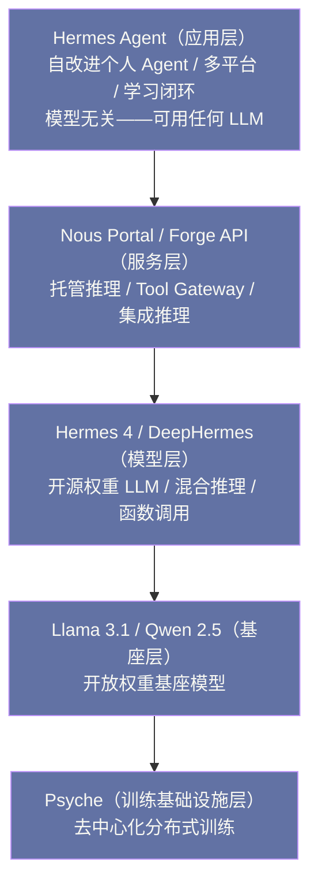

# 02 Nous Research 与 Hermes 模型谱系

> [!abstract] 摘要
> [[01 Hermes Agent 全景——自改进 Agent 的设计哲学|上一篇]]介绍了 Hermes Agent 的设计哲学和 Nous Research 的背景。本文深入 Nous Research 的旗舰产品——Hermes 模型谱系。从 2023 年的第一代 Hermes 到 2026 年的 DeepHermes，四代模型的演进折射了开源 LLM 微调领域的完整技术路线。文章逐代拆解：Hermes 2 Pro 的 tool_call token 创新和 90% 函数调用评估——开源 Function Calling 的里程碑；Hermes 3 的 SFT+DPO 两阶段训练、"中立对齐"哲学、128K 上下文和 405B 参数——开源微调模型首次达到前沿水平；Hermes 4 的混合推理模式、loss-masking + length-control fine-tuning + 高效 packing 策略——开源推理模型的突破；DeepHermes 的推理训练融合——3B/8B/24B 覆盖端到云。然后讨论 Forge Reasoning API（托管推理 + 集成推理技术）和 Psyche 分布式训练（Solana 区块链协调的社区算力汇聚）。核心认知：Hermes 模型谱系的演进不仅是"模型越来越大"——更是"微调方法论越来越成熟"——从简单 SFT 到 SFT+DPO 到 loss-masking+length-control，每一步都解决了前一代的具体问题。

---

## 第 1 章 Hermes 2 与 Hermes 2 Pro——开源 Function Calling 的里程碑

### 1.1 定位与基座

Hermes 2（2024 年）是 Nous Research 的第二代微调模型——基座从早期的 Llama 1 扩展到 Llama 2 和 Mistral，训练数据规模约 100 万条合成和精选条目。但真正具有里程碑意义的是 Hermes 2 Pro（2024 年 5 月发布）——它首次在开源模型中实现了可靠的函数调用能力。

"约 100 万条合成和精选条目"这个数据规模也值得一提，因为它代表了 2024 年初微调数据工程的典型形态——**合成数据为主、人工精选为辅**。纯人工标注一百万条高质量样本的成本是任何社区实验室都负担不起的，合成数据（用强模型生成训练样本再筛选）是唯一可行的规模化路径。但合成数据的质量天花板受制于生成它的教师模型，如何筛选、去重、配比，就成了微调团队真正的护城河——数据规模可以复制，数据策展的能力很难复制。

要理解 Hermes 2 的定位，需要先理解 2023 年之后开源 LLM 生态的基本分工格局。Meta 在 2023 年开放 Llama 系列权重后，行业出现了一个此前不存在的生态位——**基座模型与微调模型的分工**：Meta、Mistral 这类组织投入巨资做预训练，产出"什么都会一点"的通用基座；社区团队则在基座上做微调，把模型调教成某种特定性格或能力取向的成品。Nous Research 是这个生态位上最成功的玩家之一——它不做预训练（那是数十亿美元的游戏），专注做微调方法论，用相对较小的成本把开放权重基座调教成高质量成品。Hermes 谱系的每一代，本质上都是"当时最好的开放基座 + 当时最成熟的微调方法"的组合。

### 1.2 tool_call token——结构化函数调用的基础

Hermes 2 Pro 的核心创新是引入了 `tool_call` token 和一套可靠的解析格式。模型被训练为在需要调用函数时输出包含 JSON 的结构化标记块，下游系统可以用 XML 解析器（而非脆弱的正则）提取函数调用。

**为什么这是创新**：在 Hermes 2 Pro 之前，开源模型的函数调用通常依赖"提示工程"——让模型输出特定格式的文本，然后用正则表达式解析。这种方式脆弱——模型可能输出格式错误的文本，正则表达式可能匹配失败。Hermes 2 Pro 通过"训练模型使用特定 token"让函数调用成为模型的"内建能力"——而非"提示工程的后处理"。

这个创新的重要性，用反事实的方式看最清楚。设想一个没有可靠函数调用格式的 Agent：它每执行一个工具，都要过一道"格式抽奖"——模型这次输出的标记块可能完整、可能缺了个引号、可能把 JSON 写成了 YAML，而下游的正则解析器只认一种写法。单次调用失败率哪怕只有 5%，一个需要 20 次工具调用的任务，整体成功率就只剩 36%——**工具调用的可靠性是乘法而非加法，链条越长越致命**。这就是 2023 年 AutoGPT 类项目"看起来很美、跑起来抓瞎"的技术根源之一：不是模型不会规划，而是执行链路上的每一次格式抖动都在削减整体成功率。tool_call token 把"格式正确"从概率事件变成训练出来的确定性能力，等于把每道工序的废品率压到了极低——Agent 的长链条执行从此才有了工程上的可行性。

打个比方，tool_call token 之于函数调用，就像标准化的插头插座之于电器用电：在统一标准之前，每家电器配一种插头，插座靠转接器硬凑，接触不良是常态；标准确立之后，"通电"这件事从碰运气变成了默认可靠。但比喻到此需要立刻限定：插头标准是物理上强制统一的，而 tool_call token 是通过**训练**让模型"自愿"遵守的标准——模型偶尔仍会输出不合规格的内容，所以下游解析器仍需容错，只是容错的频率从"常态"降到了"异常"。

**评估结果**：Hermes 2 Pro 在函数调用评估中得分 90%（与 Fireworks.AI 合作构建的评估集），在结构化 JSON 输出评估中得分 84%。这在 2024 年 5 月是开源模型的最高水平——接近但未达到 OpenAI GPT-4 的函数调用可靠性。

"接近但未达到"这六个字也值得公平地解读。单看数字，90% 对 GPT-4 的差距似乎还有一段；但考虑到两者的资源投入差了几个数量级——一个是大厂千卡集群训练的原生能力，一个是社区团队在开放权重上的微调成果——这个差距本身反而是开源路线可行性的证明。**评估开源替代品时，正确的标尺不是"是否追平旗舰"，而是"差距是否在缩小、是否够用"**——90% 的函数调用可靠性对大多数 Agent 场景已经够用，这就够了。

> [!info] 核心概念：tool_call token 的历史意义
> Hermes 2 Pro 的 tool_call token 是开源 LLM 函数调用的事实标准之一——它影响了后来许多开源模型的函数调用格式设计。这与 [[LLM/Coding-Agent运行范式/03 Tool Use 与 Function Calling——三大厂商的标准化博弈|Coding Agent 专栏第 3 篇]]讨论的"三大厂商（OpenAI/Anthropic/Google）的 Function Calling 标准化博弈"形成了对比——闭源厂商各自定义标准（OpenAI 的 function calling、Anthropic 的 tool_use、Google 的 function_calling），而开源社区通过 Hermes 2 Pro 的 tool_call token 形成了自己的事实标准。Hermes Agent 的工具系统也使用这个格式——模型无关的设计让 Hermes 可以适配不同厂商的格式，但原生支持 Hermes 模型的 tool_call 格式。

### 1.3 JSON 模式

Hermes 2 Pro 还引入了"JSON 模式"——模型可以被指示"输出必须是合法的 JSON"。这对于"需要结构化输出"的场景（如数据提取、API 响应解析）很有价值——不需要后处理就能直接解析模型输出为 JSON 对象。84% 的 JSON 输出评估准确率意味着大约六分之一的输出可能需要修正——虽然不完美，但在 2024 年的开源模型中已经是领先水平。

值得留意的是函数调用（90%）与 JSON 输出（84%）这两个数字之间的差距——同样是"输出结构化内容"，带工具上下文的调用比裸的 JSON 生成更可靠。这个差距透露了一个训练层面的规律：**模型在"有明确用途框架"的任务上表现更好**——函数调用有清晰的"我要调用什么工具、传什么参数"的语境，而裸 JSON 生成的约束全靠提示词承载。这个规律后来也影响了 Hermes 4 的训练数据设计——把样本放进真实任务语境中合成，而不是让模型凭空生成结构。

### 1.4 JSON 模式的适用边界

JSON 模式虽好，但 84% 的准确率意味着它不适合所有场景，使用时需要区分两类需求。对"容错型"场景——数据提取后有人工复核、或下游有 schema 校验加重试——84% 配合重试机制完全够用；对"一次成型"场景——输出直接进数据库、直接触发支付——16% 的失败率就是不可接受的事故率。工程上的正确姿势是把 JSON 模式当作"大幅降低后处理成本"的手段，而不是"免除校验"的承诺——**结构化输出永远要配 schema 校验，这是用任何模型都省不掉的一步**。

### 1.5 Fireworks.AI 合作的意义

Hermes 2 Pro 的函数调用评估是与 Fireworks.AI 合作构建的——这不是偶然。Fireworks.AI 是一家专注于"开源模型托管推理"的公司——它的商业模式是"让开源模型的推理速度和可靠性接近闭源 API"。Nous Research 与 Fireworks.AI 的合作体现了"开源生态的分工"——Nous Research 做模型微调（生产好的开源权重），Fireworks.AI 做推理优化（让好的开源权重跑得快）——两者互补而非竞争。这种"开源生态分工"是 Nous Research 能够"以社区实验室的规模做出前沿水平模型"的关键——它不需要自己建推理基础设施，可以专注做模型。

这种分工格局值得多看一眼，因为它解释了开源生态为什么能以"游击队"的规模对抗"正规军"。闭源实验室必须垂直整合——模型、推理基础设施、产品全部自建；开源生态则是水平分工——基座（Meta/Mistral）、微调（Nous）、推理优化（Fireworks/vLLM 社区）、应用（Hermes Agent）各自独立又相互兼容。垂直整合的好处是端到端优化，坏处是每一层都要自己扛成本；水平分工的好处是每个玩家只需在自己的环节做到最好，坏处是层与层之间的适配损耗。Hermes 2 Pro 的 tool_call token 之所以重要，正在于它减少了"模型层"与"应用层"之间的适配损耗——**标准越可靠，分工生态的摩擦成本越低**。

### 1.6 格式的碎片化——11 种 parser 的由来

tool_call token 确立了开源侧的事实标准，但并没有终结格式碎片化——恰恰相反，2024 到 2025 年间，随着推理模型爆发和各家厂商各自演化，函数调用格式反而越来越多。Hermes Agent 内置 11 种 tool-call parser 正是对这个现实的承认：

| 格式 | 代表模型/生态 | 结构特征 |
| :--- | :--- | :--- |
| Hermes XML | Hermes 2 Pro/3/4 | `<tool_call>` token 包裹 JSON |
| ChatML 风格 | Qwen 系、部分开源模型 | 特殊 token 分隔的工具消息 |
| OpenAI function calling | GPT 系列、兼容端点 | API 层结构化字段，非文本内嵌 |
| Anthropic tool_use | Claude 系列 | API 层 tool_use content block |
| Responses API | OpenAI Codex 系 | 新一代结构化响应格式 |
| DeepSeek 风格 | DeepSeek V3/R1 | 文本内嵌特殊标记 |
| Llama 3.x 内建 | Llama 3.1+ 官方微调 | 基座自带工具格式 |
| Mistral 风格 | Mistral 系 | [TOOL_CALLS] 标记 |

这张表透露了一个行业层面的尴尬：Function Calling 至今没有一个跨厂商统一的标准——闭源三家的格式互不兼容，开源侧也是诸候割据。Hermes Agent 用 11 种 parser 把碎片化的格式问题封装在应用层，让用户感知不到差异；但封装本身是有维护成本的——每种 parser 都要跟上游格式的演化保持同步。这也从反面印证了 tool_call token 的价值：**在标准缺位的行业里，谁的标准被最多人用，谁就为生态省下了最多的适配成本**。

---

## 第 2 章 Hermes 3——中立对齐与前沿水平

### 2.1 基座与参数规模

Hermes 3（2024 年 8 月）是 Nous Research 的第三代微调模型——基座升级为 Llama 3.1，参数规模覆盖 3B/8B/70B/405B 四档，上下文长度 128K tokens。技术报告发表于 arXiv:2408.11857。

128K 上下文这个数字对 Agent 场景的意义，值得单独换算成体感。128K token 大约相当于一本 300 页的书，或者一个中型代码仓库的核心文件全集。对会话级聊天产品，128K 大部分时候是冗余；对长驻 Agent，它是"单会话装下一个完整项目上下文"的前提——第 03 篇会讲到的会话压缩机制，其触发阈值的设计就建立在这个上下文预算之上。**上下文长度决定 Agent 的"工作记忆"容量，而工作记忆容量决定单次任务的复杂度上限**。

从 Hermes 2 到 Hermes 3，最直观的变化是参数规模上限从百亿级跳到了 405B——这意味着微调团队第一次在"前沿级"的基座上施展方法论。此前的社区微调基本集中在 7B-70B 区间，405B 级别的微调对数据质量、训练稳定性、算力调度都是全新的考验。Hermes 3 敢于直接把四档参数一次做齐，背后是微调方法论经过两代验证后的自信——**方法论如果只在小模型上有效，就不能称为方法论**。

### 2.2 SFT + DPO 两阶段训练

Hermes 3 的训练方法相比 Hermes 2 有显著升级——采用两阶段训练：

**第一阶段：监督微调（SFT）**
- 基座模型：Llama 3.1 8B/70B/405B（decoder-only Transformer）
- 优化器：AdamW，weight decay 0.01
- 学习率：峰值 7×10⁻⁶，cosine decay 调度
- 预热：300 步
- 训练轮数：4 个 epoch
- 数据：主要合成数据集，"积极鼓励模型精确遵循系统和指令提示"

**第二阶段：直接偏好优化（DPO）**
- DPO 是一种不需要奖励模型的偏好对齐方法——直接从人类偏好数据中学习
- 相比 RLHF（需要训练奖励模型 + PPO 优化），DPO 更简单、更稳定
- DPO 让 Hermes 3 的输出更符合人类偏好——如更有帮助、更安全、更准确

两阶段的分工可以用一个比喻来理解——**先教本领，再教分寸**。SFT 阶段像职业技能培训：给模型看大量"好答案长什么样"的示范，让它学会完成任务的基本功；DPO 阶段像职业素养培训：不再告诉它"正确答案是什么"，而是给它看成对的答案——这个更好、那个更差——让它自己体会"好"与"更好"之间的差别。比喻需要立刻限定：人类的"素养培训"靠领悟，DPO 靠的是数学上的偏好概率优化——它调整的是模型输出分布，让偏好答案的生成概率系统性高于被拒答案。

DPO 与 RLHF 的取舍值得展开，因为这是 2023-2024 年对齐方法论的核心争论。RLHF 的经典流程是三步：SFT 之后先训练一个奖励模型（学会给回答打分），再用强化学习（PPO）让主模型最大化奖励——效果最好，但工程上出了名的难伺候：奖励模型可能被"钻空子"（reward hacking），PPO 训练超参敏感、跑一次成本高。DPO 的洞察是把"奖励模型"从流程里去掉——数学上可以证明，偏好数据本身已经隐含了奖励信息，可以直接在主模型上做优化。代价是对偏好数据的质量和数量更敏感，且在极端复杂任务上上限略低于精调的 RLHF。Nous Research 选择 DPO，与其说是技术信仰，不如说是**社区实验室的工程理性**——用更简单稳定的流程，换取四档参数规模上的可复制性。

### 2.3 训练超参背后的工程含义

SFT 阶段的那组超参数——峰值学习率 7×10⁻⁶、cosine decay、300 步预热、4 个 epoch、weight decay 0.01——单看是枯燥的数字，合起来读是一份"微调 405B 模型"的工程经验清单：

| 超参 | 取值 | 工程含义 |
| :--- | :--- | :--- |
| 峰值学习率 | 7×10⁻⁶ | 比常见预训练学习率低 1-2 个数量级——微调是"调教"不是"重塑"，步子大了会灾难性遗忘基座能力 |
| 调度 | cosine decay | 训练后期平滑降低步长，让模型在终点附近精细收敛 |
| 预热 | 300 步 | 训练初期用小学习率"热身"，避免初始大梯度破坏基座权重 |
| epoch | 4 | 合成数据上的适度重复——再多有过拟合风险，再少学不透 |
| weight decay | 0.01 | 轻度正则，防止模型对训练数据死记硬背 |

这组数字里最值得琢磨的是学习率的量级选择。微调与预训练的本质区别在于目标：预训练要把海量知识压进权重，微调只需要改变模型的"行为风格"——学习率必须小到"只动风格、不动知识"。7×10⁻⁶ 这个量级就是"调教而非重塑"的数值化表达。对想复现或自己微调的读者，这张表的真正价值不是记住数字，而是理解**每个数字都在"学新东西"与"忘旧东西"之间找平衡**——微调的全部艺术都在这条平衡线上。

### 2.4 "中立对齐"哲学

Hermes 3 技术报告提出了"中立对齐"（neutrally-aligned）的理念——这是 Nous Research 与商业实验室的显著区别：

> "Hermes 3 试图将自己置于系统提示指示的世界观中，忠实地响应用户的请求。模型因此对系统提示高度敏感。这种敏感性的影响在其最大的 405B 版本中尤为明显——空系统提示不一定引发'有帮助的助手'人格。"

**这意味着什么**：商业模型（如 GPT-4、Claude）通常预设了"有帮助的助手"人格——即使用户不提供系统提示，模型也会以"有帮助的助手"方式响应。Hermes 3 选择了不同的路线——不预设人格，完全由系统提示决定。如果系统提示是"你是一个海盗"，Hermes 3 就以海盗方式响应；如果系统提示为空，Hermes 3 可能不以"有帮助的助手"方式响应。

**为什么选择"中立"**：商业模型的"预设人格"是一种"对齐策略"——确保模型始终"有帮助、无害、诚实"。但这种策略也有代价——模型在"需要角色一致性"的场景（如角色扮演、创意写作、特定领域专家模拟）中表现不自然——它总是"跳出角色"回到"有帮助的助手"模式。Hermes 3 的"中立对齐"让模型在这些场景中表现更好——但代价是"需要用户提供明确的系统提示"才能获得"有帮助的助手"行为。

**对 Hermes Agent 的影响**：Hermes Agent 的 SOUL.md 系统（人格文件）正是为"中立对齐"模型设计的——SOUL.md 是系统提示的第一部分，定义 Agent 的人格。如果用 Hermes 3 模型运行 Hermes Agent，SOUL.md 的重要性更高——因为没有 SOUL.md，Hermes 3 可能不会以"有帮助的助手"方式响应。

中立对齐的取舍在 Agent 场景下有一个常被忽略的深层理由，值得点破。Agent 与用户的交互不是"一问一答"，而是"系统提示 + 技能文档 + 记忆 + 工具结果"层层叠加的长上下文——模型对系统提示越敏感，整套 Agent 机制的可预测性就越高：技能文档说"先检查再执行"，模型就真的先检查再执行。反之，一个自带强人格的模型，相当于在系统提示之下垫了一层"出厂预设"，Agent 的指令要穿过这层预设才能生效——技能执行的保真度天然打折。**中立对齐对聊天产品是风格选择，对 Agent 产品是可靠性选择**——这是理解 Hermes 模型与 Agent 协同设计的关键。

不过中立对齐也有它的边界与反例，评估时不能只看好的一面。其一是**默认体验问题**——空系统提示下模型不承诺"有帮助"，非技术用户开箱即用的体验没有保障，这正是本章思考题 1 讨论的矛盾。其二是**安全责任前移**——模型不替用户拦截争议请求，意味着内容安全的责任从模型厂商转移到部署者，自托管用户要自己评估这个责任。其三是**系统提示注入的攻击面**——模型对系统提示高度敏感是双刃剑，如果攻击者能污染系统提示（譬如通过被注入的网页内容），敏感的模型可能被更彻底地带偏。这三条边界共同指向一个结论：中立对齐是一笔"用默认安全换可控性"的交易，它适合知道自己要什么的用户，不适合完全不想操心配置的用户。

### 2.5 前沿水平的达成

Hermes 3 405B 在多个公开基准测试中达到了开源权重的 state-of-the-art（SOTA）性能——这是社区微调模型首次在 405B 参数规模上达到前沿水平。GGUF 量化版本在发布同一周就推出了所有尺寸——让本地部署从第一天就可行。这种"发布即量化"的策略让 Hermes 3 在社区中获得了极高的采用率——Hugging Face 上下载量最高的社区微调模型家族。

"发布即量化"这个策略看似只是执行细节，实则是对开源模型分发规律的深刻理解。开源权重的采用曲线有一个关键窗口——发布后的头几周，社区的热情、评测视频、教程文章都集中在这个窗口里；如果量化版本晚两周出，采用曲线的峰值就已经过去了。闭源实验室不需要关心这个——它们自己托管推理，用户永远用全精度；开源模型的"可用性"却取决于社区把它跑起来的难度，量化版本就是"跑起来"的最低门槛。Hermes 3 的发布策略等于把"采用摩擦"压到了时间轴的最前端——**对开源项目，发布节奏本身就是产品能力的一部分**。

### 2.6 Hermes 3 的 Agent 能力增强

Hermes 3 相比 Hermes 2 在"Agent 场景"上有显著增强——技术报告明确提到"advanced agentic capabilities, better multi-turn coherence, long-context retention"。这三个能力对于 Hermes Agent 这种"长驻多轮对话"场景至关重要：

- **多轮连贯性**——Hermes Agent 的对话可能持续数十轮（如"帮我跟踪这个项目一周"），模型需要保持上下文连贯——Hermes 3 的多轮训练让它在长对话中不容易"忘记"之前说过什么
- **长上下文保持**——128K 上下文让 Hermes Agent 可以在单个会话中处理大量上下文（如"读这个 100 页的文档并总结"）——而不需要分段处理
- **结构化输出**——通过 tool_call XML 标签，Hermes 3 的函数调用比 Hermes 2 Pro 更可靠——这对于 Hermes Agent 的"70+ 工具调用"场景很重要

这些增强让 Hermes 3 成为"第一个真正适合做 Agent 大脑的 Hermes 模型"——Hermes 2 Pro 虽然有函数调用，但多轮和长上下文能力不足以支撑复杂 Agent 场景。

把这条演进线放远看，Hermes 2 Pro 和 Hermes 3 恰好对应了 Agent 大脑的两个必要条件——**单步可靠**（函数调用格式正确）与**全程连贯**（多轮与长上下文保持）。Hermes 2 Pro 解决了前者，Hermes 3 补上了后者。一个 Agent 的体验下限由单步可靠性决定，体验上限由长程连贯性决定——两者缺一，Agent 就只能在"玩具任务"里打转。这也是为什么 Hermes Agent 正式发布（2026-02）远晚于模型谱系的起点：**应用层的成熟，要等模型层的地基打完**。

---

## 第 3 章 Hermes 4——混合推理与训练方法论升级

### 3.1 基座与参数规模

Hermes 4（2025 年 8 月）是第四代——基座不再限于 Llama，扩展到 Qwen 2.5：

| 模型 | 基座 | 参数 | 许可证 |
| :--- | :--- | :--- | :--- |
| Hermes 4 405B | Llama 3.1 405B | 405B | Llama 3.1 Community |
| Hermes 4 70B | Llama 3.1 70B | 70B | Llama 3.1 Community |
| Hermes 4 14B | Qwen 2.5 14B | 14B | Apache 2.0（Qwen） |
| Hermes 4 7B | Qwen 2.5 7B | 7B | Apache 2.0（Qwen） |

**多基座策略**：Hermes 4 不再只用 Llama——加入了 Qwen 2.5 作为中小参数规模的基座。这是因为 Qwen 2.5 在中小参数规模（7B/14B）上表现优于 Llama 3.1——Nous Research 选择了"每个参数规模用最好的基座"而非"统一用一个基座"。这种务实策略让 Hermes 4 在中小规模上也有竞争力——而不只是"405B 大模型才有好表现"。

多基座策略背后是对"微调团队身份"的一次重新定位。此前的 Hermes 谱系可以看作"Llama 系微调厂"，选基座不叫选择，叫默认；到了 Hermes 4，基座市场已经充分竞争——Llama 统治大参数区间，Qwen 在中小参数区间崛起，各家基座的能力曲线不再重合。此时"绑定单一基座"就意味着在某些参数档位上先天落后。放弃单一基座的身份认同，换来每个档位的最优起点——这个决策的信号意义大于技术意义：**微调团队的核心资产是方法论，不是对某个基座的忠诚**。

### 3.2 混合推理模式

Hermes 4 的核心创新是"混合推理"（hybrid reasoning）——将结构化多轮推理与广泛指令遵循结合。技术报告的摘要写道："We present Hermes 4, a family of hybrid reasoning models that combine structured, multi-turn reasoning with broad instruction-following ability."

**什么是"混合推理"**：传统 LLM 要么是"指令模型"（直接响应，不显式推理），要么是"推理模型"（如 OpenAI o1，先做长链推理再响应）。Hermes 4 试图同时支持两种模式——在需要推理时做推理，在不需要推理时直接响应。这种"混合"让 Hermes 4 既有推理模型的"深度思考"能力，又有指令模型的"快速响应"能力。

从技术谱系上看，混合推理也是对 2024-2025 年"推理模型军备竞赛"的一次反思。o1 发布后，行业一度把"推理 token 越多越好"当成方向，各家竞相堆推理长度；但很快暴露出边际收益递减——推理 token 翻倍，准确率提升却越来越薄，而成本线性上涨。混合推理代表的是这条曲线上的理性回摆：**推理是工具不是信仰，该用则用、该省则省**。Hermes 4 把这个判断内化到模型里，等于把"推理经济学"做成了模型能力的一部分。

混合推理要解决的问题，用反事实来看最直观。假设你用一个纯推理模型（如 o1 路线）做日常助手：问"明天几点开会"，它也要先在内部铺开一长串推理——"用户问的是会议时间，我应该查看日历……"——最后给出一个本来可以瞬间给出的答案。推理 token 是要花钱、花时间的，**对简单问题做深度推理不是严谨，是浪费**；反过来，用纯指令模型做复杂任务，它会在缺乏深思的情况下脱口而出一个似是而非的答案。两类模型的失败方向相反：推理模型败在"慢和贵"，指令模型败在"浅和错"。混合推理的目标是让模型自己判断"这道题需不需要打草稿"——就像一个成熟的专家，被问"现在几点"时直接回答，被问"这个季度战略怎么定"时才铺开草稿纸。

### 3.3 训练方法论的四大创新

Hermes 4 的技术报告描述了四个训练方法论创新：

**创新一：数据合成与策展策略**——生成大规模"混合数据集"，同时包含"推理聚焦"和"通用指令"两类样本。这与"纯推理数据"或"纯指令数据"的训练不同——混合数据让模型同时学会"推理"和"遵循指令"。

混合数据集的必要性来自一个训练领域的经典现象——**灾难性遗忘**。如果只用推理数据训练，模型会"忘了怎么正常聊天"——每个回答都长篇大论；如果只用指令数据，推理能力又无从建立。混合配比本质上是在两个能力之间找平衡点，而配比本身就是一个需要实验确定的超参数——没有先验公式，只能靠评估结果反推。这也是"数据策展"（curation）被单列为创新的原因：合成数据容易，合成**配比正确、质量均匀**的数据难。

**创新二：Loss-masking（损失掩码）**——在训练推理样本时，对"推理过程"部分做 loss-masking——只对"最终答案"计算损失，不对"推理步骤"计算损失。这让模型学习"产生正确答案"而非"模仿特定推理步骤"——推理步骤是达到答案的手段，不是目标。

**创新三：Length-control fine-tuning（长度控制微调）**——推理模型的一个常见问题是"推理过长"——模型可能生成数千 token 的推理链才得出简单答案。Length-control fine-tuning 让模型学会"根据问题难度调整推理长度"——简单问题短推理，复杂问题长推理。

**创新四：高效 packing 策略**——大规模异构数据（推理样本和指令样本长度差异大）的训练效率问题——传统方法在短样本和长样本混合时有大量 padding 浪费。高效 packing 策略把多个短样本"打包"到一个序列中——减少 padding，提高 GPU 利用率。

四项创新合起来看，指向同一个目标——**让推理模型从"能推理"走向"经济地推理"**。loss-masking 省的是训练信号里的浪费，length-control 省的是推理时的 token 开销，packing 省的是 GPU 时间，混合数据省的是"为两种能力训练两个模型"的成本。每一项单独看都是工程细节，合起来是一份"推理经济学"的完整方案——这恰恰是开源模型能否在真实产品中替代闭源 API 的胜负手：能力追平只是入场，成本打平才是成交。

四项创新中，loss-masking 最值得细看，因为它体现了一种训练哲学的转变。早期的 SFT 是"全序列模仿"——模型对样本里的每个 token 都要学，包括推理过程的每一个字。这隐含着一个假设：示范里的每一步都是值得学的。但推理样本的特殊性在于，**通往同一个答案的推理路径有无数条**，示范样本里的路径只是其中一条——强迫模型逐字模仿这条路径，等于把"手段"当成了"目的"，模型学到的是"复述这条特定路径"而非"推理"。loss-masking 把损失计算从整条路径收窄到最终答案，等于告诉模型：路径随便走，答案必须对。这与第 04 篇要讲的 Hermes Agent 技能提炼形成了有趣的呼应——技能文档记录的也是"路径与陷阱"，但真正要复用的是"达成结果的能力"而非路径本身。

packing 创新则展示了大规模训练中一个容易被外人忽视的经济学。训练成本 = GPU 时间，GPU 时间的有效利用率取决于每个 batch 里有多少 token 是"真实训练信号"、多少是凑数的 padding。推理样本动辄数千 token，指令样本可能只有几十 token，混在一起训练时，短样本周围的 padding 可能让 GPU 一半的算力在空转。packing 把短样本拼装进同一序列，本质上是**把 GPU 的每一分钱都花在真实 token 上**——对社区实验室来说，这不是锦上添花，而是"用有限预算跑出大厂级训练量"的生存技能。

> [!note] 技术演进：从 Hermes 2 到 Hermes 4 的训练方法论升级
> Hermes 2：简单 SFT——在基座模型上做指令微调。Hermes 3：SFT + DPO——两阶段训练，加入偏好对齐。Hermes 4：混合数据 + loss-masking + length-control + 高效 packing——四项技术解决"推理模型训练"的具体问题。这个演进不是"推翻重来"——每代都在前代基础上叠加新方法。Hermes 4 仍然做 SFT（继承 Hermes 2/3），但数据更复杂（混合推理+指令），训练更精细（loss-masking + length-control）。这种"渐进式方法论升级"是 Nous Research 的工程风格——不追求"全新范式"，而是"解决前一代的具体问题"。

### 3.4 评估与性能

Hermes 4 在数学推理、编码、知识、理解和对齐基准上做了全面评估——技术报告同时报告了定量性能和定性行为分析。虽然具体基准分数需要查阅技术报告的表格，但从社区反馈来看，Hermes 4 被认为是"领先的社区推理模型替代品"——在开源权重模型中，推理能力接近闭源推理模型（如 OpenAI o1 系列）。

值得注意的是"定量 + 定性"并行的评估方式。基准分数回答"模型有多强"，但回答不了"模型的行为风格如何"——而后者对 Agent 场景恰恰重要：一个基准分数很高但动辄过度推理的模型，做日常助手的体验可能不如分数略低但懂得适可而止的模型。Hermes 4 技术报告花篇幅做定性行为分析，说明 Nous Research 意识到了**Agent 时代的模型评估正在从"考试"转向"共事"**——分数是入场券，行为风格才是日常。

对"接近闭源推理模型"这个社区评价，同样建议保持标尺意识。o1 系列背后是大厂的计算预算与迭代节奏，Hermes 4 是社区实验室在开放权重上的成果——两者的差距要放在投入差距的背景下解读。对用户而言，真正的问题不是"Hermes 4 是否等于 o1"，而是"在我的任务和预算下，开源权重省下的 API 费用是否值得那几个点的准确率差距"——这个问题因人而异，也正是模型无关设计存在的意义。

### 3.5 Hermes 4 对 Hermes Agent 的意义

Hermes 4 的"混合推理"对 Hermes Agent 有特殊意义——Hermes Agent 的任务种类多样，有些需要深度推理（如"分析这个 bug 的根因"），有些需要快速响应（如"今天天气怎么样"）。如果用纯推理模型（如 DeepHermes），简单任务也会做长推理——响应慢、token 消耗高。如果用纯指令模型（如 Hermes 3），复杂任务可能推理不够深。Hermes 4 的"混合推理"让 Hermes Agent 可以"按需推理"——模型自己判断任务是否需要深度推理——这比"用户手动切换推理模式"更自然。

> [!note] Hermes 4 与 Hermes Agent 的"自改进"协同
> Hermes 4 的"混合推理"与 Hermes Agent 的"自改进学习闭环"有协同效应——当 Hermes 4 在"推理模式"下完成一个复杂任务时，它生成的推理过程是高质量的"决策轨迹"——Hermes Agent 的学习闭环可以从这些轨迹中提炼出更精确的技能（如"在什么情况下应该走哪条推理路径"）。而 Hermes 3 没有显式推理——它的决策是"隐式的"——学习闭环只能从"工具调用序列"中提炼技能，无法捕获"为什么选择这个工具而非那个"的推理过程。Hermes 4 的显式推理让"技能提炼"有更丰富的素材——技能不只是"做什么"，还包括"为什么这么做"。

### 3.6 "按需推理"的判断由谁做

混合推理落地时有一个关键的设计问题：**"这道题需不需要推理"由谁判断**。一种做法是用户显式切换——像某些产品提供"深度思考"开关；另一种是模型自己判断——在训练中学会识别问题难度。Hermes 4 选择了后者，这个选择与 Hermes Agent 的场景深度耦合：Agent 的任务来自消息平台、cron 调度、事件响应等多个入口，很多任务根本没有"用户在场切换开关"的时机——凌晨三点 cron 触发的日志分析，必须由模型自己决定"这个问题值得铺开推理"。可以说，**混合推理的"自动判断"不是体验优化，而是无人值守场景的必要条件**。

### 3.7 与 Hermes Agent 的成本结构协同

### 3.7 与 Hermes Agent 的成本结构协同

混合推理对长驻 Agent 的成本结构影响比表面看起来大。回顾第 01 篇算过的账：个人用户的月成本主要就是 LLM API 费用，而费用正比于 token 消耗量。一个纯推理模型做日常助手，每次问答多出的推理 token 可能让账单翻数倍；Hermes 4 的按需推理把"深度推理的开销"限制在真正需要的任务上——**对长驻场景，这不是性能优化，而是商业可行性本身**。$5 VPS 跑得起的 Hermes，前提是模型不会为一句"今天周几"思考三千 token。

---

## 第 4 章 DeepHermes——推理训练融合

### 4.1 定位

DeepHermes（2026 年初发布）是 Hermes 谱系的最新分支——将 Hermes 微调方法与"推理训练"融合。参数规模覆盖 3B/8B/24B 三档——从"端侧部署"（3B 在手机/笔记本上运行）到"云端部署"（24B 在服务器上运行）。

理解 DeepHermes 的定位，可以先记住三个关键词：

- **推理优先**——响应前先做显式推理，路线对标 o1/R1
- **Hermes 微调底色**——保留中立对齐与系统提示遵循的家族特性
- **端到云覆盖**——3B/8B/24B 对应手机、工作站、服务器三档硬件

### 4.2 与 Hermes 4 的区别

Hermes 4 是"混合推理"——同时支持推理和直接响应。DeepHermes 更专注于"推理训练"——它是"推理优先"的模型，类似于 OpenAI o1 或 DeepSeek R1 的路线——模型在响应前先做显式推理。

**为什么需要 DeepHermes**：Hermes 4 的"混合推理"是"通用模型加推理能力"——适合"大多数场景不需要推理，少数场景需要深度推理"的通用助手。DeepHermes 是"推理模型加 Hermes 微调"——适合"大多数场景都需要深度推理"的专业场景（如数学证明、复杂代码生成、科学研究）。

从用户视角看，两条产品线的分野还可以用"延迟容忍度"来划分。实时对话对首 token 延迟敏感——用户在 Telegram 上等回复，超过十几秒就开始怀疑 Agent 挂了；定时任务对延迟几乎无感——凌晨跑的分析任务，多推理十分钟没有任何人感知。DeepHermes 的推理优先特性在实时场景是缺陷，在定时场景是无害甚至有益的特质——**同一个模型特性，换个场景就从缺点变成优点**，这正是"按场景选模型"比"选一个全能模型"更合理的实证。

一个谱系同时维护"混合推理"和"推理优先"两条产品线，初看是冗余，细想是必然——因为"推理"在不同场景里的角色根本不同。对通用助手，推理是**成本项**——每一次不必要的推理都在消耗用户的耐心和钱包；对专业场景，推理是**产品本身**——数学证明的证明过程、代码生成的方案推演，就是用户付费要买的东西。把两种角色塞进同一个模型，等于让产品定位互相打架。分开之后，用户按场景选模型，模型按场景做极致——这与数据库领域"OLTP 和 OLAP 分库"是同构的决策逻辑：**负载特征不同，就不该共用一个实例**。

### 4.3 部署规模

| 模型 | 参数 | 部署场景 |
| :--- | :--- | :--- |
| DeepHermes 3B | 3B | 端侧——手机/笔记本/边缘设备 |
| DeepHermes 8B | 8B | 工作站——个人电脑/小型服务器 |
| DeepHermes 24B | 24B | 云端——GPU 服务器/生产部署 |

这种"3B 到 24B"的覆盖让 DeepHermes 可以在"从端到云"的全场景部署——3B 模型可以在手机上离线运行（保护隐私），24B 模型可以在云端提供高质量推理服务。

三档参数的划分逻辑也值得注意——它不是均匀的参数刻度，而是对应三种真实存在的硬件档位：手机/边缘设备、个人工作站、GPU 服务器。这种"按部署现实划分产品线"的思路，与按能力划分（标准版/专业版/旗舰版）的软件定价逻辑完全不同——它承认了一个现实：**用户能跑什么模型，首先由用户手里的硬件决定，而不是由需求决定**。产品线贴着硬件现实走，用户才不需要"为了用某个模型先买一张显卡"。

### 4.4 DeepHermes 与 Hermes Agent 的适配场景

DeepHermes 在 Hermes Agent 中的最佳适配场景是"需要深度推理的定时任务"——如"每天分析生产日志并找出潜在异常"这类任务需要模型做深度推理而非快速响应，且在 Hermes Agent 的 cron 调度下自动运行——用户不在线等待，推理时间长不是问题。相比之下，"实时对话"场景（如用户在 Telegram 上问问题等回复）更适合用 Hermes 4——混合推理让简单问题快速响应，复杂问题才做深度推理。

**DeepHermes 与 Hermes Agent 学习闭环的关系**：DeepHermes 的"推理优先"特性让它生成的决策轨迹比 Hermes 4 更详细——每个决策都有显式的推理过程。这对于 Hermes Agent 的学习闭环是"双刃剑"——一方面，更详细的轨迹让技能提炼有更丰富的素材；另一方面，过长的推理过程可能让"技能提炼"本身变得昂贵（需要 LLM 处理更长的轨迹来生成 SKILL.md）。在实际使用中，可能需要"在提炼技能时用更便宜的模型（如 Hermes 3）处理轨迹，在执行技能时用 DeepHermes"——这种"分层模型使用"是 Hermes Agent 模型无关设计的一个优势。

这里浮现出一个完整闭环的图景：DeepHermes 负责把任务做得深，Hermes 3 负责把技能提炼得省，Hermes 4 负责把日常对话答得快——三个模型各司其职，而让它们能自由组合的，正是 Hermes Agent 的模型无关架构。如果 Hermes Agent 绑定单一模型，这种"执行用重模型、提炼用轻模型"的分层策略根本无从谈起。**模型谱系的多样化与 Agent 的模型无关，是一体两面**——前者提供选择空间，后者让选择空间可以被实际使用。

### 4.5 端侧 3B 的战略意义

DeepHermes 3B 这个档位值得单独一说，因为"在手机上跑一个推理模型"的意义超出技术演示。端侧部署意味着推理完全发生在本地——数据不出设备、不依赖网络、不产生 API 费用。对于"个人 Agent"这个品类，端侧模型补上了最后一块隐私拼图：记忆和技能在本地（`~/.hermes/`），现在连"大脑"也可以在本地。当然 3B 模型的推理深度与 24B 有明显差距，端侧方案适合的是"轻量任务本地做、重任务云端做"的分层部署——但"可以完全离线"这个选项本身，就是开放权重模型相对闭源 API 的结构性优势。

---

## 第 5 章 Forge Reasoning API 与 Psyche 分布式训练

模型谱系之外，Nous Research 还有两块基础设施拼图。本章回答三个问题：

- Forge 的"集成推理"到底增强了什么，值不值这个钱
- Psyche 为什么要用区块链做训练协调
- 这两个项目与 Hermes Agent 的使用者有什么关系

先看 Forge。

### 5.1 Forge Reasoning API——托管推理 + 集成推理

Forge Reasoning API 是 Nous Research 的商业化产品——在 Hermes 微调模型之上叠加"集成推理技术"（ensemble reasoning techniques），提供付费的托管推理服务。

**"集成推理"的含义**：Forge 不只是简单地转发 Hermes 模型的输出——它在推理时叠加多种技术来提升输出质量：
- **思维链**（Chain of Thought）——让模型显式展示推理步骤
- **自洽性检查**（Self-consistency）——多次采样取多数结果
- **多路径搜索**（Multi-path search）——探索多个推理路径取最优

这些技术增加了推理时的计算量——但提升了输出质量。Forge 的商业模式是"为更高质量的推理收费"——用户为"比直接调 API 更好的推理质量"付费。

集成推理的原理可以用医院会诊来类比——面对一个疑难病例，与其让一位医生下诊断，不如让几位医生独立诊断后取多数意见：几位医生同时犯同一个错误的概率，远低于任何一位单独犯错。自洽性检查就是这个思路的计算版——同一个问题采样多次，答案取多数。但比喻需要立刻限定：会诊的医生有不同的经验和视角，而多次采样的同一个模型只有"采样温度"带来的随机性差异——所以集成推理提升的是"压低随机性错误"，对"模型根本不会的知识"无能为力。这也解释了 Forge 的定位：它卖的不是"更聪明的模型"，而是"同一个模型更稳定的输出"。

集成推理的成本账也要算清楚：自洽性检查采样 5 次，推理成本就是单次的 5 倍；多路径搜索的开销同样线性于路径数。这意味着集成推理的性价比是**任务价值密度**的函数——一次推理错误代价高昂的任务（合同分析、生产变更方案），5 倍成本买 10 个点的准确率提升是划算的；日常闲聊用集成推理则是烧钱行为。Forge 把这个选择权留给调用方——API 层面按实际消耗的计算量计费，用多少技术、付多少钱，权责清晰。

**Forge 与 Hermes Agent 的关系**：Hermes Agent 可以通过 Nous Portal 使用 Forge 的推理服务——这意味着 Hermes Agent 的用户不需要自己部署 Hermes 模型，可以直接用 Forge 的"增强推理"API。对于"需要高质量推理但不想自己运维 GPU"的用户，Forge + Hermes Agent 是一个"开箱即用"的组合——Forge 提供"增强的 Hermes 模型推理"，Hermes Agent 提供"自改进 Agent 框架"——两者通过 Nous Portal 的 OAuth 集成。

**Forge 的"推理增强"与 Hermes 4 的"混合推理"的区别**：Hermes 4 的混合推理是"模型内建的能力"——模型自己决定是否推理。Forge 的推理增强是"推理时的外部技术叠加"——无论用什么模型，Forge 都可以在输出上叠加自洽性检查、多路径搜索等技术。两者可以叠加——用 Forge 服务跑 Hermes 4 模型，既有模型内建的混合推理，又有 Forge 外部的推理增强——但成本更高（推理时计算量更大）。对于"需要最高推理质量且预算充足"的场景，这种叠加是值得的；对于"成本敏感"的场景，直接用 Hermes 4 的混合推理就够了。

两种推理增强路径的差异，用一张表对比更清楚：

| 维度 | Hermes 4 混合推理 | Forge 集成推理 |
| :--- | :--- | :--- |
| 实现位置 | 模型权重内（训练获得） | 推理服务层（外部叠加） |
| 触发方式 | 模型自动判断 | 调用方显式选择 |
| 成本模型 | 只在推理模式多花 token | 按采样次数/路径数线性增长 |
| 模型绑定 | 绑定 Hermes 4 权重 | 可叠加于任何模型 |
| 适用场景 | 日常混合负载 | 高价值低频决策 |

这张表的核心洞察在"模型绑定"一行：混合推理是买断制（能力长在权重里），集成推理是按次付费（技术叠在服务上）。两者不互斥，但组合使用的总成本要按"最贵的那部分"规划——这也是为什么建议先评估混合推理是否够用，再考虑是否叠加 Forge——**先花小钱办大事，再决定要不要花大钱办更好的事**。

### 5.2 Psyche——去中心化分布式训练

Psyche 是 Nous Research 最雄心勃勃的基础设施项目——通过 Solana 区块链协调层实现"社区贡献者汇聚异构硬件算力进行训练"。

**解决的问题**：大模型训练需要大量算力——传统上只有大公司（OpenAI/Google/Meta）负担得起。即使开源社区想训练自己的模型，也缺乏协调"分散在社区成员手中的 GPU"的机制。

**Psyche 的方案**：
- **Solana 区块链协调**——用区块链的共识机制协调"谁在什么时候提供多少算力"
- **异构硬件支持**——不要求所有贡献者有相同的 GPU——不同型号、不同数量的 GPU 都可以参与
- **贡献验证**——区块链记录每个贡献者的算力贡献，确保公平

**意义**：如果 Psyche 成功，它可能改变 AI 模型的生产方式——从"大公司生产+社区使用"到"社区生产+社区使用"。这与 Nous Research 的"社区驱动"理念一致——不仅模型权重开源，训练过程也"开源"（社区共同参与）。

用区块链做协调层这个选择也值得多说两句，因为它常被误读为"蹭 Web3 热点"。分布式训练真正缺的不是算力协议，而是**陌生人之间的信任机制**——贡献者凭什么相信自己的算力被公平计价、训练成果按贡献分配？区块链提供的正是这个：贡献记录不可篡改、分配规则公开透明。换句话说，Psyche 用区块链解决的不是技术问题，是治理问题——**当协作方互不相识且无法互相起诉时，代码即合约是唯一低成本的选择**。理解了这一层，才能公平地评估这个设计的必要性。

> [!warning] 现实挑战：Psyche 的技术可行性
> Psyche 的"去中心化训练"是一个雄心勃勃的愿景，但技术上面临重大挑战：1）训练通信延迟——分布式训练需要频繁的梯度同步，区块链协调可能引入额外延迟；2）异构硬件的负载均衡——不同 GPU 的计算速度不同，如何分配任务避免"快 GPU 等慢 GPU"是难题；3）故障恢复——社区贡献者可能随时退出，训练需要能容忍节点离开。截至 2026 年，Psyche 仍在早期阶段——其能否大规模生产高质量模型有待验证。

对 Psyche 的评估需要保持一种清醒的双重视角。从工程现状看，warning 里列的三个挑战每一个都不轻松——分布式训练的梯度同步对网络带宽的要求，本来就是集中式集群要用 InfiniBand 这类专用互联解决的核心问题，社区贡献者的家用带宽与之相差几个数量级。但从博弈结构看，Psyche 的赌注不在"效率"而在"成本结构"：集中式集群的 H100 每小时都在计费，社区闲置 GPU 的边际成本接近零——**如果训练可以容忍慢，"几乎免费的慢算力"就能击败"昂贵但快的算力"**。这决定了 Psyche 的适用边界：适合不赶时间的社区研究与开放实验，不适合需要快速迭代的产品训练。愿景是否成立，取决于"慢但便宜"在多大程度上是可接受的交易——这个问题没有先验答案，只能靠实践检验。

### 5.3 Nous 的商业化版图

把 Forge 和 Psyche 放回第 01 篇提过的五件套里，可以看清 Nous Research 商业化路径的完整版图：

| 项目 | 商业角色 | 收入模式 |
| :--- | :--- | :--- |
| Hermes 模型 | 生态资产、品牌锚点 | 开源免费，不直接创收 |
| Forge API | 推理商业化 | 按 token 计费的托管推理 |
| Nous Portal | 一站式订阅 | 订阅费（模型 + Tool Gateway） |
| Hermes Agent | 用户入口、数据飞轮 | 开源免费，间接导流 |
| Psyche | 训练基础设施 | 长期战略投资 |

这张表里最反直觉的一行是 Hermes Agent——它是整个版图中离用户最近、工程投入最大的产品，却不直接创收。它的商业角色是**漏斗顶部**：用户因为 Agent 而进入 Nous 生态，其中一部分转化为 Portal 订阅和 Forge 付费。这个结构与开源软件史上反复出现的"免费核心 + 付费服务"模式同构——Red Hat 之于 Linux、Databricks 之于 Spark，都是同一个剧本。判断这个模式能否走通，关键看转化率而非用户量——这也是为什么 Portal 要把"最方便"做成自己的护城河：一条命令完成 OAuth + 配置，让"顺手用 Portal"成为阻力最小的路径。

---

## 第 6 章 Hermes 模型谱系与 Hermes Agent 的关系

### 6.1 模型与 Agent 的分层

理解 Hermes 模型谱系与 Hermes Agent 的关系需要明确"分层"：

这张分层图的价值在于揭示各层之间的**可替换性梯度**：越往上层，替换越自由——应用层可以配任何模型层的 LLM；越往底层，替换成本越高——基座一旦选定，微调、量化、部署的整条链路都要跟着走。Psyche 处在最底层不是偶然：训练基础设施是整个生态里替换成本最高、建设周期最长的部分，也是"社区生产模型"这个愿景能否成立的决定层。理解了这个梯度，就能理解 Nous 各项目的投入逻辑——**离用户越近的层靠生态借力，离用户越远的层必须自建**。

分层视角还能解释一个常见的困惑：为什么 Hermes Agent 的发布（2026-02）比 Hermes 4（2025-08）还晚——应用层不是应该建立在模型层之上、随模型一起成熟吗？恰恰因为分层，应用层的成熟有自己的节奏：它要等模型层的接口稳定（tool_call 格式定型）、等下游依赖就绪（SessionStore、网关、技能系统），还要等真实用户场景的反馈回流。**分层架构的代价是各层不能同时发布，收益是任何一层升级都不拖累其他层**——Hermes 模型以后出第 5 代，Hermes Agent 的代码大概率一行都不用改。

### 6.2 "模型无关"与"原生优化"的平衡

Hermes Agent 的"模型无关"设计意味着它不绑定 Hermes 模型——可以用 OpenAI/Anthropic/任何模型。但 Hermes Agent 对 Hermes 模型有"原生优化"——如对 tool_call token 格式的原生支持、对 Hermes 3/4 的"中立对齐"特性的适配（通过 SOUL.md 提供人格）。

这种"模型无关 + 原生优化"的平衡是 Nous Research 的战略选择——Hermes Agent 不"强制"使用 Hermes 模型（保持开放性），但"鼓励"使用 Hermes 模型（提供更好的原生体验）。如果用户用 Hermes 4 作为 Hermes Agent 的 LLM，工具调用的格式兼容性最佳，推理能力最强；如果用 Claude 或 GPT-4o，Hermes Agent 通过适配层兼容，但可能有一些格式转换开销。

这种平衡在工程上有明确的实现痕迹：Hermes Agent 内置了 11 种 tool-call parser——每种对应一类模型的函数调用格式。这等于承认了一个现实：**"模型无关"不是"格式无关"**——不同厂商的模型输出函数调用的格式各不相同，Agent 层必须为每种格式准备解析器。11 种 parser 就是模型无关承诺的具体价格——每多支持一家模型，就多一个 parser、多一条测试路径、多一类边界情况。开放性从来不是免费的，只是成本从用户侧转移到了开发侧。

### 6.3 如果不用 Hermes 模型，会失去什么

把"原生优化"反过来看，可以列出一份"非 Hermes 模型的能力折损清单"，帮助用户做知情选择：

| 能力维度 | Hermes 模型 | 非 Hermes 模型 |
| :--- | :--- | :--- |
| 工具调用格式 | 原生 tool_call token，零转换 | 经 parser 适配，存在转换层 |
| 系统提示遵循 | 中立对齐，技能文档高保真执行 | 出厂人格可能干扰技能执行 |
| SOUL.md 人格 | 完全由文件定义 | 与出厂人格叠加，效果打折 |
| 推理成本控制 | 混合推理按需触发 | 取决于各厂商的推理策略 |
| 数据主权 | 可完全本地部署 | 闭源 API 数据出端 |

需要强调的是，这份清单说的是"折损"而非"不可用"——Hermes Agent 配 Claude 或 GPT-4o 是完全合法且常见的组合，很多场景下闭源模型的原始能力足以弥补适配层的损耗。清单的意义不是"必须用 Hermes 模型"，而是**让用户知道自己在每个维度上交易掉了什么**——正如选择任何技术栈一样，知情的前提是知道代价。

### 6.4 模型选择决策树

对于 Hermes Agent 用户，"用哪个模型"的决策可以简化为：

这个决策树不是绝对的——Hermes Agent 的"模型无关"让用户可以随时通过 `hermes model` 切换——但提供了一个"从需求出发选择模型"的思路。实际选择还需要结合具体任务的复杂度和预算做权衡。

值得强调的是决策树里没有画出来的一根时间轴：**模型选择不是一次性决策，而是随任务组合演化的持续调参**。用户第一个月的任务可能以简单查询为主，Hermes 4 7B 就够用；第三个月开始让 Agent 做日志分析，可能要给 cron 任务单独配 DeepHermes；某天来了一个关键项目，临时切到 Claude 冲刺一周。`hermes model` 一条命令的切换成本，把"选模型"从架构决策降格成了运营决策——这正是模型无关设计在日常使用中的真实回报。

---

## 第 7 章 总结与下一篇导读

### 7.1 本文核心要点

1. **Hermes 2 Pro 的 tool_call token**——开源 Function Calling 的里程碑，90% FC 评估，84% JSON 评估——影响了后来许多开源模型的函数调用格式
2. **Hermes 3 的 SFT+DPO + 中立对齐**——两阶段训练（AdamW + cosine decay + DPO 偏好对齐），"不预设人格"的哲学让模型在角色扮演/创意写作中表现更好
3. **Hermes 4 的混合推理 + 四项训练创新**——混合数据集 + loss-masking + length-control + 高效 packing——开源推理模型的突破
4. **DeepHermes 的推理优先路线**——3B/8B/24B 覆盖端到云，适合"大多数场景都需要深度推理"的专业场景
5. **Forge Reasoning API**——在 Hermes 模型之上叠加集成推理技术，商业化托管推理
6. **Psyche 分布式训练**——Solana 区块链协调社区算力，"去中心化 AI 训练"的实践——虽然技术可行性仍有挑战
7. **模型与 Agent 的分层关系**——Hermes Agent 是应用层，模型无关但对 Hermes 模型有原生优化

回望四代模型的演进，有一条主线值得最后点破：Hermes 谱系的方法论升级从来不是追逐范式热点，而是**逐代偿还上一代遗留的具体债务**——Hermes 2 Pro 偿还"函数调用不可靠"的债，Hermes 3 偿还"多轮与长上下文不足"的债，Hermes 4 偿还"推理成本失控"的债，DeepHermes 则把"推理作为产品"的需求单独成线。这种"问题驱动而非范式驱动"的演进节奏，与开源社区"先解决眼前问题"的工程文化一脉相承——它未必产出最惊艳的论文标题，但每一步都踩在真实需求上。

### 7.2 四代演进时间线

| 时间 | 里程碑 | 解决的核心问题 |
| :--- | :--- | :--- |
| 2024 | Hermes 2 / 2 Pro（5 月） | 开源模型函数调用不可靠——tool_call token + 90% FC 评估 |
| 2024-08 | Hermes 3（3B-405B，128K） | 多轮连贯与长上下文不足——SFT+DPO，微调首次触及 405B |
| 2025-08 | Hermes 4（7B-405B，多基座） | 纯推理模型成本失控——混合推理 + 四项训练创新 |
| 2026 初 | DeepHermes（3B/8B/24B） | 推理作为产品本身——推理优先路线，端到云覆盖 |

这张时间线还有一个隐藏的读法：把"解决的核心问题"一列竖着看，恰好就是 Agent 技术栈的成熟顺序——先有可靠的单步工具调用，再有连贯的多轮执行，然后是可控的推理成本，最后是按场景分化的专用模型。**模型谱系的演进史，就是 Agent 应用层的需求清单被逐项满足的历史**——这也是为什么本专栏要先讲模型、再讲架构。

### 7.3 常见误区与澄清

关于 Hermes 模型谱系，社区讨论中有几个反复出现的误读，进入下一篇之前值得澄清：

| 误解 | 事实 |
| :--- | :--- |
| "Hermes 模型是 Nous 从零训练的" | Hermes 全系是微调模型——基座是 Llama/Qwen 等开放权重模型，Nous 的贡献是微调方法论 |
| "微调模型 = 能力不如基座" | 微调改变的是行为风格与特定能力，好的微调在多数基准上持平或超越基座 |
| "DPO 是 RLHF 的劣质替代" | 两者是不同取舍——DPO 牺牲部分上限换取流程简单与训练稳定 |
| "混合推理 = 用户手动开关" | Hermes 4 的模式切换由模型自动判断，无人值守场景依赖这一点 |
| "Psyche 已经能训练前沿模型" | 截至 2026 年 Psyche 仍在早期阶段，技术可行性待验证 |

其中第一条误读最值得展开，因为它涉及对开源 AI 生态价值链的理解。"从零预训练"和"高质量微调"是两种完全不同的能力与投入——前者比拼资本与算力，后者比拼数据工程与训练方法论。Nous 的位置证明了一件事：**在预训练被少数组织垄断的格局下，微调层依然有巨大的独立价值空间**——基座提供"潜力"，微调决定"潜力以什么形态释放"。Hermes 3 405B 达到前沿水平这件事本身，就是对这个价值空间最有力的证明。

### 7.4 下一篇导读

下一篇 [[03 架构总览——AIAgent 核心循环与子系统]] 将从模型层转向 Agent 层——深入 Hermes Agent 的代码架构。基于官方架构文档，拆解系统总览图（6 个入口点 → AIAgent 核心 → Session Storage + Tool Backends）、目录结构（run_agent.py/cli.py/gateway/agent/tools 等）、三种数据流（CLI Session / Gateway Message / Cron Job）、三大 API 模式（chat_completions/codex_responses/anthropic_messages）、以及 8 个主要子系统的职责划分。

> [!info] 专栏导航
> 本文是 [[00 专栏导览|Hermes Agent 专栏]] 的第 2 篇。前 2 篇完成了"定位与背景"部分——下一篇开始"核心架构"部分。

---

## 参考文献

1. Hermes 4 Technical Report. https://arxiv.org/abs/2508.18255
2. Hermes 3 Technical Report. https://nousresearch.com/wp-content/uploads/2024/08/Hermes-3-Technical-Report.pdf
3. Hermes 3 arXiv. https://arxiv.org/abs/2408.11857
4. Nous Research Hermes Lineage 2026. https://presenc.ai/research/nous-research-hermes-lineage-2026
5. Hermes LLM Explained. https://fast.io/resources/hermes-llm/
6. Nous Research HuggingFace. https://huggingface.co/NousResearch
7. Hermes 4 Collection. https://huggingface.co/collections/NousResearch/hermes-4-collection-68a731bfd452e20816725728

---

## 思考题

1. **Hermes 3 的"中立对齐"让模型不预设"有帮助的助手"人格——需要用户提供明确的系统提示。这对于 Hermes Agent 的"零门槛安装"理念是否有矛盾？非技术用户可能不知道要提供系统提示——如果他们用 Hermes 3 模型且没有 SOUL.md，Agent 可能不以"有帮助的助手"方式响应。如何解决这个矛盾？** 提示：考虑"默认 SOUL.md"——Hermes Agent 可以在安装时自动生成一个默认的 SOUL.md，提供"有帮助的助手"人格。这样即使用 Hermes 3 模型，非技术用户也能获得正常的助手体验——而技术用户可以修改 SOUL.md 来自定义人格。

2. **Hermes 4 的 loss-masking 只对"最终答案"计算损失，不对"推理步骤"计算损失。这种训练方式是否会导致模型的"推理步骤"质量下降——模型可能学会"产生正确答案但推理步骤不合理"？这对于需要"可验证推理"的场景（如数学证明）是否有问题？** 提示：考虑"推理步骤的作用"——如果推理步骤只是"达到答案的手段"，loss-masking 是合理的。但如果推理步骤本身是"用户需要的产品"（如数学证明的证明过程），loss-masking 可能导致证明过程不严谨。解决方案可能是在"需要可验证推理"的数据上不做 loss-masking——混合训练策略。

3. **Psyche 的"去中心化训练"如果成功，可能改变 AI 模型的生产方式。但区块链协调层引入的延迟是否会让训练效率显著低于"集中式 GPU 集群"？在什么场景下 Psyche 的"去中心化"优势能超过其效率劣势？** 提示：考虑"算力成本"——集中式 GPU 集群的 H100 每小时成本约 $2-4，而社区贡献者的闲置 GPU 可能"几乎免费"（因为已经买了用于其他目的）。如果 Psyche 能利用"本来就要开的 GPU"的闲置时间，即使效率低 2-3 倍，总成本仍可能低于集中式集群。Psyche 的优势在"成本"而非"速度"——适合"不急于发表的社区研究"而非"需要快速迭代的产品开发"。
