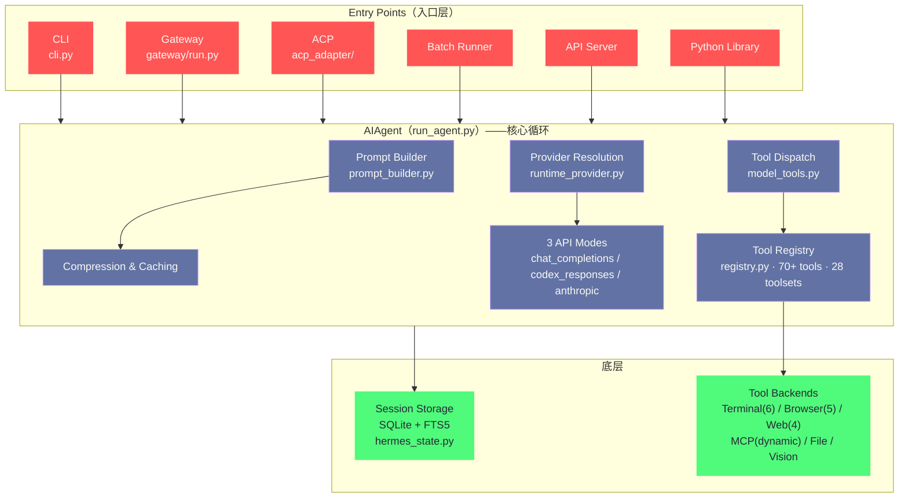
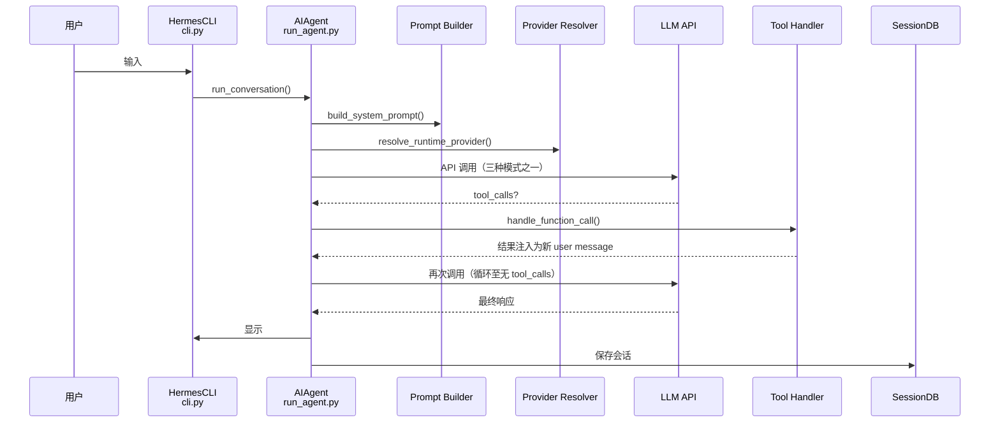
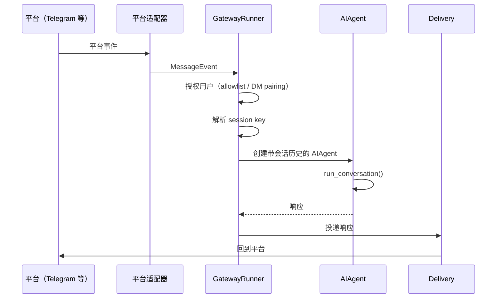
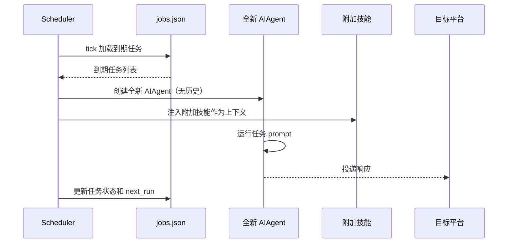

# 03 架构总览——AIAgent 核心循环与子系统

> [!abstract] 摘要
> [[02 Nous Research 与 Hermes 模型谱系|上一篇]]完成了模型层的梳理。本文转向 Agent 层——基于 Hermes Agent 官方架构文档，全面拆解代码架构。文章从系统总览图开始——6 个入口点（CLI/Gateway/ACP/Batch Runner/API Server/Python Library）汇聚到 AIAgent 核心循环，再分发到 Session Storage 和 Tool Backends 两大底层。然后逐层拆解：目录结构（run_agent.py/cli.py/agent/hermes_cli/tools/gateway/plugins/acp_adapter/cron 等核心目录的职责）；三种数据流（CLI Session / Gateway Message / Cron Job）的完整路径；三大 API 模式（chat_completions/codex_responses/anthropic_messages）的适配机制；8 个主要子系统（Agent Loop / Prompt System / Provider Resolution / Tool System / Session Persistence / Messaging Gateway / Plugin System / Cron Scheduler）的职责划分和关键文件。核心认知：Hermes 的架构是"单核心多入口"——AIAgent 是唯一的对话循环引擎，所有入口（CLI/Gateway/Cron/ACP）都通过它运行——这种"单一核心"设计让"学习闭环"和"记忆"在所有入口行为一致。

---

## 第 1 章 系统总览——单核心多入口架构

### 1.1 架构全景图

Hermes Agent 的架构可以用一张图概括——"单核心多入口"：



### 1.2 "单核心多入口"的设计含义

**单核心**：AIAgent（`run_agent.py`）是唯一的对话循环引擎——无论你从 CLI、Telegram、VS Code 还是 cron 任务与 Hermes 交互，最终都通过 AIAgent 运行。这意味着：
- **学习闭环在所有入口一致**——无论从哪个入口完成任务，技能提炼逻辑相同
- **记忆在所有入口共享**——无论从哪个入口读写，都访问同一个 SessionStore
- **工具行为在所有入口一致**——无论从哪个入口调用工具，都通过同一个 Tool Registry

**多入口**：6 个入口点让 Hermes 可以"出现在用户需要的任何地方"——CLI（开发者）、Gateway（消息平台用户）、ACP（IDE 用户）、Batch Runner（研究者）、API Server（前端开发者）、Python Library（Python 开发者）。所有入口共享同一个核心——用户不需要"学习 6 种不同的 Hermes"——在任何入口都是同一个 Agent。

这六个入口还可以按"谁来用"分成两组来看：CLI、ACP、Python Library 服务的是"把 Hermes 当工具操控"的开发者——他们要的是控制力和实时反馈；Gateway、API Server、Batch Runner 服务的是"把 Hermes 当同事委托任务"的使用者——他们要的是异步和可靠。两组入口共享核心但节奏不同，这正呼应了第 01 篇讲过的交互节律论——**入口可以多样，节律必须匹配**——Hermes 用一套核心支撑了两种节律，靠的是第 3 章要讲的数据流分化。

> [!info] 核心概念：为什么"单核心"对"自改进"至关重要
> 如果 Hermes 的 CLI 和 Gateway 用不同的对话循环——比如 CLI 用一个循环，Gateway 用另一个——那么"在 CLI 中学到的技能"不会自动在 Gateway 中可用。用户需要在每个入口重新教 Agent。"单核心"设计让"学一次，到处用"成为可能——这是 Hermes "自改进"理念的架构基础。对比之下，许多 Coding Agent 的 CLI 和 IDE 插件是"两套代码"——虽然功能相似，但行为可能不一致——因为它们没有"自改进"需求，"不一致"是可以接受的代价。

**"单核心"的代价**：单核心的代价是"单点故障"——如果 AIAgent 有 bug，所有入口都受影响。Hermes 通过"25,000 测试"缓解这个风险——大量测试确保核心循环的可靠性。对于"企业级高可用"场景，可以通过"多实例部署 + 负载均衡"在部署层面实现冗余——但这不是"代码层面的多核心"，而是"同一核心的多个运行实例"——它们共享同一个 SessionStore 和技能目录，因此"学习闭环"仍然一致。

单点故障还有一个更隐蔽的维度值得补充——**核心循环的变更风险**。因为所有入口共享 AIAgent，对核心循环的任何修改（哪怕只是优化一个分支）都会同时影响六个入口的线上行为——一次看似无害的重构，可能让 Telegram 上的某个场景悄悄变化。这是单核心架构在维护期的真实税负：核心代码的每一次变更都需要比普通代码更完整的回归测试。Hermes 用 25,000 测试支付这笔税负，但读者在自己的项目里做类似选择时，要先确认自己养得起同等规模的测试基础设施——**单核心的账单是在维护期收的，不是在架构图上看到的**。

### 1.3 这个架构是演进出来的，不是设计出来的

用架构评审的眼光看，"单核心多入口"几乎是教科书级的正确答案——但值得强调的是，这个答案大概率不是一开始就画在白板上的。回看 Hermes 的时间线：2025-07 仓库创建时，它首先是一个 CLI 工具——`run_agent.py` 和 `cli.py` 就是全部；Gateway 是后来长出来的，ACP 适配器更晚，Batch Runner 是研究需求催生的。每加一个入口，开发者都面临同一个选择——为新入口写一个新的对话循环，还是让新入口复用已有的循环。前者的短期成本更低（不用理解旧代码），后者的长期收益更高（行为一致）。Hermes 在每个节点上都选了后者，六个入口走完，"单核心"就成了事实。

这正是架构领域那句老话的又一例证——**架构不是发明出来的，是演进出来的**。如果 Hermes 一开始就"设计"一个支持六入口的平台，它大概率会在第一个入口还没稳定时就被抽象层拖死；而"先做一个，再复用"的路径让每次抽象都有真实需求背书。对读者的启示是：当你看到一个优雅的架构时，值得追问它经历了怎样的演化路径——**优雅往往是约束打磨出来的，不是天赋画出来的**。

### 1.4 与"多核心"架构的对比

为了理解单核心的选择，不妨认真考虑一下它的反面——多核心架构会长什么样。假设 CLI 和 Gateway 各有一个对话循环：CLI 的循环为交互体验优化（流式输出、实时中断），Gateway 的循环为吞吐优化（消息队列、批量处理）。两个循环各自演化，半年后就会出现一系列"细粒度的不一致"——CLI 支持的 slash 命令 Gateway 不认识，CLI 的技能触发条件与 Gateway 差一个版本，用户在 CLI 里教会的流程 Gateway 做不出来。这些不一致每一个都不致命，但叠加起来会侵蚀用户对"这是一个 Agent"的信任。

| 维度 | 单核心（Hermes） | 多核心（假想） |
| :--- | :--- | :--- |
| 行为一致性 | 天然一致 | 随时间漂移 |
| 单点故障影响面 | 全部入口 | 单入口 |
| 入口定制自由度 | 受限于核心 | 各入口自由优化 |
| 学习闭环 | 一次学习处处可用 | 需跨核心同步 |
| 维护成本 | 一套循环 | N 套循环 |

这张表里没有一行是绝对优劣——多核心在"入口定制自由度"上明显占优，这正是某些大型 Agent 平台选择多核心的理由（不同入口的负载特征差异太大）。Hermes 敢选单核心，前提是它的六个入口共享同一种任务形态——"对话式完成任务"——如果未来某个入口的负载特征严重分化（譬如高频低延迟的 IDE 交互），单核心的抽象可能需要重新审视。**架构选择的正确性永远相对于当前的需求分布**。

---

## 第 2 章 目录结构——代码地图

### 2.1 顶层目录

```
hermes-agent/
├── run_agent.py              # AIAgent — 核心对话循环（大文件）
├── cli.py                    # HermesCLI — 交互式终端 UI（大文件）
├── model_tools.py            # 工具发现、schema 收集、分发
├── toolsets.py               # 工具分组和平台预设
├── hermes_state.py           # SQLite 会话/状态数据库 + FTS5
├── hermes_constants.py       # HERMES_HOME、profile 感知路径
├── batch_runner.py           # 批量轨迹生成
│
├── agent/                    # Agent 内部组件
├── hermes_cli/               # CLI 子命令和设置
├── tools/                    # 工具实现（每个工具一个文件）
├── gateway/                  # 消息平台网关
├── plugins/platforms/        # 捆绑平台插件
├── acp_adapter/              # ACP 服务器（VS Code/Zed/JetBrains）
├── cron/                     # 调度器（jobs.py, scheduler.py）
├── plugins/memory/           # 记忆提供者插件
├── plugins/context_engine/   # 上下文引擎插件
├── skills/                   # 捆绑技能（始终可用）
├── optional-skills/          # 官方可选技能（显式安装）
├── website/                  # Docusaurus 文档站点
└── tests/                    # Pytest 套件（~25,000 测试，~1,250 文件）
```

这份目录清单有两个一眼可见的特征，值得先点出来。其一是**顶层文件与目录的分工**——`run_agent.py`、`cli.py`、`model_tools.py` 这几个"大文件"直接躺在顶层，而不是收进子目录——这是一种刻意的"显眼"设计：核心循环和工具分发是全仓库最重要的两条代码路径，放在顶层等于把它们标在代码地图的封面。其二是**插件目录的成对出现**——`plugins/platforms/`、`plugins/memory/`、`plugins/context_engine/` 三个插件目录对应三类扩展点，这个"一个扩展点一个插件目录"的规律，本身就是 Hermes 扩展性设计的目录级表达。

### 2.2 agent/ 目录——Agent 内部组件

`agent/` 目录包含 AIAgent 的"内部组件"——支撑对话循环的各个子系统：

| 文件 | 职责 |
| :--- | :--- |
| `prompt_builder.py` | 系统提示组装 |
| `context_engine.py` | ContextEngine ABC（可插拔） |
| `context_compressor.py` | 默认引擎——有损摘要 |
| `prompt_caching.py` | Anthropic prompt caching |
| `auxiliary_client.py` | 辅助 LLM（视觉、摘要等副任务） |
| `model_metadata.py` | 模型上下文长度、token 估算 |
| `models_dev.py` | models.dev 注册表集成 |
| `anthropic_adapter.py` | Anthropic Messages API 格式转换 |
| `display.py` | KawaiiSpinner、工具预览格式化 |
| `skill_commands.py` | 技能 slash 命令 |
| `memory_manager.py` | 记忆管理器编排 |
| `memory_provider.py` | 记忆提供者 ABC |
| `trajectory.py` | 轨迹保存辅助 |

**关键设计**：`context_engine.py` 和 `memory_provider.py` 都是 ABC（Abstract Base Class）——这意味着"上下文管理"和"记忆"是可插拔的——第三方可以通过插件提供自己的实现。这种"可插拔"设计是 Hermes "扩展性"的基础——第 06 篇会深入记忆提供者插件。

这张文件表里藏着一个值得玩味的分层信号：`prompt_builder.py`（组装提示）和 `context_compressor.py`（压缩上下文）是两个独立文件——说明在 Hermes 的架构观里，"往上下文里放什么"和"上下文满了怎么办"是两个正交的问题。很多 Agent 实现把两者揉在一个"上下文管理器"里，短期看代码集中，长期看两种变更（新增提示层 vs 更换压缩策略）会互相干扰。**正交分解的价值在第二次变更时才显现**——这是所有架构教科书都会讲、但只有维护过系统的人才真正体会的一课。

`auxiliary_client.py` 的存在也值得单独一提，因为它标记了一个架构上的自觉——Hermes 承认"不是所有 LLM 调用都值得用主模型"。视觉分析、对话摘要、技能提炼这些副任务被显式地路由到独立的辅助客户端，而不是偷偷塞进主循环——这种"把副任务正名"的做法，让成本优化有了明确的抓手。很多 Agent 系统的账单失控，根源就是副任务和主任务混在同一条调用链里，想优化都找不到下手的地方。

### 2.3 tools/ 目录——工具实现

`tools/` 目录包含 70+ 工具的实现——每个工具一个文件，自注册到中央注册表：

| 文件 | 职责 |
| :--- | :--- |
| `registry.py` | 中央工具注册表 |
| `approval.py` | 危险命令检测 |
| `terminal_tool.py` | 终端编排 |
| `process_registry.py` | 后台进程管理 |
| `file_tools.py` | read_file, write_file, patch, search_files |
| `web_tools.py` | web_search, web_extract |
| `browser_tool.py` | 10 个浏览器自动化工具 |
| `code_execution_tool.py` | execute_code 沙箱 |
| `delegate_tool.py` | 子 Agent 委托 |
| `mcp_tool.py` | MCP 客户端（大文件） |
| `credential_files.py` | 基于文件的凭证传递 |
| `env_passthrough.py` | 沙箱的环境变量传递 |
| `ansi_strip.py` | ANSI 转义剥离 |
| `environments/` | 终端后端（local/docker/ssh/modal/daytona/singularity） |

**自注册机制**：每个工具文件在导入时自注册到 `registry.py`——这意味着"添加新工具"只需要"创建新文件并自注册"——不需要修改中央注册表代码。这种"自注册"设计让工具扩展非常容易——第 09 篇会深入。

自注册机制值得展开讲一下它的取舍。它换来的是"加工具不动核心"——这对一个 70+ 工具且持续增长的项目是刚需；但它也有隐含的代价：注册行为发生在导入时，意味着"导入了一个文件"和"注册了一个工具"两件事被绑在一起——测试隔离、按需加载、循环导入防护，这些工程问题都因此变得微妙。Hermes 的解法是把"注册"做成声明式的轻量操作（导入时只登记元数据），把"可用性检查"推迟到分发时——**注册便宜，分发谨慎**——这个组合让自注册的便利性没有被工程代价抵消。

### 2.4 顶层大文件——run_agent.py 与它的邻居们

顶层那几个大文件值得单独一节，因为它们承担的职责最重，也最能反映架构的取舍。

**run_agent.py（AIAgent）**：核心对话循环——提供商选择、prompt 构造、工具执行、重试、fallback、回调、压缩、持久化全部在这条路径上。它是一个"大文件"，这不是疏忽而是选择：对话循环的状态机（消息历史、工具调用中间态、重试计数）高度耦合，拆成多个文件反而要用大量参数传递来维持状态一致性。Hermes 的判断是——**循环的复杂性是本质的，不是偶然的**——与其用文件边界制造虚假的解耦，不如承认它是一个整体，用测试覆盖来保证质量。

**cli.py（HermesCLI）**：交互式终端 UI——流式输出、spinner、工具预览、中断处理。它同样是"大文件"，但它的"大"与 run_agent.py 的"大"性质不同：CLI 的复杂度来自交互细节的堆积（每种终端、每种输出形态），而不是状态耦合。这种"大而不同"也解释了为什么两者没有合并——**文件大小的相似不等于职责的相似**。

**model_tools.py 与 toolsets.py**：工具分发与工具分组。前者是"怎么调用工具"的机制层，后者是"哪些工具在哪个平台可用"的策略层——70+ 工具 × 多平台的可用性矩阵如果散落在各处维护，很快就会失控；集中在一个文件里用声明式配置表达，矩阵变更就变成了改一行配置。

### 2.5 hermes_cli/ 目录——CLI 子命令和设置

`hermes_cli/` 目录包含 CLI 的所有子命令和设置逻辑：

| 文件 | 职责 |
| :--- | :--- |
| `main.py` | 入口点——所有 `hermes` 子命令（大文件） |
| `config.py` | DEFAULT_CONFIG、OPTIONAL_ENV_VARS、迁移 |
| `commands.py` | COMMAND_REGISTRY——中央 slash 命令定义 |
| `auth.py` | PROVIDER_REGISTRY、凭证解析 |
| `runtime_provider.py` | Provider → api_mode + 凭证 |
| `models.py` | 模型目录、提供商模型列表 |
| `model_switch.py` | /model 命令逻辑（CLI + Gateway 共享） |
| `setup.py` | 交互式设置向导（大文件） |
| `skin_engine.py` | CLI 主题引擎 |
| `skills_config.py` | hermes skills——按平台启用/禁用 |
| `skills_hub.py` | /skills slash 命令 |
| `tools_config.py` | hermes tools——按平台启用/禁用 |
| `plugins.py` | PluginManager——发现、加载、Hook |
| `callbacks.py` | 终端回调（clarify、sudo、approval） |
| `gateway.py` | hermes gateway start/stop |

**关键设计**：`model_switch.py` 被 CLI 和 Gateway 共享——这意味着"在 CLI 中切换模型"和"在 Gateway 中切换模型"用同一套逻辑——确保切换后行为一致。`callbacks.py` 中的"approval"回调是"命令审批"的核心——当 Agent 要执行危险命令时，通过这个回调询问用户确认——第 12 篇会深入安全模型。

`hermes_cli/` 与 `agent/` 的目录边界也值得点破：前者管"用户怎么操作 Hermes"（命令、配置、向导），后者管"Hermes 怎么工作"（提示、上下文、记忆）。这个边界对应的是产品视角与引擎视角的分离——`setup.py` 这种"大文件"出现在 hermes_cli/ 而不是 agent/，说明设置向导的复杂度被归类为"产品复杂度"而非"引擎复杂度"。**目录结构是架构观的物化**——读目录就是在读开发团队对"什么重要、什么归谁"的回答。

### 2.6 gateway/ 目录——消息平台网关

`gateway/` 目录包含消息平台网关的核心——长驻进程，25+ 平台适配器。核心文件包括 `run.py`（GatewayRunner 消息分发）、`session.py`（SessionStore 对话持久化）、`delivery.py`（出站消息投递）、`pairing.py`（DM pairing 授权）、`hooks.py`（Hook 发现和生命周期事件）、`mirror.py`（跨会话消息镜像）、`status.py`（Token 锁和进程追踪）。

**内置适配器 vs 捆绑插件的区别**：`gateway/platforms/` 中的是"内置适配器"——signal/weixin/bluebubbles/qqbot/whatsapp_cloud/yuanbao/webhook/api_server——这些是 Hermes 核心代码的一部分，不需要额外安装。`plugins/platforms/` 中的是"捆绑插件"——telegram/discord/slack/whatsapp/matrix/mattermost/email/sms/dingtalk/feishu/wecom/homeassistant/irc/line/teams/google_chat/buzz/ntfy/photon/raft/simplex 等——虽然随 Hermes 一起发布，但作为"插件"形式存在，可以按需启用/禁用。这种"内置 + 插件"的分层让"常用平台"有原生支持（内置），"长尾平台"通过插件扩展——平衡了"开箱即用"和"可扩展"。第 07 篇会深入网关架构。

"哪些平台进内置、哪些进插件"的划分标准值得琢磨——它不是按流行度简单排序的。Telegram/Discord/Slack 这些最流行的平台反而在插件侧，而 signal/weixin/qqbot 这些在内置侧。合理的解释是维护成本与依赖重量：内置适配器是核心代码的一部分，要跟随核心发版节奏，适合依赖轻、接口稳定的平台；插件可以独立演化，适合依赖重（每个平台 SDK 都是一坨依赖）或 API 频繁变动的平台。**内置与插件的边界不是重要性边界，而是变更频率边界**——这是插件化设计里比"怎么写插件"更重要的判断。

### 2.7 其他关键目录

- **`acp_adapter/`**——ACP（Agent Client Protocol）服务器，让 Hermes 可以集成到 VS Code/Zed/JetBrains 等 ACP 兼容编辑器。ACP 是一个开放协议——让任何 ACP 兼容的 Agent 可以在任何 ACP 兼容的编辑器中工作。Hermes 的 ACP 适配器让"在 VS Code 中用 Hermes"成为可能——Chat、工具活动、文件 diff 和终端命令在编辑器内渲染。
- **`cron/`**——调度器核心，`jobs.py` 管理任务定义，`scheduler.py` 负责调度循环。
- **`plugins/memory/`**——记忆提供者插件目录，如 Honcho（辩证法用户建模）、OpenViking、Mem0 等。
- **`plugins/context_engine/`**——上下文引擎插件目录，提供替代的上下文管理策略。
- **`skills/`**——捆绑技能（始终可用），安装时复制到 `~/.hermes/skills/`。
- **`optional-skills/`**——官方可选技能，需要显式安装。

`skills/` 与 `optional-skills/` 的区分延续了"内置与插件"的同一套逻辑：捆绑技能随安装即用，承担"示范 + 基础能力"的角色；可选技能需要显式安装，承担"进阶场景"的角色。这个区分对用户的心智模型很重要——**默认开启的东西越少，用户对"Agent 正在做什么"的可感知度越高**——这也是安全设计的一部分。

把整份目录地图收拢起来看，Hermes 的代码组织遵循一条清晰的原则——**按变更原因划分目录**。会因同一个原因变化的代码放在一起：平台 API 变了改 gateway/ 和 plugins/platforms/，上下文策略变了改 agent/ 和 plugins/context_engine/，新工具加了改 tools/。这与"按技术层次划分"（utils/、models/、services/ 那种分法）是两种哲学——前者优化的是变更时的搜索成本，后者优化的是初次阅读时的理解成本。对一个要长期演进的项目，前者是更划算的选择——**代码库的组织方式，决定了三年后它是越长越顺还是越长越乱**。

---

## 第 3 章 三种数据流——从入口到响应

### 3.1 CLI Session 数据流



**关键点**：CLI 的数据流是"同步"的——用户输入后等待响应，期间看到工具调用过程（streaming tool output）。这种"实时反馈"让 CLI 适合"交互式开发"——用户可以"中断并重定向"（interrupt-and-redirect）——如果发现 Agent 走错方向，可以立即打断。

"中断并重定向"这个能力值得多说一句，因为它是同步交互独有的纠错方式。异步流程里，用户对执行过程的干预只能发生在"任务开始前"和"结果返回后"两个时点，中间是黑箱；同步流程把干预点铺满了全程——看到第一步方向不对，第二秒就能打断。对编码这类"方向错误的成本随时间指数增长"的任务，这种密集干预点的价值极大——**纠错越早，浪费越少**，这也是为什么开发者场景天然偏爱同步交互。

### 3.2 Gateway Message 数据流



**关键点**：Gateway 的数据流是"异步"的——平台事件（如 Telegram 消息）到达后，GatewayRunner 创建 AIAgent 处理——用户不需要"在线等待"——响应完成后投递回平台。这种"异步"让 Gateway 适合"长任务"——如"分析这个 100 页文档"——用户发完消息就可以去做别的，Agent 完成后把结果发到 Telegram。

异步流程的代价是**反馈节奏的改变**——用户发出请求后进入"不知道进展如何"的状态，这对长任务尤其煎熬。Hermes 用消息平台本身缓解这个问题：Agent 可以在执行中途主动发消息汇报进度（"文档已读完一半，正在提取要点"），把异步的黑箱重新变成有中间反馈的灰箱。这种"用平台消息做进度流"的设计，是消息平台作为 Agent 界面的独特优势——CLI 做不到（用户可能不在终端前），Web UI 要自己搭推送，而 Telegram 天生就是双向通道。

### 3.3 Cron Job 数据流



**关键点**：Cron 的数据流是"无历史"的——每次 cron 任务创建一个全新的 AIAgent，不携带之前的对话历史。这是因为 cron 任务是"独立的"——如"每天早上 8 点发新闻摘要"——每天的摘要不依赖昨天的对话。但 cron 任务可以"注入附加技能"——如"用 news-summary 技能生成摘要"——这让 cron 任务可以复用之前学到的技能。

**Cron 与记忆的交互**：虽然 cron 任务"无历史"，但它仍然可以访问"持久记忆"（MEMORY.md/USER.md）——因为这些记忆是"跨会话的"，不属于任何特定会话历史。这意味着 cron 任务可以"知道你的偏好"——如"用户喜欢简洁的摘要"——即使它不记得昨天的对话。这种"无历史但有记忆"的设计让 cron 任务既有"上下文感知能力"（通过记忆），又有"低 token 消耗"（无历史）——适合"高频定时任务"的成本控制。

把三张时序图并排看，会发现一个容易忽略的细节：三种数据流里，"授权检查"出现的位置不同。CLI 的授权是隐式的（能坐在终端前的人就是你），Gateway 的授权是显式的（每个消息事件都要过 allowlist/DM pairing），Cron 的授权是配置时一次性的（任务创建时确定投递目标）。同一个安全关注点在三种入口里有三种形态——**安全机制必须跟着入口的信任模型走，而不是一刀切**——这是第 12 篇安全模型的伏笔。

> [!note] 三种数据流的"共同点"和"差异点"
> **共同点**：三种数据流最终都通过 `AIAgent.run_conversation()` 运行——这是"单核心"设计的体现。无论从哪个入口，Agent 的"思考-行动-观察"循环逻辑相同。
> **差异点**：1）历史处理——CLI 和 Gateway 携带会话历史，Cron 不携带；2）同步性——CLI 同步（用户等待），Gateway 和 Cron 异步（用户不等待）；3）技能注入——Cron 显式注入技能，CLI 和 Gateway 隐式发现技能。这些差异是"入口特性"决定的——CLI 是交互式，Gateway 是消息式，Cron 是自动化——但核心循环一致。

---

## 第 4 章 三大 API 模式——Provider Runtime Resolution

### 4.1 三种 API 模式

**API 模式**：Hermes 的 Provider Runtime Resolver 负责把 `(provider, model)` 元组映射到 `(api_mode, api_key, base_url)`——支持三种 API 模式来适配不同提供商：

| API 模式 | 格式 | 适用提供商 |
| :--- | :--- | :--- |
| `chat_completions` | OpenAI Chat Completions | OpenAI、OpenRouter、Nous Portal、大多数兼容端点 |
| `codex_responses` | OpenAI Responses API | OpenAI Codex 系列 |
| `anthropic_messages` | Anthropic Messages API | Anthropic Claude 系列 |

这张表里最值得注意的是 `chat_completions` 一行的"大多数兼容端点"——OpenAI 的 Chat Completions 格式已经成了行业的事实接口标准，几乎所有推理服务商都提供兼容端点。这意味着三种模式里，`chat_completions` 是"万能钥匙"，另外两种是"专锁专钥"。Hermes 仍然保留另外两种原生模式的原因，正是前文说的保真问题——万能钥匙能开门，但开不了最精密的那几把锁。

### 4.2 为什么需要三种模式

不同 LLM 提供商使用不同的 API 格式——OpenAI 的 Chat Completions 是事实标准，但 Anthropic 有自己的 Messages API，OpenAI 的 Codex 系列用新的 Responses API。Hermes 通过"三种模式"原生支持这三种格式——不需要通过"中间层"转换——这减少了格式转换的开销和错误。

"原生支持三种"而不是"统一转成一种"是一个值得停留片刻的架构决策。统一转换的方案（一切归一到 Chat Completions）实现更简单——但转换层会成为信息损耗的源头：Anthropic 的 cache breakpoints、Responses API 的状态化会话，这些格式特有的能力在转换中要么丢失要么走样。三种模式并存的代价是 Agent Loop 要处理三种响应格式的分支逻辑——代码更复杂，但每种格式的能力都保真。**适配层的宽度和保真度成正比，和简洁度成反比**——Hermes 选了宽而保真，因为它对"工具调用可靠性"的承诺经不起转换层的损耗。

**Provider Resolution 的共享性**：这个解析器被 CLI、Gateway、Cron、ACP 和辅助调用（auxiliary_client）共享——确保所有入口使用一致的提供商解析逻辑。这意味着"在 CLI 中切换模型"后，Gateway 和 Cron 也会使用新模型——不需要在每个入口单独切换。

### 4.3 辅助 LLM（Auxiliary Client）

Hermes 有一个"辅助 LLM"概念——用于"副任务"的 LLM，如视觉分析、对话摘要。辅助 LLM 可以与主 LLM 不同——如主 LLM 用 Claude（强推理），辅助 LLM 用 GPT-4o-mini（便宜，用于摘要）。这种"主辅分离"让"成本敏感的副任务"用便宜模型——降低总成本。辅助 LLM 也有独立的 fallback——如果辅助 LLM 故障，不影响主对话。

**辅助 LLM 的典型用途**：1）视觉分析——当用户粘贴图片时，辅助 LLM（需要视觉能力）分析图片内容，把分析结果作为文本注入主对话——主 LLM 不需要视觉能力；2）对话摘要——当上下文超过阈值时，辅助 LLM 摘要旧对话，主 LLM 只处理摘要后的上下文；3）技能提炼——学习闭环中"从轨迹生成 SKILL.md"可以用辅助 LLM——不需要主 LLM 的高推理能力。这种"副任务用便宜模型"的策略显著降低长驻运行的成本——因为"摘要"和"视觉"是高频副任务，用便宜模型节省的开销可观。

**Credential Pools（凭证池）**：Hermes 支持把 API 调用分散到多个 key 上——在限速或故障时自动轮换。这对于"高频使用"场景很重要——如一个 key 的限速是 60 req/min，用 3 个 key 的凭证池可以达到 180 req/min。凭证池也提高可靠性——一个 key 被吊销不影响整体服务。

凭证池与 Fallback 的分工也值得辨析：凭证池解决的是"同一提供商内部的容量问题"（限速、单 key 吊销），Fallback 解决的是"提供商之间的可用性问题"（整个提供商故障）。两层机制叠加，才构成完整的容错谱系——先在池内轮换，池子全挂再跨提供商切换。**容错设计和分布式系统一样，要按故障的层级逐层布防**。

主辅分离的设计还可以从"故障域隔离"的角度再理解一层。如果摘要、视觉这些副任务和主对话共用一条调用链路，副任务的故障（譬如视觉模型超时）就会阻塞主对话——用户发一条消息卡半分钟，原因却是一个他根本没感知的摘要任务。辅助 LLM 有独立的 fallback，等于把副任务的故障关进了自己的故障域——**主对话的可用性不因副任务而妥协**，这是长驻系统比会话级工具更讲究的地方：会话级工具挂了重开就好，长驻系统的每一次挂都消耗信任。

---

## 第 5 章 八大子系统职责划分

### 5.1 Agent Loop——同步编排引擎

AIAgent（`run_agent.py`）是同步编排引擎——处理提供商选择、prompt 构造、工具执行、重试、fallback、回调、压缩和持久化。支持三种 API 模式适配不同提供商后端。

**"同步"的含义**：AIAgent 是"同步"的——一次处理一个对话轮次，等待工具执行完成后再继续。这与"异步多 Agent"系统不同——Hermes 不是"多个 Agent 并行对话"，而是"单个 Agent 串行执行"。但 Hermes 可以通过 `delegate_task` 工具"委托子 Agent"实现并行——第 09 篇会深入。

**Agent Loop 的核心步骤**：一个完整的对话轮次包括：1）`prompt_builder.build_system_prompt()` 组装系统提示（三层架构，第 10 篇详述）；2）`runtime_provider.resolve_runtime_provider()` 解析当前应使用的 LLM 提供商和凭证；3）发起 API 调用（根据 api_mode 选择 chat_completions/codex_responses/anthropic_messages 三种格式之一）；4）如果模型返回 tool_calls，调用 `model_tools.handle_function_call()` 执行工具——工具执行后把结果作为新的 user message 注入，再次调用 LLM——这个"调用-工具-再调用"的循环持续到模型返回最终响应（无 tool_calls）为止；5）最终响应显示给用户并保存到 SessionDB。

**重试与 Fallback**：Agent Loop 内置重试逻辑——如果 LLM API 调用失败（如网络错误、限速），会自动重试若干次。如果重试仍失败，触发 Fallback——切换到备用 LLM 提供商。这种"重试 + Fallback"让 Hermes 在"长驻运行"中更健壮——不会因为临时网络问题或单个提供商故障而中断。

"同步循环 + 委托并行"的组合值得多想一步。同步循环的好处是状态简单——任意时刻只有一个执行点，调试时不需要担心并发交错；代价是长任务会阻塞——一个要跑十分钟的批量操作，期间这个会话不能响应其他请求。`delegate_task` 把并行的决定权交给模型：模型判断任务可拆分时才委托子 Agent，主循环仍然保持同步语义。这个设计的精妙之处在于**并行性是按需启用的能力，而不是全局的架构承诺**——大部分对话享受同步的简单，少数任务获得并行的吞吐。

### 5.2 Prompt System——三层 Prompt 架构

Prompt 构造和维护跨对话生命周期：
- **`system_prompt.py` + `prompt_builder.py`**——组装有序的系统 prompt 层级（`stable` → `context` → `volatile`）：身份/工具指导/技能 → 上下文文件 → 记忆/profile/时间戳块
- **`prompt_caching.py`**——应用 Anthropic cache breakpoints 做 prefix caching
- **`context_compressor.py`**——当上下文超过阈值时摘要中间对话轮次

第 10 篇会深入这个"三层 Prompt"架构。这里只点一层架构与经济的关系：三层的排序不是随意的——stable 层放最前是为了命中 prompt cache（前缀不变才能缓存），volatile 层放最后是因为它每次都变（时间戳、profile 状态）。**Prompt 的分层顺序就是缓存命中率的优化问题**——把"不变的放前面、多变的放后面"这个朴素的道理做对，长驻 Agent 的 API 账单可以差出数倍。

### 5.3 Provider Resolution——提供商解析

共享运行时解析器——被 CLI、Gateway、Cron、ACP 和辅助调用使用。映射 `(provider, model)` 到 `(api_mode, api_key, base_url)`。处理 18+ 提供商、OAuth 流程、凭证池和别名解析。

"别名解析"这个不起眼的能力值得单独一提。模型命名在行业里是出了名的混乱源——同一模型在不同提供商处可能叫不同的名字，同一名字可能指不同版本，别名、简称、带日期的快照名并存。Provider Resolution 把这团乱麻收拢在解析器一层，让上层代码始终面对规范的 `(provider, model)` 元组——**把行业级的命名混乱关在一个文件里**，这是"基础设施替应用隐藏复杂性"原则的教科书式落地。

### 5.4 Tool System——中央工具注册表

中央工具注册表（`tools/registry.py`）——70+ 注册工具，跨 ~28 工具集。每个工具文件在导入时自注册。注册表处理 schema 收集、分发、可用性检查和错误包装。终端工具支持 7 个后端（local/Docker/SSH/Daytona/Modal/Singularity/Vercel Sandbox）。

"错误包装"出现在注册表职责清单里，是一个容易被略过但实际很关键的细节。工具执行的错误形态千奇百怪——进程崩溃、超时、输出超长、编码异常——如果不加包装直接抛给模型，模型可能被原始堆栈信息带偏，甚至把错误信息当作指令注入的载体。注册表统一把错误包装成规范格式再注入对话，等于给"工具与模型之间的对话"加了一层协议——**模型看到的永远是受控的错误描述，而不是原始的事故现场**。

### 5.5 Session Persistence——SQLite + FTS5

基于 SQLite 的会话存储，带 FTS5 全文搜索。会话有谱系追踪（跨压缩的 parent/child）、按平台隔离、原子写入带冲突处理。

**FTS5 的意义**：FTS5 让 Hermes 可以"搜索自己的过去对话"——如"我上周跟你说过的那个 bug 是什么"——Agent 可以用 FTS5 搜索历史会话找到相关内容。这是"跨会话记忆"的基础设施——第 06 篇会深入。

**会话谱系（Session Lineage）**：当对话过长触发上下文压缩时，Hermes 不会"丢弃"旧内容——而是创建一个"子会话"保存压缩前的完整历史，当前会话成为"父会话"的压缩版本。这种"parent/child 谱系"让"压缩前的完整历史"仍然可搜索——如用户问"三个月前我们讨论的某个细节"，Agent 可以通过谱系追溯到压缩前的原始会话。这种设计比"简单丢弃旧内容"更可靠——信息不会因压缩而永久丢失。

**按平台隔离**：不同平台（CLI/Telegram/Discord）的会话默认隔离——Telegram 上的对话不会出现在 CLI 的历史中。但用户可以通过"跨平台连续性"功能手动关联——如"在 CLI 中继续 Telegram 上的对话"。这种"默认隔离 + 手动关联"平衡了"隐私"和"连续性"。

选 SQLite 而不是 PostgreSQL 或专用向量库，也是一个值得点评的决策。SQLite 的优势对本项目的部署形态是决定性的：零运维（一个文件就是数据库）、零配置、随 `~/.hermes/` 目录整体备份和迁移——这与"自托管、数据在自己手里"的产品承诺严丝合缝。代价是并发写能力有限——但对"单用户长驻"的负载，SQLite 的写吞吐绰绰有余。**数据库选型的第一问不是"哪个更强"，而是"负载形态是什么"**——单用户场景里，SQLite 的"弱"根本碰不到边界，而它的"零运维"每天都在兑现价值。

### 5.6 Messaging Gateway——长驻消息进程

长驻进程，25+ 平台适配器（内置 + 捆绑插件），统一会话路由、用户授权（allowlists + DM pairing）、slash 命令分发、Hook 系统、cron ticking 和后台维护。

**GatewayRunner 的职责**：`gateway/run.py` 中的 GatewayRunner 是网关的核心——它接收来自各平台适配器的 MessageEvent，执行用户授权（检查 allowlist 或 DM pairing），解析 session key（确定用哪个会话历史），创建带历史的 AIAgent，运行对话循环，最后通过适配器投递响应。这个"接收-授权-路由-运行-投递"的流程对所有平台一致——平台适配器只负责"平台特定的消息格式转换"，不涉及业务逻辑。

**DM Pairing 授权**：DM pairing 是 Hermes 的"安全授权"机制——防止未授权用户通过消息平台控制你的 Agent。首次使用时，用户需要在 CLI 中执行配对命令，把消息平台账号（如 Telegram user ID）与 Hermes profile 关联。配对后，该账号才能与 Agent 交互。这种"配对授权"对于"Agent 住在 Telegram 上"的场景至关重要——如果没有授权，任何人都可以给你的 Agent 发消息执行命令——这是严重的安全风险。第 12 篇会深入安全模型。

Gateway 作为长驻进程，还有一层不显眼但重要的职责——**它是整个系统的"心跳"**。cron ticking 挂在 Gateway 的运行循环里，Hook 的生命周期事件由它分发，后台维护任务由它驱动。这意味着 Gateway 的稳定性不只是"消息收不发得到"的问题——它停了，定时任务也停了，事件响应也停了。部署 Hermes 时把 Gateway 当成"可选组件"来对待是常见的误判——对任何用了 cron 或消息平台的部署，Gateway 就是系统的主动脉。

"平台适配器不做业务逻辑"这条纪律，值得从演进成本的角度再强调一次。25+ 平台适配器意味着 25 个可能独立变化的外部依赖——平台改 API、改消息格式、改鉴权方式，适配器就要跟着改。如果业务逻辑散落在适配器里，每次适配器变更都要回归测试业务逻辑；把适配器压缩到"格式转换"这一件事，变更的影响面就被锁死在转换层。**适配器模式的全部价值，在于把"外部世界的易变性"关进一个可以频繁替换的盒子**——这个盒子越薄越好。

### 5.7 Plugin System——三种插件类型

三种插件类型：通用插件（tools/hooks）、记忆提供者（跨会话知识）、上下文引擎（替代上下文管理）。通过统一的 `hermes plugins` 交互式 UI 管理。

**三种插件的区别**：通用插件扩展"工具和 Hook"——如添加一个新的 API 集成工具或一个"消息到达时触发"的 Hook。记忆提供者插件替换"记忆后端"——如用 Honcho（辩证法用户建模）替换默认的 MEMORY.md/USER.md 文件记忆。上下文引擎插件替换"上下文管理策略"——如用"基于向量检索的上下文召回"替换默认的"有损摘要压缩"。这三种插件覆盖了 Hermes 的三个"可插拔维度"——工具、记忆、上下文——让第三方可以在不修改核心代码的情况下扩展 Hermes。

**PluginManager 的发现机制**：`hermes_cli/plugins.py` 中的 PluginManager 负责插件发现、加载和 Hook 生命周期管理。插件可以放在特定目录下自动发现——也可以通过配置显式指定。PluginManager 在启动时扫描插件目录，加载所有有效插件，注册它们提供的工具和 Hook。这种"自动发现"让"安装插件"只需要"把插件放到正确目录"——不需要修改 Hermes 的配置文件。

三个可插拔维度——工具、记忆、上下文——恰好对应了 Agent 的三大核心资源：能做什么（工具）、记得什么（记忆）、看见什么（上下文）。这个划分不是随意列举，而是对"Agent 的哪些部分适合标准化接口"的筛选：工具的接口最成熟（函数签名），记忆的接口次之（读写 + 检索），上下文的接口最难定义（压缩策略与任务类型强相关）。Hermes 把最难的那个也做成了 ABC，是一种"宁可接口粗糙也要留出替换余地"的押注——赌的是上下文管理技术还在快速演化，今天的最优解未必是明年的。

### 5.8 Cron Scheduler——定时任务调度

内置调度器——支持自然语言或 cron 表达式设置定时任务。任务可以附加技能、投递结果到任何平台、支持暂停/恢复/编辑。

**自然语言调度**：Hermes 的 cron 调度器支持"自然语言"设置——如"每天早上 8 点给我发新闻摘要"——Agent 会把自然语言解析为 cron 表达式。这让非技术用户也能设置定时任务——不需要学习 cron 语法。对于复杂调度（如"每月第一个周一"），用户仍然可以使用标准 cron 表达式。

**任务状态管理**：cron 任务有完整的状态管理——可以暂停（`hermes cron pause <job_id>`）、恢复（`hermes cron resume <job_id>`）、编辑（修改 prompt 或调度）、删除。任务执行后自动更新 `next_run` 时间。如果任务执行失败，有重试逻辑——失败的任务不会"阻塞"后续任务。

"失败不阻塞"这条性质对定时任务系统格外重要——定时任务的特点是**无人值守**，任何"等人工干预才能继续"的设计，在凌晨三点都是死局。失败的任务记下来、跳过去、下个周期再试，调度器的主循环永远保持流动——这是所有生产级调度系统（从传统 crontab 到 Airflow）用几十年经验换来的同一条铁律。

自然语言调度这个功能看似只是易用性点缀，实际上是非技术用户与 cron 之间的唯一桥梁。cron 表达式（`0 8 * * *`）对开发者是常识，对普通用户是天书——而"长驻个人 Agent"的目标用户恰恰包含大量后者。把"每天早上 8 点"翻译成 cron 表达式的动作由 LLM 完成，等于**用模型的语言能力抹平了调度系统的使用门槛**——这也是一个"LLM 原生应用"的典型设计：传统软件里需要 UI 向导解决的易用性问题，在这里可以交给模型本身。

---

## 第 6 章 测试基础设施

### 6.1 25,000 测试 / 1,250 文件

Hermes 的测试套件规模惊人——约 25,000 个测试，跨约 1,250 个文件。这个规模对于一个"个人 Agent"项目来说非常罕见——反映了 Nous Research 对"生产级可靠性"的重视。

**为什么需要这么多测试**：Hermes 是"长驻"的——一旦部署，7×24 运行——bug 的影响比"会话级"Agent 更大。如"记忆损坏"的 bug 在会话级 Agent 中只影响一次会话，在长驻 Agent 中可能"累积"影响所有后续会话。大量测试是"防止长驻 bug 累积"的必要投资。

还可以换一个角度量化这笔投资：25,000 个测试的编写和维护成本是真实且高昂的——按行业经验估算，这相当于数个工程师月级别的投入。一个开源项目愿意在"用户看不见的地方"花这么多成本，说明它的质量观是"可靠性优先于功能速度"。对用户而言，测试规模是一个比 star 数更诚实的信号——**star 衡量的是期望，测试衡量的是责任**。

### 6.2 测试覆盖的关键场景

从测试文件分布可以推断 Hermes 的测试重点：
- **工具行为测试**——每个工具的正确性、错误处理、边界条件
- **Gateway 适配器测试**——每个平台适配器的消息收发
- **会话存储测试**——SQLite/FTS5 的读写、并发、冲突
- **Provider 解析测试**——每个提供商的凭证解析、API 模式适配
- **学习闭环测试**——技能创建、更新、patch 的触发条件

**测试规模与项目成熟度的关系**：25,000 测试对于 2025-07 创建的项目来说是一个非常高的数字——通常新项目在第一年只有数百到数千测试。Hermes 能在一年内积累 25,000 测试，反映了几个事实：1）Nous Research 有成熟的工程团队——不是"一个人周末项目"；2）Hermes 的代码可能大量复用了 Nous Research 之前项目的测试基础设施——不是从零写测试；3）测试可能包含大量"自动生成"的案例——如参数化测试覆盖多种输入组合。无论如何，这个测试规模表明 Hermes 虽然是"个人 Agent"，但工程质量是"生产级"的。

### 6.3 测试与"长驻可靠性"的关系

对于"会话级"Agent，一个 bug 只影响一次会话——用户重启会话就恢复了。对于"长驻"Agent，bug 的影响是"累积"的——如"记忆写入有 bug 导致记忆损坏"——每次会话都写入错误记忆，损坏会随时间增长——最终 Agent 的行为越来越异常，且难以排查（因为"正常行为"的基线已经漂移）。

这种"长驻 bug 累积"风险要求"更高的测试覆盖"——特别是"状态修改"类操作（记忆写入、技能创建、会话压缩）——这些操作的 bug 会累积。Hermes 的 25,000 测试中，预计很大比例是"状态修改"类测试——这是"长驻 Agent"比"会话级 Agent"需要更多测试的根本原因。理解这一点对于评估 Hermes 的生产可靠性至关重要，不可忽视。

用"故障半径"的视角可以把这一章收得更紧。会话级工具的故障半径是一次会话——最坏情况重启；长驻系统的故障半径是**自部署以来的全部时间**——因为状态在累积，污染也在累积。测试投入的本质是缩小故障半径：25,000 个测试里，每一个针对"状态修改"路径的用例，都是在为"三年后 Agent 的记忆依然干净"这份承诺付保费。**长驻系统的质量成本前置，运行成本后置**——这是它与会话级工具在经济学上的根本区别。

---

## 第 7 章 总结与下一篇导读

### 7.1 本文核心要点

1. **单核心多入口架构**——AIAgent 是唯一对话循环引擎，6 个入口（CLI/Gateway/ACP/Batch/API/Library）都通过它运行——让"学习闭环"和"记忆"在所有入口一致
2. **目录结构清晰**——agent/（内部组件）、hermes_cli/（CLI）、tools/（工具）、gateway/（网关）、plugins/（插件）、acp_adapter/（IDE）、cron/（调度）——每个目录职责单一
3. **三种数据流**——CLI Session（同步交互）、Gateway Message（异步消息）、Cron Job（无历史自动化）——核心循环一致，入口特性不同
4. **三大 API 模式**——chat_completions/codex_responses/anthropic_messages——原生支持三种格式，减少转换开销
5. **八大子系统**——Agent Loop / Prompt System / Provider Resolution / Tool System / Session Persistence / Messaging Gateway / Plugin System / Cron Scheduler
6. **25,000 测试**——生产级可靠性投资——防止长驻 bug 累积
7. **可插拔设计**——ContextEngine 和 MemoryProvider 是 ABC——第三方可通过插件提供自己的实现

最后补一条贯穿全文的观察：这八大子系统没有一个是孤立发明的——每一个都能在前六篇里找到它的需求来源。学习闭环催生了 skill_commands 和 trajectory，模型无关催生了 Provider Resolution 和三种 API 模式，长驻催生了 Gateway、Cron 和 25,000 测试，自托管催生了 SQLite 选型和插件目录。**架构图的每一个框，都是某个产品承诺的账单**——读架构的正确方法，是把每个框读回它服务的那个承诺。

### 7.2 架构决策的一览表

把本文散落各处的架构决策收拢成一张表，方便回顾与权衡：

| 决策 | 选择 | 放弃的替代方案 | 核心理由 |
| :--- | :--- | :--- | :--- |
| 对话循环 | 单核心（AIAgent） | 每入口一个循环 | 学习闭环与记忆跨入口一致 |
| API 适配 | 三种模式原生支持 | 统一转换层 | 格式特有能力保真 |
| 会话存储 | SQLite + FTS5 | PostgreSQL/专用向量库 | 零运维，贴合自托管形态 |
| 并行性 | 同步循环 + delegate_task | 全局异步多 Agent | 状态简单，并行按需启用 |
| 平台扩展 | 内置 + 插件分层 | 全内置或全插件 | 按变更频率划分维护边界 |
| 上下文/记忆 | ABC 可插拔 | 硬编码默认实现 | 为技术演化留替换余地 |

这张表里反复出现同一个模式：**几乎每个决策都是"用短期的实现复杂度换长期的演化自由度"**。单核心让每个新入口都要理解旧循环，三种 API 模式让 Loop 充满分支，ABC 接口让简单事情也要走抽象——这些"麻烦"在第一天都存在，但它们买到的是"半年后不用推倒重来"。架构决策很少有对错，大多是"现在麻烦还是以后麻烦"的选择——Hermes 一致地选择了以后少麻烦。

### 7.3 下一篇导读

下一篇 [[04 学习闭环——Observe-Distill-Reuse-Refine]] 将深入 Hermes 最独特的子系统——学习闭环。基于 skill_manage 工具的 schema 和 Nudge Engine 机制，拆解"观察→提炼→复用→改进"四步循环的触发条件、数据流和工程实现——为什么"3+ 次成功"才创建技能、Pitfalls 段如何自动追加、Nudge Engine 如何在"对话自然间隙"插入反思提示。

> [!info] 专栏导航
> 本文是 [[00 专栏导览|Hermes Agent 专栏]] 的第 3 篇，"核心架构"部分的第 1 篇。

---

## 参考文献

1. Hermes Agent 架构文档. https://hermes-agent.nousresearch.com/docs/developer-guide/architecture
2. Hermes Agent 特性总览. https://hermes-agent.nousresearch.com/docs/user-guide/features/overview
3. Hermes Agent GitHub. https://github.com/NousResearch/hermes-agent

---

## 思考题

1. **Hermes 的"单核心多入口"设计让所有入口共享 AIAgent。但如果 AIAgent 本身有 bug，那么所有入口都受影响——这种"单点故障"风险如何缓解？是否应该"多核心"冗余？** 提示：考虑"冗余的成本"——多核心意味着"学习闭环"和"记忆"需要在多个核心间同步——这引入"一致性问题"。Hermes 选择"单核心 + 大量测试"而非"多核心冗余"——对于"个人 Agent"场景，单核心的"一致性"价值超过其"单点故障"风险。对于"企业级高可用"场景，可能需要多实例 + 负载均衡——但这是"部署层面"的冗余，不是"代码层面"的多核心。

2. **Cron Job 创建"无历史"的 AIAgent——不携带之前的对话历史。但 cron 任务可以"注入附加技能"——技能是"从历史中提炼的"。这种"无历史但有技能"的设计有什么优势和劣势？** 提示：优势是"上下文窗口小、成本低、无历史噪音"——cron 任务只需要的"程序性知识"（技能），不需要"陈述性知识"（历史对话）。劣势是"缺乏上下文适应性"——如"每天发新闻摘要"的 cron 任务，如果用户昨天说"我对 AI 新闻特别感兴趣"，cron 任务不会记得这个偏好（除非这个偏好被写入 MEMORY.md 或技能中）。

3. **Hermes 有 25,000 个测试——这对于一个"个人 Agent"项目来说非常罕见。你认为哪些子系统最需要测试覆盖？如果只能写 100 个测试，你会优先覆盖哪些？** 提示：优先覆盖"长驻 bug 会累积"的子系统——1）Session Storage（数据损坏会累积）；2）Memory Manager（错误记忆会持续影响）；3）skill_manage（错误技能会持续被复用）；4）Provider Resolution（错误的提供商解析会让所有入口失败）。相比之下，"工具行为"的 bug 通常是"单次"的——不会累积——优先级较低。
