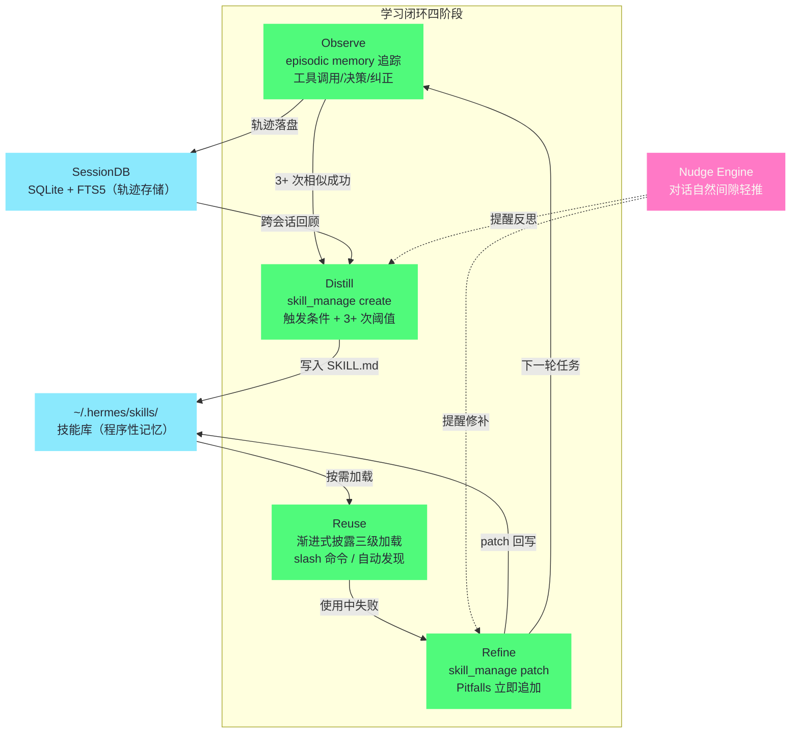

# 04 学习闭环——Observe-Distill-Reuse-Refine

> [!abstract] 摘要
> [[03 架构总览——AIAgent 核心循环与子系统|上一篇]]完成了架构总览。本文深入 Hermes 最独特的子系统——学习闭环（Learning Loop）。这是 Hermes 与所有其他 Agent 的根本区别——不是"模型权重在改变"，而是"程序性记忆在积累"。文章基于 skill_manage 工具的 schema 定义和 Nudge Engine 机制，逐阶段拆解 Observe→Distill→Reuse→Refine 四步循环：Observe 阶段的 episodic memory 追踪（每次工具调用、决策分支、用户纠正）；Distill 阶段的触发条件（5+ 工具调用、错误恢复、用户纠正后方法有效、非平凡工作流发现、用户要求）和 SKILL.md 生成；Reuse 阶段的渐进式披露加载（3 级 token 效率）；Refine 阶段的 Pitfalls 自动追加和 skill_manage patch 操作。然后讨论 Nudge Engine——学习闭环的"驱动器"——如何在"对话自然间隙"插入反思提示而非"强制执行"。最后分析学习闭环的局限性和改进方向。核心认知：Hermes 的"自改进"是"程序性记忆积累"而非"模型权重更新"——这种"不改模型"的自改进让任何 LLM 都能"越用越强"——是"模型无关"理念在学习层面的延伸。

---

## 第 1 章 学习闭环的定位——程序性记忆 vs 模型权重

### 1.1 两种"自改进"路径

AI 系统的"自改进"有两条根本不同的路径：

| 路径 | 机制 | 代表 | 代价 |
| :--- | :--- | :--- | :--- |
| **模型权重更新** | 在使用中微调模型权重 | RLHF、在线学习、持续训练 | 需要 GPU、训练数据、风险高 |
| **程序性记忆积累** | 在使用中积累"如何做"的知识 | Hermes 学习闭环 | 只需要文件系统、低风险 |

**模型权重更新**的典型例子是"RLHF"——用人类反馈强化学习，更新模型权重。这种方式"自改进"效果好——模型本身变强了——但代价高昂：需要 GPU 集群、大量训练数据、且"改坏了"难以回滚（权重是黑盒）。

**程序性记忆积累**的典型例子是 Hermes 的学习闭环——不修改模型权重，而是积累"如何做某类任务"的技能文档（SKILL.md）。这种方式"自改进"效果不如"权重更新"——模型本身没变——但代价低：只需要文件系统，不需要 GPU；且"改坏了"容易回滚（技能是文本文件，可以删除或修改）。

两条路径的差异可以用人类学习来类比——**换脑子 vs 长肌肉记忆**。权重更新像给大脑做手术：效果彻底，但风险高、恢复期长、失败了没法"取消手术"；程序性记忆像骑自行车练出的肌肉记忆：脑子没变，但身体"会了"，而且哪天动作学歪了，重新练就行。类比需要立刻限定：人类的肌肉记忆长在神经系统里，同样不好删除；Hermes 的"肌肉记忆"长在文本文件里——这恰恰是它比人类类比更优越的地方——**技能的可编辑性比人类的习惯可编辑性强得多**。

### 1.2 Hermes 选择"程序性记忆"的原因

Hermes 选择"程序性记忆积累"而非"模型权重更新"有几个原因：

**模型无关的延伸**：Hermes 的核心理念之一是"模型无关"——可以用任何 LLM。如果"自改进"依赖"权重更新"，那么只能改进"可微调的模型"——闭源模型（GPT-4/Claude）无法改进。"程序性记忆积累"与模型无关——无论用什么 LLM，都可以积累技能——这是"模型无关"理念在学习层面的延伸。

**低风险**：权重更新是"黑盒"——改坏了难以诊断和回滚。技能是"白盒"——是文本文件，用户可以阅读、修改、删除。如果 Agent 学到了"错误技能"（如"部署时总是跳过测试"），用户可以直接打开 SKILL.md 修改——不需要"重新训练"。

**可移植性**：技能是文本文件——可以从一个 Hermes 实例导出，导入到另一个实例。如"我在工作 Hermes 上学到的 PR 审查技能，可以导出到个人 Hermes 上使用"。权重更新不可移植——一个实例的权重不能"复制"到另一个实例（除非两个实例用完全相同的模型）。更重要的是，技能遵循 agentskills.io 开放标准——意味着 Hermes 的技能可以被其他兼容 Agent（如 Claude Code、Cursor、OpenHands）使用——反之亦然。这种"跨 Agent 技能共享"是"程序性记忆积累"路径的独特优势——权重更新无法跨模型共享。第 05 篇会深入 agentskills.io 标准。

用反事实来检验这个选择的分量：假设 Hermes 走了权重更新路线，会发生什么？首先"模型无关"立刻破产——用户必须锁定一个可微调的开源模型，Claude/GPT-4o 出局；其次每个用户的 Hermes 都需要 GPU 资源来做在线学习——$5 VPS 的部署故事讲不下去；再次"学坏了怎么办"没有好答案——权重没有 diff 可以 review，没有 git 可以回滚，用户对 Agent 行为变化的感知只能靠"感觉它变怪了"。三条反事实推演下来，程序性记忆路线不是众多选项中的一个，而是**Hermes 全部产品承诺（模型无关、低成本、用户控制）的交集解**——只有它同时满足三个约束。

> [!info] 核心概念：程序性记忆
> "程序性记忆"（procedural memory）是认知科学术语——指"如何做某事"的记忆，如骑自行车、写代码、做 PR 审查。与之对应的是"陈述性记忆"（declarative memory）——指"事实"的记忆，如"巴黎是法国首都"。Hermes 的"技能"对应"程序性记忆"（如何做），"MEMORY.md/USER.md"对应"陈述性记忆"（事实）。第 06 篇会深入陈述性记忆。学习闭环的核心是"程序性记忆的自动积累"——Agent 从实践中"学会如何做"——而不需要用户手动编写技能。

### 1.3 程序性记忆的适用边界

程序性记忆虽好，但它不是万能容器——有些知识适合沉淀为技能，有些不适合。适合的是**步骤稳定、结果可验证**的程序性知识：PR 审查流程、部署流程、数据备份流程——这些任务的"怎么做"变化慢，"做没做对"可以客观判断。不适合的是**强上下文依赖的一次性判断**：某个 bug 的根因分析、某次架构决策的权衡——这些是陈述性知识或纯推理过程，硬提炼成技能只会得到"分析 bug 时要仔细"这类正确的废话。

这条边界给用户的实操启示是：审查 Agent 自动生成的技能时，第一个要问的问题是"这个技能描述的是可重复的程序，还是一次性的判断"——前者留下，后者删掉。技能库的价值密度取决于这个过滤做得勤不勤——**技能库和代码库一样，需要定期删除坏味道**。

### 1.4 与微调路线并非敌对

需要补充的是，"程序性记忆"与"权重更新"两条路线不是非此即彼的敌人——它们在不同的时间尺度上工作。技能积累是**分钟到天级**的学习：今天踩的坑，明天就写进 Pitfalls；权重训练是**月级**的学习：把成千上万条轨迹蒸馏进参数。事实上这两条路线在 Nous 的生态里是衔接的——Hermes Agent 日常使用中积累的轨迹，经 batch_runner 导出后就是微调下一代模型的训练素材（第 11 篇详述）。也就是说，**技能是短期记忆，微调是长期记忆，轨迹是两者之间的搬运工**——一个完整的自改进体系，两条腿都要有。

四步循环加上 Nudge 驱动与两个存储层，完整的学习闭环架构如下：



---

## 第 2 章 Observe 阶段——episodic memory 追踪

### 2.1 什么是 episodic memory

Observe 阶段的基础是"episodic memory"（情景记忆）——Hermes 在每个任务执行过程中追踪"发生了什么"。在展开细节之前，先记住这个阶段要回答的唯一问题：**如果三个月后要教别人做同样的事，现在的执行过程中哪些信息是必不可少的**——追踪机制的一切设计都从这个问题的答案倒推。

- **每次工具调用**——调用了什么工具、参数是什么、返回了什么
- **每个决策分支**——模型在什么时刻选择了什么行动
- **每次用户纠正**——用户在什么时刻纠正了 Agent 的方向

这种追踪不是简单的"对话日志"——而是结构化的"任务执行轨迹"——专门为后续的"技能提炼"设计。

"情景记忆"这个认知科学术语用在这里相当精准——人类的情景记忆是"带时间轴的经历回放"（我记得那天下午我是怎么一步步修好打印机的），区别于语义记忆的"去情境化的事实"（打印机型号是 X）。Hermes 的 episodic memory 保留的正是这种"经历的时间结构"——什么先发生、什么触发了什么、哪里走了弯路。**技能提炼需要的不是结论，是带时间结构的经历**——这是追踪之所以叫"情景记忆"而不叫"日志"的深层原因。

### 2.2 追踪的粒度

Hermes 的 episodic memory 追踪粒度是"工具调用级"——记录每次工具调用的输入输出。这比"对话轮次级"（只记录每轮对话）更细——因为一个对话轮次可能包含多次工具调用（如"读文件→搜索→读文件→修改"）。

两种粒度的差异用一张表对照：

| 维度 | 对话轮次级 | 工具调用级（Hermes） |
| :--- | :--- | :--- |
| 记录单位 | 一轮问答 | 每次工具调用的输入输出 |
| 轮内多次调用 | 被压缩成一段文字 | 逐步保留 |
| 可提炼内容 | 大致的意图与结果 | 完整的执行序列 |
| 存储成本 | 低 | 高（可接受） |
| 技能提炼适用性 | 只能产出概要式技能 | 可重建精确工作流 |

**为什么需要工具调用级粒度**：技能的本质是"工具调用序列"——如"PR 审查技能"是"读 diff→检查 CI→标记风格违规→发布评论"的工具调用序列。如果只记录对话轮次，无法提炼出"工具调用序列"——因为一个轮次内的多次工具调用被"压缩"了。工具调用级粒度让"技能提炼"有足够的细节来重建"执行流程"。

不过粒度选择是有代价的，这笔账要算清楚。工具调用级追踪意味着每次调用的完整输入输出都进存储——一次长任务的轨迹可能就是几万 token——存储成本和后续提炼时的处理成本都随粒度变细而上涨。Hermes 接受这个代价的理由是结构性的：轨迹是技能的原材料，原材料缺了细节，成品就只能是概要；而轨迹的存储成本是一次性的、且存储比 token 便宜——**用廉价的存储换昂贵的上下文**，这笔交换在长驻场景下总是划算的。

### 2.3 用户纠正的捕获

用户纠正是"技能提炼"的重要信号——当用户说"不对，应该这样做"时，意味着 Agent 的原始方法有问题，用户的方法更好。Hermes 捕获这种纠正——记录"Agent 原本想做什么"和"用户纠正后做了什么"——这种"错误→纠正"对是"Pitfalls 段"的素材——技能的 Pitfalls 段会记录"不要这样做，应该那样做"。

**纠正的隐式形式**：用户纠正不总是显式的"不对"——有时是隐式的——如 Agent 提议用方法 A，用户不直接否定而是说"其实用方法 B 更好"——这也是纠正。Hermes 的 episodic memory 追踪需要识别这种"隐式纠正"——这依赖 LLM 的语义理解能力。强模型（如 Claude）更擅长识别隐式纠正；弱模型可能漏掉——导致"用户纠正了但 Agent 没意识到"——错过 Pitfalls 积累的机会。

隐式纠正的识别难度值得展开，因为它暴露了"用 LLM 做元认知"的一个普遍困境：识别"用户这句话是不是在纠正我"本身就是一个语义判断任务，它的准确率受制于模型能力——而判断错误的代价是不对称的。漏判（纠正了没识别）只是错过一次学习机会；误判（把普通建议当纠正）则会污染轨迹，让 Pitfalls 里混进"伪陷阱"。**宁可漏判不可误判**——这也是为什么 Hermes 的纠正捕获更依赖显式信号（用户明确否定）而非激进的语义推断。

隐式纠正的识别难度值得展开，因为它暴露了"用 LLM 做元认知"的一个普遍困境：识别"用户这句话是不是在纠正我"本身就是一个语义判断任务，它的准确率受制于模型能力——而判断错误的代价是不对称的。漏判（纠正了没识别）只是错过一次学习机会；误判（把普通建议当纠正）则会污染轨迹，让 Pitfalls 里混进"伪陷阱"。**宁可漏判不可误判**——这也是为什么 Hermes 的纠正捕获更依赖显式信号（用户明确否定）而非激进的语义推断。

### 2.4 episodic memory 的存储

episodic memory 的追踪数据存储在 SessionDB 中——与对话历史一起。这意味着 episodic memory 也是"跨会话"的——Agent 可以回顾"上周的任务执行轨迹"来提炼技能——不只限于"当前会话"。这种"跨会话 episodic memory"是"3+ 次成功"阈值的基础——Agent 需要回顾"过去多次相似任务"来判断是否达到阈值——如果 episodic memory 不跨会话，就无法做"跨会话的相似性判断"。

### 2.5 轨迹的 token 载荷管理

轨迹的另一个工程问题是**提炼时的载荷控制**。Distill 阶段要把"过去 3+ 次相似任务"的轨迹都装进上下文做提炼——如果每次轨迹都是几万 token，三次任务就是十几万 token，提炼本身的成本就失控了。实践中可行的做法是分层回顾：先看轨迹的"骨架"（工具调用序列 + 结果状态），确认相似性；只在提炼细节时展开完整输入输出。这与第 4 章要讲的渐进式披露是同一个思想在轨迹侧的应用——**原始数据常驻存储，上下文只进摘要和当前需要的部分**。

存储位置与第 03 篇讲的 SessionDB（SQLite + FTS5）共用，还有一个容易被忽略的收益——**轨迹自动继承了会话的隐私边界**。轨迹存在本地数据库里，不进任何云端；配合按平台隔离的会话设计，Telegram 上执行任务的轨迹不会混进 CLI 的提炼视野。对"自托管、数据不出门"的产品承诺来说，学习闭环的每一步——追踪、存储、提炼——都必须在本地闭环，这一点 Hermes 从存储选型起就守住了。

---

## 第 3 章 Distill 阶段——技能生成

### 3.1 skill_manage 工具的触发条件

Distill 阶段通过 `skill_manage` 工具实现——其 schema 定义了精确的触发条件：

```
SKILL_MANAGE_SCHEMA = {
    "name": "skill_manage",
    "description": (
        "Manage skills (create, update, delete). Skills are your procedural memory — "
        "reusable approaches for recurring task types. "
        "Create when: complex task succeeded (5+ calls), errors overcome, "
        "user-corrected approach worked, non-trivial workflow discovered, "
        "or user asks you to remember a procedure. "
        "Update when: instructions stale/wrong, OS-specific failures, "
        "missing steps or pitfalls found during use. "
        "If you used a skill and hit a failure, patch it immediately with "
        "skill_manage(action='patch') — don't wait."
    ),
    ...
}
```

**创建技能的五个触发条件**：
1. **复杂任务成功（5+ 工具调用）**——任务涉及 5 次以上工具调用且成功完成——说明这是一个"非平凡"工作流，值得记住
2. **错误被克服**——任务中遇到了错误但最终找到了解决方案——说明有"陷阱"值得记录
3. **用户纠正后的方法有效**——用户纠正了 Agent 的方向且纠正后的方法成功——说明"原始方法有问题，用户方法更好"
4. **发现非平凡工作流**——Agent 发现了一个"不显而易见"的工作流——如"需要先 A 再 B 才能做 C"
5. **用户要求记住某个程序**——用户明确说"记住这个流程"——最直接的触发

**"3+ 次成功"的阈值**：除了上述触发条件，学习闭环还有一个"3+ 次成功完成相似任务模式"的阈值——只有相似任务成功完成 3 次以上，才进入 Distill 阶段。这个阈值防止"偶然成功的错误流程"被固化为技能——如"某次部署成功是因为恰好网络没抖动，但流程其实有问题"——3 次成功降低了"偶然性"的影响。

这五个触发条件合起来看，体现的是一种**事件驱动的学习观**——技能创建不按时间表（"每天总结一次"），而按事件（"值得记住的事发生了"）。这个设计规避了定时总结的两个经典失败模式：其一是"无事找事"——定时器到点后没有真正值得记的东西，模型为了完成任务硬凑一条低价值技能；其二是"错过时机"——值得记的事发生后要等到下一个整点才被总结，中间的细节已经从上下文里淡出。事件驱动让"学习"贴着"经历"走——**记忆的巩固发生在经历刚发生的时候**，这与人类记忆巩固的研究结论也是一致的。

五个触发条件各自捕获的学习信号不同，用一张表对照更清楚：

| 触发条件 | 学习信号来源 | 提炼出的核心资产 |
| :--- | :--- | :--- |
| 复杂任务成功（5+ 调用） | 执行轨迹本身 | Procedure 步骤序列 |
| 错误被克服 | 轨迹中的错误与恢复 | Pitfalls 陷阱条目 |
| 用户纠正后有效 | 错误→纠正对 | Pitfalls + 修正后的步骤 |
| 非平凡工作流发现 | 决策分支 | "先 A 再 B 才能做 C"式的前置条件 |
| 用户要求记住 | 显式指令 | 整个技能（用户定义范围） |

这张表揭示了一个设计上的完整性：五个条件恰好覆盖了"做成了什么、错过了什么、被教了什么、发现了什么、被要求什么"五类学习信号——**自动学习的输入面被系统地枚举了，而不是想到哪算哪**。

### 3.2 SKILL.md 的生成过程

当触发条件满足时，Agent 进入 Distill 阶段——生成 SKILL.md 文档：

1. **回顾 episodic memory**——Agent 回顾刚才完成任务的工具调用序列、决策分支、用户纠正
2. **提炼程序步骤**——把工具调用序列抽象为"步骤"——如"读 diff→检查 CI→标记违规→发布评论"抽象为"1. 读取 PR diff 2. 检查 CI 状态 3. 标记风格违规 4. 发布审查评论"
3. **识别 Pitfalls**——从"错误→纠正"对中提取"陷阱"——如"不要跳过 CI 检查，即使 CI 看起来通过"
4. **定义验证方法**——如何确认技能执行成功——如"PR 评论已发布且无 CI 失败"
5. **写入 SKILL.md**——用 skill_manage 工具的 `action='create'` 把文档写入 `~/.hermes/skills/`

**生成质量**：SKILL.md 的生成质量取决于 LLM 的能力——强模型（如 Claude）能生成更精确、更完整的技能文档；弱模型可能生成"遗漏步骤"或"陷阱不完整"的文档。这也是为什么 Hermes 推荐"用强模型做技能提炼"——即使日常对话用便宜模型，技能提炼时可以临时切换到强模型。

五步流程里，第 2 步"提炼程序步骤"是抽象层级的关键跳跃——从"具体的工具调用参数"上升到"可复用的步骤描述"。抽象不足的技能会固化具体参数（下次环境变了就失效），抽象过度的技能会失去可操作性（"检查配置"这种步骤等于没说）。好的提炼落在中间——**步骤保留决策结构，参数留给执行时填充**——这个分寸感正是强模型与弱模型的差距所在。

五步流程里，"定义验证方法"是最容易被低估的一步，值得单独强调。没有验证方法的技能是危险的——Agent 执行完技能后无从判断"做成了没有"，只能假设成功；而技能的失败往往是静默的（评论发了但发错了仓库）。验证方法相当于给技能内置了一个"验收标准"，让 Reuse 阶段的每次执行都以可判断的结果收尾——**可验证性是技能区别于"口头经验"的分水岭**。用户审查自动生成的技能时，缺验证方法的技能应当优先补上或删除。

### 3.3 /learn 命令——显式技能学习

除了"自动触发"的技能创建，Hermes 还提供 `/learn` 命令——用户可以"显式要求"Agent 学习某个程序：

```
# 从本地 SDK 文档学习
/learn the REST client in ~/projects/acme-sdk, focus on auth + pagination

# 从在线文档学习
/learn https://docs.example.com/api/quickstart

# 从刚才的对话学习
/learn how I just deployed the staging server

# 从描述的流程学习
/learn filing an expense: open the portal, New > Expense, attach receipt, submit
```

`/learn` 的优势是"用户主导"——用户决定"学什么"和"怎么学"——而不是依赖 Agent 的自动判断。这对于"用户知道是技能但 Agent 没意识到"的场景有用——如"我每次报销都要走一个特定流程，但 Agent 可能不认为这是'技能'"——用户可以用 `/learn` 显式教 Agent。

四种素材来源覆盖了不同的学习起点：

| 来源 | 素材形态 | 适用场景 |
| :--- | :--- | :--- |
| 本地目录 | 代码/文档 | "把这个 SDK 的用法学下来" |
| 在线 URL | 网页文档 | "照着官方 quickstart 学" |
| 刚才的对话 | 当前会话记忆 | "把我们刚跑通的流程记住" |
| 口头描述 | 用户直接口述 | "报销流程是这样的……" |

**/learn 的执行机制**：`/learn` 没有独立的"摄取引擎"——它构建一个"遵循标准的 prompt"并作为正常对话轮次交给 Agent。Agent 用它已有的工具（read_file/search_files/web_extract 等）收集素材，然后按照"技能编写标准"（≤60 字描述、标准段落顺序、Hermes 工具框架、不发明命令）生成 SKILL.md，最后用 skill_manage 工具保存。这种"用 Agent 自身能力学习"的设计意味着 `/learn` 在 CLI、Gateway、TUI 和 Dashboard 中的行为一致——且在任何终端后端（local/Docker/remote）上都能工作——因为没有"单独的摄取引擎"。

**Dashboard 中的 Learn a Skill 按钮**：在 Hermes Dashboard 的 Skills 页面，有一个"Learn a skill"按钮——打开一个面板，包含目录字段、URL 字段和开放式文本框——它组合一个 `/learn` 请求并在 chat 中运行。这让非技术用户也能通过图形界面"教 Agent 技能"——不需要记住 `/learn` 命令语法。

"/learn 没有独立摄取引擎"这个设计决策值得单独品味，因为它是**用架构统一性换实现便利性的典范**。为"学习"单建一条摄取管线（专门的解析器、专门的存储格式）看似更"专业"，但每支持一个新入口、一个新后端，摄取管线就要跟着适配一遍；而"学习就是一次普通对话"的设计，让 /learn 白白继承了 Agent 已有的全部能力——工具调用、多后端执行、跨入口一致——零额外适配成本。这个决策与第 03 篇"单核心多入口"是同一个哲学：**能复用核心能力的功能，绝不另起炉灶**。

---

## 第 4 章 Reuse 阶段——渐进式披露

### 4.1 三级加载机制

技能生成后保存在 `~/.hermes/skills/`——立即可用为 slash 命令。但 Hermes 不会"一次性加载所有技能到系统提示"——那会消耗大量 token。相反，它使用"渐进式披露"（progressive disclosure）——三级加载：

| 级别 | 操作 | 内容 | Token 成本 |
| :--- | :--- | :--- | :--- |
| Level 0 | `skills_list()` | 所有技能的 name/description/category | ~3k tokens（全部技能） |
| Level 1 | `skill_view(name)` | 某个技能的完整内容 + 元数据 | 变化（单个技能） |
| Level 2 | `skill_view(name, path)` | 某个技能的特定参考文件 | 变化（单个文件） |

**工作流程**：Agent 首先调用 `skills_list()` 获取所有技能的"摘要"（Level 0，~3k tokens）——这个摘要让 Agent 知道"有哪些技能可用"。当 Agent 判断某个技能与当前任务相关时，调用 `skill_view(name)` 加载该技能的完整内容（Level 1）。如果技能有附加参考文件且需要查看，调用 `skill_view(name, path)` 加载特定文件（Level 2）。

整个流程可以概括为四步：**列摘要 → 判相关 → 载全文 → 按需取附件**——每一步都由模型根据任务需要自主决定是否继续深入，没有任何一步是强制预加载的。

### 4.2 为什么渐进式披露重要

假设用户有 100 个技能，每个技能平均 2000 tokens。如果"一次性加载所有技能"——系统提示会增加 200,000 tokens——这超过了大多数模型的上下文窗口。即使不超窗口，200k tokens 的输入成本也非常高。

渐进式披露让"无关技能"的 token 成本接近零——Level 0 只消耗 ~3k tokens（所有技能的摘要）——只有"相关技能"才加载完整内容。这种"按需加载"让"拥有大量技能"不会导致"token 爆炸"——支持技能库的无限增长。

用一组对比数字收拢这笔账（100 个技能、每个 2000 tokens 的场景）：

- 全量加载：每次对话固定 +200k tokens——不可行
- 渐进式披露：固定 ~3k + 实际用到的 1-3 个技能（2-6k）——约省 97%
- 技能库翻倍到 200 个：全量加载成本翻倍，渐进式披露的固定成本仅从 ~3k 涨到 ~6k

这笔账还可以从"技能库的成长曲线"角度再算一遍。技能库的特点是**只增不减**——用得越久技能越多，一年后 100 个技能是正常状态。如果加载成本随技能数线性增长，技能库的繁荣本身就是成本灾难——用户会被迫"删技能省钱"，学习闭环的积累价值被自己的加载机制抵消。渐进式披露把加载成本从 O(技能数 × 技能大小) 压到 O(技能数 × 摘要长度) + O(相关技能 × 完整大小)——**技能库可以无限长胖，账单只随"实际用到的部分"增长**——这是技能经济学的地基。

这个三级结构还有一个容易被忽略的类比对象——操作系统的虚拟内存分页：Level 0 相当于页表（知道有哪些页），Level 1 相当于按需调页（用到才载入），Level 2 相当于更细粒度的段加载。区别在于操作系统的缺页中断由硬件触发，而这里的"缺页"由模型的判断触发——模型看到任务，对照 Level 0 摘要，决定调哪个技能进上下文。**判断的质量决定了加载的效率**——这也是为什么技能的 description（Level 0 的内容）值得认真写：摘要写得含糊，模型该调的时候不调、不该调的时候乱调。

### 4.3 技能作为 slash 命令

每个技能自动可用为 slash 命令——如 `/github-pr-workflow`、`/axolotl`、`/plan`。用户可以直接调用技能——不需要"自然语言描述任务然后等 Agent 发现相关技能"。这种"显式调用"比"隐式发现"更快——如用户知道要做 PR 审查，直接 `/github-pr-workflow` 比"请审查这个 PR"然后等 Agent 发现技能更快。

**技能堆叠**：用户可以在一条消息中堆叠多个技能——如 `/github-pr-workflow /test-driven-development fix issue #123 and open a PR`——最多堆叠 5 个技能。这让"组合工作流"成为可能——如"用 PR 工作流 + TDD 技能修复 issue 并开 PR"。

**解析规则**：技能堆叠的解析"在第一个不是技能的 token 处停止"——如 `/ocr-and-documents /tmp/scan.pdf extract the tables`——只加载一个技能（ocr-and-documents），`/tmp/scan.pdf` 是参数而非技能（因为它不是已安装的技能名）。这种"智能解析"避免了"以 / 开头的参数（如文件路径）被误认为技能"的问题。

"显式调用 vs 隐式发现"的双通道设计，本质上是把技能检索的主动权在用户和模型之间做了分工：用户知道要什么时走 slash 命令（零检索成本、零误判），用户不知道或懒得指定时走模型自动匹配（Level 0 摘要对照任务）。两条通道覆盖了"明确委托"和"模糊委托"两类场景——**好的检索设计不是选一种方式，而是让两种方式都便宜**。

值得补充的是，双通道还有相互校准的作用：用户频繁显式调用的技能，说明它的 description 可能写得不够醒目（模型自动匹配时没第一时间想到它）；反过来，模型频繁自动加载而用户从不知情的技能，值得检查是否真的符合预期。技能库的运行数据本身就是调优素材——**检索通道的分工不是静态设计，而是可以随使用数据持续校准的**。

### 4.4 技能的按平台启用/禁用

技能可以"按平台启用/禁用"——如"在 CLI 中启用所有技能，在 Telegram 中只启用安全技能"。这是通过 `hermes skills` 命令配置的——`hermes_cli/skills_config.py` 负责这个逻辑。按平台启用的场景如"在 Telegram 上不想让 Agent 执行代码相关技能"——因为手机上不方便审查代码操作——只启用"信息查询"类技能。这种"按平台控制"让"不同入口有不同的能力范围"——增强了安全性。

按平台禁用的深层逻辑，是承认**审批能力随入口变化**。同一个"执行部署脚本"的技能，在 CLI 里用户可以逐行审查输出，在 Telegram 手机屏幕上基本只能看个标题——能力范围应该跟着审查能力走，而不是处处给满。这与第 03 篇讲的"安全机制跟着入口的信任模型走"是同一条原则在技能层的投影——**权限的最小可用原则，按入口切分**。

### 4.5 与 prompt caching 的协同

渐进式披露还有一个与第 10 篇话题（prompt caching）的隐性协同值得一提。Level 0 的技能摘要在系统提示里相对稳定——只有新增或删除技能时才变化——这意味着它适合放进 prompt 的 stable 层，命中 Anthropic 的 prefix cache；而 Level 1/2 的加载发生在对话中途，作为普通消息注入，不影响缓存前缀。如果反过来把所有技能全量塞进系统提示，每次技能变更都会打穿整个缓存——**渐进式披露不仅是 token 优化，也是缓存友好性优化**。技能库越活跃，这个协同的价值越大。

---

## 第 5 章 Refine 阶段——Pitfalls 自动追加

### 5.1 技能使用中的失败

当 Agent 使用某个技能执行任务时，可能遇到失败——如技能说"用命令 X 部署"，但实际执行时发现"命令 X 在新版系统中已废弃"。这种"技能与现实不符"的情况触发 Refine 阶段。

技能与现实的偏差有三类来源，识别来源有助于判断修补方式。其一是**环境漂移**——系统升级、依赖变更、配置迁移，技能写就时的世界已经不在了；其二是**技能本身的缺陷**——提炼时遗漏了步骤或条件，第一次在"标准环境之外"执行就暴露；其三是**输入的边缘情况**——任务本身落在了技能覆盖范围之外（技能说"审查 PR"，来了一个 5000 行的巨型 PR）。三类偏差的修补优先级不同：环境漂移要 patch 命令，技能缺陷要补步骤，边缘情况则可能要在技能开头加"适用范围"声明——**修补之前先诊断，patch 才不会越修越歪**。

### 5.2 skill_manage patch 操作

Refine 阶段通过 `skill_manage` 的 `action='patch'` 操作实现——Agent 立即修补技能：

- **把失败路径加入 Pitfalls 段**——如"不要用命令 X，它在 v2.0 后已废弃"
- **把成功路径加入 Procedure 段**——如"改用命令 Y"
- **更新验证方法**——如果验证方法也变了

**"立即修补"的重要性**：skill_manage 的 description 强调"If you used a skill and hit a failure, patch it immediately — don't wait."——"立即修补"而非"等下次"。这是因为"如果不立即修补，下次使用时还会遇到同样的失败"——立即修补让"同一个陷阱不会被踩两次"。

**patch vs update 的区别**：skill_manage 有两种修改操作——`action='patch'` 和 `action='update'`。patch 是"局部修补"——只修改失败相关的部分（如追加一个 Pitfall 或修改一个步骤）——保留技能的其他部分不变。update 是"全面更新"——重写整个技能——适用于"技能整体过时"的情况。patch 的"局部性"让它更安全——不会"因为修一个坑而破坏其他正确的部分"——而 update 的"全面性"让它适用于"大范围变更"——但风险更高（可能引入新问题）。Agent 通常优先用 patch——只在"技能整体结构有问题"时才用 update。

"立即修补"和"patch 优先"这两条纪律合起来，实际上是在对抗技能维护中最危险的敌人——**静默退化**。技能不会自己坏，但环境会悄悄变；如果失败发生后不立即记录，失败的记忆就只存在于"当次会话"里，会话结束即蒸发——下次执行，同一个坑原样再踩。patch 操作把"这次失败"永久写进技能文件，等于把会话级的教训升级成了跨会话的资产。软件工程里"postmortem 要在记忆新鲜时写"的道理，在这里被固化成了工具的 description——**把最佳实践写进工具契约，比写进文档有效得多**。

### 5.3 Pitfalls 段不是预写的

Pitfalls 段在技能创建时通常是空的或只有少量已知陷阱——大部分 Pitfalls 是在"使用中"自动追加的。这种"Pitfalls 生长"机制是 Hermes "自改进"的核心体现——技能不是"一次性写好"的静态文档——而是在使用中"越来越完善"的动态文档——每次失败都让技能更精确。

> [!note] Refine 阶段与"人类学习"的类比
> Refine 阶段类似于人类的"从错误中学习"——你第一次做某事时可能踩坑，但记住后下次就不会再踩。Hermes 的技能 Pitfalls 段就是这个"记住坑"的机制——技能在使用中"积累经验"——失败路径被剪枝，成功路径被强化。社区报告显示，基于类似自批判循环的原型在 8 次运行后错误率下降 30%——这虽然不是受控实验，但提供了"Refine 阶段确实有效"的初步证据。

Pitfalls 的"生长式"设计还暗合了知识管理领域的一条经验——**陷阱知识几乎无法凭空预写**。写技能的人（或模型）能预见的是"教科书式的坑"，而真实世界的坑藏在具体环境的缝隙里——某个版本的 bug、某个配置的默认值、某个时区的边界情况。这些知识只有踩过才知道，所以"预写 Pitfalls"注定是空话，"踩了就记"才是唯一可行的积累路径。Hermes 把这个现实直接做进了机制设计里。

### 5.4 Pitfalls 的生命周期管理

Pitfalls 条目有自己的生命周期：诞生于失败，生效于复用，但也可能**过期**——技能说"不要用命令 X（v2.0 已废弃）"，等环境升到 v3.0 后命令 X 彻底移除，这条 Pitfalls 就从"有效警告"变成了"历史噪音"。过期的 Pitfalls 不只是占 token——它会稀释注意力，让真正相关的陷阱被淹没。理想的管理机制是定期合并与清理（本章思考题 3 讨论的方向），把"N 条具体陷阱"蒸馏成"M 条模式级陷阱"（M 远小于 N）——**Pitfalls 段需要的不是只增不减的日志，而是持续蒸馏的知识**。

---

## 第 6 章 Nudge Engine——学习闭环的驱动器

### 6.1 什么是 Nudge Engine

学习闭环的"驱动器"是 Nudge Engine——一个定期提醒 Agent "反思并持久化知识"的机制。Nudge 不是"每 N 分钟触发一次"的简单定时器——而是"在对话的自然间隙"插入反思提示。

"Nudge"（轻推）这个词取自行为科学——Thaler 和 Sunberger 的经典概念：不强制、不禁止，通过改变选择的呈现时机和方式，温和地引导行为。这个命名精确得不像巧合——学习闭环面临的真实问题正是行为问题：模型"有能力提炼技能"不等于"会主动提炼"，就像人"有能力写日记"不等于"会坚持写"。Nudge Engine 的作用就是在"该反思的时刻"轻推一把——**能力是必要条件，触发机制才是充分条件**——这也是为什么它值得成为学习闭环架构里的一个正式组件，而不是一句系统提示里的"请记得总结"。

### 6.2 Nudge 的典型形式

Nudge 的典型形式是"温和提醒"——如：
- "你刚才完成了一个复杂任务（5+ 工具调用），要不要把流程保存为技能？"
- "我注意到你纠正了我的方法——你纠正后的方法更好，要不要我记住它？"
- "这个工作流似乎不显而易见——要不要保存为技能供下次使用？"

**"温和提醒"而非"强制执行"**：Nudge 是"建议性"的——用户可以说"不用保存"，Agent 尊重决定。这种"用户保持控制"的设计很重要——如果 Agent "强制"把每个任务都固化为技能，会产生大量低价值技能——如"查天气"这种简单任务不需要技能。用户拒绝 Nudge 也是一个信号——"这个任务不值得记住"。

注意到最后一句的深意了吗——**拒绝本身也是数据**。用户对 Nudge 的每一次拒绝，都在告诉系统"这类任务在这个用户眼里不值得沉淀"。一个设计良好的学习闭环应该记住这些拒绝（哪怕只是隐式地降低同类 Nudge 的频率），让提醒策略随用户的偏好收敛。Nudge 的理想终态不是"每次都问"，而是"只在该问的时候问"——提醒系统自己也需要学习。

从三条典型 Nudge 的话术里还能读出一条共同结构——**先陈述观察到的具体事实，再给出保存建议**："你刚完成了复杂任务（5+ 调用）"、"我注意到你纠正了我"、"这个工作流似乎不显而易见"。事实在前、建议在后，用户可以基于事实判断建议是否成立——这与"直接问要不要保存"的体验差异微妙但关键：前者是"有依据的提议"，后者是"无来由的打扰"。

### 6.3 Nudge 的时机

Nudge 在"对话自然间隙"触发——如：
- 任务完成后（用户说"谢谢"或"好了"）
- 用户纠正后（用户说"不对，应该..."）
- 长时间对话的中间点（每 N 轮对话后）

**不在"任务执行中"触发**：Nudge 不会在"Agent 正在执行工具调用"时打断——这会干扰任务执行。Nudge 只在"任务完成"或"对话间隙"触发——确保不打断"心流"。

"任务执行中不打断"这条时机纪律，值得从注意力的经济学的角度再确认一次价值。Agent 的上下文窗口是稀缺资源，任务执行中插入反思提示，等于往工作记忆里扔进一条与当前任务无关的元指令——轻则稀释模型对任务的注意力，重则让模型在"继续执行"和"响应反思"之间摇摆。把反思严格限制在任务边界之外，是**用时机纪律保护执行质量**——这与人类"不要在别人专注时跟他聊下班去哪"是同一条礼貌，只不过这里的代价是 token 和准确性。

**Nudge 与"写审批门"的交互**：如果用户启用了"写审批门"（write-approval gate），那么 skill_manage 的创建/更新/删除操作需要用户确认——Nudge 提醒后，即使用户同意保存技能，实际写入 `~/.hermes/skills/` 时还需要通过审批门。这种"双重确认"（Nudge 同意 + 审批门确认）确保用户对"技能库的变更"有完全控制——防止 Agent "偷偷"创建或修改技能。第 12 篇会深入安全模型和审批门。

### 6.4 Nudge 的失效形态

提醒机制本身也有失效形态，识别它们有助于诊断"为什么我的 Agent 不长记性"：

| 失效形态 | 表现 | 根因 |
| :--- | :--- | :--- |
| 提醒疲劳 | Nudge 频率过高，用户无脑拒绝 | 时机选择不挑，间隙判断粗糙 |
| 提醒疲劳的反面 | 从不提醒，学习闭环静默失效 | Nudge 策略过于保守 |
| 提醒与审批脱节 | 用户同意保存但审批门拦截，体验挫败 | 双重确认没有合并设计 |
| 提醒错位 | 在用户赶时间时提议保存 | 时机模型只看对话结构不看用户状态 |

前两种失效形态提示同一个设计要点：Nudge 频率本身需要自适应——拒绝率高就降频，接受率高可以维持。**提醒系统的健康状态，是"提醒率"与"接受率"的动态平衡**——任何固定频率的提醒，要么太多要么太少。

### 6.5 Nudge 与四阶段的映射

把 Nudge Engine 放回整个闭环，可以看到它与四个阶段各自的关系：

| 阶段 | Nudge 的角色 | 触发时机 |
| :--- | :--- | :--- |
| Observe | 无直接交互——追踪是自动的 | 持续进行 |
| Distill | 提醒"要不要提炼为技能" | 任务完成 / 纠正后 |
| Reuse | 无需提醒——技能发现是自动的 | 任务开始时 |
| Refine | 提醒"要不要修补技能"——但 schema 已要求立即 patch | 使用技能失败后 |

这张表里有个耐人寻味的不对称：Distill 需要提醒（因为"提炼"是超出当前任务目标的额外工作），Refine 几乎不需要（schema 的"don't wait"已经把修补变成了任务的一部分）。**需要 Nudge 的，恰恰是那些"对当前任务没有直接收益"的元认知动作**——这个观察可以作为判断"哪些 Agent 行为需要外部驱动"的一般法则。

---

## 第 7 章 学习闭环的局限性与改进方向

### 7.1 局限一：技能质量依赖 LLM 能力

SKILL.md 的生成质量取决于 LLM 的能力——弱模型可能生成"遗漏步骤"或"陷阱不完整"的技能。这是"程序性记忆积累"路径的固有局限——因为"提炼"本身是 LLM 做的——LLM 的能力上限决定了技能质量上限。

**缓解方案**：如第 3.2 节提到的，可以"在技能提炼时临时切换到强模型"——即使日常对话用便宜模型，提炼时用 Claude/GPT-4o——这种"分层模型使用"平衡了成本和质量。

还有一个零成本的补充手段——**人工审查新技能**。技能创建是低频事件（远低于对话频率），每次创建后花一分钟过目，就能拦住大部分"遗漏步骤"类缺陷。低频事件配人工审查、高频事件配自动化——这个分工原则在这里同样适用。

### 7.2 局限二："相似任务"判断的主观性

"3+ 次成功完成相似任务模式"中的"相似"是主观的——什么算"相似"？如"审查 PR"和"审查 PR 并修复 bug"算相似吗？这依赖 LLM 的判断——可能"过于宽松"（把不相似的任务当相似）或"过于严格"（相似的任务不识别）。

**缓解方案**：用户可以通过 `/learn` 显式触发技能创建——绕过"相似性判断"——对于"用户知道是技能但 Agent 没意识到"的场景，显式触发比依赖自动判断更可靠。

相似性判断还有一个实践层面的缓解——**让阈值判断基于轨迹的结构特征而非纯语义**：工具调用序列的相似度、涉及文件的交集、错误类型的重合——这些结构信号比"任务描述像不像"更客观。语义判断定方向，结构判断定阈值，两者结合能把误判率压低不少。

### 7.3 局限三：技能可能"过时"

技能是基于"过去经验"生成的——但环境可能变化——如"部署技能"基于"K8s v1.28"生成，但集群升级到 v1.30 后某些命令变了。过时的技能可能导致失败——直到 Refine 阶段修补。

**缓解方案**：Refine 阶段的"立即修补"机制是主要缓解——技能在使用中"跟上变化"。但对于"长期不用的技能"——如"半年没用过的部署技能"——可能已经过时但没被修补——因为"不用就不会触发 Refine"。用户可以定期"审查技能库"——手动检查过时技能。

"不用就不会触发修补"这个盲区有个朴素的补丁——**在技能被重新启用时加一次"新鲜度检查"**：半年没用的技能被调用时，Agent 先核对技能里引用的命令、路径、版本是否仍然存在，再决定照做还是提示用户。这把"过时发现"从"执行失败后"提前到了"执行开始前"——成本一次查询，收益是避免一次失败的执行。

### 7.4 改进方向：主动技能验证

一个可能的改进方向是"主动技能验证"——Agent 定期"测试"技能是否仍然有效——如"部署技能"可以定期在测试环境跑一遍验证流程是否正确。这种"主动验证"比"被动等待失败"更可靠——但成本更高（需要定期执行技能）。这个方向目前 Hermes 还没有实现——是未来可能的增强。

主动验证的成本收益结构值得细算，因为它不是"有比没有好"那么简单。验证的成本是确定的（每次验证消耗执行资源），收益却是概率性的（只有技能真的过时了，验证才有价值）——而技能过时的概率高度不均匀：依赖外部 API 的技能可能月月变，纯本地流程的技能可能几年不变。理性的做法不是"全部定期验证"，而是**按技能的"环境耦合度"分级验证**——耦合外部系统的技能高频验证，纯程序性技能低频甚至不验证。任何"定期 X"式的机制设计，都值得先问一句"X 的变化率均匀吗"。

### 7.5 局限四：技能的"过度专化"风险

技能是从"特定用户的具体任务"中提炼的——可能"过度专化"于该用户的环境和习惯。如"部署技能"可能基于"用户的特定 K8s 集群配置"——把集群特定信息（如 namespace 名、镜像仓库地址）固化到技能中——导致技能"不可移植"到其他环境。虽然 agentskills.io 标准让技能"可以"跨 Agent 共享，但"过度专化"的技能共享价值低——其他用户的环境不同，技能可能不适用。缓解方案是在技能提炼时"抽象化环境特定信息"——如用"你的 namespace"而非"my-prod-namespace"——但这依赖 LLM 的抽象能力，并非总能做到完美。理解这些局限性对于有效使用学习闭环至关重要，需要在实践中不断摸索平衡点与取舍。

把四个局限放在一起看，会发现它们指向同一个根源——**学习闭环把"判断"外包给了 LLM**：什么值得记（触发条件）、什么算相似（阈值判断）、怎么抽象（专化控制）、技能是否还有效（过时检测），全部依赖模型的语义能力。这不是实现缺陷，而是这条路线的本质特征——程序性记忆的积累质量，永远以模型的理解力为上限。反过来说，这也意味着**模型每升级一代，同一个学习闭环的产出就自动水涨船高**——技能文件不变，提炼它的脑子变强了。这种"基础设施不变、能力随模型增长"的特性，恰好是"模型无关"设计最深刻的红利。

### 7.6 局限的严重度排序

四个局限对实际使用的影响并不均等，按"踩到的频率 × 踩到的代价"排一个务实的序：

| 局限 | 踩到频率 | 单次代价 | 务实对策 |
| :--- | :--- | :--- | :--- |
| 技能过时 | 高（环境持续变化） | 中（失败后可恢复） | 定期审查 + Refine 立即修补 |
| 相似性误判 | 中 | 低（多记或少记一条） | /learn 显式触发兜底 |
| 过度专化 | 中 | 低（共享价值打折） | 提炼时抽象化环境信息 |
| 质量依赖模型 | 低（一次性） | 高（坏技能反复被复用） | 提炼时用强模型 + 人工审查 |

值得注意的是"质量依赖模型"虽然单次代价最高，但踩到频率最低——因为它是"创建时"的一次性问题，且强模型提炼 + 人工过目就能基本规避。真正日常消耗注意力的是"技能过时"——它没有一次性解法，只能靠机制持续对冲。**评估一个学习系统的维护成本，看的是高频局限而非高危局限**。

---

## 第 8 章 总结与下一篇导读

### 8.1 本文核心要点

1. **两种自改进路径**——模型权重更新（高代价、高风险）vs 程序性记忆积累（低代价、低风险）——Hermes 选择后者
2. **Observe 阶段**——episodic memory 追踪工具调用级粒度的执行轨迹，捕获用户纠正
3. **Distill 阶段**——skill_manage 的五个触发条件（5+调用/错误克服/用户纠正/非平凡工作流/用户要求）+ 3+ 次成功阈值——生成 SKILL.md
4. **Reuse 阶段**——渐进式披露三级加载（Level 0 摘要 ~3k tokens / Level 1 完整内容 / Level 2 特定文件）——支持技能库无限增长
5. **Refine 阶段**——skill_manage patch 立即修补失败——Pitfalls 段在使用中自动追加——"同一个陷阱不会被踩两次"
6. **Nudge Engine**——在对话自然间隙温和提醒反思——用户保持控制——可拒绝
7. **/learn 命令**——显式技能学习——用户主导——绕过自动判断
8. **局限性**——技能质量依赖 LLM 能力、"相似任务"判断主观、技能可能过时——缓解方案包括分层模型使用、显式触发、定期审查

回望整个闭环，有一个设计气质值得最后点破：Hermes 在每个环节都选择了"克制"——追踪只记必要的三类事件，提炼要等触发条件而非定时硬凑，加载按需三级递进，修补优先局部 patch，提醒温和可拒绝。这些克制共享同一个底层判断：**自动积累的知识如果不加筛选，污染的速度会超过积累的速度**。学习闭环的工程难点从来不是"让 Agent 学"，而是"让 Agent 只学值得学的"——Hermes 的答案是给学习的每一步都装上节流阀。

如果用一句话概括学习闭环与第 03 篇架构的关系：架构篇讲的八大子系统回答的是"Hermes 如何稳定地做事"，本章的学习闭环回答的是"Hermes 如何把做过的事变成下次的资本"——前者是运营能力，后者是成长能力，而**长驻产品的护城河恰恰长在成长能力上**——运营能力可以被复制，但一个积累了两年技能库的 Hermes 实例，是任何新装实例无法追赶的。

回望整个闭环，有一个设计气质值得最后点破：Hermes 在每个环节都选择了"克制"——追踪只记必要的三类事件，提炼要等触发条件而非定时硬凑，加载按需三级递进，修补优先局部 patch，提醒温和可拒绝。这些克制共享同一个底层判断：**自动积累的知识如果不加筛选，污染的速度会超过积累的速度**。学习闭环的工程难点从来不是"让 Agent 学"，而是"让 Agent 只学值得学的"——Hermes 的答案是给学习的每一步都装上节流阀。

### 8.2 下一篇导读

下一篇 [[05 技能系统——SKILL.md 与 agentskills.io 标准]] 将深入技能系统的"文档层面"——SKILL.md 的标准格式（front-matter + When to Use + Procedure + Pitfalls + Verification）、agentskills.io 开放标准（让 Hermes 技能可被 Claude Code/Cursor/OpenHands 等其他 Agent 使用）、Skills Hub（88k+ 技能的集中市场）、技能的平台特定性（macOS/Linux/Windows）、技能的媒体投递（`[[as_document]]` 指令）等。

> [!info] 专栏导航
> 本文是 [[00 专栏导览|Hermes Agent 专栏]] 的第 4 篇，"核心架构"部分的第 2 篇。

---

## 参考文献

1. Hermes Agent Skills System 文档. https://hermes-agent.nousresearch.com/docs/user-guide/features/skills
2. Learning Loop 介绍. https://hermes-agent.ai/features/learning-loop
3. How Hermes Agent Achieves Self-Improving AI. https://www.besthub.dev/articles/how-hermes-agent-achieves-self-improving-ai-through-memory-skills-and-nudge-engine-39749dd09a61
4. Hermes Agent Architecture Deep Dive. https://zooclaw.ai/help/en/2026-04-23/hermes-agent-architecture-learning-loop-deep-dive/
5. Hermes Agent GitHub. https://github.com/NousResearch/hermes-agent

---

## 思考题

1. **Hermes 的"3+ 次成功"阈值防止"偶然成功的错误流程"被固化为技能。但这个阈值是否会让"真正有价值的技能"创建太慢？如"部署 K8s 集群"这种低频但高价值的任务，可能几个月才做 3 次——要等几个月才能创建技能。如何平衡"防止偶然性"和"及时创建"？** 提示：考虑"动态阈值"——简单任务（1-2 次工具调用）可能 1 次就够了，复杂任务（10+ 工具调用）可能需要更多次验证。或者"用户显式触发"——对于低频高价值任务，用户可以用 `/learn` 显式触发，绕过 3 次阈值。

2. **Nudge Engine 的"温和提醒"让用户保持控制——可以拒绝。但如果用户总是拒绝（因为"懒得保存"），学习闭环就失效了。如何设计"激励机制"让用户更愿意接受 Nudge？** 提示：考虑"展示价值"——Nudge 可以附带"如果你保存这个技能，下次类似任务可以节省 X 分钟"的估算——让用户看到"保存的即时价值"。或者"延迟保存"——用户可以"先不保存，但如果下次遇到相似任务，再提醒"——降低"保存的决策成本"。

3. **技能的 Pitfalls 段在使用中自动追加——这让技能"越来越完善"。但也可能让 Pitfalls 段"无限增长"——如一个技能用了 100 次，每次都追加一个 Pitfall——Pitfalls 段可能有 100 条，加载时消耗大量 token。如何防止 Pitfalls 段"膨胀"？** 提示：考虑"Pitfalls 合并"——定期用 LLM 审查 Pitfalls 段，合并相似陷阱——如"命令 X 废弃"和"命令 Y 废弃"可以合并为"注意命令版本兼容性"。或者"Pitfalls 分级"——只保留"高频陷阱"，低频陷阱移到参考文件（Level 2）——需要时才加载。
