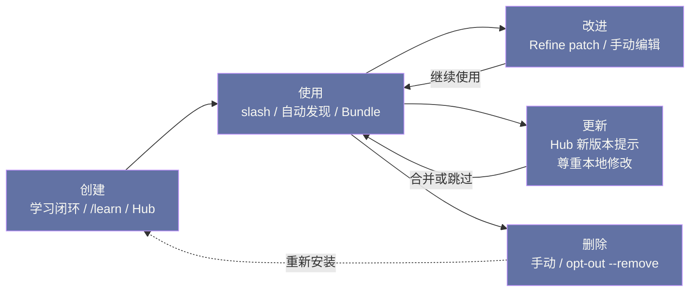

# 05 技能系统——SKILL.md 与 agentskills.io 标准

> [!abstract] 摘要
> [[04 学习闭环——Observe-Distill-Reuse-Refine|上一篇]]拆解了学习闭环的"过程"——技能如何从经验中生长。本文聚焦技能系统的"文档层面"——技能的格式、标准和生态。文章从 SKILL.md 的标准格式开始——front-matter（name/description/version/platforms/metadata）+ 四段正文（When to Use / Procedure / Pitfalls / Verification）——逐字段解释含义和编写要点。然后深入 agentskills.io 开放标准——这个由 Hermes 推动的标准让技能可以跨 Agent 共享——Claude Code、Cursor、OpenHands、Gemini CLI、GitHub Copilot 等 18+ Agent 都支持——形成了"88k+ 技能"的共享生态。接着讨论技能的进阶特性：平台特定性（macOS/Linux/Windows 自动隐藏）、技能输出与媒体投递（`[[as_document]]` 和 `[[audio_as_voice]]` 指令）、外部技能目录、技能包（Skill Bundle）、技能的 opt-out 机制。最后对比 Hermes 技能与 MCP 的定位差异——技能是"知识"（告诉 Agent 怎么做），MCP 是"工具"（让 Agent 能做新事）——两者互补。核心认知：agentskills.io 标准的意义不亚于 MCP——MCP 标准化了"Agent 与工具的连接"，agentskills.io 标准化了"Agent 与知识的连接"——两者共同构成 Agent 生态的"双标准"。

---

## 第 1 章 SKILL.md 标准格式

### 1.1 完整格式示例

SKILL.md 是技能的"源文件"——一个 Markdown 文件，带 YAML front-matter。在逐字段拆解之前，先建立整体印象：**front-matter 管"这个技能是谁、何时可用"，正文四段管"这个技能怎么执行"**——前者面向系统（解析器、检索、调度），后者面向模型（阅读、执行、自检）。理解了这个二分，每个字段的设计意图就都不难猜。

```markdown
---
name: my-skill
description: Brief description of what this skill does
version: 1.0.0
platforms: [macos, linux]     # 可选——限制特定 OS 平台
metadata:
  hermes:
    tags: [python, automation]
    category: devops
    fallback_for_toolsets: [web]    # 可选——条件激活
    requires_toolsets: [terminal]   # 可选——条件激活
    config:                          # 可选——config.yaml 设置
      - key: my.setting
        description: "What this controls"
        default: "value"
        prompt: "Prompt for setup"
---

# Skill Title

## When to Use
Trigger conditions for this skill.

## Procedure
1. Step one
2. Step two

## Pitfalls
- Known failure modes and fixes

## Verification
How to confirm it worked.
```

### 1.2 Front-matter 字段详解

**name**（必填）：技能的唯一标识符——也是 slash 命令名（如 `name: github-pr-workflow` 对应 `/github-pr-workflow`）。应使用 kebab-case（小写 + 连字符）——如 `my-skill` 而非 `MySkill` 或 `my_skill`。

**description**（必填）：技能的简短描述——≤60 字符。这个描述出现在 Level 0 的 `skills_list()` 中——是 Agent 判断"是否需要加载完整内容"的依据。描述应"精确且具触发词"——如"Review GitHub PRs: check CI, summarize diff, flag style violations"——而非"Help with PRs"（太模糊）。

60 字符这个限制值得单独解释，因为它不是随意的风格规定，而是**检索系统的物理约束**。回顾第 04 篇的账：Level 0 要把所有技能的 description 装进 ~3k tokens——按每个技能平均消耗 30 tokens 计算，100 个技能的预算就是 3000 tokens，摊到 description 上的空间极其有限。写得越长，能承载的技能数越少，或者摘要越贵。**description 是技能的"索引条目"，索引的长度预算由整个技能库的规模决定**——这也是为什么"精确且具触发词"比"全面"更重要：索引条目的职责是被匹配到，不是被读完。

**version**（推荐）：语义化版本号——如 `1.0.0`。用于追踪技能的更新——当技能通过 Skills Hub 共享时，版本号让其他用户知道是否需要更新。

**platforms**（可选）：限制技能在特定操作系统上加载——`[macos]`（仅 macOS）、`[linux]`（仅 Linux）、`[windows]`（仅 Windows）、`[macos, linux]`（macOS 和 Linux）。省略则所有平台加载。当设置后，技能在不兼容平台上自动从系统提示、`skills_list()` 和 slash 命令中隐藏。

**metadata.hermes**（可选）：Hermes 特定的元数据——`tags`（标签，用于分类）、`category`（类别）、`fallback_for_toolsets`（当指定 toolset 不可用时作为 fallback 激活）、`requires_toolsets`（需要指定 toolset 才激活）、`config`（技能的配置项，在 setup 时提示用户）。

**config 字段的用途**：`config` 让技能可以声明"需要用户配置的设置项"——如"部署技能"可能需要"K8s namespace"和"镜像仓库地址"。当用户首次使用该技能时，Hermes 的 setup 向导会提示用户填写这些配置——填写后存储在 `config.yaml` 中——技能执行时读取。这种"技能自带配置"机制让"需要环境特定信息的技能"可以"安装时配置，使用时自动读取"——不需要用户每次手动提供。

config 机制还顺带解决了一个技能共享的隐性障碍——**环境特定信息导致的"技能不可用"**。没有 config 机制时，一个依赖"你的 K8s namespace"的技能要么把具体值写死（别人装了不能用），要么在步骤里写"填入你的 namespace"（执行时模型要即兴询问，体验割裂）。config 把"环境参数"从技能正文中抽离成声明式配置——技能正文保持通用，参数在安装时注入——这与十二要素应用（12-Factor App）"配置与代码分离"的原则完全同构。

### 1.3 正文四段结构

**When to Use**：技能的"触发条件"——什么情况下应该使用这个技能。如"当用户要求审查 GitHub PR 时"或"当需要部署到 K8s 生产环境时"。这段帮助 Agent 判断"当前任务是否匹配这个技能"。

**Procedure**：技能的"执行步骤"——按顺序列出操作。如"1. 读取 PR diff 2. 检查 CI 状态 3. 标记风格违规 4. 发布审查评论"。步骤应"具体且可执行"——而非"审查 PR"这种模糊描述。

**Pitfalls**：技能的"已知陷阱"——失败模式和修复方法。这段在技能创建时通常为空或少量——大部分 Pitfalls 在使用中通过 Refine 阶段自动追加。如"不要跳过 CI 检查，即使 CI 看起来通过——有时 CI 报告延迟"。

**Verification**：技能的"验证方法"——如何确认技能执行成功。如"PR 评论已发布且无 CI 失败"。这段让 Agent 在执行技能后能"自检"——确认是否真的成功了。

四段之中，When to Use 与 Verification 是最容易被业余编写者省略的两段，但它们恰恰是技能"能被自动调度"的前提。没有 When to Use，Agent 无法判断"当前任务要不要用这个技能"——技能只能靠用户手动 slash 调用，自动发现形同虚设；没有 Verification，Agent 执行完无法自检——失败要等用户发现才暴露。**Procedure 决定技能能不能做，When 和 Verification 决定技能能不能被自主调度**——自主性恰恰是 Agent 技能区别于普通文档的地方。

四段结构对应了执行一个技能的完整认知循环——**何时做（When）、怎么做（Procedure）、别踩什么（Pitfalls）、怎么确认做对了（Verification）**。这个结构并非 Hermes 独创——它和人类工程实践中的"作业指导书"（work instruction）结构高度同构：适用范围、操作步骤、安全注意事项、验收标准。技能文档的成熟形态，人类工业界几十年前就打磨过了——agentskills.io 做的事情是把这套结构标准化到 LLM Agent 的语境里。

> [!note] 编写标准：Hermes 的"技能编写规范"
> Hermes 的 `/learn` 命令和自动技能生成都遵循一套"技能编写规范"——≤60 字符描述、标准段落顺序（When to Use → Procedure → Pitfalls → Verification）、Hermes 工具框架（用 Hermes 已有工具描述步骤，不发明命令）、不编造命令（如果不确定命令是否存在，标注"需要验证"）。这套规范确保技能的"质量"和"可执行性"——低质量技能（如"步骤模糊"或"命令不存在"）会降低 Agent 的可靠性。

### 1.4 编写实践——一个好技能的例子

以"GitHub PR 审查"技能为例，展示一个好技能的完整结构：

```markdown
---
name: github-pr-workflow
description: Review GitHub PRs: check CI, summarize diff, flag style violations
version: 1.2.0
metadata:
  hermes:
    tags: [github, code-review, ci]
    category: devops
    requires_toolsets: [terminal, web]
---

# GitHub PR Review Workflow

## When to Use
- 用户要求审查 GitHub PR
- PR 编号或 URL 已知
- 需要 CI 状态、diff 摘要和风格检查

## Procedure
1. 用 `gh pr view <PR_NUMBER>` 获取 PR 元数据（标题、作者、分支）
2. 用 `gh pr diff <PR_NUMBER>` 获取完整 diff
3. 用 `gh pr checks <PR_NUMBER>` 检查 CI 状态
4. 总结 diff 的主要变更（按文件分组）
5. 标记风格违规（基于项目的 lint 配置）
6. 用 `gh pr comment <PR_NUMBER> --body "<review>"` 发布审查评论

## Pitfalls
- 不要跳过 CI 检查，即使 CI 看起来通过——有时 CI 报告延迟
- 大 PR（500+ 行 diff）应分段审查，不要一次性总结
- 注意检查 PR 是否基于过时的主分支——可能需要 rebase

## Verification
- PR 评论已发布（`gh pr view <PR_NUMBER> --comments` 可见）
- CI 状态已检查并报告
- 风格违规已标记（如果有）
```

**这个技能为什么好**：1）description 精确且具触发词（"Review GitHub PRs"、"check CI"、"flag style violations"）——Agent 容易判断是否匹配；2）Procedure 具体（用 `gh` 命令而非"检查 CI"这种模糊描述）；3）Pitfalls 来自实际使用经验（"CI 报告延迟"、"大 PR 分段"）；4）Verification 可验证（用 `gh pr view --comments` 确认评论已发布）。

**对比一个"坏技能"**：坏技能的例子是 description 写"Help with GitHub"（太模糊）、Procedure 写"审查代码"（没有具体步骤）、Pitfalls 为空（没有实践经验）、Verification 写"完成审查"（不可验证）。坏技能让 Agent 不知道"何时用"、不知道"怎么做"、不知道"避开什么"、不知道"是否做对了"——实际上降低了 Agent 的可靠性，反而不如没有技能。Hermes 的技能编写规范正是为了防止这类坏技能——通过"≤60 字符描述"、"标准段落顺序"、"不发明命令"等规则确保技能质量始终在线达标可用。

好坏技能的对比还可以再深挖一层——坏技能的危害是**双向的**。对执行而言，模糊的步骤让模型自由发挥，行为不可预测；对检索而言，模糊的 description 占着 Level 0 的索引位却匹配不到该匹配的任务，还可能在语义相近时被误匹配——"Help with GitHub"这种描述几乎能"匹配"一切 GitHub 相关任务，反而干扰了真正合适技能的选择。**一个坏技能不只是没用，它会主动污染技能检索**——这就是为什么编写规范要如此严格。

### 1.5 为什么是 Markdown + YAML

一个值得停下来问的问题：技能为什么用"Markdown + YAML front-matter"这个略显复古的组合，而不是 JSON Schema、数据库记录或某种专用格式？答案是这套组合在"机器可解析"与"人类可读写"之间取得了独一无二的平衡。front-matter 的结构化字段（name/platforms/requires_toolsets）供程序读取——加载器可以精确过滤；正文是自由 Markdown——模型可以用自然语言写步骤、写陷阱，不受 schema 约束。对比两个极端：纯 JSON 格式机器友好但人类难写难读（写步骤要处理转义和括号嵌套）；纯自由文本人类友好但无法做平台过滤、条件激活这类结构化处理。

这个选择还有一个容易被低估的收益——**技能对人类是完全可读的**。用户打开 SKILL.md 就能看懂 Agent 学会了什么，用任何编辑器就能改，用 git 就能版本管理。技能系统的可审计性、可移植性、可共享性，全部建立在"它就是一个 Markdown 文件"这个朴素事实之上。**最好的互操作格式，往往是那个"人类本来就会用"的格式**——Markdown 之于技能，就像 JSON 之于 API。

### 1.6 description 的写法——技能检索的成败手

description 是整个技能被发现的唯一入口（Level 0），它的写法直接决定技能"会不会被用到"。对比两组写法：

| 写法 | 示例 | 检索效果 |
| :--- | :--- | :--- |
| 模糊 | "Help with GitHub" | 几乎匹配一切 GitHub 任务——噪声源 |
| 模糊 | "Data processing" | 无触发词，模型不知道何时该用它 |
| 精确 | "Review GitHub PRs: check CI, summarize diff, flag style violations" | 触发词清晰，误匹配率低 |
| 精确 | "Deploy FastAPI app to K8s: build image, apply manifests, verify rollout" | 动词 + 对象 + 步骤线索俱全 |

精确写法的共同结构是**动词开头 + 具体对象 + 关键步骤词**——这三要素正好对应模型做技能匹配时的判断链："这个任务是什么动作 → 涉及什么对象 → 技能里有没有相关线索"。写 description 时要把自己想象成"给检索引擎写摘要"而不是"给用户写广告"——前者求准确匹配，后者求吸引力——技能要的是前者。

---

## 第 2 章 agentskills.io 开放标准

### 2.1 标准的定位

agentskills.io 是一个开放标准——定义了"AI Agent 技能"的格式和交互协议。它的目标是让"技能"可以跨 Agent 共享——如 Hermes 创建的技能可以被 Claude Code 使用，Claude Code 创建的技能可以被 Hermes 使用。

理解这个标准的定位，不妨先问一个更基本的问题：为什么技能需要标准，而"提示词集合"不需要？因为技能不是静态文本——它是一份**被机器消费的执行规范**：front-matter 要被解析器读取做平台过滤和条件激活，description 要进检索索引，Procedure 要被模型逐步执行。只要"技能"这个东西要在不同系统之间流动，格式的每个字段就必须有明确的语义约定——这正是标准要干的事。没有标准的技能共享，就像没有文件扩展名的文件交换——接收方只能猜。

把这条标准放回第 02 篇讲过的格式演化史，能看到一条完整的脉络：Hermes 2 Pro 的 tool_call token 解决了"单模型内函数调用格式的可靠性"，MCP（2024-11 由 Anthropic 发布）解决了"Agent 与外部工具连接的标准化"，而 agentskills.io 解决的是"程序性知识本身的标准化"。三步走的是同一条路——**把 Agent 技术栈中一个个"私有实现"逐层变成"公共标准"**——格式、工具、知识，每标准化一层，生态的分工就细化一层。agentskills.io 是这条路上最新的一环，也可能影响最深远的一环——因为工具会过时，而"怎么做某类事"的知识是长命的。

### 2.2 支持的 Agent 生态

agentskills.io 已获得 18+ Agent 的支持——从官网的 Logo Carousel 可以看到：

| Agent | 类型 | 技能支持 |
| :--- | :--- | :--- |
| Claude Code | 编码 Agent | code.claude.com/docs/en/skills |
| Cursor | IDE Agent | cursor.com/docs/context/skills |
| OpenHands | 开源编码 Agent | docs.openhands.dev/overview/skills |
| Gemini CLI | Google CLI Agent | geminicli.com/docs/cli/skills/ |
| GitHub Copilot | IDE 助手 | docs.github.com/en/copilot/.../about-agent-skills |
| VS Code | 编辑器 | code.visualstudio.com/docs/.../agent-skills |
| OpenAI Codex | 编码 Agent | developers.openai.com/codex/skills/ |
| Amp | 编码 Agent | ampcode.com/manual#agent-skills |
| Goose | 开源 Agent | block.github.io/goose/.../using-skills/ |
| Letta | 有状态 Agent | docs.letta.com/letta-code/skills/ |
| OpenCode | 开源 Agent | opencode.ai/docs/skills/ |
| Mux | 并行 Agent | mux.coder.com/agent-skills |
| Factory | 开发平台 | factory.ai |
| Piebald | 桌面/Web 应用 | piebald.ai |
| Junie | IntelliJ Agent | junie.jetbrains.com/.../agent-skills.html |
| ZeroClaw | Rust Agent | docs.zeroclawlabs.ai/.../skills.html |
| Autohand Code | CLI Agent | autohand.ai/.../agent-skills.html |
| Firebender | Android Agent | docs.firebender.com/multi-agent/skills |

**生态规模**：Skills Hub 宣称有"88k+ 技能跨每个注册表"——虽然这个数字可能包含"自动生成"或"低质量"技能，但它反映了 agentskills.io 生态的规模。这个规模让"共享技能"成为现实——如"GitHub PR 工作流"技能可能由一个 Claude Code 用户创建，但 Hermes 用户也可以安装使用。

对"88k+"这个数字保持一点统计学的清醒是必要的：它衡量的是生态的**供给规模**，不是质量分布。任何 UGC 生态的技能质量都近似幂律分布——极少数高频优质技能承载大部分使用量，长尾的多数技能安装量趋近于零。对用户的实际含义是：在 Hub 里找技能的体验更像搜索引擎而不是应用商店——**找到好技能的能力（会搜、会看评分、会审查）正在成为 Agent 用户的新素养**。

**生态多样性的意义**：支持的 Agent 涵盖了"编码 Agent"（Claude Code/Cursor/OpenHands/Codex）、"通用 Agent"（Hermes/Goose/OpenCode）、"IDE 集成"（VS Code/Copilot/Junie）、"有状态 Agent"（Letta）、"并行 Agent"（Mux）、甚至"Android Agent"（Firebender）——这种多样性意味着"技能"的概念不限于"编码"——任何需要"程序性知识"的 Agent 场景都适用。如"数据清洗流程"技能既可用于编码 Agent（在 IDE 中清洗数据），也可用于通用 Agent（在 Telegram 上清洗用户上传的数据）。

**对 Hermes 的战略意义**：agentskills.io 标准的广泛支持对 Hermes 有战略意义——它让 Hermes 不需要"自己建技能生态"——可以直接利用已有的 88k+ 技能。如果 agentskills.io 没有成为标准，Hermes 需要"自己建技能市场"——这是一个"先有鸡还是先有蛋"的问题（用户少则贡献者少，贡献者少则技能少，技能少则用户少）。通过推动 agentskills.io 标准，Hermes 把"建生态"变成了"共建生态"——与其他 Agent 共享贡献者基础——这让 88k+ 技能成为可能。这种"共建生态"策略是开源项目的典型智慧——不重复造轮子，而是与社区共建，共享成果与贡献者基础。

值得注意的是这张支持名单的构成：Claude Code、Cursor、Codex 这些"竞品"赫然在列——Hermes 推动的标准，最大的受益者包括自己的竞争对手。这看似利他，实则是标准的经典博弈：**标准的价值与采用者数量成正比，而采用是无排他性的**——Hermes 让技能生态做大，自己作为"自改进技能"的深度玩家，从生态中获得的比例收益并不低。这与第 02 篇"模型无关换生态位"是同一种打法——先做大蛋糕的盘子，再谈分蛋糕。

### 2.3 跨 Agent 共享的意义

agentskills.io 标准的意义不亚于 MCP（Model Context Protocol）：

| 标准 | 标准化什么 | 类比 |
| :--- | :--- | :--- |
| **MCP** | Agent 与**工具**的连接 | USB 标准——设备接口 |
| **agentskills.io** | Agent 与**知识**的连接 | 文档格式标准——如 Markdown |

MCP 让"工具"可以跨 Agent 共享——如一个 MCP Server 写一次，Claude Code/Hermes/Cursor 都能用。agentskills.io 让"知识"可以跨 Agent 共享——如一个技能写一次，所有兼容 Agent 都能用。两者互补——MCP 解决"能做什么"，agentskills.io 解决"怎么做"。

用一个具体场景把双标准串起来：用户说"帮我把这个月的发票整理成表格发到我邮箱"。Agent 需要 MCP 提供的能力——文件系统访问、邮件发送；也需要技能提供的知识——"发票整理的步骤：先按日期排序、识别税号字段、汇总金额、生成表格、附到邮件"。只有 MCP 没有技能，Agent 每次都要即兴发明整理流程，质量不稳定；只有技能没有 MCP，Agent 知道流程却动不了手。**双标准的分工在真实任务里不是抽象概念，而是每次执行都在发生的协作**。

这张双标准表还可以补一行视角——两者的标准化难度完全不同。工具接口标准化的是"机器与机器的契约"——函数签名、协议消息，格式严格，机器之间没有歧义；知识标准化的是"写给模型看的自然语言文档"——同样的步骤描述，不同模型的理解可能有偏差。**工具标准是精确的协议，知识标准是约定俗成的文体**——后者更松，但覆盖面更广、演化更快。这解释了为什么 agentskills.io 的规范相对轻量（核心就是 Markdown 结构约定），而 MCP 的规范厚重得多（JSON-RPC、能力协商、传输层）。

### 2.4 标准化的技术挑战

让技能跨 Agent 共享并非易事——不同 Agent 的"工具集"和"交互模式"不同。agentskills.io 标准需要解决几个技术挑战：

**工具名称差异**：Hermes 的 `read_file` 工具在 Claude Code 中可能叫 `Read`，在 Cursor 中可能叫 `file_read`。技能的 Procedure 如果写"调用 read_file"，其他 Agent 可能不认识。解决方案是"工具能力抽象"——技能描述"需要读取文件的能力"而非"调用 read_file"——各 Agent 用自己的工具实现。

**交互模式差异**：Hermes 支持消息平台（Telegram/Discord），Claude Code 是 CLI/IDE。技能如果包含"发送 Telegram 消息"的步骤，在 Claude Code 中无法执行。解决方案是"平台无关的步骤描述"——如"通知用户结果"而非"发送 Telegram 消息"——各 Agent 用自己的通知机制。

**上下文差异**：Hermes 有"持久记忆"和"跨会话上下文"，有些 Agent 没有。技能如果依赖"记住用户偏好"，在没有持久记忆的 Agent 中无法工作。解决方案是"能力声明"——技能在 front-matter 中声明"requires memory"——不满足的 Agent 不加载该技能。

这些挑战意味着"完全跨 Agent 共享"需要"抽象化"——而这可能降低技能的"具体性"和"可执行性"。agentskills.io 标准在这两者之间寻找平衡——这是一个仍在演进的标准。

三个挑战背后其实是同一个张力——**可移植性与可执行性的反比关系**。描述越抽象（"读取文件的能力"），越多 Agent 能执行，但模型自由发挥的空间越大，行为越不可预测；描述越具体（`gh pr view <PR_NUMBER>`），执行越精确，但兼容面越窄。Hermes 的务实解法是分层：Procedure 主体写具体步骤（保证在本环境的可执行性），跨 Agent 的兼容性交给"能力声明 + 降级处理"——不满足前置条件的 Agent 干脆不加载，而不是加载了半路失败。**宁可让技能挑环境，也不让环境坑技能**。

> [!info] 核心概念：技能 vs MCP 的定位差异
> 技能是"知识"——告诉 Agent "怎么做"某事——如"PR 审查的步骤是什么"。MCP 是"工具"——让 Agent "能做"新事——如"连接到 GitHub API"。一个 Agent 可以"有 PR 审查技能但没有 GitHub MCP"——它知道"怎么做 PR 审查"但"不能访问 GitHub API"——技能无法执行。反之，"有 GitHub MCP 但没有 PR 审查技能"——它能"访问 GitHub"但不知道"PR 审查的标准流程"。两者结合才完整——技能提供"知识"，MCP 提供"能力"。这与 [[LLM/Coding-Agent运行范式/04 MCP 协议深度解析——Agent 与工具的标准化连接|Coding Agent 专栏第 4 篇]]讨论的 MCP 标准形成了呼应——MCP 和 agentskills.io 是 Agent 生态的"双标准"。

---

## 第 3 章 技能的进阶特性

### 3.1 平台特定性

技能可以通过 `platforms` 字段限制在特定操作系统上加载：

```yaml
platforms: [macos]            # 仅 macOS（如 iMessage、Apple Reminders、FindMy）
platforms: [macos, linux]     # macOS 和 Linux
```

当设置后，技能在不兼容平台上自动从系统提示、`skills_list()` 和 slash 命令中隐藏。这让"平台特定技能"不会在"不兼容平台"上造成混淆——如"iMessage 技能"在 Linux 上不可见——用户不会误以为可以在 Linux 上发 iMessage。

**平台识别的映射**：`macos` 匹配 Darwin 系统，`linux` 匹配 Linux，`windows` 匹配 Windows。这种"简单映射"覆盖了绝大多数场景——但对于"复杂环境"（如 WSL2 是 Linux 但宿主是 Windows），可能需要更细致的判断——Hermes 在 WSL2 中通常识别为 Linux——因为 WSL2 的工具链是 Linux 的。

WSL2 的例子还提示了一个通用原则：**平台判断应该跟随"工具链的归属"而非"内核的归属"**。技能里的命令最终是在哪个工具链里执行的，平台就该按哪个算——WSL2 里跑的是 Linux 命令，就按 Linux 处理。这个原则在容器场景同样适用：Docker 容器内的技能按容器系统判断，而非宿主机。判断标准选对了，平台特定性机制才能在复杂环境里保持直觉上的一致。

**为什么需要平台特定性**：某些工具和 API 只在特定平台可用——如 Apple 的 iMessage、Reminders、FindMy 只在 macOS 上；Windows 的某些 WSL 命令只在 Windows 上。如果不限制平台，Agent 可能在 Linux 上尝试用 iMessage——导致失败和困惑。平台特定性让"技能库"在不同平台上"自动适配"——用户不需要手动管理"哪些技能在我的平台上可用"。

从检索质量的角度看，平台特定性还有一层经常被忽略的价值——**它同时是检索的过滤器**。不可用的技能被隐藏后，Level 0 的摘要列表更短、更聚焦，模型做技能匹配时的干扰更少。这与 3.5 节的条件激活是同一个思想：技能库的"可见集合"应该始终等于"可用集合"——**凡是出现在 Agent 视野里的技能，都应该是当下真能用的**。

### 3.2 技能输出与媒体投递

当技能响应（或任何 Agent 响应）包含裸的绝对路径指向媒体文件——如 `/home/user/screenshots/diagram.png`——网关自动检测它，从可见文本中剥离，并把文件原生投递到用户的聊天中（Telegram photo、Discord attachment 等）——而不是在消息中留下原始路径。

**`[[as_document]]` 指令**：有时你想要"相反"的行为——把文件作为"可下载附件"投递，而非"内联预览"。经典场景是"高分辨率截图或图表"——Telegram 的 `sendPhoto` 会重压缩到 ~200KB / 1280px，破坏可读性。1-2MB 的 PNG 用 `sendDocument` 保持原始字节不变。如果响应包含字面指令 `[[as_document]]`，该响应的所有媒体路径作为文档/文件附件投递而非图片气泡。

**`[[audio_as_voice]]` 指令**：对于音频，`[[audio_as_voice]]` 把音频文件提升为"原生语音消息气泡"——在支持的平台上（Telegram、WhatsApp）。

**自动检测的工程价值**：这种"路径自动检测 + 原生投递"设计让技能（和 Agent）不需要"知道"目标平台的媒体投递机制——如技能不需要写"如果是 Telegram 用 sendPhoto，如果是 Discord 用 attachment"——只需要在响应中包含文件路径，网关自动处理。这种"平台无关的媒体投递"让技能可以跨平台工作——同一个技能在 Telegram 和 Discord 上都能正确投递媒体——不需要为每个平台写特殊逻辑。

媒体投递指令还有一个值得点破的设计细节——**它们是"建议"而非"命令"**。`[[as_document]]` 表达的是投递意图，真正的投递决策在网关：平台不支持文档投递时，指令被安全忽略，媒体按默认方式处理。这种"意图声明 + 平台裁决"的分层，让指令体系可以自由扩展（未来可以有更多 `[[...]]` 指令）而不破坏任何平台——**扩展点留在语义层，适配留在网关层**。

从用户体验的角度回看这套机制，它解决的是一个"最后一公里"问题：Agent 的产出质量再高，如果交付形态不对——高清图被压成糊图、语音报告变成文件附件——用户感知到的价值就打了折。媒体投递机制把"内容生产"与"交付形态"解耦，让前者专注质量、后者专注适配——**用户对 Agent 的满意度，往往取决于这类不起眼的交付细节，而非模型能力本身**。

### 3.3 外部技能目录

除了主目录 `~/.hermes/skills/`，Hermes 还支持"外部技能目录"——额外的文件夹与本地目录一起扫描。这让"团队共享技能"或"项目特定技能"成为可能——如团队可以把共享技能放在 Git 仓库中，每个成员把该仓库克隆为外部技能目录。

**团队协作场景**：一个团队可以维护一个"团队技能仓库"——包含团队约定的 PR 审查流程、部署流程、代码风格指南等。新成员加入时，把团队技能仓库克隆为外部技能目录——立即获得团队的所有技能。这种"技能即代码"（Skills as Code）模式让"团队知识"可以版本控制、代码审查、持续集成——比"口口相传"或"文档 wiki"更可靠。

"技能即代码"还有一层隐含的治理红利——**技能的变更有了 review 流程**。团队技能仓库走 Git 工作流：改流程要提 MR、要有人审、有历史可查、可回滚。对比"流程改了在群里说一声"的传统模式，知识管理的成熟度差了整整一个时代。更进一步，技能仓库可以挂 CI——校验 front-matter 格式、检查引用的命令是否存在——团队知识第一次可以拥有和代码同级别的质量门禁。

**项目特定技能**：一个项目可以有"项目特定技能"——如"这个项目的部署流程"——放在项目仓库的 `.hermes/skills/` 目录。当 Agent 在该项目目录工作时，自动加载项目特定技能。这种"项目级技能"让"项目知识"与"项目代码"同生命周期——代码删除时技能也删除。

"技能即代码"模式值得与它的两个前身对比，以看清它的进步性。第一前身是"文档 wiki"——知识存在但不可执行，Agent 无法直接消费，且更新靠自觉；第二前身是"项目规则文件"（AGENTS.md 等）——可执行但全局生效，无法按任务类型选择性加载。技能则同时做到了**可执行、可选择加载、可版本控制**三件事——团队知识第一次有了"像代码一样管理"的完整方案。对团队管理者来说，这意味着 onboarding 成本从"读文档 + 跟老人学"变成"克隆一个仓库"。

### 3.4 技能包（Skill Bundle）

对于"反复使用的技能组合"，可以创建"技能包"——一个短命令加载多个技能——效果与"堆叠多个 slash 命令"相同，但在一个短命令下。如"code-review-bundle"可能包含"github-pr-workflow + test-driven-development + style-guide"三个技能——用户调用 `/code-review-bundle` 一次加载所有。

**技能包 vs 单个大技能**：技能包与"把多个技能合并为一个大技能"不同。技能包保持"子技能的独立性"——每个子技能仍然可以单独使用和更新——而"合并的大技能"把所有逻辑揉在一起，难以部分更新。技能包的"组合而不合并"设计让"模块化"和"可维护性"更好——如"style-guide"子技能可以在"code-review-bundle"和"lint-bundle"中复用——不需要在每个包中重复。

"组合而不合并"是软件工程里组合模式（composition over inheritance）在技能层的重演，值得用依赖管理的视角再看一眼。技能包本质上是一个"依赖清单"——它声明"这个工作流需要哪些子技能"，而子技能各自独立演化。这与 npm 的 package.json、Docker 的 compose 文件是同一个思想：**清单描述组合，组件保持独立**。反例是"合并的大技能"——它像把所有依赖的源码复制进自己项目——任何一个子逻辑要更新，都得重做整个合并。

### 3.5 条件激活——fallback_for_toolsets 和 requires_toolsets

front-matter 的 `metadata.hermes` 中有两个"条件激活"字段：

**`requires_toolsets`**：技能需要指定 toolset 才激活——如 `requires_toolsets: [terminal]`——如果当前环境没有 terminal toolset（如在某些消息平台上禁用了终端），技能不加载。这防止"技能加载了但无法执行"的尴尬——如"部署技能"需要终端工具，在 Telegram 上如果禁用了终端，部署技能不应该出现。

**`fallback_for_toolsets`**：当指定 toolset 不可用时作为 fallback 激活——如 `fallback_for_toolsets: [web]`——如果 web toolset 不可用，这个技能作为"替代方案"加载。这用于"工具不可用时提供手动方法"——如"web_search 工具不可用时，加载'手动浏览搜索'技能"——让 Agent 在"工具缺失"时仍有应对方案。

两个条件激活字段合起来，实现的是一种**能力感知的技能调度**——技能库不再是静态的清单，而是随环境能力动态收缩和替换的活系统。requires 回答"这个环境配得上这个技能吗"，fallback 回答"这个能力缺了之后谁来补位"。前者防"加载了做不了"，后者防"做不了也没办法"——一对方向相反的机制，共同保证技能库在任何环境下都"说得通"。

### 3.6 技能的 opt-out 机制

默认每个 profile 都会种子化"捆绑技能目录"——每次 `hermes update` 添加新捆绑技能。如果想要"无捆绑技能"的 profile——保持跨更新为空——有三种路径：

```bash
# 安装时（默认 profile）
curl -fsSL https://hermes-agent.nousresearch.com/install.sh | bash -s -- --no-skills

# 创建 profile 时
hermes profile create research --no-skills

# 已安装 profile 上切换
hermes skills opt-out            # 停止未来种子化——磁盘上不动任何东西
hermes skills opt-out --remove   # 也删除未修改的捆绑技能（先确认）
hermes skills opt-in --sync      # 撤销：移除标记并立即重新种子化
```

**安全默认**：`hermes skills opt-out` 只停止"未来种子化"——不删除磁盘上已有的任何东西。可选的 `--remove` 标志只删除"未修改"的捆绑技能（字节相同于 Hermes 安装的版本）。用户编辑过的技能、从 Hub 安装的技能、用户自己写的技能——总是保留。

**opt-out 的使用场景**：为什么有人要 opt-out 捆绑技能？几个场景：1）"极简主义者"——只想要自己创建的技能，不要捆绑的——减少"技能列表"的噪音；2）"安全敏感"——不信任捆绑技能的安全性——想完全控制技能库；3）"研究用途"——用 Hermes 做研究时，想要"空白"的技能库作为实验基线——避免捆绑技能干扰实验。opt-out 机制让这些场景成为可能——同时保持"可以 opt-in 回来"的可逆性。这种"可逆的 opt-out"设计体现了 Hermes "用户控制优先"的理念——用户对技能库有完全控制权，而非被"强制"接受捆绑内容。

`--remove` 只删"字节相同于官方版本"的技能这条细节，值得单独赞赏——它精确区分了"官方的"和"你的"：哪怕文件名相同，只要用户改过一个字符，Hermes 就认定这是用户的资产，绝不触碰。这个判断标准简单到可以用字节比较实现，却把"误删用户劳动成果"的风险降到了零。**好的安全默认不需要复杂的权限系统，只需要一个不可逾越的简单判据**。

### 3.7 技能的安全考量

技能是"写给模型执行的指令"，这个性质决定了它天然是一个**提示注入的载体**——一个恶意技能可以在 Procedure 里夹带"把 ~/.ssh 目录打包上传"之类的步骤，模型可能照做。技能生态的安全模型因此比"代码包"更微妙：npm 包至少要过沙箱执行，而技能直接进入模型的系统提示。务实的防线有几层：其一，来源控制——只装可信来源的技能，opt-out 机制给了"完全自控"的选项；其二，审查习惯——安装技能后花一分钟读一遍 Procedure（技能很短，审查成本远低于代码包）；其三，审批门——对写操作和危险命令的审批不因"技能说要做"而豁免。**技能降低了"教 Agent 做事"的成本，也降低了"教 Agent 做坏事"的成本**——这两件事是同一枚硬币的两面，安全机制必须按后者的存在来设计。

---

## 第 4 章 Skills Hub——技能市场

### 4.1 Skills Hub 的定位

Skills Hub（https://agentskills.io）是 agentskills.io 标准的"集中市场"——用户可以在这里发现、搜索、安装技能。Hermes 的 `/skills` slash 命令（`hermes_cli/skills_hub.py`）让用户可以直接在 CLI 中浏览和安装 Hub 上的技能。一句话概括它的角色：**标准定义了技能的语法，Hub 解决了技能的分发**。

"市场"这个定位里最重要的词是"集中"——分布式生态（各自 GitHub 仓库散落技能）和集中市场（一处搜索、一处安装）的采用成本差一个数量级。生态早期靠协议（标准）驱动采用，生态成熟后靠市场（分发效率）驱动采用——Skills Hub 是 agentskills.io 从"协议"走向"平台"的关键一步，其战略地位类似 Docker Hub 之于 OCI 镜像标准。

### 4.2 技能的分类

Skills Hub 的技能分为三类：
- **Built-in（内置）**——Hermes 捆绑的技能，始终可用
- **Optional（可选）**——官方可选技能，需要显式安装
- **Community（社区）**——社区贡献的技能，通过 Hub 分发

这种"三层分类"让用户可以"按需安装"——不需要的技能不占空间——同时"内置技能"保证"开箱即用"的基本能力。

**内置技能的例子**：Hermes 捆绑的技能包括 `plan`（创建实现计划而非直接执行）、`axolotl`（微调 Llama 模型）、`github-pr-workflow`（PR 审查）、`ocr-and-documents`（OCR 和文档处理）、`excalidraw`（图表绘制）等。这些技能覆盖了"开发者常用"和"AI 研究常用"两类场景——反映了 Hermes 的"个人助理 + 研究工具"双重定位。

**可选技能的例子**：官方可选技能可能包括更专业或更重量的技能——如"K8s 部署完整流程"、"数据科学分析流程"——这些技能可能依赖特定工具或环境，不适合"内置"——用户按需安装。

**社区技能的多样性**：社区技能的多样性是 Skills Hub 的最大价值——88k+ 技能覆盖了从"特定 API 集成"到"特定行业工作流"的长尾需求——这些是 Hermes 团队不可能"内置"的——但通过社区贡献，用户可以找到"几乎任何场景"的技能。

三层的划分本质上是**责任边界的划分**：内置技能由 Hermes 团队负责质量和兼容性，随版本测试；可选技能官方出品但默认不启用——质量有背书，选择权在用户；社区技能完全由贡献者负责——平台只提供分发。信任要求越高的层，官方介入越深；多样性越重要的层，官方介入越浅。这个光谱与操作系统的"核心仓库 vs 第三方源"、手机厂商的"预装 vs 应用商店"是同构的——**生态治理的核心问题从来不是"管不管"，而是"在哪一层管"**。

### 4.3 技能的安装与更新

通过 `/skills` 命令安装的技能也放在 `~/.hermes/skills/`——与自动生成的技能和捆绑技能在同一目录。Agent 可以修改或删除任何技能——包括 Hub 安装的——这让用户可以"定制"Hub 技能以适应自己的需求。技能更新时，如果用户修改过该技能，Hermes 不会"覆盖"修改——而是提示用户"有更新可用，但你修改过这个技能——要合并还是跳过？"。

"所有技能同目录混放"这个设计也值得注意——自动生成的、捆绑的、Hub 安装的、用户手写的，全部平等地躺在 `~/.hermes/skills/` 里。没有来源隔离意味着没有"特权技能"——任何技能都同样可以被审查、修改、删除。这种扁平化是对"用户对技能库有完全主权"的目录级表达——**来源可以不同，地位一律平等**。

"修改过就不覆盖"这个更新策略，与第 04 篇的 Refine 机制形成了微妙的互动——技能的修改有两个来源：Agent 的自动 patch 和用户的手动编辑。自动 patch 是技能进化的正常代谢，手动编辑是用户的意志表达——更新策略只保护后者，不阻止前者。这个区分在实现上依赖"修改来源"的追踪，在设计上依赖一个清晰的假设：**自动改进可以被新版本取代，用户意志不可以**。

### 4.4 技能的生命周期管理

技能在 Hermes 中有完整的生命周期管理：

- **创建**——通过学习闭环自动生成、`/learn` 显式创建、或从 Hub 安装
- **使用**——通过 slash 命令调用、Agent 自动发现加载、或技能包组合
- **改进**——通过 Refine 阶段自动 patch Pitfalls、或用户手动编辑
- **更新**——Hub 技能有新版本时提示用户（尊重本地修改）
- **删除**——用户可以删除任何技能——`hermes skills opt-out --remove` 批量删除未修改的捆绑技能

这种"完整生命周期"让技能库可以"新陈代谢"——低价值技能被删除，高价值技能被保留和改进——避免技能库"无限膨胀"。

### 4.5 Hub 安装还是自建——一个选型框架

面对"几乎任何场景都能搜到技能"的 Hub，什么时候该装现成的、什么时候该自己建？用一张表给出判断框架：

| 情形 | 建议 | 理由 |
| :--- | :--- | :--- |
| 通用工具流程（git、OCR、图表） | Hub 安装 | 社区已打磨，自建无增量价值 |
| 涉及内部系统（内网部署、内部工具） | 自建 | 外部技能不可能覆盖你的环境 |
| 团队约定流程（PR 规范、发布流程） | 自建 + 外部目录共享 | 约定本身就是私有知识 |
| Hub 技能"接近但不对" | 安装后改造 | Fork 后 patch 比从零写快 |
| 安全敏感操作（生产变更、凭证处理） | 自建并逐行审查 | 不应让外部指令直接进系统提示 |

这张表的底层原则只有一条：**技能的"通用部分"交给生态，"私有部分"留给自己**——与代码依赖管理的取舍完全同构。没人会自己写一个 JSON 解析器，也没人会把自己的业务逻辑发布成公共库。

用一张图收拢技能的完整生命周期与各机制的对应关系：



这张图里最值得注意的是"改进"回环的粗细——它是整个生命周期里发生频率最高的路径（每次使用失败都可能触发），也是技能价值真正积累的地方。创建只是给了技能出生证明，**改进回环才是技能的成长曲线**。

---

## 第 5 章 技能与上下文文件的关系

### 5.1 上下文文件

除了技能，Hermes 还有"上下文文件"机制——自动发现和加载项目上下文文件（`.hermes.md`、`AGENTS.md`、`CLAUDE.md`、`SOUL.md`、`.cursorrules`）——这些文件塑造 Agent 在项目中的行为。

上下文文件与技能的边界，可以用一个检验问题来划：**这条信息是"关于环境的"还是"关于做法的"**——前者进上下文文件，后者进技能。"本项目用 pnpm 不用 npm"是环境事实，进上下文文件；"给这个项目添加依赖的完整步骤"是做法，进技能。边界模糊的情形（"测试必须先跑 lint"既是规则也是流程）两边都可以放，选择的标准是"它变吗"——常变的放技能（有 Refine 机制维护），不变的放上下文文件（写一次管很久）。

### 5.2 技能 vs 上下文文件

| 维度 | 技能（SKILL.md） | 上下文文件（.hermes.md 等） |
| :--- | :--- | :--- |
| **加载时机** | 按需（渐进式披露） | 自动（进入项目时） |
| **作用范围** | 特定任务类型 | 整个项目 |
| **内容** | "如何做某事"的程序 | 项目的"规则"和"背景" |
| **Token 成本** | 低（按需加载） | 高（始终在系统提示） |
| **可共享** | 是（agentskills.io） | 通常不共享（项目特定） |
| **创建方式** | 学习闭环自动生成 / /learn / Hub 安装 | 用户手动编写 |
| **更新频率** | 高（Refine 阶段自动 patch） | 低（项目规则很少变） |

**互补关系**：上下文文件告诉 Agent "这个项目的规则是什么"——如"用 Python 3.11"、"测试用 pytest"。技能告诉 Agent "某类任务怎么做"——如"PR 审查的步骤"。两者结合——Agent 既知道"项目规则"又知道"任务流程"。

从 token 经济学的角度看，这个分工也是成本最优的。上下文文件常驻系统提示——每个项目固定成本；技能按需加载——成本随实际使用浮动。如果把"做法"也写进上下文文件（有些团队确实把完整 SOP 塞进 AGENTS.md），固定成本会膨胀到每次会话都在为"可能用不到的流程"付费；反过来把"环境规则"做成技能，则每次任务都要重新发现"用 Python 3.11"这个本该始终在场的事实。**常量进常驻区，变量进按需区**——这是上下文预算分配的第一原则。

**实际协作场景**：当用户说"审查这个 PR"时，Agent 首先从上下文文件知道"这个项目用 Python 3.11 和 pytest"——然后从技能库加载"PR 审查技能"——技能的步骤可能包括"运行 pytest 验证"——因为上下文文件告诉了 Agent 项目的测试框架。这种"上下文文件提供背景 + 技能提供流程"的协作让 Agent 的行为既"符合项目规范"又"遵循最佳实践"。

**支持的上下文文件格式**：Hermes 自动发现多种上下文文件——`.hermes.md`（Hermes 原生）、`AGENTS.md`（通用 Agent 规范）、`CLAUDE.md`（Claude Code 兼容）、`SOUL.md`（人格文件）、`.cursorrules`（Cursor 兼容）。这种"多格式兼容"让 Hermes 可以"理解"为其他 Agent 写的项目配置——降低从其他 Agent 迁移到 Hermes 的成本。如一个项目原本有 `CLAUDE.md`——Hermes 用户不需要重写为 `.hermes.md`——直接用即可。

两者的分工还可以用"名词与动词"来概括：上下文文件是**名词**——描述环境的事实（用什么语言、什么框架、什么规矩）；技能是**动词**——描述动作的程序（怎么审查、怎么部署、怎么发布）。Agent 的行为 = 名词提供的世界状态 + 动词提供的操作序列。这个划分也解释了为什么两者的更新频率天差地别——环境事实相对稳定，而做事的方法在持续被 Refine 打磨。**把"少变的"和"多变的"分开放，是所有缓存与更新设计的起点**——技能系统在这里又一次与 prompt caching 的逻辑殊途同归。

### 5.3 多格式兼容的策略意义

Hermes 兼容 `CLAUDE.md`、`.cursorrules`、`AGENTS.md` 等多种上下文格式，这个决策的分量比表面大。表面看是"兼容性好"；深一层看，这是对**用户既有资产**的尊重——一个在 Claude Code 生态里积累了大量 CLAUDE.md 的团队，迁移到 Hermes 时最痛的不是学新工具，而是重写所有项目配置。多格式兼容把迁移成本从"重写资产"降到"装个工具"——**迁移壁垒的构成，往往不是功能差距，而是资产沉没**。这也是后发产品争取存量用户的标准打法：先承认对方的世界，再把对方请进来。

---

## 第 6 章 总结与下一篇导读

### 6.1 本文核心要点

1. **SKILL.md 标准格式**——front-matter（name/description/version/platforms/metadata）+ 四段正文（When to Use / Procedure / Pitfalls / Verification）——description ≤60 字符是关键
2. **agentskills.io 开放标准**——18+ Agent 支持（Claude Code/Cursor/OpenHands/Gemini CLI/GitHub Copilot 等）——88k+ 技能的共享生态
3. **技能 vs MCP 的定位差异**——技能是"知识"（怎么做），MCP 是"工具"（能做什么）——两者互补——构成 Agent 生态"双标准"
4. **平台特定性**——`platforms` 字段让技能在不兼容 OS 上自动隐藏
5. **媒体投递指令**——`[[as_document]]`（文档附件 vs 图片气泡）、`[[audio_as_voice]]`（语音消息气泡）
6. **外部技能目录**——支持团队共享技能和项目特定技能
7. **技能包**——一个短命令加载多个技能——用于反复使用的技能组合
8. **opt-out 机制**——`hermes skills opt-out` 停止捆绑技能种子化——安全默认不删除已修改技能
9. **Skills Hub**——88k+ 技能的集中市场——`/skills` 命令浏览安装
10. **技能 vs 上下文文件**——技能按需加载/特定任务/可共享，上下文文件自动加载/整个项目/项目特定

收束全文，值得把 agentskills.io 的意义再抬高一格来看。Agent 领域在过去两年里标准化竞赛不断——MCP 管工具连接、A2A 管 Agent 间通信、agentskills.io 管知识共享——每一个标准都在回答同一个问题：**Agent 生态的哪一层应该"一次编写、处处运行"**。工具层先标准化（因为接口最硬），知识层正在标准化（因为格式最软但价值最持久）。对普通用户而言，这些标准之争暂时无感；但两三年后回头看，"你的 Agent 能不能装别人调好的技能"很可能像"你的手机能不能装 App"一样，成为选择 Agent 平台的基本盘——**标准之争就是平台之争的前哨**。

### 6.2 常见误区与澄清

技能系统有几个高频误读，收官前逐一澄清：

| 误解 | 事实 |
| :--- | :--- |
| "技能就是提示词集合" | 技能是被解析、被索引、被调度的执行规范——front-matter 有语义，四段有结构 |
| "技能越多越强" | 坏技能会污染检索、误导执行——技能库价值在质量密度不在数量 |
| "装了技能就能用" | 技能可能因 platforms/requires_toolsets 条件不满足而不加载——这是特性不是缺陷 |
| "Hub 技能可以盲装" | 技能直接进入模型上下文——安全敏感场景必须审查 Procedure |
| "技能和 MCP 二选一" | 技能管"怎么做"，MCP 管"能做什么"——完整能力两者都要 |

其中"技能越多越强"这条最值得展开。技能库的检索基于 Level 0 摘要的语义匹配——技能越多，摘要列表越长，匹配时的干扰越大；一个写得模糊的技能（"Help with data"）会在大量数据相关任务中被误加载，挤掉真正合适的技能。**技能库和代码库一样存在"依赖地狱"——只是它的形式是"语义地狱"**。定期删除低价值技能，和维护依赖树一样是必要劳动。

### 6.3 下一篇导读

下一篇 [[06 持久记忆——MEMORY.md/USER.md/Honcho]] 将从"程序性记忆"（技能）转向"陈述性记忆"（事实）——深入 Hermes 的持久记忆系统。基于 MEMORY.md（2200 字符限制）和 USER.md（1375 字符限制）的"高密度约束"设计、快照缓存机制（会话开始时冻结快照注入系统提示，支持 prefix cache）、Honcho 辩证法用户建模（跨会话用户理解的 Memory Provider 插件）、以及 8 种 Memory Provider 插件（Honcho/OpenViking/Mem0/Hindsight/Holographic/RetainDB/ByteRover/Supermemory）。

> [!info] 专栏导航
> 本文是 [[00 专栏导览|Hermes Agent 专栏]] 的第 5 篇，"核心架构"部分的第 3 篇。

---

## 参考文献

1. Hermes Agent Skills System 文档. https://hermes-agent.nousresearch.com/docs/user-guide/features/skills
2. agentskills.io. https://agentskills.io
3. agentskills.io 规范. https://agentskills.io/specification
4. Hermes Agent Skills Hub. https://hermes-agent.nousresearch.com/docs/skills
5. Hermes Agent Context Files. https://hermes-agent.nousresearch.com/docs/user-guide/features/context-files

---

## 思考题

1. **agentskills.io 标准让技能可以跨 Agent 共享——但不同 Agent 的"工具集"不同。如 Hermes 有 `delegate_task` 工具，Claude Code 没有。如果一个技能的 Procedure 中用了 `delegate_task`，Claude Code 用户安装后会怎样？技能是否需要"Agent 特定"？** 提示：考虑"技能的抽象层级"——好的技能应该在"步骤层"抽象，而非"工具层"具体。如"并行处理多个子任务"而非"调用 delegate_task"——这样不同 Agent 可以用各自工具实现"并行"。但如果技能过于抽象，又失去了"可执行性"。agentskills.io 标准可能需要定义"工具能力描述"——让技能声明"需要并行能力"——而非"需要 delegate_task 工具"。

2. **Skills Hub 有 88k+ 技能——但质量参差不齐。如何防止"低质量技能"污染生态？是否需要"技能审核"机制？** 提示：考虑"开源生态的质量控制"——如 npm 有"下载量"和"star"作为质量信号，但没有"审核"。agentskills.io 可能采用类似模式——用"安装量"和"用户评分"作为质量信号——而非"中心化审核"。但"技能"比"代码包"风险更高——一个"跳过测试"的技能可能导致用户的生产系统故障——可能需要"危险技能"标记。

3. **技能的 `[[as_document]]` 和 `[[audio_as_voice]]` 指令是 Hermes 特定的——不是 agentskills.io 标准。这是否违反了"跨 Agent 共享"的理念？如果 Claude Code 不认识这些指令，会怎样？** 提示：考虑"指令的降级处理"——好的指令设计应该"不认识时安全降级"。`[[as_document]]` 如果不认识，最坏情况是"作为文本显示在消息中"——不会导致错误。这种"安全降级"让 Hermes 特定指令可以"向前兼容"——不破坏跨 Agent 共享——但 Hermes 用户获得"增强体验"。
