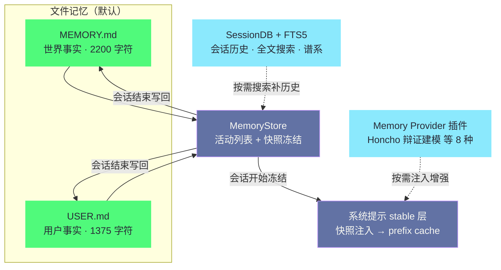

# 06 持久记忆——MEMORY.md/USER.md/Honcho

> [!abstract] 摘要
> [[05 技能系统——SKILL.md 与 agentskills.io 标准|上一篇]]完成了"程序性记忆"（技能）的拆解。本文转向"陈述性记忆"（事实）——Hermes 的持久记忆系统。文章从记忆架构开始——MEMORY.md（2200 字符限制，存储"关于世界的事实"）和 USER.md（1375 字符限制，存储"关于用户的事实"）——两个文件都有严格的字符限制，强制 Agent 只保留"高密度事实"。然后深入"快照缓存"机制——会话开始时从磁盘读取并冻结快照注入系统提示，因为快照在对话期间不变，prompt 可以被 prefix cache——节省 token 成本。接着讨论记忆的更新流程——MemoryStore 维护"活动列表"和"快照"，模型决定"存什么"——prompt 指导明确告诉模型"存储声明性事实，不存储命令"。然后深入 Honcho——辩证法用户建模的 Memory Provider 插件——提供超越文件记忆的"跨会话用户理解"。最后介绍 8 种 Memory Provider 插件（Honcho/OpenViking/Mem0/Hindsight/Holographic/RetainDB/ByteRover/Supermemory）和 Memory Provider ABC 的可插拔设计。核心认知：Hermes 的记忆系统是"双层"的——默认的文件记忆（MEMORY.md/USER.md）简单可靠但容量有限；插件化的 Memory Provider（如 Honcho）提供更深的用户建模但增加复杂度——用户可以按需选择。

---

## 第 1 章 记忆架构——MEMORY.md 与 USER.md

### 1.1 两种记忆文件

Hermes 的默认记忆系统基于两个文件：

| 文件 | 字符限制 | 存储内容 | 类比 |
| :--- | :--- | :--- | :--- |
| **MEMORY.md** | 2200 字符 | "关于世界的事实"——项目、环境、学到的知识 | 笔记本 |
| **USER.md** | 1375 字符 | "关于用户的事实"——偏好、习惯、背景 | 用户档案 |

**MEMORY.md 的内容例子**：
- "用户的项目 my-app 用 Python 3.11 和 FastAPI"
- "部署用 K8s，namespace 是 my-prod"
- "数据库是 PostgreSQL 15，host 在 10.0.0.5"
- "CI 用 GitHub Actions，测试框架是 pytest"

**USER.md 的内容例子**：
- "用户偏好简洁的回答，不喜欢冗长解释"
- "用户是 Python 开发者，对 Java 不熟"
- "用户时区是 UTC+8，工作时间 9-18"
- "用户喜欢用 git rebase 而非 merge"

从示例条目能读出好记忆条目的共同形态——**一句一个事实、带具体值、无过程描述**。"数据库是 PostgreSQL 15，host 在 10.0.0.5"是标准形态：主语明确（数据库）、值具体（PostgreSQL 15、10.0.0.5）、不含"因为/所以/然后"这类过程词。反例是"我们讨论过数据库的部署方案"——它记录的是事件不是事实，对后续对话没有直接用处。**记忆条目的质量标准接近"配置项"而非"叙述"**。

两个文件的分工边界可以用一个检验问题划清：**这句话的主语是"世界"还是"用户"**——"数据库在 10.0.0.5"主语是世界，进 MEMORY.md；"用户讨厌冗长解释"主语是用户，进 USER.md。这个划分看似简单，实际执行时有一批模糊地带——"用户的项目用 Python 3.11"既像世界事实（项目的技术栈）又像用户事实（用户的技术选择）——Hermes 把它归入 MEMORY.md，判据是"它描述的是项目的属性，即使用户换了也一样"。**归属模糊时看属性的从属对象，不看句子里提到谁**。

归属判断为什么重要？因为两个文件的容量预算不同、注入位置相同但更新节奏不同——放错文件的事实会占用错误的预算，或者在错误的时机被精简掉。用户手动核对记忆时，也值得用同一个检验问题过一遍——放错位置的事实，是记忆系统"看起来记得但用不对"的常见原因。

### 1.2 为什么有严格的字符限制

MEMORY.md 限制 2200 字符，USER.md 限制 1375 字符——这些限制是"有意为之"的：

**强制高密度**：字符限制强制 Agent 只保留"高密度事实"——即"最重要、最常被引用"的事实。如果没有限制，Agent 可能会把"每次对话的每个细节"都写入记忆——导致记忆膨胀、token 消耗增加、且"重要事实"被"琐碎细节"淹没。限制让 Agent 必须"取舍"——只保留"真正值得记住的"。

**Token 成本控制**：记忆文件在每次会话开始时注入系统提示——如果记忆文件很大，每次会话的 token 成本都很高。2200 + 1375 = 3575 字符 ≈ 约 1000-1500 tokens——这是一个"可接受"的系统提示增量——不会显著增加成本。

**认知科学类比**：人类的"工作记忆"容量有限（约 7±2 个信息块）——这种"有限"迫使人类"只记住重要的"。Hermes 的字符限制模拟了这种"有限容量"——迫使 Agent "像人类一样"只记住高价值信息。

这个类比还有一层延伸值得注意：人类记忆的瓶颈不只是容量，还有**写入的代价**——记一件事需要注意力，注意力是稀缺资源。Hermes 的对应物是"写入决策消耗模型的判断力"——每次"这值得记吗"的判断都在消耗对话中的注意力预算。字符限制把写入变成需要权衡的动作，恰好防止了模型把判断力浪费在琐碎事实的记录上。

**为什么 USER.md 比 MEMORY.md 限制更严**：USER.md（1375 字符）比 MEMORY.md（2200 字符）限制更严——这反映了"用户事实"应该比"世界事实"更精简。关于用户的核心信息（偏好、技能、时区）通常几条就够了——而关于项目和环境的信息可能更多（多个服务、多个配置）。这种"差异化限制"让两类记忆都保持"高密度"但承认"世界事实"通常比"用户事实"更多。

字符限制的代价也要摆在桌面上：**遗忘是强制性的**。2200 字符大约只够写 30-40 条短事实——第 41 条重要事实进来时，必须有旧事实离开。这个约束对简单用户是"健康的纪律"，对复杂环境是"真实的瓶颈"（第 7 章会展开）。Hermes 的态度不是假装瓶颈不存在，而是把瓶颈放在一个**用户可见、可手动干预**的位置——记忆是文本文件，满了可以自己精简，也可以换 Memory Provider——瓶颈被显式化了，就不再是隐患而是参数。

### 1.3 记忆与技能的分工

| 维度 | 记忆（MEMORY.md/USER.md） | 技能（SKILL.md） |
| :--- | :--- | :--- |
| **记忆类型** | 陈述性记忆（事实） | 程序性记忆（如何做） |
| **内容** | "是什么"——项目、偏好、环境 | "怎么做"——步骤、陷阱、验证 |
| **加载方式** | 自动注入系统提示 | 按需渐进式披露 |
| **容量限制** | 严格（2200/1375 字符） | 无硬限制（按需加载） |
| **更新频率** | 中（事实偶尔变） | 高（使用中 Refine） |
| **类比** | 笔记本/用户档案 | 操作手册 |

**协作场景**：当用户说"部署 my-app"时，Agent 从 MEMORY.md 知道"my-app 用 K8s，namespace 是 my-prod"（事实），从技能库加载"K8s 部署技能"（如何做）——两者结合让 Agent 既能"知道部署目标"又能"知道部署步骤"。

**认知科学对应**：这种"陈述性记忆 + 程序性记忆"的双系统设计直接对应认知科学中的"双记忆系统"——人类大脑中，陈述性记忆（事实）主要由海马体处理，程序性记忆（技能）主要由基底神经节处理——两者是不同的神经回路，可以独立受损（如某些失忆症患者记不住事实但仍能骑自行车）。Hermes 的设计无意中复现了这种"双系统"——MEMORY.md/USER.md 是"海马体"，SKILL.md 是"基底神经节"——这种对应不是巧合，而是"好的系统设计"自然趋同于"认知架构"。

双系统在 Hermes 里的物理隔离也值得注意——记忆文件和技能文件分属不同目录（`~/.hermes/` 下的 MEMORY.md/USER.md 与 skills/ 目录）、不同的管理工具（记忆工具 vs skill_manage）、不同的生命周期（事实偶尔变 vs 技能高频 Refine）。物理隔离保证了两个系统可以独立演化而不互相干扰——如果哪天 Hermes 重构记忆格式，技能文件一个字节都不用动。

值得补充的是双系统在**失效模式上的差异**，这解释了为什么两者的容量策略不同。陈述性记忆的错误是"静默的"——一条错误事实躺在记忆里，Agent 每次都会引用它，用户很难察觉（"Agent 一直以为我们用 PostgreSQL 14"）；程序性记忆的错误是"显性的"——步骤错了执行就会失败，失败触发 Refine 修补。**陈述性记忆的错误不会自己暴露，程序性记忆的错误会自己暴露**——所以陈述性记忆需要更严格的容量约束（减少错误藏身之处）和更积极的人工审查，而程序性记忆可以信任 Refine 的自我修复。容量限制的差异（2200/1375 vs 无硬限制）根源于此。

### 1.4 记忆的写入时机

记忆写入发生在什么时刻，对系统行为有微妙但重要的影响。Hermes 的模式是**会话中识别、会话中记录、会话后生效**：对话过程中 Agent 判断"这是个值得记的事实"，调用记忆工具写入活动列表（磁盘同步更新），但系统提示里的快照不变；新事实真正进入"Agent 的自我认知"，要等下次会话的快照冻结。这个三段式时序把"记录"和"生效"解耦了——记录可以实时（不丢信息），生效必须延迟（保缓存）。

对用户的实操含义是：**重要偏好在会话结束时值得口头确认一次**——"刚才说的这些我都记下了，对吗？"——这一问既验证了 Agent 的理解，也让用户对记忆内容有知情权。记忆系统的可靠性不只取决于机制，也取决于用户与它的核对习惯。

---

## 第 2 章 快照缓存机制

### 2.1 会话开始时的快照冻结

Hermes 的记忆系统有一个关键的"快照缓存"机制：

1. **会话开始时**——`load_from_disk` 读取 MEMORY.md 和 USER.md，冻结一个"快照"
2. **快照注入系统提示**——冻结的快照作为系统提示的一部分
3. **对话期间快照不变**——因为快照在对话期间不变，prompt 可以被 prefix cache
4. **对话结束后**——如果有新记忆，写入磁盘；下次会话开始时重新冻结

四步流程里最容易被误解的是第 3 步——"快照不变"不等于"会话中学不到东西"。对话期间产生的新事实照常进入活动列表、照常写磁盘，Agent 在当前会话中也能通过工具读取它们；不变的只是"系统提示里那份预注入的副本"。**变的是数据，不变的是提示**——把这句话记住，快照机制的所有行为就都能推演出来。

这个流程可以用 git 做一个贴切的类比：快照就像 checkout 出来的工作副本——会话开始时从"仓库"（磁盘上的记忆文件）检出一份只读副本，整个会话期间 Agent 都在这个副本上工作；会话中产生的新记忆像本地提交，先攒着；会话结束时统一 push 回仓库，下次 checkout 拿到的就是新版本。类比需要限定：git 的工作副本可写，而这里的快照只读——**会话中的记忆写入只进"活动列表"，不碰系统提示里的快照**——这个只读约束正是缓存有效性的前提。

### 2.2 为什么"冻结快照"重要

**Prefix Caching**：Anthropic 的 Claude API 支持"prefix caching"——如果多次 API 调用的 prompt 前缀相同，前缀部分可以被缓存——只计算"变化的部分"。Hermes 的系统提示结构是"stable → context → volatile"——记忆快照在"stable"层——如果快照在对话期间不变，"stable"层的前缀可以被缓存——显著节省 token 成本。

缓存失效的代价用一个简化场景量化（数字为示意量级）：

| 场景 | stable 层重算次数（30 次调用的会话） | 相对成本 |
| :--- | :--- | :--- |
| 快照全程不变 | 1 次（首次） | 基准 |
| 快照中途变更 1 次 | 2 段各自重算 | 约翻倍 |
| 每次学到新事实就更新提示 | 最多 30 次 | 接近无缓存 |

**跨会话 1 小时 prefix cache**：Hermes 的 prompt caching 是"跨会话"的——不只是"同一会话内"的 API 调用共享前缀缓存——而是"不同会话之间"在 1 小时内也共享。这意味着如果你在 10:00 和 Hermes 对话，10:30 再次对话——只要系统提示的"stable"层相同（记忆没变），前缀缓存仍然有效——10:30 的对话不需要重新计算"stable"层的 token。这种"跨会话缓存"对于"长驻 Agent"特别有价值——因为长驻 Agent 可能在一天内被多次访问——跨会话缓存显著降低总 token 成本。

**如果快照在对话期间变化**：假设 Agent 在对话中"学到了新事实"并立即写入 MEMORY.md——如果这个变化反映到系统提示——那么"stable"层的前缀就变了——prefix cache 失效——后续每次 API 调用都需要重新计算完整 prompt——成本大增。通过"冻结快照"——对话期间系统提示不变——prefix cache 保持有效——成本可控。

这笔成本账值得算得更具体一些。一个长对话可能有几十次 LLM 调用（每次工具调用后都要再调一次），系统提示的 stable 层如果有几千 token——快照每变一次，缓存就全灭一次，接下来所有调用的 stable 层都要全价重算。假设 stable 层 3000 tokens、对话 30 次调用、快照中途变了 3 次——缓存失效造成的重复计算就是数万 token 的输入费用。而"新记忆延迟几小时生效"的代价，对绝大多数事实是零——**用几乎无感的延迟换真金白银的缓存，这笔交易在长驻场景下接近稳赚**。

**新记忆何时生效**：新记忆在"当前会话"中不注入系统提示——但 Agent 可以通过"工具调用"读取最新记忆（如 `read_memory` 工具）。新记忆在"下次会话"开始时通过"重新冻结快照"生效。这种"延迟生效"是"快照缓存"的代价——但换来了"prefix cache 有效性"——在"成本"和"实时性"之间做了取舍。

> [!info] 核心概念：Prefix Cache 与记忆的"延迟生效"
> 这是 Hermes 记忆系统最精妙的设计——"冻结快照"让 prefix cache 有效（省成本），代价是"新记忆延迟到下次会话生效"（牺牲实时性）。对于"长驻 Agent"场景，这个取舍是合理的——因为"长驻 Agent"的会话可能持续很长时间（数小时到数天）——prefix cache 的节省非常可观——而"新记忆延迟几小时生效"通常可接受（大多数事实不需要"立即"记住）。但对于"需要即时记忆"的场景（如"用户刚说了偏好，Agent 立即应用"），延迟生效可能不理想——Agent 可以通过"工具调用读取最新记忆"来绕过这个限制。

### 2.3 快照机制的适用边界

快照机制的取舍并非在所有场景下都成立，它的适用前提值得显式列出。其一，**会话要足够长**——如果每个会话只有一两次调用，缓存节省有限，延迟生效的代价反而显眼；其二，**记忆的时效性要求要低**——"用户的项目用 K8s"这类事实几个月不变，延迟无感；"用户现在心情不好"这类瞬态根本不该进持久记忆。其三，**stable 层要足够大**——记忆快照只占系统提示的一部分，如果 stable 层本身很小，缓存的绝对节省也小。

三个前提可以压缩成一个自检问题：**你的会话模式是"长谈"还是"频闪"**——长谈模式（工作助手、结对编程）是快照机制的主场；频闪模式（一天几十个一句话会话）则要认真权衡。

反过来说，如果你的使用模式是"高频短会话 + 强时效偏好"，快照机制就不是最优解——这正是 Memory Provider 插件存在的意义之一：Honcho 等插件可以采用不同的注入策略（按需检索而非冻结快照），用缓存效率换实时性。**快照不是教条，是默认参数**——Hermes 把默认值设成了对多数人最优的选项，同时保留了换掉它的自由。

还有一个工程细节值得一提：快照冻结的时机是"会话开始"而非"进程启动"——这意味着长驻进程上先后到来的多个会话，各自拿到各自时点的快照。10:00 的会话冻结 10:00 的记忆，14:00 的会话冻结 14:00 的记忆（包含上午的新事实）——快照的粒度是会话而非进程生命周期。这个粒度选择让"延迟生效"的延迟上界就是"当前会话的剩余时长"，而不是"进程重启之前"。

---

## 第 3 章 记忆的更新流程

### 3.1 MemoryStore 的数据结构

MemoryStore 维护两个数据结构：
- **活动列表（live list）**——当前的记忆条目列表，可以增删改
- **快照（snapshot）**——会话开始时冻结的只读副本，注入系统提示

两个数据结构的职责分离，用一个对照表看清：

| 维度 | 活动列表 | 快照 |
| :--- | :--- | :--- |
| 可变性 | 可读可写 | 只读 |
| 所在位置 | 内存 + 磁盘 | 系统提示内 |
| 生效范围 | 工具读取可见 | 每次 LLM 调用可见 |
| 缓存影响 | 无 | 决定 prefix cache 命中 |
| 生命周期 | 跨会话持久 | 单会话有效 |

### 3.2 模型决定"存什么"

记忆的"内容决策"由 LLM 做出——Agent 在对话中判断"这个事实值得记住吗？"如果值得，调用记忆工具写入。prompt 指导明确告诉模型"存储声明性事实，不存储命令"：

**应该存储的**：
- 项目信息——"项目 X 用 Python 3.11"
- 环境信息——"数据库 host 在 10.0.0.5"
- 用户偏好——"用户喜欢简洁回答"
- 学到的知识——"API X 的限速是 100 req/min"

**不应该存储的**：
- 命令——"用 kubectl deploy"（这是技能的 Procedure，不是记忆）
- 临时状态——"当前正在处理 issue #123"（这是会话上下文，不是持久记忆）
- 琐碎细节——"用户刚才说了'谢谢'"（无长期价值）

"存事实不存命令"这条规则值得多看一眼，因为它实质上是**记忆系统与技能系统的边界在 prompt 层的执行**。命令是程序性知识——"怎么部署"属于技能的 Procedure 段，由学习闭环负责提炼和管理；事实是陈述性知识——"部署到哪个集群"属于记忆。如果放任模型把命令写进记忆，会出现两个系统抢地盘的混乱：同一条部署知识在技能里有、在记忆里也有，两处内容随时间漂移不一致——Agent 到底听谁的？边界划清后，每个系统只维护自己那一类知识——**单一事实源原则，在两个记忆子系统之间同样适用**。

这条规则还有个实用的检验方法：把候选记忆条目念出来，问一句"这句话换个环境还成立吗"。"数据库 host 在 10.0.0.5"换个环境就不成立——但它是事实，成立与否由世界决定，记忆照记；"用 kubectl rollout restart 部署"换个环境可能照样成立——但它是命令，它的归宿是技能的 Procedure。**判断标准不是"是否通用"，而是"是描述还是指令"**——描述进记忆，指令进技能。

### 3.3 记忆的"密度管理"

由于字符限制，Agent 需要"管理记忆密度"——当记忆满了，新记忆需要"挤掉"旧记忆。这个过程也是 LLM 做的——Agent 判断"哪些旧记忆不再重要，可以删除"——如"项目 X 已经完成，相关记忆可以删除"。这种"密度管理"让记忆保持"高价值"——不会因为"满了"而无法记新事实。

密度管理的触发时机也值得明确：不是"每次写入都触发"，而是"容量逼近上限时"——大部分时间记忆有条不紊地增长，只在接近预算时才进入"取舍模式"。这种惰性触发让密度管理的开销（LLM 的评估与确认对话）保持在低频——**管理动作本身也要节约注意力**。

**密度管理的风险**：LLM 可能"错误地删除"仍然重要的记忆——如"项目 X 虽然完成了但用户可能还会问"——如果 Agent 删除了项目 X 的记忆，下次用户问时 Agent 不记得了。缓解方案是"删除前确认"——Agent 可以说"项目 X 看起来完成了，要删除相关记忆吗？"——让用户决定。

**密度管理的"遗忘"类比**：人类的记忆有"遗忘"机制——不重要的信息会逐渐遗忘——这其实是"好事"——因为"遗忘"让"重要信息"更容易被回忆（不被琐碎信息干扰）。Hermes 的密度管理模拟了这种"有益的遗忘"——通过删除"不再重要"的记忆，让"重要记忆"在有限容量中保持"可访问"。这种"主动遗忘"与"被动丢失"不同——被动丢失是"bug"，主动遗忘是"feature"——它让记忆系统"保持健康"而非"无限膨胀"。

密度管理还有一个兜底值得知道：即使 Agent 误删了记忆，**被删的信息往往并没有真正丢失**——对话历史还在 SessionDB 里，FTS5 还能搜到。记忆是"策展层"——它决定"哪些事实始终在场"；会话历史是"档案层"——它保存"曾经发生的一切"。策展层删掉的条目，档案层仍然可查——这层冗余设计让"主动遗忘"的风险从"信息永久丢失"降级为"信息不再主动在场"——两者的可恢复性天差地别。

密度管理的实操建议也顺带给出：与其等记忆满了让 Agent 被动"挤"，不如**主动做减法**——项目收尾时主动说"项目 X 已交付，相关记忆可以清理了"。主动清理发生在用户清醒判断的时刻，误删风险远低于 Agent 在容量压力下的被动取舍——把遗忘的时机掌握在自己手里，是密度管理最省心的用法。

### 3.4 显式记忆——/remember 与手动编辑

除了 Agent 的自动判断，记忆还有两条"人工通道"。其一是 `/remember` 命令——用户显式说"记住这个"，Agent 绕过自己的价值判断直接写入——适合"用户知道重要但 Agent 可能意识不到"的信息（与技能系统的 `/learn` 完全同构）。其二是直接编辑文件——MEMORY.md/USER.md 就是普通文本，任何编辑器都能改——适合批量修正（"Agent 把我的时区记错了，顺手改掉"）。

两条人工通道与自动机制的关系是**兜底而非并行**：自动判断覆盖 95% 的日常（用户不用操心），人工通道处理剩下的 5%（高价值、高敏感、或 Agent 反复记错的）。这个比例感很重要——如果发现自己频繁手动改记忆，说明 Agent 的记忆判断与你的期望有系统性偏差，值得检查是不是模型能力或 prompt 指导的问题，而不是继续人肉打补丁。

---

## 第 4 章 Honcho——辩证法用户建模

### 4.1 Honcho 的定位

Honcho 是一个 Memory Provider 插件——提供超越文件记忆的"跨会话用户理解"。如果说 MEMORY.md/USER.md 是"静态事实记录"，Honcho 是"动态用户建模"——它不只记录"用户说了什么"，还试图理解"用户是什么样的人"。

### 4.2 "辩证法"用户建模

Honcho 的"辩证法"（dialectic）用户建模是一个哲学化的概念——它不把用户偏好视为"固定的事实"，而是视为"通过对话不断演化的理解"。

**传统用户建模的局限**：传统方式把用户偏好记录为"事实"——如"用户喜欢简洁回答"。但用户偏好不是固定的——同一个用户在不同场景下可能偏好不同——如"工作时喜欢简洁，学习时喜欢详细解释"。传统方式无法捕获这种"上下文相关的偏好"。

**Honcho 的辩证法**：Honcho 通过"对话"不断"修正"对用户的理解——如用户先说"喜欢简洁回答"，后来在某个场景下说"这个问题请详细解释"——Honcho 不会简单地"覆盖"之前的偏好，而是"辩证地"理解——"用户通常喜欢简洁，但在复杂问题上偏好详细"——这种"辩证理解"比"固定事实"更准确。

**Honcho 的辩证法**：Honcho 通过"对话"不断"修正"对用户的理解——如用户先说"喜欢简洁回答"，后来在某个场景下说"这个问题请详细解释"——Honcho 不会简单地"覆盖"之前的偏好，而是"辩证地"理解——"用户通常喜欢简洁，但在复杂问题上偏好详细"——这种"辩证理解"比"固定事实"更准确。

辩证建模对记忆条目的影响是结构性的：传统记忆里"用户喜欢简洁回答"是一条独立事实，可以被单独编辑和删除；辩证建模里同样的偏好变成了"带条件的模式"——它由多条观察支撑，修改它意味着修改整个理解结构。这既是优点（理解更鲁棒，单次误观察不会扭曲画像）也是代价（理解不再透明可编辑）。**表达能力的提升，必然伴随直接操纵能力的下降**——这是所有从"记录"走向"建模"的系统的共同交换。

"辩证法"这个词从哲学借来，用在记忆系统上其实非常精确——黑格尔的"正题-反题-合题"结构在这里清晰可见：正题是"用户喜欢简洁"（早期观察），反题是"用户要求详细解释"（新观察），合题是"通常简洁、复杂问题详细"（更高层次的理解）。传统记忆系统遇到反题时的处理是"覆盖正题"——最后一次发言获胜——这丢掉了历史模式；辩证建模的处理是"合成"——新旧观察都成为理解的素材。**覆盖是存量的更新，合成是理解的演化**——两者产出的东西有本质区别：前者是快照，后者是模型。

### 4.3 Honcho 与文件记忆的协作

Honcho 不"替换"文件记忆——而是"补充"——文件记忆提供"基础事实"（如"用户是 Python 开发者"），Honcho 提供"深层理解"（如"用户在调试时倾向系统性方法，在设计时倾向直觉性方法"）。两者结合让 Agent 既有"基础事实"又有"深层理解"。

这个"补充而非替换"的架构选择，与第 05 篇"技能包组合而不合并"是同一条设计价值观：**分层各司其职，不做大而全的单体**。文件记忆的强项是透明（文本文件人人可读可改）、零依赖、可预测；Honcho 的强项是理解深度。让透明层保底、深度层增强，比让任何一个系统独自承担全部记忆职责更稳健——深度层出问题时，基础事实仍然在文件里完好无损。

这个分层还有一个容错上的细节：两层的数据流是单向依赖的——Honcho 可以读文件记忆做底料，但文件记忆不依赖 Honcho 的任何输出。依赖方向单一意味着故障隔离：Honcho 挂掉或被移除，文件记忆原样运转，Agent 退化为"基础模式"而非"瘫痪模式"。**增强组件的失效不应该拖垮基础系统**——这是所有"默认 + 增强"架构的通用验收标准。

### 4.4 Honcho 的"跨会话"特性

Honcho 的"跨会话用户理解"是它的核心价值——它不只在"当前会话"理解用户，而是"跨所有会话"积累理解。如用户在 1 月的会话中说"喜欢 TDD"，在 3 月的会话中说"这个项目用集成测试"——Honcho 会"辩证地"理解——"用户通常偏好 TDD，但在某些项目上用集成测试"——这种"跨会话辩证理解"让 Agent 的"用户画像"越来越精确。

**与"快照缓存"的关系**：Honcho 作为 Memory Provider 插件，可能不受"快照缓存"的字符限制——它可以维护更大量的"用户理解数据"——只在需要时把"相关部分"注入系统提示。这种"按需注入"让 Honcho 可以处理比 1375 字符更丰富的用户画像——而不受文件记忆的容量限制。但这也带来了"prefix cache 效率"的挑战——如果 Honcho 每次注入的"相关部分"不同，前缀缓存可能失效——Honcho 需要在"丰富性"和"缓存效率"之间做平衡。

这个"丰富性 vs 缓存效率"的张力没有免费解法，但有几个工程上的缓解方向值得了解：把 Honcho 的注入放在系统提示的 volatile 层（本就每次变化，不破坏 stable 层缓存）；按任务类型缓存"理解摘要"（同类任务复用同一份注入）；或者干脆接受缓存损失——如果 Honcho 的深度理解带来的质量提升足够大，多付的 token 费就是它的价格。**没有哪个 Memory Provider 在所有维度上最优——选择的过程就是给这些维度排优先级的过程**。

### 4.5 什么时候值得上 Honcho

辩证建模的价值听起来诱人，但它不是免费午餐——判断"是否需要 Honcho"可以用三个问题过滤：

| 问题 | 如果答案是"否" | 如果答案是"是" |
| :--- | :--- | :--- |
| 你的偏好是否随场景明显变化？ | 文件记忆足够 | 文件记忆会持续记错 |
| 交互频率是否足够高？ | 低频使用，建模数据积累慢 | 高频交互，画像收敛快 |
| 你是否在意"被 Agent 理解"的隐私代价？ | 在意则留文件层 | 接受涌现画像的审计成本 |

三个问题里有两个以上指向"需要"，Honcho 的价值才能覆盖它的成本。特别提醒第二问：辩证建模需要**足够的对话量**才能形成有意义的理解——一个月用三次的 Agent，积累不出有价值的用户模型——低频用户装 Honcho 基本是纯成本。

---

## 第 5 章 Memory Provider 插件生态

### 5.1 8 种 Memory Provider

Hermes 支持 8 种 Memory Provider 插件——除了 Honcho，还有：

| Provider | 特点 |
| :--- | :--- |
| **Honcho** | 辩证法用户建模，跨会话用户理解 |
| **OpenViking** | 开源记忆解决方案 |
| **Mem0** | 记忆管理平台 |
| **Hindsight** | 事后记忆分析 |
| **Holographic** | 全息记忆——多维记忆检索 |
| **RetainDB** | 基于数据库的记忆存储 |
| **ByteRover** | 记忆漫游——跨实例记忆共享 |
| **Supermemory** | 超级记忆——增强记忆能力 |

8 个插件覆盖了记忆问题的几个正交维度：存储介质（文件/数据库）、组织方式（事实列表/多维检索/用户模型）、作用范围（单实例/跨实例）、时间特性（实时/事后分析）。这个生态的存在本身就是一个信号——**"Agent 该怎么记东西"在 2026 年仍是一个开放问题**——没有公认最优解，所以市场用多样性来探索。对用户来说，这既是自由也是负担：选型需要理解自己的记忆负载特征。

给选型者一个降低认知负担的简化框架——先回答两个问题：**数据要不要出本机**（隐私约束）和**记忆要不要跨实例共享**（部署形态）。前者过滤掉所有外部服务型 Provider，后者直接筛出 ByteRover 这类跨实例方案。两个硬约束筛完，剩下的候选通常只剩一两个，再比较细节不迟——**先用硬约束做排除法，再用偏好做选择题**，比对着功能清单逐项打分高效得多。

### 5.2 Memory Provider ABC 的可插拔设计

所有 Memory Provider 都实现 `memory_provider.py` 中定义的 ABC（Abstract Base Class）——这个 ABC 定义了"记忆提供者"的标准接口——如"读取记忆"、"写入记忆"、"搜索记忆"等。第三方可以通过实现这个 ABC 来提供自己的记忆后端——如"基于向量数据库的记忆"或"基于图数据库的记忆"。

**可插拔的价值**：可插拔设计让"记忆后端"可以按需选择——个人用户用默认的文件记忆就够了；企业用户可能需要"基于向量数据库的记忆"来处理大量用户数据；研究者可能需要"自定义记忆策略"来实验新的记忆方法。这种"按需选择"让 Hermes 的记忆系统可以适应不同场景——而非"一刀切"。

从生态健康的角度看，ABC 接口还有一个隐性贡献——**它让记忆研究的实验成本大幅下降**。研究者不需要 fork 整个 Hermes 来试验新的记忆策略——实现一个 ABC、装上、跑数据、卸掉。Agent 框架成为记忆研究的实验床，研究成果又反过来丰富插件生态——这种"产品与研究共用基础设施"的安排，与第 01 篇讲的"研究就绪"理念一脉相承。

ABC 接口的粒度选择也值得一提——"读取、写入、搜索"三个原语，刻意保持在小而稳的层面。记忆研究的前沿变化很快（今天流行向量检索，明天可能是图结构或生成式召回），但"读写搜"的基本操作不会变——**接口定义在变化最慢的那一层，实现自由度才最大**。这与第 03 篇 ContextEngine ABC 的设计逻辑一致：Hermes 的可插拔点都选在"技术演化最快、但功能契约最稳定"的位置。

### 5.3 选择 Memory Provider 的考量

| 场景 | 推荐 Provider | 理由 |
| :--- | :--- | :--- |
| **个人用户** | 默认文件记忆 | 简单、零依赖、足够用 |
| **需要深层用户理解** | Honcho | 辩证法建模 |
| **大量用户数据** | RetainDB / Mem0 | 数据库存储 |
| **跨实例记忆共享** | ByteRover | 跨实例同步 |
| **研究实验** | 自定义 ABC 实现 | 完全控制 |

这张表里"个人用户 → 默认文件记忆"一行值得特别强调——**默认选项就是多数人的最优选项**。插件生态的丰富容易制造"不装插件就吃亏"的错觉，但记忆插件引入的是真实的成本：额外依赖、数据迁移、缓存效率损失、审计复杂度。文件记忆的 3575 字符对"一个用户 + 几个项目"的场景绰绰有余——先跑满默认系统的能力，再考虑升级——这个顺序不建议颠倒。

### 5.4 Memory Provider 的"切换成本"

切换 Memory Provider 不是"零成本"——已有的记忆数据可能需要"迁移"——如从文件记忆迁移到 Honcho，需要把 MEMORY.md/USER.md 的内容"导入"Honcho 的格式。且不同 Provider 的"记忆格式"可能不兼容——如 Honcho 的"辩证理解"无法简单导出为"文件记忆的事实列表"。

**缓解方案**：Hermes 的 Memory Provider ABC 定义了"标准接口"——如果所有 Provider 都支持"导出为标准格式"和"从标准格式导入"——那么切换时可以"导出 → 导入"。但"辩证理解"等"高级特性"可能无法在"标准格式"中表达——切换到简单 Provider 会"丢失"这些高级理解。这种"切换成本"让"Provider 选择"成为一个"长期决策"——不建议频繁切换。

切换成本的不对称性值得点破：从简单到复杂的迁移是**无损的**（事实列表可以完整导入任何更丰富的系统），从复杂到简单的迁移是**有损的**（辩证理解无法降维成事实列表而不丢失）。这决定了尝试的合理方向——**可以先试高级 Provider，不满意随时退回文件记忆（只损失高级理解，不损失基础事实）；但一旦深度依赖高级特性，回退的代价就随时间增长**。与所有"升级容易降级难"的系统一样，关键决策点在"开始依赖高级特性之前"。

### 5.5 插件生态的治理观察

8 个 Provider 并存也带来一个生态治理问题：**谁为插件记忆的质量和安全负责**。文件记忆由 Hermes 核心维护，质量与安全随主项目发版保证；第三方 Provider 的实现质量参差，而记忆又是 Agent 最敏感的数据资产——一个有缺陷的 Provider 可能静默丢失记忆，甚至把记忆数据发往外部服务。选择第三方 Provider 时，至少核对三件事：数据存储位置（本地还是外部服务）、项目的维护活跃度、是否实现了审计接口。**记忆插件的选型标准应该比工具插件更严**——工具坏了损失一次执行，记忆坏了损失的是 Agent 对你的全部理解。

---

## 第 6 章 记忆与会话搜索（FTS5）

### 6.1 FTS5 全文搜索

除了"持久记忆"（MEMORY.md/USER.md），Hermes 还有"会话搜索"——基于 SQLite FTS5 的全文搜索。会话历史存储在 SQLite 数据库中，FTS5 索引让 Agent 可以"搜索过去的对话"。理解这一层的关键是：**它搜索的对象是"逐字的对话记录"，不是"Agent 的理解"**——记忆层存理解，搜索层存原话，两者不可互替。

会话搜索能回答的问题类型，持久记忆都覆盖不了：

- 追溯细节——"上次讨论那个方案时我们否决了什么理由？"
- 时间线重建——"这个 bug 从报告到修复经历了哪些环节？"
- 找回上下文——"三周前你帮我写的那个脚本放在哪个路径？"

这些问题的共同点是**答案在历史里而不在"当前事实"里**——它们需要的不是"知道"，而是"查档"。

### 6.2 记忆 vs 会话搜索的分工

| 维度 | 持久记忆（MEMORY.md/USER.md） | 会话搜索（FTS5） |
| :--- | :--- | :--- |
| **内容** | Agent 策展的"高密度事实" | 完整的对话历史 |
| **容量** | 有限（2200/1375 字符） | 大（SQLite 数据库） |
| **加载** | 自动注入系统提示 | 按需搜索 |
| **时效** | 当前有效 | 历史快照 |
| **用途** | "知道"用户和项目 | "回忆"过去对话 |

**协作场景**：当用户问"我上周跟你说过的那个 bug 是什么"——Agent 用 FTS5 搜索"bug"找到过去对话——然后从搜索结果中提取相关信息。持久记忆不会存"上周的 bug"（太具体）——但会话搜索能找到。两者互补——持久记忆提供"当前事实"，会话搜索提供"历史细节"。

两者还有一个容易被忽略的协作模式——**搜索结果反哺记忆**。当 Agent 通过 FTS5 找到某段历史并发现它其实"反复被引用"（譬如某个 API 的怪癖被问了三次），这就是一个"该升级为持久记忆"的信号——从档案层晋升到策展层。理想情况下这个升级可以自动发生（与学习闭环的触发条件逻辑同构），当前版本更多依赖用户显式说"记住这个"。策展层的维护成本，因此可以在"自动晋升"方向上继续演进。

用图书馆来类比这套双层结构：持久记忆是**图书管理员脑子里的卡片目录**——容量小但常在手边，"这个馆有什么"一问即答；会话搜索是**书库本身**——容量大但要走过去查。日常问题问卡片目录，深度追溯进书库。两个层次缺一不可——只有卡片目录，馆里的书等于不存在；只有书库，每个简单问题都要跑一趟库房。Hermes 的记忆架构，本质上是在"常驻成本"和"召回能力"之间做分层——**贵的注意力留给高频事实，便宜的存储承接全部历史**。

### 6.3 LLM 摘要的跨会话召回

Hermes 的会话搜索不仅返回"原始对话"——还可以用 LLM 对搜索结果做"摘要"——如"搜索到 5 条关于 bug 的对话，摘要如下..."。这种"LLM 摘要的跨会话召回"让 Agent 不会"淹没在搜索结果中"——而是获得"提炼后的相关信息"。

**FTS5 + LLM 摘要的工程价值**：FTS5 是"关键词匹配"——它返回"包含关键词的对话片段"——但可能返回很多片段，且片段之间可能"重复"或"矛盾"。LLM 摘要把这些片段"整合"为一个"连贯的摘要"——如"用户在 3 月 1 日报告了 bug X，3 月 5 日提供了更多细节，3 月 10 日 bug 被修复"——这种"时间线摘要"比"原始片段列表"更有用。这种"检索 + 摘要"是 RAG（Retrieval-Augmented Generation）的一种形式——但用于"自身历史"而非"外部知识"。

"对自身历史做 RAG"这个定位值得展开——它比"对外部知识做 RAG"有一个独特的优势：**语料是同源的**。外部 RAG 的检索结果来自不同作者、不同立场的文档，整合时要做来源可信度判断；自身历史的语料全部来自"Agent 与用户的真实交互"，不存在可信度问题，摘要可以直接聚焦在"事件的时间线与因果"上。这解释了为什么 FTS5 + LLM 摘要在记忆场景的效果通常好于通用 RAG——**检索质量的上限，一半取决于语料本身的一致性**。

对成本敏感的用户还要知道：检索 + 摘要是"双份 LLM 开销"——一次搜索调用、一次摘要调用。日常闲聊不值得触发这条链路，它的适用场景是"明确的回溯型问题"——用户在问历史时才值得为摘要付费。好的实现会把"是否需要摘要"也交给模型判断，而不是每次搜索都强制摘要。

**与会话谱系的关系**：如第 03 篇提到的，会话有"谱系追踪"——压缩前的完整历史保存在"子会话"中。FTS5 搜索可以"跨谱系"——不只搜索当前会话，还搜索"祖先会话"（压缩前的完整版本）——这让"被压缩掉的旧内容"仍然可搜索。这种"谱系 + FTS5"确保了"信息不会因压缩而永久丢失"——即使被压缩，仍然可以通过搜索找到。

### 6.4 会话搜索的隐私面

会话搜索的强大召回能力有一面需要正视：**它让"说过的每一句话"都变得可检索**。对话历史里的随口一提、情绪化表达、敏感信息（密码片段、私人事务），都会躺在 FTS5 索引里等待被搜出。对个人自托管用户，这些数据在自己机器上，风险可控；但如果记忆数据或会话库被同步到第三方 Provider，检索能力的增强同步放大了泄露面。务实的对策是：敏感对话用独立 profile 隔离（不同 profile 的会话库分离）、定期清理含敏感内容的旧会话、把"会话库也是敏感数据"纳入自托管的备份与权限规划——**搜索能力每增强一分，对数据治理的要求就提高一分**。

---

## 第 7 章 记忆的局限性与改进方向

### 7.1 局限一：字符限制可能"太严"

2200/1375 字符限制对于"复杂项目"可能太严——如一个有 10 个微服务的项目，每个服务的信息（技术栈、host、端口）可能就超过 2200 字符。Agent 需要"取舍"——可能删除一些"仍然有用"的信息来腾空间。

**缓解方案**：使用外部 Memory Provider（如 RetainDB）——数据库存储没有字符限制。或者"分层记忆"——MEMORY.md 只存"最核心的"，详细信息存到"项目文档"——Agent 通过文件工具读取。

分层记忆值得多讲一句，因为它是**不换系统就能扩容**的方案：项目文档（如 `docs/services.md`）本来就是 Agent 可读的文件，把"每个服务的详细信息"写在那里，MEMORY.md 只留一行"服务详情见 docs/services.md"。核心事实仍然常驻系统提示，长尾细节按需读取——本质上这是把 FTS5"按需检索"的思想手动应用到了记忆管理上。多数"容量不够"的抱怨，用这一招就能化解，不必急着上数据库。

### 7.2 局限二：记忆的"准确性"依赖 LLM 判断

"存什么"由 LLM 决定——LLM 可能"错误判断"——如把"临时状态"当"持久事实"存——或"忽略"用户说的重要偏好。这种"准确性"依赖 LLM 的语义理解能力——弱模型可能记忆质量差。

**缓解方案**：用户可以手动编辑 MEMORY.md/USER.md——纠正 Agent 的错误记忆。或用 `/remember` 命令显式告诉 Agent "记住这个"——绕过 Agent 的自动判断。

记忆错误还有一个比"存错"更隐蔽的形态——**该存的没存**。存错的事实会在后续对话中暴露（Agent 说出错误信息，用户纠正）；漏存的偏好则完全静默——Agent 表现得"不够贴心"，用户却说不清哪里不对。对这种静默失效，唯一的系统性对策是**定期回顾记忆文件**——把它当成 Agent 的"绩效评估"：看它记住了什么、漏了什么、哪些理解已经过时。记忆审查应该成为长驻 Agent 运维的例行项目，频率不必高——每月一次足矣。

### 7.3 局限三：快照缓存的"延迟生效"

如第 2.2 节讨论的，新记忆延迟到"下次会话"生效——对于"需要即时应用"的偏好可能不理想。

**缓解方案**：Agent 可以通过"工具调用读取最新记忆"绕过延迟——但需要 Agent "意识到"需要读取——这本身依赖 LLM 判断。

"需要意识到"这个前提是缓解方案的软肋——它把兜底的责任又压回了模型判断。更可靠的变体是**在写入记忆时打上"即时生效"标记**：用户说"从现在开始……"这类短语时，Agent 把该事实同时注入 volatile 层（当前会话立即可见）和持久记忆（跨会话保留）——volatile 层本就每次变化，不破坏缓存。这个模式把"即时性"变成显式的数据流路径，而不是依赖模型"想起来去读"。

### 7.4 改进方向：主动记忆验证

类似技能的"主动验证"——Agent 可以定期"验证"记忆是否仍然准确——如"MEMORY.md 说项目 X 用 Python 3.11——验证一下是否仍然如此"。这种"主动验证"防止"过时记忆"误导——但成本较高。这个方向目前 Hermes 还没有实现。

主动验证在记忆场景比在技能场景更有可行性，因为**很多记忆可以低成本地对照现实**："项目用 Python 3.11"可以读 pyproject.toml 验证，"数据库在 10.0.0.5"可以 ping 一下，"CI 用 GitHub Actions"可以看 .github 目录。技能验证要"完整跑一遍流程"（成本高），记忆验证大多只需"读一个文件"（成本极低）。这意味着"记忆的自动保鲜"在工程上比"技能的自动保鲜"更近——如果 Hermes 未来实现这个方向，优先验证"可机器对照"的事实条目会是合理的切入点。

### 7.5 局限四：记忆的"隐私与审计"挑战

Hermes 的记忆文件存储在 `~/.hermes/` 目录——用户可以随时查看和编辑。但"Memory Provider 插件"（如 Honcho）的记忆可能存储在外部数据库中——用户可能难以"审查"Agent 对自己的"理解"。如 Honcho 的"辩证理解"可能是"涌现的"——没有简单的"文件"可以查看——用户不知道 Agent "认为自己是什么样的人"。

**隐私设计原则**：好的记忆系统应该遵循"用户控制"原则——用户可以：1）查看（Agent 记住了什么）；2）纠正（不对，删除这条）；3）导出（把记忆导出为可移植格式）；4）删除（完全清除记忆）。Hermes 的文件记忆天然支持这些（就是文本文件）——但 Memory Provider 插件需要额外实现"审计接口"——让用户可以审查插件维护的"用户画像"。这是 Memory Provider 生态需要解决的隐私问题——尤其是在 GDPR 等隐私法规下，"用户对自己画像的知情权"是法律要求，不可忽视。

把四项隐私权利与两层记忆对照，可以画出一张"审计能力矩阵"：

| 权利 | 文件记忆 | Memory Provider 插件 |
| :--- | :--- | :--- |
| 查看 | 天然支持（打开文件） | 需要插件提供审计接口 |
| 纠正 | 直接编辑文本 | 需要纠错 API 或重新对话 |
| 导出 | 天然支持（复制文件） | 取决于标准导出格式 |
| 删除 | 删文件即完成 | 需要彻底清除后端数据 |

这张矩阵揭示了文件记忆一个常被低估的优点——**它的隐私属性是"结构保证"的，不依赖任何功能的正确实现**。文本文件就在那里，四项权利天然成立；插件的隐私能力则是"功能承诺"——承诺可能落空。对隐私敏感的用户，这本身就是选择默认文件记忆的理由。

### 7.6 局限的应对优先级

四个局限的日常应对优先级，按"遇到频率 × 应对成本"排序：

| 局限 | 遇到频率 | 应对动作 | 成本 |
| :--- | :--- | :--- | :--- |
| 记忆不准/漏记 | 中 | 定期回顾记忆文件 + /remember 显式补充 | 每月几分钟 |
| 快照延迟生效 | 低 | 即时偏好在会话内口头强调 | 零成本习惯 |
| 容量不足 | 低（个人场景） | 分层记忆或换 Provider | 一次性配置 |
| 插件审计难 | 取决于是否用插件 | 选型时核查审计接口 | 选型时一次 |

值得注意的是"容量不足"的排名比直觉靠后——多数个人用户远未用满 3575 字符；真正高频发生的是"记错"和"漏记"，而它们的应对（定期回顾 + 显式指令）都是习惯问题而非技术问题。**记忆系统的运维，七分靠习惯三分靠配置**。

---

## 第 8 章 总结与下一篇导读

### 8.1 本文核心要点

1. **两种记忆文件**——MEMORY.md（2200 字符，世界事实）+ USER.md（1375 字符，用户事实）——严格字符限制强制高密度
2. **快照缓存机制**——会话开始时冻结快照注入系统提示，对话期间不变——支持 prefix cache——节省 token 成本——代价是新记忆延迟到下次会话生效
3. **模型决定"存什么"**——prompt 指导"存储声明性事实，不存储命令"——MemoryStore 维护活动列表和快照
4. **密度管理**——记忆满时 LLM 决定"删除什么"——风险是可能误删重要记忆——缓解是删除前确认
5. **Honcho 辩证法用户建模**——不把偏好视为固定事实，而是通过对话不断演化的理解——捕获"上下文相关的偏好"
6. **8 种 Memory Provider**——Honcho/OpenViking/Mem0/Hindsight/Holographic/RetainDB/ByteRover/Supermemory——通过 ABC 可插拔
7. **记忆 vs 会话搜索**——持久记忆（策展事实/有限容量/自动加载）vs FTS5 会话搜索（完整历史/大容量/按需搜索）——互补
8. **LLM 摘要的跨会话召回**——FTS5 搜索 + LLM 摘要——避免淹没在搜索结果
9. **局限性**——字符限制可能太严、准确性依赖 LLM、快照延迟生效——缓解方案包括外部 Provider、手动编辑、主动验证

收官前把整个记忆体系拼成一张全景图，各组件的位置与关系一目了然：

回望全篇，Hermes 记忆系统的设计哲学可以浓缩成一句话——**用最笨的存储（文本文件）承载最核心的智能资产（对用户和世界的理解），把聪明留给决策而不是存储**。字符限制、快照冻结、事实与命令分离、策展与档案分层——每一个机制都在对抗同一种诱惑："既然模型这么聪明，为什么不建一个更聪明的记忆系统"。答案藏在维护成本里：聪明的系统需要聪明的维护，笨的系统谁都能修——**记忆是 Agent 最不能坏的部分，所以它必须是最简单的部分**。

### 8.2 常见误区与澄清

记忆系统有几个高频误读，收官前逐一澄清：

| 误解 | 事实 |
| :--- | :--- |
| "记忆 = 完整对话历史" | 记忆是策展的高密度事实，完整历史在 SessionDB——两层分工不同 |
| "2200 字符太小是缺陷" | 限制是特性——强制高密度、控制成本、暴露取舍 |
| "新记忆立即生效" | 快照机制下延迟到下次会话生效——即时需求走工具读取 |
| "装记忆插件一定更好" | 插件有迁移、缓存、审计成本——默认文件记忆是多数人的最优解 |
| "Agent 记错了没法改" | 记忆是文本文件——直接编辑即可，这是设计而非 hack |

其中"记忆 = 对话历史"这条最值得展开，因为它混淆了两个存储层。如果记忆就是历史，那记忆系统要解决的就只是存储容量问题——加磁盘就行；但 Hermes 的记忆是**策展**——从海量交互中主动挑选"值得始终在场"的少量事实——这是一个注意力分配问题，不是存储问题。策展意味着有取舍、有遗漏、有过期——这些不是 bug，是"记忆"这个词的本义。理解了这一点，"为什么记忆会漏、会错、需要人工核对"就不再奇怪——**人类的记忆同样如此**。

### 8.3 下一篇导读

下一篇 [[07 多平台网关——25+ 适配器的统一消息路由]] 将从"记忆"转向"消息平台"——深入 Hermes 的多平台网关架构。基于 GatewayRunner 的消息分发流程、SessionStore 的跨平台会话路由、DM pairing 授权机制、25+ 平台适配器（内置 + 插件）的统一抽象、Hook 系统的生命周期事件、跨平台消息镜像、以及语音消息转写和原生媒体投递。

> [!info] 专栏导航
> 本文是 [[00 专栏导览|Hermes Agent 专栏]] 的第 6 篇，"核心架构"部分的第 4 篇——完成"核心架构"部分后，下一篇开始"平台与工具"部分。

---

## 参考文献

1. Hermes Agent Persistent Memory 文档. https://hermes-agent.nousresearch.com/docs/user-guide/features/memory
2. Hermes Agent Memory Providers 文档. https://hermes-agent.nousresearch.com/docs/user-guide/features/memory-providers
3. Hermes Agent Honcho Memory 文档. https://hermes-agent.nousresearch.com/docs/user-guide/features/honcho-memory
4. How Hermes Agent Achieves Self-Improving AI Through Memory. https://www.besthub.dev/articles/how-hermes-agent-achieves-self-improving-ai-through-memory-skills-and-nudge-engine-39749dd09a61
5. Hermes Agent Architecture Deep Dive. https://zooclaw.ai/help/en/2026-04-23/hermes-agent-architecture-learning-loop-deep-dive/

---

## 思考题

1. **MEMORY.md 的 2200 字符限制强制"高密度"——但也可能让 Agent "忘记"重要信息。如果你有一个复杂项目（10 个微服务），每个服务的信息都重要——2200 字符存不下。你会如何解决？用外部 Memory Provider？还是分层记忆？** 提示：考虑"信息分层"——MEMORY.md 只存"最常引用的核心信息"（如"项目用 K8s，namespace 是 my-prod"），详细信息存到"项目文档文件"（如 `project-services.md`）——Agent 通过文件工具按需读取。这种"分层"让"核心信息"在系统提示中（快速访问），"详细信息"在文件中（按需访问）——平衡了"容量"和"访问速度"，是一种实用的工程折中方案与思路。

2. **快照缓存的"延迟生效"让新记忆在下次会话才生效。但如果用户在当前会话中说"从现在开始，回答用英文"——这个偏好应该"立即"生效，而非"下次会话"。如何解决"需要即时生效"的偏好？** 提示：考虑"即时偏好"vs"持久偏好"的区分——"回答用英文"是"即时偏好"（当前会话立即生效），"用户是 Python 开发者"是"持久偏好"（写入 USER.md，下次会话生效）。Agent 可以把"即时偏好"作为"会话上下文"（volatile 层）而非"系统提示"（stable 层）——这样即时生效且不影响 prefix cache。

3. **Honcho 的"辩证法用户建模"试图理解"用户是什么样的人"——但这涉及"用户画像"的隐私问题。Agent 构建"用户画像"是否需要用户知情同意？用户能否查看和删除 Agent 对自己的"理解"？** 提示：考虑"隐私设计"——好的系统应该让用户"对自己的画像有完全控制"——包括"查看"（Agent 理解我是什么样的人？）、"纠正"（不对，我不是这样的）、"删除"（忘记对我的理解）。Hermes 作为"开源自托管"项目，用户对自己的数据有完全控制——但 Honcho 的"辩证理解"可能比"文件记忆"更难审查（因为理解是"涌现的"而非"显式存储的"）——这是 Memory Provider 插件需要解决的隐私问题。
