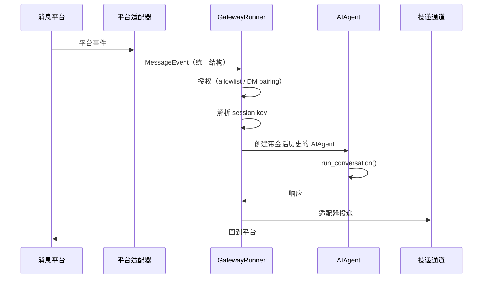

# 07 多平台网关——25+ 适配器的统一消息路由

> [!abstract] 摘要
> [[06 持久记忆——MEMORY.md、USER.md、Honcho|上一篇]]完成了"核心架构"部分。本文开启"平台与工具"部分——深入 Hermes 的多平台网关架构。这是 Hermes "长驻多平台"理念的工程实现——25+ 消息平台适配器通过统一抽象汇聚到一个 GatewayRunner 进程。文章从 GatewayRunner 的消息分发流程开始——平台事件 → Adapter.on_message() → MessageEvent → 授权 → session key 解析 → 创建 AIAgent → 运行 → 投递响应。然后拆解 SessionStore 的跨平台会话路由——如何让"在 Telegram 上开始的对话在 CLI 中继续"。接着深入 DM pairing 授权机制——防止未授权用户控制你的 Agent。然后讨论 25+ 适配器的分类（内置 8 个 + 插件 17+ 个）和统一抽象——Adapter ABC 的接口设计。接着是 Hook 系统——生命周期事件的扩展点——以及跨平台消息镜像。最后讨论语音消息转写和原生媒体投递——让消息平台交互"像和人聊天一样自然"。核心认知：Hermes 网关的"25+ 适配器"不是"25 个独立实现"——而是"1 个统一抽象 + 25 个具体实现"——这种"统一抽象"让"添加新平台"只需要"实现 ABC"——不需要修改核心逻辑。

---

## 第 1 章 GatewayRunner——消息分发的核心

### 1.1 消息分发流程

GatewayRunner（`gateway/run.py`）是网关的核心——一个长驻进程，接收来自各平台适配器的消息，分发到 AIAgent 处理，再把响应投递回平台。完整流程：

**GatewayRunner 与 AIAgent 的关系**：GatewayRunner 是"消息平台入口"的调度器——它不"处理"消息——它"路由"消息到 AIAgent。AIAgent 是"核心循环"——如第 03 篇所述。这种"调度器 + 核心循环"的分离让"入口"和"处理"解耦——GatewayRunner 可以变化（新增平台、调整路由），AIAgent 保持稳定——反之亦然。这种解耦是 Hermes "单核心多入口"架构的工程基础。

时序图里还有一个值得注意的细节：AIAgent 是"创建带会话历史的"——每条消息到来时按需创建实例，处理完即释放。网关不维持"每会话一个常驻 Agent"的模型——因为 AIAgent 本身是无状态的循环引擎（状态在 SessionStore 里），按需创建的成本极低。**状态外置、实例即抛**——这是无状态服务设计的标准做法，让网关的内存占用与会话数量无关。

"调度器不做处理"这条纪律，用一个反事实来检验其价值：假设 GatewayRunner 在路由时"顺手"做一点消息预处理——比如自己解析一下消息里的命令——会发生什么？预处理逻辑会随平台差异不断分叉（Telegram 的命令格式与 Slack 不同），GatewayRunner 从"纯调度器"退化成"半个适配器集合"，25 个平台的差异开始渗进核心。**调度器的纯粹性是靠"什么都不做"来维持的**——它每多做一件事，统一抽象就薄一分。

### 1.2 "接收-授权-路由-运行-投递"五步流程

**第一步：接收**——平台适配器（如 Telegram adapter）接收平台事件（如新消息），转换为统一的 MessageEvent 结构。MessageEvent 是"平台无关"的——无论来自 Telegram、Discord 还是 Slack，MessageEvent 的结构相同——包含发送者 ID、消息内容、平台标识等。

**第二步：授权**——GatewayRunner 检查发送者是否被授权——通过 allowlist（允许列表）或 DM pairing（配对授权）。未授权的消息被丢弃——防止陌生人控制你的 Agent。

**第三步：路由**——解析 session key——确定"这条消息属于哪个会话"。session key 通常基于"平台 + 发送者 ID + 可选的会话标识"——如 Telegram 用户 12345 的 session key 可能是 `telegram:12345`。同一发送者的消息路由到同一会话——保持上下文连续。

**第四步：运行**——创建带会话历史的 AIAgent——AIAgent 处理消息，可能调用工具，生成响应。

**第五步：投递**——通过平台适配器把响应投递回平台——适配器把"平台无关的响应"转换为"平台特定的消息格式"——如 Telegram 的 sendPhoto、Discord 的 webhook。

五步的职责归属用一张表收拢：

| 步骤 | 执行者 | 平台相关性 |
| :--- | :--- | :--- |
| 接收 | 适配器 | 相关（长连接/Webhook） |
| 授权 | GatewayRunner | 无关 |
| 路由 | GatewayRunner | 无关 |
| 运行 | AIAgent | 无关 |
| 投递 | 适配器 | 相关（格式转换） |

五步流程中，第二步（授权）和第三步（路由）是安全与正确性的关键节点，值得单独强调它们的位置：授权在路由**之前**——未授权的消息连"属于哪个会话"都不配知道；路由在运行**之前**——Agent 拿到的历史由路由决定，路由错了，后面的执行再正确也是错。**安全检查的位置在流程中的顺序，本身就是设计的一部分**——授权前置是"最小暴露"原则的体现。

**"长连接"与"Webhook"两种接收模式**：适配器接收消息有两种模式——"长连接"（如 Telegram 的 long polling、Discord 的 WebSocket、Matrix 的 sync）和"Webhook"（如 Slack 的 Events API、WhatsApp Cloud 的 webhook）。长连接模式下，适配器主动"拉取"消息；Webhook 模式下，平台"推送"消息到适配器的 HTTP 端点。GatewayRunner 不关心"哪种模式"——适配器内部处理——统一输出 MessageEvent。这种"模式无关"让"添加新平台"不受"接收模式"限制——无论新平台用长连接还是 Webhook，都能接入。

两种接收模式的运维差异值得部署者了解：长连接是**出站连接**——Hermes 主动连平台，不需要公网 IP、不需要开放端口——家用服务器、NAT 后面都能跑；Webhook 是**入站连接**——平台要能访问到你的 HTTP 端点，需要公网可达性（公网 IP、反向代理或内网穿透）。这个差异直接决定部署形态：家庭环境天然倾向长连接型平台，企业内网部署 Webhook 型平台则要过网络策略这一关。**"支持哪些平台"的选型，有时其实是"网络环境允许哪些接收模式"的选型**。

### 1.3 为什么网关是独立进程

一个值得问的架构问题：为什么网关是独立的长驻进程，而不是"CLI 启动时顺带拉起消息监听"？答案藏在"可用性模型"的差异里。CLI 是用户驱动的——用户不在，CLI 不需要跑；网关是服务化的——平台消息随时可能到达，Agent 必须随时在场。把网关做成独立进程，意味着"Agent 的在线状态"与"用户的在线状态"解耦——用户睡觉时，cron 任务照跑、webhook 照收、消息照回。

独立进程还带来一个运维上的好处——**重启互不影响**。升级 CLI 代码要重启会话，但网关进程可以不中断（或独立重启）——消息入口的可用性与工具的迭代节奏解耦。对"7×24 在线"的产品承诺来说，这个进程级隔离是必要的基础设施。

> [!info] 核心概念："统一抽象 + 具体实现"
> GatewayRunner 的五步流程中，"接收"和"投递"是"平台特定"的（由适配器处理），"授权-路由-运行"是"平台无关"的（由 GatewayRunner 处理）。这种"统一抽象 + 具体实现"让"添加新平台"只需要"实现 Adapter ABC 的接收和投递方法"——不需要修改授权、路由、运行逻辑。这是 Hermes 能支持 25+ 平台的关键——如果每个平台都是"独立实现"，维护成本会随平台数线性增长——而"统一抽象"让维护成本接近常数。

---

## 第 2 章 SessionStore——跨平台会话路由

### 2.1 会话的"平台隔离"与"跨平台连续性"

Hermes 的会话存储有两个看似矛盾的设计目标：

- **平台隔离**——不同平台的会话默认隔离——Telegram 上的对话不出现在 CLI 的历史中
- **跨平台连续性**——用户可以"在 CLI 中继续 Telegram 上的对话"

**为什么默认"平台隔离"**：不同平台的对话"语境"不同——Telegram 上可能是"快速问答"，CLI 上可能是"深度开发任务"——混合会导致"上下文混乱"。如 Agent 在 Telegram 上被问"今天天气"——如果这个上下文混入 CLI 的"部署任务"——Agent 可能"分心"。平台隔离让"每个平台的对话有自己的上下文"——避免"跨语境干扰"。这也是"用户心理预期"——用户不期望"Telegram 上的闲聊"影响"CLI 上的严肃工作"——平台隔离符合这种预期，让 Agent 的行为在不同场景下保持专注与连贯。

隔离还有一层 token 经济上的收益：隔离的会话各自的历史更短、更聚焦——上下文窗口里装的都是"当前场景相关"的内容；混合会话的历史则持续膨胀（所有平台的消息堆在一起），压缩会更频繁、相关性会更稀薄。**隔离不只是体验设计，也是上下文预算的分配策略**。

"默认隔离 + 手动关联"这个组合，本质上是把一个产品决策交给了一个原则：**破坏隔离的操作必须是显式的**。自动合并听起来更"智能"，但它有两个无法回收的代价——用户失去了"场景切换"的能力（想在 CLI 里谈工作，Telegram 的闲聊却一直掺和），以及"上下文污染"难以排查（Agent 的奇怪行为可能源于几天前另一平台的一句话）。显式切换把这两个代价都变成了用户的知情选择——**默认值保护多数场景，逃生门留给少数需求**。

### 2.2 session key 的设计

session key 是"会话路由"的关键——它决定"消息属于哪个会话"。默认的 session key 格式是 `平台:发送者ID`——如 `telegram:12345`、`discord:67890`。这实现了"平台隔离"——不同平台的 session key 不同，会话自然隔离。

这个极简格式满足了好标识符的几条标准：

- **唯一性**——平台 + ID 的组合在单实例内不会碰撞
- **稳定性**——同一用户跨时间映射到同一 key，会话得以延续
- **可读性**——人类可以直接解读，调试路由问题不需要查表
- **可扩展**——群组、线程等场景通过追加段（如 `:群组ID`）自然延伸

**跨平台连续性的实现**：如果用户想"在 CLI 中继续 Telegram 对话"——可以通过命令"切换 session key"——如 `hermes session switch telegram:12345`——CLI 切换到 Telegram 的会话历史——继续对话。这种"手动切换"让"跨平台连续性"是"用户选择"而非"自动合并"——保护了"平台隔离"的默认行为。

session key 的格式设计还有一个容易被忽略的优点——**它是人类可读的**。`telegram:12345` 这个字符串，用户一眼就能看出"这是 Telegram 上那个账号的会话"——排查问题时（"为什么这条消息进了那个会话"），可读的 key 让路由逻辑变得可以人工验证。对比某些系统用哈希值做会话标识——路由正确时没区别，出错时人类完全无法调试。**标识符的可读性是运维性的一部分**。

### 2.3 会话持久化

SessionStore（`gateway/session.py`）基于 SQLite——与会话历史共享数据库。会话有"按平台隔离"和"谱系追踪"（如第 03 篇所述）——跨平台的会话虽然隔离，但都存在同一个数据库中——可以通过 FTS5 搜索（如第 06 篇所述）。

"隔离但同库"这个存储布局值得品味：隔离是**逻辑层**的（session key 不同），共享是**物理层**的（同一个 SQLite 文件）。这个组合同时拿到了两个世界的好处——逻辑上互不干扰，物理上统一备份（备份一个文件就备份了所有平台的会话）、统一搜索（FTS5 索引覆盖全部历史）。如果隔离做到了物理层（每平台一个数据库），备份和搜索就要处理 N 个文件——复杂度无谓地翻倍。**隔离做到逻辑层为止，是一个值得记住的粒度选择**。

### 2.4 "群组对话"的会话路由

session key 的设计在"群组对话"场景下有特殊考量——在 Telegram 群组中，多个用户发消息——如果 session key 是 `telegram:群组ID`，则群组内所有用户共享一个会话——Agent 把群组视为"一个对话方"。如果 session key 是 `telegram:群组ID:用户ID`，则群组内每个用户有独立会话——Agent 区分"谁说了什么"。

**Hermes 的默认选择**：Hermes 默认用"群组共享会话"——因为群组对话通常是"多人讨论一个话题"——共享会话让 Agent 能"看到完整讨论上下文"。但这也意味着"群组中任何人都能触发 Agent 行动"——需要配合"群组授权"（如只响应 @提及的消息）来控制。这种"群组共享 + @提及触发"是 Telegram/Discord 机器人的常见模式。

群组场景还有一层授权上的微妙之处值得点破：**群组共享会话放大了授权的重要性**。私聊场景里，授权问题只是"谁能跟 Agent 说话"；群组场景里，一个被授权的群组里的每个成员都能触发 Agent——而群组成员是平台控制的，不是 allowlist 控制的。所以群组场景的安全实践是"收紧触发条件"（@提及才响应、或白名单成员才触发）+ "收紧能力范围"（群组会话禁用高危工具）——把"群组是半公开空间"这个事实翻译成配置。**同一个 Agent，在私聊和群组里应该是两个安全等级**。

### 2.5 会话的并发处理

长驻网关必然面对并发：同一用户在上一条消息还没处理完时又发了一条，或者多个平台的会话同时活跃。并发处理有两个经典策略——**排队串行**（同一会话的消息依次处理，保证顺序）和**并行处理**（每条消息独立起任务，吞吐高但顺序乱）。对"对话"这个场景，排队串行几乎是唯一正确的选择——对话的语义依赖消息顺序，乱序处理会让 Agent 的回答驴唇不对马嘴。

不同会话之间则可以并行——Telegram 上的会话和 Discord 上的会话互不依赖，同时处理没有语义问题。**会话内串行、会话间并行**——这个并发模型与数据库的"行级锁"思想同构：冲突范围最小化，吞吐最大化。

---

## 第 3 章 DM Pairing——授权机制

### 3.1 为什么需要授权

Hermes Agent "住在消息平台上"——如 Telegram。如果没有授权机制，任何人都可以给你的 Agent 发消息——执行命令——这是严重的安全风险。如"陌生人发 `rm -rf /` 给你的 Agent"——如果 Agent 执行了，你的服务器就完了。

把这个风险说得更完整一点，未授权访问的危害按烈度分层：

- **低烈度滥用**——陌生人让你的 Agent 帮忙查资料——消耗你的 API 账单
- **中烈度利用**——诱导 Agent 发送它记忆里的信息——泄露你的数据
- **高烈度攻击**——诱导执行命令、写入恶意技能——接管你的基础设施

授权机制挡在所有这些威胁的最前面——**它是消息平台入口唯一一道"陌生人过滤器"**，这也是为什么它被设计为默认强制而非可选。

威胁模型还可以按"攻击者的位置"分层：平台上的任意陌生人（最外层，allowlist/配对挡住）、已授权账号的盗用者（中间层，操作分级与二次验证应对）、以及能接触服务器的本机攻击者（最内层，超出网关的防护范围，交给系统安全）。网关的授权机制明确针对第一层——**每层威胁有对应的防线，网关守的是最外层**——这个定位让它的设计目标清晰：把"陌生人"挡在门外，剩下的交给第 12 篇的审批与沙箱。

### 3.2 DM Pairing 的工作方式

DM pairing 是 Hermes 的"安全授权"机制：

1. **首次使用时**——用户在 CLI 中执行配对命令——如 `hermes pair telegram`——CLI 显示一个配对码
2. **在消息平台上**——用户用消息平台账号给 Agent 发送配对码
3. **Agent 验证**——Agent 收到配对码，验证正确后，把该平台账号（如 Telegram user ID）与 Hermes profile 关联
4. **配对完成**——此后，该账号可以与 Agent 交互

**"配对码"而非"密码"的设计**：为什么用"配对码"而非"密码"？密码是"长期凭证"——一旦泄露，永久风险。配对码是"一次性短期凭证"——使用后失效，且有时效（如 5 分钟）。这种"一次性"降低了"凭证泄露"的风险——即使配对码被截获，过期后无效。配对码的"短期"特性让"物理接近攻击"（如偷看屏幕上的配对码）的时间窗口很短——攻击者必须在几分钟内使用——增加了攻击难度。这种设计体现了 Hermes 在安全设计上的"默认安全"理念——不依赖用户的"安全意识"，而是通过"机制本身"降低风险。

配对码与密码的选择，背后是**凭证生命周期与攻击窗口的匹配**原则。授权是一个低频动作（一个账号一辈子配对一两次），为低频动作设置长期凭证（密码）意味着凭证的暴露面按"年"计；一次性配对码把暴露面压缩到"分钟"计。蓝牙配对、Wi-Fi WPS、双因素绑定的二维码——所有"低频高敏感"的授权场景都在用同一个模式：**短时效凭证 + 带外验证**（配对码在 CLI 显示、在消息平台输入，两个通道缺一不可）。

### 3.3 Allowlist 与 DM Pairing 的配合

除了 DM pairing，Hermes 还支持 allowlist——在配置文件中直接列出"允许的用户 ID"。DM pairing 是"动态授权"（用户主动配对），allowlist 是"静态授权"（预先配置）。两者可以配合——如"allowlist 预配置几个核心用户，DM pairing 让新用户按需配对"。

静态与动态的分工可以按"信任的稳定性"来划：家人、自己的各平台账号——信任稳定，allowlist 一次配好；同事、朋友——信任存在但可能变化，DM pairing 按需授予。这个组合还隐含了一条审计上的好处——**allowlist 里的每个 ID 都有明确的"为什么在里面"**（配置时写下的），而动态配对的记录则构成一份"谁在何时获得了访问权"的日志。授权体系最怕的是"权限悄悄累积"——静态 + 动态双轨让每条授权都有出处可查。

两种授权方式的对照：

| 维度 | Allowlist | DM Pairing |
| :--- | :--- | :--- |
| 授权方式 | 预先配置 | 按需配对 |
| 适用对象 | 信任稳定的常驻用户 | 临时或新增用户 |
| 凭证形态 | 配置文件中的 ID | 一次性短时效配对码 |
| 撤销方式 | 改配置 | 解除配对 |
| 审计线索 | 配置变更记录 | 配对事件日志 |

### 3.4 多 Profile 的隔离

Hermes 支持"多 Profile"——每个 Profile 有独立的记忆、技能、会话历史。DM pairing 是"Profile 级别"的——一个 Telegram 账号可以配对到"工作 Profile"或"个人 Profile"——两个 Profile 的 Agent 行为不同（不同的记忆和技能）。这种"多 Profile"让"一个 Hermes 实例服务多个角色"——如"工作 Agent"和"个人 Agent"共享同一个 Hermes 安装但行为隔离。多 Profile 的设计在 `hermes_cli/profiles.py` 中——每个 Profile 有独立的 `~/.hermes/profiles/<name>/` 目录。

多 Profile 解决的其实是一个"人格冲突"问题：同一个 Agent 上午帮你看生产日志、下午帮你订生日蛋糕——两边的记忆和技能混在一个库里，迟早互相污染（工作 Agent 突然用你的私人语气说话，个人 Agent 突然提起生产事故）。Profile 隔离把"角色"变成了 Agent 的一等概念——**每个 Profile 是一个独立的 Agent 实例，共享的只是底层安装**。这与操作系统的多用户、浏览器的多 Profile 是同一个隔离哲学：共享基础设施，隔离状态与身份。

### 3.5 授权的撤销

授权机制的另一半是**撤销**——授予容易，撤销是否同样顺畅？需要撤销的场景很现实：设备丢了、同事离职、配对错了人。撤销的操作路径包括：从 allowlist 移除 ID、解除 DM pairing（解绑平台账号与 Profile）、以及最彻底的——更换 Profile（旧配对全部失效）。撤销的及时性依赖一个前提：**用户知道自己授权过谁**——这也是授权记录要可查的原因。授权体系的安全性 = 授权的强度 × 撤销的便捷度，后者常被忽视但同样致命。

> [!warning] 安全避坑：DM Pairing 的"中间人"风险
> DM pairing 的安全性依赖"配对码的保密性"——如果配对码被第三方截获，第三方可以冒充用户配对。缓解方案：1）配对码"一次性"——使用后失效；2）配对码"短时效"——如 5 分钟内有效；3）在 CLI 中"确认"——配对请求到达时，CLI 弹出确认——用户确认后才完成配对。这些措施降低了"中间人"风险——但用户仍需注意"不要把配对码泄露给他人"。第 12 篇会深入安全模型。

---

## 第 4 章 25+ 适配器的分类与统一抽象

### 4.1 内置适配器（8 个）

`gateway/platforms/` 目录中的内置适配器——Hermes 核心代码的一部分，不需要额外安装：

| 适配器 | 平台 | 特点 |
| :--- | :--- | :--- |
| signal | Signal | 注重隐私的消息应用 |
| weixin | 微信 | 中国主流消息应用 |
| bluebubbles | iMessage（通过 BlueBubbles） | macOS 上的 iMessage 桥接 |
| qqbot | QQ 机器人 | 中国主流 IM |
| whatsapp_cloud | WhatsApp Cloud API | 全球主流消息应用 |
| yuanbao | 腾讯元宝 | 腾讯 AI 助手 |
| webhook | 通用 Webhook | 自定义集成 |
| api_server | OpenAI 兼容 API | 让任何 OpenAI 兼容前端连接 |

**api_server 适配器的特殊意义**：api_server 适配器让 Hermes 暴露"OpenAI 兼容的 API"——这意味着任何"OpenAI 兼容前端"（如 Open WebUI、LibreChat、ChatBox）都可以连接 Hermes——把 Hermes 当作"OpenAI API 的后端"。这让 Hermes 不只限于"消息平台"——任何"聊天 UI"都可以通过 api_server 接入。这种"API 即平台"的设计扩展了 Hermes 的"入口"范围——从"消息平台"延伸到"任何聊天 UI"。

api_server 的价值还可以再挖一层：OpenAI 兼容格式是聊天前端的**事实标准**——支持它等于一次性接入了整个前端生态，而不是逐个适配。这与第 02 篇讲的"chat_completions 是万能钥匙"完全同构——只不过方向相反：那次是 Hermes 作为客户端连别人的后端，这次是 Hermes 作为后端被别人的前端连。**在标准的两端都站在事实标准一侧，集成成本就只剩实现细节**。

**webhook 适配器的"万能集成"**：webhook 适配器接收任何 HTTP POST 请求作为"消息"——让"任何能发 HTTP 的系统"都能与 Hermes 交互——如"CI 完成后发 webhook 通知 Hermes 部署"、"IoT 设备发 webhook 触发 Hermes 处理"。这种"webhook 即入口"让 Hermes 可以集成到"任何自动化流程"——不限于"消息平台"，而是延伸到"万物互联"的广阔场景，是 Hermes 最灵活的集成方式之一。

### 4.2 捆绑插件（17+ 个）

`plugins/platforms/` 目录中的捆绑插件——随 Hermes 发布，但作为插件形式存在，按需启用：

| 插件 | 平台 |
| :--- | :--- |
| telegram | Telegram |
| discord | Discord |
| slack | Slack |
| whatsapp | WhatsApp（非 Cloud API） |
| matrix | Matrix |
| mattermost | Mattermost |
| email | 电子邮件 |
| sms | 短信 |
| dingtalk | 钉钉 |
| feishu | 飞书 |
| wecom | 企业微信 |
| homeassistant | Home Assistant |
| irc | IRC |
| line | LINE |
| teams | Microsoft Teams |
| google_chat | Google Chat |
| buzz, ntfy, photon, raft, simplex | 其他消息平台 |

**中国平台的覆盖**：Hermes 对中国消息平台覆盖较全——内置 weixin（微信）和 qqbot（QQ），插件有 dingtalk（钉钉）、feishu（飞书）、wecom（企业微信）、yuanbao（腾讯元宝）。这反映了 Hermes 团队（Nous Research）对中国市场的重视——虽然 Nous Research 是美国公司，但 Hermes 的设计考虑了全球用户——包括中国用户。这种"全球化"覆盖是 Hermes "个人 Agent"定位的体现——个人 Agent 应该"在任何用户常用的平台上"。

从适配器实现的角度看，中国平台的接入难度普遍高于西方平台——API 文档语言、鉴权体系、审核流程都不同——这更凸显了这批适配器的工程投入。对中文用户而言，"Agent 住在微信/QQ/飞书里"不是锦上添花，而是**可用性的前提**——一个不在中国用户常用平台上的"个人 Agent"，对目标用户等于不存在。

### 4.3 Adapter ABC 的接口设计

所有适配器（内置和插件）都实现统一的 Adapter ABC——定义了"平台适配器"的标准接口：

- **`on_message()`**——接收平台事件，转换为 MessageEvent
- **`send_message()`**——把响应投递回平台
- **`send_media()`**——投递媒体文件（图片/音频/文档）
- **`get_user_info()`**——获取用户信息（用于授权）
- **`start()` / `stop()`**——启动/停止适配器

**"添加新平台"的流程**：1）创建新适配器文件，实现 Adapter ABC；2）在配置中注册适配器；3）启动网关时自动加载。不需要修改 GatewayRunner、SessionStore 或 AIAgent——只需要"实现 ABC"。这种"开放扩展"设计让社区可以贡献新平台适配器——而不需要修改 Hermes 核心。

五个接口方法的粒度也值得点评——**它刻意停留在"消息级"而非"功能级"**。没有"send_inline_keyboard()"、"send_embed()"这类平台特性方法——平台特性通过能力声明和降级机制处理。接口越窄，实现一个新适配器的门槛越低（五个方法），接口越稳定（平台特性怎么变都不影响 ABC）。**ABC 的五个方法就是"平台适配器"这个概念的最低定义**——多一个都是对演化的束缚。

### 4.4 "内置 + 插件"分层的意义

为什么有些平台是"内置"，有些是"插件"？

**内置的理由**：signal/weixin/qqbot/whatsapp_cloud 等平台在某些用户群体中是"必备"——如中国用户需要微信和 QQ——把这些作为内置确保"开箱即用"。api_server 和 webhook 是"通用集成"——很多用户需要——内置确保"不需要额外安装"。

**插件的理由**：telegram/discord/slack 等虽然流行，但不是"所有用户都需要"——如不用 Telegram 的用户不需要 telegram 适配器——作为插件让用户"按需启用"。这种"按需启用"减少了"不用的适配器"的资源消耗——每个启用的适配器是一个长连接——启用 25 个会消耗资源。

**分层的维护意义**：内置适配器由 Hermes 核心团队维护——质量有保证；插件适配器可以由社区贡献——经过审核后合并到 plugins 目录。这种"核心维护 + 社区贡献"的分层让"适配器生态"可以"扩展"而不增加"核心团队的维护负担"——也是 Hermes 能在一年内覆盖 25+ 平台的关键策略——靠社区力量扩展长尾平台。

内置与插件的全维度对照：

| 维度 | 内置适配器 | 捆绑插件 |
| :--- | :--- | :--- |
| 代码位置 | `gateway/platforms/` | `plugins/platforms/` |
| 维护方 | 核心团队 | 社区贡献 + 审核 |
| 默认状态 | 随核心可用 | 按需启用 |
| 适合平台 | 通用集成、依赖轻的平台 | 依赖重、变更频繁的平台 |
| 发版节奏 | 跟随核心 | 可相对独立 |

### 4.5 适配器的"能力声明"

不同适配器的"能力"不同——如 Telegram 支持 inline keyboard、语音消息、文件附件；SMS 只支持文本；Email 支持富文本和附件。适配器通过"能力声明"告诉 GatewayRunner 自己支持什么——GatewayRunner 根据能力调整行为——如"不支持媒体的适配器，响应中的图片路径转为文本链接"。

**能力声明的设计**：能力声明通常是一个"能力字典"——如 `{"media": True, "voice": True, "inline_keyboard": False, "rich_text": True}`。GatewayRunner 在投递响应时检查能力——如果响应包含媒体但适配器不支持媒体，降级为"文本描述+链接"。这种"能力降级"确保"响应总能投递"——不会因为"适配器不支持某格式"而失败。

能力字典的典型维度包括：

- **media**——能否投递图片/文件附件
- **voice**——能否发送语音气泡
- **rich_text**——支持 Markdown/HTML 还是纯文本
- **interactive**——有无按钮、键盘等交互元素
- **length_limit**——单条消息的长度上限（SMS 与 Telegram 差距巨大）

能力降级的设计哲学值得点破：**降级的目标是"总能送达"，而不是"格式保真"**。SMS 适配器收到带图的响应，把图片转成链接——体验打折但信息到达；反过来，如果选择"不支持就报错"，Agent 的响应会因平台能力而随机失败——用户面对的是"有时 Agent 不回消息"的诡异现象。消息系统的第一美德是可靠性，格式是第二位的——**降级不是妥协，是对"消息必达"承诺的履行**。

### 4.6 适配器的测试策略

25+ 适配器的质量保障是个真实的工程挑战——每个适配器背后是一个外部平台，平台 API 会变、会抖、会改鉴权。可行的测试分层是：**契约测试**（MessageEvent 转换的正确性——不依赖真实平台，用录制的事件样本回放）、**投递测试**（mock 平台 API 验证消息格式）、**有限的端到端冒烟**（对少数关键平台做真实收发）。三层成本递增、频率递减——大量靠契约测试保底，少量靠端到端兜底。这也是第 03 篇"25,000 测试"在网关侧的具体形态——**对外部依赖的测试，测的是"我们对它的假设"而不是"它的行为"**。

---

## 第 5 章 Hook 系统——生命周期事件扩展

### 5.1 什么是 Hook

Hook 是"生命周期事件的扩展点"——在 Gateway 的关键节点（如消息接收、响应发送）触发自定义代码。Hook 让第三方可以"在消息处理流程中插入逻辑"——如"消息到达时记录日志"、"响应发送前过滤敏感信息"。

**Hook 与适配器的分工**：适配器处理"平台特定"的逻辑（如 Telegram API 调用），Hook 处理"跨平台通用"的逻辑（如日志、审计、过滤）。这种分工让"通用逻辑"不需要在每个适配器中重复实现——只需要写一个 Hook——所有适配器都会触发。如"所有平台的消息都记录到审计日志"——写一个 Hook 即可——不需要在 25 个适配器中各写一次日志代码。

用管道的视角看这个分工更清楚：消息流是一条管道，适配器是管道两端的"接口法兰"（连接外部世界），Hook 是管道中段的"三通"（在不改变主流的前提下引出或注入）。通用逻辑写在 Hook 里，意味着它天然与平台解耦——**审计逻辑不应该知道消息来自 Telegram 还是 Slack**——这个解耦让合规需求（审计、留存）的实现与平台清单彻底无关。

### 5.2 Gateway Hook 与 Plugin Hook

Hermes 有两种 Hook：

**Gateway Hook**（`gateway/hooks.py`）——处理网关生命周期事件——如"消息接收"、"响应发送"、"会话开始/结束"。典型用途：日志记录、告警、webhook 通知。

**Plugin Hook**——处理工具调用生命周期事件——如"工具调用前拦截"、"工具调用后记录指标"。典型用途：工具拦截（如"禁止某些工具在特定平台使用"）、指标收集、guardrails（如"限制工具调用频率"）。

两种 Hook 的覆盖范围合起来，恰好是消息处理全链路的两个关键段：Gateway Hook 管"消息层"（进与出），Plugin Hook 管"执行层"（工具调用）。两层都挂上 Hook，就实现了端到端的可观测与可干预——**消息进出了什么、Agent 执行了什么，都有扩展点可以插手**。这个覆盖设计对合规敏感的部署（企业、团队）是刚需。

两种 Hook 的对照：

| 维度 | Gateway Hook | Plugin Hook |
| :--- | :--- | :--- |
| 挂载点 | 消息接收/响应发送/会话生命周期 | 工具调用前/后 |
| 典型用途 | 日志、告警、webhook 通知 | 拦截、指标、guardrails |
| 能否阻止动作 | 视实现 | 可（工具调用前拦截） |
| 对应关注点 | 消息层合规 | 执行层安全 |

### 5.3 builtin_hooks 扩展点

`gateway/builtin_hooks/` 目录是"始终注册的 Hook 扩展点"——虽然目前没有内置 Hook——但这个目录为第三方提供了"始终加载 Hook"的位置——不需要用户手动配置。这对于"必须始终运行的 Hook"有用——如"安全审计 Hook"——不应该被用户意外禁用。

"始终加载"这个语义值得单独一提——它与普通 Hook 的区别是**注册时机与配置解耦**。普通 Hook 靠配置启用，配置可以被改动；builtin_hooks 目录里的 Hook 随网关启动自动注册——想禁用得动文件系统。对"审计类"需求这是必要的强制力：合规要求"所有消息必须留痕"，而"留痕"不能依赖一个可能被随手关掉的开关。当然，强制力是双刃剑——它也意味着这个目录应该只放"确实永远该跑"的东西。

### 5.4 Hook 的"拦截"能力

Hook 不只是"观察"——还可以"拦截"——如"工具调用前拦截"Hook 可以"阻止"某些工具调用——如"在 Telegram 平台上禁止 terminal 工具"。这种"拦截"让 Hook 成为"安全策略"的实现点——如"guardrails Hook"可以限制"每分钟最多 N 次工具调用"——防止 Agent "失控"循环调用工具消耗资源。

**拦截 vs 审批**：Hook 拦截是"自动的"——基于规则自动阻止；审批是"人工的"——询问用户确认。两者互补——Hook 处理"明确的规则"（如"禁止 terminal 在 Telegram 上"），审批处理"模糊的判断"（如"这个命令是否危险"）。这种"自动 + 人工"的双重保障让 Agent 的行为既"高效"又"可控"。第 12 篇会深入"命令审批"机制。

拦截与审批的分工还可以用"规则的确定性"来划界：能写成 if-else 的规则（平台、工具名、频率）交给 Hook——机器执行又快又稳；需要语义判断的规则（"这条命令危险吗"）交给审批——人（或强模型）来判断。**确定性规则自动化，模糊判断人工化**——这条边界划清了，安全机制才不会要么烦人（什么都审批）要么漏防（全靠拦截）。

### 5.5 Hook 的失败处理

Hook 自己失败怎么办——这是一个容易被忽略但很关键的问题。观察型 Hook（日志、指标）失败，理想行为是"记录告警但不阻塞主流程"——审计缺一条日志不该让用户的消息发不出去；拦截型 Hook（guardrails）失败则相反——理想行为是"fail closed"（默认阻止）还是"fail open"（默认放行）取决于安全立场：安全策略失效时，宁可暂时阻断操作（fail closed）也不能裸奔。**Hook 的失败策略应该按 Hook 的类型分别定义**——一刀切的"失败就跳过"对拦截型 Hook 是安全漏洞。

---

## 第 6 章 跨平台消息镜像

### 6.1 什么是消息镜像

消息镜像（`gateway/mirror.py`）让"一个平台上的对话"可以"镜像到另一个平台"——如"Telegram 上的对话自动转发到 Slack"——让团队可以"在 Slack 中观察 Agent 与 Telegram 用户的交互"。

### 6.2 镜像的使用场景

**团队监督**——团队领导可以"镜像"成员与 Agent 的对话到团队频道——监督 Agent 的行为是否符合团队规范。

**多设备同步**——用户可以"镜像"自己的对话到多个平台——如"在 Telegram 上对话，同时镜像到 Email"——在 Email 中可以搜索历史。

**调试与审计**——开发者可以"镜像"Agent 的对话到日志系统——用于调试和审计。

三个场景的诉求侧重各不相同：

- 团队监督——要**实时性**，延迟几秒内可接受
- 多设备同步——要**可检索性**，镜像到 Email 就是为了搜索
- 调试审计——要**完整性**，一条不能漏

三个场景的共同点是**镜像的目的地都是"比源平台更适合观察或留存的地方"**——团队频道适合多人观察，Email 适合长期检索，日志系统适合程序化分析。镜像本质上是在做"同一份数据的多种视图"——源平台负责交互，镜像平台负责观察与留存。这个模式与数据库的主从复制、消息队列的广播消费是同构的——**交互与观察分离，是所有需要"一边用一边看"的系统的标准解法**。

### 6.3 镜像与隐私

消息镜像涉及隐私——"被镜像"的用户可能不知道自己的对话被转发。好的设计应该：1）告知用户"此对话被镜像到 X"；2）让用户可以"退出镜像"；3）限制镜像的"目标平台"为"可信的"。Hermes 的镜像配置在用户控制下——用户决定"镜像什么到哪里"——但"被镜像方"（如 Telegram 对话的对方）可能不知情——这是需要在团队内部明确政策的隐私问题。

镜像的隐私结构有一个微妙之处：**配置者、对话者、被观察者可能是三个不同的人**。团队管理员配置镜像（配置者），成员与 Agent 对话（对话者），对话内容流向团队频道（被观察者是全体成员）。技术上的"用户控制"只覆盖配置者——对话者的知情权需要制度补充（团队政策明示"Agent 对话被镜像"）。这与办公室监控的法律逻辑一致：**技术能力必须配套知情制度，否则就是单向透明**。

### 6.4 镜像的"单向"与"双向"

消息镜像可以是"单向"（只读观察）或"双向"（双向同步）。单向镜像是"把 A 平台的对话复制到 B 平台观察"——B 平台不能回复。双向镜像是"A 和 B 平台的对话双向同步"——在 B 平台回复会同步回 A 平台。Hermes 默认用"单向镜像"——因为"双向同步"的"会话状态管理"复杂——如"两个平台同时回复"的冲突处理。单向镜像满足"监督/审计"场景——双向同步的需求较少。

单向默认还有一个安全上的理由常被忽略：双向同步意味着**两个平台都能触发 Agent 行动**——攻击面翻倍。单向镜像下，镜像目标平台是纯观察者，即使 Slack 账号被盗，攻击者也只能"看"不能"指挥"。镜像方向的选择因此不只是功能问题——**每增加一个可触发 Agent 的入口，就多一份授权与审计的责任**——单向镜像把这个责任挡在了门外。

### 6.5 镜像的配置模型

镜像的配置模型可以概括为三个维度：**镜像什么**（哪些会话——全部、特定用户、特定群组）、**镜像到哪**（目标平台与频道）、**镜像什么内容**（全文、脱敏后、仅 Agent 响应）。三个维度的组合覆盖了从"个人备份"（全部内容镜像到 Email）到"团队监督"（特定群组镜像到团队频道）的谱系。配置的粒度决定了镜像的适用边界——粗粒度的"全量镜像"适合个人备份，细粒度的"按用户/按内容过滤"才能满足团队场景的合规要求。

---

## 第 7 章 语音消息转写与原生媒体投递

### 7.1 语音消息转写

在 Telegram/WhatsApp 上发语音消息——Hermes 自动转写为文本处理——用户不需要打字，直接说话。转写使用"辅助 LLM"或专用 STT（Speech-to-Text）服务。

**10 种 TTS 提供者**：Hermes 支持 10 种 TTS（Text-to-Speech）提供者——Edge TTS（免费）、ElevenLabs、OpenAI TTS、MiniMax、Mistral Voxtral、Google Gemini、xAI、NeuTTS、KittenTTS、Piper——加上"自定义命令提供者"支持任何本地 TTS CLI。这让"语音交互"不绑定特定 STT/TTS 服务——用户可以按需选择。

选型时的三个权衡维度：

- **成本**——Edge TTS 免费，ElevenLabs 按字符计费
- **质量**——商用服务自然度高，本地轻量模型有机械感
- **隐私**——Piper 等本地方案音频不出机器，云服务则要上传

**语音模式**：除了"语音消息转写"，Hermes 还有"完整语音模式"——用麦克风和 Agent 对话，听到口语回复——在 CLI 和消息平台上都支持。Discord 语音频道还支持"实时语音对话"。

**STT/TTS 的"模型无关"延伸**：Hermes 支持 10 种 TTS 提供者——这与"LLM 模型无关"理念一脉相承——不只"LLM 可以换"，"STT/TTS 也可以换"。这种"全面模型无关"让用户不受限于任何单一供应商——可以根据"质量/成本/隐私"需求选择。把"模型无关"的清单拉全——LLM（18+ 提供商）、STT/TTS（10+ 提供者）、Memory Provider（8 种）、终端后端（7 种）——会发现 Hermes 把"可替换"贯彻到了技术栈的每一层。这已经不只是特性集合，而是**一种架构立场：任何第三方依赖都是可替换的插槽，而不是承重墙**。这个立场的代价是适配层的持续维护，收益是用户永远不被任何单一供应商的定价、政策、服务质量绑架。

### 7.2 原生媒体投递

如第 05 篇所述，当响应包含媒体文件路径时，网关自动检测并原生投递——Telegram 用 sendPhoto、Discord 用 attachment。`[[as_document]]` 和 `[[audio_as_voice]]` 指令控制投递方式。

**平台特定的媒体处理**：不同平台对媒体的处理不同——如 Telegram 的 sendPhoto 会重压缩图片，Discord 的 attachment 保留原始字节。网关的"原生投递"让"每个平台用最适合的媒体方式"——用户不需要知道"Telegram 用 sendPhoto 还是 sendDocument"——网关自动处理。

### 7.3 "像和人聊天一样"的交互体验

语音消息转写 + 原生媒体投递 + 即时响应，让"与 Agent 交互"的体验接近"与人聊天"——用户在 Telegram 上发语音，Agent 听懂并回复——可以发图片、文件、语音回复。这种"自然交互"是 Hermes "长驻消息平台"理念的体验目标——Agent 不是"一个工具"，而是"一个联系人"——你像给朋友发消息一样给它发任务。

**与"CLI 交互"的对比**：CLI 交互是"工程师式"的——精确的命令、文本输入输出。消息平台交互是"聊天式"的——自然的语言、语音、图片。Hermes 的"双入口"让"工程师"用 CLI 高效操作，"普通用户"用消息平台自然交互——同一个 Agent 服务两种使用风格。

**"长驻"的体验意义**：消息平台是"始终在线"的——用户随时可以发消息——Agent 作为"联系人"始终可被"找到"。这与"CLI 按需启动"的体验不同——CLI 需要"打开终端、启动 hermes"——有"启动摩擦"。消息平台"无启动摩擦"——打开 Telegram 直接发消息——Agent 立即响应——这种"即时可用"让 Agent 真正成为"随时可问的助手"。

"启动摩擦"这个概念值得再量化一下，因为它解释了很多使用行为的差异。打开终端、敲命令、等启动——这套动作的摩擦成本大约十几秒，足以让"顺手问一句"的念头消失；而消息平台的摩擦接近零——解锁手机、点开对话、说话。**工具的使用频率与启动摩擦呈指数反比**——摩擦从十几秒降到一秒，使用场景不只是"多了"，而是"换了一个量级"——从"坐下来认真用"变成"想起来就问"。Hermes 选择消息平台作为主入口，本质上是把 Agent 的使用门槛降到了"发消息"这个人类已经完全习惯的动作上。

### 7.4 语音链路的延迟预算

语音交互的体验门槛是**延迟**——人类对话中，回应延迟超过两三秒就会感到"卡顿"。语音链路的延迟构成大致是：录音上传 + STT 转写 + LLM 处理 + TTS 合成 + 音频下发——每段都有成本，串行叠加后很容易超过"自然对话"的阈值。

这解释了为什么不同场景的语音方案差异很大：语音消息（异步）可以容忍数秒延迟——用户本来就没在等；实时语音对话（Discord 语音频道）则要求全链路优化——流式 STT、快速 LLM、流式 TTS。**异步语音容易，同步语音难**——Hermes 同时支持两者，但体验预期应该分开设定：语音消息的"数秒延迟"是可接受的，实时语音的"数秒延迟"是致命的——同一条链路，两种验收标准。这也提醒部署者：语音功能的"能用"与"好用"之间，隔着一整条延迟优化链路。

---

## 第 8 章 总结与下一篇导读

### 8.1 本文核心要点

1. **GatewayRunner 五步流程**——接收（适配器）→ 授权（allowlist/DM pairing）→ 路由（session key）→ 运行（AIAgent）→ 投递（适配器）——"统一抽象 + 具体实现"
2. **SessionStore 跨平台路由**——session key（`平台:发送者ID`）实现平台隔离——手动切换实现跨平台连续性
3. **DM Pairing 授权**——配对码机制防止未授权访问——与 allowlist 配合——注意"中间人"风险
4. **25+ 适配器分类**——内置 8 个（signal/weixin/qqbot/whatsapp_cloud/yuanbao/webhook/api_server/bluebubbles）+ 插件 17+ 个（telegram/discord/slack 等）
5. **Adapter ABC**——统一接口（on_message/send_message/send_media/get_user_info/start/stop）——"添加新平台"只需"实现 ABC"
6. **"内置 + 插件"分层**——内置确保"开箱即用"，插件"按需启用"减少资源消耗
7. **Hook 系统**——Gateway Hook（日志/告警/webhook）+ Plugin Hook（工具拦截/指标/guardrails）+ builtin_hooks 扩展点
8. **消息镜像**——对话转发到其他平台——团队监督/多设备同步/调试审计——注意隐私
9. **语音消息转写**——10 种 TTS 提供者——语音模式 + Discord 语音频道实时对话
10. **原生媒体投递**——自动检测路径 + 平台特定投递——`[[as_document]]`/`[[audio_as_voice]]` 指令控制

收官前把网关的设计取舍收拢成一张表，便于回顾：

| 设计点 | 选择 | 代价 | 换来的 |
| :--- | :--- | :--- | :--- |
| 平台接入 | 统一 ABC + 25 实现 | 适配层持续维护 | 新平台零核心改动 |
| 会话路由 | 默认隔离 + 手动切换 | 跨平台需显式操作 | 语境纯净、行为可预期 |
| 授权 | 配对码 + allowlist | 配对流程多一步 | 攻击窗口从年级压到分钟级 |
| 媒体投递 | 能力声明 + 自动降级 | 降级时体验打折 | 响应必达 |
| 镜像 | 默认单向 | 不支持双向同步 | 状态管理简单、语义清晰 |

这张表的每一行都是同一个模式的变体：**用显式的、可控的代价，换取确定性的收益**——Hermes 网关几乎没有"隐藏成本"式的设计，每个取舍都摆在明面上。对评估类似系统的读者，这张表也提供了一组检查项：看一个消息网关的设计，先看它的授权窗口、降级策略、隔离边界——这三处最能看出设计者是否认真对待过"长驻 + 多平台"的真实风险。

### 8.2 常见误区与澄清

网关相关的高频误读，收官前逐一澄清：

| 误解 | 事实 |
| :--- | :--- |
| "25+ 适配器 = 25 套独立代码" | 1 个统一抽象 + 25 个实现——核心逻辑只有一份 |
| "启用所有平台更好" | 每个适配器是一条长连接——按需启用，减少资源与攻击面 |
| "配对了就一劳永逸" | 授权需要可撤销——设备丢失、人员变动时要主动解除 |
| "镜像只是转发消息" | 镜像涉及第三方知情权——团队场景需要配套知情制度 |
| "群组里所有人都能用 Agent 是 bug" | 群组共享会话是设计——配合 @提及触发与能力收紧使用 |

其中"启用所有平台"这条值得展开：适配器不只是"多一个功能"，它是**一条持续运行的外部连接 + 一份持续的维护责任**。每多启用一个平台，网关的内存、连接数、故障点、API 变更跟进义务都在增加。正确的姿势是"我在哪个平台生活，就启用哪个"——适配器清单应该反映你的真实通讯习惯，而不是平台支持清单。

### 8.3 下一篇导读

下一篇 [[08 终端后端七剑——从 Local 到 Vercel Sandbox]] 将从"消息平台"转向"代码执行环境"——深入 Hermes 的 7 种终端后端。Local（无隔离）、Docker（容器隔离）、SSH（远程服务器）、Modal（gVisor Serverless）、Daytona（容器/VM/GPU）、Singularity（HPC 容器）、Vercel Sandbox（云端沙箱）——对比隔离机制、适用场景、Serverless 持久化、安全加固。

> [!info] 专栏导航
> 本文是 [[00 专栏导览|Hermes Agent 专栏]] 的第 7 篇，"平台与工具"部分的第 1 篇。

---

## 参考文献

1. Hermes Agent Messaging Platforms 文档. https://hermes-agent.nousresearch.com/docs/user-guide/messaging/
2. Hermes Agent Gateway Internals. https://hermes-agent.nousresearch.com/docs/developer-guide/architecture/gateway-internals
3. Hermes Agent Architecture. https://hermes-agent.nousresearch.com/docs/developer-guide/architecture
4. Hermes Agent GitHub. https://github.com/NousResearch/hermes-agent

---

## 思考题

1. **Hermes 支持 25+ 消息平台——但每个平台的消息格式、媒体限制、交互模式不同。如 Telegram 支持内联键盘（inline keyboard），Slack 支持 Block Kit，Discord 支持 Embeds。Hermes 的"统一抽象"如何处理这些"平台特定功能"？是"只支持共同子集"还是"允许平台特定扩展"？** 提示：考虑"渐进式增强"——统一抽象支持"共同子集"（文本+媒体），平台特定功能通过"扩展接口"支持——如 Adapter 可以实现 `send_rich_message()` 方法，支持平台特定的富消息格式——但不实现该方法的适配器降级为"纯文本"。这种"渐进式增强"让"基础功能跨平台，高级功能按平台"。

2. **DM Pairing 的"配对码"机制防止未授权访问——但如果用户的手机被盗，小偷可以直接用已配对的 Telegram 账号与 Agent 交互。如何应对"配对后设备被盗"的场景？** 提示：考虑"二次验证"——对于"敏感操作"（如执行终端命令、删除文件），Agent 可以要求"二次验证"——如"在 CLI 中确认"或"输入额外 PIN"。这种"操作分级"让"普通对话"不需要二次验证（方便），"敏感操作"需要（安全）。第 12 篇会深入"命令审批"机制。

3. **消息镜像让"Telegram 对话可以转发到 Slack"——但如果 Telegram 对话包含敏感信息（如 API key），镜像到 Slack 可能造成泄露。如何防止"敏感信息被镜像"？** 提示：考虑"镜像过滤"——镜像前用 LLM 或正则检测"敏感信息"（如 API key 格式、密码模式）——检测到则"脱敏"后再镜像——如把 `sk-abc123` 替换为 `sk-***`。这种"脱敏镜像"让"镜像"与"安全"兼顾——但增加了镜像的延迟和成本。
