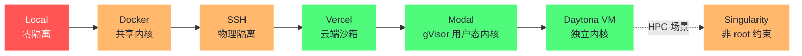
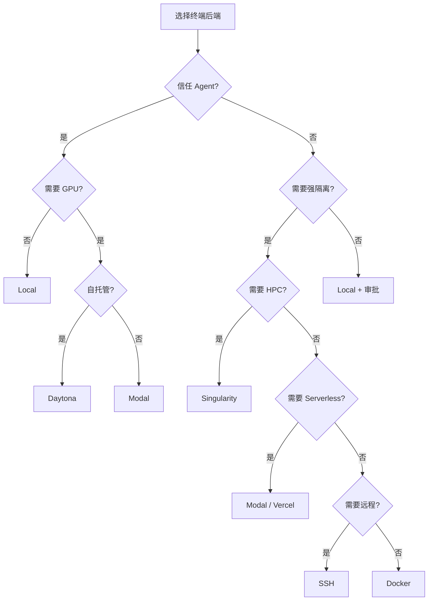

# 08 终端后端七剑——从 Local 到 Vercel Sandbox

> [!abstract] 摘要
> [[07 多平台网关——25+ 适配器的统一消息路由|上一篇]]拆解了"消息入口"——本文转向"代码执行环境"——Hermes 的 7 种终端后端。Agent 要执行代码、运行命令、操作文件——这些操作在"哪里"执行？Hermes 提供 7 种选择：Local（本机直接执行，无隔离）、Docker（容器隔离）、SSH（远程服务器）、Modal（gVisor Serverless）、Daytona（容器/VM/GPU）、Singularity（HPC 容器）、Vercel Sandbox（云端沙箱）。文章逐一拆解每种后端的隔离机制、适用场景、优缺点——从"零隔离高便利"的 Local 到"强隔离 Serverless"的 Modal/Vercel。然后讨论"Serverless 持久化"的工程挑战——Modal 和 Vercel Sandbox 是"无状态"的——但 Hermes 需要"有状态"（保存文件、安装包）——如何解决？接着分析"安全加固"——Docker 的 seccomp/AppArmor/用户命名空间、SSH 的跳板机、Local 的"软隔离"局限。最后给出"如何选择终端后端"的决策树。核心认知：Hermes 的"7 种后端"不是"7 个独立实现"——而是"1 个 TerminalBackend ABC + 7 个具体实现"——与网关的"统一抽象"一脉相承——让"添加新后端"只需"实现 ABC"。

---

## 第 1 章 为什么需要多种终端后端

### 1.1 Agent 执行代码的"在哪里"问题

Agent 要执行代码、运行命令、操作文件——这些操作在"哪里"执行？这个问题看似简单——"在本机执行"——但涉及"安全隔离"和"资源管理"的复杂考量：

- **本机执行**——方便，但 Agent 可能执行危险命令（如 `rm -rf /`）破坏系统
- **容器执行**——隔离，但需要 Docker 环境和镜像管理
- **远程执行**——安全，但增加网络延迟和配置复杂度
- **Serverless 执行**——弹性，但"无状态"与"有状态需求"冲突

这些考量没有"唯一正确答案"——不同用户、不同场景有不同的最优选择。Hermes 提供 7 种后端正是承认这种"多样性"——不强制"一刀切"——让用户根据自身情况选择。这种"多选择"设计是 Hermes "个人 Agent"定位的体现——个人用户的需求差异大——有人要"最方便"，有人要"最安全"，有人要"GPU"——7 种后端覆盖了这些需求谱系。

值得强调的是，"在哪里执行"对 Agent 的意义比对普通软件更大——因为 Agent 的命令是**模型生成的**，不是人手敲的。人敲命令时，大脑是最后的安全审查；Agent 的命令源自上下文的推理，而上下文可能被污染（提示注入）、可能被误导（错误技能）。**执行环境是"模型的判断失误"与"真实世界损失"之间最后一道物理屏障**——这就是为什么这个"在哪里"的问题值得用一整篇文章来回答。

把四个考量维度摆成一个权衡矩阵，能看到"七剑"各自的坐标：

| 后端 | 隔离强度 | 延迟 | 成本结构 | 运维负担 |
| :--- | :--- | :--- | :--- | :--- |
| Local | 无 | 零 | 零 | 零 |
| Docker | 中（共享内核） | 低 | 零 | 中（镜像管理） |
| SSH | 物理隔离 | 中 | 服务器固定成本 | 中高 |
| Modal | 强（gVisor） | 冷启动数秒 | 按量付费 | 零 |
| Daytona | 可选（容器/VM） | 中 | 自托管固定 / 云按量 | 中高 |
| Singularity | 中（非 root 约束） | 低 | 集群既有成本 | 集群管理员承担 |
| Vercel Sandbox | 强 | 低（边缘） | 按量付费 | 零 |

这张表没有一行全绿——**隔离、延迟、成本、运维四个维度构成一个"不可能四角"**，每种后端只是在这个四角里选了一个顶点组合。理解了这一点，"为什么要有 7 种"就不再是产品功能堆砌，而是对"不可能四角"的诚实回应——任何宣称"一个后端通吃"的方案，必然在其中某个维度上做了用户看不见的牺牲。

### 1.2 不同场景的不同需求

| 场景 | 隔离需求 | 资源需求 | 推荐后端 |
| :--- | :--- | :--- | :--- |
| 个人开发 | 低（信任 Agent） | 本机足够 | Local |
| 测试不信任代码 | 高 | 本机足够 | Docker |
| 远程开发 | 中 | 远程服务器 | SSH |
| GPU 训练 | 中 | GPU 集群 | Daytona/MODAL |
| HPC 计算 | 中 | HPC 集群 | Singularity |
| 安全敏感 | 极高 | 弹性 | Vercel Sandbox |

### 1.3 "统一抽象"的设计

7 种后端都实现 `TerminalBackend` ABC——定义了"终端后端"的标准接口：`execute_command()`、`read_file()`、`write_file()`、`start_session()`、`stop_session()`。Agent 不关心"用哪种后端"——只调用标准接口——后端具体实现处理"如何执行"。这种"统一抽象"让"切换后端"只需要"改配置"——不需要改 Agent 代码。

五个接口方法同样值得从"最低定义"的角度审视：execute/read/write/start/stop——执行命令、读写文件、管理会话——这就是"一个可执行环境"的全部必要操作。没有"list_processes()"、"install_package()"这类衍生方法——安装包就是执行一条命令（`pip install`），列进程也是执行一条命令——**凡是能用"执行命令"表达的，就不进接口**。接口的极简保证了新后端的实现门槛：只要能"跑命令、传文件"，就能成为 Hermes 的执行环境。

### 1.4 "七剑"的命名寓意

本文标题用"七剑"比喻 7 种终端后端——这个比喻有几层寓意：1）"七种武器"各有特长——Local 如"徒手"（无武器但灵活），Docker 如"盾牌"（防御为主），SSH 如"长弓"（远程攻击），Modal/Vercel 如"飞镖"（远程且快速），Daytona 如"重剑"（全能但重），Singularity 如"专用兵器"（专用场景）；2）"剑客选剑"——不同场景选不同武器——没有"最强武器"，只有"最适合的武器"；3）"七剑下天山"——七种后端共同构成 Hermes 的"执行能力谱系"——覆盖从"零隔离"到"极强隔离"的全谱。这种"谱系"设计让 Hermes 可以服务"从个人开发到超算科研"的全场景——这是"个人 Agent + 研究工具"双重定位的工程体现。

七种后端在"隔离强度谱系"上的位置，用一张图收拢：

需要说明的是，这条谱系不是严格的线性序——SSH 的"物理隔离"与 Modal 的"gVisor 隔离"属于不同维度（前者是"不在我机器上"，后者是"即使在我机器上也出不来"），Singularity 的"非 root 约束"则是另一种安全模型。**谱系图提供直觉，选型仍要回到具体威胁模型**。

> [!info] 核心概念：TerminalBackend ABC
> 与第 07 篇的 Adapter ABC 类似，TerminalBackend ABC 是"统一抽象 + 具体实现"模式的另一个应用。Agent 的工具（如 `execute_command`）调用 `TerminalBackend.execute_command()`——ABC 定义接口——具体后端（Local/Docker/SSH 等）实现接口。这种"接口与实现分离"让"执行环境"可以"热切换"——如"开发时用 Local，测试时用 Docker，生产用 SSH"——只改配置，不改代码。这与 [[LLM/Coding-Agent运行范式/08 Devin 与 ACI 设计——为 Agent 认知而生的计算机接口|Coding Agent 专栏第 8 篇]]讨论的"ACI 抽象"理念一致——好的接口让"实现可替换"。

---

## 第 2 章 Local——本机直接执行

### 2.1 机制

Local 后端直接在本机执行命令——通过 `subprocess` 调用 shell。没有隔离——Agent 的命令直接作用于本机系统。

理解 Local 的定位，关键是认清"无隔离"的确切含义：不是"安全性差一点"，而是**Agent 的权限 = 你的权限**——它能读你的文件、用你的凭证、改你的配置，与你自己坐在终端前能做的事完全一样。这个等式在"Agent 行为正确"时是优点（完全能力），在"Agent 行为出错"时是全部风险——Local 的取舍就是赌前者。

### 2.2 优点

- **零配置**——不需要 Docker、SSH、云服务——开箱即用
- **零延迟**——本机执行，无网络开销
- **完全访问**——可以访问本机所有文件、工具、环境变量
- **简单调试**——命令的副作用直接可见

### 2.3 缺点

- **无隔离**——`rm -rf /` 会真的删除本机文件
- **安全风险**——Agent 被诱导执行恶意命令会破坏系统
- **环境污染**——Agent 安装的包、创建的文件污染本机环境

### 2.3.1 "环境污染"的具体场景

"环境污染"是 Local 后端的一个隐性风险——Agent 在执行任务时可能"安装包"（如 `pip install something`）、"创建文件"（如 `/tmp/agent_work`）、"修改配置"（如 `~/.gitconfig`）——这些副作用"污染"了本机环境。长期使用后，本机环境可能变得"混乱"——如"安装了 100 个 Agent 临时用的包"——难以清理。Docker 后端通过"容器销毁即清理"避免了这个问题——容器内的所有修改随容器销毁消失——本机环境保持干净。这是"便利"与"整洁"的权衡——Local 便利但可能脏，Docker 整洁但需要额外配置，用户需根据自身偏好权衡取舍。

环境污染还有一个更隐蔽的形态——**隐式状态漂移**。Agent 修改的未必是"新增"的东西，还可能是"覆盖"——改了某个配置文件的默认值、升级了某个全局工具的版本——这些变更不留下"Agent 来过"的痕迹，却悄悄改变了本机行为。用户一周后发现"某个脚本突然不工作了"，排查方向很难联想到 Agent。**显式新增可清理，隐式覆盖难追溯**——这是环境污染里真正棘手的部分，也是"重要工作用容器"的最强论据。

### 2.4 "软隔离"措施

虽然 Local 无"硬隔离"，Hermes 提供几层"软隔离"：

- **命令审批**——危险命令（如 `rm`、`sudo`）需要用户确认——第 12 篇深入
- **工作目录限制**——Agent 默认在指定工作目录操作——减少"误删全盘"风险
- **环境变量过滤**——敏感环境变量（如 API keys）不传递给 Agent 命令

**"软隔离"的局限**：软隔离是"基于规则"的——规则可能被绕过——如 Agent 用 `python -c "import os; os.system('rm -rf /')"` 绕过"命令审批"（因为审批看到的是 `python` 而非 `rm`）。因此 Local 只适合"信任 Agent"的场景——如个人开发——不适合"处理不信任输入"的场景。

**Local 的"默认选择"地位**：尽管 Local 无硬隔离，它是大多数用户的"默认选择"——因为"零配置零延迟"的便利性超过了"无隔离"的风险——对于"个人开发"场景，Agent 通常执行用户信任的命令（如 `git commit`、`npm test`）——"无隔离"可接受。Hermes 的"命令审批"机制提供了"最后一道防线"——即使无硬隔离，危险命令仍需用户确认——降低了"误操作"风险。这种"便利优先 + 审批兜底"的设计符合"个人 Agent"定位——个人用户更看重"方便"而非"绝对安全"。

"默认 Local"的选择还可以从威胁模型的实际分布来辩护：个人开发场景中，Agent 执行的命令大多源自用户自己的意图——"帮我跑一下测试"——命令的危险性与用户自己敲 `npm test` 相当。真正的风险集中在"Agent 处理不可信内容"的时刻——分析来路不明的文件、抓取网页内容——这时内容里可能埋着提示注入。所以更精确的使用建议不是"Local 不安全"，而是**"Local + 可信任务"安全，"Local + 不可信内容"危险**——按任务性质切换后端，而不是按"我是否谨慎"来赌。

软隔离的三层措施也可以给出各自的真实定位：命令审批是"事前拦截"——挡已知的危险模式；工作目录限制是"缩小爆炸半径"——即使出事，损失范围有限；环境变量过滤是"减少泄密面"——即使命令被注入，拿不到凭证。三层分别对应"事前、事中、事后泄密"三个阶段——**软隔离不是一道墙，是三道纱窗**——每道都能被撕开，但三道叠起来，意外发生的概率大幅下降。

"默认 Local"的选择还可以从威胁模型的实际分布来辩护：个人开发场景中，Agent 执行的命令大多源自用户自己的意图——"帮我跑一下测试"——命令的危险性与用户自己敲 `npm test` 相当。真正的风险集中在"Agent 处理不可信内容"的时刻——分析来路不明的文件、抓取网页内容——这时内容里可能埋着提示注入。所以更精确的使用建议不是"Local 不安全"，而是**"Local + 可信任务"安全，"Local + 不可信内容"危险**——按任务性质切换后端，而不是按"我是否谨慎"来赌。

---

## 第 3 章 Docker——容器隔离

### 3.1 机制

Docker 后端在 Docker 容器中执行命令——每个会话创建一个容器——命令在容器内执行——容器隔离了文件系统、进程、网络。

### 3.2 优点

- **强隔离**——容器有自己的文件系统——`rm -rf /` 只删除容器内的文件，不影响宿主机
- **环境一致**——容器镜像定义了执行环境——可重复
- **资源限制**——可以限制容器的 CPU、内存、网络
- **快速创建**——容器启动比 VM 快得多

### 3.3 缺点

- **需要 Docker**——宿主机需要安装 Docker——增加部署复杂度
- **镜像管理**——需要维护镜像——更新、存储
- **持久化挑战**——容器销毁后文件丢失——需要 volume 挂载
- **不是"完全隔离"**——容器共享宿主机内核——内核漏洞可能逃逸

### 3.3.1 "容器共享内核"的风险详解

Docker 容器与宿主机"共享内核"——这意味着"内核漏洞"可能导致"容器逃逸"——如"Dirty COW"（CVE-2016-5195）这样的内核提权漏洞，理论上可以让容器内进程获得宿主机 root。虽然现代内核已经修复已知漏洞——但"未知漏洞"的风险始终存在。对于"极高安全"场景，"共享内核"是不可接受的——需要"独立内核"的 VM（如 Daytona VM 模式）。但对于"大多数场景"，"共享内核"的风险是"可接受的"——因为"已知漏洞已修复"，且"容器逃逸"攻击需要"高度复杂的利用"——普通攻击者难以实施，实际威胁相对有限。

"共享内核"的风险还可以用攻击链条的长度来评估：容器逃逸需要"内核漏洞存在 + 漏洞未被修补 + 攻击者能从容器内触发 + 触发后能利用"——四个条件缺一不可。对个人开发场景，攻击者要先把恶意内容送进 Agent 的上下文（提示注入），再诱导执行，再利用未知内核漏洞——链条极长。但链条长不等于零——**风险评估的正确单位是"资产价值 × 链条断裂概率"**——本机资产价值低则 Docker 足够，生产凭证在机器上则应该升级到 VM 级隔离。

### 3.4 安全加固

Docker 的默认隔离不够"安全"——Hermes 可以加固：

- **seccomp**——限制容器可用的系统调用——减少攻击面
- **AppArmor/SELinux**——强制访问控制——限制容器可访问的文件
- **用户命名空间**——容器内 root 映射为宿主机非 root——减少"容器逃逸"风险
- **只读根文件系统**——容器根文件系统只读——防止"写入恶意文件"
- **无 `--privileged`**——不给予容器特权模式

**加固的代价**：加固可能"破坏功能"——如"只读根文件系统"让某些需要写入 `/tmp` 的程序失败——需要额外挂载 tmpfs。加固是"安全与功能"的权衡——根据"威胁模型"选择适当的加固级别。

**Docker 的"默认选择"地位**：对于"需要隔离但不想用云"的用户，Docker 是默认选择——它本地运行，不依赖云供应商，且隔离足够强（对于大多数威胁）。Hermes 的 Docker 后端预配置了"合理加固"——不需要用户自己研究 seccomp/AppArmor——开箱即用即有"基本安全"。这种"预配置加固"降低了 Docker 的使用门槛——用户不需要是"Docker 安全专家"也能获得"合理隔离"。

Docker 后端还有一个常被低估的工程收益——**环境可声明**。镜像文件就是执行环境的完整定义：Python 版本、系统依赖、工具链全部固化——"Agent 在什么环境里执行"从"这台机器碰巧装了什么"变成"镜像里写了什么"。这对可复现性至关重要——同一个任务在本地和同事机器上行为不一致的经典根源，就是"环境漂移"；容器把环境变成了可以版本控制的资产。**隔离是安全收益，可复现是工程收益——Docker 一鱼两吃**。

镜像管理这个"缺点"也有它的另一面：维护镜像的过程，本质上是把"我的执行环境需要什么"显式化的过程。很多用户第一次写 Dockerfile 时才发现"原来我的脚本依赖这三个系统库"——环境从隐性知识变成显式文档。这个"被迫显式化"的副作用，长期看是资产而非负担——它让环境问题从"玄学"变成"配置"。

"预配置加固"这个细节值得单独肯定，因为它纠正了安全工程里一个常见的失败模式——**安全配置的"默认不安全"**。要求用户自己研究 seccomp profile 的结果，是绝大多数用户直接用默认配置跑——安全特性形同虚设。Hermes 把"合理加固"做成出厂状态，把"要不要更严"留给高级用户——**安全的默认值应该设在"多数人该在的位置"，而不是"最宽松的位置"**——这与第 07 篇"授权默认强制"是同一个设计价值观。

---

## 第 4 章 SSH——远程服务器执行

### 4.1 机制

SSH 后端通过 SSH 连接到远程服务器执行命令——Agent 的命令在远程服务器上运行——本机只负责"发命令、收结果"。

### 4.2 优点

- **物理隔离**——命令在另一台机器执行——本机完全不受影响
- **利用远程资源**——可以用"高性能服务器"或"GPU 服务器"
- **集中管理**——多个 Hermes 实例可以连接同一台服务器——共享环境
- **网络隔离**——远程服务器可以配置防火墙——限制 Agent 的网络访问

### 4.3 缺点

- **网络延迟**——每条命令都有网络往返——比 Local 慢
- **SSH 配置**——需要配置 SSH 密钥、known_hosts——增加复杂度
- **连接稳定性**——网络中断会断开 SSH——需要重连机制
- **服务器维护**——远程服务器需要自己维护——更新、安全补丁

### 4.3.1 SSH 的"连接稳定性"工程

SSH 后端的一个工程挑战是"连接稳定性"——网络中断会断开 SSH——导致"正在执行的命令"丢失。Hermes 的 SSH 后端需要处理"重连"——如"检测断开→重连→恢复命令执行状态"。这种"重连"机制通常用"SSH ControlMaster"（多路复用）或"tmux/screen"（会话持久化）——即使 SSH 断开，远程的 tmux 会话保持——重连后恢复。这种"tmux 持久化"让"长命令"（如"训练模型数小时"）不受"网络中断"影响——是 SSH 后端的关键工程细节。

tmux 持久化的意义可以用一个场景说明：Agent 通过 SSH 启动一个两小时的模型训练，第十分钟你的笔记本休眠了（Wi-Fi 断开）。没有 tmux——SSH 断开导致远程 shell 收到 SIGHUP，训练进程被杀，两小时白等；有 tmux——训练跑在 tmux 会话里，与 SSH 连接的生命周期解耦，重连后 attach 回去继续观察。**长任务与连接的解耦，是远程执行可靠性的分水岭**——这也是所有远程开发工具（VS Code Remote、tmux、screen）共同的底层功课。

SSH 延迟的体感也值得校准：局域网内 SSH 往返几毫秒，几乎无感；跨地域（几十毫秒）开始可感知——Agent 连续执行 20 条命令就是一秒的额外等待；跨洲（一两百毫秒）则明显拖慢交互节奏。缓解思路有二：把"命令批"打包执行（一次 SSH 会话跑多条命令，摊薄往返成本）、或把执行环境挪到离用户更近的节点。**延迟问题的本质是"往返次数 × 单次延迟"——减少次数往往比缩短距离更可行**。

### 4.4 跳板机模式

对于"高安全"场景，SSH 可以通过"跳板机"（jump host）连接——Agent 先连接跳板机，再从跳板机连接目标服务器——跳板机集中审计和过滤 SSH 连接。这种"跳板机"模式让"Agent 的 SSH 访问"可审计——所有连接经过跳板机记录——适合"企业合规"场景。

跳板机对 Agent 场景还有一层特殊价值——**它是"Agent 的 SSH 权限"的天然限界**。直接 SSH 到生产服务器，Agent 拿到的是完整服务器权限；经由跳板机，可以配置"Agent 只能到达指定目标、只能执行白名单命令"。企业部署 Hermes 时，"Agent 走跳板机 + 跳板机上做命令过滤"是把 Agent 纳入既有运维管控体系的最低摩擦路径——**不为企业场景新建管控，而是接入企业已有的管控**。

### 4.5 SSH 的"远程开发"场景

SSH 后端最常见的场景是"远程开发"——开发者本地用 Hermes CLI，但代码和工具链在远程服务器——如"GPU 服务器在机房，开发者在笔记本上"。Hermes 通过 SSH 后端让"Agent 在远程服务器执行命令"——开发者享受"本地 CLI 的便利"同时利用"远程服务器的资源"。这种"本地 UI + 远程执行"是"远程开发"的经典模式——VS Code Remote SSH 也是类似理念——Hermes 把这个模式延伸到 Agent 领域，拓展了 Agent 的适用边界。

SSH 后端在安全上还有一个微妙的优势值得点破：**凭证与执行环境分离**。Agent 的 SSH 私钥在本机，命令在远程执行——远程服务器上跑的恶意代码拿不到本机的其他凭证（API key、浏览器数据）；反过来，本机被入侵时，攻击者还要先拿到 SSH 密钥才能触及远程服务器。这种"凭证与算力分离"的布局，让单点失陷的影响面小于 Local 模式——**安全架构里，"把鸡蛋分篮子"永远比"把所有鸡蛋放一个篮子"抗风险**。

---

## 第 5 章 Modal——gVisor Serverless

### 5.1 机制

Modal 后端使用 Modal.com 的 Serverless 计算平台——每个命令在 Modal 的沙箱中执行——沙箱基于 gVisor（用户态内核）——提供比 Docker 更强的隔离。

### 5.2 优点

- **极强隔离**——gVisor 用户态内核——容器逃逸极难
- **Serverless 弹性**——按需启动，无空闲成本
- **无需管理基础设施**——Modal 处理服务器、网络、安全
- **GPU 支持**——Modal 支持 GPU 实例——适合 AI 训练

### 5.3 缺点

- **冷启动延迟**——Serverless 首次调用有冷启动——几秒延迟
- **成本**——按执行时间付费——长时间运行比自建贵
- **供应商锁定**——依赖 Modal.com 服务
- **"无状态"挑战**——Serverless 默认无状态——需要额外持久化方案

### 5.3.1 gVisor 的"用户态内核"原理

gVisor 是 Google 开发的"用户态内核"——它实现了"大部分 Linux 系统调用"在用户态——容器内进程的"系统调用"被 gVisor 拦截并在用户态处理——而非直接调用宿主机内核。这意味着"容器内进程"实际上"不接触宿主机内核"——即使有"内核漏洞"也无法利用——因为"系统调用"被 gVisor 过滤了。这种"用户态内核"提供了比 Docker（共享内核）更强的隔离——接近"VM 级隔离"但"启动速度接近容器"。gVisor 的代价是"性能开销"——因为系统调用要经过用户态处理——比直接内核调用慢——对于"系统调用密集"的应用（如高频网络 IO）影响较大。

gVisor 的隔离思路可以用边境检查来类比：Docker 像共享一座机场的航班——大家用同一个塔台（内核），塔台出问题所有航班遭殃；gVisor 像给每架航班配了独立的迷你塔台——进程的系统调用先经过"自己的塔台"翻译和过滤，才触达真实内核。类比需要限定：迷你塔台翻译每个指令都有开销（性能损耗），且不是所有指令它都支持（兼容性边界）——**gVisor 用性能换隔离，交换比在系统调用密集型负载上最不划算**。

"用户态内核"这个思路在安全谱系上的位置也值得定位：它介于"容器"与"VM"之间——比容器强（不直接触内核），比 VM 轻（不需要虚拟化整个硬件层）。这个中间位置让它成为"强隔离 + 快启动"组合的少数实现之一——Modal 选它做 Serverless 沙箱的底座，正是因为 Serverless 场景同时要求这两点：隔离要强（跑不可信代码），启动要快（按需弹性）。**技术选型的合理性，永远相对于场景的约束组合**。

### 5.4 Serverless 持久化的工程挑战

Modal 是"无状态"的——每次调用可能在新容器中——之前安装的包、创建的文件都丢失。但 Hermes 需要"有状态"——如"安装一个包，后续命令都能用"。解决方案：

- **Modal Volumes**——Modal 提供"持久化卷"——挂载到容器——文件持久化
- **镜像层**——把"常用包"打包到自定义镜像——容器启动时已有
- **会话亲和性**——Modal 支持"会话亲和性"——同一会话的命令路由到同一容器——容器不销毁——状态保持

**Hermes 的 Modal 实现**：Hermes 的 Modal 后端使用"会话亲和性 + Volumes"——会话期间容器保持，文件写入 Volumes 持久化——平衡了"Serverless 弹性"和"有状态需求"。

"无状态平台跑有状态负载"这个矛盾，本质上是把**状态的存放位置从"计算层"挪到"存储层"**——计算实例可以随便生灭，状态在 Volumes 里岿然不动。这个模式是云原生时代的通用解法（Kubernetes 的 StatefulSet、Serverless 的挂载存储都是同一思路），但它有一个隐含的代价值得知道：状态的读写路径变长了（经过挂载层），IO 密集任务在 Volumes 上的性能通常低于本地盘。**弹性与 IO 性能的交换**——在"跑测试、装依赖"这类场景几乎无感，在"大规模数据处理"场景就需要掂量。

三种持久化手段的分工也值得理清：**镜像层管"预装"**（启动前就有的东西——慢变）、**Volumes 管"产出"**（会话中生成的文件——需跨会话保留）、**会话亲和性管"中间态"**（会话进行中的临时状态——会话结束即可丢弃）。三者按"状态的寿命"分层——寿命越长，持久化机制越重——这个分层与第 06 篇记忆系统的"策展层/档案层"是同构的思路。

"无状态平台跑有状态负载"这个矛盾，本质上是把**状态的存放位置从"计算层"挪到"存储层"**——计算实例可以随便生灭，状态在 Volumes 里岿然不动。这个模式是云原生时代的通用解法（Kubernetes 的 StatefulSet、Serverless 的挂载存储都是同一思路），但它有一个隐含的代价值得知道：状态的读写路径变长了（经过挂载层），IO 密集任务在 Volumes 上的性能通常低于本地盘。**弹性与 IO 性能的交换**——在"跑测试、装依赖"这类场景几乎无感，在"大规模数据处理"场景就需要掂量。

### 5.5 Modal 的"AI 研究"定位

Modal 后端特别适合"AI 研究场景"——如"Agent 用 Modal 跑模型微调"——需要 GPU 且不常跑——Serverless 按需付费比"自建 GPU 集群"更经济。这与 Hermes 的"研究工具"定位契合——Nous Research 团队可能自己用 Modal 跑实验——Hermes 的 Modal 后端是"吃自己的狗粮"的产物。对于"偶尔需要 GPU 但不想买 GPU"的用户，Modal 后端是理想选择——用完即释放，不付空闲成本，经济性与灵活性兼备。

GPU 场景的经济账值得算给读者看：一张消费级旗舰 GPU 的整机成本数千美元，云上租用按小时计费——对于"每周跑几次几小时的微调实验"，租用的总成本远低于自购（还要算电费和折旧）；但对于"每天 24 小时连跑"的负载，自建反而便宜。Serverless GPU 的甜蜜点是**"低频高强度"**——恰好是研究实验的典型负载形态——这也是 Modal 在 AI 研究圈流行的原因。

冷启动延迟在 GPU 场景还有一层特殊性：GPU 实例的冷启动通常比 CPU 实例更慢（驱动初始化、显存分配），数秒到数十秒不等。对"提交训练任务等结果"的异步场景，这个延迟无感；对"交互式调试 GPU 代码"的场景则很磨人。务实的做法是按交互模式分流——调试用持久实例（或本地小 GPU），正式训练用 Serverless——**让付费模式匹配交互模式**。

---

## 第 6 章 Daytona——容器/VM/GPU

### 6.1 机制

Daytona 后端使用 Daytona 平台——支持容器、VM、GPU 多种执行环境——比 Docker 更灵活，比 Modal 更可控。

### 6.2 优点

- **多环境支持**——容器、VM、GPU——一个平台多种选择
- **自托管选项**——Daytona 可以自托管——不依赖云供应商
- **GPU 支持**——原生 GPU 支持——适合 AI 训练和推理
- **强隔离**——VM 模式提供"硬件级隔离"——比容器更强

### 6.3 缺点

- **复杂度**——Daytona 平台本身需要部署和管理
- **资源消耗**——VM 模式消耗更多资源
- **配置门槛**——比 Docker 更复杂的配置

### 6.3.1 Daytona 的"自托管"价值

Daytona 可以"自托管"——这与 Modal/Vercel 的"云托管"形成对比。对于"数据敏感"的场景（如"处理公司内部代码"），"自托管"是必须的——数据不能离开公司网络。Daytona 的自托管让 Hermes 可以在"内网"运行——代码和数据不外泄——满足"数据合规"要求。这是 Modal/Vercel 无法提供的——它们是"云服务"——数据必然经过云。对于"企业用户"或"合规敏感"用户，Daytona 的自托管是关键优势。

自托管与云托管的选择，本质上是**"数据出域"这条红线的位置问题**。代码是企业最敏感的资产之一——源代码、内部 API、凭证都可能出现在 Agent 的执行环境里。对多数个人用户，"代码经过 Modal 的沙箱"无关痛痒；对有合规要求的企业，这一步就是审计红线。Daytona 的价值在于它同时提供两种形态——**同一套 ABC 接口，云与内网自由切换**——企业不必在"用 Hermes"和"过合规"之间二选一。

自托管的代价也要如实陈述：自己运维 Daytona 意味着自己负责升级、备份、安全补丁——Modal 上这些是平台的责任，自托管后全部回到自己肩上。这与第 01 篇"开源自托管是用便利换主权"的交易完全同构——Daytona 只是把这个交易从"整个 Hermes"细化到了"执行环境"这一层。企业选型时的判断标准也因此清晰：**合规红线是否要求自托管——要求则没有选择，不要求则云托管几乎总是更省心**。

### 6.4 适用场景

Daytona 适合"需要 GPU 且要自托管"的场景——如"AI 研究团队"有自己的 GPU 服务器——用 Daytona 管理执行环境——既利用 GPU，又保持隔离。这是 Hermes 作为"研究工具"定位的体现——Daytona 后端主要服务 AI 研究用户。

### 6.5 Daytona 的"VM 模式"特殊价值

Daytona 的"VM 模式"提供"硬件级隔离"——比容器更强——容器共享宿主机内核，VM 有独立内核。对于"极高风险"场景（如"Agent 执行完全不信任的代码"），VM 隔离是必要的——即使容器逃逸也无法影响宿主机。这种"VM 级隔离"是 Docker 无法提供的——Docker 即使加固也是"内核共享"——而 Daytona VM 是"内核隔离"。对于"安全敏感度极高"的用户，Daytona VM 是"比 Docker 更安全"的选择，值得在关键场景中优先考虑采用。

VM 隔离与容器隔离的差异，可以用"最后一道防线"来理解：容器隔离的最后一道防线是**内核的正确性**（内核没漏洞），VM 隔离的最后一道防线是**虚拟化层的正确性**（hypervisor 没漏洞）——后者的攻击面小几个数量级，因为 hypervisor 暴露的接口远比 Linux 内核的系统调用面窄。处理"完全不信任的代码"（譬如 Agent 分析恶意样本）时，这个差异就是"够用"与"不够用"的分界——[[LLM/Agent沙箱技术/00 专栏导览|Agent 沙箱技术专栏]]对这条隔离谱系有系统展开。

VM 模式的代价同样要摆在明面上：独立内核意味着独立的内存开销（每台 VM 的内核就要占几百 MB）、更慢的启动（秒级到十秒级）、更高的调度成本。**VM 的隔离是用资源换的**——这也是为什么它不该是默认选项，而是"威胁模型要求时的升级选项"——为不需要的隔离强度付资源税，是另一种形式的浪费。

VM 隔离与容器隔离的差异，可以用"最后一道防线"来理解：容器隔离的最后一道防线是**内核的正确性**（内核没漏洞），VM 隔离的最后一道防线是**虚拟化层的正确性**（hypervisor 没漏洞）——后者的攻击面小几个数量级，因为 hypervisor 的系统调用接口远比 Linux 内核的窄。处理"完全不信任的代码"（譬如 Agent 分析恶意样本）时，这个差异就是"够用"与"不够用"的分界——[[LLM/Agent沙箱技术/00 专栏导览|Agent 沙箱技术专栏]]对这条隔离谱系有系统展开。

---

## 第 7 章 Singularity——HPC 容器

### 7.1 机制

Singularity（现称 Apptainer）是 HPC（高性能计算）领域的容器技术——专为"超算集群"设计——与 Docker 的"应用容器"不同，Singularity 是"科学计算容器"。

### 7.2 优点

- **HPC 原生**——专为超算设计——支持 MPI、InfiniBand 等 HPC 特性
- **无 root 运行**——Singularity 容器可以"非 root"运行——适合"多用户 HPC"环境
- **镜像可移植**——Singularity 镜像是单文件——易于在集群间传输
- **GPU 支持**——原生支持 GPU——适合 GPU 加速科学计算

### 7.3 缺点

- **HPC 专用**——在非 HPC 环境用 Singularity 是"杀鸡用牛刀"
- **生态较小**——不如 Docker 生态丰富
- **学习曲线**——HPC 用户熟悉，普通开发者不熟

### 7.3.1 "非 root 运行"的安全意义

Singularity 的"非 root 运行"在 HPC 环境中有特殊安全意义——HPC 集群是"多用户共享"——用户之间不能互信——如果容器需要 root（如 Docker 默认），则"用户 A 的容器"可能利用 root 权限影响"用户 B 的进程"。Singularity 的"非 root"让"容器权限"不超过"用户权限"——用户 A 的容器不能影响用户 B——这种"权限收敛"是 HPC 多租户安全的基础。这种设计理念与 Docker 的"单用户假设"根本不同——反映了"应用部署"和"科学计算"场景的安全模型差异。

"权限不超过用户"这个原则，对 Agent 场景有一个漂亮的推论：**Agent 的破坏力上限 = 运行它的用户的权限上限**。在 HPC 上以普通用户身份跑 Singularity 容器，Agent 最坏情况也只是"毁掉自己的用户目录"——集群的其他用户和系统层安然无恙。这与第 07 篇"权限最小可用"的原则一脉相承，只不过在 HPC 场景里，这个原则是由容器技术本身强制执行的。

Singularity 后端的存在还揭示了一个产品策略层面的信号：**Hermes 愿意为小众但真实的场景付出接口成本**。超算用户是一个极小的群体，但"Agent + 科学计算"可能是 Agent 技术最有想象力的应用方向之一——科研工作流（模拟、数据分析、论文复现）恰恰是"多步、可验证、重复性强"的任务类型，与 Agent 的能力结构高度契合。支持 Singularity 是在为"Agent 进入科研工作流"铺路——今天看小众，可能是明天的增长曲线。

### 7.4 适用场景

Singularity 适合"超算集群上的 Agent 任务"——如"Agent 在超算上运行分子动力学模拟"——需要 HPC 特性（MPI、InfiniBand）——Docker 无法满足。这是 Hermes "研究工具"定位的极端体现——服务"用超算的科研用户"。

### 7.5 Singularity vs Docker 的本质差异

Docker 是"应用容器"——为"部署应用"设计——假设"单用户"、"root 权限"、"网络可用"。Singularity 是"科学计算容器"——为"多用户 HPC"设计——假设"多用户共享集群"、"非 root 运行"、"MPI 通信"。这种"设计假设"的差异导致两者特性不同——如 Singularity 支持"非 root 运行"（HPC 用户没有 root），Docker 默认需要 root（或 rootless 模式）。Hermes 同时支持两者——让"应用场景"用 Docker，"科研场景"用 Singularity——各得其所。

两个容器技术的假设差异，用一张表对照更清楚：

| 维度 | Docker | Singularity/Apptainer |
| :--- | :--- | :--- |
| 目标场景 | 应用部署 | 科学计算 |
| 用户模型 | 单用户（通常 root） | 多用户共享集群 |
| 权限模型 | 容器内可 root | 权限收敛到用户 |
| 网络假设 | 网络丰富可用 | MPI/InfiniBand 高速互联 |
| 镜像形态 | 分层仓库 | 单文件可移植 |
| 生态重心 | 云原生生态 | HPC 软件栈 |

**设计假设决定产品形态**——两个工具没有高下之分，只是为不同的世界而造。Hermes 同时支持两者，等于声明"我的用户既有部署应用的人，也有跑模拟的科学家"。

---

## 第 8 章 Vercel Sandbox——云端沙箱

### 8.1 机制

Vercel Sandbox 是 Vercel 提供的"云端代码执行沙箱"——类似 Modal 但由 Vercel 提供——基于 Vercel 的边缘网络和 Serverless 基础设施。

### 8.2 优点

- **极强隔离**——云端完全隔离——本机零风险
- **全球分布**——Vercel 边缘网络——低延迟
- **Serverless 弹性**——按需启动
- **Vercel 生态集成**——如果已用 Vercel，集成无缝

四条优点里，"生态集成"是最容易被低估的一条——它决定了工具的"顺手程度"。前端开发者已经在 Vercel 上托管站点、配置环境变量、管理域名——Vercel Sandbox 复用同一套账号、同一套网络配置、同一套计费——接入 Hermes 的边际成本接近零。对比之下，为一个 Agent 单独注册 Modal、配置凭证、学习新平台，是真实的摩擦。**工具的采用成本，往往不取决于工具本身，而取决于它与既有工作流的距离**。

### 8.3 缺点

- **供应商锁定**——依赖 Vercel
- **成本**——按使用付费
- **"无状态"挑战**——与 Modal 类似的持久化问题
- **功能限制**——可能不支持某些系统调用

### 8.3.1 Vercel Sandbox 的"前端生态"定位

Vercel 是"前端托管"平台——Vercel Sandbox 的定位可能更偏向"前端相关代码执行"——如"运行 Next.js 构建"、"测试前端组件"。如果用户已经是 Vercel 生态用户（用 Vercel 托管前端），Vercel Sandbox 后端让 Hermes 可以"无缝集成"到"前端开发工作流"——如"Agent 修改前端代码后在 Vercel Sandbox 中测试构建"——这种"生态集成"是 Modal 不具备的。对于"前端开发者"，Vercel Sandbox 可能比 Modal 更顺手。

### 8.4 与 Modal 的对比

| 维度 | Modal | Vercel Sandbox |
| :--- | :--- | :--- |
| **隔离技术** | gVisor | Vercel 沙箱 |
| **GPU 支持** | 是 | 视套餐 |
| **全球分布** | 集中 | 边缘网络 |
| **持久化** | Volumes | 需额外方案 |
| **适用场景** | 计算密集 | 低延迟交互 |

### 8.5 Vercel Sandbox 的"边缘"优势

Vercel Sandbox 的"边缘网络"优势在于"低延迟"——如果用户在亚洲，Vercel 可能把沙箱调度到亚洲的边缘节点——比 Modal 的"集中部署"延迟更低。对于"交互式 Agent"（如"用户发消息，Agent 执行代码并快速返回结果"），低延迟很重要——用户不想等几秒才看到结果。Vercel Sandbox 的"边缘"定位适合"消息平台 Agent"的交互模式——快速响应是体验关键。这种"边缘低延迟"对于"保持对话流畅"至关重要——如果每次代码执行都要等几秒冷启动，用户体验会显著下降，边缘部署有效缓解了这个问题。

"边缘低延迟"放回第 07 篇的语境，它的价值更清晰：消息平台 Agent 的交互节律是"发消息 → 等回复"——每次执行多等三秒冷启动，一次对话里执行五次命令就是十五秒的额外等待——对话的"聊天感"就碎了。边缘沙箱把执行延迟压到与"人打字"相当的量级，**让"Agent 在云端执行"这件事在体感上消失**——好的基础设施的标志就是让它的存在不被感知。

边缘部署还有一个隐性收益——**地理就近往往意味着合规就近**。对有数据驻留要求的场景（"数据不得离开某地区"），边缘网络的区域调度能力让"执行发生在哪里"变得可控——这与第 07 篇镜像场景的数据治理是同一个主题：**分布式基础设施不只是性能工具，也是合规工具**。

---

## 第 9 章 如何选择终端后端——决策树

### 9.1 选择的关键考量

1. **威胁模型**——Agent 是否可能执行危险命令？处理不信任输入？
2. **资源需求**——是否需要 GPU？HPC？
3. **延迟敏感度**——是否能接受网络延迟？
4. **成本预算**——是否能接受 Serverless 按需付费？
5. **运维能力**——是否能管理 Docker/SSH 服务器？

五个考量里，**威胁模型应该排在第一位且拥有否决权**——其他四个维度是"体验与成本"的优化，威胁模型是"会不会出事故"的判断。实践中常见的错误是把"运维能力"放在第一位（"我不会 Docker，就用 Local 吧"）——这在"Agent 只做可信任务"时成立，一旦任务性质变化（开始处理外部数据），后端没有跟着变，风险就裸奔了。**先定安全底线，再优化体验**——顺序不能反。

威胁模型的评估可以具体化为三个问题：1）Agent 的输入里有没有"不信任的内容"（外部文件、网页、他人消息）？2）执行环境里有什么"损失不起的东西"（生产凭证、个人数据、唯一副本）？3）出事的爆炸半径能否接受？三问的答案组合，基本就能锁定隔离等级的下限——剩下的才是性能与成本的权衡。

### 9.2 "混合后端"的可能性

虽然 Hermes 默认"一个实例用一种后端"——但理论上可以"混合后端"——如"普通命令用 Local，GPU 任务用 Modal，不信任代码用 Docker"。这种"混合后端"需要"任务路由"——Agent 判断"这个命令用哪个后端"——增加了复杂度但提供了更精细的"隔离/成本/性能"平衡。目前 Hermes 还没有"自动混合后端"——但 TerminalBackend ABC 的"统一接口"让"混合后端"在技术上可行——未来可能实现。

混合后端还有一个当下就可用的低配版本——**多 Profile 各配不同后端**。"工作 Profile 用 Docker、实验 Profile 用 Modal、随手问 Profile 用 Local"——不需要自动路由，用户在发起任务时就选定了隔离级别。这其实是更符合"人在环路"的做法：后端选择是安全决策（第 01 篇的观点），安全决策由人在任务开始时显式做出，比让 Agent 自动判断更可控。

### 9.3 "后端无关"的工程价值

TerminalBackend ABC 的"后端无关"设计有一个重要的工程价值——它让"工具实现"不需要考虑"在哪种后端运行"。如 `execute_command` 工具的实现只调用 `backend.execute_command()`——不关心是 Local 还是 Docker。这种"后端无关"让"工具代码"和"后端代码"解耦——可以独立演进——如"新增一个工具"不需要修改任何后端——"新增一个后端"不需要修改任何工具。这种"正交设计"是大型系统可维护性的关键——Hermes 的 70+ 工具和 7 种后端可以独立扩展——不会相互拖累。

正交设计的乘法效应值得算一下：70+ 工具 × 7 种后端，如果两两耦合，理论上要维护 490 条路径；通过 ABC 解耦后，实际维护的是 70 + 7 = 77 个独立单元。**耦合系统的复杂度是乘法，正交系统的复杂度是加法**——这是所有"统一抽象"设计的数学本质，也是第 07 篇 Adapter ABC、本篇 TerminalBackend ABC、以及第 06 篇 Memory Provider ABC 反复出现的同一个模式。

把三个 ABC 放在一起看，Hermes 的扩展哲学已经非常清晰：**所有"外部世界接口"——消息平台、执行环境、记忆后端——全部收敛到统一抽象之后**。外部世界是易变的（新平台、新沙箱技术、新记忆方案层出不穷），统一抽象把这些易变性挡在接口的另一侧，核心代码面对的永远是稳定的五六个方法。这与第 03 篇"单核心多入口"是同一枚硬币的两面：入口可以无限多，核心只有一个。

---

## 第 10 章 总结与下一篇导读

### 10.1 本文核心要点

1. **7 种终端后端**——Local（无隔离）、Docker（容器）、SSH（远程）、Modal（gVisor Serverless）、Daytona（容器/VM/GPU）、Singularity（HPC）、Vercel Sandbox（云端）
2. **TerminalBackend ABC**——统一接口（execute_command/read_file/write_file/start/stop）——"切换后端"只改配置
3. **Local 的"软隔离"**——命令审批 + 工作目录限制 + 环境变量过滤——但"软隔离"可被绕过——只适合信任场景
4. **Docker 安全加固**——seccomp/AppArmor/用户命名空间/只读根/无 privileged——"安全与功能"权衡
5. **SSH 跳板机**——物理隔离 + 集中审计——适合企业合规
6. **Modal gVisor**——用户态内核极强隔离 + Serverless 弹性 + GPU——但冷启动和供应商锁定
7. **Serverless 持久化**——Modal Volumes + 会话亲和性——平衡"弹性"和"有状态"
8. **Daytona**——多环境（容器/VM/GPU）+ 自托管——适合 AI 研究团队
9. **Singularity**——HPC 原生 + MPI/InfiniBand + 非 root——适合超算科研
10. **Vercel Sandbox**——边缘网络低延迟 + 极强隔离——适合低延迟交互
11. **决策树**——基于"信任度/GPU/隔离/HPC/Serverless/远程"选择

收官前补一层认知收束：七种后端的存在本身，就是对"Agent 执行环境"这个问题复杂度的承认——**执行环境的选择没有默认正确答案，只有与威胁模型、资源需求、运维能力的匹配度**。Hermes 把选择权交给用户，同时用 ABC 接口保证"选择是可逆的"——今天用 Local，明天任务性质变了切 Docker，配置一行，代码零改。这种"可逆性"可能是比任何单一后端更重要的特性——因为唯一确定的是：**你的任务组合会变，你的后端需求也会变**。

### 10.2 常见误区与澄清

终端后端相关的高频误读，收官前逐一澄清：

| 误解 | 事实 |
| :--- | :--- |
| "Docker 隔离 = 绝对安全" | 容器共享内核，逃逸风险始终存在——极高安全场景要 VM 级隔离 |
| "Local 不安全，永远别用" | Local + 可信任务是安全的默认——危险的是 Local + 不可信内容 |
| "Serverless 省心 = 适合一切" | 冷启动、IO 性能、状态持久化都是代价——长 IO 密集任务要掂量 |
| "后端选择是性能问题" | 首先是安全决策（威胁模型），其次才是性能 |
| "软隔离可以替代硬隔离" | 软隔离基于规则、可被绕过——两者是配合关系不是替代关系 |

其中"后端选择是性能问题"这条最值得展开，因为它涉及一个容易本末倒置的决策顺序。性能差异（延迟几秒、冷启动）影响的是体验；隔离差异影响的是"最坏情况损失多大"——前者可以事后优化，后者必须事前设防。正确的决策顺序是：先按威胁模型划定"最低隔离等级"（这条线不能破），再在达标的后端里按延迟、成本、运维做选择题——**安全是约束条件，体验是目标函数**。

### 10.3 下一篇导读

下一篇 [[09 工具系统——70+ 工具与 28 工具集]] 将从"执行环境"转向"工具本身"——深入 Hermes 的工具系统。70+ 工具分属 28 个工具集（terminal/web/files/media/skills/memory 等）——工具的自注册机制、按平台启用/禁用、工具集的 fallback 关系、工具的 schema 定义、以及工具与技能的协作。

> [!info] 专栏导航
> 本文是 [[00 专栏导览|Hermes Agent 专栏]] 的第 8 篇，"平台与工具"部分的第 2 篇。

---

## 参考文献

1. Hermes Agent Terminal Backends 文档. https://hermes-agent.nousresearch.com/docs/user-guide/features/terminal-backends
2. Hermes Agent Architecture. https://hermes-agent.nousresearch.com/docs/developer-guide/architecture
3. Modal Documentation. https://modal.com/docs
4. Daytona Documentation. https://www.daytona.io/docs
5. Singularity/Apptainer Documentation. https://apptainer.org/docs
6. Vercel Sandbox. https://vercel.com/docs/sandbox

---

## 思考题

1. **Local 后端的"软隔离"可被绕过（如 `python -c "import os; os.system('rm -rf /')"`）。是否可以通过"静态分析命令"检测这种绕过？如分析 `python -c` 的代码字符串是否包含危险调用？** 提示：考虑"静态分析的局限"——代码可以用 `exec(chr(114)+chr(109)+...)` 混淆——静态分析难以穷尽所有混淆。更可靠的方案是"运行时隔离"——即使命令绕过了"审批"，运行时隔离（如 Docker）仍然限制其影响。因此"软隔离"应该与"硬隔离"配合——而非单独依赖"软隔离"。

2. **Modal 的"Serverless 持久化"用 Volumes + 会话亲和性——但如果会话很长（数小时），容器不销毁，就失去了"Serverless 弹性"的优势。如何平衡"长会话"和"Serverless 弹性"？** 提示：考虑"会话分段"——长会话分为多个"子会话"——每个子会话用独立的 Serverless 容器——子会话之间通过 Volumes 传递状态。这样每个容器是"短命"的（保持弹性），但状态通过 Volumes 持续。这种"分段 + 共享存储"是 Serverless 长任务的常见模式。

3. **Singularity 后端服务"超算科研用户"——这是一个非常小众的场景。为什么 Hermes 要支持这么小众的后端？是否值得维护成本？** 提示：考虑"Hermes 的研究定位"——Hermes 由 Nous Research 开发——Nous Research 做 AI 研究——可能本身就用超算。支持 Singularity 可能是"吃自己的狗粮"——Nous Research 自己需要。且"支持小众场景"是开源项目的优势——商业产品不会支持"用户太少"的场景，但开源项目可以——只要有人贡献和维护。Singularity 后端可能由社区贡献——不增加核心团队负担。
