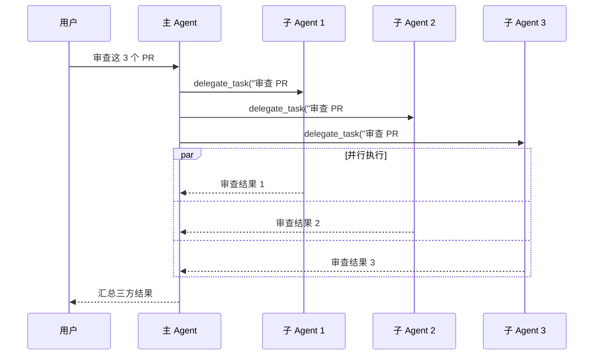
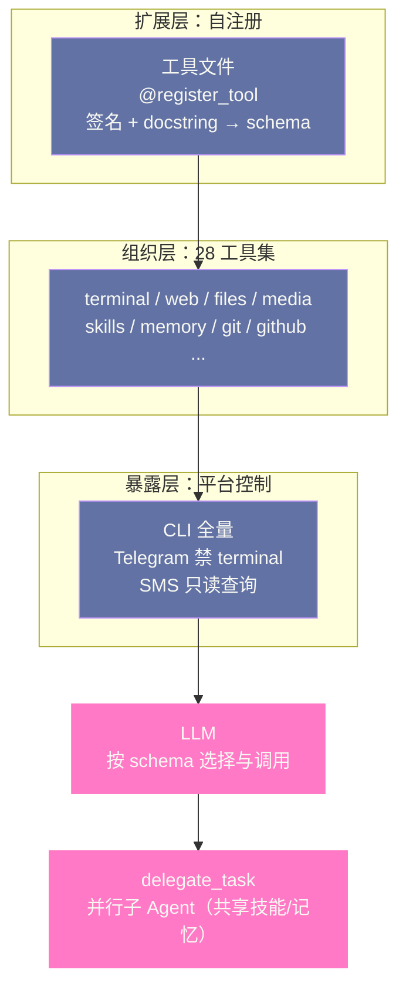

# 09 工具系统——70+ 工具与 28 工具集

> [!abstract] 摘要
> [[08 终端后端七剑——从 Local 到 Vercel Sandbox|上一篇]]拆解了"执行环境"。本文深入 Hermes 的"工具系统"——Agent 的"手和眼"。70+ 工具分属 28 个工具集（terminal/web/files/media/skills/memory 等）——工具是 Agent 与世界交互的接口。文章从工具的自注册机制开始——每个工具文件在导入时自注册到 registry.py——"添加新工具"只需"创建新文件并自注册"。然后拆解 28 个工具集的分类——terminal（命令执行）、web（浏览搜索）、files（文件操作）、media（图片音频）、skills（技能管理）、memory（记忆操作）等。接着深入工具的 schema 定义——name/description/parameters/returns——以及 schema 如何指导 LLM 调用工具。然后讨论"按平台启用/禁用"——不同消息平台启用不同工具集——如 Telegram 上可能禁用 terminal。接着是"工具集的 fallback 关系"——`fallback_for_toolsets` 让"工具不可用时加载替代技能"。最后分析 `delegate_task` 工具——Hermes 的"并行子 Agent"机制——以及工具与技能的协作。核心认知：Hermes 的工具系统是"自注册 + 工具集 + 平台控制"的三层设计——让"工具扩展"低成本，"工具暴露"可控，"工具组合"灵活。

---

## 第 1 章 工具的自注册机制

### 1.1 什么是自注册

Hermes 的工具系统采用"自注册"（self-registration）机制——每个工具文件在"被导入时"自动注册到 `registry.py`——不需要"修改中央注册表代码"。

在展开机制细节之前，先明确自注册在整个工具架构中的位置：它解决的是**"工具如何进入系统"**的问题——与之配套的还有"工具如何组织"（工具集，第 2 章）和"工具如何暴露"（平台控制，第 4 章）。三问合起来构成工具系统的完整生命周期——进得来、分得清、管得住。

### 1.1.1 "自注册"与"微服务注册"的类比

"自注册"在微服务架构中也有类似概念——如 Eureka/Consul 的"服务自注册"——微服务启动时自动注册到服务发现中心——不需要"手动配置服务列表"。Hermes 的工具自注册与此类似——工具文件"启动"（被导入）时自动注册到 registry——不需要"手动配置工具列表"。这种"自注册"模式在"组件数量多且经常变化"的系统中特别有价值——如微服务可能有几十上百个，手动维护"服务列表"不现实——自注册让"服务列表"自动维护。Hermes 的 70+ 工具也是类似——手动维护"工具列表"不现实——自注册让"工具列表"自动维护。

这个类比还有一个延伸值得点破：微服务自注册解决的是"实例的动态性"（服务会扩缩容、会迁移），工具自注册解决的是"集合的开放性"（工具会持续增加）。两者的共同本质是**把"清单的维护"从"集中人工"变成"分散自动"**——凡是"成员会持续增长且成员自描述"的集合，都适合这个模式。反过来说，成员固定且不自描述的集合（如配置项），集中管理反而更清晰——模式没有优劣，只有适配。

### 1.2 自注册的工作方式

典型工具文件的结构：

```python
# tools/web_fetch.py
from .registry import register_tool

@register_tool
def web_fetch(url: str, selector: str = None) -> dict:
    """Fetch a URL and optionally extract content via CSS selector."""
    # ... 实现逻辑 ...
    return {"content": content, "status": status}
```

当 `tools/web_fetch.py` 被导入时，`@register_tool` 装饰器自动把 `web_fetch` 函数注册到 `registry.py` 的工具字典中——包括函数名、参数签名、docstring（作为 description）。这种"装饰器注册"让"添加新工具"只需要"创建新文件 + 用装饰器"——不需要修改其他文件。

这个代码样例还透露了一个设计细节：**schema 的三个来源——函数签名、类型注解、docstring——全部是 Python 的语言原生特性**。`url: str` 给出参数类型，`selector: str = None` 给出可选性，docstring 给出描述——注册器只是把这些"程序员本来就要写的东西"翻译成了 LLM 可用的 schema。没有额外的 schema 文件、没有 YAML 配置——**工具的文档就是它的代码**——这也是"schema 与实现永不脱节"的根本原因（第 3 章展开）。

### 1.3 自注册的优势

**低扩展成本**：添加新工具不需要"修改中央注册表"——只需要"创建新文件"——这降低了"扩展"的门槛和风险。如"社区贡献者想添加一个 RSS 工具"——只需要创建 `tools/rss_fetch.py` 并用 `@register_tool`——不需要修改 `registry.py`——不会"碰核心代码"。

**自动发现**：Hermes 在启动时扫描 `tools/` 目录，自动导入所有 `.py` 文件——触发自注册。这意味着"新工具文件"只要放在 `tools/` 目录就会被发现——不需要"手动注册到某处"。

**解耦**：每个工具文件是"自包含的"——工具的实现、schema、注册都在一个文件中——不依赖"中央配置"。这种"解耦"让工具可以"独立开发、独立测试、独立维护"——如"移除一个工具"只需要"删除文件"——不会影响其他工具。

三条优势的共同指向是**贡献门槛的降低**。"碰核心代码"是社区贡献的最大心理障碍——改错了影响全局、review 负担重、合并冲突风险高；而"新增一个自包含文件"是最低风险的贡献形态——review 者只需要看一个文件，出问题删掉即可。70+ 工具的规模，很大程度上是"低门槛贡献"喂养出来的——**扩展机制的设计，决定了生态的规模上限**。

用"添加一个工具"的全流程来体感这个门槛：创建 `tools/rss_fetch.py`、写一个带类型注解的函数、加 `@register_tool` 装饰器、写清楚 docstring——四步，全部在一个新文件里完成。对比中央注册模式（改 registry、可能改 toolsets 分组、处理 import 顺序），自注册把"接触面"压缩到了单文件——**接触面的大小，就是贡献者需要理解的项目面积**。

### 1.4 自注册的"插件扩展"

自注册机制不只适用于"内置工具"——也适用于"插件工具"。第三方插件可以包含自己的工具文件——插件加载时，工具文件被导入并自注册——插件工具与内置工具"平起平坐"。这种"插件工具"让"工具生态"可以"社区扩展"——如"某社区开发者贡献了 Slack 工具插件"——安装后 Slack 工具自动可用——与内置工具无区别。这种"平起平坐"是 Hermes "可扩展"设计的关键——内置和插件在"工具层"没有"二等公民"。

### 1.5 自注册的代价与应对

自注册不是没有代价的，诚实的评估需要把代价摆出来。其一是**导入副作用**——"导入即注册"意味着导入一个工具文件就会执行注册逻辑——测试隔离、按需加载、循环导入防护都因此变微妙（第 03 篇提过）。其二是**注册冲突**——两个文件注册同名工具时，行为取决于注册器的冲突策略（覆盖还是报错）——需要明确的约定。其三是**启动开销**——扫描并导入全部工具文件，工具数量增长会拖慢启动——对长驻进程这是一次性成本，但对 CLI 的频繁冷启动是可感知的。

Hermes 的应对是把注册做成"轻量声明"——导入时只登记元数据（名字、签名、描述），不做重活；真正的初始化推迟到工具首次被调用。**注册便宜、执行谨慎**——这个组合让自注册的便利性没有被工程代价抵消，是"自注册"模式能撑起 70+ 工具的关键。

> [!info] 核心概念：自注册 vs 中央注册
> 传统"中央注册"方式需要在"中央文件"中列出所有工具——如 `registry = [tool_a, tool_b, tool_c]`——添加工具需要修改这个列表。自注册方式让"工具自己注册自己"——中央文件只提供"注册机制"——不维护"工具列表"。这种差异在"工具数量多"时显著——Hermes 有 70+ 工具——如果用中央注册，"注册列表"会很长且"每次添加都要改"——自注册让"70+ 工具"的管理成本接近常数。这与 [[LLM/Coding-Agent运行范式/04 MCP 协议深度解析——Agent 与工具的标准化连接|Coding Agent 专栏第 4 篇]]讨论的 MCP"工具自描述"理念呼应——好的工具系统让"工具自管理"。

---

## 第 2 章 28 个工具集的分类

### 2.1 工具集的概念

70+ 工具按功能分为 28 个"工具集"（toolsets）——如 `terminal` 工具集包含"命令执行"相关工具，`web` 工具集包含"浏览搜索"相关工具。工具集是"工具的组织单位"——也是"启用/禁用的单位"——如"禁用 terminal 工具集"会禁用所有 terminal 相关工具。

工具集在 Hermes 的三层工具架构（注册 → 分组 → 暴露）中处于中间层，它同时向上和向下提供服务：**向下**，它给 70+ 工具一个归属（每个工具声明自己属于哪个集）；**向上**，它给配置系统和技能的条件激活一个操作单位（禁用一个集、声明依赖一个集）。没有这一层，"按功能批量管理工具"就无从谈起——工具集是"管理粒度"的物化。

### 2.1.1 "工具集"与"工具"的层级关系

工具集和工具是"父子层级"——一个工具集包含多个工具——如 `web` 工具集包含 `web_fetch`、`web_search`、`web_extract` 等。这种层级关系让"管理"可以"按集"而非"按工具"——如"禁用 web 工具集"比"逐个禁用 web_fetch、web_search、web_extract"更方便。同时，"启用/禁用"的"权限控制"也按集——如"Telegram 上禁用 terminal 集"——而非"逐个禁用 execute_command、read_file、write_file"——简化了配置。这种"集级别管理"是"28 集"设计的核心价值——把"70+ 工具的管理"简化为"28 集的管理"。

### 2.2 主要工具集

| 工具集 | 功能 | 典型工具 |
| :--- | :--- | :--- |
| terminal | 命令执行 | execute_command、read_file、write_file |
| web | 浏览搜索 | web_fetch、web_search、web_extract |
| files | 文件操作 | file_search、file_tree、file_diff |
| media | 图片音频 | image_generate、audio_transcribe、tts |
| skills | 技能管理 | skills_list、skill_view、skill_manage |
| memory | 记忆操作 | read_memory、write_memory、search_sessions |
| messaging | 消息平台 | send_message、send_media |
| calendar | 日历 | calendar_view、calendar_create |
| email | 邮件 | email_send、email_read |
| git | 版本控制 | git_status、git_commit、git_diff |
| github | GitHub API | gh_pr、gh_issue、gh_workflow |
| docker | 容器管理 | docker_run、docker_build |
| k8s | K8s 管理 | kubectl、helm |
| cloud | 云服务 | aws_cli、gcloud |
| search | 搜索引擎 | google_search、bing_search |
| rag | 检索增强 | rag_query、rag_index |
| ... | ... | ... |

这张表里有一个值得注意的分组信号：`skills` 和 `memory` 本身也是工具集——技能管理和记忆操作被"工具化"了。这意味着 Agent 对自己的技能库和记忆库的访问，走的是与外部工具完全相同的通道（schema、注册、平台控制）——**自我管理能力与外部交互能力在架构上同构**。这个设计的深意是：Agent 的"内省"（查看自己有哪些技能、回忆自己的记忆）不需要特殊机制，就是普通的工具调用——统一抽象又一次简化了系统。

### 2.3 工具集的"粒度"设计

28 个工具集的粒度是"中等"——不是"一个工具一个集"（太碎），也不是"所有工具一个集"（太粗）。如 `terminal` 集包含"命令执行 + 文件读写"——这些是"紧密相关"的功能——适合一个集。而 `git` 和 `github` 是分开的——虽然相关，但"git 是本地操作，github 是 API 操作"——分开让"启用 git 不启用 github"成为可能——如"只允许本地 git 操作，不允许 github API 操作"的场景。

**粒度的权衡**：粒度太细（如"每个工具一个集"）会让"启用/禁用管理"繁琐——28 个工具集已经够多，如果是 70 个更难管。粒度太粗（如"所有工具一个集"）让"精细控制"不可能——如"启用 web_search 但禁用 web_fetch"做不到。Hermes 的"28 集"是"管理便利"和"控制精细"的平衡——大多数场景下"集级别控制"足够。

### 2.5 工具集与平台预设

28 个工具集如果全靠用户逐个配置，门槛不低——Hermes 的解法是**平台预设**（`toolsets.py` 中的"平台预设"逻辑）：每个入口类型有一套默认的工具集组合——CLI 默认全量、Telegram 默认"安全子集"、SMS 默认"只读子集"。预设解决的是"从零配置"的问题——用户装完就能用，且默认就是合理的；`hermes tools` 命令则服务于"从预设微调"——在合理默认的基础上按需增删。

"预设 + 微调"是配置设计的经典分层：**预设承载"多数人的最佳实践"，微调承载"个体差异"**——两者缺一不可。只有微调，新用户面对 28 个工具集无从下手；只有预设，特殊需求（"我就是想在 Telegram 上跑命令"）无法满足。

git 与 github 分家的例子值得再深挖一层，因为它揭示了工具集划分的真正标准——**不是功能相关性，而是安全边界**。git 和 github 功能上高度相关（都是版本控制），但它们的信任模型完全不同：本地 git 操作只影响本机仓库，github API 操作会把代码推到外部服务、可能触发 CI、可能公开内容。"只允许本地 git、禁止 github 推送"是一个真实的安全需求（防止 Agent 把内部代码推到外部仓库）——只有把两者拆成独立的工具集，这个需求才可配置。**工具集的边界画在信任模型的变化处，而不是功能的相似处**。

### 2.4 工具集的"研究导向"

Hermes 的工具集反映了"研究工具"定位——如 `rag`（检索增强）、`docker`（容器）、`k8s`（K8s）、`cloud`（云服务）——这些是"AI 研究和工程"常用工具。对比"通用 Agent"如 ChatGPT——ChatGPT 的工具更"消费导向"（如"图片生成"、"网页浏览"）——Hermes 的工具更"工程导向"（如"K8s 管理"、"容器构建"）。这种"工程导向"让 Hermes 适合"开发者/研究员"用户——他们需要"操作基础设施"的能力——而非只是"查信息/生成图片"。这也是 Hermes "个人 Agent + 研究工具"双重定位的工具层体现。

工程导向的工具清单还有一层信号意义：**工具集的构成预示了产品的目标场景边界**。有 k8s/cloud 集，意味着 Hermes 预期用户会让它操作生产基础设施——这反过来解释了为什么审批机制、平台控制、沙箱后端在这些篇章里被反复强调——工具的野心决定了安全机制的规格。看一个 Agent 产品的工具清单，基本能推断出它对"自己会被用来做什么"的想象。

工具清单是产品定位最诚实的宣言——营销文案可以随便写，但"愿意为哪类工具维护适配"骗不了人。Hermes 的工具集里 k8s、docker、cloud 这些"基础设施操作"类工具占相当比例，说明它的目标用户画像里"操作基础设施的人"权重很高——这与第 01 篇"个人自动化 + 研究工具"的定位互相印证。**看一个 Agent 的工具集，比看它的宣传语更能判断它是给谁用的**。

---

## 第 3 章 工具的 Schema 定义

### 3.1 Schema 的角色

工具的 schema 是"LLM 与工具的契约"——schema 告诉 LLM "这个工具叫什么、做什么、需要什么参数、返回什么"。LLM 根据 schema 决定"调用哪个工具"和"传什么参数"。

强调一下这个契约的单向性：**LLM 只能通过 schema 认识工具**——它看不到工具的实现代码、看不到工具的实际行为、看不到其他用户的调用历史。schema 写什么，LLM 就"知道"什么——schema 没写的，对模型而言等于不存在。这个单向性决定了 schema 质量的下限就是工具可用性的下限——这也是后面几节反复强调 description 精确性的根本原因。

### 3.1.1 "契约"的工程意义

"契约"（contract）在软件工程中是"接口的明确约定"——如 API 的 OpenAPI 规范是"前后端的契约"。Hermes 的工具 schema 是"LLM 与工具的契约"——LLM 按 schema 调用，工具按 schema 实现——双方都遵守"契约"——协作才能成功。如果"契约"不明确（如 description 模糊）——LLM 可能"误解工具功能"——调用错误——导致任务失败。因此"契约质量"直接影响"Agent 可靠性"——好的 schema 让 LLM 准确调用，坏的 schema 让 LLM 频繁出错。这也是为什么"schema 自动生成"有价值——从"代码签名"生成的 schema 比"手写 schema"更不容易"与实现脱节"——因为"代码签名"就是"实现的真实接口"。

契约的读者值得特别指出——**schema 的"用户"是 LLM，不是人类开发者**。人类读 API 文档时可以容忍模糊（会去翻源码），LLM 只能看到 schema 里写的内容——schema 之外的信息对它不存在。这改变了"好文档"的标准：人类文档追求"简洁"，LLM 文档追求"无歧义"——一个人类觉得"啰嗦"的参数描述（"包含协议前缀的完整 URL"），对 LLM 恰恰是必要的消歧信息。**为 LLM 写文档，要当作读者是一个"聪明但字面主义"的新同事**。

### 3.2 Schema 的结构

Hermes 工具的 schema 通常包含：

```python
{
    "name": "web_fetch",
    "description": "Fetch a URL and optionally extract content via CSS selector.",
    "parameters": {
        "type": "object",
        "properties": {
            "url": {"type": "string", "description": "The URL to fetch"},
            "selector": {"type": "string", "description": "CSS selector to extract"}
        },
        "required": ["url"]
    },
    "returns": {
        "type": "object",
        "properties": {
            "content": {"type": "string"},
            "status": {"type": "integer"}
        }
    }
}
```

### 3.3 Schema 如何指导 LLM

三个字段对应了工具调用的三个决策阶段——**选哪个工具（name+description）、怎么调（parameters）、怎么解读结果（returns）**。值得注意的是 returns 字段常被工具作者省略——但它是"调用闭环"的最后一环：返回格式明确时，LLM 直接提取关键字段；省略时，模型把整个返回体塞进上下文自己猜——费 token 且可能误读。**契约的完整性取决于最被忽视的那一段**。

**name + description**——LLM 用这两个字段判断"是否调用这个工具"。description 应该"精确描述工具功能"——如"Fetch a URL and extract content"——而非"Get web page"（太模糊）。好的 description 让 LLM 准确匹配"用户意图"和"工具功能"。

**parameters**——LLM 用这个字段构造"调用参数"。parameters 是 JSON Schema 格式——定义了"参数名、类型、是否必填、描述"。LLM 从"用户对话"中提取信息，按 parameters 的定义构造参数——如用户说"获取 example.com 的内容"——LLM 提取 `url="example.com"`，构造 `{"url": "example.com"}` 调用。

**returns**——告诉 LLM "工具返回什么格式"——让 LLM 知道"如何解读返回值"。如 `web_fetch` 返回 `{"content": ..., "status": ...}`——LLM 知道"看 content 字段获取页面内容"。

三个字段对应了工具调用的三个决策阶段——**选哪个工具（name+description）、怎么调（parameters）、怎么解读结果（returns）**。值得注意的是 returns 字段常被工具作者省略——但它是"调用闭环"的最后一环：LLM 不知道返回结构时，只能把整个返回体塞进上下文自己猜——返回格式明确时，LLM 可以直接提取关键字段，省 token 也少出错。**契约的完整性，取决于最被忽视的那一段**。

### 3.4 Schema 的"自描述"特性

Hermes 的工具 schema 在"自注册"时自动从"函数签名 + docstring"生成——如 `def web_fetch(url: str, selector: str = None)` 自动生成 `parameters` 的 `url`（string，required）和 `selector`（string，optional）。这种"从代码自动生成 schema"让"schema 与实现始终一致"——不会出现"schema 说需要 url 参数但实现没有"的脱节。这也是"自注册"的额外好处——不只注册了工具，还自动生成了 schema。

自动生成覆盖的是 schema 的"结构部分"（参数名、类型、必填性）——"语义部分"（描述写得好不好）仍然取决于 docstring 的质量。这个分工要认清：**结构正确性由机制保证，语义质量由人负责**——自动生成不是"不用认真写 docstring"的借口，恰恰相反，它让 docstring 成为 schema 质量的唯一变量，责任更加集中。

"自动生成"消除的是一类特定的腐化——**文档与实现的漂移**。手写 schema 的系统里，函数改了参数、schema 忘了更新，是迟早发生的（人和文档天然不同步）；自动生成后，"改签名"和"改 schema"是同一个动作，漂移在结构上不可能发生。这类"让错误状态不可表达"的设计，比"靠 review 防止不一致"可靠得多——**好的工程把正确性做进结构，而不是做进流程**。

### 3.5 Schema 与"Function Calling"标准

Hermes 的工具 schema 与 OpenAI/Anthropic 的"Function Calling"格式兼容——这意味着 Hermes 的工具可以直接作为"function"传给 LLM API——LLM 用其"function calling"能力选择和调用工具。这种"兼容标准"让 Hermes 不需要"自定义工具调用协议"——用 LLM 原生的 function calling 即可。这与 [[LLM/Coding-Agent运行范式/03 Tool Use 与 Function Calling——三大厂商的标准化博弈|Coding Agent 专栏第 3 篇]]讨论的"Function Calling 标准化"呼应——Hermes 顺应了"Function Calling"标准，而非"另起炉灶"。

"顺应标准"的收益在第 02 篇已经算过一笔（11 种 parser 的适配成本），这里补一个工具侧的视角：**schema 兼容 Function Calling 标准，意味着 Hermes 的工具天然可以被其他兼容 Agent 复用**——一个写好的工具函数，稍作包装就能给 Claude Code 或其他支持 function calling 的框架用。工具的可移植性与技能的可移植性（agentskills.io）一起，构成 Hermes 资产的"双通道外流"能力——这既是生态贡献，也是生态吸引力。

### 3.6 Schema 的"参数描述"重要性

`parameters` 中每个参数的 `description` 对 LLM 调用准确性至关重要——如 `url` 参数的 description "The URL to fetch"——LLM 知道"传一个 URL 字符串"。如果 description 模糊（如"The target"）——LLM 可能不确定"target 是什么"——导致传错参数。好的参数 description 应该"明确说明参数含义和格式"——如"The URL to fetch, including protocol (https://...)"——比"The URL"更精确——告诉 LLM "包含协议"。这种"参数描述精度"直接影响"工具调用准确率"，是 schema 质量的关键维度。

参数描述的黄金标准是**"把格式约束写进描述"**——"包含协议前缀的完整 URL"比"URL"多传达了"要不要带 https://"这个高频歧义点；"ISO 8601 格式的日期字符串"比"日期"消除了"2026-09-05 还是 September 5"的歧义。LLM 不会追问澄清（它倾向于直接猜），所以**每一个没写进描述的格式假设，都是一次潜在的调用失败**。

### 3.7 Schema 质量的保障机制

Schema 质量依赖开发者的描述功底，这个"人的因素"需要机制来兜底。可行的保障有三层：其一，**结构保证**——自动生成机制保证了"签名与 schema 一致"这一半（第 3.4 节）；其二，**审查保证**——新增工具的 PR 审查把"description 是否精确"列为检查项——与代码审查同流程；其三，**测试保证**——用 LLM 做"意图匹配测试"：给定典型用户表述，验证模型是否选中正确的工具和参数——选错即 schema 不合格。三层里最有效的是第三层——它把"描述质量"从主观判断变成了可测量的指标——**schema 的验收标准是"LLM 能否用对"，而不是"作者觉得写清楚了"**。

---

## 第 4 章 按平台启用/禁用工具

### 4.1 为什么需要"按平台控制"

不同消息平台适合不同的工具集——如：
- **CLI**——启用所有工具——完整能力
- **Telegram**——可能禁用 terminal——手机上不方便审查命令
- **Discord**——可能禁用 docker/k8s——不希望在公共频道执行基础设施操作
- **SMS**——只启用"信息查询"类工具——短信场景限制大

四个平台的配置差异，本质上是两个变量在不同取值：**入口的信任度**（谁能发消息）和**交互的带宽**（能审查多复杂的输出）。CLI 信任度最高、带宽最大，所以全开；SMS 两项都最低，所以只读。记住这两个变量，面对任何新平台（譬如未来的某个语音入口）都能推出合理的默认配置——**平台策略不是逐个记忆的清单，而是两个变量的函数**。

### 4.1.1 "平台信任度"的光谱

"按平台控制"背后是"平台信任度光谱"——不同平台的"信任度"不同——因为"谁能访问该平台"不同。CLI 是"只有你自己"——信任度最高——可以启用所有工具。Telegram 是"任何给你发消息的人"——信任度中等——需要限制危险工具。Discord 公共频道是"任何频道成员"——信任度低——需要严格限制。SMS 是"任何知道你手机号的人"——信任度最低——只允许"信息查询"。这种"信任度光谱"让"按平台控制"不是"一刀切"——而是"按信任度调整工具暴露"——体现了"威胁模型驱动"的安全设计。

信任度光谱可以与第 07 篇的授权机制串起来看：allowlist/DM pairing 决定"谁能说话"，工具启用决定"能说话的人能让 Agent 做什么"——两者是串联的两道闸门。只配授权不控工具，等于"认证了访客但没锁保险柜"；只控工具不配授权，等于"锁了保险柜但谁都能进屋"。**入口控制（授权）与能力控制（工具）是正交的两维，缺一不可**。

### 4.2 配置方式

`hermes tools` 命令（`hermes_cli/tools_config.py`）让用户按平台配置工具集：

```bash
# 查看当前工具配置
hermes tools list

# 在 Telegram 上禁用 terminal 工具集
hermes tools disable terminal --platform telegram

# 在 Discord 上只启用 web 和 messaging
hermes tools enable-only web messaging --platform discord
```

三条命令对应三种配置心智：`list` 是"看清现状"（配置前先审计）、`disable` 是"黑名单模式"（默认全开，关掉危险的）、`enable-only` 是"白名单模式"（默认全关，只开需要的）。两种模式的适用场景不同——个人设备用黑名单（方便优先），公共入口用白名单（安全优先）——**配置命令的设计同时支持两种安全哲学，选择权在用户**。

### 4.3 "按平台控制"的安全意义

"按平台控制"是"最小权限原则"的体现——每个平台只暴露"该平台需要的工具"——减少"攻击面"。如"Telegram 上禁用 terminal"——即使 Agent 被诱导执行恶意命令，terminal 工具不可用——命令无法执行。这种"平台级最小权限"比"全局工具控制"更精细——适应"不同平台不同信任度"的现实——如"CLI 是自己用的，信任度高；Telegram 可能被他人发消息，信任度低"。

从攻击链的角度看，平台级禁用的价值在于**把"最危险的工具"从"最不可信的入口"上摘掉**。提示注入的攻击路径是"不可信内容 → 诱导模型 → 调用工具"——链条的最后一环必须经过真实存在的工具——terminal 不在 Telegram 的工具清单里，注入的指令再逼真也无法落地为命令执行。**安全设计的高杠杆动作，是识别"高危工具 × 低信入口"的组合并切断它**——平台级控制正是这个动作的机制化。

从攻击链的角度看，平台级禁用的价值在于**在链条早期就剪断它**。提示注入攻击要造成实际损害，必须走到"调用危险工具"这一步——terminal 工具不存在，注入的指令再逼真也只是空谈。这比"事后审批"更彻底：审批依赖模型正确识别危险（可能被绕过），工具不存在则物理上无法执行。**"让危险的事不可能发生"永远优于"让危险的事需要批准"**——这是最小权限原则比审批机制更根本的原因。

### 4.4 "按平台控制"的"用户体验"考量

除了安全，"按平台控制"也影响"用户体验"——如"在 SMS 上只启用信息查询工具"——因为 SMS 的"短消息"形式不适合"长输出"——如"执行命令返回 100 行输出"在 SMS 上难以阅读。通过"限制 SMS 上只做信息查询"——确保"SMS 交互的输出适合短信形式"——如"今天天气 25 度"——而非"命令执行的 100 行日志"。这种"平台适配"让"每个平台的体验"都"适合该平台的特性"——而非"所有平台同样的体验"。

用户体验维度的控制还有一个常被忽略的收益——**它保护了用户对 Agent 的信任**。想象用户在 SMS 上让 Agent"看看服务器状态"，收到 100 行日志碎片——这种"答非所问的格式"会让人怀疑 Agent 的能力；而"服务器 CPU 15%、内存 62%、一切正常"这样的摘要式回答则建立信任。工具暴露的节制，本质上是在防止 Agent 在错误的场合展示错误形态的能力——**能力展示的场合适配，是产品感的一部分**。

### 4.5 动态工具暴露的想象空间

按平台控制是"静态的"——配置一次，长期生效。更进一步的方向是"动态暴露"——根据当前任务的上下文，只把相关工具集暴露给 LLM（本章思考题 1 讨论的方向）。动态暴露解决的真问题是**LLM 的工具选择准确率随工具数量下降**——70+ 工具的完整 schema 全部塞进系统提示，既费 token 又增加选错工具的概率；只暴露 5 个相关工具，选择又快又准。

动态暴露的难点在于"谁来判断哪些工具相关"——如果让 LLM 自己先选工具集再选工具，是两跳决策（每跳都可能错）；如果用规则预判（按会话平台、按任务类型），则损失灵活性。Hermes 当前用"平台级静态配置 + 技能按需引导"的折中：工具全集可用，但技能的 Procedure 会引导模型用对工具——**用知识弥补选择面过大的问题**。这个折中是否会被"真正的动态暴露"取代，取决于工具数量继续增长的速度。

---

## 第 5 章 工具集的 Fallback 关系

### 5.1 什么是 Fallback

`fallback_for_toolsets` 是技能的 front-matter 字段（如第 05 篇所述）——当指定工具集不可用时，技能作为"替代方案"加载。如"web_search 工具不可用时，加载'手动浏览搜索'技能"——让 Agent 在"工具缺失"时仍有应对方案。

### 5.1.1 Fallback 的"韧性"价值

Fallback 体现了"韧性"（resilience）设计理念——系统在"部分组件失效"时仍能"降级运行"——而非"完全崩溃"。在 Agent 语境下，"工具不可用"是常见的"部分失效"——如"API key 过期"、"工具被禁用"、"环境不支持"——没有 fallback 的 Agent 遇到"工具不可用"就"做不到"——有 fallback 的 Agent 可以"用替代方法"——虽然"次佳"但"能做"。这种"韧性"让 Agent 更"可靠"——在各种"不完美条件"下仍能交付价值——而非"要求所有条件完美才能工作"。

韧性的价值在长驻场景被放大：会话级工具的"工具不可用"是暂时的（用户会修好再试），长驻 Agent 的"工具不可用"可能持续数小时无人察觉（凌晨 API key 过期）——这段时间里 Agent 要么"优雅降级"继续服务，要么对所有相关请求说"做不到"。**系统的可靠性感，取决于它在"最糟的一天"里的表现，而不是"最好的一天"**——fallback 就是"最糟的一天"的预案。

### 5.2 Fallback 的使用场景

**工具被禁用**——如"Telegram 上禁用了 terminal"——但用户要求"执行命令"——Agent 没有 terminal 工具——此时如果有"手动执行指南"技能作为 fallback——Agent 可以"告诉用户如何手动执行"——而非"我做不到"。

**工具不可用**——如"web_search 工具因为 API key 过期不可用"——fallback 技能"用浏览器手动搜索"让 Agent 仍能搜索——虽然比"直接用工具"慢，但比"做不到"好。

**环境限制**——如"在 Serverless 后端中，某些系统调用不可用"——fallback 技能提供"替代方法"——让 Agent 适应"环境限制"。

### 5.3 Fallback 的"优雅降级"理念

Fallback 体现了"优雅降级"（graceful degradation）理念——当"最佳方案"（用工具）不可用时，用"次佳方案"（用技能）——而非"完全失败"。这种"降级"让 Agent 更"鲁棒"——在各种"工具缺失"场景下仍能工作——而非"一个工具缺失就整个任务失败"。

优雅降级与"静默失败"的对比，最能体现这个理念的价值。没有 fallback 的 Agent 遇到工具缺失，输出是"我做不到"——用户得到的是一次失败的交互；有 fallback 的 Agent 输出是"直接搜索不可用，你可以这样手动查"——用户得到的是可执行的指引。两种实现的代码差距可能只有几行，用户体验的差距却是"Agent 没用"与"Agent 贴心"——**鲁棒性是一种用户可感知的品质，而不是一个内部指标**。

### 5.4 Fallback 与"工具集条件激活"的配合

如第 05 篇所述，技能的 `requires_toolsets` 和 `fallback_for_toolsets` 是"条件激活"机制——`requires_toolsets` 是"正向条件"（有这个工具集才激活），`fallback_for_toolsets` 是"反向条件"（没有这个工具集才作为 fallback 激活）。两者配合实现了"工具可用时用工具，不可用时用技能"的自动切换——如"web 工具集可用时，不加载'手动浏览'技能；web 不可用时，加载'手动浏览'技能作为 fallback"——这种"自动切换"让 Agent 适应"工具可用性的动态变化"——如"用户在 CLI 上 web 可用，在 Telegram 上 web 被禁用"——同一技能在两个平台上行为不同——CLI 上不激活（web 工具可用），Telegram 上激活作为 fallback。

正向与反向条件的组合，实质上构建了一个**能力感知的技能调度器**——技能库不再是静态清单，而是随环境能力实时伸缩的活系统。用一个具体场景走一遍：用户在 Telegram 上说"搜一下这个新闻"——web 工具集被禁用——`requires_toolsets: [web]` 的"快速搜索"技能不加载，`fallback_for_toolsets: [web]` 的"手动浏览指南"技能自动激活——Agent 回复"我无法直接搜索，但你可以这样手动查……"。**同一个用户请求，在不同能力环境下得到不同的、但都合理的响应**——这就是条件激活机制的价值。

### 5.5 Fallback 的设计边界

Fallback 也不是越多越好，它的设计边界值得划清。其一，**fallback 的质量必然低于主路径**——"手动浏览指南"永远不如"直接调 web_search"——fallback 是保底不是平替，不能因为有了 fallback 就忽视主路径的可用性。其二，**fallback 链不能太长**——A 工具坏了用 B 技能，B 也坏了用 C 技能——每降一级，结果质量都在下滑，超过两级就该直接告知用户"环境有问题需要修复"。其三，**降级应该可见**——Agent 用 fallback 完成任务时，最好告知用户"这次用的是降级方案"——让用户知道环境有异常，而不是把降级悄悄吞掉。**静默降级是运维的敌人**——它让"系统已经不健康"这个事实被掩盖。

---

## 第 6 章 delegate_task——并行子 Agent

### 6.1 什么是 delegate_task

`delegate_task` 是 Hermes 的"并行子 Agent"工具——让 Agent 可以"把子任务委托给另一个 Agent 实例并行执行"。如"同时审查 3 个 PR"——主 Agent 用 `delegate_task` 创建 3 个子 Agent，每个审查一个 PR——并行执行——主 Agent 汇总结果。

先划清一个概念边界：delegate_task 是**工具**，不是架构特性——它与其他 70+ 工具一样走注册、走 schema、走平台控制。这个定位意味着"并行能力"本身可以被启用/禁用——譬如在资源受限的部署里禁用 delegate 工具集，Agent 就退化为纯串行——**并行是可配置的能力，不是内建的必然**。

### 6.2 工作机制



每个子 Agent 是"独立的 AIAgent 实例"——有自己的会话历史、工具访问、LLM 调用——但共享主 Agent 的"记忆"和"技能"。子 Agent 完成后，把结果返回给主 Agent——主 Agent 汇总。

### 6.3 并行的优势

**时间效率**——3 个 PR 串行审查需要 3 倍时间——并行只需要 1 倍（假设每个审查时间相同）。对于"多个独立子任务"的场景，并行显著减少总时间。

**上下文隔离**——每个子 Agent 有自己的上下文——不会"互相干扰"。如"审查 PR #123"的上下文不混入"审查 PR #456"——每个子 Agent 专注自己的任务——上下文更"干净"。

**成本控制**——子 Agent 可以用"更便宜的模型"——如主 Agent 用 Claude，子 Agent 用 GPT-4o-mini——对于"简单子任务"用便宜模型足够——降低总成本。

三条优势的适用前提各不相同，值得分别标注：时间效率要求子任务** genuinely 独立**（有依赖则并行是假的）；上下文隔离要求子任务**互不引用**（要交叉对比的场景不适合）；成本控制要求子任务**复杂度可估**（估不准则便宜模型可能干不好）。三条前提同时满足的场景并不如想象中多——这也是"先判断再并行"始终必要的原因。

### 6.3.1 "上下文隔离"的工程价值

"上下文隔离"不只是"避免干扰"——还有"上下文窗口管理"的工程价值。如果主 Agent 串行审查 3 个 PR——3 个 PR 的 diff 和评论都累积在主 Agent 的上下文中——可能"撑爆上下文窗口"。而并行子 Agent 各自的上下文只包含"自己审查的 PR"——每个子 Agent 的上下文窗口压力小——可以更"深入"地审查——如"读更多相关文件"——而不担心"上下文不够"。这种"上下文分摊"是并行 Agent 的隐性优势——不只是"快"，还是"上下文可扩展"。

上下文隔离的价值还可以更极端地表述：**并行不只是时间优化，是"把大任务切成上下文装得下的小任务"的手段**。一个需要读 30 个文件的重构分析，单个 Agent 的上下文装不下；拆成 3 个子 Agent 各读 10 个文件、各自产出摘要、主 Agent 只汇总摘要——任务就能完成。在这个视角下，delegate_task 与第 10 篇要讲的"上下文压缩"是互补的两种上下文管理手段——压缩是"挤一挤"，委托是"分出去"。

### 6.4 delegate_task 与"单核心"的关系

`delegate_task` 创建的子 Agent 是"同一个 AIAgent 核心"的实例——不是"不同的循环"——这与第 03 篇的"单核心"设计一致。子 Agent 共享主 Agent 的"技能"和"记忆"——但会话历史隔离——这种"共享知识 + 隔离上下文"让子 Agent 既有"主 Agent 的能力"又不"干扰主 Agent"。

"共享知识 + 隔离上下文"这个组合值得用一句话说透：**子 Agent 继承的是"会什么"，不继承"正在做什么"**。技能（会什么）是沉淀的程序性知识，共享让每个子 Agent 都以"熟练工"状态开工；会话历史（正在做什么）是进行时的上下文，隔离让每个子 Agent 的注意力不被兄弟任务污染。如果反过来——共享上下文、隔离技能——子 Agent 就成了"知道所有八卦但什么都不会干"的帮手，毫无价值。

### 6.5 delegate_task 的"任务粒度"考量

`delegate_task` 适合"中等粒度"的任务——如"审查一个 PR"（包含多步操作）——而非"太细"（如"读一个文件"——直接用 read_file 工具更快）或"太粗"（如"重构整个项目"——子 Agent 之间有复杂依赖，不适合并行）。"中等粒度"是"并行收益最大"的粒度——子任务足够大让"并行节省的时间显著"，又足够小让"子任务之间独立"。这种"粒度判断"由 LLM 做——LLM 根据"任务结构"判断"是否适合 delegate"——好的 LLM 能合理判断"何时并行"，避免"过度并行"或"不足并行"的两个极端。

粒度判断的失效模式值得点名：**过度并行**（把有依赖的步骤拆给不同子 Agent，结果互相等待甚至冲突）和**装饰性并行**（把一个本可以直接做的简单任务包装成委托，徒增开销）。两者的根源都是"为了并行而并行"。delegate_task 的 description 里"用于独立、可并行的子任务"这句指导，就是针对这两个失效模式的——**并行是一个工程决策，不是一个默认姿势**。

### 6.6 delegate_task 的"成本控制"

delegate_task 的"成本控制"不只是"子 Agent 用便宜模型"——还包括"限制子 Agent 的工具调用次数"——如"子 Agent 最多调用 20 次工具"——防止"子 Agent 失控循环调用工具消耗大量 token"。这种"调用限制"是"并行 Agent"的"安全阀"——防止单个"失控子 Agent"拖垮整个"并行任务"的成本。这种"限制"在 delegate_task 的 schema 中定义——LLM 在创建子 Agent 时传入"工具调用上限"。这种"成本控制"机制让"并行 Agent"在"效率"和"成本"之间有"安全边界"，避免"并行"变成"成本爆炸"的隐患。

调用上限这个设计还有一个容易被忽略的心理学效应——**它迫使委托时想清楚**。给子 Agent 设定"最多 20 次工具调用"，等于要求主 Agent 在委托前估计"这个任务大概需要多少工作"——这个估计本身就是任务分解的一部分。没有上限的委托，模型倾向于"先派出去再说"；有上限的委托，模型必须先想"子任务到底多大"。**资源约束倒逼规划质量**——这是所有"预算制"设计的共同红利。

### 6.7 结果的汇总与失败处理

并行委托的收尾环节同样有设计含量：子 Agent 的结果如何汇总、子 Agent 失败怎么办。汇总的理想形态是**结构化返回**——每个子 Agent 返回"结论 + 依据 + 状态"，主 Agent 按字段拼接而非自由文本解析——这要求 delegate_task 的返回契约清晰。失败处理则要区分"部分失败"（3 个子任务成了 2 个）和"全部失败"——前者应该"交付 2 个结果 + 明确报告 1 个失败"，后者才整体报错。**并行系统的可靠性 = 单个任务的可靠性 × 失败的局部性**——一个子 Agent 失败拖垮整批结果，是并行设计的大忌。

> [!note] 与 Coding Agent 的 Sub-Agent 对比
> Hermes 的 `delegate_task` 与 Claude Code 的 Subagents、Devin 的并行任务类似——都是"主 Agent 委托子 Agent"的模式。但 Hermes 的独特之处是"子 Agent 共享技能和记忆"——因为 Hermes 有"学习闭环"——子 Agent 可以用主 Agent 学到的技能——而 Claude Code/Devin 的子 Agent 通常不共享"程序性记忆"（因为它们没有学习闭环）。这种"共享学习"让 Hermes 的子 Agent "更强"——它们继承了主 Agent 的"经验"。

---

## 第 7 章 工具与技能的协作

### 7.1 工具 vs 技能的定位

如第 05 篇所述：
- **工具**——Agent 的"能力"——"能做什么"——如 `web_fetch` 让 Agent 能"获取网页"
- **技能**——Agent 的"知识"——"怎么做"——如"PR 审查技能"告诉 Agent "PR 审查的步骤"

### 7.2 协作场景

当用户说"审查这个 PR"——Agent 加载"PR 审查技能"（知识）——技能的 Procedure 说"1. 用 gh pr diff 获取 diff"——Agent 调用 `execute_command` 工具（能力）执行 `gh pr diff`——工具返回 diff——Agent 按 Procedure 的下一步继续。这种"技能指导 + 工具执行"的协作让 Agent 既有"知识"又有"能力"——技能告诉"做什么"，工具提供"做的方式"。

把这次协作的调用链拆开，能看到三层知识的接力：**技能层**（PR 审查的流程知识）指导**工具层**（execute_command 的调用），工具层经由**后端层**（第 08 篇的 TerminalBackend）落地执行。三层各司其职、逐层委托——技能不知道命令怎么被执行，工具不知道命令在哪个环境跑——每层的变更都不波及其他层。这条链路是 Hermes 全部抽象设计的缩影：**知识 → 能力 → 执行，逐层解耦，逐层可替换**。

把这次协作的调用链拆开看，能看到三层知识的接力：**技能层**（PR 审查的流程知识）指导**工具层**（execute_command 的调用），工具层经由**后端层**（第 08 篇的 TerminalBackend）落地执行。三层各司其职、逐层委托——技能不知道命令怎么被执行，工具不知道命令在哪个环境跑——每层的变更都不波及其他层。这条链路是 Hermes 全部抽象设计的缩影：**知识 → 能力 → 执行，逐层解耦，逐层可替换**。

### 7.3 "工具缺失"时的协作

如果技能的 Procedure 用了"不存在的工具"——如技能说"用 `github_pr_review` 工具"——但该工具不可用——Agent 会"尝试调用并失败"。好的技能应该用"已有工具"描述步骤——如"用 `execute_command` 执行 `gh pr review`"——而非"用不存在的工具"。这是第 05 篇"技能编写规范"中"不发明命令"的原因——技能应该用"确实存在的工具"。

### 7.4 工具与技能的"协同进化"

工具和技能不只是"静态协作"——它们可以"协同进化"——如"Agent 发现某个工具的用法不显而易见"——学习闭环可能创建一个"如何用这个工具"的技能——这个技能本质是"工具使用指南"——让后续的"工具调用"更准确。反过来，"技能的 Procedure 用了某个工具的特定参数组合"——这个"参数组合"可能反映"工具的最佳实践"——如果工具开发者看到这个"最佳实践"，可能改进工具的"默认参数"——让"不需要技能也能正确使用"。这种"工具 ↔ 技能"的协同进化让"工具系统"和"技能系统"相互促进——工具变好用，技能积累最佳实践——形成"正向循环"。

协同进化还有一个更值得期待的方向——**技能反哺工具设计**。技能的 Pitfalls 段积累的"这个工具容易踩的坑"，本质上是工具的"可用性缺陷清单"——如果工具开发者定期回顾"哪些技能的 Pitfalls 提到了我的工具"，就能发现"该改默认值了"、"该加参数校验了"。技能库因此成为工具的**真实使用数据源**——比任何用户调研都更接近真实使用场景。这个反馈回路目前靠人工，但方向是清晰的。

### 7.5 "工具即能力，技能即智慧"

可以用一句话总结工具与技能的关系——"工具即能力，技能即智慧"。工具给 Agent "能做什么"的能力——如"能执行命令"、"能获取网页"——这是"硬实力"。技能给 Agent "怎么做"的智慧——如"PR 审查的最佳流程"、"部署的注意事项"——这是"软实力"。一个"有能力无智慧"的 Agent 能做事但做不好——如"能执行命令但不知道该执行什么命令"。一个"有智慧无能力"的 Agent 知道做什么但做不了——如"知道该部署但没有部署工具"。Hermes 的"工具 + 技能"双系统让 Agent 既有能力又有智慧——这是"自改进 Agent"的完整形态，也是 Hermes 区别于"纯工具型 Agent"的核心设计。

### 7.6 MCP 工具在体系中的位置

还有一个坐标要标定：MCP 提供的外部工具，在 Hermes 工具体系里处于什么位置？答案是**与内置工具平权、经同一注册表分发**——MCP Server 提供的工具注册进同一个 registry、归属工具集、受平台启用控制——第 05 篇讲的"内置与插件平起平坐"在工具层同样成立。这个设计的意义是：**Agent 的能力边界不取决于"哪些工具是官方写的"，而取决于"哪些工具被接入了"**——MCP 生态的数千个 Server，理论上都是 Hermes 工具系统的潜在供给。70+ 内置工具只是"出厂配置"，真正的工具库边界由用户接入的 MCP Server 决定。

---

## 第 8 章 总结与下一篇导读

### 8.1 本文核心要点

1. **自注册机制**——`@register_tool` 装饰器在导入时自动注册——"添加新工具"只需"创建文件"——低扩展成本
2. **28 个工具集**——按功能分组（terminal/web/files/media/skills/memory 等）——"中等粒度"平衡管理便利和控制精细
3. **Schema 定义**——name/description/parameters/returns——从"函数签名 + docstring"自动生成——schema 与实现始终一致
4. **按平台启用/禁用**——`hermes tools` 命令——不同平台暴露不同工具集——"最小权限原则"
5. **Fallback 关系**——`fallback_for_toolsets`——工具不可用时加载替代技能——"优雅降级"
6. **delegate_task**——并行子 Agent——时间效率 + 上下文隔离 + 成本控制——子 Agent 共享技能和记忆
7. **工具 vs 技能**——工具是"能力"（能做什么），技能是"知识"（怎么做）——协作让 Agent 既有能力又有知识
8. **"单核心"延伸**——delegate_task 创建的子 Agent 是"同一核心"的实例——共享学习闭环

收官前把工具系统的三层设计拼成一张全景图：



回望全篇，工具系统的设计哲学可以浓缩为一句话——**让工具的"供给"无限开放，让工具的"暴露"严格受控**。自注册让任何人都能低成本地添加工具（供给侧开放），工具集与平台控制让每个环境只看到该看到的工具（暴露侧收敛）。这一开一收之间，是"生态繁荣"与"安全可控"这对永恒矛盾的 Hermes 解法——**开放发生在开发时，收敛发生在运行时**——两者互不拖累。

### 8.2 常见误区与澄清

工具系统的高频误读，收官前逐一澄清：

| 误解 | 事实 |
| :--- | :--- |
| "70+ 工具全部同时暴露给 LLM" | 经工具集分组与平台控制过滤——每个环境只暴露该用的子集 |
| "工具越多 Agent 越强" | 工具选择准确率随数量下降——能力边界由"接入的"而非"存在的"工具决定 |
| "schema 是给开发者看的文档" | schema 的读者是 LLM——质量标准是"模型能否用对" |
| "delegate_task 适合一切并行" | 只适合"独立、无共享状态、中等粒度"的子任务 |
| "fallback 技能可以替代主工具" | fallback 是降级保底——质量必然低于主路径 |

其中"工具越多越强"这条最值得展开，因为它与直觉相反。LLM 的工具选择是一个"从候选集中匹配意图"的任务——候选集越大，干扰项越多，匹配越容易出错；同时每个工具的 schema 都占上下文预算——70+ 工具的完整 schema 可能占用数千 token。**工具能力与工具暴露是两个独立变量**——Hermes 的三层设计（注册/分组/暴露）正是为了让前者可以无限增长，而后者始终受控。

### 8.3 下一篇导读

下一篇 [[10 Prompt 工程——三层 Prompt 与上下文压缩]] 将从"工具"转向"Prompt"——深入 Hermes 的 Prompt 系统。三层 Prompt 结构（stable → context → volatile）、prefix caching 的工程优化、上下文压缩机制（LLM 摘要旧对话 + 谱系追踪）、以及 Prompt 如何与记忆/技能/工具协同。

> [!info] 专栏导航
> 本文是 [[00 专栏导览|Hermes Agent 专栏]] 的第 9 篇，"平台与工具"部分的第 3 篇——完成"平台与工具"部分后，下一篇开始"工程与研究"部分。

---

## 参考文献

1. Hermes Agent Tools 文档. https://hermes-agent.nousresearch.com/docs/user-guide/features/tools
2. Hermes Agent Architecture. https://hermes-agent.nousresearch.com/docs/developer-guide/architecture
3. Hermes Agent GitHub. https://github.com/NousResearch/hermes-agent

---

## 思考题

1. **Hermes 有 70+ 工具——但 LLM 的"工具选择"能力有限——太多工具可能让 LLM "选择困难"或"选错工具"。如何平衡"工具丰富"和"选择准确"？** 提示：考虑"工具集动态激活"——不是"所有 70+ 工具同时暴露给 LLM"——而是"根据任务上下文激活相关工具集"——如"用户说审查 PR"时只激活 github 和 terminal 工具集——减少 LLM 的选择范围。这种"动态激活"让 LLM 的选择更准确——但需要"判断哪些工具集相关"——这本身是一个"分类问题"。

2. **delegate_task 创建"并行子 Agent"——但子 Agent 可能"产生冲突的结果"——如两个子 Agent 同时修改同一文件。如何处理"并行冲突"？** 提示：考虑"任务隔离"——delegate_task 应该用于"独立子任务"——如"审查不同的 PR"——而非"有依赖的子任务"——如"一个子 Agent 修改文件，另一个读取"。对于"有依赖"的任务，应该串行而非并行。delegate_task 的 description 应该指导"何时用并行"——如"用于独立、可并行、无共享状态的子任务"。

3. **工具的 schema 从"函数签名 + docstring"自动生成——但 docstring 的质量参差不齐。如果开发者写了"模糊的 docstring"——如"Does web stuff"——schema 的 description 也模糊——LLM 可能选错工具。如何保证 schema 质量？** 提示：考虑"schema 审查"——类似"代码审查"——在 PR 中审查新增工具的 schema 质量——确保 description 精确。或"schema 测试"——用 LLM 测试"给定这个 schema，能否正确匹配典型用户意图"——如"用户说'获取 example.com'——LLM 是否选择 web_fetch"——如果选错，说明 schema 需要改进。
