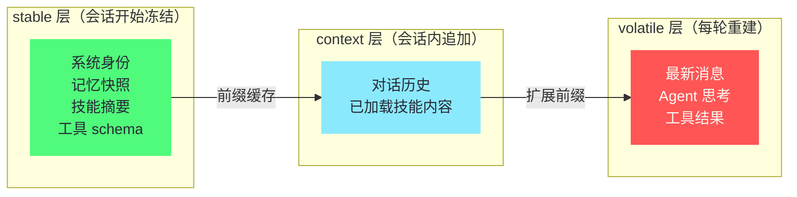

# 10 Prompt 工程——三层 Prompt 与上下文压缩

> [!abstract] 摘要
> [[09 工具系统——70+ 工具与 28 工具集|上一篇]]拆解了工具系统。本文深入 Hermes 的"Prompt 工程"——如何构造让 LLM 高效工作的 prompt。文章从"三层 Prompt 结构"开始——stable（不变层：系统身份/记忆快照/技能摘要）→ context（半变层：当前会话上下文/工具结果）→ volatile（变化层：最新用户消息/Agent 思考）——这种分层让"stable 层"可以被 prefix cache，显著节省 token 成本。然后深入"prefix caching"的工程优化——跨会话 1 小时缓存、缓存命中率优化、stable 层的"冻结"设计。接着拆解"上下文压缩"机制——当对话变长，LLM 摘要旧对话 + 谱系追踪（压缩前完整历史保存为子会话，可搜索可回溯）。然后讨论 Prompt 如何与记忆/技能/工具协同——记忆注入 stable 层、技能按需加载到 context 层、工具结果在 volatile 层。最后分析"Prompt 即代码"的理念——Hermes 的 prompt 是版本控制的代码——而非"随意拼凑的字符串"。核心认知：Hermes 的 Prompt 工程是"成本敏感"的——三层结构和 prefix caching 让"长驻 Agent"的 token 成本可控——这是"长驻"经济可行性的关键。

---

## 第 1 章 三层 Prompt 结构

### 1.1 为什么需要分层

LLM 的 prompt 不是"一个字符串"——而是"多个部分的组合"——系统身份、记忆、技能、对话历史、工具结果、最新消息等。如果这些部分"混在一起"——每次 API 调用都要"重新计算整个 prompt"——成本高。如果按"变化频率"分层——"不变的部分"可以被缓存——"变化的部分"才需要重新计算——显著节省成本。

在展开分层设计之前，先建立一个成本直觉：长驻 Agent 的一天可能发生数百次 LLM API 调用（每条消息、每次工具调用后的续跑都是一次调用），每次调用的输入都包含"全部上下文"。如果每次都全价计算，token 成本随对话长度和调用次数**相乘**增长——这是长驻产品的头号经济威胁。分层不是"代码整洁"层面的偏好，而是**成本结构的重塑**——它把"相乘"改成了"相加"。

这个重塑的直观感受是：分层之前，"第 50 轮对话"和"第 5 轮对话"的调用成本差一个量级；分层之后，两者的成本几乎相同——都只付"新增内容"的钱。**成本与对话长度的脱钩，就是分层要达成的目标**——没有这个脱钩，"长对话"本身就是奢侈品。

分层还有一个常被忽视的次级收益——**它让上下文的"责任划分"变得清晰**。出问题时可以按层排查：Agent 忘了用户偏好？查 stable 层的记忆快照。答非所问？查 volatile 层是不是塞了噪音。上下文不够用？查 context 层该压缩了。**分层把"prompt 问题"这个模糊的故障域，切成了三个可定位的子域**——这是所有分层设计的通用红利。

### 1.1.1 "变化频率"作为分层依据

Hermes 选择"变化频率"作为分层依据——而非"功能类别"（如"记忆一类、技能一类"）。这是因为"缓存效率"取决于"前缀一致性"——只有"不变的部分"在前面——后缀变化才不影响前缀缓存。如果按"功能类别"分层——如"记忆 + 技能 + 对话"——但"对话"在中间——"对话变化"会破坏"记忆 + 技能"的前缀缓存——因为"对话"在"技能"之后——"对话变化"让"技能之后的所有内容"都不再是"前缀"。因此"变化频率"分层（stable 在前，volatile 在后）是"缓存最优"的——确保"前缀尽可能大且不变"。

用一个排列的反例把这一点钉死：假设按功能类别排成"记忆 → 对话 → 技能"——对话每轮变化，而技能排在对话后面——于是每轮对话变化后，"技能及之后"全部脱离前缀缓存——技能的 token 每轮都要全价重算。同样的内容，仅因排列顺序不同，缓存行为天差地别。**在 prefix caching 的世界里，"顺序"不是排版问题，是钱的问题**——这也是"变化频率"必须成为第一排序键的根本原因。

### 1.2 三层结构

Hermes 的 prompt 分为三层：

| 层 | 内容 | 变化频率 | 缓存 |
| :--- | :--- | :--- | :--- |
| **stable** | 系统身份、记忆快照、技能摘要、工具 schema | 会话间不变 | prefix cache |
| **context** | 当前会话的对话历史、已加载技能内容 | 会话内渐变 | 部分缓存 |
| **volatile** | 最新用户消息、Agent 思考、工具调用结果 | 每轮变化 | 不缓存 |

三层的容量画像也值得建立一个量级直觉：stable 层通常数千 token（身份几百、记忆快照 1000-1500、技能摘要约 3000、工具 schema 数千）；context 层从零增长到数万（直到触发压缩）；volatile 层每轮几百到几千（取决于工具结果）。**一个成熟会话的 prompt 总量中，context 层通常占大头**——这也解释了为什么"压缩"和"缓存"两大机制都主要围绕 context 展开。

三层的容量画像也值得建立一个量级直觉：stable 层通常数千 token（身份几百、记忆快照 1000-1500、技能摘要约 3000、工具 schema 数千）；context 层从零增长到数万（直到触发压缩）；volatile 层每轮几百到几千（取决于工具结果）。**一个成熟会话的 prompt 总量中，context 层通常占大头**——这也解释了为什么"压缩"和"缓存"两大机制都主要围绕 context 展开。

三层的边界可以用一个检验问题划清：**这段内容在下一次 API 调用时还一模一样吗**——必然一样进 stable，大概率一样进 context，必然不一样进 volatile。这个判据把"内容属于哪层"从主观判断变成了机械操作——也解释了为什么"时间戳"必须被排除在 stable 层之外（每次调用时间都不同，一字之差毁掉整个缓存）。

三层的组装时机也各不相同，用一张图收拢：

从图里能读出缓存的"接力"结构：stable 层是缓存的地基（跨会话有效），context 层是地基上的扩展前缀（会话内渐增），volatile 层是每次重建的顶层。**缓存的命中范围 = stable + context 的已有部分**——每层的内容变化特性，决定了它在接力中的位置。

组装时机的差异也值得点明：stable 层在会话开始时一次性组装（读记忆、列技能、收 schema），context 层随对话逐轮追加，volatile 层在每次调用前即时拼装。三个组装时机对应三种工程心智——**stable 是"初始化"，context 是"增量维护"，volatile 是"即时构造"**——写代码时三者的变更频率和测试策略都应该不同。

这张图还能当"故障排查的地图"用：Agent 行为异常时，先定位问题在哪一层——身份错乱查 stable（人格/记忆注入出错）、失忆查 context（历史丢失/压缩过度）、答非所问查 volatile（噪音挤占注意力）。**分层不仅优化成本，也把"prompt 出问题"这个模糊故障域切成了三个可定位的子域**。

### 1.3 stable 层的"冻结"设计

stable 层在"会话开始时冻结"——如第 06 篇所述，记忆快照在会话开始时从磁盘读取并冻结——会话期间不变。这种"冻结"让 stable 层的 prompt 前缀在"整个会话期间"保持一致——prefix cache 可以跨"会话内的多次 API 调用"复用——每次 API 调用只需要计算"context + volatile"层——stable 层"免费"。

"冻结"这个词容易让人联想到"僵化"——但 stable 层的冻结恰恰是**用僵化换取确定性**的典型交易：会话中记忆不更新（僵化），换来的是每一次调用的前缀都精确可预测（确定性）。而且冻结的粒度是"会话"而非"永远"——下次会话开始时快照重新读取，新记忆照样生效。**冻结是会话级的妥协，不是系统级的僵化**——这个粒度选择让代价被限制在单次会话内。

**跨会话缓存**：更激进的是，stable 层可以"跨会话缓存"——如果两个会话的 stable 层相同（如记忆没变、技能没变），prefix cache 在"1 小时内"可以跨会话复用——如"10:00 的会话和 10:30 的会话共享 stable 层缓存"——10:30 的会话不需要重新计算 stable 层。"跨会话缓存"对于"长驻 Agent"特别有价值——因为长驻 Agent 可能一天内被多次访问——跨会话缓存显著降低总 token 成本。

跨会话缓存还有一个隐含的部署建议：**stable 层的变更（升级 Hermes、改 prompt 模板、整理技能库）应该尽量批量、低频**——每次变更都让全体会话的缓存失效一次。把"本来要改五次"的变更合并成一次发布，缓存失效的成本就只付一次。**变更的批量化，是缓存时代的发布纪律**——这与传统运维"变更窗口"的逻辑同源，只是这里的"窗口"优化的是 token 而非停机时间。

### 1.4 context 层的"渐变"

context 层包含"当前会话的对话历史"——随着对话进行，历史逐渐增长——这是"渐变"的。context 层的"渐变"特性让"缓存"部分有效——如"前 N 轮的对话历史"在"第 N+1 轮"时不变——这部分可以被缓存——只有"最新一轮"需要重新计算。这种"渐变缓存"让"长对话"的 token 成本不会"线性增长"——而是"增量增长"——每轮只增加"最新一轮"的成本。

"追加-only"是 context 层缓存有效性的纪律——新内容只能追加在末尾，已有的内容一个字节都不能动。这个纪律在正常对话中天然满足（对话本来就是追加的），但在两个场景下会被打破：用户"编辑"了之前的消息、系统"重排"了历史（如插入系统提示）。Hermes 的设计回避了这两个操作——**宁可放弃"编辑历史"的功能，也不破坏"追加-only"的缓存纪律**——这是一个功能取舍服从成本结构的典型决策。

"渐变缓存"还有一个容易被忽略的推论：**context 层越长，每轮的缓存折扣部分越大**——长对话的后期，每轮调用中"免票"的比例远高于前期。这意味着长对话的边际成本递减——与"无缓存时边际成本恒定"形成对比。从成本曲线的形状看，缓存把长对话从"线性增长"掰弯成了"亚线性增长"——**对话越长的场景，分层的价值越大**。

### 1.5 volatile 层的"每轮变化"

volatile 层包含"最新用户消息、Agent 思考、工具调用结果"——这些"每轮都变"——无法缓存——每轮 API 调用都需要计算。volatile 层应该"尽量小"——只包含"当前轮必须的信息"——而非"把所有历史都塞进 volatile"——这会让"不可缓存的成本"高。

volatile 层还有一个反直觉的设计原则——**它不是"越全越好"**。往 volatile 里塞"可能有用的背景"，看似帮了模型，实则稀释注意力：模型要在更多 token 里找重点，指令遵循的精度反而下降。volatile 层的最优状态是"刚好够完成当前轮"——**上下文的密度比上下文的数量更重要**——这与人类工作记忆的规律一致：塞满无关信息的工作记忆，效率反而低。

volatile 层的"瘦身"是 Prompt 工程里最容易被忽视的功课，因为它不像 stable 层那样有"冻结"这种机制性保障——它靠的是**持续的纪律**：工具结果要截断、摘要要精简、思考过程要克制。volatile 层每多 1000 token，每次调用都多付 1000 token 的全价——在一个 50 次调用的会话里就是 5 万 token 的差额。**stable 层的优化是一次性的，volatile 层的优化是每次调用都在兑现的**。

volatile 层还有一个反直觉的设计原则——**它不是"越全越好"**。往 volatile 里塞"可能有用的背景"，看似帮了模型，实则稀释注意力：模型要在更多 token 里找重点，指令遵循的精度反而下降。volatile 层的最优状态是"刚好够完成当前轮"——**上下文的密度比上下文的数量更重要**——这与人类工作记忆的规律一致：塞满无关信息的工作记忆，效率反而低。

### 1.6 "三层"与"认知模型"的类比

三层结构可以类比人类的"记忆层级"——stable 层类似"长期记忆"（稳定不变的知识和身份），context 层类似"工作记忆"（当前任务的上下文，逐渐积累），volatile 层类似"感觉输入"（当前刺激，每刻变化）。这种类比不是巧合——好的 AI 架构往往"趋同"于认知模型——因为"高效的信息处理"有共同的"分层规律"——稳定信息在底层（快速访问），变化信息在顶层（灵活处理）。Hermes 的三层结构无意中复现了这种"认知分层"——是"工程优化"与"认知架构"的交汇。

这个类比还有一个实用的推论：**人类感到"被打断"的场景，对应 volatile 层的污染**。人类工作记忆被无关刺激打断后效率骤降——LLM 的 volatile 层被大段无关工具结果塞满后，指令遵循精度同样下降。所以"volatile 瘦身"不只是省钱，也是给模型一个"安静的工作环境"——**成本优化与质量优化在这里指向同一个动作**。

> [!info] 核心概念：分层的"成本意义"
> 三层结构的本质是"按变化频率分离 prompt"——让"不变的部分"可以被缓存——"变化的部分"才需要重新计算。这种"分离"让"长驻 Agent"的 token 成本可控——如果没有分层，每次 API 调用都"重新计算整个 prompt"——长驻 Agent 一天可能数百次 API 调用——成本会爆炸。分层让"大多数 API 调用"只计算"小部分 volatile"——成本接近"增量"而非"全量"——这是"长驻"经济可行性的关键。这与 [[LLM/Coding-Agent运行范式/06 Prompt 上下文管理——Context Engineering 的艺术|Coding Agent 专栏第 6 篇]]讨论的"Context Engineering"理念一致——好的 prompt 管理是 Agent 工程的核心。

把本章的分层与第 06 篇的记忆快照、第 04 篇的渐进式披露放在一起看，会发现它们是同一套思想在不同子系统中的实例化：**"按变化频率分离内容，让稳定部分获得缓存红利"**——记忆快照的冻结、技能摘要的常驻、prompt 的三层，全部是这个原则的落地。跨篇章的设计一致性，是架构成熟度的标志——**好的原则会在系统的每一层留下同构的痕迹**。

---

## 第 2 章 Prefix Caching 的工程优化

### 2.1 什么是 Prefix Caching

Prefix caching 是 LLM API 提供商（如 Anthropic、OpenAI）的优化——如果多次 API 调用的 prompt 前缀相同，前缀部分可以被"缓存"——后续调用只计算"不同的后缀"——显著减少计算量和成本。

值得先澄清一个常见误解：prefix caching 省的主要是**钱和延迟**，不直接提升模型能力——缓存命中的 token 与重新计算的 token，对模型来说"看到的内容"完全一样。它的价值是经济性的：同样的对话，成本差数倍；同样的请求，首 token 延迟更短（不用重算前缀）。**缓存改变的是账单和速度，不是智商**——这个定位决定了它是"长驻可行性"的支柱，而非"回答质量"的支柱。

### 2.1.1 Prefix Caching 的"技术原理"

Prefix caching 的技术原理是"KV 缓存复用"——LLM 推理时，每个 token 的"注意力计算"依赖"之前所有 token 的 Key/Value"——这些 K/V 可以"缓存"。如果"下次调用的前缀相同"——前缀的 K/V 不需要重新计算——直接复用缓存——只计算"新后缀"的 K/V。这种"K/V 复用"让"前缀的计算成本"只付一次——后续"免费"——是 prefix caching 节省成本的底层机制。理解这个原理有助于理解"为什么前缀一致性重要"——因为"K/V 缓存"是"按前缀字节"匹配的——前缀"一字节不同"——K/V 缓存就"不匹配"——需要重新计算——这就是为什么 Hermes 确保 stable 层"字节级一致"，这是缓存有效性的根本前提。

"字节级一致"这个要求的严格程度值得强调：不是"语义相同"，是**字节完全相同**——一个空格的差异、一个时间戳的秒数变化、一个随机 ID——都会让缓存匹配失败。这对 prompt 构造代码提出了一个不常见的要求——**确定性**：同样的输入必须产出逐字节相同的 prompt。任何"顺手"加进 prompt 的随机元素（请求 ID、当前时间、随机排序的列表）都是缓存杀手。**确定性是缓存友好性的前提，而确定性是一种需要刻意维护的代码性质**。

### 2.2 Hermes 如何利用 Prefix Caching

Hermes 的三层结构天然适配 prefix caching：
- **stable 层在最前面**——是 prompt 的"前缀"——可以被缓存
- **context 层在中间**——"渐变"特性让"前 N 轮"作为"扩展前缀"也可以部分缓存
- **volatile 层在最后**——是"变化的后缀"——每轮重新计算

这种"stable → context → volatile"的顺序让"前缀尽可能大"——缓存命中率最大化。

用一个比喻收拢这个结构：prompt 像一列火车——stable 层是**车头**（每次出行都一样，检修一次用很久）、context 层是**车身**（行程中逐节加挂，已挂的车厢不再改动）、volatile 层是**车尾的尾厢**（每站都换）。缓存铁路公司只对"与上次完全相同的部分"免票——车头和已挂车厢免票，尾厢每站全价。**Prompt 工程的目标，就是让免票的部分尽可能长**。

### 2.3 缓存命中率优化

**stable 层的"一致性"**：stable 层的"冻结"设计（如第 06 篇所述）确保 stable 层在会话期间"字节级一致"——prefix cache 能识别"相同前缀"。如果 stable 层有"微小变化"（如时间戳不同）——prefix cache 可能失效——因为"前缀不再完全相同"。Hermes 确保 stable 层"不含时间戳等变化内容"——保持"字节级一致"。

"时间戳陷阱"值得单独点名，因为它是新手最常踩的缓存杀手——很多系统习惯在系统提示里加"当前时间：2026-09-05 14:23:05"——每秒都不同——stable 层从第一字节之后就可能已经不一致。Hermes 的做法是把时间信息放到 volatile 层（每轮更新本来就该变），stable 层保持"无时间性"。**任何"看起来无害的动态小元素"，都是缓存的地雷**——排查缓存命中率低时，第一个该查的就是这类元素。

**context 层的"追加-only"**：context 层的对话历史是"追加-only"——新轮次追加到末尾——不修改已有内容——这让"已有内容"作为"扩展前缀"保持一致——可以被缓存。如果"修改已有对话"（如"编辑之前的消息"）——会破坏"前缀一致性"——缓存失效——Hermes 避免"修改已有内容"。

两条纪律合起来，可以概括为 prompt 构造的"缓存契约"：**stable 层冻结、context 层追加、变化内容后置**。这个契约的价值在于它把"缓存命中率"从"碰运气"变成了"可设计"——命中率不再取决于提供商的缓存实现细节，而取决于自己的 prompt 是否守约。**把外部系统的优化条件，转化为自己代码的纪律**——这是与不可控依赖打交道的通用智慧。

### 2.4 缓存的"成本节省"估算

假设 stable 层 5000 tokens，context 层每轮增长 500 tokens，volatile 层每轮 200 tokens：
- **无缓存**：第 N 轮的 prompt = 5000 + N×500 + 200——第 10 轮 = 10200 tokens
- **有缓存**：第 N 轮只需计算"新增的 500 + 200 = 700 tokens"——stable 和已有 context 被缓存

10 轮对话的总 token：
- **无缓存**：5000×10 + 500×(1+2+...+10) + 200×10 = 50000 + 27500 + 2000 = 79500
- **有缓存**：5000（首次）+ 500×10 + 200×10 = 5000 + 5000 + 2000 = 12000

**节省约 85%**——这是 prefix caching 的巨大价值——对于"长对话"和"长驻 Agent"尤其显著。

这笔账还有一个"按天放大"的视角：单次会话节省 85%，一天十几个会话、一周连续使用，节省的是整个月的 API 账单量级。反过来算，**一个不做分层优化的长驻 Agent，其 token 成本可能是做了优化的同类产品的 5-7 倍**——在"$5 VPS 跑得起"的产品承诺下，这个差距不是优化项，是生死线。

还要诚实标注这笔估算的边界：85% 是"理想命中"下的数字——实际命中率受会话间隔（1 小时过期）、stable 层变更频率、提供商缓存实现影响——真实节省通常在 60%-85% 区间。但即使按下限算，分层依然是最划算的单项优化——**它是那种"做一次、长期收益"的工程投入**。

这笔账还有一个"按天放大"的视角：单次会话节省 85%，一天十几个会话、一周连续使用，节省的是整个月的 API 账单量级。反过来算，**一个不做分层优化的长驻 Agent，其 token 成本可能是做了优化的同类产品的 5-7 倍**——在"$5 VPS 跑得起"的产品承诺下，这个差距不是优化项，是生死线。

### 2.5 "缓存失效"的场景与规避

缓存失效发生在"前缀变化"时——常见场景：
- **stable 层变化**——如"记忆更新导致 stable 层字节变化"——Hermes 通过"会话期间冻结 stable"规避
- **context 层修改**——如"编辑之前的消息"——Hermes 通过"追加-only"规避
- **缓存过期**——如"超过 1 小时未用"——这是 API 提供商的限制——Hermes 无法规避——但"长驻 Agent"频繁访问通常保持缓存活跃

**"缓存失效"的成本**：缓存失效后，下次 API 调用需要"重新计算完整 prompt"——一次"全量计算"——成本高。但如果"后续调用"的前缀又一致了——缓存重建——后续又"增量"了。因此"缓存失效"是"一次性成本"——不是"持续成本"——除非"频繁失效"（如"每轮都改 stable"）——Hermes 的设计避免了"频繁失效"。

监控缓存命中率因此成为长驻 Agent 运维的一个有价值的指标：命中率突然下降，几乎总意味着"有什么东西开始频繁变化"——新装的插件在 stable 层注入了动态内容、某个 Hook 在 context 里插入了时间戳。**缓存命中率是 prompt 健康度的体温计**——它把"prompt 被污染"这类隐蔽问题变成了一个可见的数字。

三种失效场景的应对姿态值得对比：前两种是"设计可规避"的（冻结、追加-only），第三种是"外部约束"（提供商的 1 小时过期）。对可规避的，用纪律根除；对外部约束，用使用模式适配（长驻 Agent 的高频访问天然保持缓存活跃）。**分清"我能控制的"和"我只能适应的"——然后分别处理**——这是面对外部依赖时保持清醒的方法论。

### 2.6 不同 LLM 提供商的缓存差异

不同提供商的 prefix caching 实现不同：
- **Anthropic**——支持"显式缓存标记"——开发者标记"缓存到这里"——精确控制
- **OpenAI**——"自动缓存"——系统自动检测前缀一致性——无需标记
- **其他**——各有差异

Hermes 的三层结构是"提供商无关"的——无论提供商如何实现缓存——"stable 在前，volatile 在后"都是"缓存友好"的——因为"前缀一致性"是所有缓存机制的基础。这种"提供商无关"让 Hermes 的 prompt 优化不依赖"特定提供商的缓存特性"——换提供商也能享受缓存优势。

提供商差异对用户的一个实际影响是**缓存折扣的计价方式**：有的提供商对缓存命中的 token 收"折扣价"（如原价的 10%），有的完全免费但收"缓存写入费"。两种计价下，"前缀越大越稳定"都是省钱方向——但具体的账单结构不同。跨提供商比价时，不能只看"每 token 单价"，要看"带缓存的真实会话成本"——**缓存时代的 API 比价，比的是"典型工作负载下的总账"**。

Anthropic 的"显式缓存标记"还有一个值得了解的细节：cache breakpoints 让开发者可以标记多个缓存点（譬如 stable 层末尾一个、context 层的某个位置一个）——这意味着 Hermes 可以为"stable"和"stable+部分 context"分别建立缓存——即使 volatile 变化，context 的前段仍然命中。**显式标记给了精细控制，自动缓存给了零配置便利**——两种设计哲学的差异，与编程语言里"手动内存管理 vs GC"的分野颇有几分相似。

---

## 第 3 章 上下文压缩机制

### 3.1 为什么需要压缩

即使有 prefix caching，"长对话"的 context 层会持续增长——如"100 轮对话"的 context 可能 50000 tokens——接近或超过模型上下文窗口。当 context "太大"时，需要"压缩"——把"旧对话"摘要为"简短总结"——释放上下文空间。

压缩与缓存的关系值得先理清：缓存解决的是"重复计算"的成本，压缩解决的是"窗口容量"的物理限制——**缓存再高效，也救不了"内容超出窗口"**——超出窗口的内容不是"贵"，是"根本进不去"。所以两者是互补而非替代：缓存让"进得去的内容"便宜，压缩保证"该进的内容进得去"。

### 3.1.1 "上下文窗口"的硬限制

LLM 有"上下文窗口"硬限制——如 Claude 200k tokens、GPT-4o 128k tokens——超过窗口的内容"看不到"——Agent "忘记"了。这不是"可选的"——是"物理限制"——必须管理。Hermes 的压缩机制是"主动管理"——在"接近窗口"时压缩——避免"被动截断"（LLM 自动丢弃最旧内容）——因为"被动截断"不可控——可能丢弃"重要内容"——而"主动压缩"用 LLM 摘要——"有选择地保留"——更可控。

窗口限制对长驻 Agent 的压力比会话级工具大得多：会话级工具的对话通常几十轮就结束，窗口绰绰有余；长驻 Agent 的"一天"可能相当于会话级工具的"一个月"的对话量——**窗口限制在长驻场景不是理论边界，是每天都会撞到的墙**——这也是为什么压缩机制在 Hermes 里是"一等公民"而非"可选优化"。

主动压缩与被动截断的差异，可以用图书馆的两种"腾空间"方式类比：被动截断像"把最旧的书直接扔掉"——不管内容贵贱，按日期处理；主动压缩像"请一位图书管理员把旧书的内容做成卡片摘要"——重要的论点保留，流水账舍弃。类比需要限定：图书管理员（摘要 LLM）也会看走眼——所以 Hermes 的谱系追踪保证"原书"还在库房里（可搜索），摘要只是"前台展示"的替代品。

被动截断还有一个更隐蔽的危害——**它是静默的**。用户不知道 Agent"忘了"什么——Agent 自己也不知道——它对被截断的内容毫无感知，回答时会自信地基于残缺上下文。主动压缩至少留下一个"摘要"作为痕迹——Agent 知道"之前发生过什么（概要）"。**可感知的遗忘好过不可感知的遗忘**——这是主动管理的另一层价值。

### 3.2 LLM 摘要压缩

Hermes 的压缩机制用"LLM 摘要"——当 context 超过阈值，用 LLM 把"旧对话"摘要为"简短总结"——如"用户要求部署 my-app，Agent 执行了 K8s 部署，遇到镜像问题已解决，当前部署成功"——这个摘要替代"原始的 50 轮对话"——从 50000 tokens 压缩到 500 tokens。

摘要压缩有一个隐含的"角色转换"值得注意：生成摘要的 LLM 此时不是"Agent"而是"编辑"——它的任务不是回答问题，而是**判断什么信息对未来的对话还有价值**。这个判断的质量取决于摘要 prompt 的设计——"保留决策、错误、偏好、任务状态"这类指导（第 3.5 节）就是在定义"价值"的标准。**摘要不是压缩算法，是一次有价值观的信息筛选**——prompt 写得好坏，直接决定压缩后 Agent 的"智商"。

摘要压缩还有一个成本侧的细节：摘要调用本身是"额外的一次 LLM 调用"——输入是几万 token 的旧对话，输出是几百 token 的摘要——这次调用的成本不低。但它是一次性的（摘要替代了原始内容，后续调用都变便宜），且可以用便宜模型执行（辅助 LLM 的典型用途，第 03 篇讲过）——**用一次有界成本，换取后续所有调用的瘦身**——账是划算的。

摘要压缩有一个隐含的"角色转换"值得注意：生成摘要的 LLM 此时不是"Agent"而是"编辑"——它的任务不是回答问题，而是**判断什么信息对未来的对话还有价值**。这个判断的质量取决于摘要 prompt 的设计——"保留决策、错误、偏好、任务状态"这类指导（第 3.5 节）就是在定义"价值"的标准。**摘要不是压缩算法，是一次有价值观的信息筛选**——prompt 写得好坏，直接决定压缩后 Agent 的"智商"。

### 3.3 谱系追踪——压缩不丢历史

如第 03 篇所述，压缩前的"完整历史"不删除——保存为"子会话"——形成"会话谱系"。当前会话的 context 是"摘要 + 新对话"——但"完整历史"可以通过谱系追踪访问——如用 FTS5 搜索"被压缩的旧内容"（如第 06 篇所述）。

**谱系的价值**：谱系让"压缩"不等于"丢失"——摘要是为了"上下文窗口管理"——但"完整历史"仍然可搜索可回溯。这解决了"压缩 vs 记忆"的矛盾——压缩让"当前上下文"简洁，谱系让"历史细节"可访问——两者兼得。

用存储层级来定位谱系会更清楚：**上下文窗口是"内存"**（容量小、访问快、断电即失——会话结束就没了）、**谱系存档是"磁盘"**（容量大、按需访问、长期保存）、**FTS5 是"磁盘的索引"**（让磁盘上的内容可被快速定位）。压缩是"内存换页"——把不常用的页换出到磁盘，需要时再通过索引找回。**Hermes 的上下文管理，本质上是一套为 LLM 设计的虚拟内存系统**——这个类比能解释它的全部设计决策。

### 3.4 压缩的"触发时机"

压缩不是"每轮都做"——而是"达到阈值时做"——如"context 超过模型窗口的 70%"——触发压缩。这种"阈值触发"避免了"频繁压缩"的开销——压缩本身需要 LLM 调用（生成摘要）——有成本——只在"必要时"做。

**压缩的"粒度"**：压缩可以"部分压缩"——如"只压缩最旧的 50% 对话，保留较新的 50%"——而非"全量压缩"。这种"部分压缩"让"较新的对话"保持"原始细节"——只有"最旧的"被摘要——平衡了"上下文空间"和"细节保留"。

部分压缩还有一层与缓存友好的考量：被压缩的最旧内容从 context 移除后，**剩余的较新对话仍然保持追加-only 的前缀一致性**——缓存只需重建"摘要替换旧内容"的那一段。如果全量压缩，整个 context 层都要重建——缓存全灭。**压缩的粒度选择，也是缓存策略的一部分**。

阈值取 70% 而不是 95% 也值得琢磨：留 30% 的余量，是为了给"压缩本身"留出工作空间——摘要生成、新对话继续——都需要窗口余量；如果等到 95% 才压缩，压缩过程中就可能撞墙。**阈值触发的本质是"提前量"设计**——与磁盘清理、内存 GC 的阈值逻辑同源：清理要有富余，否则清理过程本身就是危机。

阈值的选择还有一个"频率与损耗"的权衡：阈值低（如 50%）→ 压缩频繁 → 摘要调用多、信息损失次数多；阈值高（如 90%）→ 压缩少但每次压缩量大、余量紧张。70% 是一个"压缩不太频繁 + 余量充足"的折中——但这个数字不是普适的：上下文窗口大的模型可以设更高阈值（余量绝对值大），窗口小的模型要设更低。**阈值是相对窗口的百分比，不是绝对常数**。

### 3.5 压缩的"信息损失"风险

LLM 摘要不可避免地"丢失信息"——如"50 轮对话摘要为 500 tokens"——必然丢弃"大部分细节"。如果丢弃的细节"后来有用"——Agent 不记得了——需要通过 FTS5 搜索"完整历史"找回。这种"信息损失"是压缩的"固有代价"——换取"上下文空间"——是"空间 vs 细节"的权衡。

降低损失的策略值得展开成一份"摘要保留清单"——**决策点**（用户选了方案 A 而非 B，以及为什么）、**错误与修复**（踩过的坑和绕过的方法）、**用户偏好**（"别用 sudo"、"输出要简短"）、**任务状态**（做到哪一步、下一步是什么）——这四类信息是"未来对话最可能引用"的。反过来说，可以安全舍弃的是：工具的原始输出、中间的试错过程、寒暄与确认。**摘要的质量 = 保留清单的执行质量**——这份清单本身就是压缩 prompt 的核心内容。

### 3.6 压缩与"谱系"的协作

压缩与谱系追踪是"协作"关系——压缩负责"当前上下文简洁"——谱系负责"历史可回溯"——两者结合让"长对话"既"不撑爆窗口"又"不丢失历史"。这种"协作"是 Hermes 上下文管理的核心——不是"单纯压缩"——而是"压缩 + 谱系"——让"当前高效"和"历史完整"兼得。这也是 Hermes 区别于"简单截断"（直接丢弃旧对话）的方案——简单截断"不可回溯"——Hermes 的谱系"可回溯"——更可靠。

### 3.7 压缩与记忆/技能的边界

压缩的对象是 context 层的对话历史——它不碰 stable 层的记忆快照，也不碰已加载的技能内容。这个边界很重要：**记忆和技能是"策展过的知识"，对话历史是"原始经历"**——压缩只处理原始经历，策展知识有自己的管理机制（记忆的密度管理、技能的精简规范）。如果压缩越界去"摘要记忆"，就会与记忆系统打架——两边对"什么重要"的判断可能不一致。**每个子系统管理自己的领地，压缩只管对话历史**——领地清晰是协同的前提。

---

## 第 4 章 Prompt 与记忆/技能/工具的协同

### 4.1 记忆注入 stable 层

如第 06 篇所述，MEMORY.md 和 USER.md 的快照在会话开始时注入 stable 层——这让"记忆"成为"prompt 前缀"的一部分——被 prefix cache——每次 API 调用"免费"携带记忆。这种"记忆在 stable 层"的设计让 Agent "始终记得"用户和项目——不需要"每次都查记忆"——记忆是"默认存在"的。

"记忆免费携带"这个表述值得精确化：免费的是"重复计算"，不是 token 本身——记忆快照仍然占上下文窗口的空间（缓存折扣价，不是零成本）。但它换来一个重要的行为性质：**Agent 对用户偏好的遵循不需要"想起来"这个动作**——偏好就在眼前，每轮都在——不存在"忘了查记忆"的失误。把高频引用的信息放进"必然被看到"的位置，这是 stable 层注入的本质。

### 4.2 技能按需加载到 context 层

如第 04 篇所述，技能用"渐进式披露"——Level 0 摘要（~3k tokens）在 stable 层（始终存在），Level 1 完整内容在 context 层（按需加载）。这种"摘要 in stable + 完整 in context"让"技能列表"始终可见（stable），"具体技能"按需加载（context）——平衡了"可见性"和"token 成本"。

这个跨层安排有一个值得注意的细节：技能摘要进 stable 意味着**技能库的任何变更（新增/删除技能）都会改变 stable 层**——打穿缓存。所以技能库的"整理"（删除低价值技能、安装新技能）最好集中批量做，而不是频繁零散地做——**技能库的维护节奏，直接影响缓存命中率**——这是第 05 篇技能系统与本章 Prompt 工程的一个隐性耦合。

### 4.3 工具结果在 volatile 层

工具调用的结果在 volatile 层——每轮变化——不被缓存。这意味着"大工具结果"（如"读文件返回 1000 行"）会显著增加 volatile 层成本——因为每次都重新计算。好的 Agent 行为应该"只读必要的部分"——如"用 grep 过滤后读"——而非"读整个文件"——减少 volatile 层大小。这种"工具结果管理"是 Prompt 工程的一部分——不只是"prompt 文本"——还包括"工具结果的大小控制"。

"工具结果管理是 Prompt 工程的一部分"这个观点值得展开——它把 Prompt 工程的边界从"写提示词"扩展到了"管数据流"。工具结果是上下文里最大的不可控变量——一个 `cat 大文件` 就能注入几万 token。治理手段有三层：工具层（分页参数、截断）、行为层（引导模型"先 grep 再读"）、机制层（结果超限自动摘要）。**volatile 层的预算管理，是 Prompt 工程里最接近"运维"的部分**——它需要像对待内存泄漏一样对待上下文膨胀。

还有一个与第 06 篇呼应的视角：工具结果与记忆的"晋升关系"。工具结果里反复出现、被多轮引用的信息（如某个配置值），值得晋升到记忆层——从"每轮全价的 volatile"变成"缓存折扣价的 stable"。**volatile 是数据的"临时工位"，记忆是"正式编制"——该转正的别一直用临时工**。

### 4.4 三层与三个子系统的"对齐"

| 层 | 子系统 | 作用 |
| :--- | :--- | :--- |
| stable | 记忆（快照）+ 技能（摘要）+ 工具（schema） | "始终知道" |
| context | 技能（完整内容）+ 对话历史 | "当前在做" |
| volatile | 工具结果 + 最新消息 + Agent 思考 | "刚刚发生" |

这种"三层与三子系统对齐"让 Hermes 的架构在 prompt 层面"自洽"——记忆/技能/工具各有"自己的层"——不混乱——每层的变化频率与子系统的"更新频率"匹配——记忆最稳定（stable），技能中等（context），工具结果最变化（volatile）。

这张对齐表还可以反过来用作"阅读地图"：想理解 Hermes 的记忆机制，去看 stable 层的组装代码；想理解技能加载，看 context 层；想理解工具结果处理，看 volatile 层。**prompt 的分层结构，就是整个系统的架构图在 prompt 维度的投影**——架构与 prompt 对齐的系统，读代码和读 prompt 是互相印证的。

### 4.5 "对齐"的工程价值

这种"对齐"不只是"概念清晰"——有实际工程价值——它让"每个子系统的优化"可以"独立进行"——如"优化记忆系统"只需要关注"stable 层"——不影响 context 和 volatile——"优化工具结果管理"只需要关注"volatile 层"——不影响 stable 和 context。这种"独立性"让"大型系统的并行开发"成为可能——不同团队/贡献者可以分别优化"记忆"、"技能"、"工具"——不会相互干扰——因为它们"在 prompt 的不同层"——"正交"。

正交性还有一层测试上的红利：**每个层的缓存行为可以独立验证**——测 stable 层冻结是否严格（构造两次相同会话比对前缀字节）、测 context 追加是否守约（检查历史是否被修改）、测 volatile 是否失控（监控每轮 token 量）——三组测试互不依赖，可以并行编写。**对齐的系统，连测试都是正交的**。

### 4.6 "对齐"的"反模式"警示

如果"不对齐"——如"把工具结果放在 stable 层"——会怎样？工具结果"每轮变化"——放在 stable 层会"每轮破坏前缀一致性"——prefix cache 失效——缓存优势消失。这就是"不对齐"的"反模式"——把"高频变化"的内容放在"应该稳定"的层——破坏缓存。Hermes 的"对齐"设计避免了这种反模式——通过"变化频率匹配层"确保"每层的缓存特性不被破坏"。

反模式还有一个更隐蔽的变体——**"半稳定"内容污染 stable 层**：譬如把"当前加载的技能列表"放进 stable 层——技能加载随任务变化——stable 层就会在会话中途变化——缓存全灭。识别这类陷阱的判据仍然是那个检验问题："下一次调用时它还一字不差吗"——技能摘要在 stable（不变），技能完整内容在 context（追加）——**任何"随行为变化"的内容，都不配进 stable**。

### 4.7 SOUL.md 的层归属

第 02 篇提过 SOUL.md（人格文件）——它属于哪一层？答案是 stable 层：人格在会话期间不应变化（Agent 不会聊着聊着换了性格），且它是"每次调用都必须在场"的身份信息——两个特征都指向 stable。SOUL.md 的位置还有一个设计含义：**人格是"缓存友好"的**——它不增加任何每轮成本，却塑造每一次响应的风格——用零边际成本实现全局影响，这是 stable 层内容的最理想形态。

反模式还有一个更隐蔽的变体——**"半稳定"内容污染 stable 层**：譬如把"当前加载的技能列表"放进 stable 层——技能加载随任务变化——stable 层就会在会话中途变化——缓存全灭。识别这类陷阱的判据仍然是那个检验问题："下一次调用时它还一字不差吗"——技能摘要在 stable（不变），技能完整内容在 context（追加）——**任何"随行为变化"的内容，都不配进 stable**。

---

## 第 5 章 "Prompt 即代码"理念

### 5.1 Prompt 不是"随意拼凑"

Hermes 的 prompt 不是"随意拼凑的字符串"——而是"精心设计的代码"——有结构（三层）、有逻辑（各层内容来源明确）、有优化（prefix caching）、有版本控制（prompt 模板在代码仓库中）。这种"Prompt 即代码"理念让 prompt 成为"工程产物"——而非"一次性脚本"。

"Prompt 即代码"的深层含义是**把软件工程的全部纪律延伸到 prompt 上**——版本控制、代码审查、测试、监控——这些在"代码世界"被视为理所当然的实践，在"prompt 世界"常常缺位。缺位的后果是 prompt 成为系统里最不可控的部分：改了一句话，行为全变，没人知道为什么。Hermes 把 prompt 纳入工程纪律，等于承认了一个事实——**在 LLM 应用里，prompt 就是核心业务逻辑**——它配得上与代码同等的对待。

这个理念还有一个组织层面的推论：**prompt 的修改权限应该与它的影响面匹配**。stable 层的 prompt 影响所有入口的所有行为——它的变更应该走最严格的审查；volatile 层的组装逻辑只影响单轮——审查可以轻量。"prompt 即代码"不是"所有 prompt 一视同仁"，而是**按影响面分级管理**——与代码的权限模型同构。

反过来说，"Prompt 即代码"也有它的边界——**prompt 的"正确性"无法像代码那样被完全静态验证**。代码可以类型检查、可以单元测试覆盖所有分支；prompt 的效果依赖模型的概率性行为——同样的 prompt 今天和明天的输出措辞不同。所以 prompt 工程的纪律是"代码纪律的子集 + 行为评估的补充"——**用代码的流程管理 prompt，用行为的方法验证 prompt**——两套方法各管一段。

"Prompt 即代码"理念让 prompt 成为"工程产物"——而非"一次性脚本"——这是它与传统"提示词技巧"的本质区别：前者是可维护的系统资产，后者是一次性的口才表演。

### 5.2 Prompt 模板的版本控制

Hermes 的 prompt 模板（如系统身份、技能摘要格式）在代码仓库中——与代码一起版本控制。这意味着"prompt 变更"有"commit 历史"——可以追溯"谁在何时改了什么"——如"为什么系统身份从'Hermes Agent'改为'Hermes 2.0'"——有记录。这种"版本控制"让 prompt 变更"可审计"——对于"调试 Agent 行为变化"很重要——如"Agent 突然行为异常"——可以查"最近 prompt 变更"——定位问题。

版本控制对 prompt 还有一个代码不具备的价值——**行为的时间机器**。代码变更的影响通常可以通过测试预判，prompt 变更的行为影响往往只能事后发现——这时"把 prompt checkout 回旧版本对比"就是最直接的归因手段：checkout 旧版跑同样的输入，行为不同则问题在 prompt，行为相同则问题在别处。**prompt 的 git 历史，就是 Agent 行为的"时间机器"**——这是"prompt 即代码"最实际的回报之一。

### 5.3 Prompt 的"测试"

"Prompt 即代码"还意味着 prompt 可以"测试"——如"给定这个 prompt，Agent 在典型场景下行为是否正确"——这种"prompt 测试"是"Agent 评估"的一部分。Hermes 的 25,000 测试中可能包含"prompt 行为测试"——确保 prompt 变更不"破坏"Agent 行为。这种"测试驱动 prompt 开发"让 prompt 变更更"安全"——不会"无意中"让 Agent 行为退化。

prompt 测试与代码测试的一个关键差异要认清：**代码测试断言"确定性输出"，prompt 测试只能断言"行为特征"**——同样的 prompt 两次运行，措辞可能不同但语义应一致。所以 prompt 测试断言的是"是否调用了正确的工具"、"回复是否包含关键信息"、"是否遵守了格式要求"这类特征，而非逐字匹配。**prompt 测试是行为测试，不是输出比对**——测试基建的设计要围绕这个差异。

### 5.4 Prompt 的"AB 测试"

更成熟的 prompt 开发可以用"AB 测试"——同时运行"prompt v1"和"prompt v2"——比较"哪个效果更好"——如"v2 的任务完成率比 v1 高 5%"——则采用 v2。这种"AB 测试"在"大规模 Agent 部署"中特别有价值——如"1000 个用户用 v1，1000 个用 v2"——统计比较——数据驱动 prompt 优化。Hermes 作为"个人 Agent"——AB 测试可能"个人化"——如"我这个月用 v1，下个月用 v2"——比较"我自己的体验"——这种"个人 AB 测试"让 prompt 优化"个性化"——不同用户可能偏好不同 prompt 风格。

AB 测试在 prompt 场景有一个独特的混杂变量要控制——**模型版本**。prompt v1 配模型 A、v2 配模型 B 的对比没有意义（分不清是 prompt 的功劳还是模型的）——AB 测试必须锁定模型不变。个人用户做"月度对比"时尤其要注意：这个月模型提供商悄悄升级了模型，你把改进归功于新 prompt——归因就错了。**prompt 实验的对照组，必须是"除 prompt 外一切相同"**——这是实验设计的底线。

"个人 AB 测试"这个概念值得单独品味——它把 AB 测试从"统计显著性"的语境降到了"个人体验"的语境，反而更实用。个人用户不需要 1000 样本的显著性检验——"我用 v2 的一周里，Agent 的回答明显更合我意"就是足够的决策依据。**样本量为 1 的实验没有统计效力，但有决策效力**——个人 Agent 的优化闭环本来就长在个体偏好上。

个人 AB 测试还有一个降低成本的变体——**只对 stable 层做 AB**：volatile 和 context 的组装逻辑保持不变，只切换 stable 层的 prompt 模板——变量单一，归因清晰，且 stable 层的变更成本已经被缓存机制摊薄（变更一次，之后长期使用）。**把实验的变量数压到 1，是个人做实验的可行性与严谨性的最佳平衡**。

### 5.5 Prompt 的"可调试性"

"Prompt 即代码"还意味着 prompt "可调试"——如"Agent 为什么做了这个决策？"——可以"回溯 prompt"——看"当时 prompt 的三层分别是什么"——理解"Agent 为什么这样反应"。这种"可调试性"对于"理解 Agent 行为"很重要——特别是"Agent 行为异常"时——如"Agent 突然拒绝执行命令"——查 prompt 发现"stable 层的安全指令被修改了"——定位问题。Hermes 的"prompt 日志"（如果启用）记录"每次 API 调用的完整 prompt"——支持这种"回溯调试"，让 Agent 的行为不再是"黑盒"。

prompt 日志的开启有一个隐私权衡要提示：完整 prompt 里包含记忆快照和对话内容——日志文件因此是敏感数据——它的存储位置、保留期限、访问权限都应该按敏感数据对待。**可调试性与隐私是一对需要显式权衡的选项**——个人自托管用户可以放心开（数据在自己手里），团队部署则要评估日志的治理方案。

### 5.6 Prompt 变更的发布纪律

把 prompt 当代码，就要有代码的发布纪律——**prompt 变更不应该与功能变更混在同一个 commit 里**。原因很实际：当 Agent 行为变化时，第一排查问题是"是代码逻辑变了还是 prompt 变了"——混合变更让这个问题无法回答。配套的纪律还包括：prompt 变更的 commit message 说明"预期行为变化"；重大 prompt 变更先在测试集上跑行为回归；stable 层的 prompt 变更要意识到"会打穿所有用户的缓存"——选低峰期发布。**prompt 的发布流程越接近代码的发布流程，Agent 的行为就越可预测**。

---

## 第 6 章 上下文管理的"边缘情况"

### 6.1 "工具结果爆炸"

某些工具返回"非常大的结果"——如"读一个 10000 行的文件"——结果可能 50000 tokens——直接放入 volatile 层会"撑爆上下文"。Hermes 的应对：
- **工具结果截断**——大结果自动截断到"合理大小"——如"只保留前 1000 行"
- **分页读取**——工具支持"分页"参数——如"读 100-200 行"——按需读取
- **LLM 摘要**——超大结果用 LLM 摘要后再放入 volatile

三种手段构成一个"漏斗"——截断是最粗的（保头部）、分页是可控的（按需取）、摘要是智能的（有损压缩）。实践中三者的适用顺序也有讲究：**能分页就分页**（精确且无损失），**不能分页再截断**（保底），**超大且必须全貌时才摘要**（有损但完整）——顺序反了（先摘要）会引入不必要的失真。

工具结果爆炸还有一个预防性手段——**在工具的 description 里写明"大文件请用 grep/分页"**——把治理前移到模型选择工具的时刻。schema 是模型的"行为说明书"——说明书里写了"别一口气读大文件"，模型照做的概率远高于事后截断。**最好的治理发生在问题发生之前**——这与第 09 篇"把最佳实践写进工具契约"是同一个思路。

### 6.2 "多技能堆叠"

用户可能堆叠 5 个技能（如第 04 篇所述）——每个技能 2000 tokens——5 个就是 10000 tokens——放入 context 层会显著增加成本。Hermes 的应对：
- **技能内容精简**——技能的 Procedure 应该"简洁"——避免"冗长解释"
- **按需加载 Level 2**——如果技能有"参考文件"——不一次性加载——按需用 Level 2 加载特定文件

多技能堆叠的成本结构有一个特点：它发生在 context 层（追加-only），所以**堆叠的技能一旦加载，后续每轮都以缓存折扣价携带**——成本是"加载时一次性 + 后续折扣价"。这比放 volatile 好得多，但仍提醒用户：堆 5 个技能前值得问一句"这 5 个技能本轮都用得上吗"——**堆叠是便利，不是免费**。

### 6.3 "长对话的压缩连锁"

长对话可能触发"多次压缩"——如"第 50 轮压缩一次，第 100 轮又压缩一次"——第二次压缩的输入包含"第一次的摘要 + 新对话"——摘要的摘要可能"信息损失"。Hermes 的应对：
- **谱系追踪**——每次压缩前的完整历史保存——不丢失
- **摘要质量**——LLM 摘要时强调"保留关键信息"——减少损失
- **FTS5 搜索**——如果摘要丢失了细节，可以搜索"完整历史"

"摘要的摘要"这个递归问题值得单独警惕——每一次摘要都是有损压缩，多次迭代后信息损失会**复合**而非线性累积——第二次摘要可能丢掉第一次摘要里"当时觉得不重要"的信息，而那个信息在新上下文里可能变得关键。谱系追踪是这个问题兜底——所有中间态都有存档——但"主动回溯"依赖模型意识到"摘要里没有我要的细节"。**压缩连锁的深度，就是上下文记忆的衰减深度**——这也是为什么长驻 Agent 的"定期回顾完整历史"（第 06 篇的记忆审查）有额外价值。

缓解压缩连锁还有一个结构性思路——**把"跨压缩仍需长期在场的信息"及时晋升到记忆层**。对话中反复出现的关键事实（项目约束、用户偏好），与其指望它熬过多次摘要，不如主动写入 MEMORY.md——记忆层不受压缩影响。**压缩管"经历"，记忆管"结论"——该沉淀的结论别留在经历里**。

### 6.4 "跨会话上下文"的挑战

Hermes 的会话默认"平台隔离"（如第 07 篇所述）——不同平台的会话独立。但用户可能希望"跨会话的上下文"——如"在 CLI 中开始的任务，在 Telegram 上继续"。Hermes 通过"手动切换 session key"支持——但"切换"后，新平台的 context 层加载"旧会话的历史"——可能"很大"——需要压缩。这种"跨会话加载"的"上下文膨胀"是"跨平台连续性"的代价——用户获得"连续性"但付出"上下文成本"——Hermes 的压缩机制缓解这个代价。

跨会话加载还有一个缓存层面的细节：切换后的会话，其 context 层内容对"新平台的缓存"来说是全新的——**跨会话连续性的第一轮调用几乎无缓存可用**（stable 层若未变仍可命中，但 context 全量重算）。这是连续性的隐性价格——功能上"无缝衔接"，成本上"重新起步"。用户在决定是否切换会话时，值得知道这个代价的存在。

缓解跨会话膨胀的实用技巧是**切换前先压缩**：在原平台结束对话时说一句"总结一下当前进度"——把长历史先压成摘要——切换后新会话加载的就是"摘要 + 少量新对话"而非完整历史。**连续性的成本，可以通过"切换时机"的优化大幅降低**——这又是一个"机制不变、用法优化"的例子。

### 6.5 "并行子 Agent"的 prompt 隔离

跨会话加载还有一个缓存层面的细节：切换后的会话，其 context 层内容对"新平台的缓存"来说是全新的——**跨会话连续性的第一轮调用几乎无缓存可用**（stable 层若未变仍可命中，但 context 全量重算）。这是连续性的隐性价格——功能上"无缝衔接"，成本上"重新起步"。用户在决定是否切换会话时，值得知道这个代价的存在。

### 6.6 "上下文预算"的整体观

把本章所有机制收拢到一个"预算表"里，可以看到上下文窗口这个稀缺资源的完整分配：

| 消费者 | 所在层 | 预算特征 |
| :--- | :--- | :--- |
| 系统身份 + SOUL.md | stable | 固定，几百 token |
| 记忆快照 | stable | 固定，约 1000-1500 |
| 技能摘要 + 工具 schema | stable | 固定，数千 |
| 对话历史 + 已载技能 | context | 渐增，直到压缩 |
| 最新消息 + 工具结果 | volatile | 每轮波动 |

预算管理的总原则只有一条：**每一层都花"不同汇率"的钱**——stable 是折扣价、context 是渐变折扣、volatile 是全价——把钱花在汇率最划算的地方，就是 Prompt 工程的理财学。

这张预算表还能回答一个高频问题——"上下文窗口该留多少余量"：stable 层是刚性支出（不可压缩），context 层靠压缩机制自我调节，volatile 层靠治理纪律控制——余量主要留给 context 的增长空间和压缩的工作空间（呼应 3.4 节的 70% 阈值）。**预算表的三个行，对应三种完全不同的管理策略——固定支出买确定性，弹性支出买灵活性，波动支出靠纪律**。

如第 09 篇所述，delegate_task 创建的子 Agent 有"独立的上下文"——这意味着子 Agent 有"自己的 prompt 三层"——与主 Agent 的 prompt 隔离。这种"prompt 隔离"让"子 Agent 的 prompt 优化"独立于主 Agent——如"子 Agent 的 stable 层可以更小"（不需要所有技能摘要）——降低子 Agent 的 token 成本。这种"隔离优化"是"并行子 Agent"成本控制的 prompt 层机制。

子 Agent 的 prompt 精简还有一个方向——**按子任务定制 stable 层**：审查 PR 的子 Agent 不需要日历和邮件的工具 schema，只需要 github 和 terminal 相关的部分。子 Agent 的任务是主 Agent 在委托时已知的——按任务裁剪工具 schema 和技能摘要，能把子 Agent 的 stable 层压到主 Agent 的几分之一。**委托的粒度越清晰，子 Agent 的 prompt 就能越精简**——这也是"委托前想清楚"的又一重回报。

### 6.7 边缘情况的应对优先级

五个边缘情况的发生频率与应对成本不同，给一个务实的优先级排序：

| 边缘情况 | 发生频率 | 首选应对 | 成本 |
| :--- | :--- | :--- | :--- |
| 工具结果爆炸 | 高（读文件/抓网页常态） | 分页 + 截断 | 机制一次性配置 |
| 多技能堆叠 | 中 | 技能精简 + Level 2 按需 | 编写技能时注意 |
| 压缩连锁 | 中（长对话必然） | 谱系 + 摘要质量指导 | 机制内置 |
| 跨会话上下文膨胀 | 低（手动切换才触发） | 切换后即压缩 | 已有机制 |
| 子 Agent prompt 膨胀 | 低 | stable 层精简 | 配置一次 |

频率排序的启示是：**日常最值得投入的是"工具结果治理"**——它高频发生且手段成熟；而"跨会话膨胀"这类低频场景，交给既有机制兜底即可，不值得专门优化。运维精力永远优先投向"高频 × 有解"的象限。

---

## 第 7 章 总结与下一篇导读

### 7.1 本文核心要点

1. **三层 Prompt 结构**——stable（不变：身份/记忆/技能摘要/工具 schema）→ context（渐变：对话历史/技能内容）→ volatile（变化：最新消息/工具结果）——按变化频率分层
2. **Prefix Caching**——stable 层"冻结"确保"字节级一致"——跨会话 1 小时缓存——长对话节省约 85% token
3. **缓存命中率优化**——stable 不含时间戳、context 追加-only——保持"前缀一致性"
4. **上下文压缩**——LLM 摘要旧对话 + 谱系追踪（完整历史保存为子会话）——压缩不丢历史
5. **压缩触发**——阈值触发（如 70% 窗口）——部分压缩（最旧 50%）——平衡空间和细节
6. **三层与三子系统对齐**——记忆 in stable、技能 in stable+context、工具结果 in volatile——架构自洽
7. **Prompt 即代码**——prompt 模板版本控制、可测试、可审计——工程产物
8. **边缘情况**——工具结果爆炸（截断/分页/摘要）、多技能堆叠（精简/Level 2）、压缩连锁（谱系/摘要质量/FTS5）

收官前把 Prompt 工程的两个支柱——分层与压缩——的关系收拢一下：**分层解决"重复计算"，压缩解决"无限增长"**——前者优化成本，后者优化容量；前者靠纪律（冻结、追加-only），后者靠机制（阈值、摘要、谱系）。两者共同回答的是同一个问题——"长驻 Agent 如何在有限的上下文窗口和有限的预算里，长期保持高质量服务"。这个问题的答案没有一步到位的银弹，只有一组相互配合的工程决策——**成本与容量，是长驻 Agent 的两大永恒约束，Prompt 工程就是与这两者的持续谈判**。

### 7.2 常见误区与澄清

Prompt 工程的高频误读，收官前逐一澄清：

| 误解 | 事实 |
| :--- | :--- |
| "Prompt 工程就是写好提示词" | 还包括分层、缓存、压缩、工具结果治理——一半功夫在数据流 |
| "缓存命中靠运气" | 靠纪律——stable 冻结、追加-only、变化后置，命中率可设计 |
| "压缩 = 丢失历史" | 谱系追踪让完整历史可搜索——压缩的是"在场"，不是"存在" |
| "volatile 层大小无所谓" | 每轮全价计算——volatile 是成本优化的第一杠杆 |
| "Prompt 不需要测试" | Prompt 是核心业务逻辑——行为回归测试同样适用 |

其中"Prompt 工程就是写好提示词"这条最值得展开，因为它窄化了一个工程领域。写提示词（措辞、结构、few-shot）固然重要，但它只影响"模型如何理解任务"；而分层与缓存影响"每次理解花多少钱"，压缩影响"能理解多长的历史"，工具结果治理影响"上下文里有多少噪音"。对一个长驻 Agent，后者对体验和成本的影响往往大于前者——**"写好句子"是 Prompt 工程的入门，"管好数据流"才是它的主体**。

### 7.3 下一篇导读

下一篇 [[11 MLOps 与研究——批量轨迹生成与 RL 训练]] 将从"Prompt 工程"转向"研究"——深入 Hermes 作为"研究工具"的定位。批量轨迹生成（用 Hermes 生成训练数据）、RL 训练管道（强化学习微调 LLM）、与 Nous Research 的 Psyche/Forge 等项目的协同、以及 Hermes 如何"吃自己的狗粮"——用 Hermes 研究改进 Hermes。

> [!info] 专栏导航
> 本文是 [[00 专栏导览|Hermes Agent 专栏]] 的第 10 篇，"工程与研究"部分的第 1 篇。

---

## 参考文献

1. Hermes Agent Prompt System 文档. https://hermes-agent.nousresearch.com/docs/developer-guide/architecture/prompt-system
2. Hermes Agent Architecture. https://hermes-agent.nousresearch.com/docs/developer-guide/architecture
3. Anthropic Prompt Caching. https://docs.anthropic.com/en/docs/build-with-claude/prompt-caching
4. Hermes Agent GitHub. https://github.com/NousResearch/hermes-agent

---

## 思考题

1. **三层 Prompt 结构依赖"stable 层冻结"——但如果用户在对话中说"从现在开始用英文回答"——这个偏好应该"立即"生效——而非"下次会话"。如何在不破坏 stable 层一致性的前提下实现"即时偏好"？** 提示：考虑"即时偏好放 volatile 层"——如"用户要求用英文"作为"当前轮的 volatile 上下文"——LLM 看到后立即用英文——但不写入 stable 层——stable 保持一致——prefix cache 不失效。如果用户希望"永久用英文"——则写入 USER.md——下次会话 stable 层更新——这种"即时 volatile + 持久 stable"的分离让"即时性"和"缓存效率"兼得。

2. **上下文压缩用"LLM 摘要"——但摘要本身需要 LLM 调用——有成本。如果对话很长，可能触发多次压缩——多次摘要成本累积。如何降低"压缩成本"？** 提示：考虑"增量摘要"——不是"每次压缩都从头摘要"——而是"在已有摘要基础上追加新内容"——如"已有摘要 + 新 10 轮对话 → 更新摘要"——这种"增量"比"全量"成本低。或"小模型摘要"——用便宜模型（如 GPT-4o-mini）做摘要——摘要不需要"高质量推理"——便宜模型足够——降低单次压缩成本。

3. **"Prompt 即代码"理念让 prompt 可版本控制可测试——但 prompt 的"效果"难以量化测试——如"这个 prompt 让 Agent 更友好"——"友好"如何量化？** 提示：考虑"行为指标"——如"Agent 回复的平均长度"、"Agent 使用积极词汇的频率"、"用户满意度评分"——这些"代理指标"虽然不能完美衡量"友好"——但可以"相对比较"两个 prompt 版本——如"v2 的满意度评分比 v1 高 10%"——说明 v2 更好。这种"相对比较"比"绝对衡量"更实用——不需要"完美量化"——只需要"能判断哪个更好"。
