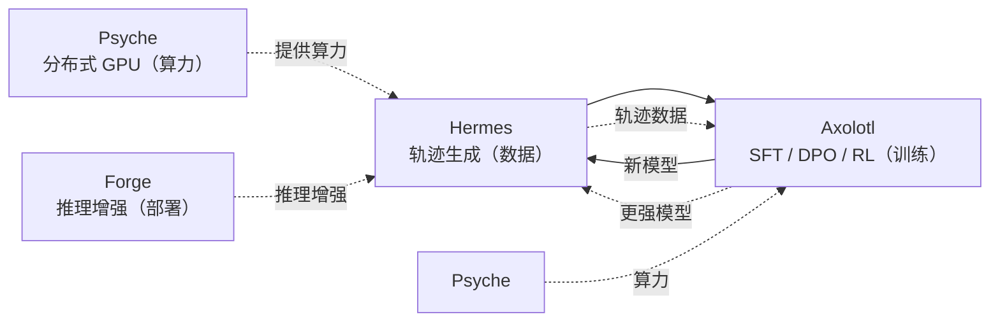
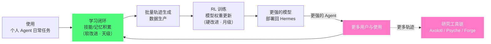

# 11 MLOps 与研究——批量轨迹生成与 RL 训练

> [!abstract] 摘要
> [[10 Prompt 工程——三层 Prompt 与上下文压缩|上一篇]]拆解了 Prompt 工程。本文深入 Hermes 的"研究"定位——它不只是"个人 Agent"，更是"AI 研究工具"。文章从"批量轨迹生成"开始——Hermes 可以批量生成"Agent 执行轨迹"（对话+工具调用+结果）——作为 RL 训练数据。然后拆解"RL 训练管道"——用 Hermes 生成的轨迹做强化学习微调 LLM——让模型更擅长"Agent 任务"。接着讨论 Hermes 与 Nous Research 其他项目的协同——Psyche（分布式训练）、Forge Reasoning API（推理增强）、Axolotl（微调框架）——形成"研究工具链"。然后分析"吃自己的狗粮"——Nous Research 用 Hermes 研究 Hermes——如"用 Hermes 生成轨迹→训练新 Hermes 模型→新模型部署到 Hermes"——形成"自改进闭环"。最后讨论"开源研究"的意义——Hermes MIT 许可让研究成果可复现。核心认知：Hermes 的"个人 Agent"和"研究工具"双重定位不是"两个独立产品"——而是"同一个系统的两个面"——个人使用产生数据，数据训练模型，模型改进个人使用——形成"用户-研究-产品"的正循环。

---

## 第 1 章 Hermes 作为"研究工具"的定位

### 1.1 不只是"个人 Agent"

Hermes 的定位是"个人 Agent + 研究工具"——这两个角色不是"分离的"——而是"同一个系统的两个用途"。作为"个人 Agent"，Hermes 服务用户的日常任务——聊天、执行命令、管理日程。作为"研究工具"，Hermes 服务 AI 研究者——生成训练数据、微调模型、实验新方法。

两个角色的用户画像差异很大——个人用户要"开箱即用"，研究者要"可编程、可定制"——但他们的共同点是**都需要"可靠的 Agent 执行能力"**：个人用户需要它可靠地完成委托，研究者需要它可靠地产生可分析的轨迹。这个共同点解释了为什么两个角色能共享同一套核心——**"可靠的执行"是产品价值和研究价值共同的分母**——执行不可靠，产品没人用，轨迹也没价值。

两个角色还有一个互相校验的关系：产品端的真实使用验证"研究产出的模型是否真的好用"，研究端的批量压测验证"产品代码是否足够健壮"——**产品与研究互为对方的"现实检验器"**——这是双重定位比单一定位更稳健的深层原因。

"同一个系统的两个用途"这个表述值得多想一步——它意味着研究能力不是"个人 Agent 之外附加的功能模块"，而是**同一套基础设施的另一种用法**。批量轨迹生成用的是普通的 AIAgent 循环（第 03 篇），轨迹记录用的是普通的 episodic memory（第 04 篇），导出用的是普通的文件工具——研究者用的每一个部件，个人用户也在用。这种"同构性"是 Hermes 架构的深层统一：**产品与研究共享全部地基，只在最上层分叉出不同的用法**。

同构性还有一个工程上的红利：**研究场景是产品能力的"极限压力测试"**。批量生成要求 Agent 在无人监督下连续执行成百上千个任务——任何不稳定（工具偶发失败、上下文管理漏洞）都会在规模下暴露——研究者事实上替所有用户做了"极端条件下的可靠性测试"。**研究用法倒逼产品健壮性**——这是双重定位的又一个隐性收益。

### 1.2 为什么"个人 Agent"也是"研究工具"

"个人 Agent"的使用过程天然产生"研究数据"——每次对话、每次工具调用、每次决策——都是"Agent 执行轨迹"——这些轨迹是"RL 训练"的宝贵数据。如"用户让 Agent 部署 K8s，Agent 执行成功"——这条轨迹可以训练"模型更擅长部署任务"。因此"个人 Agent"的"日常使用"就是"研究数据的生产"——不需要"额外的研究模式"——用 Hermes 就是"贡献研究数据"。

这个等式有一个前提需要显式化：**轨迹必须被记录得足够完整**。第 04 篇的 episodic memory 追踪（工具调用级粒度）在这里显现出第二重价值——它当初为"技能提炼"设计，现在恰好也是"轨迹生产"的基础设施——同一套追踪机制服务两个消费者。

### 1.2.1 "使用即研究"的范式转变

传统 AI 研究是"先收集数据，再训练模型"——数据收集和模型训练是"分离的两个阶段"。Hermes 的"个人 Agent + 研究工具"模糊了这个边界——"使用"和"研究"是"同一个过程"——用户使用 Hermes 的"副产品"就是"研究数据"——不需要"专门收集"。这种"使用即研究"的范式让"数据收集成本"接近零——因为"用户本来就在用"——数据是"自然产生"的——而非"专门采集"。这种"零成本数据"是 Hermes 研究优势的根源——商业 Agent 公司需要"花钱请标注员"生成数据——Hermes 通过"用户使用"自然获得——成本结构完全不同。

"零成本数据"的说法需要加一个限定——**零采集成本，不零处理成本**。原始轨迹要经过质量过滤（第 2.4 节）、隐私脱敏（第 2.7 节）、格式标准化（第 2.1.2 节）才能成为训练数据——这些处理环节有真实的工程投入。"使用即研究"省掉的是"专门设计数据收集任务"的成本，省不掉的是"数据治理"的成本——**数据飞轮转得快，是因为采集环节免费，而不是因为整个数据工程免费**。

"零成本数据"的说法需要加一个限定——**零采集成本，不零处理成本**。原始轨迹要经过质量过滤（第 2.4 节）、隐私脱敏（第 2.7 节）、格式标准化（第 2.1.2 节）才能成为训练数据——这些处理环节有真实的工程投入。"使用即研究"省掉的是"专门设计数据收集任务"的成本，省不掉的是"数据治理"的成本——**数据便宜了，数据工程没有消失**。

### 1.3 "研究工具"的具体能力

Hermes 作为"研究工具"提供几个具体能力：
- **批量轨迹生成**——脚本化生成大量 Agent 执行轨迹
- **轨迹导出**——把轨迹导出为训练格式（如 JSONL）
- **模型微调集成**——与 Axolotl 等微调框架集成
- **RL 训练管道**——用轨迹做强化学习微调
- **评估框架**——评估微调后模型的 Agent 能力

这些能力让 AI 研究者可以直接用 Hermes 做"Agent 研究"——不需要"从零搭研究基础设施"——Hermes 提供了"端到端"的研究工具链。

"从零搭研究基础设施"的隐性成本值得展开——它不只是"写代码"，而是"把执行、记录、导出、训练、评估每一环都自己造一遍"——每一环都有坑。Hermes 把这些坑替研究者踩平了——**研究工具链的价值，是用工程确定性置换研究者的时间**——而研究者的时间，恰恰是最稀缺的资源。

五项能力串起来就是一条完整的 MLOps 管线——**数据生产 → 数据导出 → 模型训练 → 强化学习 → 效果评估**——与机器学习领域标准的"数据-训练-评估"循环一一对应。Hermes 没有发明新的 MLOps 范式，它做的是**把 Agent 场景的数据（轨迹）接进了既有的 MLOps 管线**——这正是"研究就绪"的准确含义：不是"能做研究"，而是"能接入研究的基础设施"。

"接入既有基础设施"这个定位还暗示了一个重要性质：Hermes 的研究能力是**可组合的**——研究者不必使用全部五项，可以只取轨迹生成接进自己的训练管线，或只取评估框架测自己的模型。**工具链的价值不在"全家桶"，而在"每一节都能独立对接"**。

> [!info] 核心概念："用户-研究-产品"正循环
> Hermes 的"个人 Agent + 研究工具"双重定位形成了一个"正循环"：1）用户使用 Hermes（个人 Agent）产生执行轨迹；2）研究者用轨迹训练模型（研究工具）；3）新模型部署到 Hermes（产品改进）；4）改进的 Hermes 吸引更多用户，产生更多轨迹——循环往复。这种"正循环"让 Hermes "越用越强"——不只是"个人 Agent 的自改进"（学习闭环）——还有"模型层面的自改进"（RL 训练）——两层自改进叠加。这是 Nous Research 的战略——用"个人 Agent"的"使用数据"反哺"模型研究"——形成"数据飞轮"。

把飞轮的四个环节标注上"流转物"会更清楚：用户使用产出**轨迹**（环节 1→2），轨迹训练出**模型权重**（环节 2→3），模型权重提升**产品能力**（环节 3→4），产品能力吸引**用户**（环节 4→1）——四种流转物分别是数据、参数、体验、注意力——**飞轮的每一环都在为下一环生产原料**。判断一个飞轮是否真的在转，就看这四种流转物是否都在实际流动——任何一环断流（譬如轨迹没有进入训练），飞轮就只是四张幻灯片。

---

## 第 2 章 批量轨迹生成

### 2.1 什么是"轨迹"

"轨迹"（trajectory）是 Agent 执行任务的"完整记录"——包括：
- **用户指令**——用户要求什么
- **Agent 思考**——Agent 的推理过程
- **工具调用**——调用了什么工具、什么参数
- **工具结果**——工具返回了什么
- **Agent 回复**——最终给用户的回复
- **成功/失败标记**——任务是否成功

一条轨迹是"一个任务的完整执行流"——从"用户指令"到"最终回复"——包含所有中间步骤。

六个组成部分里，"成功/失败标记"虽然排在最后，却是整条轨迹的"锚"——没有它，轨迹只是一段过程记录；有了它，轨迹才是"带标签的训练样本"。而标记的可靠性是整个 RL 管线的地基：**"成功"的判定标准模糊（譬如"部署成功但配置不优"），后续所有训练都在沙地上盖楼**——这也是为什么奖励函数设计（第 3.1.2 节）被公认为 Agent RL 的核心难题。

### 2.1.1 "轨迹"与"对话历史"的区别

"轨迹"和"对话历史"不同——对话历史是"Agent 与用户的对话记录"——只包含"消息"。轨迹是"完整执行流"——除了消息，还包含"Agent 内部思考"、"工具调用细节"、"工具原始返回"——这些在"对话历史"中可能被"省略"或"摘要"。如"Agent 调用 web_fetch 获取页面"——对话历史可能只显示"我获取了页面内容是..."——但轨迹会记录"调用了 web_fetch，参数 url=...，返回 content=...（完整 HTML）"——这种"完整记录"让轨迹可用于"训练"——模型需要看到"完整工具调用过程"才能学习"如何调用工具"——而"对话历史"的"摘要"丢失了这些细节。

两者的差异可以用"课堂笔记"和"课程录像"来类比：对话历史像学生的笔记——记了结论和要点，过程被压缩；轨迹像全程录像——每句话、每个细节都在。训练模型需要的是录像而非笔记——**学习"怎么做"需要看到"做的全过程"**——这与第 04 篇"技能提炼需要工具调用级粒度"是同一个原理，只不过那里的消费者是技能提炼，这里的消费者是模型训练。

### 2.1.2 轨迹的"格式标准化"

轨迹通常导出为"JSONL 格式"——每行一条轨迹——包含结构化字段。这种"标准化格式"让轨迹可以被"不同训练框架"使用——如 Axolotl、Hugging Face datasets 等——不需要"格式转换"。Hermes 的轨迹导出遵循"社区标准"——如"OpenAI 的 fine-tuning 格式"或"ShareGPT 格式"——让"生态兼容"最大化。这种"格式标准化"是"研究工具"的基本要求——让"数据"在"工具间"自由流动——而非"锁定在特定工具"中。

格式标准化的战略意义与第 05 篇的 agentskills.io 一脉相承：**技能标准化让知识可流动，轨迹格式标准化让数据可流动**——Hermes 在"知识"和"数据"两个维度上都选择了开放标准。对一个把"数据飞轮"当核心战略的项目，数据格式的开放是必须的——封闭格式等于给自己的飞轮装了刹车（研究者的数据进不了别人的训练管线，飞轮转不起来）。

### 2.2 批量生成的场景

**训练数据生产**——研究者需要"大量轨迹"训练模型——如"10000 条 PR 审查轨迹"——训练模型更擅长 PR 审查。手动生成 10000 条不现实——Hermes 可以"脚本化批量生成"——如"给 Hermes 10000 个 PR，让它审查并记录轨迹"。

**评估基准构建**——研究者需要"标准轨迹集"评估模型——如"100 个典型任务的轨迹"——用这些轨迹测试"不同模型在 Agent 任务上的表现"。

**失败案例分析**——批量生成轨迹后，分析"哪些任务失败"——研究"Agent 失败的模式"——改进模型或工具。

三个场景对应了机器学习研究的三个经典环节——**训练集、测试集、错误分析**——Hermes 的批量生成能力同时服务三者。特别值得展开的是"失败案例分析"：失败轨迹的价值常被低估，但对 Agent 研究来说，**"Agent 在哪一步、以什么方式失败"是最有信息量的数据**——它直接指出模型能力的短板，比成功轨迹的"确认性信息"珍贵得多。

失败分析还有一个进阶用法——**失败模式的聚类**。把失败轨迹按"失败环节"聚类（规划错误/工具选错/参数错误/恢复失败），每一类指向不同的改进方向：规划错误要改模型推理，工具选错要改 schema 描述，恢复失败要补错误恢复数据。**失败不是同质的——失败模式的分布图，就是改进工作的优先级清单**。

三个场景的成本结构也差异很大：训练数据生产是"大规模、可预算"的（一次生成、反复使用）；评估基准构建是"小而精"的（数量少但标注要求高）；失败分析是"持续性的"（每次模型更新后都要重新跑）。**同一个批量生成能力，在三个场景下的运行节奏完全不同**——研究者在规划算力和预算时要按场景分别估算。

### 2.3 批量生成的工程

Hermes 的批量轨迹生成通常用"脚本驱动"——如 Python 脚本：
1. 读取"任务列表"——如 10000 个 PR 的 URL
2. 对每个任务，创建 AIAgent 实例
3. 给 AIAgent 发送"审查这个 PR"的指令
4. AIAgent 执行任务——所有步骤被记录
5. 轨迹导出为 JSONL 文件

这种"脚本驱动"让"批量生成"自动化——不需要人工逐个操作——可以"一夜生成 10000 条轨迹"——适合"大规模训练数据生产"。

批量生成的工程还有三个容易被忽视的细节：**失败重试**（部分任务会因环境问题失败，需要重试机制保证产出量）、**去重**（相同任务重复生成的轨迹高度相似，需要去重保证多样性）、**成本核算**（每条轨迹消耗真实的 LLM API 费用，10000 条的成本要先估算）。这三点决定了批量生成是"工程"而非"脚本"——**数据生产与软件生产一样，需要产量、质量、成本的三线管理**。

成本核算值得给个量级感受：假设每条轨迹平均消耗 5 万 token 的 API 费用，10000 条就是 5 亿 token——按主流定价是数百到数千美元的量级——**数据生产的预算规划与训练本身的算力预算同等重要**。这也是为什么"用便宜模型生成大部分轨迹、用强模型生成关键轨迹"的分层策略（呼应 Forge 一节）在成本上如此重要。

批量生成的工程还有三个容易被忽视的细节：**失败重试**（部分任务会因环境问题失败，需要重试机制保证产出量）、**去重**（相同任务重复生成的轨迹高度相似，需要去重保证多样性）、**成本核算**（每条轨迹消耗真实的 LLM API 费用，10000 条的成本要先估算）。这三点决定了批量生成是"工程"而非"脚本"——**数据生产与软件生产一样，需要产量、质量、成本的三线管理**。

五步流程与第 03 篇的 Batch Runner 入口对应——批量生成走的是"单核心多入口"架构中的 Batch Runner 入口——它复用同一个 AIAgent 核心，只是入口从"交互"换成了"脚本"。**研究能力不是旁路实现，而是核心循环的另一种驱动方式**——这保证了批量生成的轨迹与真实使用的轨迹在结构上完全一致——训练数据与产品行为同源。

批量生成的工程还有三个容易被忽视的细节：**失败重试**（部分任务会因环境问题失败，需要重试机制保证产出量）、**去重**（相同任务重复生成的轨迹高度相似，需要去重保证多样性）、**成本核算**（每条轨迹消耗真实的 LLM API 费用，10000 条的成本要先估算）。这三点决定了批量生成是"工程"而非"脚本"——**数据生产与软件生产一样，需要产量、质量、成本的三线管理**。

批量生成的工程要点与第 09 篇的 delegate_task 有微妙的呼应——两者都是"多任务并行执行"，但形态不同：delegate_task 是"会话内的并行"（主 Agent 委托子 Agent），批量生成是"脚本级的并行"（外部脚本驱动多个独立 Agent 实例）。后者的并行度更高、控制更粗——**会话内并行服务"当前任务"，脚本级并行服务"数据生产"**——两种形态各司其职。

### 2.4 轨迹的"质量过滤"

批量生成的轨迹质量参差不齐——有些"成功且高效"，有些"成功但低效"（绕了弯路），有些"失败"。用于 RL 训练时，通常需要"质量过滤"——只保留"成功且高效"的轨迹作为"正样本"——"失败"的作为"负样本"（用于"避免失败"训练）。这种"质量过滤"让训练数据"高信噪比"——避免"低质量轨迹"误导模型。

质量过滤有一个反直觉的细节值得注意：**"低效但成功"的轨迹不一定是坏数据**。对 SFT（模仿学习），低效轨迹会教模型绕弯路——该过滤；但对 RL，"成功但绕路"的轨迹恰好是"奖励函数鼓励高效"的天然教材——模型从中学会"同样的结果，更短的路径"。**数据的价值取决于训练方法**——过滤标准不能脱离训练目标单独讨论。

过滤的实操建议是**按训练目标分层保留**而不是"一刀切丢弃"：成功高效轨迹 → SFT 正样本；成功低效轨迹 → RL 的效率优化素材；失败但有恢复弧线的轨迹 → 错误恢复训练素材；纯失败轨迹 → 负样本或直接丢弃。**同一批原始轨迹，在四种训练目标下有四种归宿**——过滤的本质是"分类路由"，不是"淘汰"。

过滤本身也可以用 LLM 辅助：让一个"评审模型"给轨迹打分（步骤合理性、效率、是否有投机迹象）——人工只抽查评审结果。**人工审全量不可行，纯自动不可信——"LLM 初筛 + 人工抽查"是数据质量管理的现实解**。

过滤的实操建议是**按训练目标分层保留**而不是"一刀切丢弃"：成功高效轨迹 → SFT 正样本；成功低效轨迹 → RL 的效率优化素材；失败但有恢复弧线的轨迹 → 错误恢复训练素材；纯失败轨迹 → 负样本或直接丢弃。**同一批原始轨迹，在四种训练目标下有四种归宿**——过滤的本质是"分类路由"，不是"淘汰"。

### 2.5 "轨迹多样化"的重要性

除了质量，轨迹的"多样性"也很重要——如果 10000 条轨迹都是"PR 审查"——模型只学会"PR 审查"——不会"部署"或"调试"。好的训练数据应该"多样化"——覆盖"不同任务类型"、"不同工具组合"、"不同错误场景"——让模型"泛化"而非"过拟合"。Hermes 的 70+ 工具和 28 工具集提供了"天然多样化"——不同任务用不同工具——轨迹自然多样。研究者在"批量生成"时应该"刻意覆盖多种任务类型"——而非"只生成一类"——确保"多样性"。

多样性还可以在更细的维度上刻意设计：**同一任务的不同解法**（用 gh 命令 vs 用 API 完成同一审查）、**同一工具的不同参数形态**（简单调用 vs 复杂组合）、**不同错误类型的恢复路径**（网络错误重试 vs 权限错误换方案）。这些"受控变异"让模型学到的是"任务的结构"而非"某个具体解法的表面模式"——**多样性不是数量堆出来的，是设计出来的**。

多样性的一个实用检验指标是"工具覆盖度"——统计轨迹集中每个工具的出现频率——如果 70+ 工具里有 20 个从未出现在训练数据里，模型对这些工具的调用可靠性就存疑。**工具覆盖表是轨迹多样性的量化仪表盘**——生成任务清单时对照它补盲区，比"凭感觉多样化"可靠得多。

多样性还可以在更细的维度上刻意设计：**同一任务的不同解法**（用 gh 命令 vs 用 API 完成同一审查）、**同一工具的不同参数形态**（简单调用 vs 复杂组合）、**不同错误类型的恢复路径**（网络错误重试 vs 权限错误换方案）。这些"受控变异"让模型学到的是"任务的结构"而非"某个具体解法的表面模式"——**多样性不是数量堆出来的，是设计出来的**。

### 2.6 "合成轨迹" vs "真实轨迹"

批量生成的轨迹是"合成轨迹"——由 Hermes 执行"预设任务"生成——而非"真实用户任务"。合成轨迹的优点是"可控"——可以"指定任务类型和数量"——但缺点是"可能偏离真实分布"——如"预设任务可能太简单"——真实用户任务"更复杂多样"。理想方案是"合成 + 真实混合"——合成轨迹保证"数量和覆盖"——真实轨迹（用户使用产生）保证"分布真实"——两者互补。这种"混合"让训练数据既有"规模"又有"真实性"。

两类数据的配比也是一门学问：合成占比过高，模型学到"理想化任务"的解法，遇到真实世界的混乱就脆；真实占比过高，数据的长尾稀疏（很多真实任务只出现一两次，学不到稳定模式）。实践中的合理起点是**合成打底、真实调味**——合成数据保证每个任务类型有足够的重复度，真实数据负责校正分布——配比随训练效果迭代调整，没有先验最优解。

两类轨迹的差异可以用"靶场射击"和"实战"类比：合成轨迹像靶场——目标固定、环境可控、可以大量重复；真实轨迹像实战——目标不可预测、环境充满意外。只练靶场的士兵上战场会不适应，只靠实战又无法规模化训练——**靶场保基本功，实战练应变，两者缺一不可**。Hermes 的独特优势是它同时拥有两个数据源——批量生成是靶场，用户使用是实战。

### 2.7 轨迹的隐私与脱敏

真实轨迹包含用户数据——代码片段、文件路径、消息内容——直接用于训练或发布有隐私风险。脱敏的常见手段：**占位符替换**（用户名→`<USER>`、密钥→`<REDACTED>`）、**结构保留**（替换值但保留数据形态，让轨迹的"结构教学价值"不损失）、**分层发布**（方法开源、数据不公开）。脱敏与数据价值的权衡是微妙的——脱得太狠，轨迹失去真实感；脱得太松，隐私泄露。**"结构可复现、内容不泄露"是隐私敏感研究的黄金标准**——本章思考题 3 讨论的正是这个权衡。

脱敏的工程实现有一个值得注意的细节：**脱敏应该发生在轨迹导出的管道里，而不是事后人工处理**——人工处理既不可扩展也不可审计；管道化的脱敏规则（正则匹配密钥模式、路径模式、人名模式）每次导出自动执行，规则本身进版本控制。**把隐私保护做进数据管线，而不是做成"发布前记得脱敏"的口头纪律**——这与第 10 篇"把最佳实践写进工具契约"是同一个原则。

脱敏还有一个与第 06 篇呼应的视角：轨迹里的敏感信息与记忆里的敏感信息面临同类风险，但治理手段不同——记忆是"策展后的少量文本"（人工审查可行），轨迹是"海量的原始记录"（必须自动化）——**同一类隐私风险，在不同数据形态下需要不同的治理机制**。

---

## 第 3 章 RL 训练管道

### 3.1 什么是 RL 训练

RL（Reinforcement Learning）训练是"用奖励信号微调模型"——模型执行任务，根据"任务成功与否"给予"奖励/惩罚"——模型学习"最大化奖励"——从而"更擅长任务"。在 Agent 语境下，"奖励"通常是"任务成功"——如"PR 审查正确"给正奖励，"PR 审查错误"给负奖励。

### 3.1.1 "RL 训练"vs"SFT 训练"

RL 训练和 SFT（Supervised Fine-Tuning）不同——SFT 是"模仿学习"——模型"模仿"轨迹中的"正确行为"——如"看到这个输入，输出这个"——是"行为克隆"。RL 是"试错学习"——模型"尝试"不同行为，根据"奖励"调整——是"策略优化"。SFT 简单但"上限是轨迹质量"——模型不会"比轨迹更好"。RL 复杂但"可以超越轨迹"——模型通过"试错"发现"比轨迹更好的策略"。对于 Agent 训练，通常"先 SFT 后 RL"——SFT 让模型"学会基本 Agent 行为"——RL 让模型"优化策略"——两者互补。

"先 SFT 后 RL"的顺序可以用"先临摹后创作"来理解：SFT 是临摹——照着字帖写，学会笔画和结构；RL 是创作——自己写，根据评价调整风格。跳过临摹直接创作，基本功不牢；只临摹不创作，永远超不过字帖。**第 02 篇讲过的 Hermes 训练方法论（SFT→SFT+DPO→推理训练）正是这条路径的逐代展开**——模型谱系的演进史，就是"临摹到创作"的进阶史。

两者的成本结构也差异巨大，选型时必须纳入考量：SFT 是"一次性监督学习"——成本可控、结果可预期；RL 是"迭代试错"——需要环境交互、奖励计算、多轮训练——成本高且结果方差大。**SFT 是"确定性的下限保障"，RL 是"高方差的上限突破"**——预算有限时先保 SFT，预算充足再上 RL——这个顺序不建议颠倒。

### 3.1.2 "奖励函数"设计的挑战

RL 训练的核心是"奖励函数"——定义"什么行为给多少奖励"。对于 Agent，奖励函数可能很复杂——如"任务成功 +10"、"任务失败 -10"、"用了 5 步完成 -2（鼓励高效）"、"调用了错误工具 -5"——这种"多维奖励"让模型学习"不只是成功，还要高效、正确"。但"奖励函数设计"是"艺术"——设计不好可能导致"非预期行为"——如"奖励'快速完成'可能导致模型'草率执行'"——这种"reward hacking"是 RL 训练的常见陷阱——需要"反复调试奖励函数"避免。

reward hacking 的根源值得点破：**模型优化的不是"你想要的东西"，而是"你度量的东西"**——这两者的差距就是被 hack 的空间。任务成功的度量如果是"最终回复包含'成功'字样"，模型可能学会在失败时也说"成功"；度量如果是"测试通过"，模型可能学会删掉失败的测试。**每一个可度量的代理指标，都是一个潜在的 hack 入口**——奖励函数设计的本质是与模型的"投机智慧"博弈。

对抗 reward hacking 的务实策略有三层：**指标多元化**（成功 + 效率 + 正确性多指标加权，单一指标被 hack 的空间被其他指标钳制）、**对抗审查**（用另一个模型扮演"审查者"检查轨迹是否有投机迹象）、**人工抽检**（定期人工审阅高奖励轨迹，确认"奖励给得对"）。三层防线不能根除 hacking，但能把"最离谱的投机"挡在训练集之外——**奖励函数不是设计出来就完了，它需要像生产系统一样被监控和维护**。

### 3.2 Hermes 轨迹用于 RL 训练

Hermes 生成的轨迹可以用于 RL 训练：
1. **轨迹作为"经验"**——模型"看到"成功轨迹如何执行——学习"模仿"
2. **奖励信号**——轨迹的"成功/失败标记"作为"奖励"——模型学习"偏好成功路径"
3. **迭代训练**——生成轨迹→训练→新模型生成更好轨迹→再训练——迭代提升

三步中，第 3 步的"迭代"是 RL 区别于一次性训练的本质：**每一代模型生成的轨迹，既是它的"成绩单"，又是下一代的"教材"**——模型在自己产生的数据上继续进化。这个自举结构的力量和风险并存：力量在于改进可以复利累积，风险在于**一代模型的缺陷会被下一代继承放大**（自我训练的"模型坍塌"风险）——这也是为什么迭代中要持续混入"外部基准"（人工审查的轨迹、其他模型的数据）作为"锚"——**纯自举的飞轮会漂移，带锚的飞轮才稳定**。

### 3.3 与 Axolotl 集成

Axolotl 是 Nous Research 的"微调框架"——支持 SFT（监督微调）、DPO（直接偏好优化）、RLHF 等。Hermes 生成的轨迹可以导出为 Axolotl 兼容格式——直接用 Axolotl 训练。这种"Hermes + Axolotl"集成让"从轨迹到模型"的管道"无缝"——不需要"格式转换"或"工具切换"。

"无缝"的背后是第 2.1.2 节的格式标准化——Hermes 导出的 ShareGPT/JSONL 格式恰好是 Axolotl 的输入格式。这个"格式巧合"其实是刻意设计：**数据生产端与训练消费端共享同一套社区标准，中间就不需要"转换层"**——转换层是数据管线里最容易出错、最难维护的环节，消灭它就是最大的工程收益。

对研究者的实操意义是：从"我想训练一个 Agent 模型"到"训练在跑"，中间只有三步——Hermes 生成轨迹、导出 JSONL、Axolotl 加载训练——**没有自研格式、没有转换脚本、没有格式对不上的调试**。

"无缝"的背后是第 2.1.2 节的格式标准化——Hermes 导出的 ShareGPT/JSONL 格式恰好是 Axolotl 的输入格式。这个"格式巧合"其实是刻意设计：**数据生产端与训练消费端共享同一套社区标准，中间就不需要"转换层"**——转换层是数据管线里最容易出错、最难维护的环节，消灭它就是最大的工程收益。

### 3.4 RL 训练的"Agent 特化"

通用 LLM 训练用"通用文本"——如"维基百科"、"网页"——让模型"知识广"。Agent RL 训练用"Agent 轨迹"——让模型"擅长 Agent 任务"——如"工具调用决策"、"多步推理"、"错误恢复"。这种"Agent 特化训练"让模型从"通用 LLM"变成"Agent 专用 LLM"——如"Hermes 模型"就是"Agent 特化"的——比"通用模型"更擅长 Agent 任务。第 02 篇讨论的 Hermes 模型谱系（Hermes 2/3/4）就是这种"Agent 特化训练"的产物。

"特化"的收益与代价都值得标注：收益是 Agent 任务上的显著优势（工具调用可靠、多步执行稳定）；代价是**通用能力的潜在回退**。Hermes 4 的"混合数据集"（推理 + 通用指令混合训练，第 02 篇讲过）正是对这个代价的回应——**特化与通用之间找配比，是 Agent 模型训练的永恒调参题**。

"Agent 特化"与"通用能力"的权衡也值得点出：特化训练可能让模型在"纯聊天"场景略微退化（训练分布偏移）——这是"专"与"广"的经典取舍。Hermes 4 的"混合推理"（第 02 篇）可以看作对这个权衡的回应——用混合数据让模型"该特化时特化，该通用时通用"。**特化与通用不是二选一，是配比问题**——而配比的依据是产品的任务分布。

### 3.5 "工具调用决策"的 RL 优化

Agent RL 训练的一个重点是"工具调用决策"——模型需要学习"何时调用工具"、"调用哪个工具"、"传什么参数"。通用 LLM 可能"该调用工具时不调用"（试图自己回答）或"调用错误工具"——Agent RL 训练用"成功轨迹"教模型"正确调用"——如"看到'获取 example.com'应该调用 web_fetch 而非自己编造内容"。这种"工具调用决策"的优化是 Agent 模型区别于通用模型的核心能力——也是 Hermes 模型"更擅长 Agent 任务"的具体体现。

工具调用决策的训练还有一个精细的子目标——**"何时不调用工具"**。过度调用（明明知道答案还去搜索）浪费成本和时间，该调用不调用则答非所问——两个失败方向相反。好的训练数据要同时包含"直接回答"和"调用工具"的样本，让模型学会"知识边界感"——**知道自己的知识何时够用，与知道如何用工具同样重要**——这是第 09 篇"工具选择准确率"问题在模型训练层的根源。

### 3.6 "错误恢复"的 RL 训练

Agent 执行任务时经常"遇到错误"——如"命令执行失败"、"API 返回错误"——好的 Agent 应该"恢复"——如"分析错误原因，尝试替代方案"。RL 训练可以用"包含错误的轨迹"教模型"错误恢复"——如"轨迹中 Agent 遇到 'command not found'，然后尝试 'apt install' 安装命令，最终成功"——这种"错误→恢复→成功"的轨迹教模型"不要遇到错误就放弃"——而是"尝试恢复"。这种"错误恢复"能力是 Agent "鲁棒性"的关键——RL 训练让它从"偶然"变成"系统化"。

错误恢复训练有一个与直觉相反的数据需求——**它需要的不是"更多失败"，而是"失败后成功的完整弧线"**。只有失败的轨迹教模型"什么会失败"，失败后恢复的轨迹才教模型"失败了怎么办"。这解释了为什么第 2.4 节说"失败轨迹作负样本"要谨慎——**被拦腰截断的失败轨迹是负样本，走完恢复弧线的失败轨迹是金样本**——同样是"含失败的轨迹"，训练价值天差地别。

构造恢复弧线轨迹还有一个技巧——**故意注入故障**：在批量生成的环境里预设"故障注入点"（让某个命令必然失败一次），观察 Agent 能否恢复——这种"受控失败"产生的恢复轨迹，比"自然失败"的更可控、更可分类——**故障注入不只是测试技术，也是数据生产技术**。

错误恢复训练有一个与直觉相反的数据需求——**它需要的恰恰是"中途失败"的轨迹**。干净的"一路成功"轨迹教不会恢复——因为里面没有错误；只有"遇到错误→尝试→最终成功"的轨迹才包含恢复模式。这让"失败轨迹"的价值重新上升：不是所有失败轨迹都该进负样本堆——**"失败后成功恢复"的轨迹是 RL 训练里最珍贵的样本类型之一**——它们教会模型的不是"做什么"，而是"出错了怎么办"。

---

## 第 4 章 与 Nous Research 项目的协同

### 4.1 Psyche——分布式训练

Psyche 是 Nous Research 的"分布式训练"项目——让"全球志愿者贡献 GPU"做分布式训练——如"100 个志愿者各贡献 1 个 GPU，组成 100 GPU 的训练集群"。Hermes 与 Psyche 的协同——Hermes 生成轨迹，Psyche 用志愿者 GPU 训练——让"大规模训练"不需要"集中式 GPU 集群"——"分布式众包"降低训练成本。

两者的配合还有一个时间维度上的互补：**轨迹生成是"持续滴灌"**（用户日常使用不断产生新数据），**分布式训练是"间歇收割"**（攒够一批数据启动一次训练）——滴灌与收割的节奏配合，构成一个"持续学习"的循环：数据像雨水自然汇集，训练像季节性收割。

### 4.1.1 "分布式众包"的"民主化"意义

Psyche 的"分布式众包"不只是"降成本"——还有"民主化 AI"的意义——传统大模型训练需要"数百万美元的 GPU 集群"——只有大公司能负担——这导致"AI 研究被少数公司垄断"。Psyche 让"志愿者贡献 GPU"组成"虚拟集群"——即使"没有百万美元"也能"训练大模型"——这种"民主化"让"小团队/学术机构"也能参与"前沿 AI 研究"——打破"大公司垄断"。Hermes 作为"数据生成工具"与 Psyche 的"算力众包"配合——形成"民主化 Agent 研究"的"开源栈"——这是 Nous Research 的"使命"——让 AI 研究不只属于"大公司"。

"民主化"叙事的完整版还需要一个环节——**数据民主化**。算力众包解决了"训练贵"，开源模型解决了"模型封闭"，但"训练数据"这一环如果被垄断，民主化就断在半路。Hermes 的批量轨迹生成 + 开源轨迹格式，恰好补上这一环——**任何人都能生产 Agent 训练数据**——四个环节全部打通，"民主化"才不是口号。

把 Hermes 与 Psyche 的配合放到"民主化"的框架里，能看到一条完整的"平民研究栈"：数据不用买（Hermes 生成）、算力不用买（Psyche 众包）、训练框架免费（Axolotl）、模型权重开放（Hermes 谱系）——**从数据到算力到训练方法，每一环都有开源替代**。这条栈的完整存在，本身就是对"AI 研究必须烧钱"这个假设的反例。

### 4.2 Forge Reasoning API——推理增强

Forge Reasoning API 是 Nous Research 的"推理增强"服务——给 LLM 增加"更深的推理能力"——如"多步思维链"、"自我验证"。Hermes 可以用 Forge API 增强"Agent 决策"——如"复杂任务用 Forge 做深度推理，简单任务用普通 LLM"——这种"分层推理"让"复杂任务更准，简单任务更省"。这种"分层推理"是"成本与质量"的精细平衡——对于"简单任务"用普通 LLM 足够且便宜——对于"复杂任务"用 Forge 深度推理获得更高质量——避免"所有任务都用昂贵推理"的浪费。

分层推理在研究场景还有一个特殊用法——**用 Forge 生成"高质量参考轨迹"**：批量生成时，用 Forge 增强推理的 Agent 产出"金牌轨迹"（质量上限），用普通模型产出"大众轨迹"（数量规模）——两类数据分层使用（金牌做 SFT 示范，大众做 RL 规模）——**推理增强不仅是运行时的能力，也是数据生产时的质量杠杆**。

"金牌轨迹"的思路还可以延伸到错误恢复训练：用 Forge 生成"遇到错误后优雅恢复"的示范轨迹——这类轨迹人工编写极费精力，但强模型可以在"故意注入故障"的环境中自然产生——**推理增强不仅是运行时的能力，也是数据生产时的质量杠杆**。

### 4.3 Axolotl——微调框架

如第 3.3 节所述，Axolotl 是微调框架——与 Hermes 形成"生成→训练"管道。Axolotl 也是开源的——研究者可以自由使用和改进——这种"开源工具链"让"AI 研究"不被"商业封闭平台"垄断。

Axolotl 在工具链中的角色还有一个值得点明的特点——**它是"方法论"的载体**。第 02 篇讲过的 Hermes 训练方法论（SFT 超参、DPO 配置、loss-masking 策略）不是论文里的公式，而是 Axolotl 的配置文件——方法论以"可执行的配置"形式存在，别人可以拿去直接跑。**开源训练框架让"方法论"从论文描述变成可复制的工件**——这是"可复现研究"从口号变成现实的最后一环。

### 4.4 工具链的"端到端"

Hermes + Axolotl + Psyche + Forge 形成"端到端研究工具链"：
- **Hermes**——生成轨迹（数据）
- **Axolotl**——微调模型（训练）
- **Psyche**——分布式 GPU（算力）
- **Forge**——推理增强（推理）

这四个项目覆盖"数据→训练→算力→推理"的全链——研究者用这套工具链可以"端到端"做 Agent 研究——不需要依赖商业平台。这种"开源端到端"是 Nous Research 的战略——用"开源工具链"降低"AI 研究门槛"——让"更多研究者"能参与"Agent 研究"。

四个项目的分工用一张表对照：

| 项目 | 流水线角色 | 形态 |
| :--- | :--- | :--- |
| Hermes Agent | 数据生产（轨迹） | 开源应用 |
| Axolotl | 模型训练（SFT/DPO/RL） | 开源框架 |
| Psyche | 分布式算力 | 开源基础设施 |
| Forge | 推理增强 | 商业 API |

这张表里有一个值得注意的形态分布：**前三环开源、最后一环商业**——数据、训练、算力开放，推理收费。这个布局与第 02 篇 5.3 节的商业化版图一致——开源的部分负责生态与信任，商业的部分负责收入。研究者可以完全绕开 Forge 用开源推理（vLLM 自建），但"更省心的增强推理"是付费选项——**开放的边界画在"研究自由"之外，而非"研究自由"之内**。

工具链的"端到端"还有一层对独立研究者的实际意义——**它把"做 Agent 研究"的启动成本从"组建团队"降到"装好工具"**。传统上做一次 Agent 训练实验需要数据工程师、ML 工程师、基础设施工程师的协作——开源栈让一个研究者兼职三个角色成为可能——**工具链的集成度，决定了"谁能做研究"的边界**。

四个项目在工具链中的位置可以用一条流水线收拢：

流水线上最值得注意的是"Hermes 出现在两端"——它既是流水线的起点（生成数据）又是终点（部署新模型）——**工具链的起点和终点是同一个产品**——这就是"吃自己的狗粮"的结构基础，第 5 章展开。

### 4.5 "开源工具链"vs"商业平台"的对比

商业平台（如 OpenAI 的 GPT-4 + fine-tuning API）提供"一站式"服务——但"封闭"——研究者无法"深入定制"——如"无法改训练算法"、"无法看模型权重"。Nous Research 的开源工具链相反——"开放"——研究者可以"深入定制"——如"改 Axolotl 的训练算法"、"看 Psyche 的分布式策略"、"改 Hermes 的轨迹格式"——这种"深度定制"让"前沿研究"成为可能——前沿研究往往需要"突破现有工具的限制"——封闭平台不允许"突破"——开源工具链允许。这是"开源"对"前沿研究"的独特价值——不只是"便宜"——更是"可突破"。

"可突破"这个价值值得用一个具体场景说明：假设研究者想实验"一种新的轨迹过滤算法"——在商业平台上，这个想法只能停留在"给官方提 feature request"；在开源栈上，改 Hermes 的导出逻辑、接 Axolotl 的数据加载，一个下午就能跑通实验。**研究创新的瓶颈常常不是想法，而是"想法到实验的距离"**——开源栈把这个距离从"月"压到"天"——这是它对研究速度的真实贡献。

---

## 第 5 章 "吃自己的狗粮"

### 5.1 什么是"吃自己的狗粮"

"吃自己的狗粮"（dogfooding）是"用自己的产品做自己的工作"——如"微软员工用 Windows 工作"、"Google 员工用 Google 搜索"。Hermes 的 dogfooding 是"Nous Research 用 Hermes 做 AI 研究"——如"用 Hermes 生成训练数据"、"用 Hermes 分析实验结果"。

dogfooding 对 AI 研究实验室还有一个特殊意义——**研究者是最挑剔的 Agent 用户**。普通用户对 Agent 的失误有一定容忍度（"它尽力了"），研究者的标准是"可复现、可归因、可改进"——一个在研究者手里跑的 Agent，它的每次失误都会被追问"为什么"。**在最有能力挑毛病的人群里过关，才是真的过关**。

### 5.2 Hermes 的 dogfooding 闭环

Nous Research 用 Hermes 的闭环：
1. **用 Hermes 生成轨迹**——研究者用 Hermes 做"数据生产"
2. **用轨迹训练新模型**——Axolotl 训练
3. **新模型部署到 Hermes**——Hermes 用新模型
4. **新模型生成更好轨迹**——质量提升
5. **更好轨迹训练更好模型**——循环提升

这种"dogfooding 闭环"让 Hermes "自我改进"——不只是"个人 Agent 的学习闭环"（程序性记忆）——还有"模型层面的改进"（权重更新）——两层自改进叠加——形成"越用越强"的飞轮。

五步闭环里最容易被低估的是第 4 步——"新模型部署到 Hermes"。因为 Hermes 是模型无关的，新模型上线只是一条 `hermes model` 命令——**部署成本接近零，让"训练成果"能以天级速度进入实际使用**。对比传统 ML 的"训练完成→打包→发布→用户升级"的漫长链路，Hermes 的模型切换是即时的——飞轮的"最后一公里"被压缩到最短。

### 5.3 dogfooding 的"质量验证"

dogfooding 还有"质量验证"的价值——Nous Research 团队自己用 Hermes——会"第一时间发现 Hermes 的问题"——如"这个工具不好用"、"这个 prompt 让 Agent 行为异常"——团队作为"内部用户"反馈问题——快速修复。这种"内部用户"反馈比"外部用户"反馈更快——因为团队"天天用"——问题"立即暴露"——这种"快速反馈"让 Hermes 的"质量迭代"更快。

内部用户反馈还有一个外部反馈不具备的特性——**它能发现"用户不会报告的问题"**。外部用户遇到工具不好用，通常直接放弃（不会提 issue）；内部用户知道"这个功能应该存在"，会追着问"为什么这么难用"。**最宝贵的反馈来自"既有动机又有能力报 bug 的用户"——开发者自己就是这类用户的极致形态**。

内部反馈还有一个结构性优势——**它覆盖"沉默的大多数"场景**。外部反馈有幸存者偏差：愿意提 issue 的用户是少数，且偏向技术强者；团队内部使用则覆盖了"普通用户怎么用"的真实路径——**dogfooding 的反馈分布，比 issue 列表更接近真实用户分布**。

内部用户反馈还有一个外部反馈不具备的特性——**它能发现"用户不会报告的问题"**。外部用户遇到工具不好用，通常直接放弃（不会提 issue）；内部用户知道"这个功能应该存在"，会追着问"为什么这么难用"。**最宝贵的反馈来自"既有动机又有能力报 bug 的用户"——开发者自己就是这类用户的极致形态**。

### 5.4 dogfooding 的"文化意义"

dogfooding 不只是"工程实践"——也是"文化宣言"——它宣示"Nous Research 团队信任自己的产品"——如"我们用它做自己的研究"——这种"信任"对"外部用户"有"信号作用"——如"如果研究者自己用，那应该不错"——增强"采用信心"。反之，如果"团队不用自己的产品"——外部用户会怀疑"是不是产品不好"——这种"怀疑"会阻碍采用。因此 dogfooding 既是"质量手段"也是"营销手段"——"用自己的产品"是最有力的"产品 endorsement"。

dogfooding 的信号价值在开源社区尤其显著，因为开源社区的信任机制与商业产品不同：商业产品靠品牌背书，开源项目靠**"作者自己吃不吃"**——一个"作者自己都不用"的开源项目，社区会本能地怀疑其可持续性。Hermes 的 dogfooding 等于每天都在向社区广播"这个项目在我们自己的研究里是生产工具，不是演示品"——**这种信号比任何 roadmap 都更能建立长期信任**。

### 5.5 "dogfooding 闭环"与"学习闭环"的区别

需要区分两个"自改进"机制——第 04 篇的"学习闭环"是"程序性记忆"（技能/MEMORY.md）——在"单次部署"内改进——不改变模型权重——是"软改进"。本篇的"dogfooding 闭环"是"模型权重更新"（RL 训练）——跨"多次部署"改进——改变模型本身——是"硬改进"。两者叠加——Hermes 既有"软改进"（会话内学技能）又有"硬改进"（跨版本学模型）——形成"双层自改进"——这是 Hermes "自改进 Agent"定位的完整含义——不只是"学习闭环"——还有"模型进化"。

双层自改进的时间尺度差异也值得标注：软改进是**分钟到天级**（技能今天学明天用），硬改进是**月级**（轨迹积累、训练、发布新模型的周期）。两层节奏不同但相互喂养——软改进产生的技能使用数据，本身就是硬改进的训练信号；硬改进产出的更强模型，让软改进的技能提炼质量更高。**快循环出即时效果，慢循环出根本提升**——任何"自改进系统"的设计都值得检查：它的快慢两个循环都在转吗？

### 5.6 dogfooding 的边界

dogfooding 的价值虽大，也有它的边界——**团队的需求不等于市场的需求**。Nous Research 的研究者用 Hermes 做研究，他们的痛点是"轨迹导出"、"评估框架"——普通用户的痛点可能是"Telegram 上更好用"、"设置更简单"——dogfooding 的反馈天然偏向"团队自己会用的功能"。本章思考题 2 讨论的"回音室"风险正是这个边界的极端形态。健康的做法是把 dogfooding 当"质量反馈的高保真渠道"，而不是"需求洞察的唯一来源"——**自己用出来的口碑管质量，用户调研出来的洞察管方向**——两者不能互相替代。

两个闭环的时间尺度差异值得再强调一次：学习闭环是**分钟到天级**（今天踩坑，明天技能里就有），dogfooding 闭环是**月级**（轨迹积累、训练、发布新模型的周期）。两个时间尺度叠加，Hermes 的"变强"呈现两个可观察的节奏——**周内的行为越来越顺手（软改进），版本之间的能力跳变（硬改进）**——用户感知到的"越用越强"，其实是两个飞轮的叠加效应。

---

## 第 6 章 开源研究的意义

### 6.1 MIT 许可

Hermes 采用 MIT 许可——最宽松的开源许可之一——允许"任何用途"（包括商业）——只要求"保留版权声明"。这种"宽松许可"让 Hermes 可以被"任何人"使用和改进——不限"学术"或"非商业"——鼓励"广泛采用"。

宽松许可对"数据飞轮"还有一个间接但关键的支撑：**企业敢用**。企业法务对 GPL/NC 类许可的传染性或限制性高度敏感，MIT 是"法务绿灯"的代名词——企业采用后，其内部使用产生的反馈与贡献都回流生态。**许可的宽松度，决定了飞轮能卷入多大的机构**——第 01 篇说"扩散就是一切"，MIT 就是扩散的法务前提。

### 6.1.1 "MIT 许可"vs"非商业许可"的选择

有些 AI 项目用"非商业许可"（如 CC BY-NC）——限制"商业使用"——保护"商业利益"。Hermes 选择"MIT 许可"——不限制商业——这意味着"公司可以用 Hermes 做商业产品"——如"公司把 Hermes 集成到自己的产品中销售"。这种"允许商业"的选择反映了 Nous Research 的"开放哲学"——认为"广泛采用"比"限制商业"更重要——"让更多人用"比"保护商业利益"更能推动"领域进步"。这种"开放"也带来"风险"——如"公司可能从 Hermes 获利但不回馈社区"——但 Nous Research 接受这个风险——认为"开放的整体收益"大于"被白嫖的损失"。

"被白嫖"的风险评估还需要一点博弈论视角：**开源生态的回报不是按"谁用了"结算的，而是按"谁反馈了"累积的**——商业使用者即使不贡献代码，其 bug 报告、使用场景曝光、生态位验证都是隐性贡献。更重要的是，限制商业使用的许可会把"企业用户"这个最大的反馈来源挡在门外——**为了防"白嫖"而缩小采用面，往往是更亏的交易**。

MIT 与非商业许可的选择，本质上是**增长策略与保护策略的分岔**。非商业许可保护了"未来商业化"的选项，但把采用面砍掉一大块（企业法务直接否决 NC 许可的依赖）；MIT 许可放弃了对使用的控制，换取最大的扩散速度。对一个靠"数据飞轮 + 生态位"取胜的项目（第 01、02 篇的分析），扩散就是一切——**许可的选择，是商业模式的选择**——Hermes 选 MIT，因为它赚的不是许可费，是飞轮转起来的复利。

### 6.2 研究可复现

开源让"研究可复现"——其他研究者可以"用相同的 Hermes 代码"复现"实验"——验证结果——这是"科学严谨"的基础。闭源系统（如 ChatGPT）的"研究"不可复现——因为"系统是黑盒"——其他研究者无法验证"OpenAI 声称的效果"——这阻碍了"科学进步"。Hermes 的开源让"Agent 研究"可以"可复现"——推动"领域进步"。

可复现的完整链条需要三个要素齐备：**代码开源**（Hermes 本体）、**方法透明**（训练配方、奖励函数设计——技术报告承担这个角色）、**数据可获得**（轨迹格式开放，数据本身按隐私策略分层）。三者缺一，复现就打折——只有代码没有配方，复现者只能"猜"；只有配方没有代码，复现无从下手。**Hermes + 技术报告 + 开放格式的组合，是奔着"完整可复现"去的**——这在 Agent 领域仍是少数派。

可复现还有一个常被忽视的衍生价值——**它让"负结果"也有发表价值**。闭源生态里，"我们试了 X 方法没用"无法被验证也无法发表；开源栈上，一次完整的负结果实验（代码 + 轨迹 + 分析）本身就是社区资产——**可复现性不只验证成功，也让失败变得有信息量**。

可复现的完整链条需要三个要素齐备：**代码开源**（Hermes 本体）、**方法透明**（训练配方、奖励函数设计——技术报告承担这个角色）、**数据可获得**（轨迹格式开放，数据本身按隐私策略分层）。三者缺一，复现就打折——只有代码没有配方，复现者只能"猜"；只有配方没有代码，复现无从下手。**Hermes + 技术报告 + 开放格式的组合，是奔着"完整可复现"去的**——这在 Agent 领域仍是少数派。

### 6.3 社区贡献

开源让"社区贡献"成为可能——如"社区贡献新工具"、"社区贡献新平台适配器"、"社区贡献新技能"——这些贡献让 Hermes "比任何单一团队都能做得更多"。如第 07 篇所述，25+ 平台适配器中很多是"社区贡献"——这种"社区力量"是 Hermes 能"覆盖广"的关键。

社区贡献对研究定位还有一层特殊价值——**贡献者即分布式研究网络**。社区贡献的新工具、新适配器，每一个都扩展了轨迹生成的"任务空间"——工具越多，可生成的轨迹类型越多，训练数据越多样。**产品生态的扩张与研究数据的扩张是同一件事**。

### 6.4 开源研究的"伦理责任"

开源 AI 研究有"伦理责任"——开源让"任何人"可以使用——包括"恶意使用者"——如"用 Hermes 生成钓鱼邮件"——这是开源的"双刃剑"。Nous Research 的应对可能是"MIT 许可 + 文档警示"——许可不限制使用——但文档明确"不应恶意使用"——这种"软约束"依赖"使用者自律"。更严格的方案是"使用政策"——如"禁止用于钓鱼/垃圾邮件"——但"开源"的本质是"不限制使用"——"使用政策"难以执行。这是"开源 AI"的"固有张力"——"开放"与"安全"的平衡——没有完美答案——Nous Research 选择了"开放优先 + 软约束"。

对"双刃剑"的评估还需要一个冷静的事实基础：**Agent 框架的恶意使用门槛，远低于"没有 Agent 框架"时的门槛吗**？写钓鱼邮件不需要 Hermes——一个普通的 LLM API 调用就够了——Agent 框架增加的是"自动化和多步执行"能力，而不是"从无到有"的恶意能力。这个事实不消除伦理责任，但它把责任的重心从"框架要不要存在"移到"模型层的安全对齐 + 使用者的责任"——**评估开源工具的伦理影响，要先问"它是否显著降低了作恶门槛"**。

"开放优先"的选择还有一个常被忽略的论据——**恶意使用的能力门槛主要不在 Agent 框架**。写钓鱼邮件不需要 Hermes——任何 LLM 都能做；Agent 框架提供的是"自动化编排"，而恶意者自己写脚本的成本并不高。开源 Agent 框架对"恶意能力"的增量其实有限——真正降低恶意门槛的是底层模型能力。**把伦理责任放在正确的层级（模型与使用政策），而不是框架层**——这是评估开源 AI 伦理问题时需要的精度。

### 6.5 "可复现"对"学术信任"的价值

开源研究的"可复现"对"学术信任"有重要价值——闭源系统的研究成果"无法验证"——学术界只能"信任公司声明"——这种"信任"是"盲信"——如"OpenAI 说 GPT-5 比 GPT-4 好 30%"——学术界无法验证——只能接受。开源系统相反——"Nous Research 说 Hermes 4 比 Hermes 3 好"——学术界可以"用相同代码复现"——验证声明——这种"可验证"让"学术信任"基于"证据"而非"声明"——是"科学精神"的体现。Hermes 的开源让"Agent 研究"更"科学"——而非"公关"。

"声明 vs 证据"的差异在 Agent 领域尤其重要，因为 Agent 的能力声明特别容易被"演示偏差"美化——挑十个成功案例录个视频，比公开一百次运行的完整统计好看得多。可复现性把评估从"挑出来的演示"拉回"全量运行的统计"——**开源不是道德姿态，它是让"能力声明"可以被审计的技术前提**。---

## 第 7 章 总结与下一篇导读

### 7.1 本文核心要点

1. **双重定位**——Hermes 是"个人 Agent + 研究工具"——同一个系统的两个面
2. **"用户-研究-产品"正循环**——用户使用产生轨迹→轨迹训练模型→新模型改进产品→吸引更多用户
3. **批量轨迹生成**——脚本化生成大量 Agent 执行轨迹——训练数据生产/评估基准/失败分析
4. **轨迹质量过滤**——"成功且高效"为正样本，"失败"为负样本——高信噪比训练数据
5. **RL 训练管道**——轨迹作为"经验"+"奖励"——Axolotl 微调——"Agent 特化"训练
6. **Nous Research 工具链**——Hermes（数据）+ Axolotl（训练）+ Psyche（算力）+ Forge（推理）——端到端开源
7. **dogfooding 闭环**——Nous Research 用 Hermes 做 Hermes 研究——两层自改进（学习闭环 + RL 训练）
8. **dogfooding 质量验证**——团队作为"内部用户"快速反馈问题
9. **MIT 许可**——最宽松开源——允许任何用途——鼓励广泛采用
10. **开源研究**——可复现、社区贡献——推动领域进步

收官前把全篇的"自改进"图景拼完整——Hermes 的"越用越强"其实是三个嵌套的循环：

回望全篇，Hermes 的"研究定位"最终可以收束为一句话——**它把"使用 Agent"和"改进 Agent"之间的距离压缩到了零**：用户的使用就是数据生产，数据的处理就是模型训练，训练的成果就是产品升级。传统软件的"用户"与"研发"是两个世界，Hermes 让它们共享同一个循环——**这个正循环能否转起来，取决于每一个环节的开放性：数据格式开放（才能进训练管线）、模型开放（可被替换验证）、许可开放（社区敢投入）**——三者的共同底座，是贯穿本专栏始终的那个词：开源。

### 7.2 常见误区与澄清

研究定位相关的高频误读，收官前逐一澄清：

| 误解 | 事实 |
| :--- | :--- |
| "用 Hermes = 数据被拿去训练" | 轨迹存在本地 `~/.hermes/`——是否贡献数据由用户决定，自托管零遥测 |
| "RL 训练会实时改变你正在用的模型" | 模型权重更新是"月级"的发布周期——与学习闭环的"天级"完全不同 |
| "合成轨迹可以完全替代真实数据" | 合成保覆盖，真实保分布——两者是互补不是替代 |
| "MIT 许可 = 放弃所有权利" | 版权声明仍需保留——MIT 是宽松不是无主 |
| "开源工具链 = 低质量" | 开放性让缺陷可被发现和修复——与质量不矛盾 |

其中"使用即贡献数据"这条值得向用户说透：Hermes 自托管、零遥测的设计意味着**你的轨迹默认只存在你自己的机器上**——它成为研究数据的前提是你主动导出并分享。"数据飞轮"描述的是 Nous 生态的机制，不是对每个用户数据的自动索取——**飞轮的每一圈转动，都以用户的显式贡献为燃料**——这与"用隐私换服务"的商业模式有本质区别。

### 7.3 下一篇导读

下一篇 [[12 安全、生态与未来——从个人 Agent 到标准]] 是专栏收官——讨论 Hermes 的安全模型（命令审批/写审批门/沙箱）、生态地位（与 Claude Code/Cursor/Devin 的对比）、以及"从个人 Agent 到标准"的未来展望（agentskills.io 标准的演进、Agent 互操作性、个人 Agent 的社会影响）。

> [!info] 专栏导航
> 本文是 [[00 专栏导览|Hermes Agent 专栏]] 的第 11 篇，"工程与研究"部分的第 2 篇。

---

## 参考文献

1. Hermes Agent Research 文档. https://hermes-agent.nousresearch.com/docs/developer-guide/research
2. Nous Research. https://nousresearch.com
3. Psyche. https://psyche.network
4. Forge Reasoning API. https://forge.nousresearch.com
5. Axolotl. https://github.com/axolotl-ai-cloud/axolotl
6. Hermes Agent GitHub. https://github.com/NousResearch/hermes-agent

---

## 思考题

1. **Hermes 的"批量轨迹生成"可以生成大量训练数据——但轨迹质量取决于"生成轨迹的模型"——如果用"GPT-4o"生成轨迹训练"Hermes 模型"——Hermes 模型可能学到"GPT-4o 的偏见"。如何避免"轨迹偏见"传递？** 提示：考虑"轨迹多样化"——用多个不同模型生成轨迹——如"GPT-4o 50%、Claude 30%、Gemini 20%"——混合训练——避免"单一模型偏见"主导。或"人工筛选"——人工审查轨迹——剔除"有偏见"的——但成本高。或"对抗验证"——用另一个模型"审查"轨迹——检测"偏见"——自动筛选。

2. **"dogfooding 闭环"让 Hermes "越用越强"——但也可能"陷入回音室"——如"Nous Research 用 Hermes 做 Hermes 研究"——可能"只关注 Hermes 团队关心的问题"——忽视"其他用户的需求"。如何避免"回音室"？** 提示：考虑"外部用户反馈"——除了"内部 dogfooding"——还要"主动收集外部用户反馈"——如"社区调研"、"用户访谈"、"GitHub issues 分析"——把"外部需求"纳入"研究议程"。或"多样化团队"——团队背景多样化——不同背景的人关心不同问题——避免"同质化"。

3. **Hermes 的"开源研究"让研究可复现——但"训练数据"（轨迹）可能包含"用户隐私"——如"用户的代码"、"用户的对话"。如何平衡"开源可复现"和"用户隐私"？** 提示：考虑"数据脱敏"——轨迹在"开源发布前"脱敏——如"用户代码替换为占位符"、"用户名匿名化"——让"轨迹结构可复现"但"内容不泄露"。或"分层发布"——"训练方法"开源（可复现），"训练数据"不开源（保护隐私）——研究者可以用"自己的数据"复现"方法"——虽然"数据不同"但"方法可验证"。这种"方法开源 + 数据保护"是"隐私敏感研究"的常见做法。
