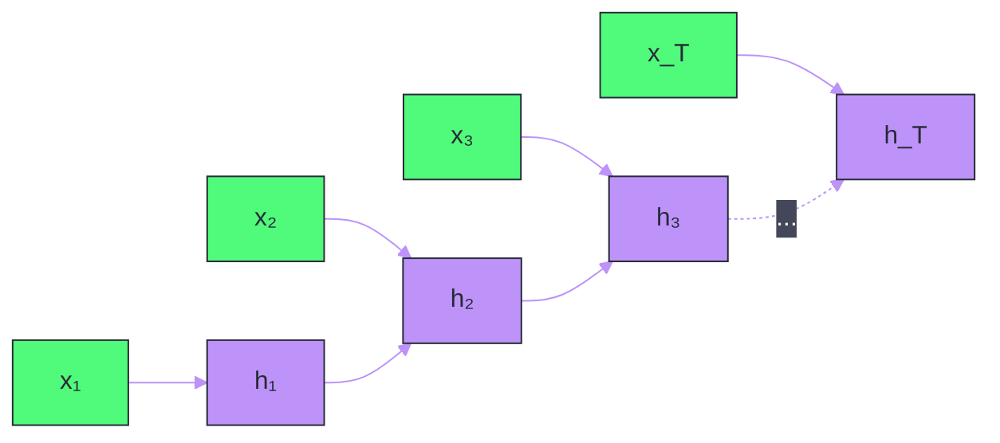
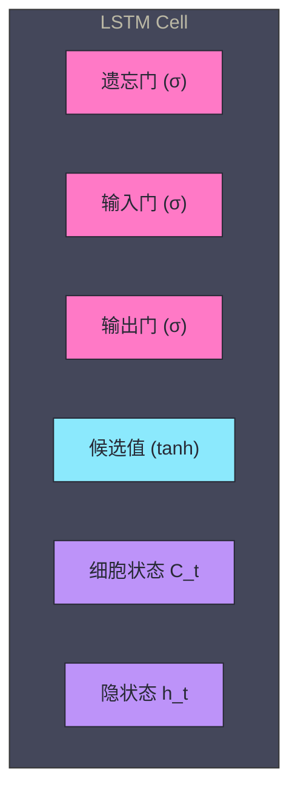
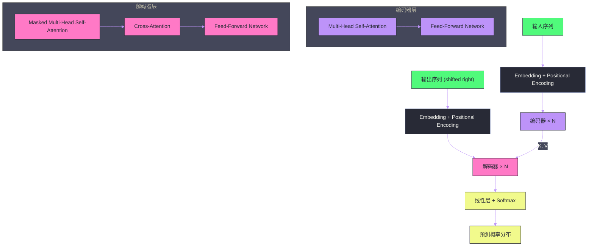

# 01 从 RNN 到 Transformer——注意力机制的革命

**摘要：**

本文从序列建模的本质需求出发，梳理了从 RNN → LSTM/GRU → Attention → Transformer 的技术演进链路。核心问题只有一个：**如何让模型有效地捕捉序列中任意两个位置之间的依赖关系？** RNN 用"逐步传递"的方式尝试解决，但受限于梯度消失和串行计算；LSTM 通过门控机制缓解了梯度消失，但长距离依赖仍然衰减；Attention 机制允许模型直接"看到"序列中的任意位置，彻底绕开了距离限制；Transformer 将 Attention 发展为 Self-Attention，配合 Multi-Head 机制和位置编码，构建了一个完全基于注意力的序列建模架构——这正是 GPT、BERT、LLaMA 等所有现代大语言模型的基石。

---

## 第 1 章 引言：序列建模的核心挑战

### 1.1 什么是序列建模

人类语言天然是序列——一句话由词按顺序排列，词的含义依赖于它在句子中的位置和上下文。"银行"在"去银行取钱"和"河的南岸是一片银行"中含义截然不同。序列建模的核心任务就是：**给定一个序列的前文，预测下一个元素**（语言模型），或者**将一个序列映射为另一个序列**（机器翻译/摘要生成）。

从数学角度看，序列建模要解决的核心问题是建模条件概率分布：

$$P(x_t | x_1, x_2, \ldots, x_{t-1})$$

即在已知前 $t-1$ 个 token 的情况下，预测第 $t$ 个 token 的概率分布。整个序列的联合概率可以通过链式法则分解为：

$$P(x_1, x_2, \ldots, x_T) = \prod_{t=1}^{T} P(x_t | x_1, \ldots, x_{t-1})$$

这个分解看似简洁，但实际计算面临一个根本性挑战：**条件概率 $P(x_t | x_1, \ldots, x_{t-1})$ 的条件集合随 $t$ 增长而增长**。当 $t$ 很大时（比如一篇文章的第 5000 个词），模型需要"记住"前面所有 4999 个词的信息来做出预测。这就是序列建模中最核心的难题——**长距离依赖**（Long-Range Dependencies）。

### 1.2 长距离依赖为什么难

考虑一个简单的例子：

> "我出生在法国，在巴黎长大，后来去了美国留学，在那里读了计算机科学的博士，毕业后回到了欧洲，在一家科技公司工作，日常使用的语言是______。"

要正确填入"法语"，模型需要关注到句子开头的"出生在法国"——中间隔了几十个词。这就是长距离依赖的典型场景。

长距离依赖之所以难，根源在于信息传递的**衰减**和**干扰**：

- **衰减**：如果信息必须通过多个中间步骤逐步传递（如 RNN 的隐状态），每一步都会引入信息损失，传递距离越远，原始信息保留得越少
- **干扰**：中间步骤引入的新信息会"覆盖"或"稀释"早期信息，因为隐状态的容量有限（固定维度的向量），无法无限制地累积信息

这两个问题的根源是相同的：**信息传递路径的长度与序列距离成正比**。如果模型能够直接建立任意两个位置之间的连接，而不需要经过中间位置的"接力"，长距离依赖问题就能从根本上解决——这正是 Attention 机制的核心思想。

### 1.3 技术演进的主线

序列建模技术的演进，本质上是围绕"如何缩短信息传递路径"这一核心问题展开的：

| 模型 | 任意两位置的信息路径长度 | 并行度 | 核心限制 |
| :--- | :--- | :--- | :--- |
| **RNN** | $O(n)$——必须逐步传递 | 无法并行（串行依赖） | 梯度消失/爆炸，长距离信息丢失 |
| **LSTM/GRU** | $O(n)$——门控缓解但未消除 | 无法并行 | 长距离依赖仍衰减，训练慢 |
| **Attention（Seq2Seq）** | $O(1)$——直接连接 | 编码端可并行，解码端串行 | 仍依赖 RNN 作为骨架 |
| **Transformer** | $O(1)$——Self-Attention | 完全并行 | 计算复杂度 $O(n^2)$ |

下面我们沿着这条主线，逐步深入每种架构的设计动机、工作原理和核心局限。

---

## 第 2 章 RNN——序列建模的起点

### 2.1 RNN 的基本结构

循环神经网络（Recurrent Neural Network, RNN）是最早为序列建模设计的神经网络架构。它的核心思想极为朴素：**用一个"隐状态"向量 $h_t$ 来累积截至当前时间步 $t$ 的所有历史信息**。

在每个时间步 $t$，RNN 接收当前输入 $x_t$ 和上一步的隐状态 $h_{t-1}$，计算新的隐状态 $h_t$：

$$h_t = \tanh(W_{hh} \cdot h_{t-1} + W_{xh} \cdot x_t + b)$$

其中 $W_{hh}$ 是隐状态到隐状态的权重矩阵，$W_{xh}$ 是输入到隐状态的权重矩阵，$\tanh$ 是激活函数。$h_t$ 既作为当前步的输出（可以接一个全连接层做分类/生成），也作为"记忆"传递给下一步。

这个设计优雅而直观——隐状态 $h_t$ 就像一个"压缩的记忆"，理论上包含了从 $x_1$ 到 $x_t$ 的所有信息。

### 2.2 RNN 的致命缺陷：梯度消失与爆炸

理论上，RNN 能够捕捉任意长度的依赖关系。但在实际训练中，RNN 面临一个根本性的数学难题——**梯度消失**（Vanishing Gradient）和**梯度爆炸**（Exploding Gradient）。

在反向传播（Backpropagation Through Time, BPTT）中，损失函数对早期隐状态 $h_k$（$k \ll t$）的梯度需要通过链式法则逐步回传：

$$\frac{\partial L_t}{\partial h_k} = \frac{\partial L_t}{\partial h_t} \cdot \prod_{i=k+1}^{t} \frac{\partial h_i}{\partial h_{i-1}}$$

关键在于中间那个**连乘项** $\prod_{i=k+1}^{t} \frac{\partial h_i}{\partial h_{i-1}}$。由于 $\frac{\partial h_i}{\partial h_{i-1}} = W_{hh}^T \cdot \text{diag}(\tanh'(z_i))$，其中 $\tanh'$ 的值域为 $(0, 1]$，每一步乘积都会缩小梯度。当 $t - k$ 很大时（即时间步间隔大），梯度会指数级衰减趋近于零——这就是梯度消失。

梯度消失的直接后果是：**模型无法学习到长距离依赖**。反向传播时，远处时间步的梯度信号几乎为零，权重更新微乎其微，模型实际上只能学到近几步的局部模式。

反过来，如果 $W_{hh}$ 的最大特征值大于 1，连乘项会指数级增长，导致梯度爆炸。梯度爆炸可以通过**梯度裁剪**（Gradient Clipping）缓解，但梯度消失没有同样简单的补救措施——因为你无法凭空"放大"一个已经丢失的信号。

> [!warning] 核心洞察
> 梯度消失不仅仅是一个"训练技巧"问题，它反映了 RNN 架构的根本局限：**信息必须通过 $O(n)$ 步的串行传递**，每一步都是一个有损压缩，长距离信息必然衰减。这个问题不是调参数或换优化器能解决的——需要架构层面的革新。

### 2.3 串行计算的效率瓶颈

除了梯度消失，RNN 还有一个严重的工程问题：**无法并行化**。

$h_t$ 的计算依赖 $h_{t-1}$，$h_{t-1}$ 依赖 $h_{t-2}$……这种严格的串行依赖意味着：即使你有一块拥有上万个 CUDA Core 的 GPU，在处理一个长度为 $T$ 的序列时，也必须串行执行 $T$ 次矩阵运算。GPU 的并行计算能力完全无法发挥。

在深度学习从"小模型+小数据"走向"大模型+大数据"的时代，这个效率瓶颈是致命的。后来 Transformer 能够用数万亿 token 训练的前提之一，就是它的 Self-Attention 机制允许序列中所有位置**同时并行计算**。

---

## 第 3 章 LSTM 与 GRU——门控机制的缓解

### 3.1 LSTM 的设计动机

长短期记忆网络（Long Short-Term Memory, LSTM）由 Hochreiter 和 Schmidhuber 在 1997 年提出，直接针对 RNN 的梯度消失问题。它的核心思想是：**引入一条"高速公路"（Cell State），让信息可以不经过非线性变换地直接传递**。

在标准 RNN 中，信息传递的唯一通道是隐状态 $h_t$，每一步都要经过 $\tanh$ 非线性变换——这正是梯度消失的根源。LSTM 额外引入了一个**细胞状态** $C_t$（Cell State），它像一条传送带，信息可以沿着它几乎无损地向前传递。

### 3.2 LSTM 的三个门

LSTM 通过三个"门"（Gate）来控制信息的流动：

**遗忘门**（Forget Gate）决定从细胞状态中丢弃什么信息：

$$f_t = \sigma(W_f \cdot [h_{t-1}, x_t] + b_f)$$

$\sigma$ 是 Sigmoid 函数，输出值在 $(0, 1)$ 之间。$f_t$ 中接近 1 的维度表示"保留"，接近 0 的维度表示"遗忘"。

**输入门**（Input Gate）决定往细胞状态中写入什么新信息：

$$i_t = \sigma(W_i \cdot [h_{t-1}, x_t] + b_i)$$
$$\tilde{C}_t = \tanh(W_C \cdot [h_{t-1}, x_t] + b_C)$$

$i_t$ 控制哪些维度被更新，$\tilde{C}_t$ 是候选新信息。

**细胞状态更新**——结合遗忘门和输入门：

$$C_t = f_t \odot C_{t-1} + i_t \odot \tilde{C}_t$$

这一步是 LSTM 的精髓。注意 $C_{t-1}$ 到 $C_t$ 的传递只涉及**逐元素乘法和加法**——没有矩阵乘法，没有非线性激活。如果遗忘门 $f_t$ 接近 1（即"全部保留"），信息可以无损地从 $C_{t-1}$ 流向 $C_t$。这意味着梯度也可以沿着这条通道几乎无损地回传，从而缓解了梯度消失。

**输出门**（Output Gate）决定细胞状态的哪些部分作为当前步的输出：

$$o_t = \sigma(W_o \cdot [h_{t-1}, x_t] + b_o)$$
$$h_t = o_t \odot \tanh(C_t)$$

### 3.3 GRU——LSTM 的简化变体

门控循环单元（Gated Recurrent Unit, GRU）由 Cho 等人在 2014 年提出，是 LSTM 的简化版本。它将遗忘门和输入门合并为一个**更新门** $z_t$，同时合并了细胞状态和隐状态：

$$z_t = \sigma(W_z \cdot [h_{t-1}, x_t])$$
$$r_t = \sigma(W_r \cdot [h_{t-1}, x_t])$$
$$\tilde{h}_t = \tanh(W \cdot [r_t \odot h_{t-1}, x_t])$$
$$h_t = (1 - z_t) \odot h_{t-1} + z_t \odot \tilde{h}_t$$

GRU 的参数量比 LSTM 少约 25%，训练更快，在许多任务上性能与 LSTM 相当。但两者共享相同的根本局限。

### 3.4 LSTM/GRU 仍未解决的问题

LSTM 和 GRU 通过门控机制**缓解**了梯度消失，但并未**消除**长距离依赖的衰减。原因有二：

**第一，遗忘门不可能永远全开。** 在实际训练中，遗忘门 $f_t$ 不可能在每一步都精确地保持接近 1——它需要根据内容动态决定保留和遗忘什么。随着序列变长，累积的遗忘效应仍然会导致早期信息的逐步丢失。实验表明，LSTM 在序列长度超过几百步时，性能开始显著下降。

**第二，固定维度的隐状态容量有限。** 无论是 LSTM 的细胞状态还是 GRU 的隐状态，都是一个固定维度的向量（通常 256-1024 维）。要在这个有限容量中"压缩"整个序列的信息，信息损失不可避免。序列越长，每个 token 能分到的"带宽"就越少。

**第三，串行计算的瓶颈依然存在。** LSTM 和 GRU 与标准 RNN 一样，$h_t$ 依赖 $h_{t-1}$，无法并行。在 GPU 时代，这意味着训练效率的天花板。

> [!note] 设计哲学
> LSTM 的设计哲学是"在 RNN 的框架内，通过更精巧的信息流控制来缓解梯度消失"。它没有质疑 RNN"逐步传递"的根本假设。真正的突破需要一种完全不同的信息传递方式——Attention 机制提供了这种可能。

---

## 第 4 章 注意力机制——直接连接的突破

### 4.1 Attention 的诞生：Seq2Seq 的瓶颈

注意力机制最初出现在序列到序列（Seq2Seq）模型中，解决的是一个非常具体的问题：**编码器-解码器架构中的信息瓶颈**。

2014 年，Sutskever 等人提出了经典的 Seq2Seq 模型用于机器翻译。编码器（一个 RNN/LSTM）将输入序列处理成一个固定长度的"上下文向量" $c$（即编码器最后一步的隐状态），解码器（另一个 RNN/LSTM）基于这个 $c$ 逐步生成翻译结果。

问题很明显：**整个输入序列的所有信息被压缩到一个固定维度的向量 $c$ 中**。对于短句子，这或许够用；但对于长句子，$c$ 根本无法承载所有信息。Cho 等人在 2014 年的实验中明确观察到：随着输入句子长度增加，Seq2Seq 模型的翻译质量急剧下降。

### 4.2 Bahdanau Attention：让解码器"回头看"

2015 年，Bahdanau、Cho 和 Bengio 提出了一个关键改进——**注意力机制**（Attention Mechanism）。核心思想是：**解码器在生成每个输出词时，不再只依赖一个固定的上下文向量 $c$，而是动态地"关注"编码器的所有隐状态，对它们做加权求和**。

具体来说，在解码器的第 $t$ 步：

**第一步**：计算**注意力分数**（Attention Score）。解码器当前隐状态 $s_{t-1}$ 与编码器每个位置 $j$ 的隐状态 $h_j$ 之间的"相关性"：

$$e_{t,j} = a(s_{t-1}, h_j)$$

其中 $a$ 是一个可学习的对齐函数，Bahdanau 使用了一个小型的前馈神经网络：$a(s, h) = v^T \tanh(W_s s + W_h h)$。

**第二步**：将注意力分数通过 Softmax 归一化为**注意力权重**：

$$\alpha_{t,j} = \frac{\exp(e_{t,j})}{\sum_{k=1}^{T_x} \exp(e_{t,k})}$$

$\alpha_{t,j}$ 表示解码器在生成第 $t$ 个输出词时，对编码器第 $j$ 个位置的"关注程度"。所有权重之和为 1。

**第三步**：用注意力权重对编码器隐状态做**加权求和**，得到当前步的上下文向量：

$$c_t = \sum_{j=1}^{T_x} \alpha_{t,j} \cdot h_j$$

注意这个 $c_t$ 是动态的——每个解码步都会重新计算，关注输入序列的不同部分。翻译"bank"时可能关注原文的"银行"，翻译"river"时关注"河流"。

> [!info] 核心概念
> 注意力机制的本质是一个**软寻址**（Soft Addressing）过程：用查询信号（解码器状态）在一组键值对（编码器隐状态）中检索最相关的信息。这个"查询-键-值"的思想，后来被 Transformer 正式提炼为 Q/K/V 框架。

### 4.3 Attention 为什么有效

注意力机制之所以能解决长距离依赖问题，根本原因在于：**它在解码器和编码器的任意位置之间建立了直接连接**。

在没有 Attention 的 Seq2Seq 中，输入序列第 1 个词的信息要传递给解码器，必须经过编码器的 $T_x$ 步串行传递，压缩到上下文向量 $c$ 中，然后在解码器中展开。信息路径长度为 $O(T_x + T_y)$。

有了 Attention 后，解码器在任何一步都可以直接"看到"编码器的任何位置——信息路径长度降为 $O(1)$。这不仅解决了长距离依赖，还提供了良好的**可解释性**：通过可视化注意力权重 $\alpha_{t,j}$，我们可以直观地看到模型在翻译每个词时"关注"了源句的哪个部分。

### 4.4 Attention 的局限：仍然是 RNN 的"配件"

Bahdanau Attention 虽然是一个重大突破，但它仍然嵌套在 RNN/LSTM 的框架中——编码器和解码器本身还是 RNN。这意味着：

- 编码器仍然需要串行处理输入序列
- 解码器仍然是逐步生成的
- RNN 本身的参数和计算量仍然存在

Attention 在这里的角色是 RNN 的"增强配件"，而非替代品。一个自然的问题浮现：**既然 Attention 已经能让模型直接访问序列的任意位置，我们还需要 RNN 吗？**

---

## 第 5 章 Transformer——Attention Is All You Need

### 5.1 从"配件"到"主角"的范式转变

2017 年，Google 的 Vaswani 等人在论文《Attention Is All You Need》中给出了一个大胆的回答：**不需要 RNN，纯 Attention 就够了。**

他们提出的 Transformer 架构完全抛弃了循环结构，仅靠注意力机制和前馈网络构建了一个序列到序列的模型。这不仅解决了 RNN 的串行计算瓶颈，还在机器翻译任务上取得了当时的最优性能——而且训练速度大幅提升。

这篇论文的意义远超机器翻译。Transformer 成为了后续所有大语言模型的基础架构：[[GPT 架构]]（Decoder-Only）、BERT（Encoder-Only）、T5（Encoder-Decoder）都是 Transformer 的变体。

### 5.2 Self-Attention：序列内部的注意力

Transformer 的核心创新是 **Self-Attention（自注意力）**——不再是编码器和解码器之间的注意力，而是**序列自身内部的注意力**。

在之前的 Bahdanau Attention 中，查询来自解码器，键值来自编码器——是两个不同序列之间的交互。Self-Attention 将查询、键、值都来自同一个序列，让序列中的每个位置都能关注到序列中的其他所有位置。

给定输入序列的表示矩阵 $X \in \mathbb{R}^{n \times d}$（$n$ 个 token，每个 $d$ 维），Self-Attention 的计算分三步：

**第一步：线性投影生成 Q、K、V**

$$Q = X W^Q, \quad K = X W^K, \quad V = X W^V$$

其中 $W^Q, W^K \in \mathbb{R}^{d \times d_k}$，$W^V \in \mathbb{R}^{d \times d_v}$。$Q$（Query，查询）、$K$（Key，键）、$V$（Value，值）三个矩阵各有不同的语义角色：

- **Query**：代表"我在寻找什么信息"
- **Key**：代表"我能提供什么信息"
- **Value**：代表"我实际携带的信息内容"

为什么需要三个不同的投影，而不是直接用 $X$ 本身？因为一个 token 在"查询其他 token"和"被其他 token 查询"时，关注的语义维度可能不同。例如，动词在查询主语时关注的是"施事者"维度，而它被形容词查询时暴露的是"被修饰对象"维度。三个独立的投影矩阵让模型能够灵活地学习这些不同的语义角色。

**第二步：计算注意力分数并归一化**

$$\text{Attention}(Q, K, V) = \text{softmax}\left(\frac{QK^T}{\sqrt{d_k}}\right) V$$

$QK^T \in \mathbb{R}^{n \times n}$ 是注意力分数矩阵，第 $(i, j)$ 个元素表示位置 $i$ 对位置 $j$ 的"关注程度"。除以 $\sqrt{d_k}$ 是**缩放**（Scaled）操作——当 $d_k$ 较大时，$QK^T$ 的元素值会很大，Softmax 会进入饱和区（梯度接近零），缩放可以避免这个问题。

Softmax 将每一行归一化为概率分布（和为 1），然后用这些权重对 $V$ 做加权求和。

**第三步：输出上下文感知的表示**

最终输出矩阵的第 $i$ 行是 $V$ 中所有行的加权平均，权重由 $Q$ 的第 $i$ 行与所有 $K$ 的点积决定。这意味着每个位置的输出都融合了来自序列所有位置的信息——信息路径长度为 $O(1)$。

> [!info] 核心概念
> Self-Attention 的本质可以类比为**信息检索**：每个 token 带着自己的 Query 去整个序列中"搜索"最相关的 Key，然后读取对应的 Value 并融合到自己的表示中。这是一个完全数据驱动的、可微分的"查找表"操作。

### 5.3 Multi-Head Attention：多视角的并行关注

单个 Self-Attention 只能捕捉一种"注意力模式"——比如主语-谓语的句法关系。但自然语言中的关系是多维度的：一个词可能同时需要关注句法依赖、语义相似性、共指关系等。

**Multi-Head Attention（多头注意力）** 的解决方案是：**并行运行多个 Self-Attention，每个"头"用不同的投影矩阵，关注序列的不同方面，最后拼接起来**。

$$\text{MultiHead}(Q, K, V) = \text{Concat}(\text{head}_1, \ldots, \text{head}_h) W^O$$

其中每个头：

$$\text{head}_i = \text{Attention}(X W_i^Q, X W_i^K, X W_i^V)$$

假设模型维度 $d = 512$，使用 $h = 8$ 个头，那么每个头的 $d_k = d_v = d / h = 64$。8 个头并行计算（可以通过矩阵 reshape 在 GPU 上高效实现），最后拼接得到 $8 \times 64 = 512$ 维的输出，再通过 $W^O$ 线性投影。

这种设计的精妙之处在于：

- **参数量不变**：$h$ 个头的总参数量与单个全维度 Attention 相当（因为每个头的维度缩小了 $h$ 倍）
- **计算量不变**：同理
- **表达能力增强**：每个头可以学习不同的注意力模式

实验观察表明，不同的注意力头确实会学到不同的模式——有的头关注相邻词，有的头关注句法依赖，有的头关注远距离的共指关系。

### 5.4 位置编码：弥补顺序信息的缺失

Self-Attention 有一个重要特性：**它是置换不变的**（Permutation Invariant）。也就是说，如果我们打乱输入序列的顺序，Self-Attention 的输出只是相应地打乱，注意力权重本身不变。

这对于集合（Set）数据是理想的特性，但对于序列数据是灾难性的——"狗咬人"和"人咬狗"对 Self-Attention 来说没有区别，因为它不知道词的顺序。

**位置编码**（Positional Encoding）就是为了弥补这个缺失。原始 Transformer 使用**正弦-余弦位置编码**：

$$PE_{(pos, 2i)} = \sin\left(\frac{pos}{10000^{2i/d}}\right)$$
$$PE_{(pos, 2i+1)} = \cos\left(\frac{pos}{10000^{2i/d}}\right)$$

其中 $pos$ 是位置索引，$i$ 是维度索引。这种编码有两个巧妙的性质：

1. **每个位置有唯一的编码**：不同位置的编码向量不同
2. **相对位置信息可通过线性变换获得**：$PE_{pos+k}$ 可以表示为 $PE_{pos}$ 的线性变换（因为三角函数的和差公式），这使模型能够学习到相对位置关系

位置编码被直接加到输入的 token embedding 上：$\text{input} = \text{token\_embedding} + \text{positional\_encoding}$。

> [!note] 设计哲学
> 正弦-余弦位置编码是 Transformer 的原始方案，但它有一个局限：它是绝对位置编码，不能很好地泛化到训练时未见过的更长序列。后续的 [[GPT 架构]] 使用了**可学习的位置编码**（Learnable Positional Embedding），而更先进的方案如 **RoPE**（Rotary Position Embedding）和 **ALiBi**（Attention with Linear Biases）将位置信息注入到注意力分数中而非 embedding 中，显著提升了长序列的泛化能力。我们将在后续文章中详细讨论。

### 5.5 Transformer 的完整架构

一个完整的 Transformer 由**编码器栈**和**解码器栈**组成，每个栈由多个相同的层堆叠而成。

**编码器层**包含两个子层：
1. **Multi-Head Self-Attention**
2. **Position-wise Feed-Forward Network**（两层全连接，中间用 ReLU/GELU 激活）

每个子层都有**残差连接**（Residual Connection）和**层归一化**（Layer Normalization）：

$$\text{output} = \text{LayerNorm}(x + \text{SubLayer}(x))$$

残差连接的作用与 [[LSTM]] 的细胞状态类似——提供一条"高速公路"让信息和梯度直接传递，避免深层网络的退化问题。

**解码器层**包含三个子层：
1. **Masked Multi-Head Self-Attention**——带掩码，防止位置 $i$ 关注到位置 $i+1$ 及之后的 token（保证自回归生成的因果性）
2. **Cross-Attention**——Query 来自解码器，Key 和 Value 来自编码器（类似 Bahdanau Attention）
3. **Position-wise Feed-Forward Network**

### 5.6 Feed-Forward Network：逐位置的非线性变换

Self-Attention 提供了 token 之间的交互能力，但它本质上是一个线性操作（加权求和）。**Feed-Forward Network**（FFN）为每个位置独立地提供非线性变换能力：

$$\text{FFN}(x) = \text{ReLU}(xW_1 + b_1)W_2 + b_2$$

FFN 在每个位置独立应用（Position-wise），不涉及 token 之间的交互。它的作用是：

- **增加模型的非线性表达能力**：Self-Attention 本身是线性的（如果不考虑 Softmax 的非线性），FFN 补充了非线性
- **特征变换和记忆存储**：研究表明，FFN 层实际上充当了一个"键值记忆"——$W_1$ 的每一行是一个"键"，$W_2$ 的对应列是一个"值"，FFN 通过 ReLU 激活来"选择"匹配的记忆条目

在现代 LLM 中，FFN 通常使用 **SwiGLU** 激活函数（LLaMA/Mistral 等采用），其表达能力优于 ReLU：

$$\text{SwiGLU}(x) = (\text{SiLU}(xW_1) \odot xW_3) W_2$$

### 5.7 残差连接与层归一化

**残差连接**（Residual Connection，He et al., 2015）的思想是：与其让层直接学习目标映射 $H(x)$，不如让它学习残差 $F(x) = H(x) - x$，输出为 $x + F(x)$。

在 Transformer 中，残差连接的作用至关重要：

1. **梯度流畅**：反向传播时，梯度可以通过残差连接直接传回较早的层，避免深层网络的梯度消失
2. **训练稳定**：每一层只需学习"增量修正"而非完整映射，降低了优化难度
3. **信息保留**：原始输入信息不会被中间层"覆盖"

**层归一化**（Layer Normalization）对每个 token 的特征向量做归一化（均值为 0，方差为 1），然后通过可学习的缩放和偏移参数恢复表达能力：

$$\text{LayerNorm}(x) = \gamma \cdot \frac{x - \mu}{\sqrt{\sigma^2 + \epsilon}} + \beta$$

原始 Transformer 使用 **Post-Norm**（先子层计算，再归一化），现代 LLM 普遍使用 **Pre-Norm**（先归一化，再子层计算）和 **RMSNorm**（只做缩放，不做偏移，计算更快）。Pre-Norm 的优势在于训练更稳定，允许使用更大的学习率。

---

## 第 6 章 Transformer 的计算复杂度与工程优势

### 6.1 时间与空间复杂度分析

Self-Attention 的核心计算是 $QK^T$——一个 $n \times d_k$ 的矩阵与 $d_k \times n$ 的矩阵相乘，得到 $n \times n$ 的注意力矩阵。

| 操作 | 时间复杂度 | 空间复杂度 |
| :--- | :--- | :--- |
| Self-Attention（$QK^T$ 计算） | $O(n^2 \cdot d)$ | $O(n^2)$（注意力矩阵） |
| Feed-Forward Network | $O(n \cdot d^2)$ | $O(n \cdot d)$ |
| RNN（对比） | $O(n \cdot d^2)$ | $O(d^2)$ |

当序列长度 $n$ 较小时（$n < d$），Self-Attention 的复杂度由 $d$ 主导，与 RNN 相当。但当 $n$ 很大时，$O(n^2)$ 的复杂度成为瓶颈。这正是后续长上下文研究（Flash Attention、稀疏 Attention、RoPE 外推等）要解决的核心问题，我们将在 [[08 长上下文与多模态——技术前沿]] 中详细讨论。

### 6.2 并行计算的优势

Transformer 相对于 RNN 最重要的工程优势是**完全可并行化**：

- **训练阶段**：Self-Attention 的 $QK^T$ 是矩阵乘法，天然适合 GPU 的 SIMD 并行。整个序列的所有位置可以同时计算注意力，不需要等待前一步完成。这使得 Transformer 的训练速度远快于同规模的 RNN
- **推理阶段**：编码器可以一次性处理整个输入。解码器在生成时仍然是逐 token 的（因为自回归依赖），但可以通过 **KV Cache** 机制避免重复计算已有 token 的 Key 和 Value

正是这种并行能力，使得 Transformer 能够在数万亿 token 的数据上进行训练，催生了 GPT-3（175B 参数）、LLaMA（65B）、GPT-4 等超大规模模型。没有 Transformer 的并行性，大语言模型的规模化训练在工程上是不可行的。

### 6.3 模型深度 vs 序列长度的扩展

RNN 的"深度"和"序列长度"是耦合的——处理更长的序列需要更多的计算步骤。Transformer 解耦了这两个维度：

- **模型深度**（层数 $L$）：控制特征提取的抽象层次，类似 CNN 中的层数
- **序列长度**（$n$）：Self-Attention 在单层内就能建立全局连接

这种解耦使得架构设计更加灵活——可以独立调节层数（控制模型容量）和上下文长度（控制信息范围），而不是被迫将两者绑定在一起。

---

## 第 7 章 从 Transformer 到 LLM 的三条分支

Transformer 的原始架构是编码器-解码器结构（Encoder-Decoder），但后续的研究在此基础上分化出三条主要路线：

### 7.1 Encoder-Only：BERT 家族

BERT（Bidirectional Encoder Representations from Transformers, 2018）只使用 Transformer 的编码器部分，通过**掩码语言模型**（Masked Language Model, MLM）进行预训练——随机遮住输入中的一些 token，让模型预测被遮住的 token。

由于编码器的 Self-Attention 没有因果掩码，每个位置可以同时关注左右两边的上下文（双向注意力），这使 BERT 在自然语言理解任务（分类/问答/NER）上表现出色。

但 BERT 不适合生成任务——它的训练目标是"填空"而非"续写"，无法进行自回归生成。

### 7.2 Decoder-Only：GPT 家族

GPT（Generative Pre-trained Transformer）只使用 Transformer 的解码器部分（去掉了 Cross-Attention），通过**自回归语言模型**进行预训练——给定前文，预测下一个 token。

Decoder-Only 架构使用**因果注意力掩码**（Causal Mask）：位置 $i$ 只能关注位置 $1, 2, \ldots, i$，不能"偷看"后面的内容。这保证了生成的自回归性。

GPT 系列（GPT-1 → GPT-2 → GPT-3 → GPT-4）证明了一个重要的 Scaling Law：**随着模型规模和训练数据量的增长，Decoder-Only 模型的能力会持续提升**，展现出涌现能力（Emergent Abilities）。当前几乎所有的大语言模型（GPT-4、LLaMA、Mistral、DeepSeek、Qwen）都采用 Decoder-Only 架构。

我们将在 [[02 GPT 架构——Decoder-Only 的自回归语言模型]] 中详细分析这个架构。

### 7.3 Encoder-Decoder：T5/BART 家族

T5（Text-to-Text Transfer Transformer）保留了 Transformer 的完整编码器-解码器结构，将所有 NLP 任务统一为"文本到文本"的格式。编码器处理输入文本，解码器生成输出文本。

这种架构在机器翻译、摘要生成等"输入→输出"格式明确的任务上有优势，但在开放式生成任务上不如 Decoder-Only 灵活。

| 架构 | 代表模型 | 注意力类型 | 擅长任务 | 当前地位 |
| :--- | :--- | :--- | :--- | :--- |
| **Encoder-Only** | BERT, RoBERTa | 双向 | NLU（分类/问答） | 特定任务仍有用，已非主流 |
| **Decoder-Only** | GPT-4, LLaMA, DeepSeek | 因果（单向） | 生成/推理/通用 | **当前绝对主流** |
| **Encoder-Decoder** | T5, BART, Flan-T5 | 编码双向 + 解码因果 | 翻译/摘要/条件生成 | 特定场景使用 |

Decoder-Only 成为主流的根本原因是它的**通用性和可扩展性**——同一个架构同一个训练目标（next token prediction），通过增大规模就能获得越来越强的能力，无需为不同任务设计不同的预训练策略。这种简洁性正是 Scaling Law 能够生效的前提。

---

## 第 8 章 总结与展望

### 8.1 技术演进的核心逻辑

回顾从 RNN 到 Transformer 的演进，核心逻辑始终围绕一个问题：**如何更高效地建模序列中的长距离依赖？**

1. **RNN**：通过隐状态逐步传递信息，路径长度 $O(n)$，梯度消失导致长距离信息丢失
2. **LSTM/GRU**：通过门控和细胞状态缓解梯度消失，但路径长度仍为 $O(n)$，信息仍然衰减
3. **Attention（Seq2Seq）**：在编码器和解码器之间建立 $O(1)$ 的直接连接，但仍依赖 RNN 作为骨架
4. **Transformer（Self-Attention）**：完全抛弃 RNN，序列内任意两位置 $O(1)$ 直连，且可完全并行

这条演进路径的本质是：**从"串行传递"到"直接连接"的信息传递范式转变**。

### 8.2 Transformer 的成功因素

Transformer 的成功不仅仅在于 Self-Attention 本身，而是多个设计决策的协同效应：

- **Self-Attention**：提供全局信息交互能力
- **Multi-Head**：多视角并行关注
- **位置编码**：弥补顺序信息的缺失
- **FFN**：逐位置的非线性特征变换
- **残差连接 + LayerNorm**：支持深层网络的稳定训练
- **完全可并行**：使大规模训练成为可能

### 8.3 下一步

Transformer 为大语言模型提供了架构基础，但从架构到一个能对话、能推理的 AI 助手，还需要解决很多问题：

- [[02 GPT 架构——Decoder-Only 的自回归语言模型]]：为什么 Decoder-Only 成为主流？自回归生成的具体机制是什么？
- [[03 预训练——数据、算力与 Scaling Law]]：如何用数万亿 token 训练一个上千亿参数的模型？
- [[06 推理优化——KV Cache、量化与投机解码]]：$O(n^2)$ 的注意力复杂度在推理时如何优化？

---

## 参考文献

1. Vaswani et al., "Attention Is All You Need", NeurIPS 2017
2. Bahdanau et al., "Neural Machine Translation by Jointly Learning to Align and Translate", ICLR 2015
3. Hochreiter & Schmidhuber, "Long Short-Term Memory", Neural Computation, 1997
4. Cho et al., "Learning Phrase Representations using RNN Encoder-Decoder for Statistical Machine Translation", EMNLP 2014
5. Sutskever et al., "Sequence to Sequence Learning with Neural Networks", NeurIPS 2014
6. He et al., "Deep Residual Learning for Image Recognition", CVPR 2016
7. Ba et al., "Layer Normalization", arXiv 2016
8. Devlin et al., "BERT: Pre-training of Deep Bidirectional Transformers for Language Understanding", NAACL 2019
9. Radford et al., "Improving Language Understanding by Generative Pre-Training", 2018 (GPT-1)
10. Raffel et al., "Exploring the Limits of Transfer Learning with a Unified Text-to-Text Transformer", JMLR 2020 (T5)

---

> [!note] 思考题
> 1. RNN/LSTM 按顺序处理序列，无法并行化——处理 1000 个 token 需要 1000 步。Transformer 的 Self-Attention 可以并行计算所有 token 之间的关系，但计算复杂度是 O(n²)。在序列长度为 100K token 时，Self-Attention 的显存和计算开销如何增长？Flash Attention 是如何将 O(n²) 的显存降低到 O(n) 的？
> 2. Self-Attention 的核心公式 `Attention(Q,K,V) = softmax(QK^T / √d_k)V` 中，`√d_k` 的缩放因子看似简单但至关重要。如果不做缩放，当 `d_k` 很大时 `QK^T` 的值会非常大，导致 softmax 输出接近 one-hot——梯度消失。这个问题在 Multi-Head Attention 中如何被缓解（提示：每个 head 的 `d_k` 更小）？
> 3. Transformer 使用位置编码（Positional Encoding）注入序列位置信息。原始论文使用正弦/余弦固定编码，而 RoPE（Rotary Position Embedding）在现代 LLM 中被广泛采用。RoPE 的核心思想是什么？它相比绝对位置编码和相对位置编码（如 ALiBi）在长序列外推能力上有什么优势？
