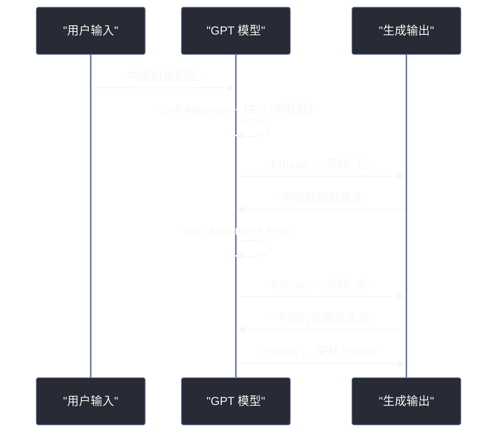

# 02 GPT 架构——Decoder-Only 的自回归语言模型

**摘要：**

本文深入剖析 GPT（Generative Pre-trained Transformer）系列的 Decoder-Only 架构——当前几乎所有主流大语言模型（GPT-4、LLaMA、Mistral、DeepSeek、Qwen）的共同基础。我们从"为什么 Decoder-Only 胜出"这一关键问题出发，逐层拆解自回归生成的因果注意力掩码、Tokenizer 的 BPE 分词机制、Embedding 层的维度设计、位置编码从绝对到旋转（RoPE）的演进，以及 GPT-1 到 GPT-4 的架构变化。核心目标是回答：一个只做 next token prediction 的模型，为什么能展现出推理、翻译、编程等涌现能力？

---

## 第 1 章 为什么是 Decoder-Only

### 1.1 三种 Transformer 变体的回顾

在 [[01 从 RNN 到 Transformer——注意力机制的革命]] 中，我们介绍了 Transformer 衍生出的三种主要架构：Encoder-Only（BERT）、Decoder-Only（GPT）、Encoder-Decoder（T5）。2018-2020 年间，这三种架构各有拥趸，BERT 在 NLU 任务上一度占据统治地位。但到了 2023 年之后，Decoder-Only 已经成为压倒性的主流选择。这一结果并非偶然，而是由多个深层原因共同决定的。

### 1.2 Decoder-Only 胜出的根本原因

**原因一：训练目标的统一性与通用性**

BERT 的预训练目标是掩码语言模型（MLM）——随机遮住 15% 的 token，让模型预测被遮住的部分。这是一个"填空"任务，模型学到的是双向上下文表示，擅长理解但不擅长生成。不同的下游任务（分类/问答/NER）需要不同的微调策略。

GPT 的预训练目标是自回归语言模型——给定前文，预测下一个 token。这是最纯粹的语言建模任务，它天然包含了"理解"和"生成"两种能力：要正确预测下一个词，模型必须理解前文的语义；而预测过程本身就是生成。更重要的是，几乎所有 NLP 任务都可以统一为"给定输入文本，生成输出文本"的格式——翻译、摘要、问答、代码生成、数学推理，都不过是不同形式的"next token prediction"。

**原因二：与 Scaling Law 的契合**

2020 年，Kaplan 等人（OpenAI）发现了一个重要的经验规律——**Scaling Law**：在固定的计算预算下，模型性能（以交叉熵损失衡量）与模型参数量、数据量和计算量之间存在幂律关系。更大的模型 + 更多的数据 = 更好的性能，且这种提升是平滑可预测的。

Decoder-Only 架构与 Scaling Law 的契合度最高，原因在于：

- **训练效率**：自回归目标让每个 token 都作为一个训练样本（预测自己之后的 token），数据利用率极高。BERT 的 MLM 只利用了 15% 的 token 作为预测目标，数据效率低得多
- **架构简洁**：只有一个解码器栈，没有编码器-解码器之间的 Cross-Attention，超参数更少，大规模训练时更容易调优
- **涌现能力**：实验表明，只有 Decoder-Only 架构在参数量超过一定阈值后才会出现显著的涌现能力（如 few-shot learning、chain-of-thought reasoning）

**原因三：In-Context Learning 的天然支持**

GPT-3 最令人震惊的发现是 **In-Context Learning**——不需要梯度更新（微调），只需要在 prompt 中给出几个示例（few-shot），模型就能学会新任务。这种能力在 Encoder-Only 和 Encoder-Decoder 架构中很难自然出现，因为它们的训练目标（MLM/Span Corruption）与"根据前文示例进行推理"的范式不匹配。

自回归语言模型天然适合 In-Context Learning：prompt 中的示例就是"前文"，模型基于这些"前文"来预测后续的输出——这与预训练目标完全一致。

> [!note] 设计哲学
> Decoder-Only 的胜出体现了一个深刻的工程哲学：**简单统一的目标，配合足够大的规模，往往胜过精心设计的复杂目标**。next token prediction 看似简单，但它隐含了对语言的全面理解——因为要预测下一个词，你必须理解语法、语义、逻辑、常识乃至世界知识。

### 1.3 自回归生成的基本流程

GPT 的推理过程是一个迭代的自回归生成循环：

1. 输入 prompt（如"中国的首都是"）
2. 模型计算所有 token 的表示，输出最后一个位置的概率分布
3. 从概率分布中采样一个 token（如"北"）
4. 将新 token 追加到输入序列，重复步骤 2-3
5. 直到生成结束符 `<eos>` 或达到最大长度



每一步生成只产出一个 token，这就是自回归模型推理速度相对较慢的根本原因——后续我们在 [[06 推理优化——KV Cache、量化与投机解码]] 中会详细讨论优化方案。

---

## 第 2 章 Tokenizer——从文本到数字

### 2.1 为什么需要 Tokenizer

神经网络只能处理数字，不能直接处理文本。Tokenizer 的职责是将原始文本切分为离散的"token"序列，每个 token 对应词汇表（Vocabulary）中的一个整数 ID。

最朴素的方案是按字符（character）或按词（word）切分：

- **字符级**：词汇表小（几百个字符），但序列极长（一个词可能被切成 5-10 个字符），Self-Attention 的 $O(n^2)$ 复杂度不可接受
- **词级**：序列短，但词汇表巨大（英语几十万词），且无法处理未见过的词（OOV 问题）

实践中需要的是一个折中方案：词汇表大小适中（32K-128K），能覆盖绝大部分文本，对罕见词也能合理处理。

### 2.2 BPE（Byte Pair Encoding）

BPE 最初由 Sennrich 等人（2016）引入 NLP，后来成为 GPT 系列的标准分词算法。它的核心思想是：**从字符级开始，反复合并出现频率最高的相邻 token 对，直到达到目标词汇表大小**。

**训练过程**（在语料库上离线进行）：

1. 将所有文本拆分为字符（或字节），作为初始词汇表
2. 统计所有相邻 token 对的出现频率
3. 将频率最高的 token 对合并为一个新 token，加入词汇表
4. 重复步骤 2-3，直到词汇表达到预设大小（如 50257 for GPT-2）

例如，假设语料中 "th" 出现频率最高，先合并为 "th"；然后 "th" 和 "e" 的组合频率最高，合并为 "the"；如此反复。

**编码过程**（推理时对新文本使用）：按照训练得到的合并规则，贪心地对文本进行分词。常见词会被编码为一个 token（如 "the" → 一个 token），罕见词会被拆分为多个子词（如 "unconstitutional" → "un" + "constit" + "utional"）。

BPE 的优势在于：
- **自适应粒度**：高频词保持完整，低频词自动拆分为有意义的子词
- **无 OOV 问题**：任何文本都可以被编码（最坏情况退化为字节级）
- **可控词汇表大小**：通过合并次数精确控制

### 2.3 Byte-level BPE 与 SentencePiece

GPT-2 使用了 **Byte-level BPE**——以字节（256 个基础 token）而非 Unicode 字符作为起点。这确保了任何 UTF-8 文本（包括中文、日文、Emoji）都能被编码，不需要预处理或特殊字符集。

LLaMA 和 Mistral 等模型使用 **SentencePiece**——一个 Google 开发的分词库，支持 BPE 和 Unigram 两种算法。SentencePiece 的特点是直接在原始文本上操作（不需要预分词），对中文等没有空格分隔的语言更友好。

| 模型 | Tokenizer | 词汇表大小 | 特点 |
| :--- | :--- | :--- | :--- |
| GPT-2 | Byte-level BPE | 50,257 | 以字节为基础单元 |
| GPT-3/3.5/4 | Byte-level BPE (cl100k) | 100,256 | 更大词汇表，更好的多语言支持 |
| LLaMA | SentencePiece (BPE) | 32,000 | 较小词汇表，中文分词效率低 |
| LLaMA 2 | SentencePiece (BPE) | 32,000 | 同上 |
| Qwen | Byte-level BPE | 151,643 | 大词汇表，中文优化 |
| DeepSeek | Byte-level BPE | 100,015 | 平衡中英文 |

> [!warning] 生产避坑
> Tokenizer 的选择直接影响模型的推理成本和多语言能力。词汇表中如果缺少中文常见字/词，同样一段中文文本会被切成更多的 token，导致推理时间和成本成倍增加。这就是为什么 LLaMA 1（32K 词汇表，中文 token 少）处理中文时效率远低于 Qwen（151K 词汇表，大量中文 token）。

### 2.4 特殊 Token

除了普通文本 token，词汇表中还包含若干**特殊 token**，用于控制模型行为：

- **`<bos>`**（Beginning of Sequence）：序列开始标记
- **`<eos>`**（End of Sequence）：序列结束标记，模型生成此 token 时停止
- **`<pad>`**：填充 token，用于将不同长度的序列对齐到相同长度（batch 训练时需要）
- **`<|im_start|>` / `<|im_end|>`**：Chat 模型中用于标记对话角色（system/user/assistant）的边界

这些特殊 token 在预训练和微调中被赋予特定的语义，是模型理解输入结构的关键。

---

## 第 3 章 Embedding 层——从离散 ID 到稠密向量

### 3.1 Token Embedding

Tokenizer 将文本转换为整数 ID 序列后，模型需要将每个 ID 映射为一个稠密的浮点向量——这就是 **Token Embedding** 的作用。

Token Embedding 本质上是一个**可学习的查找表**（Look-up Table）：一个形状为 $V \times d$ 的矩阵 $W_E$，其中 $V$ 是词汇表大小，$d$ 是模型维度（hidden size）。给定 token ID $i$，其 embedding 就是 $W_E$ 的第 $i$ 行。

| 模型 | 词汇表大小 $V$ | 模型维度 $d$ | Embedding 参数量 |
| :--- | :--- | :--- | :--- |
| GPT-2 Small | 50,257 | 768 | ~38M |
| GPT-2 XL | 50,257 | 1,600 | ~80M |
| LLaMA-7B | 32,000 | 4,096 | ~131M |
| LLaMA-70B | 32,000 | 8,192 | ~262M |

在预训练开始前，Embedding 矩阵被随机初始化。随着训练的进行，语义相似的 token 会被映射到向量空间中相近的位置——"king" 和 "queen" 的 embedding 距离会比 "king" 和 "apple" 的距离更近。

### 3.2 权重共享（Weight Tying）

许多模型（GPT-2、LLaMA 等）在 Embedding 层和最终的输出层（Language Model Head）之间共享权重：输出层的任务是将模型最后一层的隐状态 $h \in \mathbb{R}^d$ 映射回词汇表大小的概率分布 $\mathbb{R}^V$，即 $\text{logits} = h \cdot W_E^T$。

权重共享的好处是：
- **减少参数量**：Embedding 矩阵通常占总参数量的 5-10%，共享后减半
- **语义一致性**：输入 embedding 空间和输出预测空间共享同一套语义表示

但也有模型不共享权重（如 GPT-3、DeepSeek），允许输入和输出使用不同的表示空间，这在大模型上可能带来微弱的性能提升。

---

## 第 4 章 因果注意力掩码——自回归的核心保证

### 4.1 为什么需要 Causal Mask

在 [[01 从 RNN 到 Transformer——注意力机制的革命]] 中我们提到，Self-Attention 允许每个位置关注序列中的所有位置。但在自回归生成中，这是不允许的——**位置 $i$ 只能关注位置 $1, 2, \ldots, i$，不能"偷看"位置 $i+1$ 及之后的内容**。

原因很直观：在训练时，我们用 teacher forcing——将真实序列作为输入，让位置 $i$ 预测位置 $i+1$ 的 token。如果位置 $i$ 能看到位置 $i+1$，那预测就变成了"抄答案"，模型什么都学不到。

**Causal Mask**（因果掩码）就是用来实现这个约束的。它是一个下三角矩阵，将注意力分数矩阵中"未来"位置（上三角）的值设为 $-\infty$，经过 Softmax 后变为 0：

$$\text{Mask}_{i,j} = \begin{cases} 0 & \text{if } j \leq i \\ -\infty & \text{if } j > i \end{cases}$$

$$\text{Attention}(Q, K, V) = \text{softmax}\left(\frac{QK^T}{\sqrt{d_k}} + \text{Mask}\right) V$$

### 4.2 训练时的并行化技巧

一个关键的工程细节：虽然推理时模型是逐 token 生成的（串行），**训练时可以完全并行**。

因为训练时我们已经知道完整的目标序列 $[x_1, x_2, \ldots, x_T]$，可以一次性将整个序列输入模型。Causal Mask 确保位置 $i$ 只关注 $\leq i$ 的位置，所以每个位置的预测仍然是"正确的"——不会泄露未来信息。模型同时为所有 $T$ 个位置输出预测，同时计算 $T$ 个损失（交叉熵），一次反向传播更新权重。

这就是为什么 Decoder-Only 模型的训练效率很高——一个长度为 $T$ 的序列可以同时产生 $T$ 个训练样本（每个位置预测下一个 token）。

### 4.3 与 BERT 双向注意力的对比

BERT 的 Self-Attention 没有 Causal Mask，每个位置可以关注序列中的所有位置（双向注意力）。这使 BERT 能够同时利用左右两边的上下文来理解一个词，在自然语言理解任务上有优势。

但双向注意力的代价是：**无法进行自回归生成**。因为在生成第 $i$ 个 token 时，位置 $i+1, i+2, \ldots$ 还不存在，模型没有"右侧上下文"可以关注。这就是 BERT 不适合生成任务的根本原因。

| 特性 | Causal Attention（GPT） | Bidirectional Attention（BERT） |
| :--- | :--- | :--- |
| 注意力范围 | 只看左侧（$j \leq i$） | 看所有位置 |
| 生成能力 | 天然支持自回归生成 | 不支持 |
| 理解能力 | 只用单向上下文 | 利用双向上下文 |
| 训练样本效率 | 每个 token 都是预测目标 | 只有 15% 的 masked token 是目标 |
| 主流应用 | 大语言模型（GPT-4/LLaMA/…） | 特定 NLU 任务（分类/NER/…） |

---

## 第 5 章 位置编码的演进——从绝对到旋转

### 5.1 可学习的绝对位置编码（GPT-1/2）

原始 Transformer 使用正弦-余弦位置编码（固定的、不可学习的）。GPT-1 和 GPT-2 改用**可学习的绝对位置编码**：为每个位置 $pos \in \{0, 1, \ldots, L-1\}$ 分配一个可学习的 $d$ 维向量，$L$ 是最大序列长度。

这些位置向量与 Token Embedding 相加后输入模型：

$$\text{input}_i = \text{TokenEmb}(x_i) + \text{PosEmb}(i)$$

可学习位置编码的优势是灵活性高——模型可以自由学习最适合任务的位置表示。但它有一个严重的局限：**最大长度在训练时确定，无法泛化到更长的序列**。GPT-2 的最大长度是 1024，如果输入超过 1024 个 token，位置编码就没有对应的值了。

### 5.2 RoPE（Rotary Position Embedding）

**RoPE**（Rotary Position Embedding，Su et al., 2021）是当前最主流的位置编码方案，被 LLaMA、Mistral、Qwen、DeepSeek 等几乎所有现代开源 LLM 采用。

RoPE 的核心思想是：**不是将位置信息加到 embedding 上，而是将位置信息注入到 Self-Attention 的 Q 和 K 中，通过旋转变换编码相对位置**。

具体来说，对于 Query 向量 $q$ 和 Key 向量 $k$（取其中两个相邻维度 $(q_{2i}, q_{2i+1})$），RoPE 对它们施加一个角度为 $m\theta_i$ 的二维旋转：

$$\begin{pmatrix} q_{2i}' \\ q_{2i+1}' \end{pmatrix} = \begin{pmatrix} \cos(m\theta_i) & -\sin(m\theta_i) \\ \sin(m\theta_i) & \cos(m\theta_i) \end{pmatrix} \begin{pmatrix} q_{2i} \\ q_{2i+1} \end{pmatrix}$$

其中 $m$ 是位置索引，$\theta_i = 10000^{-2i/d}$（与原始 Transformer 的正弦编码类似）。

RoPE 的精妙之处在于：经过旋转后，$q_m$ 和 $k_n$ 的点积只依赖于**相对位置** $m - n$：

$$q_m^T k_n = \text{Re}\left[(q_m \odot e^{im\theta})(k_n \odot e^{in\theta})^*\right] = f(q, k, m - n)$$

这意味着：
- **位置信息被编码为相对位置**：模型天然学到的是"两个 token 之间的距离"而非"绝对位置"
- **长度外推潜力**：由于编码的是相对位置，理论上可以泛化到训练时未见过的更长序列（配合 NTK-aware Scaling 或 YaRN 等技术）
- **与注意力机制深度融合**：位置信息直接作用于 Q/K 的点积计算，而非作为额外信号叠加

### 5.3 ALiBi（Attention with Linear Biases）

ALiBi（Press et al., 2022）采用了一种更激进的方案：完全不使用位置编码 embedding，而是直接在注意力分数上加一个**与距离成正比的负偏置**：

$$\text{Attention}_{i,j} = \text{softmax}\left(\frac{q_i^T k_j}{\sqrt{d_k}} - m \cdot |i - j|\right)$$

其中 $m$ 是一个与注意力头相关的固定斜率（不同的头有不同的 $m$，几何级数分布）。距离越远，惩罚越大——这给模型一个"近处更重要"的归纳偏置。

ALiBi 的优势是实现极其简单且无需额外参数，但它的长度外推能力不如配合 Scaling 技术的 RoPE。

| 方案 | 代表模型 | 位置信息类型 | 长度外推 | 额外参数 |
| :--- | :--- | :--- | :--- | :--- |
| 可学习绝对 | GPT-1/2/3 | 绝对位置 | 差（固定最大长度） | $L \times d$ |
| RoPE | LLaMA/Mistral/Qwen | 相对位置（旋转） | 好（配合 Scaling） | 无 |
| ALiBi | BLOOM/MPT | 相对位置（线性偏置） | 中等 | 无 |

---

## 第 6 章 GPT 模型层的完整结构

### 6.1 单层 Decoder Block

一个 GPT 的 Decoder Block（以 LLaMA 架构为例，当前最主流的实现）包含以下组件：

```
Input
  │
  ├─→ RMSNorm
  │     │
  │     └─→ Multi-Head Causal Self-Attention (with RoPE)
  │           │
  └───────────┼─→ Residual Add ──→ Output₁
              │
              ├─→ RMSNorm
              │     │
              │     └─→ SwiGLU Feed-Forward Network
              │           │
              └───────────┼─→ Residual Add ──→ Output₂
```

关键设计选择（以 LLaMA-7B 为例）：

| 组件 | 设计选择 | 说明 |
| :--- | :--- | :--- |
| 归一化 | RMSNorm（Pre-Norm） | 比 LayerNorm 更快（去掉均值偏移），Pre-Norm 训练更稳定 |
| 注意力 | Multi-Head with RoPE | 32 个头，$d_k = d_v = 128$ |
| 激活函数 | SwiGLU | $\text{SiLU}(xW_1) \odot xW_3$，比 ReLU 表达能力更强 |
| FFN 中间维度 | $\frac{8}{3} d$（约 11,008） | SwiGLU 需要三个投影矩阵，调整中间维度以保持总参数量与 ReLU FFN 相当 |

### 6.2 Grouped-Query Attention（GQA）

标准 Multi-Head Attention（MHA）中，每个注意力头有独立的 Q、K、V 投影。LLaMA 2（70B）引入了 **Grouped-Query Attention**（GQA）——多个 Query 头共享同一组 Key 和 Value 头。

| 方案 | Q 头数 | K/V 头数 | KV Cache 大小 | 代表模型 |
| :--- | :--- | :--- | :--- | :--- |
| MHA | $h$ | $h$ | $h \times d_k$ per token | GPT-3, LLaMA-7B |
| MQA | $h$ | 1 | $1 \times d_k$ per token | PaLM |
| GQA | $h$ | $g$（$1 < g < h$） | $g \times d_k$ per token | LLaMA 2-70B, Mistral |

GQA 的设计动机是**推理效率**。在自回归生成中，每一步都需要访问之前所有 token 的 K 和 V（KV Cache），这是显存和带宽的主要瓶颈。将 K/V 头数从 $h$ 减少到 $g$，KV Cache 的大小也相应减少 $h/g$ 倍，推理速度显著提升，而质量损失很小。

### 6.3 完整的模型组装

一个完整的 GPT/LLaMA 模型的组装如下：

1. **Token Embedding**：$\text{token\_id} \rightarrow \mathbb{R}^d$
2. **Decoder Blocks × $L$**：$L$ 层相同的 Block 堆叠
3. **Final RMSNorm**：对最后一层的输出做归一化
4. **Language Model Head**：线性层 $\mathbb{R}^d \rightarrow \mathbb{R}^V$，输出词汇表上的 logits
5. **Softmax + Sampling**：将 logits 转为概率分布，采样生成下一个 token

| 模型 | 参数量 | 层数 $L$ | 维度 $d$ | 注意力头 $h$ | FFN 中间维度 |
| :--- | :--- | :--- | :--- | :--- | :--- |
| GPT-2 Small | 124M | 12 | 768 | 12 | 3,072 |
| GPT-2 XL | 1.5B | 48 | 1,600 | 25 | 6,400 |
| LLaMA-7B | 6.7B | 32 | 4,096 | 32 | 11,008 |
| LLaMA-13B | 13B | 40 | 5,120 | 40 | 13,824 |
| LLaMA-70B | 65B | 80 | 8,192 | 64 (GQA: 8 KV) | 28,672 |
| Mistral-7B | 7.3B | 32 | 4,096 | 32 (GQA: 8 KV) | 14,336 |

---

## 第 7 章 GPT 系列的架构演进

### 7.1 GPT-1（2018）——预训练 + 微调范式的确立

GPT-1 是第一个将 Transformer Decoder 应用于大规模无监督预训练的工作。核心贡献：

- **预训练-微调范式**：先在大规模无标注文本上做语言模型预训练，再在特定任务上微调
- **规模**：12 层，768 维，12 头，117M 参数
- **训练数据**：BooksCorpus（约 7,000 本书）
- **上下文长度**：512 token

GPT-1 的影响在于证明了：**无监督预训练学到的语言表示可以有效迁移到多种下游任务**。但此时的范式仍然是"预训练 + 针对每个任务微调"，与后来的 In-Context Learning 不同。

### 7.2 GPT-2（2019）——Zero-Shot 的初步探索

GPT-2 将模型规模扩大到 1.5B 参数（GPT-1 的 10 倍以上），并提出了一个重要的理念：**语言模型本身就是一个多任务学习器**。

核心变化：
- **不再微调**：GPT-2 论文的实验全部是 zero-shot（不在目标任务上微调），直接用语言模型做各种任务
- **规模**：48 层，1600 维，25 头，1.5B 参数
- **训练数据**：WebText（约 40GB 的高质量网页文本，Reddit 高票链接的页面）
- **上下文长度**：1,024 token

GPT-2 在部分任务上的 zero-shot 性能已经接近甚至超过了专门训练的模型，暗示了规模扩大带来的能力提升。

### 7.3 GPT-3（2020）——Few-Shot 与涌现能力

GPT-3 是 Scaling Law 的里程碑验证。核心变化：

- **参数量飞跃**：175B 参数（GPT-2 的 100 倍以上）
- **In-Context Learning**：发现了 few-shot 学习能力——在 prompt 中给几个示例，模型就能学会新任务，无需梯度更新
- **训练数据**：约 300B token（Common Crawl + WebText2 + Books + Wikipedia）
- **上下文长度**：2,048 token
- **架构细节**：96 层，12288 维，96 头，采用交替的稀疏注意力层（Sparse Transformer 的部分元素）

GPT-3 最震撼的发现是**涌现能力**：随着模型规模增大，模型突然展现出在小模型中完全不具备的能力——如三位数加法、简单的逻辑推理、翻译。这些能力不是通过专门训练获得的，而是从大规模语言模型中"涌现"出来的。

### 7.4 GPT-4（2023）——多模态与推理能力

GPT-4 的技术细节 OpenAI 没有公开，但已知的关键信息包括：

- **多模态**：支持图像输入（Vision），能理解和描述图片内容
- **推理能力显著提升**：在各种基准测试（如法律考试、医学考试、编程竞赛）上大幅超越 GPT-3.5
- **更长的上下文**：支持 8K 和 32K 上下文窗口，后续扩展到 128K
- **推测架构**：据社区分析和泄漏信息，GPT-4 可能使用了 **Mixture of Experts（MoE）** 架构——多个专家网络并行，每个 token 只激活其中一部分专家，在保持性能的同时降低推理计算量

### 7.5 开源模型的追赶

GPT-3/4 是闭源的，但开源社区快速追赶：

| 模型 | 组织 | 参数量 | 关键创新 |
| :--- | :--- | :--- | :--- |
| **LLaMA** | Meta | 7B-65B | 高质量训练数据（1.4T token），证明小模型充分训练可匹敌大模型 |
| **LLaMA 2** | Meta | 7B-70B | GQA、更长上下文（4K）、RLHF 对齐 |
| **Mistral-7B** | Mistral AI | 7.3B | Sliding Window Attention、GQA、超越 LLaMA-13B |
| **Mixtral-8x7B** | Mistral AI | 46.7B（激活 12.9B） | 开源 MoE 架构 |
| **DeepSeek-V2** | DeepSeek | 236B（激活 21B） | MLA（Multi-Head Latent Attention）、DeepSeekMoE |
| **Qwen-2** | 阿里 | 0.5B-72B | 大词汇表（151K）、优秀的中文能力 |

---

## 第 8 章 采样策略——从 Logits 到文本

### 8.1 Temperature Scaling

模型输出的 logits 经过 Softmax 转为概率分布。**Temperature**（$T$）参数控制分布的"尖锐程度"：

$$P(x_i) = \frac{\exp(z_i / T)}{\sum_j \exp(z_j / T)}$$

- $T = 1$：标准 Softmax，保持原始分布
- $T < 1$（如 0.1）：分布更尖锐，高概率 token 被放大，生成更确定性（但可能重复单调）
- $T > 1$（如 1.5）：分布更平坦，低概率 token 获得更多机会，生成更多样（但可能不连贯）

### 8.2 Top-k Sampling

只从概率最高的 $k$ 个 token 中采样，其余 token 的概率设为 0。这避免了从极低概率的 token 中采样导致的离谱输出。

问题在于：固定的 $k$ 不够灵活。当概率分布很集中时（如"巴黎是法国的___"，只有"首都"合理），$k$ 个候选中可能包含不合理的选项；当分布很分散时（如故事续写），$k$ 个候选可能不够。

### 8.3 Top-p（Nucleus）Sampling

**Top-p 采样**（也叫 Nucleus Sampling）动态地选择概率之和达到 $p$（如 0.9）的最小 token 集合。

具体做法：将所有 token 按概率从高到低排序，累加概率直到超过 $p$，只从这些 token 中采样。

Top-p 的优势是**自适应**：当模型很确定时，候选集可能只有 1-2 个 token；当模型不确定时，候选集自动扩大。这比固定的 Top-k 更合理。

### 8.4 Repetition Penalty

自回归模型容易陷入重复——一旦生成了某个短语，模型可能持续重复它（因为该短语的上下文"强化"了它出现的概率）。**Repetition Penalty** 对已经出现过的 token 降低其 logit 值：

$$z_i' = \begin{cases} z_i / \alpha & \text{if } x_i \text{ 已出现且 } z_i > 0 \\ z_i \times \alpha & \text{if } x_i \text{ 已出现且 } z_i < 0 \end{cases}$$

其中 $\alpha > 1$ 是惩罚系数。

在实际应用中，这些采样策略通常组合使用：`temperature=0.7, top_p=0.9, repetition_penalty=1.1` 是一组常见的配置。

---

## 第 9 章 训练目标——交叉熵损失

### 9.1 Next Token Prediction 的损失函数

GPT 的训练目标极其简洁：**对于序列中的每个位置 $t$，最大化正确 next token 的对数概率**。

$$\mathcal{L} = -\frac{1}{T} \sum_{t=1}^{T} \log P(x_t | x_1, \ldots, x_{t-1}; \theta)$$

其中 $P(x_t | x_1, \ldots, x_{t-1}; \theta)$ 是模型在位置 $t$ 对正确 token $x_t$ 的预测概率。这本质上就是**交叉熵损失**——真实分布（one-hot）与模型预测分布之间的交叉熵。

这个损失函数有一个极其重要的性质：**它的最优解就是真实的语言分布**。当 $\mathcal{L}$ 达到最小值时，$P(x_t | x_1, \ldots, x_{t-1}; \theta) = P_{\text{true}}(x_t | x_1, \ldots, x_{t-1})$——模型完美地学会了语言的概率分布。

### 9.2 为什么 Next Token Prediction 如此强大

表面上看，"预测下一个词"似乎是一个非常简单的任务。但实际上，要在一个包含万亿 token 的语料库上将这个损失降到很低，模型必须学会：

- **语法**：正确预测词形变化和句法结构
- **语义**：理解词义和句意
- **常识**：知道"水是湿的""太阳从东方升起"
- **世界知识**：知道"法国的首都是巴黎"
- **逻辑推理**：能进行简单的因果推断
- **代码理解**：能续写代码（如果训练数据包含代码）

换言之，next token prediction 是一个**压缩信息**的过程——要在有限的参数中存储尽可能多的关于世界的知识，以便准确预测任何上下文中的下一个 token。这与信息论中的**最小描述长度**（Minimum Description Length）原理相呼应。

> [!info] 核心概念
> Ilya Sutskever 在一次演讲中的表述最为精辟："预测下一个 token 就是压缩，而充分的压缩等价于智能。" 当模型在足够大的数据集上将 next token prediction 做到足够好时，它必然掌握了数据中蕴含的各种模式、知识和推理能力。这就是为什么一个看似简单的训练目标能产生如此强大的模型。

---

## 第 10 章 总结与展望

### 10.1 GPT 架构的核心要素

| 要素 | 设计选择 | 作用 |
| :--- | :--- | :--- |
| **Tokenizer** | BPE / SentencePiece | 将文本切分为子词 token |
| **Embedding** | Token Embedding + Position Encoding | 将离散 token 映射为稠密向量 |
| **注意力** | Multi-Head Causal Self-Attention | 捕捉 token 间依赖（只看左侧） |
| **位置编码** | RoPE（主流） | 编码相对位置信息 |
| **FFN** | SwiGLU | 逐位置的非线性特征变换 |
| **归一化** | RMSNorm（Pre-Norm） | 稳定训练 |
| **输出** | LM Head（线性 + Softmax） | 预测下一个 token 的概率分布 |
| **训练目标** | 交叉熵（Next Token Prediction） | 学习语言分布 |

### 10.2 下一步

架构定义了模型的"骨架"，但一个强大的 LLM 还需要：

- [[03 预训练——数据、算力与 Scaling Law]]：如何在万亿 token 上训练千亿参数的模型？Scaling Law 如何指导资源分配？
- [[04 指令微调与 RLHF——从基座模型到对话助手]]：预训练出的模型只会"续写"，如何让它学会"听指令"？
- [[06 推理优化——KV Cache、量化与投机解码]]：自回归生成的 $O(n)$ 串行步骤如何加速？

---

## 参考文献

1. Radford et al., "Improving Language Understanding by Generative Pre-Training", 2018 (GPT-1)
2. Radford et al., "Language Models are Unsupervised Multitask Learners", 2019 (GPT-2)
3. Brown et al., "Language Models are Few-Shot Learners", NeurIPS 2020 (GPT-3)
4. OpenAI, "GPT-4 Technical Report", arXiv 2023
5. Touvron et al., "LLaMA: Open and Efficient Foundation Language Models", arXiv 2023
6. Touvron et al., "Llama 2: Open Foundation and Fine-Tuned Chat Models", arXiv 2023
7. Jiang et al., "Mistral 7B", arXiv 2023
8. Su et al., "RoFormer: Enhanced Transformer with Rotary Position Embedding", arXiv 2021
9. Sennrich et al., "Neural Machine Translation of Rare Words with Subword Units", ACL 2016
10. Kaplan et al., "Scaling Laws for Neural Language Models", arXiv 2020
11. Holtzman et al., "The Curious Case of Neural Text Degeneration", ICLR 2020 (Nucleus Sampling)

---

> [!note] 思考题
> 1. Transformer 有三种架构变体：Encoder-Only（BERT）、Encoder-Decoder（T5）和 Decoder-Only（GPT）。为什么 GPT 系列和几乎所有大型语言模型都选择了 Decoder-Only 架构？Decoder-Only 在生成任务上有什么结构性优势？BERT 的 Encoder-Only 架构为什么不适合文本生成？
> 2. GPT 使用 Causal Attention Mask（因果注意力掩码）——每个 token 只能关注它之前的 token，不能'偷看'未来。这种约束在训练时通过一个下三角矩阵实现。但在推理时，生成第 N 个 token 需要重新计算前 N-1 个 token 的 KV（除非使用 KV Cache）。KV Cache 的显存占用与什么因素成正比？在长对话场景中 KV Cache 会成为显存瓶颈吗？
> 3. GPT 的预训练目标是'预测下一个 token'（Next Token Prediction）。这个看似简单的目标如何使模型学会了推理、翻译、编程等复杂能力？有观点认为'预测下一个 token 的过程中模型内部建立了世界模型'——你如何评价这个观点？有什么实验证据支持或反驳它？
