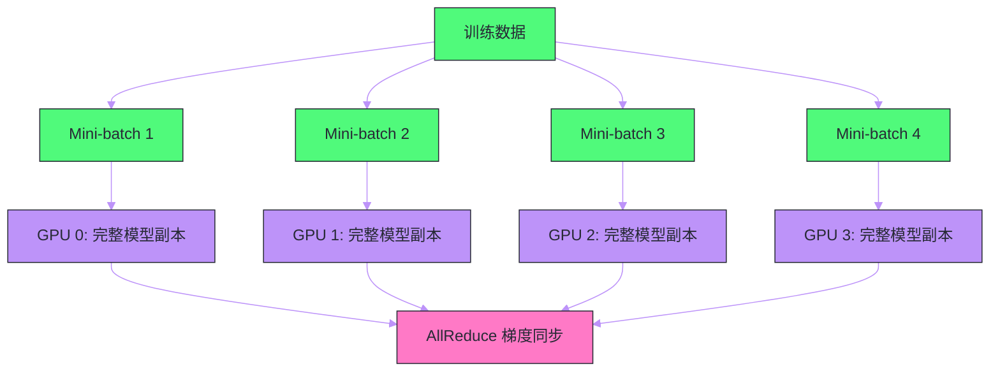

# 03 预训练——数据、算力与 Scaling Law

**摘要：**

本文深入剖析大语言模型预训练的三大核心要素：**数据**（从哪里来、如何清洗、如何配比）、**算力**（分布式训练的四种并行策略）和 **Scaling Law**（参数量、数据量、计算量之间的幂律关系）。预训练是 LLM 的"基础教育"——模型在数万亿 token 的文本上学习语言的统计规律、世界知识和推理模式。这个阶段消耗了整个 LLM 生命周期中绝大部分的计算资源（通常占 90% 以上），其质量直接决定了模型的能力上限。理解预训练的工程实践和理论指导（Scaling Law），是理解 LLM 为什么有效、以及如何高效训练的关键。

---

## 第 1 章 预训练的本质：压缩世界知识

### 1.1 从 Next Token Prediction 到世界模型

在 [[02 GPT 架构——Decoder-Only 的自回归语言模型]] 中，我们分析了 GPT 的训练目标——next token prediction。表面上看，这只是一个统计任务：根据前文预测下一个词。但当训练数据足够大、模型参数足够多时，这个"简单"的任务要求模型学会远比统计共现更深层的知识。

考虑一个例子：模型要正确预测"将 100 摄氏度的水倒入冰块中，最终温度会___"中的下一个词（"降低"或一个具体温度），它必须理解：热力学平衡的概念、水的比热容、冰的融化过程。这些物理知识并没有以显式的规则形式存在于训练数据中——模型必须从大量描述类似现象的文本中**隐式地推断**出这些规律。

从信息论的角度看，预训练的本质是**压缩**——将训练数据中的信息压缩到模型参数中。一个在 2 万亿 token 上训练的 70B 参数模型，实际上是将数 TB 的文本信息压缩到了约 140GB（FP16）的参数中。压缩越好（训练损失越低），模型对数据中蕴含的模式和知识的提取就越充分。

### 1.2 预训练的三大支柱

预训练的成功取决于三个相互关联的要素：

1. **数据（Data）**：训练数据的规模、质量和多样性决定了模型能学到什么
2. **算力（Compute）**：分布式训练的工程能力决定了能训练多大的模型、用多少数据
3. **Scaling Law**：理论指导，在给定计算预算下，如何最优地分配参数量和数据量

这三者的关系可以类比为教育：数据是教材，算力是学习时间，Scaling Law 是"如何高效学习"的方法论。

---

## 第 2 章 训练数据：LLM 的"教材"

### 2.1 数据来源

大语言模型的训练数据来源主要包括以下几类：

| 数据源 | 典型规模 | 质量 | 特点 |
| :--- | :--- | :--- | :--- |
| **Common Crawl** | 数百 TB 原始 HTML | 低（大量垃圾/重复） | 覆盖面最广，需要大量清洗 |
| **维基百科** | ~20GB | 高 | 结构化知识，多语言 |
| **书籍** | ~100GB（Books3/PG-19） | 高 | 长文本，连贯的叙事和推理 |
| **学术论文** | ~100GB（arXiv/S2ORC） | 高 | 数学/科学/工程知识 |
| **代码** | ~500GB（GitHub/The Stack） | 中 | 编程能力，结构化推理 |
| **社交媒体/论坛** | 数百 GB（Reddit/StackOverflow） | 中 | 对话/问答模式 |
| **新闻** | ~100GB | 中 | 时事知识，写作风格 |

不同模型对数据的配比有不同的策略：

- **LLaMA 1**：1.4T token，以英文为主。数据配比：Common Crawl (67%) + C4 (15%) + GitHub (4.5%) + Wikipedia (4.5%) + Books (4.5%) + arXiv (2.5%) + StackExchange (2%)
- **DeepSeek**：增加了中文数据比例和数学/代码数据
- **Qwen**：大幅增加中文网页和书籍的比例，提升中文能力

### 2.2 数据清洗：质量胜过数量

原始网页数据充斥着垃圾内容（广告、导航栏、模板文本、色情/暴力内容、重复文本），直接用于训练会严重降低模型质量。数据清洗是预训练pipeline中最耗费人力的环节之一。

**典型的清洗流程**：

1. **语言识别与过滤**：使用 fastText 等工具识别文本语言，过滤非目标语言
2. **去重**（Deduplication）：
   - **精确去重**：基于文档哈希去除完全相同的文档
   - **模糊去重**：使用 MinHash + LSH（Locality-Sensitive Hashing）去除高度相似的文档。研究表明，Common Crawl 中可能有 30-50% 的近重复内容
3. **质量过滤**：
   - **启发式规则**：过滤过短/过长的文档、特殊字符比例过高的文档、包含黑名单关键词的文档
   - **分类器过滤**：训练一个小型分类器（如基于 fastText），以高质量文本（维基百科/书籍）为正例、低质量网页为负例，对所有文档打分并过滤低分文档。这正是 GPT-3 论文中描述的 WebText-like 过滤策略
4. **隐私过滤**：去除个人身份信息（PII）——邮箱、电话、身份证号等
5. **安全过滤**：使用分类器或关键词列表过滤有害内容（仇恨言论/暴力/色情）

> [!warning] 生产避坑
> 数据清洗中最容易被忽视的问题是**基准测试数据泄漏**（Benchmark Contamination）。如果训练数据中包含了评测基准的测试集（如 MMLU、GSM8K 的问题和答案），模型的"好成绩"就只是"背答案"而非真正的能力。LLaMA 论文中专门做了去污染（decontamination）处理：检测训练数据中是否包含与测试集高度相似的文本，并将其移除。

### 2.3 数据配比的艺术

不同类型的数据对模型的不同能力有贡献：

- **网页文本**：通用语言能力、世界知识
- **书籍**：长文本理解、连贯推理
- **代码**：逻辑推理、结构化思维（研究表明，在训练数据中加入代码可以提升模型在非代码任务上的推理能力）
- **学术论文**：数学和科学知识
- **多语言数据**：跨语言能力（中文数据的比例直接决定模型的中文能力）

数据配比没有统一的最优解——它取决于模型的目标用途。一个面向中文市场的模型（如 Qwen）会大幅增加中文数据比例；一个面向编程的模型（如 Code Llama）会增加代码数据比例。

一个关键的经验发现是：**数据的多样性往往比单一来源的数量更重要**。在 Common Crawl 上从 1T token 增加到 2T token 带来的收益，可能不如增加 100B token 的高质量书籍或代码数据。

### 2.4 数据的重复与多 Epoch 训练

LLaMA 的一个重要发现是：**在高质量数据上多次训练（多 epoch）的效果好于在低质量数据上单次训练**。

传统观点认为每个 token 只应使用一次（1 epoch），重复使用会导致过拟合。但 LLaMA-7B 在 1T token 上训练了约 1 epoch，而 LLaMA-65B 在同样的 1.4T token 上实际训练了约 1.4T token（部分数据重复使用了 2-4 次），仍然获得了性能提升。

这个发现对资源有限的团队非常重要——如果无法获取更多高质量数据，对现有数据进行多次训练仍然是有效的策略，前提是数据质量足够高。

---

## 第 3 章 Scaling Law——预训练的理论指导

### 3.1 Kaplan Scaling Law（OpenAI, 2020）

2020 年，Kaplan 等人（OpenAI）发表了开创性的 Scaling Law 研究，发现模型的测试损失 $L$ 与三个变量之间存在**幂律关系**：

$$L(N) \approx \left(\frac{N_c}{N}\right)^{\alpha_N}, \quad L(D) \approx \left(\frac{D_c}{D}\right)^{\alpha_D}, \quad L(C) \approx \left(\frac{C_c}{C}\right)^{\alpha_C}$$

其中：
- $N$ = 模型参数量（不含 Embedding）
- $D$ = 训练数据量（token 数）
- $C$ = 计算量（FLOPs）
- $\alpha_N \approx 0.076$, $\alpha_D \approx 0.095$, $\alpha_C \approx 0.050$

这意味着：

1. **性能提升是平滑可预测的**：在双对数坐标下，损失与参数量/数据量/计算量呈线性关系。不存在突然的"性能跳跃"——只要增加规模，性能就会持续提升
2. **参数量比数据量更重要**：$\alpha_N < \alpha_D$，即同等增加倍数下，增加参数量带来的损失下降更多。因此 Kaplan 的建议是：**在给定计算预算下，应该优先增大模型**

### 3.2 Chinchilla Scaling Law（DeepMind, 2022）

2022 年，Hoffmann 等人（DeepMind）发表了 Chinchilla 论文，修正了 Kaplan 的结论。他们训练了超过 400 个不同规模的模型，发现：

$$L(N, D) = E + \frac{A}{N^{\alpha}} + \frac{B}{D^{\beta}}$$

其中 $\alpha \approx 0.34$, $\beta \approx 0.28$, $E$ 是不可约损失（数据本身的熵）。

关键发现：**在给定计算预算下，模型参数量和训练数据量应该以大致相等的比例增长**。具体来说，最优配比大约是：

$$D_{\text{opt}} \approx 20 \times N$$

即训练 token 数应该约为参数量的 20 倍。

这与 Kaplan 的建议截然不同。Kaplan 建议优先增大模型，而 Chinchilla 建议**平衡增大模型和数据**。Chinchilla 用 70B 参数 + 1.4T token 训练出的模型，性能超越了 Gopher（280B 参数 + 300B token）——一个参数量是它 4 倍但数据量不到它 1/4 的模型。

| 模型 | 参数量 | 训练 Token | Token/参数比 | 是否"Chinchilla 最优" |
| :--- | :--- | :--- | :--- | :--- |
| GPT-3 | 175B | 300B | 1.7 | 严重欠训练 |
| Gopher | 280B | 300B | 1.1 | 严重欠训练 |
| **Chinchilla** | **70B** | **1.4T** | **20** | **是** |
| LLaMA-7B | 7B | 1T | 143 | 过度训练（但性能好） |
| LLaMA-65B | 65B | 1.4T | 21.5 | 接近最优 |

> [!info] 核心概念
> Chinchilla Scaling Law 的核心洞察是：GPT-3 等早期大模型其实是"大而欠训练"的——它们的参数量很大，但训练数据量相对不足。如果将同样的计算预算分配给一个更小但训练更充分的模型，可以获得相同甚至更好的性能。这个发现深刻影响了后续模型的设计——LLaMA 系列就是按照 Chinchilla 最优比例训练的。

### 3.3 超越 Chinchilla：推理最优的训练策略

Chinchilla 的 20 倍比例是"训练计算最优"的——在固定的训练 FLOPs 下最小化损失。但在实际部署中，还需要考虑**推理成本**。

一个更小但训练更多数据的模型（如 LLaMA-7B 用 1T token，Token/参数比 = 143），虽然在训练上"浪费"了计算（超出 Chinchilla 最优比例），但推理时更快更省。如果模型将被大规模部署（数百万用户），推理成本远超训练成本，那么"过度训练一个小模型"反而是经济上最优的选择。

LLaMA 论文明确指出了这一点：他们的目标不是训练计算最优的模型，而是**推理最优**的模型——在给定推理预算下性能最好的模型。这解释了为什么 LLaMA-7B 用了远超 Chinchilla 建议的训练数据量。

---

## 第 4 章 分布式训练：工程的极致

### 4.1 为什么需要分布式训练

训练一个 70B 参数的模型（如 LLaMA-65B），仅模型参数就占约 130GB（FP16），加上优化器状态（Adam 的动量和方差，约 260GB）和梯度（130GB），总共需要约 520GB 显存。目前最高端的单块 GPU（NVIDIA H100）只有 80GB 显存——**单卡根本放不下**。

即使显存够用，训练速度也是瓶颈。LLaMA-65B 的训练使用了 2048 块 A100 GPU，训练约 21 天。如果用单卡训练，需要约 120 年。

分布式训练不是可选项，而是训练大模型的**必要条件**。

### 4.2 数据并行（Data Parallelism）

**数据并行**是最简单的分布式策略：每块 GPU 持有模型的完整副本，但处理不同的 mini-batch 数据。前向和反向传播在各 GPU 上独立进行，然后通过 AllReduce 操作同步梯度，确保所有副本的参数保持一致。

数据并行的**局限**：每块 GPU 都要存储完整的模型参数和优化器状态。对于 70B 的模型，单卡放不下——数据并行失效。

### 4.3 ZeRO（Zero Redundancy Optimizer）

**ZeRO**（Rajbhandari et al., 2020, DeepSpeed）是数据并行的优化版本，核心思想是：**既然每块 GPU 都持有模型的完整副本是冗余的，为什么不将参数、梯度和优化器状态分片存储到不同的 GPU 上？**

ZeRO 分三个阶段逐步减少冗余：

| 阶段 | 分片内容 | 每 GPU 显存节省 | 通信量 |
| :--- | :--- | :--- | :--- |
| **ZeRO-1** | 优化器状态 | ~4x（Adam 的动量+方差） | 与数据并行相同 |
| **ZeRO-2** | 优化器状态 + 梯度 | ~8x | 与数据并行相同 |
| **ZeRO-3** | 优化器状态 + 梯度 + 参数 | ~$N_d$ 倍（$N_d$ = GPU 数） | 增加 1.5x |

ZeRO-3 下，每块 GPU 只存储 $1/N_d$ 的参数。当需要某个参数进行前向/反向计算时，通过 AllGather 从其他 GPU 临时收集。计算完成后，非本地参数可以立即释放。

ZeRO 的优势是**概念简单、实现成熟**（DeepSpeed/FSDP），且与现有的数据并行代码兼容——几乎不需要修改模型代码。这使它成为中小规模训练（几十到几百块 GPU）的首选方案。

### 4.4 张量并行（Tensor Parallelism）

**张量并行**（Megatron-LM, NVIDIA）将模型的**单个层内的矩阵运算**切分到多块 GPU 上。

以 FFN 的第一个线性层为例：$Y = XA$，其中 $A \in \mathbb{R}^{d \times 4d}$。将 $A$ 沿列方向切分为两半 $A = [A_1, A_2]$，分别放在两块 GPU 上：

- GPU 0 计算 $Y_1 = X A_1$
- GPU 1 计算 $Y_2 = X A_2$

第二个线性层 $Z = \text{GeLU}(Y) B$ 中，将 $B$ 沿行方向切分，然后通过 AllReduce 合并结果。

张量并行的优势是**通信开销小**（在层内进行，可利用 NVLink 的高带宽）和**负载均衡好**（每块 GPU 计算量相同）。但它的扩展性受限于单节点内的 GPU 数量（通常 4-8 块），跨节点的张量并行因网络延迟过高而不实际。

### 4.5 流水线并行（Pipeline Parallelism）

**流水线并行**将模型的**不同层**分配到不同的 GPU 上。例如 32 层的模型用 4 块 GPU，每块 GPU 负责 8 层。

最大的问题是**流水线气泡**（Pipeline Bubble）——前面的 GPU 在等后面的 GPU 完成计算，后面的 GPU 在等前面的 GPU 传递中间结果。解决方案是 **Micro-batching**：将一个 mini-batch 切分为多个 micro-batch，让多个 micro-batch 交替在流水线中流动，减少空闲时间。

GPipe 和 PipeDream 是两种主流的流水线调度策略，后者通过"1F1B"（1 forward 1 backward）调度进一步减少了内存占用。

### 4.6 3D 并行：实际训练的组合策略

实际训练大模型时，通常组合使用多种并行策略——这就是 **3D 并行**：

- **最内层（节点内）**：张量并行（利用 NVLink 高带宽）
- **中间层**：流水线并行（跨少量节点，将模型层分段）
- **最外层**：数据并行 / ZeRO（扩展到大量节点）

例如 LLaMA-65B 的训练可能使用：8 路张量并行（8 块 GPU / 节点内）× 4 路流水线并行 × 64 路数据并行 = 2048 块 GPU。

| 并行策略 | 切分维度 | 适用范围 | 通信模式 | 典型工具 |
| :--- | :--- | :--- | :--- | :--- |
| 数据并行 | mini-batch | 扩展训练吞吐 | AllReduce（梯度） | PyTorch DDP |
| ZeRO | 参数/梯度/优化器 | 降低单卡显存 | AllGather + ReduceScatter | DeepSpeed / FSDP |
| 张量并行 | 层内矩阵 | 节点内（NVLink） | AllReduce（激活值） | Megatron-LM |
| 流水线并行 | 模型层 | 跨节点 | P2P（层间激活值） | Megatron-LM / DeepSpeed |

---

## 第 5 章 混合精度训练与显存优化

### 5.1 混合精度训练（Mixed Precision Training）

标准的浮点运算使用 FP32（32 位），但训练大模型时 FP32 的显存和计算开销太高。**混合精度训练**使用较低精度的浮点格式来加速计算和节省显存。

核心思路：
- **前向和反向传播**使用低精度（FP16 或 BF16），加速矩阵运算（GPU 的 Tensor Core 对低精度运算有硬件加速，速度约为 FP32 的 2-4 倍）
- **参数更新（优化器步骤）**仍使用 FP32，保持数值精度

**BF16（Brain Float 16）** 是当前 LLM 训练的首选格式。它与 FP32 有相同的指数位宽度（8 bit），因此数值范围与 FP32 相同，不容易溢出；但尾数只有 7 bit（FP32 有 23 bit），精度较低。相比 FP16（5 bit 指数，10 bit 尾数），BF16 的数值范围更大，训练更稳定——FP16 容易因数值溢出导致 loss spike 甚至 NaN。

| 格式 | 总位数 | 指数位 | 尾数位 | 数值范围 | 精度 | 适用场景 |
| :--- | :--- | :--- | :--- | :--- | :--- | :--- |
| FP32 | 32 | 8 | 23 | 大 | 高 | 优化器状态 |
| FP16 | 16 | 5 | 10 | 小（易溢出） | 中 | 推理（量化后） |
| **BF16** | 16 | 8 | 7 | **大（与 FP32 相同）** | 低 | **训练首选** |

### 5.2 梯度累积（Gradient Accumulation）

当单块 GPU 的显存不足以容纳目标 batch size 时，可以使用梯度累积：将一个大 batch 分成多个小 micro-batch，逐个前向-反向计算并累积梯度，最后统一更新参数。

这在数学上与使用大 batch 完全等价，但不需要额外的 GPU。代价是训练速度与 micro-batch 数成正比地变慢。

### 5.3 激活重计算（Activation Checkpointing）

训练时，前向传播的中间激活值需要保存用于反向传播。对于深层模型，激活值的显存占用可能超过参数本身。

**激活重计算**（也叫 Gradient Checkpointing）的策略是：只保存少量层（checkpoint 层）的激活值，其他层的激活值在反向传播时重新前向计算。这以约 33% 的额外计算换取约 50-70% 的激活显存节省。

### 5.4 Flash Attention

标准 Self-Attention 需要在 GPU 的高速显存（HBM）中存储完整的 $n \times n$ 注意力矩阵（$n$ 为序列长度），显存占用 $O(n^2)$。对于 8K 上下文的模型，这个矩阵可达数 GB。

**Flash Attention**（Dao et al., 2022）是一个 IO 感知的注意力实现优化：通过分块（tiling）计算和在 SRAM（片上高速缓存）中完成 softmax 的在线归一化，**避免将完整的注意力矩阵写入 HBM**。

Flash Attention 不改变注意力的数学结果（是精确计算，非近似），但：
- 显存从 $O(n^2)$ 降低到 $O(n)$
- 由于减少了 HBM 读写次数，实际速度提升 2-4 倍

Flash Attention 已经成为所有主流 LLM 训练框架的标配。Flash Attention 2 和 Flash Attention 3 进一步优化了 GPU 的 warp 调度和异步加载。

---

## 第 6 章 训练稳定性与超参数

### 6.1 优化器：AdamW

几乎所有 LLM 的训练都使用 **AdamW** 优化器——Adam 的变体，将权重衰减（weight decay）与梯度更新解耦。

Adam 维护两个指数移动平均：
- **一阶动量** $m_t = \beta_1 m_{t-1} + (1-\beta_1) g_t$：梯度的滑动平均
- **二阶动量** $v_t = \beta_2 v_{t-1} + (1-\beta_2) g_t^2$：梯度平方的滑动平均

参数更新：$\theta_{t+1} = \theta_t - \eta \cdot \frac{m_t}{\sqrt{v_t} + \epsilon} - \lambda \theta_t$

常用超参数：$\beta_1 = 0.9$, $\beta_2 = 0.95$, $\epsilon = 10^{-8}$, weight decay $\lambda = 0.1$。

Adam 的优势是**自适应学习率**——对不同参数根据其历史梯度自动调整步长，对 LLM 训练中参数量级差异大的场景非常重要。但 Adam 的代价是**每个参数需要额外存储两个状态**（$m$ 和 $v$），使优化器状态的显存占用是参数本身的 2 倍。

### 6.2 学习率调度

LLM 训练通常使用**预热 + 余弦衰减**的学习率调度：

1. **线性预热**（Warmup）：在前 1000-2000 步内，学习率从 0 线性增长到峰值（如 $3 \times 10^{-4}$）。预热的作用是避免训练初期参数还很随机时用过大的学习率导致不稳定
2. **余弦衰减**（Cosine Decay）：从峰值按余弦函数平滑衰减到最小值（通常为峰值的 1/10）

$$\eta_t = \eta_{\min} + \frac{1}{2}(\eta_{\max} - \eta_{\min})\left(1 + \cos\left(\frac{t - T_w}{T - T_w}\pi\right)\right)$$

### 6.3 训练中的不稳定性：Loss Spike

大模型训练中常遇到 **Loss Spike**——训练损失突然飙升，有时甚至变成 NaN。常见原因包括：

- **数值溢出**：FP16 训练中梯度过大导致溢出。解决方案：使用 BF16 或动态 loss scaling
- **数据异常**：某些 batch 包含极端样本。解决方案：数据清洗时移除异常文本
- **学习率过大**：尤其是预热阶段之后。解决方案：降低峰值学习率

应对 loss spike 的标准操作是：从最近的正常 checkpoint 恢复，跳过导致 spike 的数据 batch，继续训练。LLaMA 论文中提到他们遇到了少量 loss spike，通过这种方式处理。

### 6.4 批量大小（Batch Size）

LLM 训练通常使用非常大的 batch size——几百万甚至几千万 token 每个 batch。这是因为：

- **GPU 利用率**：大 batch 能充分利用 GPU 的并行计算能力
- **梯度估计稳定**：大 batch 的梯度是更精确的损失函数梯度估计，更新方向更准确
- **通信摊销**：数据并行的 AllReduce 通信开销是固定的，大 batch 摊薄了这个开销

LLaMA-65B 使用 4M token/batch（约 2000 个长度为 2048 的序列）。

---

## 第 7 章 评估：如何衡量预训练的质量

### 7.1 训练损失（Training Loss）

最直接的指标是**交叉熵损失**——数值越低，模型对训练数据的拟合越好。Scaling Law 的核心预测就是损失与规模的关系。

但训练损失只能反映模型对训练数据的建模能力，不能直接反映下游任务的性能。

### 7.2 困惑度（Perplexity）

困惑度是交叉熵损失的指数形式：$\text{PPL} = e^L$。它的直观含义是：模型在预测下一个 token 时的"平均困惑程度"——困惑度越低，模型越"确定"，预测越准确。

在**验证集**上计算的困惑度可以反映模型的泛化能力。

### 7.3 基准测试（Benchmarks）

预训练完成后，通常在一系列标准基准上评估模型：

| 基准 | 评估内容 | 形式 |
| :--- | :--- | :--- |
| **MMLU** | 多学科知识（57 个科目） | 多选题 |
| **HellaSwag** | 常识推理 | 选择最合理的续写 |
| **ARC** | 科学推理 | 多选题 |
| **GSM8K** | 数学推理（小学数学应用题） | 开放式生成 |
| **HumanEval** | 代码生成 | Python 函数补全 |
| **TruthfulQA** | 事实性 | 判断回答是否真实 |
| **WinoGrande** | 指代消解 | 选择正确的指代对象 |

这些基准覆盖了知识、推理、代码、事实性等多个维度，综合评估模型的预训练质量。

---

## 第 8 章 预训练的工程全景

### 8.1 一次完整预训练的资源需求

以训练一个 LLaMA-70B 级别的模型为例：

| 资源 | 规模 |
| :--- | :--- |
| GPU | 2048 × A100 80GB（约 256 台 8-GPU 服务器） |
| 训练数据 | ~2T token（约 8TB 原始文本） |
| 训练时间 | ~21 天 |
| 总计算量 | ~$1.0 \times 10^{24}$ FLOPs |
| 电力消耗 | ~1 GWh（约 100 万度电） |
| 成本估算 | ~$200-500 万美元（按云 GPU 价格） |

### 8.2 训练 Pipeline 全景

一次完整的预训练涉及以下环节：

1. **数据准备**：爬取 → 清洗 → 去重 → 质量过滤 → 安全过滤 → Tokenization → 预分片
2. **模型初始化**：参数随机初始化（通常正态分布，标准差与层数相关）
3. **分布式训练**：3D 并行配置、混合精度、Flash Attention、梯度累积
4. **监控与恢复**：Loss 监控、Checkpoint 定期保存（每隔几百/几千步）、Loss Spike 恢复
5. **评估**：定期在验证集和基准上评估

### 8.3 训练框架生态

| 框架 | 组织 | 核心能力 |
| :--- | :--- | :--- |
| **Megatron-LM** | NVIDIA | 张量并行 + 流水线并行 + 数据并行 |
| **DeepSpeed** | Microsoft | ZeRO + 流水线并行 + 混合精度 |
| **FSDP** | Meta / PyTorch | ZeRO-3 的 PyTorch 原生实现 |
| **Megatron-DeepSpeed** | 社区 | Megatron 张量并行 + DeepSpeed ZeRO |
| **Colossal-AI** | HPC-AI Tech | 多维并行 + 自动并行策略 |

---

## 第 9 章 总结与展望

### 9.1 核心要点回顾

1. **数据是基础**：质量 > 数量。数据清洗、去重、配比直接决定模型能力。代码和多语言数据对提升推理和跨语言能力至关重要
2. **Scaling Law 是指导**：Chinchilla 法则建议参数量和数据量同比例扩大（Token ≈ 20×参数）。但推理效率考量可能导致"过度训练小模型"成为更经济的选择
3. **分布式训练是工程核心**：3D 并行（数据 + 张量 + 流水线）+ ZeRO + Flash Attention + 混合精度构成了大模型训练的标准工程栈
4. **训练稳定性不可忽视**：AdamW + 余弦学习率调度 + BF16 + Checkpoint 恢复是保障长时间训练稳定性的关键手段

### 9.2 下一步

预训练产出的是一个**基座模型**（Base Model）——它擅长续写文本，但不会"听从指令"。要让模型变成一个有用的 AI 助手，还需要：

- [[04 指令微调与 RLHF——从基座模型到对话助手]]：通过指令数据和人类反馈对齐模型行为
- [[05 参数高效微调——LoRA、QLoRA 与 Adapter]]：在资源有限时如何高效微调

---

## 参考文献

1. Kaplan et al., "Scaling Laws for Neural Language Models", arXiv 2020
2. Hoffmann et al., "Training Compute-Optimal Large Language Models", NeurIPS 2022 (Chinchilla)
3. Touvron et al., "LLaMA: Open and Efficient Foundation Language Models", arXiv 2023
4. Rajbhandari et al., "ZeRO: Memory Optimizations Toward Training Trillion Parameter Models", SC 2020
5. Shoeybi et al., "Megatron-LM: Training Multi-Billion Parameter Language Models Using Model Parallelism", arXiv 2020
6. Dao et al., "FlashAttention: Fast and Memory-Efficient Exact Attention with IO-Awareness", NeurIPS 2022
7. Micikevicius et al., "Mixed Precision Training", ICLR 2018
8. Loshchilov & Hutter, "Decoupled Weight Decay Regularization", ICLR 2019 (AdamW)
9. Penedo et al., "The RefinedWeb Dataset for Falcon LLM", NeurIPS 2023
10. Brown et al., "Language Models are Few-Shot Learners", NeurIPS 2020 (GPT-3)

---

> [!note] 思考题
> 1. Scaling Law（Chinchilla 论文）指出：对于给定的计算预算，模型参数量和训练数据量应该等比例扩展。但在实践中，LLaMA 系列选择了'小模型 + 大数据'的路线（7B 模型用 1T+ token 训练），偏离了 Chinchilla 的最优比例。这种策略的工程动机是什么？推理成本（与参数量成正比）和训练成本（一次性）的权衡如何影响这个决策？
> 2. 预训练数据的质量直接决定模型能力。Common Crawl 等网络抓取数据包含大量低质量内容（广告、重复文本、有害内容）。数据清洗（去重、过滤、质量评分）的工程挑战有哪些？如果训练数据中包含版权内容（如书籍、论文），模型可能'记住'并逐字输出——这在法律和伦理上有什么风险？
> 3. 预训练的计算成本极其高昂——GPT-4 的训练估计花费了 1 亿美元以上。如果训练到一半发现数据中有严重问题（如数据泄漏或偏见），是否需要从头开始？'继续训练'（从 checkpoint 恢复但用修正后的数据）是否能有效修复问题？
