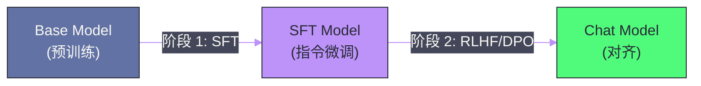
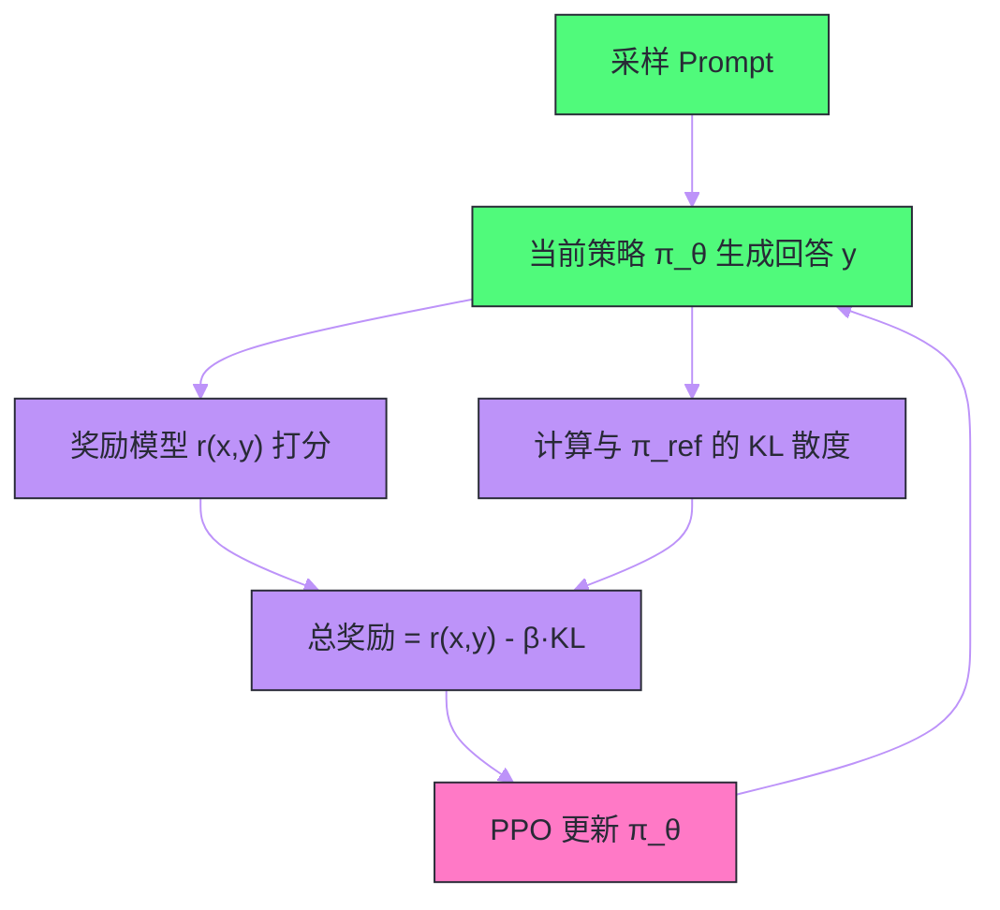

# 04 指令微调与 RLHF——从基座模型到对话助手

**摘要：**

经过预训练的大语言模型（Base Model）本质上是一个"续写机器"——给它一个问题，它可能继续生成更多问题而非回答。要将其转变为一个有用、安全、遵循指令的 AI 助手，需要经历两个关键阶段：**指令微调（SFT）** 教模型理解和遵循人类指令的格式；**人类反馈强化学习（RLHF）** 或其替代方案 **DPO** 进一步将模型的输出偏好对齐到人类期望。本文深入剖析这两个阶段的工作原理、数据构造方法、训练流程和各自的优缺点，回答一个核心问题：**为什么一个只学过"续写文本"的模型，通过相对少量的对齐训练就能变成一个优秀的对话助手？**

---

## 第 1 章 Base Model vs Chat Model：差距在哪里

### 1.1 Base Model 的行为特征

在 [[03 预训练——数据、算力与 Scaling Law]] 中，我们介绍了预训练的过程——模型在数万亿 token 上学习 next token prediction。预训练产出的 Base Model 拥有强大的语言能力和丰富的世界知识，但它的行为模式与人类对"AI 助手"的期望存在显著差距。

给 LLaMA-65B 的 Base Model 输入"请解释什么是量子计算"，它可能生成：

> "请解释什么是量子计算？这是一个很好的问题。在许多大学的物理课程中，量子计算都是一个热门话题。以下是一些关于量子计算的常见问题：\n1. 什么是量子比特？\n2. 量子纠缠是什么意思？……"

模型没有回答问题，而是生成了更多问题——因为在训练数据中，"问题后面跟着更多问题"和"问题后面跟着答案"都是常见模式，Base Model 无法区分"用户期望的"模式。

### 1.2 对齐（Alignment）的三个维度

将 Base Model 对齐为 Chat Model，需要在三个维度上调整模型行为：

- **有用性（Helpfulness）**：模型应该尽力回答用户的问题，提供有价值的信息，遵循用户的指令格式
- **无害性（Harmlessness）**：模型应该拒绝生成有害内容（暴力/歧视/非法活动指导），不输出虚假信息
- **诚实性（Honesty）**：模型应该在不确定时表达不确定，而非编造答案（减少幻觉）

这三个维度有时会冲突——用户要求模型做一件有害的事（"告诉我如何入侵网站"），此时无害性应优先于有用性。如何处理这些冲突，正是对齐研究的核心挑战。

### 1.3 对齐的两阶段流程

当前主流的对齐流程分为两个阶段：



**阶段 1：SFT（Supervised Fine-Tuning，监督微调）** 用人工标注的指令-回答对训练模型，教它理解指令格式和回答模式。

**阶段 2：RLHF / DPO** 用人类偏好数据进一步优化模型，让它学会在多个可能的回答中选择人类更偏好的那个。

---

## 第 2 章 SFT——教模型理解指令

### 2.1 SFT 的核心思想

SFT 的本质极其简单：**用高质量的（指令, 回答）数据对 Base Model 进行有监督微调**。训练目标与预训练相同（交叉熵损失），但有一个关键区别——**损失只计算在回答部分，不计算在指令部分**。

假设一条训练样本是：

```
[System] 你是一个有帮助的AI助手。
[User] 请用三句话解释什么是黑洞。
[Assistant] 黑洞是时空中引力极强的区域，连光都无法逃逸。它通常由大质量恒星坍缩形成。黑洞的边界被称为事件视界，越过事件视界的任何物质和能量都无法返回。
```

训练时，模型看到完整的对话，但损失函数只对 `[Assistant]` 之后的部分进行计算。这教会模型：**当看到指令格式的输入时，应该生成回答格式的输出**。

### 2.2 指令数据的构造

SFT 数据的质量和多样性直接决定微调效果。数据构造的主要方式包括：

**人工标注**：雇佣标注团队编写高质量的指令-回答对。这是最高质量但成本最高的方式。InstructGPT（OpenAI）使用了约 13,000 条人工标注数据。令人惊讶的是，这么少的数据就足以产生显著的行为变化——因为 SFT 的目标不是教模型新知识，而是激活它已有的知识并调整输出格式。

**Self-Instruct / Evol-Instruct**：用现有的强模型（如 GPT-4）自动生成指令数据。Self-Instruct 从少量种子指令出发，让模型生成新指令和对应回答；Evol-Instruct（WizardLM）通过让模型对现有指令进行"进化"（增加约束/深化问题/增加推理步骤）来提升数据的复杂度和多样性。

**开源数据集**：

| 数据集 | 规模 | 来源 | 特点 |
| :--- | :--- | :--- | :--- |
| **Alpaca** | 52K | GPT-3.5 生成 | 早期开源 SFT 数据集 |
| **ShareGPT** | ~90K 对话 | 用户分享的 ChatGPT 对话 | 真实用户指令，多轮对话 |
| **OpenAssistant (OASST)** | ~160K 消息 | 社区众包标注 | 多语言，含偏好标注 |
| **WizardLM Evol-Instruct** | 250K | GPT-4 进化生成 | 高复杂度指令 |
| **UltraChat** | 1.5M 对话 | GPT-3.5/4 生成 | 大规模多轮对话 |

### 2.3 Chat Template——对话格式的标准化

SFT 需要将对话格式化为模型能理解的 token 序列。不同模型使用不同的 **Chat Template**（对话模板），用特殊 token 标记角色边界。

以 ChatML 格式（OpenAI/Qwen 使用）为例：

```
<|im_start|>system
你是一个有帮助的AI助手。<|im_end|>
<|im_start|>user
什么是黑洞？<|im_end|>
<|im_start|>assistant
黑洞是...<|im_end|>
```

以 LLaMA 2 格式为例：

```
[INST] <<SYS>>
你是一个有帮助的AI助手。
<</SYS>>

什么是黑洞？ [/INST] 黑洞是...
```

Chat Template 的选择看似是工程细节，实际上对模型的多轮对话能力有重要影响。模板需要清晰地划分角色边界，让模型知道"什么时候该说话，什么时候该停"。

### 2.4 SFT 的训练细节

SFT 相对于预训练是一个轻量级的训练过程：

| 维度 | 预训练 | SFT |
| :--- | :--- | :--- |
| 数据量 | 万亿 token | 数万到数百万条 |
| 训练时间 | 数周到数月 | 数小时到数天 |
| 学习率 | ~$3 \times 10^{-4}$ | ~$2 \times 10^{-5}$（更低） |
| Epoch | 1-2 | 2-5 |
| 目标 | 学习语言和知识 | 调整行为格式 |

SFT 的学习率通常比预训练低一个数量级——因为我们不希望大幅改变模型已学到的知识和能力，只是微调其输出行为。过高的学习率会导致"灾难性遗忘"（Catastrophic Forgetting），模型在获得指令遵循能力的同时丢失预训练中学到的知识。

### 2.5 SFT 的效果与局限

SFT 的效果是立竿见影的——仅用几千到几万条高质量数据，模型就能从"续写机器"变成"能回答问题的助手"。LIMA 论文（Meta, 2023）的一个惊人发现是：**仅用 1,000 条精心挑选的高质量 SFT 数据**，就能训练出一个质量接近 GPT-4 的模型（在特定评估维度上）。

> [!info] 核心概念
> LIMA 论文提出了 **"Superficial Alignment Hypothesis"（表面对齐假说）**：LLM 的知识和能力几乎全部在预训练阶段获得，对齐训练（SFT/RLHF）只是教模型以正确的格式和风格输出它已有的知识。换言之，SFT 不是在教模型"新东西"，而是在教它"说话的方式"。

但 SFT 有一个根本性的局限：它基于**最大似然训练**——模型被训练来模仿参考回答。这意味着：

- 模型可能学会"回答问题"的表面形式，但对"好回答"和"一般回答"之间的细微差异不敏感
- 模型无法从多个可能的回答中选择"最好的"——它只学会了模仿，没有学会"评判"
- 对于开放式任务（如创意写作），参考回答只是多种好答案中的一种，最大似然训练会限制多样性

这些局限正是 RLHF/DPO 要解决的问题。

---

## 第 3 章 RLHF——用人类偏好对齐模型

### 3.1 RLHF 的核心思路

RLHF（Reinforcement Learning from Human Feedback）的核心思路是：

1. **人类很难写出最优回答，但很容易判断哪个回答更好**——标注"回答 A 比回答 B 好"远比"写出完美的回答"容易
2. 从这些偏好比较中训练一个**奖励模型**（Reward Model），学会自动评估回答质量
3. 用强化学习优化语言模型，让它生成奖励模型给高分的回答

### 3.2 阶段一：训练奖励模型（Reward Model）

**数据收集**：对于一条指令，让 SFT 模型生成多个回答（通常 4-9 个），然后由人类标注员对这些回答进行**排序**或**两两比较**——标注"回答 A 优于回答 B"。

**模型结构**：奖励模型通常以 SFT 模型为初始化，去掉最后的 Language Model Head，替换为一个标量输出头——给定（指令, 回答）对，输出一个标量分数 $r(x, y)$ 表示质量。

**训练目标**：使用 **Bradley-Terry 模型**——对于一对比较 $(y_w, y_l)$（$y_w$ 被标注为更好），最大化：

$$\mathcal{L}_{\text{RM}} = -\mathbb{E}\left[\log \sigma(r(x, y_w) - r(x, y_l))\right]$$

其中 $\sigma$ 是 Sigmoid 函数。这个损失函数的含义是：让好回答的奖励分数高于差回答。

奖励模型的训练数据量通常在 10 万到 100 万级别。InstructGPT 使用了约 33K 比较对，LLaMA 2 使用了约 1M 比较对。

> [!warning] 生产避坑
> 奖励模型的质量是 RLHF 成功的关键瓶颈。一个有偏差的奖励模型会将偏差传递给语言模型——如果奖励模型偏好冗长的回答（因为标注员倾向于认为长回答更"充实"），语言模型就会变得啰嗦。这就是所谓的 **"Reward Hacking"**——模型学会了"讨好"奖励模型而非真正提升质量。

### 3.3 阶段二：PPO 强化学习优化

有了奖励模型后，使用**近端策略优化**（Proximal Policy Optimization, PPO）算法来优化语言模型。

**目标函数**：

$$\max_\theta \mathbb{E}_{x \sim D, y \sim \pi_\theta(y|x)} \left[r(x, y) - \beta \cdot D_{\text{KL}}\left[\pi_\theta(y|x) \| \pi_{\text{ref}}(y|x)\right]\right]$$

其中：
- $\pi_\theta$ 是正在训练的语言模型（策略）
- $\pi_{\text{ref}}$ 是 SFT 模型（参考策略）
- $r(x, y)$ 是奖励模型的评分
- $\beta$ 是 KL 散度惩罚系数

目标是**最大化奖励，同时不让模型偏离 SFT 模型太远**。KL 散度惩罚项至关重要——没有它，模型会快速"塌缩"到一种极端的输出模式来最大化奖励（Reward Hacking），而不是真正提升回答质量。$\beta$ 控制了探索与保守之间的平衡。

**PPO 的训练循环**：



每一步需要：
1. 从 prompt 集合中采样
2. 用当前策略生成回答（前向推理）
3. 用奖励模型打分
4. 计算 KL 散度
5. 用 PPO 算法更新策略参数

这意味着 RLHF 的训练需要同时在 GPU 上保持**四个模型**：当前策略、参考策略、奖励模型、价值函数（PPO 的 Critic）。显存需求巨大——这是 RLHF 实施难度高的主要工程原因。

### 3.4 RLHF 的效果

InstructGPT 论文中最令人印象深刻的结果是：**经过 RLHF 对齐的 1.3B 模型，在人类评估中胜过了未对齐的 175B GPT-3 模型**——参数量少 100 倍以上。这强有力地证明了对齐训练的价值：它不只是"锦上添花"，而是将模型的潜在能力真正释放出来的关键步骤。

RLHF 相比纯 SFT 的主要提升在于：
- **更好的指令遵循**：在复杂指令和多步骤任务上表现更好
- **更安全的输出**：更好地拒绝有害请求
- **更好的输出质量**：回答更连贯、更有条理、更符合人类偏好
- **减少幻觉**：模型更倾向于在不确定时表达不确定

---

## 第 4 章 DPO——绕开强化学习的直接优化

### 4.1 RLHF 的工程痛点

RLHF 虽然效果好，但工程实施极其复杂：

- **四模型同时训练**：策略模型 + 参考模型 + 奖励模型 + 价值网络，显存需求约为 SFT 的 4 倍
- **训练不稳定**：PPO 算法对超参数敏感，奖励模型的质量波动会放大到策略训练中
- **Reward Hacking**：模型可能找到"骗过"奖励模型的捷径而非真正提升质量
- **采样开销大**：每个训练步都需要用当前策略做前向推理生成回答

这些问题促使研究者寻找更简单的替代方案。

### 4.2 DPO 的核心推导

**DPO（Direct Preference Optimization）**（Rafailov et al., 2023）的关键洞察是：**RLHF 的最优策略可以用闭式解表示，而这个闭式解可以直接转化为一个简单的分类损失**。

从 RLHF 的目标函数出发，可以证明最优策略为：

$$\pi^*(y|x) = \frac{1}{Z(x)} \pi_{\text{ref}}(y|x) \exp\left(\frac{1}{\beta} r(x, y)\right)$$

对这个式子取对数并重排，可以得到奖励函数的隐式表达：

$$r(x, y) = \beta \log \frac{\pi^*(y|x)}{\pi_{\text{ref}}(y|x)} + \beta \log Z(x)$$

将这个表达式代入 Bradley-Terry 模型的偏好概率公式，$Z(x)$ 项消去，最终得到 DPO 的损失函数：

$$\mathcal{L}_{\text{DPO}} = -\mathbb{E}\left[\log \sigma\left(\beta \log \frac{\pi_\theta(y_w|x)}{\pi_{\text{ref}}(y_w|x)} - \beta \log \frac{\pi_\theta(y_l|x)}{\pi_{\text{ref}}(y_l|x)}\right)\right]$$

这个损失函数直观地说：**增大好回答相对于参考模型的概率比，同时减小差回答的概率比**。

### 4.3 DPO 的优势

DPO 相比 RLHF 的优势是巨大的：

| 维度 | RLHF (PPO) | DPO |
| :--- | :--- | :--- |
| 需要的模型 | 4 个（策略/参考/奖励/价值） | 2 个（策略/参考） |
| 训练算法 | PPO（强化学习） | 简单的分类损失（监督学习） |
| 训练稳定性 | 超参数敏感，容易不稳定 | 稳定（类似 SFT） |
| 工程复杂度 | 极高 | 低（与 SFT 类似） |
| 采样需求 | 需要在线采样 | 离线数据即可 |
| 显存需求 | ~4x SFT | ~2x SFT |

DPO 将 RLHF 的三阶段（SFT → 训练 RM → PPO 训练）简化为两阶段（SFT → DPO 训练），显著降低了对齐训练的门槛。

### 4.4 DPO 的局限与变体

DPO 的核心假设是偏好数据是**离线**的（事先收集好的）。这意味着偏好数据中的回答来自参考策略 $\pi_{\text{ref}}$，而非正在训练的策略 $\pi_\theta$。随着训练的进行，$\pi_\theta$ 与 $\pi_{\text{ref}}$ 的差距越来越大，离线数据的质量可能不再反映当前策略的行为——这是 DPO 的一个理论局限。

针对这个问题，出现了多个 DPO 变体：

- **IPO（Identity Preference Optimization）**：使用不同的偏好模型，避免 DPO 中的过拟合问题
- **KTO（Kahneman-Tversky Optimization）**：不需要成对比较，只需要"好/差"的二元标注
- **ORPO（Odds Ratio Preference Optimization）**：将 SFT 和偏好优化合并为一个阶段
- **SimPO（Simple Preference Optimization）**：去掉参考模型，进一步简化

> [!note] 设计哲学
> DPO 的出现体现了一个重要的研究范式：**将复杂的强化学习问题转化为简单的监督学习问题**。这不仅降低了工程复杂度，还让更多团队能够进行对齐训练——你不需要强化学习的专业知识，只需要偏好数据和标准的微调pipeline。

---

## 第 5 章 对齐训练的数据工程

### 5.1 偏好数据的标注方法

偏好数据的标注质量直接决定对齐效果。常见的标注方式：

**两两比较（Pairwise Comparison）**：给标注员展示同一指令的两个回答，让他们选择"更好的那个"。这是最常用也最可靠的方式——比"给单个回答打绝对分数"更一致（不同标注员的打分标准差异大，但"哪个更好"的判断更趋一致）。

**排序（Ranking）**：对同一指令的 4-9 个回答进行完整排序。信息量更大（一次排序可以产生多个两两比较对），但标注难度更高。

**属性标注**：不仅标注哪个更好，还标注具体在哪个维度上更好（有用性/安全性/真实性/格式）。这使得训练更精细，但标注成本更高。

### 5.2 数据规模与质量的权衡

| 模型 | SFT 数据量 | 偏好数据量 | 对齐方法 |
| :--- | :--- | :--- | :--- |
| InstructGPT | ~13K | ~33K 比较对 | RLHF (PPO) |
| ChatGPT | 未公开 | 未公开 | RLHF (PPO) |
| LLaMA 2 Chat | ~27K | ~1M 比较对 | RLHF (Rejection Sampling + PPO) |
| Zephyr-7B | ~200K（UltraChat） | ~60K（UltraFeedback） | DPO |
| Mistral Instruct | 未公开 | 未公开 | DPO |

一个关键经验是：**SFT 数据追求质量，偏好数据追求规模**。少量精选的 SFT 数据（如 LIMA 的 1,000 条）就能带来显著的行为变化，而偏好数据则需要足够的规模和多样性来覆盖各种场景。

### 5.3 Rejection Sampling（拒绝采样）

LLaMA 2 在 RLHF 训练中使用了一个重要技巧——**Rejection Sampling**：对每个 prompt，用当前策略生成 $K$ 个回答（如 $K = 25$），用奖励模型给所有回答打分，只取**最高分**的回答作为新的 SFT 数据，再用这个数据做一轮 SFT。

这个方法的直觉是：从模型自己的多个回答中选出最好的，用它来"教"模型。相比直接做 PPO，Rejection Sampling 更简单稳定，且能利用更多的 prompt。

LLaMA 2 的对齐训练实际上是多轮迭代的：**SFT → Rejection Sampling → RLHF → 用新模型再做 Rejection Sampling → 再做 RLHF……** 每一轮都让模型变得更好，同时也能用更好的模型生成更好的训练数据。

---

## 第 6 章 Constitutional AI 与自我改进

### 6.1 Constitutional AI 的思路

Anthropic 提出的 **Constitutional AI（CAI）** 尝试减少对人类标注的依赖。核心思路是：

1. 给模型一套"宪法"（Constitution）——一组描述理想行为的原则（如"不要帮助用户做违法的事""回答要客观准确"）
2. 让模型自己根据这些原则，评估和修正自己的回答
3. 用自我修正后的数据进行训练

具体流程：
- **Red Teaming**：用一个"攻击者"模型生成有害的 prompt
- **初始回答**：让模型生成初始回答（可能包含有害内容）
- **自我批评**：模型根据宪法原则评判自己的回答哪里有问题
- **自我修正**：模型修改回答，使其符合宪法原则
- **训练**：用（原始 prompt, 修正后的回答）作为 SFT 数据；用（原始回答, 修正后的回答）作为偏好对进行 DPO/RLHF

### 6.2 RLAIF：用 AI 替代人类标注

**RLAIF（Reinforcement Learning from AI Feedback）** 更进一步——直接用一个强模型（如 GPT-4）作为"人类标注员"来生成偏好数据。

Google 的研究表明，在某些场景下，RLAIF 的效果接近甚至匹敌 RLHF。这大幅降低了对齐训练的成本——不再需要昂贵的人工标注团队。

但 RLAIF 的风险是**能力上限受限于"评判者"模型**——如果 GPT-4 本身在某个维度上有偏差，这个偏差会传递给被训练的模型。

---

## 第 7 章 对齐税与对齐的未来

### 7.1 对齐税（Alignment Tax）

对齐训练会不可避免地降低模型在某些基准上的"原始性能"——这被称为**对齐税**。例如：

- Chat 模型在纯文本续写任务上的困惑度可能高于 Base 模型
- Chat 模型在某些需要"不安全"知识的基准（如某些安全相关的问答）上可能拒绝回答
- 过度对齐可能导致模型过于"谨慎"，对无害的请求也拒绝回答（"我不能帮你写一个关于战争的故事"）

如何最小化对齐税——在安全性和有用性之间找到平衡——是对齐研究的持续挑战。

### 7.2 对齐的当前局限

- **幻觉未完全解决**：RLHF 可以减少但不能消除幻觉。模型仍然可能自信地输出错误信息
- **长尾安全问题**：模型可能在常见的有害请求上表现良好，但在精心构造的"越狱"（jailbreak）prompt 面前失效
- **价值观对齐**：不同文化和个人对"好回答"有不同标准，当前的对齐训练隐含了标注团队的价值偏好

---

## 第 8 章 总结

### 8.1 核心流程回顾

| 阶段 | 目标 | 数据 | 方法 | 效果 |
| :--- | :--- | :--- | :--- | :--- |
| **预训练** | 学习语言和知识 | 万亿 token 无标注文本 | Next token prediction | 强大的语言能力，但不遵循指令 |
| **SFT** | 学习指令格式 | 数千-数十万条（指令, 回答） | 监督微调 | 理解指令，生成回答 |
| **RLHF/DPO** | 对齐人类偏好 | 数万-数百万偏好比较 | 强化学习 / 直接优化 | 更有用、更安全、更诚实 |

### 8.2 下一步

- [[05 参数高效微调——LoRA、QLoRA 与 Adapter]]：在资源有限时，如何用少量参数实现 SFT/DPO 的效果？
- [[06 推理优化——KV Cache、量化与投机解码]]：对齐后的模型如何高效部署服务？

---

## 参考文献

1. Ouyang et al., "Training language models to follow instructions with human feedback", NeurIPS 2022 (InstructGPT)
2. Rafailov et al., "Direct Preference Optimization: Your Language Model is Secretly a Reward Model", NeurIPS 2023 (DPO)
3. Touvron et al., "Llama 2: Open Foundation and Fine-Tuned Chat Models", arXiv 2023
4. Bai et al., "Constitutional AI: Harmlessness from AI Feedback", arXiv 2022
5. Zhou et al., "LIMA: Less Is More for Alignment", NeurIPS 2023
6. Xu et al., "WizardLM: Empowering Large Language Models to Follow Complex Instructions", arXiv 2023
7. Schulman et al., "Proximal Policy Optimization Algorithms", arXiv 2017 (PPO)
8. Christiano et al., "Deep Reinforcement Learning from Human Preferences", NeurIPS 2017
9. Tunstall et al., "Zephyr: Direct Distillation of LM Alignment", arXiv 2023
10. Lee et al., "RLAIF: Scaling Reinforcement Learning from Human Feedback with AI Feedback", arXiv 2023

---

> [!note] 思考题
> 1. RLHF（Reinforcement Learning from Human Feedback）训练一个 Reward Model 来评估模型输出的质量，然后用 PPO 算法优化生成策略。但 Reward Model 本身的偏差（reward hacking）是一个已知问题——模型可能学会'讨好' Reward Model 而非真正提升质量。你如何检测和缓解 reward hacking？DPO（Direct Preference Optimization）是否解决了这个问题？
> 2. 指令微调（Instruction Tuning / SFT）使用高质量的'指令-回复'对来训练模型遵循指令。但 SFT 数据的质量和多样性至关重要——如果 SFT 数据中缺少某类指令（如数学推理），模型在该领域的能力会明显不足。在构建 SFT 数据集时，你如何平衡不同任务类型的数据比例？
> 3. Constitutional AI（Claude 使用的方法）通过让模型自我批评和修正来实现对齐（alignment），减少了对人类标注的依赖。与 RLHF 相比，Constitutional AI 的核心创新是什么？在什么场景下'自我批评'的方式会失效（如模型的偏见恰好在自我批评中被强化）？
