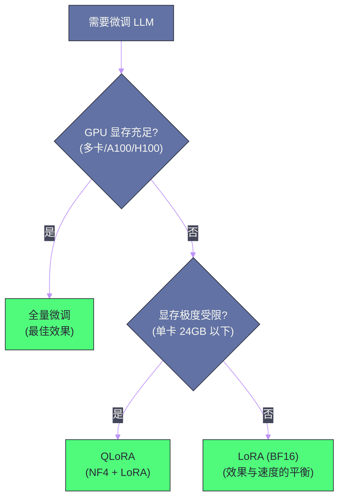

# 05 参数高效微调——LoRA、QLoRA 与 Adapter

**摘要：**

全量微调一个 70B 参数的大语言模型需要数百 GB 显存和数十块 GPU——对绝大多数团队来说不可承受。参数高效微调（Parameter-Efficient Fine-Tuning, PEFT）通过只训练模型的极少部分参数（通常不到总参数的 1%），在单块消费级 GPU 上就能完成微调，且效果接近全量微调。本文深入剖析 PEFT 的核心技术：**LoRA** 的低秩分解原理、**QLoRA** 的 4-bit 量化训练、**Adapter** 的瓶颈层插入，以及 **P-Tuning/Prefix-Tuning** 的软提示方法，分析它们各自的适用场景、性能权衡和工程实践。

---

## 第 1 章 全量微调的显存瓶颈

### 1.1 显存消耗的构成

在 [[04 指令微调与 RLHF——从基座模型到对话助手]] 中，我们介绍了 SFT 和 RLHF 的训练流程。全量微调（Full Fine-Tuning）需要更新模型的所有参数，其显存消耗主要来自四个部分：

| 组成部分 | BF16 下的显存 | 7B 模型估算 | 70B 模型估算 |
| :--- | :--- | :--- | :--- |
| 模型参数 | $2N$ 字节 | 14 GB | 140 GB |
| 梯度 | $2N$ 字节 | 14 GB | 140 GB |
| Adam 优化器状态（$m$ + $v$） | $2 \times 4N = 8N$ 字节（FP32） | 56 GB | 560 GB |
| 激活值 | 取决于 batch size 和序列长度 | ~10-30 GB | ~100-300 GB |
| **总计** | **~$12N$ + 激活** | **~100 GB** | **~1 TB** |

$N$ 为参数量。Adam 的两个状态（动量和方差）必须用 FP32 存储以保证数值精度，这使得优化器状态的显存占用是模型参数的 4 倍。

一块 A100 80GB GPU 连全量微调 7B 模型都很勉强，70B 模型更是需要 16+ 块 GPU。这就是 PEFT 技术的核心动机——**如何在极低的显存预算下完成有效的微调？**

### 1.2 PEFT 的核心思想

PEFT 的基本假设是：**微调不需要更新所有参数**。预训练模型已经学到了丰富的语言知识和表示能力，微调只需要在这个基础上做"微小的调整"来适配特定任务。

从数学角度看，全量微调将参数从 $W_0$（预训练权重）更新到 $W_0 + \Delta W$。PEFT 的核心假设是：**$\Delta W$ 具有某种低维结构**——它可以用远少于 $N$ 个参数来表示。不同的 PEFT 方法，本质上是对 $\Delta W$ 的结构做了不同的假设。

---

## 第 2 章 LoRA——低秩适配的优雅方案

### 2.1 LoRA 的核心直觉

**LoRA（Low-Rank Adaptation）**（Hu et al., 2021）是当前最主流的 PEFT 方法，被 Hugging Face PEFT 库、LLaMA-Factory 等主流工具深度集成。

LoRA 的核心假设极为简洁：**微调带来的权重变化 $\Delta W$ 具有低秩（Low-Rank）结构**。也就是说，$\Delta W \in \mathbb{R}^{d \times k}$ 虽然是一个大矩阵，但它可以分解为两个小矩阵的乘积：

$$\Delta W = B \cdot A$$

其中 $B \in \mathbb{R}^{d \times r}$，$A \in \mathbb{R}^{r \times k}$，$r \ll \min(d, k)$ 是秩（rank）。

这个假设有理论和实证支持。Aghajanyan et al.（2020）的研究发现：预训练模型在微调时，权重变化的内在维度（Intrinsic Dimensionality）远低于参数空间的实际维度。一个有数百万参数的模型，其微调的有效自由度可能只有几千——这意味着 $\Delta W$ 确实集中在一个低维子空间中。

### 2.2 LoRA 的实现细节

在训练时，原始的预训练权重 $W_0$ 被**冻结**（不更新），只训练 $A$ 和 $B$ 两个低秩矩阵。前向传播时，输出为：

$$h = W_0 x + \Delta W x = W_0 x + B A x$$

**初始化**：$A$ 用随机高斯初始化，$B$ 初始化为零矩阵。这确保训练开始时 $\Delta W = BA = 0$，模型行为与预训练模型完全一致——"从零开始"地学习适配，不会在初始阶段因随机扰动破坏预训练能力。

**缩放因子**：实际实现中，$\Delta W$ 会乘以一个缩放系数 $\alpha / r$：

$$h = W_0 x + \frac{\alpha}{r} B A x$$

$\alpha$ 是一个超参数（通常等于 $r$ 或 $2r$），用于控制 LoRA 更新的幅度。当 $\alpha = r$ 时，缩放因子为 1；增大 $\alpha$ 可以增强 LoRA 的影响力。

**参数量对比**：以一个 $d = 4096$ 的线性层为例：

| 方法 | 可训练参数量 | 占比 |
| :--- | :--- | :--- |
| 全量微调 | $d \times d = 16.7M$ | 100% |
| LoRA (r=8) | $d \times r \times 2 = 65K$ | **0.39%** |
| LoRA (r=16) | $d \times r \times 2 = 131K$ | 0.78% |
| LoRA (r=64) | $d \times r \times 2 = 524K$ | 3.1% |

### 2.3 LoRA 应用到哪些层

Transformer 中有多种线性层可以应用 LoRA：

- **Self-Attention 的 Q/K/V/O 投影**：$W_Q, W_K, W_V, W_O$
- **FFN 的线性层**：$W_{\text{gate}}, W_{\text{up}}, W_{\text{down}}$（SwiGLU FFN 的三个投影）

原始 LoRA 论文只在 Q 和 V 上应用（$W_Q, W_V$），因为实验发现这已经足够。但后续实践表明，在所有线性层上都应用 LoRA（"full LoRA"），通常能获得更好的效果，尤其是在更复杂的任务上。LLaMA-Factory 等工具默认对所有线性层应用 LoRA。

### 2.4 LoRA 的推理时合并

LoRA 的一个重要工程优势是：**推理时可以将 LoRA 权重合并到原始权重中，不增加任何推理延迟**。

$$W = W_0 + \frac{\alpha}{r} B A$$

合并后的模型与全量微调的模型在推理时完全等价——相同的架构、相同的计算量、相同的推理速度。这意味着 LoRA 是一个"免费"的微调方案——训练时省显存，推理时零额外开销。

而且，可以为不同的任务训练不同的 LoRA 适配器（adapter），在推理时按需加载和切换——只需存储几十 MB 的 LoRA 权重文件，而非整个模型的副本。

> [!info] 核心概念
> LoRA 的本质是对"微调所需的参数变化"做了一个**结构化的约束**（低秩）。这个约束不仅大幅减少了可训练参数量，还起到了**正则化**的作用——低秩约束限制了模型的更新自由度，减少了在小数据集上的过拟合风险。这也是为什么 LoRA 在数据量较少时往往比全量微调效果更好的原因之一。

### 2.5 秩 r 的选择

$r$ 是 LoRA 最关键的超参数。它控制了适配能力和参数效率之间的权衡：

- **$r$ 太小**（如 1-4）：适配能力不足，对复杂任务效果差
- **$r$ 太大**（如 256+）：参数量增大，逼近全量微调，PEFT 的优势减弱
- **常用范围**：$r = 8$ 到 $r = 64$，根据任务复杂度调整

经验法则：
- 简单任务（如情感分类、格式调整）：$r = 8$ 通常足够
- 中等任务（如指令微调、对话）：$r = 16$ 到 $r = 32$
- 复杂任务（如数学推理、代码生成）：$r = 64$ 或更高

---

## 第 3 章 QLoRA——4-bit 量化下的 LoRA

### 3.1 QLoRA 的动机

LoRA 虽然只训练少量参数，但**前向传播仍然需要完整模型**——冻结的 $W_0$ 仍然占用大量显存。一个 70B 模型的 $W_0$ 在 BF16 下仍需 140 GB。

**QLoRA（Quantized LoRA）**（Dettmers et al., 2023）的核心思想是：**将冻结的预训练权重 $W_0$ 量化到 4-bit，大幅减少显存占用，同时在 4-bit 模型上训练 LoRA 适配器**。

### 3.2 QLoRA 的三个关键创新

**创新一：NF4（NormalFloat 4-bit）量化**

传统的 4-bit 量化均匀地将值域分为 16 个区间。但预训练模型的权重通常近似正态分布——大部分值集中在零附近，极端值很少。NF4 根据正态分布的分位数来确定量化区间，使得每个区间包含大致相同数量的权重值，最小化量化误差。

**创新二：双重量化（Double Quantization）**

量化需要为每个量化块存储一个缩放因子（FP32，4 字节）。当块大小为 64 时，每个参数的缩放因子开销为 $4/64 = 0.0625$ 字节——看似不多，但对 70B 模型来说是 4.4 GB。双重量化将这些缩放因子本身也量化到 8-bit，将开销从 0.0625 字节/参数降低到 0.0156 字节/参数。

**创新三：分页优化器（Paged Optimizer）**

在训练中，GPU 显存可能因 batch 大小或序列长度的波动而偶尔不足。QLoRA 利用 NVIDIA 的 Unified Memory 特性，将优化器状态在 GPU 显存和 CPU 内存之间自动分页——当 GPU 显存不足时，部分优化器状态会被自动"换出"到 CPU 内存，需要时再"换入"。

### 3.3 QLoRA 的显存对比

| 配置 | 7B 模型 | 70B 模型 |
| :--- | :--- | :--- |
| 全量微调（BF16） | ~100 GB | ~1 TB |
| LoRA（BF16 模型） | ~15 GB | ~145 GB |
| **QLoRA（NF4 模型 + LoRA）** | **~6 GB** | **~48 GB** |

QLoRA 让在单块 24GB 的消费级 GPU（如 RTX 4090）上微调 7B 模型成为可能，在单块 A100 80GB 上微调 70B 模型成为可能。这极大地降低了 LLM 微调的门槛。

### 3.4 QLoRA 的效果

QLoRA 论文的一个重要结论是：**4-bit QLoRA 微调的效果与 16-bit 全量微调接近**。在 Guanaco（QLoRA 微调 LLaMA-65B 的模型）上的评估显示，它达到了 ChatGPT 99.3% 的水平（在 Vicuna 基准上）。

这个结论的意义在于：量化带来的精度损失被 LoRA 的适配能力所补偿——LoRA 训练的参数是 BF16 精度的，它们可以"修正"4-bit 量化引入的误差。

> [!warning] 生产避坑
> QLoRA 训练速度比 BF16 LoRA 慢约 30-50%，因为 4-bit 量化的权重需要在每次前向传播时反量化到 BF16——这是 QLoRA 省显存的代价。如果显存足够（如多卡训练），BF16 LoRA 是更快的选择。QLoRA 的核心价值是**在显存极其有限时仍能训练**。

---

## 第 4 章 Adapter——瓶颈层插入

### 4.1 Adapter 的设计

**Adapter**（Houlsby et al., 2019）是 PEFT 领域最早的工作之一。它在 Transformer 的每个子层（Self-Attention 和 FFN）之后插入一个小型的"瓶颈"网络：

$$\text{Adapter}(h) = h + f(h W_{\text{down}}) W_{\text{up}}$$

其中 $W_{\text{down}} \in \mathbb{R}^{d \times r}$ 将 $d$ 维降到 $r$ 维（瓶颈），$f$ 是非线性激活（如 ReLU），$W_{\text{up}} \in \mathbb{R}^{r \times d}$ 再升回 $d$ 维。残差连接确保 Adapter 不破坏原始信息流。

### 4.2 Adapter vs LoRA

| 维度 | Adapter | LoRA |
| :--- | :--- | :--- |
| 修改位置 | 子层之后插入新模块 | 修改现有线性层的权重 |
| 推理开销 | **有额外延迟**（新增计算） | **零额外延迟**（可合并权重） |
| 参数量 | 与 LoRA 相当 | 与 Adapter 相当 |
| 实现复杂度 | 需要修改模型结构 | 不修改模型结构 |
| 多任务切换 | 需要加载 Adapter 模块 | 只需替换 LoRA 权重矩阵 |

LoRA 的核心优势在于**推理时零开销**——合并权重后完全等价于原始模型。这是 Adapter 无法匹敌的——Adapter 的额外模块在推理时仍然需要计算，增加了延迟。这正是 LoRA 在工业界几乎完全取代 Adapter 的主要原因。

---

## 第 5 章 Prompt-based 方法——软提示

### 5.1 Prefix-Tuning

**Prefix-Tuning**（Li & Liang, 2021）不修改模型参数，而是在每一层的 Self-Attention 中**前置一组可学习的"虚拟 token"**（称为 prefix）。

具体来说，在每个 Transformer 层中，Key 和 Value 矩阵被扩展：

$$K' = [K_{\text{prefix}}; K], \quad V' = [V_{\text{prefix}}; V]$$

$K_{\text{prefix}}$ 和 $V_{\text{prefix}}$ 是可学习的参数。模型的所有真实 token 在计算注意力时，都可以"关注"这些虚拟前缀——前缀充当了"任务指示"的角色。

### 5.2 P-Tuning v2

**P-Tuning v2**（Liu et al., 2022）是 Prefix-Tuning 的实用改进版，在每一层都添加可学习的 prefix（而非只在输入层），且在更多类型的任务上进行了验证。

### 5.3 Prompt-based 方法的局限

Prompt-based 方法在 BERT 时代的小模型上表现不错，但在大语言模型时代逐渐式微，原因是：

- **有效容量有限**：prefix 的长度通常只有 10-100 个 token，能编码的"任务信息"有限
- **推理时增加序列长度**：prefix token 占用上下文窗口，减少了可用的输入长度
- **效果不及 LoRA**：在大模型上，LoRA 几乎在所有任务上都优于 Prompt-based 方法

当前主流的 PEFT 实践中，LoRA/QLoRA 已经占据绝对主导地位。

---

## 第 6 章 PEFT 方法的综合对比

### 6.1 全面对比

| 方法 | 可训练参数比例 | 推理额外开销 | 显存需求 | 效果 | 主流度 |
| :--- | :--- | :--- | :--- | :--- | :--- |
| **全量微调** | 100% | 无 | 极高 | 最好（上限） | 有资源时首选 |
| **LoRA** | 0.1-3% | **零**（合并权重） | 中 | 接近全量微调 | **当前主流** |
| **QLoRA** | 0.1-3% | 零（合并后） | **极低** | 接近 LoRA | **显存受限时首选** |
| **Adapter** | 0.5-5% | 有（额外层） | 中 | 接近全量微调 | 已逐渐被 LoRA 取代 |
| **Prefix-Tuning** | <0.1% | 有（增加序列长度） | 低 | 低于 LoRA | 已较少使用 |

### 6.2 选型决策树

---

## 第 7 章 LoRA 的实践指南

### 7.1 常用超参数配置

| 参数 | 推荐范围 | 说明 |
| :--- | :--- | :--- |
| `lora_rank` ($r$) | 8-64 | 简单任务用小值，复杂任务用大值 |
| `lora_alpha` ($\alpha$) | 通常 = $2r$ 或 $r$ | 控制 LoRA 更新的缩放 |
| `lora_dropout` | 0.05-0.1 | 正则化，防止过拟合 |
| `target_modules` | 所有线性层 | `q_proj, k_proj, v_proj, o_proj, gate_proj, up_proj, down_proj` |
| `learning_rate` | $1 \times 10^{-4}$ 到 $5 \times 10^{-4}$ | 比全量微调高一个量级 |
| `epochs` | 2-5 | 数据量小时可以多几个 epoch |

### 7.2 LoRA 的变体与改进

**DoRA（Weight-Decomposed Low-Rank Adaptation）**：将权重分解为幅度（magnitude）和方向（direction）两部分，对方向部分应用 LoRA。DoRA 在某些任务上效果优于 LoRA，但增加了少量计算开销。

**LoRA+**：对 A 和 B 矩阵使用不同的学习率（B 的学习率更高），论文声称可以提升 1-2% 的性能。

**rsLoRA（Rank-Stabilized LoRA）**：修改缩放因子为 $\alpha / \sqrt{r}$ 而非 $\alpha / r$，使得不同 rank 的 LoRA 训练更稳定。

**AdaLoRA**：动态地为不同层分配不同的 rank——重要的层分配更高的 rank，不重要的层用更低的 rank 甚至剪枝。

### 7.3 LoRA 的多任务与组合

一个基础模型可以训练多个 LoRA 适配器，用于不同的任务：

- **中文对话 LoRA**：在中文 SFT 数据上训练
- **代码生成 LoRA**：在代码数据上训练
- **医疗问答 LoRA**：在医疗领域数据上训练

推理时按需加载对应的 LoRA 权重——基础模型只需存储一份，每个 LoRA 只有几十到几百 MB。这对于需要服务多个领域/租户的场景非常实用。

更进一步，研究表明多个 LoRA 可以通过**线性组合**来融合：

$$W = W_0 + w_1 \cdot \Delta W_1 + w_2 \cdot \Delta W_2$$

其中 $w_1, w_2$ 是融合权重。这使得不需要重新训练就能组合多个能力。

### 7.4 工具生态

| 工具 | 功能 | 特点 |
| :--- | :--- | :--- |
| **PEFT (Hugging Face)** | LoRA/QLoRA/Prefix-Tuning 等 | 与 Transformers 深度集成 |
| **LLaMA-Factory** | 全流程微调工具 | SFT/RLHF/DPO 一站式，Web UI |
| **Unsloth** | 高速 LoRA/QLoRA 训练 | 自定义 Triton kernel，速度提升 2-5x |
| **Axolotl** | 灵活的微调配置 | YAML 配置驱动，支持多种数据格式 |
| **TRL (Hugging Face)** | RLHF/DPO 训练 | 与 PEFT 结合使用 |

---

## 第 8 章 总结

### 8.1 核心要点

1. **LoRA 是当前 PEFT 的绝对主流**：低秩分解 $\Delta W = BA$ 实现了参数效率和效果的最佳平衡，且推理时零额外开销
2. **QLoRA 将门槛降到消费级 GPU**：4-bit NF4 量化 + LoRA 让单卡 24GB 就能微调 7B 模型
3. **秩 $r$ 是最关键的超参数**：根据任务复杂度在 8-64 之间选择
4. **PEFT 的本质是正则化**：低秩约束不仅省参数，还防止小数据集上的过拟合
5. **多 LoRA 适配器机制**使得一个基础模型可以服务多个任务/领域

### 8.2 下一步

微调完成后的模型需要高效部署：

- [[06 推理优化——KV Cache、量化与投机解码]]：如何让模型在推理时更快更省？
- [[07 模型部署与 Serving——vLLM、TensorRT-LLM 与 Triton]]：如何构建生产级的推理服务？

---

## 参考文献

1. Hu et al., "LoRA: Low-Rank Adaptation of Large Language Models", ICLR 2022
2. Dettmers et al., "QLoRA: Efficient Finetuning of Quantized Language Models", NeurIPS 2023
3. Houlsby et al., "Parameter-Efficient Transfer Learning for NLP", ICML 2019 (Adapter)
4. Li & Liang, "Prefix-Tuning: Optimizing Continuous Prompts for Generation", ACL 2021
5. Liu et al., "P-Tuning v2: Prompt Tuning Can Be Comparable to Fine-tuning Universally Across Scales and Tasks", ACL 2022
6. Aghajanyan et al., "Intrinsic Dimensionality Explains the Effectiveness of Language Model Fine-Tuning", ACL 2021
7. Liu et al., "DoRA: Weight-Decomposed Low-Rank Adaptation", arXiv 2024
8. Hayou et al., "LoRA+: Efficient Low Rank Adaptation of Large Models", arXiv 2024
