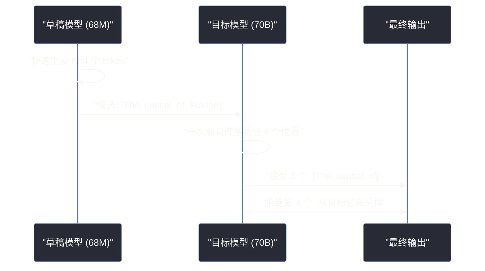

# 06 推理优化——KV Cache、量化与投机解码

**摘要：**

训练一个大语言模型需要数百万美元，但真正的成本大头在推理——一个被数百万用户使用的模型，每天处理数十亿 token，推理成本远超一次性的训练成本。本文深入剖析 LLM 推理阶段的核心优化技术：**KV Cache** 消除自回归生成中的重复计算，**权重量化**（GPTQ/AWQ/GGUF）将模型压缩到 4-bit 甚至更低，**投机解码**（Speculative Decoding）用小模型加速大模型的生成，以及 **Continuous Batching** 和 **PagedAttention** 等系统级优化。这些技术共同将 LLM 的推理吞吐量提升数倍到数十倍，使大规模部署成为可能。

---

## 第 1 章 LLM 推理的两个阶段

### 1.1 Prefill 与 Decode

LLM 的推理过程分为两个截然不同的阶段：

**Prefill（预填充）阶段**：模型一次性处理整个输入 prompt。所有 token 同时参与 Self-Attention 计算，充分利用 GPU 的并行能力。这个阶段是**计算密集型**的——GPU 的算力是瓶颈。

**Decode（解码）阶段**：模型逐个 token 生成输出。每一步只生成一个 token，需要与之前所有 token 的 Key/Value 做注意力计算。这个阶段是**访存密集型**的——每一步的计算量很小（只处理一个 token），但需要从显存中读取大量的 KV Cache 数据，GPU 的显存带宽是瓶颈。

| 阶段 | 处理 token 数 | 瓶颈 | GPU 利用率 | 占总推理时间 |
| :--- | :--- | :--- | :--- | :--- |
| **Prefill** | 所有输入 token（并行） | 计算（FLOPs） | 高 | ~10-30% |
| **Decode** | 每步 1 个 token（串行） | 显存带宽（Memory Bandwidth） | 低 | ~70-90% |

Decode 阶段占据了绝大部分推理时间，且 GPU 利用率极低——这就是 LLM 推理优化的核心目标：**提升 Decode 阶段的效率**。

### 1.2 推理的核心指标

- **TTFT（Time To First Token）**：从输入到生成第一个 token 的延迟，主要由 Prefill 阶段决定
- **TPOT（Time Per Output Token）**：每个输出 token 的生成时间，由 Decode 阶段决定
- **吞吐量（Throughput）**：每秒处理的总 token 数（输入 + 输出），通常以 tokens/s 衡量
- **总延迟（Latency）**：$\text{TTFT} + \text{TPOT} \times \text{output\_length}$

不同应用场景对指标的优先级不同：聊天应用优先 TTFT（用户期望快速看到首字）；批量处理优先吞吐量（总处理速度）。

---

## 第 2 章 KV Cache——消除重复计算

### 2.1 KV Cache 的动机

在 [[02 GPT 架构——Decoder-Only 的自回归语言模型]] 中我们知道，Decode 阶段每一步生成一个 token，该 token 需要与之前所有 token 做 Self-Attention 计算。

如果没有 KV Cache，每生成一个新 token，模型都需要重新计算整个序列（包括所有已生成的 token）的 Key 和 Value——这意味着第 $t$ 步需要处理 $t$ 个 token，总计算量为 $O(T^2)$（$T$ 为总序列长度）。这显然是极度浪费的——前 $t-1$ 个 token 的 Key 和 Value 在第 $t-1$ 步已经计算过了，完全相同。

**KV Cache 的核心思想**：将每一步计算出的 Key 和 Value 缓存在 GPU 显存中，后续步骤直接复用，无需重复计算。

### 2.2 KV Cache 的工作机制

在 Prefill 阶段，模型处理完整个输入序列后，将所有层的 Key 和 Value 矩阵缓存起来。

在 Decode 阶段的第 $t$ 步：

1. 只对新生成的 token $x_t$ 计算 $Q_t, K_t, V_t$（通过一次线性投影）
2. 将 $K_t, V_t$ 追加到缓存中：$K_{\text{cache}} = [K_{\text{cache}}; K_t]$，$V_{\text{cache}} = [V_{\text{cache}}; V_t]$
3. 计算 $Q_t$ 与整个 $K_{\text{cache}}$ 的注意力：$\text{Attention}(Q_t, K_{\text{cache}}, V_{\text{cache}})$

这样每步只需计算一个 token 的 Q/K/V 投影（而非整个序列），将 Decode 的计算量从 $O(T^2)$ 降低到 $O(T)$。

### 2.3 KV Cache 的显存消耗

KV Cache 的代价是显存——需要为每个请求的每个 token 存储所有层的 Key 和 Value。

对于一个 LLaMA-7B 模型（32 层，32 头，$d_k = 128$，BF16）：

$$\text{KV Cache per token} = 2 \times L \times h \times d_k \times 2\text{B} = 2 \times 32 \times 32 \times 128 \times 2 = 512\text{KB}$$

其中 $2$ 代表 K 和 V 两个矩阵，最后的 $2\text{B}$ 代表 BF16 的 2 字节。

一个 4096 token 长度的序列的 KV Cache 约为 $512\text{KB} \times 4096 = 2\text{GB}$。如果同时服务 32 个并发请求，KV Cache 就需要 64 GB——超过了单块 A100 的显存。

| 模型 | KV Cache / token | 4K 上下文 | 32K 上下文 | 128K 上下文 |
| :--- | :--- | :--- | :--- | :--- |
| LLaMA-7B | 512 KB | 2 GB | 16 GB | 64 GB |
| LLaMA-70B (GQA, 8 KV头) | 640 KB | 2.5 GB | 20 GB | 80 GB |
| Mistral-7B (GQA, 8 KV头) | 128 KB | 0.5 GB | 4 GB | 16 GB |

这正是 GQA（Grouped-Query Attention）如此重要的原因——它通过减少 K/V 头的数量，将 KV Cache 大小降低数倍。

> [!info] 核心概念
> KV Cache 是 LLM 推理中"以空间换时间"的经典策略。它将 Decode 阶段从"计算密集型"转变为"访存密集型"——瓶颈从 GPU 算力转移到了显存带宽和显存容量。后续的大量优化技术（PagedAttention、量化 KV Cache、GQA）都是围绕 KV Cache 的显存压力展开的。

---

## 第 3 章 权重量化——模型压缩

### 3.1 量化的基本原理

**量化**（Quantization）是将模型权重从高精度浮点数（如 FP16/BF16，16 bit）转换为低精度整数（如 INT8 或 INT4），从而减小模型体积和加速推理。

最简单的量化方式是**线性量化**：将 FP16 值映射到 INT8 区间 $[-128, 127]$：

$$x_{\text{quant}} = \text{round}\left(\frac{x}{\text{scale}}\right) + \text{zero\_point}$$

$$\text{scale} = \frac{x_{\max} - x_{\min}}{2^b - 1}$$

其中 $b$ 是量化位数。反量化时：$x_{\text{dequant}} = (x_{\text{quant}} - \text{zero\_point}) \times \text{scale}$。

量化带来的好处是双重的：
- **模型体积减半到四分之一**：FP16 → INT8 减半，FP16 → INT4 减到四分之一
- **推理加速**：更小的模型意味着更少的显存读取，在访存密集的 Decode 阶段直接转化为速度提升

### 3.2 训练后量化（Post-Training Quantization）

训练后量化不需要重新训练模型，只需要一小批校准数据来确定量化参数（scale 和 zero_point）。

**GPTQ（Generative Pre-trained Transformer Quantization）**

GPTQ（Frantar et al., 2023）是最早在 LLM 上成功实现高质量 4-bit 量化的方法。核心思想是**逐层量化**：一次处理一个线性层，利用**最优脑损伤**（Optimal Brain Damage）的思想，按照每个参数对输出误差的影响大小，选择最优的量化顺序和补偿方式。

GPTQ 使用少量校准数据（通常 128 条文本）计算每一层的 Hessian 矩阵（衡量参数重要性），然后按照重要性从低到高量化参数，每量化一个参数就调整其他未量化参数来补偿误差。

**AWQ（Activation-aware Weight Quantization）**

AWQ（Lin et al., 2024）观察到一个关键现象：**不是所有权重同等重要——少数"关键权重"对应着激活值中的少数"关键通道"**。这些关键通道的激活值幅度特别大，对应权重的量化误差会被放大。

AWQ 的策略是：对关键权重（对应高激活值通道）乘以一个大于 1 的缩放因子，使其值范围更大、量化精度更高；对不关键的权重缩小，牺牲其精度换取整体更好的量化效果。

**GGUF（GPT-Generated Unified Format）**

GGUF 是 llama.cpp 生态使用的量化格式，支持 CPU 推理。它使用**混合精度量化**——不同层可以使用不同的量化位数（如注意力层用 8-bit，FFN 用 4-bit），在精度和体积之间灵活权衡。

GGUF 的命名约定如 `Q4_K_M` 表示：4-bit 量化 + K-quants 分组方法 + Medium 精度配置。

| 量化方法 | 量化位数 | 校准数据需求 | 推理框架 | 速度 | 质量 |
| :--- | :--- | :--- | :--- | :--- | :--- |
| **GPTQ** | 4-bit / 8-bit | 少量（128 条） | ExLlama, vLLM | 快（GPU） | 好 |
| **AWQ** | 4-bit | 少量 | vLLM, TensorRT-LLM | 快（GPU） | 略优于 GPTQ |
| **GGUF** | 2-8 bit 混合 | 无 | llama.cpp | 中（CPU/GPU） | 灵活 |
| **BitsAndBytes** | 4-bit (NF4) / 8-bit | 无 | Transformers | 中（GPU） | 好（QLoRA 使用） |

### 3.3 量化对质量的影响

量化不可避免地引入精度损失，但不同位数的影响差异巨大：

- **8-bit 量化**：几乎无损——在大多数基准上与 FP16 的差异小于 1%
- **4-bit 量化**：轻微损失——在知识密集型任务（如 MMLU）上可能下降 1-3%，在推理任务上影响更小
- **3-bit 量化**：明显损失——质量开始显著下降，仅适用于对精度要求不高的场景
- **2-bit 量化**：严重损失——当前技术下质量不可接受

> [!warning] 生产避坑
> 量化对不同能力的影响不均匀。经验表明，量化对"事实性知识"的损伤大于对"推理能力"的损伤——因为事实知识依赖于权重中存储的精确信息，而推理能力更多依赖于模型的结构性模式。因此，如果你的应用场景对事实准确性要求极高（如医疗、法律），建议使用 8-bit 量化而非 4-bit。

### 3.4 KV Cache 量化

除了权重量化，KV Cache 也可以被量化以节省显存。KV Cache 量化通常使用 8-bit（FP8 或 INT8），对质量的影响很小，但可以将 KV Cache 的显存占用减半。

vLLM 和 TensorRT-LLM 都支持 KV Cache 的 FP8 量化。

---

## 第 4 章 投机解码——用小模型加速大模型

### 4.1 自回归生成的根本瓶颈

LLM 推理的根本瓶颈在于自回归生成的串行性——每一步只生成一个 token，但每步都需要从显存读取完整的模型权重。对于大模型，每步的计算量很小（处理一个 token），但显存读取量很大（读取整个模型），GPU 的算力严重闲置。

从硬件指标看，A100 GPU 的峰值算力为 312 TFLOPS（BF16），但显存带宽只有 2 TB/s。一个 7B 模型（14 GB，BF16）每步需要读取全部参数，耗时约 $14/2000 = 7$ms。但这一步的实际计算量极小——大量时间花在"等数据从显存传到计算单元"上。

这个瓶颈被称为**内存墙**（Memory Wall）：GPU 的计算能力远超数据供给能力。

### 4.2 投机解码的核心思想

**投机解码**（Speculative Decoding，Leviathan et al., 2023; Chen et al., 2023）的核心思想来自一个观察：**大模型生成的很多 token 其实是"简单"的——小模型也能正确预测**。

比如"The capital of France is Paris"这个输出，前几个词（"The capital of"）几乎任何语言模型都能正确生成。只有关键信息词（"France"、"Paris"）可能需要大模型的能力。

投机解码的策略是：

1. 用一个**小型草稿模型**（Draft Model，如 68M 参数）快速生成 $K$ 个候选 token（$K$ 通常为 4-8）
2. 将这 $K$ 个候选 token 一次性送入**大型目标模型**（Target Model）进行验证——大模型在一次前向传播中同时处理 $K$ 个位置
3. 从左到右检查：如果草稿 token 与大模型的预测一致（或满足某个接受准则），就接受；遇到第一个不一致的位置就拒绝，从大模型的分布中重新采样



关键性质：**投机解码的输出分布与直接用大模型生成完全相同**——它不是近似，而是精确的。接受-拒绝机制保证了这一点。

### 4.3 加速比分析

投机解码的加速比取决于两个因素：

- **接受率** $\gamma$：草稿 token 被大模型接受的概率。越高越好——$\gamma = 0.8$ 意味着平均每 5 个草稿 token 有 4 个被接受
- **草稿模型速度与大模型速度的比值**：草稿模型越快越好

理论加速比约为：

$$\text{Speedup} \approx \frac{K \cdot \gamma + 1}{K \cdot t_{\text{draft}} / t_{\text{target}} + 1}$$

在实践中，投机解码通常能获得 **2-3 倍**的加速。接受率高度依赖于任务类型——模板化的输出（如代码、格式化文本）接受率高，创意性输出（如故事续写）接受率低。

### 4.4 Medusa——无需草稿模型的投机解码

**Medusa**（Cai et al., 2024）避免了使用独立的草稿模型——它在大模型本身上添加多个轻量级的"Medusa Head"（额外的 FFN 层），每个 Head 负责预测不同未来位置的 token。

Medusa 的优势是不需要独立的草稿模型（避免了草稿模型与目标模型之间的分布差异问题），但需要额外的训练来学习 Medusa Head。

---

## 第 5 章 系统级优化

### 5.1 Continuous Batching

传统的批处理（Static Batching）将多个请求打包成一个 batch 同时处理。问题是：不同请求的输出长度不同，短请求生成完毕后必须等长请求完成，GPU 在等待期间空闲。

**Continuous Batching**（也叫 Iteration-level Scheduling）改变了这种模式：在每个 Decode 步之后，如果某个请求已完成（生成了 `<eos>`），立即将其替换为队列中的新请求。这样 GPU 始终在处理满载的 batch，不存在等待浪费。

Continuous Batching 可以将吞吐量提升 **2-5 倍**，是 vLLM、TensorRT-LLM 等推理框架的标配功能。

### 5.2 PagedAttention

**PagedAttention**（Kwon et al., 2023，vLLM 的核心技术）借鉴了操作系统的**虚拟内存分页**机制来管理 KV Cache。

传统方式为每个请求预分配一整块连续的 KV Cache 显存——按最大可能长度分配。如果请求的实际输出长度远小于最大长度，就会造成严重的**显存碎片化和浪费**。实测表明，传统方式的 KV Cache 显存浪费率高达 60-80%。

PagedAttention 的做法：

1. 将 KV Cache 分割为固定大小的**页**（Block，如每页 16 个 token 的 K/V）
2. 每个请求维护一个**页表**（Page Table），记录逻辑页到物理页的映射
3. 物理页在显存中不需要连续——就像操作系统的虚拟内存一样
4. 新 token 的 K/V 写入当前页，页满后分配新页

这消除了显存碎片和预分配浪费，实际上可以将同时服务的请求数提升 **2-4 倍**（因为同样的显存可以容纳更多的 KV Cache）。

> [!note] 设计哲学
> PagedAttention 的设计精妙地展示了**操作系统原理在 AI 系统中的应用**。虚拟内存分页是操作系统解决物理内存碎片化的经典方案，PagedAttention 将同样的思想应用于 GPU 显存中的 KV Cache 管理。这提醒我们：AI 系统工程不仅需要机器学习知识，还需要扎实的系统设计功底。

### 5.3 Prefix Caching

在很多应用场景中，不同请求共享相同的前缀——比如所有请求都有相同的 System Prompt，或者 RAG 场景中多个请求检索到了相同的文档片段。

**Prefix Caching**（前缀缓存）将共享前缀的 KV Cache 缓存并在请求之间复用，避免重复计算。vLLM 的 Automatic Prefix Caching（APC）功能可以自动检测和复用共享前缀。

对于有长 System Prompt 的聊天应用，Prefix Caching 可以将 TTFT 降低数倍。

---

## 第 6 章 推理框架生态

### 6.1 主流推理框架对比

| 框架 | 核心特性 | 硬件支持 | 适用场景 |
| :--- | :--- | :--- | :--- |
| **vLLM** | PagedAttention, Continuous Batching, Prefix Caching | NVIDIA/AMD GPU | 通用在线服务 |
| **TensorRT-LLM** | NVIDIA 官方优化, 高度定制的 CUDA kernel | NVIDIA GPU | 追求极致性能 |
| **llama.cpp** | CPU + Metal/CUDA, GGUF 量化 | CPU/Apple Silicon/GPU | 本地部署, 边缘设备 |
| **SGLang** | RadixAttention (高级前缀缓存), 结构化生成 | NVIDIA GPU | 复杂 prompt 工程 |
| **ExLlamaV2** | GPTQ 量化优化, 高效的 4-bit kernel | NVIDIA GPU | 量化模型推理 |
| **Ollama** | llama.cpp 封装, 一键部署 | CPU/GPU | 本地快速体验 |

### 6.2 vLLM 的架构

vLLM 是当前最主流的 LLM 推理框架，其核心架构包括：

- **Scheduler**：请求调度器，实现 Continuous Batching 和优先级管理
- **BlockManager**：基于 PagedAttention 的 KV Cache 显存管理
- **Worker**：GPU 上的模型执行引擎，支持张量并行
- **Tokenizer**：高效的分词和解码
- **OpenAI-compatible API**：提供与 OpenAI API 兼容的 HTTP 接口

vLLM 的部署只需一行命令：

```bash
vllm serve meta-llama/Llama-2-7b-chat-hf --tensor-parallel-size 2
```

---

## 第 7 章 实际部署的性能考量

### 7.1 显存预算分配

部署 LLM 时，GPU 显存需要在以下几部分之间分配：

| 组成部分 | 7B (BF16) | 7B (INT4) | 70B (BF16) | 70B (INT4) |
| :--- | :--- | :--- | :--- | :--- |
| 模型权重 | 14 GB | 3.5 GB | 140 GB | 35 GB |
| KV Cache（每请求 4K） | 2 GB | 2 GB | 2.5 GB | 2.5 GB |
| 其他开销 | ~2 GB | ~2 GB | ~5 GB | ~5 GB |
| **单请求总计** | ~18 GB | ~7.5 GB | ~147.5 GB | ~42.5 GB |

模型权重是固定开销（所有请求共享），KV Cache 是按请求分配的。因此，最大化并发请求数的关键是**减少模型权重占用**（量化）和**高效管理 KV Cache**（PagedAttention + GQA）。

### 7.2 延迟与吞吐量的权衡

增大 batch size 可以提升吞吐量（GPU 利用率更高），但会增加单个请求的延迟（等待 batch 凑齐的时间，以及 batch 内的请求相互影响）。

实际部署中需要根据 SLA（Service Level Agreement）来平衡：
- 交互式聊天（低延迟优先）：batch size 较小，TTFT < 500ms
- 批量处理（高吞吐优先）：batch size 尽量大，最大化 tokens/s

---

## 第 8 章 总结

### 8.1 优化技术分层

| 层次 | 优化技术 | 效果 |
| :--- | :--- | :--- |
| **算法层** | KV Cache, 投机解码, GQA | 消除冗余计算 |
| **模型层** | 量化 (GPTQ/AWQ/GGUF) | 减小模型体积, 加速访存 |
| **系统层** | Continuous Batching, PagedAttention, Prefix Caching | 提升 GPU 利用率和并发 |
| **硬件层** | Flash Attention, Tensor Core, NVLink | 底层计算加速 |

### 8.2 下一步

- [[07 模型部署与 Serving——vLLM、TensorRT-LLM 与 Triton]]：如何构建生产级的推理服务？
- [[08 长上下文与多模态——技术前沿]]：$O(n^2)$ 注意力复杂度如何在长上下文场景下优化？

---

## 参考文献

1. Kwon et al., "Efficient Memory Management for Large Language Model Serving with PagedAttention", SOSP 2023
2. Leviathan et al., "Fast Inference from Transformers via Speculative Decoding", ICML 2023
3. Frantar et al., "GPTQ: Accurate Post-Training Quantization for Generative Pre-trained Transformers", ICLR 2023
4. Lin et al., "AWQ: Activation-aware Weight Quantization for LLM Compression and Acceleration", MLSys 2024
5. Cai et al., "Medusa: Simple LLM Inference Acceleration Framework with Multiple Decoding Heads", ICML 2024
6. Dao et al., "FlashAttention-2: Faster Attention with Better Parallelism and Work Partitioning", ICLR 2024
7. Ainslie et al., "GQA: Training Generalized Multi-Query Transformer Models from Multi-Head Checkpoints", EMNLP 2023
8. Yu et al., "ORCA: A Distributed Serving System for Transformer-Based Generative Models", OSDI 2022

---

> [!note] 思考题
> 1. KV Cache 将已生成 token 的 Key 和 Value 缓存起来，避免重复计算。对于一个 70B 参数的模型，生成 4096 个 token 时 KV Cache 占用多少显存？PagedAttention（vLLM 使用）通过'分页'管理 KV Cache——它解决了什么问题？与传统的连续内存 KV Cache 相比，PagedAttention 如何提升显存利用率？
> 2. 模型量化（INT8/INT4/GPTQ/AWQ）将 FP16 权重压缩为低精度——减少显存和加速推理。但量化不可避免地带来精度损失。在什么任务类型上量化的精度损失最明显（如数学推理 vs 文本摘要）？GPTQ（逐层量化 + 校准集）和 AWQ（激活感知量化）的量化策略有什么本质区别？
> 3. 投机解码（Speculative Decoding）使用一个小模型快速生成候选 token 序列，然后用大模型一次性验证。如果小模型的预测准确率为 80%，投机解码的加速比大约是多少？小模型和大模型的'对齐度'如何影响加速效果？在什么场景下投机解码的收益最大？
