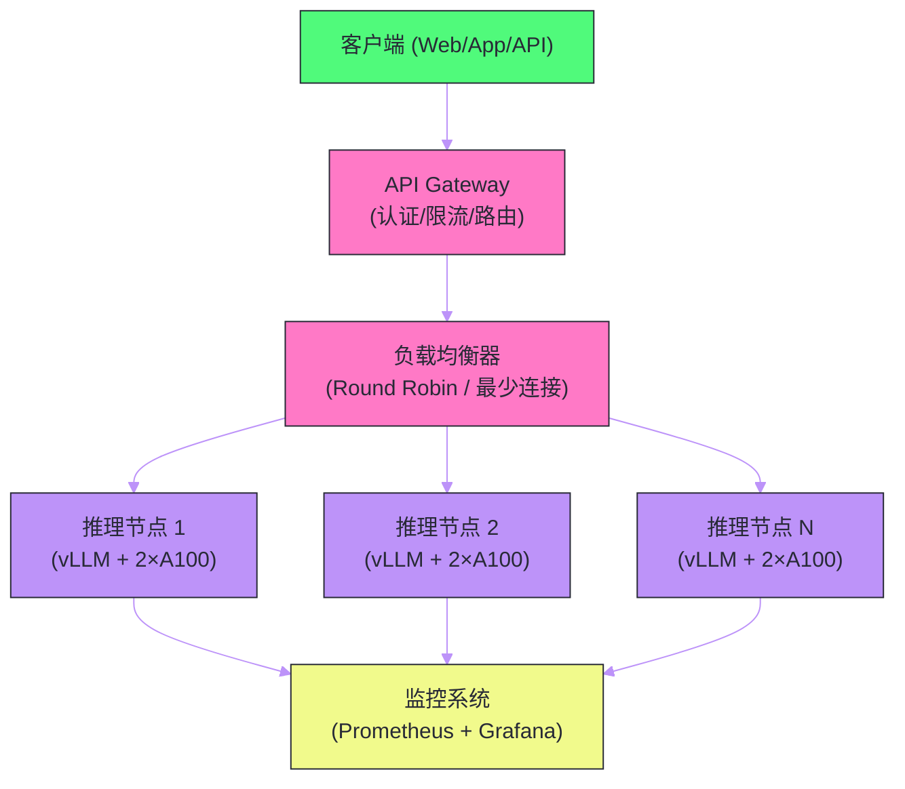
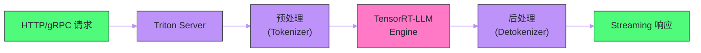

# 07 模型部署与 Serving——vLLM、TensorRT-LLM 与 Triton

**摘要：**

一个训练好的大语言模型要真正服务用户，必须经历从"实验室模型文件"到"生产级在线服务"的工程落地过程。本文围绕这一过程，深入剖析 LLM Serving 的核心挑战（高并发、低延迟、成本控制）、主流推理引擎的技术选型（vLLM、TensorRT-LLM、llama.cpp、SGLang）、生产级部署架构（API Gateway → Load Balancer → Inference Backend → GPU Cluster）、模型服务框架（NVIDIA Triton Inference Server）、以及关键运维指标（TTFT/TPOT/吞吐量/GPU 利用率）的监控与调优。目标是为读者构建一个完整的 LLM 部署知识体系。

---

## 第 1 章 LLM Serving 的核心挑战

### 1.1 与传统模型 Serving 的本质区别

传统的机器学习模型服务（如推荐模型、图像分类模型）的推理过程是"一次性"的——输入一张图片，输出一个分类结果，请求在毫秒级完成。LLM Serving 与之有根本性的不同：

**自回归生成导致长请求**：一次 LLM 请求可能持续数秒到数十秒（生成数百个 token），在此期间 GPU 资源被该请求持续占用。这与传统模型的毫秒级请求形成鲜明对比。

**显存消耗随请求动态增长**：每个请求的 KV Cache 随着生成过程不断增长，显存占用是动态变化的。传统模型的显存占用在推理时是固定的。

**请求长度高度异质**：不同请求的输入长度和输出长度差异巨大——有的请求输入 10 个 token 输出 500 个，有的输入 2000 个 token 输出 20 个。这种异质性使批处理调度变得复杂。

**流式输出需求**：用户期望看到逐字生成的效果（Streaming），而非等待整个回答生成完毕。这要求 Serving 系统支持 Server-Sent Events（SSE）或 WebSocket。

### 1.2 三个核心矛盾

LLM Serving 需要同时平衡三个相互矛盾的目标：

| 目标 | 度量指标 | 优化方向 |
| :--- | :--- | :--- |
| **低延迟** | TTFT（首 token 延迟）、TPOT（每 token 延迟） | 小 batch size、高优先级调度 |
| **高吞吐** | tokens/s、requests/s | 大 batch size、充分利用 GPU |
| **低成本** | $/million tokens、GPU 利用率 | 量化、更小的模型、更高的并发 |

增大 batch size 可以提升吞吐量（GPU 算力利用率更高），但会增加排队延迟（请求需要等待 batch 凑齐）和单请求延迟（batch 内请求共享带宽）。降低延迟需要小 batch 和快速响应，但牺牲了吞吐量。使用更小或量化的模型可以降低成本，但可能影响质量。

### 1.3 关键性能指标

| 指标 | 定义 | 典型 SLA |
| :--- | :--- | :--- |
| **TTFT** | 从收到请求到返回第一个 token 的时间 | < 500ms（交互式聊天） |
| **TPOT** | 每个输出 token 的生成间隔 | < 50ms（约 20 tokens/s） |
| **端到端延迟** | TTFT + TPOT × output_length | 取决于输出长度 |
| **吞吐量** | 系统每秒处理的总 token 数 | 根据 GPU 数量和模型规模确定 |
| **并发数** | 系统同时处理的请求数量 | 受限于 KV Cache 显存 |
| **GPU 利用率** | GPU 算力的有效使用比例 | 目标 > 70% |

---

## 第 2 章 推理引擎深度对比

### 2.1 vLLM——开源生态的事实标准

vLLM 由 UC Berkeley 的 Sky Computing Lab 开发，凭借 [[PagedAttention]] 技术和易用性迅速成为开源 LLM Serving 的首选。

**核心技术栈**：
- **PagedAttention**：虚拟内存分页式 KV Cache 管理，消除显存碎片
- **Continuous Batching**：迭代级调度，请求完成后立即替换
- **Prefix Caching（APC）**：自动检测和复用共享前缀的 KV Cache
- **张量并行**：支持跨多块 GPU 分片模型
- **量化支持**：GPTQ、AWQ、FP8、BitsAndBytes
- **LoRA 热加载**：运行时动态加载/切换 LoRA 适配器

**部署方式**：vLLM 提供 OpenAI 兼容的 HTTP API，可以直接替换 OpenAI SDK 的 `base_url`：

```python
# 客户端代码无需修改，只改 base_url
from openai import OpenAI
client = OpenAI(base_url="http://localhost:8000/v1", api_key="none")
response = client.chat.completions.create(
    model="meta-llama/Llama-2-7b-chat-hf",
    messages=[{"role": "user", "content": "Hello!"}],
    stream=True
)
```

**适用场景**：通用在线服务、快速原型、对灵活性要求高的场景。

### 2.2 TensorRT-LLM——NVIDIA 的极致性能

TensorRT-LLM 是 NVIDIA 官方的 LLM 推理引擎，通过深度定制的 CUDA Kernel 和图优化来榨取 NVIDIA GPU 的极致性能。

**核心优势**：
- **定制 CUDA Kernel**：针对特定 GPU 架构（Ampere/Hopper/Blackwell）的手写 Kernel，比通用实现快 20-50%
- **图优化**：算子融合（将多个小操作合并为一个大 Kernel，减少 Kernel Launch 开销和中间数据读写）
- **FP8 支持**：在 Hopper（H100）及以上 GPU 上充分利用 FP8 Tensor Core
- **In-Flight Batching**：NVIDIA 版本的 Continuous Batching

**劣势**：
- **构建复杂**：需要先将模型编译为 TensorRT 引擎文件，编译过程耗时（数十分钟到数小时）且对环境依赖严格
- **灵活性低**：新模型支持速度慢于 vLLM
- **绑定 NVIDIA**：只支持 NVIDIA GPU

**适用场景**：对性能要求极致、使用 NVIDIA GPU、模型固定不频繁变更的生产环境。

### 2.3 SGLang——结构化生成的新星

SGLang（Structured Generation Language）在 vLLM 的基础上增加了针对复杂 prompt 工程的优化。

**核心特性**：
- **RadixAttention**：基于 Radix Tree（基数树）的前缀缓存，比 vLLM 的 APC 更高效地处理多分支的前缀共享
- **结构化生成**：原生支持 JSON Schema、正则表达式等约束输出格式
- **并行采样**：同一 prompt 高效生成多个候选回答

**适用场景**：Agent 应用（需要结构化输出）、复杂 prompt 工程、多次采样+投票的场景。

### 2.4 llama.cpp——本地部署的王者

llama.cpp 是一个纯 C/C++ 实现的 LLM 推理引擎，专注于在消费级硬件上高效运行 LLM。

**核心特性**：
- **CPU 推理**：充分优化 x86（AVX2/AVX-512）和 ARM（NEON）指令集
- **Apple Silicon 优化**：通过 Metal 框架利用 Mac 的统一内存和 GPU
- **GGUF 量化**：灵活的混合精度量化（2-bit 到 8-bit）
- **跨平台**：Windows/macOS/Linux/Android/iOS
- **零依赖**：不依赖 Python、CUDA Runtime 等重量级环境

**适用场景**：本地部署、隐私敏感场景、嵌入式设备、Mac 用户。

### 2.5 框架选型矩阵

| 维度 | vLLM | TensorRT-LLM | SGLang | llama.cpp |
| :--- | :--- | :--- | :--- | :--- |
| 性能 | 高 | **极高** | 高 | 中 |
| 易用性 | **高** | 低 | 高 | 高 |
| 模型支持 | 广 | 中 | 广 | 广 |
| 硬件要求 | NVIDIA/AMD GPU | NVIDIA GPU | NVIDIA GPU | **CPU/任意 GPU** |
| 量化支持 | GPTQ/AWQ/FP8 | FP8/INT8/INT4 | GPTQ/AWQ | **GGUF (2-8bit)** |
| 生态成熟度 | **最成熟** | 成熟 | 发展中 | 成熟 |
| 适用场景 | 通用在线服务 | 极致性能 | 结构化生成 | 本地/边缘 |

---

## 第 3 章 生产级部署架构

### 3.1 典型架构设计

一个生产级的 LLM 服务通常包含以下层次：



**API Gateway 层**：负责认证（API Key 验证）、限流（Rate Limiting，防止单用户过度使用）、请求路由（根据模型名称路由到对应的推理集群）、请求/响应日志记录。

**负载均衡层**：将请求分发到多个推理节点。LLM Serving 的负载均衡比传统 Web 服务更复杂，因为请求的处理时间差异巨大——"最少连接"策略比"轮询"更适合。

**推理节点层**：每个节点运行一个推理引擎实例（如 vLLM），管理一块或多块 GPU。节点内可以使用张量并行将模型分片到多块 GPU。

**监控层**：收集性能指标（TTFT/TPOT/吞吐量/GPU 利用率/队列深度），设置告警（延迟超过 SLA、GPU 利用率异常等）。

### 3.2 模型路由策略

在多模型服务场景下（如同时提供 7B 和 70B 模型），需要智能的路由策略：

- **按模型名称路由**：最简单，客户端在请求中指定模型名称
- **按复杂度路由**：简单请求路由到小模型（快速低成本），复杂请求路由到大模型。可以用一个轻量级分类器判断请求复杂度
- **级联路由**：先用小模型尝试回答，如果置信度低，再转发给大模型。类似投机解码的思想，但在服务级别实现

### 3.3 弹性伸缩

LLM 服务的负载通常有明显的波动——工作日白天高峰、夜间低谷。弹性伸缩可以在高峰期自动增加 GPU 实例，低谷期释放资源降低成本。

在 [[Kubernetes]] 环境下，可以使用 **KEDA**（Kubernetes Event-Driven Autoscaling）根据请求队列长度或 GPU 利用率自动扩缩推理 Pod。

关键挑战是**冷启动**：一个新的推理实例需要加载模型到 GPU 显存，这通常需要 30 秒到数分钟。对于 70B 模型（140 GB），加载时间可能超过 2 分钟。缓解方案包括：
- 预热池（保持少量空闲实例随时可用）
- 模型缓存（将模型文件缓存在本地 NVMe SSD 上，而非每次从对象存储下载）
- 模型分片预加载（利用张量并行，多块 GPU 同时加载）

---

## 第 4 章 NVIDIA Triton Inference Server

### 4.1 Triton 的定位

NVIDIA Triton Inference Server 是一个通用的模型服务框架，不仅支持 LLM，还支持传统 ML 模型、CV 模型等。它的核心价值在于**统一的服务接口和模型管理**。

在 LLM 场景下，Triton 通常作为 TensorRT-LLM 的前端——TensorRT-LLM 负责高效的模型推理，Triton 负责请求管理、模型版本控制、多模型服务等上层逻辑。

### 4.2 Triton 的核心特性

- **多后端支持**：TensorRT、ONNX Runtime、PyTorch、TensorFlow、vLLM、Python 自定义后端
- **动态 Batching**：自动将多个请求合并为 batch
- **模型仓库（Model Repository）**：基于文件系统的模型版本管理，支持热更新
- **模型集成（Ensemble）**：将多个模型串联为流水线（如 Tokenizer → LLM → Detokenizer）
- **指标暴露**：原生 Prometheus 指标，便于监控

### 4.3 Triton + TensorRT-LLM 部署架构



---

## 第 5 章 多 GPU 与多节点部署

### 5.1 张量并行部署

对于单块 GPU 放不下的大模型（如 70B），需要使用张量并行将模型分片到多块 GPU。vLLM 的张量并行部署非常简单：

```bash
# 使用 4 块 GPU 进行张量并行
vllm serve meta-llama/Llama-2-70b-chat-hf \
    --tensor-parallel-size 4 \
    --max-model-len 4096 \
    --gpu-memory-utilization 0.9
```

张量并行的 GPU 数量通常是 2 的幂（2/4/8），且应在同一节点内（利用 NVLink 高带宽互联）。

### 5.2 多实例部署

如果有多台 GPU 服务器，通常每台服务器运行一个独立的推理实例（各自处理不同的请求），通过负载均衡器分发请求。这比跨节点的模型并行更简单高效——跨节点通信的延迟（InfiniBand 也需要微秒级）远高于节点内 NVLink（纳秒级）。

| 部署模式 | GPU 配置 | 适用模型 | 并发能力 |
| :--- | :--- | :--- | :--- |
| 单 GPU | 1× A100/H100 | 7B (BF16) 或 70B (INT4) | 低 |
| 节点内张量并行 | 2-8× GPU (NVLink) | 13B-70B (BF16) | 中 |
| 多实例 + 负载均衡 | N 台服务器 × M GPU | 任意 | 高（线性扩展） |

### 5.3 混合部署：不同模型共享 GPU

在实际生产中，可能需要在同一 GPU 集群上同时服务多个不同的模型。vLLM 支持在同一实例中加载多个 LoRA 适配器（共享基座模型），在不同请求间动态切换 LoRA——这比为每个任务部署独立的模型实例高效得多。

对于完全不同的模型（如 7B 和 70B），可以使用 Kubernetes 的 GPU 调度（如 NVIDIA GPU Operator + Time-Slicing 或 MIG）来在物理 GPU 上分配虚拟 GPU 给不同的模型实例。

---

## 第 6 章 监控与运维

### 6.1 关键监控指标

| 指标类别 | 具体指标 | 告警阈值示例 |
| :--- | :--- | :--- |
| **延迟** | P50/P95/P99 TTFT, TPOT | P99 TTFT > 2s |
| **吞吐** | tokens/s (input + output), requests/s | 吞吐量下降 > 30% |
| **队列** | 等待队列深度、排队时间 | 队列深度 > 100 |
| **GPU** | 利用率、显存使用、温度 | 利用率 < 30% 或 > 95% |
| **错误** | 超时率、OOM 率、500 错误率 | 错误率 > 1% |

### 6.2 常见生产问题与排查

**问题一：TTFT 突然增大**
- 可能原因：输入 prompt 过长（Prefill 阶段计算量大）、请求排队（并发过高）、Prefix Cache 未命中
- 排查方向：检查输入长度分布、队列深度、Cache 命中率

**问题二：GPU 利用率持续偏低**
- 可能原因：batch size 太小（请求不够多）、Decode 阶段占主导（访存密集，算力闲置）
- 优化方向：增大最大 batch size、启用 Continuous Batching、增加并发请求

**问题三：OOM（Out of Memory）**
- 可能原因：KV Cache 超出预分配显存、同时处理的请求过多、模型+KV Cache+激活值总和超出 GPU 显存
- 解决方案：限制最大并发数、缩短最大序列长度、启用 KV Cache 量化（FP8）

### 6.3 成本优化策略

| 策略 | 预期节省 | 适用场景 |
| :--- | :--- | :--- |
| **4-bit 量化** | 模型显存减 75%，同等 GPU 可服务更多请求 | 对质量要求不极致的场景 |
| **GQA/MQA 模型** | KV Cache 减 4-8 倍 | 选择支持 GQA 的模型（Mistral/LLaMA2-70B） |
| **Prefix Caching** | 减少重复 Prefill 计算 | 固定 System Prompt 场景 |
| **模型路由** | 简单请求用小模型，省 GPU | 请求复杂度差异大的场景 |
| **弹性伸缩** | 低谷期释放 GPU | 负载波动明显的场景 |
| **Spot/竞价实例** | GPU 成本降 50-70% | 对中断有容错能力的批量任务 |

---

## 第 7 章 本地部署与隐私场景

### 7.1 为什么需要本地部署

部分场景不允许将数据发送到外部 API：

- **数据安全**：企业内部的敏感文档、代码、客户数据
- **合规要求**：GDPR、等保等法规要求数据不出境
- **离线环境**：无网络或网络受限的环境（如军事、工厂）
- **成本控制**：大量请求下，自建推理服务比调用 API 更经济

### 7.2 本地部署方案

**方案一：llama.cpp + Ollama**

最轻量级的本地部署方案。Ollama 封装了 llama.cpp，提供一键安装和 OpenAI 兼容 API：

```bash
# 一行命令启动模型
ollama run llama3:8b
```

适合个人使用和小团队快速体验。

**方案二：vLLM 容器化部署**

在企业内部的 GPU 服务器上，使用 Docker 部署 vLLM：

```bash
docker run --gpus all \
    -v ~/.cache/huggingface:/root/.cache/huggingface \
    -p 8000:8000 \
    vllm/vllm-openai:latest \
    --model meta-llama/Llama-2-7b-chat-hf
```

适合有 GPU 服务器的企业内部服务。

**方案三：Kubernetes + GPU Operator**

在 [[Kubernetes]] 集群中使用 NVIDIA GPU Operator 调度 GPU 资源，部署多实例 vLLM/TensorRT-LLM 服务。这是生产级本地部署的标准方案，支持弹性伸缩、滚动更新、健康检查等企业级特性。

### 7.3 Apple Silicon 部署

对于 Mac 用户，Apple Silicon（M1/M2/M3/M4）的统一内存架构是一个独特的优势——CPU 和 GPU 共享同一块内存，64GB M3 Max 可以运行 70B 量化模型（GGUF Q4），这在 NVIDIA GPU 上需要至少一块 A100。

llama.cpp 的 Metal 后端充分利用了 Apple Silicon 的 GPU 和神经引擎，在 M3 Max 上可以达到约 15-30 tokens/s 的生成速度（7B Q4 模型）。

---

## 第 8 章 总结

### 8.1 部署决策总结

| 场景 | 推荐方案 | 关键考量 |
| :--- | :--- | :--- |
| **快速原型/实验** | Ollama 或 vLLM 单机 | 部署速度 |
| **中小规模在线服务** | vLLM + 负载均衡 | 灵活性、社区生态 |
| **极致性能生产服务** | TensorRT-LLM + Triton | 性能、NVIDIA 绑定 |
| **本地隐私部署** | vLLM 容器 或 llama.cpp | 数据安全、硬件限制 |
| **个人 Mac 使用** | Ollama (llama.cpp) | 简单、统一内存优势 |
| **Agent/结构化生成** | SGLang | 前缀缓存、JSON 约束 |

### 8.2 下一步

- [[08 长上下文与多模态——技术前沿]]：128K+ 上下文窗口和图像/音频输入如何改变 LLM 的能力边界？

---

## 参考文献

1. Kwon et al., "Efficient Memory Management for Large Language Model Serving with PagedAttention", SOSP 2023
2. NVIDIA, "TensorRT-LLM Documentation", 2024
3. NVIDIA, "Triton Inference Server Architecture", 2024
4. Zheng et al., "SGLang: Efficient Execution of Structured Language Model Programs", arXiv 2024
5. Georgi Gerganov et al., "llama.cpp", GitHub 2023-2024
6. Yu et al., "ORCA: A Distributed Serving System for Transformer-Based Generative Models", OSDI 2022
7. Agrawal et al., "Sarathi: Efficient LLM Inference by Piggybacking Decodes with Chunked Prefills", arXiv 2024

---

> [!note] 思考题
> 1. vLLM 通过 PagedAttention 和连续批处理（Continuous Batching）实现高吞吐量推理。连续批处理允许新请求在已有请求正在生成时加入 batch——与传统的'等所有请求完成再处理下一批'相比，延迟如何改善？在什么负载模式（稳态 vs 突发）下连续批处理的优势最明显？
> 2. TensorRT-LLM 通过算子融合、量化和自定义 CUDA Kernel 实现低延迟推理。但 TensorRT-LLM 需要在部署前进行模型编译——编译过程针对特定 GPU 型号和 batch size 优化。这是否意味着编译后的模型不能在不同型号的 GPU 上运行？在需要弹性扩缩容的云环境中，这种限制如何应对？
> 3. 多模型 Serving 场景中（如同时服务 7B 和 70B 模型），GPU 资源如何分配？在同一张 GPU 上同时加载两个模型是否可行（显存允许的情况下）？推理请求的路由策略（大模型处理复杂请求、小模型处理简单请求）如何设计？如何自动判断请求的'复杂度'？
