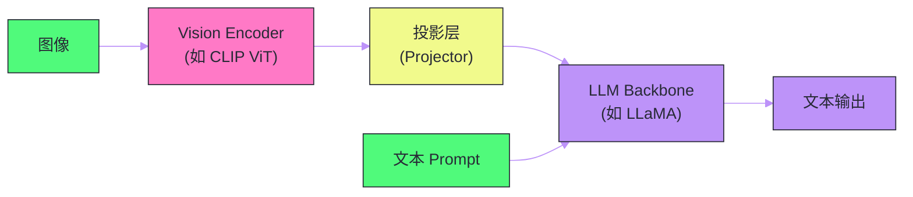

# 08 长上下文与多模态——技术前沿

**摘要：**

本文聚焦大语言模型技术演进的两个最活跃前沿：**长上下文**（从 4K 扩展到 128K 乃至百万级 token）和**多模态**（从纯文本扩展到图像、音频、视频的统一理解与生成）。长上下文的核心挑战是 Self-Attention 的 $O(n^2)$ 计算和显存复杂度——当上下文窗口从 4K 扩展到 128K 时，注意力矩阵的大小膨胀 1024 倍。本文剖析 RoPE 位置编码外推、稀疏注意力、线性注意力、Ring Attention 等关键技术。多模态方面，本文分析 Vision Encoder 的集成架构（LLaVA/GPT-4V 范式）、CLIP 对比学习的跨模态对齐原理，以及语音和视频理解的技术路线。

---

## 第 1 章 长上下文：为什么需要更长的窗口

### 1.1 上下文窗口的意义

上下文窗口（Context Window）是 LLM 一次能处理的最大 token 数量。它决定了模型能"看到"多少信息来生成回答。

| 上下文长度 | 能容纳的内容 | 典型应用 |
| :--- | :--- | :--- |
| 4K token | ~3,000 字 / ~6 页 | 简单问答、短对话 |
| 32K token | ~24,000 字 / ~50 页 | 长文档摘要、多轮对话 |
| 128K token | ~96,000 字 / ~200 页 | 整本书分析、代码库理解 |
| 1M token | ~750,000 字 / ~1500 页 | 多文档综合、长视频理解 |

在 Agent 和 RAG 场景中，长上下文尤为重要：Agent 需要在对话历史、工具调用结果、检索文档等大量上下文中进行推理；RAG 系统检索到的多个文档片段可能总计数万 token。上下文窗口的限制直接约束了这些应用的能力。

### 1.2 $O(n^2)$ 的根本挑战

在 [[01 从 RNN 到 Transformer——注意力机制的革命]] 中我们分析过，Self-Attention 的核心计算 $QK^T$ 产生一个 $n \times n$ 的注意力矩阵（$n$ 为序列长度），计算复杂度为 $O(n^2 d)$，显存复杂度为 $O(n^2)$。

当 $n$ 从 4K 增长到 128K（32 倍），注意力矩阵从 $4K \times 4K = 16M$ 个元素增长到 $128K \times 128K = 16.4B$ 个元素——**膨胀了 1024 倍**。BF16 下，128K 序列的注意力矩阵单层就需要约 32 GB 显存——这还只是一层的一个注意力头。

因此，长上下文技术的核心目标是：**在不显著牺牲模型质量的前提下，降低长序列下的计算和显存需求**。

---

## 第 2 章 位置编码外推——让模型"看到"更远

### 2.1 问题定义

大多数模型在预训练时使用固定长度的上下文（如 LLaMA 预训练上下文 4096 token）。当推理时输入长度超过预训练长度时，位置编码面临**外推**（Extrapolation）问题——模型从未见过的位置编码会导致注意力计算失常，输出质量急剧下降。

### 2.2 RoPE 的长度外推技术

[[RoPE]]（Rotary Position Embedding）是当前主流 LLM 的位置编码方案。它通过旋转角度 $\theta_i = 10000^{-2i/d}$ 对 Q 和 K 施加位置相关的旋转。外推的关键在于：当位置 $m$ 超过训练时的最大位置 $L$ 时，旋转角度 $m \cdot \theta_i$ 变得非常大，可能超出模型训练时见过的范围。

**Position Interpolation（PI，Meta 2023）**：最简单的外推方案——将位置索引**线性缩放**到训练范围内。如果训练上下文是 4K，推理时要用 32K，就将所有位置除以 8（$32K / 4K$）：

$$m' = m \cdot \frac{L_{\text{train}}}{L_{\text{target}}}$$

这样所有位置编码都落在训练范围内。PI 需要少量的微调数据（约 1000 步）来适应缩放后的位置分布。

**NTK-aware Scaling**：PI 均匀缩放所有频率维度，但高频维度（$\theta_i$ 大的维度，编码局部位置关系）和低频维度（$\theta_i$ 小的维度，编码全局位置关系）对缩放的敏感度不同。NTK-aware Scaling 通过调整基础频率 $b$（将 $10000$ 替换为更大的值）来非均匀地缩放不同频率，保护高频维度不被过度压缩。

**YaRN（Yet another RoPE extensioN）**：结合了 NTK-aware Scaling 和注意力分布的温度调整，是当前效果最好的 RoPE 外推方案之一。它在不同频率维度上使用不同的插值/外推策略，最大程度保留了模型在不同尺度上的位置感知能力。

**Dynamic NTK**：推理时根据实际输入长度动态选择缩放因子——短输入不缩放，长输入按需缩放。这避免了短输入被不必要的缩放干扰。

| 方法 | 外推能力 | 是否需要微调 | 质量损失 |
| :--- | :--- | :--- | :--- |
| 无处理（直接外推） | 差 | 否 | 严重 |
| **PI** | 中（~8x） | 少量微调 | 轻微 |
| **NTK-aware** | 好（~16x） | 可选 | 轻微 |
| **YaRN** | 好（~32x+） | 少量微调 | 极小 |
| **Dynamic NTK** | 好 | 否 | 轻微 |

### 2.3 长上下文预训练

更彻底的方案是直接在长上下文数据上进行预训练或继续预训练。LLaMA 2 支持 4K 上下文，LLaMA 3 通过在长文本上继续训练扩展到 128K。

长上下文预训练的关键挑战是**训练数据**——互联网上的大部分文本不到 4K token，真正的长文本（完整书籍、长代码文件、长对话记录）相对稀缺。需要精心收集和构造长上下文的训练数据。

---

## 第 3 章 高效注意力——降低 $O(n^2)$ 的复杂度

### 3.1 Flash Attention：硬件感知的精确注意力

在 [[06 推理优化——KV Cache、量化与投机解码]] 中我们提到了 Flash Attention。它不改变注意力的数学结果，而是通过**分块（Tiling）计算**和**IO 感知的内存管理**来避免在 HBM 中存储完整的 $n \times n$ 注意力矩阵。

Flash Attention 的核心思想是：将 Q/K/V 分块后在 SRAM（片上高速缓存，约 20MB）中完成注意力计算，只将最终结果写回 HBM。通过在线 Softmax 归一化技巧（逐块计算并增量更新归一化因子），无需先计算完整的注意力矩阵再做 Softmax。

Flash Attention 将显存从 $O(n^2)$ 降到 $O(n)$，实际速度提升 2-4 倍。Flash Attention 2 进一步优化了 GPU 的 warp 级调度和 Q/K 分块策略，Flash Attention 3 利用了 Hopper GPU 的异步 TMA（Tensor Memory Access）指令。

Flash Attention 是长上下文实用化的关键基础——没有它，128K 上下文在显存上就不可行。

### 3.2 稀疏注意力（Sparse Attention）

$O(n^2)$ 的完整注意力矩阵中，很多位置的注意力权重实际上接近零——一个 token 通常只与序列中少数相关位置有显著交互。稀疏注意力的思想是：**只计算可能有显著权重的位置对，跳过其余位置**。

**Sliding Window Attention**（Mistral 使用）：每个 token 只关注其周围固定窗口内的 token（如前后各 2048 个）。窗口外的 token 不计算注意力。计算复杂度从 $O(n^2)$ 降低到 $O(n \cdot w)$（$w$ 为窗口大小）。

Sliding Window 的一个关键洞察是：虽然每层只看窗口内的 token，但通过多层堆叠，信息可以逐层传播到更远的位置——$L$ 层模型的有效感受野为 $L \times w$。32 层 × 4096 窗口 = 128K 的有效上下文。

**Dilated/Strided Attention**：在窗口基础上加入"跳步"关注——除了关注近邻，还以固定间隔关注远处的 token（如每隔 128 个 token 采样一个）。这让模型既有局部细节，又有全局概览。

**Mixture of Sparse Attention**：不同的注意力头使用不同的稀疏模式——有的头用小窗口关注局部，有的头用大窗口或全局注意力关注远处。这类似于 CNN 中的多尺度感受野。

### 3.3 线性注意力与 Mamba

更激进的方案是将注意力的 $O(n^2)$ 复杂度降低到 $O(n)$——**线性复杂度**。

**线性注意力**的核心思路是用核函数近似 Softmax：

$$\text{Attention}(Q, K, V) = \text{softmax}(QK^T)V \approx \phi(Q)(\phi(K)^T V)$$

通过先计算 $\phi(K)^T V$（$d \times d$ 矩阵），再左乘 $\phi(Q)$，计算顺序的改变使复杂度从 $O(n^2 d)$ 降低到 $O(nd^2)$——当 $d \ll n$ 时，这是线性的。

**Mamba / State Space Models（SSM）** 提供了另一种线性复杂度的序列建模方案——基于状态空间模型而非注意力。Mamba（Gu & Dao, 2023）通过选择性的状态空间机制（根据输入动态调整状态转移矩阵），在长序列任务上接近甚至匹配 Transformer 的性能，且推理时间与序列长度成线性关系。

然而，纯 Mamba/线性注意力在大规模预训练中还未能完全替代标准 Transformer——**Hybrid 架构**（混合 Attention 和 Mamba 层）是当前的折中方案。Jamba（AI21 Labs）和 Zamba（Zyphra）就是这种混合架构的代表。

> [!note] 设计哲学
> 长上下文技术的演进体现了一个权衡：**全局注意力质量最好但 $O(n^2)$ 不可扩展，稀疏/线性注意力可扩展但可能牺牲长距离依赖的建模质量**。Flash Attention 通过硬件优化将全局注意力的实际代价降到可接受的范围，使得 128K 上下文在工程上可行。更长的上下文（百万级）可能需要稀疏或混合方案。

### 3.4 Ring Attention：跨设备的长序列处理

当序列长度超过单块 GPU 的显存容量时（如 1M token 的 KV Cache 可达数百 GB），需要将序列分片到多块 GPU 上。

**Ring Attention**（Liu et al., 2023）将输入序列分成块，分布到环形排列的多块 GPU 上。每块 GPU 只持有一个块的 Q 和本地 K/V。通过在环上"传递" K/V 块（每一步将 K/V 发送给下一块 GPU），每块 GPU 逐步与所有 K/V 块完成注意力计算。总显存分摊到所有 GPU 上，单卡只需 $O(n/P)$ 的显存（$P$ 为 GPU 数量）。

Ring Attention 使得百万级上下文在工程上成为可能——Google 的 Gemini 1.5 声称支持 1M 甚至 10M token 的上下文。

---

## 第 4 章 长上下文的评估：Needle in a Haystack

### 4.1 评估挑战

长上下文模型的评估比短上下文模型更困难——传统的 NLP 基准（如 MMLU、ARC）使用的输入长度很短，无法反映模型在长序列上的表现。

### 4.2 Needle in a Haystack 测试

最流行的长上下文评估方法是 **"大海捞针"（Needle in a Haystack）** 测试：

1. 在一段很长的无关文本（"干草堆"）中，在某个特定位置插入一条关键信息（"针"）
2. 在文本末尾提问关于这条关键信息的问题
3. 测试模型能否正确检索到这条信息

通过在不同的序列长度（4K 到 128K）和不同的插入位置（开头/中间/末尾）进行系统测试，可以绘制一个**热力图**——横轴是序列长度，纵轴是插入位置，颜色表示检索成功率。

理想的长上下文模型应该在所有长度和位置上都保持高检索率。实际测试发现，许多模型存在 **"Lost in the Middle"** 问题——对插入在序列中间位置的信息检索率明显低于开头和末尾。

### 4.3 其他长上下文基准

| 基准 | 评估内容 | 序列长度范围 |
| :--- | :--- | :--- |
| **RULER** | 多种检索和推理任务 | 4K-128K |
| **LongBench** | 中英文长文档理解 | 2K-32K |
| **InfiniteBench** | 超长上下文理解 | 100K+ |
| **SCROLLS** | 多种长文档任务 | 数千到数万 |

---

## 第 5 章 多模态 LLM——从文本到万物

### 5.1 多模态的动机

人类的世界不是纯文本的——我们通过视觉、听觉、触觉等多种感官理解世界。纯文本 LLM 无法处理图表、照片、视频、音频等丰富的信息形式，这严重限制了它的应用场景。

多模态 LLM 的目标是：**让 LLM 能够理解和生成多种模态的信息**，最常见的是 Vision-Language 模型（理解图像 + 文本）。

### 5.2 多模态 LLM 的通用架构

几乎所有多模态 LLM 共享一个通用的架构模式：

三大核心组件：

1. **Vision Encoder**：将图像编码为一组"视觉 token"（向量序列）。通常使用预训练的 [[CLIP]] ViT（Vision Transformer）或 SigLIP
2. **Projector（投影/对齐层）**：将视觉 token 映射到 LLM 的 embedding 空间。可以是简单的线性层或一个小型 MLP
3. **LLM Backbone**：接收文本 token 和视觉 token 的混合序列，按标准的自回归方式生成文本输出

这个架构的优雅之处在于：**对 LLM 来说，视觉 token 和文本 token 没有本质区别**——它们都是 embedding 空间中的向量，LLM 的注意力机制同等对待它们。模型需要学习的只是"如何将视觉信息有效地编码为 LLM 能理解的 token"。

### 5.3 CLIP——跨模态对齐的基石

CLIP（Contrastive Language-Image Pre-training，OpenAI 2021）是大多数多模态 LLM 使用的 Vision Encoder 的基础。

**训练方式**：CLIP 使用**对比学习**——给定一批（图像, 文本描述）对，训练模型使匹配的图文对在嵌入空间中距离近，不匹配的距离远。

$$\mathcal{L} = -\frac{1}{N}\sum_{i=1}^{N}\left[\log\frac{\exp(\text{sim}(v_i, t_i)/\tau)}{\sum_{j=1}^{N}\exp(\text{sim}(v_i, t_j)/\tau)}\right]$$

其中 $v_i$ 是图像 $i$ 的嵌入，$t_i$ 是对应文本的嵌入，$\text{sim}$ 是余弦相似度，$\tau$ 是温度参数。

CLIP 在 4 亿个（图像, 文本）对上训练，学到了强大的跨模态对齐能力。它的 ViT（Vision Transformer）将图像切分为 $14 \times 14$ 或 $16 \times 16$ 的 patch，每个 patch 对应一个视觉 token，最终输出一组视觉 token 序列。

### 5.4 LLaVA——开源多模态 LLM 的标杆

**LLaVA（Large Language and Vision Assistant）**（Liu et al., 2023）是开源多模态 LLM 的代表性工作，架构简洁高效：

- Vision Encoder：CLIP ViT-L/14（预训练冻结）
- Projector：两层 MLP
- LLM：LLaMA/Vicuna

**两阶段训练**：

**阶段 1：视觉-语言对齐预训练**。使用 595K 的图文对数据，只训练 Projector（冻结 Vision Encoder 和 LLM）。目标是让 Projector 学会将视觉 token 映射到 LLM 能理解的空间。

**阶段 2：端到端指令微调**。使用 150K 的多模态指令数据（如"描述这张图片""图中有几个人"），训练 Projector 和 LLM（或只训练 LoRA）。让模型学会根据图像和文本指令生成回答。

LLaVA 的成功证明了多模态 LLM 的关键在于**对齐**而非**从头训练**——利用已有的强大 Vision Encoder（CLIP）和 LLM（LLaMA），只需训练一个轻量级的对齐层就能获得优秀的多模态能力。

### 5.5 GPT-4V/o 与 Gemini——闭源多模态前沿

**GPT-4V（Vision）**：OpenAI 的多模态 LLM，支持图像输入。技术细节未公开，但已知支持高分辨率图像、图表理解、文字识别（OCR）、复杂的视觉推理。

**GPT-4o**：进一步统一了文本、图像和音频的理解与生成，实现了端到端的多模态对话——可以直接"听"用户说话并用语音回复，而非传统的 ASR → LLM → TTS 流水线。

**Gemini（Google）**：原生多模态设计——从预训练阶段就同时处理文本、图像、音频、视频数据，而非先训练纯文本 LLM 再接入视觉模块。Gemini 1.5 Pro 支持 1M token 的上下文，可以处理长达一小时的视频。

| 模型 | 视觉输入 | 音频输入 | 上下文长度 | 特色 |
| :--- | :--- | :--- | :--- | :--- |
| GPT-4V | 图像 | 否 | 128K | 强大的视觉推理 |
| GPT-4o | 图像 | 音频 | 128K | 端到端多模态，实时语音 |
| Gemini 1.5 Pro | 图像/视频 | 音频 | 1M | 原生多模态，超长上下文 |
| Claude 3.5 Sonnet | 图像 | 否 | 200K | 视觉理解 + 长上下文 |
| LLaVA-1.6 | 图像 | 否 | 32K | 开源标杆 |
| Qwen-VL-2 | 图像/视频 | 否 | 32K | 开源，中文优化 |

---

## 第 6 章 视觉理解的关键技术问题

### 6.1 分辨率与 token 数量

标准 CLIP ViT 将图像切分为固定大小的 patch（如 $14 \times 14$ 像素），$224 \times 224$ 的图像产生 $16 \times 16 = 256$ 个视觉 token。

但实际应用中的图像分辨率远高于 $224 \times 224$——一张手机照片可能是 $4000 \times 3000$。直接将高分辨率图像缩放到 $224 \times 224$ 会丢失大量细节（如图中的小字、远处的人脸）。

**Dynamic Resolution**（LLaVA-1.6, Qwen-VL 等采用）：将高分辨率图像切分为多个 $224 \times 224$ 的 tile，每个 tile 独立编码，再加上一个缩略图（全局信息）。一张 $896 \times 896$ 的图像会被切成 $4 \times 4 = 16$ 个 tile，产生 $16 \times 256 = 4096$ 个视觉 token。

更多视觉 token 意味着更好的细节理解，但也消耗更多的上下文窗口和计算资源——这是一个精度与效率的权衡。

### 6.2 视觉 Token 压缩

4096 个视觉 token 可能占据了大部分上下文窗口，留给文本的空间不足。**视觉 Token 压缩**技术试图用更少的 token 表示图像：

- **Perceiver Resampler**（Flamingo 使用）：用一组固定数量（如 64 个）的可学习查询 token，通过 Cross-Attention 从视觉 token 中提取信息。输出固定长度的视觉 token，不受图像分辨率影响
- **Q-Former**（BLIP-2 使用）：类似 Perceiver，但使用了更复杂的 Querying Transformer 架构

### 6.3 视觉定位与理解

除了整体理解（"图中有什么？"），更高级的视觉能力包括：

- **视觉定位（Grounding）**：将自然语言描述映射到图像中的具体区域（Bounding Box）
- **OCR/文字识别**：识别图像中的文字（如文档、路标、表格）
- **图表理解**：解读柱状图、折线图、表格中的数据和趋势
- **空间推理**：理解物体之间的空间关系（"苹果在桌子上"）

这些能力需要更精细的训练数据和更高的图像分辨率支持。

---

## 第 7 章 音频与视频模态

### 7.1 语音理解

将语音集成到 LLM 中的主流方式是：

**流水线方式**：ASR（语音识别，如 Whisper）→ 文本 → LLM → 文本 → TTS（语音合成）。简单但延迟高（需要等 ASR 完成），且丢失了语音中的副语言信息（语调、情感、停顿）。

**端到端方式**（GPT-4o）：直接将音频波形编码为 token，与文本 token 一起输入 LLM。模型可以同时理解语义和副语言信息，实现更自然的对话。延迟更低，因为无需等待完整的 ASR 转录。

### 7.2 视频理解

视频理解面临的核心挑战是**信息量巨大**——一分钟 30fps 的视频有 1800 帧，即使每帧只提取 256 个视觉 token，总计也有 46 万 token。

主流方案是**关键帧采样**：从视频中均匀或智能地采样少量帧（如每秒 1-2 帧），对每帧进行视觉编码后拼接为 token 序列。配合长上下文能力，可以处理数分钟到数十分钟的视频。

Gemini 1.5 的 1M token 上下文使其能处理长达一小时的视频——按每秒 1 帧、每帧 256 个 token 计算，一小时视频约 $3600 \times 256 = 921K$ token。

---

## 第 8 章 Mixture of Experts——多模态的效率之道

### 8.1 MoE 的基本原理

**Mixture of Experts（MoE）** 是支撑大规模多模态模型的关键架构技术。MoE 将 FFN 层替换为多个"专家"网络，每个 token 只激活其中少数几个专家（通常 2 个），其余专家不参与计算。

$$\text{MoE}(x) = \sum_{i=1}^{E} g_i(x) \cdot \text{Expert}_i(x)$$

其中 $g_i(x)$ 是门控网络（Router）输出的权重，对于不被选中的专家，$g_i = 0$。

MoE 的优势在于：**模型总参数量可以很大（存储丰富的知识），但每个 token 的实际计算量与小模型相当**。例如 Mixtral-8x7B 有 46.7B 总参数，但每个 token 只激活 12.9B——计算量与 13B 密集模型相当，但性能接近 70B 模型。

### 8.2 MoE 与多模态

在多模态 LLM 中，MoE 可以让不同的专家"专注"于不同的模态——有的专家擅长处理视觉 token，有的擅长文本 token。这种自动的"分工"使模型在处理多模态输入时更高效。

---

## 第 9 章 总结与展望

### 9.1 长上下文技术路线总结

| 层次 | 技术 | 效果 |
| :--- | :--- | :--- |
| **位置编码** | PI / NTK / YaRN | 扩展位置外推能力 |
| **硬件优化** | Flash Attention 2/3 | 降低实际显存和延迟 |
| **稀疏注意力** | Sliding Window / Dilated | 降低理论复杂度 |
| **线性模型** | Mamba / Linear Attention | $O(n)$ 复杂度 |
| **分布式** | Ring Attention / TP | 跨设备分摊显存 |
| **KV Cache 优化** | GQA / KV 量化 / PagedAttention | 减少 KV 缓存开销 |

### 9.2 多模态发展趋势

1. **端到端原生多模态**：从"LLM + 外接 Encoder"走向预训练阶段就融合多模态数据的原生架构
2. **多模态生成**：不仅理解图像/音频，还能生成图像/音频/视频（如 GPT-4o 的语音生成、DALL-E 的图像生成）
3. **统一模态表示**：所有模态（文本/图像/音频/视频/3D）用统一的 token 表示，由同一个 Transformer 处理
4. **具身智能（Embodied AI）**：将多模态 LLM 与物理世界连接——机器人通过视觉和语言理解执行任务

### 9.3 LLM 原理专栏回顾

至此，本专栏 8 篇文章完成了从 LLM 基础到前沿的完整知识链路：

| 篇章 | 主题 | 核心知识点 |
| :--- | :--- | :--- |
| [[01 从 RNN 到 Transformer——注意力机制的革命]] | 架构基础 | RNN/LSTM → Attention → Self-Attention |
| [[02 GPT 架构——Decoder-Only 的自回归语言模型]] | 模型设计 | Causal Mask, Tokenizer, RoPE, GPT 演进 |
| [[03 预训练——数据、算力与 Scaling Law]] | 训练基础 | 数据清洗, 分布式训练, Chinchilla Law |
| [[04 指令微调与 RLHF——从基座模型到对话助手]] | 对齐技术 | SFT, RLHF (PPO), DPO |
| [[05 参数高效微调——LoRA、QLoRA 与 Adapter]] | 高效训练 | LoRA 低秩分解, QLoRA 4-bit 训练 |
| [[06 推理优化——KV Cache、量化与投机解码]] | 推理加速 | KV Cache, GPTQ/AWQ, 投机解码 |
| [[07 模型部署与 Serving——vLLM、TensorRT-LLM 与 Triton]] | 工程部署 | vLLM, PagedAttention, 生产架构 |
| [[08 长上下文与多模态——技术前沿]] | 技术前沿 | RoPE 外推, Flash Attention, CLIP, LLaVA |

读者现在可以转入 [[Agent开发技术]] 专栏，学习如何基于 LLM 构建具有工具调用、推理规划和自主决策能力的智能 Agent 系统。

---

## 参考文献

1. Chen et al., "Extending Context Window of Large Language Models via Positional Interpolation", arXiv 2023
2. bloc97, "NTK-Aware Scaled RoPE", Reddit/GitHub 2023
3. Peng et al., "YaRN: Efficient Context Window Extension of Large Language Models", ICLR 2024
4. Dao, "FlashAttention-2: Faster Attention with Better Parallelism and Work Partitioning", ICLR 2024
5. Gu & Dao, "Mamba: Linear-Time Sequence Modeling with Selective State Spaces", arXiv 2023
6. Liu et al., "Ring Attention with Blockwise Transformers for Near-Infinite Context", ICLR 2024
7. Radford et al., "Learning Transferable Visual Models From Natural Language Supervision", ICML 2021 (CLIP)
8. Liu et al., "Visual Instruction Tuning", NeurIPS 2023 (LLaVA)
9. Li et al., "BLIP-2: Bootstrapping Language-Image Pre-training with Frozen Image Encoders and Large Language Models", ICML 2023
10. Fedus et al., "Switch Transformers: Scaling to Trillion Parameter Models with Simple and Efficient Sparsity", JMLR 2022

---

> [!note] 思考题
> 1. 长上下文模型（如 Gemini 1.5 的 1M token 窗口）通过改进位置编码（RoPE NTK-aware 外推）和注意力机制（Ring Attention、Sparse Attention）实现。但'支持长上下文'不等于'有效利用长上下文'——在 128K+ token 的输入中，模型对中间部分的信息检索能力（'Lost in the Middle'问题）明显下降。这个问题的根本原因是什么？RAG 是否比长上下文更适合处理大规模知识检索？
> 2. 多模态模型（如 GPT-4V、LLaVA）将视觉和语言能力统一到一个模型中。图像通过 Vision Encoder（如 ViT）编码为 token 序列，与文本 token 一起输入 LLM。图像 token 的数量（一张图可能占 576 个 token）显著增加了上下文长度。在一个需要同时分析多张高分辨率图片的场景中，上下文窗口和推理成本如何管控？
> 3. 视频理解、语音理解和实时多模态交互（如 GPT-4o 的语音对话）是多模态的前沿方向。实时语音对话要求端到端延迟低于 300ms——传统的'语音转文本 → LLM 生成 → 文本转语音'管道延迟通常在 1-3 秒。端到端多模态模型如何将延迟压缩到可接受的范围？
