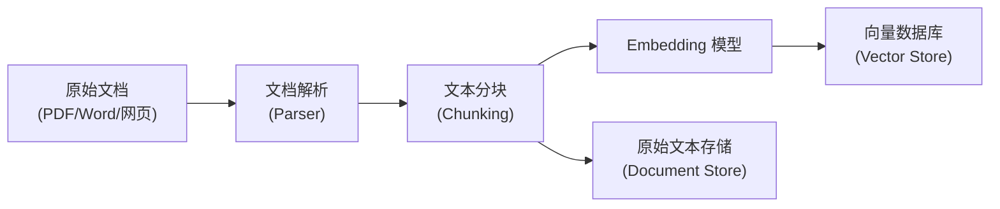
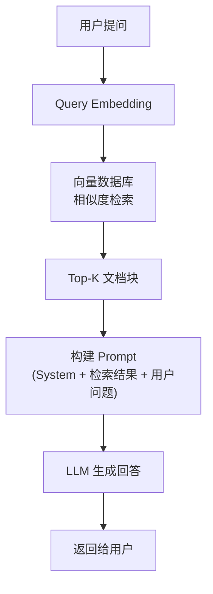
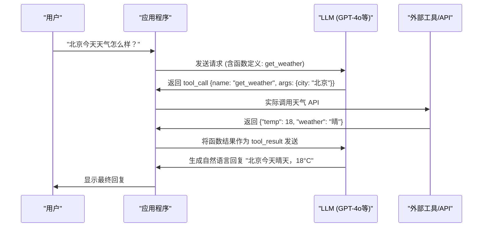
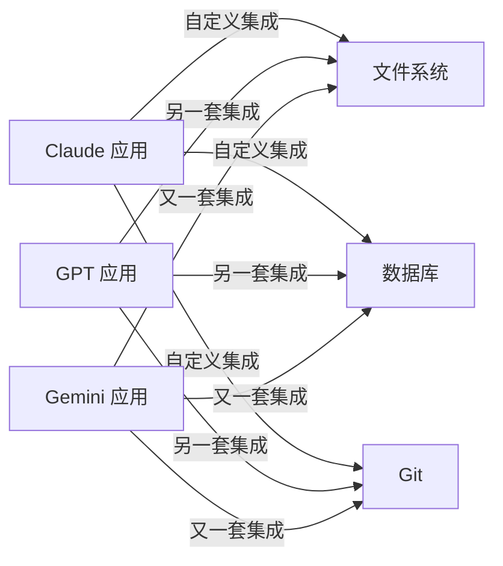
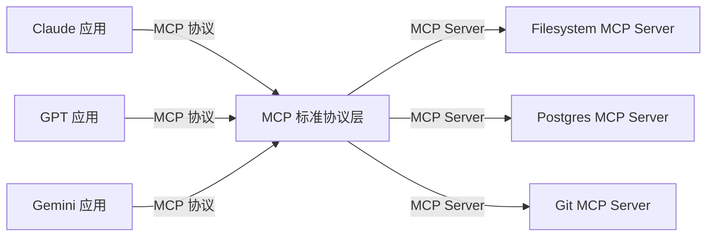
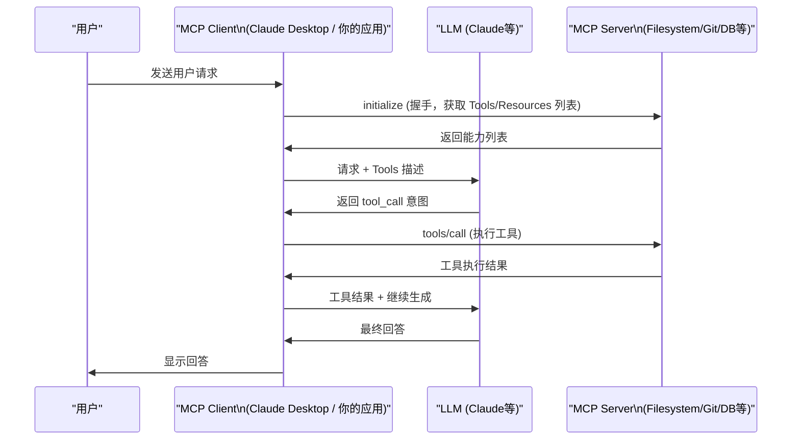
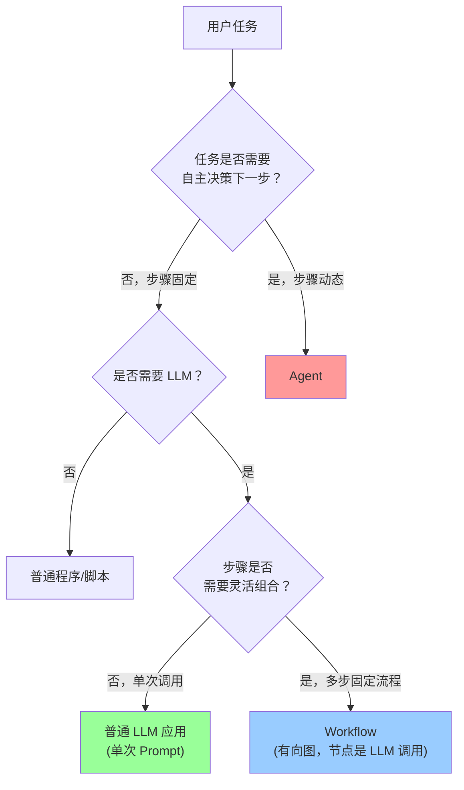
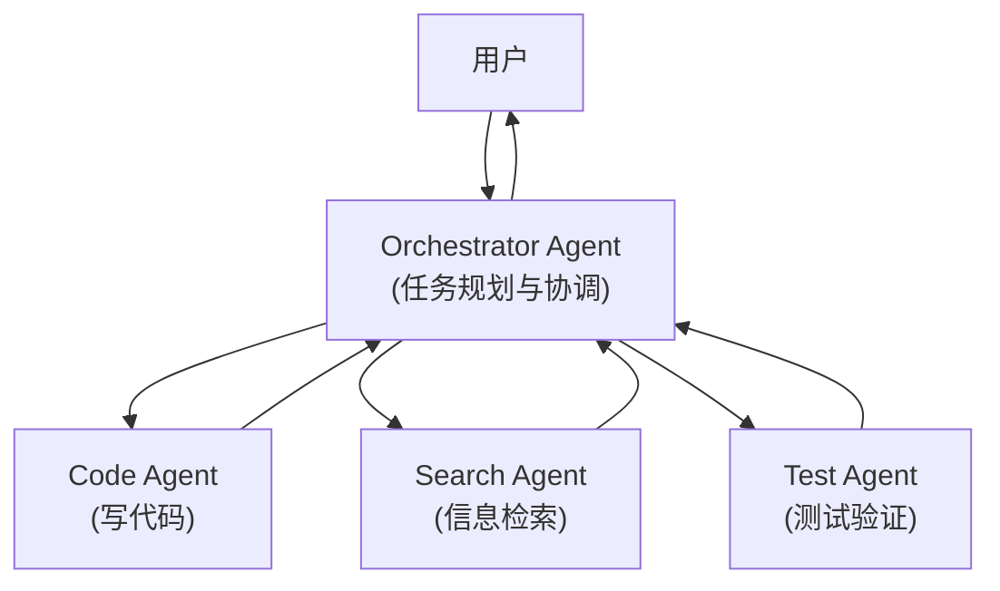
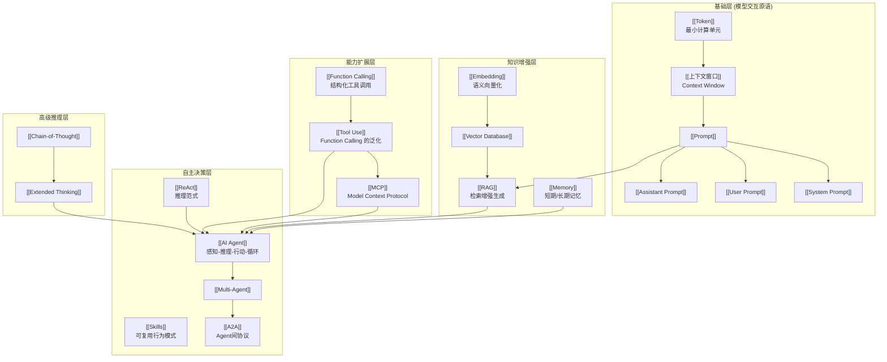
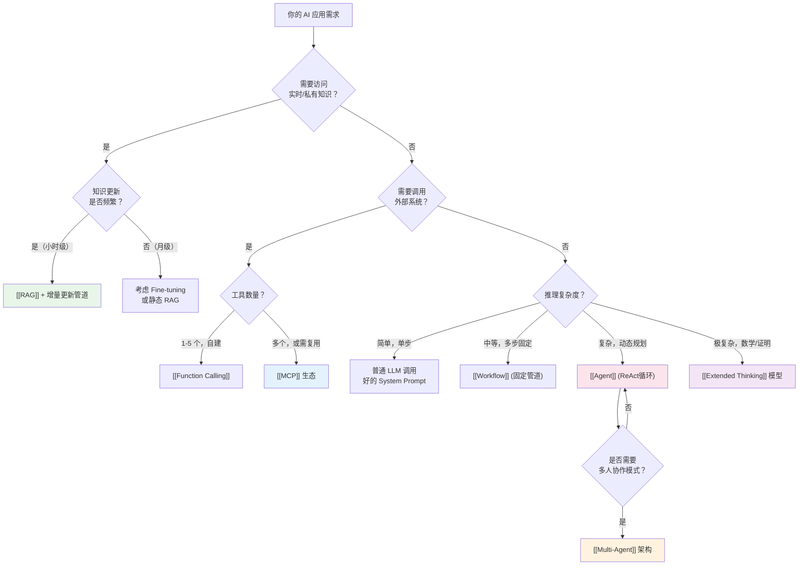

## 摘要

当你打开任何一篇关于大模型的技术文章，扑面而来的是 Prompt、RAG、Agent、MCP、Function Calling、Embedding、CoT、ReAct……这些词汇以惊人的速度生产、传播、被滥用，有时同一个词在不同语境下指向完全不同的东西，有时不同的词描述的其实是同一件事。对于工程师而言，这种话语混乱的代价不是"跟不上潮流"，而是实实在在的工程决策失误——选错架构、浪费算力、写出脆弱的系统。

本文的目标是建立一张清晰的概念地图：**从模型的最小交互原语（Token、Prompt）出发，沿着知识增强（Embedding、RAG、Memory）、能力扩展（Function Calling、Tool Use、MCP）、自主决策（Agent、Multi-Agent、Skills）到高级推理（CoT、Extended Thinking）**，每个概念都按照"是什么 → 为什么出现 → 不这样会怎样 → 如何落地 → 边界与反例"的逻辑展开。读完之后，你应该能在任何场合准确使用这些词，并且能在白板上画出它们之间的关系。

文章面向有一定工程背景的读者，不假设你有深度学习基础，但假设你写过代码、调用过 API、关心系统设计。

---

## 第 1 章 为什么要扫盲：AI名词的"话语混乱"

### 1.1 名词膨胀的速度超过了概念澄清的速度

2022 年底 ChatGPT 发布，到 2026 年初，大模型领域已经累积了数百个专有名词。其中相当一部分来自学术论文（Chain-of-Thought、ReAct、RAG），一部分来自工程实践（Function Calling、System Prompt），一部分来自公司产品命名（Copilot、Assistant、Agent），还有一部分是社区自造的非正式词汇（"幻觉"、"越狱"、"提示词工程师"）。

这些词汇混合在一起有几个典型问题：

**语义漂移**：同一个词在不同公司、不同文档里含义不同。"Agent"在 LangChain 里是一个特定的执行循环，在 OpenAI 的 Assistants API 里是一种托管的对话实体，在 Anthropic Claude 的语境里更接近"能够使用工具自主完成任务的 LLM 应用"，而在学术论文里则特指符合 PEAS 框架（Performance, Environment, Actuators, Sensors）的智能体。

**粒度不统一**：有人在讨论 Token（单词片段级别），有人在讨论 Workflow（系统架构级别），两者相差了五六个抽象层次，但都被放在同一篇"AI实战指南"里平铺列出。

**新词掩盖旧概念**：MCP（Model Context Protocol）本质上是一种 RPC 协议加工具描述规范，但被包装成全新范式，让很多工程师陷入"是不是有什么革命性的东西我没学到"的焦虑。事实上理解了 Function Calling，再看 MCP 不过是十分钟的事情。

**概念重叠**：RAG 和 Memory 的边界在哪里？Tool Use 和 Function Calling 是同一件事吗？Skills 和 Tools 有什么区别？这些问题在很多文章里得不到明确答案，导致工程师在做架构决策时凭感觉猜测。

### 1.2 概念混乱的工程代价

举一个真实的场景：一个团队要为内部知识库构建问答系统。他们听说了 "Agent" 很强大，于是上来就搭了一个带有多个工具调用循环的 Agent 框架，结果系统延迟高、行为不稳定、调试困难。实际上他们的需求用朴素的 RAG 加一个好的 System Prompt 就能解决，根本不需要 Agent。

反过来，另一个团队要做一个能够跨多个数据源查询、汇总报告、发送邮件通知的自动化任务，他们用静态的 RAG 管道来实现，结果系统没有能力根据查询结果动态决定下一步，只能硬编码每个步骤。这里他们其实需要的是 Agent。

**选对工具的前提是理解工具的本质**，而不是追着最新的词汇走。本文就是为这个目的而写的。

### 1.3 本文的阅读建议

本文按照从底层到高层的顺序组织：越靠前的概念越基础，越靠后的概念越依赖前面的基础。如果你是第一次系统梳理这些概念，建议顺序阅读。如果你对某个特定层次有疑问，可以直接跳到对应章节，但请确保你对前置概念已有基本了解。

文中所有关键概念都用 `[[双重中括号]]` 标注，方便在知识图谱中建立链接。架构图使用 Mermaid 绘制，表格使用标准 Markdown 格式。

---

## 第 2 章 基础层：模型交互原语

### 2.1 [[Token]]——LLM 的最小计算单元

#### 是什么

Token 是大语言模型处理文本的最小单位。模型不直接处理字符，也不直接处理单词，而是处理 Token。Token 的划分由分词器（Tokenizer）决定，不同模型使用不同的分词算法。

以 OpenAI 的 cl100k_base 分词器（GPT-4 使用）为例：
- "hello" → 1 个 Token
- "unhappiness" → 3 个 Token（"un"、"happiness" 的子词）
- "中文" → 通常 2-3 个 Token（汉字的 Token 效率低于英文）
- 空格、标点符号也会被计入 Token

> [!info] Token 效率差异
> 同样的信息量，中文通常比英文消耗更多 Token。一个汉字大约对应 1.5-2 个 Token，而一个英文单词平均约 1.3 个 Token。这意味着相同的上下文窗口，英文能放更多内容。这不是中文的劣势，而是分词粒度的差异——新版分词器（如 o200k_base）对中文的 Token 效率有所改善。

#### 为什么出现

模型底层是矩阵运算，输入必须转换为固定大小的数值向量。词汇表如果按字符级别建立，英文只需要 128 个字符，但对中文需要数万个汉字，且无法处理未知词。如果按完整单词建立，词汇表会膨胀到数百万，训练困难。

**子词分词（Subword Tokenization）** 是折中方案：BPE（Byte-Pair Encoding）、WordPiece 等算法将文本切成高频子词，词汇表保持在 3-20 万规模，同时能处理任何文本（未知词会被切成更小的子词，最终退化到字节级别）。

#### 不理解 Token 会怎样

最常见的后果是**成本估算错误**。API 调用按 Token 计费，如果你在设计系统时用"字数"而不是"Token 数"估算成本，误差可能在 2-4 倍之间。另一个常见问题是误解了上下文窗口的容量——"128K Token"不等于"128K 个汉字"。

#### 如何落地

OpenAI 提供了在线 Tokenizer 工具（platform.openai.com/tokenizer），可以直观地看到任意文本被切分成多少 Token。在代码层面，`tiktoken` 库可以精确计算 Token 数量，这在控制上下文窗口填充量时非常有用。

#### 边界与反例

Token 是一个模型内部的概念，不同模型的 Token 计数不可直接比较。"Claude 200K Token 上下文"和"GPT-4o 128K Token 上下文"，因为分词器不同，承载的实际文字信息量不是简单的 200K:128K 的比例关系。

---

### 2.2 [[Prompt]]——模型的"指令语言"

Prompt 是你发给模型的输入文本。听起来简单，但现代 LLM API 的 Prompt 系统有三个不同的角色，混淆它们会导致系统行为不符合预期。

#### 2.2.1 [[User Prompt]]（用户消息）

**是什么**：对话中用户角色发送的消息。在 API 调用中，`role: "user"` 对应的内容。这是你最熟悉的部分——用户在对话框里输入的问题、指令、内容，都是 User Prompt。

**为什么重要**：这是模型感知当前任务的主要输入。User Prompt 的质量直接影响输出质量。但 User Prompt 的局限是它没有持久性——每次对话请求都需要重新构造，适合表达当次请求的具体内容，不适合表达不变的系统级行为要求。

#### 2.2.2 [[System Prompt]]（系统提示词）

**是什么**：在 API 调用中，`role: "system"` 对应的内容，位于对话上下文的最顶部。System Prompt 用于定义模型在整个对话中的角色、行为规则、输出格式要求、知识边界声明等全局约束。

**为什么出现**：最初的语言模型只有单轮文本补全（Text Completion），没有角色区分。RLHF（人类反馈强化学习）训练出的对话模型需要一种机制来区分"对话的上下文背景设定"和"用户的即时请求"。System Prompt 填补了这个空缺。

从模型训练的角度看，System Prompt 的内容在训练中被赋予了更高的权威性——模型被训练成"在遵循 System Prompt 的前提下回应 User Prompt"。这是为什么同样的 System Prompt 能有效约束模型行为的原因。

**不设 System Prompt 会怎样**：模型会使用默认行为，通常是"通用助手"模式。在生产系统中，这意味着：

1. 没有品牌/角色约束，模型可能自称 "ChatGPT" 或 "Claude" 而不是你的产品名
2. 没有输出格式约束，回复风格不一致
3. 没有知识边界声明，模型可能回答超出业务范围的问题
4. 安全边界仅依赖模型默认策略，可能不符合业务场景需要

> [!warning] System Prompt 不是万能的安全墙
> System Prompt 可以有效引导模型行为，但它不是绝对的安全护栏。通过精心设计的 User Prompt（即 Prompt Injection 攻击），恶意用户可能诱导模型忽略 System Prompt 中的部分指令。在处理不可信的用户输入时，不能把安全完全寄托在 System Prompt 上，还需要输入输出的程序级过滤。

**如何设计高质量 System Prompt**：

一个工程上可用的 System Prompt 通常包含以下结构（顺序很重要，模型对前置内容的遵循度更高）：

```
## 角色定义
你是 [产品名] 的 [角色]，专门负责 [职责范围]。

## 能力边界
你只能回答关于 [领域] 的问题。对于超出范围的问题，你应当告知用户 [转接方式]。

## 行为规则
- 始终使用 [语气/语言] 回复
- 回复长度控制在 [范围]
- [具体行为规则1]
- [具体行为规则2]

## 输出格式
[结构化的输出格式说明，必要时提供模板]

## 背景知识
[需要注入的固定知识，如产品文档摘要、特定术语解释等]
```

> [!note] 关于 System Prompt 长度
> System Prompt 过长会消耗宝贵的上下文窗口，且模型对超长 System Prompt 的遵循度会下降（"Lost in the Middle"现象）。建议将静态的、不变的规则放在 System Prompt，将动态的、按请求变化的内容放在 User Prompt 或通过 RAG 动态注入。

#### 2.2.3 [[Assistant Prompt]]（助手预填充）

**是什么**：在 API 调用中，`role: "assistant"` 对应的预填充内容。这是一个较少被提及但在某些场景下极为有用的技巧：在发送请求时，在对话历史的末尾附上一段"助手已经开始回复"的内容，强制模型从这个位置继续生成。

**典型用途**：
- 强制模型以特定格式开头，如 `{"result":` 来保证 JSON 输出
- 跳过模型的"礼貌性开场白"，直接进入内容
- 在 Claude 的 API 中，这对应 `messages` 数组中最后一个 `role: "assistant"` 的消息（不含终止符）

**边界与反例**：Assistant Prompt 预填充并非所有模型 API 都支持。OpenAI 的 Chat Completions API 不允许 `assistant` 角色作为最后一条消息，而 Anthropic Claude API 支持这种模式。此外，预填充的强制性有时会导致模型输出的结构过于僵硬，在需要灵活性的场景下应谨慎使用。

---

### 2.3 [[上下文窗口]]（Context Window）——模型的"工作内存"

#### 是什么

上下文窗口是模型在单次推理时能够"看到"的最大 Token 数量。它包含了这次请求的全部输入：System Prompt + 历史对话 + 当前 User Prompt + 任何注入的文档内容。模型的输出也从这个窗口中读取——生成的每个新 Token 都会被追加到上下文中，供后续生成参考。

你可以把上下文窗口理解为模型的**工作记忆（Working Memory）**：它只记得窗口内的内容，窗口之外的一切对它来说完全不存在。

#### 为什么有限制

从技术根源看，Transformer 架构的注意力机制（Self-Attention）的计算复杂度是 O(n²)，其中 n 是序列长度（Token 数）。序列长度翻倍，计算量翻四倍。这在模型训练阶段是真实的算力瓶颈，在推理阶段同样带来显存占用和延迟的挑战。

长期以来，上下文窗口是大模型的核心竞争指标之一，各家公司持续在扩展这个限制：

| 模型 | 上下文窗口 | 发布时间 |
|------|-----------|---------|
| GPT-3 | 4K Token | 2020 |
| GPT-4 初版 | 8K / 32K | 2023.03 |
| GPT-4o | 128K | 2024.05 |
| Claude 3 Opus | 200K | 2024.03 |
| Claude 3.5 Sonnet | 200K | 2024.06 |
| Gemini 1.5 Pro | 1M | 2024.02 |
| Gemini 1.5 Flash | 1M | 2024.05 |
| Claude（beta） | 1M | 2024.11（beta） |

> [!info] "能看到"不等于"真的理解"
> 上下文窗口大不代表模型能有效利用其中的全部信息。实验表明，模型对上下文开头和结尾的内容的关注度显著高于中间部分（"Lost in the Middle"效应，Nelson Liu et al., 2023）。即使是 1M Token 的窗口，中间位置的关键信息仍然可能被模型"忽略"。

#### 超出上下文窗口会怎样

API 调用会返回错误（`context_length_exceeded`）。在流式生成（Streaming）场景下，如果你没有控制好输入长度，请求会在超出限制前就失败。更隐蔽的是，如果你用了某些框架自动截断上下文，被截掉的可能是最重要的历史信息。

#### 如何在有限窗口内组织信息

基于"Lost in the Middle"效应，信息组织有几个实用原则：

**原则 1：最重要的内容放首尾**
- System Prompt（开头）：角色设定、核心规则
- 关键文档或数据（靠近对话末尾）：最相关的参考信息
- 当前 User Prompt（最末）：模型最后读到的内容

**原则 2：用结构标记划定信息边界**
```
<documents>
<doc id="1" title="公司政策手册">
...
</doc>
</documents>
```
XML 风格的标签（尤其是 Claude 推荐的风格）帮助模型识别信息块的边界，提升对长文档的检索准确率。

**原则 3：长对话需要主动压缩**
当对话历史超过窗口的 60-70% 时，应当用模型自身对历史对话做摘要（Summary），将摘要替换原始历史，释放窗口空间。这是一种有损压缩，损失的是细节，保留的是关键信息和状态。

---

## 第 3 章 知识增强层：让模型"知道更多"

大模型的知识来自预训练数据，有两个天然的局限：**知识截止日期**（训练数据的时间边界）和**私有数据盲区**（公司内部文档、个人数据从未出现在训练集中）。本章介绍的三个概念都是为了打破这两个限制。

### 3.1 [[Embedding]]——把文字变成数字

#### 是什么

Embedding（嵌入）是将文本（词、句子、段落）映射到高维向量空间的技术。一段文字被 Embedding 模型处理后，变成一个浮点数数组，通常维度在 768 到 3072 之间。

关键属性：**语义相似的文本，在向量空间中距离近**。

```
"苹果公司发布了新款 iPhone" → [0.23, -0.15, 0.87, ...]  (维度 1536)
"Apple released a new iPhone" → [0.24, -0.14, 0.86, ...]  (距离很近)
"今天天气不错" → [-0.45, 0.72, -0.33, ...]              (距离很远)
```

这个距离可以用余弦相似度或内积来度量。

#### 为什么出现

关键词搜索（BM25、TF-IDF）只能匹配字面上相同的词，无法处理同义词、近义词、跨语言查询。Embedding 把"语义相似"这个模糊的人类概念转化为了可以精确计算的几何距离，让机器能够理解"苹果手机"和"iPhone"是同一件事。

#### 如何落地

主流 Embedding 模型：

| 模型 | 提供方 | 向量维度 | 特点 |
|------|--------|---------|------|
| text-embedding-3-small | OpenAI | 1536 | 性价比高 |
| text-embedding-3-large | OpenAI | 3072 | 质量更高 |
| embed-v3.0 | Cohere | 1024 | 支持多语言 |
| BGE 系列 | BAAI | 768/1024 | 开源，中文效果好 |
| m3e-base | 开源 | 768 | 专为中文优化 |

Embedding 生成后通常存入向量数据库（[[Vector Database]]），如 Pinecone、Weaviate、Qdrant、pgvector（PostgreSQL 插件）。

#### 边界与反例

Embedding 只捕捉语义相似性，不捕捉逻辑关系。"猫吃鱼"和"鱼吃猫"在向量空间中可能很接近（因为涉及相同实体），但语义截然相反。对于需要理解逻辑结构的任务，仅用向量相似度检索是不够的。

---

### 3.2 [[RAG]]（检索增强生成）——"开卷考试"的本质

#### 是什么

RAG（Retrieval-Augmented Generation）是一种在模型生成回答前，先检索相关外部知识并注入上下文的技术范式。模型不需要"背下"所有知识，而是在被提问时"查阅"相关资料后再回答——正如开卷考试。

#### 朴素 RAG 的完整流程

**离线阶段**（数据准备）：



**在线阶段**（查询回答）：



#### 为什么 RAG 比 Fine-tuning 更常用

Fine-tuning（微调）是另一种让模型"知道更多"的方法：在预训练模型上继续训练，让它学习特定领域的知识。RAG 和 Fine-tuning 的核心差异：

| 维度 | RAG | Fine-tuning |
|------|-----|-------------|
| 知识更新成本 | 低（更新向量库即可） | 高（需重新训练） |
| 时效性 | 实时（知识库随时更新） | 滞后（训练周期较长） |
| 知识可追溯性 | 高（可引用原文） | 低（知识融入权重） |
| 幻觉风险 | 较低（有参考原文） | 较高（可能混淆训练数据） |
| 所需数据量 | 少（文档导入即可） | 多（需要高质量标注数据） |
| 适合场景 | 知识库问答、文档检索 | 风格迁移、特定格式输出 |

> [!note] Fine-tuning 的正确使用场景
> Fine-tuning 不擅长注入新知识，但擅长调整模型的行为模式、输出风格、特定格式的遵循能力。如果你需要模型以特定的 JSON schema 输出，或者模拟某种特定的写作风格，Fine-tuning 比 RAG 更合适。两者并不互斥，高端系统通常同时使用。

#### RAG 的局限

**检索噪声**：相似度检索返回的 Top-K 文档块未必都是真正相关的。当检索召回了错误的文档，模型会基于错误信息生成看似合理的错误回答，这比"我不知道"更危险。

**多跳推理问题**：有些问题需要跨越多个文档、多个推理步骤才能回答，例如"A 公司的 CEO 在读大学时的导师是谁"。朴素 RAG 单次检索找到"A 公司 CEO 是张三"，再检索"张三的大学导师是李四"，需要两跳。朴素 RAG 无法自动完成这种链式检索，需要更复杂的 Agentic RAG 或 Graph RAG。

**时效性**：虽然 RAG 本身支持实时更新知识库，但如果数据管道（文档摄取、Embedding、索引更新）有延迟，新信息不会立即可查询。对于需要秒级新鲜度的场景，RAG 也需要配合实时搜索工具。

**Chunking 策略的影响**：文档分块的粒度直接影响检索质量。块太小，单个块缺乏足够上下文；块太大，一个块里的无关信息会稀释相关信号。没有放之四海皆准的 Chunking 策略，需要根据文档类型和查询模式调整。

---

### 3.3 [[Memory]]——让模型"记住你"

#### 是什么

Memory 是让模型在跨越上下文窗口、跨越多个会话之间，保留用户相关信息的机制。它解决的问题是：每次新开一个对话，模型都是"失忆"的，它不知道你上次告诉过它你喜欢简洁的回答、你是一个 Go 语言工程师、你的公司叫 XX。

#### 短期记忆（In-Context Buffer）

**是什么**：对话历史直接放在上下文窗口中，这是最直接的"记忆"形式。在 Chat Completions API 中，你把历史消息数组完整发给模型，模型就能"记得"本次对话发生了什么。

**局限**：上下文窗口是有限的。长对话会消耗完窗口，此时需要滚动删除旧消息（会丢失信息）或做摘要压缩（会损失细节）。

#### 长期记忆（External Memory Store）

**是什么**：将需要跨会话保留的信息存储在外部数据库，在每次新对话开始时检索相关记忆注入 System Prompt 或上下文。存储的内容可以是：
- 用户画像（偏好、背景、技能水平）
- 历史事件摘要（"用户上周完成了 XX 项目部署"）
- 实体信息（"用户的服务器 IP 是 10.0.0.1"）

**实现方式**：
1. 向量数据库存储记忆片段，用语义检索取出相关记忆
2. 结构化数据库存储键值对形式的用户属性
3. 图数据库存储复杂的实体关系记忆（如 MemGraph、Neo4j）

**典型产品**：OpenAI 的 Memory 功能（ChatGPT Plus）、Mem0（开源记忆框架）、Zep（面向 Agent 的记忆服务）。

#### 记忆 vs RAG 的区别

这是一个常见的混淆点：

| 维度 | Memory | RAG |
|------|--------|-----|
| 存储对象 | 关于用户/对话的信息 | 关于世界/领域的文档 |
| 更新触发 | 对话过程中自动提取 | 文档导入或定时更新 |
| 查询主体 | "我需要记住的关于这个用户的信息" | "回答这个问题需要的背景知识" |
| 典型内容 | 用户偏好、历史行为、个人背景 | 产品文档、知识库、法规文件 |

本质区别是**面向谁**：Memory 是关于"这个特定用户"的个人化信息，RAG 是关于"这个领域"的通用知识。在复杂 Agent 系统中，两者通常同时存在。

---

## 第 4 章 能力扩展层：让模型"做更多"

前面三章讨论的是如何让模型"知道更多"——扩充它的知识边界。本章讨论的是如何让模型"做更多"——让模型不只是生成文字，还能与外部世界交互：调用 API、执行代码、查询数据库、控制外部系统。

### 4.1 [[Function Calling]]——模型的"手"

#### 是什么

Function Calling 是一种让 LLM 在生成回复时，能够声明"我需要调用某个函数，参数是这些"的机制。模型本身不执行函数，它只输出一个结构化的"调用意图"，由外部程序（调用方）实际执行函数，再将结果反馈给模型，最终由模型生成最终回答。

#### 执行流程时序图



注意这个流程中，LLM 进行了**两次推理**：第一次决定"需要调用哪个函数、参数是什么"，第二次基于函数返回结果"生成最终回答"。这是 Function Calling 的核心机制——模型不执行，只决策。

#### 与普通 Prompt 的本质区别

| 维度 | 普通 Prompt 输出 | Function Calling 输出 |
|------|-----------------|----------------------|
| 输出类型 | 自由文本 | 结构化 JSON（函数名 + 参数） |
| 可程序化处理 | 需要文本解析（不稳定） | 直接反序列化，稳定可靠 |
| 参数校验 | 无 | 模型参照 JSON Schema 生成 |
| 典型用途 | 聊天、写作、分析 | 工具调用、系统集成 |

在 Function Calling 出现之前，工程师需要在 Prompt 里要求模型"输出 JSON 格式"，然后用 `json.loads()` 解析，失败了再重试。这个方法脆弱、不稳定、Token 浪费。Function Calling 把结构化输出能力内置到模型推理层，从根本上解决了这个问题。

#### 如何落地

定义一个 Function 的标准结构（以 OpenAI 格式为例）：

```json
{
  "type": "function",
  "function": {
    "name": "get_weather",
    "description": "获取指定城市的当前天气信息",
    "parameters": {
      "type": "object",
      "properties": {
        "city": {
          "type": "string",
          "description": "城市名称，如'北京'、'上海'"
        },
        "unit": {
          "type": "string",
          "enum": ["celsius", "fahrenheit"],
          "description": "温度单位"
        }
      },
      "required": ["city"]
    }
  }
}
```

> [!warning] Function Description 的质量直接影响调用准确率
> 模型根据 `description` 字段判断何时调用哪个函数、传什么参数。描述模糊的函数会导致模型误调用或参数错误。好的 Function Description 应当说明：这个函数做什么、什么情况下调用它、参数的含义和格式要求。这和写代码注释是同样的道理。

#### 边界与反例

Function Calling 不适合以下场景：
- 函数执行时间长（>10 秒），会导致用户等待时间过长
- 函数有严重副作用（发送邮件、扣款、删除数据），需要在模型调用前加入人工确认步骤
- 函数数量超过 20-30 个，模型选择正确函数的准确率会显著下降，需要改用工具路由（Tool Router）层

---

### 4.2 [[Tool Use]]——Function Calling 的泛化

#### Tool 和 Function Calling 的关系与区别

"Tool Use"是比 Function Calling 更广泛的概念。Function Calling 特指 OpenAI 定义的、以 JSON Schema 描述函数的具体实现方式。Tool Use 则泛指模型使用任何外部工具的能力，不限于特定 API 格式。

Anthropic Claude 早期使用的 XML 标签格式调用工具，与 OpenAI 的 JSON Schema 格式不同，但都属于 Tool Use。现在行业正在向 OpenAI 的格式靠拢，Anthropic 也兼容了类似的格式。在当前（2026 年初）的实践中，两个词基本可以互换，但在阅读历史文档时需要注意版本差异。

#### 常见工具类型

| 工具类型 | 典型示例 | 主要用途 |
|---------|---------|---------|
| 搜索工具 | Brave Search、Bing API、Tavily | 获取实时信息 |
| 代码执行 | Python REPL、Code Interpreter | 数学计算、数据处理 |
| 数据库查询 | SQL 执行器、MongoDB 查询 | 结构化数据检索 |
| 文件系统 | 读写本地文件、列目录 | 文档处理 |
| API 调用 | REST API、GraphQL | 集成外部服务 |
| 浏览器控制 | Playwright、Puppeteer | 网页操作 |
| 向量检索 | RAG 检索工具 | 知识库查询 |

> [!note] 工具的数量和粒度设计
> 工具的粒度是一个关键设计决策。太细粒度（一个工具只做一件极小的事）会导致模型需要多次调用才能完成任务，增加延迟和错误累积风险。太粗粒度（一个工具做很多事）会让模型难以精确控制行为。经验法则：单个工具应当对应一个有意义的"操作原子"，有明确的输入输出契约。

---

### 4.3 [[MCP]]（Model Context Protocol）——工具连接的"USB 标准"

#### 为什么需要 MCP

在 MCP 出现之前，每个 LLM 应用想要集成外部工具，都需要为每个工具写专门的集成代码：OpenAI Plugin、LangChain Tool、Claude Tool——每种框架各有各的格式，工具无法在框架间复用。

用 Mermaid 图对比：

**没有 MCP 的世界**：



N 个应用 × M 个工具 = N×M 种集成，每种都要维护。

**有了 MCP 的世界**：



N 个应用 + M 个工具 = N+M 种接入，各自只需实现一次。

MCP 由 Anthropic 于 2024 年 11 月发布，本质上是一套基于 JSON-RPC 2.0 的协议规范，定义了 LLM 应用（Client）如何发现和调用外部工具服务器（Server）。

#### MCP 的三个核心概念

**Tools（工具）**：模型可以调用的函数，等同于前面介绍的 Function Calling。Tool 有名称、描述、输入 Schema。调用时，Client 把用户请求发给 LLM，LLM 决定调用哪个 Tool，Client 把调用请求转发给 MCP Server 执行。

**Resources（资源）**：MCP Server 暴露的可读数据，类似于 REST API 的 GET 端点。资源有 URI 标识（如 `file:///home/user/document.txt` 或 `postgres://localhost/mydb/users`），Client 可以主动请求读取资源内容并注入上下文。Resources 解决了工具无法主动推送数据的问题。

**Prompts（提示词模板）**：MCP Server 预定义的 Prompt 模板，可以包含参数。这让工具开发者能够打包经过验证的 Prompt，供 Client 直接调用，而不需要用户自己构造复杂的 Prompt。

#### MCP Server 和 MCP Client 的关系



MCP 的通信方式支持两种传输层：
- **stdio**：通过标准输入输出通信，适合本地进程间通信（Claude Desktop 默认方式）
- **HTTP + SSE**：通过 HTTP 协议通信，适合远程服务部署

#### 目前 MCP 生态举例

截至 2026 年初，官方和社区已有数百个 MCP Server，典型代表：

| MCP Server | 功能 | 典型使用场景 |
|-----------|------|------------|
| Filesystem | 本地文件读写、目录操作 | 代码编辑、文档处理 |
| Git | 仓库查询、提交历史 | 代码审查、变更分析 |
| PostgreSQL | SQL 查询、Schema 检查 | 数据库问答 |
| Brave Search | 实时网页搜索 | 获取最新信息 |
| GitHub | Issues、PR、代码搜索 | 开发辅助 |
| Slack | 发送消息、查询频道 | 工作流自动化 |
| Puppeteer | 浏览器控制 | 网页抓取 |
| Memory | 知识图谱记忆存储 | 跨会话记忆 |

> [!info] MCP 的当前局限
> MCP 是 2024 年 11 月才发布的新协议，截至 2026 年初仍在快速演进。几个需要注意的点：安全模型尚不完善（Server 可以访问的权限粒度较粗）；标准化程度虽高于此前，但各实现间仍有细节差异；动态 Tool 发现（运行时注册新 Tool）的标准化尚未完成。

---

## 第 5 章 自主决策层：Agent 体系

前几章的技术是"增强工具"——RAG 让模型更博学，Function Calling 让模型能行动，MCP 让工具连接更规范。但这些工具的使用方式，在大多数实现中仍然是**由人来规划步骤**：用户问一个问题，系统执行一次检索，模型给一个回答，结束。

Agent 要解决的问题是**让模型自主规划和执行多步任务**，无需人在每一步介入。

### 5.1 [[AI Agent]]——能自主完成任务的"程序"

#### 是什么

AI Agent 是一种以 LLM 为核心推理引擎、能够自主感知环境、规划行动、执行工具调用、循环迭代直到完成目标的程序架构。

#### Agent 的四要素

**感知（Perception）**：Agent 接收输入的能力。输入可以是用户的文字指令、环境的状态（当前目录、数据库状态）、工具执行的结果、其他 Agent 的消息。感知层决定了 Agent"看到了什么"。

**推理（Reasoning）**：LLM 的核心能力，将感知到的信息转化为行动计划。现代 Agent 普遍采用 **[[ReAct]]**（Reasoning + Acting）范式：

```
Thought: 我需要先查询用户的账户余额，再决定是否可以执行转账
Action: query_account_balance(user_id="12345")
Observation: 余额为 500 元
Thought: 余额充足，可以执行 100 元的转账
Action: execute_transfer(from="12345", to="67890", amount=100)
Observation: 转账成功，交易 ID: TXN-ABC123
Thought: 任务完成
Final Answer: 已成功将 100 元转账至目标账户，交易 ID 为 TXN-ABC123
```

ReAct 范式的核心是让模型显式地"思考"（Thought），而不是直接跳到动作，这大幅提升了复杂任务的成功率和可解释性。

**行动（Action）**：Agent 实际执行的操作。可以是调用工具（Function Calling / Tool Use）、写入文件、发送 HTTP 请求、控制浏览器，甚至委托给另一个 Agent。

**循环（Loop）**：Agent 的关键特征是循环执行，而不是单次推理。每次行动后，环境状态改变，Agent 重新感知新状态，再次推理，再次行动，直到达成目标条件或触发终止策略。

#### Agent vs Workflow vs 普通 LLM 应用的边界



**普通 LLM 应用**：单次 Prompt → 单次回复，无循环，无工具。例：文本润色、内容生成。

**Workflow**：多个 LLM 调用按固定有向图执行，步骤顺序预先定义，每个节点的输入输出格式固定。例：文档 → 摘要 → 翻译 → 格式化报告的流水线。Workflow 的优点是可预测、易调试；缺点是缺乏灵活性，不能应对意外情况。

**Agent**：LLM 动态决定下一步是什么，循环执行，直到任务完成。优点是能处理开放性任务；缺点是行为不可预测、调试困难、存在失控风险。

> [!warning] 不要过度使用 Agent
> Agent 适合处理**步骤不固定、需要根据中间结果动态调整**的任务。对于步骤明确的任务，用 Workflow 反而更好：更可靠、更易观测、更容易在出错时恢复。盲目把所有任务都 Agent 化，是当前行业的常见过度工程问题。

---

### 5.2 [[Multi-Agent]]——协作完成复杂任务

#### 是什么

Multi-Agent 是多个 AI Agent 协作完成一个复杂任务的系统架构。单个 Agent 的上下文窗口有限，专注领域有限，当任务足够复杂时（如开发一整个软件产品），多个专门化 Agent 分工协作是合理的解决方案。

#### 常见 Multi-Agent 拓扑

**Master-Sub（主从架构）**：一个 Orchestrator Agent 接收用户任务，将任务分解成子任务，分发给专门化的 Sub-Agent 执行，最后汇总结果。



**Peer-to-Peer（对等协作）**：多个 Agent 平级，通过消息传递协商，适合需要多角度审视问题的场景，如辩论式推理、代码 Review（一个 Agent 写代码，另一个 Agent 批评）。

**Pipeline（管道架构）**：每个 Agent 处理任务的一个阶段，输出作为下一个 Agent 的输入，适合线性的处理流程，如数据清洗 → 分析 → 报告生成。

#### [[A2A]]（Agent-to-Agent）协议简介

A2A 是 Google 于 2025 年提出的 Agent 间通信协议，旨在解决跨框架、跨厂商的 Multi-Agent 系统中 Agent 间如何发现彼此能力、传递任务、交换结果的标准化问题。与 MCP（解决 Agent-工具连接）不同，A2A 解决的是 Agent-Agent 连接问题。

A2A 的核心概念：
- **Agent Card**：每个 Agent 的能力声明文件（类似 OpenAPI Spec），描述它能做什么
- **Task**：Agent 间传递的任务对象，包含输入、状态、输出
- **Push/Pull 通信**：支持同步请求和异步推送两种模式

> [!info] MCP vs A2A 的定位
> MCP 解决的是"Agent 如何使用工具"，A2A 解决的是"Agent 如何与 Agent 协作"。两者互补不互斥。一个完整的 Multi-Agent 系统，可能同时使用 MCP 连接工具，用 A2A 协调 Agent 间通信。

---

### 5.3 [[Skills]]（Claude Code Skills）——可复用的 Agent 行为模式

#### 是什么

Skills 是 Claude Code 体系中的一个概念，指预定义的、可复用的 Agent 行为模式。本质上，一个 Skill 是一段结构化的指令集（通常以 Markdown 文件形式存在），描述了一类特定任务的执行流程、工具调用方式、输出格式等。

在本文所在的知识库（`my-brain`）中，`content/.claude/skills/` 目录下就存放了多个 Skills，如 `daily-report/`（生成日报）、`weekly-init/`（初始化周记）。当用户触发对应指令时，Claude Code 会加载 Skill 的指令，按照预定义的行为模式执行任务。

#### 与 Function/Tool 的区别

| 维度 | Tool / Function | Skill |
|------|----------------|-------|
| 执行主体 | 外部程序（Python函数、API等） | Claude（LLM 本身） |
| 表达方式 | JSON Schema（结构化） | Markdown 指令（自然语言） |
| 适合描述 | 确定性的计算和 I/O 操作 | 判断性的、需要理解上下文的行为 |
| 可修改性 | 需要改代码 | 改 Markdown 文件即可 |
| 抽象层次 | 低（函数级） | 高（任务流程级） |

#### Skills 的应用场景

Skills 最适合描述那些**半结构化、需要 LLM 判断力、但有可重复模式**的任务：

- **日报生成**：读取今日任务完成情况 → 按固定格式汇总 → 写入日记文件
- **Code Review**：检查特定模式 → 给出建议 → 按统一格式输出
- **文档初始化**：根据模板创建标准化文档结构，填充通用内容
- **数据报告**：从数据库或日志文件提取数据 → 分析 → 生成 Markdown 报告

Skills 与 System Prompt 的区别在于粒度：System Prompt 定义 Agent 的全局行为，Skills 定义特定任务的具体执行方式，可以按需加载、组合。

---

## 第 6 章 高级推理层：让模型"想更深"

前面的章节讨论的主要是"输入侧"的增强（更多知识、更多工具）。本章讨论"推理侧"的增强：如何让模型在给出最终答案之前，做更深入、更系统的思考。

### 6.1 [[Chain-of-Thought]]（CoT）——逐步推理

#### 是什么

Chain-of-Thought（思维链）是一种通过在 Prompt 中引导模型展示推理步骤，来提升复杂推理任务准确率的技术。2022 年由 Google Brain 的 Wei et al. 提出，是 LLM 领域影响深远的论文之一。

最简单的 CoT 触发方式是在 Prompt 末尾加上"Let's think step by step"（逐步思考）。对于数学推理、逻辑推理、多步规划等任务，这一简单的引导可以使准确率提升 20-50%。

#### 为什么有效

从信息论的角度，生成推理步骤相当于给模型分配了更多的"计算 Token"。Transformer 的每个前向传播是固定深度的，直接输出答案等于要求模型在固定计算量内完成所有推理。而 CoT 允许模型"边想边写"，每个输出 Token 都可以成为下一步推理的输入，相当于增加了模型能使用的"计算步数"。

#### Few-shot CoT vs Zero-shot CoT

| 类型 | 方式 | 优点 | 缺点 |
|------|------|------|------|
| Few-shot CoT | 在 Prompt 里提供带推理步骤的示例 | 效果好，可控 | 需要设计示例，消耗 Token |
| Zero-shot CoT | 直接说"Let's think step by step" | 简单，无需示例 | 效果略弱 |
| Auto-CoT | 自动生成推理链示例 | 自动化 | 示例质量不稳定 |

#### 边界与反例

CoT 并不总是有益的。对于简单的事实查询（"法国的首都是哪里"），强制 CoT 只会浪费 Token，延长响应时间。CoT 的收益主要体现在多步推理、数学计算、逻辑判断等需要"分解问题"的任务上。

另一个反例是：CoT 展示了推理过程，但这个推理过程未必是模型真正的内部计算过程——它更像是模型学会了"如何表现得像在推理"。这意味着 CoT 提升的是输出质量，而不一定是模型真正的理解深度。

---

### 6.2 [[Extended Thinking]] / [[Reasoning]]——模型的"草稿纸"

#### 是什么

Extended Thinking（或 Reasoning，各家叫法不同）是比 CoT 更深入的推理机制：模型在生成最终回答之前，先在一个**对用户不可见（或半可见）的内部空间**中进行大量的思考、自我批评、反复推演，然后基于这个内部思考生成最终简洁的输出。

#### 支持 Extended Thinking 的模型

| 模型 | 厂商 | 推出时间 | 特点 |
|------|------|---------|------|
| o1 / o1-mini | OpenAI | 2024.09 | 思考过程完全隐藏 |
| o3 / o3-mini | OpenAI | 2025.01 | 增强版，思考量可调 |
| o4-mini | OpenAI | 2025.04 | 高效率推理模型 |
| Claude 3.5 Sonnet (extended thinking) | Anthropic | 2024.10 | 思考过程半可见（thinking block） |
| Claude 3.7 Sonnet | Anthropic | 2025.02 | 深度推理+工具使用 |
| Gemini 2.0 Flash Thinking | Google | 2024.12 | 思考过程可见 |
| DeepSeek-R1 | DeepSeek | 2025.01 | 开源，思考过程可见 |
| QwQ-32B | 阿里 | 2025.03 | 开源推理模型 |

#### Thinking 的本质：采样更多 Token 做内部推理

从机制上看，Extended Thinking 模型在推理时会生成大量"内部 Token"（有时称为 thinking tokens 或 scratchpad tokens），这些 Token 不直接出现在最终回答中，但影响最终回答的生成。

这本质上是在**用更多的计算换取更高的推理质量**——通过增加中间推理步骤（更多的 Token 生成），让模型有机会"回头想想"、"换个角度试试"、"发现自己之前的错误"。

DeepSeek-R1 的技术报告揭示了一个有趣的现象：训练出强推理能力的关键不是特殊的架构，而是让模型在训练过程中学会**使用"想法 Token"来自我纠正**——模型会生成一个答案，然后产生"Wait, let me reconsider..."的内部独白，否定自己的错误推理，重新尝试。

> [!info] Thinking 的成本
> Extended Thinking 消耗的 Token 量远超普通生成，通常是最终回答的 3-10 倍。对于简单任务，这完全不值得。OpenAI 的 o 系列模型支持 `reasoning_effort` 参数（low/medium/high），Anthropic 的 Claude 支持 `budget_tokens` 参数来控制思考 Token 的上限，让开发者在质量和成本之间权衡。

#### 边界与反例

Extended Thinking 不是万能提升器。它在以下任务上提升显著：数学证明、竞赛编程、需要精密逻辑的推理题、复杂的多步规划。但在创意写作、风格模仿、简单问答上，收益不明显，而成本大幅上升。

另一个需要警惕的点是：thinking block 里的内容虽然帮助了推理，但也可能包含模型的"偏见思路"——用于调试时有价值，但不应该被直接呈现给终端用户。

---

## 第 7 章 名词全景总结

### 7.1 概念层次全景图



### 7.2 名词汇总参考表

| 名词 | 层级 | 一句话定义 | 典型工具/产品 |
|------|------|-----------|-------------|
| [[Token]] | 基础层 | LLM 处理文本的最小单位，由分词器切分 | tiktoken, tokenizer |
| [[Prompt]] | 基础层 | 发送给模型的输入文本的总称 | - |
| [[System Prompt]] | 基础层 | 定义模型全局行为的系统级指令 | - |
| [[User Prompt]] | 基础层 | 用户角色发送的即时请求消息 | - |
| [[Assistant Prompt]] | 基础层 | 预填充的助手回复起始内容 | - |
| [[上下文窗口]] | 基础层 | 模型单次推理能处理的最大 Token 数 | - |
| [[Embedding]] | 知识增强层 | 将文本映射到语义向量空间的技术 | text-embedding-3, BGE, m3e |
| [[Vector Database]] | 知识增强层 | 存储和检索向量的专用数据库 | Pinecone, Qdrant, pgvector |
| [[RAG]] | 知识增强层 | 检索外部知识后再生成回答的范式 | LlamaIndex, LangChain |
| [[Memory]] | 知识增强层 | 跨越上下文窗口和会话的信息持久化 | Mem0, Zep |
| [[Function Calling]] | 能力扩展层 | 模型声明调用函数意图的结构化机制 | OpenAI API, Claude API |
| [[Tool Use]] | 能力扩展层 | 模型使用外部工具的泛化能力 | LangChain Tools |
| [[MCP]] | 能力扩展层 | 工具连接的标准协议（Anthropic提出） | MCP SDK, Claude Desktop |
| [[AI Agent]] | 自主决策层 | 以 LLM 为核心的自主任务执行程序 | LangChain Agent, AutoGPT |
| [[ReAct]] | 自主决策层 | 将推理和行动交替执行的 Agent 范式 | - |
| [[Multi-Agent]] | 自主决策层 | 多个 Agent 协作完成复杂任务的架构 | CrewAI, AutoGen |
| [[A2A]] | 自主决策层 | Agent 间通信和协作的标准协议（Google提出） | A2A SDK |
| [[Skills]] | 自主决策层 | Claude Code 中预定义的可复用行为模式 | Claude Code |
| [[Chain-of-Thought]] | 高级推理层 | 通过展示推理步骤提升复杂任务准确率 | - |
| [[Extended Thinking]] | 高级推理层 | 模型在内部进行大量思考后再输出答案 | OpenAI o系列, Claude 3.7 |

### 7.3 一张图理解选型逻辑

最后用一张决策图总结：给定一个 AI 应用场景，应该选用哪些概念/技术：



---

## 结语

从 Token 到 Agent，我们经历了六个层次的概念体系：

1. **基础层**：Token、Prompt（System/User/Assistant）、上下文窗口——这是与模型交互的最底层原语，理解它们是一切的基础
2. **知识增强层**：Embedding、RAG、Memory——解决模型"不知道"的问题，扩展知识边界
3. **能力扩展层**：Function Calling、Tool Use、MCP——解决模型"不能做"的问题，连接外部世界
4. **自主决策层**：Agent（ReAct）、Multi-Agent（A2A）、Skills——解决需要"自主规划"的问题
5. **高级推理层**：CoT、Extended Thinking——解决"想不深"的问题，提升推理质量

这张图谱不是终点。大模型领域的演进速度决定了一年后会有新的概念出现，某些当前热门的词汇会被更好的替代方案取代。但概念的**本质问题**是稳定的：模型怎么接受输入、怎么扩充知识、怎么连接工具、怎么自主行动、怎么深度推理——这五个问题在可预见的未来都会存在，无论它们被包装在什么新词汇之下。

理解了这张图谱，你就能在每次看到新词汇时问自己：这个新概念解决的是这五个维度中的哪一个问题？它是真正的范式突破，还是换了包装的已知技术？

这种批判性的思维方式，比记住一百个名词更有价值。
