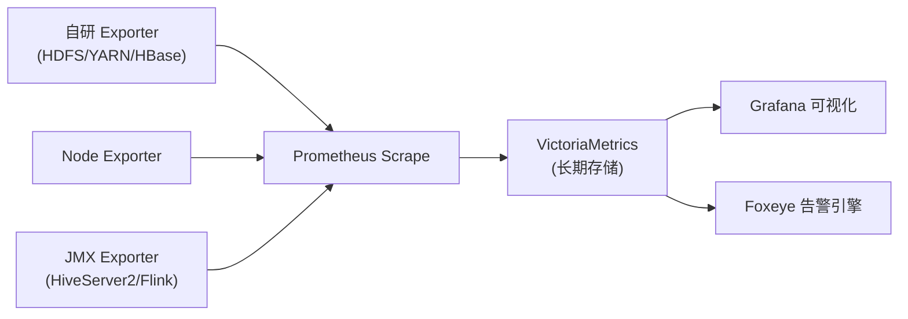
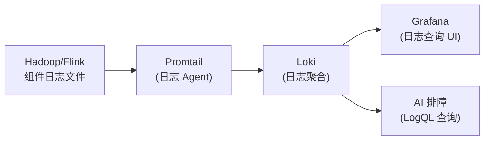
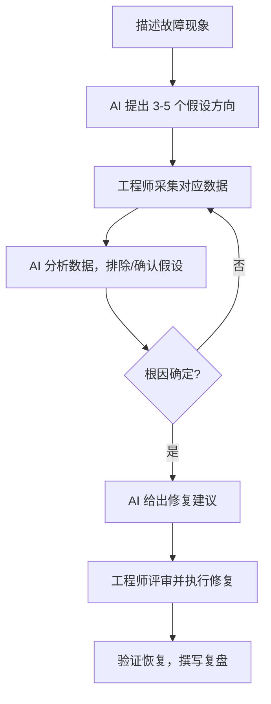
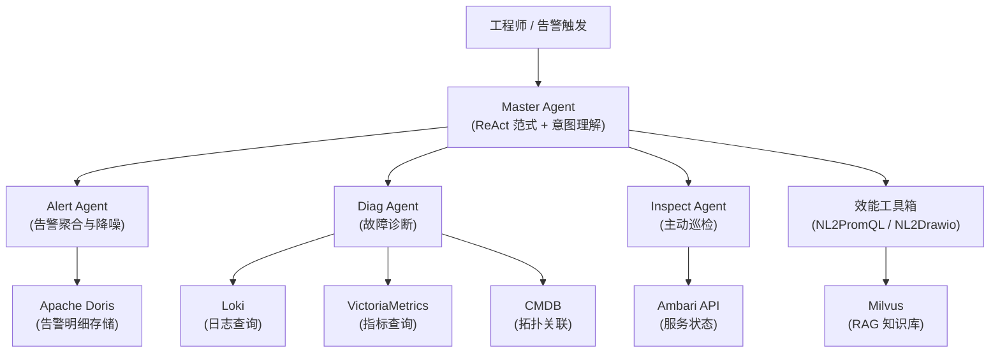

## 摘要

大数据集群的故障排查长期依赖资深工程师的经验积累，面临信息分散、经验孤岛、告警噪声三大顽疾。本文从实战视角系统梳理如何将大语言模型引入集群运维排障流程，覆盖内部代理服务接入、可观测工具体系、排障方法论、真实案例复盘与进阶 AIOps 架构五大主题。文章不追求"AI 万能"的乐观主义，而是聚焦人机协作的边界——哪些环节 AI 能显著提效，哪些环节仍需工程师主导判断。所有案例均来自生产环境真实故障，NameNode 长 GC、HiveServer2 文件描述符泄漏、Flink Savepoint 磁盘打满，每一个案例都附有传统排查路径与 AI 辅助路径的详细对比。目标读者为负责 [[Hadoop]]、[[Flink]]、[[Spark]] 等大数据组件日常运维的 SRE 与平台工程师。

---

## 第 1 章 接入内部模型服务

在展开排障方法论之前，必须先把"工具"架好。我们团队维护了一套内部代理服务，统一封装了多家模型提供商的 API，对内屏蔽密钥管理、网络出口等细节。本章介绍如何将各类 AI 工具接入这套代理服务。

### 1.1 内部代理服务 BaseURL

所有内部模型的使用，**必须**将 BaseURL 替换为内部代理地址：

```
https://aix.panther.sohurdc.com
```

> [!warning]
> 禁止在本地环境直连 Anthropic 或 DeepSeek 的官方 API。一方面存在网络出口管控，另一方面官方 Key 的费用由团队统一承担，避免个人账户越权使用。代理层还集成了审计日志，便于追溯问题 Prompt。

### 1.2 可用模型清单

下表列出当前代理服务支持的所有模型及其关键参数，供按场景选型。

| 模型 ID | 上下文窗口 | 最大输出 | 适用场景 |
|---|---|---|---|
| claude-haiku-4-5 | 200K | 64K | 快速低延迟任务：分类、内容审核、sub-agent 执行 |
| claude-sonnet-4-5 | 200K | 64K | 日常编程、数据分析、日志分析、多步骤工作流 |
| claude-sonnet-4-6 | 200K（1M beta） | 128K | 同上，128K 输出版，适合长日志分析 |
| claude-opus-4-5 | 200K | 64K | 复杂架构评审、深度推理、多 agent 编排 |
| claude-opus-4-6 | 200K（1M beta） | 128K | 同上，128K 输出版，适合超长上下文深度推理 |
| panther-v3（deepseek-v3） | 128K | 8K | 无额度限制，高性价比通用任务 |
| panther-r1（deepseek-r1） | 128K | 64K | 无额度限制，深度推理、复杂代码调试 |

**额度说明**：Claude 系列每天限制 $50；panther 系列（deepseek-v3 / deepseek-r1）无额度限制，可放心用于高频自动化任务。

**个人推荐**（原文照录）：
- 日常编程推荐 **claude-sonnet-4-6**；
- 高吞吐/低成本场景推荐 **panther-v3**；
- 深度推理/反复头脑风暴推荐 **claude-opus-4-6** 或 **panther-r1**；
- 批量/自动化/并行 agent 任务推荐 **claude-haiku-4-5**。

> [!note]
> 排障场景的模型选择原则：初步分析、生成脚本、翻译日志，用 sonnet-4-6 已绰绰有余；遭遇性能 profile 分析、多组件根因推理等需要长链条推理的问题，切换 opus-4-6 或 panther-r1；批量处理大量告警摘要、生成工单，用 haiku-4-5 节省额度。

### 1.3 Claude Code（CC）配置

[[Claude Code]] 是 Anthropic 官方的命令行 AI 编程助手，也是我们团队最常用于排障辅助的终端工具。通过以下环境变量接入内部代理：

```bash
export ANTHROPIC_BASE_URL="https://aix.panther.sohurdc.com"
export ANTHROPIC_API_KEY="your-proxy-key"
export ANTHROPIC_DEFAULT_HAIKU_MODEL="claude-haiku-4-5"
export ANTHROPIC_DEFAULT_OPUS_MODEL="claude-opus-4-6"
export ANTHROPIC_DEFAULT_SONNET_MODEL="claude-sonnet-4-6"
export ANTHROPIC_MODEL="claude-sonnet-4-6"
```

或者在 `~/.claude/settings.json` 的 `env` 字段中设置相同的键值对，效果等同于环境变量。

> [!info]
> 推荐使用开源工具 **cc-switch**（[https://github.com/farion1231/cc-switch](https://github.com/farion1231/cc-switch)）快速切换不同配置 Profile，例如在"省钱模式"（haiku）和"高智能模式"（opus）之间一键切换，避免每次手动修改环境变量。

### 1.4 其他 AI 工具配置

#### Cline（VS Code 扩展）

Cline 不支持通过环境变量注入代理地址，需要在 VS Code 扩展设置 UI 中操作：

- **方案 A（OpenAI Compatible）**：Provider 选 `OpenAI Compatible`，Base URL 填 `https://aix.panther.sohurdc.com/v1`，API Key 填代理 Key，Model ID 填具体模型名称（如 `claude-sonnet-4-6`）。
- **方案 B（Anthropic Provider）**：Provider 选 `Anthropic`，Base URL 填 `https://aix.panther.sohurdc.com`，使用 Anthropic 原生协议，模型选择更直观。

#### OpenCode

在 `opencode.json` 中配置 provider，示例如下：

```json
{
  "providers": {
    "sohuBigdata": {
      "npm": "@ai-sdk/anthropic",
      "baseURL": "https://aix.panther.sohurdc.com/v1",
      "apiKey": "your-proxy-key"
    }
  },
  "models": [
    { "id": "claude-sonnet-4-6", "provider": "sohuBigdata" },
    { "id": "claude-opus-4-6",   "provider": "sohuBigdata" },
    { "id": "claude-haiku-4-5",  "provider": "sohuBigdata" },
    { "id": "panther-v3",        "provider": "sohuBigdata" },
    { "id": "panther-r1",        "provider": "sohuBigdata" }
  ]
}
```

#### OpenClaw

> [!warning]
> OpenClaw 的 Token 消耗量较大，非必要情况**强烈建议**使用 panther-v3，避免消耗 Claude 系列有限的日额度。

在 `~/.openclaw/config.json` 的 `models.providers` 数组中追加：

```json
{
  "name": "sohuBigdata",
  "baseUrl": "https://aix.panther.sohurdc.com/v1",
  "api": "openai-completions",
  "apiKey": "your-proxy-key"
}
```

---

## 第 2 章 为什么大数据集群排障需要 AI 协助

### 2.1 传统排障的三大顽疾

大数据集群通常由数十乃至数百个节点、十几个核心组件（[[HDFS]]、[[YARN]]、[[HBase]]、[[Hive]]、[[Flink]]、[[Spark]]、[[ZooKeeper]]……）共同构成。一次典型的线上故障，可能牵涉多个组件的日志、多套监控系统的指标，以及分散在各处的配置文件。传统人工排障在这套体系下面临三大顽疾：

**顽疾一：信息高度分散**

排查一个 HiveServer2 慢查询，工程师需要同时打开：Ambari 服务状态页、[[Prometheus]]/[[VictoriaMetrics]] 的 Grafana 面板、[[Loki]] 日志查询界面、YARN ResourceManager UI 的 Application 详情页，以及 Hive 自身的 `hive.log`。这些系统使用不同的查询语言（PromQL、LogQL、SQL）、不同的时间戳格式，手动关联耗时费力。

**顽疾二：经验孤岛**

老工程师的排障经验存在于头脑、私有笔记、或散落在各处的 Confluence 页面里。新人面对一个从未见过的报错，只能依赖搜索引擎和 Google Groups，命中率参差不齐。当值班老工程师休假时，这种经验缺口会直接拉长 MTTR（平均故障恢复时间）。

**顽疾三：告警噪声**

以我们团队的告警迁移背景为例：原有 [[Zabbix]] 告警体系历经多年积累，存在大量粒度粗糙、阈值不合理的规则。在告警高峰期，一次批量作业失败可以触发数十条告警轰炸，而真正需要人工干预的往往只有 1-2 条。迁移到 [[Foxeye]]（基于[[夜莺 Nightingale]]）后，告警规则需要全面梳理，而这个过程本身也是一项繁重的人工任务。

### 2.2 AI 辅助排障的本质

AI 大模型在排障场景中能发挥作用，本质上依赖三种能力：

1. **上下文聚合**：将来自不同系统、不同格式的信息（日志片段、指标截图描述、配置 diff、报错堆栈）整合到同一个对话上下文中进行关联分析。
2. **知识检索与匹配**：预训练数据中包含大量开源项目的 Issue、Stack Overflow 回答、技术博客，可以快速匹配"类似报错在历史上被如何解决"。
3. **结构化推理**：将散乱的现象整理为"假设→验证→排除"的逻辑链条，避免人工排查时的发散思维。

但需要清醒地认识到：**AI 不能替代工程师的系统权限、不能自主执行命令、不能感知网络物理拓扑**。AI 是一位拥有广博知识的"远程顾问"，而不是能在生产环境上直接操作的执行者（除非你专门构建了带 Tool-Use 权限的 Agent 系统）。

### 2.3 适合 AI 的排障任务 vs 不适合的

| 维度 | 适合 AI 协助 | 不适合/需谨慎 |
|---|---|---|
| 错误解读 | 解析 JVM OOM stacktrace、GC 日志、Flink exception chain | 硬件层故障（磁盘坏道、网卡硬件问题）需物理检查 |
| 日志分析 | 从 10000 行日志中提取关键错误模式 | 日志量超出上下文窗口时需先过滤 |
| 脚本生成 | 生成诊断脚本（lsof、jstack、hdfs dfsadmin）| 生成的脚本必须人工审查再执行 |
| 配置建议 | 推荐 JVM 参数、YARN 内存配置 | 推荐值需结合实际负载压测验证 |
| 根因推理 | 多现象关联分析（GC+Swap+NUMA）| 涉及业务数据语义的判断（作业逻辑错误）|
| 知识翻译 | Zabbix 规则翻译为 PromQL 表达式 | 翻译结果需要人工验证语义等价性 |
| 报告撰写 | 故障复盘报告、COE 文档初稿 | 最终报告需人工校对事实准确性 |

> [!info]
> 一个实用的判断原则：如果一个排障步骤需要"系统执行权限"或"业务语义理解"，AI 只能辅助，不能主导。如果一个步骤主要是"知识检索"或"信息格式转换"，AI 往往比人工更快更准。

---

## 第 3 章 我们的集群可观测武器库

在介绍如何用 AI 排障之前，必须先了解排障所依赖的信息来源。可观测性体系是 AI 辅助排障的"数据底座"——AI 分析的对象都来自这里。

### 3.1 指标层：Prometheus + VictoriaMetrics

#### 采集链路

我们的指标采集链路如下：



[[Prometheus]] 负责短期抓取和规则评估，[[VictoriaMetrics]] 承担长期存储（默认保留 90 天），并提供 MetricsQL（兼容 PromQL 的扩展语言）查询接口。相比原生 Prometheus，VictoriaMetrics 在高基数场景下的内存占用和查询速度均有显著优势，是我们处理大规模集群指标的首选。

#### 常用 PromQL 查询模式

以下是排障中高频使用的 PromQL 模式，也是后文"NL2PromQL"功能的目标输出形式：

**内存压力检测**
```promql
# 节点内存使用率 top 10
topk(10,
  1 - (node_memory_MemAvailable_bytes / node_memory_MemTotal_bytes)
)
```

**GC 停顿时间趋势**
```promql
# HiveServer2 Full GC 停顿时间（秒），5 分钟内最大值
max_over_time(
  jvm_gc_collection_seconds_sum{gc="PS MarkSweep", job="hiveserver2"}[5m]
)
```

**HDFS DataNode 磁盘写入速率**
```promql
# 各 DataNode 磁盘写入速率（MB/s）
rate(node_disk_written_bytes_total{job="node-exporter"}[2m]) / 1024 / 1024
```

**YARN 内存使用率**
```promql
# YARN 集群已用内存占总内存比例
yarn_cluster_metrics_allocated_mb / yarn_cluster_metrics_total_mb
```

> [!note]
> 在与 AI 协作生成 PromQL 时，务必告诉 AI 你的指标名称和 label 体系。AI 的预训练知识中包含通用指标名，但自研 Exporter 的指标名 AI 无从猜测。最佳做法是先执行 `curl -s http://exporter:port/metrics | head -100` 把指标元数据粘贴给 AI，再描述你的查询需求。

### 3.2 日志层：Promtail + Loki

#### 日志采集 Pipeline



[[Promtail]] 以 DaemonSet 或二进制形式部署在各节点，监控日志文件路径并将新增日志流式推送到 [[Loki]]。Loki 采用标签索引而非全文索引，存储成本远低于 Elasticsearch，代价是复杂全文检索性能稍弱，但在结构化日志 + 正则过滤场景下已完全够用。

#### LogQL 基础查询

与 AI 协作时，了解 LogQL 的基本语法能让你更好地描述查询需求：

```logql
# 查询 NameNode 过去 1 小时内包含 "GC" 的日志行
{job="hadoop", component="namenode"} |= "GC"

# 提取 GC 停顿时间并做统计
{job="hadoop", component="namenode"}
  | regexp `GC pause \[G1 .*?\] (?P<duration>[0-9.]+) ms`
  | unwrap duration
  | max_over_time [5m]

# 统计 HiveServer2 ERROR 日志数量趋势
rate({job="hive", component="hiveserver2"} |= "ERROR" [1m])
```

> [!info]
> 将 LogQL 查询的结果（文本片段）复制给 AI 时，建议截取有代表性的 50-200 行，并明确告知时间范围。超长日志直接粘贴会稀释上下文密度，反而降低 AI 的分析质量。

### 3.3 告警层：Foxeye（基于夜莺 Nightingale）

[[Foxeye]] 是团队基于开源 [[夜莺 Nightingale]] 二次开发的告警平台，对接 VictoriaMetrics 数据源，支持 PromQL/MetricsQL 告警规则。相比原有的 Zabbix 体系，Foxeye 的主要优势在于：

- **规则即代码**：告警规则以 JSON/YAML 形式管理，可纳入版本控制。
- **多维度抑制**：支持基于标签的告警抑制、静默、依赖关系管理，有效降低告警风暴。
- **事件关联**：同一时间窗口内同标签的告警自动聚合，减少工程师的认知负担。

从 Zabbix 向 Foxeye 迁移告警规则，是团队 AI 应用的重要落地场景之一，详见第 6 章。

### 3.4 集群管理层：Ambari

[[Ambari]] 作为集群生命周期管理平台，提供：

- **服务状态概览**：各组件（NameNode、ResourceManager、HiveServer2 等）的健康状态、启停操作。
- **配置管理**：集中化的配置修改与历史版本对比（Config History），排查因配置变更引入的问题时极为有用。
- **Ambari Metrics（AMS）**：内置轻量指标系统，作为 Prometheus 的补充，尤其在 Prometheus Exporter 未覆盖的组件上提供基础健康指标。

在 AI 辅助排障时，Ambari 的配置 diff 功能非常有价值——当怀疑是配置变更引起故障时，可以将变更前后的配置差异提供给 AI 进行分析。

### 3.5 作业层：YARN ResourceManager UI + Spark History Server

对于作业级别的故障（OOM、Shuffle 超时、数据倾斜），排查的主战场是：

- **[[YARN]] ResourceManager UI**：查看 Application 的 Container 分配情况、日志入口、队列资源使用。
- **[[Spark]] History Server**：事后分析 Spark 作业的 Stage/Task 执行时间、Shuffle Read/Write 量、GC 时间。
- **Flink Web UI / History Server**：查看 JobGraph、CheckPoint 状态、算子反压（Backpressure）情况。

这三个系统的信息形态以结构化表格和图形为主，适合截取关键数据后提供给 AI 进行解读。

---

## 第 4 章 AI 辅助排障的方法论

工具就位之后，方法论决定 AI 能发挥多大效用。本章总结三套核心方法，是团队在数十次实战中沉淀的经验。

### 4.1 黄金三问法：AI 的排障对话框架

排障对话的核心是**逐步缩小假设空间**。AI 的知识是广博的，但如果你一开始只给它一条模糊的报错信息，它只能给出泛泛的可能方向。黄金三问法强迫排障者按顺序提供信息，让每轮对话都有实质进展。

**第一问：收集现象（What happened?）**

将第一手观察结构化为一个完整的故障描述，包含以下要素：
- 故障发现时间（尽量精确到分钟）
- 第一发现源（告警/用户反馈/主动巡检）
- 受影响范围（哪些组件/哪些作业/哪些用户）
- 初步观察到的异常指标或报错

示例：
```
故障时间：2026-03-10 14:23 开始
发现来源：Foxeye 触发 NameNode RPC 延迟告警（>500ms）
受影响范围：所有 HDFS 读写操作延迟升高，部分 YARN 作业挂起
初步观察：NameNode JVM heap 使用率 92%，GC 频率增加
```

**第二问：提供上下文（What does the data say?）**

在第一轮对话中，AI 会给出 2-5 个可能的方向。针对每个方向，你需要去采集对应的数据，然后将数据回馈给 AI。这一步的关键是**数据的质量高于数量**：

- 提供具体的指标数值，而非"高了一些"这样的描述
- 日志片段要包含时间戳，且覆盖故障发生前后各 5-10 分钟
- 配置信息要完整，不要省略"看起来不相关"的参数

**第三问：验证假设（Is the hypothesis correct?）**

AI 提出假设后，工程师需要设计验证步骤（通常 AI 也会给出验证命令），执行后将结果反馈给 AI。这是一个迭代过程，通常需要 2-4 轮才能定位根因。



### 4.2 Prompt 工程在排障中的应用

#### 角色设定：为 AI 设定"资深大数据 SRE"角色

System Prompt 的质量直接决定对话质量。在排障场景中，推荐使用以下角色设定作为基础：

```
你是一名拥有 10 年经验的大数据平台 SRE，精通 Hadoop、Flink、Spark、Hive、HBase 生态的运维和故障排查。
你熟悉 JVM 调优（G1/ZGC/Parallel GC）、Linux 内核参数（vm.swappiness、transparent_hugepage、NUMA）、网络诊断（tc、ss、netstat）。
你的排障风格是：先从系统层面（OS/JVM/网络）确认基础指标，再看组件层面，最后看业务层面。
你善于从日志和指标中发现规律，而不是凭直觉猜测。
当你不确定时，你会明确说出"需要更多数据"，并告诉我应该收集哪些数据。
```

#### 信息结构化：如何把日志/指标格式化提供给 AI

原始日志粘贴给 AI 时，效果往往不理想，因为日志中充满了 AI 处理时不必要的噪声（时间戳格式差异、重复的正常信息等）。推荐的格式化方式：

```markdown
## 故障上下文

**时间范围**：2026-03-10 14:20 - 15:00

**关键指标**（来自 Grafana / VictoriaMetrics）：
- NameNode JVM Heap 使用率：从 70% 上升到 92%（14:23 开始）
- GC 停顿时间：Full GC 耗时 从 800ms 增加到 35000ms（14:30 开始）
- NameNode RPC 处理队列长度：从 5 增加到 120+

**关键日志片段**（NameNode GC Log，14:28 - 14:32）：
```
[2026-03-10T14:28:15.234+0800] GC(1452) Pause Full (G1 Evacuation Pause)
[2026-03-10T14:28:15.234+0800] GC(1452) 41111ms（预期 <100ms）
```

**问题描述**：GC 停顿时间突然从正常的 ~5ms 上升到 41000ms，持续约 30 分钟后自行恢复。期间 HDFS 读写严重延迟。

**已排查/已排除**：
- NameNode 未发生 OOM，heap 在 Full GC 后降至 60%
- 磁盘 I/O 正常（排除元数据目录问题）
```

#### 思维链引导：让 AI 逐步分析而不是直接给答案

直接问"这是什么原因"往往得到一个列表式的可能原因，缺乏优先级排序。更有效的提问方式：

```
请按照以下步骤分析：
1. 首先判断这是 GC 配置问题、内存泄漏问题，还是外部干扰问题？
2. 对于你最怀疑的那个方向，需要哪 3 条数据来验证？
3. 如果验证成立，修复步骤是什么？如果不成立，下一个应该排查的方向是什么？
```

### 4.3 工具辅助：NL2PromQL（自然语言转查询）

PromQL 的学习曲线对于非监控专家的开发者和运维新人来说不算低，尤其是在涉及 `rate()`、`histogram_quantile()`、多维 label 过滤的复杂查询时。NL2PromQL 能让工程师用自然语言描述意图，由 AI 生成对应的查询语句。

**实际工作流**：

第一步，收集指标元数据（避免 AI 幻觉）：
```bash
# 将 Exporter 的指标元数据提取出来
curl -s http://namenode-host:9870/metrics | \
  grep -E "^# (HELP|TYPE)" | \
  head -100
```

第二步，将元数据和自然语言需求一起提交给 AI：

```
以下是我的 NameNode Exporter 的指标清单（节选）：
# HELP hadoop_namenode_capacity_total Total raw capacity of DataNodes in bytes
# HELP hadoop_namenode_blocks_total Total number of blocks on NameNode
# HELP hadoop_namenode_missing_blocks Number of missing blocks
# HELP hadoop_namenode_live_data_nodes Number of live DataNodes
...

请帮我写一个 PromQL，查询：
"过去 5 分钟内，任意一个 NameNode 实例的缺失块数量超过 0 的情况，并按主机名分组显示"
```

AI 的典型输出：
```promql
hadoop_namenode_missing_blocks{job="hadoop-namenode"} > 0
```

或者更复杂的场景，统计 DataNode 磁盘使用率并找出超过 85% 的节点：

```promql
(
  hadoop_datanode_dfs_capacity_used
  /
  hadoop_datanode_dfs_capacity
) * 100 > 85
```

> [!note]
> NL2PromQL 生成的查询需要在非生产环境先验证语义正确性，然后再用于告警规则。AI 对于跨 job 的 label 匹配、subquery 等高级用法有时会出错，验证环节不能省略。

---

## 第 5 章 真实案例复盘：AI 是如何帮助排查这些故障的

以下三个案例均来自生产环境的真实故障，每个案例按"故障现象 → 传统排查路径 → AI 辅助排查路径 → 对比分析"四段结构展开。

### 5.1 案例一：NameNode 长 GC 事故

#### 故障背景

某工作日下午，监控告警：NameNode GC 停顿时间异常，HDFS 读写延迟飙升，多个 YARN 作业因无法向 NameNode 汇报心跳而挂起。

**核心异常指标**：
- G1 GC 的 Scan RS（Remembered Set 扫描）耗时：**从正常的 4.4ms 爆炸到 41,111ms**，放大幅度约 **10,000 倍**。
- GC 期间 NameNode 进程完全 Stop-The-World，RPC 队列积压超过 200 个请求。
- 故障窗口约 30 分钟，之后自行恢复（实际是 Swap 被换回物理内存，JVM 恢复正常访问速度）。

#### 传统排查路径

```
14:23 - 收到 Foxeye 告警，值班工程师登录 Grafana 查看 NameNode 面板
14:35 - 发现 Heap 使用率高，怀疑内存泄漏，准备 jmap dump（对 NameNode 风险极大）
14:40 - 翻查 GC 日志，发现 Scan RS 耗时异常，但不理解原因
14:55 - 搜索 "G1 GC Scan RS slow"，找到几篇 Cassandra 的相关文章，与 Hadoop 场景不吻合
15:10 - 升级，寻找有 JVM 经验的同学介入
15:20 - 有经验的工程师看到 Swap 使用量，指出根因：Linux Swap 将 JVM 的老年代 Region 换出，G1 扫描 Remembered Set 时触发缺页中断，I/O 等待导致 GC 时间暴增
15:30 - 确认根因，开始修复（关闭 Swap 或调整 vm.swappiness）
```

**总耗时：约 67 分钟。**

#### AI 辅助排查路径

将以下信息粘贴给 AI：
1. 故障时间线和初步现象描述
2. GC 日志关键片段（Scan RS 耗时从 4.4ms 到 41111ms）
3. 节点 `free -h` 和 `vmstat 1 10` 的输出

AI 的分析（简要还原）：

```
根据 GC 日志中 Scan RS 时间的异常放大（4.4ms → 41111ms，约 10000 倍），
这个现象高度符合"JVM 内存被换出到 Swap"导致的缺页中断模式。

G1 GC 在扫描 Remembered Set 时，需要随机访问 Region 中的对象引用。
当这些 Region 对应的物理内存页被 Linux 换出（Swap out）后，
每次访问都触发 Page Fault，磁盘 I/O（尤其是机械盘）的寻道时间在毫秒量级，
与 GC 正常的 DRAM 访问延迟（纳秒量级）相比差了 6 个数量级，
因此 Scan RS 时间出现 10000 倍放大完全合理。

请立即确认：
1. 节点当前 Swap 使用量（free -h 中的 Swap 行）
2. 是否存在 NUMA 架构导致的远端内存访问（numactl --hardware）
3. /proc/sys/vm/swappiness 的当前值

如果 Swap 使用量 > 0，立即的缓解措施：
  swapoff -a && swapon -a   # 强制将 Swap 换回内存（确认内存够用后）
  echo 0 > /proc/sys/vm/swappiness  # 临时降低 Swap 倾向

根本修复：
  1. JVM 启动参数加 -XX:+AlwaysPreTouch（预分配物理内存，防止延迟分配后被换出）
  2. /etc/fstab 中永久禁用 Swap（大数据节点不建议使用 Swap）
  3. 如果是 NUMA 架构，考虑添加 -XX:+UseNUMA 参数
```

工程师按 AI 的指引，3 分钟内执行了 `free -h` 和 `vmstat`，确认 Swap 已用 4.2GB，节点为双路 NUMA 架构。将结果回馈给 AI 后，AI 确认根因并给出了完整的修复 SOP 和后续加固措施。

**AI 辅助耗时：约 18 分钟（从提交信息到确认根因）。**

#### 诊断脚本示例

AI 还额外生成了一个可复用的诊断脚本，用于快速检查节点的 Swap/NUMA 配置：

```bash
#!/bin/bash
# check_jvm_memory_env.sh
# 检查可能影响 JVM GC 性能的系统配置
# 使用: bash check_jvm_memory_env.sh [PID]

PID=${1:-$(pgrep -f NameNode | head -1)}
HOST=$(hostname -s)

echo "====== JVM Memory Environment Check ======"
echo "Host: $HOST | PID: $PID | Time: $(date)"
echo ""

echo "--- [1] Swap Usage ---"
free -h | grep -E "Mem|Swap"
echo "Swappiness: $(cat /proc/sys/vm/swappiness)"
echo ""

echo "--- [2] NUMA Topology ---"
if command -v numactl &>/dev/null; then
    numactl --hardware | grep -E "nodes|size|free"
else
    echo "numactl not installed. Install: yum install numactl"
fi
echo ""

echo "--- [3] Transparent HugePage ---"
thp=$(cat /sys/kernel/mm/transparent_hugepage/enabled)
echo "THP: $thp"
[[ "$thp" == *"[always]"* ]] && echo "WARNING: THP is enabled, may cause GC jitter!"
echo ""

echo "--- [4] Process Swap Usage (if PID provided) ---"
if [[ -n "$PID" ]] && [[ -f "/proc/$PID/smaps_rollup" ]]; then
    grep -E "^(Rss|Swap):" /proc/$PID/smaps_rollup
else
    echo "No valid PID or smaps_rollup not accessible"
fi
echo ""

echo "--- [5] JVM GC Args (if PID provided) ---"
if [[ -n "$PID" ]]; then
    cat /proc/$PID/cmdline 2>/dev/null | tr '\0' '\n' | grep -E "^-XX|^-Xm" | sort
fi
echo ""

echo "--- [6] Recent OOM or Memory Pressure in dmesg ---"
dmesg --time-format=iso 2>/dev/null | grep -iE "oom|out of memory|swapping" | tail -5
echo ""

echo "====== Check Complete ======"
```

> [!warning]
> `swapoff -a` 在 Swap 使用量较大时会触发大量 Page-in，如果物理内存不足以容纳所有 Swap 内容，操作系统会直接触发 OOM Killer。**执行前必须确认** `free -h` 中 free 物理内存 > 当前 Swap used 量。

#### 对比分析

| 维度 | 传统排查 | AI 辅助排查 |
|---|---|---|
| 耗时 | ~67 分钟 | ~18 分钟 |
| 关键转折点 | 依赖有 JVM 经验的工程师介入 | AI 直接指向 Swap+NUMA 三角关系 |
| 知识门槛 | 需要 JVM GC 内部机制经验 | 工程师只需能描述现象、执行命令 |
| 可复用性 | 经验留在工程师脑中 | AI 生成可复用诊断脚本，知识外化 |

---

### 5.2 案例二：HiveServer2 文件描述符泄漏

#### 故障背景

生产 HiveServer2 实例在运行数天后，出现以下症状：
- 新 Session 无法建立（客户端报 `Too many open files`）
- 进程 `lsof | wc -l` 输出显示 fd 数量已接近系统上限（65535）
- 重启 HiveServer2 后恢复，但约 3-4 天后再次触发

> [!warning]
> 这是一类典型的"慢性故障"：不会立即导致崩溃，但会以固定周期影响服务可用性，且因为重启即愈，往往缺乏足够的现场数据。

#### 传统排查路径

```
第 1 次故障：重启解决，未留存数据
第 2 次故障：提前收集 lsof 输出，发现大量 socket 和 pipe 类型的 fd
              但 lsof 输出有 6 万行，人工分析极其困难
              根据经验猜测是"连接池未关闭"，调整连接池参数后观察
第 3 次故障：连接池调整无效，继续泄漏
              升级问题，开始审查近期上线的 Hive UDF
              发现业务团队最近上线了一个调用 Redis 的自定义 UDF
              定位到 UDF 内部创建了 Jedis 连接但在异常路径下未关闭
```

**总耗时：横跨 3 次故障周期，约 2 周。**

#### AI 辅助排查路径

**第一轮**：将 `lsof` 输出统计摘要提供给 AI：

```bash
# 提供给 AI 的命令和输出
lsof -p <HiveServer2_PID> | awk '{print $5}' | sort | uniq -c | sort -rn | head -20

# 输出示例
  28341 IPv4
   4821 pipe
   3201 unix
    891 REG
    ...
```

AI 分析：IPv4 socket 的数量异常高，且考虑到 Hive 的架构，28341 个 IPv4 fd 远超正常的 JDBC 连接数和内部通信需求。最可能的来源是：
1. 未正确关闭的外部服务连接（Redis/MySQL/HTTP）
2. 未关闭的 HDFS DFSClient
3. 代码中显式创建 Socket 的路径（如自定义 UDF）

**建议立即执行**：
```bash
# 按远端 IP 统计，找出连接数最多的目标
lsof -p <PID> -i | awk '/ESTABLISHED/ {print $9}' | \
  sed 's/.*->//' | sort | uniq -c | sort -rn | head -20
```

工程师执行后发现，28000+ 条连接中有 25000+ 条都指向同一个 Redis 集群的 6379 端口。

**第二轮**：将 Redis 连接数据反馈给 AI，AI 立即聚焦 UDF：

```
HiveServer2 本身不直接使用 Redis，25000 条到 Redis 的长连接高度指向
业务 UDF 中存在 Jedis/Lettuce 连接未关闭的问题。

在 Hive UDF 中，每次函数调用默认创建一个 UDF 实例（或多个），
如果在 `evaluate()` 方法中创建了 Jedis 对象但没有在 `close()` 中关闭，
每个 Task 执行完后连接都会泄漏。

请提供：
1. 最近 30 天内新增/修改的 UDF jar 列表
2. 如果能反编译 UDF，提供 evaluate() 和 close() 方法的代码

临时缓解：在 HiveServer2 配置中限制 UDF 并发度，或对 Redis 端做连接数告警。
```

业务团队提供了 UDF 源码，确认了 `evaluate()` 方法中 `new Jedis(host, port)` 在 catch 块中抛出异常时未执行 close()，根因确认。

**AI 辅助还生成了以下 lsof 诊断命令集**：

```bash
#!/bin/bash
# diagnose_fd_leak.sh
# 用于诊断 Java 进程文件描述符泄漏
PID=${1:?Usage: $0 <PID>}

echo "=== FD Usage Summary for PID $PID ==="
echo "Total FD count: $(ls /proc/$PID/fd 2>/dev/null | wc -l)"
echo "System FD limit: $(cat /proc/sys/fs/file-max)"
echo "Process FD limit: $(cat /proc/$PID/limits | grep 'open files' | awk '{print $4}')"
echo ""

echo "=== FD Type Distribution ==="
lsof -p $PID 2>/dev/null | awk '{print $5}' | sort | uniq -c | sort -rn | head -15
echo ""

echo "=== Top Remote Connections (TCP ESTABLISHED) ==="
lsof -p $PID -i TCP 2>/dev/null | awk '/ESTABLISHED/ {
    split($9, a, "->"); print a[2]
}' | sort | uniq -c | sort -rn | head -15
echo ""

echo "=== Pipe Count ==="
echo "Pipe FDs: $(lsof -p $PID 2>/dev/null | grep -c ' pipe')"
echo ""

echo "=== REG Files (regular files) ==="
lsof -p $PID 2>/dev/null | awk '$5=="REG" {print $9}' | sort | uniq -c | sort -rn | head -10
```

#### 对比分析

| 维度 | 传统排查 | AI 辅助排查 |
|---|---|---|
| 耗时 | 约 2 周（3 次故障周期）| 约 2 小时（1 次故障中） |
| 突破点 | 人工翻查 6 万行 lsof 输出 | AI 指引统计聚合，快速定位 Redis |
| 根因精度 | 先怀疑连接池，走了弯路 | AI 直接指向 UDF 内的 Jedis 泄漏 |

---

### 5.3 案例三：Flink Savepoint 磁盘打满

#### 故障背景

某 Flink 作业的工作目录对应的 HDFS 路径，在一段时间内磁盘占用从 200GB 膨胀到 1.8TB，触发 HDFS 容量告警。检查发现大量 Savepoint 目录未被清理。

**根因链条**：
1. 作业配置了 `state.savepoints.dir`，但未配置 Savepoint 的自动保留数量上限。
2. 运维流程要求每次发版前手动触发 Savepoint，但缺乏对应的清理 SOP。
3. 历史 Savepoint 超过 50 个，且部分包含超大状态（单个 Savepoint 30GB+）。

#### AI 辅助排查路径

工程师将 HDFS 目录结构粘贴给 AI（只需提供 `hdfs dfs -ls -R /flink/savepoints/ | head -50` 的输出），AI 立即识别出积压模式并生成清理脚本：

```bash
#!/bin/bash
# clean_flink_savepoints.sh
# 保留最新 N 个 Savepoint，删除其余的
# 用法: ./clean_flink_savepoints.sh <savepoint_dir> <keep_count>

SAVEPOINT_DIR=${1:?Usage: $0 <savepoint_dir> <keep_count>}
KEEP_COUNT=${2:-3}

echo "Savepoint dir: $SAVEPOINT_DIR"
echo "Keep count: $KEEP_COUNT"
echo ""

# 列出所有 Savepoint，按时间排序（最新在前）
ALL_SAVEPOINTS=$(hdfs dfs -ls "${SAVEPOINT_DIR}" 2>/dev/null | \
    grep "^d" | \
    sort -k6,7 -r | \
    awk '{print $8}')

TOTAL=$(echo "$ALL_SAVEPOINTS" | grep -c .)
echo "Total savepoints found: $TOTAL"

if [[ $TOTAL -le $KEEP_COUNT ]]; then
    echo "Total ($TOTAL) <= keep count ($KEEP_COUNT), nothing to delete."
    exit 0
fi

# 标记要删除的 Savepoint（跳过最新的 KEEP_COUNT 个）
DELETE_COUNT=$((TOTAL - KEEP_COUNT))
TO_DELETE=$(echo "$ALL_SAVEPOINTS" | tail -n "$DELETE_COUNT")

echo ""
echo "=== Savepoints to DELETE ($DELETE_COUNT) ==="
echo "$TO_DELETE"
echo ""

# 计算将释放的空间
echo "Calculating space to free..."
FREED=0
while IFS= read -r sp; do
    SIZE=$(hdfs dfs -du -s "$sp" 2>/dev/null | awk '{print $1}')
    echo "  $sp -> ${SIZE} bytes"
    FREED=$((FREED + SIZE))
done <<< "$TO_DELETE"

echo ""
echo "Space to be freed: $((FREED / 1024 / 1024 / 1024)) GB ($FREED bytes)"
echo ""

# 确认后执行删除
read -r -p "Proceed with deletion? [y/N] " CONFIRM
if [[ "$CONFIRM" =~ ^[Yy]$ ]]; then
    while IFS= read -r sp; do
        echo "Deleting: $sp"
        hdfs dfs -rm -r -skipTrash "$sp"
    done <<< "$TO_DELETE"
    echo "Done."
else
    echo "Aborted."
fi
```

AI 同时给出了 Flink 作业配置层面的根本修复建议：

**Flink 配置层面**（`flink-conf.yaml` 或作业级别配置）：

```yaml
# 建议的 Savepoint 相关配置
state.savepoints.dir: hdfs:///flink/savepoints/job-name

# 以下为 Checkpoint 配置，同样需要关注清理策略
state.checkpoints.dir: hdfs:///flink/checkpoints/job-name
state.checkpoints.num-retained: 3

# ExternalizedCheckpoint 配置：作业取消时保留最后一个 Checkpoint
execution.checkpointing.externalized-checkpoint-retention: RETAIN_ON_CANCELLATION
```

> [!note]
> Flink 的 Savepoint 和 Checkpoint 是不同的概念：Checkpoint 由 Flink 自动管理，有 `num-retained` 参数控制保留数量；Savepoint 由用户手动触发，Flink 不会自动清理，必须手动或通过脚本管理。

#### 对比分析

| 维度 | 传统排查 | AI 辅助排查 |
|---|---|---|
| 清理脚本编写 | 30-60 分钟（需熟悉 HDFS API）| 5 分钟（AI 生成，人工审查）|
| 根因定位 | 需要 Flink 配置经验 | AI 直接指出 Savepoint 无自动清理机制 |
| 预防措施 | 靠文档约定 | AI 提供了完整配置建议 |

---

### 5.4 小结：AI 排障的效率提升模式

综合三个案例，AI 辅助排障在以下四个环节有稳定的效率提升：

| 环节 | 效率提升方式 | 提升幅度估算 |
|---|---|---|
| 现象解读 | 将报错/指标模式匹配到已知根因 | 减少 50-80% 搜索时间 |
| 数据采集 | 指出需要收集哪些数据 | 减少 40-60% 方向性错误 |
| 脚本生成 | 生成诊断/修复脚本（需人工审查）| 减少 60-80% 脚本编写时间 |
| 知识传递 | 将排查过程转化为可复用文档 | 经验外化，新人可复现 |

**AI 排障无法替代的环节**：
- 系统命令的实际执行（尤其是高风险操作）
- 业务语义的判断（作业输出是否符合预期）
- 物理层面的排查（网络抖动、硬件故障）
- 最终决策（上线/回滚/降级）

---

## 第 6 章 进阶：告警智能化与根因分析

### 6.1 从人工排障到 AI Agent 排障

第 2-5 章描述的是"工程师驱动、AI 辅助"的模式：工程师主导排查流程，AI 作为知识顾问参与。这一模式已能显著提升排障效率，且落地门槛低——任何人今天就可以开始使用。

但对于规模更大、故障频率更高的集群，我们需要向"AI 主导、工程师审批"的方向演进。这就是 Oncall Copilot 项目所探索的路径。

#### 多智能体排障架构（Master-Sub 模式）



**Master Agent** 基于 [[ReAct 范式]]（Reasoning + Acting），接收用户输入或告警事件后，通过"思考（Thought）→ 行动（Action）→ 观察（Observation）"循环，动态决策调用哪个子 Agent 或工具。其核心能力是**多轮对话中的上下文维护**，确保诸如"那另一台机器呢？"这样的指代消解能正确解析到 CMDB 中的同组节点。

**Diag Agent** 是系统的核心价值所在，实现分级诊断策略：

#### L1 通用联动（告警自动关联）

任何告警触发时，L1 自动执行以下步骤，无需人工干预：

1. 从 [[CMDB]] 查询告警主机的服务列表（混部了哪些组件）。
2. 通过 LogQL 查询同主机、同时间段的 ERROR/WARN 日志。
3. 通过 MetricsQL 查询同主机、同时间段的关键指标变化。
4. 生成结构化的"初步关联报告"，Push 到告警事件中，工程师收到告警时已有上下文。

这一步将工程师从"拿到告警 → 手动打开多个系统 → 搜集上下文"的重复劳动中解放出来，预计可节省每次告警响应 5-15 分钟的准备时间。

#### L2 专家 SOP（特定故障的专家级诊断）

对于高频且有固化排查 SOP 的故障类型，L2 加载对应的 Skill 文件（如 `disk_analy_skill.md`），强制 AI 按照预设步骤执行：

```
磁盘 I/O 夯死 SOP：
Step 1: 查询 node_disk_io_time_seconds_total（过去 5 分钟），确认 iowait > 80%
Step 2: 执行 iostat -x 1 5，识别具体设备
Step 3: 查询 dmesg 是否有 ata/scsi 错误
Step 4: 通过 CMDB 确认该磁盘是否承载 HDFS DataNode
Step 5: 如果是 DataNode，检查 HDFS 是否报告该节点异常
Step 6: 生成修复建议（隔离节点 / 热换盘 / 容量迁移）
```

### 6.2 告警迁移中的 AI 应用

Zabbix 到 Foxeye 的告警规则迁移，是一项典型的"枯燥但不能出错"的任务。Zabbix 使用自定义的触发器表达式语法，例如：

```
{hadoop-namenode:proc.num[java].last(0)}<1
```

翻译为 Foxeye 的 PromQL 形式：

```promql
count(up{job="hadoop-namenode"}) < 1
```

这种翻译本身并不难，但当规则数量超过 500 条时，人工逐条翻译会消耗大量时间且容易出错。AI 在这个场景的价值在于：

1. **批量翻译**：将 Zabbix 触发器表达式作为 Prompt 输入，AI 生成等价的 PromQL。
2. **语义验证辅助**：AI 给出翻译后，工程师只需验证语义等价性，而不是从零编写。
3. **阈值合理性评估**：AI 可结合历史数据（如 P99 基线值）建议是否需要调整告警阈值。

> [!warning]
> AI 翻译的告警规则**必须经过双跑验证**：新旧系统同时运行一段时间（建议不少于 2 周），对比两套系统的告警触发情况。特别注意 Zabbix 的 `last(N)` 和 PromQL 的 `[Nm]` 在时间语义上的差异——前者是采样次数，后者是时间范围。

**双跑验证系统的 AI 评估**：可以让 AI 定期对比新旧系统在同一时段内的告警差异（漏报、误报），并给出规则调整建议。这是 AI 在运维合规场景中的一个高价值但低被认知的用法。

### 6.3 构建故障知识库：让 AI 有据可查

AI 的预训练知识覆盖通用技术知识，但无法感知你的组织内部的：
- 历史故障案例及其根因
- 内部组件的定制化配置
- 特定业务作业的数据规模特征
- 团队已知的"坑"（已踩过但尚未修复的问题）

**知识库的结构设计**（推荐用于 RAG 检索的文档格式）：

```markdown
---
故障ID: INC-2026-031
组件: NameNode
发生时间: 2026-03-10
严重级别: P1
---

## 故障现象
- G1 GC Scan RS 耗时从 4.4ms 升至 41111ms
- HDFS 读写延迟 P99 > 30s
- YARN 作业心跳超时

## 根因
Linux Swap 将 JVM 老年代 Region 换出物理内存，G1 扫描 Remembered Set
时触发大量缺页中断，磁盘随机 I/O 导致 GC 停顿时间 10000 倍放大。
NUMA 架构下远端内存访问进一步加剧了问题。

## 解决方案
1. swapoff -a && swapon -a（临时恢复）
2. 永久禁用 Swap：/etc/fstab 注释掉 swap 行
3. JVM 参数加 -XX:+AlwaysPreTouch
4. 加 -XX:+UseNUMA（NUMA 架构）

## 预防措施
- 添加 Foxeye 告警规则：Swap 使用量 > 1GB 触发 Warning
- NameNode 节点加入 Ansible 检查项：vm.swappiness < 10

## 关键词
NameNode, GC, Swap, NUMA, Scan RS, 停顿
```

**[[RAG]] 在排障中的应用**：当新告警触发时，Diag Agent 从 [[Milvus]]（或其他向量数据库）检索语义相似的历史故障，将 Top-3 相关案例作为上下文注入 Prompt，显著提升根因推断的准确率。尤其是那些"症状相似但根因不同"的故障，历史案例的排除逻辑对 AI 有重要的负样本价值。

---

## 第 7 章 实操指南：从零搭建你的 AI 排障工作流

本章给出一套可操作的七步法，帮助团队从零开始建立 AI 辅助排障能力。每一步都明确了交付物，避免"知道原理但不知道怎么落地"的困境。

### 7.1 七步建立 AI 排障工作流

**第一步：工具安装**

| 工具 | 安装方式 | 用途 |
|---|---|---|
| Claude Code | `npm install -g @anthropic-ai/claude-code` | 终端交互式 AI 助手 |
| cc-switch | 参见 GitHub | 配置 Profile 切换 |
| Cline | VS Code 扩展商店搜索 Cline | IDE 内 AI 编程助手 |
| jq | `yum install jq` | JSON 格式化，便于提取日志/API 响应 |
| fd / ripgrep | `yum install fd-find ripgrep` | 快速文件/内容搜索 |

**第二步：模型配置**

参照本文第 1 章，配置代理服务的 BaseURL 和 API Key。建议将环境变量配置到 `~/.bashrc` 中，并通过 cc-switch 管理"省钱模式"和"高性能模式"两个 Profile。

**第三步：知识库建设**

新建一个 Obsidian 或 Markdown 工程目录作为故障知识库，参照 6.3 节的文档格式，将过去 6-12 个月的历史 P1/P2 故障整理入库。建议优先整理已有完整根因和修复方案的案例（而不是未解决的问题），确保知识库质量。

**第四步：Prompt 模板建立**

基于 4.2 节的角色设定，建立团队共用的 Prompt 模板库。推荐维护以下几类模板：
- **初始排障模板**：提供给 AI 的基础角色 + 信息结构化格式
- **日志分析模板**：针对不同组件（HDFS、YARN、Flink、Hive）的日志分析专用 Prompt
- **脚本生成模板**：要求 AI 生成诊断脚本时的安全约束（如禁止生成危险的 rm -rf 操作）

**第五步：日志接入**

确保 [[Loki]] 已采集所有关键组件的日志，并在 Grafana 中建立日志关联面板（将同时段的指标图和日志流放在同一 Dashboard 中）。为 AI 查询日志准备标准化的 LogQL 模板，降低临时查询的语法门槛。

**第六步：指标接入**

参照 3.1 节，确保自研 Exporter 的指标元数据已被结构化存储（可以使用 Oncall Copilot 项目的"指标元数据解析器"工具）。建立指标元数据到自然语言描述的映射，为 NL2PromQL 提供上下文。

**第七步：自动化**

在告警平台（Foxeye）的 Webhook 中集成 L1 自动关联能力：每次告警触发时，自动执行日志+指标聚合，将结果附加到告警工单。这一步需要一定的开发工作量，但一旦建立，能显著降低工程师每次 Oncall 的心智负担。

### 7.2 推荐的 System Prompt 模板

以下是针对大数据集群 SRE 角色的完整 System Prompt 模板，可直接用于 Claude Code 或其他 AI 工具：

```
你是一名拥有 10 年经验的大数据平台 SRE（Site Reliability Engineer），
专注于以下技术栈的运维与故障排查：

【擅长领域】
- Hadoop 生态：HDFS NameNode/DataNode, YARN ResourceManager/NodeManager
- 计算引擎：Flink, Spark, MapReduce
- 数据仓库：Hive, HiveServer2
- NoSQL：HBase, ZooKeeper
- 中间件：Redis, Kafka
- 可观测：Prometheus, VictoriaMetrics, Loki, Grafana, Foxeye/Nightingale
- 集群管理：Ambari

【系统层知识】
- JVM 调优（G1/ZGC/Parallel GC，GC 日志解读，jstack/jmap/jstat）
- Linux 内核参数（vm.swappiness, transparent_hugepage, NUMA, cgroup）
- 网络诊断（ss, netstat, tc, sar, dmesg）
- 文件系统（lsof, iostat, fio）

【排障风格】
1. 先系统层（OS/JVM/网络），再组件层，最后业务层
2. 从日志和指标中发现规律，而不是凭直觉猜测
3. 提出假设时，同时给出验证该假设需要收集的具体数据和命令
4. 对不确定的内容明确标注"需要更多数据验证"
5. 生成脚本时，在脚本头部注释说明脚本的用途和风险提示

【输出格式要求】
- 分析过程使用结构化的 Markdown 格式
- 关键命令用代码块包裹，注明运行环境（节点类型）
- 给出 2-3 个可能原因时，按可能性从高到低排序
- 修复建议区分"临时缓解"和"永久修复"两个层级

【安全约束】
- 禁止生成包含 rm -rf、格式化磁盘、强制 kill -9 全部进程等危险操作的脚本
- 高风险操作（swapoff、GC dump）必须先检查前置条件再给出命令
- 所有建议在执行前必须提醒工程师在测试环境验证

【当前集群信息】
（在此处填入你的集群规模、版本、特殊配置等信息）
- Hadoop 版本：3.3.x
- Flink 版本：1.18.x
- 集群规模：XX 个 DataNode，XX TB 总容量
- 监控系统：Prometheus + VictoriaMetrics + Loki + Foxeye
```

> [!info]
> System Prompt 不是一次性设置就完成的，需要在实际使用中持续迭代。每次发现 AI 的回答在某类问题上不够准确或不够实用，就往 System Prompt 中补充相应的约束或示例。建议每季度做一次 System Prompt 评审。

### 7.3 常见误区与陷阱

在推广 AI 辅助排障的过程中，有几个常见误区值得特别指出：

**误区一：把 AI 输出当作真理**

AI 对于不熟悉的指标名、自定义配置项，有时会"自信地给出错误答案"（幻觉）。工程师在执行 AI 建议的命令之前，必须理解命令的作用和风险，而不是无脑 copy-paste。这不是 AI 的失败，而是"AI 是顾问而非执行者"这一定位的体现。

**误区二：期望 AI 直接给出根因**

实际上，AI 在第一轮对话中往往只能给出"方向"而不是"根因"。根因的确定需要工程师主动采集数据、反馈给 AI，经过 2-4 轮迭代才能收敛。如果第一轮对话没有给出令人满意的答案就放弃使用 AI，会错失大量价值。

**误区三：日志直接全量粘贴**

10 万行日志直接粘贴给 AI，超出上下文窗口的部分会被截断，而且关键信息会被淹没在正常日志中。正确做法是先人工过滤（`grep -E "ERROR|WARN|GC"` 等），提取 200-500 行有代表性的片段再提供给 AI。

**误区四：忽视 Token 成本**

claude-opus-4-6 的 Token 单价远高于 sonnet-4-6，在排障场景中并非越贵越好。日常日志分析、脚本生成，sonnet-4-6 已完全够用；只有在处理复杂的多组件根因分析时，才有必要切换到 opus 级别模型。且团队 Claude 系列有每日 $50 的额度上限，合理分配才能保障高峰期的可用性。

---

## 附录 A：常用排障 Prompt 片段库

以下是经过实战验证的高频 Prompt 片段，可直接复用：

### A.1 GC 日志解读

```
以下是 JVM GC 日志片段，JVM 参数为：[粘贴 -XX: 参数]
请分析：
1. GC 类型分布（YGC/FGC/Mixed GC）
2. 停顿时间趋势是否异常
3. 堆内存各区（Eden/Survivor/Old/Humongous）使用是否有异常
4. 是否存在内存泄漏的迹象
5. 推荐的 JVM 参数调整方向

GC 日志：
[粘贴日志]
```

### A.2 Flink 反压分析

```
以下是 Flink 作业的 Web UI 截图描述 / 算子信息：
- 作业名称：[xxx]
- 发现反压的算子：[算子名]，反压比例：[xx%]
- 上游算子 TPS：[xxx]，下游算子 TPS：[xxx]
- Checkpoint 间隔：[xxx]ms，最近 Checkpoint 耗时：[xxx]ms

请分析：
1. 反压最可能发生在哪个环节？
2. 是数据倾斜问题还是下游能力不足？
3. 如何通过 Flink Web UI 进一步确认？
4. 推荐的调优方向
```

### A.3 YARN 内存 OOM 分析

```
以下是 YARN Application 的失败日志：
[粘贴日志，重点是 Container killed by YARN 或 Java heap space 相关行]

作业配置：
- executor-memory: [xxx]g
- driver-memory: [xxx]g
- executor-cores: [xxx]
- spark.sql.shuffle.partitions: [xxx]

请分析：
1. 是 executor OOM 还是 driver OOM？
2. 是堆内内存（On-Heap）还是堆外内存（Off-Heap/Direct Memory）问题？
3. 推荐的内存参数调整方案
```

---

## 附录 B：相关工具与参考链接

| 工具/概念 | 说明 |
|---|---|
| [[VictoriaMetrics]] | 高性能、低成本的 Prometheus 兼容指标数据库 |
| [[Loki]] | Grafana Labs 开发的日志聚合系统，标签索引设计 |
| [[Foxeye]] | 团队基于夜莺二次开发的告警平台 |
| [[夜莺 Nightingale]] | 滴滴开源的云原生监控告警平台 |
| [[Ambari]] | Apache 开源的 Hadoop 集群管理平台 |
| [[YARN]] | Hadoop 的资源管理和作业调度框架 |
| [[Flink]] | Apache 流批一体计算引擎 |
| [[Spark]] | Apache 大规模数据处理引擎 |
| [[Hive]] | 基于 Hadoop 的数据仓库工具 |
| [[ReAct 范式]] | Reasoning + Acting，Agent 推理-行动循环框架 |
| [[RAG]] | Retrieval-Augmented Generation，检索增强生成 |
| [[Milvus]] | 开源向量数据库，用于 RAG 知识库 |
| [[Apache Doris]] | 实时分析型 MPP 数据库，用于告警明细存储 |
| [[Eino]] | 字节跳动开源的 Golang AI 应用开发框架 |
| [[Claude Code]] | Anthropic 官方命令行 AI 编程助手 |
