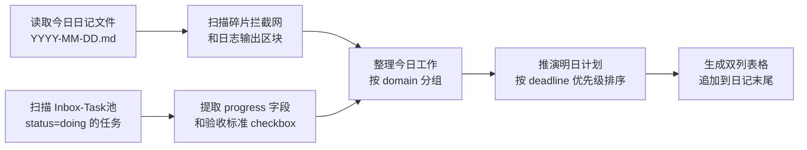
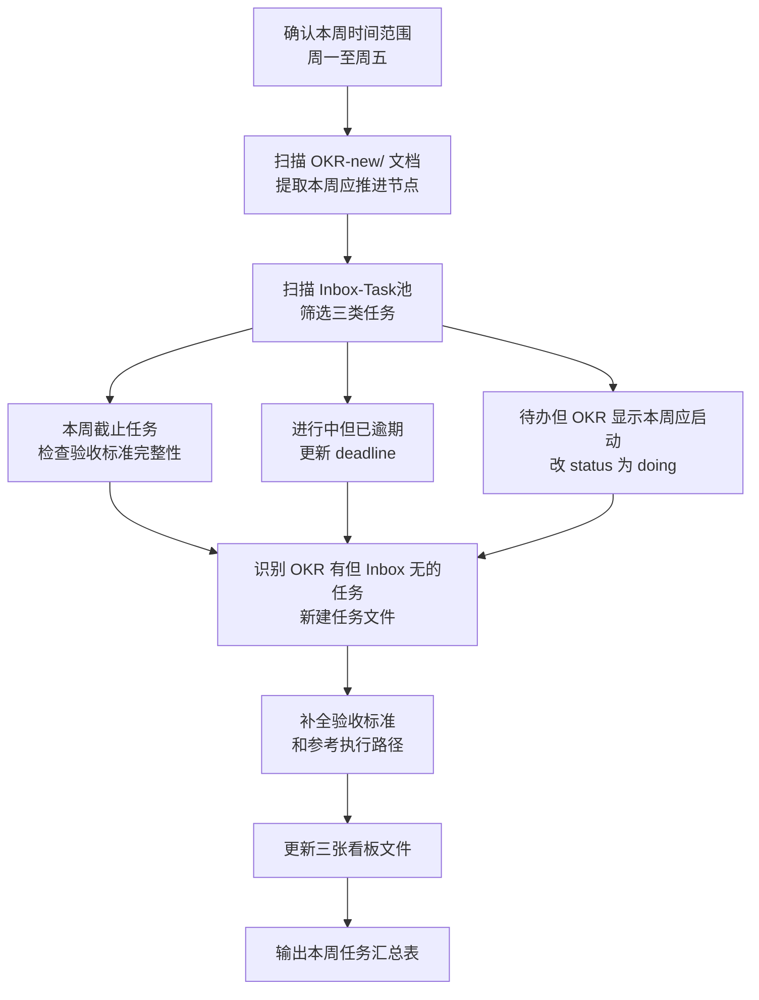
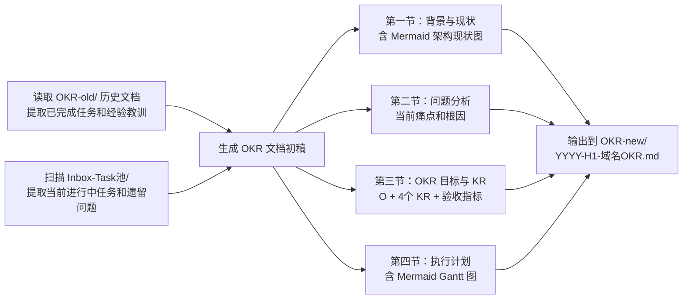
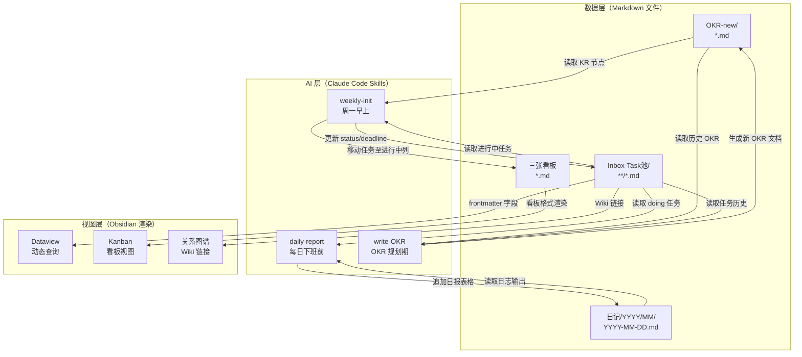

## 摘要

本文记录了一套真实运转的 AI 驱动工程师工作管理系统。系统以 [[Obsidian]] 为载体、[[Dataview]] 为查询引擎、[[Kanban]] 插件为看板视图，在此基础上通过 [[Claude Code]] 的 Skill 机制注入三个可复用的 AI Agent 行为：每日日报生成（`daily-report`）、每周任务初始化（`weekly-init`）、半年度 OKR 生成（`write-OKR`）。

文章不是方法论推销，而是系统设计的完整解剖：为什么这样分层、每一层解决什么问题、AI 在哪个环节创造了价值、在哪个环节反而有害。目标读者是有一定 Obsidian 使用经验、希望通过 AI 工具降低「启动阻力」而非「外包决策」的工程师。

全文共六章，从痛点出发，经底层设计、AI 融合、落地指南、进阶技巧，最终收归认知边界。每个核心概念按「是什么 → 为什么出现 → 不这样会怎样 → 如何落地 → 边界与反例」的逻辑展开。

---

## 第 1 章 为什么传统任务管理工具不够用

### 1.1 工程师的任务管理痛点

一个大数据集群 SRE 的工作日，粗略看会包含以下几类事情：

- 收到一条告警，登机排查，确认是参数漂移，调整后关单
- 周报要写，翻遍聊天记录拼凑本周做了什么
- OKR 中期检视，发现某个 KR 已经落后两周，开始焦虑
- 某个技术预研卡在一个问题上，相关资料分散在浏览器书签、本地 Markdown 文件和 Confluence 三个地方

这四件事的共同特征是：**信息分散**。每件事都需要跨越多个系统（Jira、企业微信、个人笔记、Confluence、Grafana）才能拼凑完整上下文。而上下文拼凑本身消耗的心智算力，往往不亚于真正解决问题所需的算力。

传统任务管理工具（Jira、Linear、Notion、甚至 Excel）对工程师的适配度存在几个结构性缺陷：

**1. 粒度不匹配**

Jira 的 Issue 适合跨团队协作的大颗粒度任务，但工程师的日常工作有大量「做一件事顺手把另一件事搞定了」的隐性关联。Jira 的填报成本让工程师倾向于少报，导致完成的工作无法溯源。

**2. 上下文缺失**

任务标题「优化 HiveServer2 启动参数」背后，可能有 20 条 Slack 消息、3 个 Grafana 截图和一份参数对比表。这些上下文在 Jira 中是附件，在工程师的实际工作中却是判断质量的核心依据。任务管理工具普遍不擅长留存「决策过程」。

**3. OKR 与日常割裂**

OKR 文档在一个地方，日常任务在另一个地方，周报在第三个地方。三者之间没有任何结构性连接，只靠工程师的记忆维持一致性。季度末写 OKR 总结时，「本季度完成了什么」这个问题的答案往往需要从头检索。

**4. 工具语境不同**

Jira 为软件工程团队协作设计，Linear 为产品团队设计，Notion 为通用知识管理设计。这些工具没有一个是为「独立大数据 SRE」设计的——一个同时承担运维、研发、调研、文档写作的角色，且大量工作上下文在本地而非云端。

> [!note]
> 这里不是说 Jira 不好用，而是说它解决的问题和工程师个人工作管理的问题不重合。组织协作和个人执行是两个层次的问题，需要两套工具。

### 1.2 Obsidian + Dataview 的工程师任务管理哲学

[[Obsidian]] 的核心设计哲学是「本地优先、纯文本、所有权在你自己」。这三点对工程师的吸引力不是审美偏好，而是工程原则：

- **本地优先**：工作上下文不依赖第三方服务的可用性，不担心数据出境或安全审计
- **纯文本**：Markdown 文件是 Git 可追踪的，可以用任何文本编辑器打开，不被厂商锁定
- **所有权**：你的工作记录属于你，不属于你所在的公司的 SaaS 订阅

但 Obsidian 本身只是一个 Markdown 编辑器加图谱可视化工具，要把它变成任务管理系统，需要两个关键插件：

**[[Kanban]] 插件**提供看板视图。它的底层实现仍然是 Markdown 文件，Kanban board 只是对特定格式 Markdown 的渲染。这意味着看板状态可以用文本工具批量修改，AI 也可以直接读写它。

**[[Dataview]] 插件**提供结构化查询。它把 Markdown 文件的 YAML frontmatter 当作数据库字段，提供类 SQL 的 DQL（Dataview Query Language）查询语法。只要 frontmatter 规范，任意维度的筛选、排序、聚合都可以在笔记内动态展示。

两者结合，就得到了一个「以 Markdown 文件为数据库、以 Dataview 查询为视图、以 Kanban 为工作流可视化」的任务管理系统——它既是工程师熟悉的纯文本环境，又具备传统数据库系统的查询能力。

> [!info]
> Dataview 的 DQL 并不是真正的数据库，它没有索引优化，在数千文件规模下查询速度会变慢。本文涉及的规模（几十到几百个任务文件）完全在其可用范围内。

### 1.3 AI 介入任务管理的价值定位

在描述 AI 能做什么之前，有必要先明确 AI **不应该**做什么。

**不应该做的**：

- 决定这个任务值不值得做（这是工程师的判断，AI 没有业务上下文）
- 评估 OKR 完成度是否「优秀」（这需要组织价值观，不是文本分析）
- 自动关闭任务（状态变更必须经过人确认）

**应该做的**：

AI 在任务管理中最大的价值不是「替代」，而是**降低「有价值工作」的启动阻力**。具体而言：

1. **格式化输出**：把散落在日记、任务文件、OKR 中的信息，按固定格式汇聚成日报/周报/OKR 文档。这件事机械但耗时，AI 做得又快又稳定。

2. **信息聚合**：跨多个文件扫描、提取关键字段、生成摘要。工程师自己做需要 30 分钟的信息检索，AI 做只需要几秒钟的文件扫描。

3. **模板填充**：新任务文件需要填写 frontmatter、写验收标准、设计执行路径。这些结构是模板化的，AI 可以根据任务名称和上下文自动填充草稿，工程师只需校对和修正。

4. **一致性维护**：确保看板状态与任务 frontmatter 的 `status` 字段一致，这类同步检查是人工容易遗漏、AI 可以可靠执行的操作。

> [!warning]
> AI 生成的所有内容都是草稿，需要工程师确认后才能作为「正式记录」。把 AI 的输出当作真实状态而不加核查，是这套工作流最大的风险点。

---

## 第 2 章 工作操作系统的底层设计

### 2.1 三层看板分工体系

#### 2.1.1 是什么

本系统使用三个独立的看板文件，对工程师的工作进行分类管理：

| 看板文件 | 职责定位 | 典型任务举例 |
|---------|---------|------------|
| `架构演进与交付.md` | 中大型交付任务，需要设计文档，跨组件影响，交付周期 > 1 周 | 告警迁移系统开发、Loki 流水线建设、HDFS 高可用升级 |
| `日常运维与琐事.md` | 重复性运维操作，配置变更，参数调整，定期检查 | NameNode 参数优化、组件重启操作、证书更新检查 |
| `技术攻坚与前瞻研究.md` | 技术预研，可行性分析，前瞻性课题，无明确工程产出 | AiOps 可行性分析报告、业界案例调研、Iceberg 适配性评估 |

#### 2.1.2 为什么要分三类

根本原因是这三类工作的**认知模式不同**：

- **架构交付**需要深度专注（Deep Work），一旦启动需要连续的时间块，频繁中断代价很高
- **日常运维**需要快速响应，通常有明确的操作步骤，不需要大量设计决策
- **技术预研**需要发散性思维，产出是文档而非可运行的系统，衡量标准是洞察深度而非交付速度

把三类任务混在一张看板上，会导致认知资源分配混乱：工程师早上打开看板，不知道该优先处理一个 P0 的 Spark 配置问题还是推进一个需要三小时深度工作的告警系统开发。

#### 2.1.3 不这样会怎样

混合看板的常见副作用：

1. **急事挤占深度工作**：日常运维的紧急性使其永远优先于技术预研，导致预研任务在看板上停留数周不动，最后被默默删除
2. **进度感失真**：架构交付任务进度变化慢，日常运维任务完成快，混合在一起会让整体「完成率」看起来虚高，掩盖了架构任务的延期风险
3. **AI 无法有效工作**：当 AI 扫描看板时，无法区分「需要每日推进」的任务和「下周才应该启动」的任务，生成的计划缺乏优先级意识

#### 2.1.4 Obsidian Kanban 插件语法

Kanban 看板文件的本质是带有特殊 frontmatter 和特定列结构的 Markdown 文件：

```markdown
---

kanban-plugin: board

---

## 待办

- [ ] [[Loki 流水线建设]]
- [ ] [[Zabbix 告警迁移系统集成测试]]

## 进行中

- [ ] [[告警迁移系统代码开发]]

## 已完成

- [ ] [[HiveServer2 启动参数优化]]

%% kanban:settings
{"kanban-plugin":"board","list-collapse":[false,false,false]}
%%
```

几个关键约定：
- 每个条目是指向 `Inbox-Task池/` 中对应任务文件的 Wiki 链接，而不是内联文本
- 列名固定为「待办 / 进行中 / 已完成」，AI 脚本依赖这个固定名称进行更新
- `%% kanban:settings %%` 以下的内容由插件维护，任何脚本都不应修改这一区域

### 2.2 Inbox-Task 池：任务的「单一事实来源」

#### 2.2.1 是什么

`Inbox-Task池/` 是所有任务文件的存放目录，按任务域（domain）分子目录组织：

```
Inbox-Task池/
├── 集群新特性/
├── 集群可观测建设/
│   ├── 告警迁移/
│   ├── Exporter开发/
│   └── 日志采集/
├── 集群智能运维/
│   ├── AiOps/
│   └── 告警迁移系统/
├── 集群日常运维/
└── 计算治理/
    └── Spark向量化/
```

看板文件中的每个条目都是指向这里某个 `.md` 文件的 Wiki 链接。任务的所有实质性内容——验收标准、执行路径、踩坑日志——都在 Inbox 文件里，看板只持有「引用」。

#### 2.2.2 为什么不直接在看板写内容

这是「单一事实来源」（Single Source of Truth）原则的体现。

如果任务内容直接写在看板条目里，会出现以下问题：

1. **看板文件变得庞大且难以维护**：三个看板都含有任务内容，相互交叉引用时无法直接跳转
2. **Dataview 无法查询**：Dataview 的查询单位是文件的 frontmatter，内嵌在看板列表里的文本无法被查询
3. **AI 无法高效扫描**：AI 需要一次性扫描所有进行中的任务时，如果内容分散在三个看板文件的不同列，扫描逻辑复杂且容易遗漏
4. **版本控制语义丢失**：任务文件是独立的 Git 追踪单元，可以看到「这个任务在什么时候添加了哪些验收标准」，而看板文件的 git diff 会包含所有任务的混合变更，难以解读

#### 2.2.3 Frontmatter 规范详解

每个任务文件必须包含以下 YAML frontmatter：

```yaml
---
type: task
status: todo | doing | done
priority: P0 | P1 | P2
deadline: YYYY-MM-DD
domain: 集群新特性 | 集群可观测建设 | 集群智能运维 | 集群日常运维 | 计算治理
lifecycle: research | engineering | review
progress: "0"
completed_date:
started_date:
---
```

逐字段说明：

| 字段 | 类型 | 作用 |
|------|------|------|
| `type` | 常量 `task` | Dataview 查询时用于过滤，只查任务文件（排除日记、OKR 等其他文件） |
| `status` | 枚举 | 任务生命周期状态，看板列的映射依据；`doing` 表示当前在做，Dataview 日报查询依赖此字段 |
| `priority` | 枚举 | 优先级排序依据；P0 是本周必须完成，P1 是本周应完成，P2 是可延期 |
| `deadline` | 日期 | DDL，Dataview 按截止时间排序和筛选；`weekly-init` 依赖此字段识别本周到期任务 |
| `domain` | 枚举 | 任务域，用于日报的分组展示，也是 Inbox 子目录的分类依据 |
| `lifecycle` | 枚举 | 任务阶段：`research`（调研）、`engineering`（工程实施）、`review`（评审）；决定该任务应出现在哪张看板上 |
| `progress` | 字符串 | 进度百分比，用于日报中的 `推进中 X%→Y%` 展示；字符串类型是因为 Dataview 数字计算有精度问题 |
| `completed_date` | 日期或空 | 完成日期，`done` 时必须填写；Dataview 今日交付归档查询依赖此字段 |
| `started_date` | 日期或空 | 开始日期，`doing` 时必须填写；Dataview 当日进行中任务查询用 `started_date <= this.date` 做过滤 |

> [!warning]
> `progress` 必须是字符串类型（加引号），不能是数字。如果写 `progress: 50` 而不是 `progress: "50"`，Dataview 会把它解析为数字，HTML progress 标签拼接时会报类型错误。这是一个容易遗漏的细节，建议在任务模板中固定写法。

#### 2.2.4 Dataview 查询示例

日记晨间 Init 中查询当日进行中任务的完整 DQL：

```dataview
TABLE
  priority AS "优先级",
  domain AS "任务域",
  "<progress value='" + progress + "' max='100'></progress> " + progress + "%" AS "推进状态",
  deadline AS "DDL"
FROM "工作管理/Inbox-Task池"
WHERE type = "task"
AND started_date != null
AND started_date <= this.date
AND (status = "doing" OR completed_date > this.date)
SORT priority ASC, deadline ASC
```

这个查询的关键设计决策：
- `FROM` 限定了扫描范围（只扫 Inbox-Task池），避免误收其他 `type: task` 的文件
- `started_date <= this.date` 而不是 `status = "doing"`，是因为有些任务已在今天之前启动但还没刷新 status；`this.date` 引用的是日记文件自身 frontmatter 中的 `date` 字段
- `completed_date > this.date` 允许今天才完成的任务也出现在晨间列表中（避免昨天完成但今天早上还想看到进度的情况）

### 2.3 日记系统：日常调度的指挥中心

#### 2.3.1 日记文件结构

每天的日记文件路径为 `工作管理/日记/YYYY/MM/YYYY-MM-DD.md`，由 Obsidian Core Templates 插件根据模板自动创建。文件分为两个主要区块：

**晨间 Init（上午启动时填写）**：
- `🎯 今日进行中`：Dataview 动态查询进行中任务，无需手动维护
- `📥 碎片拦截网`：当天临时产生的任务和想法，先记在这里，晚上复盘时分类处理

**晚间 Checkpoint（下班前填写）**：
- `✅ 今日交付归档`：Dataview 查询今天完成的任务
- `🧠 日志输出`：技术卡点、系统状态、任何值得记录的观察，纯文字，不限格式

日报（`📋 日报`）区块由 `daily-report` Skill 自动追加，不在模板中预设。

#### 2.3.2 晨间 Init vs 晚间 Checkpoint 的设计哲学

两个区块解决的是不同的认知问题：

**晨间 Init 的核心问题**：「今天应该专注在哪里？」

它不要求工程师输入任何东西，Dataview 查询会自动展示进行中的任务列表。工程师打开日记的第一件事是看到这张表，做一个「今天的注意力分配」决策，然后把最重要的一两件事的第一步行动写在碎片拦截网里作为启动锚点。

**晚间 Checkpoint 的核心问题**：「今天实际发生了什么？」

它要求工程师主动记录，但不要求格式。技术卡点可以是一句话，也可以是一段代码。关键是要有记录，因为 `daily-report` Skill 在生成日报时会读取这里的内容，用来推断「今日实际完成了什么」。

> [!note]
> 晚间 Checkpoint 的「日志输出」区块是整个系统的信息入口之一。越详细的记录，AI 生成的日报越准确。如果这个区块完全空白，AI 只能依赖任务文件的 `progress` 字段变化，日报质量会大幅下降。

#### 2.3.3 Dataview 在日记中的运作方式

日记文件中的 Dataview 代码块在 Obsidian 中会被实时渲染成表格，但底层仍然是纯文本代码块。这有一个重要含义：AI 读取日记文件时，看到的是未渲染的 Dataview DQL 代码，而不是查询结果。

这意味着 AI（如 `daily-report` Skill）不能依赖 Dataview 渲染结果来获取任务列表——它必须自己扫描 `Inbox-Task池/` 目录，重新执行相当于 Dataview 查询的逻辑。这在 Skill 设计上是一个关键约定：**AI 必须直接读原始文件，不能依赖 Obsidian 插件的渲染输出**。

---

## 第 3 章 AI 如何融入这套工作流

### 3.1 Claude Code（CC）的工作原理

#### 3.1.1 是什么

[[Claude Code]] 是 Anthropic 官方发布的命令行 AI Agent 工具（CLI），与通过网页聊天使用 Claude 有本质区别。它不是一个聊天机器人，而是一个具备以下能力的本地 Agent：

- **文件系统访问**：可以读写本地文件，包括 Markdown、代码、配置文件
- **Shell 执行**：可以运行命令行命令（在用户授权范围内）
- **工作区感知**：会读取项目目录下的 `CLAUDE.md` 文件，将其作为上下文注入到每次对话
- **工具调用**：基于 MCP（Model Context Protocol）或内置工具执行结构化操作

CC 的核心优势在于它运行在**工程师的本地工作环境**中，可以直接访问本地 Obsidian 笔记、不需要数据上传、不需要打开浏览器——它是你的命令行伙伴，而不是一个外部服务。

#### 3.1.2 为什么选 Claude Code 而不是普通聊天

普通聊天界面的限制：

1. **无持久上下文**：每次对话都要重新粘贴背景信息，或者从头解释你的工作系统
2. **无文件访问**：需要手动复制粘贴文件内容，操作繁琐且容易遗漏相关文件
3. **无执行能力**：AI 生成的内容需要你手动复制到文件，无法直接写入
4. **无工作区感知**：AI 不知道你的目录结构、命名约定、上下游依赖关系

CC 通过 `CLAUDE.md` 机制解决了持久上下文问题；通过文件工具解决了读写问题；通过 Skill 机制解决了「如何把一个复杂任务分解成可重复执行的步骤」的问题。

#### 3.1.3 工作区感知：CLAUDE.md 的作用

当 CC 在某个目录下启动时，它会递归向上查找并读取所有层级的 `CLAUDE.md` 文件，将内容合并为当前会话的系统上下文。

在本系统中，有两级 `CLAUDE.md`：

- **项目级**（`my-brain/CLAUDE.md`）：描述整个知识库的架构，Quartz 框架配置，内容组织方式
- **目录级**（`工作管理/CLAUDE.md`）：描述工作管理系统的目录结构、frontmatter 规范、看板分工、技术背景（所用的技术栈：Hadoop、VictoriaMetrics、Foxeye、Loki 等）

> [!info]
> 两级 `CLAUDE.md` 是继承关系。工作在 `工作管理/` 目录下时，CC 会同时读取两个文件，下层文件的内容可以覆盖或补充上层文件的描述。对于工作管理场景，几乎所有有用的上下文都在 `工作管理/CLAUDE.md` 中。

#### 3.1.4 权限控制和安全边界

CC 有明确的权限模型。默认情况下：

- 可以读取任何文件（包括当前工作目录以外的文件）
- 可以写入文件，但会在写入前展示 diff 请求确认
- Shell 命令执行需要明确授权

在任务管理场景中，Skill 的操作范围应该明确限定在 `工作管理/` 目录内，不应该触及其他目录（如代码仓库、系统配置文件等）。这个边界通过 Skill 文件中的路径约定来约束，不是系统级隔离——依赖的是 Skill 设计的自律性，而不是技术强制。

### 3.2 Skill 体系：可复用的 Agent 行为模式

#### 3.2.1 是什么

Skill 是 [[Claude Code]] 的可复用行为单元。本质上，一个 Skill 是一个 Markdown 文件，放置在 `.claude/skills/<skill-name>/SKILL.md` 路径下，包含：

- **YAML frontmatter**：Skill 的元数据（id、name、description）
- **执行指令**：结构化的步骤说明，告诉 AI 在被调用时应该做什么、读什么文件、输出什么格式

通过 `/skill:<skill-id>` 命令调用 Skill 时，CC 会将 SKILL.md 的内容注入到当前会话，AI 按其中的指令执行。

#### 3.2.2 为什么出现

在没有 Skill 机制之前，如果想让 AI 做「生成日报」这件事，每次都需要：

1. 打开 CC
2. 粘贴一段几百字的提示词（描述日报格式、读哪些文件、输出规范）
3. 希望 AI 理解并正确执行

这有三个问题：提示词本身需要版本管理、提示词和工作区上下文容易脱节、每次微调提示词都是一次隐性的「系统重新设计」。

Skill 把提示词变成代码库的一部分——它是 Git 追踪的、版本化的、可以通过 PR 评审的。这使得 AI 行为的迭代变得和代码迭代一样可管理。

#### 3.2.3 与普通 Prompt 的区别

| 维度 | 普通 Prompt | Skill |
|------|------------|-------|
| 持久性 | 每次对话重新输入 | 文件化，Git 追踪 |
| 可组合性 | 单次一次性 | 可调用、可引用其他文件 |
| 上下文感知 | 无（除非手动粘贴） | 自动继承 CLAUDE.md 上下文 |
| 版本管理 | 无 | Git diff 可追踪每次变更 |
| 可分享性 | 依赖聊天历史 | 文件可直接分享给团队 |

#### 3.2.4 Skill 文件格式

```markdown
---
id: daily-report
name: 每日工作日报生成
description: 读取当天日记与进行中任务，生成今日工作摘要与明日计划，以双列表格追加到日记末尾。
---

# 每日工作日报生成

## 职责定位

[角色定位描述，让 AI 知道它在扮演什么角色]

## 执行流程

### Step 1：[阶段名称]
[具体操作指令]

### Step 2：[阶段名称]
[...]

## 注意事项
[约束条件和边界情况处理]
```

frontmatter 中的 `description` 字段在 Skill 列表展示时使用，也是 AI 判断「这个 Skill 适不适合当前任务」的摘要依据。

#### 3.2.5 边界与反例

Skill 不是万能的。以下场景 Skill 效果差：

- **需要实时数据的场景**：Skill 只能读取本地文件，无法查询 Prometheus、Grafana 或数据库
- **需要交互式决策的场景**：如果任务需要工程师在执行过程中多次确认，Skill 的线性流程会变得繁琐
- **高度不确定的场景**：如果任务描述本身模糊（「优化系统性能」），Skill 的输出会缺乏针对性，不如手动聊天

### 3.3 三个核心 Skill 的工作方式

#### 3.3.1 daily-report：每日工作日报生成

**调用时机**：工作日下班前（通常是下午 6 点左右）

**执行逻辑**：



**关键设计**：

`daily-report` 的明日计划推演有四个优先级规则，按顺序判断：

1. 本周截止优先：deadline 在本周内且未完成的任务
2. 今日已推进的任务续跑：今天有进展的任务，明天继续
3. OKR 节点临近：距离 OKR 甘特图时间节点 ≤ 7 天的任务
4. 依赖解锁：某任务的前置任务今天完成，后继任务可以启动

这个规则顺序的设计逻辑是：短期截止优先于长期计划，但长期 OKR 节点必须被纳入视野。第 4 条规则（依赖解锁）依赖工程师在任务文件中记录了依赖关系，否则 AI 无法推断。

**输出示例**（追加到日记末尾的表格）：

```markdown
## 📋 日报（2026-03-16）

| 今日工作 | 明日计划 |
|---------|---------|
| **【集群智能运维】** | **【集群智能运维】** |
| 告警迁移系统集成测试准备：整理5类边界 Trigger【推进中 50%→60%】 | 执行 Master→Converter→Matcher 端到端链路验证，确认 conversion_task 正确写入 DB |
| **【集群可观测】** | **【集群可观测】** |
| Loki 流水线：完成 Promtail 配置设计草稿【推进中 50%→55%】 | 编写 Salt State 模块，在测试节点执行 salt state.apply promtail 验证配置下发 |

> 生成时间：2026-03-16 --:--
```

**边界与反例**：

- 如果日记的「日志输出」区块为空（工程师没有记录当天工作），AI 只能依赖任务文件的 `progress` 字段，日报的「今日工作」列质量会很低
- 明日计划中的具体行动描述（「执行 salt state.apply promtail」）依赖任务文件的「参考执行路径」章节，如果该章节没写，AI 会生成模糊描述

#### 3.3.2 weekly-init：每周任务初始化

**调用时机**：每周一早上

**执行逻辑**：



**关键设计**：

`weekly-init` 的核心价值在于两点：

**一是 OKR 与 Inbox 的对齐**。OKR 文档里有 Gantt 图，里面标注了每个任务应该在什么时间节点交付什么。`weekly-init` 每周扫描一次，把「本周应该推进的 OKR 任务」转化为「Inbox 中有对应 doing 任务」。这个过程如果不自动化，工程师很容易陷入「每天在做任务，但任务和 OKR 节点脱节」的状态。

**二是验收标准的强制补全**。Skill 要求每个本周到期的任务必须有「本周目标」章节，且目标必须是「本周五前可验证的具体检查点」，不允许模糊描述。这个约束迫使工程师（通过 AI 辅助）在周一就把本周的验收标准想清楚，而不是周五才发现任务「做完了但不知道算不算完」。

**验收标准写作要求**：

- 区分「本周目标」（里程碑，本周内可验证）和「整体验收标准」（最终交付）
- 本周目标必须带数字：`≥5条`、`≤20%`、`100% 无 NULL`，不写「足够多」「明显提升」
- 使用 checkbox 列表，已完成项用 `- [x]`

**边界与反例**：

- `weekly-init` 的效果高度依赖 OKR 文档的质量。如果 OKR 甘特图里的时间节点不准确（比如填的是理想情况而不是实际计划），`weekly-init` 会把错误的优先级传播到 Inbox 任务中
- Skill 无法判断一个任务是否「真的可以本周启动」（可能依赖一个还没完成的外部调研），这类依赖关系需要工程师在任务文件中显式声明，否则 AI 会错误地将任务标记为 doing

#### 3.3.3 write-OKR：半年度 OKR 文档生成

**调用时机**：半年度 OKR 规划期（通常在 H1 开始前或 H2 开始前）

**执行逻辑**：



**关键设计**：

`write-OKR` 解决的是一个高度耗时但结构相对固定的文档生成任务。半年度 OKR 文档需要：
1. 梳理上半年已完成的工作，提炼经验
2. 分析当前系统状态和痛点（这些信息散布在多个 Inbox 任务文件中）
3. 设定下半年目标，分解为可衡量的 KR
4. 绘制时间甘特图

前三项是逻辑推理，AI 可以有效辅助；第四项（设定目标）是决策，AI 生成草稿，工程师负责拍板。

`write-OKR` 的输出中，第一节包含 Mermaid 架构图（展示当前已建成、建设中、缺失的系统组件），第四节包含 Mermaid Gantt 图（展示 H1 各 KR 的时间节点分布）。这两种图表如果手动绘制，通常需要 1-2 小时；AI 生成草稿只需要几分钟，之后只需要调整细节。

真实产出的 OKR 文档（`2026-H1-集群智能运维OKR.md`）就是通过这个流程生成的，包含完整的四章节结构、Mermaid 架构图和 Gantt 图。

---

## 第 4 章 打造你自己的 AI 工作管理系统

### 4.1 设计原则：让 AI 读懂你的工作

#### 4.1.1 结构化优先：Frontmatter 的价值

AI 能有效处理信息的前提是信息具有机器可读的结构。一段纯文字日记和一个带有规范 frontmatter 的任务文件，对 AI 来说的差别不是「详细 vs 简略」，而是「可查询 vs 不可查询」。

考虑以下两种任务记录方式：

**方式 A（非结构化）**：
```markdown
# 告警迁移系统

这是一个把 Zabbix 告警迁移到 Foxeye 的项目，优先级比较高，
大概下周要完成，目前做了一半左右。
```

**方式 B（结构化 frontmatter）**：
```yaml
---
type: task
status: doing
priority: P0
deadline: 2026-03-21
domain: 集群智能运维
lifecycle: engineering
progress: "50"
started_date: 2026-03-10
---
```

方式 A 对人类阅读友好，但 AI 无法从中提取「截止时间」来判断是否本周到期，也无法通过 Dataview 查询找到它。方式 B 让任意工具（Dataview、AI、Shell 脚本）都可以精确查询和过滤。

> [!info]
> 「结构化优先」不意味着放弃自然语言叙述。好的任务文件是两者兼有：frontmatter 提供机器可读的元数据，正文（验收标准、执行路径、踩坑日志）提供人类可读的上下文。两者互为补充，缺一不可。

#### 4.1.2 上下文显式化：CLAUDE.md 的写法

AI 能做好工作的另一个前提是它理解你的工作环境。`CLAUDE.md` 是你向 AI 描述工作上下文的地方。

工作管理目录的 `CLAUDE.md` 包含以下核心信息：

- **目录定位**：这个目录是什么，服务什么角色，覆盖什么场景
- **目录结构与职责**：每个子目录的用途
- **核心约定**：frontmatter 规范（字段名、允许值、约束），三块看板的分工，日记模板结构
- **当前技术上下文**：使用的技术栈（Hadoop、VictoriaMetrics 等），让 AI 在生成技术内容时有背景知识

这些信息是静态的工作环境描述，不是动态的任务状态。`CLAUDE.md` 应该写「这个目录用来存什么」，而不是「这个任务目前进度是多少」——后者应该在任务文件自身中维护。

#### 4.1.3 约定优于配置：目录结构的命名规范

好的目录命名规范让 AI 不需要配置就能正确理解意图。

例如，`Inbox-Task池/集群智能运维/告警迁移系统/` 这个路径包含了三层信息：
- `Inbox-Task池`：这是任务存储区，不是产出文档区
- `集群智能运维`：这是 domain 字段的值
- `告警迁移系统`：这是任务的子分类

任何一层命名都和 frontmatter 字段值对应，AI 在创建新任务文件时，可以从路径推断出 `domain` 应该填什么值，不需要用户重复说明。

### 4.2 从零搭建：四步建立工作流

#### Step 1：设计 Inbox-Task 目录结构

首先明确你的「任务域」分类。任务域是粗粒度的，通常对应你工作职责的主要方向，数量控制在 3-6 个。过多的域会让分类本身成为负担。

参考本系统的分域原则：
- 按**工作性质**划分（新特性开发 / 日常运维 / 技术预研），而不是按技术栈或项目名称
- 域的边界要清晰，一个任务应该能毫无歧义地归入某一个域
- 未来 12 个月可能出现的工作类型都应该被覆盖

目录结构示例（适合大数据 SRE）：

```
Inbox-Task池/
├── 集群新特性/
├── 集群可观测建设/
├── 集群智能运维/
├── 集群日常运维/
└── 计算治理/
```

#### Step 2：制定 Frontmatter 规范

核心字段不要超过 10 个。字段越少，维护成本越低，AI 填写的准确率越高。

必须有的字段：
- `type`：用于 Dataview 过滤
- `status`：任务生命周期
- `priority`：排序依据
- `deadline`：时间压力感知
- `domain`：分组依据

可选但推荐的字段：
- `lifecycle`（决定在哪张看板显示）
- `progress`（进度追踪）
- `started_date` / `completed_date`（时间记录，用于统计和归档）

制定好规范后，用 Obsidian 的 Templates 插件创建任务模板文件，确保每个新任务都从正确的 frontmatter 结构开始。

#### Step 3：创建 CLAUDE.md

在工作管理目录下创建 `CLAUDE.md`，包含以下内容：

```markdown
# CLAUDE.md

## 目录定位
[一段话描述这个目录是什么，服务什么角色，覆盖什么场景]

## 目录结构与职责
[逐目录说明用途，可以用代码块展示树形结构]

## 核心约定
### 任务文件 Frontmatter 规范
[完整的 frontmatter 字段说明，包括每个字段的允许值和作用]

### 看板分工
[每张看板的收录标准]

### 日记结构
[日记文件的结构说明]

## 当前技术上下文
[你的技术栈，让 AI 在生成技术内容时有参考]
```

#### Step 4：编写第一个 Skill

以 `daily-report` 为模板，在 `.claude/skills/daily-report/SKILL.md` 创建第一个 Skill：

1. **frontmatter**：填写 id、name、description
2. **职责定位**：一段话说明这个 Skill 的角色（「你是...的日报助手，当用户说...时，你需要...」）
3. **执行流程**：分 Step 描述每个阶段做什么、读哪些文件、如何处理
4. **输出格式规范**：精确定义输出的 Markdown 格式，包括示例
5. **注意事项**：列出约束条件（不修改哪些内容，数量限制，格式强制要求）

第一版 Skill 不需要完美，只需要能运行并产出可接受的结果。后续通过 Git commit 迭代改进。

### 4.3 Skill 编写最佳实践

#### 4.3.1 角色定位声明

Skill 的第一段应该是明确的角色声明：

```markdown
你是搜狐 RDC 大数据集群 SRE 的每周任务调度员。
每周一收到「初始化本周任务」请求时，执行完整的周度任务盘点流程。
```

角色声明的作用是让 AI 理解「它在代表谁做这件事」。这会影响 AI 在遇到歧义时的判断——角色是 SRE 调度员，它就会偏向运维优先级；角色是产品经理，它会偏向用户价值。

#### 4.3.2 数据源指向

Skill 必须明确告诉 AI 读哪些文件，不能留给 AI 自己猜测。

```markdown
### Step 2：扫描 OKR 确认本周重点

读取 `工作管理/OKR/OKR-new/` 下所有 OKR 文档，提取本周应推进的任务节点：
- 对照甘特图和任务明细表，找出时间节点覆盖本周的任务条目
```

数据源指向要精确到目录级别，不要写「读取相关任务文件」这种模糊描述。

#### 4.3.3 输出格式规范

输出格式是 Skill 质量的决定性因素之一。格式越精确，AI 的「自由发挥空间」越小，输出越稳定。

好的输出格式规范包含：
- **完整的示例**（不是描述，而是真实的输出样本）
- **格式约束**（「每行不超过 X 字」、「domain 标签行加粗」、「不超过 8 条」）
- **边界情况处理**（「若今日无有效工作记录，显示'（暂无记录，请手动补充）'」）

#### 4.3.4 自检清单的价值

在 Skill 的注意事项部分，加入自检清单：

```markdown
## 注意事项

- **不修改日记已有内容**：只在文件末尾追加，不改动晨间 Init 和 Checkpoint 已有的内容
- **若日记文件不存在**：提示用户当天日记文件不存在，询问是否需要创建
- **进度推算要保守**：若无法确认任务实际进度变化，只根据日记中明确提及的工作内容标注，不猜测
- **明日计划要可操作**：直接写具体的验证动作或命令，让工程师看到计划就知道怎么执行
```

自检清单约束的是 AI 容易「滑坡」的行为：过度猜测、修改不该修改的内容、生成模糊描述代替具体行动。每条约束都应该是在实际运行中发现 AI 出现了该问题后才加入的，不是预防性地列出所有可能的错误。

### 4.4 CLAUDE.md 配置指南

#### 4.4.1 继承关系

CC 读取 `CLAUDE.md` 的规则：从当前工作目录向上递归，直到找不到为止，所有层级的文件都会被读取并合并。

在本系统中，目录层级如下：

```
my-brain/CLAUDE.md          ← 项目级：描述 Quartz 框架和整体知识库结构
└── 工作管理/CLAUDE.md       ← 目录级：描述工作管理系统的具体约定
```

当在 `工作管理/` 目录内使用 CC 时，两个文件都会被读取。项目级文件描述的是 Quartz 和内容组织，对工作管理场景参考价值有限；目录级文件才是工作管理场景的核心上下文。

如果两个文件对同一概念有不同描述，下层（目录级）文件优先。

#### 4.4.2 应该写什么

`CLAUDE.md` 的内容原则：**写工作环境的静态描述，不写动态状态**。

应该写的：
- 目录结构和每个目录的职责
- Frontmatter 字段规范（字段名、允许值、作用、约束）
- 文件命名约定
- 技术背景（使用的技术栈，领域术语解释）
- 看板分工规则
- 日记模板结构

不应该写的：
- 具体任务的当前状态（这应该在任务文件的 frontmatter 里）
- 临时上下文（「本周重点是 XX」——这会在下周变成误导性信息）
- 个人偏好描述（「我喜欢简洁的风格」——AI 会记住，但这类偏好通过示例比文字描述更有效）
- 过于详细的技术文档（`CLAUDE.md` 是索引，不是技术规范，具体规范链接到对应文件）

> [!warning]
> `CLAUDE.md` 会被每次 CC 会话读取，写太多内容会占用上下文窗口，影响 AI 处理实际任务的能力。建议控制在 200-400 行以内，聚焦在「AI 不看这个就无法正确工作的信息」。

---

## 第 5 章 进阶：让 AI 主动管理而不是被动执行

### 5.1 定时触发 Skill（Cron 模式）

#### 5.1.1 是什么

[[Claude Code]] 支持通过 `--print` 参数以非交互模式运行，结合操作系统的 cron 机制，可以实现定时自动触发 Skill。

基本命令格式：

```bash
claude --print "/skill:daily-report"
```

`--print` 参数告诉 CC 直接执行并输出结果，不进入交互模式。`/skill:daily-report` 是调用 Skill 的命令。

#### 5.1.2 每天自动跑 daily-report 的配置

在终端配置 cron job，每天工作日下午 6 点自动执行：

```bash
# 编辑 crontab
crontab -e

# 添加以下行（工作日 18:00 自动生成日报）
0 18 * * 1-5 cd /path/to/my-brain/content/工作管理 && claude --print "/skill:daily-report" >> /tmp/daily-report.log 2>&1
```

几个注意点：

1. **工作目录**：必须 `cd` 到正确的工作目录，因为 CC 从当前目录开始查找 `CLAUDE.md` 和 `.claude/skills/`
2. **日志记录**：`>> /tmp/daily-report.log` 把输出重定向到日志文件，方便排查问题
3. **时区**：cron 使用系统时区，确认你的系统时区设置正确
4. **中断处理**：如果 18:00 机器在休眠（笔记本电脑场景），cron job 不会自动补跑。可以用 `launchd`（macOS）代替 cron，它支持「错过则在唤醒后立即执行」

> [!warning]
> 定时自动执行的 Skill 修改了文件但工程师没有看到时，可能产生「幽灵内容」——AI 追加了一段日报，但工程师以为当天日记是空的，导致信息遗漏。建议在 Skill 执行完成后发送桌面通知（macOS 的 `osascript -e 'display notification...'`），让工程师知道有新内容需要审阅。

#### 5.1.3 Claude Code 的 Headless 模式限制

以 `--print` 运行时，CC 无法进行交互式确认。如果 Skill 遇到「文件不存在，是否创建？」这类需要用户决策的分支，它会按照 Skill 中的默认行为处理，或者直接报错退出。

设计用于定时执行的 Skill 时，必须在 Skill 文件中明确指定每个分支的默认行为，不依赖用户交互决策：

```markdown
## 注意事项

- **若当天日记文件不存在**：自动根据模板创建当天日记文件，然后继续执行，不询问用户
- **若 Inbox-Task池 为空**：在日报中的今日工作列显示「（暂无进行中任务）」，继续生成明日计划
```

### 5.2 与 Obsidian 插件联动

#### 5.2.1 Dataview 联动

AI 生成的内容和 Dataview 查询的联动有两种模式：

**模式 A：AI 生成静态内容，Dataview 查询动态内容，两者并存**

日记中，晨间 Init 区块的「今日进行中」是 Dataview 动态查询（每次打开都会重新计算），而日报区块是 AI 追加的静态内容（生成后不再变化）。两种内容类型不冲突，各自发挥优势。

**模式 B：AI 更新 Frontmatter，Dataview 查询反映最新状态**

`weekly-init` 执行后，会修改任务文件的 `status`、`deadline`、`started_date` 等字段。这些修改会被 Dataview 查询立即反映（Dataview 是实时查询，没有缓存）。这意味着 AI 更新了 frontmatter 后，工程师下次打开日记，Dataview 就会展示更新后的任务状态。

#### 5.2.2 Kanban 插件联动

AI 修改看板文件需要遵循 Kanban 插件的文件格式约定，否则插件解析会出错：

1. 列名必须是 `## 待办`、`## 进行中`、`## 已完成`（精确匹配，包括空格）
2. 每个条目格式：`- [ ] [[任务文件名]]`（注意：Wiki 链接只写文件名，不含路径和扩展名）
3. 不修改 `%% kanban:settings %%` 以下的内容
4. 不修改文件的 frontmatter（`kanban-plugin: board` 这一行）

AI 在更新看板时最常见的错误是修改了 kanban:settings 区块，或者在 Wiki 链接中包含了路径前缀，导致 Kanban 插件无法正确解析。Skill 的注意事项中应该明确约束这些行为。

#### 5.2.3 Templates 插件联动

Obsidian 的 Templates 插件用于初始化新文件的 frontmatter 和结构。当 `weekly-init` 新建 Inbox 任务文件时，它实际上不依赖 Obsidian Templates 插件（因为 AI 直接写文件，不通过 Obsidian UI），而是在 Skill 文件中内联了任务模板：

```markdown
**文件模板**（基于 Template/engineer.md）：

\```markdown
---
type: task
status: todo
priority: P0
deadline: YYYY-MM-DD
domain: <domain>
lifecycle: engineering
progress: "0"
completed_date:
started_date:
---

## 🎯 目标与验收标准

### 本周目标（M.DD-M.DD）
- [ ] [具体可验证的本周子目标]
...
\```
```

这里有一个设计选择：Skill 内联模板还是引用外部模板文件？

内联模板的优点：Skill 是自包含的，不依赖外部文件，即使模板文件路径变更也不受影响。
外部模板的优点：修改模板时只需要改一处，所有引用该模板的 Skill 自动更新。

当前系统选择了内联，主要考虑是 Skill 的可靠性（不依赖文件路径假设）高于模板的 DRY 原则。在模板修改频繁的情况下，可以切换为引用外部文件。

### 5.3 多 Skill 组合：周度工作流自动化

#### 5.3.1 完整的周度工作流

一个完整的工作周，AI 介入的时间点如下：

| 时间节点 | Skill | 输入 | 输出 |
|---------|-------|------|------|
| 周一早上 | `weekly-init` | OKR 文档 + Inbox 任务文件 | 更新后的任务文件 + 看板 + 本周任务汇总 |
| 每日下班前 | `daily-report` | 当日日记 + 进行中任务 | 追加日报到日记末尾 |
| 周五下午 | `daily-report`（加强版） | 全周日记 + 任务完成情况 | 本周总结 + 下周初始化前的预检 |
| OKR 规划期 | `write-OKR` | OKR-old + Inbox 历史任务 | OKR 文档草稿（含架构图和甘特图） |

#### 5.3.2 数据流向图



#### 5.3.3 周度工作流的启动阻力分析

「启动阻力」是指「从知道要做一件事到实际开始做这件事」的心理/行动成本。以下是引入 AI 工作流前后的对比：

**引入前**：

- 周报：需要 30-45 分钟翻看聊天记录和任务状态，拼凑本周工作内容，格式化输出
- 每日日报：通常直接不写，或者写得非常简单（「今天继续推进 XX」）
- OKR 文档：通常拖到 deadline 前一天集中写，质量参差不齐

**引入后**：

- 周报：`daily-report` 每天累积，周五只需要浏览一遍 5 天的日报，手动确认无误
- 每日日报：一条命令（`/skill:daily-report`），30 秒内完成，格式统一
- OKR 文档：`write-OKR` 生成草稿，工程师只需要审阅和修正细节（通常 2 小时而不是 1 天）

降低的是「有价值工作的启动阻力」，而不是「有价值工作本身」。工程师仍然需要判断日报是否准确、OKR 目标是否合理。AI 只是消除了「整理信息」和「填充格式」这两个纯机械性的摩擦。

---

## 第 6 章 经验总结：哪些工作适合让 AI 做

### 6.1 高适合度场景

经过这套工作流的实际运行（`daily-report` 已稳定运行多周，`weekly-init` 和 `write-OKR` 各运行过数次），以下场景 AI 表现稳定：

#### 6.1.1 格式化输出

**场景**：把散落在多个文件中的信息按固定格式汇聚成文档

**代表 Skill**：`daily-report`（把日记 + 任务文件 → 双列日报表格）、`write-OKR`（把历史 OKR + Inbox → 结构化 OKR 文档）

**为什么适合**：格式是确定的，信息源是明确的，AI 做的工作是「信息搬运 + 格式转换」，不需要主观判断。输出质量的上限由输入信息的质量决定，AI 不会「创造」信息。

**注意点**：输出格式必须在 Skill 中精确描述，包括示例。格式模糊时 AI 会自由发挥，每次输出格式不一致。

#### 6.1.2 信息聚合

**场景**：跨多个文件扫描，提取特定字段，生成摘要

**代表 Skill**：`weekly-init` 的 Step 2（扫描 OKR 提取本周节点）、`daily-report` 的 Step 2（扫描所有 doing 任务）

**为什么适合**：这类工作的特点是「范围大但逻辑简单」。人工扫描 20 个任务文件提取 `deadline` 字段，不需要判断力，但需要时间和注意力。AI 扫描 20 个文件和扫描 2 个文件的成本一样。

**注意点**：AI 扫描文件时依赖路径假设（「扫描 Inbox-Task池/ 下所有文件」），如果目录结构变更，需要同步更新 Skill 中的路径描述。

#### 6.1.3 模板填充

**场景**：根据上下文生成符合规范的文档草稿

**代表 Skill**：`weekly-init` 的 Step 5（补全验收标准与执行路径）、`weekly-init` 的 Step 4（新建缺失 Inbox 任务文件）

**为什么适合**：模板结构固定，AI 需要做的是「把任务名称翻译成符合规范的验收标准和执行路径」。AI 在这类「从名称推断细节」的工作上表现较好，尤其是技术背景明确的情况下（`CLAUDE.md` 中有完整的技术栈描述）。

**注意点**：AI 生成的验收标准和执行路径是草稿，必须经过工程师审阅。AI 对具体的技术细节（「这个命令在生产环境的正确参数是什么」）缺乏可靠性，需要人工核准。

#### 6.1.4 OKR 文档生成

**场景**：综合多个信息源，生成结构化的计划文档，包含文字叙述、表格和图表

**代表 Skill**：`write-OKR`

**为什么适合**：OKR 文档的结构是固定的（背景 / 问题分析 / OKR 目标 / 执行计划），文字部分依赖对历史工作的理解（AI 从 OKR-old 读取），图表部分（Mermaid 架构图和 Gantt 图）是结构化数据的可视化，AI 在这两类工作上都比人工快很多。

**注意点**：OKR 目标的雄心水位（「是否足够有挑战性但又可达」）是主观判断，AI 倾向于生成保守的目标。工程师需要在审阅时主动调整目标的挑战性。

### 6.2 低适合度场景

以下场景不应该让 AI 做，或者应该极度谨慎：

#### 6.2.1 需要你拍板的决策

**场景**：这个任务现在应该优先做还是推迟？这个技术方案选 A 还是 B？

**为什么不适合**：AI 没有你的业务上下文、政治感知、个人精力状态。即使 AI 给出一个看起来合理的决策建议，你接受它的代价是「把你的判断力让渡给了一个没有背景的工具」。

在这套工作流中，`weekly-init` 会更新任务状态（把 `todo` 改为 `doing`），但这个行为的触发条件是「OKR 甘特图显示本周应启动」，而不是「AI 判断应该启动」。决策的来源是工程师事先制定的 OKR 计划，AI 只是执行计划，不做计划。

#### 6.2.2 高度主观的判断

**场景**：这篇技术文档写得好不好？这个任务做完了算不算「达到验收标准」？

**为什么不适合**：这类判断的标准是主观的，依赖组织文化、个人标准、当前上下文。AI 会给出一个「中规中矩」的判断，不会给出「你的标准下的准确判断」。

在日报中，AI 只标注「已完成」或「推进中 X%→Y%」，不评价「是否完成得足够好」。评价是工程师在晚间 Checkpoint 的日志输出中自己写的。

#### 6.2.3 需要实时数据的场景

**场景**：今天集群告警数量和昨天相比是否异常？当前 YARN 队列利用率如何？

**为什么不适合**：CC 只能访问本地文件系统，无法查询 VictoriaMetrics、Grafana、Zabbix 或任何外部系统。把实时监控数据查询混入 Skill 的期望是一个架构错误——这类工作应该用专门的监控工具（Foxeye 大盘、PagerDuty）处理，不是 AI 工作管理工具的职责范围。

> [!note]
> 边界清晰是这套系统能长期稳定运行的关键。每次想「能不能让 AI 也做 X？」时，先问自己：X 是信息聚合/格式化/模板填充，还是决策/判断/实时数据？前者适合，后者不适合。

### 6.3 关键认知：AI 是降低启动阻力的工具

经过这套工作流的实际运行，最核心的认知是：

**AI 不能替代你思考，但它能让你更快开始思考。**

日报的价值不是 AI 写的日报本身，而是日报触发了工程师「审阅今日工作」的动作。如果没有日报，工程师可能直接关电脑，今日工作的反思就不会发生。AI 生成的草稿是一个「触发器」，它降低了「开始复盘」这个动作的启动阻力。

OKR 文档的价值类似。工程师通常拖到 deadline 前才写 OKR，因为「从空白文档开始写一份结构化的 OKR」启动阻力很高。AI 生成草稿后，工程师面对的不是「写一份 OKR」，而是「审阅和修正一份 OKR」——后者的启动阻力低得多，而且审阅的质量往往不低于从头写的质量（因为审阅时会主动挑毛病）。

这个认知决定了工作流的设计取向：**所有 Skill 都生成草稿，不生成终稿**。终稿必须经过工程师确认，因为工程师才是这套工作系统的主人，AI 是工具。

> [!info]
> 这套工作流在一个大数据集群 SRE 的场景下经过了约 3 个月的实际使用验证（从系统设计到三个 Skill 都稳定运行）。它不是理论推演，每个设计决策背后都有实际踩坑的经验。其中 `daily-report` 运行最稳定，因为它的输入输出最明确；`write-OKR` 输出质量最高，因为它处理的是结构化程度最高的文档；`weekly-init` 最复杂，因为它需要修改多个文件且逻辑分支最多。

---

## 附录 A：核心文件路径速查

| 文件 | 路径 | 用途 |
|------|------|------|
| 工作管理系统上下文 | `工作管理/CLAUDE.md` | CC 工作区上下文，每次会话自动读取 |
| 每日日报 Skill | `工作管理/.claude/skills/daily-report/SKILL.md` | 日报生成逻辑 |
| 每周初始化 Skill | `工作管理/.claude/skills/weekly-init/SKILL.md` | 周度任务盘点逻辑 |
| 任务模板 | `Template/engineer.md` | 新建 Inbox 任务文件的基础模板 |
| 架构交付看板 | `工作管理/架构演进与交付.md` | 中大型交付任务看板 |
| 运维看板 | `工作管理/日常运维与琐事.md` | 日常运维任务看板 |
| 技术预研看板 | `工作管理/技术攻坚与前瞻研究.md` | 技术预研任务看板 |
| OKR 历史文档 | `工作管理/OKR/OKR-old/` | 历史 OKR 和调研报告 |
| OKR 当期文档 | `工作管理/OKR/OKR-new/` | 当前 H1 OKR 文档 |

## 附录 B：Dataview 常用查询

**查询所有 P0 任务（todo + doing）**：

```dataview
TABLE status, deadline, domain
FROM "工作管理/Inbox-Task池"
WHERE type = "task" AND priority = "P0" AND status != "done"
SORT deadline ASC
```

**查询本周到期任务**：

```dataview
TABLE status, priority, domain, deadline
FROM "工作管理/Inbox-Task池"
WHERE type = "task" AND status != "done"
AND deadline >= date(today) AND deadline <= date(today) + dur(7 days)
SORT priority ASC, deadline ASC
```

**统计各 domain 任务数量**：

```dataview
TABLE rows.file.name AS "任务列表", length(rows) AS "数量"
FROM "工作管理/Inbox-Task池"
WHERE type = "task" AND status != "done"
GROUP BY domain
```

**查询逾期未完成任务**：

```dataview
TABLE status, priority, deadline, domain
FROM "工作管理/Inbox-Task池"
WHERE type = "task" AND status != "done" AND deadline < date(today)
SORT deadline ASC
```

## 附录 C：Skill 编写检查清单

在发布（git commit）一个新 Skill 之前，逐项检查：

- [ ] frontmatter 包含 `id`、`name`、`description` 三个字段
- [ ] 职责定位段明确了「角色」和「触发条件」
- [ ] 每个 Step 明确指定了「读哪些文件」
- [ ] 输出格式规范包含完整示例（不只是描述）
- [ ] 注意事项包含了「不修改哪些内容」的约束
- [ ] 处理了主要的边界情况（文件不存在、字段为空等）
- [ ] Skill 中的路径与 `CLAUDE.md` 中的目录结构约定一致
- [ ] 如果 Skill 会修改文件，指定了修改范围（只追加 / 只更新特定字段 / 可以新建文件）
- [ ] 如果 Skill 用于定时执行，每个分支都有默认行为（不依赖用户交互）
- [ ] 在实际对话中手动测试过至少一次，确认 AI 按预期执行
