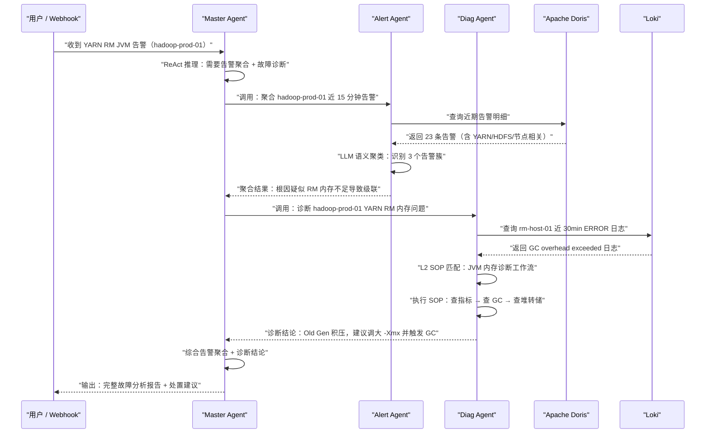

# 04 AI Agent开发实战——基于Eino框架构建生产级多智能体系统

**摘要：**

当大语言模型从"聊天玩具"演变为企业生产系统的核心组件，工程团队面临的第一个严肃问题不是"选哪个模型"，而是"用什么框架把它组装起来"。Python 生态的 [[LangChain]] 固然成熟，但对于以 Go 为主要技术栈的基础设施团队，跨语言调用意味着额外的进程间通信开销、类型系统不匹配和运维复杂度的倍增。本文聚焦字节跳动开源的 Go 原生 LLM 应用开发框架 [[Eino]]，结合作者团队将其应用于大数据运维告警迁移系统以及正在规划中的 Oncall Copilot 项目的真实工程经验，系统性地讲解从单 Agent 到 [[Multi-Agent]] 系统的完整落地路径。全文包含四个完整可运行的 Go 代码示例，涵盖最简对话、[[ReAct]] 工具调用、多轮记忆和 Master-Sub 多智能体四个核心模式，并深入探讨可观测性、错误处理、Prompt 管理和成本控制等生产级工程实践。

---

## 第 1 章 为什么选择 Eino 而不是 LangChain

### 1.1 Python LangChain 在 Go 生产环境中的痛点

[[LangChain]] 是当前 Agent 开发领域生态最丰富的框架，这一点毋庸置疑。在 Python 环境中，它提供了从 Prompt 模板、向量检索、工具调用到 Agent 编排的全套能力，极大地降低了 LLM 应用的开发门槛。然而，当你的核心业务系统是用 Go 编写的——这在大数据基础设施、微服务平台、运维系统等领域非常普遍——LangChain 的选择代价会迅速放大。

**问题一：进程间通信开销不可忽视。** 最常见的做法是以 Python 服务方式启动 LangChain Agent，通过 HTTP/gRPC 与 Go 主服务通信。这引入了额外的网络延迟、序列化开销，以及最让运维头疼的"又一个需要维护的服务"。在告警响应这类对延迟敏感的场景，每增加一跳都是肉眼可见的体验降级。

**问题二：Go 生态的类型安全优势被彻底放弃。** Go 的强类型系统、编译期检查是其在基础设施领域大行其道的核心原因之一。引入 Python Agent 后，工具调用的参数、返回值都变成了动态类型的 JSON，运行时类型错误的风险显著提升。

**问题三：Go 的并发模型无法直接复用。** 大数据运维 Agent 的一个典型场景是"并发巡检多个集群节点"。Go 的 goroutine 和 channel 是处理这类高并发 I/O 的理想工具，而跨进程调用 Python Agent 无法利用这一优势。

**问题四：Python 的 GIL 制约了高并发 Sub-Agent 的扩展性。** 在 [[Multi-Agent]] 架构中，多个 Sub-Agent 并发执行是提升系统吞吐的关键手段。Python 的全局解释器锁（GIL）虽然在异步 I/O 场景有所缓解，但与 Go 原生并发模型相比，性能天花板和运维复杂度仍有明显差距。

> [!warning]
> 以上批评不是否定 LangChain 的价值，而是强调**技术选型必须与团队技术栈和场景约束匹配**。如果你的团队是纯 Python 栈，LangChain/LangGraph 依然是优秀的选择。

### 1.2 Eino 的设计哲学

[[Eino]]（CloudWeGo/eino）是字节跳动在 2024 年开源的 Go 语言 LLM 应用开发框架，其设计目标可以概括为四个关键词：

**Go 原生。** 不是把 LangChain 翻译成 Go，而是从零开始用 Go 的惯用法（idiom）重新设计 LLM 应用的编程模型。接口定义简洁，依赖注入遵循 Go 风格，没有反射魔法，没有动态代理。

**类型安全。** Eino 的组件接口使用泛型（Go 1.21+ 支持）定义，工具的输入输出类型在编译期确定。`ChatModel`、`ToolsNode`、`Retriever` 都有严格的接口约束，类型不匹配在 `go build` 时就会报错。

**高性能可观测。** 框架内置基于 `context` 的 Callback 机制，每一次 LLM 调用、工具执行、节点数据流转都可以挂载观测钩子，与 OpenTelemetry 生态无缝集成。

**图编排优先。** Eino 以有向图（Graph）为核心抽象，每个处理节点是图上的一个顶点，数据依赖关系由边描述。这使得复杂的 Agent 逻辑——分支、循环、并行——可以用直观的图结构表达，而不是嵌套的回调地狱。

### 1.3 框架横向对比

| 维度 | [[LangChain]] (Python) | LangGraph (Python) | [[Eino]] (Go) | LlamaIndex (Python) |
| :--- | :--- | :--- | :--- | :--- |
| **语言** | Python | Python | Go | Python |
| **核心抽象** | Chain / LCEL | StateGraph | Graph / Chain | Pipeline / QueryEngine |
| **类型安全** | 弱（运行时） | 弱（运行时） | 强（编译期） | 弱（运行时） |
| **并发模型** | asyncio | asyncio | goroutine/channel | asyncio |
| **流式支持** | 支持 | 支持 | 原生支持 | 支持 |
| **可观测性** | 需第三方（LangSmith） | 需第三方 | 内置 Callback | 需第三方 |
| **生产就绪度** | 高（生态成熟） | 中（相对新） | 中（快速成熟） | 高（RAG 专精） |
| **Go 生态集成** | 差（跨进程） | 差（跨进程） | 优秀（原生） | 差（跨进程） |
| **社区规模** | 极大 | 大 | 中（增长快） | 大 |
| **适合场景** | 通用 Agent | 有状态 Agent | Go 微服务中的 Agent | RAG 专项 |

### 1.4 Eino 适合的落地场景

根据框架特性，以下场景是 Eino 的优势区间：

**大数据运维 Agent。** 运维系统天然是 Go 的主场——Prometheus、Kubernetes、etcd 都是 Go 生态。Eino Agent 可以直接调用这些系统的 Go SDK，无需跨语言桥接。

**工具密集型任务。** Eino 的 `ToolsNode` 支持并发工具调用，对于需要同时查询多个监控指标、多个日志源的诊断 Agent，Go 的并发优势可以直接体现在工具执行的吞吐上。

**高并发 Sub-Agent。** 在 Master-Sub 架构中，Master 同时调度多个 Sub-Agent 处理不同子任务。用 goroutine 实现的 Sub-Agent 并发，其开销远低于多进程或多线程方案。

**对延迟敏感的在线系统。** Go 的低 GC 暂停时间（通常 < 1ms）和快速启动特性，使得 Eino Agent 在延迟 P99 表现上优于等效的 Python 方案。

---

## 第 2 章 Eino 核心概念与架构

### 2.1 组件体系

[[Eino]] 将 LLM 应用中的常见功能抽象为若干标准化**组件（Component）**，每个组件有明确的输入输出接口。组件是图的节点，组件之间的数据流是图的边。

**ChatModel** 是对 LLM API 调用的封装。它接收 `[]*schema.Message` 作为输入，返回 `*schema.Message` 作为输出。Eino 官方提供了对 OpenAI Compatible 接口的适配，通过 `github.com/cloudwego/eino-ext/components/model/openai` 包即可接入任何兼容 OpenAI API 的模型服务，包括内网代理。

**ToolsNode** 是工具执行节点。它接收 `*schema.Message`（含工具调用请求），并发执行所有被请求的工具，将结果以 `[]*schema.Message`（ToolMessage）的形式返回。支持 `InvokeFunc` 方式定义工具，工具的 JSON Schema 描述会自动生成并注入到 LLM 的系统上下文中。

**Retriever** 是知识检索组件。它接收查询字符串，返回相关文档片段列表，用于 [[RAG]] 场景。Eino 支持对接 Milvus、Elasticsearch 等向量数据库。

**Lambda** 是自定义处理节点。当内置组件无法满足需求时，可以用 `Lambda` 包装任意 Go 函数，将其插入 Graph 的数据流中。这是 Eino 灵活性的关键——任何自定义逻辑都可以成为图的一个节点。

**StateGraph** 是有状态图，节点执行时可以读写共享状态，适合需要跨节点传递中间结果的复杂 Agent。

各组件关系如下：

```mermaid
graph TD
    "用户输入 (string)" --> "Lambda<br/>(消息构造)"
    "Lambda<br/>(消息构造)" --> "ChatModel<br/>(LLM 推理)"
    "ChatModel<br/>(LLM 推理)" -->|"含工具调用请求"| "ToolsNode<br/>(工具执行)"
    "ChatModel<br/>(LLM 推理)" -->|"直接回复"| "输出 (string)"
    "ToolsNode<br/>(工具执行)" --> "ChatModel<br/>(LLM 推理)"
    "Retriever<br/>(知识检索)" -->|"相关文档"| "Lambda<br/>(Prompt 构造)"
    "Lambda<br/>(Prompt 构造)" --> "ChatModel<br/>(LLM 推理)"
```

### 2.2 Graph 编排引擎

**什么是 Graph？** Eino 的 `Graph` 是一个有向无环图（DAG，部分场景支持有环），节点是组件实例，边描述数据流向。调用 `graph.Compile()` 后，Eino 会对图进行拓扑排序、类型检查，并生成可执行的 `Runnable` 对象。

**为什么用图而不是线性链？** 线性 Chain 只能描述"先做 A 再做 B"的顺序关系。而真实的 Agent 逻辑往往包含：
- **条件分支**：LLM 输出含工具调用则走工具执行分支，否则直接返回
- **循环**：工具执行结果返回给 LLM，LLM 继续推理，形成 ReAct 循环
- **并行**：多个工具并发执行，或多个 Sub-Agent 并行处理不同子任务

Graph 对这三种模式都有原生支持，而线性 Chain 只能通过嵌套或 hack 来模拟，可维护性极差。

**Graph 的核心 API：**

```go
// 创建图，泛型参数为 输入类型 和 输出类型
graph := compose.NewGraph[InputType, OutputType]()

// 添加节点：节点名 + 组件实例
graph.AddChatModelNode("llm", chatModel)
graph.AddToolsNode("tools", toolsNode)
graph.AddLambdaNode("process", lambdaFunc)

// 添加边：from 节点 -> to 节点
graph.AddEdge(compose.START, "llm")
graph.AddEdge("llm", "tools")
graph.AddEdge("tools", compose.END)

// 添加条件边：根据节点输出动态决定下一个节点
graph.AddConditionalEdges("llm", routerFunc, map[string]bool{
    "tools": true,   // 路由到工具节点
    compose.END: true, // 路由到结束
})

// 编译图：进行类型检查和拓扑验证
runnable, err := graph.Compile(ctx)
```

**分支节点的工作原理：** `AddConditionalEdges` 接受一个路由函数（router function），该函数接收当前节点的输出，返回下一个节点的名称字符串。Eino 会根据返回值动态选择数据流向。

**循环节点的工作原理：** 当一条边指向图中已存在的上游节点时，形成循环。Eino 的 ReAct Agent 内部就是通过 `tools -> llm` 的回边实现推理循环的。循环的终止条件由条件边的路由函数控制——当 LLM 决定不再调用工具时，路由函数返回 `END`，循环退出。

### 2.3 数据流与 Schema

**Message 类型体系** 是 Eino 数据流的基础单元，与 OpenAI API 的消息格式完全对齐：

| 类型 | Role 值 | 用途 |
| :--- | :--- | :--- |
| `SystemMessage` | `system` | 系统指令、角色设定、背景知识注入 |
| `HumanMessage` | `user` | 用户输入 |
| `AIMessage` | `assistant` | LLM 输出，可包含 `ToolCalls` 字段 |
| `ToolMessage` | `tool` | 工具执行结果，通过 `ToolCallID` 与请求关联 |

**流式处理（Streaming）：** Eino 原生支持流式输出。调用 `runnable.Stream(ctx, input)` 返回一个 `*schema.StreamReader[*schema.Message]`，可以逐 token 读取 LLM 的输出并实时推送到前端，大幅改善用户感知的响应延迟。非流式调用使用 `runnable.Invoke(ctx, input)`。

> [!info]
> Eino 的流式处理不仅限于 LLM 输出，整个 Graph 的数据流都支持流式传播。如果 Graph 中存在流式节点，下游节点可以在上游节点输出完整结果之前就开始处理，实现真正的流水线并行。

---

## 第 3 章 从零开始：第一个 Eino Agent

### 3.1 环境准备

**Go 版本要求：** Eino 使用了泛型特性，要求 Go 1.21 或更高版本。推荐使用 Go 1.22+。

```bash
# 验证 Go 版本
go version
# go version go1.22.5 linux/amd64

# 初始化项目
mkdir eino-agent-demo && cd eino-agent-demo
go mod init eino-agent-demo

# 安装 Eino 核心包
go get github.com/cloudwego/eino@latest

# 安装 Eino 扩展包（包含 OpenAI Compatible 适配器）
go get github.com/cloudwego/eino-ext/components/model/openai@latest
```

**内网模型配置：** 我们的内网 LLM 代理服务部署在 `https://aix.panther.sohurdc.com`，完全兼容 OpenAI API 格式。可用模型包括：

| 模型标识 | 实际模型 | 适用场景 |
| :--- | :--- | :--- |
| `panther-v3` | DeepSeek-V3 | 日常任务、工具调用、代码生成 |
| `panther-r1` | DeepSeek-R1 | 复杂推理、多步规划、数学分析 |
| `claude-sonnet-4-6` | Claude Sonnet 4.6 | 长文本理解、指令遵循、结构化输出 |
| `claude-opus-4-6` | Claude Opus 4.6 | 最高质量推理（成本最高） |

接入方式：将 `BaseURL` 设为 `https://aix.panther.sohurdc.com/v1`，`APIKey` 设为内网鉴权 Token。

### 3.2 Demo 1：最简单的对话 Agent

以下是一个完整可运行的单轮对话示例，展示如何通过 OpenAI Compatible 接口接入内网模型：

```go
package main

import (
	"context"
	"fmt"
	"log"
	"os"
	"time"

	// Eino 的 schema 包定义了 Message 等核心数据类型
	"github.com/cloudwego/eino/schema"

	// eino-ext 提供对 OpenAI Compatible API 的适配实现
	openaimodel "github.com/cloudwego/eino-ext/components/model/openai"
)

func main() {
	// 从环境变量读取内网 API Key，避免硬编码敏感信息
	apiKey := os.Getenv("PANTHER_API_KEY")
	if apiKey == "" {
		// 本地测试时可以使用占位符，实际部署必须注入真实 Key
		apiKey = "your-internal-api-key"
	}

	// 创建带超时的 context，防止 LLM 调用无限阻塞
	// 生产环境中对话接口建议设置 30-60 秒的整体超时
	ctx, cancel := context.WithTimeout(context.Background(), 60*time.Second)
	defer cancel()

	// 初始化 ChatModel，接入内网 OpenAI Compatible 代理
	// openaimodel.NewChatModel 返回实现了 model.ChatModel 接口的实例
	chatModel, err := openaimodel.NewChatModel(ctx, &openaimodel.ChatModelConfig{
		// BaseURL 指向内网代理，末尾加 /v1 符合 OpenAI API 规范
		BaseURL: "https://aix.panther.sohurdc.com/v1",
		// Model 填写内网模型标识，日常任务用 panther-v3（DeepSeek-V3）
		Model: "panther-v3",
		// APIKey 是内网代理的鉴权令牌
		APIKey: apiKey,
		// MaxTokens 限制单次响应的最大 token 数，控制成本
		MaxTokens: ptrOf(2048),
		// Temperature 控制输出的随机性，0.7 适合对话场景
		// 工具调用场景建议调低到 0.1-0.3 以提升指令遵循的稳定性
		Temperature: ptrOf(float32(0.7)),
	})
	if err != nil {
		log.Fatalf("初始化 ChatModel 失败: %v", err)
	}

	// 构造对话消息列表
	// OpenAI 格式的对话由多条 Message 组成，顺序即上下文顺序
	messages := []*schema.Message{
		// SystemMessage 设定 AI 的角色和行为约束
		// 在运维 Agent 中，系统 Prompt 通常包含集群背景、工具说明、输出格式要求
		schema.SystemMessage("你是一个大数据集群运维专家，专注于 Hadoop/Spark/Flink 生态。" +
			"回答时要简洁专业，给出具体可操作的建议。"),
		// HumanMessage 是用户的提问
		schema.UserMessage("YARN ResourceManager 的 JVM 堆内存占用达到 85%，应该如何处理？"),
	}

	// 调用 LLM，Generate 是非流式调用，等待完整响应返回
	// 流式调用使用 chatModel.Stream(ctx, messages)
	response, err := chatModel.Generate(ctx, messages)
	if err != nil {
		log.Fatalf("LLM 调用失败: %v", err)
	}

	// response 是 *schema.Message 类型，Content 字段包含 LLM 的文本回复
	fmt.Printf("AI 回复:\n%s\n", response.Content)
}

// ptrOf 是 Go 泛型辅助函数，将值类型转换为指针
// 在 Eino 的配置结构中，很多可选字段使用指针来区分"未设置"和"零值"
func ptrOf[T any](v T) *T {
	return &v
}
```

> [!note]
> `ptrOf` 这个辅助函数在 Eino 项目中会反复用到。Eino 的配置结构大量使用指针字段（如 `*int`、`*float32`），目的是区分"用户没有设置这个参数"（nil）和"用户显式设置为零值"（非 nil 的零值指针）。建议在项目中统一提供这个工具函数。

### 3.3 Demo 2：带工具调用的 Agent（ReAct 模式）

[[ReAct]]（Reasoning + Acting）是当前最主流的 Agent 推理范式：LLM 交替进行思考（Reasoning）和工具调用（Acting），直到获得足够信息后给出最终答案。以下示例定义了两个运维工具，并用 Eino 构建完整的 ReAct 循环：

```go
package main

import (
	"context"
	"encoding/json"
	"fmt"
	"log"
	"os"
	"time"

	// compose 包提供 Graph 编排能力
	"github.com/cloudwego/eino/compose"
	// flow 包提供预置的 Agent 编排模式（如 ReAct Agent）
	"github.com/cloudwego/eino/flow/agent/react"
	"github.com/cloudwego/eino/schema"
	openaimodel "github.com/cloudwego/eino-ext/components/model/openai"
)

// ClusterMetricInput 定义 GetClusterMetric 工具的输入参数结构
// json tag 用于生成工具的 JSON Schema，LLM 会根据 Schema 决定如何调用
type ClusterMetricInput struct {
	// ClusterName 目标集群名称，如 "hadoop-prod-01"
	ClusterName string `json:"cluster_name" jsonschema:"description=集群名称,required"`
	// MetricName 指标名称，如 "yarn_rm_heap_used_ratio"
	MetricName string `json:"metric_name" jsonschema:"description=指标名称（支持 PromQL 风格的指标名）,required"`
	// TimeRangeMinutes 查询最近 N 分钟的数据，默认 5
	TimeRangeMinutes int `json:"time_range_minutes" jsonschema:"description=查询时间范围（分钟），默认5"`
}

// DiagCommandInput 定义 RunDiagCommand 工具的输入参数结构
type DiagCommandInput struct {
	// Host 目标主机 IP 或主机名
	Host string `json:"host" jsonschema:"description=目标主机 IP 或主机名,required"`
	// Command 诊断命令，仅允许白名单中的只读命令
	Command string `json:"command" jsonschema:"description=诊断命令（仅支持只读命令如 top/df/free/jstat）,required"`
}

func main() {
	apiKey := os.Getenv("PANTHER_API_KEY")
	if apiKey == "" {
		apiKey = "your-internal-api-key"
	}

	ctx, cancel := context.WithTimeout(context.Background(), 120*time.Second)
	defer cancel()

	// 初始化 ChatModel
	// 工具调用场景建议使用 Temperature=0，确保工具参数生成的稳定性
	chatModel, err := openaimodel.NewChatModel(ctx, &openaimodel.ChatModelConfig{
		BaseURL:     "https://aix.panther.sohurdc.com/v1",
		Model:       "panther-v3",
		APIKey:      apiKey,
		MaxTokens:   ptrOf(4096),
		Temperature: ptrOf(float32(0.1)), // 工具调用场景降低随机性
	})
	if err != nil {
		log.Fatalf("初始化 ChatModel 失败: %v", err)
	}

	// 定义工具列表
	// schema.NewTool 将 Go 函数包装为 Eino 工具，自动从函数签名和 struct tag 生成 JSON Schema
	tools := []*schema.ToolInfo{
		{
			// Name 是工具的唯一标识，LLM 通过这个名称决定调用哪个工具
			Name: "GetClusterMetric",
			// Desc 是工具的自然语言描述，高质量的描述对 LLM 的工具选择准确率至关重要
			Desc: "查询大数据集群的实时监控指标，支持查询 YARN、HDFS、Spark、Flink 等组件的关键指标",
			// ParamsOneOf 指定工具的参数 Schema，用于生成 function calling 的 JSON Schema
			ParamsOneOf: schema.NewParamsOneOfByParams(map[string]*schema.ParameterInfo{
				"cluster_name": {
					Type:     "string",
					Desc:     "集群名称，如 hadoop-prod-01",
					Required: true,
				},
				"metric_name": {
					Type:     "string",
					Desc:     "指标名称，如 yarn_rm_heap_used_ratio、hdfs_namenode_files_total",
					Required: true,
				},
				"time_range_minutes": {
					Type: "integer",
					Desc: "查询最近 N 分钟的数据，默认为 5",
				},
			}),
		},
		{
			Name: "RunDiagCommand",
			Desc: "在指定主机上执行只读诊断命令，可用于查看进程状态、内存使用、磁盘空间等信息",
			ParamsOneOf: schema.NewParamsOneOfByParams(map[string]*schema.ParameterInfo{
				"host": {
					Type:     "string",
					Desc:     "目标主机 IP 或主机名",
					Required: true,
				},
				"command": {
					Type:     "string",
					Desc:     "诊断命令，支持：top -bn1、df -h、free -m、jstat -gcutil <pid>",
					Required: true,
				},
			}),
		},
	}

	// 将工具绑定到 ChatModel，使 LLM 知道可以调用哪些工具
	// BindTools 会将工具的 JSON Schema 附加到每次 LLM 请求中
	if err := chatModel.BindTools(tools); err != nil {
		log.Fatalf("绑定工具失败: %v", err)
	}

	// 构建 ReAct Agent
	// react.NewAgent 内部创建了一个 Graph：ChatModel -> 条件路由 -> ToolsNode（或 END）
	// 这个 Graph 实现了标准的 ReAct 推理循环
	agentRunnable, err := react.NewAgent(ctx, &react.AgentConfig{
		// 注入已绑定工具的 ChatModel
		Model: chatModel,
		// ToolsConfig 配置工具执行节点
		ToolsConfig: compose.ToolsNodeConfig{
			// Tools 是工具的实际执行函数列表，与 ToolInfo 的 Name 对应
			Tools: []schema.Tool{
				// 定义 GetClusterMetric 的实际执行逻辑（此处为模拟）
				schema.NewTool(
					"GetClusterMetric",
					"查询大数据集群的实时监控指标",
					func(ctx context.Context, input map[string]any) (string, error) {
						// 实际生产中这里会调用 Prometheus/VictoriaMetrics 的 HTTP API
						// 这里用模拟数据演示数据流
						clusterName, _ := input["cluster_name"].(string)
						metricName, _ := input["metric_name"].(string)
						timeRange, _ := input["time_range_minutes"].(float64)
						if timeRange == 0 {
							timeRange = 5
						}

						// 模拟返回指标数据（生产中替换为真实查询）
						mockData := map[string]any{
							"cluster":    clusterName,
							"metric":     metricName,
							"value":      87.3,
							"unit":       "%",
							"time_range": fmt.Sprintf("最近 %.0f 分钟", timeRange),
							"trend":      "持续上升，过去30分钟从75%上升至87%",
							"threshold":  "告警阈值: 80%（已超出）",
						}
						result, _ := json.Marshal(mockData)
						return string(result), nil
					},
				),
				// 定义 RunDiagCommand 的实际执行逻辑（此处为模拟）
				schema.NewTool(
					"RunDiagCommand",
					"在指定主机上执行只读诊断命令",
					func(ctx context.Context, input map[string]any) (string, error) {
						// 实际生产中这里会通过 SSH 客户端或 Agent 执行命令
						// 必须严格校验命令白名单，防止命令注入风险
						host, _ := input["host"].(string)
						command, _ := input["command"].(string)

						// 命令白名单校验（生产必须实现）
						allowedCommands := map[string]bool{
							"top":   true,
							"df":    true,
							"free":  true,
							"jstat": true,
						}
						// 提取命令的第一个词进行白名单检查
						cmdName := command
						if len(command) > 0 {
							for i, c := range command {
								if c == ' ' {
									cmdName = command[:i]
									break
								}
							}
						}
						if !allowedCommands[cmdName] {
							return "", fmt.Errorf("命令 %s 不在允许列表中", cmdName)
						}

						// 模拟命令执行结果
						mockOutput := fmt.Sprintf(
							"[%s] 执行命令: %s\n"+
								"输出结果（模拟）:\n"+
								"  JVM Heap: 87.3%% used (7.0GB/8GB)\n"+
								"  Old Gen GC 频率: 2次/分钟（异常，正常应 < 0.1次/分钟）\n"+
								"  建议: 调整 -Xmx 到 12GB 或检查是否存在内存泄漏",
							host, command,
						)
						return mockOutput, nil
					},
				),
			},
		},
		// MaxStep 防止 Agent 陷入无限工具调用循环
		// 生产环境建议设置为 10-20，视任务复杂度调整
		MaxStep: 15,
	})
	if err != nil {
		log.Fatalf("创建 ReAct Agent 失败: %v", err)
	}

	// 构造初始消息
	input := &schema.Message{
		Role: schema.User,
		Content: "hadoop-prod-01 集群的 YARN ResourceManager 出现 JVM 内存告警，" +
			"请帮我查询当前 yarn_rm_heap_used_ratio 指标，" +
			"并在 rm-host-01 上执行 jstat -gcutil <pid> 查看 GC 情况，然后给出诊断建议。",
	}

	// 运行 Agent，触发 ReAct 推理循环
	// Agent 会自动处理：LLM 推理 -> 工具调用 -> 结果回注 -> 继续推理 的完整循环
	output, err := agentRunnable.Generate(ctx, []*schema.Message{input})
	if err != nil {
		log.Fatalf("Agent 执行失败: %v", err)
	}

	fmt.Printf("\n=== Agent 最终诊断 ===\n%s\n", output.Content)
}

// ptrOf 泛型辅助函数
func ptrOf[T any](v T) *T {
	return &v
}
```

> [!warning]
> 工具调用中的命令执行（`RunDiagCommand`）在生产环境必须实现严格的白名单校验和权限控制。允许 LLM 自由生成命令并执行是极高的安全风险。建议将允许的命令集合预定义在配置文件中，并要求 SRE Owner 审批变更。

### 3.4 Demo 3：带记忆的多轮对话 Agent

单轮对话无法支持"那上面提到的那台机器呢？"这类指代追问。生产运维场景中，用户与 Oncall Copilot 的交互往往是多轮的——先描述现象，再追问原因，再请求执行操作。以下示例演示如何在 Eino Graph 中注入对话历史：

```go
package main

import (
	"bufio"
	"context"
	"fmt"
	"log"
	"os"
	"strings"
	"time"

	"github.com/cloudwego/eino/schema"
	openaimodel "github.com/cloudwego/eino-ext/components/model/openai"
)

// ConversationMemory 是一个简单的内存对话历史存储
// 生产环境中应替换为 Redis 或数据库存储，支持跨请求的会话持久化
type ConversationMemory struct {
	// messages 存储完整的对话历史
	messages []*schema.Message
	// maxMessages 限制历史消息数量，防止超出 LLM 的上下文窗口
	// DeepSeek-V3 上下文窗口为 64K tokens，大约可容纳 50-100 条消息
	maxMessages int
}

// NewConversationMemory 创建对话记忆实例
func NewConversationMemory(maxMessages int) *ConversationMemory {
	return &ConversationMemory{
		messages:    make([]*schema.Message, 0),
		maxMessages: maxMessages,
	}
}

// Add 向历史中追加一条消息
func (m *ConversationMemory) Add(msg *schema.Message) {
	m.messages = append(m.messages, msg)
	// 超出限制时，移除最早的非系统消息（保留 SystemMessage）
	// 这里采用简单的滑动窗口策略，生产中可改为基于 token 数量的截断
	for len(m.messages) > m.maxMessages {
		// 找到第一条非系统消息并移除
		for i, msg := range m.messages {
			if msg.Role != schema.System {
				m.messages = append(m.messages[:i], m.messages[i+1:]...)
				break
			}
		}
	}
}

// GetHistory 返回当前完整历史（包含系统消息）
func (m *ConversationMemory) GetHistory() []*schema.Message {
	// 返回切片副本，防止外部修改影响内部状态
	result := make([]*schema.Message, len(m.messages))
	copy(result, m.messages)
	return result
}

func main() {
	apiKey := os.Getenv("PANTHER_API_KEY")
	if apiKey == "" {
		apiKey = "your-internal-api-key"
	}

	// 初始化 ChatModel
	ctx := context.Background()
	chatModel, err := openaimodel.NewChatModel(ctx, &openaimodel.ChatModelConfig{
		BaseURL:     "https://aix.panther.sohurdc.com/v1",
		Model:       "panther-v3",
		APIKey:      apiKey,
		MaxTokens:   ptrOf(2048),
		Temperature: ptrOf(float32(0.7)),
	})
	if err != nil {
		log.Fatalf("初始化 ChatModel 失败: %v", err)
	}

	// 初始化对话记忆，最多保留 20 条消息（约 10 轮对话）
	memory := NewConversationMemory(20)

	// 向记忆中注入系统 Prompt
	// 系统 Prompt 定义 Agent 的角色、能力范围和输出格式
	// 在多轮对话中，系统 Prompt 应始终保留在消息列表首位
	memory.Add(schema.SystemMessage(
		"你是 Oncall Copilot，一个专注于大数据集群（Hadoop/Spark/Flink/Kafka）运维的 AI 助手。\n" +
			"你的职责：\n" +
			"1. 分析告警和异常现象，给出初步诊断结论\n" +
			"2. 提供具体可执行的排查步骤\n" +
			"3. 根据上下文记住对话中提到的集群名、主机名、组件名，支持指代消解\n" +
			"4. 回答简洁专业，优先给出结论，再展开分析过程\n" +
			"当前集群清单：hadoop-prod-01（生产）、hadoop-staging-01（预发）、spark-prod-01（生产）",
	))

	// 启动交互式多轮对话循环
	fmt.Println("=== Oncall Copilot 已就绪，输入 'exit' 退出 ===")
	scanner := bufio.NewScanner(os.Stdin)

	for {
		fmt.Print("\n你: ")
		if !scanner.Scan() {
			break
		}
		userInput := strings.TrimSpace(scanner.Text())
		if userInput == "" {
			continue
		}
		if userInput == "exit" {
			fmt.Println("对话结束。")
			break
		}

		// 将用户输入追加到历史
		userMsg := schema.UserMessage(userInput)
		memory.Add(userMsg)

		// 创建带超时的 context，单轮对话超时设为 30 秒
		callCtx, cancel := context.WithTimeout(ctx, 30*time.Second)

		// 获取完整历史并调用 LLM
		// 关键点：每次调用都传入完整的对话历史，LLM 通过历史上下文实现多轮理解
		history := memory.GetHistory()
		response, err := chatModel.Generate(callCtx, history)
		cancel() // 及时释放 context 资源

		if err != nil {
			fmt.Printf("[错误] LLM 调用失败: %v\n", err)
			// 失败时从历史中移除刚添加的用户消息，保持历史的一致性
			history = memory.GetHistory()
			if len(history) > 0 {
				// 重新构建不含最后一条消息的历史
				memory.messages = history[:len(history)-1]
			}
			continue
		}

		// 将 AI 回复追加到历史，为下一轮对话提供上下文
		memory.Add(response)

		fmt.Printf("\nCopilot: %s\n", response.Content)
	}
}

func ptrOf[T any](v T) *T {
	return &v
}
```

> [!info]
> 生产环境中，对话历史不能只存储在内存中。当服务重启或用户从不同终端接入时，历史会丢失。建议将 `ConversationMemory` 改为基于 Redis 的实现，以 `session_id` 为 key 存储序列化后的消息列表，TTL 设置为 24 小时（覆盖一个 Oncall 班次）。

---

## 第 4 章 Multi-Agent 系统设计

### 4.1 Master-Sub 架构模式

**为什么需要 Multi-Agent？** 单个 Agent 面对复杂任务时存在几个核心局限：

其一，**上下文窗口约束**。一个需要同时分析 10 个集群的健康状态、查询 50 条告警记录、对比历史趋势的任务，其中间状态和工具调用结果很容易超出单个 LLM 的上下文窗口限制。

其二，**专业化深度与通用性的矛盾**。优秀的运维 Agent 需要对 HDFS 坏块、YARN 调度死锁、Kafka 消费积压等各类故障都有深度理解。把所有领域知识塞进一个 Agent 的系统 Prompt，既导致 Prompt 臃肿，又使得各领域的专业指令相互干扰。

其三，**并行执行效率**。巡检 10 个集群如果串行处理，耗时是单集群的 10 倍。[[Multi-Agent]] 架构可以让多个专化 Sub-Agent 并行工作，大幅提升吞吐。

**Master Agent 的职责：**

Master Agent 是系统的入口和调度核心，承担三类职责：

1. **意图识别**：理解用户的自然语言请求，判断需要哪个 Sub-Agent 处理（或需要多个协作）
2. **任务分发**：将复杂任务拆解为子任务，分发给对应的 Sub-Agent，提供必要的上下文
3. **结果聚合**：收集各 Sub-Agent 的输出，综合分析，向用户呈现连贯的最终答案

**Sub-Agent 的特化设计原则：**

每个 Sub-Agent 应当聚焦单一领域，有独立的系统 Prompt（包含领域知识和 SOP）、独立的工具集（只暴露本领域需要的工具）、独立的模型配置（根据任务难度选择合适的模型）。

### 4.2 Oncall Copilot 架构复盘

**项目背景：** 我们团队维护的大数据基础设施包含数十个 Hadoop/Spark/Flink 集群，监控指标来自 Zabbix、Foxeye（内部 Prometheus 方言）和 Ambari，每天产生数百条告警，其中大量是重复告警或因同一根因触发的告警风暴。SRE 的有效 Oncall 时间有相当比例浪费在告警分类和重复排查上。

**Oncall Copilot 的目标：** 构建一个由 LLM 驱动的运维中枢，实现告警降噪（减少 60% 的无效告警干扰）、故障快速定界（L1 通用联动诊断在 30 秒内出结论）和日常自动化（集群巡检、架构绘图、规则迁移）。

**系统总体架构：**

```mermaid
graph TD
    "用户 / Webhook" -->|"自然语言 / 告警事件"| "Master Agent<br/>(对话中枢)"
    "Master Agent<br/>(对话中枢)" -->|"意图: 告警聚合"| "Alert Agent<br/>(告警聚合)"
    "Master Agent<br/>(对话中枢)" -->|"意图: 故障诊断"| "Diag Agent<br/>(故障诊断)"
    "Master Agent<br/>(对话中枢)" -->|"意图: 集群巡检"| "Inspect Agent<br/>(集群巡检)"
    "Master Agent<br/>(对话中枢)" -->|"直接调用效能工具"| "Utility Tools<br/>(NL2PromQL / NL2Drawio)"
    "Alert Agent<br/>(告警聚合)" --> "Apache Doris<br/>(告警存储)"
    "Diag Agent<br/>(故障诊断)" --> "Loki<br/>(日志查询)"
    "Diag Agent<br/>(故障诊断)" --> "Foxeye<br/>(指标查询)"
    "Diag Agent<br/>(故障诊断)" --> "CMDB<br/>(拓扑关联)"
    "Diag Agent<br/>(故障诊断)" --> "Milvus<br/>(RAG 历史经验)"
    "Inspect Agent<br/>(集群巡检)" --> "Ambari API<br/>(组件状态)"
    "Inspect Agent<br/>(集群巡检)" --> "Prometheus<br/>(容量指标)"
```

**各 Agent 详细设计：**

**Master Agent（对话中枢）** 基于 [[ReAct]] 范式实现。它持有三个 Sub-Agent 和效能工具箱作为其"工具"，通过工具调用的方式委托子任务。上下文管理维护当前会话历史，支持跨轮的指代消解（如"那另外一台机器呢？"——Master 从历史中提取上一轮提到的主机名）。模型选择：`claude-sonnet-4-6`，因为 Master 需要最强的指令理解和意图识别能力。

**告警聚合 Agent（Alert Agent）** 核心任务是解决"告警风暴"。工作链路：接入层（Zabbix/Foxeye/Ambari Webhook）→ 清洗层（异构告警格式统一）→ 聚合层（LLM 语义聚类，识别同根因的告警簇）→ 存储层（写入 Apache Doris）。模型选择：`panther-v3`（DeepSeek-V3），告警聚类是中等难度任务，V3 的成本效益比最优。

**故障诊断 Agent（Diag Agent）** 分级诊断策略：
- **L1 通用联动**：触发告警时自动拉取同时段、同主机的 Loki 异常日志与 Foxeye 关键指标，交叉比对。目标是在 30 秒内给出初步结论。
- **L2 专家 SOP**：对特定严重故障（HDFS 坏块风暴、YARN 调度死锁、磁盘 I/O 夯死），加载固化诊断工作流（Skill Markdown 文件），强制 Agent 按照预定路径执行，如"查 IOPS → 查 dmesg → 查挂载状态"。

**集群巡检 Agent（Inspect Agent）** 主动预防型。通过 Cron 定时唤醒，依次请求各组件的元数据接口，综合判定节点容量、活跃度、HA 状态，生成 Markdown 巡检报告。巡检结果写入 Doris，支持历史趋势对比。

**Multi-Agent 交互时序图（告警处理场景）：**



### 4.3 Demo 4：最小可用的 Master-Sub Agent

以下是一个可运行的 Master-Sub 多智能体系统实现，包含 Master Agent 路由逻辑和两个专化 Sub-Agent：

```go
package main

import (
	"context"
	"fmt"
	"log"
	"os"
	"strings"
	"time"

	"github.com/cloudwego/eino/schema"
	openaimodel "github.com/cloudwego/eino-ext/components/model/openai"
)

// SubAgent 定义 Sub-Agent 的通用接口
// 每个 Sub-Agent 接收任务描述和上下文，返回执行结果
type SubAgent interface {
	// Name 返回 Sub-Agent 的名称，用于 Master 路由和日志
	Name() string
	// Execute 执行具体任务，返回结果文本
	Execute(ctx context.Context, task string, context map[string]string) (string, error)
}

// MetricsAgent 指标分析 Sub-Agent，专注于集群指标查询和趋势分析
type MetricsAgent struct {
	// chatModel 是该 Sub-Agent 专用的 LLM 实例
	// Sub-Agent 可以使用不同于 Master 的模型（如使用更轻量的模型降低成本）
	chatModel interface {
		Generate(ctx context.Context, messages []*schema.Message) (*schema.Message, error)
	}
}

// NewMetricsAgent 创建指标分析 Sub-Agent
// 使用 panther-v3 模型，适合结构化数据分析任务
func NewMetricsAgent(ctx context.Context, apiKey string) (*MetricsAgent, error) {
	model, err := openaimodel.NewChatModel(ctx, &openaimodel.ChatModelConfig{
		BaseURL:     "https://aix.panther.sohurdc.com/v1",
		Model:       "panther-v3", // Sub-Agent 使用轻量模型降低成本
		APIKey:      apiKey,
		MaxTokens:   ptrOf(2048),
		Temperature: ptrOf(float32(0.1)), // 数据分析场景要求高确定性
	})
	if err != nil {
		return nil, fmt.Errorf("创建 MetricsAgent LLM 失败: %w", err)
	}
	return &MetricsAgent{chatModel: model}, nil
}

func (a *MetricsAgent) Name() string {
	return "MetricsAgent"
}

func (a *MetricsAgent) Execute(ctx context.Context, task string, extraContext map[string]string) (string, error) {
	// 构建 MetricsAgent 专属的系统 Prompt
	// 系统 Prompt 包含该 Agent 的专业领域知识和可用工具说明
	systemPrompt := `你是一个大数据集群指标分析专家，专注于以下指标的解读：
- YARN: rm_heap_used_ratio（RM 堆内存使用率）、pending_containers（待调度容器数）
- HDFS: namenode_memory_heap_used（NN 内存）、under_replicated_blocks（副本不足块数）
- 系统: cpu_usage、disk_io_util、network_bytes_recv

分析规则：
- heap_used_ratio > 80% → 高风险，建议立即处理
- pending_containers > 1000 → 调度积压，需检查资源配置
- under_replicated_blocks > 0 → 数据可靠性风险

请基于提供的指标数据给出：1) 异常指标识别 2) 风险等级评估 3) 具体处置建议`

	// 模拟从 Prometheus 查询到的指标数据（生产中替换为真实查询）
	// 将任务和上下文数据一起注入 HumanMessage
	userContent := task
	if len(extraContext) > 0 {
		userContent += "\n\n当前指标数据（来自监控系统）:\n"
		for k, v := range extraContext {
			userContent += fmt.Sprintf("- %s: %s\n", k, v)
		}
	}

	messages := []*schema.Message{
		schema.SystemMessage(systemPrompt),
		schema.UserMessage(userContent),
	}

	response, err := a.chatModel.Generate(ctx, messages)
	if err != nil {
		return "", fmt.Errorf("MetricsAgent LLM 调用失败: %w", err)
	}
	return response.Content, nil
}

// LogAnalysisAgent 日志分析 Sub-Agent，专注于异常日志的识别和根因分析
type LogAnalysisAgent struct {
	chatModel interface {
		Generate(ctx context.Context, messages []*schema.Message) (*schema.Message, error)
	}
}

// NewLogAnalysisAgent 创建日志分析 Sub-Agent
// 日志分析需要较强的推理能力，使用 panther-r1（DeepSeek-R1）
func NewLogAnalysisAgent(ctx context.Context, apiKey string) (*LogAnalysisAgent, error) {
	model, err := openaimodel.NewChatModel(ctx, &openaimodel.ChatModelConfig{
		BaseURL: "https://aix.panther.sohurdc.com/v1",
		// 日志根因分析是推理密集型任务，使用 R1 模型提升准确率
		// 代价是 R1 的延迟更高（需要 Chain-of-Thought），适合非实时场景
		Model:       "panther-r1",
		APIKey:      apiKey,
		MaxTokens:   ptrOf(4096), // 日志分析可能需要较长的输出
		Temperature: ptrOf(float32(0.3)),
	})
	if err != nil {
		return nil, fmt.Errorf("创建 LogAnalysisAgent LLM 失败: %w", err)
	}
	return &LogAnalysisAgent{chatModel: model}, nil
}

func (a *LogAnalysisAgent) Name() string {
	return "LogAnalysisAgent"
}

func (a *LogAnalysisAgent) Execute(ctx context.Context, task string, extraContext map[string]string) (string, error) {
	systemPrompt := `你是一个大数据系统日志分析专家，擅长从 Hadoop/Spark/Flink 的错误日志中识别根因。

常见异常模式：
- "GC overhead limit exceeded" → JVM 内存不足，GC 占用 CPU > 98%
- "Connection refused" + NameNode → NN 宕机或网络分区
- "Container killed by YARN" → 内存超限，检查 mapreduce.map.memory.mb 配置
- "No space left on device" → 磁盘满，检查 DataNode 数据目录
- "Lost task tracker" → NodeManager 心跳超时，检查网络和主机状态

分析输出格式：
1. **根因判断**：最可能的故障原因（一句话）
2. **证据链**：关键日志行及其含义
3. **影响范围**：哪些作业/用户受影响
4. **处置步骤**：按优先级排列的操作清单`

	userContent := task
	if len(extraContext) > 0 {
		userContent += "\n\n相关日志片段（来自 Loki）:\n"
		for k, v := range extraContext {
			userContent += fmt.Sprintf("[%s]\n%s\n\n", k, v)
		}
	}

	messages := []*schema.Message{
		schema.SystemMessage(systemPrompt),
		schema.UserMessage(userContent),
	}

	response, err := a.chatModel.Generate(ctx, messages)
	if err != nil {
		return "", fmt.Errorf("LogAnalysisAgent LLM 调用失败: %w", err)
	}
	return response.Content, nil
}

// MasterAgent 主控 Agent，负责意图识别、任务路由和结果聚合
type MasterAgent struct {
	// chatModel 使用最强模型，因为 Master 承担最复杂的意图理解任务
	chatModel interface {
		Generate(ctx context.Context, messages []*schema.Message) (*schema.Message, error)
	}
	// subAgents 是可调用的 Sub-Agent 映射表
	subAgents map[string]SubAgent
}

// NewMasterAgent 创建 Master Agent
func NewMasterAgent(ctx context.Context, apiKey string, subAgents []SubAgent) (*MasterAgent, error) {
	// Master 使用 claude-sonnet-4-6，强调指令遵循和意图理解
	model, err := openaimodel.NewChatModel(ctx, &openaimodel.ChatModelConfig{
		BaseURL:     "https://aix.panther.sohurdc.com/v1",
		Model:       "claude-sonnet-4-6",
		APIKey:      apiKey,
		MaxTokens:   ptrOf(1024), // Master 的路由决策不需要长输出
		Temperature: ptrOf(float32(0.1)),
	})
	if err != nil {
		return nil, fmt.Errorf("创建 MasterAgent LLM 失败: %w", err)
	}

	agentMap := make(map[string]SubAgent)
	for _, agent := range subAgents {
		agentMap[agent.Name()] = agent
	}

	return &MasterAgent{
		chatModel: model,
		subAgents: agentMap,
	}, nil
}

// Route 使用 LLM 进行意图识别，决定调用哪些 Sub-Agent
// 返回需要调用的 Sub-Agent 名称列表
func (m *MasterAgent) Route(ctx context.Context, userQuery string) ([]string, error) {
	// 构建路由系统 Prompt，严格约束输出格式以确保可解析性
	// 生产中建议使用 JSON 格式输出 + 结构化解析，比自由文本更稳定
	availableAgents := make([]string, 0, len(m.subAgents))
	for name := range m.subAgents {
		availableAgents = append(availableAgents, name)
	}

	systemPrompt := fmt.Sprintf(`你是一个运维请求路由器，根据用户问题决定调用哪些 Sub-Agent。

可用的 Sub-Agent：
- MetricsAgent：处理指标查询、性能分析、容量评估类问题
- LogAnalysisAgent：处理日志分析、错误根因、异常诊断类问题

路由规则：
- 如果问题涉及指标/性能/容量 → 包含 MetricsAgent
- 如果问题涉及日志/错误/根因 → 包含 LogAnalysisAgent
- 复杂故障通常需要两者协同

输出格式（严格遵守，只输出逗号分隔的 Agent 名称）：
示例输出: MetricsAgent,LogAnalysisAgent
或: MetricsAgent
或: LogAnalysisAgent

可用 Agent: %s`, strings.Join(availableAgents, ", "))

	messages := []*schema.Message{
		schema.SystemMessage(systemPrompt),
		schema.UserMessage("用户问题: " + userQuery),
	}

	response, err := m.chatModel.Generate(ctx, messages)
	if err != nil {
		return nil, fmt.Errorf("路由 LLM 调用失败: %w", err)
	}

	// 解析路由结果：按逗号分割，过滤空字符串
	routeStr := strings.TrimSpace(response.Content)
	parts := strings.Split(routeStr, ",")
	var selectedAgents []string
	for _, part := range parts {
		agentName := strings.TrimSpace(part)
		if _, exists := m.subAgents[agentName]; exists {
			selectedAgents = append(selectedAgents, agentName)
		}
	}

	if len(selectedAgents) == 0 {
		// 路由失败时的降级策略：默认调用 MetricsAgent
		log.Printf("[Master] 路由解析失败（原始输出：%s），降级到默认 MetricsAgent", routeStr)
		return []string{"MetricsAgent"}, nil
	}

	return selectedAgents, nil
}

// Process 是 MasterAgent 的核心入口，处理完整的用户请求
func (m *MasterAgent) Process(ctx context.Context, userQuery string) (string, error) {
	log.Printf("[Master] 收到请求: %s", userQuery)

	// 第一步：路由决策
	routeCtx, routeCancel := context.WithTimeout(ctx, 15*time.Second)
	selectedAgents, err := m.Route(routeCtx, userQuery)
	routeCancel()
	if err != nil {
		return "", fmt.Errorf("路由决策失败: %w", err)
	}
	log.Printf("[Master] 路由到 Sub-Agent: %v", selectedAgents)

	// 第二步：并发调用 Sub-Agent
	// 使用 goroutine + channel 并行执行多个 Sub-Agent，利用 Go 并发优势
	type subResult struct {
		agentName string
		result    string
		err       error
	}
	resultCh := make(chan subResult, len(selectedAgents))

	// 模拟上下文数据（生产中这里会从 Prometheus/Loki 实时查询）
	mockMetrics := map[string]string{
		"yarn_rm_heap_used_ratio": "87.3%（告警阈值 80%）",
		"pending_containers":      "1523（高于正常值 200）",
		"hdfs_under_replicated":   "0（正常）",
	}
	mockLogs := map[string]string{
		"rm-host-01 ERROR": "2026-03-17 14:23:15 ERROR [GC overhead limit exceeded] " +
			"java.lang.OutOfMemoryError: GC overhead limit exceeded\n" +
			"\tat org.apache.hadoop.yarn.server.resourcemanager.scheduler.capacity.CapacityScheduler.allocateContainersToNode",
	}

	for _, agentName := range selectedAgents {
		// 捕获循环变量，避免 goroutine 闭包引用同一变量的经典 Go 坑
		name := agentName
		agent := m.subAgents[name]

		go func() {
			// 每个 Sub-Agent 有独立的超时 context
			subCtx, subCancel := context.WithTimeout(ctx, 60*time.Second)
			defer subCancel()

			var extraCtx map[string]string
			switch name {
			case "MetricsAgent":
				extraCtx = mockMetrics
			case "LogAnalysisAgent":
				extraCtx = mockLogs
			}

			result, err := agent.Execute(subCtx, userQuery, extraCtx)
			resultCh <- subResult{agentName: name, result: result, err: err}
		}()
	}

	// 第三步：收集所有 Sub-Agent 的结果
	subResults := make(map[string]string)
	for range selectedAgents {
		r := <-resultCh
		if r.err != nil {
			log.Printf("[Master] Sub-Agent %s 执行失败: %v", r.agentName, r.err)
			subResults[r.agentName] = fmt.Sprintf("[执行失败: %v]", r.err)
		} else {
			subResults[r.agentName] = r.result
			log.Printf("[Master] Sub-Agent %s 完成，结果长度: %d 字符", r.agentName, len(r.result))
		}
	}

	// 第四步：Master 聚合 Sub-Agent 的结果，生成最终回复
	aggregateCtx, aggregateCancel := context.WithTimeout(ctx, 30*time.Second)
	defer aggregateCancel()

	// 构建聚合 Prompt，将各 Sub-Agent 的结果作为上下文
	aggregatePrompt := "你是运维专家助手，请综合以下各专项分析结果，给出简洁的最终诊断报告。\n" +
		"要求：先给结论，再给处置步骤，总字数控制在 300 字以内。"

	userContent := fmt.Sprintf("用户问题: %s\n\n各 Sub-Agent 分析结果:\n", userQuery)
	for agentName, result := range subResults {
		userContent += fmt.Sprintf("\n=== %s 分析 ===\n%s\n", agentName, result)
	}

	finalMessages := []*schema.Message{
		schema.SystemMessage(aggregatePrompt),
		schema.UserMessage(userContent),
	}

	finalResponse, err := m.chatModel.Generate(aggregateCtx, finalMessages)
	if err != nil {
		// 聚合失败时的降级策略：直接拼接 Sub-Agent 结果返回
		log.Printf("[Master] 聚合 LLM 调用失败，降级为直接拼接: %v", err)
		var parts []string
		for agentName, result := range subResults {
			parts = append(parts, fmt.Sprintf("【%s】\n%s", agentName, result))
		}
		return strings.Join(parts, "\n\n---\n\n"), nil
	}

	return finalResponse.Content, nil
}

func main() {
	apiKey := os.Getenv("PANTHER_API_KEY")
	if apiKey == "" {
		apiKey = "your-internal-api-key"
	}

	ctx := context.Background()

	// 初始化 Sub-Agent
	metricsAgent, err := NewMetricsAgent(ctx, apiKey)
	if err != nil {
		log.Fatalf("初始化 MetricsAgent 失败: %v", err)
	}

	logAgent, err := NewLogAnalysisAgent(ctx, apiKey)
	if err != nil {
		log.Fatalf("初始化 LogAnalysisAgent 失败: %v", err)
	}

	// 初始化 Master Agent，注入所有 Sub-Agent
	masterAgent, err := NewMasterAgent(ctx, apiKey, []SubAgent{metricsAgent, logAgent})
	if err != nil {
		log.Fatalf("初始化 MasterAgent 失败: %v", err)
	}

	// 创建整体请求的 context（包含完整超时）
	requestCtx, cancel := context.WithTimeout(ctx, 3*time.Minute)
	defer cancel()

	// 发起运维请求
	query := "hadoop-prod-01 的 YARN ResourceManager 出现 JVM 内存告警，" +
		"同时收到大量容器调度超时告警，请综合分析指标和日志，给出诊断结论和处置建议。"

	fmt.Printf("用户请求: %s\n\n", query)
	fmt.Println("正在处理（Master 路由 + Sub-Agent 并发执行）...")

	result, err := masterAgent.Process(requestCtx, query)
	if err != nil {
		log.Fatalf("Master Agent 处理失败: %v", err)
	}

	fmt.Printf("\n=== Oncall Copilot 诊断报告 ===\n%s\n", result)
}

func ptrOf[T any](v T) *T {
	return &v
}
```

---

## 第 5 章 生产级 Agent 工程实践

### 5.1 可观测性：让 Agent 可追踪

Agent 系统的调试难点在于推理过程的不透明性。LLM 的每一步思考、每一次工具调用决策，如果没有完整的追踪记录，出现问题时几乎无从排查。Eino 的 Callback 机制是解决这一问题的关键。

**Eino Callback 机制：** Eino 通过 `callbacks.Handler` 接口定义可观测钩子，可以在以下事件触发时插入自定义逻辑：

```go
// 定义自定义 Callback Handler，实现 Eino 的 callbacks.Handler 接口
type OpsCallbackHandler struct {
    // logger 是结构化日志实例（如 zap.Logger）
    logger *zap.Logger
}

// OnModelStart 在 LLM 调用开始时触发
// 记录输入 messages 和当前 trace ID，便于全链路追踪
func (h *OpsCallbackHandler) OnModelStart(ctx context.Context, info *callbacks.RunInfo,
    input *model.CallbackInput) context.Context {

    traceID := extractTraceID(ctx) // 从 context 提取追踪 ID
    h.logger.Info("LLM 调用开始",
        zap.String("trace_id", traceID),
        zap.String("model", info.Name),
        zap.Int("message_count", len(input.Messages)),
        // 记录最后一条 user message 的内容，便于关联用户请求
        zap.String("last_user_msg", getLastUserMessage(input.Messages)),
    )
    return ctx
}

// OnModelEnd 在 LLM 调用结束时触发
// 记录输出、token 消耗和耗时，用于成本监控和性能分析
func (h *OpsCallbackHandler) OnModelEnd(ctx context.Context, info *callbacks.RunInfo,
    output *model.CallbackOutput) context.Context {

    traceID := extractTraceID(ctx)
    h.logger.Info("LLM 调用完成",
        zap.String("trace_id", traceID),
        zap.Int("prompt_tokens", output.TokenUsage.PromptTokens),
        zap.Int("completion_tokens", output.TokenUsage.CompletionTokens),
        // 记录是否有工具调用请求，便于统计工具调用频率
        zap.Bool("has_tool_calls", len(output.Message.ToolCalls) > 0),
    )
    // 将 token 消耗写入 Prometheus metrics，支持成本告警
    llmTokenCounter.WithLabelValues(info.Name, "prompt").Add(
        float64(output.TokenUsage.PromptTokens))
    llmTokenCounter.WithLabelValues(info.Name, "completion").Add(
        float64(output.TokenUsage.CompletionTokens))
    return ctx
}

// OnToolStart 在工具执行开始时触发
func (h *OpsCallbackHandler) OnToolStart(ctx context.Context, info *callbacks.RunInfo,
    input *tool.CallbackInput) context.Context {

    h.logger.Info("工具调用开始",
        zap.String("tool_name", input.Name),
        zap.String("arguments", input.ArgumentsInJSON),
    )
    return ctx
}
```

**与 Loki/Prometheus 对接：** 建议使用结构化日志（JSON 格式）写入 Loki，以 `trace_id` 字段关联同一请求的所有 LLM 调用和工具调用。在 Prometheus 中维护以下指标：

| 指标名 | 类型 | 标签 | 说明 |
| :--- | :--- | :--- | :--- |
| `agent_llm_tokens_total` | Counter | model, type(prompt/completion) | Token 消耗总量，用于成本监控 |
| `agent_tool_calls_total` | Counter | tool_name, status(success/error) | 工具调用次数和成功率 |
| `agent_request_duration_seconds` | Histogram | agent_name | 完整请求延迟分布 |
| `agent_react_steps` | Histogram | agent_name | ReAct 循环步数分布 |

### 5.2 错误处理与重试

**LLM 调用失败的处理策略：**

LLM API 的失败可以分为两类：可重试失败（网络抖动、限速 429、服务器 500）和不可重试失败（认证失败 401、请求格式错误 400）。实现指数退避重试时，需要注意区分这两类错误：

```go
// retryLLMCall 带指数退避的 LLM 调用重试包装
// maxRetries: 最大重试次数，生产建议 3 次
// baseDelay: 初始等待时间，建议 1 秒
func retryLLMCall(ctx context.Context, maxRetries int, baseDelay time.Duration,
    callFn func() (*schema.Message, error)) (*schema.Message, error) {

    for attempt := 0; attempt <= maxRetries; attempt++ {
        result, err := callFn()
        if err == nil {
            return result, nil
        }

        // 判断是否为可重试错误
        // 实际生产中需要解析 HTTP 状态码或错误类型
        if !isRetryableError(err) {
            return nil, fmt.Errorf("不可重试的 LLM 错误: %w", err)
        }

        if attempt == maxRetries {
            return nil, fmt.Errorf("LLM 调用在 %d 次重试后失败: %w", maxRetries, err)
        }

        // 指数退避：1s, 2s, 4s ...，加入随机抖动防止惊群效应
        delay := baseDelay * (1 << attempt)
        jitter := time.Duration(rand.Int63n(int64(delay / 2)))

        select {
        case <-ctx.Done():
            // context 被取消时立即返回，不继续重试
            return nil, ctx.Err()
        case <-time.After(delay + jitter):
            log.Printf("LLM 调用失败，第 %d 次重试（等待 %v）: %v", attempt+1, delay+jitter, err)
        }
    }
    return nil, fmt.Errorf("不应到达此处")
}

// isRetryableError 判断 LLM 错误是否值得重试
func isRetryableError(err error) bool {
    errStr := err.Error()
    // 网络超时、服务器错误、限速是可重试的
    retryablePatterns := []string{"timeout", "connection refused", "429", "500", "502", "503"}
    for _, pattern := range retryablePatterns {
        if strings.Contains(errStr, pattern) {
            return true
        }
    }
    // 认证失败、参数错误不可重试
    return false
}
```

**Tool 执行失败的容错设计：** 工具执行失败时，应该将错误信息以 `ToolMessage` 的形式返回给 LLM，让 LLM 决定是换一个工具还是调整参数重试，而不是直接中断整个 Agent。Eino 的 `ToolsNode` 默认行为符合这一原则——工具函数返回的 `error` 会被转换为包含错误信息的 `ToolMessage`，LLM 可以感知并作出决策。

**超时控制的重要性：** Agent 的超时应该分层设置：

```go
// 整体请求超时（对用户的 SLA 承诺）
requestCtx, cancel := context.WithTimeout(parentCtx, 3*time.Minute)
defer cancel()

// 单次 LLM 调用超时（防止单次调用卡住整个流程）
llmCtx, llmCancel := context.WithTimeout(requestCtx, 60*time.Second)
defer llmCancel()

// 单个工具执行超时（防止慢工具拖垮整个 Agent）
toolCtx, toolCancel := context.WithTimeout(requestCtx, 10*time.Second)
defer toolCancel()
```

### 5.3 Prompt 管理

**系统 Prompt 的版本管理：** Prompt 是 Agent 行为的核心控制变量，频繁修改且缺乏版本控制是生产 Agent 的常见问题。建议：

1. **Prompt 存储在文件中**，纳入 Git 版本控制，每次变更有 commit 记录
2. **Prompt 模板支持变量插值**，运行时注入动态内容（如当前集群列表、值班 SRE 名称）
3. **A/B 测试框架**，支持对同一类请求随机分配不同版本的 Prompt，通过评估指标决定哪个版本更优

```go
// PromptTemplate 支持变量插值的 Prompt 模板
type PromptTemplate struct {
    template string
}

// Render 渲染 Prompt 模板，将 {{变量名}} 替换为实际值
func (p *PromptTemplate) Render(vars map[string]string) string {
    result := p.template
    for k, v := range vars {
        result = strings.ReplaceAll(result, "{{"+k+"}}", v)
    }
    return result
}

// 使用示例
diagPromptTemplate := &PromptTemplate{
    template: `你是 Oncall Copilot 的故障诊断专家。
当前值班 SRE: {{oncall_name}}
当前集群列表: {{cluster_list}}
告警时间: {{alert_time}}

诊断规则：...`,
}

renderedPrompt := diagPromptTemplate.Render(map[string]string{
    "oncall_name":  "张三",
    "cluster_list": "hadoop-prod-01, spark-prod-01",
    "alert_time":   "2026-03-17 14:23:00",
})
```

**领域知识注入（RAG 集成）：** 对于罕见故障，静态 Prompt 中的知识可能不足。建议将历史 Issue 记录、踩坑笔记向量化存入 [[Milvus]]，在 Diag Agent 收到告警时，先检索相关历史案例，将召回的文本注入 Prompt，避免"重复踩坑"。

### 5.4 成本控制

**模型选择策略：** 不同任务对模型能力的要求差异显著，按需选型是控制成本的最有效手段：

| 任务类型 | 推荐模型 | 理由 |
| :--- | :--- | :--- |
| 告警路由 / 意图识别 | `panther-v3` | 结构化分类任务，V3 完全够用 |
| 告警聚类 | `panther-v3` | 中等难度，V3 成本效益最优 |
| L1 通用联动诊断 | `panther-v3` | 标准化流程，V3 可胜任 |
| L2 专家 SOP 诊断 | `panther-r1` | 需要链式推理，R1 准确率更高 |
| Master 意图理解 | `claude-sonnet-4-6` | 复杂指令遵循，Sonnet 最稳定 |
| 复杂根因分析 | `claude-opus-4-6` | 最高质量场景，按需使用 |
| 集群巡检报告生成 | `panther-v3` | 模板化生成任务，V3 成本低 |

**Token 消耗监控：** 通过 Callback 记录每次 LLM 调用的 prompt/completion token 数，写入 Prometheus，配置成本告警（如：日均 token 消耗超过预算的 120% 时触发告警）。

**常见 Token 浪费场景及对策：**

1. **系统 Prompt 过长**：将不常用的领域知识移入 RAG，按需检索注入，而非全量塞入系统 Prompt
2. **ReAct 循环次数过多**：设置合理的 `MaxStep`，对于达到步数限制的请求记录日志并人工分析原因
3. **对话历史过长**：实现基于 token 数量（而非消息数量）的历史截断，优先保留最近的上下文

---

## 第 6 章 与内网 LLM 服务集成的完整示例

以下提供一个整合性示例，演示多模型切换、内网代理配置和完整的 HTTP 客户端配置：

```go
package main

import (
	"context"
	"fmt"
	"log"
	"net/http"
	"os"
	"time"

	"github.com/cloudwego/eino/schema"
	openaimodel "github.com/cloudwego/eino-ext/components/model/openai"
)

// ModelConfig 定义内网模型的配置参数
type ModelConfig struct {
	// BaseURL 内网 LLM 代理地址，兼容 OpenAI API 格式
	BaseURL string
	// APIKey 内网鉴权 Token，通过环境变量注入
	APIKey string
	// DefaultModel 默认使用的模型标识
	DefaultModel string
}

// InternalLLMClient 内网 LLM 客户端，支持多模型切换
type InternalLLMClient struct {
	config     ModelConfig
	// httpClient 自定义 HTTP 客户端，配置超时和连接池
	// 不使用 http.DefaultClient，因为其超时为 0（永不超时）
	httpClient *http.Client
}

// NewInternalLLMClient 创建内网 LLM 客户端
func NewInternalLLMClient(config ModelConfig) *InternalLLMClient {
	return &InternalLLMClient{
		config: config,
		// 配置生产级 HTTP 客户端：
		// - 总超时 120s（覆盖 LLM 的最长响应时间）
		// - Transport 配置连接池参数
		httpClient: &http.Client{
			Timeout: 120 * time.Second,
			Transport: &http.Transport{
				// MaxIdleConns 控制连接池大小，高并发场景适当调大
				MaxIdleConns: 100,
				// MaxIdleConnsPerHost 每个 host 的最大空闲连接数
				MaxIdleConnsPerHost: 20,
				// IdleConnTimeout 空闲连接的超时时间
				IdleConnTimeout: 90 * time.Second,
				// TLSHandshakeTimeout TLS 握手超时
				TLSHandshakeTimeout: 10 * time.Second,
				// ResponseHeaderTimeout 等待响应头的超时（不含 body）
				// 对于流式场景，这个值控制的是首个 token 的等待时间
				ResponseHeaderTimeout: 30 * time.Second,
			},
		},
	}
}

// GetModel 根据任务类型获取合适的 ChatModel 实例
// 这是多模型切换的核心逻辑：不同任务路由到不同模型
func (c *InternalLLMClient) GetModel(ctx context.Context, modelID string) (
	interface {
		Generate(ctx context.Context, messages []*schema.Message) (*schema.Message, error)
	}, error) {

	// 如果未指定模型，使用默认模型
	if modelID == "" {
		modelID = c.config.DefaultModel
	}

	// 根据模型标识配置不同的参数
	// 不同模型的最优 Temperature/MaxTokens 可能不同
	var maxTokens int
	var temperature float32

	switch modelID {
	case "panther-v3":
		// DeepSeek-V3：日常任务，中等 token 预算
		maxTokens = 4096
		temperature = 0.7
	case "panther-r1":
		// DeepSeek-R1：推理任务，需要更多 token（Chain-of-Thought 输出较长）
		maxTokens = 8192
		temperature = 0.6
	case "claude-sonnet-4-6":
		// Claude Sonnet：指令遵循任务，较低 temperature 确保稳定性
		maxTokens = 4096
		temperature = 0.3
	case "claude-opus-4-6":
		// Claude Opus：最高质量，最大 token 预算
		maxTokens = 8192
		temperature = 0.5
	default:
		return nil, fmt.Errorf("未知的模型标识: %s，支持的模型: panther-v3, panther-r1, claude-sonnet-4-6, claude-opus-4-6", modelID)
	}

	// 创建 ChatModel 实例
	// 每次调用 GetModel 会创建新实例；生产中建议缓存模型实例避免重复初始化
	chatModel, err := openaimodel.NewChatModel(ctx, &openaimodel.ChatModelConfig{
		BaseURL:     c.config.BaseURL + "/v1", // OpenAI API 路径约定加 /v1
		Model:       modelID,
		APIKey:      c.config.APIKey,
		MaxTokens:   ptrOf(maxTokens),
		Temperature: ptrOf(temperature),
		// HTTPClient 注入自定义 HTTP 客户端，确保生产级连接管理
		// 注意：此字段需要 eino-ext 版本 >= 0.2.0
		// HTTPClient: c.httpClient,
	})
	if err != nil {
		return nil, fmt.Errorf("初始化模型 %s 失败: %w", modelID, err)
	}

	return chatModel, nil
}

// TaskRouter 根据任务特征自动选择最合适的模型
func (c *InternalLLMClient) TaskRouter(task TaskType) string {
	switch task {
	case TaskTypeRouting, TaskTypeClassification, TaskTypeReportGeneration:
		// 路由/分类/报告生成：成本敏感，V3 足够
		return "panther-v3"
	case TaskTypeDeepReasoning, TaskTypeRootCauseAnalysis:
		// 深度推理/根因分析：精度优先，用 R1
		return "panther-r1"
	case TaskTypeIntentUnderstanding, TaskTypeComplexInstruction:
		// 意图理解/复杂指令：稳定性优先，用 Sonnet
		return "claude-sonnet-4-6"
	case TaskTypeHighStakesDecision:
		// 高风险决策（如自动执行变更）：最高质量，用 Opus
		return "claude-opus-4-6"
	default:
		return "panther-v3"
	}
}

// TaskType 定义任务类型枚举，用于模型路由决策
type TaskType int

const (
	TaskTypeRouting TaskType = iota
	TaskTypeClassification
	TaskTypeReportGeneration
	TaskTypeDeepReasoning
	TaskTypeRootCauseAnalysis
	TaskTypeIntentUnderstanding
	TaskTypeComplexInstruction
	TaskTypeHighStakesDecision
)

// ExampleMultiModelWorkflow 演示多模型协作的完整工作流
// 场景：处理一条告警，先用 V3 分类，再用 R1 深度诊断，最后用 Sonnet 生成报告
func ExampleMultiModelWorkflow(ctx context.Context, client *InternalLLMClient, alert string) error {
	// 第一步：用 panther-v3 快速分类告警严重级别（成本低、速度快）
	classifierModel, err := client.GetModel(ctx, client.TaskRouter(TaskTypeClassification))
	if err != nil {
		return fmt.Errorf("获取分类模型失败: %w", err)
	}

	classifyCtx, classifyCancel := context.WithTimeout(ctx, 15*time.Second)
	defer classifyCancel()

	classifyResp, err := classifierModel.Generate(classifyCtx, []*schema.Message{
		schema.SystemMessage("将告警按严重级别分类：P0（系统不可用）、P1（核心功能受损）、P2（性能下降）、P3（轻微异常）。只输出级别标签。"),
		schema.UserMessage("告警: " + alert),
	})
	if err != nil {
		return fmt.Errorf("告警分类失败: %w", err)
	}

	severity := classifyResp.Content
	fmt.Printf("[Step 1] 告警级别: %s（模型: panther-v3）\n", severity)

	// 第二步：如果是 P0/P1，用 panther-r1 进行深度根因分析（精度优先）
	var diagResult string
	if severity == "P0" || severity == "P1" {
		diagModel, err := client.GetModel(ctx, client.TaskRouter(TaskTypeRootCauseAnalysis))
		if err != nil {
			return fmt.Errorf("获取诊断模型失败: %w", err)
		}

		diagCtx, diagCancel := context.WithTimeout(ctx, 90*time.Second) // R1 需要更长时间
		defer diagCancel()

		diagResp, err := diagModel.Generate(diagCtx, []*schema.Message{
			schema.SystemMessage("你是大数据集群故障诊断专家，请深度分析告警的可能根因，给出置信度最高的根因判断和证据链。"),
			schema.UserMessage("高优先级告警，请深度分析: " + alert),
		})
		if err != nil {
			return fmt.Errorf("深度诊断失败: %w", err)
		}
		diagResult = diagResp.Content
		fmt.Printf("[Step 2] 深度诊断完成（模型: panther-r1）\n")
	} else {
		// P2/P3 告警用 V3 进行轻量诊断
		lightModel, err := client.GetModel(ctx, "panther-v3")
		if err != nil {
			return fmt.Errorf("获取轻量诊断模型失败: %w", err)
		}

		lightCtx, lightCancel := context.WithTimeout(ctx, 30*time.Second)
		defer lightCancel()

		lightResp, err := lightModel.Generate(lightCtx, []*schema.Message{
			schema.SystemMessage("简要分析这个告警，给出处置建议，100 字以内。"),
			schema.UserMessage("告警: " + alert),
		})
		if err != nil {
			return fmt.Errorf("轻量诊断失败: %w", err)
		}
		diagResult = lightResp.Content
		fmt.Printf("[Step 2] 轻量诊断完成（模型: panther-v3）\n")
	}

	// 第三步：用 claude-sonnet-4-6 生成结构化报告（强指令遵循确保格式正确）
	reportModel, err := client.GetModel(ctx, client.TaskRouter(TaskTypeComplexInstruction))
	if err != nil {
		return fmt.Errorf("获取报告生成模型失败: %w", err)
	}

	reportCtx, reportCancel := context.WithTimeout(ctx, 30*time.Second)
	defer reportCancel()

	reportResp, err := reportModel.Generate(reportCtx, []*schema.Message{
		schema.SystemMessage("将分析结果整理为标准的故障通报格式，包含：【故障摘要】【影响范围】【根因分析】【处置建议】【跟进负责人】五个部分。"),
		schema.UserMessage(fmt.Sprintf("告警原文: %s\n\n分析结果: %s\n\n严重级别: %s", alert, diagResult, severity)),
	})
	if err != nil {
		return fmt.Errorf("报告生成失败: %w", err)
	}

	fmt.Printf("[Step 3] 故障通报生成完成（模型: claude-sonnet-4-6）\n\n")
	fmt.Printf("=== 故障通报 ===\n%s\n", reportResp.Content)

	return nil
}

func main() {
	apiKey := os.Getenv("PANTHER_API_KEY")
	if apiKey == "" {
		apiKey = "your-internal-api-key"
	}

	// 初始化内网 LLM 客户端
	client := NewInternalLLMClient(ModelConfig{
		BaseURL:      "https://aix.panther.sohurdc.com",
		APIKey:       apiKey,
		DefaultModel: "panther-v3",
	})

	ctx, cancel := context.WithTimeout(context.Background(), 5*time.Minute)
	defer cancel()

	// 模拟一条高优先级告警
	alert := "[P0 告警] hadoop-prod-01 / rm-host-01：" +
		"YARN ResourceManager 进程心跳超时，已连续 3 分钟无心跳，" +
		"集群调度功能完全不可用，约 500 个 YARN 作业进入挂起状态。" +
		"告警来源: Foxeye | 触发时间: 2026-03-17 14:23:15"

	if err := ExampleMultiModelWorkflow(ctx, client, alert); err != nil {
		log.Fatalf("工作流执行失败: %v", err)
	}
}

func ptrOf[T any](v T) *T {
	return &v
}
```

> [!info]
> 在生产环境中，`GetModel` 方法应该缓存已初始化的模型实例（以模型标识为 key），而不是每次调用都重新创建。模型实例的初始化涉及 HTTP 客户端配置，频繁创建会产生不必要的开销。可以使用 `sync.Map` 或预初始化固定数量的实例实现缓存。

---

## 第 7 章 小结与展望

### 7.1 已验证的 Eino 使用经验

我们团队在**告警智能迁移与双跑验证系统**中已将 [[Eino]] 用于生产。这个系统的核心任务是将 Zabbix 的遗留告警规则（触发器表达式格式）自动翻译为 Foxeye 兼容的 PromQL 规则，并通过双跑验证（新旧规则在同一时间窗口对比触发结果）确保翻译正确性。

几个关键的落地经验：

**工具定义的描述质量直接影响准确率。** 工具的 `Desc` 字段和参数描述越精确，LLM 错误选择工具或生成错误参数的概率越低。我们花在打磨工具描述上的时间不亚于实现工具本身。

**ReAct 的 MaxStep 需要根据任务复杂度校准。** 规则迁移任务（查源规则 → 理解语义 → 生成 PromQL → 验证语法）大约需要 5-8 步，设置 MaxStep=15 有足够的余量。但对于开放性问答，MaxStep 过大会导致 Agent 在无意义的工具调用循环上消耗大量 Token。

**流式输出对用户体验至关重要。** 诊断报告的生成往往需要 10-30 秒，非流式场景下用户会面对长时间白屏。实现流式输出后，用户可以看到实时的"思考过程"，感知延迟显著降低。

**Context 传播是 Go 并发的基石。** 每个工具函数、每次 LLM 调用都应接受 `context.Context` 并正确传播，这确保了上层的超时控制和取消信号能够即时生效，避免僵尸 goroutine 积累。

### 7.2 AiOps 方向的 Agent 落地规划

基于当前经验，Oncall Copilot 项目的落地将按以下阶段推进：

**阶段一（当前）——基础能力建设：**
- 完成 MetricsAgent 和 LogAnalysisAgent 的核心工具集对接（Prometheus HTTP API、Loki HTTP API）
- 实现 Master Agent 的意图识别和路由逻辑
- 打通 Milvus RAG 知识库（索引 Confluence 历史 Issue）
- 建立基础可观测性（Loki 日志 + Prometheus 指标 + Grafana 看板）

**阶段二——专家能力固化：**
- 将资深 SRE 的 L2 诊断 SOP 结构化为 Skill Markdown 文件
- 实现告警聚合 Agent（对接 Zabbix/Foxeye/Ambari Webhook）
- NL2PromQL 工具上线（减少 SRE 手写 PromQL 的负担）

**阶段三——主动预防：**
- 集群巡检 Agent 上线（Cron 触发 + 自动生成巡检报告）
- NL2Drawio 工具（加速 COE 文档撰写）
- 建立 Agent 效果评估体系（诊断准确率、告警降噪率、MTTR 变化）

### 7.3 Go Agent 开发最佳实践清单

以下是从实际工程中提炼的 Go Agent 开发检查清单：

**架构设计层面：**
- 每个 Sub-Agent 有单一职责，避免一个 Agent 处理多个领域
- Master 的路由决策使用结构化输出（JSON）而非自由文本，提升解析稳定性
- Sub-Agent 之间不直接通信，所有协调由 Master 完成
- 为每个 Agent 设计降级策略（LLM 不可用时的规则兜底）

**代码实现层面：**
- 所有 LLM 调用必须绑定 `context.WithTimeout`，禁止裸调用
- 工具函数必须实现命令/操作白名单，LLM 不可自由拼接危险命令
- 使用 `sync.WaitGroup` 或 `errgroup` 管理并发 Sub-Agent，确保异常不被吞掉
- 对话历史的截断策略基于 Token 数量而非消息数量

**生产运营层面：**
- Prompt 变更纳入 Git 版本控制，严禁直接在生产环境修改
- 每日 Token 消耗有监控告警，防止成本失控
- 关键路径（如规则迁移、自动执行变更）保留人工审批环节
- 定期回放历史请求评估 Agent 准确率，建立持续改进机制

> [!note]
> AI Agent 系统的成熟度不是由框架版本决定的，而是由团队对"LLM 在哪些场景可靠、在哪些场景需要兜底"这一问题的深刻理解决定的。[[Eino]] 提供了优秀的工程基础设施，但让 Agent 在生产中稳定运行，需要的是对 LLM 能力边界的敬畏和对工程细节的严格把控。

---

## 参考资料

- [[Eino]] 官方文档：[https://github.com/cloudwego/eino](https://github.com/cloudwego/eino)
- [[ReAct]] 论文：Yao et al., "ReAct: Synergizing Reasoning and Acting in Language Models", 2022
- [[Multi-Agent]] 系统设计：AutoGen 论文，Microsoft Research, 2023
- CloudWeGo 官方博客：Eino 框架设计原理与最佳实践
- DeepSeek-V3 技术报告：[https://arxiv.org/abs/2412.19437](https://arxiv.org/abs/2412.19437)
