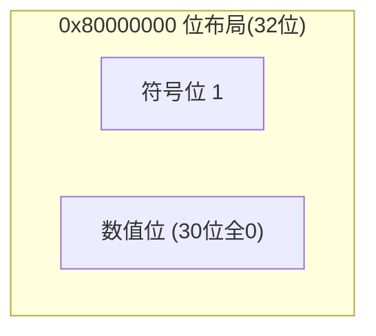

# 第15章　编写安全无错代码

通过前面的章节，主要是学习和分析在 Linux 环境下不同方面的系统调用及内核实现。本章则将分享笔者多年编程的一些经验，主要是从基础概念出发，介绍一些编码细节，这些细节看上去有些分散，有点奇技淫巧的味道，但笔者的主要目的是为了让大家从心里明白编写安全无错代码的不易。要对代码有敬畏之心，才能真正驾驭代码，写出健壮的程序。

## 15.1　不要用 `memcmp` 比较结构体

比较两个结构体时，若结构体中含有大量的成员变量，为了方便，程序员往往会直接使用 `memcmp` 对这两个结构体进行比较，以避免对每个成员进行分别比较。这样的代码写起来比较简单，然而却很可能深藏隐患。请看下面的示例代码：

```c
#include <stdio.h>
#include <stdlib.h>
#include <string.h>

typedef struct padding_type {
    short m1;
    int m2;
} padding_type_t;

int main()
{
    padding_type_t a = {
        .m1 = 0,
        .m2 = 0,
    };
    padding_type_t b;
    memset(&b, 0, sizeof(b));

    if (0 == memcmp(&a, &b, sizeof(a))) {
        printf("Equal!\n");
    }
    else {
        printf("No equal!\n");
    }
    return 0;
}
```

大家先想一下，结果会是什么？一起来看看最终的结果：

```
[fgao@ubuntu chapter15]# gcc -Wall 15_1_cmp_struct.c
[fgao@ubuntu chapter15]# ./a.out
No equal!
```

为什么会是这样的结果呢？有经验的读者立刻就会反应过来：这是由于对齐造成的。

> [!INFO] **原因分析**
> 就是因为 `struct padding_type` -> `m1` 的类型是 `short` 类型，而 `m2` 的类型是 `int` 类型。根据自然对齐规则，`struct padding_type` 需要进行 **4 字节对齐**。因此编译器会在 `m1` 后面插入两个 **padding 字节**，而这两个字节的内容却是 **“随机”** 的。结构体 `b` 由于调用了 `memset` 对整个结构体占用的内存进行了清零，其 padding 的值自然就为 `0`。这样，当使用 `memcmp` 对两个结构体进行比较时，结论就是不相同了，即返回值不为 `0`。

所以，除非在项目中可以保证所有的结构体都会使用 `memset` 来进行初始化（这个是很难保证的），否则就不要直接使用 `memcmp` 来比较结构体。

## 15.2　有符号数和无符号数的移位区别

在代码规范中一般都会要求，如果没有符号要求，则尽量使用无符号整数，避免使用有符号整数。因为有符号整数在一些常见的操作中，将表现出与无符号整数大相径庭的行为。本节将展示有符号整数与无符号整数在**移位操作**上的区别。来看一个示例：

```c
#include <stdio.h>
#include <stdlib.h>

int main ()
{
    int a = 0x80000000;
    unsigned int b = 0x80000000;

    printf("a right shift value is 0x%X\n", a >> 1);
    printf("b right shift value is 0x%X\n", b >> 1);

    return 0;
}
```

其输出结果为：

```
[fgao@ubuntu chapter15]# gcc -Wall 15_2_sign_shift.c
[fgao@ubuntu chapter15]# ./a.out
a right shift value is 0xC0000000
b right shift value is 0x40000000
```

为了了解为什么会产生这样的结果，请看其汇编代码：

```
Dump of assembler code for function main:
   0x0804841d <+0>:     push   %ebp
   0x0804841e <+1>:     mov    %esp,%ebp
   0x08048420 <+3>:     and    $0xfffffff0,%esp
   0x08048423 <+6>:     sub    $0x20,%esp
   0x08048426 <+9>:     movl   $0x80000000,0x18(%esp)
   0x0804842e <+17>:    movl   $0x80000000,0x1c(%esp)
   0x08048436 <+25>:    mov    0x18(%esp),%eax
   0x0804843a <+29>:    sar    %eax
   0x0804843c <+31>:    mov    %eax,0x4(%esp)
   0x08048440 <+35>:    movl   $0x8048500,(%esp)
   0x08048447 <+42>:    call   0x80482f0 <printf@plt>
   0x0804844c <+47>:    mov    0x1c(%esp),%eax
   0x08048450 <+51>:    shr    %eax
   0x08048452 <+53>:    mov    %eax,0x4(%esp)
   0x08048456 <+57>:    movl   $0x804851d,(%esp)
   0x0804845d <+64>:    call   0x80482f0 <printf@plt>
   0x08048462 <+69>:    mov    $0x0,%eax
   0x08048467 <+74>:    leave
   0x08048468 <+75>:    ret
End of assembler dump.
```

`0x80000000` 在内存或寄存器中的布局如图 15-1 所示。



**图 15-1　0x80000000 在内存或寄存器中的布局**  
其中第一位 “1” 即符号位。

- `0x0804843a` 地址对应的是 `a>>1` 的汇编代码，`sar` 为**算术右移**，其使用符号位补位。对于此例，即用 `1` 补位。
- `0x08048450` 地址对应的是 `b>>1` 的汇编代码，`shr` 为**逻辑右移**，其使用 `0` 补位。

这就造成了最终结果的不同。

## 15.3　数组和指针

对于这个标题，可能很多读者都会认为数组和指针，几乎没有什么区别。确实，在大多数的情况下，数组和指针的区别并不大，甚至可以互换。然而，这两者实际上是有本质区别的。而这个区别也会导致并不是所有的情况下，两者都可以互换。同样来看一个示例：

```c
#include <stdlib.h>
#include <stdio.h>

int main()
{
    int array[4] = {0};
    int *pointer = NULL;
    int value = 0;

    value = array;
    value = &array;
    value = array[0];
    value = &array[0];
    value = pointer;
    value = &pointer;

    return 0;
}
```

对其反汇编，来分析数组和指针的本质。分析的过程将直接写在反汇编的代码中：

```
Dump of assembler code for function main:
   0x080483ed <+0>:     push   %ebp
   0x080483ee <+1>:     mov    %esp,%ebp
   0x080483f0 <+3>:     sub    $0x20,%esp
   
   /*
   下面4行对应 C 代码 int array[4] = {0};
   这里说明数组只是一个同类型变量的内存空间的集合.
   这个例子中,array是在栈上申请了4个整型变量的空间.
   */
   0x080483f3 <+6>:     movl   $0x0,-0x10(%ebp)
   0x080483fa <+13>:    movl   $0x0,-0xc(%ebp)
   0x08048401 <+20>:    movl   $0x0,-0x8(%ebp)
   0x08048408 <+27>:    movl   $0x0,-0x4(%ebp)
   
   /*
   这行对应的 C 代码为 int *pointer = NULL.
   这说明指针本身也是一个变量,同样占用了栈空间.
   32位机器上,其占用4字节.
   数组和指针对比,其占用的空间实际上是数组中元素占用的空间之和.
   本例中,即 array[0], array[1], array[2], array[3],而 array本身实际上更像是一个 label.
   */
   0x0804840f <+34>:    movl   $0x0,-0x18(%ebp)
   
   /* 这行对应的 C 代码为 int value = 0; */
   0x08048416 <+41>:    movl   $0x0,-0x14(%ebp)
   
   /*
   下面两行对应的 C 代码是 value = array;
   这两行汇编代码是指取得 array 首元素的地址并将其赋给 eax 寄存器,然后再将 eax 的值赋给 value.
   lea 是汇编中的取址操作.
   */
   0x0804841d <+48>:    lea    -0x10(%ebp),%eax
   0x08048420 <+51>:    mov    %eax,-0x14(%ebp)
   
   /*
   下面两行代码对应的 C 代码为 value = &array.
   其仍然是取 array 首元素的地址赋值给 value.
   */
   0x08048423 <+54>:    lea    -0x10(%ebp),%eax
   0x08048426 <+57>:    mov    %eax,-0x14(%ebp)
   
   /*
   这两行代码对应 value=array[0].
   注意这里使用的是 mov 汇编指令,即将值赋给 eax.
   */
   0x08048429 <+60>:    mov    -0x10(%ebp),%eax
   0x0804842c <+63>:    mov    %eax,-0x14(%ebp)
   
   /*
   对应的代码为 value = &array[0].
   从汇编指令中可以明确看出,array、&array、&array[0],实际上都是同一个地址.
   */
   0x0804842f <+66>:    lea    -0x10(%ebp),%eax
   0x08048432 <+69>:    mov    %eax,-0x14(%ebp)
   
   /*
   对应的代码是 value = pointer.
   注意这里使用的是 mov 指令而不是 lea 指令.是将指针 int *pointer 的值 0 赋值给 value.
   */
   0x08048435 <+72>:    mov    -0x18(%ebp),%eax
   0x08048438 <+75>:    mov    %eax,-0x14(%ebp)
   
   /*
   对应的代码是 value = &pointer;
   是将 int *pointer 的地址赋值给 value.
   */
   0x0804843b <+78>:    lea    -0x18(%ebp),%eax
   0x0804843e <+81>:    mov    %eax,-0x14(%ebp)
   
   0x08048441 <+84>:    mov    $0x0,%eax
   0x08048446 <+89>:    leave
   0x08048447 <+90>:    ret
End of assembler dump.
```

通过上面的汇编代码，我们可以深入地理解 C 语言中的指针和数组的真正含义。要认识到**指针其实就是一个变量**，只不过这个变量是用于保存地址的（实际上也可以保存其他内容，如一个整数），或者说它保存的值可以被视为地址。因为指针类型可以合法地使用 `*` 运算符，做**提领运算**。而这个提领运算，其实就是将变量的值视为一个地址，然后从这个地址中读取值。

为了加深对指针本质的理解，请看下面的例子：

```c
#include <stdlib.h>
#include <stdio.h>

int main(void)
{
        short *p1 = 0;
        int   **p2 = 0;
        ++p1;
        ++p2;
        printf("p1 = %d, p2 = %d\n", p1, p2);
        return 0;
}
```

这是我很喜欢的一道题目。大家可以想一下，这个程序是否会崩溃？如果崩溃，原因是什么？如果不崩溃，其输出结果是什么？

如果真正理解了指针，看完代码，就可以迅速地说出最终的结果。如果你还在犹豫，那就说明你对指针的理解还不够透彻。

其输出结果为：

```
[fgao@ubuntu chapter14]# ./a.out
p1 = 2, p2 = 4
```

> [!INFO] **解释**
> - `p1` 是 `short*`，步长为 `sizeof(short)=2`，`++p1` 增加 2。
> - `p2` 是 `int**`，步长为 `sizeof(int*)=4`（32位机器），`++p2` 增加 4。
> - 不会崩溃，因为对空指针进行算术运算（未提领）是合法的。

## 15.4　再论数组首地址

15.3 节中，通过汇编代码，我们知道 `array`、`&array` 和 `&array[0]` 的地址是相同的，那么它们三者是否有相同的含义呢？请看下面的示例代码：

```c
#include <stdio.h>
#include <stdlib.h>

int main() {
    int a[2][3];

    printf("&a[0][0] address is 0x%X\n", &a[0][0]);
    printf("&a[0][0]+1 address is 0x%X\n", &a[0][0]+1);
    printf("size of pointer step is 0x%X\n", sizeof(*(&a[0][0])));

    printf("\n");

    printf("&a[0] address is 0x%X\n", &a[0]);
    printf("&a[0]+1 address is 0x%X\n", &a[0]+1);
    printf("size of pointer step is 0x%X\n", sizeof(*(&a[0])));

    printf("\n");

    printf("a address is 0x%X\n", a);
    printf("a+1 address is 0x%X\n", a+1);
    printf("size of pointer step is 0x%X\n", sizeof(*a));

    printf("\n");

    printf("&a address is 0x%X\n", &a);
    printf("&a+1 address is 0x%X\n", &a+1);
    printf("size of pointer step is 0x%X\n", sizeof(*(&a)));

    printf("\n");
    return 0;
}
```

大家可以先想一下其运行结果是什么，然后再看下面的结果：

```
[fgao@ubuntu chapter15]# ./a.out
&a[0][0] address is 0xBF903D48
&a[0][0]+1 address is 0xBF903D4C
size of pointer step is 0x4

&a[0] address is 0xBF903D48
&a[0]+1 address is 0xBF903D54
size of pointer step is 0xC

a address is 0xBF903D48
a+1 address is 0xBF903D54
size of pointer step is 0xC

&a address is 0xBF903D48
&a+1 address is 0xBF903D60
size of pointer step is 0x18
```

从输出上看，可以发现 `&a[0][0]`、`&a[0]`、`a`，还有 `&a` 的地址值都是相同的，然而其步进 1 即地址 +1 的值却完全不同。

为什么会是这样呢？因为尽管这几个变量的地址相同，但是其**变量类型**却是不同的：

- `&a[0][0]` 的类型是 `int*`（指针），所以步长为 **4 字节**。
- `&a[0]` 的类型为 `int (*)[3]`（指向含3个int的数组的指针），所以步长为 **12 字节**（3 × sizeof(int) = 12）。
- `a` 的类型也为 `int (*)[3]`，所以其步长也为 **12 字节**。
- `&a` 的类型为 `int (*)[2][3]`（指向整个二维数组的指针），所以步长为 **24 字节**（2×3×4=24）。

## 15.5　“神奇”的整数类型转换

整数类型转换经常被当作笔试题目之一，大家可能会觉得那样的题目很简单，也许同样会觉得本节也没什么难度。请大家先耐心看一下下面的示例：

```c
#include <stdlib.h>
#include <stdio.h>

#define PRINT_COMPARE_RESULT(a, b) \
        if (a > b) { \
                printf(#a " > " #b "\n"); \
        } else if ( a < b) { \
                printf(#a大多数同学可能都遇到过这类将 `a` 和 `b` 进行比较的题目,结果是 `a > b`,原因也很简单明确:当 `signed int` 和 `unsigned int` 进行比较时,`signed int` 会被转换为 `unsigned int`.`-1` 的值即 `0xFFFFFFFF`,就被视为无符号整数的最大值,因此 `a > b`.然而对于 `c` 和 `d` 来说,其类型分别是 `signed short` 和 `unsigned short`,那么结果又会是什么呢?请看下面的输出:

```
[fgao@ubuntu chapter15]# ./a.out
a > b
c < d
```

是不是感觉有些意外?为什么仅仅从 `int` 变为 `short`,其结果就截然不同了呢?

原因在于 C 标准规定,当进行**整数提升**时,如果 `int` 类型可以表示原始类型的所有值时,它就被转换为 `int` 类型;不然则被转换为 `unsigned int`.所以当 `c` 和 `d` 进行比较时,`c` 和 `d` 的类型分别是 `short` 和 `unsigned short`,那么它们就会被转换为 `int` 类型,则实际是对 `(int)-1` 和 `(int)2` 进行比较,结果自然是 `c < d`.

## 15.6 小心 `volatile` 的原子性误解

关于 `volatile` 的说明,是一个老生常谈的问题.其定义很简单,可以理解为**易变的**,防止编译器对其优化.因此其用途一般有以下三种:

1. **外部设备寄存器映射后的内存**——因为外部寄存器随时可能由于外部设备的状态变化而改变,因此映射后的内存需要用 `volatile` 来修饰.
2. **多线程或异步访问的全局变量**.
3. **嵌入式编程**——防止编译器对其优化.

对第 1 种和第 3 种的用途大家基本上都不会有什么误解,但经常会错误地理解第 2 种情况:认为 `int` 类型的加减操作是原子的,因此在使用了 `volatile` 后,就无须使用锁来进行竞争保护了.比如下面这样的代码:

```c
static volatile int counter = 0;

void add_counter(void)
{
    ++counter;
}
```

其反汇编代码为:

```
add_counter:
pushl %ebp
movl %esp, %ebp
movl counter, %eax
addl $1, %eax
movl %eax, counter
popl %ebp
ret
```

上面的汇编代码,首先是将 `counter` 的值保存到 `eax` 寄存器,然后对 `eax` 进行加 1 操作,最后再将 `eax` 的值保存到 `counter` 中.这样,`++counter` 就**绝不可能是原子操作**了,必须使用锁保护.

那么 `volatile` 对于变量来说,究竟有什么样的效果呢?下面的代码对上面的代码进行了一些修改:

```c
static int counter = 0;

void add_counter(void)
{
    for (; counter != 10;) {
        ++counter;
    }
}
```

用 `gcc -S -O 15_6_volatile.c` 生成对应的汇编代码:

```
add_counter:
.LFB0:
        .cfi_startproc
        movl    counter, %eax
        cmpl    $10, %eax
        je      .L1
.L4:
        addl    $1, %eax
        cmpl    $10, %eax
        jne     .L4
        movl    $10, counter
.L1:
        rep ret
        .cfi_endproc
.LFE0:
```

从上面的汇编代码可以清晰地看出,在进入 `add_counter` 后,首先会将 `counter` 的值赋给 `eax` 寄存器,然后 `eax` 进行加 1 操作,再与立即数 10 进行比较.也就是说,`for` 循环的 C 代码只涉及 `eax` 寄存器,而不会对 `counter` 进行任何访问.

接下来,对 `counter` 添加上 `volatile` 修饰符:

```c
static volatile int counter = 0;

void add_counter(void)
{
    for (; counter != 10; ) {
        ++counter;
    }
}
```

然后生成汇编代码 `gcc -S -O 15_6_volatile2.c`:

```
add_counter:
.LFB0:
        .cfi_startproc
        movl    counter, %eax
        cmpl    $10, %eax
        je      .L1
.L3:
        movl    counter, %eax
        addl    $1, %eax
        movl    %eax, counter
        movl    counter, %eax
        cmpl    $10, %eax
        jne     .L3
.L1:
        rep ret
        .cfi_endproc
```

与没有 `volatile` 的汇编代码相比,其差异很明显.使用了 `volatile` 之后,与 `counter` 的自增操作对应的汇编代码,每次都要重新从 `counter` 读取值,再将其赋值给 `eax` 寄存器.

现在对 `volatile` 的理解就比较深刻了.`volatile` 只能保证在访问该变量时,**每次都是从内存中读取最新值**,并不会使用寄存器中缓存的值.而对该变量的修改,`volatile` **并不提供原子性的保证**.

## 15.7 有趣的问题:“x==x”何时为假?

看到这个题目,大家可能会想到一些比较另类的方法,比如使用宏定义,或者用高级语言中的操作符重载之类的.但如果说要求使用**最原始的 C 语言表达式**,那么什么时候 `x == x` 会是假呢?请看下面的代码:

```c
#include <stdlib.h>
#include <stdio.h>
#include <string.h>

int main(void)
{
    float x = 0xffffffff;

    if (x == x) {
        printf("Equal\n");
    }
    else {
        printf("Not equal\n");
    }

    if (x >= 0) {
        printf("x(%f) >= 0\n", x);
    }
    else if (x < 0) {
        printf("x(%f) < 0\n", x);
    }

    int a = 0xffffffff;
    memcpy(&x, &a, sizeof(x));

    if (x == x) {
        printf("Equal\n");
    }
    else {
        printf("Not equal\n");
    }

    if (x >= 0) {
        printf("x(%f) >= 0\n", x);
    }
    else if (x < 0) {
        printf("x(%f) < 0\n", x);
    }
    else {
        printf("Surprise x(%f)!!!\n", x);
    }

    return 0;
}
```

用 `gcc -Wall 15_7_float.c` 编译并执行.输出结果如下所示:

```
[fgao@ubuntu chapter15]# ./a.out
Equal
x(4294967296.000000) >= 0
Not equal
Surprise x(-nan)!!!
```

这样的结果是不是有些意外呢?

简单解释一下其中的原因:

- 当 `float x = 0xffffffff` 时,将整数赋值给一个浮点数,由于 `float` 和 `int` 都占用了 4 字节,但浮点数的存储格式与整数不同,其需要一定的数位来作为小数位,所以 `float` 的表示范围要小于 `int`.这里涉及了 C 语言中的类型转换.
- 当整数转换为浮点数时,尽管数值会有所变化,但结果一定是一个合法的浮点值.所以 `x` 一定等于 `x`,且 `x` 不是大于等于 0,就是小于 0.
- 当使用 `memcpy` 将 `0xff` 填充到 `x` 的地址时,这时保证了 `x` 储存的一定是 `0xffffffff`,但很可惜它不是一个合法的浮点值,而是一个特殊值 **NaN**.
- 作为一个非法的浮点数 `NaN`,当它与任何数值相比较时,都会返回假.所以就有了比较意外的结果 `x == x` 为假,`x` 即不大于 0,不小于 0,也不等于 0.

> [!INFO] **总结**
> `x == x` 为假只可能发生在 `x` 是 **NaN** 的情况下.在普通 C 程序中,通过位操作将一个非法的浮点表示写入浮点变量即可构造出 NaN.需要注意,编译器优化时可能假定 NaN 不会出现,因此严格遵守标准会让程序更安全.


## 15.8 小心浮点陷阱

15.7节通过“x==x”为假这个问题,引出了一个特殊的浮点值NaN.本节将挖掘出更多的浮点陷阱.

### 15.8.1 浮点数的精度限制

浮点数的存储格式与整数完全不同.大部分的实现采用的是IEEE 754标准,`float`类型是1个sign bit、8个exponent bits和23个mantissa bits.而`double`类型是1个sign bit、11个exponent bits和52个mantissa bits.关于浮点数是如何表示小数部分的,大家可以自行参考维基百科.简单来说,小数部分是依靠2的负多少次方来近似表示的,因此浮点数存在精度的问题,对浮点数进行比较时,要使用范围比较.

```c
#include <stdlib.h>
#include <stdio.h>
int main(void)
{
    float x = 0.123-0.11-0.013;
    if (x == 0) {
        printf("x is 0!\n");
    }
    if (-0.0000000001 < x && x < 0.0000000001) {
        printf("x is in 0 range!\n");
    }
    return 0;
}
```

编译输出:
```
[fgao@ubuntu chapter15]#gcc -Wall 15_8_float1.c
[fgao@ubuntu chapter15]#./a.out
x is in 0 range!
```

从数学的角度看,`float x=0.123-0.11-0.013`,得到的一定是0.但对于浮点数来说,因为其不能精确地表示小数,因此`x`最终的结果是一个趋近于0的值.故而不能用0和`x`直接进行比较,而是要使用一个范围来确定`x`是否为0.

### 15.8.2 两个特殊的浮点值

浮点数有两个特殊的值,除了前面的NaN(Not a Number),还有一个infinite即无限.15.7节中,使用`memcpy`构造了一个NaN的浮点数.可能有人会问,平常有谁会用`memcpy`去填充浮点数呢?因此我不可能遇到NaN.那么,请看下面的示例:

```c
#include <stdlib.h>
#include <stdio.h>
int main(void)
{
    float x = 1/0.0;
    printf("x is %f\n", x);
    x = 0/0.0;
    printf("x is %f\n", x);
    return 0;
}
```

其输出结果为:
```
[fgao@ubuntu chapter15]#./a.out
x is inf
x is -nan
```

当1除以0.0时,得到的是infinite,而用0除以0.0时,得到的就是NaN.虽然这里完全只是一则普通的除法运算,但也会产生NaN的情况.

那么当使用除法运算时,对除数进行检查,保证其不为0.0,是否就可以避免NaN了?再看下面的代码:

```c
#include <stdlib.h>
#include <stdio.h>
int main(void)
{
    float x;
    while (1) {
        scanf("%f", &x);
        printf("x is %f\n", x);
    }
    return 0;
}
```

编译执行:
```
[fgao@ubuntu chapter15]#gcc -Wall 15_8_float3.c
[fgao@ubuntu chapter15]#./a.out
inf
x is inf
nan
x is nan
```

上面的代码中使用了`scanf`来得到用户输入的浮点数.令人惊讶的是,`scanf`不仅接受`inf`和`nan`的输入,并将其视为浮点数的两种特殊值.那么对于UI程序来说,当遇到浮点数值的时候,我们必须首先判断其是否为合法的浮点值.笔者就遇到过一个开源库返回的浮点数为NaN的情况.令人高兴的是,C库提供了两个库函数`isinf`和`isnan`,分别用于判断浮点数是否为infinite和NaN.

> [!INFO] 浮点特殊值检测
> 使用 `isinf()` 和 `isnan()` 函数可以可靠地检测浮点数是否为正/负无穷大或NaN.

## 15.9 Intel移位指令陷阱

假设操作平台为32位平台,请看下面的示例代码:

```c
#include <stdio.h>
int main()
{
#define MOVE_CONSTANT_BITS 32
    unsigned int move_step=MOVE_CONSTANT_BITS;
    unsigned int value1 = 1ul << MOVE_CONSTANT_BITS;
    printf("value1 is 0x%X\n", value1);
    unsigned int value2 = 1ul << move_step;
    printf("value2 is 0x%X\n", value2);
    return 0;
}
```

上面的代码中,`value1`使用立即数32进行左移,而`value2`使用一个变量`move_step`进行左移,且`move_step`的值也是32.那么问题来了,最后`value1`和`value2`的值是什么?我相信大部分人都会说最后两个值是一样的,都是0.那么,请看出人意料的实际结果:

```
[fgao@ubuntu chapter15]#./a.out
value1 is 0x0
value2 is 0x1
```

为了解释这个意外的结果,我们再次祭出反汇编这一利器:

```
Dump of assembler code for function main:
   0x0804841d <+0>:     push   %ebp
   0x0804841e <+1>:     mov    %esp,%ebp
   0x08048420 <+3>:     and    $0xfffffff0,%esp
   0x08048423 <+6>:     sub    $0x20,%esp
   0x08048426 <+9>:     movl   $0x20,0x14(%esp)
   0x0804842e <+17>:    movl   $0x0,0x18(%esp)
   0x08048436 <+25>:    mov    0x18(%esp),%eax
   0x0804843a <+29>:    mov    %eax,0x4(%esp)
   0x0804843e <+33>:    movl   $0x8048510,(%esp)
   0x08048445 <+40>:    call   0x80482f0 <printf@plt>
   0x0804844a <+45>:    mov    0x14(%esp),%eax
   0x0804844e <+49>:    mov    $0x1,%edx
   0x08048453 <+54>:    mov    %eax,%ecx
   0x08048455 <+56>:    shl    %cl,%edx
   0x08048457 <+58>:    mov    %edx,%eax
   0x08048459 <+60>:    mov    %eax,0x1c(%esp)
   0x0804845d <+64>:    mov    0x1c(%esp),%eax
   0x08048461 <+68>:    mov    %eax,0x4(%esp)
   0x08048465 <+72>:    movl   $0x8048520,(%esp)
   0x0804846c <+79>:    call   0x80482f0 <printf@plt>
   0x08048471 <+84>:    mov    $0x0,%eax
   0x08048476 <+89>:    leave
   0x08048477 <+90>:    ret
End of assembler dump.
```

第6行汇编代码 `movl $0x0,0x18(%esp)` 对应的C代码为 `unsigned int value1=1ul<<MOVE_CONSTANT_BITS`。也就是说，对于变量`value1`，编译器直接生成了结果0——该结果也是我们预期的结果。而对于`value2`，则是真正使用了左移移位指令`shl`。那么问题就转变成了为什么对一个int整数左移32位，其结果不是0呢？

请看Intel的指令手册中关于`shl`的说明：

> **SAL/SAR/SHL/SHR—Shift (Continued)——32位机**
> 
> **Description**
> These instructions shift the bits in the first operand (destination operand) to the left or right by the number of bits specified in the second operand (count operand). Bits shifted beyond the destination operand boundary are first shifted into the CF flag, then discarded. At the end of the shift operation, the CF flag contains the last bit shifted out of the destination operand.
> 
> The destination operand can be a register or a memory location. The count operand can be an immediate value or register CL. **The count is masked to five bits, which limits the count range to 0 to 31.** A special opcode encoding is provided for a count of 1.

现在真相大白了。原来在32位机器上，保存移位个数的指令位只有5位。那么当执行左移32位时，实际上就是左移0位，即没有任何变化。所以`value2`左移32位时，其值仍然为1。

在32位机器上，实际左移位数等于“指定位数 & 0x1F”。

> [!TIP] 64位环境下的注意事项
> 在64位机器上，要将 `value1` 和 `value2` 修改为 `long` 类型左移64位进行测试。因为64位机器上移位计数会被掩码为6位（0~63），左移64位相当于左移0位。
