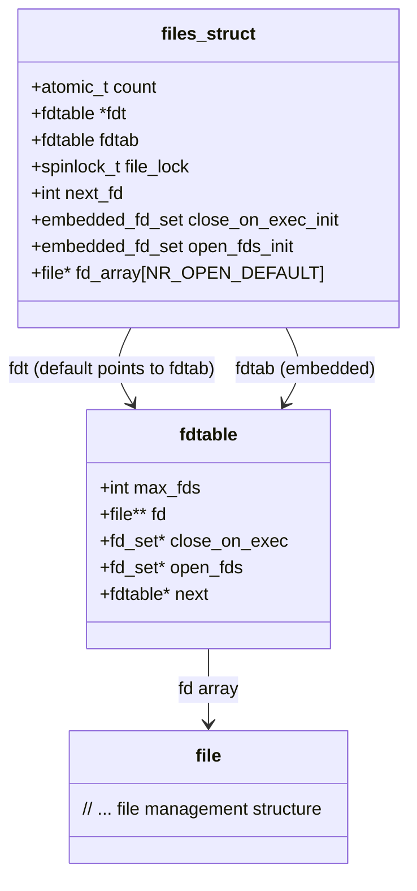

# 第1章　文件I/O

文件I/O是操作系统不可或缺的部分，也是实现数据持久化的手段。对于Linux来说，其“一切皆是文件”的思想，更是突出了文件在Linux内核中的重要地位。本章主要讲述Linux文件I/O部分的系统调用。

> [!WARNING] 注意
> 为了分析系统调用的实现，从本章开始会涉及Linux内核源码。但是本书并不是一本介绍内核源码的书籍，所以书中对内核源码的分析不会面面俱到。分析内核源码的目的是为了更好地理解系统调用，是为应用而服务的。因此，本书对内核源码的追踪和分析，只是浅尝辄止。

## 1.1　Linux中的文件

### 1.1.1　文件、文件描述符和文件表

Linux内核将一切视为文件，那么Linux的文件是什么呢？其既可以是事实上的真正的物理文件，也可以是设备、管道，甚至还可以是一块内存。狭义的文件是指文件系统中的物理文件，而广义的文件则可以是Linux管理的所有对象。这些广义的文件利用VFS机制，以文件系统的形式挂载在Linux内核中，对外提供一致的文件操作接口。

从数值上看，文件描述符是一个非负整数，其本质就是一个句柄，所以也可以认为文件描述符就是一个文件句柄。那么何为句柄呢？一切对于用户透明的返回值，即可视为句柄。用户空间利用文件描述符与内核进行交互；而内核拿到文件描述符后，可以通过它得到用于管理文件的真正的数据结构。

使用文件描述符即句柄，有两个好处：
- 增加了安全性，句柄类型对用户完全透明，用户无法通过任何hacking的方式，更改句柄对应的内部结果，比如Linux内核的文件描述符，只有内核才能通过该值得到对应的文件结构。
- 增加了可扩展性，用户的代码只依赖于句柄的值，这样实际结构的类型就可以随时发生变化，与句柄的映射关系也可以随时改变，这些变化都不会影响任何现有的用户代码。

Linux的每个进程都会维护一个文件表，以便维护该进程打开文件的信息，包括打开的文件个数、每个打开文件的偏移量等信息。

### 1.1.2　内核文件表的实现

内核中进程对应的结构是`task_struct`，进程的文件表保存在`task_struct->files`中。其结构代码如下所示。

```c
struct files_struct {
    /* count为文件表files_struct的引用计数 */
    atomic_t count;
    /* 文件描述符表 */
    /*
     为什么有两个fdtable呢?这是内核的一种优化策略.
     fdt为指针,而fdtab为普通变量.一般情况下,
     fdt是指向fdtab的,当需要它的时候,才会真正动态申请内存.因为默认大小的文件表足以应付大多数
     情况,因此这样就可以避免频繁的内存申请.
     这也是内核的常用技巧之一.在创建时,使用普通的变量或者数组,然后让指针指向它,作为默认情况使
     用.只有当进程使用量超过默认值时,才会动态申请内存.
    */
    struct fdtable __rcu *fdt;
    struct fdtable fdtab;
    /*
    * written part on a separate cache line in SMP
    */
    /* 使用____cacheline_aligned_in_smp可以保证file_lock是以cache line对齐的,避免了false sharing */
    spinlock_t file_lock ____cacheline_aligned_in_smp;
    /* 用于查找下一个空闲的fd */
    int next_fd;
    /* 保存执行exec需要关闭的文件描述符的位图 */
    struct embedded_fd_set close_on_exec_init;
    /* 保存打开的文件描述符的位图 */
    struct embedded_fd_set open_fds_init;
    /* fd_array为一个固定大小的file结构数组.struct file是内核用于文件管理的结构.这里使用默认大小的数组,就是为了可以涵盖大多数情况,避免动态分配 */
    struct file __rcu * fd_array[NR_OPEN_DEFAULT];
};
```

下面看看`files_struct`是如何使用默认的`fdtab`和`fd_array`的，`init`是Linux的第一个进程，它的文件表是一个全局变量，代码如下：

```c
struct files_struct init_files = {
    .count      = ATOMIC_INIT(1),
    .fdt        = &init_files.fdtab,
    .fdtab      = {
        .max_fds    = NR_OPEN_DEFAULT,
        .fd     = &init_files.fd_array[0],
        .close_on_exec  = (fd_set *)&init_files.close_on_exec_init,
        .open_fds   = (fd_set *)&init_files.open_fds_init,
    },
    .file_lock  = __SPIN_LOCK_UNLOCKED(init_task.file_lock),
};
```

`init_files.fdt`和`init_files.fdtab.fd`都分别指向了自己已有的成员变量，并以此作为一个默认值。后面的进程都是从`init`进程fork出来的。fork的时候会调用`dup_fd`，而在`dup_fd`中其代码结构如下：

```c
newf = kmem_cache_alloc(files_cachep, GFP_KERNEL);
if (!newf)
   goto out;
atomic_set(&newf->count, 1);
spin_lock_init(&newf->file_lock);
newf->next_fd = 0;
new_fdt = &newf->fdtab;
new_fdt->max_fds = NR_OPEN_DEFAULT;
new_fdt->close_on_exec = (fd_set *)&newf->close_on_exec_init;
new_fdt->open_fds = (fd_set *)&newf->open_fds_init;
new_fdt->fd = &newf->fd_array[0];
new_fdt->next = NULL;
```

初始化`new_fdt`，同样是为了让`new_fdt`和`new_fdt->fd`指向其本身的成员变量`fdtab`和`fd_array`。

> [!INFO] 说明
> `/proc/pid/status`为对应pid的进程的当前运行状态，其中FDSize值即为当前进程`max_fds`的值。

因此，初始状态下，`files_struct`、`fdtable`和`files`的关系如图1-1所示。



图1-1　文件表、文件描述符表及文件结构关系图

## 1.2　打开文件

### 1.2.1　open介绍

`open`在手册中有两个函数原型，如下所示：

```c
int open(const char *pathname, int flags);
int open(const char *pathname, int flags, mode_t mode);
```

这样的函数原型有些违背了我们的直觉。C语言是不支持函数重载的，为什么`open`的系统调用可以有两个这样的`open`原型呢？内核绝对不可能为这个功能创建两个系统调用。在Linux内核中，实际上只提供了一个系统调用，对应的是上述两个函数原型中的第二个。那么`open`有两个函数原型又是怎么回事呢？当我们调用`open`函数时，实际上调用的是glibc封装的函数，然后由glibc通过自陷指令，进行真正的系统调用。也就是说，所有的系统调用都要先经过glibc才会进入操作系统。这样的话，实际上是glibc提供了一个变参函数`open`来满足两个函数原型，然后通过glibc的变参函数`open`实现真正的系统调用来调用原型二。

可以通过一个小程序来验证我们的猜想，代码如下：

```c
#include <sys/types.h>
#include <sys/stat.h>
#include <fcntl.h>
#include <unistd.h>

int main(void)
{
    int fd = open("test_open.txt", O_CREAT, 0644, "test");
    close(fd);
    return 0;
}
```

在这个程序中，调用`open`的时候，传入了4个参数，如果`open`不是变参函数，就会报错，如“too many arguments to function ‘open’”。但是请看下面的编译输出：

```shell
[fgao@fgao-ThinkPad-R52 chapter2]# gcc -g -Wall 2_2_1_test_open.c
[fgao@fgao-ThinkPad-R52 chapter2]#
```

没有任何的警告和错误。这就证实了我们的猜想，`open`是glibc的一个变参函数。`fcntl.h`中`open`函数的声明也确定了这点：

```c
extern int open (__const char *__file, int __oflag, ...) __nonnull ((1));
```

下面来说明一下`open`的参数：

- `pathname`：表示要打开的文件路径。
- `flags`：用于指示打开文件的选项，常用的有`O_RDONLY`、`O_WRONLY`和`O_RDWR`。这三个选项必须有且只能有一个被指定。为什么`O_RDWR != O_RDONLY | O_WRONLY`呢？Linux环境中，`O_RDONLY`被定义为0，`O_WRONLY`被定义为1，而`O_RDWR`却被定义为2。之所以有这样违反常规的设计遗留至今，就是为了兼容以前的程序。除了以上三个选项，Linux平台还支持更多的选项，APUE中对此也进行了介绍。
- `mode`：只在创建文件时需要，用于指定所创建文件的权限位（还要受到umask环境变量的影响）。

### 1.2.2　更多选项

除了常用的几个打开文件的选项，APUE还介绍了一些常用的POSIX定义的选项。下面列出了Linux平台支持的大部分选项：

- `O_APPEND`：每次进行写操作时，内核都会先定位到文件尾，再执行写操作。
- `O_ASYNC`：使用异步I/O模式。
- `O_CLOEXEC`：在打开文件的时候，就为文件描述符设置`FD_CLOEXEC`标志。这是一个新的选项，用于解决在多线程下fork与用fcntl设置`FD_CLOEXEC`的竞争问题。某些应用使用fork来执行第三方的业务，为了避免泄露已打开文件的内容，那些文件会设置`FD_CLOEXEC`标志。但是fork与fcntl是两次调用，在多线程下，可能在fcntl调用前，就已经fork出子进程了，从而导致该文件句柄暴露给子进程。关于`O_CLOEXEC`的用途，将会在第4章详细讲解。
- `O_CREAT`：当文件不存在时，就创建文件。
- `O_DIRECT`：对该文件进行直接I/O，不使用VFS Cache。
- `O_DIRECTORY`：要求打开的路径必须是目录。
- `O_EXCL`：该标志用于确保是此次调用创建的文件，需要与`O_CREAT`同时使用；当文件已经存在时，`open`函数会返回失败。
- `O_LARGEFILE`：表明文件为大文件。
- `O_NOATIME`：读取文件时，不更新文件最后的访问时间。
- `O_NONBLOCK`、`O_NDELAY`：将该文件描述符设置为非阻塞的（默认都是阻塞的）。
- `O_SYNC`：设置为I/O同步模式，每次进行写操作时都会将数据同步到磁盘，然后write才能返回。
- `O_TRUNC`：在打开文件的时候，将文件长度截断为0，需要与`O_RDWR`或`O_WRONLY`同时使用。在写文件时，如果是作为新文件重新写入，一定要使用`O_TRUNC`标志，否则可能会造成旧内容依然存在于文件中的错误，如生成配置文件、pid文件等——在第2章中，我会例举一个未使用截断标志而导致问题的示例代码。

> [!WARNING] 注意
> 并不是所有的文件系统都支持以上选项。

### 1.2.3　open源码跟踪

我们经常这样描述“打开一个文件”，那么这个所谓的“打开”，究竟“打开”了什么？内核在这个过程中，又做了哪些事情呢？这一切将通过分析内核源码来得到答案。

跟踪内核`open`源码 `open->do_sys_open`，代码如下：

```c
long do_sys_open(int dfd, const char __user *filename, int flags, int mode)
{
    struct open_flags op;
    /* flags为用户层传递的参数,内核会对flags进行合法性检查,并根据mode生成新的flags值赋给lookup */
    int lookup = build_open_flags(flags, mode, &op);
    /* 将用户空间的文件名参数复制到内核空间 */
    char *tmp = getname(filename);
    int fd = PTR_ERR(tmp);
    if (!IS_ERR(tmp)) {
        /* 未出错则申请新的文件描述符 */
        fd = get_unused_fd_flags(flags);
        if (fd >= 0) {
            /* 申请新的文件管理结构file */
            struct file *f = do_filp_open(dfd, tmp, &op, lookup);
            if (IS_ERR(f)) {
                put_unused_fd(fd);
                fd = PTR_ERR(f);
            } else {
                /* 产生文件打开的通知事件 */
                fsnotify_open(f);
                /* 将文件描述符fd与文件管理结构file对应起来,即安装 */
                fd_install(fd, f);
            }
        }
        putname(tmp);
    }
    return fd;
}
```

从`do_sys_open`可以看出，打开文件时，内核主要消耗了两种资源：[[文件描述符]]与[[内核管理文件结构file]]。

### 1.2.4　如何选择文件描述符

根据POSIX标准，当获取一个新的文件描述符时，要返回最低的未使用的文件描述符。Linux是如何实现这一标准的呢？

在Linux中，通过`do_sys_open->get_unused_fd_flags->alloc_fd（0，（flags））`来选择文件描述符，代码如下：

```c
int alloc_fd(unsigned start, unsigned flags)
{
    struct files_struct *files = current->files;
    unsigned int fd;
    int error;
    struct fdtable *fdt;

    /* files为进程的文件表,下面需要更改文件表,所以需要先锁文件表 */
    spin_lock(&files->file_lock);

repeat:
    /* 得到文件描述符表 */
    fdt = files_fdtable(files);
    /* 从start开始,查找未用的文件描述符.在打开文件时,start为0 */
    fd = start;
    /* files->next_fd为上一次成功找到的fd的下一个描述符.使用next_fd,可以快速找到未用的文件描述符;*/
    if (fd < files->next_fd)
        fd = files->next_fd;
    /*
    当小于当前文件表支持的最大文件描述符个数时,利用位图找到未用的文件描述符.
    如果大于max_fds怎么办呢?如果大于当前支持的最大文件描述符,那它肯定是未
    用的,就不需要用位图来确认了.
    */
    if (fd < fdt->max_fds)
        fd = find_next_zero_bit(fdt->open_fds->fds_bits,
            fdt->max_fds, fd);
    /* expand_files用于在必要时扩展文件表.何时是必要的时候呢?比如当前文件描述符已经超过了当前文件表支持的最大值的时候. */
    error = expand_files(files, fd);
    if (error < 0)
        goto out;
    /*
    * If we needed to expand the fs array we
    * might have blocked - try again.
    */
    if (error)
        goto repeat;
    /* 只有在start小于next_fd时,才需要更新next_fd,以尽量保证文件描述符的连续性.*/
    if (start <= files->next_fd)
        files->next_fd = fd + 1;
    /* 将打开文件位图open_fds对应fd的位置置位 */
    FD_SET(fd, fdt->open_fds);
    /* 根据flags是否设置了O_CLOEXEC,设置或清除fdt->close_on_exec */
    if (flags & O_CLOEXEC)
        FD_SET(fd, fdt->close_on_exec);
    else
        FD_CLR(fd, fdt->close_on_exec);

    error = fd;
#if 1
    /* Sanity check */
    if (rcu_dereference_raw(fdt->fd[fd]) != NULL) {
        printk(KERN_WARNING "alloc_fd: slot %d not NULL!\n", fd);
        rcu_assign_pointer(fdt->fd[fd], NULL);
   ```c
#endif
out:
    spin_unlock(&files->file_lock);
    return error;
}
```

### 1.2.5 文件描述符fd与文件管理结构file

前文已经说过,内核使用`fd_install`将文件管理结构`file`与`fd`组合起来,具体操作请看如下代码:

```c
void fd_install(unsigned int fd, struct file *file)
{
    struct files_struct *files = current->files;
    struct fdtable *fdt;
    spin_lock(&files->file_lock);
    /* 得到文件描述符表 */
    fdt = files_fdtable(files);
    BUG_ON(fdt->fd[fd] != NULL);
    /*
    将文件描述符表中的file类型的指针数组中对应fd的项指向file。
    这样文件描述符fd与file就建立了对应关系
    */
    rcu_assign_pointer(fdt->fd[fd], file);
    spin_unlock(&files->file_lock);
}
```

当用户使用`fd`与内核交互时,内核可以用`fd`从`fdt->fd[fd]`中得到内部管理文件的结构`struct file`.

## 1.3 creat简介

`creat`函数用于创建一个新文件,其等价于
`open(pathname, O_WRONLY | O_CREAT | O_TRUNC, mode)`.APUE介绍了引入`creat`的原因:
由于历史原因,早期的Unix版本中,`open`的第二个参数只能是0、1或者2.这样就没有办法打开一个不存在的文件.因此,一个独立系统调用`creat`被引入,用于创建新文件.现在的`open`函数,通过使用`O_CREAT`和`O_TRUNC`选项,可以实现`creat`的功能,因此`creat`已经不是必要的了.

内核`creat`的实现代码如下所示:

```c
SYSCALL_DEFINE2(creat, const char __user *, pathname, int, mode)
{
    return sys_open(pathname, O_CREAT | O_WRONLY | O_TRUNC, mode);
}
```

这样就确定了`creat`无非是`open`的一种封装实现.

## 1.4 关闭文件

### 1.4.1 close介绍

`close`用于关闭文件描述符.而文件描述符可以是普通文件,也可以是设备,还可以是socket.在关闭时,VFS会根据不同的文件类型,执行不同的操作.

下面将通过跟踪`close`的内核源码来了解内核如何针对不同的文件类型执行不同的操作.

### 1.4.2 close源码跟踪

首先,来看一下`close`的源码实现,代码如下:

```c
SYSCALL_DEFINE1(close, unsigned int, fd)
{
    struct file * filp;
    /* 得到当前进程的文件表 */
    struct files_struct *files = current->files;
    struct fdtable *fdt;
    int retval;

    spin_lock(&files->file_lock);
    /* 通过文件表，取得文件描述符表 */
    fdt = files_fdtable(files);
    /* 参数fd大于文件描述符表记录的最大描述符，那么它一定是非法的描述符 */
    if (fd >= fdt->max_fds)
        goto out_unlock;
    /* 利用fd作为索引，得到file结构指针 */
    filp = fdt->fd[fd];
    /*
    检查filp是否为NULL。正常情况下，filp一定不为NULL。
    */
    if (!filp)
        goto out_unlock;
    /* 将对应的filp置为0 */
    rcu_assign_pointer(fdt->fd[fd], NULL);
    /* 清除fd在close_on_exec位图中的位 */
    FD_CLR(fd, fdt->close_on_exec);
    /* 释放该fd，或者说将其置为unused。*/
    __put_unused_fd(files, fd);
    spin_unlock(&files->file_lock);
    /* 关闭file结构 */
    retval = filp_close(filp, files);
    /* can't restart close syscall because file table entry was cleared */
    if (unlikely(retval == -ERESTARTSYS ||
           retval == -ERESTARTNOINTR ||
           retval == -ERESTARTNOHAND ||
           retval == -ERESTART_RESTARTBLOCK))
           retval = -EINTR;
    return retval;

out_unlock:
    spin_unlock(&files->file_lock);
    return -EBADF;
}
EXPORT_SYMBOL(sys_close);
```

`__put_unused_fd`源码如下所示:

```c
static void __put_unused_fd(struct files_struct *files, unsigned int fd)
{
    /* 取得文件描述符表 */
    struct fdtable *fdt = files_fdtable(files);
    /* 清除fd在open_fds位图的位 */
    __FD_CLR(fd, fdt->open_fds);
    /* 如果fd小于next_fd，重置next_fd为释放的fd */
    if (fd < files->next_fd)
        files->next_fd = fd;
}
```

看到这里,我们来回顾一下之前分析过的`alloc_fd`函数,就可以总结出完整的Linux文件描述符选择策略:

- Linux选择文件描述符是按从小到大的顺序进行寻找的,文件表中`next_fd`用于记录下一次开始寻找的起点.当有空闲的描述符时,即可分配.
- 当某个文件描述符关闭时,如果其小于`next_fd`,则`next_fd`就重置为这个描述符,这样下一次分配就会立刻重用这个文件描述符.

以上的策略,总结成一句话就是“Linux文件描述符策略永远选择最小的可用的文件描述符”.——这也是POSIX标准规定的.

其实我并不喜欢这样的策略.因为这样迅速地重用刚刚释放的文件描述符,容易引发难以调试和定位的bug——尽管这样的bug是应用层造成的.比如一个线程关闭了某个文件描述符,然后又创建了一个新的文件描述符,这时文件描述符就被重用了,但其值是一样的.如果有另外一个线程保存了之前的文件描述符的值,那它就会再次访问这个文件描述符.此时,如果是普通文件,就会读错或写错文件.如果是socket,就会与错误的对端通信.这样的错误发生时,可能并不会被察觉到.即使发现了错误,要找到根本原因,也非常困难.

如果不重用这个描述符呢?在文件描述符被关闭后,创建新的描述符且不使用相同的值.这样再次访问之前的描述符时,内核可以返回错误,应用层可以更早地得知错误的发生.

虽然造成这样错误的原因是应用层自己,但是如果内核可以尽早地让错误发生,对于应用开发人员来说,会是一个福音.因为调试bug的时候,bug距离造成错误的地点越近,时间发生得越早,就越容易找到根本原因.这也是为什么释放内存以后,要将指针置为NULL的原因.

从`__put_unused_fd`退出后,`close`会接着调用`filp_close`,其调用路径为`filp_close->fput`.在`fput`中,会对当前文件`struct file`的引用计数减一并检查其值是否为0.当引用计数为0时,表示该`struct file`没有被其他人使用,则可以调用`__fput`执行真正的文件释放操作,然后调用要关闭文件所属文件系统的`release`函数,从而实现针对不同的文件类型来执行不同的关闭操作.

下一节让我们来看看Linux如何针对不同的文件类型,挂载不同的文件操作函数`file_operations`.

# 第1章 文件I/O

## 1.4.3 自定义 files_operations

不失一般性,这里也选择 socket 文件系统作为示例,来说明 Linux 如何挂载文件系统指定的文件操作函数 `files_operations`.

`socket.c` 中定义了其文件操作函数 `file_operations`,代码如下:

```c
static const struct file_operations socket_file_ops = {
    .owner =    THIS_MODULE,
    .llseek =   no_llseek,
    .aio_read = sock_aio_read,
    .aio_write =    sock_aio_write,
    .poll =     sock_poll,
    .unlocked_ioctl = sock_ioctl,
#ifdef CONFIG_COMPAT
    .compat_ioctl = compat_sock_ioctl,
#endif
    .mmap =     sock_mmap,
    .open =     sock_no_open,   /* special open code to disallow open via /proc */
    .release =  sock_close,
    .fasync =   sock_fasync,
    .sendpage = sock_sendpage,
    .splice_write = generic_splice_sendpage,
    .splice_read =  sock_splice_read,
};
```

函数 `sock_alloc_file` 用于申请 socket 文件描述符及文件管理结构 `file`.它调用 `alloc_file` 来申请管理结构 `file`,并将 `socket_file_ops` 作为参数,如下所示:

```c
file = alloc_file(&path, FMODE_READ | FMODE_WRITE,
      &socket_file_ops);
```

进入 `alloc_file`,来看看如下代码:

```c
struct file *alloc_file(struct path *path, fmode_t mode,
        const struct file_operations *fop)
{
    struct file *file;
    /* 申请一个 file */
    file = get_empty_filp();
    if (!file)
        return NULL;
    file->f_path = *path;
    file->f_mapping = path->dentry->d_inode->i_mapping;
    file->f_mode = mode;
    /* 将自定义的文件操作函数赋给 file->f_op */
    file->f_op = fop;
    ……
}
```

在初始化 `file` 结构的时候,socket 文件系统将其自定义的文件操作赋给了 `file->f_op`,从而实现了在 VFS 中可以调用 socket 文件系统自定义的操作.

## 1.4.4 遗忘 close 造成的问题

我们只需要关注 close 文件的时候内核做了哪些事情,就可以确定遗忘 close 会带来什么样的后果,如下:

- 文件描述符始终没有被释放.
- 用于文件管理的某些内存结构没有被释放.

对于普通进程来说,即使应用忘记了关闭文件,当进程退出时,Linux 内核也会自动关闭文件,释放内存(详细过程见后文).但是对于一个常驻进程来说,问题就变得严重了.

先看第一种情况,如果文件描述符没有被释放,那么再次申请新的描述符时,就不得不扩展当前的文件表了,代码如下:

```c
int expand_files(struct files_struct *files, int nr)
{
    struct fdtable *fdt;
    fdt = files_fdtable(files);
    /*
     * N.B. For clone tasks sharing a files structure, this test
     * will limit the total number of files that can be opened.
     */
    if (nr >= rlimit(RLIMIT_NOFILE))
        return -EMFILE;
    /* Do we need to expand? */
    if (nr < fdt->max_fds)
    return 0;
    /* Can we expand? */
    if (nr >= sysctl_nr_open)
    return -EMFILE;
    /* All good, so we try */
    return expand_fdtable(files, nr);
}
```

从上面的代码可以看出,在扩展文件表的时候,会检查打开文件的个数是否超出系统的限制.如果文件描述符始终不释放,其个数迟早会到达上限,并返回 `EMFILE` 错误(表示 Too many open files(POSIX.1)).

再看第二种情况,即文件管理的某些内存结构没有被释放.仍然是查看打开文件的代码,代码如下,其中 `get_empty_filp` 用于获得空闲的 `file` 结构.

```c
struct file *get_empty_filp(void)
{
    const struct cred *cred = current_cred();
    static long old_max;
    struct file * f;
    /*
     * Privileged users can go above max_files
     */
    /* 这里对打开文件的个数进行检查，非特权用户不能超过系统的限制 */
    if (get_nr_files() >= files_stat.max_files && !capable(CAP_SYS_ADMIN)) {
    /*
    再次检查 per cpu 的文件个数的总和，
     为什么要做两次检查呢。后文会详细介绍
     */
    if (percpu_counter_sum_positive(&nr_files) >= files_stat.max_files)
        goto over;
    }
    /* 未到达上限，申请一个新的 file 结构 */
    f = kmem_cache_zalloc(filp_cachep, GFP_KERNEL);
    if (f == NULL)
        goto fail;
    /* 增加 file 结构计数 */
    percpu_counter_inc(&nr_files);
    f->f_cred = get_cred(cred);
    if (security_file_alloc(f))
        goto fail_sec;
    INIT_LIST_HEAD(&f->f_u.fu_list);
    atomic_long_set(&f->f_count, 1);
    rwlock_init(&f->f_owner.lock);
    spin_lock_init(&f->f_lock);
    eventpoll_init_file(f);
    /* f->f_version: 0 */
    return f;
over:
    /* 用完了 file 配额，打印 log 报错 */
    /* Ran out of filps - report that */
    if (get_nr_files() > old_max) {
        pr_info("VFS: file-max limit %lu reached\n", get_max_files());
        old_max = get_nr_files();
    }
    goto fail;
fail_sec:
    file_free(f);
fail:
    return NULL;
}
```

下面来说说为什么上面的代码要做两次检查——这也是我们学习内核代码的好处之一,可以学到很多的编程技巧和设计思路.

对于 `file` 的个数,Linux 内核使用两种方式来计数.一是使用全局变量,另外一个是使用 percpu 变量.更新全局变量时,为了避免竞争,不得不使用锁,所以 Linux 使用了一种折中的解决方案.当 percpu 变量的个数变化不超过正负 `percpu_counter_batch`(默认为 32)的范围时,就不更新全局变量.这样就减少了对全局变量的更新,可是也造成了全局变量的值不准确的问题.于是在全局变量的 `file` 个数超过限制时,会再对所有的 percpu 变量求和,再次与系统的限制相比较.想了解这个计数手段的详细信息,可以阅读 `percpu_counter_add` 的相关代码.

## 1.4.5 如何查找文件资源泄漏

在前面的小节中,我们看到了常驻进程忘记关闭文件的危害.可是,软件不可能不出现 bug,如果常驻进程程序真的出现了这样的问题,如何才能快速找到根本原因呢?通过审查打开文件的代码?时间长效率低.那是否还有其他办法呢?下面我们来介绍一种能快速查找文件资源泄漏的方法.

首先,创建一个“错误”的程序,代码如下:

```c
#include <stdlib.h>
#include <stdio.h>
#include <unistd.h>

int main(void)
{
    int cnt = 0;
    while (1) {
        char name[64];
        snprintf(name, sizeof(name),"%d.txt", cnt);
        int fd = creat(name, 644);
        sleep(10);
        ++cnt;
    }
    return 0;
}
```

在这段代码的循环过程中,打开了一个文件,但是一直没有被关闭,以此来模拟服务程序的文件资源泄漏,然后让程序运行一段时间:

```bash
[fgao@fgao chapter1]#./hold_file &
[1] 3000
```

接下来请出利器 `lsof`,查看相关信息,如下所示:

```bash
[fgao@fgao chapter1]#lsof -p 3000
COMMAND  PID USER   FD   TYPE DEVICE SIZE/OFF    NODE NAME
a.out   3000 fgao  cwd    DIR  253,2     4096 1321995 /home/fgao/works/my_git_codes/my_books/understanding_apue/sample_codes/chapter1
a.out   3000 fgao  rtd    DIR  253,1     4096       2 /
a.out   3000 fgao  txt    REG  253,2     6115 1308841 /home/fgao/works/my_git_codes/my_books/understanding_apue/sample_codes/chapter1/a.out
a.out   3000 fgao  mem    REG  253,1   157200 1443950 /lib/ld-2.14.90.so
a.out   3000 fgao  mem    REG  253,1  2012656 1443951 /lib/libc-2.14.90.so
a.out   3000 fgao    0u   CHR  136,3      0t0       6 /dev/pts/3
a.out   3000 fgao    1u   CHR  136,3      0t0       6 /dev/pts/3
a.out   3000 fgao    2u   CHR  136,3      0t0       6 /dev/pts/3
a.out  3000 fgao    3w  REG  253,2        0 1309088 /home/fgao/works/my_git_codes/ my_books/understanding_apue/sample_codes/chapter1/0.txt
a.out   3000 fgao    4w   REG  253,2        0 1312921 /home/fgao/works/my_git_codes/my_books/understanding_apue/sample_codes/chapter1/1.txt
a.out   3000 fgao    5w   REG  253,2        0 1327890 /home/fgao/works/my_git_codes/my_books/understanding_apue/sample_codes/chapter1/2.txt
a.out   3000 fgao    6w   REG  253,2        0 1327891 /home/fgao/works/my_git_codes/my_books/understanding_apue/sample_codes/chapter1/3.txt
a.out   3000 fgao    7w   REG  253,2        0 1327892 /home/fgao/works/my_git_codes/my_books/understanding_apue/sample_codes/chapter1/4.txt
a.out   3000 fgao    8w   REG  253,2        0 1327893 /home/fgao/works/my_git_codes/my_books/understanding_apue/sample_codes/chapter1/5.txt
a.out   3000 fgao    9w   REG  253,2        0 1327894 /home/fgao/works/my_git_codes/my_books/understanding_apue/sample_codes/chapter1/6.txt
```

从 `lsof` 的输出结果可以清晰地看出,`hold_file` 打开的哪些文件没有被关闭.其实从 `/proc/3000/fd` 中也可以得到类似的结果.但是 `lsof` 拥有更多的选项和功能(如指定某个目录),可以应对更复杂的情况.具体细节就需要读者自行阅读 `lsof` 的说明文档了.

## 1.5 文件偏移

文件偏移是基于某个打开文件来说的,一般情况下,读写操作都会从当前的偏移位置开始读写(所以 `read` 和 `write` 都没有显式地传入偏移量),并且在读写结束后更新偏移量.

### 1.5.1 lseek 简介

`lseek` 的原型如下:

```c
off_t lseek(int fd, off_t offset, int whence);
```

该函数用于将 `fd` 的文件偏移量设置为以 `whence` 为起点,偏移为 `offset` 的位置.其中 `whence` 可以为三个值:`SEEK_SET`、`SEEK_CUR` 和 `SEEK_END`,分别表示为“文件的起始位置”、“文件的当前位置”和“文件的末尾”,而 `offset` 的取值正负均可.`lseek` 执行成功后,会返回新的文件偏移量.

在 Linux 3.1 以后,Linux 又增加了两个新的值:`SEEK_DATA` 和 `SEEK_HOLE`,分别用于查找文件中的数据和空洞.

### 1.5.2 小心 lseek 的返回值

对于 Linux 中的大部分系统调用来说,如果返回值是负数,那它一般都是错误的,但是对于 `lseek` 来说这条规则不适用.且看 `lseek` 的返回值说明:

> [!NOTE]
> 当 `lseek` 执行成功时,它会返回最终以文件起始位置为起点的偏移位置.如果出错,则返回 `-1`,同时 `errno` 被设置为对应的错误值.

也就是说,一般情况下,对于普通文件来说,`lseek` 都是返回非负的整数,但是对于某些设备文件来说,是允许返回负的偏移量.因此要想判断 `lseek` 是否真正出错,必须在调用 `lseek` 前将 `errno` 重置为 0,然后再调用 `lseek`,同时检查返回值是否为 `-1` 及 `errno` 的值.只有当两个同时成立时,才表明 `lseek` 真正出错了.

因为这里的文件偏移都是内核的概念,所以 `lseek` 并不会引起任何真正的 I/O 操作.

### 1.5.3 lseek 源码分析

`lseek` 的源码位于 `read_write.c` 中,如下:

```c
SYSCALL_DEFINE3(lseek, unsigned int, fd, off_t, offset, unsigned int, origin)
{
    off_t retval;
    struct file * file;
    int fput_needed;
    retval = -EBADF;
    /* 根据 fd 得到 file 指针 */
    file = fget_light(fd, &fput_needed);
    if (!file)
        goto bad;
    retval = -EINVAL;
    /* 对初始位置进行检查，目前 linux 内核支持的初始位置有 1.5.1 节中提到的五个值 */
    if (origin <= SEEK_MAX) {
        loff_t res = vfs_llseek(file, offset, origin);
     /* 下面这段代码，先使用 res 来给 retval 赋值，然后再次判断 res
     是否与 retval 相等。为什么会有这样的逻辑呢？什么时候两者会不相等呢？
     只有在 retval 与 res 的位数不相等的情况下。
     retval 的类型是 off_t -> __kernel_off_t -> long；
       而 res 的类型是 loff_t -> __kernel_off_t -> long long；
      在 32 位机上，前者是 32 位，而后者是 64 位。当 res 的值超过了 retval
      的范围时，两者将会不等。即实际偏移量超过了 long 类型的表示范围。
      */
        retval = res;
        if (res != (loff_t)retval)
            retval = -EOVERFLOW;    /* LFS: should only happen on 32 bit platforms */
    }
    fput_light(file, fput_needed);
bad:
    return retval;
}
```

然后进入 `vfs_llseek`,代码如下:

```c
loff_t vfs_llseek(struct file *file, loff_t offset, int origin)
{
    loff_t (*fn)(struct file *, loff_t, int);
    /* 默认的 lseek 操作是 no_llseek，当 file 没有对应的 llseek 实现时，就
    会调用 no_llseek，并返回 -ESPIPE 错误 */
    fn = no_llseek;
    if (file->f_mode & FMODE_LSEEK) {
        if (file->f_op && file->f_op->llseek)
            fn = file->f_op->llseek;
    }
    return fn(file, offset, origin);
}
```

当 `file` 支持 `llseek` 操作时,就会调用具体的 `llseek` 函数.在此,选择 `default_llseek` 作为实例,代码如下:

```c
loff_t default_llseek(struct file *file, loff_t offset, int origin)
{
    struct inode *inode = file->f_path.dentry->d_inode;
    loff_t retval;
    mutex_lock(&inode->i_mutex);
    switch (origin) {
        case SEEK_END:
               /* 最终偏移等于文件的大小加上指定的偏移量 */
            offset += i_size_read(inode);
            break;
        case SEEK_CUR:
               /* offset 为 0 时，并不改变当前的偏移量，而是直接返回当前偏移量 */
            if (offset == ```c
            if (offset == 0) {
                retval = file->f_pos;
                goto out;
            }
            /* 若 offset 不为 0,则最终偏移等于指定偏移加上当前偏移 */
            offset += file->f_pos;
            break;
        case SEEK_DATA:
            /*
             * In the generic case the entire file is data, so as
             * long as offset isn't at the end of the file then the
             * offset is data.
             */
            /* 如注释所言,对于一般文件,只要指定偏移不超过文件大小,那么指定偏移的位置就是数据位置 */
            if (offset >= inode->i_size) {
                retval = -ENXIO;
                goto out;
            }
            break;
        case SEEK_HOLE:
            /*
             * There is a virtual hole at the end of the file, so
             * as long as offset isn't i_size or larger, return
             * i_size.
             */
           /* 只要指定偏移不超过文件大小,那么下一个空洞位置就是文件的末尾 */
                if (offset >= inode->i_size) {
                retval = -ENXIO;
                goto out;
            }
            offset = inode->i_size;
            break;
    }
    retval = -EINVAL;
        /* 对于一般文件来说,最终的 offset 必须大于或等于 0,或者该文件的模式要求只能产生无符号的偏移量.否则就会报错 */
    if (offset >= 0 || unsigned_offsets(file)) {
        /* 当最终偏移不等于当前位置时,则更新文件的当前位置 */
        if (offset != file->f_pos) {
            file->f_pos = offset;
            file->f_version = 0;
        }
        retval = offset;
    }
out:
    mutex_unlock(&inode->i_mutex);
    return retval;
}
```

## 1.6　读取文件

Linux 中读取文件操作时，最常用的就是 `read` 函数，其原型如下：

```c
ssize_t read(int fd, void *buf, size_t count);
```

`read` 尝试从 `fd` 中读取 `count` 个字节到 `buf` 中，并返回成功读取的字节数，同时将文件偏移向前移动相同的字节数。返回 0 的时候则表示已经到了“文件尾”。`read` 还有可能读取比 `count` 小的字节数。

使用 `read` 进行数据读取时，要注意正确地处理错误，也是说 `read` 返回 -1 时，如果 `errno` 为 `EAGAIN`、`EWOULDBLOCK` 或 `EINTR`，一般情况下都不能将其视为错误。因为前两者是由于当前 `fd` 为非阻塞且没有可读数据时返回的，后者是由于 `read` 被信号中断所造成的。这两种情况基本上都可以视为正常情况。

### 1.6.1 read 源码跟踪

先来看看 read 的源码，代码如下：

```c
SYSCALL_DEFINE3(read, unsigned int, fd, char __user *, buf, size_t, count)
{
    struct file *file;
    ssize_t ret = -EBADF;
    int fput_needed;
    /* 通过文件描述符 fd 得到管理结构 file */
    file = fget_light(fd, &fput_needed);
    if (file) {
        /* 得到文件的当前偏移量 */
        loff_t pos = file_pos_read(file);
        /* 利用 VFS 进行真正的 read */
        ret = vfs_read(file, buf, count, &pos);
        /* 更新文件偏移量 */
        file_pos_write(file, pos);
        /* 归还管理结构 file,如有必要,就进行引用计数操作 */
        fput_light(file, fput_needed);
    }
    return ret;
}
```

再进入 `vfs_read`，代码如下：

```c
ssize_t vfs_read(struct file *file, char __user *buf, size_t count, loff_t *pos)
{
    ssize_t ret;
    /* 检查文件是否为读取打开 */
    if (!(file->f_mode & FMODE_READ))
        return -EBADF;
    /* 检查文件是否支持读取操作 */
    if (!file->f_op || (!file->f_op->read && !file->f_op->aio_read))
        return -EINVAL;
    /* 检查用户传递的参数 buf 的地址是否可写 */
    if (unlikely(!access_ok(VERIFY_WRITE, buf, count)))
        return -EFAULT;
    /* 检查要读取的文件范围实际可读取的字节数 */
    ret = rw_verify_area(READ, file, pos, count);
    if (ret >= 0) {
        /* 根据上面的结构,调整要读取的字节数 */
        count = ret;
        /*
        如果定义 read 操作,则执行定义的 read 操作
        如果没有定义 read 操作,则调用 do_sync_read——其利用异步 aio_read 来完成同步的 read 操作.
        */
        if (file->f_op->read)
            ret = file->f_op->read(file, buf, count, pos);
        else
            ret = do_sync_read(file, buf, count, pos);
        if (ret > 0) {
            /* 读取了一定的字节数,进行通知操作 */
            fsnotify_access(file);
            /* 增加进程读取字节的统计计数 */
            add_rchar(current, ret);
        }
        /* 增加进程系统调用的统计计数 */
        inc_syscr(current);
    }
    return ret;
}
```

上面的代码为 read 公共部分的源码分析，具体的读取动作是由实际的文件系统决定的。

### 1.6.2 部分读取

前文中介绍 read 可以返回比指定 `count` 少的字节数，那么什么时候会发生这种情况呢？最直接的想法是在 `fd` 中没有指定 `count` 大小的数据时。但这种情况下，系统是不是也可以阻塞到满足 `count` 个字节的数据呢？那么内核到底采取的是哪种策略呢？

让我们来看看 socket 文件系统中 UDP 协议的 read 实现：socket 文件系统只定义了 `aio_read` 操作，没有定义普通的 `read` 函数。根据前文，在这种情况下 `do_sync_read` 会利用 `aio_read` 实现同步读操作。

其调用链为 `sock_aio_read` → `do_sock_read` → `__sock_recvmsg` → `__sock_recvmsg_nose` → `udp_recvmsg`，代码如下所示：

```c
int udp_recvmsg(struct kiocb *iocb, struct sock *sk, struct msghdr *msg,
        size_t len, int noblock, int flags, int *addr_len)
    ......
    ulen = skb->len - sizeof(struct udphdr);
    copied = len;
    if (copied > ulen)
        copied = ulen;
    ......
```

当 UDP 报文的数据长度小于参数 `len` 时，就会只复制真正的数据长度，那么对于 `read` 操作来说，返回的读取字节数自然就小于参数 `count` 了。

看到这里，是否已经得到本小节开头部分问题的答案了呢？当 `fd` 中的数据不够 `count` 大小时，`read` 会返回当前可以读取的字节数？很可惜，答案是否定的。这种行为完全由具体实现来决定。即使同为 socket 文件系统，TCP 套接字的读取操作也会与 UDP 不同。当 TCP 的 `fd` 的数据不足时，`read` 操作极可能会阻塞，而不是直接返回。> [!NOTE]
> TCP 是否阻塞，取决于当前缓存区可用数据多少，要读取的字节数，以及套接字设置的接收低水位大小。

因此在调用 `read` 的时候，只能根据 `read` 接口的说明，小心处理所有的情况，而不能主观臆测内核的实现。比如本文中的部分读取情况，阻塞和直接返回两种策略同时存在。

## 1.7 写入文件

Linux 中写入文件操作，最常用的就是 `write` 函数，其原型如下：

```c
ssize_t write(int fd, const void *buf, size_t count);
```

`write` 尝试从 `buf` 指向的地址，写入 `count` 个字节到文件描述符 `fd` 中，并返回成功写入的字节数，同时将文件偏移向前移动相同的字节数。`write` 有可能写入比指定 `count` 少的字节数。

### 1.7.1 write 源码跟踪

`write` 的源码与 `read` 的很相似，位于 `read_write.c` 中，代码如下：

```c
SYSCALL_DEFINE3(write, unsigned int, fd, const char __user *, buf,
       size_t, count)
{
    struct file *file;
    ssize_t ret = -EBADF;
    int fput_needed;
    /* 得到 file 管理结构指针 */
    file = fget_light(fd, &fput_needed);
    if (file) {
        /* 得到当前的文件偏移 */
        loff_t pos = file_pos_read(file);
        /* 利用 VFS 写入 */
        ret = vfs_write(file, buf, count, &pos);
        /* 更新文件偏移量 */
        file_pos_write(file, pos);
        /* 释放文件管理指针 file */
        fput_light(file, fput_needed);
    }
    return ret;
}
```

进入 `vfs_write`，代码如下：

```c
ssize_t vfs_write(struct file *file, const char __user *buf, size_t count, loff_t *pos)
{
    ssize_t ret;
    /* 检查文件是否为写入打开 */
    if (!(file->f_mode & FMODE_WRITE))
        return -EBADF;
    /* 检查文件是否支持打开操作 */
    if (!file->f_op || (!file->f_op->write && !file->f_op->aio_write))
        return -EINVAL;
    /* 检查用户给定的地址范围是否可读取 */
    if (unlikely(!access_ok(VERIFY_READ, buf, count)))
        return -EFAULT;
    /*
    验证文件从 pos 起始是否可以写入 count 个字节数
    并返回可以写入的字节数
    */
    ret = rw_verify_area(WRITE, file, pos, count);
    if (ret >= 0) {
        /* 更新写入字节数 */
        count = ret;
        /*
        如果定义 write 操作,则执行定义的 write 操作
        如果没有定义 write 操作,则调用 do_sync_write——其利用异步
        aio_write 来完成同步的 write 操作
        */
        if (file->f_op->write)
            ret = file->f_op->write(file, buf, count, pos);
        else
            ret = do_sync_write(file, buf, count, pos);
        if (ret > 0) {
            /* 写入了一定的字节数,进行通知操作 */
            fsnotify_modify(file);
            /* 增加进程读取字节的统计计数 */
            add_wchar(current, ret);
        }
        /* 增加进程系统调用的统计计数 */
        inc_syscw(current);
    }
    return ret;
}
```

`write` 同样有部分写入的情况，这个与 `read` 类似，都是由具体实现来决定的。在此就不再深入探讨 `write` 的部分写入的情况了。

### 1.7.2 追加写的实现

前面说过，文件的读写操作都是从当前文件的偏移处开始的。这个文件偏移量保存在文件表中，而每个进程都有一个文件表。那么当多个进程同时写一个文件时，即使对 `write` 进行了锁保护，在进行串行写操作时，文件依然不可避免地会被写乱。根本原因就在于文件偏移量是进程级别的。

当使用 `O_APPEND` 以追加的形式来打开文件时，每次写操作都会先定位到文件末尾，然后再执行写操作。

Linux 下大多数文件系统都是调用 `generic_file_aio_write` 来实现写操作的。在 `generic_file_aio_write` 中，有如下代码：

```c
    mutex_lock(&inode->i_mutex);
    blk_start_plug(&plug);
    ret = __generic_file_aio_write(iocb, iov, nr_segs, &iocb->ki_pos);
    mutex_unlock(&inode->i_mutex);
```

这里有一个关键的语句，就是使用 `mutex_lock` 对该文件对应的 `inode` 进行保护，然后调用 `__generic_file_aio_write` → `generic_write_check`。其部分代码如下：

```c
if (file->f_flags & O_APPEND)
*pos = i_size_read(inode);
```

上面的代码中，如果发现文件是以追加方式打开的，则将从 `inode` 中读取到的最新文件大小作为偏移量，然后通过 `__generic_file_aio_write` 再进行写操作，这样就能保证写操作是在文件末尾追加的。

## 1.8 文件的原子读写

使用 `O_APPEND` 可以实现在文件的末尾原子追加新数据，Linux 还提供 `pread` 和 `pwrite` 从指定偏移位置读取或写入数据。

它们的实现很简单，代码如下：

```c
SYSCALL_DEFINE(pread64)(unsigned int fd, char __user *buf,
            size_t count, loff_t pos)
{
    struct file *file;
    ssize_t ret = -EBADF;
    int fput_needed;
    if (pos < 0)
        return -EINVAL;
    file = fget_light(fd, &fput_needed);
    if (file) {
        ret = -ESPIPE;
        if (file->f_mode & FMODE_PREAD)
            ret = vfs_read(file, buf, count, &pos);
        fput_light(file, fput_needed);
    }
    return ret;
}
```

看到这段代码，是不是有一种似曾相识的感觉？让我们再来回顾一下 `read` 的实现，代码如下所示。

```c
/* 得到文件的当前偏移量 */
loff_t pos = file_pos_read(file);
/* 利用 VFS 进行真正的 read */
ret = vfs_read(file, buf, count, &pos);
/* 更新文件偏移量 */
file_pos_write(file, pos);
```

这就是它与 `read` 的主要区别。`pread` 不会从文件表中获取当前偏移，而是直接使用用户传递的偏移量，并且在读取完毕后，不会更改当前文件的偏移量。

`pwrite` 的实现与 `pread` 类似，在此就不再重复描述了。

## 1.9 文件描述符的复制

Linux 提供了三个复制文件描述符的系统调用，分别为：

```c
int dup(int oldfd);
int dup2(int oldfd, int newfd);
int dup3(int oldfd, int newfd, int flags);
```

其中：
- `dup` 会使用一个最小的未用文件描述符作为复制后的文件描述符。
- `dup2` 是使用用户指定的文件描述符 `newfd` 来复制 `oldfd` 的。如果 `newfd` 已经是打开的文件描述符，Linux 会先关闭 `newfd`，然后再复制 `oldfd`。
- 对于 `dup3`，只有定义了 feature 宏 `_GNU_SOURCE` 才可以使用，它比 `dup2` 多了一个参数，可以指定标志——不过目前仅仅支持 `O_CLOEXEC` 标志，可在 `newfd` 上设置 `O_CLOEXEC` 标志。定义 `dup3` 的原因与 `open` 类似，可以在进行 `dup` 操作的同时原子地将 `fd` 设置为 `O_CLOEXEC`，从而避免将文件内容暴露给子进程。

为什么会有 `dup`、`dup2`、`dup3` 这种像兄弟一样的系统调用呢？这是因为随着软件工程的日益复杂，已有的系统调用已经无法满足需求，或者存在安全隐患，这时，就需要内核针对已有问题推出新的接口。

话说在很久以前，程序员在写 daemon 服务程序时，基本上都有这样的流程：首先关闭标准输出 `stdout`、标准出错 `stderr`，然后进行 `dup` 操作，将 `stdout` 或 `stderr` 重定向。但是在多线程程序成为主流以后，由于 `close` 和 `dup` 操作不是原子的，这就造成了在某些情况下，重定向会失败。因此就引入了 `dup2` 将 `close` 和 `dup` 合为一个系统调用，以保证原子性，然而这依然有问题。大家可以回顾 1.2.2 节中对 `O_CLOEXEC` 的介绍。在多线程中进行 `fork` 操作时，`dup2` 同样会有让相同的文件描述符暴露的风险，`dup3` 也就随之诞生了。这三个系统调用看起来有些冗余重复，但实际上它们也是软件工程发展的结果。从这个 `dup` 的发展过程来看，我们也可以领会到编写健壮代码的不易。正如前文所述，对于一个现代接口，一般都会有一个 `flag` 标志参数，这样既可以保证兼容性，还可以通过引用新的标志来改善或纠正接口的行为。

下面先看 `dup` 的实现，如下所示：

```c
SYSCALL_DEFINE1(dup, unsigned int, fildes)
{
    int ret = -EBADF;
    /* 必须先得到文件管理结构 file,同时也是对描述符 fildes 的检查 */
    struct file *file = fget_raw(fildes);
    if (file) {
        /* 得到一个未使用的文件描述符 */
        ret = get_unused_fd();
        if (ret >= 0) {
            /* 将文件描述符与 file 指针关联起来 */
            fd_install(ret, file);
        }
        else
            fput(file);
    }
    return ret;
}
```

然后，再看看 `fd_install` 的实现，代码如下所示：

```c
void fd_install(unsigned int fd, struct file *file)
{
    struct files_struct *files = current->files;
    struct fdtable *fdt;
    /* 对文件表进行保护 */
    spin_lock(&files->file_lock);
    /* 得到文件表 */
    fdt = files_fdtable(files);
    BUG_ON(fdt->fd[fd] != NULL);
    /* 让文件表中 fd 对应的指针等于该文件关联结构 file */
    rcu_assign_pointer(fdt->fd[fd], file);
    spin_unlock(&files->file_lock);
}
```

在 `dup` 中调用 `get_unused_fd`，只是得到一个未用的文件描述符，那么如何实现在 `dup` 接口中使用最小的未用文件描述符呢？这就需要回顾 1.4.2 节中总结过的 Linux 文件描述符的选择策略了。

Linux 总是尝试给用户最小的未用文件描述符，所以 `get_unused_fd` 得到的文件描述符始终是最小的可用文件描述符。

在 `fd_install` 中，`fd` 与 `file` 的关联是利用 `fd` 来作为指针数组的索引的，从而让对应的指针指向 `file`。对于 `dup` 来说，这意味着数组中两个指针都指向了同一个 `file`。而 `file` 是进程中真正的管理文件的结构，文件偏移等信息都是保存在 `file` 中的。这就意味着，当使用 `oldfd` 进行读写操作时，无论是 `oldfd` 还是 `newfd` 的文件偏移都会发生变化。

再来看一下 `dup2` 的实现，如下所示：

```c
SYSCALL_DEFINE2(dup2, unsigned int, oldfd, unsigned int, newfd)
{
    /* 如果 oldfd 与 newfd 相等,这是一种特殊的情况 */
    if (unlikely(newfd == oldfd)) { /* corner case */
        struct files_struct *files = current->files;
        int```c
        rcu_read_lock();
        if (!fcheck_files(files, oldfd))
            retval = -EBADF;
        rcu_read_unlock();
        return retval;
    }
    /* 如果 oldfd 与 newfd 不同，则利用 sys_dup3 来实现 dup2 */
    return sys_dup3(oldfd, newfd, 0);
}
```

再来查看一下 `dup3` 的实现代码,如下所示:

```c
SYSCALL_DEFINE3(dup3, unsigned int, oldfd, unsigned int, newfd, int, flags)
{
    int err = -EBADF;
    struct file * file, *tofree;
    struct files_struct * files = current->files;
    struct fdtable *fdt;
    /* 对标志 flags 进行检查，支持 O_CLOEXEC */
    if ((flags & ~O_CLOEXEC) != 0)
        return -EINVAL;
    /* 与 dup2 不同，当 oldfd 与 newfd 相同的时候，dup3 返回错误 */
    if (unlikely(oldfd == newfd))
        return -EINVAL;
    spin_lock(&files->file_lock);
    /* 根据 newfd 决定是否需要扩展文件表的大小 */
    err = expand_files(files, newfd);
    /*
    检查 oldfd，如果是非法的，就直接返回
    不过我更倾向于先检查 oldfd 后扩展文件表，如果是非法的，就不需要扩展文件表了
    */
    file = fcheck(oldfd);
    if (unlikely(!file))
        goto Ebadf;
    if (unlikely(err < 0)) {
        if (err == -EMFILE)
            goto Ebadf;
        goto out_unlock;
    }
    err = -EBUSY;
    /* 得到文件表 */
    fdt = files_fdtable(files);
    /* 通过 newfd 得到对应的 file 结构 */
    tofree = fdt->fd[newfd];
    /*
    tofree 是 NULL，但是 newfd 已经分配的情况
    */
    if (!tofree && FD_ISSET(newfd, fdt->open_fds))
        goto out_unlock;
    /* 增加 file 的引用计数 */
    get_file(file);
    /* 将文件表 newfd 对应的指针指向 file */
    rcu_assign_pointer(fdt->fd[newfd], file);
    /*
    将 newfd 加到打开文件的位图中
    如果 newfd 已经是一个合法的 fd，重复设置位图则没有影响；
    如果 newfd 没有打开，则必须将其加入位图中
    那么为什么不对 newfd 进行检查呢？因为检查比设置位图更消耗 CPU
    */
    FD_SET(newfd, fdt->open_fds);
    /*
    如果 flags 设置了 O_CLOEXEC，则将 newfd 加到 close_on_exec 位图；
    如果没有设置，则清除 close_on_exec 位图中对应的位
    */
    if (flags & O_CLOEXEC)
        FD_SET(newfd, fdt->close_on_exec);
    else
        FD_CLR(newfd, fdt->close_on_exec);
    spin_unlock(&files->file_lock);
    /* 如果 tofree 不为空，则需要关闭 newfd 之前的文件 */
    if (tofree)
        filp_close(tofree, files);
    return newfd;
Ebadf:
    err = -EBADF;
out_unlock:
    spin_unlock(&files->file_lock);
    return err;
}
```

## 1.10 文件数据的同步

为了提高性能,操作系统会对文件的I/O操作进行缓存处理.对于读操作,如果要读取的内容已经存在于文件缓存中,就直接读取文件缓存.对于写操作,会先将修改提交到文件缓存中,在合适的时机或者过一段时间后,操作系统才会将改动提交到磁盘上.

Linux 提供了三个同步接口:

```c
void sync(void);
int fsync(int fd);
int fdatasync(int fd);
```

**APUE** 上说 `sync` 只是让所有修改过的缓存进入提交队列,并不用等待这个工作完成.Linux 手册上则表示从 1.3.20 版本开始,Linux 就会一直等待,直到提交工作完成.

实际情况到底是怎样的呢,让代码告诉我们真相,具体如下:

```c
SYSCALL_DEFINE0(sync)
{
    /* 唤醒后台内核线程，将“脏”缓存冲刷到磁盘上 */
    wakeup_flusher_threads(0, WB_REASON_SYNC);
    /*
    为什么要调用两次 sync_filesystems 呢？
    这是一种编程技巧，第一次 sync_filesystems(0)，参数 0 表示不等待，可以
    迅速地将没有上锁的 inode 同步。第二次 sync_filesystems(1)，参数 1 表示等待。
    对于上锁的 inode 会等待到解锁，再执行同步，这样可以提高性能。因为第一次操作
    中，上锁的 inode 很可能在第一次操作结束后，就已经解锁，这样就避免了等待
    */
    sync_filesystems(0);
    sync_filesystems(1);
    /*
    如果是 laptop 模式，那么因为此处刚刚做完同步，因此可以停掉后台同步定时器
    */
    if (unlikely(laptop_mode))
        laptop_sync_completion();
    return 0;
}
```

再看一下 `sync_filesystems` → `iterate_supers` → `sync_one_sb` → `__sync_filesystem`,代码如下:

```c
static int __sync_filesystem(struct super_block *sb, int wait)
{
    /*
     * This should be safe, as we require bdi backing to actually
     * write out data in the first place
     */
    if (sb->s_bdi == &noop_backing_dev_info)
        return 0;
    /* 磁盘配额同步 */
    if (sb->s_qcop && sb->s_qcop->quota_sync)
        sb->s_qcop->quota_sync(sb, -1, wait);
    /*
    如果 wait 为 true，则一直等待直到所有的脏 inode 写入磁盘
    如果 wait 为 false，则启动脏 inode 回写工作，但不必等待到结束
    */
    if (wait)
        sync_inodes_sb(sb);
    else
        writeback_inodes_sb(sb, WB_REASON_SYNC);
    /* 如果该文件系统定义了自己的同步操作，则执行该操作 */
    if (sb->s_op->sync_fs)
        sb->s_op->sync_fs(sb, wait);
    /* 调用 block 设备的 flush 操作，真正地将数据写到设备上 */
    return __sync_blockdev(sb->s_bdev, wait);
}
```

从 `sync` 的代码实现上看,Linux 的 `sync` 是阻塞调用,这里与 APUE 的说明是不一样的.

下面来看看 `fsync` 与 `fdatasync`.`fsync` 只同步 `fd` 指定的文件,并且直到同步完成才返回.`fdatasync` 与 `fsync` 类似,但是其只同步文件的实际数据内容,和会影响后面数据操作的元数据.而 `fsync` 不仅同步数据,还会同步所有被修改过的文件元数据,代码如下所示:

```c
SYSCALL_DEFINE1(fsync, unsigned int, fd)
{
    return do_fsync(fd, 0);
}

SYSCALL_DEFINE1(fdatasync, unsigned int, fd)
{
    return do_fsync(fd, 1);
}
```

事实上,真正进行工作的是 `do_fsync`,代码如下所示:

```c
static int do_fsync(unsigned int fd, int datasync)
{
    struct file *file;
    int ret = -EBADF;
    /* 得到 file 管理结构 */
    file = fget(fd);
    if (file) {
        /* 利用 vfs 执行 sync 操作 */
        ret = vfs_fsync(file, datasync);
        fput(file);
    }
    return ret;
}
```

进入 `vfs_fsync` → `vfs_fsync_range`,代码如下:

```c
int vfs_fsync_range(struct file *file, loff_t start, loff_t end, int datasync)
{
    /* 调用具体操作系统的同步操作 */
    if (!file->f_op || !file->f_op->fsync)
        return -EINVAL;
    return file->f_op->fsync(file, start, end, datasync);
}
```

真正执行同步操作的 `fsync` 是由具体的文件系统的操作函数 `file_operations` 决定的.下面选择一个常用的文件系统同步函数 `generic_file_fsync`,代码如下:

```c
int generic_file_fsync(struct file *file, loff_t start, loff_t end,
               int datasync)
{
    struct inode *inode = file->f_mapping->host;
    int err;
    int ret;
    /* 同步该文件缓存中处于 start 到 end 范围内的脏页 */
    err = filemap_write_and_wait_range(inode->i_mapping, start, end);
    if (err)
        return err;
    mutex_lock(&inode->i_mutex);
    /* 同步该 inode 对应的缓存 */
    ret = sync_mapping_buffers(inode->i_mapping);
    /* inode 状态没有变化，无需同步，可以直接返回 */
    if (!(inode->i_state & I_DIRTY))
        goto out;
    /* 如果是 fdatasync 则仅做数据同步，并且若该 inode 没有影响任何数据方面操作的变化（比如文件长度），则可以直接返回 */
    if (datasync && !(inode->i_state & I_DIRTY_DATASYNC))
        goto out;
    /*
    同步 inode 的元数据
    */
    err = sync_inode_metadata(inode, 1);
    if (ret == 0)
        ret = err;
out:
    mutex_unlock(&inode->i_mutex);
    return ret;
}
```

从上面的代码可以看出,`fdatasync` 的性能会优于 `fsync`.在不需要同步所有元数据的情况下,选择 `fdatasync` 会得到更好的性能.只有在 `inode` 被设置了 `I_DIRTY_DATASYNC` 标志时,`fdatasync` 才需要同步 `inode` 的元数据.那么 `inode` 何时会被设置 `I_DIRTY_DATASYNC` 这个标志呢?比如使用文件截断 `truncate` 或 `ftruncate` 时;通过在源码中搜索 `I_DIRTY_DATASYNC` 或 `mark_inode_dirty` 时也会给 `inode` 设置该标志位.而调用 `mark_inode_dirty` 的地方就太多了,这里就不一一列举了.

> [!NOTE] **注意**
> `sync`、`fsync` 和 `fdatasync` 只能保证 Linux 内核对文件的缓冲被冲刷了,并不能保证数据被真正写到磁盘上,因为磁盘也有自己的缓存.

## 1.11 文件的元数据

1.10 节中我们提到了文件元数据,那么什么是文件的元数据呢?其包括文件的访问权限、上次访问的时间戳、所有者、所有组、文件大小等信息.

### 1.11.1 获取文件的元数据

Linux 环境提供了三个获取文件信息的 API:

```c
#include <sys/types.h>
#include <sys/stat.h>
#include <unistd.h>
int stat(const char *path, struct stat *buf);
int fstat(int fd, struct stat *buf);
int lstat(const char *path, struct stat *buf);
```

这三个函数都可用于得到文件的基本信息,区别在于 `stat` 得到路径 `path` 所指定的文件基本信息,`fstat` 得到文件描述符 `fd` 指定文件的基本信息,而 `lstat` 与 `stat` 则基本相同,只有当 `path` 是一个链接文件时,`lstat` 得到的是链接文件自己本身的基本信息而不是其指向文件的信息.

所得到的文件基本信息的结果 `struct stat` 的结构如下:

```c
struct stat {
     dev_t     st_dev;     /* ID of device containing file */
     ino_t     st_ino;     /* inode number */
     mode_t    st_mode;    /* protection */
     nlink_t   st_nlink;   /* number of hard links */
     uid_t     st_uid;     /* user ID of owner */
     gid_t     st_gid;     /* group ID of owner */
     dev_t     st_rdev;    /* device ID (if special file) */
     off_t     st_size;    /* total size, in bytes */
     blksize_t st_blksize; /* blocksize for file system I/O */
     blkcnt_t  st_blocks;  /* number of 512B blocks allocated */
     time_t    st_atime;   /* time of last access */
     time_t    st_mtime;   /* time of last modification */
     time_t    st_ctime;   /* time of last status change */
};
```

Linux 的 `man` 手册对 `stat` 的各个变量做了注释,明确指出了每个变量的意义.唯一需要说明的是 `st_mode`,其不仅仅是注释所说的“protection”,即权限管理,同时也用于表示文件类型,比如是普通文件还是目录.

### 1.11.2 内核如何维护文件的元数据

要搞清楚 Linux 如何维护文件的元数据,就需要追踪 `stat` 的实现,具体代码如下:

```c
SYSCALL_DEFINE2(stat, const char __user *, filename,
        struct __old_kernel_stat __user *, statbuf)
{
    struct kstat stat;
    int error;
    /* vfs_stat 用于读取文件元数据至 stat */
    error = vfs_stat(filename, &stat);
    if (error)
        return error;
    /* 这里仅是从内核的元数据结构 stat 复制到用户层的数据结构 statbuf 中 */
    return cp_old_stat(&stat, statbuf);
}
```

进入 `vfs_stat` → `vfs_fstatat` → `vfs_getattr`,代码如下:

```c
int vfs_getattr(struct vfsmount *mnt, struct dentry *dentry, struct kstat *stat)
{
    struct inode *inode = dentry->d_inode;
    int retval;
    /* 对获取 inode 属性操作进行安全性检查 */
    retval = security_inode_getattr(mnt, dentry);
    if (retval)
        return retval;
    /* 如果该文件系统定义了这个 inode 的自定义操作函数，就执行它 */
    if (inode->i_op->getattr)
        return inode->i_op->getattr(mnt, dentry, stat);
    /* 如果文件系统没有定义 inode 的操作函数，则执行通用的函数 */
    generic_fillattr(inode, stat);
    return 0;
}
```

不失一般性,也可以通过查看 `generic_fillattr` 来进一步了解,代码如下:

```c
void generic_fillattr(struct inode *inode, struct kstat *stat)
{
    stat->dev = inode->i_sb->s_dev;
    stat->ino = inode->i_ino;
    stat->mode = inode->i_mode;
    stat->nlink = inode->i_nlink;
    stat->uid = inode->i_uid;
    stat->gid = inode->i_gid;
    stat->rdev = inode->i_rdev;
    stat->size = i_size_read(inode);
    stat->atime = inode->i_atime;
    stat->mtime = inode->i_mtime;
    stat->ctime = inode->i_ctime;
    stat->blksize = (1 << inode->i_blkbits);
    stat->blocks = inode->i_blocks;
}
```

从这里可以看出,所有的文件元数据均保存在 `inode` 中,而 `inode` 是 Linux 也是所有类 Unix 文件系统中的一个概念.这样的文件系统一般将存储区域分为两类,一类是保存文件对象的元信息数据,即 `inode` 表;另一类是真正保存文件数据内容的块,所有 `inode` 完全由文件系统来维护.但是 Linux 也可以挂载非类 Unix 的文件系统,这些文件系统本身没有 `inode` 的概念,怎么办?Linux 为了让 [[VFS]] 有统一的处理流程和方法,就必须要求那些没有 `inode` 概念的文件系统,根据自己系统的特点 —— 如何维护文件元数据,生成“虚拟的” `inode` 以供 Linux 内核使用.

### 1.11.3 权限位解析

在 Linux 环境中,文件常见的权限位有 `r`、`w` 和 `x`,分别表示可读、可写和可执行.下面重点解析三个不常用的标志位.

#### 1. SUID 权限位

当文件设置 SUID 权限位时,就意味着无论是谁执行这个文件,都会拥有该文件所有者的权限.`passwd` 命令正是利用这个特性,来允许普通用户修改自己的密码,因为只有 `root` 用户才有修改密码文件的权限.当普通用户执行 `passwd` 命令时,就具有了 `root` 权限,从而可以修改自己的密码.

以修改文件属性的权限检查代码为例,`inode_change_ok` 用于检查该进程是否有权限修改 `inode` 节点的属性即文件属性,示例代码如下:

```c
int inode_change_ok(const struct inode *inode, struct iattr *attr)
{
    unsigned int ia_valid = attr->ia_valid;
    ……
    /* Make sure a caller can chown. */
    /* 只有在 uid 和 suid 都不符合条件的情况下，才会返回权限不足的错误 */
    if ((ia_valid & ATTR_UID) &&
        (current_fsuid() != inode->i_uid ||
         attr->ia_uid != inode->i_uid) && !capable(CAP_CHOWN))
        return -EPERM;
    ……
}
```

#### 2. SGID 权限位

SGID 与 SUID 权限位类似,当设置该权限位时,就意味着无论是谁执行该文件,都会拥有该文件所有者所在组的权限.

#### 3. Sticky 位

Sticky 位只有配置在目录上才有意义.当目录配置上 sticky 位时,其效果是即使所有的用户都拥有写权限和执行权限,该目录下的文件也只能被 `root` 或文件所有者删除.

下面来看看内核的实现:

```c
static int may_delete(struct inode *dir,struct dentry *victim,int isdir)
{
    ……
   if (check_sticky(dir, victim->d_inode)||
          IS_APPEND(victim->d_inode)||
       IS_IMMUTABLE(victim->d_inode) ||
          IS_SWAPFILE(victim->d_inode))
        return -EPERM;
   ……
}
```

在删除文件前,内核要调用 `may_delete` 来判断该文件是否可以被删除.在这个函数中,内核通过调用 `check_sticky` 来检查文件的 sticky 标志位,其代码如下:

```c
static inline int check_sticky(struct inode *dir, struct inode *inode)
{
    /* 得到当前文件访问权限的 uid */
    uid_t fsuid = current_fsuid();
    /* 判断上级目录是否设置了 sticky 标志位 */
    if (!(dir->i_mode & S_ISVTX))
        return 0;
    /* 检查名称空间 */
    if (current_user_ns() != inode_userns(inode))
        goto other_userns;
    /* 检查当前文件的 uid 是否与当前用户的 uid 相同 */
    if (inode->i_uid == fsuid)
        return 0;
    /* 检查文件所处目录的 uid 是否与当前用户的 uid 相同 */
    if (dir->i_uid == fsuid)
        return 0;
    /* 该文件不属于当前用户 */
other_userns:
    return !ns_capable(inode_userns(inode), CAP_FOWNER);
}
```

当文件所处的目录设置了 sticky 位,即使用户拥有了对应的权限,只要不是目录或文件的拥有者,就无法删除该文件 —— 除非该用户拥有 `CAP_FOWNER` 能力(读者可以通过 `man 7 capabilities` 来进一步了解 Linux 中的 [[capabilities]].一般只有 `root` 用户才有这样的能力).

> [!NOTE] **说明**
> 大家可以使用 `chmod` 来设置文件或目录的权限.

## 1.12 文件截断

### 1.12.1 truncate 与 ftruncate 的简单介绍

Linux 提供了两个截断文件的 API:

```c
#include <unistd.h>
#include <sys/types.h>
int truncate(const char *path, off_t length);
int ftruncate(int fd, off_t length);
```

两者之间的唯一区别在于,`truncate` 截断的是路径 `“截断”给人的感觉是将文件变短,即将文件大小缩短至 `length` 长度.实际上,`length` 可以大于文件本身的大小,这时文件长度将变为 `length` 的大小,扩充的内容均被填充为 0.需要注意的是,尽管 `ftruncate` 使用的是文件描述符,但是其并不会更新当前文件的偏移.

# 第1章 文件I/O

## 1.12.2 文件截断的内核实现

先来看看`truncate`的内核实现,代码如下:

```c
SYSCALL_DEFINE2(truncate, const char __user *, path, long, length)
{
    return do_sys_truncate(path, length);
}
```

进入`do_sys_truncate`,代码如下:

```c
static long do_sys_truncate(const char __user *pathname, loff_t length)
{
    struct path path;
    struct inode *inode;
    int error;
    error = -EINVAL;
        /* 长度不能为负数 */
    if (length < 0)
        goto out;
    /* 得到路径结构 */
    error = user_path(pathname, &path);
    if (error)
        goto out;
    inode = path.dentry->d_inode;
    error = -EISDIR;
    /* 目录不能被截断 */
    if (S_ISDIR(inode->i_mode))
        goto dput_and_out;
    error = -EINVAL;
    /* 不是普通文件不能被截断 */
    if (!S_ISREG(inode->i_mode))
        goto dput_and_out;
    /* 尝试获得文件系统的写权限 */
    error = mnt_want_write(path.mnt);
    if (error)
        goto dput_and_out;
    /* 检查是否有文件写权限 */
    error = inode_permission(inode, MAY_WRITE);
    if (error)
        goto mnt_drop_write_and_out;
    error = -EPERM;
    /* 文件设置了追加属性，则不能被截断 */
    if (IS_APPEND(inode))
        goto mnt_drop_write_and_out;
    /* 得到 inode 的写权限 */
    error = get_write_access(inode);
    if (error)
        goto mnt_drop_write_and_out;
    /* 查看是否与文件 lease 锁相冲突 */
    error = break_lease(inode, O_WRONLY);
    if (error)
        goto put_write_and_out;
    /* 检查是否与文件锁相冲突 */
    error = locks_verify_truncate(inode, NULL, length);
    if (!error)
        error = security_path_truncate(&path);
    /* 如果没有错误，则进行真正的截断 */
    if (!error)
        error = do_truncate(path.dentry, length, 0, NULL);
put_write_and_out:
    put_write_access(inode);
mnt_drop_write_and_out:
    mnt_drop_write(path.mnt);
dput_and_out:
    path_put(&path);
out:
    return error;
}
```

再进入`do_truncate`,代码如下:

```c
int do_truncate(struct dentry *dentry, loff_t length, unsigned int time_attrs,
    struct file *filp)
{
    int ret;
    struct iattr newattrs;
    if (length < 0)
        return -EINVAL;
    /* 设置要改变的属性，对于截断来说，最重要的是文件长度 */
    newattrs.ia_size = length;
    newattrs.ia_valid = ATTR_SIZE | time_attrs;
    if (filp) {
        newattrs.ia_file = filp;
        newattrs.ia_valid |= ATTR_FILE;
    }
    /*
    suid 权限一定会被去掉
    同时设置 sgid 和 xgrp 时，sgid 权限也会被去掉
    */
    ret = should_remove_suid(dentry);
    if (ret)
        newattrs.ia_valid |= ret | ATTR_FORCE;
    /* 修改 inode 属性 */
    mutex_lock(&dentry->d_inode->i_mutex);
    ret = notify_change(dentry, &newattrs);
    mutex_unlock(&dentry->d_inode->i_mutex);
    return ret;
}
```

接下来看 `ftruncate` 的实现,代码如下:

```c
SYSCALL_DEFINE2(ftruncate, unsigned int, fd, unsigned long, length)
{
    /* 真正的工作函数 do_sys_ftruncate */
    long ret = do_sys_ftruncate(fd, length, 1);
    /* avoid REGPARM breakage on x86: */
    asmlinkage_protect(2, ret, fd, length);
    return ret;
}
```

最后,进入 `do_sys_ftruncate`,代码如下:

```c
static long do_sys_ftruncate(unsigned int fd, loff_t length, int small)
{
    struct inode * inode;
    struct dentry *dentry;
    struct file * file;
    int error;
    error = -EINVAL;
    /* 长度检查 */
    if (length < 0)
        goto out;
    error = -EBADF;
    /* 从文件描述符得到 file 指针 */
    file = fget(fd);
    if (!file)
        goto out;
    /* 如果文件是以 O_LARGEFILE 选项打开的，则将标志 small 置为 0 即假 */
    if (file->f_flags & O_LARGEFILE)
        small = 0;
    dentry = file->f_path.dentry;
    inode = dentry->d_inode;
    error = -EINVAL;
    /* 如果文件不是普通文件或文件不是写打开，则报错 */
    if (!S_ISREG(inode->i_mode) || !(file->f_mode & FMODE_WRITE))
        goto out_putf;
    error = -EINVAL;    /* Cannot ftruncate over 2^31 bytes without large file support */
    /* 如果文件不是以 O_LARGEFILE 打开的话，长度就不能超过 MAX_NON_LFS */
    if (small && length > MAX_NON_LFS)
        goto out_putf;
    error = -EPERM;
    /* 如果是追加模式打开的，也不能进行截断 */
    if (IS_APPEND(inode))
        goto out_putf;
    /* 检查是否有锁冲突 */
    error = locks_verify_truncate(inode, file, length);
    if (!error)
        error = security_path_truncate(&file->f_path);
    if (!error) {
        /* 执行截断操作—前文已经分析过 */
        error = do_truncate(dentry, length, ATTR_MTIME|ATTR_CTIME, file);}
out_putf:
    fput(file);
out:
    return error;
}
```

## 1.12.3 为什么需要文件截断

文件截断时允许指定比原有文件长度更长的值,但更常见的是指定的长度比原有长度短,这主要用于防止文件内容混杂了旧内容的情况.下面以常见的 daemon 程序为例(演示一个文件因不截断而引发的 bug),这种程序往往要将自己的 pid 写入一个 pid 文件中.当 daemon 程序启动的时候,最好是将旧的 pid 文件截断,然后写入新的 pid,不然 pid 文件中可能会保存错误的 pid.

假设当前的 test.pid 文件的内容是上一次的 pid.

```bash
[fgao@fgao chapter1]# cat test.pid
123456
```

下面的程序是将新的 pid——6789 写入 test.pid 中.

```c
#include <sys/types.h>
#include <sys/stat.h>
#include <fcntl.h>
#include <unistd.h>

int main(void)
{
    int fd = open("test.pid", O_WRONLY);
    write(fd, "6789", sizeof("6789")-1);
    close(fd);
    return 0;
}
```

程序执行完毕,让我们看看 test.pid 的内容:

```bash
[fgao@fgao chapter1]# cat test.pid
678956
```

这显然不是我们所期望的结果.为了解决这个问题,我们可以在打开文件的同时,指定 `O_TRUNC` 标志.

```c
int fd = open("test.pid", O_WRONLY | O_TRUNC);
```

或者使用本节介绍的截断 API,代码如下:

```c
truncate("test.pid", 0);
int fd = open("test.pid", O_WRONLY);
```

或者用如下代码:

```c
int fd = open("test.pid", O_WRONLY);
ftruncate(fd, 0);
```

这样,就能保证旧内容不会与最新写入的内容混杂在一起.

> [!WARNING]
> 如果没有截断文件,写入新内容时会覆盖旧内容的前几个字节,残留的旧内容会导致数据错误.即使写入长度正好等于 `sizeof("6789")`(包含空字符),结果仍会是错误的(`67896`),因为 `write` 写入的是字符串内容(不包含空字符)时,旧内容仍然残留至少一个字符(例如原内容 `123456`,写入 `5678` 会得到 `567856`).

也许有朋友会提出,在上面的例子中写入“6789”时,这样写就不会有问题了:

```c
write(fd, "6789", sizeof("6789"));
```

然而结果仍然是错的,其结果为:

```bash
[fgao@ubuntu chapter1]# cat test.pid
67896
```

这里列举的例子用的是文本文件，如果写入的是一个二进制文件，当不使用文件截断而导致新旧数据混杂在一起时，定位错误将更加困难。所以，在我们的日常编码中，在写入文件，如果并不需要旧数据，那么在打开文件时就要强制截断文件，来提高代码的健壮性。

---

**图像上下文：**
- [Image 418 on Page 33]
- [Image 551 on Page 37]
- [Image 553 on Page 37]
- [Image 418 on Page 40]
- [Image 418 on Page 61]
- [Image 418 on Page 88]
- [Image 551 on Page 95]