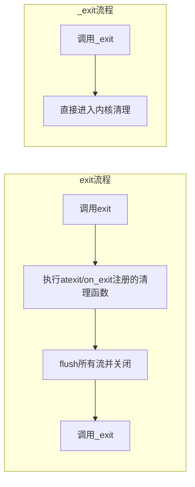
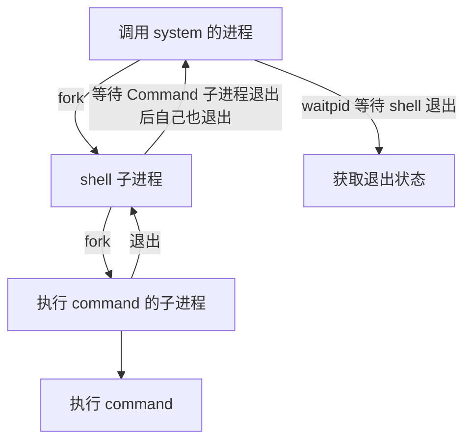

# 第4章　进程控制：进程的一生

进程是操作系统的一个核心概念。每个进程都有自己唯一的标识：进程ID，也有自己的生命周期。一个典型的进程的生命周期如图4-1所示。

> [!INFO] **图4-1**　进程的生命周期
> （图：进程状态转换图，描述创建、就绪、运行、阻塞、终止等状态及其转换。此处省略图，原文已提供文本描述。）

本章将会介绍进程ID、进程的层次，以及进程生命周期内的各个阶段。

## 4.1　进程ID

Linux下每个进程都会有一个非负整数表示的唯一进程ID，简称pid。Linux提供了`getpid`函数来获取进程的pid，同时还提供了`getppid`函数来获取父进程的pid，相关接口定义如下：

```c
#include <sys/types.h>
#include <unistd.h>

pid_t getpid(void);
pid_t getppid(void);
```

每个进程都有自己的父进程，父进程又会有自己的父进程，最终都会追溯到1号进程即`init`进程。这就决定了操作系统上所有的进程必然会组成树状结构，就像一个家族的家谱一样。可以通过`pstree`的命令来查看进程的家族树。

`procfs`文件系统会在`/proc`下为每个进程创建一个目录，名字是该进程的pid。目录下有很多文件，用于记录进程的运行情况和统计信息等，如下所示：

```bash
ll /proc
总用量 0
dr-xr-xr-x  9 root       root          0  4月  1 06:56 1
dr-xr-xr-x  9 root       root          0  4月  1 06:56 10
dr-xr-xr-x  9 root       root          0  4月  1 06:56 100
dr-xr-xr-x  9 root       root          0  4月  1 06:56 101
dr-xr-xr-x  9 root       root          0  4月  1 06:56 102
dr-xr-xr-x  9 root       root          0  4月  1 06:56 103
dr-xr-xr-x  9 root       root          0  4月  1 06:56 1039
dr-xr-xr-x  9 root       root          0  4月  1 06:56 104
    ...
```

因为进程有创建，也有终止，所以`/proc/`下记录进程信息的目录（以及目录下的文件）也会发生变化。

操作系统必须保证在任意时刻都不能出现两个进程有相同pid的情况。虽然进程ID是唯一的，但是进程ID可以重用。进程退出以后，其进程ID还可以再次分配给其他的进程使用。那么问题就来了，内核是如何分配进程ID的？

Linux分配进程ID的算法不同于给进程分配文件描述符的最小可用算法，它采用了**延迟重用**的算法，即分配给新创建进程的ID尽量不与最近终止进程的ID重复，这样就可以防止将新创建的进程误判为使用相同进程ID的已经退出的进程。

那么如何实现延迟重用呢？内核采用的方法如下：
1. 位图记录进程ID的分配情况（0为可用，1为已占用）。
2. 将上次分配的进程ID记录到`last_pid`中，分配进程ID时，从`last_pid + 1`开始找起，从位图中寻找可用的ID。
3. 如果找到位图集合的最后一位仍不可用，则回滚到位图集合的起始位置，从头开始找。

既然是位图记录进程ID的分配情况，那么位图的大小就必须要考虑周全。位图的大小直接决定了系统允许同时存在的进程的最大个数，这个最大个数在系统中称为`pid_max`。

上面的第3步提到，回绕到位图集合的起始位置，从头寻找可用的进程ID。事实上，严格说来，这种说法并不正确，回绕时并不是从0开始找起，而是从300开始找起。内核在`kernel/pid.c`文件中定义了`RESERVED_PIDS`，其值是300，300以下的pid会被系统占用，而不能分配给用户进程：

```c
#define RESERVED_PIDS       300
int pid_max = PID_MAX_DEFAULT;
```

Linux系统下可以通过`procfs`或`sysctl`命令来查看`pid_max`的值：

```bash
manu@manu-rush:~$ cat /proc/sys/kernel/pid_max
131072
manu@manu-rush:~$ sysctl kernel.pid_max
kernel.pid_max = 131072
```

其实，此上限值是可以调整的，系统管理员可以通过如下方法来修改此上限值：

```bash
root@manu-rush:~# sysctl -w kernel.pid_max=4194304
kernel.pid_max = 4194304
```

但是内核自己也设置了硬上限，如果尝试将`pid_max`的值设成一个大于硬上限的值就会失败，如下所示：

```bash
root@manu-rush:~# sysctl -w kernel.pid_max=4194305
error: "Invalid argument" setting key "kernel.pid_max"
```

从上面的操作可以看出，Linux系统将系统进程数的硬上限设置为`4194304`（4M）。内核又是如何决定系统进程个数的硬上限的呢？对此，内核定义了如下的宏：

```c
#define PID_MAX_LIMIT (CONFIG_BASE_SMALL ? PAGE_SIZE * 8 : \
    (sizeof(long) > 4 ? 4 * 1024 * 1024 : PID_MAX_DEFAULT))
```

从上面代码中可以看出决定系统进程个数硬上限的逻辑为：
- 如果选择了`CONFIG_BASE_SMALL`编译选项，则为页面（`PAGE_SIZE`）的位数。
- 如果选择了`CONFIG_BASE_FULL`编译选项，那么：
    - 对于32位系统，系统进程个数硬上限为`32768`（即32K）。
    - 对于64位系统，系统进程个数硬上限为`4194304`（即4M）。

通过上面的讨论可以看出，在64位系统中，系统容许创建的进程的个数超过了400万，这个数字是相当庞大的，足够应用层使用。

对于单线程的程序，进程ID比较好理解，就是唯一标识进程的数字。对于多线程的程序，每一个线程调用`getpid`函数，其返回值都是一样的，即进程的ID。

## 4.2　进程的层次

每个进程都有父进程，父进程也有父进程，这就形成了一个以`init`进程为根的家族树。除此以外，进程还有其他层次关系：进程、进程组和会话。

进程组和会话在进程之间形成了两级的层次：进程组是一组相关进程的集合，会话是一组相关进程组的集合。用人来打比方，会话如同一个公司，进程组如同公司里的部门，进程则如同部门里的员工。尽管每个员工都有父亲，但是不影响员工同时属于某个公司中的某个部门。

这样说来，一个进程会有如下ID：
- **PID**：进程的唯一标识。对于多线程的进程而言，所有线程调用`getpid`函数会返回相同的值。
- **PGID**：进程组ID。每个进程都会有进程组ID，表示该进程所属的进程组。默认情况下新创建的进程会继承父进程的进程组ID。
- **SID**：会话ID。每个进程也都有会话ID。默认情况下，新创建的进程会继承父进程的会话ID。

可以调用如下指令来查看所有进程的层次关系：

```bash
ps -ejH
ps axjf
```

对于进程而言，可以通过如下函数调用来获取其进程组ID和会话ID。

```c
#include <unistd.h>

pid_t getpgrp(void);
pid_t getsid(pid_t pid);
```

前面提到过，新进程默认继承父进程的进程组ID和会话ID，如果都是默认情况的话，那么追根溯源可知，所有的进程应该有共同的进程组ID和会话ID。但是调用`ps axjf`可以看到，实际情况并非如此，系统中存在很多不同的会话，每个会话下也有不同的进程组。

为何会如此呢？

就像家族企业一样，如果从创业之初，所有家族成员都墨守成规，循规蹈矩，默认情况下，就只会有一个公司、一个部门。但是也有些“叛逆”的子弟，愿意为家族公司开疆拓土，愿意成立新的部门。这些新的部门就是新创建的进程组。如果有子弟“离经叛道”，甚至不愿意呆在家族公司里，他别开天地，另创了一个公司，那这个新公司就是新创建的会话组。由此可见，系统必须要有改变和设置进程组ID和会话ID的函数接口，否则，系统中只会存在一个会话、一个进程组。

进程组和会话是为了支持shell作业控制而引入的概念。

当有新的用户登录Linux时，登录进程会为这个用户创建一个会话。用户的登录shell就是会话的首进程。会话的首进程ID会作为整个会话的ID。会话是一个或多个进程组的集合，囊括了登录用户的所有活动。

在登录shell时，用户可能会使用管道，让多个进程互相配合完成一项工作，这一组进程属于同一个进程组。

当用户通过SSH客户端工具（putty、xshell等）连入Linux时，与上述登录的情景是类似的。

### 4.2.1　进程组

修改进程组ID的接口如下：

```c
#include <unistd.h>

int setpgid(pid_t pid, pid_t pgid);
```

这个函数的含义是，找到进程ID为`pid`的进程，将其进程组ID修改为`pgid`，如果`pid`的值为0，则表示要修改调用进程的进程组ID。该接口一般用来创建一个新的进程组。

下面三个接口含义一致，都是创立新的进程组，并且指定的进程会成为进程组的首进程。如果参数`pid`和`pgid`的值不匹配，那么`setpgid`函数会将一个进程从原来所属的进程组迁移到`pgid`对应的进程组。

```c
setpgid(0,0)
setpgid(getpid(),0)
setpgid(getpid(),getpid())
```

`setpgid`函数有很多限制：
- `pid`参数必须指定为调用`setpgid`函数的进程或其子进程，不能随意修改不相关进程的进程组ID，如果违反这条规则，则返回-1，并置`errno`为`ESRCH`。
- `pid`参数可以指定调用进程的子进程，但是子进程如果已经执行了`exec`函数，则不能修改子进程的进程组ID。如果违反这条规则，则返回-1，并置`errno`为`EACCESS`。
- 在进程组间移动，调用进程，`pid`指定的进程及目标进程组必须在同一个会话之内。这个比较好理解，不加入公司（会话），就无法加入公司下属的部门（进程组），否则就是部门要造反的节奏。如果违反这条规则，则返回-1，并置`errno`为`EPERM`。
- `pid`指定的进程，不能是会话首进程。如果违反这条规则，则返回-1，并置`errno`为`EPERM`。

有了创建进程组的接口，新创建的进程组就不必继承父进程的进程组ID了。最常见的创建进程组的场景就是在shell中执行管道命令，代码如下：

```bash
cmd1 | cmd2 | cmd3
```

下面用一个最简单的命令来说明，其进程之间的关系如图4-2所示。

```bash
ps ax|grep nfsd
```

> [!INFO] **图4-2**　进程组和进程的关系
> （图：`ps`进程和`grep`进程都是bash创建的子进程，两者通过管道协同完成一项工作，它们隶属于同一个进程组，其中`ps`进程是进程组的组长。此处省略图，原文已提供文本描述。）

`ps`进程和`grep`进程都是bash创建的子进程，两者通过管道协同完成一项工作，它们隶属于同一个进程组，其中`ps`进程是进程组的组长。

进程组的概念并不难理解，可以将人与人之间的关系做类比。一起工作的同事，自然比毫不相干的路人更加亲近。shell中协同工作的进程属于同一个进程组，就如同协同工作的人属于同一个部门一样。

引入了进程组的概念，可以更方便地管理这一组进程了。比如这项工作放弃了，不必向每个进程一一发送信号，可以直接将信号发送给进程组，进程组内的所有进程都会收到该信号。

前文曾提到过，子进程一旦执行`exec`，父进程就无法调用`setpgid`函数来设置子进程的进程组ID了，这条规则会影响shell的作业控制。出于保险的考虑，一般父进程在调用`fork`创建子进程后，会调用`setpgid`函数设置子进程的进程组ID，同时子进程也要调用`setpgid`函数来设置自身的进程组ID。这两次调用有一次是多余的，但是这样做能够保证无论是父进程先执行，还是子进程先执行，子进程一定已经进入了指定的进程组中。由于`fork`之后，父子进程的执行顺序是不确定的，因此如果不这样做，就会造成在一定的时间窗口内，无法确定子进程是否进入了相应的进程组。

可以通过跟踪bash进程的系统调用来证明这一点，下面的2258进程是bash，我们在该bash上执行`sleep 200`，在执行之前，在另一个终端用`strace`跟踪bash的系统调用，可以看到，父进程和子进程都执行了一遍`setpgid`函数，代码如下所示：

```bash
manu@manu-hacks:~$ sudo strace -f -p 2258
Process 2258 attached
    ．．．
/*父进程调用setpgid函数*/
[pid  2258] setpgid(2509, 2509 <unfinished ...>．．．
/*子进程调用setpgid函数*/
[pid  2509] setpgid(2509, 2509 <unfinished ...>．．．
/*子进程执行execve*/
[pid  2509] execve("/bin/sleep", ["sleep", "200"], [/* 31 vars */]) = 0．．．
```

用户在shell中可以同时执行多个命令。对于耗时很久的命令（如编译大型工程），用户不必傻傻等待命令运行完毕才执行下一个命令。用户在执行命令时，可以在命令的结尾添加“&”符号，表示将命令放入后台执行。这样该命令对应的进程组即为后台进程组。在任意时刻，可能同时存在多个后台进程组，但是不管什么时候都只能有一个前台进程组。只有在前台进程组中进程才能在控制终端读取输入。当用户在终端输入信号生成终端字符（如ctrl+c、ctrl+z、ctr+\等）时，对应的信号只会发送给前台进程组。

shell中可以存在多个进程组，无论是前台进程组还是后台进程组，它们或多或少存在一定的联系，为了更好地控制这些进程组（或者称为作业），系统引入了会话的概念。会话的意义在于将很多的工作囊括在一个终端，选取其中一个作为前台来直接接收终端的输入及信号，其他的工作则放在后台执行。

### 4.2.2　会话

会话是一个或多个进程组的集合，以用户登录系统为例，可能存在如图4-3所示的情况。

> [!INFO] **图4-3**　进程组与会话的关系
> （图：会话包含多个进程组，其中一个进程组为前台进程组，其余为后台进程组。此处省略图，原文已提供文本描述。）

系统提供`setsid`函数来创建会话，其接口定义如下：

```c
#include <unistd.h>

pid_t setsid(void);
```

如果这个函数的调用进程不是进程组组长，那么调用该函数会发生以下事情：
1. 创建一个新会话，会话ID等于进程ID，调用进程成为会话的首进程。
2. 创建一个进程组，进程组ID等于进程ID，调用进程成为进程组的组长。
3. 该进程没有控制该进程没有控制终端，如果调用`setsid`前，该进程有控制终端，这种联系就会断掉。

调用`setsid`函数的进程不能是进程组的组长，否则调用会失败，返回-1，并置`errno`为`EPERM`。

这个限制是比较合理的。如果允许进程组组长迁移到新的会话，而进程组的其他成员仍然在老的会话中，那么，就会出现同一个进程组的进程分属不同的会话之中的情况，这就破坏了进程组和会话的严格的层次关系了。

Linux提供了`setsid`命令，可以在新的会话中执行命令，通过该命令可以很容易地验证上面提到的三点：

```bash
manu@manu-hacks:~$ setsid sleep 100
manu@manu-hacks:~$ ps ajxf
PPID   PID  PGID   SID TTY      TPGID STAT   UID   TIME COMMAND
1     4469  4469  4469 ?           -1   Ss   1000   0:00 sleep 100
```

从输出中可以看出，系统创建了新的会话4469，新的会话下又创建了新的进程组，会话ID和进程组ID都等于进程ID，而该进程已经不再拥有任何控制终端了（TTY对应的值为“？”表示进程没有控制终端）。

常用的调用`setsid`函数的场景是`login`和`shell`。除此以外创建daemon进程也要调用`setsid`函数。

## 4.3　进程的创建之`fork()`

Linux系统下，进程可以调用`fork`函数来创建新的进程。调用进程为父进程，被创建的进程为子进程。`fork`函数的接口定义如下：

```c
#include <unistd.h>

pid_t fork(void);
```

与普通函数不同，`fork`函数会返回两次。一次返回在父进程中，另一次返回在子进程中。父进程中返回子进程的PID，子进程中返回0。如果创建失败，则返回-1并设置`errno`。

一般来说，创建两个完全相同的进程并没有太多的价值。大部分情况下，父子进程会执行不同的代码分支。`fork`函数的返回值就成了区分父子进程的关键。`fork`函数向子进程返回0，并将子进程的进程ID返给父进程。当然了，如果`fork`失败，该函数则返回-1，并设置`errno`。

常见的出错情景如表4-1所示。

**表4-1　`fork`函数可能的`errno`**

| errno 值 | 说明 |
|---------|------|
| EAGAIN | 系统达到进程数上限或内存不足 |
| ENOMEM | 内存不足，无法完成内核数据结构的分配 |
| ... | ... |

所以一般而言，调用`fork`的程序，大多会如此处理：

```c
ret = fork();
if(ret == 0)
{
    // 此处是子进程的代码分支
}
else if(ret > 0)
{
    // 此处是父进程的代码分支
}
else
{
    // fork失败,执行error handle
}
```

> [!WARNING] **注意**　`fork`可能失败。检查返回值进行正确的出错处理，是一个非常重要的习惯。设想如果`fork`返回-1，而程序没有判断返回值，直接将-1当成子进程的进程号，那么后面的代码执行`kill(child_pid, 9)`就相当于执行`kill(-1, 9)`。这会发生什么？后果是惨重的，它将杀死除了`init`以外的所有进程，只要它有权限。读者可以通过`man 2 kill`来查看`kill(-1, 9)`的含义。

`fork`之后，对于父子进程，谁先获得CPU资源，而率先运行呢？

从内核2.6.32开始，在默认情况下，父进程将成为`fork`之后优先调度的对象。采取这种策略的原因是：`fork`之后，父进程在CPU中处于活跃的状态，并且其内存管理信息也被置于硬件内存管理单元的转译后备缓冲器（TLB），所以先调度父进程能提升性能。

从2.6.24起，Linux采用完全公平调度（Completely Fair Scheduler，CFS）。用户创建的普通进程，都采用CFS调度策略。对于CFS调度策略，`procfs`提供了如下控制选项：

```text
/proc/sys/kernel/sched_child_runs_first
```

该值默认是0，表示父进程优先获得调度。如果将该值改成1，那么子进程会优先获得调度。

POSIX标准和Linux都没有保证会优先调度父进程。因此在应用中，决不能对父子进程的执行顺序做任何的假设。如果确实需要某一特定执行的顺序，那么需要使用进程间同步的手段。

### 4.3.1　`fork`之后父子进程的内存关系

`fork`之后的子进程完全拷贝了父进程的地址空间，包括栈、堆、代码段等。通过下面的示例代码，我们一起来查看父子进程的内存关系：

```c
#include <stdio.h>
#include <stdlib.h>
#include <unistd.h>
#include <string.h>
#include <errno.h>
#include <sys/types.h>
#include <wait.h>

int g_int = 1;

int main()
{
    int local_int = 1;
    int *malloc_int = malloc(sizeof(int));
    *malloc_int = 1;

    pid_t pid = fork();
    if(pid == 0) /*子进程*/
    {
        local_int = 0;
        g_int = 0;
        *malloc_int = 0;
        fprintf(stderr,"[CHILD ] child change local global malloc value to 0\n");
        free(malloc_int);
        sleep(10);
        fprintf(stderr,"[CHILD ] child exit\n");
        exit(0);
    }
    else if(pid < 0)
    {
        printf("fork failed (%s)",strerror(errno));
        return 1;
    }

    fprintf(stderr,"[PARENT] wait child exit\n");
    waitpid(pid,NULL,0);
    fprintf(stderr,"[PARENT] child have exit\n");
    printf("[PARENT] g_int = %d\n",g_int);
    printf("[PARENT] local_int = %d\n",local_int);
    printf("[PARENT] malloc_int = %d\n",local_int);
    free(malloc_int);
    return 0;
}
```

这里刻意定义了三个变量，一个是位于数据段的全局变量，一个是位于栈上的局部变量，还有一个是通过`malloc`动态分配位于堆上的变量，三者的初始值都是1。然后调用`fork`创建子进程，子进程将三个变量的值都改成了0。

按照`fork`的语义，子进程完全拷贝了父进程的数据段、栈和堆上的内存，如果父子进程对相应的数据进行修改，那么两个进程是并行不悖、互不影响的。因此，在上面示例代码中，尽管子进程将三个变量的值都改成了0，对父进程而言这三个值都没有变化，仍然是1，代码的输出也证实了这一点。

```text
[PARENT] wait child exit
[CHILD ] child change local global malloc value to 0
[CHILD ] child exit
[PARENT] child have exit
[PARENT] g_int = 1
[PARENT] local_int = 1
[PARENT] malloc_int = 1
```

前文提到过，子进程和父进程执行一模一样的代码的情形比较少见。Linux提供了`execve`系统调用，构建在该系统调用之上，glibc提供了`exec`系列函数。这个系列函数会丢弃现存的程序代码段，并构建新的数据段、栈及堆。调用`fork`之后，子进程几乎总是通过调用`exec`系列函数，来执行新的程序。

在这种背景下，`fork`时子进程完全拷贝父进程的数据段、栈和堆的做法是不明智的，因为接下来的`exec`系列函数会毫不留情地抛弃刚刚辛苦拷贝的内存。为了解决这个问题，Linux引入了**写时拷贝（copy-on-write）**的技术。

写时拷贝是指子进程的页表项指向与父进程相同的物理内存页，这样只拷贝父进程的页表项就可以了，当然要把这些页面标记成只读（如图4-4所示）。如果父子进程都不修改内存的内容，大家便相安无事，共用一份物理内存页。但是一旦父子进程中有任何一方尝试修改，就会引发缺页异常（page fault）。此时，内核会尝试为该页面创建一个新的物理页面，并将内容真正地复制到新的物理页面中，让父子进程真正地各自拥有自己的物理内存页，然后将页表中相应的表项标记为可写。

> [!INFO] **图4-4**　写时拷贝
> （图：父进程页表指向物理内存，子进程页表项最初指向相同的物理页，并标记为只读。一旦写入，触发缺页，复制物理页，更新页表。此处省略图，原文已提供文本描述。）

从上面的描述可以看出，对于没有修改的页面，内核并没有真正地复制物理内存页，仅仅是复制了父进程的页表。这种机制的引入提升了`fork`的性能，从而使内核可以快速地创建一个新的进程。

从内核代码层面来讲，其调用关系如图4-5所示。

> [!INFO] **图4-5**　`fork`复制内核页表流程
> （图：`fork` → `_do_fork` → `copy_process` → `copy_mm` → `dup_mm` → `dup_mmap` → `copy_page_range` → ... → `copy_one_pte`。此处省略图，原文已提供文本描述。）

Linux的内存管理使用的是四级页表，如图4-6所示，看了四级页表的名字，也就不难推测图4-5中那些函数的作用了。

> [!INFO] **图4-6**　页表的复制示意图
> （图：四级页表结构：PGD、PUD、PMD、PTE。此处省略图，原文已提供文本描述。）

在最后的`copy_one_pte`函数中有如下代码：

```c
/*如果是写时拷贝,那么无论是初始页表,还是拷贝的页表,都设置了写保护
 *后面无论父子进程,修改页表对应位置的内存时,都会触发page fault
 */
if (is_cow_mapping(vm_flags)) {
    ptep_set_wrprotect(src_mm, addr, src_pte);
    pte = pte_wrprotect(pte);
}
```

该代码将页表设置成写保护，父子进程中任意一个进程尝试修改写保护的页面时，都会引发缺页中断，内核会走向`do_wp_page`函数，该函数会负责创建副本，即真正的拷贝。

写时拷贝技术极大地提升了`fork`的性能，在一定程度上让`vfork`成为了鸡肋。

# 第4章 进程控制：进程的一生

## 4.3.2 fork之后父子进程与文件的关系

执行`fork`函数，内核会复制父进程所有的文件描述符。对于父进程打开的所有文件，子进程也是可以操作的。那么父子进程同时操作同一个文件是并行不悖的，还是互相影响的呢？

下面通过对一个例子的讨论来说明这个问题。`read`函数并没有将偏移量作为参数传入，但是每次调用`read`函数或`write`函数时，却能够接着上次读写的位置继续读写。原因是内核已经将偏移量的信息记录在与文件描述符相关的数据结构里了。那么问题来了，父子进程是共用一个文件偏移量还是各有各的文件偏移量呢？

```c
/* read 和 write 都没有将 pos 信息作为入参 */
ssize_t read(int fd, void *buf, size_t count);
ssize_t write(int fd, const void *buf, size_t count);
```

我们用事实说话，请看下面的例子：

```c
#include <stdio.h>
#include <string.h>
#include <strings.h>
#include <unistd.h>
#include <sys/types.h>
#include <sys/stat.h>
#include <fcntl.h>
#include <errno.h>

#define INFILE "./in.txt"
#define OUTFILE "./out.txt"
#define MODE  S_IRUSR |S_IWUSR|S_IRGRP|S_IWGRP|S_IROTH

int main(void)
{
    int fd_in,fd_out;
    char buf[1024];
    memset(buf, 0, 1024);

    fd_in = open(INFILE, O_RDONLY);
    if(fd_in < 0 )
    {
        fprintf(stderr,"failed to open %s, reason(%s)\n", INFILE,strerror(errno));
        return 1;
    }

    fd_out = open(OUTFILE, O_WRONLY|O_CREAT|O_TRUNC, MODE);
    if(fd_out < 0)
    {
        fprintf(stderr,"failed to open %s, reason(%s)\n", OUTFILE,strerror(errno));
        return 1;
    }

    fork(); /* 此处忽略错误检查 */

    while(read(fd_in, buf, 2) > 0)
    {
        printf("%d: %s",getpid(),buf);
        sprintf(buf, "%d Hello,World!\n",getpid());
        write(fd_out,buf,strlen(buf));
        sleep(1);
        memset(buf, 0, 1024);
    }
}
```

INFILE的内容是：

```
1
2
3
4
5
6
```

上面的程序中，父子进程都会去读`INFILE`。如果父子进程各维护各的文件偏移量，那么父子进程都会打印出`1~6`。

事实如何呢？请看输出内容：

```
manu@manu-hacks:~/code/self/c/fork$ ./fork_file
6602: 1
6603: 2
6602: 3
6603: 4
6602: 5
6603: 6
```

当然，有时候输出是这样的：

```
manu@manu-hacks:~/code/self/c/fork$ ./fork_file
6610: 1
6611: 2
6610: 3
6611: 4
6610: 5
6611: 5
6610: 6
```

如果父子进程各自维护自己的文件偏移量，那么一定是打印出两套`1~6`，但是事实并非如此。无论父进程还是子进程调用`read`函数导致文件偏移量后移都会被对方获知，这表明**父子进程共用了一套文件偏移量**。

对于第二个输出，为什么父子进程都打印`5`呢？这是因为我的机器是多核的，父子进程同时执行，发现当前文件偏移量是`4*2`，然后各自去读了第8和第9字节，也就是`"5\n"`。

写文件也是一样，如果`fork`之前打开了某文件，之后父子进程写入同一个文件描述符而又不采取任何同步的手段，那么就会因为共享文件偏移量而使输出相互混合，不可阅读。

文件描述符还有一个**文件描述符标志（file descriptor flag）**。目前只定义了一个标志位：`FD_CLOSEXEC`，这是`close_on_exec`标志位。细心阅读`open`函数手册也会发现，`open`函数也有一个类似的标志位，即`O_CLOSEXEC`，该标志位也是用于设置文件描述符标志的。

那么这个标志位到底有什么作用呢？如果文件描述符中将这个标志位置位，那么调用`exec`时会自动关闭对应的文件。

可是为什么需要这个标志位呢？主要是出于安全的考虑。

对于`fork`之后子进程执行`exec`这种场景，如果子进程可以操作父进程打开的文件，就会带来严重的安全隐患[1]。一般来讲，调用`exec`的子进程时，因为它会另起炉灶，因此父进程打开的文件描述符也应该一并关闭，但事实上内核并没有主动这样做。试想如下场景：Webserver首先以`root`权限启动，打开只有拥有`root`权限才能打开的端口和日志等文件，再降到普通用户，`fork`出一些`worker`进程，在进程中进行解析脚本、写日志、输出结果等操作。由于子进程完全可以操作父进程打开的文件，因此子进程中的脚本只要继续操作这些文件描述符，就能越权操作`root`用户才能操作的文件。

为了解决这个问题，Linux引入了`close on exec`机制。设置了`FD_CLOSEXEC`标志位的文件，在子进程调用`exec`家族函数时会将相应的文件关闭。而设置该标志位的方法有两种：

- `open`时，带上`O_CLOSEXEC`标志位。
- `open`时如果未设置，那就在后面调用`fcntl`函数的`F_SETFD`操作来设置。

建议使用第一种方法。原因是第二种方法在某些时序条件下并不那么绝对的安全。考虑图4-7的场景：Thread 1还没来得及将`FD_CLOSEXEC`置位，由于Thread 2已经执行过`fork`，这时候`fork`出来的子进程就不会关闭相应的文件。尽管Thread 1后来调用了`fcntl`的`F_SETFD`操作，但是为时已晚，文件已经泄露了。

> [!WARNING] 图4-7　未及时`fcntl`导致文件描述符的泄露
> 图4-7中，多线程程序执行了`fork`，仅仅是为了示意，实际中并不鼓励这种做法。正相反，这种做法是十分危险的。多线程程序不应该调用`fork`来创建子进程，第8章会分析具体原因。

前面提到，执行`fork`时，子进程会获取父进程所有文件描述符的副本，但是测试结果表明，父子进程共享了文件的很多属性。这到底是怎么回事？让我们深入内核一探究竟。

> [!INFO] 注[1]
> Linux系统文件描述符继承带来的危害请参看：http://www.80sec.com/security-issue-on-linux-fd-inheritance.html。

## 4.3.3 文件描述符复制的内核实现

在内核的进程描述符`task_struct`结构体中，与打开文件相关的变量如下所示：

```c
struct task_struct {
    ...
    struct files_struct *files;
    ...
}
```

调用`fork`时，内核会在`copy_files`函数中处理拷贝父进程打开的文件的相关事宜：

```c
static int copy_files(unsigned long clone_flags,
                struct task_struct *tsk)
{
    struct files_struct *oldf, *newf;
    int error = 0;

    oldf = current->files;
    if (!oldf)
        goto out;

    /* 创建线程和 vfork,都不用复制父进程的文件描述符,增加引用计数即可 */
    if (clone_flags & CLONE_FILES) {
        atomic_inc(&oldf->count);
        goto out;
    }

    /* 对于 fork 而言,需要复制父进程的文件描述符 */
    newf = dup_fd(oldf, &error);
    if (!newf)
        goto out;

    tsk->files = newf;
    error = 0;

out:
    return error;
}
```

`CLONE_FILES`标志位用来控制是否共享父进程的文件描述符。如果该标志位置位，则表示不必费劲复制一份父进程的文件描述符了，增加引用计数，直接共用一份就可以了。对于`vfork`函数和创建线程的`pthread_create`函数来说都是如此。但是`fork`函数却不同，调用`fork`函数时，该标志位为0，表示需要为子进程拷贝一份父进程的文件描述符。文件描述符的拷贝是通过内核的`dup_fd`函数来完成的。

```c
struct files_struct *dup_fd(struct files_struct *oldf,
                  int *errorp)
{
    struct files_struct *newf;
    struct file **old_fds, **new_fds;
    int open_files, size, i;
    struct fdtable *old_fdt, *new_fdt;

    *errorp = -ENOMEM;
    newf = kmem_cache_alloc(files_cachep, GFP_KERNEL);
    if (!newf)
        goto out;
```

`dup_fd`函数首先会给子进程分配一个`file_struct`结构体，然后做一些赋值操作。这个结构体是进程描述符中与打开文件相关的数据结构，每一个打开的文件都会记录在该结构体中。其定义代码如下：

```c
struct files_struct {
    atomic_t count;
    struct fdtable __rcu *fdt;
    struct fdtable fdtab;
    spinlock_t file_lock ____cacheline_aligned_in_smp;
    int next_fd;
    struct embedded_fd_set close_on_exec_init;
    struct embedded_fd_set open_fds_init;
    struct file __rcu * fd_array[NR_OPEN_DEFAULT];
};

struct fdtable
{
    unsigned int max_fds;
    struct file __rcu **fd;      /* current fd array */
    fd_set *close_on_exec;
    fd_set *open_fds;
    struct rcu_head rcu;
    struct fdtable *next;
};

struct embedded_fd_set {
    unsigned long fds_bits[1];
};
```

初看之下`struct fdtable`的内容与`struct files_struct`的内容有颇多重复之处，包括`close_on_exec`文件描述符位图、打开文件描述符位图及`file`指针数组等，但事实上并非如此。`struct files_struct`中的成员是相应数据结构的**实例**，而`struct fdtable`中的成员是相应的**指针**。

Linux系统假设大多数的进程打开的文件不会太多。于是Linux选择了一个`long`类型的位数（32位系统下为32位，64位系统下为64位）作为经验值。

以64位系统为例，`file_struct`结构体自带了可以容纳64个`struct file`类型指针的数组`fd_array`，也自带了两个大小为64的位图，其中`open_fds_init`位图用于记录文件的打开情况，`close_on_exec_init`位图用于记录文件描述符的`FD_CLOSEXEC`标志位是否置位。只要进程打开的文件个数小于64，`file_struct`结构体自带的指针数组和两个位图就足以满足需要。因此在分配了`file_struct`结构体后，内核会初始化`file_struct`自带的`fdtable`，代码如下所示：

```c
    atomic_set(&newf->count, 1);
    spin_lock_init(&newf->file_lock);
    newf->next_fd = 0;

    new_fdt = &newf->fdtab;
    new_fdt->max_fds = NR_OPEN_DEFAULT;
    new_fdt->close_on_exec = (fd_set *)&newf->close_on_exec_init;
    new_fdt->open_fds = (fd_set *)&newf->open_fds_init;
    new_fdt->fd = &newf->fd_array[0];
    new_fdt->next = NULL;
```

初始化之后，子进程的`file_struct`的情况如图4-8所示。注意，此时`file_struct`结构体中的`fdt`指针并未指向`file_struct`自带的`struct fdtable`类型的`fdtab`变量。原因很简单，因为此时内核还没有检查父进程打开文件的个数，因此并不确定自带的结构体能否满足需要。

> 图4-8　进程描述符中文件相关的数据结构
> 描述：图中展示`task_struct`中的`files`指针指向`files_struct`，`files_struct`包含`fdtab`（`struct fdtable`实例）和`fdt`（`struct fdtable __rcu *`指针），以及`fd_array`、`open_fds_init`、`close_on_exec_init`等成员。初始化后`fdt`指向自带的`fdtab`。

接下来，内核会检查父进程打开文件的个数。如果父进程打开的文件超过了64个，`struct files_struct`中自带的数组和位图就不能满足需要了。这种情况下内核会分配一个新的`struct fdtable`，代码如下：

```c
    spin_lock(&oldf->file_lock);
    old_fdt = files_fdtable(oldf);
    open_files = count_open_files(old_fdt);

    /* 如果父进程打开文件的个数超过 NR_OPEN_DEFAULT */
    while (unlikely(open_files > new_fdt->max_fds)) {
        spin_unlock(&oldf->file_lock);
        /* 如果不是自带的 fdtable 而是曾经分配的 fdtable,则需要先释放 */
        if (new_fdt != &newf->fdtab)
            __free_fdtable(new_fdt);

        /* 创建新的 fdtable */
        new_fdt = alloc_fdtable(open_files - 1);
        if (!new_fdt) {
            *errorp = -ENOMEM;
            goto out_release;
        }

        /* 如果超出了系统限制,则返回 EMFILE */
        if (unlikely(new_fdt->max_fds < open_files)) {
            __free_fdtable(new_fdt);
            *errorp = -EMFILE;
            goto out_release;
        }

        spin_lock(&oldf->file_lock);
        old_fdt = files_fdtable(oldf);
        open_files = count_open_files(old_fdt);
    }
```

`alloc_fdtable`所做的事情，不过是分配`fdtable`结构体本身，以及分配一个指针数组和两个位图（如图4-9所示）。分配之前会根据父进程打开文件的数目，计算出一个合理的值`nr`，以确保分配的数组和位图能够满足需要。

> 图4-9　`alloc_fdtable`原理
> 描述：`alloc_fdtable`函数根据需要的`max_fds`计算`nr`，然后分配`fdtable`结构体，以及一个`struct file *`指针数组（长度`nr`）和两个`fd_set`位图（`open_fds`和`close_on_exec`）。同时会设置`max_fds`为`nr`。

无论是使用`file_struct`结构体自带的`fdtable`，还是使用`alloc_fdtable`分配的`fdtable`，接下来要做的事情都一样，即将父进程的两个位图信息和打开文件的`struct file`类型指针拷贝到子进程的对应数据结构中，代码如下：

```c
    old_fds = old_fdt->fd;  /* 父进程的 struct file 指针数组 */
    new_fds = new_fdt->fd;  /* 子进程的 struct file 指针数组 */

    /* 拷贝打开文件位图 */
    memcpy(new_fdt->open_fds->fds_bits,
           old_fdt->open_fds->fds_bits,
           open_files/8);

    /* 拷贝 close_on_exec```c
    /* 拷贝 close_on_exec 位图 */
    memcpy(new_fdt->close_on_exec->fds_bits,
           old_fdt->close_on_exec->fds_bits,
           open_files/8);

    for (i = open_files; i != 0; i--) {
        struct file *f = *old_fds++;
        if (f) {
            /* 子进程的 struct file 类型指针，
             * 指向和父进程相同的 struct file 结构体 */
            rcu_assign_pointer(*new_fds++, f);
        } else {
            FD_CLR(open_files - i, new_fdt->open_fds);
        }
    }
    spin_unlock(&oldf->file_lock);

    /* compute the remainder to be cleared */
    size = (new_fdt->max_fds - open_files) * sizeof(struct file *);
    /* struct file 结构的指针清零 */
    memset(new_fds, 0, size);

    /* 将尚未分配到的位图区域清零 */
    if (new_fdt->max_fds > open_files) {
        int left = (new_fdt->max_fds - open_files) / 8;
        int start = open_files / (8 * sizeof(unsigned long));
        memset(&new_fdt->open_fds->fds_bits[start], 0, left);
    }
```

> [!NOTE] procfs 中的 FDSize
> `procfs` 的 `/proc/PID/status` 中的 `FDSize`,记录了当前 `fdtable` 的大小:
> ```
> manu@manu-hacks:~$ cat /proc/1/status
> FDSize: 128
> ```
> 当然了,`FDSize` 记录的是目前 `fdtable` 能容纳的 `struct file` 指针,而不是已经打开的文件个数.已经打开的文件记录在 `/proc/PID/fd` 中.

通过对上述流程的梳理,不难看出,父子进程之间拷贝的是 `struct file` 的指针,而不是 `struct file` 的实例.父子进程的 `struct file` 类型指针,都指向同一个 `struct file` 实例.`fork` 之后,父子进程的文件描述符关系如图 4-10 所示.

> 图 4-10 `fork` 之后,父子进程的文件描述符关系
> 描述:该图展示了父进程和子进程各有自己的 `task_struct` 和 `files_struct`,但两个 `files_struct` 中的 `fdtable->fd` 数组里的每个 `struct file *` 指针都指向同一个 `struct file` 实例.该 `struct file` 实例包含了 `f_pos`(文件偏移量)等信息.

下面来看看 `struct file` 成员变量:

```c
struct file{
    ...
    unsigned int    f_flags;
    fmode_t         f_mode;
    loff_t          f_pos;   /* 文件位置指针的当前值，即文件偏移量 */
    ...
}
```

看到此处,就不难理解父子进程是如何共享文件偏移量的了,那是因为父子进程的指针都指向了同一个 `struct file` 结构体.

## 4.4 进程的创建之 `vfork()`

在早期的实现中,`fork` 没有实现写时拷贝机制,而是直接对父进程的数据段、堆和栈进行完全拷贝,效率十分低下.很多程序在 `fork` 一个子进程后,会紧接着执行 `exec` 家族函数,这更是一种浪费.所以 BSD 引入了 `vfork`.既然 `fork` 之后会执行 `exec` 函数,拷贝父进程的内存数据就变成了一种无意义的行为,所以引入的 `vfork` 压根就不会拷贝父进程的内存数据,而是直接共享.再后来 Linux 引入了写时拷贝的机制,其效率提高了很多,这样一来,`vfork` 其实就可以退出历史舞台了.除了一些需要将性能优化到极致的场景,大部分情况下不需要再使用 `vfork` 函数了.

`vfork` 会创建一个子进程,该子进程会共享父进程的内存数据,而且系统将保证子进程先于父进程获得调度.子进程也会共享父进程的地址空间,而父进程将被一直挂起,直到子进程退出或执行 `exec`.

> [!WARNING] `vfork` 之后不要使用 `return`
> 注意,`vfork` 之后,子进程如果返回,则不要调用 `return`,而应该使用 `_exit` 函数.如果使用 `return`,就会出现诡异的错误[1].请看下面的示例代码:

```c
#include <stdio.h>
#include <stdlib.h>
#include <unistd.h>

int glob = 88;

int main(void) {
    int var;
    var = 88;
    pid_t pid;

    if ((pid = vfork()) < 0) {
        printf("vfork error");
        exit(-1);
    } else if (pid == 0) { /* 子进程 */
        var++;
        glob++;
        return 0;
    }

    printf("pid=%d, glob=%d, var=%d\n", getpid(), glob, var);
    return 0;
}
```

调用子进程,如果使用 `return` 返回,就意味着 `main` 函数返回了,因为栈是父子进程共享的,所以程序的函数栈发生了变化.`main` 函数 `return` 之后,通常会调用 `exit` 系的函数,父进程收到子进程的 `exit` 之后,就会开始从 `vfork` 返回,但是这时整个 `main` 函数的栈都已经不复存在了,所以父进程压根无法执行.于是会返回一个诡异的栈地址,对于在某些内核版本中,进程会直接报栈错误然后退出,但是在某些内核版本中,有可能就会再次进入 `main`,于是进入一个无限循环,直到 `vfork` 返回错误.笔者的 Ubuntu 版本就是后者.

一般来说,`vfork` 创建的子进程会执行 `exec`,执行完 `exec` 后应该调用 `_exit` 返回.注意是 `_exit` 而不是 `exit`.因为 `exit` 会导致父进程 `stdio` 缓冲区的冲刷和关闭.我们会在后面讲述 `exit` 和 `_exit` 的区别.

> [!INFO] 注[1]
> 请参考著名程序员陈皓的《[vfork挂掉的一个问题](http://coolshell.cn/articles/12103.html)》一文.

# 第4章 进程控制:进程的一生

## 4.5 daemon进程的创建

daemon进程又被称为守护进程,一般来说它有以下两个特点:
- 生命周期很长,一旦启动,正常情况下不会终止,一直运行到系统退出.但凡事无绝对:daemon进程其实也是可以停止的,如很多daemon提供了stop命令,执行stop命令就可以终止daemon,或者通过发送信号将其杀死,又或者因为daemon进程代码存在bug而异常退出.这些退出一般都是由手工操作或因异常引发的.
- 在后台执行,并且不与任何控制终端相关联.即使daemon进程是从终端命令行启动的,终端相关的信号如SIGINT、SIGQUIT和SIGTSTP,以及关闭终端,都不会影响到daemon进程的继续执行.

习惯上daemon进程的名字通常以d结尾,如sshd、rsyslogd等.但这仅仅是习惯,并非一定要如此.

如何使一个进程变成daemon进程,或者说编写daemon进程,需要遵循哪些规则或步骤呢?

一般来讲,创建一个daemon进程的步骤被概括地称为double-fork magic.细细说来,需要以下步骤.

### 步骤详解

1. **执行fork()函数,父进程退出,子进程继续**
   执行这一步,原因有二:
   - 父进程有可能是进程组的组长(在命令行启动的情况下),从而不能够执行后面要执行的setsid函数,子进程继承了父进程的进程组ID,并且拥有自己的进程ID,一定不会是进程组的组长,所以子进程一定可以执行后面要执行的setsid函数.
   - 如果daemon是从终端命令行启动的,那么父进程退出会被shell检测到,shell会显示shell提示符,让子进程在后台执行.

2. **子进程执行如下三个步骤,以摆脱与环境的关系**
   - 修改进程的当前目录为根目录(/)
     这样做是有原因的,因为daemon一直在运行,如果当前工作路径上包含有根文件系统以外的其他文件系统,那么这些文件系统将无法卸载.因此,常规是将当前工作目录切换成根目录,当然也可以是其他目录,只要确保该目录所在的文件系统不会被卸载即可.
     ```c
     chdir("/");
     ```
   - 调用setsid函数.这个函数的目的是切断与控制终端的所有关系,并且创建一个新的会话.
     这一步比较关键,因为这一步确保了子进程不再归属于控制终端所关联的会话.因此无论终端是否发送SIGINT、SIGQUIT或SIGTSTP信号,也无论终端是否断开,都与要创建的daemon进程无关,不会影响到daemon进程的继续执行.
   - 设置文件模式创建掩码为0.
     ```c
     umask(0);
     ```
     这一步的目的是让daemon进程创建文件的权限属性与shell脱离关系.因为默认情况下,进程的umask来源于父进程shell的umask.如果不执行umask(0),那么父进程shell的umask就会影响到daemon进程的umask.如果用户改变了shell的umask,那么也就相当于改变了daemon的umask,就会造成daemon进程每次执行的umask信息可能会不一致.

3. **再次执行fork,父进程退出,子进程继续**
   执行完前面两步之后,可以说已经比较圆满了:新建会话,进程是会话的首进程,也是进程组的首进程.进程ID、进程组ID和会话ID,三者的值相同,进程和终端无关联.那么这里为何还要再执行一次fork函数呢?
   原因是,daemon进程有可能会打开一个终端设备,即daemon进程可能会根据需要,执行类似如下的代码:
   ```c
   int fd = open("/dev/console", O_RDWR);
   ```
   这个打开的终端设备是否会成为daemon进程的控制终端,取决于两点:
   - daemon进程是不是会话的首进程.
   - 系统实现.(BSD风格的实现不会成为daemon进程的控制终端,但是POSIX标准说这由具体实现来决定).
   既然如此,为了确保万无一失,只有确保daemon进程不是会话的首进程,才能保证打开的终端设备不会自动成为控制终端.因此,不得不执行第二次fork,fork之后,父进程退出,子进程继续.这时,子进程不再是会话的首进程,也不是进程组的首进程了.

4. **关闭标准输入(stdin)、标准输出(stdout)和标准错误(stderr)**
   因为文件描述符0、1和2指向的就是控制终端.daemon进程已经不再与任意控制终端相关联,因此这三者都没有意义.一般来讲,关闭了之后,会打开/dev/null,并执行dup2函数,将0、1和2重定向到/dev/null.这个重定向是有意义的,防止了后面的程序在文件描述符0、1和2上执行I/O库函数而导致报错.
   至此,即完成了daemon进程的创建,进程可以开始自己真正的工作了.

上述步骤比较繁琐,对于C语言而言,glibc提供了daemon函数,从而帮我们将程序转化成daemon进程.

```c
#include <unistd.h>
int daemon(int nochdir, int noclose);
```

该函数有两个入参,分别控制一种行为,具体如下:
- `nochdir`:用来控制是否将当前工作目录切换到根目录.
  - 0:将当前工作目录切换到/.
  - 1:保持当前工作目录不变.
- `noclose`:用来控制是否将标准输入、标准输出和标准错误重定向到/dev/null.
  - 0:将标准输入、标准输出和标准错误重定向到/dev/null.
  - 1:保持标准输入、标准输出和标准错误不变.

一般情况下,这两个入参都要为0.
```c
ret = daemon(0, 0);
```

成功时,daemon函数返回0;失败时,返回-1,并置errno.因为daemon函数内部会调用fork函数和setsid函数,所以出错时errno可以查看fork函数和setsid函数的出错情形.

glibc的daemon函数做的事情,和前面讨论的大体一致,但是做得并不彻底,没有执行第二次的fork.

> [!INFO] 补充说明
> 第二次fork的目的是防止daemon进程(作为会话首进程)意外打开终端设备而成为控制终端,确保万无一失.glibc的daemon函数省略了此步,在部分系统上可能仍存在成为控制终端的风险.

## 4.6 进程的终止

在不考虑线程的情况下,进程的退出有以下5种方式:
- **正常退出**(3种):
  - 从main函数return返回
  - 调用exit
  - 调用_exit
- **异常退出**(2种):
  - 调用abort
  - 接收到信号,由信号终止

### 4.6.1 _exit函数

_exit函数的接口定义如下:
```c
#include <unistd.h>
void _exit(int status);
```

_exit函数中status参数定义了进程的终止状态,父进程可以通过wait()来获取该状态值.

需要注意的是返回值,虽然status是int型,但是仅有低8位可以被父进程所用.所以写`exit(-1)`结束进程时,在终端执行“$?”会发现返回值是255.

如果是shell相关的编程,shell可能需要获取进程的退出值,那么退出值最好不要大于128.如果退出值大于128,会给shell带来困扰.POSIX标准规定了退出状态及其含义如表4-2所示.

| 退出状态 | 含义 |
|----------|------|
| 0        | 成功 |
| 1-125    | 失败(可由用户定义) |
| 126      | 命令不可执行 |
| 127      | 命令未找到 |
| 128+n    | 信号n导致终止(128 + 信号编号) |

*表4-2 shell编程中退出状态及其含义*

下面的命令被SIGINT信号(signo=2)中断,返回了130.如程序通过exit返回130,与其配合工作的shell就可能会误判为收到信号而退出.
```
manu@manu-hacks:~/code/me/exit$ sleep 10000
^C
manu@manu-hacks:~/code/me/exit$ $?
130：未找到命令
```

用户调用_exit函数,本质上是调用exit_group系统调用.这点在前面已经详细介绍过,在此就不再赘述了.

### 4.6.2 exit函数

exit函数更常见一些,其接口定义如下:
```c
#include <stdlib.h>
void exit(int status);
```

exit()函数的最后也会调用_exit()函数,但是exit在调用_exit之前,还做了其他工作:
1. 执行用户通过调用atexit函数或on_exit定义的清理函数.
2. 关闭所有打开的流(stream),所有缓冲的数据均被写入(flush),通过tmpfile创建的临时文件都会被删除.
3. 调用_exit.

图4-11给出了exit函数和_exit函数的差异.



*图4-11 exit和_exit比较*

下面介绍exit函数和_exit函数的不同之处.

首先是exit函数会执行用户注册的清理函数.用户可以通过调用atexit()函数或on_exit()函数来定义清理函数.这些清理函数在调用return或调用exit时会被执行.执行顺序与函数注册的顺序相反.当进程收到致命信号而退出时,注册的清理函数不会被执行;当进程调用_exit退出时,注册的清理函数不会被执行;当执行到某个清理函数时,若收到致命信号或清理函数调用了_exit()函数,那么该清理函数不会返回,从而导致排在后面的需要执行的清理函数都会被丢弃.

其次是exit函数会冲刷(flush)标准I/O库的缓冲并关闭流.glibc提供的很多与I/O相关的函数都提供了缓冲区,用于缓存大块数据.

缓冲有三种方式:
- **无缓冲(_IONBF)**:没有缓冲区,每次调用stdio库函数都会立刻调用read/write系统调用.
- **行缓冲(_IOLBF)**:对于输出流,收到换行符之前,一律缓冲数据,除非缓冲区满了.对于输入流,每次读取一行数据.
- **全缓冲(_IOFBF)**:缓冲区满之前,不会调用read/write系统调用来进行读写操作.

对于后两种缓冲,可能会出现这种情况:进程退出时,缓冲区里面可能还有未冲刷的数据.如果不冲刷缓冲区,缓冲区的数据就会丢失.比如行缓冲迟迟没有等到换行符,又或者全缓冲没有等到缓冲区满.尤其是后者,很容易出现,因为glibc的缓冲区默认是8192字节.exit函数在关闭流之前,会冲刷缓冲区的数据,确保缓冲区里的数据不会丢失.

示例代码:
```c
#include <stdio.h>
#include <stdlib.h>
#include <unistd.h>

void foo()
{
    fprintf(stderr, "foo says bye.\n");
}

void bar()
{
    fprintf(stderr, "bar says bye.\n");
}

int main(int argc, char **argv)
{
    atexit(foo);
    atexit(bar);
    fprintf(stdout, "Oops ... forgot a newline!");
    sleep(2);
    if (argc > 1 && strcmp(argv[1], "exit") == 0)
        exit(0);
    if (argc > 1 && strcmp(argv[1], "_exit") == 0)
        _exit(0);
    return 0;
}
```

注意上面的示例代码,fprintf打印的字符串是没有换行符的,对于标准输出流stdout,采用的是行缓冲,收到换行符之前是不会有输出的.输出情况如下:
```
manu@manu-hacks:exit$ ./test exit
bar says bye.
foo says bye.
Oops ... forgot a newline!manu@manu-hacks:exit$
manu@manu-hacks:exit$
manu@manu-hacks:exit$ ./test
bar says bye.
foo says bye.
Oops ... forgot a newline!manu@manu-hacks:exit$
manu@manu-hacks:exit$
manu@manu-hacks:exit$ ./test _exit
manu@manu-hacks:~/code/self/c/exit$
```

尽管缓冲区里的数据没有等到换行符,但是无论是调用return返回还是调用exit返回,缓冲区里的数据都会被冲刷,“Oops...forgot a newline!”都会被输出.因为exit()函数会负责此事.从测试代码的输出也可以看出,exit()函数首先执行的是用户注册的清理函数,然后才执行了缓冲区的冲刷.

第三,存在临时文件,exit函数会负责将临时文件删除,这点在第3章中已经介绍过,此处就不再赘述了.

exit函数的最后调用了_exit()函数,最终殊途同归,走向内核清理.

### 4.6.3 return退出

return是一种更常见的终止进程的方法.执行return(n)等同于执行exit(n),因为调用main()的运行时函数会将main的返回值当作exit的参数.

## 4.7 等待子进程

### 4.7.1 僵尸进程

进程就像一个生命体,通过fork()函数,子进程呱呱坠地.有的子进程子承父业,继续执行与父进程一样的程序(相同的代码段,尽管可能是不同的程序分支),有的子进程则比较叛逆,通过exec离家出走,走向与父进程完全不同的道路.

令人悲伤的是,如同所有的生命体一样,进程也会消亡.进程退出时会进行内核清理,基本就是释放进程所有的资源,这些资源包括内存资源、文件资源、信号量资源、共享内存资源,或者引用计数减一,或者彻底释放.不过,进程的退出其实并没有将所有的资源完全释放,仍保留了少量的资源,比如进程的PID依然被占用着,不可被系统分配.此时的进程不可运行,事实上也没有地址空间让其运行,进程进入僵尸状态.

为什么进程退出之后不将所有的资源释放,从此灰飞烟灭,一了百了,反而非要保留少量资源,进入僵尸状态呢?看看僵尸进程依然占有的系统资源,我们就能获得答案.僵尸进程依然保留的资源有进程控制块task_struct、内核栈等.这些资源不释放是为了提供一些重要的信息,比如进程为何退出,是收到信号退出还是正常退出,进程退出码是多少,进程一共消耗了多少系统CPU时间,多少用户CPU时间,收到了多少信号,发生了多少次上下文切换,最大内存驻留集是多少,产生多少缺页中断?等等.这些信息,就像墓志铭,总结了进程的一生.如果没有这个僵尸状态,进程的这些信息也会随之流逝,系统也将再也没有机会获知该进程的相关信息了.因此进程退出后,会保留少量的资源,等待父进程前来收集这些信息.一旦父进程收集了这些信息之后(通过调用下面提到的wait/waitpid等函数),这些残存的资源完成了它的使命,就可以释放了,进程就脱离僵尸状态,彻底消失了.

从上面的讨论可以看出,制造一个僵尸进程是一件很容易的事情,只要父进程调用fork创建子进程,子进程退出后,父进程如果不调用wait或waitpid来获取子进程的退出信息,子进程就会沦为僵尸进程.示例代码如下:

```c
#include <stdio.h>
#include <stdlib.h>
#include <sys/types.h>
#include <unistd.h>

int main()
{
    pid_t pid;
    pid = fork();
    if (pid < 0)
    {
        /* 如果出错 */
        printf("error occurred!\n");
    }
    else if (pid == 0)
    {
        /* 子进程 */
        exit(0);
    }
    else
    {
        /* 父进程 */
        sleep(300);  /* 休眠300秒 */
        wait(NULL); /* 获取僵尸进程的退出信息 */
    }
    return 0;
}
```

上面的例子中父进程休眠300秒后才会调用wait来获取子进程的退出信息.而子进程退出之后会变成僵尸状态,苦苦等待父进程来获取退出信息.在这300秒左右的时间里,子进程就是一个僵尸进程.

如何查看一个进程是否处于僵尸状态呢?ps命令输出的进程状态Z,就表示进程处于僵尸状态,另外procfs提供的status信息中的State给出的值是Z(zombie),也表明进程处于僵尸状态.
```
ps ax
......
3940 pts/10   S      0:00 ./zombie
3941 pts/10   Z      0:00 [zombie] <defunct>

cat /proc/3941/status
Name:    zombie
State:    Z (zombie)
Tgid:    3941
Ngid:    0
Pid:    3941
PPid:    3940
.......
```

进程一旦进入僵尸状态,就进入了一种刀枪不入的状态,“杀人不眨眼”的kill -9也无能为力,因为谁也没有清除僵尸进程有以下两种方法:
- 父进程调用wait函数,为子进程“收尸”.
- 父进程退出,init进程会为子进程“收尸”.

一般而言,系统不希望大量进程长期处于僵尸状态,因为会浪费系统资源.除了少量的内存资源外,比较重要的是进程ID.僵尸进程并没有将自己的进程ID归还给系统,而是依然占有这个进程ID,因此系统不能将该ID分配给其他进程.

对于编程来说,如何防范僵尸进程的产生呢?答案是具体情况具体分析.

如果我们不关心子进程的退出状态,就应该将父进程对SIGCHLD的处理函数设置为SIG_IGN,或者在调用sigaction函数时设置SA_NOCLDWAIT标志位.这两者都会明确告诉子进程,父进程很“绝情”,不会为子进程“收尸”.子进程退出的时候,内核会检查父进程的SIGCHLD信号处理结构体是否设置了SA_NOCLDWAIT标志位,或者是否将信号处理函数显式地设为SIG_IGN.如果是,则autoreap为true,子进程发现autoreap为true也就“死心”了,不会进入僵尸状态,而是调用release_task函数“自行了断”了.

如果父进程关心子进程的退出信息,则应该在流程上妥善设计,能够及时地调用wait,使子进程处于僵尸状态的时间不会太久.

对于创建了很多子进程的应用来说,知道子进程的返回值是有意义的.比如说父进程维护一个进程池,通过进程池里的子进程来提供服务.当子进程退出的时候,父进程需要了解子进程的返回值来确定子进程的“死因”,从而采取更有针对性的措施.

### 4.7.2 等待子进程之wait()

Linux提供了wait()函数来获取子进程的退出状态:

```c
#include <sys/wait.h>
pid_t wait(int *status);
```

成功时,返回已退出子进程的进程ID;失败时,则返回-1并设置errno,常见的errno及说明见表4-3.

| errno | 说明 |
|-------|------|
| ECHILD | 调用进程没有子进程 |
| EINTR | 等待被信号中断 |
| EINVAL | status参数无效(非空但未对齐等) |

*表4-3 wait函数的出错情况*

注意父子进程是两个进程,子进程退出和父进程调用wait()函数来获取子进程的退出状态在时间上是独立的事件,因此会出现以下两种情况:
- 子进程先退出,父进程后调用wait()函数.
- 父进程先调用wait()函数,子进程后退出.

对于第一种情况,子进程几乎已经销毁了自己所有的资源,只留下少量的信息,苦苦等待父进程来“收尸”.当父进程调用wait()函数的时候,苦守寒窑十八载的子进程终于等到了父进程来“收尸”,这种情况下,父进程获取到子进程的状态信息,wait函数立刻返回.

对于第二种情况,父进程先调用wait()函数,调用时并无子进程退出,该函数调用就会陷入阻塞状态,直到某个子进程退出.

wait()函数等待的是任意一个子进程,任何一个子进程退出,都可以让其返回.当多个子进程都处于僵尸状态,wait()函数获取到其中一个子进程的信息后立刻返回.由于wait()函数不会接受pid_t类型的入参,所以它无法明确地等待特定的子进程.

一个进程如何等待所有的子进程退出呢?wait()函数返回有三种可能性:
- 等到了子进程退出,获取其退出信息,返回子进程的进程ID.
- 等待过程中,收到了信号,信号打断了系统调用,并且注册信号处理函数时并没有设置SA_RESTART标志位,系统调用不会被重启,wait()函数返回-1,并且将errno设置为EINTR.
- 已经成功地等待了所有子进程,没有子进程的退出信息需要接收,在这种情况下,wait()函数返回-1,errno为ECHILD.

《Linux/Unix系统编程手册》给出下面的代码来等待所有子进程的退出:

```c
while ((childPid = wait(NULL)) != -1)
    continue;
if (errno != ECHILD)
    errExit("wait");
```

这种方法并不完全,因为这里忽略了wait()函数被信号中断这种情况,如果wait()函数被信号中断,上面的代码并不能成功地等待所有子进程退出.

若将上面的wait()函数封装一下,使其在信号中断后,自动重启wait就完备了.代码如下:

```c
pid_t r_wait(int *stat_loc)
{
    int retval;
    while (((retval = wait(stat_loc)) == -1 && (errno == EINTR)))
        ;
    return retval;
}

while ((childPid = r_wait(NULL)) != -1)
    continue;
if (errno != ECHILD)
{
    /* some error happened */
}
```

如果父进程调用wait()函数时,已经有多个子进程退出且都处于僵尸状态,那么哪一个子进程会被先处理是不一定的(标准并未规定处理的顺序).

通过上面的讨论,可以看出wait()函数存在一定的局限性:

- 不能等待特定的子进程.如果进程存在多个子进程,而它只想获取某个子进程的退出状态,并不关心其他子进程的退出状态,此时wait()只能一一等待,通过查看返回值来判断是否为关心的子进程.
- 如果不存在子进程退出,wait()只能阻塞.有些时候,仅仅是想尝试获取退出子进程的退出状态,如果不存在子进程退出就立刻返回,不需要阻塞等待,类似于trywait的概念.wait()函数没有提供trywait的接口.
- wait()函数只能发现子进程的终止事件,如果子进程因某信号而停止,或者停止的子进程收到SIGCONT信号又恢复执行,这些事件wait()函数是无法获知的.换言之,wait()能够探知子进程的死亡,却不能探知子进程的昏迷(暂停),也无法探知子进程从昏迷中苏醒(恢复执行).

由于上述三个缺点的存在,所以Linux又引入了waitpid()函数.

# 第4章 进程控制:进程的一生

## 4.7.3 等待子进程之 `waitpid()`

`waitpid()` 函数接口如下:

```c
#include <sys/wait.h>
pid_t waitpid(pid_t pid, int *status, int options);
```

先说说 `waitpid()` 与 `wait()` 函数相同的地方:

- 返回值的含义相同,都是终止子进程或因信号停止或因信号恢复而执行的子进程的进程 ID.
- `status` 的含义相同,都是用来记录子进程的相关事件,后面一节将会详细介绍.

接下来介绍 `waitpid()` 函数特有的功能.

其第一个参数是 `pid_t` 类型,有了此值,不难看出 `waitpid` 函数肯定具备了精确打击的能力.`waitpid` 函数可以明确指定要等待哪一个子进程的退出(以及停止和恢复执行).事实上,扩展的功能不仅仅如此:

- `pid > 0`:表示等待进程 ID 为 `pid` 的子进程,也就是上文提到的精确打击的对象.
- `pid = 0`:表示等待与调用进程同一个进程组的任意子进程;因为子进程可以设置自己的进程组,所以某些子进程不一定和父进程归属于同一个进程组,这样的子进程,`waitpid` 函数就毫不关心了.
- `pid = -1`:表示等待任意子进程,同 `wait` 类似.`waitpid(-1, &status, 0)` 与 `wait(&status)` 完全等价.
- `pid < -1`:等待所有子进程中,进程组 ID 与 `pid` 绝对值相等的所有子进程.

内核之中,`wait` 函数和 `waitpid` 函数调用的都是 `wait4` 系统调用.下面是 `wait4` 系统调用的实现.函数的中间部分,根据 `pid` 的正负或是否为 0 和 -1 来定义 `wait_opts` 类型的变量 `wo`,后面会根据 `wo` 来控制到底关心哪些进程的事件.

```c
SYSCALL_DEFINE4(wait4, pid_t, upid, int __user *, stat_addr,
        int, options, struct rusage __user *, ru)
{
    struct wait_opts wo;
    struct pid *pid = NULL;
    enum pid_type type;
    long ret;
    if (options & ~(WNOHANG|WUNTRACED|WCONTINUED|
            __WNOTHREAD|__WCLONE|__WALL))
        return -EINVAL;
    if (upid == -1)
        type = PIDTYPE_MAX;   /* 任意子进程 */
    else if (upid < 0) {
        type = PIDTYPE_PGID;
        pid = find_get_pid(-upid);
    } else if (upid == 0) {
        type = PIDTYPE_PGID;
        pid = get_task_pid(current, PIDTYPE_PGID);
    } else /* upid > 0 */ {
        type = PIDTYPE_PID;
        pid = find_get_pid(upid);
    }
    wo.wo_type    = type;
    wo.wo_pid    = pid;
    wo.wo_flags    = options | WEXITED;
    wo.wo_info    = NULL;
    wo.wo_stat    = stat_addr;
    wo.wo_rusage    = ru;
    ret = do_wait(&wo);
    put_pid(pid);
    /* avoid REGPARM breakage on x86: */
    asmlinkage_protect(4, ret, upid, stat_addr, options, ru);
    return ret;
}
```

可以看到,内核的 `do_wait` 函数会根据 `wait_opts` 类型的 `wo` 变量来控制到底在等待哪些子进程的状态.

当前进程中的每一个线程(在内核层面,线程就是进程,每个线程都有独立的 `task_struct`),都会遍历其子进程.在内核中,`task_struct` 中的 `children` 成员变量是个链表头,该进程的所有子进程都会链入该链表,遍历起来比较方便.代码如下:

```c
static int do_wait_thread(struct wait_opts *wo, struct task_struct *tsk)
{
    struct task_struct *p;
    list_for_each_entry(p, &tsk->children, sibling) {
        /* 遍历进程所有的子进程 */
        int ret = wait_consider_task(wo, 0, p);
        if (ret)
            return ret;
    }
    return 0;
}
```

但是我们并不一定关心所有的子进程.当 `wait()` 函数或 `waitpid()` 函数的第一个参数 `pid` 等于 -1 的时候,表示任意子进程我们都关心.但是如果是 `waitpid()` 函数的其他情况,则表示我们只关心其中的某些子进程或某个子进程.内核需要对所有的子进程进行过滤,找到关心的子进程.这个过滤的环节是在内核的 `eligible_pid` 函数中完成的.

```c
/*
 * 当 waitpid 的第一个参数为 -1 时，wo->wo_type 赋值为 PIDTYPE_MAX
 * 其他三种情况：task_pid_type(p, wo->wo_type) == wo->wo_pid 检验
 * 或者检查 pid 是否相等，或者检查进程组 ID 是否等于指定值
 */
static int eligible_pid(struct wait_opts *wo, struct task_struct *p)
{
    return wo->wo_type == PIDTYPE_MAX ||
        task_pid_type(p, wo->wo_type) == wo->wo_pid;
}
```

`waitpid` 函数的第三个参数 `options` 是一个位掩码(bit mask),可以同时存在多个标志.当 `options` 没有设置任何标志位时,其行为与 `wait` 类似,即阻塞等待与 `pid` 匹配的子进程退出.

`options` 的标志位可以是如下标志位的组合:

- `WUNTRACED`:除了关心终止子进程的信息,也关心那些因信号而停止的子进程信息.
- `WCONTINUED`:除了关心终止子进程的信息,也关心那些因收到信号而恢复执行的子进程的状态信息.
- `WNOHANG`:指定的子进程并未发生状态变化,立刻返回,不会阻塞.这种情况下返回值是 0.如果调用进程并没有与 `pid` 匹配的子进程,则返回 -1,并设置 `errno` 为 `ECHILD`,根据返回值和 `errno` 可以区分这两种情况.

传统的 `wait` 函数只关注子进程的终止,而 `waitpid` 函数则可以通过前两个标志位来检测子进程的停止和从停止中恢复这两个事件.

讲到这里,需要解释一下什么是“使进程停止”,什么是“使进程继续”,以及为什么需要这些.设想如下的场景:正在某机器上编译一个大型项目,编译过程需要消耗很多 CPU 资源和磁盘 I/O 资源,并且耗时很久.如果我暂时需要用机器做其他事情,虽然可能只需要占用几分钟时间.但这会使这几分钟内的用户体验非常糟糕,那怎么办?当然,杀掉编译进程是一个选择,但是这个方案并不好.因为编译耗时很久,贸然杀死进程,你将不得不从头编译起.这时候,我们需要的仅仅是让编译大型工程的进程停下来,把 CPU 资源和 I/O 资源让给我,让我从容地做自己想做的事情,几分钟后,我用完了,让编译的进程继续工作就行了.

Linux 提供了 `SIGSTOP`(信号值 19)和 `SIGCONT`(信号值 18)两个信号,来完成暂停和恢复的动作,可以通过执行 `kill -SIGSTOP` 或 `kill -19` 来暂停一个进程的执行,通过执行 `kill -SIGCONT` 或 `kill -18` 来让一个暂停的进程恢复执行.

`waitpid()` 函数可以通过 `WUNTRACED` 标志位关注停止的事件,如果有子进程收到信号处于暂停状态,`waitpid` 就可以返回.

同样的道理,通过 `WCONTINUED` 标志位可以关注恢复执行的事件,如果有子进程收到 `SIGCONT` 信号而恢复执行,`waitpid` 就可以返回.

但是上述两个事件和子进程的终止事件是并列的关系,`waitpid` 成功返回的时候,可能是等到了子进程的终止事件,也可能是等到了暂停或恢复执行的事件.这需要通过 `status` 的值来区分.

那么,现在应该分析 `status` 的值了.

## 4.7.4 等待子进程之等待状态值

无论是 `wait()` 函数还是 `waitpid()` 函数,都有一个 `status` 变量.这个变量是一个 `int` 型指针.可以传递 `NULL`,表示不关心子进程的状态信息.如果不为空,则根据填充的 `status` 值,可以获取到子进程的很多信息,如图 4-12 所示.

> [!NOTE] 图 4-12 说明
> 图 4-12 展示了 `wait` 返回的子进程的状态信息:`status` 是一个 32 位整数,其高 8 位(8~15 位)存储退出状态码(exit status),次高 8 位(16~23 位)存储终止信号编号,低 8 位(0~7 位)用于指示其他信息(如 core dump 标志、进程停止/继续标志等).具体的位布局请参考系统头文件 `<sys/wait.h>` 中的宏定义.

根据图 4-12 可知,直接根据 `status` 值可以获得进程的退出方式,但是为了保证可移植性,不应该直接解析 `status` 值来获取退出状态.因此系统提供了相应的宏(macro),用来解析返回值.下面分别介绍各种情况.

### 1. 进程是正常退出的

有两个宏与正常退出相关,见表 4-4.

**表 4-4 与进程正常退出相关的宏**

| 宏 | 说明 |
| --- | --- |
| `WIFEXITED(status)` | 如果子进程正常退出(通过调用 `exit` 或 `_exit`,或 main 函数返回),返回真. |
| `WEXITSTATUS(status)` | 如果 `WIFEXITED` 为真,返回子进程的退出状态码.这个退出状态码是子进程传递给 `exit` 或 `_exit` 的低 8 位,或是 main 函数返回值的低 8 位. |

所谓截取退出状态 8~15 位的值,也就是 `exit_group` 系统调用用户传入的 `int` 型的值.当然只有最低的 8 位:

```c
#define __WEXITSTATUS(status)    (((status) & 0xff00) >> 8)
```

### 2. 进程收到信号,导致退出

有三个宏与这种情况相关,见表 4-5.

**表 4-5 与进程收到信号导致退出相关的宏**

| 宏 | 说明 |
| --- | --- |
| `WIFSIGNALED(status)` | 如果子进程因为收到一个信号而终止,返回真. |
| `WTERMSIG(status)` | 如果 `WIFSIGNALED` 为真,返回导致子进程终止的信号编号. |
| `WCOREDUMP(status)` | 如果子进程终止时产生了 core dump 文件,返回真.该宏并非 POSIX 标准,但在许多 UNIX 系统上可用. |

### 3. 进程收到信号,被停止

有两个宏与这种情况相关,见表 4-6.

**表 4-6 与进程收到信号被停止相关的宏**

| 宏 | 说明 |
| --- | --- |
| `WIFSTOPPED(status)` | 如果子进程因为收到一个信号而暂停执行,返回真. |
| `WSTOPSIG(status)` | 如果 `WIFSTOPPED` 为真,返回导致子进程停止的信号编号. |

之所以需要 `WSTOPSIG` 宏来返回导致子进程停止的信号值,是因为不只一个信号可以导致子进程停止:`SIGSTOP`、`SIGTSTP`、`SIGTTIN`、`SIGTTOU`,都可以使进程停止.

### 4. 子进程恢复执行

有一个宏与这种情况相关,见表 4-7.

**表 4-7 与子进程恢复执行相关的宏**

| 宏 | 说明 |
| --- | --- |
| `WIFCONTINUED(status)` | 如果子进程从暂停状态恢复执行(收到 `SIGCONT` 信号),返回真. |

为何没有返回使子进程恢复的信号值的宏?原因是只有 `SIGCONT` 信号能够使子进程从停止状态中恢复过来.如果子进程恢复执行,只可能是收到了 `SIGCONT` 信号,所以不需要宏来取信号的值.

下面给出了判断子进程终止的示例代码.等待子进程暂停或恢复执行的情况,可以根据下面的示例代码自行实现.

```c
void print_wait_exit(int status)
{
    printf("status = %d\n", status);
    if(WIFEXITED(status))
    {
        printf("normal termination, exit status = %d\n", WEXITSTATUS(status));
    }
    else if(WIFSIGNALED(status))
    {
        printf("abnormal termination, signal number = %d%s\n", WTERMSIG(status),
#ifdef WCOREDUMP
                WCOREDUMP(status) ? "core file generated" : "");
#else
        "");
#endif
    }
}
```

尽管 `waitpid` 函数对 `wait` 函数做了很多的扩展,但 `waitpid` 函数还是存在不足之处:

- `waitpid` 固然通过 `WUNTRACED` 和 `WCONTINUED` 标志位,增加了对子进程停止事件和子进程恢复执行事件的支持,但是这种支持并不完美,这两种事件都和子进程的终止事件混在一起了.
- `wait` 和 `waitpid` 函数都会调用 `wait4` 系统调用,无论用户传递的参数为何,总会添上 `WEXITED` 事件,如下所示:
  ```c
  wo.wo_flags = options | WEXITED;
  ```
  如果用户不关心子进程的终止事件,只关心子进程的停止事件,能否使用 `waitpid()` 明确做到?答案是不行.当 `waitpid` 返回时,可能是因为子进程终止,也可能是因为子进程停止.这是 `waitpid` 和 `wait` 的致命缺陷.

为了解决这个缺陷,`wait` 家族的最重要成员,`waitid()` 函数就要闪亮登场了.

## 4.7.5 等待子进程之 `waitid()`

前面提到过,`waitpid` 函数是 `wait` 函数的超集,`wait` 函数能干的事情,`waitpid` 函数都能做到.但是 `waitpid` 函数的控制还是不太精确,无论用户是否关心相关子进程的终止事件,终止事件都可能会返回给用户.因此 Linux 提供了 `waitid` 系统调用.glibc 封装了 `waitid` 系统调用从而实现了 `waitid` 函数.尽管目前普遍使用的是 `wait` 和 `waitpid` 两个函数,但是 `waitid` 函数的设计显然更加合理.

`waitid` 函数的接口定义如下:

```c
#include <sys/wait.h>
int waitid(idtype_t idtype, id_t id, siginfo_t *infop, int options);
```

该函数的第一个入参 `idtype` 和第二个入参 `id` 用于选择用户关心的子进程.

- `idtype == P_PID`:精确打击,等待进程 ID 等于 `id` 的进程.
- `idtype == P_PGID`:在所有子进程中等待进程组 ID 等于 `id` 的进程.
- `idtype == P_ALL`:等待任意子进程,第二个参数 `id` 被忽略.

`waitid` 函数的改进在于第四个参数 `options`.`options` 参数是下面标志位的按位或:

- `WEXITED`:等待子进程的终止事件.
- `WSTOPPED`:等待被信号暂停的子进程事件.
- `WCONTINUED`:等待先前被暂停,但是被 `SIGCONT` 信号恢复执行的子进程.

这三个标志位互相独立,因此能解决 `waitpid` 的致命缺陷.两个函数的标志位关系如表 4-8 所示.

**表 4-8 `waitpid` 函数和 `waitid` 函数的标志位关系**

| 事件 | `waitpid` 标志位 | `waitid` 标志位 |
| --- | --- | --- |
| 子进程终止 | 始终隐含(无法取消) | `WEXITED`(可选) |
| 子进程停止 | `WUNTRACED` | `WSTOPPED` |
| 子进程恢复执行 | `WCONTINUED` | `WCONTINUED` |

`waitid` 函数还支持其他的标志位.

- `WNOHANG`:这个标志位是老相识了,语义与 `waitpid` 一致,与 `id` 匹配的子进程若并无状态信息需要返回,则不阻塞,立刻返回,返回值是 0.如果调用进程并无子进程与 `id` 匹配,则返回 -1,并且设置 `errno` 为 `ECHILD`.
- `WNOWAIT`:这个标志位是 `waitid` 的独门绝技,`waitpid` 和 `wait` 函数都不支持.通过前面的讨论可以知道 `wait` 并不仅仅是获取子进程的状态信息,它还会改变子进程的状态.最典型的是子进程的退出.`wait` 函数返回之前,子进程处于僵尸状态,取走信息之后,内核负责调用 `release_task` 函数来将僵尸子进程的最后残存资源释放掉,子进程彻底消失.`WNOWAIT` 标志位指示内核,只负责获取信息,不要改变子进程的状态.带有 `WNOWAIT` 标志位调用 `waitid` 函数,稍后还可以调用 `wait` 或 `waitpid` 或 `waitid` 再次获得同样的信息.

第三个参数 `infop` 本质是个返回值,系统调用负责将子进程的相关信息填充到 `infop`指向的结构体中.如果成功获取到信息,下面的字段将会被填充:

- `si_pid`:子进程的进程 ID,相当于 `wait` 和 `waitpid` 成功时的返回值.
- `si_uid`:子进程真正的用户 ID.
- `si_signo`:该字段总被填成 `SIGCHLD`.
- `si_code`:指示子进程发生的事件,该字段可能的取值是:
  - `CLD_EXIT`(子进程正常退出)
  - `CLD_KILLED`(子进程被信号杀死)
  - `CLD_DUMPED`(子进程被信号杀死,并且产生了 core dump)
  - `CLD_STOPPED`(子进程被信号暂停)
  - `CLD_CONTINUED`(子进程被 `SIGCONT` 信号恢复执行)
  - `CLD_TRAPPED`(子进程被跟踪)
- `si_status`:`status` 值的语义与 `wait` 函数及 `waitpid` 函数一致.

对于返回值,在两种情况下会返回 0:

- 成功等到子进程的变化,并取回相应的信息.
- 设置了 `WNOHANG` 标志位,并且子进程状态无变化.

如何区分这两种情况呢?

解决的方法就是判断返回的 `siginfo_t` 结构体中的 `si_pid`:如果是因为子进程的状态变化而导致的返回,则 `si_pid` 必不等于 0,而是等于子进程的进程 ID;若子进程状态没有变化,则 `si_pid` 等于 0.但是标准并没有规定 `waitid` 函数负责将 `siginfo_t` 结构体的内容清零,所以为了正确区分这两种情况,唯一安全的做法就是首先将 `siginfo_t` 结构体清零,返回后,通过判断 `si_pid` 是否为 0 来分辨这两种情况.示例代码如下:

```c
siginfo_t info;
memset(&info, 0, sizeof(siginfo_t));
if(waitid(idtype, id, &info, options | WNOHANG) == -1)
{
    /* 发生错误 */
}
else if(info.si_pid == 0)
{
    /* 子进程没有发生变化 */
}
else
{
    /* 若有子进程状态发生变化，则进一步处理之 */
}
```

# 第4章 进程控制:进程的一生

## 4.7.6 进程退出和等待的内核实现

Linux 引入多线程之后,为了支持进程的所有线程能够整体退出,内核引入了 `exit_group` 系统调用.对于进程而言,无论是调用 `exit()` 函数、`_exit()` 函数还是在 main 函数中 return,最终都会调用 `exit_group` 系统调用.

对于单线程的进程,从 `do_exit_group` 直接调用 `do_exit` 就退出了.但是对于多线程的进程,如果某一个线程调用了 `exit_group` 系统调用,那么该线程在调用 `do_exit` 之前,会通过 `zap_other_threads` 函数,给每一个兄弟线程挂上一个 `SIGKILL` 信号.内核在尝试递送信号给兄弟进程时(通过 `get_signal_to_deliver` 函数),会在挂起信号中发现 `SIGKILL` 信号.内核会直接调用 `do_group_exit` 函数让该线程也退出(如图 4-13 所示).这个过程在第 3 章中已经详细分析过了.

图 4-13 进程退出流程图

在 `do_exit` 函数中,进程会释放几乎所有的资源(文件、共享内存、信号量等).该进程并不甘心,因为它还有两桩心愿未了:

- 作为父进程,它可能还有子进程,进程退出以后,将来谁为它的子进程“收尸”.
- 作为子进程,它需要通知它的父进程来为自己“收尸”.

这两件事情是由 `exit_notify` 来负责完成的,具体来说 `forget_original_parent` 函数和 `do_notify_parent` 函数各自负责一件事,如表 4-9 所示.

**表 4-9 `exit_notify` 中两个函数及其负责的事务**

| 函数 | 负责事务 |
|------|----------|
| `forget_original_parent()` | 给子进程安排新的父进程 |
| `do_notify_parent()` | 通知父进程为自己“收尸” |

`forget_original_parent()`,多么“悲伤”的函数名.顾名思义,该函数用来给自己的子进程安排新的父进程.

给自己的子进程安排新的父进程,细分下来,是两件事情:

1. 为子进程寻找新的父进程.
2. 将子进程的父进程设置为第 1)步中找到的新的父亲.

为子进程寻找父进程,是由 `find_new_reaper()` 函数完成的.如果退出的进程是多线程进程,则可以将子进程托付给自己的兄弟线程.如果没有这样的线程,就“托孤”给 init 进程.

为自己的子进程找到新的父亲之后,内核会遍历退出进程的所有子进程,将新的父亲设置为子进程的父亲.

```c
static void forget_original_parent(struct task_struct *father)
{
    struct task_struct *p, *n, *reaper;
    LIST_HEAD(dead_children);
    write_lock_irq(&tasklist_lock);
    /*
     * Note that exit_ptrace() and find_new_reaper() might
     * drop tasklist_lock and reacquire it.
     */
    exit_ptrace(father);
    reaper = find_new_reaper(father);
    list_for_each_entry_safe(p, n, &father->children, sibling) {
        struct task_struct *t = p;
        do {
            t->real_parent = reaper;
            if (t->parent == father) {
                BUG_ON(t->ptrace);
                t->parent = t->real_parent;
            }
           /*内核提供了机制，允许父进程退出时向子进程发送信号
*/
            if (t->pdeath_signal)
                group_send_sig_info(t->pdeath_signal,
                       SEND_SIG_NOINFO, t);
        } while_each_thread(p, t);
        reparent_leader(father, p, &dead_children);
    }
    write_unlock_irq(&tasklist_lock);
    BUG_ON(!list_empty(&father->children));
    list_for_each_entry_safe(p, n, &dead_children, sibling) {
        list_del_init(&p->sibling);
        release_task(p);
    }
}
```

这部分代码比较容易引起困扰的是下面这行,我们都知道,子进程“死”的时候,会向父进程发送信号 `SIGCHLD`,Linux 也提供了一种机制,允许父进程“死”的时候向子进程发送信号.

```c
            if (t->pdeath_signal)
                group_send_sig_info(t->pdeath_signal,
                       SEND_SIG_NOINFO, t);
```

读者可以通过 `man prctl`,查看 `PR_SET_PDEATHSIG` 标志位部分.如果应用程序通过 `prctl` 函数设置了父进程“死”时要向子进程发送信号,就会执行到这部分内核代码,以通知其子进程.

接下来是第二桩未了的心愿:想办法通知父进程为自己“收尸”.

对于单线程的程序来说完成这桩心愿比较简单,但是多线程的情况就复杂些.只有线程组的主线程才有资格通知父进程,线程组的其他线程终止的时候,不需要通知父进程,也没必要保留最后的资源并陷入僵尸态,直接调用 `release_task` 函数释放所有资源就好.

为什么要这样设计?细细想来,这么做是合理的.父进程创建子进程时,只有子进程的主线程是父进程亲自创建出来的,是父进程的亲生儿子,父进程也只关心它,至于子进程调用 `pthread_create` 产生的其他线程,父进程压根就不关心.

由于父进程只认子进程的主线程,所以在线程组中,主线程一定要挺住.在用户层面,可以调用 `pthread_exit` 让主线程先“死”,但是在内核态中,主线程的 `task_struct` 一定要挺住,哪怕变成僵尸,也不能释放资源.

生命在于“折腾”,如果主线程率先退出了,而其他线程还在正常工作,内核又将如何处理?

```c
    else if (thread_group_leader(tsk)) {
       /*线程组组长只有在全部线程都已退出的情况下，
        *才能调用
do_notify_parent通知父进程
*/
        autoreap = thread_group_empty(tsk) &&
        do_notify_parent(tsk, tsk->exit_signal);
    } else {
        /*如果是线程组的非组长线程，可以立即调用
release_task，
        *释放残余的资源，因为通知父进程这件事和它没有关系
*/
        autoreap = true;
    }
```

上面的代码给出了答案,如果退出的进程是线程组的主线程,但是线程组中还有其他线程尚未终止(`thread_group_empty` 函数返回 false),那么 `autoreaper` 就等于 false,也就不会调用 `do_notify_parent` 向父进程发送信号了.

因为子进程的线程组中有其他线程还活着,因此子进程的主线程退出时不能通知父进程,错过了调用 `do_notify_parent` 的机会,那么父进程如何才能知晓子进程已经退出了呢?答案会在最后一个线程退出时揭晓.此答案就藏在内核的 `release_task` 函数中:

```c
   leader = p->group_leader;
   if (leader != p && thread_group_empty(leader) && leader->exit_state == EXIT_ZOMBIE) {
        zap_leader = do_notify_parent(leader, leader->exit_signal);
        if (zap_leader)
            leader->exit_state = EXIT_DEAD;
    }
```

当线程组的最后一个线程退出时,如果发现:

- 该线程不是线程组的主线程.
- 线程组的主线程已经退出,且处于僵尸状态.
- 自己是最后一个线程.

同时满足这三个条件的时候,该子进程就需要冒充线程组的组长,即以子进程的主线程的身份来通知父进程.

上面讨论了一种比较少见又比较折腾的场景,正常的多线程编程应该不会如此安排.对于多线程的进程,一般情况下会等所有其他线程退出后,主线程才退出.这时,主线程会在 `exit_notify` 函数中发现自己是组长,线程组里所有成员均已退出,然后它调用 `do_notify_parent` 函数来通知父进程.

无论怎样,子进程都走到了 `do_notify_parent` 函数这一步.该函数是完成父子进程之间互动的主要函数.

```c
bool do_notify_parent(struct task_struct *tsk, int sig)
{
    struct siginfo info;
    unsigned long flags;
    struct sighand_struct *psig;
    bool autoreap = false;
    BUG_ON(sig == -1);
    /* do_notify_parent_cldstop should have been called instead.  */
    BUG_ON(task_is_stopped_or_traced(tsk));
    BUG_ON(!tsk->ptrace &&
            (tsk->group_leader != tsk || !thread_group_empty(tsk)));
    if (sig != SIGCHLD) {
        /*
         * This is only possible if parent == real_parent.
         * Check if it has changed security domain.
         */
        if (tsk->parent_exec_id != tsk->parent->self_exec_id)
            sig = SIGCHLD;
    }
    info.si_signo = sig;
    info.si_errno = 0;
    rcu_read_lock();
    info.si_pid = task_pid_nr_ns(tsk, tsk->parent->nsproxy->pid_ns);
    info.si_uid = __task_cred(tsk)->uid;
    rcu_read_unlock();
    info.si_utime = cputime_to_clock_t(cputime_add(tsk->utime,
                tsk->signal->utime));
    info.si_stime = cputime_to_clock_t(cputime_add(tsk->stime,
                tsk->signal->stime));
    info.si_status = tsk->exit_code & 0x7f;
    if (tsk->exit_code & 0x80)
        info.si_code = CLD_DUMPED;
    else if (tsk->exit_code & 0x7f)
        info.si_code = CLD_KILLED;
    else {
        info.si_code = CLD_EXITED;
        info.si_status = tsk->exit_code >> 8;
    }
    psig = tsk->parent->sighand;
    spin_lock_irqsave(&psig->siglock, flags);
    if (!tsk->ptrace && sig == SIGCHLD &&
            (psig->action[SIGCHLD-1].sa.sa_handler == SIG_IGN ||
             (psig->action[SIGCHLD-1].sa.sa_flags & SA_NOCLDWAIT))) {
        autoreap = true;
        if (psig->action[SIGCHLD-1].sa.sa_handler == SIG_IGN)
            sig = 0;
    }
    /*子进程向父进程发送信号
*/
    if (valid_signal(sig) && sig)
        __group_send_sig_info(sig, &info, tsk->parent);
    /* 子进程尝试唤醒父进程，如果父进程正在等待其终止
 */__wake_up_parent(tsk, tsk->parent);
    spin_unlock_irqrestore(&psig->siglock, flags);
    return autoreap;
}
```

父子进程之间的互动有两种方式:

- 子进程向父进程发送信号 `SIGCHLD`.
- 子进程唤醒父进程.

对于这两种方法,我们分别展开讨论.

### 1. 父子进程互动之 `SIGCHLD` 信号

父进程可能并不知道子进程是何时退出的,如果调用 `wait` 函数等待子进程退出,又会导致父进程陷入阻塞,无法执行其他任务.那有没有一种办法,让子进程退出的时候,异步通知到父进程呢?答案是肯定的.当子进程退出时,会向父进程发送 `SIGCHLD` 信号.

父进程收到该信号,默认行为是置之不理.在这种情况下,子进程就会陷入僵尸状态,而这又会浪费系统资源,该状态会维持到父进程退出,子进程被 init 进程接管,init 进程会等待僵尸进程,使僵尸进程释放资源.

如果父进程不太关心子进程的退出事件,听之任之可不是好办法,可以采取以下办法:

- 父进程调用 `signal` 函数或 `sigaction` 函数,将 `SIGCHLD` 信号的处理函数设置为 `SIG_IGN`.
- 父进程调用 `sigaction` 函数,设置标志位时置上 `SA_NOCLDWAIT` 位(如果不关心子进程的暂停和恢复执行,则置上 `SA_NOCLDSTOP` 位).

从内核代码来看,如果父进程的 `SIGCHLD` 的信号处理函数为 `SIG_IGN` 或 `sa_flags` 中被置上了 `SA_NOCLDWAIT` 位,子进程运行到此处时就知道,父进程并不关心自己的退出信息,`do_notify_parent` 函数就会返回 true.在外层的 `exit_notify` 函数发现返回值是 true,就会调用 `release_task` 函数,释放残余的资源,自行了断,子进程也就不会进入僵尸状态了.

如果父进程关心子进程的退出,情况就不同了.父进程除了调用 `wait` 函数之外,还有了另外的选择,即注册 `SIGCHLD` 信号处理函数,在信号处理函数中处理子进程的退出事件.

为 `SIGCHLD` 写信号处理函数并不简单,原因是 `SIGCHLD` 是传统的不可靠信号.信号处理函数执行期间,会将引发调用的信号暂时阻塞(除非显式地指定了 `SA_NODEFER` 标志位),在这期间收到的 `SIGCHLD` 之类的传统信号,都不会排队.因此,如果在处理 `SIGCHLD` 信号时,有多个子进程退出,产生了多个 `SIGCHLD` 信号,但父进程只能收到一个.如果在信号处理函数中,只调用一次 `wait` 或 `waitpid`,则会造成某些僵尸进程成为漏网之鱼.

正确的写法是,信号处理函数内,带着 `WNOHANG` 标志位循环调用 `waitpid`.如果返回值大于 0,则表示不断等待子进程退出,返回 0 则表示当前没有僵尸子进程,返回 -1 则表示出错,最大的可能就是 `errno` 等于 `ECHILD`,表示所有子进程都已退出.

```c
while(waitpid(-1,&status,WNOHANG) > 0)
{
      /*此处处理返回信息
*/
      continue;
}
```

信号处理函数中的 `waitpid` 可能会失败,从而改变全局的 `errno` 的值,当主程序检查 `errno` 时,就有可能发生冲突,所以进入信号处理函数前要先保存 `errno` 到本地变量,信号处理函数退出前,再恢复 `errno`.

### 2. 父子进程互动之等待队列

上一种方法可以称之为信号通知.另一种情况是父进程调用 `wait` 主动等待.如果父进程调用 `wait` 陷入阻塞,那么子进程退出时,又该如何及时唤醒父进程呢?

前面提到了,子进程会调用 `__wake_up_parent` 函数,来及时唤醒父进程.事实上,前提条件是父进程确实在等待子进程的退出.如果父进程并没有调用 `wait` 系列函数等待子进程的退出,那么,等待队列为空,子进程的 `__wake_up_parent` 对父进程并无任何影响.

```c
void __wake_up_parent(struct task_struct *p, struct task_struct *parent)
{
    __wake_up_sync_key(&parent->signal->wait_chldexit,
            TASK_INTERRUPTIBLE, 1, p);
}
```

父进程的进程描述符的 `signal` 结构体中有 `wait_childexit` 变量,这个变量是等待队列头.父进程调用 `wait` 系列函数时,会创建一个 `wait_opts` 结构体,并把该结构体挂入等待队列中.

```c
static long```c
static long do_wait(struct wait_opts *wo)
{
    struct task_struct *tsk;
    int retval;
    trace_sched_process_wait(wo->wo_pid);
    /*挂入等待队列
*/
    init_waitqueue_func_entry(&wo->child_wait, child_wait_callback);
    wo->child_wait.private = current;
    add_wait_queue(&current->signal->wait_chldexit, &wo->child_wait);
repeat:
    /**/
    wo->notask_error = -ECHILD;
    if ((wo->wo_type < PIDTYPE_MAX) &&
            (!wo->wo_pid || hlist_empty(&wo->wo_pid->tasks[wo->wo_type])))
        goto notask;
    set_current_state(TASK_INTERRUPTIBLE);
    read_lock(&tasklist_lock);
    tsk = current;
    do {
        retval = do_wait_thread(wo, tsk);
        if (retval)
            goto end;
        retval = ptrace_do_wait(wo, tsk);
        if (retval)
            goto end;
        if (wo->wo_flags & __WNOTHREAD)
            break;
    } while_each_thread(current, tsk);
    read_unlock(&tasklist_lock);
/*找了一圈,没有找到满足等待条件的的子进程,下一步的行为将取决于
WNOHANG标志位
*如果将
WNOHANG标志位置位,则表示不等了,直接退出,
*如果没有置位,则让出
CPU,醒来后继续再找一圈
*/
notask:
    retval = wo->notask_error;
    if (!retval && !(wo->wo_flags & WNOHANG)) {
        retval = -ERESTARTSYS;
        if (!signal_pending(current)) {
            schedule();
            goto repeat;
        }
    }
end:
    __set_current_state(TASK_RUNNING);
    remove_wait_queue(&current->signal->wait_chldexit, &wo->child_wait);
    return retval;
}
```

父进程先把自己设置成 `TASK_INTERRUPTIBLE` 状态，然后开始寻找满足等待条件的子进程。如果找到了，则将自己重置成 `TASK_RUNNING` 状态，欢乐返回；如果没找到，就要根据 `WNOHANG` 标志位来决定等不等待子进程。如果没有 `WNOHANG` 标志位，那么，父进程就会让出 CPU 资源，等待别人将它唤醒。

回到另一头，子进程退出的时候，会调用 `__wake_up_parent`，唤醒父进程，父进程醒来以后，回到 `repeat`，再次扫描。这样做，子进程的退出就能及时通知到父进程，从而使父进程的 `wait` 系列函数可以及时返回。

---

## 4.8 exec 家族

前面讨论了进程的创建和退出，exec 家族函数在其中犹抱琵琶半遮面，现在是时候让 exec 家族函数登台亮相了。

整个 exec 家族有 6 个函数，这些函数都是构建在 `execve` 系统调用之上的。该系统调用的作用是，将新程序加载到进程的地址空间，丢弃旧有的程序，进程的栈、数据段、堆栈等会被新程序替换。

基于 `execve` 系统调用的 6 个 exec 函数，接口虽然各异，实现的功能却是相同的，首先我们来讲述与系统调用同名的 `execve` 函数。

### 4.8.1 execve 函数

`execve` 函数的接口定义如下：

```c
 #include <unistd.h>
 int execve(const char *filename, char *const argv[],
        char *const envp[]);
```

其中，参数 `filename` 是准备执行的新程序的路径名，可以是绝对路径，也可以是相对于当前工作目录的相对路径。

后面的第二个参数很容易让我们联想到 C 语言的 `main()` 函数的第二个参数，事实上格式也是一样的：字符串指针组成的数组，以 `NULL` 结束。`argv[0]` 一般对应可执行文件的文件名，也就是 `filename` 中的 basename（路径名最后一个 `/` 后面的部分）。当然如果 `argv[0]` 不遵循这个约定也无妨，因为 `execve` 可以从第一个参数获取到要执行文件的路径，只要不是 `NULL` 即可。

第三个参数与 C 语言的 `main` 函数中的第三个参数 `envp` 一样，也是字符串指针数组，以 `NULL` 结束，指针指向的字符串的格式为 `name=value`。

一般来说，`execve()` 函数总是紧随 `fork` 函数之后。父进程调用 `fork` 之后，子进程执行 `execve` 函数，抛弃父进程的程序段，和父进程分道扬镳，从此天各一方，各走各路。但是也可以不执行 `fork`，单独调用 `execve` 函数：

```c
#include <unistd.h>
#include <stdlib.h>
#include <stdio.h>
int main(void)
{
    char *args[] = {"/bin/ls", "-l",NULL};
    if(execve("/bin/ls",args, NULL) == -1) {
        perror("execve");
        exit(EXIT_FAILURE);
    }
    puts("Never get here");
    exit(EXIT_SUCCESS);
}
```

本着“贵在折腾”的原则，上面写了一个不 fork 直接调用 `execve` 的程序。调用 `execve` 后，程序就变成了 `/bin/ls -l`。这个程序的输出如下：

```
total 16
-rwxr-xr-x 1 root root 8672 Dec 27 20:40 exec_no_fork
-rw-r--r-- 1 root root  288 Dec 27 20:40 exec_no_fork.c
```

我们可以看到，代码段最后的 `Never get here` 没有被打印出来，这是因为 `execve` 函数的返回是特殊的。如果失败，则会返回 -1，但是如果成功，则永不返回，这是可以理解的。`execve` 做的就是斩断过去，奔向新生活的事情，如果成功，自然不可能再返回来，再次执行老程序的代码。

所以无须检查 `execve` 的返回值，只要返回，就必然是 -1。可以从 `errno` 判断出出错的原因。出错的可能性非常多，手册提供了 19 种不同的 `errno`，罗列了 22 种失败的情景。很难记住，好在大部分都不常见，常见的情况有以下几种：

- `EACCESS`：这个是我们最容易想到的，就是第一个参数 `filename`，不是个普通文件，或者该文件没有赋予可执行的权限，或者目录结构中某一级目录不可搜索，或者文件所在的文件系统是以 `MS_NOEXEC` 标志挂载的。
- `ENOENT`：文件不存在。
- `ETXTBSY`：存在其他进程尝试修改 `filename` 所指代的文件。
- `ENOEXEC`：这个错误其实是比较高端的一种错误了，文件存在，也可以执行，但是无法执行，比如说，Windows 下的可执行程序，拿到 Linux 下，调用 `execve` 来执行，文件的格式不对，就会返回这种错误。

上面提到的 `ENOEXEC` 错误码，其实已经触及了 `execve` 函数的核心，即哪些文件是可以执行的，`execve` 系统调用又是如何执行的呢？这些会在 `execve` 系统调用的内核实现中详细介绍。

## 4.8.2 exec家族

从内核的角度来说，提供 `execve` 系统调用就足够了，但是从应用层编程的角度来讲，`execve` 函数就并不那么好使了：

- 第一个参数必须是绝对路径或是相对于当前工作目录的相对路径。习惯在 shell 下工作的用户会觉得不太方便，因为日常工作都是写 `ls` 和 `mkdir` 之类命令的，没有人会写 `/bin/ls` 或 `/bin/mkdir`。shell 提供了环境变量 `PATH`，即可执行程序的查找路径，对于位于查找路径里的可执行程序，我们不必写出完整的路径，很方便，而 `execve` 函数享受不到这个福利，因此使用不便。
- `execve` 函数的第三个参数是环境变量指针数组，用户使用 `execve` 编程时不得不自己负责环境变量，书写大量的 `"key=value"`，但大部分情况下并不需要定制环境变量，只需要使用当前的环境变量即可。

正是为了提供相应的便利，所以用户层提供了 6 个函数，当然，这些函数本质上都是调用 `execve` 系统调用，只是使用的方法略有不同，代码如下：

```c
#include <unistd.h>
extern char **environ;

int execl(const char *path, const char *arg, ...);
int execlp(const char *file, const char *arg, ...);
int execle(const char *path, const char *arg, ..., char * const envp[]);
int execv(const char *path, char *const argv[]);
int execvp(const char *file, char *const argv[]);
int execve(const char *path, char *const argv[], char *const envp[]);
```

上述 6 个函数分成上下两个半区。分类的依据是参数采用列表（`l`，表示 list）还是数组（`v`，表示 vector）。上半区采用列表，它们会罗列所有的参数，下半区采用数组。

在每个半区之中，带 `p` 的表示可以使用环境变量 `PATH`，带 `e` 的表示必须要自己维护环境变量，而不使用当前环境变量，具体见表 4-10。

**表 4-10　exec 家族函数**

| 函数 | 参数形式 | 路径搜索 | 环境变量来源 |
|------|----------|----------|--------------|
| `execl`  | 列表 (l) | 无 | 当前环境变量 |
| `execlp` | 列表 (l) | 有 (p) | 当前环境变量 |
| `execle` | 列表 (l) | 无 | 自定义 (e) |
| `execv`  | 数组 (v) | 无 | 当前环境变量 |
| `execvp` | 数组 (v) | 有 (p) | 当前环境变量 |
| `execve` | 数组 (v) | 无 | 自定义 (e) |

举个例子来加深记忆：

```c
#include <unistd.h>

char *const ps_argv[] = {"ps", "-ax", NULL};
char *const ps_envp[] = {"PATH=/bin:/usr/bin", "TERM=console", NULL};

execl("/bin/ps", "ps", "-ax", NULL);

/* 带 p 的,可以使用环境变量 PATH,无须写全路径 */
execlp("ps", "ps", "-ax", NULL);

/* 带 e 的需要自己组拼环境变量 */
execle("/bin/ps", "ps", "-ax", NULL, ps_envp);

execv("/bin/ps", ps_argv);

/* 带 p 的,可以使用环境变量 PATH,无须写全路径 */
execvp("ps", ps_argv);

/* 带 e 的需要自己组拼环境变量 */
execve("/bin/ps", ps_argv, ps_envp);
```

> [!INFO] 关于 `ENOEXEC` 错误
> 上述代码中未直接涉及，但在部分上下文提到：`ENOEXEC` 表示文件存在且可执行，但因格式不对（如 Windows 下的可执行程序在 Linux 上）无法执行。这触及了 `execve` 系统调用的核心——哪些文件是可执行的以及如何执行，这些细节会在 `execve` 的内核实现中进一步说明。

# 第4章 进程控制：进程的一生

## 4.8.3 execve系统调用的内核实现

前面提到的ENOEXEC错误表示内核不知道如何执行对应的可执行文件。Linux支持很多种可执行文件的格式，有渐渐退出历史舞台的a.out格式，有比较通用的ELF格式的文件，还有shell脚本文件、python脚本、java文件、php文件等。对于这些形形色色的可执行文件，内核该如何正确地执行呢？直接将Windows平台上的可执行文件拷贝到Linux下，Linux为什么不能执行（假设没有wine这个执行Windows程序的工具）？这是本节需要解决问题。要解决上述问题，首先还是需要深入内核。

execve是平台相关的系统调用，刨去我们不太关心的平台差异，内核都会走到`do_execve_common`函数这一步。

```c
static int do_execve_common(const char *filename,
        struct user_arg_ptr argv,
        struct user_arg_ptr envp,
        struct pt_regs *regs)
{
    struct linux_binprm *bprm;
    struct file *file;
    struct files_struct *displaced;
    bool clear_in_exec;
    int retval;
    const struct cred *cred = current_cred();

    if ((current->flags & PF_NPROC_EXCEEDED) &&
            atomic_read(&cred->user->processes) > rlimit(RLIMIT_NPROC)) {
        retval = -EAGAIN;
        goto out_ret;
    }
    /* We're below the limit (still or again), so we don't want to make
     * further execve() calls fail. */
    current->flags &= ~PF_NPROC_EXCEEDED;

    retval = unshare_files(&displaced);
    if (retval)
        goto out_ret;

    retval = -ENOMEM;
    bprm = kzalloc(sizeof(*bprm), GFP_KERNEL);
    if (!bprm)
        goto out_files;

    retval = prepare_bprm_creds(bprm);
    if (retval)
        goto out_free;

    retval = check_unsafe_exec(bprm);
    if (retval < 0)
        goto out_free;
    clear_in_exec = retval;
    current->in_execve = 1;

    /*读取可执行文件
*/
    file = open_exec(filename);
    retval = PTR_ERR(file);
    if (IS_ERR(file))
        goto out_unmark;

    /*选择负载最小的
CPU来执行新程序
*/
    sched_exec();

    bprm->file = file;
    bprm->filename = filename;
    bprm->interp = filename;

    retval = bprm_mm_init(bprm);
    if (retval)
        goto out_file;

    bprm->argc = count(argv, MAX_ARG_STRINGS);
    if ((retval = bprm->argc) < 0)
        goto out;

    bprm->envc = count(envp, MAX_ARG_STRINGS);
    if ((retval = bprm->envc) < 0)
        goto out;

    /*填充
linux_binprm数据结构
*/
    retval = prepare_binprm(bprm);
    if (retval < 0)
        goto out;

    /*接下来的
3个
copy用来拷贝文件名、命令行参数和环境变量
*/
    retval = copy_strings_kernel(1, &bprm->filename, bprm);
    if (retval < 0)
        goto out;

    bprm->exec = bprm->p;

    retval = copy_strings(bprm->envc, envp, bprm);
    if (retval < 0)
        goto out;

    retval = copy_strings(bprm->argc, argv, bprm);
    if (retval < 0)
        goto out;

    /*核心部分,遍历
formats链表,尝试每个
load_binary函数
*/
    retval = search_binary_handler(bprm,regs);
    if (retval < 0)
        goto out;

    /* execve succeeded */
    current->fs->in_exec = 0;
    current->in_execve = 0;
    acct_update_integrals(current);
    free_bprm(bprm);
    if (displaced)
        put_files_struct(displaced);
    return retval;

out:
    if (bprm->mm) {
        acct_arg_size(bprm, 0);
        mmput(bprm->mm);
    }

out_file:
    if (bprm->file) {
        allow_write_access(bprm->file);
        fput(bprm->file);
    }

out_unmark:
    if (clear_in_exec)
        current->fs->in_exec = 0;
    current->in_execve = 0;

out_free:
    free_bprm(bprm);

out_files:
    if (displaced)
        reset_files_struct(displaced);

out_ret:
    return retval;
}
```

其中，`linux_binprm`是重要的结构体，它与稍后提到的`linux_binfmt`联手，支持了Linux下多种可执行文件的格式。首先，内核会将程序运行需要的参数`argv`和环境变量搜集到`linux_binprm`结构体中，比较关键的一步是：

```c
retval = prepare_binprm(bprm);
```

在`prepare_binprm`函数中读取可执行文件的头128个字节，存放在`linux_binprm`结构体的`buf[BINPRM_BUF_SIZE]`中。我们知道日常写shell脚本、python脚本的时候，总是会在第一行写下如下语句：

```
#!/bin/bash
#! /usr/bin/python
#!/usr/bin/env python
```

开头的`#！`被称为shebang，又被称为sha-bang、hashbang等，指的就是脚本中开始的字符。在类Unix操作系统中，运行这种程序，需要相应的解释器。使用哪种解释器，取决于shebang后面的路径。`#！`后面跟随的一般是解释器的绝对路径，或者是相对于当前工作目录的相对路径。格式如下所示：

```
#! interpreter [optional-arg]
```

解释器是绝对路径或是相对于当前工作目录的相对路径，这就给脚本的可移植性带来了挑战。以python的解释器为例，python可能位于`/usr/bin/python`，也可能位于`/usr/local/bin/python`，甚至有的还位于`/home/username/bin/python`。这样编写的脚本在新的环境里面运行时，用户就不得不修改脚本了，当大量的脚本移植到新环境中运行时，修改量是巨大的。为了解决这个问题，系统又引入了如下格式：

```
#!/usr/bin/env python
```

在执行时，这种格式会从环境变量`$PATH`中查找python解释器。如果存在多个版本的解释器，则会按照`$PATH`中查找路径的顺序来查找。

```
manu@manu-hacks:
~$ echo $PATH
/home/manu/bin:/usr/local/bin:/usr/local/sbin:/usr/local/bin:/usr/sbin:/usr/bin:/sbin:/bin:/usr/games:/usr/local/games
```

如果执行方式是`./python_script`的方式，就会优先查找`/home/manu/bin/python`，`/usr/local/bin/python`次之……如下所示：

```
execve("/home/manu/bin/python", ["python", "./hello.py"], [/* 25 vars */]) = -1 ENOENT (No such file or directory)
execve("/usr/local/bin/python", ["python", "./hello.py"], [/* 25 vars */]) = -1 ENOENT (No such file or directory)
execve("/usr/local/sbin/python", ["python", "./hello.py"], [/* 25 vars */]) = -1 ENOENT (No such file or directory)
execve("/usr/local/bin/python", ["python", "./hello.py"], [/* 25 vars */]) = -1 ENOENT (No such file or directory)
execve("/usr/sbin/python", ["python", "./hello.py"], [/* 25 vars */]) = -1 ENOENT (No such file or directory)
execve("/usr/bin/python", ["python", "./hello.py"], [/* 25 vars */]) = 0
```

上面提到的是脚本文件，除此以外，还有其他格式的文件。Linux平台上最主要的可执行文件格式是ELF格式，当然还有出现较早，逐渐退出历史舞台的的a.out格式，这些文件的特点是最初的128字节中都包含了可执行文件的属性的重要信息。比如图4-14中ELF格式的可执行文件，开头4字节为`7F 45（E）4C（L）46（F）`。

```
manu@manu-hacks:
~$  file hello
hello: ELF 64-bit LSB  executable, x86-64, version 1 (SYSV), dynamically linked 
    (uses shared libs), for GNU/Linux 2.6.24, BuildID[sha1]=657d5ef3eab6741481bb219ef6c2fb21f8e91b51, not stripped
```

**图4-14　ELF文件的头部信息**

`prepare_binprm`函数将文件开始的128字节存入`linux_binprm`，是为了让后面的程序根据文件开头的magic number选择正确的处理方式。

做完准备工作后，开始执行，核心代码位于`search_binary_handler()`函数中。内核之中存在一个全局链表，名叫`formats`，挂到此链表的数据结构为`struct linux_binfmt`：

```c
struct linux_binfmt {
    struct list_head lh;
    struct module *module;
    int (*load_binary)(struct linux_binprm *, struct  pt_regs * regs);
    int (*load_shlib)(struct file *);
    int (*core_dump)(struct coredump_params *cprm);
    unsigned long min_coredump; /* minimal dump size */
};
```

操作系统启动的时候，每个编译进内核的可执行文件的“代理人”都会调用`register_binfmt`函数来注册，把自己挂到`formats`链表中。每个成员代表一种可执行文件的代理人，前面提到过，会将可执行文件的头128字节存放到`linux_binprm`的`buf`中，同时会将运行时的参数和环境变量也存放到`linux_binprm`的相关结构中。`formats`链表中的成员依次前来认领，如果是自己代表的可执行文件的格式，后面执行的事情，就委托给了该“代理人”。

如果遍历了链表，所有的`linux_binfmt`都表示不认识该可执行文件，那又当如何呢？这种情况要根据头部的信息，查看是否有为该格式设计的，作为可动态安装的模块实现的“代理人”存在。如果有的话，就把该模块安装进来，挂入全局的`formats`链表之中，然后让`formats`链表中的所有成员再试一次。

上述逻辑位于`search_binary_handler`函数之中：

```c
int search_binary_handler(struct linux_binprm *bprm,struct pt_regs *regs)
{
    unsigned int depth = bprm->recursion_depth;
    int try,retval;
    struct linux_binfmt *fmt;
    pid_t old_pid;

    /* This allows 4 levels of binfmt rewrites before failing hard. */
    if (depth > 5)
        return -ELOOP;

    retval = security_bprm_check(bprm);
    if (retval)
        return retval;

    retval = audit_bprm(bprm);
    if (retval)
        return retval;

    /* Need to fetch pid before load_binary changes it */
    rcu_read_lock();
    old_pid = task_pid_nr_ns(current, task_active_pid_ns(current->parent));
    rcu_read_unlock();

    retval = -ENOENT;
    /*最多尝试两次,第一次遍历
formats链表中的所有成员,
    *若没找到,则尝试加载动态模块,再次遍历
*/
    for (try=0; try<2; try++) {
        read_lock(&binfmt_lock);
        list_for_each_entry(fmt, &formats, lh) {
            int (*fn)(struct linux_binprm *, struct pt_regs *) = fmt->load_binary;
            if (!fn)
                continue;
            if (!try_module_get(fmt->module))
                continue;
            read_unlock(&binfmt_lock);
            bprm->recursion_depth = depth + 1;
            retval = fn(bprm, regs);
            bprm->recursion_depth = depth;
            if (retval >= 0) {
                if (depth == 0)
                    ptrace_event(PTRACE_EVENT_EXEC,
                           old_pid);
                put_binfmt(fmt);
                allow_write_access(bprm->file);
                if (bprm->file)
                    fput(bprm->file);
                bprm->file = NULL;
                current->did_exec = 1;
                proc_exec_connector(current);
                return retval;
            }
            read_lock(&binfmt_lock);
            put_binfmt(fmt);
            if (retval != -ENOEXEC || bprm->mm == NULL)
                break;
            if (!bprm->file) {
                read_unlock(&binfmt_lock);
                return retval;
            }
        }
        read_unlock(&binfmt_lock);
#ifdef CONFIG_MODULES
        if (retval != -ENOEXEC || bprm->mm == NULL) {
            break;
        } else {
#define printable(c) (((c)=='\t') || ((c)=='\n') || (0x20<=(c) && (c)<=0x7e))
            if (printable(bprm->buf[0]) &&
                printable(bprm->buf[1]) &&
                printable(bprm->buf[2]) &&
                printable(bprm->buf[3]))
                break; /* -ENOEXEC */
            if (try)
                break; /* -ENOEXEC */
            request_module("binfmt-%04x", *(unsigned short *)(&bprm->buf[2]));
        }
#else
        break;
#endif
    }
    return retval;
}
```

我们可以通过下面的方式来查看自己机器的编译选项，从而得知支持的可执行文件的类型：

```
grep BINFMT  /boot/config-3.13.0-43-generic
CONFIG_BINFMT_ELF=y
CONFIG_COMPAT_BINFMT_ELF=y
CONFIG_ARCH_BINFMT_ELF_RANDOMIZE_PIE=y
CONFIG_BINFMT_SCRIPT=y
CONFIG_BINFMT_MISC=m
```

在内核代码树中`fs`目录下，`Makefile`记录了支持的格式，在`fs`目录下，每一种支持的格式xx都有一个`binfmt_xx.c`文件。

- `binfmt_aout.c`是对应a.out类型的可执行文件，这种文件格式是早期Unix系统使用的可执行文件的格式，由AT&T设计，今天已经退出了历史舞台。
- `binfmt_elf.c`对应的是ELF格式的可执行文件。ELF最早由Unix系统实验室（Unix SYSTEM Laboratories USL）开发，目的是取代传统的a.out格式。1994年6月ELF格式出现在Linux系统上，目前，ELF格式已经成为Linux下最主要的可执行文件格式。
- `binfmt_script`对应的是script格式的可执行文件，这种格式的可执行文件一般以“#！”开头，查找相应的解释器来执行脚本。比如python脚本、shell脚本和perl脚本等。

早期的内核之中，曾经为Java格式提供了专门的`binfmt`结构，后来取消了，原因是Java并不特殊，不值得为其提供专门的`binfmt`结构。如果专门为Java提供了，其他语言就会有意见了，没有做到一视同仁。但是需要支持的可执行文件的格式越来越多，大家都可能有自己的解释器，内核支持也不可能无限地增加binfmt结构，这时候，`binfmt_misc`就出现了。binfmt把这个功能开放给了用户层，用户可以引入自己的可执行文件格式，只要你能定义好magic number，识别出文件是不是自己的这种格式，另外自己定义好解释器就可以了。

`binfmt_misc`这个机制非常好，提供了支持额外可执行格式的可扩展方法。举例来讲，如果想在Linux下执行Windows的`.exe`文件，Wine软件可以在Linux下执行Windows的exe文件。

```
wine application.exe
```

我们可以将Windows exe文件注册到`binfmt_misc`，直接使用如下方法即可执行exe文件：

```
./application.exe
```

方法就是：

```
echo ':Wine:M::MZ::/usr/bin/wine:' > /proc/sys/fs/binfmt_misc/register
```

如果`/proc/sys/fs/binfmt_misc`目录并不存在，则表明`binfmt_misc`并没挂载，那就需要：

```
mount -t binfmt_misc binfmt_misc /proc/sys/fs/binfmt_misc
```

或者在`/etc/fstab`中添加如下行：

```
binfmt_misc /proc/sys/fs/binfmt_misc binfmt_misc defaults 0 0
```

注册某种可执行文件到`binfmt_misc`的格式时，echo的内容如下所示：

```
:Name:Type:Offset:String:Mask:Interpreter:Flags
```

其中各个字段的含义是：

- **Name**：产生在`/proc/sys/fs## 4.8.4　exec与信号

exec系列函数，会将现有进程的所有文本段抛弃，直接奔向新生活。调用exec之前，进程可能执行过`signal`或`sigaction`，为某些信号注册了新的信号处理函数。一旦决裂，这些新的信号处理函数就无处可寻了。所以内核会为那些曾经改变信号处理函数的信号负责，将它们的处理函数重新设置为`SIG_DFL`。

这里有一个特例，就是将处理函数设置为忽略（`SIG_IGN`）的`SIGCHLD`信号。调用exec之后，`SIGCHLD`的信号处理函数是保持为`SIG_IGN`还是重置成`SIG_DFL`，SUSv3语焉不详，这点要取决于操作系统。对于Linux系统而言，采用的是前者：保持为`SIG_IGN`。

## 4.8.5　执行exec之后进程继承的属性

执行exec的进程，其个性虽然叛逆，与过去做了决裂，但是也继承了过去的一些属性。exec运行之后，与进程相关的ID都保持不变。如果进程在执行exec之前，设置了告警（如调用了`alarm`函数），那么在告警时间到时，它仍然会产生一个信号。在执行exec后，挂起信号依然保留。创建文件时，掩码`umask`和执行exec之前一样。表4-11给出了执行exec之后进程继承的属性。

**表4-11　调用exec之后进程保持的属性**

通过fork创建的子进程继承的属性和执行exec之后进程保持的属性，两相比较，差异不小。对于fork而言：
- 告警剩余时间：不仅仅是告警剩余时间，还有其他定时器（`setitimer`、`timer_create`等），fork创建的子进程都不继承。
- 进程挂起信号：子进程会将挂起信号初始化为空。
- 信号量调整值`semadj`：子进程不继承父进程的该值，详情请见进程间通信的相关章节。
- 记录锁（`fcntl`）：子进程不继承父进程的记录锁。比较有意思的地方是文件锁`flock`子进程是继承的。
- 已用的时间`times`：子进程将该值初始化成0。

## 4.9　system函数

前面提到了fork函数、exec系列函数、wait系列函数。库将这些接口糅合在一起，提供了一个`system`函数。程序可以通过调用`system`函数，来执行任意的shell命令。相信很多程序员都用过`system`函数，因为它起到了一个粘合剂的作用，可以让C程序很方便地调用其他语言编写的程序。同时，相信有很多程序员被`system`函数折磨过，当出现错误时，如何根据`system`函数的返回值，定位失败的原因是个比较头疼的问题。下面我们来细细展开。

# 第4章 进程控制：进程的一生

## 4.9 system 函数

前面提到了 `fork` 函数、`exec` 系列函数、`wait` 系列函数。库将这些接口糅合在一起，提供了一个 `system` 函数。程序可以通过调用 `system` 函数，来执行任意的 shell 命令。相信很多程序员都用过 `system` 函数，因为它起到了一个粘合剂的作用，可以让 C 程序很方便地调用其他语言编写的程序。同时，相信有很多程序员被 `system` 函数折磨过，当出现错误时，如何根据 `system` 函数的返回值，定位失败的原因是个比较头疼的问题。下面我们来细细展开。

---

### 4.9.1 system 函数接口

`system` 函数的接口定义如下：

```c
#include <stdlib.h>
int system(const char *command);
```

这里将需要执行的命令作为 `command` 参数，传给 `system` 函数，该函数就帮你执行该命令。这样看来 `system` 最大的好处就在于使用方便——不需要自己来调用 `fork`、`exec` 和 `waitpid`，也不需要自己处理错误、处理信号，方便省心。

但是 `system` 函数的缺点也是很明显的。首先是效率：使用 `system` 运行命令时，一般要创建两个进程——一个是 shell 进程，另外一个或多个是用于 shell 所执行的命令。如果对效率要求比较高，最好是自己直接调用 `fork` 和 `exec` 来执行既定的程序。

从进程的角度来看，调用 `system` 的函数，首先会创建一个子进程 shell，然后 shell 会创建子进程来执行 `command`，如图 4-15 所示。

> **图 4-15 system 函数的实现**  
> （原图为示意图，显示：调用进程 -> fork -> shell 子进程 -> fork -> command 子进程，最终 Command 子进程执行 command，shell 等待其退出后退出，调用进程通过 waitpid 等待 shell 退出。）



调用 `system` 函数后，命令是否运行成功是我们最关心的事情。但是 `system` 的返回值比较复杂，下面通过一个简化的不完备（没有处理信号）的 `system` 实现来讲述 `system` 函数的返回值，代码如下：

```c
#include <unistd.h>
#include <sys/wait.h>
#include <sys/types.h>

int system(char* command)
{
    int status;
    pid_t child;

    switch(child = fork())
    {
        case -1:
            return -1;
        case 0:
            execl("/bin/sh", "sh", "-c", command, NULL);
            _exit(127);
        default:
            while(waitpid(child, &status, 0) < 0)
            {
                /* 如果系统调用被中断,则重启系统调用 */
                if(errno != EINTR)
                {
                    status = -1;
                    break;
                }
            }
            else
                return status;
    }
}
```

下面我们来分别讲述 `system` 函数的返回值。

#### （1）当 `command` 为 NULL 时，返回 0 或 1

正常情况下，不会这样用 `system`。但是 `command` 为 NULL 是有用的——用户可以通过调用 `system(NULL)` 来探测 shell 是否可用。如果 shell 存在并且可用，则返回 1；如果系统里面压根就没有 shell，这种情况下 shell 就是不可用的，返回 0。那么何种情况下 shell 不可用呢？比如 `system` 函数运行在非 Unix 系统上，再比如程序调用 `system` 之前执行过了 `chroot`，这些情况下 shell 都可能无法使用。

`command` 为 NULL 的情况从简化版的代码段中看不出来，但是从 glibc 的 `system` 函数源码中可以看出端倪：

```c
// glibc-2.17/sysdeps/posix/system.c
int
__libc_system (const char *line)
{
  if (line == NULL)
    return do_system ("exit 0") == 0;
    ......
}
weak_alias (__libc_system, system)
```

#### （2）创建进程（fork）失败，或者获取子进程终止状态（waitpid）失败，则返回 -1

创建进程失败的情况比较少见，比较容易想到的也就是创建了太多的进程，超出了系统的限制。但是等待子进程终止状态失败，是比较容易造出来的。

前面讲过，子进程退出的时候，如果 `SIGCHLD` 的信号处理函数是 `SIG_IGN` 或用户设置了 `SA_NOCLDWAIT` 标志位，那么子进程就不进入僵尸状态等待父进程 wait 了，直接自行了断，灰飞烟灭。但是 `system` 函数的内部实现会调用 `waitpid` 来获取子进程的退出状态。这就是父子之间没有协调好造成的错误。这种情况下，`system` 返回 -1，`errno` 为 `ECHILD`。

这种错误的示范代码如下：

```c
signal(SIGCHLD, SIG_IGN);   /* 返回 -1 的根源在于此处 */
if((status = system(command)) < 0)
{
    fprintf(stderr, "system return %d (%s)\n",
            status, strerror(errno));
    return -2;
}
```

这种情况下，总是返回 -1，错误码是 `ECHILD`，示例如下：

```
manu@manu-hacks:~$ ./t_sys_err "ls"
system_return.c  t_sys    t_sys_err  t_sys_null  t_system.c  t_system_null.c
system return -1 (No child processes)
```

所以需要调用 `system` 函数的时候，先要确认 `SIGCHLD` 是否被设为 `SIG_IGN`。如果是，`system` 就会返回 -1，而无法判断 `command` 执行成功与否。

#### （3）如果子进程不能执行 shell，那么 system 返回值会与 `_exit(127)` 终止时一样

示例代码如下：

```c
 case 0:
      execl("/bin/sh", "sh", "-c", command, NULL);
      _exit(127);
```

这里如果执行 `execl` 失败，就会执行到 `_exit(127)`；否则不会执行到 `_exit(127)`。

#### （4）如果所有的系统调用都执行成功，system 函数就会返回执行 command 的子 shell 的终止状态

因为 shell 的终止状态是其执行最后一条命令的退出状态。这种情况下就和获取子进程的退出状态一样了。前文详细提到过，可以根据下面的接口来判断：

- `WIFEXITED(status)`
- `WEXITSTATUS(status)`
- `WIFSIGNALED(status)`
- `WTERMSIG(status)`
- `WCOREDUMP(status)`

综上所述，在 `command` 不等于 NULL 的情况下，正确判断 `system` 返回值的方法如下：

```c
if((status = system(command)) == -1)
{
       fprintf(stderr, "system() function return -1 (%s)\n",
                 strerror(errno));
}
else if(WIFEXITED(status) && WEXITSTATUS(status) == 127)
{
     fprintf(stderr, "cannot invoke shell to exec command(%s)\n", command);
}
else
     print_wait_exit(status);
```

其中 `print_wait_exit` 函数就是前文介绍的通过宏来判断进程的终止状态。

可以测试一下上面的方法。下面的 `t_sys` 可执行程序是笔者用 C 写的一个工具，该工具的执行需要 1 个参数，`argv[1]` 用于接受要执行的 `command`，这里将用上面提到的方法来判断 `command` 的执行情况：

```
$ ./t_sys "ls"
system_return.c  t_sys    t_sys_err  t_sys_null  t_system.c  t_system_null.c
status = 0
normal termination, exit status = 0

$ ./t_sys "sleep 100"   /* 在另一终端向 sleep 进程发送 SIGINT 信号 */
status = 2
abnormal termination, signal number = 2

$ ./t_sys "nosuchcmd"   /* 执行一个不存在的命令 */
sh: 1: nosuchcmd: not found
cannot invoke shell to exec command(nosuchcmd)
```

---

### 4.9.2 system 函数与信号

4.9.1 节介绍了 `system` 函数的用法，并且引入了一个 `system` 函数的简单不完备的实现。之所以说是不完备的，是因为没有考虑信号。正确地处理信号，将会给 `system` 的实现带来复杂度。

首先要考虑 `SIGCHLD`。如果调用 `system` 函数的进程还存在其他子进程，并且对 `SIGCHLD` 信号的处理函数也执行了 `wait()`。那么这种情况下，由 `system()` 创建的子进程退出并产生 `SIGCHLD` 信号时，主程序的信号处理函数就可能先被执行，导致 `system` 函数内部的 `waitpid` 无法等待子进程的退出，这就产生了竞争。这种竞争带来的危害是双方面的：

- 程序会误认为自己调用 `fork` 创建的子进程退出了。
- `system` 函数内部的 `waitpid` 返回失败，无法获取内部子进程的终止状态。

鉴于上述原因，`system` 运行期间必须要暂时阻塞 `SIGCHLD` 信号。

其他需要考虑的信号还有由终端的中断操作（一般是 `ctrl+c`）和退出操作（一般是 `ctrl+\`）产生的 `SIGINT` 信号和 `SIGQUIT` 信号。

调用 `system` 函数会创建 shell 子进程，然后由 shell 子进程再创建子进程来执行 `command`。

那么这三个进程又是如何应对的呢？SUSv3 标准规定：

- 调用 `system` 函数的进程，需要忽略 `SIGINT` 和 `SIGQUIT` 信号。
- `system` 函数内部创建的进程，要恢复对 `SIGINT` 和 `SIGQUIT` 的默认处理。

从逻辑上讲，当命令传入给 `system` 开始执行时，调用 `system` 函数的进程，其实已经放弃了控制权。所以调用 `system` 函数的进程不应该响应 `SIGINT` 信号和 `SIGQUIT` 信号，而应该由 `system` 内部创建的子进程来负责响应。考虑到 `system` 函数执行的可能是交互式应用，交给 `system` 创建的子进程来响应 `SIGINT` 和 `SIGQUIT` 信号更合情合理。

用更通俗的话来讲，就是调用 `system` 函数，在 `system` 返回之前会忽略 `SIGINT` 和 `SIGQUIT`，无论是调用采用终端的操作（`ctrl+c` 或 `ctrl+\`），还是采用 `kill` 来发送 `SIGINT` 或 `SIGQUIT` 信号，调用 `system` 函数的进程都会不动如山。但是 `system` 内部创建的执行 `command` 的子进程，对 `SIGINT` 和 `SIGQUIT` 的响应是默认值，也就是说会杀掉响应的子进程而导致 `system` 函数的返回。

相对于 glibc 的 `system` 函数实现，《Linux/Unix 系统编程手册》提供了一个可读性更好的版本，对实现感兴趣的朋友，可以参阅该书里面的实现。

可以验证下 `system` 对 `SIGINT` 及 `SIGQUIT` 信号的行为模式是否如前所述。对 `t_sys` 对应的进程执行 `kill -SIGINT`，进程 `t_sys` 无动于衷。但是在另一终端，对 `sleep 1000` 对应的进程发送 `SIGINT` 信号，立刻就会出现如下打印：

```
$ ./t_sys "sleep 1000"
status = 2
abnormal termination, signal number = 2
```

---

## 4.10 总结

进程是操作系统非常重要的概念。和程序相比，进程是有生命的，是流动的。本章介绍了进程的一生：从进程被创建到调用 `exec` 奔向新生活，从进程退出到父进程等待子进程，另外还介绍了上述接口的综合即 `system` 函数，以及通过 `system` 函数来执行程序。

---

> [!TIP] 要点回顾  
> - `system` 函数封装了 `fork`、`exec`、`waitpid`，简化了外部命令调用，但效率较低。  
> - 返回值复杂：`-1` 表示 fork 或 waitpid 失败；`127` 表示无法执行 shell；正常情况返回命令的退出状态。  
> - 信号处理需要特别注意：`system` 执行期间应阻塞 `SIGCHLD`，忽略 `SIGINT`/`SIGQUIT`，由子进程承担默认处理。