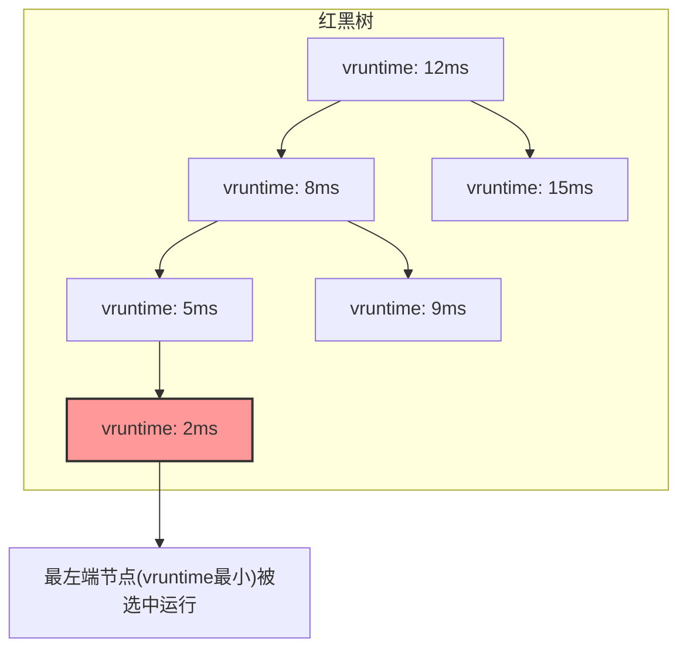
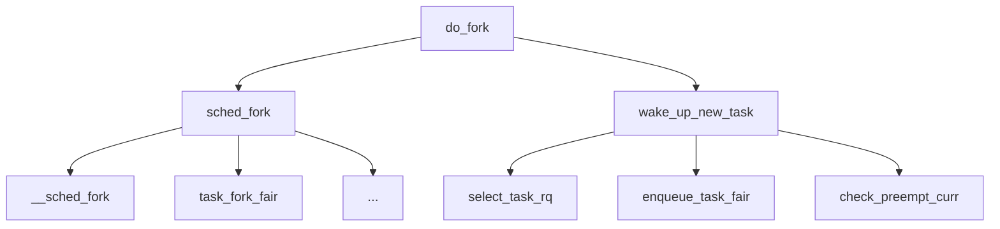

# 第5章　进程控制：状态、调度和优先级

第4章介绍了进程的一生，从创建（`fork` 或 `vfork`）到走向新的征程（`exec`），从退出（`exit` 或 `_exit`）到被父进程或 `init` 进程“收尸”（`wait`）。

本章将介绍进程的其他方面，主要包括：

- 进程在其或长或短的一生中可能处于的状态。
- 内核如何调度进程使用 CPU 资源。
- 进程如何调整优先级，以求获得更多或更少的 CPU 资源。
- 对于有实时性要求的进程如何设置调度策略以满足其要求。
- 如何把进程绑定到某个或某些 CPU 上执行。

## 5.1　进程的状态

> 故飘风不终朝，骤雨不终日。孰为此者？天地。天地尚不能久，而况於人乎？
> ——老子《道德经》

就像人不可能一刻不停地工作一样，进程也无法始终占有 CPU 运行。原因有三：

- 进程可能需要等待某种外部条件的满足，在条件满足之前，进程是无法继续执行的。这种情况下，该进程继续占有 CPU 就是对 CPU 资源的浪费。
- Linux 是多用户多任务的操作系统，可能同时存在多个可以运行的进程，进程个数可能远远多于 CPU 的个数。一个进程始终占有 CPU 对其他进程来说是不公平的，进程调度器会在合适的时机，选择合适的进程使用 CPU 资源。
- Linux 进程支持软实时，实时进程的优先级高于普通进程，实时进程之间也有优先级的差别。软实时进程进入可运行状态的时候，可能会发生抢占，抢占当前运行的进程。

下面，首先来讨论一下进程的状态。

### 5.1.1　进程状态概述

Linux 下，进程的状态有以下 7 种，见表 5-1。

**表 5-1　进程的 7 种状态**

（表格内容未在原始文本中完整给出，但后续段落逐一描述了其中几种状态。）

#### 1. 可运行状态

首先是可运行状态。该状态的名称为 `TASK_RUNNING`，严格来说这个名字是不准确的，因为该状态的确切含义是**可运行状态**，并非一定是在占有 CPU 运行，将该状态称为 `TASK_RUNABLE` 会更准确。

有人说 Linux 进程有 8 种状态，这种说法也是对的。因为 `TASK_RUNNING` 可以根据是否在 CPU 上运行，进一步细分成 `RUNNING` 和 `READY` 两种状态（如图 5-1 所示）。处于 `READY` 状态的进程表示，它们随时可以投入运行，只不过由于 CPU 资源有限，调度器暂时并未选中它运行。

**图 5-1　READY 和 RUNNING 状态之间的切换**

（此处原书有示意图，描述可运行状态中 READY 和 RUNNING 的转换。）

处于可运行状态的进程是进程调度的对象。如果进程并不处于可运行状态，进程调度器就不会选择它投入运行。在 Linux 中，每一个 CPU 都有自己的运行队列，事实上还不止一个，根据进程所属调度类别的不同，可运行状态的进程也会位于不同的队列上：

- 如果是实时进程（属于实时调度类），则根据优先级的情况，落在相应的优先级的队列上；
- 如果是普通进程（属于完全公平调度类），则根据虚拟运行时间的大小，落在红黑树的相应位置上。

这样进程调度器就可以根据一定的算法从运行队列上挑选合适的进程来使用 CPU 资源。

处于 `RUNNING` 状态的进程，可能正在执行用户态（user-mode）代码，也可能正在执行内核态（kernel-mode）代码，内核提供了进一步的区分和统计。Linux 提供的 `time` 命令可以统计进程在用户态和内核态消耗的 CPU 时间：

```bash
manu@manu-rush:~$ time sleep 2

real    0m2.009s
user    0m0.001s
sys     0m0.002s
```

`time` 命令统计了三种时间：实际时间、用户 CPU 时间和系统 CPU 时间。其中实际时间最好理解，就是日常生活中的时间（墙上时间，wall clock time），即进程从开始到终止，一共执行了多久。`user` 一行统计的是进程执行用户态代码消耗的 CPU 时间；`sys` 一行统计的是进程在内核态运行所消耗的 CPU 时间。

如何区分用户态 CPU 时间和内核态 CPU 时间呢？我们举例来说明。如果进程在执行加减乘除或浮点数计算或排序等操作时，尽管这些操作正在消耗 CPU 资源，但是和内核并没有太多的关系，CPU 大部分时间都在执行用户态的指令。这种场景下，我们称 CPU 时间消耗在用户态。如果进程频繁地执行创建进程、销毁进程、分配内存、操作文件等操作，那么进程不得不频繁地陷入内核执行系统调用，这些时间都累加在进程的内核态 CPU 时间。

对于这三种时间，最容易产生的误解的是 `real time = user time + sys time`。这种想法是错误的。在单核系统上，`real time` 总是不小于 `user time` 与 `sys time` 的总和。但是在多核系统上，`user time` 与 `sys time` 的总和可以大于 `real time`。利用这三个时间，我们可以计算出程序的 CPU 使用率：

```
cpu_usage = ((user time) + (sys time))/(real time)
```

在多核处理器情况下，`cpu_usage` 如果大于 1，则表示该进程是计算密集型（CPU bound）的进程，且 `cpu_usage` 的值越大，表示越充分地利用了多处理器的并行运行优势；如果 `cpu_usage` 的值小于 1，则表示进程为 I/O 密集型（I/O bound）的进程，多核并行的优势并不明显。

`time` 命令的问题在于要等进程运行完毕后，才能获取到进程的统计信息，正所谓盖棺定论。有些时候，我们需要了解正在运行的进程：它运行了多久，内核态 CPU 时间和用户态 CPU 时间分别是多少？`procfs` 在 `/proc/PID/stat` 中提供了相关的信息：

```bash
manu@manu-rush:~$ cat /proc/8283/stat
8283 (stress) R 8282 8282 7015 34817 8282 4218944 35 0 0 0 15988 35
 0 0 20 0 1 
    0 3551036 7405568 24 18446744073709551615 4194304 4213100 140736349760736 
    140736349760296 139793990053869 0 0 0 0 0 0 0 17 0 0 0 0 0 0 6311448 6312216 
    17915904 140736349767962 140736349767974 140736349767974 140736349769704 0
```

数组中的每个字段都有自己独特的含义。如果从 0 开始计数，那么字段 13 对应的是进程消耗的用户态 CPU 时间，字段 14 记录的是进程消耗的内核态 CPU 时间。两者的单位是时钟嘀嗒（clock tick）。

一个时钟嘀嗒是多久？可以通过如下命令来获取：

```bash
grep CONFIG_HZ /boot/config-`uname -r`
```

输出示例：

```
CONFIG_HZ_250=y
CONFIG_HZ=250
```

当配置内核的时候，有 100Hz、250Hz、300Hz 和 1000Hz 这 4 个选项。如果配置的频率为 250Hz，那么 1 秒钟就有 250 个时钟嘀嗒，即每过 4ms，增加一个时钟嘀嗒（内核的 `jiffies++`）。

系统提供了 `pidstat` 命令，通过该命令也可以获取到各个进程的 CPU 使用情况，如图 5-2 所示。

**图 5-2　使用 `pidstat` 观察 CPU 的使用情况**

（此处原书有示意图，展示 `pidstat` 命令输出。）

`pidstat` 可以通过 `-p` 参数指定观察的进程，从而可以获取到该进程的 CPU 使用情况，包括用户态 CPU 时间和内核态 CPU 时间，如图 5-3 所示。

**图 5-3　使用 `pidstat` 观察特定进程的 CPU 使用情况**

（此处原书有示意图，展示 `pidstat -p` 命令输出。）

如何获得进程的实际运行时间呢？通过 `ps` 命令的 `etime`（elapsed time 的缩写）可以获取该值：

```bash
manu@manu-rush:~$ ps -p 8283 -o etime,cmd,pid
    ELAPSED CMD                            PID
      02:39 stress -c 1                    8283
```

#### 2. 可中断睡眠状态和不可中断睡眠状态

进程并不总是处于可运行的状态。有些进程需要和慢速设备打交道。比如进程和磁盘进行交互，相关的系统调用消耗的时间是非常长的（可能在毫秒数量级甚至会更久），进程需要等待这些操作完成才可以执行接下来的指令。有些进程需要等待某种特定条件（比如进程等待子进程退出、等待 socket 连接、尝试获得锁、等待信号量等）得到满足后方可以执行，而等待的时间往往是不可预估的。在这种情况下，进程依然占用 CPU 就不合适了，对 CPU 资源而言，这是一种极大的浪费。因此内核会将该进程的状态改变成其他状态，将其从 CPU 的运行队列中移除，同时调度器选择其他的进程来使用 CPU 资源。

Linux 存在两种睡眠的状态：可中断的睡眠状态（`TASK_INTERRUPTIBLE`）和不可中断的睡眠状态（`TASK_UNINTERRUPTIBLE`）。这两种睡眠状态是很类似的。两者的区别就在于能否响应收到的信号。

处于可中断的睡眠状态的进程，返回到可运行的状态有以下两种可能性：

- 等待的事件发生了，继续运行的条件满足了。
- 收到未被屏蔽的信号。

当处于可中断睡眠状态的进程收到信号时，会返回 `EINTR` 给用户空间。程序员需要检测返回值，并做出正确的处理。

但是对于不可中断的睡眠状态，只有一种可能性能使其返回到可运行的状态，即等待的事件发生了，继续运行的条件满足了（如图 5-4 所示）。

**图 5-4　可运行状态与休眠状态之间的切换**

（此处原书有示意图，描述 `TASK_RUNNING`、`TASK_INTERRUPTIBLE`、`TASK_UNINTERRUPTIBLE` 之间的切换。）

`TASK_UNINTERRUPTIBLE` 状态存在的意义在于，内核中某些处理流程是不应该被打断的，如果响应异步信号，程序的执行流程中就会插入一段用于处理异步信号的流程，原有的流程就被中断了。因此当进程在对某些硬件进行某些操作时（比如进程调用 `read` 系统调用对某个文件进行读操作，`read` 系统调用最终执行对应设备驱动的代码，并与对应的物理设备交互），需要使用 `TASK_UNINTERRUPTIBLE` 状态把进程保护起来，以避免进程与设备的交互过程被打断，致使设备陷入不可控的状态。

> [!WARNING] 危险状态
> `TASK_UNINTERRUPTIBLE` 是一种很危险的状态，因为进程进入该状态后，刀枪不入，任何信号都无法打断它。我们无法通过信号杀死一个处于不可中断的休眠状态的进程，`SIGKILL` 信号也不行。

正常情况下，进程处于 `TASK_UNINTERRUPTIBLE` 状态的时间会非常短暂，进程不应该长时间处于不可中断的睡眠状态，但是这种情况确实可能会发生（内核代码流程中可能有 bug，或者用户内核模块中的相关机制不合理都会导致某些进程长时间处于 D 状态）。举例来讲，当通过 NFS 访问远程目录时，异地文件系统的异常可能会使进程进入该状态。如果远端的文件系统始终异常，使进程的 I/O 请求得不到满足，该进程会一直处于 `TASK_UNINTERRUPTIBLE` 状态，无法杀死，除了重启 Linux 机器之外，无药可救。

内核提供了 hung task 检测机制，它会启动一个名为 `khungtaskd` 的内核线程来检测处于 `TASK_UNINTERRUPTIBLE` 状态的进程是否已经失控。`khungtaskd` 定期被唤醒（默认是 120 秒），它会遍历所有处于 `TASK_UNINTERRUPTIBLE` 状态的进程进行检查，如果某进程超过 120 秒未获得调度，那么内核就会打印出警告信息和该进程的堆栈信息。

120 秒这个时间是可以定制的，内核提供了控制选项：

```bash
root@manu-rush:~# sysctl kernel.hung_task_timeout_secs
kernel.hung_task_timeout_secs = 120
```

关于 `khungtaskd` 的更多细节，可以阅读内核 `kernel/hung_task.c` 代码。

无论进程处于可中断的睡眠状态，还是不可中断的睡眠状态，我们都可能会希望了解进程停在什么位置或在等待什么资源。`procfs` 的 `wchan` 提供了这方面的信息，`wchan` 是 wait channel 的含义。`ps` 命令也可以通过 `wchan` 获得该信息：

```bash
manu@manu-rush:~$ echo $$
3828
manu@manu-rush:~$ cat /proc/3828/wchan
do_wait
manu@manu-rush:~$ ps -p 3828 -o pid,wchan,cmd
```

（输出未给出，原文到此结束第 1/8 部分。）

# 第5章 进程控制：状态、调度和优先级

## 3. 睡眠进程和等待队列

进程无论是处于可中断的睡眠状态还是不可中断的睡眠状态，有一个数据结构是绕不开的：**等待队列（wait queue）**。进程但凡需要休眠，必然是等待某种资源或等待某个事件，内核必须想办法将进程和它等待的资源（或事件）关联起来，当等待的资源可用或等待的事件已发生时，可以及时地唤醒相关的进程。内核采用的方法是等待队列。

等待队列作为Linux内核中的基础数据结构和进程调度紧密地结合在一起。当进程需要等待特定事件时，就将其放置在合适的等待队列上，因此等待队列对应的是一组进入休眠状态的进程，当等待的事件发生时（或者说等待的条件满足时），这组进程会被唤醒，这类事件通常包括：中断（比如DISK I/O完成）、进程同步、休眠时间到时等。

内核使用双向链表来实现等待队列，每个等待队列都可以用等待队列头来标识，等待队列头的定义如下：

```c
struct __wait_queue_head {
    spinlock_t lock;
    struct list_head task_list;
};
typedef struct __wait_queue_head wait_queue_head_t;
```

进程需要休眠的时候，需要定义一个等待队列元素，将该元素挂入合适的等待队列，等待队列元素的定义如下：

```c
typedef struct __wait_queue wait_queue_t;
struct __wait_queue {
    unsigned int flags;
#define WQ_FLAG_EXCLUSIVE   0x01
    void *private;
    wait_queue_func_t func;
    struct list_head task_list;
};
```

等待队列上的每个等待队列元素，都对应于一个处于睡眠状态的进程（如图5-5所示）。

> 图5-5：睡眠进程与等待队列（示意图无法直接展示，请参考原书插图）

内核如何使用等待队列完成睡眠，以及条件满足之后如何唤醒对应的进程呢？

首先要定义和初始化等待队列头部。等待队列头部相当于一杆大旗，没有这杆大旗，将来的等待队列元素将成为“孤魂野鬼”，无处安放。内核提供了 `init_waitqueue_head` 和 `DECLARE_WAIT_QUEUE_HEAD` 两个宏，用来初始化等待队列头部。

其次，当进程需要睡眠时，需要定义等待队列元素。内核提供了 `init_waitqueue_entry` 函数和 `init_waitqueue_func_entry` 函数来完成等待队列元素的初始化：

```c
static inline void init_waitqueue_entry(wait_queue_t *q, struct task_struct *p)
{
    q->flags = 0;
    q->private = p;
    q->func = default_wake_function; /* 通用的唤醒回调函数 */
}

static inline void init_waitqueue_func_entry(wait_queue_t *q,
                    wait_queue_func_t func)
{
    q->flags = 0;
    q->private = NULL;
    q->func = func;
}
```

除此以外，内核还提供了宏 `DECLARE_WAITQUEUE`，也可用来初始化等待队列元素：

```c
#define __WAITQUEUE_INITIALIZER(name, tsk) {                \
    .private    = tsk,                      \
    .func       = default_wake_function,            \
    .task_list  = { NULL, NULL } }

#define DECLARE_WAITQUEUE(name, tsk)                    \
    wait_queue_t name = __WAITQUEUE_INITIALIZER(name, tsk)
```

从等待队列元素的初始化函数或初始化宏不难看出，等待队列元素的 `private` 成员变量指向了进程的进程描述符 `task_struct`，因此就有了等待队列元素，就可以将进程挂入对应的等待队列了。

第三步是将等待队列元素（即睡眠进程）放入合适的等待队列中。内核同时提供了 `add_wait_queue` 和 `add_wait_queue_exclusive` 两个函数来把等待队列元素添加到等待队列头部指向的双向链表，代码如下：

```c
void add_wait_queue(wait_queue_head_t *q, wait_queue_t *wait)
{
    unsigned long flags;
    wait->flags &= ~WQ_FLAG_EXCLUSIVE;
    spin_lock_irqsave(&q->lock, flags);
    __add_wait_queue(q, wait);
    spin_unlock_irqrestore(&q->lock, flags);
}

void add_wait_queue_exclusive(wait_queue_head_t *q, wait_queue_t *wait)
{
    unsigned long flags;
    wait->flags |= WQ_FLAG_EXCLUSIVE;
    spin_lock_irqsave(&q->lock, flags);
    __add_wait_queue_tail(q, wait);
    spin_unlock_irqrestore(&q->lock, flags);
}
```

这两个函数的区别在于：
- 一个等待队列元素设置了 `WQ_FLAG_EXCLUSIVE` 标志位，而另一个则没有。
- 一个等待队列元素放到了等待队列的尾部，而另一个则放到了等待队列的头部。

同样是添加到等待队列，为何同时提供了两个函数，`WQ_FLAG_EXCLUSIVE` 标志位到底有什么作用？

不妨来思考如下问题：如果存在多个进程在等待同一个条件满足或同一个事件发生（即等待队列上有多个等待队列元素），那么当条件满足时，应该把所有进程一并唤醒还是只唤醒某一个或某几个进程？

答案是具体情况具体分析。有时候需要唤醒等待队列上的所有进程，但又有些时候唤醒操作需要具有排他性（EXCLUSIVE）。比如多个进程等待临界区资源，当锁的持有者释放锁时，如果内核将所有等待在该锁上的进程一起唤醒，那么最终也只能有一个进程竞争到锁资源，而大多数的竞争者，不过是从休眠中醒来，然后继续休眠，这会浪费CPU资源，如果等待队列中的进程数目很大，还会严重影响性能。这就是所谓的 **惊群效应（thundering herd problem）**。因此内核提供了 `WQ_FLAG_EXCLUSEVE` 标志位来实现互斥等待，`add_wait_queue_exclusive` 函数会将带有该标志位的等待队列元素添加到等待队列的尾部。当内核唤醒等待队列上的进程时，等待队列元素中的 `WQ_FLAG_EXCLUSEVE` 标志位会影响唤醒行为，比如 `wake_up` 宏，它唤醒第一个带有 `WQ_FLAG_EXCLUSEVE` 标志位的进程后就会停止。

事实上，当内核需要等待某个条件满足而不得不休眠（或是可中断的睡眠，或是不可中断的睡眠）时，内核封装了一些宏来完成前面提到的流程。这些宏包括：

```c
wait_event(wq, condition)
wait_event_timeout(wq, condition, timeout)
wait_event_interruptible(wq, condition)
wait_event_interruptible_timeout(wq, condition, timeout)
```

第一个参数指向的是等待队列头部，表示进程会睡眠在该等待队列上。进程醒来时，`condition` 需要得到满足，否则继续阻塞。其中 `wait_event` 和 `wait_event_interruptible` 的区别在于，睡眠过程中，前者的进程状态是不可中断的睡眠状态，不能被信号中断，而后者是可中断的睡眠状态，可以被信号中断。名字中带有 `_timeout` 的宏意味着阻塞等待的超时时间，以 jiffy 为单位，当超时时间到达时，无论 `condition` 是否满足，均返回。

我们不妨以 `wait_event` 宏为例，欣赏一下内核是如何使用等待队列，等待某个条件的满足的：

```c
#define wait_event(wq, condition)                   \
do {                                    \
    if (condition)                          \
        break;                          \
    __wait_event(wq, condition);                    \
} while (0)

#define __wait_event(wq, condition)                     \
do {                                    \
    DEFINE_WAIT(__wait);                        \
                                    \
    for (;;) {                          \
        prepare_to_wait(&wq, &__wait, TASK_UNINTERRUPTIBLE);    \
        if (condition)                      \
            break;                      \
        schedule();                     \
    }                               \
    finish_wait(&wq, &__wait);                  \
} while (0)

void
prepare_to_wait(wait_queue_head_t *q, wait_queue_t *wait, int state)
{
    unsigned long flags;
    wait->flags &= ~WQ_FLAG_EXCLUSIVE;
    spin_lock_irqsave(&q->lock, flags);
    if (list_empty(&wait->task_list))
        __add_wait_queue(q, wait);
    set_current_state(state);
    spin_unlock_irqrestore(&q->lock, flags);
}
```

`prepare_to_wait` 函数负责将等待队列元素添加到对应的等待队列，同时将进程的状态设置成 `TASK_UNINTERRUPTIBLE`，完成 `prepare_to_wait` 的工作后，会检查条件是否满足条件，如果条件不满足，则调用 `schedule()` 函数，主动让出CPU使用权，等待被唤醒。

有睡眠就要有唤醒，有 `wait_event` 系列的宏，与之对应的，就要有 `wake_up` 系列的宏，它们必须成对出现。这一组宏有：

```c
wake_up(x)
wake_up_nr(x, nr)
wake_up_all(x)
wake_up_interruptible(x)
wake_up_interruptible_nr(x, nr)
wake_up_interruptible_all(x)
```

这些宏和前面 `wait_event` 系列宏的配对使用情况如图5-6所示。

> 图5-6：`wake_event` 和 `wake_up` 配对使用情况（示意图无法直接展示，请参考原书插图）

其中该系列宏中，名字里带 `_interruptible` 的宏只能唤醒处于 `TASK_INTERRUPTIBLE` 状态的进程，而名字中不带 `_interruptible` 的宏，既可以唤醒 `TASK_INTERRUPTIBLE` 状态的进程，也可以唤醒 `TASK_UNINTERRUPTIBLE` 状态的进程。

`wake_up` 系列函数中为什么有些函数后面有 `_nr` 和 `_all` 这样的后缀？其实不难猜到这些后缀的含义：不带后缀的表示最多只能唤醒一个带有 `WQ_FLAG_EXCLUSIVE` 标志位的进程，带 `_nr` 的表示可以唤醒 `nr` 个带有 `WQ_FLAG_EXCLUSIVE` 标志位的进程，而带 `_all` 后缀的则表示唤醒等待队列上的所有进程。

这些 `wake_up` 系列的宏，其实现部分最终都是通过 `__wake_up` 函数的简单封装来实现的，如图5-7所示。

> 图5-7：`wake_up` 系列函数（示意图无法直接展示，请参考原书插图）

下面来分析下 `__wake_up` 函数，看看内核是如何唤醒睡眠在等待队列上的进程的，代码如下：

```c
void __wake_up(wait_queue_head_t *q, unsigned int mode,
            int nr_exclusive, void *key)
{
    unsigned long flags;
    spin_lock_irqsave(&q->lock, flags);
    __wake_up_common(q, mode, nr_exclusive, 0, key);
    spin_unlock_irqrestore(&q->lock, flags);
}

static void __wake_up_common(wait_queue_head_t *q, unsigned int mode,
            int nr_exclusive, int wake_flags, void *key)
{
    wait_queue_t *curr, *next;
    /* 遍历等待队列头部对应的双向链表 */
    list_for_each_entry_safe(curr, next, &q->task_list, task_list) {
        unsigned flags = curr->flags;
        /* 最多唤醒 nr 设置了排他性标志位的等待进程,以防止惊群 */
        if (curr->func(curr, mode, wake_flags, key) &&
                (flags & WQ_FLAG_EXCLUSIVE) && !--nr_exclusive)
            break;
    }
}
```

注意，遍历等待队列上的所有等待队列元素时，对于每一个需要唤醒的进程，执行的是等待队列元素中定义的 `func`，最多唤醒 `nr_exclusive` 个带有 `WQ_FLAG_EXCLUSIVE` 的等待队列元素。

在初始化等待队列元素的时候，需要注册回调函数 `func`。当内核唤醒该进程时，就会执行等待队列元素中的回调函数。

等待队列元素最常用的回调函数是 `default_wake_function`，就像它的名字一样，是默认的唤醒回调函数。无论是 `DECLARE_WAITQUEUE` 还是 `init_waitqueue_entry`，都将等待队列元素的 `func` 指向 `default_wake_function`。而 `default_wake_function` 仅仅是大名鼎鼎的 `try_to_wake_up` 函数的简单封装，代码如下：

```c
int default_wake_function(wait_queue_t *curr, unsigned mode, int wake_flags,
            void *key)
{
    return try_to_wake_up(curr->private, mode, wake_flags);
}
```

`try_to_wake_up` 是进程调度里非常重要的一个函数，它负责将睡眠的进程唤醒，并将醒来的进程放置到CPU的运行队列中，然后设置进程的状态为 `TASK_RUNNING`。在本章的后面会对该函数进行详细的分析。

## 4. TASK_KILLABLE 状态

很多文章在介绍 `TASK_UNINTERRUPTIBLE` 状态时，都喜欢通过下面的例子来创建一个处于 `TASK_UNINTERRUPTIBLE` 状态的进程：

```c
#include<stdio.h>
int main()
{
    if(!vfork())
    {
        sleep(100);
        printf("hello \n");
    }
}
```

运行上述代码编译出的程序：

```bash
root@manu-rush:~# ps ax |grep state_d
  5880 pts/2    D+     0:00 ./state_d
  5881 pts/2    S+     0:00 ./state_d
```

很多文章认为，调用 `vfork` 函数创建子进程时，子进程在调用 `exec` 函数或退出之前，父进程始终处于 `TASK_UNINTERRUPTIBLE` 的状态。其实这种说法是错误的。因为很明显，父进程可以轻易地被信号杀死，这证明父进程并不是处于 `TASK_UNINTERRUPTIBLE` 的状态。

```bash
root@manu-hacks:~# ps ax |grep state_d |grep -v grep
  6787 pts/2    D+     0:00 ./state_d
  6788 pts/2    S+     0:00 ./state_d
root@manu-hacks:~# kill -9 6787
root@manu-hacks:~# ps ax |grep state_d |grep -v grep
  6788 pts/2    S      0:00 ./state_d
```

而在程序运行的终端：

```text
manu@manu-hacks:~/code/me/c$ ./state_d
Killed
```

为什么进程的状态显示的是 `D+`，按照 `ps` 命令的说法应该是处于不可中断的睡眠状态，可为什么仍然会被信号杀死呢？这好像和前面的讲述并不一致。

事实上，`ps` 命令输出的 `D` 状态不能简单地理解成 `UNINTERRUPTIBLE` 状态。内核自 2.6.25 版本起引入了一种新的状态即 **TASK_KILLABLE** 状态[^1]。可中断的睡眠状态太容易被信号打断，与之对应，不可中断的睡眠状态完全不可以被信号打断，又容易失控，两者都失之极端。而内核新引入的 `TASK_KILLABLE` 状态则介于两者之间，是一种调和状态。该状态行为上类似于 `TASK_UNINTERRUPTIBLE` 状态，但是进程收到致命信号（即杀死一个进程的信号）时，进程会被唤醒。

上面的例子中 `vfork` 创建子进程之后，`ps` 显示父进程处于 `D` 的状态，却依然可以被杀死的原因就是进程并不是处于不可中断的睡眠状态，而是处于 `TASK_KILLABLE` 状态。而这种状态，是可以响应致命信号的。

有了该状态，`wait_event` 系列宏也增加了 `killable` 的变体，即 `wait_event_killable` 宏。该宏会将进程置为 `TASK_KILLABLE` 状态，同时睡眠在等待队列上。致命信号 `SIGKILL` 可以将其唤醒。

[^1]: 译者注：TASK_KILLABLE 状态自 Linux 2.6.25 引入，用于平衡可中断和不可中断睡眠的不足。

## 5. TASK_STOPPED 状态和 TASK_TRACED 状态

**TASK_STOPPED** 状态是一种比较特殊的状态。在第4章曾经提到过，`SIGSTOP`、`SIGTSTP`、`SIGTTIN` 和 `SIGTTOU` 等信号会将进程暂时停止，停止后进程就会进入到该状态。上述4种信号中的 `SIGSTOP` 具有和 `SIGKILL` 类似的属性，即不能忽略，不能安装新的信号处理函数，不能屏蔽等。当处于 `TASK_STOPPED` 状态的进程收到 `SIGCONT` 信号后，可以恢复进程的执行（如图5-8所示）。

> 图5-8：可运行状态和暂停状态的切换（示意图无法直接展示，请参考原书插图）

**TASK_TRACED** 是被跟踪的状态，进程会停下来等待跟踪它的进程对它进行进一步的操作。如何才能制造出处于 `TASK_TRACED` 状态的进程呢？最简单的例子是用 `gdb` 调试程序，当进程在断点处停下来时，此时进程处于该状态。

下面用一个最简单的 hello 程序来验证 `gdb` 停下的程序的确处于 `TASK_TRACED` 的状态。

在一个终端，`gdb` 将程序停下，停在断点处：

```text
Breakpoint 1, main () at hello.c:6
6        printf("hello world\n");
```

在另一个终端查看进程的状态：

```bash
manu@manu-hacks:~$ ps ax  |grep hello
  3768 pts/2    S+     0:00 gdb ./hello
  3770 pts/2    t      0:00 /home/manu/code/me/c/hello
manu@manu-hacks:~$ cat /proc/3770/status
Name:    hello
State:    t (tracing stop)
```

`TASK_TRACED` 和 `TASK_STOPP## 6. EXIT_ZOMBIE 状态和 EXIT_DEAD 状态

**EXIT_ZOMBIE** 和 **EXIT_DEAD** 是两种退出状态，严格说来，它们并不是运行状态。当进程处于这两种状态中的任何一种时，它其实已经死去了。内核会将这两种状态记录在进程描述符的 `exit_state` 中，不过不想细分的话，可以笼统地说进程处于 `TASK_DEAD` 状态。

两种状态的区别在于，如果父进程没有将 `SIGCHLD` 信号的处理函数重设为 `SIG_IGN`，或者没有为 `SIGCHLD` 设置 `SA_NOCLDWAIT` 标志位，那么子进程退出后，会进入僵尸状态等待父进程或 `init` 进程来收尸，否则直接进入 `EXIT_DEAD`。如果不停留在僵尸状态，进程的退出是非常快的，因此很难观察到一个进程是否处于 `EXIT_DEAD` 状态。

## 5.1.2 观察进程状态

5.1.1 节介绍了进程的状态，本节将介绍如何观察进程当前所处的状态。

在 `proc` 文件系统中，在 `/proc/PID/status` 中，记录了 PID 对应进程的状态信息。其中 `State` 项记录了该进程的瞬时状态。因为进程状态是不断迁移变化的，所以读出来的结果是瞬时的值。

```bash
manu@manu-rush:~$ cat /proc/1/status
Name:    init
State:    S (sleeping)
```

`procfs` 中，进程的状态有几种可能的值呢？一起去查看内核的源码。在 `fs/proc/array.c` 中，定义了所有可能的值，定义如下：

```c
static const char * const task_state_array[] = {
    "R (running)",      /*   0 */
    "S (sleeping)",      /*   1 */
    "D (disk sleep)",   /*   2 */
    "T (stopped)",       /*   4 */
    "t (tracing stop)", /*   8 */
    "Z (zombie)",        /*  16 */
    "X (dead)",     /*  32 */
    "x (dead)",     /*  64 */
    "K (wakekill)",     /* 128 */
    "W (waking)",       /* 256 */
};
```

这几种状态都会从 `procfs` 中出现吗？并非如此。

```c
static inline const char *get_task_state(struct task_struct *tsk)
{
    unsigned int state = (tsk->state & TASK_REPORT) | tsk->exit_state;
    const char * const *p = &task_state_array[0];
    BUILD_BUG_ON(1 + ilog2(TASK_STATE_MAX) != ARRAY_SIZE(task_state_array));
    while (state) {
        p++;
        state >>= 1;
    }
    return *p;
}
```

只有在 `TASK_REPORT` 宏出现的状态加上两个退出状态时，才能出现在 `procfs` 中：

```c
#define TASK_REPORT     (TASK_RUNNING | TASK_INTERRUPTIBLE | \
                         TASK_UNINTERRUPTIBLE | __TASK_STOPPED | \
                         __TASK_TRACED)
```

从 `TASK_REPORT` 宏中可以看出，并没有 `TASK_DEAD`、`TASK_WAKEKILL` 和 `TASK_WAKING`，也就是说在 `procfs` 中，无法观察到下面这三个值，它们从不出现：

```
        "x (dead)",             /*  64 */
        "K (wakekill)",         /* 128 */
        "W (waking)",           /* 256 */
```

在 `vfork` 那个例子中，在 `procfs` 中查询进程状态时，父进程处于 `D`（disk sleep）状态，而并没有出现 `K`（wakekill），原因就在于此。

那么是时候记住，会在 `procfs` 中出现的进程状态了：

```
        "R (running)",
        "S (sleeping)",
        "D (disk sleep)",
        "T (stopped)",
        "t (tracing stop)",
        "Z (zombie)",
        "X (dead)",
```

这就是传统的进程7状态，如表5-2所示。

**表5-2　procfs 中的进程状态**

| procfs 显示 | 内核宏 | 含义 |
| :--- | :--- | :--- |
| R (running) | TASK_RUNNING | 可运行状态 |
| S (sleeping) | TASK_INTERRUPTIBLE | 可中断睡眠 |
| D (disk sleep) | TASK_UNINTERRUPTIBLE | 不可中断睡眠 |
| T (stopped) | __TASK_STOPPED* | 暂停状态 |
| t (tracing stop) | __TASK_TRACED* | 跟踪停止 |
| Z (zombie) | EXIT_ZOMBIE | 僵尸状态 |
| X (dead) | EXIT_DEAD | 死亡状态 |

> **注**：在此处，`TASK_STOPPED` 应为 `__TASK_STOPPED`，为了防止产生不必要的困扰，不做严格区分。
> **注**：在此处，`TASK_TRACED` 应为 `__TASK_TRACED`，为了防止产生不必要的困扰，不做严格区分。

# 第5章 进程控制：状态、调度和优先级

## 5.2 进程调度概述

进程调度是任何一个现代操作系统都要解决的问题，它是操作系统相当重要的一个组成部分。首先需要理解的一点是：**进程调度器是对处于可运行（`TASK_RUNNING`）状态的进程进行调度**，如果进程并非 `TASK_RUNNING` 状态，那么该进程和进程调度是没有关系的。

Linux 是多任务的操作系统。所谓多任务是指系统能够同时并发地执行多个进程，哪怕是单处理器系统。在单处理器系统上支持多任务，会带给用户多个进程同时运行的幻觉，事实上多个进程仅仅是轮流使用 CPU 资源。只有在多处理器系统中，多个进程才能真正地做到同时、并行地执行。

多任务系统可以根据是否支持抢占分成两类：**非抢占式多任务**和**抢占式多任务**。在非抢占式多任务的系统中，下一个任务被调度的前提是当前进程主动让出 CPU 的使用权，因此非抢占式多任务又称为**合作型多任务**。而抢占式多任务由操作系统来决定进程调度，在某些时间点上，操作系统可以将正在运行的进程调度出去，选择其他进程来执行。毫无疑问，Linux 属于抢占式多任务系统。事实上，大多数的现代操作系统都是抢占式的多任务系统。

CPU 是一种关键的系统资源。在普通 PC 上 CPU 的核数不过 4 核、8 核等，在服务器上可能有 16 核、32 核甚至更多。在系统负载始终比较轻（即可运行状态的进程不多）的情况下，进程调度的重要性并不大。但是如果系统的负载很高，有几百上千的进程处于可运行的状态，那么一套合理高效的调度算法就非常重要了。

此外，不同的进程之间，其行为模式可能存在着巨大的差异。进程的行为模式可以粗略地分成两类：

- **CPU 消耗型（CPU bound）**：进程因为没有太多的 I/O 需求，始终处于可运行的状态，始终在执行指令。
- **I/O 消耗型（I/O bound）**：进程会有大量 I/O 请求（比如等待键盘键入、读写块设备上的文件、等待网络 I/O 等），它处于可执行状态的时间不多，而是将更多的时间耗费在等待上。

这种划分方法并非绝对的，可能有些进程某段时间表现出 CPU 消耗型的特征，另一段时间又表现出 I/O 消耗型的特征。

还有另外一种进程分类的方法：

- **交互型进程**：这种类型的进程有很多的人机交互，进程会不断地陷入休眠状态，等待键盘和鼠标的输入。但是这种进程对系统的响应时间要求非常高，用户输入之后，进程必须被及时唤醒，否则用户就会觉得系统反应迟钝。比较典型的例子是文本编辑程序和图形处理程序等。
- **批处理型进程**：这类进程和交互型的进程相反，它不需要和用户交互，通常在后台执行。这样的进程不需要及时的响应。比较典型的例子是编译、大规模科学计算等。一般来说，这种进程总是“被侮辱的和被损害的”。
- **实时进程**：这类进程优先级比较高，不应该被普通进程和优先级比它低的进程阻塞。一般需要比较短的响应时间。

系统之中，有很多性格各异的进程，这就增加了设计调度器的难度。有一个很有意思的比喻来描述调度器的困境 [1]：Linux 内核调度器就像处境尴尬的主妇，满足孩子对晚餐的要求便有可能会伤害到老人的食欲，做出一桌让男女老少都满意的饭菜实在是太难了。

设计一个优秀的进程调度器绝不是一件容易的事情，它还有很多事情需要考虑，很多目标需要达成：

- **公平**：每一个进程都可以获得调度的机会，不能出现“饿死”的现象。
- **良好的调度延迟**：尽量确保进程在一定的时间范围内，总能够获得调度的机会。
- **差异化**：允许重要的进程获得更多的执行时间。
- **支持软实时进程**：软实时进程，比普通进程具有更高的优先级。
- **负载均衡**：多个 CPU 之间的负载要均衡，不能出现一些 CPU 很忙，而另一些 CPU 很闲的情况。
- **高吞吐量**：单位时间内完成的进程个数尽可能多。
- **简单高效**：调度算法要高效。不应该在调度上花费太长的时间。
- **低耗电量**：在系统并不繁忙的情况下，降低系统的耗电量。

在对称多处理器（[[SMP]]）的系统上，存在着多个处理器，那么所有处于可运行状态的进程是应该位于一个队列上，还是每个处理器都要有自己的队列？这大概是进程调度首先要解决的问题。

目前 Linux 采用的是每个 CPU 都要有自己的运行队列，即 **per CPU run queue**。每个 CPU 去自己的运行队列中选择进程，这样就降低了竞争。这种方案还有另外一个好处：**缓存重利用**。某个进程位于这个 CPU 的运行队列上，经过多次调度之后，内核趋于选择相同的 CPU 执行该进程。这种情况下上次运行的变量很可能仍然在 CPU 的缓存中，这样就提升了效率。

所有的 CPU 共用一个运行队列这种方案的弊端是显而易见的，尤其是在 CPU 数目很多的情况下。我们可以想象一下如果存在 1024 个 CPU，都要去同一个运行队列取下一个调度的进程，这种竞争无疑会降低调度器的性能。

> [!INFO] 凡事无绝对
> 没有最好的，只有最适合的。对于 CPU 核数比较少的桌面应用来说，只有一个运行队列的 **Brain Fuck Scheduler（脑残调度器）** 却表现的异常出色。 [2] [3]

Linux 选择了每一个 CPU 都有自己的运行队列这种解决方案。这种选择也带来了一种风险：CPU 之间负载不均衡，可能出现一些 CPU 闲着而另外一些 CPU 忙不过来的情况。为了解决这个问题，`load_balance` 就闪亮登场了。`load_balance` 的任务就是在一定的时机下，通过将任务从一个 CPU 的运行队列迁移到另一个 CPU 的运行队列，来保持 CPU 之间的负载均衡。

进程调度具体要做哪些事情呢？概括地说，进程调度的职责是**挑选下一个执行的进程**，如果下一个被调度到的进程和调度前运行的进程不是同一个，则执行**上下文切换**，将新选择的进程投入运行。

下面根据调度的入口点函数 `schedule()` 来看下进程调度做了哪些事情，代码如下：

```c
asmlinkage void __sched schedule(void)
{
    struct task_struct *tsk = current;
    sched_submit_work(tsk);
    __schedule();
}

static void __sched __schedule(void)
{
    struct task_struct *prev, *next;
    unsigned long *switch_count;
    struct rq *rq;
    int cpu;

need_resched:
    preempt_disable();
    cpu = smp_processor_id();
    rq = cpu_rq(cpu);
    rcu_note_context_switch(cpu);
    prev = rq->curr;
    schedule_debug(prev);

    if (sched_feat(HRTICK))
        hrtick_clear(rq);

    raw_spin_lock_irq(&rq->lock);
    switch_count = &prev->nivcsw;

    if (prev->state && !(preempt_count() & PREEMPT_ACTIVE)) {
        if (unlikely(signal_pending_state(prev->state, prev))) {
            prev->state = TASK_RUNNING;
        } else {
            /* 先前的进程不再处于可执行状态,需要将其从运行队列中移除出去 */
            deactivate_task(rq, prev, DEQUEUE_SLEEP);
            prev->on_rq = 0;

            if (prev->flags & PF_WQ_WORKER) {
                struct task_struct *to_wakeup;
                to_wakeup = wq_worker_sleeping(prev, cpu);
                if (to_wakeup)
                    try_to_wake_up_local(to_wakeup);
            }
        }
        switch_count = &prev->nvcsw;
    }

    /* 调度之前的准备工作 */
    pre_schedule(rq, prev);

    /* 当前 CPU 运行队列上没有可运行的进程了,太闲了,需要负载均衡 */
    if (unlikely(!rq->nr_running))
        idle_balance(cpu, rq);

    /* 将被抢占的进程放入指定的合适的位置 */
    put_prev_task(rq, prev);

    /* 挑选下一个执行的进程 */
    next = pick_next_task(rq);

    /* 清除被抢占进程的需要调度的标志位 */
    clear_tsk_need_resched(prev);

    rq->skip_clock_update = 0;

    /* 如果选中的进程与原进程不是同一个进程,则需要上下文切换 */
    if (likely(prev != next)) {
        rq->nr_switches++;
        rq->curr = next;
        ++*switch_count;

        /* 上下文切换,切换之后,新选中的进程投入执行 */
        context_switch(rq, prev, next);

        cpu = smp_processor_id();
        rq = cpu_rq(cpu);
    } else
        raw_spin_unlock_irq(&rq->lock);

    post_schedule(rq);

    preempt_enable_no_resched();

    if (need_resched())
        goto need_resched;
}
```

Linux 是可抢占式内核（[[Preemptive Kernel]]）。从内核 2.6 版本开始，Linux 不仅支持用户态抢占，也开始支持内核态抢占。可抢占式内核的优势在于可以保证系统的响应时间。当高优先级的任务一旦就绪，总能及时得到 CPU 的控制权。但是很明显，内核抢占不能随意发生，某些情况下是不允许发生内核抢占的。因此为了更好地支持内核抢占，内核为每一个进程的 `thread_info` 引入了 `preempt_count` 计数器，数值为 0 时表示可以抢占，当该计数器的值不为 0 时，表示禁止抢占。

并不是所有的时机都允许发生内核抢占。以自旋锁为例，在内核可抢占的系统中，自旋锁持有期间不允许发生内核抢占，否则可能会导致其他 CPU 长期不能获得锁而死等。因此在 `spin_lock` 函数中（通过 `__raw_spin_lock`），会调用 `preempt_disable` 宏，而该宏会将进程 `preempt_count` 计数器的值加 1，表示不允许抢占。同样的道理，解锁的时候，会将 `preempt_count` 的值减 1（通过 `preempt_enable` 宏）。

```c
static inline void __raw_spin_lock(raw_spinlock_t *lock)
{
    preempt_disable();
    spin_acquire(&lock->dep_map, 0, 0, _RET_IP_);
    LOCK_CONTENDED(lock, do_raw_spin_trylock, do_raw_spin_lock);
}
```

`preempt_count` 的 Bit 28 是一个很重要的标志位，即 `PREEMPT_ACTIVE`。该标志位用来标记是否正在进行内核抢占。很明显，设置了该标志位之后，`preempt_count` 就不再为 0 了，因此也就不允许再次发生内核抢占，从而使得正在执行抢占工作的代码不会再次被抢占。

内核的 `preempt_schedule` 函数是内核抢占时呼叫调度器的入口，它会调用 `__schedule` 函数发起调度。在调用 `__schedule` 函数之前，会设置进程的 `PREEMPT_ACTIVE` 标志位，表示这是从抢占过程中进入 `__schedule` 函数的。

```c
asmlinkage void __sched notrace preempt_schedule(void)
{
    struct thread_info *ti = current_thread_info();

    if (likely(ti->preempt_count || irqs_disabled()))
        return;

    do {
        add_preempt_count_notrace(PREEMPT_ACTIVE);
        __schedule();
        sub_preempt_count_notrace(PREEMPT_ACTIVE);
        barrier();
    } while (need_resched());
}
```

在 `__schedule` 函数中，内核会检查进程的 `PREEMPT_ACTIVE` 标志位，如果发现了该标志位置位，就不会调用 `deactivate_task` 函数将其从运行队列中移除。

`PREEMPT_ACTIVE` 标志位有一个非常重要的作用，即**防止不处于 `TASK_RUNNING` 状态的进程被抢占过程错误地从运行队列中移除**。这句话非常地绕，我们结合 `__schedule` 函数的对应代码来分析该标志位的作用。

```c
if (prev->state && !(preempt_count() & PREEMPT_ACTIVE)) {
    if (unlikely(signal_pending_state(prev->state, prev))) {
        prev->state = TASK_RUNNING;
    } else {
        deactivate_task(rq, prev, DEQUEUE_SLEEP);
        ...
    }
    ...
}
```

如果进程设置了 `PREEMPT_ACTIVE` 标志位，上述代码最外层的条件就不会得到满足。这么做的用意是：**如果进程是被抢占而进入了 `schedule` 函数，那么即使它不处于 `TASK_RUNNING` 状态，也不能把它从运行队列中移除。**

> [!QUESTION] 为什么这么做？
> 从运行队列中移除不处于 `TASK_RUNNING` 状态的进程是 `schedule` 函数份内之事，为什么设置了 `PREEMPT_ACTIVE` 标志位就不能移除呢？
> 
> 原因是进程从 `TASK_RUNNING` 变成其他状态，是一个过程，在这个过程中可能发生抢占。试想如下场景：一个进程刚把自己设置成 `TASK_INTERRUPTIBLE`，它就被抢占了。因为这时候它还没来得及调用 `schedule()` 主动交出 CPU 控制权，仍然在 CPU 上执行，这就是非 `TASK_RUNNING` 状态的进程也会被抢占的场景。对于这种场景，抢占流程不应擅自将其从运行队列中移除，因为它的切换过程并未完成。

下面的代码在 `wait_event` 系列宏中不断出现，我们以它为例分析上面提到的问题：

```c
for (;;) {
    prepare_to_wait(&wq, &__wait, TASK_UNINTERRUPTIBLE);
    if (condition)
        break;
    schedule();
}
```

执行完 `prepare_to_wait` 语句，本来是要检查条件是否满足的，如果这时候被抢占，假如没有 `PREEMPT_ACTIVE` 标志位，那么抢占过程中调用的 `__schedule` 函数就会将进程从运行队列中移除。如果本来 `condition` 条件满足了，那就错过了唤醒的机会，也许就会永远休眠了。正确的做法是，继续保留在运行队列中，后面还有机会被调度到继续运行，恢复运行后继续判断条件是否满足。

上面讨论了抢占的情况，如果进程不处于 `TASK_RUNNING` 的状态，并且 `PREEMPT_ACTIVE` 并没有置位，那么就有可能会调用 `deactivate_task` 函数将其从运行队列中移除。这里说“可能”是因为，该进程可能存在尚未处理的信号，如果是这种情况它并不会被移除出运行队列，相反会被再次设置成 `TASK_RUNNING` 的状态，获得再次被调度到的机会。

`__schedule` 函数的基本流程如图 5-9 所示。流程图中带有背景色的部分都是调度框架里的 hook 点。内核的进程调度是模块化的，实现一个新的调度算法，只需要实现一组框架需要的钩子函数即可，内核将会在合适的时机调用这些函数。


不妨以 `deactivate_task` 为例，来看下调度框架与具体调度算法中的函数之间的关系。`deactivate_task` 函数的职责可以顾名思义，即进程不再处于 `TASK_RUNNING` 的状态，需要将其从对应的运行队列中移除。因此其实现为：

```c
static void deactivate_task(struct rq *rq, struct task_struct *p, int flags)
{
    if (task_contributes_to_load(p))
        rq->nr_uninterruptible++;
    dequeue_task(rq, p, flags);
}

static void dequeue_task(struct rq *rq, struct task_struct *p, int flags)
{
    update_rq_clock(rq);
    sched_info_dequeued(p);
    p->sched_class->dequeue_task(rq, p, flags);
}
```

内核会调用进程所属调度类的 `dequeue_task` 函数，至于调度类的 `dequeue_task` 函数具体做了哪些事情，完全由具体的调度类来决定。

调用 `schedule` 函数时，当前进程可能仍然处于可运行的状态（主动让出 CPU 或被其他进程抢占），因此选择下一个占用 CPU 的进程之前，需要调用 `put_prev_task` 函数。该函数的目的是，当前进程被调度出去之前，留给具体调度算法一个时机来更新内部的状态（如图 5-9 所示）。和 `deactivate_task` 函数一样，根据当前进程所属的调度类，调用具体的 `put_prev_task` 函数。

```c
static void put_prev_task(struct rq *rq, struct task_struct *prev)
{
    if (prev->on_rq || rq->skip_clock_update < 0)
        update_rq_clock(rq);
    prev->sched_class->put_prev_task(rq, prev);
}
```

Linux 内核实现了如下 4 种调度类：

1. **`stop_sched_class`**：停止类
2. **`rt_sched_class`**：实时类
3. **`fair_sched_class`**：完全公平调度类（CFS）
4. **`idle_sched_class`**：空闲类

这 4 种调度类是按照优先级顺序排列的，停止类（`stop_sched_class`）具有最高的调度优先级，与之对应的，空闲类（`idle_sched_class`）具有最低的调度优先级。进程调度器挑选下一个执行的进程时，会首先从停止类中挑选进程，如果停止类中没有挑选到可运行的进程，再从实时类中挑选进程，依此类推。

`pick_next_task` 函数负责挑选下一个运行的进程，从其实现逻辑中可以看出，从其实现逻辑中可以看出，系统是按照优先级顺序从调度类中挑选进程的（如图 5-10 所示）。

```c
static inline struct task_struct *
pick_next_task(struct rq *rq)
{
    const struct sched_class *class;
    struct task_struct *p;

    /* 此处是优化,若所有任务都属于公平类,则直接从公平类中挑选下一个类 */
    if (likely(rq->nr_running == rq->cfs.h_nr_running)) {
        p = fair_sched_class.pick_next_task(rq);
        if (likely(p))
            return p;
    }

    /* 按照调度类的优先级,从高到低挑选下一个进程,直到挑选到为止 */
    for_each_class(class) {
        p = class->pick_next_task(rq);
        if (p)
            return p;
    }
    ...
}
```


优先级最高的停止类进程，主要用于多个 CPU 之间的负载均衡和 CPU 的热插拔，它所做的事情就是停止正在运行的 CPU，以进行任务的迁移或插拔 CPU。优先级最低的空闲类，负责将 CPU 置于停机状态，直到有中断将其唤醒。`idle_sched_class` 类的空闲任务只有在没有其他任务的时候才能被执行。

每一个 CPU 只有一个停止任务和一个空闲任务。从上面的职责描述也可以看出，这两种调度类属于诸神之战，和应用层的关系并不大。应用层无法将进程设置成停止类进程或空闲类进程。

和应用层关系比较密切的两种调度类是**实时类**和**完全公平调度类**，尤其是完全公平调度类。

[1] 参考资料见：刘明 Linux 调度器 BFS 简介 BFS vs CFS：https://www.ibm.com/developerworks/cn/linux/l-cn-bfs/。
[2] BFS 简介，Linux 桌面的极速未来？
[3] BFS vs CFS – Scheduler Comparison：http://cs.unm.edu/~eschulte/classes/cs587/data/bfs-v-cfs_groves-knockelschulte.pdf。

# 第5章 进程控制：状态、调度和优先级

## 5.3　普通进程的优先级

本节将停留在进程调度版图中的完全公平调度类（Completely Fair Scheduler，简称CFS）上。事实上，除非将Linux用在特定的领域，否则在大部分时间里所有可运行的进程都属于完全公平调度类。从内核代码 `pick_next_task` 函数（该函数负责挑选下一个进程放到CPU上执行）中所做的优化可见一斑。

Linux是多任务系统，在存在多个可运行进程的情况下，系统不能放任当前进程始终占着CPU。每个进程运行多长时间，是任何一个调度算法都不能回避的问题。传统的调度算法面临着一种困境，那就是时间片到底多大才合适？如果时间片太大，进程执行前需要等待的时间就会变长，当CPU运行队列上可运行进程的个数比较多的时候尤为明显，用户可能会感觉到明显的延迟。如果时间片太短，进程调度的频率就会增加，考虑到上下文切换也需要花费时间，可以想见，大量的时间都浪费到了进程调度上。

完全公平调度，使用了一种动态时间片的算法。它给每个进程分配了使用CPU的时间比例。进程调度设计上，有一个很重要的指标是调度延迟，即保证每一个可运行的进程都至少运行一次的时间间隔。比如调度延迟是20毫秒，如果运行队列上只有2个同等优先级的进程，那么可以允许每个进程执行10毫秒，如果运行队列上是4个同等优先级的进程，那么，每个进程可以运行5毫秒。

如果可运行的进程比较少，采用这种算法则没有问题。可是如果运行队列上有200个同等优先级的进程怎么办？每个进程运行0.1毫秒？这可不是个好主意。因为时间片太小，进程调度过于频繁，上下文切换的开销就不能忽视了。

为了应对这种情况，完全公平调度提供了另一种控制方法：调度最小粒度。调度最小粒度指的是任一进程所运行的时间长度的基准值。任何一个进程，只要分配到了CPU资源，都至少会执行调度最小粒度的时间，除非进程在执行过程中执行了阻塞型的系统调用或主动让出CPU资源（通过 `sched_yield` 调用）。

在Linux操作系统中，调度延迟被称为 `sysctl_sched_latency`，记录在 `/proc/sys/kernel/sched_latency_ns` 中，而调度最小粒度被称为 `sysctl_sched_min_granularity`，记录在 `/proc/sys/kernel/sched_min_granularity_ns` 中，两者的单位都是纳秒。

```bash
cat /proc/sys/kernel/sched_latency_ns
12000000
cat /proc/sys/kernel/sched_min_granularity_ns
1500000
```

调度延迟和调度最小粒度综合起来看是比较有意思的，它反映了在调度延迟内允许的最大活动进程数目。这个值被称为 `sched_nr_latency`。如果运行队列上可运行状态的进程太多，超出了该值，调度最小粒度和调度延迟两个目标则不可能被同时实现。

内核并没有提供参数来指定 `sched_nr_latency`，它的值完全是由调度延迟和调度最小粒度来决定的。计算公式如下：

`nr_latency = sysctl_sched_latency / sysctl_sched_min_granularity`

因此调度延迟是一个尽力而为的目标。当可运行的进程个数小于 `sched_nr_latency` 的时候，调度周期总是等于调度延迟（`sysctl_sched_latency`）。但是如果可运行的进程个数超过了 `sched_nr_latency`，系统就会放弃调度延迟的承诺，转而保证调度最小粒度。在这种情况下调度周期等于最小粒度乘以可运行进程的个数，代码如下所示：

```c
static u64 __sched_period(unsigned long nr_running)
{
    u64 period = sysctl_sched_latency;
    unsigned long nr_latency = sched_nr_latency;
    /*进程个数过多,无法保证调度延迟,只能保证调度最小粒度*/
    if (unlikely(nr_running > nr_latency)) {
        period = sysctl_sched_min_granularity;
        period *= nr_running;
    }
    return period;
}
```

上述函数并不难理解：
- 若运行队列中进程个数小于或等于 `sched_nr_latency`，那么调度周期等于调度延迟。
- 若运行队列中进程个数大于 `sched_nr_latency`，那么调度周期则等于可运行进程个数与调度最小粒度的乘积。

有了调度周期，我们就可以计算分配给进程的运行时间了：

`分配给进程的运行时间 = 调度周期 * 1 / 运行队列上进程个数`

到目前为止，所有的讨论都是基于运行队列上所有的进程都有相同的优先级这个假设。但真实情况并非如此，有些任务优先级比较高，理应获得更多的运行时间。考虑到这种情况，完全公平调度又引入了优先级的概念。

完全公平调度通过引入调度权重来实现优先级，进程之间按照权重的比例，分配CPU时间。引入权重后，调度周期内分配给进程的运行时间的计算公式如下：

`分配给进程的运行时间 = 调度周期 * 进程权重 / 运行队列所有进程权重之和`

Linux下每一个进程都有一个 `nice` 值，该值的取值范围是 [-20, 19]，其中 `nice` 值越高，表示优先级越低。默认的优先级是0。

> [!NOTE]
> `nice` 的英文含义是友好，`nice` 值越高，表示越友好，越谦让，即优先级越低。具体说就是同等情况下，占有的CPU资源越少。

内核定义了一个数组，来表述每个不同 `nice` 值对应的权重：

```c
static const int prio_to_weight[40] = {
/* -20 */      88761,     71755,     56483,     46273,     36291,
 /* -15 */     29154,     23254,     18705,     14949,     11916,
 /* -10 */      9548,      7620,      6100,      4904,      3906,
 /*  -5 */      3121,      2501,      1991,      1586,      1277,
 /*   0 */      1024,       820,       655,       526,       423,
 /*   5 */       335,       272,       215,       172,       137,
 /*  10 */       110,        87,        70,        56,        45,
 /*  15 */        36,        29,        23,        18,        15,
};
```

这个数组基本是通过如下公式来获得的：

`weight = 1024 / (1.25 ^ nice_value)`

其中普通进程的 `nice` 值等于0，其权重为基准的1024。`nice` 值为0的进程权重被称为 `NICE_0_LOAD`。当 `nice` 值为1时，权重等于 `1024 / 1.25`，约等于820，当 `nice` 值为2时，权重等于 `1024 / (1.25^2)`。

> [!NOTE]
> 很有意思的是计算公式中的1.25是怎么来的？一般的概念是这样的，进程每降低一个 `nice` 值，将多获得10%的CPU时间。如果运行队列里有两个进程，一个 `nice` 值为0，另一个 `nice` 值为-1。那么按照约定，`nice` 值为0的应该获得45%的CPU时间，而 `nice` 值为-1的应该获得55%的CPU时间。那么两者的权重比例应该是多少？
> `1 / (1+x) = 0.45`
> 根据上面的计算公式，很容易算出，该值约等于1.222左右。内核计算时，选择该值为1.25。具体可阅读 `prio_to_weight` 定义出的注释。

Linux提供了如下函数来获取和修改进程的 `nice` 值：

```c
#include <sys/time.h>
#include <sys/resource.h>

int getpriority(int which, int who);
int setpriority(int which, int who, int prio);
```

两个系统调用的头两个参数都是 `which` 和 `who`，这两个参数用于标识需要读取和修改优先级的进程。`who` 参数如何解释，取决于 `which` 参数的值，具体如下：
- `PRIO_PROCESS`：操作进程ID为 `who` 的进程，如果 `who` 为0，那么使用调用者的进程ID。
- `PRIO_PGRP`：操作进程组ID为 `who` 的进程组的所有成员。如果 `who` 等于0，那么使用调用者的进程组ID。
- `PRIO_USER`：操作所有真实用户ID为 `who` 的进程。如果 `who` 等于0，使用调用者的真实用户ID。

`getpriority` 函数返回 `which` 和 `who` 指定进程的 `nice` 值。如果存在多个进程符合指定的标准，那么返回优先级最高的那个 `nice` 值（即 `nice` 值最小的那个）。

因为进程优先级的范围为 [-20, 19]，所以成功的时候，返回值也可能是 -1。因此，不能用返回值是不是 -1 来判断调用是成功还是失败。正确的方法是，调用前将 `errno` 设置成0，然后调用 `getpriority` 函数。如果返回值是 -1，并且 `errno` 不是0，才能确定调用失败。否则，调用成功。

```c
errno = 0;
prio = getpriority(which, who);
if (prio == -1 && errno != 0)
{
    /* error handle */
}
```

`setpriority` 函数的返回值并不存在 `getpriority` 函数的困境。其成功时返回0，失败时返回 -1，并置 `errno`。常见的 `errno` 见表5-3。

**表5-3　`setpriority` 函数的出错情况及说明**

| 错误码       | 说明                                                                 |
|--------------|----------------------------------------------------------------------|
| EINVAL       | which 不是 PRIO_PROCESS、PRIO_PGRP 或 PRIO_USER                      |
| ESRCH        | 没有找到由 which 和 who 指定的进程                                   |
| EACCES       | 权限不足：调用者没有 CAP_SYS_NICE 能力，并且无法设置请求的 nice 值 7 |
| EPERM        | 调用者试图设置一个超出有效 nice 范围的值                             |

对于其中的 `EACCES` 错误码，这里仔细说明一下。在早期版本的Linux中非特权进程不能提升优先级，只能降低优先级。但在现在的Linux中，非特权进程也能适当地提升进程的优先级了。Linux提供了 `RLIMIT_NICE` 资源限制。如果一个进程的 `RLIMIT_NICE` 限制为25，那么其 `nice` 值可以提升到 `20-25 = -5`。详情可以查看 `getrlimit` 函数的手册。

调整进程的优先级会有什么影响？完全公平调度算法里，优先级比较高（`nice` 值比较低）的进程会获得更多的CPU时间。

比如，有两个进程位于CPU的运行队列上，一个 `nice` 值是0（权重是1024），另外一个 `nice` 值是5（权重是335），按照前面的权重可以推算出，`nice` 值为0的进程获得CPU的时间应该是 `nice` 值为5的3倍。

可以通过一个简单的测试来验证这个结论：

```c
#define _GNU_SOURCE
#include <stdio.h>
#include <stdlib.h>
#include <math.h>
#include <unistd.h>
#include <sched.h>
#include <string.h>
#include <errno.h>
#include <sys/time.h>
#include <sys/resource.h>
#include <sched.h>

int heavy_work()
{
    double sum = 0.0;
    unsigned long long i = 0;
    while(1)
    {
        sum = sum + sin(i++);
    }
    return 0;
}

int main(int argc, char* argv[])
{
    cpu_set_t set ;
    CPU_ZERO(&set);
    CPU_SET(0, &set);
    int ret  = sched_setaffinity(0, sizeof(cpu_set_t), &set);
    if(ret != 0 )
    {
        fprintf(stderr, "failed to bind the process to cpu 0 (%s)\n",
                strerror(errno));
        exit(1);
    }

    ret = fork();
    if(ret == 0)
    {
        errno = 0;
        ret = setpriority(PRIO_PROCESS, 0, 5);
        if(ret == -1 && errno != 0)
        {
            fprintf(stderr, "[%d] failed to change nice value (%s)\n",
                    getpid(), strerror(errno));
            exit(1);
        }
    }

    heavy_work();
    return 0;
}
```

上面的程序设置了进程的CPU亲和力，父子进程都将运行在CPU 0上，不过，子进程首先调用 `setpriority` 函数将自己的 `nice` 值设置成了5，而父进程的 `nice` 值是默认值0。父子进程都是CPU bound型的程序，始终处于可运行状态。

```bash
manu@manu-rush:~$ ps -C nice_test -o pid,ppid,cmd,etime,nice,pri,psr
   PID   PPID CMD                             ELAPSED  NI PRI PSR
  3885   2695 ./nice_test                       35:02   0  19   0
  3886   3885 ./nice_test                       35:02   5  14   0
```

通过 `NI` 这一列可以看出，父进程的 `nice` 值是0，而子进程的 `nice` 值是5。父进程占用的CPU时间应该是子进程的三倍左右。通过 `/proc/PID/sched` 可以查看这些调度的信息，其中 `se.sum_exec_runtime` 的含义是累计运行的物理时间。

父进程
```
se.sum_exec_runtime                     :       1584276.837760
```
子进程
```
se.sum_exec_runtime                     :        518296.243156
```

那么我们比较一下：
```
1024 ÷ 335 ≈ 3.0567
1584276.837760 ÷ 518296.243156 ≈ 3.0567
```

从执行时间上可以看出，执行时间几乎完美地符合权重比。原因就是决定每个进程运行时间片的时候，是根据权重来计算的。

有意思的是，如果CPU运行队列上的两个进程的 `nice` 值分别是10和15，那么两者占用的CPU时间的比例依然约等于3:1。原因是绝对的 `nice` 值并不影响调度决策，而是运行队列上进程间的优先级相对值，影响了CPU时间的分配。

## 5.4　完全公平调度的实现

上一节的全部内容，归纳起来就是下面这个公式：

`分配给进程的运行时间 = 调度周期 * 进程权重 / 所有进程权重之和`

但是上一节并没有介绍完全公平调度的算法实现，本节将尝试介绍完全公平调度的内容。完全公平调度的算法思想比较简单，按照CFS作者Ingo Molnar的总结：CFS百分之八十的工作可以用一句话来概括，那就是CFS在真实的硬件上模拟了完全理想的多任务处理器。

### 5.4.1　时间片和虚拟运行时间

在Linux操作系统中，每个CPU都维护有运行队列。在该队列上可能存在多个进程处于可执行状态，那么哪个进程应该先获得调度呢？

这个问题和生活中的某些问题很像。比如一个游戏机，5个小孩玩，当一个小孩玩完自己的时间片后，该由哪个小孩接着来玩呢？肯定有一个小孩跳出来说：我玩的时间最短，应该是由我来玩。这是非常朴素的思想，为每个小朋友玩的时间记账，玩的时间最短的小朋友将获得下一个玩的机会。

在进程优先级都相等Linux引入了虚拟运行时间来解决这个记账的问题。假设CPU运行队列上有两个进程需要调度，nice值分别为0和5，两者的权重比是3:1，调度周期为20毫秒。那么按照公式，第一个进程应该运行15毫秒，接着第二个进程运行5毫秒。尽管两个进程在调度周期内的实际运行时间不同，但是我们希望第一个进程的15毫秒和第二个进程的5毫秒，时间记账是相等的。即：

`第一个进程15毫秒的记账值 = 第二个进程的5毫秒的记账值`

这样两个进程就能根据时间记账值的大小交替执行了。这种时间加权记账的思想就是完全公平调度的核心了。

Linux内核定义了调度实体结构体，代码如下：

```c
struct sched_entity {
    struct load_weight  load;
    struct rb_node      run_node;
    struct list_head    group_node;
    unsigned int        on_rq;
    u64         exec_start;
    u64         sum_exec_runtime;
    u64         vruntime;
    u64         prev_sum_exec_runtime;
    u64         nr_migrations;
    ...
}
```

上述结构中，`sum_exec_runtime` 维护的是真实时间记账信息。而 `vruntime` 维护的则是加权过的时间记账，即虚拟运行时间。

如何根据真实的时间计算出虚拟的运行时间，作为加权过的时间记账？公式如下：

`vruntime = delta_exec * NICE_0_LOAD / se->load.weight`

在该公式中，`NICE_0_LOAD` 的值是 `nice` 值为0的进程的权重，即1024。前面的例子中，`nice` 值为0的进程运行了15毫秒，因为其权重为1024，故其虚拟运行时间也为15毫秒；`nice` 值为5的进程运行时间为5毫秒，因为其权重为335，所以记账时其虚拟运行时间为：

`vruntime = 5 * 1024 / 335 ≈ 15.28 毫秒`

内核的 `sched_slice` 函数负责计算进程在本轮调度周期应分得的真实运行时间，其实现代码如下：

```c
static u64 sched_slice(struct cfs_rq *cfs_rq, struct sched_entity *se)
{
    /*本轮调度周期的时间长度*/
    u64 slice = __sched_period(cfs_rq->nr_running + !se->on_rq);
    /*Linux支持组调度,所以此处有一个循环,
      *如果不考虑组调度,将调度实体简化成进程,会更好理解*/
    for_each_sched_entity(se) {
        struct load_weight *load;
        struct load_weight lw;
        cfs_rq = cfs_rq_of(se);
        load = &cfs_rq->load;
        if (unlikely(!se->on_rq)) {
            lw = cfs_rq->load;
            update_load_add(&lw, se->load.weight);
            load = &lw;
        }
        /*根据调度实体所占的权重,分配时间片的大小*/
        slice = calc_delta_mine(slice, se->load.weight, load);
    }
    return slice;
}
```

在这个函数中，`calc_delta_mine` 函数就是用来计算分配这个调度实体的时间片长度：

`分配给进程的运行时间 = 调度周期 * 进程权重 / 所有进程权重之和`

`slice = calc_delta_mine(slice, se->load.weight, load);`

在下一节中可以看到，内核会周期性地检查进程是不是已经耗完了自己的时间片，检查的方法就是判断进程本轮运行时间是否已经超过了 `sched_slice` 计算出来的时间片。如果超过，则表示运行时间足够久了，应该发生一次抢占。

更新进程虚拟运行时间的逻辑位于内核的 `__update_curr` 函数，该函数里更新了当前进程的真实运行时间和虚拟运行时间，同时也更新了CFS运行队列的最小虚拟运行时间。

```c
static inline void
__update_curr(struct cfs_rq *cfs_rq, struct sched_entity *curr,
          unsigned long delta_exec)
{
    unsigned long delta_exec_weighted;
    schedstat_set(curr->statistics.exec_max,
              max((u64)delta_exec, curr->statistics.exec_max));
    /*更新进程的真实运行时间*/
    curr->sum_exec_runtime += delta_exec;
    schedstat_add(cfs_rq, exec_clock, delta_exec);
    /*calc_delta_fair用来计算加权后的运行时间*/
    delta_exec_weighted = calc_delta_fair(delta_exec, curr);
    /*更新进程的虚拟运行时间*/
    curr->vruntime += delta_exec_weighted;
    /*更新运行队列的最小虚拟运行时间*/
    update_min_vruntime(cfs_rq);
#if defined CONFIG_SMP && defined CONFIG_FAIR_GROUP_SCHED
    cfs_rq->load_unacc_exec_time += delta_exec;
#endif
}
```

运行队列的最小虚拟运行时间是什么？为什么需要它？

运行队列上存在多个进程，随着时间的流逝，每个进程的虚拟时间各不相同，内核会将所有进程中虚拟运行时间的最小值记录到运行队列的最小虚拟运行时间（`vruntime`）中。当然运行队列的最小虚拟运行时间是奔流向前的，只会单调增大，绝不会减小。

为什么要维护这个值？CFS算法可确保队列上的所有进程步调一致地轮流运行，虚拟运行时间不断增大，大部分进程的虚拟运行时间相差也不会太远。但是记录下队列虚拟运行时间的最小值仍然是有意义的。比如新加入一个进程，应该给它的虚拟运行时间赋初始值，初始值应是多少？再比如进程陷入了漫长的休眠，醒来时已经沧海桑田，相对其他进程，它的虚拟运行时间已经大幅落后。内核应该将该进程的虚拟运行时间调整成何值？又比如内核不得不将某个进程从一个CPU的运行队列拉到另一个CPU的运行队列中，该进程的虚拟运行时间该如何调整？此时，维护运行队列的最小虚拟运行时间的意义就彰显出来了。运行队列的最小虚拟运行时间给了我们一个基准，根据这个基准值可以知道，该CPU运行队列上的大部分进程的虚拟运行时间就在该值附近，且大于该值。在后面分析新创建的进程和唤醒休眠进程时，会分析内核如何调整这些进程的虚拟运行时间。

进程有了虚拟运行时间，完全公平调度器挑选下一个运行程序时就变得非常简单了，只需要挑选具有最小虚拟运行时间（`vruntime`）的进程投入运行即可。这就是完全公平调度算法的核心所在。

内核为了加速挑选具有最小虚拟运行时间的进程，使用了红黑树数据结构。运行队列上的所有调度实体都是红黑树的节点。红黑树是平衡二叉树的一种，调度实体的虚拟运行时间是红黑树的键值。虚拟运行时间最小的调度实体，位于红黑树的最左端。因此挑选下一个运行程序，就简化成了从红黑树上取出最左端的节点（如图5-11所示）。



**图5-11　调度器根据虚拟运行时间（vruntime）将进程在红黑树中排序**

维护进程的虚拟运行时间就成了调度算法的关键。问题是何时会更新进程的虚拟运行时间呢？可以查看内核代码中所有调用 `update_curr` 的函数。内核会周期性地更新进程的虚拟运行时间，也会在某些合适的时间点调用 `update_curr` 更新。我们暂时强忍好奇，继续探索。在探索的过程中，会多次遇到调用 `update_curr` 的函数。

### 5.4.2 周期性调度任务

周期性调度任务是调度框架中很重要的一个部分。因为 Linux 是抢占式多任务，系统需要周期性地检查，当前运行的进程是不是已经耗尽了它的时间片，是不是应该发起一次抢占了。这就是周期性调度任务的职责。

当时钟发生中断时，首先调用的是 `tick_handle_peroid` 函数。该函数会调用 `scheduler_tick` 函数，而 `scheduler_tick` 函数是进程调度框架中的重要函数，负责处理进程调度相关的周期性任务，如图 5-12 所示。

> **图 5-12 说明**：`scheduler_tick` 函数的调用栈关系如下（Mermaid 描述）：

```mermaid
graph TD
    tick_handle_period --> scheduler_tick
    scheduler_tick --> curr->sched_class->task_tick
```

在 `scheduler_tick` 函数中一个非常重要的调用是：

```c
curr->sched_class->task_tick(rq, curr, 0);
```

在 Linux 的实现中调度器采用了模块化的实现，任何一个调度类，都要实现 `task_tick` 这个函数。那这个 `task_tick` 函数要完成哪些使命呢？主要的工作是更新当前运行进程调度相关的统计信息，以及判断是否需要发生调度。

对于完全公平的调度而言，`task_tick` 函数为：

```c
.task_tick      = task_tick_fair,
```

在 `task_tick_fair` 函数中，内核更新了正在运行的进程的时间统计，包括真实运行时间和虚拟运行时间，代码如下：

```c
static void task_tick_fair(struct rq *rq, struct task_struct *curr, int queued)
{
    struct cfs_rq *cfs_rq;
    struct sched_entity *se = &curr->se;
    /*为了支持组调度,引入了调度实体的概念*/
    for_each_sched_entity(se) {
        cfs_rq = cfs_rq_of(se);
        entity_tick(cfs_rq, se, queued);
    }
}

static void
entity_tick(struct cfs_rq *cfs_rq, struct sched_entity *curr, int queued)
{
    /*更新正在运行进程的统计信息*/
    update_curr(cfs_rq);
    update_entity_shares_tick(cfs_rq);
    ...
    /*如果可运行状态的进程个数大于1,检查是否可以抢占当前进程*/
    if (cfs_rq->nr_running > 1)
        check_preempt_tick(cfs_rq, curr);
}
```

在我们探索的第一站就遇到了更新 `update_curr` 的地方。时钟中断触发了周期性的调度任务，其中一项重要的任务就是通过 `update_curr` 函数更新调度的统计信息。它随着时钟中断处理函数周期性地执行，更新进程的虚拟运行时间、真实运行时间和运行队列的最小虚拟运行时间等。

内核需要知道在什么时候调用 `schedule` 函数，而不能仅仅依靠用户程序显式地调用 `schedule` 函数。如果将 `schedule` 函数的发起完全委托给用户程序，那么用户程序可能会无止尽地执行下去，而导致其他进程饿死。内核提供了一个 `need_resched` 标志位来表明是否需要重新执行一次调度。很明显，伴随着时钟中断发生的周期性调度任务是一个非常好的时机来判断当前进程是否应该被抢占（另一个时机是进程从睡眠状态醒来时，`try_to_wake_up` 函数也会判断是否需要设置 `need_resched` 标志位来抢占当前的进程）。

当运行队列上处于可运行状态的进程不止一个时，内核会调用 `check_preempt_tick` 函数来检查是否应该发生抢占。该函数确保了当前进程使用完自己的时间片后，可以及时地让出 CPU，代码如下：

```c
static void
check_preempt_tick(struct cfs_rq *cfs_rq, struct sched_entity *curr)
{
    unsigned long ideal_runtime, delta_exec;
    struct sched_entity *se;
    s64 delta;
    /*ideal_runtime记录进程应该运行的时间*/
    ideal_runtime = sched_slice(cfs_rq, curr);
    /* delta_exec记录进程真实运行的时间 */
    delta_exec = curr->sum_exec_runtime - curr->prev_sum_exec_runtime;
    /*如果实际运行时间超过了应该运行的时间,则需要调度出去,被抢占*/
    if (delta_exec > ideal_runtime) {
        /*resched_task 会负责设置need_resched标志位*/
        resched_task(rq_of(cfs_rq)->curr);
        clear_buddies(cfs_rq, curr);
        return;
    }
    ...
    /* 如果当前进程运行时间低于调度的最小粒度,则不允许发生抢占 */
    if (delta_exec < sysctl_sched_min_granularity)
        return;
    ...
}
```

在 `check_preempt_tick` 中可以看出，进程有自己的完美运行时间，即本轮调度周期应得的时间片。如果本轮执行时间已经超出了时间片，就会执行 `resched_task` 函数，在该函数中会通过 `set_tsk_need_resched` 函数来设置 `need_resched` 标志位，告诉内核请尽快调用 `schedule` 函数。如果进程的本轮运行时间小于调度最小粒度，那么不允许发生抢占。

`resched_task` 函数仅仅是设置标志位，并没有真正地执行进程切换。进程调度发生的时机之一是发生在中断返回时，`check_preempt_tick` 函数是 `scheduler_tick` 函数的一部分，而 `scheduler_tick` 函数是中断处理程序的一部分。执行完中断处理，会检查 `need_resched` 标志位是否置位，如果置位，那就自然会调用 `schedule` 函数来执行切换。

### 5.4.3 新进程的加入

> [!question] 关键问题：刚创建的普通进程，它的虚拟运行时间是 0 吗？
> 这个问题的答案很明显，如果新创建进程的 vruntime 是 0，那么它的值会比已经长时间运行的进程的虚拟运行时间小很多。它会在相当长的时间内保持着调度的优势，一直运行。这显然是不合理的。

为了系统地回答上面的问题，我们跟踪下新进程出生之后，发生了哪些事情。图 5-13 是在创建新进程的过程中与进程调度有关系的流程。

首先分析一下 `sched_fork` 的内核代码：

```c
void sched_fork(struct task_struct *p)
{
    unsigned long flags;
    int cpu = get_cpu();
    /*初始化调度相关的值,如调度实体、运行时间、虚拟运行时间等*/
    __sched_fork(p);
    /*设置成TASK_RUNNING,其实新创建的进程并没有真正地在CPU上执行,
     *此举的目的是防止外部信号和时间将其唤醒,之后插入运行队列*/
    p->state = TASK_RUNNING;
    p->prio = current->normal_prio;
    /*如果设置了sched_reset_on_fork标志位,后面会讨论*/
    if (unlikely(p->sched_reset_on_fork)) {
        if (task_has_rt_policy(p)) {
            p->policy = SCHED_NORMAL;
            p->static_prio = NICE_TO_PRIO(0);
            p->rt_priority = 0;
        } else if (PRIO_TO_NICE(p->static_prio) < 0)
            p->static_prio = NICE_TO_PRIO(0);
        p->prio = p->normal_prio = __normal_prio(p);
        set_load_weight(p);
        p->sched_reset_on_fork = 0;
    }
    /*如果不是实时进程,则调度类为完全公平调度类*/
    if (!rt_prio(p->prio))
        p->sched_class = &fair_sched_class;
    /*如果调度类实现了task_fork函数,则调用该函数*/
    if (p->sched_class->task_fork)
        p->sched_class->task_fork(p);
    ...
}
```

> **图 5-13 说明**：创建新进程中与调度相关的函数流程如下（Mermaid 描述）：



`sched_fork` 函数的主要工作是初始化进程的与调度相关的变量，确定进程所属的调度类及优先级设置。根据进程所属的调度类，执行与调度类相关的函数。

调度类需要实现 `task_fork` 这个 hook 函数。该函数用于处理与新创建的进程相关的初始化事宜。对于完全公平调度类，该函数的实现为：

```c
     .task_fork      = task_fork_fair,
```

下面一起走进 `task_fork_fair` 函数来看一下完全公平调度类是如何处理新创建的进程的：

```c
static void task_fork_fair(struct task_struct *p)
{
    struct cfs_rq *cfs_rq = task_cfs_rq(current);
    struct sched_entity *se = &p->se, *curr = cfs_rq->curr;
    int this_cpu = smp_processor_id();
    struct rq *rq = this_rq();
    unsigned long flags;

    raw_spin_lock_irqsave(&rq->lock, flags);
    update_rq_clock(rq);

    if (unlikely(task_cpu(p) != this_cpu)) {
        rcu_read_lock();
        __set_task_cpu(p, this_cpu);
        rcu_read_unlock();
    }

    /*更新CFS调度类的队列,包括执行__update_curr更新当前进程统计*/
    update_curr(cfs_rq);

    /*新创建进程的vruntime初始化成父进程的vruntime,
     *紧随其后的place_entity函数会负责调整新创建进程的vruntime*/
    if (curr)
        se->vruntime = curr->vruntime;
    place_entity(cfs_rq, se, 1);

    /*如果设置了子进程先运行,并且父进程的vruntime小于子进程,则交换彼此的vruntime,确保子进程先执行*/
    if (sysctl_sched_child_runs_first && curr && entity_before(curr, se)) {
        swap(curr->vruntime, se->vruntime);
        resched_task(rq->curr);
    }

    /*此处减去当前运行队列的最小虚拟运行时间,
     *真正进入运行队列,即执行enqueue_entity时,
     *进程的vruntime会加上cfs_rq->vruntime*/
    se->vruntime -= cfs_rq->min_vruntime;
    raw_spin_unlock_irqrestore(&rq->lock, flags);
}
```

关于新进程，进程调度领域有两大悬疑：

- 新进程的虚拟运行时间到底是多少？
- 父子进程中哪个先执行？

下面将分别进行分析。

#### 1. 新创建进程的虚拟运行时间初始值

`task_fork_fair` 函数中有以下内容：

```c
    if (curr)
        se->vruntime = curr->vruntime;
    place_entity(cfs_rq, se, 1);
```

从上面的函数中可以看出，新创建子进程的虚拟运行时间首先被初始化成父进程的虚拟运行时间，接下来会调用了 `place_entity` 函数，而 `place_entity` 函数会调整新创建进程的虚拟运行时间。

“place_entity”，直白的翻译就是放置调度实体的意思，即把调度实体放置到合适的位置。如何才能决定调度实体的位置呢？毫无疑问，只能通过调整调度实体的虚拟运行时间来实现。

`place_entity` 函数用来处理两种比较特殊的情况：

- 调整新创建进程的虚拟运行时间。
- 调整从休眠中唤醒进程的虚拟运行时间。

这两种情况根据该函数的第三个参数 `initial` 来区分。`initial` 等于 1 则表示调整新创建进程的虚拟运行时间。

下面来看看 `place_entity` 函数是如何调整新创建进程的虚拟运行时间的，代码如下：

```c
static void
place_entity(struct cfs_rq *cfs_rq, struct sched_entity *se, int initial)
{
    u64 vruntime = cfs_rq->min_vruntime;

    if (initial && sched_feat(START_DEBIT))
        vruntime += sched_vslice(cfs_rq, se);
    ...
    vruntime = max_vruntime(se->vruntime, vruntime);
    se->vruntime = vruntime;
}

static u64 sched_vslice(struct cfs_rq *cfs_rq, struct sched_entity *se)
{
    return calc_delta_fair(sched_slice(cfs_rq, se), se);
}
```

完全公平调度类的运行队列 `cfs_rq` 中维护有成员变量 `min_vruntime`，该变量存放的是此运行队列中的最小虚拟运行时间。就像前面所说的，它提供了一个基准值，通过它我们无须遍历队列上所有进程的虚拟运行时间，就可以得知该运行队列的整体情况了。大多数进程的虚拟值在该值附近，且略大于该值。

内核提供了很多调度的特性，记录在 `/sys/kernel/debug/sched_features` 中，如下所示：

```
cat /sys/kernel/debug/sched_features
GENTLE_FAIR_SLEEPERS START_DEBIT
 NO_NEXT_BUDDY LAST_BUDDY CACHE_HOT_BUDDY WAKEUP_
    PREEMPTION ARCH_POWER NO_HRTICK NO_DOUBLE_TICK LB_BIAS NONTASK_POWER TTWU_
    QUEUE NO_FORCE_SD_OVERLAP RT_RUNTIME_SHARE NO_LB_MIN NUMA NUMA_FAVOUR_HIGHER
    NO_NUMA_RESIST_LOWER
```

其中 `START_DEBIT` 特性是用来给新创建的进程略加惩罚的。如果没有 `START_DEBIT` 选项，子进程的虚拟运行时间为：

```
max(父进程的虚拟运行时间,CFS运行队列的最小运行时间)
```

这个值通常比较小，这就意味着子进程很快就能获得调度的机会，因此也就给了恶意进程可乘之机。因为恶意进程可以通过不停地 fork 来获得更多的 CPU 时间。如果设置了 `START_DEBIT` 选项，会通过增大子进程的虚拟运行时间来惩罚新创建的进程，使新创建的进程晚一点才能获得被调度的机会。

那么虚拟运行时间增大多少呢？看看下面的语句：

```c
vruntime += sched_vslice(cfs_rq, se);
```

前面介绍过 `sched_slice` 函数是用来计算进程的时间片的，那么 `sched_vslice` 函数又是何意呢？

```c
static u64 sched_vslice(struct cfs_rq *cfs_rq, struct sched_entity *se)
{
    return calc_delta_fair(sched_slice(cfs_rq, se), se);
}
```

`sched_vslice` 函数是根据时间片的值，来计算对应的虚拟时间片的值。即根据进程的优先级来调整。调整的算法前面已经提到过了。

打开了 `START_DEBIT` 特性，子进程的虚拟运行时间就会被初始化成：

```
max(父进程的虚拟运行时间,CFS运行队列的最小运行时间 + 进程虚拟时间片)
```

#### 2. 父子进程谁先执行

另一大悬案是父子进程哪个会先执行？

内核提供了配置选项 `sched_child_runs_first`，该值记录在：

```
/proc/sys/kernel/sched_child_runs_first
```

该配置选项是 1 的话，fork 之后子进程将优先获得调度，如果是 0 的话，父进程将优先获得调度。内核版本自 2.6.32 开始，该值默认是 0，即父进程优先执行。

`task_fork_fair` 函数中有以下代码：

```c
    if (sysctl_sched_child_runs_first && curr && entity_before(curr, se)) {
        swap(curr->vruntime, se->vruntime);
        resched_task(rq->curr);
    }
```

如果要设置子进程优先获得调度，则会通过 `entity_before` 函数来比较父子进程的 vruntime，如果父进程的 vruntime 小，则需要和子进程互换 vruntime 以确保子进程优先获得调度。

> [!warning] 重要提醒
> 但是正如 Linus 在邮件 [1] 中提到的，无论是父进程先运行还是子进程先运行，内核控制选项提供的是一种倾向或偏好（preference），而不是一种保证（guarantees）[2]。在编写应用程序时，无论内核参数 `sched_child_runs_first` 为何值，都不能作为父进程或子进程先运行的保证，如果需要保证运行次序，程序需要使用其他同步方法来确保运行的次序。

分析完两大悬疑，继续分析 `task_fork_fair` 函数。在该函数中有一条语句非常奇怪，该语句代码如下：

```c
se->vruntime -= cfs_rq->min_vruntime;
```

为何要减掉运行队列的最小虚拟运行时间？继续向下看就可以恍然大悟了。因为在 `do_fork` 的末尾会调用 `wake_up_new_task` 函数（如图 5-14 所示）。事实上在对称多处理器结构上，新创建的进程和父进程不一定在同一个 CPU 上运行。进程刚刚创建好，尚未运行，这是多个 CPU 之间负载均衡的一个良机。Linux 也是这么做的，在 `wake_up_new_task` 函数中会首先调用如下语句，选择一个合适的 CPU：

```c
set_task_cpu(p, select_task_rq(p, SD_BALANCE_FORK, 0));
```

> **图 5-14 说明**：`wake_up_new_task` 函数调用关系（Mermaid 描述）：
> ```mermaid
> graph TD
>     do_fork --> wake_up_new_task
>     wake_up_new_task --> select_task_rq
>     wake_up_new_task --> set_task_cpu
>     wake_up_new_task --> activate_task --> enqueue_task_fair
>     wake_up_new_task --> check_preempt_curr
> ```

很不幸的是，不同的 CPU 之间负载并不完全相同，有的 CPU 更忙一些，而且每个 CPU 都有自己的运行队列 `cfs_rq`，不同的 CPU 运行队列的最小虚拟运行时间 `min_vruntime` 并不相同。如果新创建的进程从一个 CPU 的运行队列迁移到另外一个 CPU 的运行队列，就可能会产生问题。比如新创建的进程从 `min_vruntime` 小的 CPU A 跳到 `min_vruntime` 非常大的 CPU B，它就会占便宜，因为它的虚拟运行时间会在相当长的时间范围内都是最小的，从而产生调度的不公平。

解决的方法非常简单：

```
迁移前:
进程的虚拟运行时间 -= 迁移前所在 CPU 运行队列的最小虚拟运行时间
迁移后:
进程的虚拟运行时间 += 迁移后所在 CPU 运行队列的最小虚拟运行时间
```

`enqueue_task` 也是调度类的 hook 函数，每一个调度类都要实现该函数，对于完全公平的调度而言：

```c
.enqueue_task       = enqueue_task_fair,
```

在 `enqueue_task_fair` 函数中，会调用 `enqueue_entity` 函数，在该函数中有以下语句和 `task_fork_fair` 函数相呼应：

```c
static void task_fork_fair(struct task_struct *p)
{
    se->vruntime -= cfs_rq->min_vruntime;
}

static void
enqueue_entity(struct cfs_rq *cfs_rq, struct sched_entity *se, int flags)
{
    ...
    if (!(flags & ENQUEUE_WAKEUP) || (flags & ENQUEUE_WAKING))
         se->vruntime += cfs_rq->min_vruntime;
    ...
}
```

事实上该解决方案不仅仅只是用于新创建的进程这一个场景。Linux 支持 CPU 之间的负载均衡，可以将进程从一个 CPU 迁移到另外一个 CPU，为了防止不公平的产生，也采用了上述的解决方案。

```c
static void
dequeue_entity(struct cfs_rq *cfs_rq, struct sched_entity *se, int flags)
{
    ...
    if (!(flags & DEQUEUE_SLEEP))
         se->vruntime -= cfs_rq->min_vruntime;
    ...
}

static void
enqueue_entity(struct cfs_rq *cfs_rq, struct sched_entity *se, int flags)
{
    ...
    if (!(flags & ENQUEUE_WAKEUP) || (flags & ENQUEUE_WAKING))
         se->vruntime += cfs_rq->min_vruntime;
    ...
}
```

创建新的进程不仅是 CPU 之间负载均衡的良机，也是检测是否可以发生抢占的良机。因此，`wake_up_new_task` 在最后会调用 `check_preempt_curr` 函数。该函数会负责检查可否抢占当前的运行进程。这个函数的详细内容，将放到下一节来分析。

[1] Re:[GIT PULL] sched/core for v2.6.32: http://thread.gmane.org/gmane.linux.kernel/888423/focus=888543  
[2] http://stackoverflow.com/questions/17391201/does-proc-sys-kernel-sched-child-runs-first-work

# 第5章 进程控制：状态、调度和优先级

## 5.4.4 睡眠进程醒来

**睡眠进程的虚拟运行时间会保持不变吗？**

如何对待睡眠进程也是调度器需要解决的问题。因为交互型的进程会不断陷入休眠状态中，并等待用户的输入。虽然这类进程对CPU的整体消耗并不大，但是要求响应必须及时，否则用户会感觉到系统卡顿，用户体验就会很糟糕。

对CFS之前的O(1)调度器来说，交互型进程堪称其阿喀琉斯之踵。该调度算法的交互进程识别启发式算法异常复杂，该启发式算法融入了睡眠时间作为考量的标准，但是对于一些特殊的情况，经常判断不准，而且经常是改完一种情况又发现另一种特殊情况。

CFS调度算法并没有刻意地区分交互型进程和批处理型进程，依然漂亮地满足了交互型进程需要及时响应的需求。CFS算法是如何做到的呢，对于从休眠中醒来的进程，CFS进行了哪些处理呢？这是本节要介绍的内容。

睡眠进程和等待队列的关系在5.1节已经介绍过。当内核调用`wake_up`系列宏时，会执行运行队列元素中指定的回调函数，而回调函数通常是`default_wake_function`。该函数是`try_to_wake_up`的简单封装，因此当进程被内核唤醒时，内核通常会执行`try_to_wake_up`函数。

概括地讲，`try_to_wake_up`函数的职责是：
1. 把从休眠中醒来的进程放到合适的运行队列。
2. 将进程的状态设置为`TASK_RUNNING`。
3. 判断醒来的进程是否应该抢占当前正在运行的进程，如果是，则设置`need_resched`标志位。

`try_to_wake_up`的部分流程如图5-15所示。

> **图5-15** try_to_wake_up函数  
> （示意图：流程开始 → 选择合适的运行队列 → 激活进程并设置状态 → 检查是否需要抢占 → 设置need_resched标志）

前面提到的`try_to_wake_up`负责的三件事，分别由以下函数负责完成，如表5-4所示。

**表5-4** try_to_wake_up三个主要任务及对应的负责函数

| 任务 | 负责函数 | 说明 |
|------|----------|------|
| 将唤醒的进程放到合适的运行队列 | `ttwu_activate` | 内部调用`activate_task` |
| 设置进程状态为TASK_RUNNING | `ttwu_do_wakeup` | 内部设置`p->state = TASK_RUNNING` |
| 判断是否抢占当前进程 | `check_preempt_curr` | 如果可抢占则设置`need_resched` |

首先来看看`ttwu_activate`函数的相关内容：

```c
static void ttwu_activate(struct rq *rq, struct task_struct *p, int en_flags)
{
    activate_task(rq, p, en_flags);
    p->on_rq = 1;
    /* if a worker is waking up, notify workqueue */
    if (p->flags & PF_WQ_WORKER)
        wq_worker_waking_up(p, cpu_of(rq));
}

static void activate_task(struct rq *rq, struct task_struct *p, int flags)
{
    if (task_contributes_to_load(p))
        rq->nr_uninterruptible--;
    /*将进程插入运行队列,
    enqueue_task是调度类
    hook函数
    */
    enqueue_task(rq, p, flags);
}

static void enqueue_task(struct rq *rq, struct task_struct *p, int flags)
{
    update_rq_clock(rq);
    sched_info_queued(p);
    /*根据进程所属的调度类,执行相应的
    enqueue_task函数
    */
    p->sched_class->enqueue_task(rq, p, flags);
}
```

其执行脉络如图5-16所示。

> **图5-16** ttwu_activate函数  
> （流程：ttwu_activate → activate_task → enqueue_task → 调用调度类hook函数）

`activate_task`函数和`deactivate_task`函数一样，都是调度框架内的重要函数，并且两者是一对，就好像`wake_up`和`wait_event`是一对一样。当进程调用`wait_event`时，进程从可运行状态变成睡眠状态，因此需要通过`deactivate_task`函数将进程从运行队列中移除，与此对应的，当内核调用`wake_up`函数把进程从休眠状态唤醒时，内核需要通过`activate_task`函数将进程放入运行队列中。如果对5.4.3节创建新进程还有印象的话，可以看到无论是创建新进程，还是唤醒休眠进程，都会执行到该函数，如图5-17所示。

> **图5-17** activate函数相关流程  
> （两条路径：创建新进程 → wake_up_new_task → activate_task；唤醒休眠进程 → try_to_wake_up → ttwu_activate → activate_task）

其中`enqueue_task`函数是调度类的hook函数，每个调度类都需要实现该函数。其含义顾名思义，即将进程放入运行队列。对于完全公平调度类而言，该函数指针指向的是`enqueue_task_fair`，代码如下：

```c
.enqueue_task       = enqueue_task_fair,
```

`enqueue_task_fair`很大部分的工作是更新调度相关的统计，其中有一支代码路径非常有意思（如图5-18所示），下面将重点介绍。

> **图5-18** CFS的enqueue_task_fair函数  
> （流程：enqueue_task_fair → 更新统计 → 调用place_entity → 设置vruntime → 插入红黑树）

这条路径之所以很重要，是因为它决定了休眠进程醒来后的虚拟运行时间。回到本节开头的问题：休眠进程的虚拟运行时间会保持不变吗？答案是否定的。很多进程可能会长时间地休眠，在这个过程中，如果虚拟运行时间`vruntime`保持不变，一旦该进程醒来，它的`vruntime`就会比运行队列上的其他进程小很多，因为会长时间保持调度的优势。这显然是不合理的。对于这种情况，完全公平调度的做法是，以运行队列的`min_vruntime`为基础，给予一定的补偿。

补偿多少？这就又要去看看我们的老朋友`place_entity`函数了。在创建新进程时，曾经走到过该函数，那时该函数负责决定新进程的虚拟运行时间。下面来看看对于被唤醒的休眠进程，该函数是如何决定进程的虚拟运行时间的：

```c
static void
place_entity(struct cfs_rq *cfs_rq, struct sched_entity *se, int initial)
{
    u64 vruntime = cfs_rq->min_vruntime;
    ...
    /*从休眠中醒来*/
    if (!initial) {
        /*补偿一个调度周期*/
        unsigned long thresh = sysctl_sched_latency;
        /*如果设置了GENTLE_FAIR_SLEEPERS,则补偿半个调度周期*/
        if (sched_feat(GENTLE_FAIR_SLEEPERS))
            thresh >>= 1;
        vruntime -= thresh;
    }
    vruntime = max_vruntime(se->vruntime, vruntime);
    se->vruntime = vruntime;
}
```

当`initial`等于0时，表示正在处理从休眠中醒来的进程。如果没有设置`GENTLE_FAIR_SLEEPERS`特性，那么在队列最小虚拟运行时间的基础上，补偿1个调度延迟，如果设置了`GENTLE_FAIR_SLEEPERS`，那么补偿减半，即补偿半个调度延迟。默认情况下，`GENTLE_FAIR_SLEEPER`的特性是打开的。

但休眠进程醒来后的虚拟运行时间并非只是简单粗暴地设置成队列的最小运行时间减掉补偿值。影响因素还有进程原本的虚拟运行时间，如下所示：

```c
vruntime = max_vruntime(se->vruntime, vruntime);
```

如果休眠进程的睡眠时间非常短，很有可能进程原本的虚拟运行时间要大于上述计算得到的值，此时，休眠进程的虚拟运行时间不变，即为睡眠前的值。如果休眠进程的睡眠时间特别久，醒来时已经沧海桑田，那么就将虚拟运行时间设置为所在运行队列的最小虚拟运行时间减去补偿量。

从上面的代码可以看出，从长时间休眠中醒来的进程，因为其虚拟运行时间较小（比队列的最小虚拟运行时间还小），所以会获得优先的调度，从而使交互型进程得到及时的响应。

> [!NOTE] **说明**  
> 这种对休眠进程进行奖励的做法，在进程调度设计领域存在一定的争议。内核进程调度领域的大牛Con Kolivas就坚持认为，调度器只需要向前看，而不应该考虑一个进程的过去。在早期的CFS调度算法（版本2.6.23）中，CFS会负责记录进程的sleep time，2.6.24版本之后的内核，就不再考虑进程过去的睡眠时间了。
> 
> 但是CFS做得并不彻底，在`place_entity`函数中，对休眠进程进行了补偿。在CFS早期的版本中，sleeper fairness的特性会导致在一些情况下出现严重的调度延迟。在Jens Axboe的测试[1]中，甚至会出现10秒的延迟，也有客户报告在编译内核时，音频视频会有严重的停顿。上面代码中的`GENTLE_FAIR_SLEEPER`特性就是作者Ingo给出的Patch，这个特性解决了10秒的延迟和其他鼠标滞后、视频停顿等交互性的问题。

[1] Re: BFS vs.mainline scheduler benchmarks and measures: http://lwn.net/Articles/352875/

## 5.4.5 唤醒抢占

无论是`try_to_wake_up`唤醒睡眠的进程还是`wake_up_new_task`唤醒新创建的进程，内核都会使用`check_preempt_curr`函数来检查新唤醒的进程或新创建进程是否可以抢占当前运行的进程，如图5-19所示。

> **图5-19** 唤醒抢占  
> （示意图：try_to_wake_up / wake_up_new_task → check_preempt_curr → 判断是否抢占 → 设置need_resched）

判断是否应该抢占的工作被委托给了`check_preempt_curr`函数来完成。

```c
static void check_preempt_curr(struct rq *rq, struct task_struct *p, int flags)
{
    const struct sched_class *class;
    if (p->sched_class == rq->curr->sched_class) {
        rq->curr->sched_class->check_preempt_curr(rq, p, flags);
    } else {/*for_each_class,从高优先级的调度类到低优先级的调度类*/
        for_each_class(class) {
        /*如果候选进程的调度类低于当前进程所属的调度类,就直接跳出.
        不许低优先级的调度类抢占高优先级的调度类*/
            if (class == rq->curr->sched_class)
                break;
        /*如果候选进程所属的调度类优先级高于当前进程的调度类,
        则通过执行resched_task函数,设置need_resched标志位*/
            if (class == p->sched_class) {
                resched_task(rq->curr);
                break;
            }
        }
    }
    if (rq->curr->on_rq && test_tsk_need_resched(rq->curr))
        rq->skip_clock_update = 1;
}
```

判断能否发生抢占的逻辑异常简单，也是符合正常人思维的：
- 如果候选进程和正在运行的进程属于同一个调度类，那么调度类内部提供方法解决。
- 如果候选进程和正在运行的进程属于不同的调度类，候选进程所属调度类的优先级高于正在运行进程的调度类的优先级，则可以抢占，否则不可以。

> [!INFO] 注意：新唤醒的进程不一定是普通进程，也可能是实时进程。如果唤醒的进程是实时进程而当前运行的进程为普通进程，则会设置`need_resched`标志位，因为实时进程总是会抢占CFS调度域的普通进程。

每一种调度类都应该实现自己的`check_preempt_curr`函数来判断是否需要发生抢占，对于完全公平调度类，`check_preempt_curr`的实现为`check_preempt_wakeup`函数。

```c
.check_preempt_curr = check_preempt_wakeup,
```

如果候选进程和正在运行的进程都属于完全公平调度类，那么候选进程到底会不会抢占当前运行的进程呢？哪些因素会影响到抢占行为呢？

如果被唤醒的进程的睡眠时间非常久（上百毫秒、几百毫秒、几秒甚至更久），前面的`place_entity`函数会将睡眠进程的虚拟运行时间设置为队列的最小虚拟运行时间减掉补偿的半个调度周期，这会使睡眠进程的虚拟运行时间非常的小，醒来时几乎总是会抢占当前的进程，这种行为也是期待的行为，因为它可以保证交互型进程的响应时间。

但是也有很多进程的睡眠时间非常短暂（比如只有几毫秒甚至更短），醒来之后通过`place_entity`函数计算得出的虚拟运行时间值仍然是自己本来的虚拟运行时间值。如果仅仅比较醒来的进程和当前运行进程的虚拟运行时间来决定是否抢占，那么很可能会使得抢占过于频繁[1]。因此Linux引入了唤醒抢占粒度`sched_wakeup_granularity_ns`，可以通过如下方法来查看系统的唤醒抢占粒度`sched_wakeup_granularity_ns`的值：

```bash
cat /proc/sys/kernel/sched_wakeup_granularity_ns
2000000
```

引入该最小粒度后，唤醒进程抢占当前进程的条件是：只有当唤醒进程的`vruntime`小，并且两者的差值`vdiff`大于`sched_wakeup_granularity_ns`时，才能抢占。具体的算法实现如下：

```c
static int
wakeup_preempt_entity(struct sched_entity *curr, struct sched_entity *se)
{
    s64 gran, vdiff = curr->vruntime - se->vruntime;
    if (vdiff <= 0)
        return -1;
    gran = wakeup_gran(curr, se);
    if (vdiff > gran)
        return 1;
    return 0;
}

static unsigned long
wakeup_gran(struct sched_entity *curr, struct sched_entity *se)
{
    unsigned long gran = sysctl_sched_wakeup_granularity;
    return calc_delta_fair(gran, se);
}
```

> [!TIP] 如果系统的唤醒抢占太过频繁，大量的上下文切换会影响系统的整体性能。这种情况下可以通过调整`sched_wakeup_granularity_ns`的值来解决，`sched_wakeup_granularity_ns`的值越大，发生唤醒抢占就越不容易。注意`sched_wakeup_granularity_ns`的值不要超过调度周期`sched_latency_ns`的一半，否则的话，就相当于禁止唤醒抢占了。

[1] 从几个问题开始理解CFS调度器：http://linuxperf.com/?p=42

## 5.5 普通进程的组调度

完全公平调度算法会尽力在进程之间保证公平。如果有50个优先级相同的进程，CFS会努力让每个进程获得的CPU时间为2%，以确保公平。

可是考虑一下如图5-20所示的场景。

> **图5-20** 没有组调度时的表面公平  
> （示意图：有4个进程，其中3个属于用户A，1个属于用户B，每个进程获得25%的CPU时间，看起来公平但用户间不公平）

表面看每个进程都被进程调度器公平对待了，即4个进程每个都获得了25%的CPU时间。但是其中的用户B并没有得到公平的对待。我们将情况考虑得再极端一点：系统上存在50个进程，其中49个都属于用户A，而用户B只有1个进程。那么对于用户B而言，它只能使用2%的CPU资源，这显然是不公平的。

比较合理的做法是，首先确保组间的公平，然后才是组内进程之间的公平，如图5-21所示。

> **图5-21** 引入组调度后  
> （示意图：首先将用户A和用户B分成两个组，每个组获得50%的CPU时间，然后组内再公平分配给各自的进程）

Linux内核实现了[[cgroups]]（control groups的缩写）功能，该功能用来限制、记录和隔离一个进程组群所使用的物理资源（如CPU、内存、磁盘IO、网络等）。为了管理不同的资源，cgroups提供了一系列子系统，本节将要介绍的`cpu`和后面CPU亲和力一节介绍的`cpuset`都属于cgroups的子系统。`cpu`子系统只用于限制进程的CPU使用率。接下来介绍如何使用cgroups的`cpu`子系统来创建组（task group）及按组来分配CPU资源。

首先需要挂载和安装cgroup文件系统，挂载时需要启用CPU资源控制：

```bash
mount -t cgroup -o cpu  none /cgroup/cpu/
```

在`/cgroup/cpu`目录下创建两个目录：`GroupA`和`GroupB`，这样就会创建两个进程组群。

```bash
mkdir /cgroup/cpu/GroupA
mkdir /cgroup/cpu/GroupB
```

目录创建完毕后，可以看到`/cgroup/cpu/GroupA`和`/cgroup/cpu/GroupB`目录下都已经存在了很多文件，如图5-22所示。

> **图5-22** task group下的配置文件  
> （包含 tasks, cpu.shares, cpu.stat, cpu.cfs_period_us, cpu.cfs_quota_us 等文件）

只需要向GroupA的`tasks`文件中写入进程ID，该进程就成为了GroupA的成员，当该进程创建子进程时，子进程也会自动成为GroupA中的成员。下面进行一个简单的实验，使用cgroups的`cpu`下面进行一个简单的实验，使用cgroups的`cpu`子系统来实现分组之间公平地使用CPU资源。

首先打开一个终端，将shell进程的PID写入GroupA的tasks文件中，在该终端上通过`stress`命令，唤起4个进程执行死循环，消耗CPU资源。

```bash
echo $$ > /cgroup/cpu/GroupA/tasks
stress -c 4
```

此时可以看到，`/cgroup/cpu/GroupA/tasks`中，已经存在多个进程，它们是bash进程和stress进程。其中stress进程有5个：1个几乎不消耗CPU资源的管理进程和4个消耗大量CPU资源的死循环进程。因为该shell中除了stress之外，并无需要消耗CPU的其他进程，所以4个stress进程消耗了几乎所有它能使用的CPU资源。

同时在另一个终端上，将shell进程的PID写入GroupB，同时通过`stress`命令，唤起两个进程执行死循环消耗CPU资源，方法如下：

```bash
echo $$ > /cgroup/cpu/GroupB/tasks
stress -c 2
```

通过`ps`命令查看stress相关进程消耗CPU的情况，如图5-23所示。

> **图5-23** GroupA和GroupB下进程的CPU使用情况（1）  
> （示例输出：GroupB的2个进程各占约50% CPU，共约100%；GroupA的4个进程各占约25% CPU，共约100%）

可以看到一共有6个消耗CPU的stress进程，共有2个CPU核。平均来说，每个stress进程的使用率应该在33%左右，但是事实并非如此，GroupB的2个进程共消耗了约100%的CPU资源，同时GroupA的4个进程共消耗了约100%的CPU资源。真正做到了兼顾组间公平和组内公平。

在完全公平调度域内，进程有优先级，高优先级的进程享有更多的CPU时间。能否让组与组之间也存在优先级差异，比如GroupB占用的CPU时间是GroupA的2倍？

答案是肯定的。每一个组内都有`cpu.shares`文件，`cpu.shares`的值默认是1024，和普通进程默认优先级对应的权重（`NICE_0_LOAD`）是一样的。这说明进程调度会将整个组看成是1个普通进程来分配CPU资源。

下面调整GroupB的`cpu.shares`的值，将其调整为2048（GroupA `cpu.shares`值的两倍），然后重复上面的实验，结果如图5-24所示。

```bash
echo 2048 > /cgroup/cpu/GroupB/cpu.shares
# 重新运行 GroupA 和 GroupB 的 stress 进程(可先杀掉原来的,再重新执行 stress 命令)
```

> **图5-24** GroupA和GroupB下进程的CPU使用情况（2）  
> （示例输出：GroupB的2个进程共约133% CPU，GroupA的4个进程共约66% CPU，比例约2:1）

可以看出GroupB中的两个死循环消耗了133%的CPU，而GroupA中的4个死循环只消耗了66%左右的CPU，两者的比例约等于2∶1，符合`cpu.shares`中的比例。

> [!WARNING] **注意**  
> `cpu.shares`的默认值是1024，此时系统将整个组内的所有进程视为一个普通进程。如果系统内存在大量CPU消耗型普通进程，它们不在任何组内，而组内的进程数又很多，那么组内的进程其实处于被损害的地位。此时需要妥善调整`cpu.shares`的值。

## 5.6 实时进程

对于普通进程来说，完全公平调度已经能够提供足够好的性能和响应体验了。但是某些进程对实时性的要求更高。严格说来实时系统可以分成两类：硬实时进程和软实时进程。

硬实时进程对响应时间的要求非常严格，必须保证在一定的时间内完成，超过时间限制就会失败，而且后果非常严重。这类应用典型的例子有军用武器系统、航空航天系统、交通导航系统、医疗设备等。硬实时的关键特征是任务必须在可保证的时间范围内得到处理。当然这并不意味所要求的时间范围特别短，而是系统必须保证绝不会超过某一时间范围，无论当时系统的负载如何。主流内核的Linux并不支持硬实时进程，当然有些修改版本提供了该特性。

软实时进程是硬实时的一种弱化形式。尽管软实时进程仍然需要快速响应和要在规定的时间内完成，但是超过了时间的范围也不会有什么灾难性的后果。比较典型的例子是视频处理应用，如果超过了操作时限，则会影响用户体验，但是少量的丢帧还是可以忍受的。

# 第5章 进程控制：状态、调度和优先级

## 5.6.1 实时调度策略和优先级

Linux提供了两种实时调度的策略：先进先出（`SCHED_FIFO`）策略和时间片轮转（`SCHED_RR`）策略。无论进程使用哪种实时策略，其优先级都会高于前面介绍的采用完全公平调度的普通进程。

实时进程也有一个优先级的范围。SUSv3要求至少要为实时策略实现32个离散的优先级。Linux中为实时进程提供了99个实时优先级。从内核层面看，从0到99范围内的优先级属于实时调度范围，从100到139共40个等级属于前面讨论过的完全公平调度的优先级。其中创建普通进程的时候，其优先级的值为完全公平调度中的中间值120。从整体来看，优先级的**值越低，其优先级就越高**。

事实上每个CPU都有实时运行队列。根据99种离散的优先级可知，共有99个队列。具有相同优先级的实时进程都保存在一个队列之中。这使得在实时调度类中选择下一个运行的进程也就比较简单了，按照优先级从高到低的顺序，选择存在可运行进程的最高优先级队列中的第一个进程即可（如图5-25所示）。事实上内核中还维护有位图来表征哪个优先级的运行队列有可运行的进程，相关结构体定义如下：

```c
struct rt_prio_array {
     DECLARE_BITMAP(bitmap, MAX_RT_PRIO+1); /* include 1 bit for delimiter */
     struct list_head queue[MAX_RT_PRIO];
};
struct rt_rq {
     struct rt_prio_array active;
};
```

**图5-25　实时进程的优先级队列**

> [!NOTE] **内核态优先级与用户态优先级的关系**
> 对于实时进程而言，内核态的优先级和用户进程通过 `sched_setscheduler` 或 `sched_setparam` 系统调用设置的优先级并不相同：
> - 内核态：优先级的值**越小**，优先级**越高**。
> - 用户态：通过系统调用设置的优先级正好相反，优先级的值**越大**，优先级**越高**。
> 
> 两者的换算关系是：
> ```
> 内核态优先级 = MAX_RT_PRIO - 1 - 用户态优先级
> ```
> 其中 `MAX_RT_PRIO` 的值为100。

### 1. SCHED_FIFO策略

`SCHED_FIFO` 策略是一种比较简单的策略，即先进先出，它没有时间片的概念，只要没有更高优先级的进程就绪，使用该调度策略的进程就会一直执行。一旦一个调度策略为 `SCHED_FIFO` 的进程获得了CPU控制权，它就会始终占有CPU资源直到下面的某种情况发生：
- 自动放弃CPU资源，如执行了一个阻塞型的系统调用或调用了 `sched_yield` 系统调用，进程不再处于可执行状态。
- 进程终止了。
- 被一个优先级更高的进程抢占。

如果FIFO类型的进程通过 `sched_yield` 系统调用主动让出了CPU，那么内核会将该进程放到对应队列的尾部；如果进程被更高优先级的进程抢占，那么该进程在队列中的位置不变，一旦高优先级的进程停止执行，被抢占的FIFO类型的进程会继续执行。

### 2. SCHED_RR策略

在时间片轮转的策略中，具有相同优先级的进程轮流执行，进程每次使用CPU的时间为一个固定长度的时间片。使用 `SCHED_RR` 策略的实施进程一旦被调度器选中，就会一直占有CPU资源，直到下面的某种情况发生：
- 时间片耗尽。
- 进程自动放弃CPU：或者执行了阻塞式的系统调用，或者主动执行 `sched_yield` 函数让出CPU资源。
- 进程终止了。
- 被更高优先级的进程抢占。

前两种情况下，`SCHED_RR` 策略的进程会被放到其优先级运行队列的队尾。最后一种情况下，被抢占的 `SCHED_RR` 策略的实施进程仍然位于其运行队列的头部，在更高优先级的进程运行结束后，被抢占的进程会继续执行，直到其时间片的剩余部分耗光为止。

在时间片轮转策略中，时间片的长度是一个关键的参数。POSIX定义了接口来查询 `SCHED_RR` 策略的时间片长度：

```c
#include <sched.h>
int sched_rr_get_interval(pid_t pid, struct timespec * tp);
```

默认情况下，`SCHED_RR` 类型进程的时间片总是100毫秒。如果内核版本不低于3.9，时间片的大小可以通过调整 `/proc/sys/kernel/sched_rr_timeslice_ms` 的值来调整[^1]。

伴随着时钟中断处理程序，`scheduler_tick` 函数会根据当前进程的调度类执行对应的 `task_tick` 函数，如下所示：

```c
curr->sched_class->task_tick(rq, curr, 0);
```

实时调度类的 `task_tick` 函数为 `task_tick_rt`，该函数的实现代码如下所示：

```c
static void task_tick_rt(struct rq *rq, struct task_struct *p, int queued)
{
    update_curr_rt(rq);
    watchdog(rq, p);
    /* FIFO类型没有时间片的概念,不会因为执行时间足够长而被抢占 */
    if (p->policy != SCHED_RR)
        return;
    /* 如果时间片还没到,就直接返回 */
    if (--p->rt.time_slice)
        return;
    /* 时间片已经耗尽,先将进程的时间片重新初始化为默认时间片 */
    p->rt.time_slice = DEF_TIMESLICE;
    /* 如果队列上存在其他进程,则将自身移到队列的尾部,
     * 并且设置need_resched标志位 */
    if (p->rt.run_list.prev != p->rt.run_list.next) {
        requeue_task_rt(rq, p, 0);
        set_tsk_need_resched(p);
    }
}
```

从上面的代码不难看出，采用 `SCHED_RR` 调度策略的实时进程，时间片大小为时钟滴答的整数倍。如果系统 `CONFIG_HZ` 为250，那么每4毫秒一个时钟滴答，即时间片大小总是4毫秒的整数倍。

现在的服务器上一般不止一个CPU，在多CPU系统上实时进程的负载均衡是需要解决的问题。严格来讲，对于具有N个CPU的系统，N个最高优先级的可运行状态的实时进程（如果存在大于等于N个实时进程的话）应该占据N个CPU核。对实时进程负载均衡这个话题感兴趣的话，可以阅读《Process Scheduling in Linux》[^2]这篇文献，限于篇幅，此话题不再展开论述。

### 3. SCHED_OTHER策略

`SCHED_OTHER` 策略不属于实时调度的范畴。`SCHED_OTHER` 和下面要讨论的 `SCHED_BATCH`、`SCHED_IDLE` 策略同属于完全公平调度的范畴。事实上，我们遇到的大多数进程都是属于 `SCHED_OTHER` 的调度策略。

前面讨论的是nice值在-20~19范围内的进程，都是属于 `SCHED_OTHER` 的调度策略。在这种调度策略下，不同的nice值，意味着不同的时间片权重。优先级越高的普通进程，将获得越多的CPU时间。

### 4. SCHED_BATCH策略

尽管可以通过POSIX实时调度的API设置进程的策略为 `SCHED_BATCH`，但是 `SCHED_BATCH` 策略并不属于实时调度的策略。

`SCHED_BATCH` 策略是在Linux 2.6.16的内核中加入的。最初引入这个策略的目的是告知内核，指定这个策略的进程并非交互型的进程，不需要根据休眠时间更改优先级。

这个策略主要用于早期的O(1)调度器，对于完全公平的调度，`SCHED_BATCH` 策略和 `SCHED_OTHER` 策略几乎一样。

### 5. SCHED_IDLE策略

`SCHED_IDLE` 策略也隶属于完全公平调度的范畴。采取 `SCHED_IDLE` 调度策略的进程拥有非常低的优先级，比nice值为19的进程的优先级还要低（nice值是19的进程，其权重是15，采用 `SCHED_IDLE` 调度策略的进程其权重是3）。一般来说，该策略用于运行优先级非常低的进程，通常在系统中没有其他任务需要使用CPU时这些任务才会运行。

完全公平调度类中负责检查是否应该唤醒抢占的 `check_preempt_wakeup` 函数中有如下的语句：

```c
if (unlikely(curr->policy == SCHED_IDLE) && 
    likely(p->policy != SCHED_IDLE))
    goto preempt;
```

这段代码表明，在CFS调度域内，如果醒来的候选进程采用的不是 `SCHED_IDLE` 策略，而当前运行的进程采用的调度策略是 `SCHED_IDLE`，那么抢占总是会发生。

[^1]: http://kernelnewbies.org/Linux_3.9
[^2]: https://criticalblue.com/news/wp-content/uploads/2013/12/linux_scheduler_notes_final.pdf

## 5.6.2 实时调度相关API

Linux下可以通过 `sched_setscheduler` 函数来修改进程的调度策略及优先级，其接口定义如下：

```c
#include <sched.h>
int sched_setscheduler(pid_t pid, int policy,
                       const struct sched_param *param);

struct sched_param {
     ...
     int sched_priority;
     ...
}
```

该接口用于修改 `pid` 对应进程的调度策略和优先级。当 `pid` 等于0时，修改函数调用进程的调度策略和优先级。策略和优先级的有效值如表5-5所示。

**表5-5　调度策略**

| 策略             | 描述                           |
|------------------|--------------------------------|
| SCHED_OTHER      | 完全公平调度的默认策略         |
| SCHED_FIFO       | 实时先进先出                   |
| SCHED_RR         | 实时时间片轮转                 |
| SCHED_BATCH      | 批量调度（非交互型）           |
| SCHED_IDLE       | 极低优先级调度                 |

`sched_setscheduler` 函数调用成功时返回0，失败时返回-1，并设置 `errno`。

设置进程调度策略和优先级的方法如下面的代码所示。下面的代码将进程的调度策略设置成了 `SCHED_RR`，并且其优先级为99，即实时进程中的最低优先级。

```c
struct sched_param sp = { .sched_priority = 99 };
ret = sched_setscheduler(0, SCHED_RR, &sp);
if (ret == -1)
{
    /* error handler */
}
```

通过 `fork` 创建的子进程会保持父进程的调度策略和优先级。有些时候，不希望子进程继承父进程的调度策略和优先级，尤其是父进程是实时进程或nice值是负值的时候。Linux自2.6.32版本开始，提供了 `SCHED_RESET_ON_FORK` 选项，一旦设置了该选项，子进程就不会继承父进程的调度策略或nice值了。可通过如下代码设置该标志位：

```c
ret = sched_setscheduler(0, SCHED_RR | SCHED_RESET_ON_FORK, &sp);
```

- 如果调用进程的调度策略是 `SCHED_FIFO` 或 `SCHED_RR`，那么将 `fork` 创建出来的子进程调度策略重设成 `SCHED_OTHER`。
- 如果调用进程的nice值是负值，那么将 `fork` 创建出来的进程的nice值重新设置成0。

如何查看进程的调度策略及调度参数？可使用如下语句：

```c
int sched_getscheduler(pid_t pid);
int sched_getparam(pid_t pid, struct sched_param *param);
```

`sched_getscheduler` 函数可以返回进程的调度策略，但是无法返回进程的调度参数。

```c
int policy = sched_getscheduler(0);
switch(policy)
{
    case SCHED_OTHER:     /**/
    case SCHED_FIFO:      /**/
    case SCHED_RR:        /**/
    ...
}
```

对于实时进程，可以调用 `sched_getparam` 函数来获得其优先级，代码如下所示：

```c
struct sched_param sp;
int ret;
ret = sched_getparam(0, &sp);
if (ret == -1)
{
    /* error handle here */
}
printf("process priority is %d\n", sp.sched_priority);
```

`sched_setscheduler` 函数用来同时设置调度策略和调度参数。除了该接口外，Linux还提供了一个功能弱化的函数即 `sched_setparam`，该函数可以用来调整进程的调度参数，定义如下：

```c
#include <sched.h>
int sched_setparam(pid_t pid, const struct sched_param *param);
```

通过该接口，可以调整实时进程的优先级，使用方法如下：

```c
struct sched_param sp;
sp.sched_priority = 15;
ret = sched_setparam(0, &sp);
if (ret == -1)
{
    /* error handler */
}
```

可以通过 `ps` 命令的输出来查看进程的调度策略和优先级：

```bash
manu@manu-rush:~$ ps -p 7110 -o pid,cmd,sched,rtprio,pri
   PID CMD                         SCH RTPRIO PRI
  7110 sleep 100                     2     99 139
```

在 `sched` 字段中 `SCHED_OTHER`、`SCHED_FIFO`、`SCHED_RR`、`SCHED_BATCH` 和 `SCHED_IDLE` 对应的值分别为0、1、2、3和5。

除了 `ps` 命令外，`util-linux` 包中提供了 `chrt` 工具，可以查看和修改进程的调度策略和优先级。

查看进程的调度策略和优先级的方法如下：

```bash
manu@manu-rush:~$ chrt -p 7125
pid 7125's current scheduling policy: SCHED_RR
pid 7125's current scheduling priority: 77
manu@manu-rush:~$ chrt -p 1
pid 1's current scheduling policy: SCHED_OTHER
pid 1's current scheduling priority: 0
```

修改进程的调度策略和优先级的方法如下：

```bash
/* 7135进程最初是普通进程,调度策略为SCHED_OTHER */
root@manu-rush:~# chrt -p 7135
pid 7135's current scheduling policy: SCHED_OTHER
pid 7135's current scheduling priority: 0
/* -r表示修改调度策略为SCHED_RR,40表示修改优先级为40 */
root@manu-rush:~# chrt -p -r 40 7135
root@manu-rush:~# chrt -p 7135
pid 7135's current scheduling policy: SCHED_RR
pid 7135's current scheduling priority: 40
/* -f表示修改调度策略为SCHED_FIFO,20表示修改优先级为20 */
root@manu-rush:~# chrt -p -f 20 7135
root@manu-rush:~# chrt -p 7135
pid 7135's current scheduling policy: SCHED_FIFO
pid 7135's current scheduling priority: 20
```

## 5.6.3 限制实时进程运行时间

实时进程的优先级高于普通进程，如果实时进程处于可执行的状态，那么普通进程无法获得CPU资源。如果使用实时调度策略的进程出现了bug，始终处于可运行的状态，系统将不会调度其他普通进程。这种情况是非常危险的，系统很可能会失去控制，而用户甚至超级用户也无能为力。

为了防止出现这种情况，系统做了改进，纵然始终存在可以运行的实时进程，仍然允许普通进程获得一定的CPU时间。

系统提供了控制选项来控制单位时间内最多分配多少CPU时间给实时进程。在Linux中，这两个控制参数为：

```bash
sysctl -n kernel.sched_rt_period_us
1000000
sysctl -n kernel.sched_rt_runtime_us
950000
```

这两个参数的含义是在以 `sched_rt_period_us` 为一个周期的时间内，所有实时进程运行的时间总和不超过 `sched_rt_runtime_us`。这两个配置项的默认值为1秒和0.95秒，表示每秒钟为一个周期，所有实时进程运行的总时间不超过0.95秒，剩下的0.05秒留给普通进程。有了这个机制，哪怕始终有实时进程处于 `TASK_RUNNING` 状态，普通进程也能获得运行的机会。

如果在一个周期的时间内，实时进程对CPU的需求不足0.95秒，那么剩余的时间都会分配给普通的进程。而如果实时进程对CPU的需求大于0.95秒，它也只能够运行0.95秒剩下的0.05秒留给其他普通进程。但是如果0.05秒内并没有任何普通进程处于可运行状态，实时进程能否运行超过0.95秒吗？答案还是不能，内核宁可让CPU闲着，也不给实时进程使用。

但是前面讨论的场景都是单CPU的场景，如果存在N个CPU，那么所有CPU上的所有实时进程占有CPU的上限应该为 `N * sched_rt_runtime_us / sched_rt_period_us`。有的CPU上实时进程对CPU的需求超过 `sched_rt_runtime_us`，而有的CPU上实时进程对CPU的需求不足 `sched_rt_runtime_us`，因此内核允许CPU之间互相拆借。若实时进程在CPU上占用的时间超过了 `sched_rt_runtime_us`，则该实时进程会尝试去其他CPU上借时间，将其他CPU剩余的时间借过来。这样做的好处是避免了进程在CPU之间迁移导致的上下文切换、缓存失效等开销。这部分逻辑出现在 `kernel/sched_rt.c` 中的 `sched_rt_runtime_exceeded` 函数，该函数会通过 `balance_runtime` 函数向其他CPU借用时间[^1]。

事实上，实时进程也支持组调度，可以控制一组实时进程（`task_group`）占用的CPU时间，将CPU占用的管理分配得更加细致[^2]。

[^1]: Linux进程组调度机制分析：http://www.oenhan.com/task-group-sched#toc-4
[^2]: Linux组调度浅析：http://kouucocu.lofter.com/post/1cdb8c4b_50f6314

## 5.7 CPU的亲和力

在对称多处理器（SMP）环境中，一个进程被重新调度时，不一定是在上次执行的CPU上运行。同一个进程在不同CPU之间迁移会带来性能的损失，损失的主要原因在于缓存。在进程迁移到新的处理器上后写入新数据到内存时，原有处理器的缓存就过期了。当进程在不同处理器之间迁移时，会带来两方面的性能损失：
- 进程不能访问老的缓存数据；
- 原处理器中缓存中的数据必须标记为无效。

由于迁移会带来性能损失，因此进程调度器趋于把进程固定在一个处理器上执行。

如何查看进程当前运行在哪个CPU上？可以通过 `ps` 命令的 `PSR` 字段来查看进程当前执行或上一次执行时所在的CPU编号。因为进程调度并不保证进程总是固定在某个CPU上，所以多次查看进程的 `PSR`，其值可能会发生变化。

```bash
root@manu-rush:~# ps -p 7214 -o pid,cmd,psr
```

### 第5章 进程控制：状态、调度和优先级

#### CPU亲和力与进程绑定

损失的主要原因在于缓存。在进程迁移到新的处理器上后写入新数据到内存时，原有处理器的缓存就过期了。当进程在不同处理器之间迁移时，会带来两方面的性能损失：

- 进程不能访问老的缓存数据；
- 原处理器中缓存中的数据必须标记为无效。

由于迁移会带来性能损失，因此进程调度器趋于把进程固定在一个处理器上执行。

**如何查看进程当前运行在哪个CPU上？** 可以通过`ps`命令的`PSR`字段来查看进程当前执行或上一次执行时所在的CPU编号。因为进程调度并不保证进程总是固定在某个CPU上，所以多次查看进程的PSR，其值可能会发生变化。

```bash
root@manu-rush:~# ps -p 7214 -o pid,cmd,psr
```

```
PID CMD                         PSR
  7214 sleep 1000                    0
```

有时候需要把进程绑定到某个或某几个CPU上运行。这就需要设置进程的CPU硬亲和力了。Linux提供了非标准的系统调用来获取和修改进程的硬亲和力：即`sched_setaffinity`函数和`sched_getaffinity`函数。

`sched_setaffinity`函数用来设置`pid`指定进程的CPU亲和力，如果`pid`的值为0，那么该函数用来修改调用进程的CPU亲和力。函数接口定义如下：

```c
#define _GNU_SOURCE
#include <sched.h>
int sched_setaffinity(pid_t pid, size_t cpusetsize,
                        cpu_set_t *mask);
```

`cpu_set_t`数据结构是位掩码，但是不应该直接操作`cpu_set_t`类型的变量。Linux提供了一组宏来操作`cpu_set_t`类型的变量：

```c
/* 将set初始化为空 */
void CPU_ZERO(cpu_set_t *set);
/* 将cpu指定的CPU添加到set中 */
void CPU_SET(int cpu, cpu_set_t *set);
/* 从set中删除CPU cpu */
void CPU_CLR(int cpu, cpu_set_t *set);
/* 判断CPU cpu是否set中的成员 */
int  CPU_ISSET(int cpu, cpu_set_t *set);
```

CPU集合中的编号从0开始。一般在调用`CPU_XXX`系列函数之前，需要对系统中的CPU核数了然于胸，才能有的放矢。指定`cpu`的值比系统中的最大CPU编号还大是没有意义的。`nproc`命令和`lscpu`命令都可以获取系统的CPU核数，代码如下：

```bash
manu@manu-rush:~$ nproc
2
manu@manu-rush:~$ lscpu
Architecture:          x86_64
CPU op-mode(s):        32-bit, 64-bit
Byte Order:            Little Endian
CPU(s):                2
On-line CPU(s) list:   0,1
```

通过proc文件系统的`/proc/cpuinfo`也可以获取CPU的核数。

可以通过下面的代码将某进程迁移到CPU 1上：

```c
cpu_set_t set;
/* 必须首先调用CPU_ZERO清空,不可想当然地认为是空 */
CPU_ZERO(&set);
CPU_SET(1,&set);
sched_setaffinity(pid,sizeof(cpu_set_t),&set);
```

Linux提供了`sched_getaffinity`接口来查看进程的CPU亲和力：

```c
cpu_set_t set;
/* 必须首先调用CPU_ZERO清空,不可想当然地认为是空 */
CPU_ZERO(&set);
CPU_SET(1,&set);
sched_setaffinity(pid,sizeof(cpu_set_t),&set);
```

调用`sched_getaffinity`之前，需要先调用`CPU_ZERO`将`set`清空。函数调用成功时，会将结果记录在`set`中，但是不要直接操作`set`来判断哪些CPU在集合中，而是应该用`CPU_ISSET`来判断。

**内核如何保证进程只会在某些CPU上执行？** 内核中的进程对应的进程描述符中有个`cpumask_t`类型的成员变量`cpus_allowed`，该成员变量会记住进程允许的CPU。内核在调度的时候会通过`select_task_rq`来选择CPU，只会选择出允许的CPU。

```c
static inline
int select_task_rq(struct task_struct *p, int sd_flags, int wake_flags)
{
    int cpu = p->sched_class->select_task_rq(p, sd_flags, wake_flags);
    if (unlikely(!cpumask_test_cpu(cpu, tsk_cpus_allowed(p)) ||
             !cpu_online(cpu)))
        cpu = select_fallback_rq(task_cpu(p), p);
    return cpu;
}
```

有个很有意思的话题是内核调用`select_task_rq`的时机：当新的进程创建出来时，当进程调用`exec`时，当进程从睡眠中醒来时，都是调用`select_task_rq`的好时机（如图5-26所示），可以通过这些时机来实现各个CPU之间的负载均衡。

> [!INFO] 图5-26　调用select_task_rq的时机
> 图中展示了进程创建、exec执行、进程从睡眠中醒来等事件触发select_task_rq调用，从而实现CPU选择与负载均衡。

除了编程接口可以获取和修改进程的亲和力以外，Linux的util-linux包中还提供了`taskset`工具以命令行的方式做同样的事情。它查询进程的CPU亲和力的方法如下：

```bash
manu@manu-rush:~$ taskset -p 1
pid 1's current affinity mask: 3
```

进程1的mask为3=0x11，即允许在CPU 0和CPU 1上运行。

修改进程的CPU亲和力的方法如下：

```bash
/* 允许进程700运行在CPU0,CPU3,CPU7,CPU8,CPU9,CPU10,CPU11上 */
taskset -pc 0,3,7-11 700
manu@manu-rush:~$ sudo taskset -pc 1  2000
pid 2000's current affinity list: 0,1
pid 2000's new affinity list: 1
```

除了`taskset`工具外，`cpuset`也可以用来设定CPU亲和力。`cpuset`是Linux控制组（control groups）中的一个子系统，该子系统的用途是管理进程可以使用的CPU核心和内存节点。使用`cpuset`之前，首先要确认内核是否已经提供了对`cpuset`功能的支持：

```bash
root@manu-rush:/boot# grep "CONFIG_CPUSETS" config-3.13.0-32-generic
CONFIG_CPUSETS=y
```

Linux将cgroups实现成了文件系统。在较新的Linux发行版本中（如Ubuntu 14.04），系统已经挂载了所有的cgroup子系统，通过`mount -t cgroup`命令来查看。如果操作系统并没有挂载`cpuset`子系统，那么可以通过如下命令手工挂载：

```bash
mkdir /dev/cpuset
mount -t cgroup -o cpuset none  /dev/cpuset
```

执行完挂载后，通过`mount`命令可以看到一个新的cpuset类型的文件系统挂载到了`/dev/cpuset`目录下：

```
none on /dev/cpuset type cgroup (rw,cpuset)
```

我们可以创建一个新的CPU分配组，比如GroupA，方法很简单，就是在`/cgroup`下创建一个目录，方法如下：

```bash
mkdir /dev/cpuset/GroupA
```

在`cpuset`中设置了新的群组之后，该群组的目录下有很多的文件，对应不同的配置项，如图5-27所示。大部分配置项都是可选的，但`cpuset.cpus`和`cpuset.mems`这两项分别用来指定群组允许使用的CPU核心和内存节点，是强制配置项，必须要指定。

> [!INFO] 图5-27　cpuset子系统下task group的配置文件
> 图中列出了`cpuset.cpus`、`cpuset.mems`、`cpuset.cpu_exclusive`、`cpuset.mem_exclusive`、`cpuset.sched_load_balance`等配置项文件。

下面我们通过如下语句将GroupA中所有的进程限制在CPU 1上：

```bash
echo "1" > /dev/cpuset/GroupA/cpuset.cpus
echo "0" > /dev/cpuset/GroupA/cpuset.mems
```

设置好GroupA允许使用的CPU后，就可以将某些进程放入GroupA中了，按照设定，这些进程只会使用CPU 1。比如将shell本身的PID归于GroupA，这样在该shell上启动的所有进程都会归于这个GroupA下：

```bash
echo $$ > /dev/cpuset/GroupA/tasks
```

在该shell上通过`stress -c 4`命令，启动4个进程执行死循环，消耗大量的CPU资源，通过`ps`命令可以看到，这4个进程总是运行在CPU 1上，如图5-28所示。

> [!INFO] 图5-28　通过cpuset绑定到CPU 1上运行的进程ps的输出
> 在图中，`ps -eo pid,comm,psr,args`命令的输出来显示绑定效果，所有stress进程的PSR均为1。

---

#### 本章涉及的图像索引

| 图像编号 | 页码 |
|---------|------|
| Image 1811 | 236 |
| Image 1813 | 236 |
| Image 1821 | 237 |
| Image 1828 | 238 |
| Image 1830 | 238 |
| Image 1842 | 240 |
| Image 1855 | 242 |
| Image 1857 | 242 |
| Image 1870 | 244 |
| Image 1877 | 245 |
| Image 1886 | 246 |
| Image 1921 | 251 |
| Image 1928 | 252 |
| Image 1941 | 253 |
| Image 1949 | 254 |
| Image 1957 | 255 |
| Image 1976 | 258 |
| Image 1978 | 258 |
| Image 1992 | 260 |
| Image 1999 | 261 |
| Image 2019 | 264 |
| Image 2046 | 268 |
| Image 2062 | 270 |
| Image 2064 | 270 |
| Image 2072 | 271 |
| Image 2074 | 271 |
| Image 2082 | 272 |
| Image 2084 | 272 |
| Image 2100 | 274 |
| Image 2118 | 276 |
| Image 2120 | 276 |
| Image 2128 | 277 |
| Image 2136 | 278 |
| Image 2143 | 279 |
| Image 2145 | 279 |
| Image 2143 | 281 |
| Image 2159 | 281 |
| Image 2191 | 285 |
| Image 2242 | 292 |
| Image 2249 | 293 |
| Image 2251 | 293 |