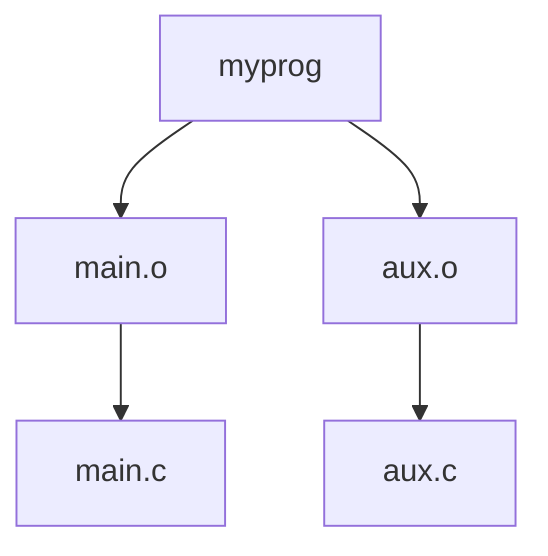

15
# 开发工具

Linux 深受程序员喜爱，不仅因为它提供了海量的工具和环境，更因为系统文档详尽、透明度极高。在 Linux 机器上，即便你不是程序员，也能利用开发工具——这倒是件好事，因为它们在 Linux 系统管理中所扮演的角色远比其他操作系统中的工具更重要。至少，你应该能识别出开发工具，并知道如何运行它们。

> [!INFO] 页码与章节
> 本章将大量信息浓缩在有限篇幅内，但你不必掌握全部内容。示例都非常简单；你无需懂得如何编写代码也能跟上。你也可以轻松略读，之后再来回顾。关于共享库的讨论很可能是你最需要了解的内容，但为了理解共享库的来源，你首先要了解一些构建程序的基础知识。

---

## 15.1 C 编译器

掌握 C 语言编译器的使用，能让你深入了解 Linux 系统上所见程序的来源。大多数 Linux 工具和许多应用程序都是用 C 或 C++ 编写的。本章主要使用 C 语言示例，但你可以将这些知识迁移到 C++ 上。

C 程序遵循传统开发流程：编写程序 → 编译 → 运行。也就是说，当你编写好 C 程序代码并想运行它时，必须将人类可读的代码编译成计算机处理器能理解的二进制低级形式。你编写的代码称为**源代码**，它可以包含多个文件。这与我们稍后要讨论的脚本语言不同——脚本语言无需编译。

> [!TIP] 默认未安装编译工具  
> 大多数发行版默认不包含编译 C 代码所需的工具。如果你找不到这里介绍的一些工具，可安装 Debian/Ubuntu 的 `build-essential` 包，或 Fedora/CentOS 的 `"Development Tools"` yum groupinstall。若仍不行，请尝试搜索 `"gcc"` 或 `"C compiler"` 包。

大多数 Unix 系统上的 C 编译器可执行文件是 GNU C 编译器 `gcc`（常以传统名称 `cc` 引用），不过来自 LLVM 项目的新版 `clang` 编译器也越来越受欢迎。C 源代码文件以 `.c` 结尾。看一下这个自包含的单一 C 源代码文件 `hello.c`，它来自 Brian W. Kernighan 和 Dennis M. Ritchie 所著的《C 程序设计语言》第二版（Prentice Hall, 1988）：

```c
#include <stdio.h>
int main() {
    printf("Hello, World.\n");
}
```

将此源代码保存为文件 `hello.c`，然后用以下命令运行编译器：

```bash
$ cc hello.c
```

结果是名为 `a.out` 的可执行文件，你可以像系统上其他可执行文件一样运行它。不过，你可能更想给可执行文件起个别的名字（比如 `hello`）。为此，使用编译器的 `-o` 选项：

```bash
$ cc -o hello hello.c
```

对于小型程序，编译基本上只有这么多步骤。你可能需要添加额外的库或包含目录，但我们先来看看稍大一些的程序，然后再讨论这些主题。

### 15.1.1 编译多个源文件

大多数 C 程序太大，无法合理地放入单个源代码文件中。庞大的文件会让程序员难以管理，编译器有时甚至难以处理大文件。因此，开发者通常将源代码拆分为多个组成部分，每个部分放在自己的文件中。

编译大多数 `.c` 文件时，你不会立即生成可执行文件。相反，使用编译器的 `-c` 选项处理每个文件，创建包含二进制目标代码的**目标文件**，这些目标代码最终会进入最终的可执行文件。为了说明这一点，假设你有两个文件：`main.c`（启动程序）和 `aux.c`（执行实际工作），内容如下：

`main.c`:
```c
void hello_call();
int main() {
    hello_call();
}
```

`aux.c`:
```c
#include <stdio.h>
void hello_call() {
    printf("Hello, World.\n");
}
```

以下两个编译器命令完成了构建程序的大部分工作：创建目标文件。

```bash
$ cc -c main.c
$ cc -c aux.c
```

这些命令执行完毕后，你会得到两个目标文件：`main.o` 和 `aux.o`。

目标文件是一种二进制文件，处理器几乎能理解它，但仍有几个未解决的问题。首先，操作系统不知道如何启动一个目标文件；其次，你可能需要将多个目标文件和某些系统库组合起来才能构成一个完整的程序。

要从一个或多个目标文件构建出一个功能完整的可执行程序，必须运行**链接器**——Unix 中的 `ld` 命令。不过，程序员很少直接在命令行上使用 `ld`，因为 C 编译器知道如何运行链接器程序。要从这两个目标文件创建名为 `myprog` 的可执行文件，请运行以下命令进行链接：

```bash
$ cc -o myprog main.o aux.o
```

> [!NOTE] 编译管理  
> 虽然你可以用单独的命令编译每个源文件，但前面的示例已经暗示，在编译过程中很难跟踪所有这些文件；随着源文件数量的增加，这一挑战会变得更加严峻。第 15.2 节描述的 make 系统是传统 Unix 下管理和自动化编译的标准。在处理接下来两节中描述的文件时，你将看到 make 这类系统的重要性。

现在将注意力转回文件 `aux.c`。如前所述，它的代码执行程序的实际工作，并且可能有许多像其生成的目标文件 `aux.o` 这样的文件对于构建程序是必需的。现在想象一下，其他程序可能也能利用我们编写的这些例程。我们能重用这些目标文件吗？这就是我们接下来要讨论的。

### 15.1.2 与库链接

单独运行编译器处理源代码通常不会生成足够的目标代码来创建一个有用的可执行程序。你需要**库**来构建完整的程序。C 库是一组常见的预编译组件集合，你可以将它们构建到你的程序中；它实际上不过是一堆目标文件的捆绑（再加上一些头文件，我们将在 15.1.4 节讨论）。例如，有一个标准数学库，许多可执行文件都从中获取三角函数等功能。

库主要是在链接时发挥作用，此时链接器程序（`ld`）从目标文件创建可执行文件。使用库进行链接通常称为**链接到库**。这正是你最容易遇到问题的地方。例如，如果你的程序使用了 `curses` 库，但你忘记告诉编译器链接该库，你会看到类似这样的链接器错误：

```
badobject.o(.text+0x28): undefined reference to 'initscr'
```

这些错误消息最重要的部分已用**粗体**标出。当链接器程序检查 `badobject.o` 目标文件时，它找不到用粗体标出的函数，因此无法创建可执行文件。在这种情况下，你可能会怀疑忘记了 `curses` 库，因为缺失的函数是 `initscr()`；如果你在网上搜索这个函数名，几乎总能找到该库的手册页或其他参考资料。

> [!NOTE] 未定义引用  
> 未定义的引用并不总是意味着你缺少一个库。程序的某个目标文件可能缺失在链接命令中。通常很容易区分库函数和你目标文件中的函数，因为你很可能认识自己编写的函数，或者至少能搜索到它们。

要解决这个问题，你首先必须找到 `curses` 库，然后使用编译器的 `-l` 选项来链接该库。库遍布系统各处，但大多数库位于名为 `lib` 的子目录中（`/usr/lib` 是系统默认位置）。对于前面的示例，基本的 curses 库文件是 `libcurses.a`，因此库名就是 `curses`。综合起来，你可以像这样链接程序：

```bash
$ cc -o badobject badobject.o -lcurses
```

你必须告诉链接器非标准库的位置；用于此目的的参数是 `-L`。假设 `badobject` 程序需要 `/usr/junk/lib` 中的 `libcrud.a`。要编译并创建可执行文件，使用如下命令：

```bash
$ cc -o badobject badobject.o -lcurses -L/usr/junk/lib -lcrud
```

> [!TIP] 查看库内容  
> 如果你想在库中搜索某个特定函数，可以使用 `nm` 命令并加上 `--defined-only` 符号过滤器。要做好看到大量输出的准备。例如，试试：`nm --defined-only libcurses.a`。在许多发行版上，你也可以使用 `less` 命令查看库的内容。（你可能需要使用 `locate` 命令来找到 `libcurses.a`；许多发行版现在将库放在 `/usr/lib` 下的体系结构特定子目录中，例如 `/usr/lib/x86_64-linux-gnu/`。）

你的系统上有一个库叫做**C 标准库**，它包含被认为是 C 编程语言一部分的基本组件。其基本文件是 `libc.a`。当你编译程序时，这个库总是被包含在内，除非你特意排除它。你系统上的大多数程序都使用共享版本，下面我们就来讨论共享库是如何工作的。

# 第15章：开发工具

## 15.1.3 使用共享库

以`.a`结尾的库文件（例如`libcurses.a`）称为**静态库**。当你将程序与静态库链接时，链接器会将必要的机器码从库文件复制到你的可执行文件中。完成后，最终的可执行文件在运行时不再需要原始库文件，并且由于可执行文件拥有自己的库代码副本，其行为不会因`.a`文件的更改而改变。

然而，库的大小以及所使用的库数量都在不断增加，这使得静态库在磁盘空间和内存方面变得浪费。此外，如果后来发现静态库存在不足或安全漏洞，除非找到并重新编译每个可执行文件，否则无法更改已与之链接的可执行文件。

共享库解决了这些问题。将程序与共享库链接不会将代码复制到最终的可执行文件中；它只是在库文件的代码中添加对名称的引用。当运行程序时，系统仅在必要时将库的代码加载到进程内存空间中。许多进程可以在内存中共享同一共享库代码。而且，如果需要稍微修改库代码，通常无需重新编译任何程序即可完成。在更新Linux发行版上的软件时，你正在更新的软件包可能包含共享库。当更新管理器要求你重启机器时，有时是为了确保系统的每个部分都使用新版本的共享库。

共享库也有其代价：管理困难且链接过程有些复杂。但是，如果你了解以下四点，就能掌控共享库：

- 如何列出可执行文件所需的共享库
- 可执行文件如何查找共享库
- 如何将程序与共享库链接
- 如何避免常见的共享库陷阱

以下各节将介绍如何使用和维护系统的共享库。如果你对共享库的工作原理感兴趣，或者想了解一般的链接器，可以查阅 John R. Levine 的《链接器和加载器》（Linkers and Loaders，Morgan Kaufmann，1999），David M. Beazley、Brian D. Ward 和 Ian R. Cooke 的《共享库和动态加载的内幕》（The Inside Story on Shared Libraries and Dynamic Loading，Computing in Science & Engineering，2001年9/10月），或者在线资源如《程序库 HOWTO》（https://bit.ly/3q3MbS6）。`ld.so(8)`手册页也值得一读。

### 如何列出共享库依赖关系

共享库文件通常与静态库位于相同的位置。Linux系统上的两个标准库目录是`/lib`和`/usr/lib`，不过系统上可能还散布着更多目录。`/lib`目录不应包含静态库。

共享库的后缀包含`.so`（共享对象），例如`libc-2.15.so`和`libc.so.6`。要查看程序使用了哪些共享库，运行 `ldd prog`，其中`prog`是可执行文件名。以下是shell的示例：

```bash
$ ldd /bin/bash
    linux-vdso.so.1 (0x00007ffff31cc000)
    libgtk3-nocsd.so.0 => /usr/lib/x86_64-linux-gnu/libgtk3-nocsd.so.0 (0x00007f72bf3a4000)
    libtinfo.so.5 => /lib/x86_64-linux-gnu/libtinfo.so.5 (0x00007f72bf17a000)
    libdl.so.2 => /lib/x86_64-linux-gnu/libdl.so.2 (0x00007f72bef76000)
    libc.so.6 => /lib/x86_64-linux-gnu/libc.so.6 (0x00007f72beb85000)
    libpthread.so.0 => /lib/x86_64-linux-gnu/libpthread.so.0 (0x00007f72be966000)
    /lib64/ld-linux-x86-64.so.2 (0x00007f72bf8c5000)
```

为了追求最佳性能和灵活性，可执行文件通常不直接知道其共享库的位置；它们只知道库的名称，或许还有一点关于查找位置的提示。一个名为 `ld.so` 的小程序（运行时动态链接器/加载器）在运行时为程序查找并加载共享库。上述 `ldd` 输出中，`=>` 左侧显示的是库名称——这就是可执行文件所知道的信息；`=>` 右侧显示的是 `ld.so` 找到该库的位置。

输出的最后一行显示了 `ld.so` 的实际位置：`/lib/ld-linux.so.2`。

### ld.so 如何查找共享库

共享库的一个常见问题是动态链接器无法找到某个库。通常，动态链接器首先会查找可执行文件的预配置运行时库搜索路径（rpath），如果存在的话。稍后你将看到如何创建此路径。

接下来，动态链接器会查找系统缓存 `/etc/ld.so.cache`，以确认库是否位于标准位置。这是一个快速缓存，包含缓存配置文件 `/etc/ld.so.conf` 中所列目录下的库文件名。

> [!NOTE]
> 正如你所见过的许多 Linux 配置文件一样，`ld.so.conf` 可能进一步包含来自某个目录（如 `/etc/ld.so.conf.d`）的多个文件。

`ld.so.conf`（或其包含的文件）中的每一行都是一个你想包含到缓存中的目录名称。目录列表通常很短，类似这样：

```
/lib/i686-linux-gnu
/usr/lib/i686-linux-gnu
```

标准库目录 `/lib` 和 `/usr/lib` 是隐含的，这意味着你无需将它们包含在 `/etc/ld.so.conf` 中。

如果你修改了 `ld.so.conf` 或对某个共享库目录做了更改，则必须手动使用以下命令重建 `/etc/ld.so.cache`：

```bash
# ldconfig -v
```

`-v` 选项提供关于 `ldconfig` 添加到缓存的库以及它检测到的任何更改的详细信息。

`ld.so` 还有一个查找共享库的位置：环境变量 `LD_LIBRARY_PATH`。我们稍后会讨论这一点。

不要养成向 `/etc/ld.so.conf` 添加内容的习惯。你应该清楚系统缓存中存在哪些共享库，如果将每个奇怪的小共享库目录都放入缓存，可能会引发冲突和系统极度混乱。当你编译需要某个不常用库路径的软件时，请为你的可执行文件提供一个内置的运行时库搜索路径。接下来我们看看如何做到这一点。

### 如何将程序与共享库链接

假设你有一个名为 `libweird.so.1` 的共享库，位于 `/opt/obscure/lib` 中，需要将其与 `myprog` 链接。你不应该将这个奇怪的路径添加到 `/etc/ld.so.conf` 中，因此你需要将该路径传递给链接器。按如下方式链接程序：

```bash
$ cc -o myprog myprog.o -Wl,-rpath=/opt/obscure/lib -L/opt/obscure/lib -lweird
```

`-Wl,-rpath` 选项告诉链接器将指定目录包含到可执行文件的运行时库搜索路径中。然而，即使你使用了 `-Wl,-rpath`，你仍然需要 `-L` 标志。

如果你需要更改现有二进制的运行时库搜索路径，可以使用 `patchelf` 程序，但通常最好在编译时进行。（ELF，可执行与可链接格式，是 Linux 系统上可执行文件和库使用的标准格式。）

### 如何避免共享库问题

共享库提供了极大的灵活性，更不用说一些非常巧妙的 hack 了，但你也可以滥用它们，使系统变得一团糟。可能发生三种特别糟糕的情况：

- 缺少库
- 性能极差
- 库版本不匹配

所有共享库问题的头号原因是环境变量 `LD_LIBRARY_PATH`。将此变量设置为冒号分隔的目录名集合，会使 `ld.so` 在查找共享库时首先搜索这些目录。这是一种廉价的解决方案，可以在移动库后使程序继续工作（当你没有程序源代码且无法使用 `patchelf` 时，或者你只是懒得重新编译可执行文件时）。但不幸的是，便宜没好货。

**切勿**在 shell 启动文件或编译软件时设置 `LD_LIBRARY_PATH`。当动态运行时链接器遇到此变量时，它通常必须多次搜索每个指定目录的全部内容，次数远超出你的想象。这会导致严重的性能下降，但更重要的是，由于运行时链接器会为每个程序查找这些目录，你可能会遇到冲突和库版本不匹配的问题。

如果必须使用 `LD_LIBRARY_PATH` 来运行某个你没有源代码的糟糕程序（或者你不想重新编译的应用程序，如 Firefox 或其他大块头），请使用包装脚本。假设你的可执行文件是 `/opt/crummy/bin/crummy.bin`，并且需要 `/opt/crummy/lib` 中的某些共享库。编写一个名为 `crummy` 的包装脚本，如下所示：

```bash
#!/bin/sh
LD_LIBRARY_PATH=/opt/crummy/lib
export LD_LIBRARY_PATH
exec /opt/crummy/bin/crummy.bin $@
```

避免使用 `LD_LIBRARY_PATH` 可以防止大多数共享库问题。但开发者偶尔还会遇到另一个重大问题：库的 API 可能从一个次要版本到另一个次要版本略有变化，从而破坏已安装的软件。最好的预防性解决方案是：要么使用一致的方法，通过 `-Wl,-rpath` 安装共享库以创建运行时链接路径；要么干脆使用不常用库的静态版本。

## 15.1.4 使用头文件（包含文件）和目录

C 头文件是额外的源代码文件，通常包含类型和库函数声明，通常针对你刚刚看到的那些库。例如，`stdio.h` 就是一个头文件（参见第 15.1 节中的简单程序）。

大量编译问题都与头文件有关。大多数此类故障发生在编译器找不到头文件和库时。甚至有情况下，程序员忘记在代码中添加 `#include` 指令来包含所需的头文件，导致某些源代码无法编译。

### 包含文件问题

追踪正确的头文件并不总是容易的。有时你运气好，可以用 `locate` 找到它们，但其他情况下，不同目录中可能存在多个同名的包含文件，并且不清楚哪个是正确的。当编译器找不到包含文件时，错误消息如下：

```
badinclude.c:1:22: fatal error: notfound.h: No such file or directory
```

此消息报告编译器找不到 `badinclude.c` 文件引用的 `notfound.h` 头文件。如果我们查看 `badinclude.c`（如错误所示在第 1 行），会发现一行类似这样的代码：

```c
#include <notfound.h>
```

像这样的包含指令并不指定头文件应该位于何处，只说明它应该位于默认位置或在编译器命令行指定的某个位置。这些位置中的大多数都有 `include` 字样。Unix 中的默认包含目录是 `/usr/include`；除非你明确告诉它不要，否则编译器总是会去那里查找。当然，如果包含文件位于默认位置，你不太可能看到前面的错误，所以让我们看看如何让编译器在其他包含目录中查找。

例如，假设你在 `/usr/junk/include` 中找到了 `notfound.h`。要告诉编译器将此目录添加到其搜索路径中，请使用 `-I` 选项：

```bash
$ cc -c -I/usr/junk/include badinclude.c
```

现在，编译器应该不会再因为 `badinclude.c` 中引用头文件的那行代码而报错了。

# 第15章：开发工具

> [!NOTE]
> 关于如何查找缺失的头文件，你将在第16章学到更多。

还应注意，有些 `#include` 使用双引号（`" "`）而不是尖括号（`< >`），例如：
```c
#include "myheader.h"
```
双引号表示头文件不在系统包含目录中，通常意味着头文件与源文件位于同一目录。如果遇到双引号问题，你很可能是在尝试编译不完整的源代码。

## C 预处理器

事实上，C 编译器本身并不负责查找这些包含文件。这项工作落在 C 预处理器身上，它是编译器在解析实际程序之前，对你的源代码运行的一个程序。预处理器将源代码重写为编译器能够理解的形式；它是一种使源代码更易读（并提供快捷方式）的工具。

源代码中的预处理器命令称为**指令**，它们以 `#` 字符开头。有三种基本类型的指令：

- **包含文件** `#include` 指令指示预处理器包含整个文件。注意，编译器的 `-I` 标志实际上是一个选项，它使预处理器在指定目录中搜索包含文件，正如你在上一节中看到的。
- **宏定义** 诸如 `#define BLAH something` 这样的行告诉预处理器将源代码中所有出现的 `BLAH` 替换为 `something`。惯例要求宏名全部大写，但程序员有时会使用看起来像函数和变量名的宏，这也不足为奇。（偶尔这会带来一大堆麻烦。许多程序员以滥用预处理器为乐。）

> [!NOTE]
> 除了在源代码中定义宏，你还可以通过向编译器传递参数来定义它们：`-DBLAH=something` 的效果与上述 `#define` 指令相同。

Development Tools   373

- **条件编译** 你可以使用 `#ifdef`、`#if` 和 `#endif` 标记出某些代码段。`#ifdef MACRO` 指令检查预处理器宏 `MACRO` 是否已定义，`#if condition` 测试 `condition` 是否为非零值。对于这两个指令，如果“if”语句后的条件为假，那么预处理器不会将 `#if` 和下一个 `#endif` 之间的任何程序文本传递给编译器。如果你打算阅读任何 C 代码，最好习惯这一点。

让我们看一个条件指令的例子。当预处理器看到以下代码时，它会检查宏 `DEBUG` 是否已定义，如果已定义，则将包含 `fprintf()` 的行传递给编译器。否则，预处理器跳过这一行，并在 `#endif` 之后继续处理文件：

```c
#ifdef DEBUG
  fprintf(stderr, "This is a debugging message.\n");
#endif
```

> [!NOTE]
> C 预处理器对 C 语法、变量、函数和其他元素一无所知。它只理解自己的宏和指令。

在 Unix 上，C 预处理器的名称是 `cpp`，但你也可以用 `gcc -E` 运行它。不过，你很少需要单独运行预处理器。

## 15.2 make

一个拥有多个源代码文件或需要特殊编译器选项的程序，手动编译起来过于繁琐。这个问题已经存在多年，传统的 Unix 编译管理工具叫做 `make`。如果你正在运行 Unix 系统，你应该对 `make` 有所了解，因为系统工具有时依赖 `make` 来运行。然而，本章只是冰山一角。关于 `make` 的整本书籍都有，例如 Robert Mecklenburg 的《Managing Projects with GNU Make》（第3版，O'Reilly, 2005）。此外，大多数 Linux 软件包是使用围绕 `make` 或类似工具的附加层构建的。有很多构建系统存在；我们将在第16章中介绍一个名为 autotools 的工具。

`make` 是一个庞大的系统，但了解其工作原理并不十分困难。当你看到一个名为 `Makefile` 或 `makefile` 的文件时，你就知道你在与 `make` 打交道。（尝试运行 `make` 看看是否能构建出什么东西。）

`make` 的基本思想是**目标**（target），即你想要达成的一个目标。目标可以是一个文件（如 `.o` 文件、可执行文件等），也可以是一个标签。此外，有些目标依赖于其他目标；例如，在链接可执行文件之前，你需要一组完整的 `.o` 文件。这些需求称为**依赖**（dependencies）。

为了构建一个目标，`make` 遵循一条**规则**（rule），例如指定如何从 `.c` 源文件生成 `.o` 目标文件的规则。`make` 已经知道几条规则，但你可以自定义它们来创建自己的规则。

374   Chapter 15

### 15.2.1 一个示例 Makefile

基于 15.1.1 节中的示例文件，下面这个非常简单的 Makefile 从 `aux.c` 和 `main.c` 构建一个名为 `myprog` 的程序：

```makefile
1 # object files
2 OBJS=aux.o main.o
3 all: 4myprog
myprog: 5$(OBJS)
        6$(CC) -o myprog $(OBJS)
```

这个 Makefile 第一行的 `#` 表示注释。  
下一行是一个宏定义，将 `OBJS` 变量设置为两个目标文件名 2。这一点后面很重要。现在，注意如何定义宏以及稍后如何引用它（`$(OBJS)`）。

Makefile 中的下一项包含了它的第一个目标 `all` 3。第一个目标总是默认目标，即当你单独在命令行上运行 `make` 时，`make` 想要构建的目标。

目标的规则跟在冒号后面。对于 `all`，这个 Makefile 表示你需要满足一个叫做 `myprog` 的东西 4。这是文件中的第一个依赖项；`all` 依赖于 `myprog`。注意，`myprog` 可以是一个实际文件，也可以是另一条规则的目标。在这个例子中，它两者都是（针对 `all` 的规则以及 `OBJS` 的目标）。

为了构建 `myprog`，这个 Makefile 在依赖项中使用宏 `$(OBJS)` 5。宏展开为 `aux.o` 和 `main.o`，表示 `myprog` 依赖于这两个文件（它们必须是实际文件，因为 Makefile 中没有以这些名称命名的目标）。

> [!NOTE]
> `$(CC)` 6 之前的空白是一个制表符（tab）。`make` 对制表符非常严格。

这个 Makefile 假设你在同一目录下有两个 C 源文件 `aux.c` 和 `main.c`。在 Makefile 上运行 `make` 会产生以下输出，显示 `make` 正在运行的命令：

```shell
$ make
cc    -c -o aux.o aux.c
cc    -c -o main.o main.c
cc -o myprog aux.o main.o
```

依赖关系图如图 15-1 所示。

### 15.2.2 内置规则

`make` 是如何知道从 `aux.c` 生成 `aux.o` 的？毕竟，`aux.c` 并不在 Makefile 中。答案是 `make` 有一些内置规则可以遵循。它知道当你想要一个 `.o` 文件时，就去寻找一个 `.c` 文件，而且它知道如何在该 `.c` 文件上运行 `cc -c` 以达到创建 `.o` 文件的目标。

Development Tools   375



**图 15-1：Makefile 依赖关系**

### 15.2.3 最终程序构建

到达 `myprog` 的最后一步有点棘手，但思路足够清晰。在获得 `$(OBJS)` 中的两个目标文件后，你可以根据以下行运行 C 编译器（其中 `$(CC)` 展开为编译器名称）：

```makefile
        $(CC) -o myprog $(OBJS)
```

如前所述，`$(CC)` 之前的空白是一个制表符。你必须在任何系统命令之前，在其单独的行上插入一个制表符。

注意这种情况：

```
Makefile:7: *** missing separator.  Stop.
```

这样的错误意味着 Makefile 已损坏。制表符就是分隔符，如果没有分隔符或存在其他干扰，你会看到这个错误。

### 15.2.4 依赖更新

最后一个关于 `make` 的基本概念是：通常，目标是使目标文件与其依赖项保持最新。此外，它被设计为只采取必要的最小步骤来做到这一点，这可以节省大量时间。如果对前面的示例连续输入两次 `make`，第一次命令构建了 `myprog`，但第二次会产生以下输出：

```
make: Nothing to be done for 'all'.
```

376   Chapter 15

第二次运行时，`make` 查看了它的规则，发现 `myprog` 已经存在，因此它没有再次构建 `myprog`，因为自上次构建以来，所有依赖项都没有改变。要实验这一点，请执行以下操作：

1. 运行 `touch aux.c`。
2. 再次运行 `make`。这一次，`make` 确定 `aux.c` 比目录中已有的 `aux.o` 更新，因此它重新编译了 `aux.o`。
3. `myprog` 依赖于 `aux.o`，现在 `aux.o` 比已有的 `myprog` 更新，因此 `make` 必须再次创建 `myprog`。

这种连锁反应非常典型。

### 15.2.5 命令行参数和选项

如果你了解 `make` 的命令行参数和选项的工作原理，你可以从 `make` 中获得大量好处。

最有用的选项之一是在命令行上指定单个目标。对于前面的 Makefile，如果你只想要 `aux.o` 文件，可以运行 `make aux.o`。

你也可以在命令行上定义一个宏。例如，要使用 clang 编译器，请尝试：

```shell
$ make CC=clang
```

这里，`make` 使用你定义的 `CC` 而不是其默认的编译器 `cc`。命令行宏在测试预处理器定义和库时非常方便，尤其是配合我们稍后将讨论的 `CFLAGS` 和 `LDFLAGS` 宏使用时。

事实上，你甚至不需要 Makefile 就能运行 `make`。如果内置的 make 规则与某个目标匹配，你可以直接让 `make` 尝试创建该目标。例如，如果你有一个非常简单的程序 `blah.c` 的源代码，尝试 `make blah`。`make` 的运行过程如下：

```shell
$ make blah
cc   blah.o   -o blah
```

这种使用 `make` 的方式只适用于最基本的 C 程序；如果你的程序需要库或特殊的包含目录，你最好编写一个 Makefile。在没有 Makefile 的情况下运行 `make`，实际上在处理 Fortran、Lex 或 Yacc 等工具并且你不知道编译器或工具如何使用的时候最有用。为什么不试着让 `make` 为你弄清楚呢？即使 `make` 未能创建目标，它很可能仍会给你一个关于如何使用该工具的相当好的提示。

两个 `make` 选项尤为突出：

- `-n`  打印构建所需的命令，但阻止 `make` 实际运行任何命令
- `-f file`  告诉 `make` 从 `file` 而不是 `Makefile` 或 `makefile` 中读取

Development Tools   377

# 第15章：开发工具

## 15.2.6 标准宏与变量

make 有许多特殊的宏和变量。虽然很难严格区分宏和变量，但这里用“宏”一词指代那些在 make 开始构建目标后通常不会改变的东西。

正如前面所见，你可以在 Makefile 的开头设置宏。以下是最常见的宏：

`CFLAGS`  C 编译器选项。当从 `.c` 文件生成目标代码时，make 会将其作为参数传递给编译器。

`LDFLAGS`  与 CFLAGS 类似，但这些选项用于链接器，当从目标代码生成可执行文件时使用。

`LDLIBS`  如果你使用 LDFLAGS 但不想将库名选项与搜索路径合并，请将库名选项放在这个宏中。

`CC`  C 编译器。默认值为 `cc`。

`CPPFLAGS`  C 预处理器选项。当 make 以某种方式运行 C 预处理器时，它会将此宏的展开作为参数传递。

`CXXFLAGS`  GNU make 将此用于 C++ 编译器标志。

make 变量在构建目标时会发生变化。变量以美元符号 (`$`) 开头。有多种设置变量的方法，但一些最常见的变量会在目标规则内自动设置。以下是你可能会看到的：

`$@`  在规则内部时，此变量展开为当前目标。

`$<`  在规则内部时，此变量展开为目标的第一个依赖项。

`$*`  此变量展开为当前目标的基本名称或词干。例如，如果你正在构建 `blah.o`，它将展开为 `blah`。

下面是一个常见模式的示例——一条规则使用 `myprog` 从 `.in` 文件生成 `.out` 文件：

```makefile
.SUFFIXES: .in
.in.out: $<
	
myprog $< -o $*.out
```

你会在许多 Makefile 中遇到诸如 `.c.o:` 这样的规则，它定义了运行 C 编译器以创建目标文件的自定义方式。

Linux 上最全面的 make 变量列表是 `make info` 手册。

> [!NOTE]
> 请记住，GNU make 拥有许多其他变体所没有的扩展、内置规则和功能。如果你在 Linux 上运行，这没有问题；但如果你换到 Solaris 或 BSD 机器上，并期望相同的选项能正常工作，那你可能会大吃一惊。然而，这正是多平台构建系统（如 GNU autotools）旨在解决的问题。

## 15.2.7 常规目标

大多数开发者会在其 Makefile 中添加几个与编译相关的辅助任务目标：

`clean`  `clean` 目标无处不在；`make clean` 通常指示 make 删除所有目标文件和可执行文件，以便你重新开始或打包软件。以下是 `myprog` Makefile 的一个示例规则：

```makefile
clean:
        rm -f $(OBJS) myprog
```

`distclean`  通过 GNU autotools 系统创建的 Makefile 总是包含一个 `distclean` 目标，用于删除不属于原始分发的所有内容，包括 Makefile。你将在第 16 章看到更多相关内容。极少数情况下，你可能会发现开发者选择不在此目标中删除可执行文件，而是倾向于使用类似 `realclean` 的目标。

`install`  此目标将文件和编译后的程序复制到 Makefile 认为合适的系统位置。这可能很危险，因此在实际运行任何命令之前，请始终执行 `make -n install` 以查看会发生什么。

`test` 或 `check`  一些开发者提供 `test` 或 `check` 目标，以确保在完成构建后一切正常。

`depend`  此目标通过调用带有 `-M` 选项的编译器来检查源代码，从而创建依赖关系。这是一个看起来不寻常的目标，因为它通常会修改 Makefile 本身。这种做法已不再常见，但如果你遇到指示你使用此规则的说明，请务必照做。

`all`  如前所述，这通常是 Makefile 中的第一个目标。你经常会看到对此目标的引用，而不是实际的可执行文件。

## 15.2.8 Makefile 组织

尽管存在许多不同的 Makefile 风格，但大多数程序员都遵循一些通用经验法则。例如，在 Makefile 的第一部分（宏定义内部），你应该会看到根据包分组的库和包含路径：

```makefile
MYPACKAGE_INCLUDES=-I/usr/local/include/mypackage
MYPACKAGE_LIB=-L/usr/local/lib/mypackage -lmypackage
PNG_INCLUDES=-I/usr/local/include
PNG_LIB=-L/usr/local/lib -lpng
```

每种类型的编译器和链接器标志通常会像这样得到一个宏：

```makefile
CFLAGS=$(CFLAGS) $(MYPACKAGE_INCLUDES) $(PNG_INCLUDES)
LDFLAGS=$(LDFLAGS) $(MYPACKAGE_LIB) $(PNG_LIB)
```

目标文件通常根据可执行文件进行分组。例如，假设你有一个包，它会生成名为 `boring` 和 `trite` 的可执行文件。每个可执行文件都有各自的 `.c` 源文件，并且都需要 `util.c` 中的代码。你可能会看到这样的内容：

```makefile
UTIL_OBJS=util.o
BORING_OBJS=$(UTIL_OBJS) boring.o
TRITE_OBJS=$(UTIL_OBJS) trite.o
PROGS=boring trite
```

Makefile 的其余部分可能如下所示：

```makefile
all: $(PROGS)
boring: $(BORING_OBJS)
        $(CC) -o $@ $(BORING_OBJS) $(LDFLAGS)
trite: $(TRITE_OBJS)
        $(CC) -o $@ $(TRITE_OBJS) $(LDFLAGS)
```

你可以将两个可执行目标合并为一条规则，但这通常不是一个好主意，因为你将难以将规则移动到另一个 Makefile、删除某个可执行文件或进行不同的分组。此外，依赖关系将不正确：如果你只为 `boring` 和 `trite` 设置一条规则，那么 `trite` 将依赖于 `boring.c`，`boring` 将依赖于 `trite.c`，并且每当你更改其中一个源文件时，make 总是会尝试重新构建两个程序。

> [!NOTE]
> 如果你需要为目标文件定义一条特殊规则，请将该规则放在构建可执行文件的规则之上。如果多个可执行文件使用同一个目标文件，请将该目标规则放在所有可执行规则之上。

## 15.3 Lex 和 Yacc

在编译读取配置文件或命令的程序时，你可能会遇到 [[Lex]] 和 [[Yacc]]。这些工具是编程语言的构建块。

- [[Lex]] 是一个词法分析器，可以将文本转换为带有标签的编号标记。GNU/Linux 版本名为 `flex`。你可能需要 `-ll` 或 `-lfl` 链接器标志与 Lex 配合使用。
- [[Yacc]] 是一个解析器，它尝试根据语法读取标记。GNU 解析器是 `bison`；要获得 Yacc 兼容性，请运行 `bison -y`。你可能需要 `-ly` 链接器标志。

## 15.4 脚本语言

很久以前，普通的 Unix 系统管理员不必过多担心 Bourne shell 和 awk 之外的脚本语言。Shell 脚本（在第 11 章讨论过）仍然是 Unix 的重要组成部分，但 awk 在脚本领域已有所衰落。然而，已经出现了许多强大的后继者，并且许多系统程序实际上已从 C 语言转向了脚本语言（例如 `whois` 程序的明智版本）。让我们来看一些脚本基础。

关于任何脚本语言，你需要了解的第一件事是：脚本的第一行看起来像 Bourne shell 脚本的 shebang。例如，Python 脚本的开头如下：

```bash
#!/usr/bin/python
```

或者这个版本，它会运行命令路径中的第一个 Python 版本，而不是总是访问 `/usr/bin`：

```bash
#!/usr/bin/env python
```

正如你在第 11 章中看到的，以 `#!` shebang 开头的可执行文本文件就是脚本。此前缀后的路径名是脚本语言解释器的可执行文件。当 Unix 尝试运行以 `#!` 开头的可执行文件时，它会运行 `#!` 后面的程序，并将文件的其余部分作为标准输入。因此，即使下面这个也是一个脚本：

```bash
#!/usr/bin/tail -2
This program won't print this line,
but it will print this line...
and this line, too.
```

Shell 脚本的第一行通常包含一个最常见的脚本基础问题：到脚本语言解释器的路径无效。例如，假设你将前面的脚本命名为 `myscript`。如果 `tail` 在你的系统上实际上位于 `/bin` 而不是 `/usr/bin`，那么运行 `myscript` 会产生以下错误：

```bash
bash: ./myscript: /usr/bin/tail: bad interpreter: No such file or directory
```

不要期望脚本第一行中的多个参数能够正常工作。也就是说，前面示例中的 `-2` 可能有效，但如果你添加另一个参数，系统可能会将 `-2` 和新参数视为一个大的参数（包括空格在内）。这可能因系统而异；不要在如此微不足道的事情上测试你的耐心。

现在，让我们来看几个常见的脚本语言。

### 15.4.1 Python

[[Python]] 是一种脚本语言，拥有强大的追随者和一系列强大功能，例如文本处理、数据库访问、网络和多线程。它拥有强大的交互模式和一个非常有组织的对象模型。

Python 的可执行文件是 `python`，通常位于 `/usr/bin`。然而，Python 不仅用于命令行的脚本。它几乎出现在从数据分析到 Web 应用程序的每个领域。*Python Distilled*（David M. Beazley 著，Addison-Wesley，2021 年）是一个很好的入门资料。

### 15.4.2 Perl

[[Perl]] 是较老的三方 Unix 脚本语言之一。它是编程工具中的“瑞士军刀”。尽管近年来 Perl 已经失去了相当一部分市场份额给 Python，但它在文本处理、转换和文件操作方面尤其出色，你可能会发现许多使用 Perl 构建的工具。*Learning Perl*, 第7版（Randal L. Schwartz、brian d foy 和 Tom Phoenix 著，O'Reilly，2016 年）是一本教程式的入门书；更大的参考书是 *Modern Perl*, 第4版（chromatic 著，Onyx Neon Press，2016 年）。

### 15.4.3 其他脚本语言

你还可能遇到以下脚本语言：

**PHP**  这是一种超文本处理语言，通常用于动态 Web 脚本。有些人将 PHP 用于独立的脚本。PHP 网站位于 `http://www.php.net/`。

**Ruby**  面向对象狂热者和许多 Web 开发者喜欢用这种语言编程（`http://www.ruby-lang.org/`）。

**JavaScript**  这种语言主要用于 Web 浏览器内部来操作动态内容。大多数有经验的程序员回避将其作为独立的脚本语言，因为它有很多缺陷，但在进行 Web 编程时几乎无法避免使用它。近年来，一种名为 Node.js 的实现已在服务器端编程和脚本中变得更加流行；其可执行文件名为 `node`。

**Emacs Lisp**  这是 Emacs 文本编辑器使用的 Lisp 编程语言的一个变种。

**MATLAB、Octave**  MATLAB 是一种商业矩阵和数学编程语言及库。Octave 是一个非常类似的自由软件项目。

**R**  这是一种流行的自由统计分析语言。更多信息请参见 `http://www.r-project.org/` 以及 *The Art of R Programming*（Norman Matloff 著，No Starch Press，2011 年）。

**Mathematica**  这是另一种带有库的商业数学编程语言。

**m4**  这是一种宏处理语言，通常只能在 GNU autotools 中找到。

**Tcl**  Tcl（工具命令语言）是一种简单的脚本语言，通常与 Tk 图形用户界面工具包和自动化工具 Expect 相关联。尽管 Tcl 不再像以前那样被广泛使用，但不要低估它的能力。许多资深开发者偏爱 Tk，尤其是其嵌入式能力。更多信息请参见 `http://www.tcl.tk/`。

## 15.5 Java

Java 是一种类似 C 的编译型语言，语法更简洁，并对面向对象编程提供了强大的支持。它在 Unix 系统中有一些特定的应用领域。例如，它常被用作 Web 应用环境，并且在一些专用应用中很流行。Android 应用通常用 Java 编写。尽管它在典型的 Linux 桌面环境中不常见，但你仍应了解 Java 的工作方式，至少对于独立应用而言。

有两种 Java 编译器：**原生编译器**（用于生成针对你系统的机器码，类似于 C 编译器）和**字节码编译器**（供字节码解释器使用，该解释器有时被称为虚拟机，这与第 17 章所述由 hypervisor 提供的虚拟机不同）。在 Linux 上，你几乎总是遇到字节码。Java 字节码文件以 `.class` 结尾。**Java 运行时环境（JRE）** 包含了运行 Java 字节码所需的所有程序。要运行一个字节码文件，请使用：

```bash
$ java file.class
```

你也可能遇到以 `.jar` 结尾的字节码文件，这些文件是归档后的 `.class` 文件集合。要运行一个 `.jar` 文件，请使用以下语法：

```bash
$ java -jar file.jar
```

有时你需要设置 `JAVA_HOME` 环境变量为你的 Java 安装前缀。如果运气不好，你可能还需要设置 `CLASSPATH` 来包含程序所依赖的类所在的目录。`CLASSPATH` 是一个以冒号分隔的目录集合，类似于可执行文件的常规 `PATH` 变量。

如果你需要将 `.java` 文件编译成字节码，你需要 **Java 开发工具包（JDK）**。你可以从 JDK 运行 `javac` 编译器来创建一些 `.class` 文件：

```bash
$ javac file.java
```

JDK 还附带 `jar` 程序，它可以创建和拆解 `.jar` 文件。它的工作方式类似于 `tar`。

## 15.6 展望：编译包

编译器和脚本语言的世界广阔且不断扩展。截至本书撰写时，像 Go（golang）和 Rust 这样的新型编译语言在应用和系统编程中越来越受欢迎。**LLVM 编译器基础设施项目**（http://llvm.org/）极大地简化了编译器的开发。如果你对如何设计和实现编译器感兴趣，两本好书分别是：Alfred V. Aho 等人所著的《Compilers: Principles, Techniques, and Tools》（第 2 版，Addison-Wesley，2006 年）以及 Dick Grune 等人所著的《Modern Compiler Design》（第 2 版，Springer，2012 年）。对于脚本语言的开发，最好查找在线资源，因为实现方式差异很大。

现在你已经了解了系统上编程工具的基础知识，已经准备好看看它们能做什么。下一章将全部关于如何从源代码在 Linux 上构建包。

---

> [!INFO] 图像说明
> 本页（第 389 页）包含以下图像占位符：
> - [Image 2327 on Page 389]
> - [Image 2321 on Page 389]
> - [Image 2325 on Page 389]
> - [Image 2317 on Page 389]
> - [Image 2323 on Page 389]
> - [Image 2316 on Page 389]
> - [Image 2320 on Page 389]
> - [Image 2315 on Page 389]
> - [Image 2319 on Page 389]
> （这些图像未在原始文本中提供具体描述，因此仅保留占位符。）